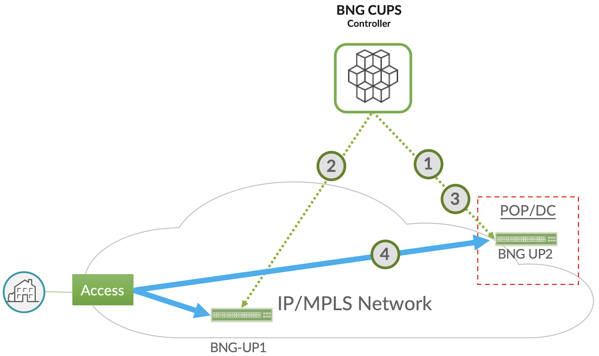

# Juniper BNG CUPS  Hitless User Plane Maintenance

**Horia Miclea - 05/21/2024**

A Juniper BNG CUPS use-case that enables hitless maintenance for the user planes based on Broadband Forum TR-459 Issue 2. It improves the subscriber experience and optimizes the service provide operations by removing maintenance downtimes.

## Introduction

As the long-time global leader in BNG technology, Juniper Networks is leading the industry in bringing new broadband innovations to service providers. In the past year, we've expanded and enhanced the Juniper Networks(R) [MX Series Universal Routers](https://www.juniper.net/us/en/products/routers/mx-series.html) and [ACX Series Universal Metro Routers](https://www.juniper.net/us/en/products/routers/acx-series.html) to enable a more distributed IP/MPLS Access Network and the distribution of service edges closer to the subscriber.

The Juniper BNG CUPS solution is the next step in delivering both cloud agility and economics to service providers. Juniper BNG CUPS is among the industry's first architectures to bring the disaggregation vision defined in the Broadband Forum (BBF) TR-459 standard to real-world networks. In fact, Juniper played a leading role in developing the standard and is heavily involved in initiatives with BBF and others to define tomorrow's more disaggregated, converged, and cloudified CSP networks.

Through these efforts, Juniper is helping service providers around the world enable more flexible, intelligent broadband architectures. With solutions like Juniper BNG CUPS, CSPs can meet customers' ever-growing demands for capacity and performance, while transforming their network economics.

## Juniper BNG CUPS Service Use Cases

What can you do with a more flexible, disaggregated BNG architecture? Quite a lot. Having all subscriber state information natively maintained in a centralized SDB makes a huge difference. In a traditional BNG architecture, each platform only has knowledge of the local subscribers anchored to that platform, making it very difficult to support network engineering and maintenance functions in an open, interoperable way.

With state information for all subscribers accessible centrally, the cloud-hosted controller can manage a range of downstream user planes of various types and capabilities. And the possibilities for more cloudlike, centrally controlled traffic management and network optimization are practically limitless. To start, you can choose from among the five innovative Juniper BNG CUPS use cases detailed below.


### 1. Smart Subscriber Load Sharing

In traditional broadband networks, user planes act as siloed entities. If you want to distribute BNG user planes, you're always at risk of running out of capacity, which means you typically must overprovision. With the centralized control enabled by Juniper BNG CUPS, you can group user planes together and treat them as a shared pool of resources.

In this model, you group together user planes that will be part of the virtual resource pool. The controller then proactively monitors their subscriber or bandwidth loads. If a user plane exceeds a given threshold, the controller begins shifting sessions to a less-loaded user plane.

The result, you no longer must worry about accurately forecasting or overprovisioning subscriber scale for a given market. Instead, you can share user planes as needed and continually maximize all available resources in the infrastructure.

Read more details in this post gathering both Smart LB and HA: [https://juniper.github.io/techposts/juniper-bng-cups-smart-load-balancing-with-ha/article](https://juniper.github.io/techposts/juniper-bng-cups-smart-load-balancing-with-ha/article)

### 2. Centralized Address Pool Management

IPv4 addresses have become a precious resource. If you don't have enough available, subscribers can't access the network. Yet purchasing new addresses has become enormously expensive, if you can get them at all. You would think CSPs would do everything in their power to stretch IP address pools as far as possible. Unfortunately, traditional networks make this very hard to do. CSPs typically must allocate addresses to each BNG node, based on little more than an educated guess of what that node will need. Since BNG nodes function in silos, they can't easily share unused addresses either.

Juniper makes it possible to manage IP address pools as a shared resource, and automatically allocate IP addresses to a subscriber on any user plane across the network. With the cloud-native Address Pool Manager, CSPs can:

- Improve operational efficiency by automatically adding IP addresses when needed: APM delegates IP address pools across all integrated BNG and CUPS Controller entities in the network, as required, on a need basis. If a control plane crosses a predefined utilization threshold, the CUPS controller raises an apportionment alarm to APM that automatically provides a new address pool. You get the IP address resources you need, where and when you need them, without having to manage address pools manually or build and maintain homegrown tools.
- Lower costs by maximizing IP address utilization: CUPS Controllers automatically release the unused address pools and APM can re-allocate them as required. In a traditional network, those unused (and expensive) addresses would sit idle. APM automatically reclaims and redistributes them across the network where needed, optimizing operational costs for public IPv4 address management.

Read more in this article: [https://juniper.github.io/techposts/juniper-bng-cups-address-pool-management/article](https://juniper.github.io/techposts/juniper-bng-cups-address-pool-management/article)

### 3. Hitless User Plane Maintenance

In traditional vertically integrated networks, most maintenance tasks, changing line cards, updating software, and more, require a scheduled maintenance window. Since you're bringing down the node and all subscribers attached to it, you always risk disrupting services, and frustrating subscribers. Additionally, since maintenance windows are typically scheduled late at night, you pay higher overtime costs for that maintenance. A centralized control plane and shared state information make planned maintenance much simpler and less disruptive.  The process is straightforward:

- Technicians use the centralized control plane to transfer all subscriber state information from the current user plane to a new one.
- They configure the transport network to send traffic to the new user plane instead of the old.
- Since the new user plane already has state information for all subscribers, it exists in a "hot standby state" and quickly brings up those sessions without service disruption.
- Technicians perform the maintenance and, once complete, reverse the process and orchestrate traffic back to the original user plane.

The whole procedure can be handled in a streamlined, low-risk way during normal business hours, with subscribers never noticing a thing. This means you can continually update your network more easily and inexpensively, while improving customer satisfaction and supporting more stringent, and profitable, SLAs.

This use-case is covering in the present article.

### 4. BNG User Plane Redundancy

In this use case, Juniper BNG CUPS enables the same kind of hitless failover as in planned maintenance, but for unplanned failures. You define redundancy groups among user planes, identifying one or more backups that will activate if the primary fails. The cloud-hosted controller then pre-stages those platforms and, depending on the redundancy option used, continually programs backup user planes with the relevant state information. In the event a primary user plane fails, the controller automatically activates the pre-staged backup and re-routes traffic accordingly.

You'll be able to choose from two redundancy options, depending on the level of disruption tolerable for a given service or service level agreement (SLA):

- **Hot standby:** The controller continually programs session state information on the backup user planes, enabling hitless failover that's practically undetectable to users.
- **Warm oversubscribed standby:** The Backup user-plane holds full subscriber state on the Routing-Engine (RE), full state on the line card but only partial state- (or forwarding state)- is programmed on the Packet Forwarding Engine/ASIC (PFE).
- Whether to have **Hot or Warm Oversubscribed standby** subscriber sessions while in the Backup state can be set on a subscriber group (SGRP) basis.

Read more details in this post gathering both Smart LB and HA: [https://juniper.github.io/techposts/juniper-bng-cups-smart-load-balancing-with-ha/article](https://juniper.github.io/techposts/juniper-bng-cups-smart-load-balancing-with-ha/article)

### 5. Flexible Service Steering

An exciting standards-based use case currently under development is the concept of service steering  ([see BBF WT-474](https://www.broadband-forum.org/bbf-wt-474-subscriber-session-steering-demo)). This standard will give CSPs even more flexibility in architecting their networks by allowing the BNG control plane to steer subscriber sessions from one user plane to another.

Imagine, for example, that you have distributed user planes out at central offices (COs) or metro locations supporting Internet-only traffic, while more advanced platforms deeper in the network support more sophisticated services, such as deep packet inspection (DPI) or URL filtering. The distributed BNGs can act as generic gateways for most subscribers coming in from that location. But now, the controller can automatically direct subscribers requiring more advanced services to more advanced user planes.

With this intelligence, you can apply more sophisticated services to subscribers anywhere, without having to deploy more advanced and expensive user planes wherever you want to offer those services. And you can program custom traffic flows for specific services, SLAs, and even individual enterprise customers. Effectively, you bring the concept of network slicing to your broadband architecture.

BBF WT-474 is still in development and likely won't be fully productized for a while.

Other blogs cover the other use cases, please refer to the references.

## Hitless User Plane Maintenance Use Case

BNG CUPS and BBF TR-459 introduce a new maintenance (hardware and software) approach for BNG user planes, by enabling a seamless protection for the target user plane with no impact to the subscribers' traffic, hence improving network operations and subscriber experience. The use case relies on the user plane redundancy enabled by the BNG CUPS controller, but instead of a failure trigger this time it assumes an operational procedure in the BNG CUPS controller and the same for repair. It can be applied to any session model (DHCP IPoE dual stack (IPv4/IPv6), PPPoE dual stack and LNS), and assumes an access transport based on PWE3/EVPN VPWS active/standby or Ethernet with Access Node controlled active/standby uplinks to the user planes.

Figure below illustrates the Hitless User Plane Maintenance use case, detailing an example of a service provider performing in-service maintenance on a distributed user plane (BNG-UP1), without disrupting live subscriber sessions.



**1.** In preparation for performing maintenance, network engineers use the BNG CUPS controller to program an alternate user plane (BNG-UP2) with subscriber state information from BNG-UP1.

**2.** The BNG CUPS Controller activates BNG-UP2.

**3. **The network operators enable the access network to start forwarding traffic from Access PE to BNG-UP2 and the core network in similar way.

**4.** BNG-UP2 is now preprogrammed with the subscriber state information from BNG-UP1 as Hot Standby user plane, and as subscriber traffic arrives on BNG-UP2, BNG-UP2 is now forwarding this subscriber traffic. Once maintenance is complete, the technicians perform the same workflow in reverse to revert traffic back to BNG-UP1.

The detailed maintenance operation steps and associated commands are:

**1.** Create Backup for user plane BNG-UP1 on user-plane BNG-UP2. At this step we first associate the Active UP BNG-UP1 ports w/ the Backup UP BNG-UP2 port and synchronize the ports, existing subscribers, and address domain state from the Active user-plane BNG-UP1 to backup user-plane BNG-UP2. After the successful execution of this step, subscribers that are on BNG-UP1 are now also programmed on Backup BNG-UP2's logical ports together with the address domain (prefixes, tags, routing-instances, etc., have also been programmed on BNG-UP2).

```
request user-plane maintenance associate serviced-user-plane <BNG-UP1> serviced-port <port1> backup-user-plane <BNG-UP2> backup-port <port2>
```

**2.** Operator to Setup network to route traffic to the chosen Backup (User-plane BNG-UP2). This step is provider and operator specific, and the actions taken at this step vary greatly with the various access and core network topologies they deploy.  For example, at this step the operator could setup the core network for attracting subscriber traffic to the Backup user-plane by setting the routing policy to import these prefixes. It also expected that at this step the operator is done setting up the access-network for the Backup user-plane.

**3. **Make Backup user-plane BNG-UP2 Active. By now subscribers have been programmed on BNG-UP2 user-plane as it is ready to take over. This step executes the switchover from user-plane BNG-UP1 to user-plane BNG-UP2. When this step is done, user-plane BNG-UP2 is the Active user-plane and user-plane BNG-UP1 is the Backup.

```
request user-plane maintenance switchover serviced-user-plane <BNG-UP2>
```

**4.** Perform maintenance on BNG-UP1 user plane. At this step the operator performs the maintenance itself. This could be servicing of a line card, software upgrades, or other activities.

**5.**Restore subscribers on BNG-UP1 as Backup. At this step we automatically synchronize the ports, subscribers, and domain state from the Active user-plane BNG-UP to Backup user-plane BNG-UP1. Please note that at this steps, BNG-UP1 is expected to be back online.

One way the user could verify this is the case is by checking BNG-UP1 Node Association state on the BNG CUPS Controller using the "show health user-plane" command.

**6.** Clean up Backup user-plane BNG-UP2. At this step ports and subscribers on user-plane BNG-UP2 are being cleaned up. At the end of this step user-plane BNG-UP2 is in the same state as before Step 1.

```
request user-plane maintenance disassociate serviced-user-plane <BNG-UP1> backup-user-plane "BNG-UP2
request user-plane maintenance complete serviced-user-plane <BNG-UP1>
```

## References

### Industry References

- [Global Market Data Forecast by ITU](https://www.researchgate.net/figure/Global-mobile-data-traffic-forecast-by-ITU-Overall-mobile-data-traffic-is-estimated-to_fig1_331159423)
- [Point Topic Global Broadband Subscribers in Q3 2023](https://www.point-topic.com/post/global-broadband-subscribers-q3-2023)
- [LightReading article on Broadband Forum BNG CUPS work ](https://www.lightreading.com/regulatory-politics/broadband-forum-unveils-bng-disaggregation-project)
- [BNG CUPS Introduction and Motivations (BBF Marketing Report)](https://www.broadband-forum.org/pdfs/mr-459-1-0-0.pdf)
- [Improving Service Resiliency with Disaggregated BNG (BBF Marketing Report)](https://www.broadband-forum.org/pdfs/mr-459.2-1-0-0.pdf)

### Juniper and ACG Networks References:

- [Juniper BNG CUPS Architecture](https://juniper.github.io/techposts/juniper-bng-cups-architecture/article)
- [Juniper BNG CUPS Documentation](https://www.juniper.net/documentation/product/us/en/juniper-bng-cups/)
- [Juniper Address Pool Manager Documentation](https://www.juniper.net/documentation/product/us/en/address-pool-manager-apm/)
- [ACG -- Juniper TCO Benefit for Distributed Broadband with CUPS](https://juniper.highspot.com/items/63b607f251d3ea6ca3d4bb63)
- [Juniper MX series routers](https://www.juniper.net/us/en/products/routers/mx-series.html)
- [Juniper ACX 7100 and 7300 series routers](https://www.juniper.net/us/en/products/routers/acx-series.html)

## Glossary

- AAA: Authentication, Authorization, and Accounting
- APM: Address Pool Manager
- BBF (TR): BroadBand Forum (Technical Report)
- BNG:  Broadband Network Gateway
- CUPS: Control and User Plane Separation
- CSP: Content Service Provider
- DHCP: Dynamic Host Configuration Protocol
- DPI: Deep Packet Inspection
- PFCP: Packet Forwarding Control protocol
- PFE: Packet Forwarding Engine
- PMO: Present Mode of Operation
- PoP: Point of Presence
- PPPoE PTA: Point-to-Point Protocol over Ethernet / PPP Termination and Aggregation
- QoE: Quality of Experience
- QoS: Quality of Service / HQoS (Hierarchical QoS)
- RADIUS: Remote Authentication Dial-In User Service
- RE: Routing Engine
- SDB: Session DataBase
- SGRP: Subscriber Group Redundancy Pools
- SLA: Service Level Agreement

## Acknowledgements

Many thanks to my peer PLMs, Paul Lachapelle, Sandeep Patel and Pankaj Gupta for their guidance, support, and review and to the engineering leads John Zeigler and Cristina Radulescu-Banu for making these use cases reality.
