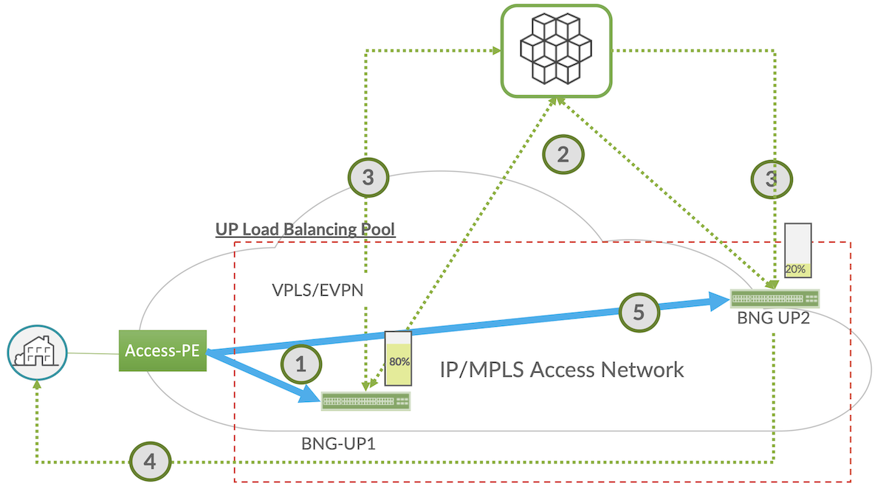
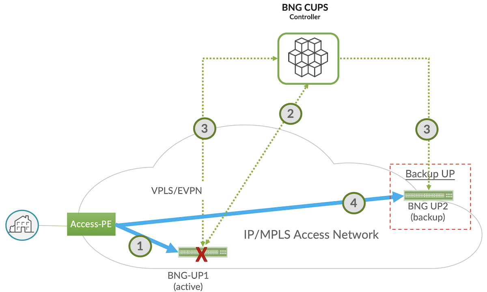
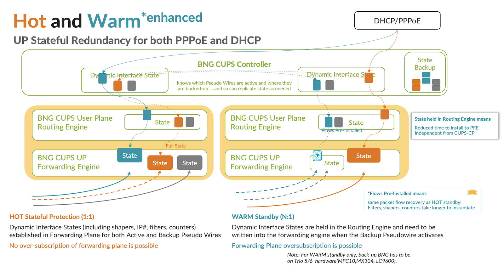
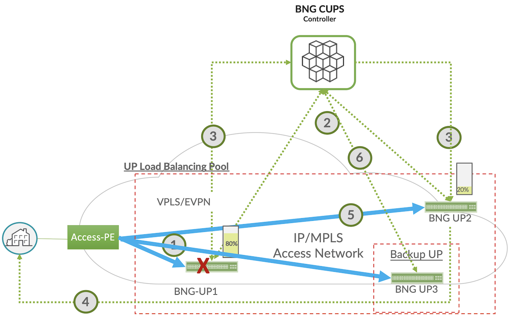

# Juniper BNG CUPS  Smart Load Balancing with High Availability

**Horia Miclea - 05/27/2024**

A Juniper BNG CUPS use-case that combines Smart Subscriber Load Balancing and High Availability Hot or Warm Standby across a group of User Planes based on Broadband Forum TR-459 Issue 2. With this innovation, you reduce costs and complexity by treating multiple user planes as a shared resource pool that are smartly load balanced while having a backup user plane fully programmed to take over in case of user plane or network failures.

## Introduction

As the long-time global leader in BNG technology, Juniper Networks is leading the industry in bringing new broadband innovations to service providers. In the past year, we've expanded and enhanced the Juniper Networks(R) [MX Series Universal Routers](https://www.juniper.net/us/en/products/routers/mx-series.html) and [ACX Series Universal Metro Routers](https://www.juniper.net/us/en/products/routers/acx-series.html) to enable a more distributed IP/MPLS Access Network and the distribution of service edges closer to the subscriber.

The Juniper BNG CUPS solution is the next step in delivering both cloud agility and economics to service providers. Juniper BNG CUPS is among the industry's first architectures to bring the disaggregation vision defined in the Broadband Forum (BBF) TR-459 standard to real-world networks. In fact, Juniper played a leading role in developing the standard and is heavily involved in initiatives with BBF and others to define tomorrow's more disaggregated, converged, and cloudified CSP networks.

Through these efforts, Juniper is helping service providers around the world enable more flexible, intelligent broadband architectures. With solutions like Juniper BNG CUPS, CSPs can meet customers' ever-growing demands for capacity and performance, while transforming their network economics.

## Juniper BNG CUPS Service Use Cases

What can you do with a more flexible, disaggregated BNG architecture? Quite a lot. Having all subscriber state information natively maintained in a centralized SDB makes a huge difference. In a traditional BNG architecture, each platform only has knowledge of the local subscribers anchored to that platform, making it very difficult to support network engineering and maintenance functions in an open, interoperable way.

With state information for all subscribers accessible centrally, the cloud-hosted controller can manage a range of downstream user planes of various types and capabilities. And the possibilities for more cloudlike, centrally controlled traffic management and network optimization are practically limitless. To start, you can choose from among the five innovative Juniper BNG CUPS use cases detailed below.


### 1. Smart Subscriber Load Sharing

In traditional broadband networks, user planes act as siloed entities. If you want to distribute BNG user planes, you're always at risk of running out of capacity, which means you typically must overprovision. With the centralized control enabled by Juniper BNG CUPS, you can group user planes together and treat them as a shared pool of resources.

In this model, you group together user planes that will be part of the virtual resource pool. The controller then proactively monitors their subscriber or bandwidth loads. If a user plane exceeds a given threshold, the controller begins shifting sessions to a less-loaded user plane.

The result, you no longer must worry about accurately forecasting or overprovisioning subscriber scale for a given market. Instead, you can share user planes as needed and continually maximize all available resources in the infrastructure.

The current article gathers both Smart LB and HA use-cases.

### 2. Centralized Address Pool Management

IPv4 addresses have become a precious resource. If you don't have enough available, subscribers can't access the network. Yet purchasing new addresses has become enormously expensive, if you can get them at all. You would think CSPs would do everything in their power to stretch IP address pools as far as possible. Unfortunately, traditional networks make this very hard to do. CSPs typically must allocate addresses to each BNG node, based on little more than an educated guess of what that node will need. Since BNG nodes function in silos, they can't easily share unused addresses either.

Juniper makes it possible to manage IP address pools as a shared resource, and automatically allocate IP addresses to a subscriber on any user plane across the network. With the cloud-native Address Pool Manager, CSPs can:

- Improve operational efficiency by automatically adding IP addresses when needed: APM delegates IP address pools across all integrated BNG and CUPS Controller entities in the network, as required, on a need basis. If a control plane crosses a predefined utilization threshold, the CUPS controller raises an apportionment alarm to APM that automatically provides a new address pool. You get the IP address resources you need, where and when you need them, without having to manage address pools manually or build and maintain homegrown tools.
- Lower costs by maximizing IP address utilization: CUPS Controllers automatically release the unused address pools and APM can re-allocate them as required. In a traditional network, those unused (and expensive) addresses would sit idle. APM automatically reclaims and redistributes them across the network where needed, optimizing operational costs for public IPv4 address management.

Read more in this article: [https://juniper.github.io/techposts/juniper-bng-cups-address-pool-management/article](https://juniper.github.io/techposts/juniper-bng-cups-address-pool-management/article)

### 3. Hitless User Plane Maintenance

In traditional vertically integrated networks, most maintenance tasks, changing line cards, updating software, and more, require a scheduled maintenance window. Since you're bringing down the node and all subscribers attached to it, you always risk disrupting services, and frustrating subscribers. Additionally, since maintenance windows are typically scheduled late at night, you pay higher overtime costs for that maintenance. A centralized control plane and shared state information make planned maintenance much simpler and less disruptive.  The process is straightforward:

- Technicians use the centralized control plane to transfer all subscriber state information from the current user plane to a new one.
- They configure the transport network to send traffic to the new user plane instead of the old.
- Since the new user plane already has state information for all subscribers, it exists in a "hot standby state" and quickly brings up those sessions without service disruption.
- Technicians perform the maintenance and, once complete, reverse the process and orchestrate traffic back to the original user plane.

The whole procedure can be handled in a streamlined, low-risk way during normal business hours, with subscribers never noticing a thing. This means you can continually update your network more easily and inexpensively, while improving customer satisfaction and supporting more stringent, and profitable, SLAs.

You can find more details in this techpost:[https://juniper.github.io/techposts/juniper-bng-cups-hitless-user-plane-maintenance/article](https://juniper.github.io/techposts/juniper-bng-cups-hitless-user-plane-maintenance/article)

### 4. BNG User Plane Redundancy

In this use case, Juniper BNG CUPS enables the same kind of hitless failover as in planned maintenance, but for unplanned failures. You define redundancy groups among user planes, identifying one or more backups that will activate if the primary fails. The cloud-hosted controller then pre-stages those platforms and, depending on the redundancy option used, continually programs backup user planes with the relevant state information. In the event a primary user plane fails, the controller automatically activates the pre-staged backup and re-routes traffic accordingly.

You'll be able to choose from two redundancy options, depending on the level of disruption tolerable for a given service or service level agreement (SLA):

- **Hot standby:** The controller continually programs session state information on the backup user planes, enabling hitless failover that's practically undetectable to users.
- **Warm oversubscribed standby:** The Backup user-plane holds full subscriber state on the Routing-Engine (RE), full state on the line card but only partial state- (or forwarding state)- is programmed on the Packet Forwarding Engine/ASIC (PFE).
- Whether to have **Hot or Warm Oversubscribed standby** subscriber sessions while in the Backup state can be set on a subscriber group (SGRP) basis.

This post gathers both Smart LB and HA use-cases.

### 5. Flexible Service Steering

An exciting standards-based use case currently under development is the concept of service steering  ([see BBF WT-474](https://www.broadband-forum.org/bbf-wt-474-subscriber-session-steering-demo)). This standard will give CSPs even more flexibility in architecting their networks by allowing the BNG control plane to steer subscriber sessions from one user plane to another.

Imagine, for example, that you have distributed user planes out at central offices (COs) or metro locations supporting Internet-only traffic, while more advanced platforms deeper in the network support more sophisticated services, such as deep packet inspection (DPI) or URL filtering. The distributed BNGs can act as generic gateways for most subscribers coming in from that location. But now, the controller can automatically direct subscribers requiring more advanced services to more advanced user planes.

With this intelligence, you can apply more sophisticated services to subscribers anywhere, without having to deploy more advanced and expensive user planes wherever you want to offer those services. And you can program custom traffic flows for specific services, SLAs, and even individual enterprise customers. Effectively, you bring the concept of network slicing to your broadband architecture.

BBF WT-474 is still in development and likely won't be fully productized for a while.

Other blogs cover the other use cases, please refer to the references.

## Smart Subscriber Load Balancing Use Case

BNG CUPS and BBF TR459 introduce a new programmable session load balancing model that can take in account the session load in user planes and the throughput capacity used. It can be applied across different type of user planes, for any type of session access model (DHCP IPoE and PPPoE, single stack or double stack) and is controlled via the CUPS controller. It assumes an Ethernet bridged access to the User Planes, or an alternative like VPLS or EVPN, while it requires that the same residential gateway's first sign of life packet can be received by multiple BNG User Planes. First sign of life packets can be either DHCP Discover or PPPoE Active Discovery Initiation (PADI) packets.

Figure below illustrates the subscriber load balancing use case and details how the cloud-native controller implements it.



**1.** The subscriber session connects to the broadband access network. Both user planes in the shared BNG pool (BNG-UP1 and BNG-UP2) receive the broadcasted first sign of life request and forward to the BNG CUPS Controller

**2.** The BNG CUPS controller receives the first sign of life requests from both user planes. Noting that UP1 is currently loaded at 80%, the controller selects the less loaded user plane in the pool, in this case, BNG-UP2.

**3.** The controller replies to BNG-UP2, signaling it as anchor user plane for the subscriber.

**4.** BNG-UP2 forwards this reply to the subscriber's residential gateway.

**5.** The subscriber's traffic now flows via BNG-UP2.

The BNG CUPS Session Load Balancing model is based on the following two mutually exclusive criteria:

- BNG User Plane reported load. The load balancing at the BNG CUPS Controller is based on a live BNG UP reported load as a percentage.
- Weight in the dynamic-profile configured in the BNG CUPS Controller which can be IFL-set weight or subscriber weight.

The BNG User Plane Reported Load Balancing Model assumes the following:

- Uses Logical-Port PFCP Information Element or IE (as described in the TR-459 technical report).
- Dependent on the BNG User Plane sending Packet Forwarding Control Protocol (PFCP) logical port usage reports to the BNG CUPS Controller.
- Done in-line in the control packet I/O processing by allowing or denying the first sign of life packet when comparing the BNG UP logical port candidates and choosing the one with less usage (least percentage utilization). The logical port utilization for the logical port candidates is stored in the load balancing database.

For each user-plane, "**subscribers-limit**" should be configured for each line card's PIC and it should be set to the specific line card PFE maximum limit as the maximum limit varies per line card PFE type. The subscribers-limit per PFE is being used by resource-monitoring to enforce resource consumption and thresholds on the PFE at different CPS (Calls Per Second) rates.

Here is a configuration example for enabling the BNG User Plane Reported Load Balancing  Model, We assume 3 user plane nodes, named "boston", "nashua" and " manchester":

```
[edit groups bbe-bng-director bng-controller]
load-balancing-groups {
   lb-report-group {
       report-based-mode {
           port up:boston:xe-5/0/5:1;
           port up:nashua-c:xe-0/1/2;
           port up:manchester:xe-1/3/1;
       }
   }
}
```

The weight in the BNG CUPS controller dynamic profile assumes the following:

- Dependent on operator needs, can be subscriber bandwidth, IFL-set bandwidth, or number of subscribers.
- Compares the configured logical port maximum weight to computed weight.
- Computed weight is dynamic, it:
- Increases when each weighted item (subscriber or IFL-set) is being instantiated.
- Decreases when each weighted item (subscriber or IFL-set) is being de-instantiated.
- Compares the logical port configured maximum weight to allow or deny a subscriber on this logical port.
- Works with Hierarchical class of service (HCoS) or it works independently.
- Part of the dynamic profile instantiation. Weight-based load balancing has a tolerance of one element above the maximum weight configured.

When load balancing weight is configured the BNG UP logical port reported load is ignored. Here is a configuration example for enabling the weight-based load balancing model. We assume 3 use plane nodes, same as in the previous example :

```
[edit groups bbe-bng-director bng-controller]
load-balancing-groups {
   lb-weight-group {
       weight-based-mode {
           port up:boston:xe-5/0/5:1 {
               max-weight 10;
           }
           port up:nashua:xe-0/1/2 {
               max-weight 20;
           }
           port up:manchester:xe-1/3/1 {
               max-weight 30;
           }
       }
   }
}       
```

We recommend the BNG user planes pool used for load balancing to be limited to 4 nodes, otherwise oversubscription on the backup may protect too slow. Higher sized pools are possible, if required. The use case is available with JUNOS 23.4R2.

## User Plane Redundancy Use Case

BNG CUPS and BBF TR459 defines and standardizes a new session resiliency model that can be hot standby or warm oversubscribed standby and be applied to all session access models like PPPoE, IPoE and LNS, and across user planes regardless of their type or placement in the network, as long capacity in backup allows it. In the current release, the failure protection across UPs is hot standby and the failure detection is based on the Access Network, hence PWE3 or EVPN VPWS PWHT (pseudowire headend) active/standby or Ethernet/Aggregated Ethernet (LAG per BNG UP) with Access Node controlled active/standby across the BNG UPs. Future releases will add support for warm oversubscribed standby protection and for CUPS Controller based failure detection, hence access models where BNG UPs are Ethernet bridge connected.

The figure below illustrates the subscriber high availability use case and details how the cloud-native controller implements it.



**1.** The subscriber CPE connects to the broadband access network. The active user plane (BNG-UP1) receives the broadcasted DHCP Discover, PPPoE PADI requests and forwards it via the SCi/PFCP interface to the BNG CUPS Controller.

**2.** The BNG CUPS controller receives the session discover request, performs authentication with the RADIUS server, eventually secures a new IP address pool from APM if required, allocates an IP for the session and logs in the subscriber while applying the services defined.

**3.** The BNG CUPS controller programs the subscriber state to the BNG-UP1.  Since BNG-UP1 is the active UP for the subscriber group it will actively process the subscriber traffic.

**4.** The BNG CUPS controller at the same time programs the subscriber state into BNG-UP2.  Since BNG-UP2 is the backup UP, it will not forward any data packets for this subscriber.  BNG-UP2 is ready to take over in case BNG-UP1 fails.

**5.** When BNG-UP1 fails the Access Network connection changes (in the example active standby PWE3/EVPN VPWS change) BNG-UP2 that it is now the active UP. The BNG-UP1 becomes now the backup user plane.  BNG-UP2 will then take over the data forwarding role for the subscribers. The switchover between UPs is synchronized in the BNG CUPS Controller.

BNG-UP2 can run in either a hot or warm oversubscribed standby modes. When running in hot standby modes the subscriber is fully programmed on the backup user plane's forwarding hardware.  It is 100% ready to take over the forwarding role if it becomes necessary.  When running on warm oversubscribed mode the subscriber is programed in the user plane's routing engine.  Its services are not yet programmed in the data plane, but its forwarding is.  Upon a switchover request to become the active user plane, the subscriber traffic will flow immediately, and services installed afterwards.  This allows for the user plane to be oversubscribed while maintaining full subscriber high availability with minimal down time.  The Warm Enhanced models becomes available with JUNOS 24.2R1.



There are new CLI commands in the BNG CUPS controller to enable these redundancy models, summarized below. There are also two different types of SGRPs (Subscriber redundancy Group Pools): User-Plane managed SGRP (or Track Logical Port SGRP per BBF TR-459) and Control-Plane Managed SGRP (or SGRP Type A/B per BBF TR-459).

To configure an SGRP with BNG-UP2 as backup for BNG-UP1, the following example configuration can be used. In the configuration below, SGRP UP-Red is a user-plane managed SGRP - which means that the switchover between user planes is triggered by the access interface failures in the user planes. This is known as Track-Logical-Port in the TR 459. The relevant interfaces on the user planes must be configured in the BNG CUPS controller in a Subscriber Redundancy Group which also defines the type of redundancy model, hot or warm oversubscribed. In the CLI example below, user plane named "sculptor" is warm oversubscribed backup for primary node named "scutum".

```
[edit groups bbe-bng-director bng-controller]
subscriber-groups {
   UP-Red {
     virtual-mac aa:01:01:01:01:01;
     user-plane-managed-mode {
        redundancy-interface GAMMA {
             logical-ports up:sculptor:xe-1/1/0,up:scutum:ge-4/3/0;
        }
     }
     user-plane sculptor {
         backup-mode warm;
     }
     user-plane scutum {
         backup-mode hot;
     }
  }
}
```

## Smart Subscriber Load Balancing and User Plane Redundancy Combined Use Case

This innovative solution for combining the two use cases follows the same steps for the two use cases with no additional configuration. In addition to the baseline load balancing pool, we assume an additional user plane for the user plane protection be that hot standby or warm oversubscribed standby. There is no additional configuration required, hence simplicity in operations. This use case becomes available with JUNOS 24.4R1 release.

In the figure below, BNG-UP3 will be running in hot or warm oversubscribed backup mode and will be the backup user plane for both BNG-UP1 and BNG-UP 2.  Upon a failure of either BNG-UP1 or BNG-UP2, BNG-UP3 will take over the failed user planes forwarding role. Smart load balancing happens as normal in the initial pool (BNG-UP1 and BNG-UP2) or the protection pool (BNG-UP2 for example assuming BNG-UP1 failed and BNG-UP3 protects in step 6).



A combined CLI configuration example showing both redundancy and load balancing is provided below, with user planes, "up1-mx-a", "up2-mx-a"  and ""up3-mx-b". The report based load balancing is enabled between "up1-mx-a" and "up2-mx-a" while each have "up3-mx-b" as warm oversubscribed backup node, hence a subscriber redundancy group for each user plane pair:

```
subscriber-groups {
 SGRP1_CP {
    virtual-mac aa:bb:cc:11:22:33;
    control-plane-managed-mode {
        preferred-user-plane-name up1-mx-a;
        redundancy-interface RG1 {
            logical-ports up:up1-mx-a:ae0,up:up3-mx-b:ae0;
        }
    }
    user-plane up3-mx-b {
        backup-mode warm;
    }
    user-plane up1-mx-a {
        backup-mode hot;
    }
  }
  SGRP2_CP {
    virtual-mac aa:bb:cc:44:55:66;
    control-plane-managed-mode {
        preferred-user-plane-name up2-mx-a;
        redundancy-interface RG1 {
            logical-ports up:up2-mx-a:ae1,up:up3-mx-b:ae1;
        }
    }
    user-plane up3-mx-b {
        backup-mode warm;
    }
    user-plane up2-mx-a {
        backup-mode hot;
    }
  }
}
load-balancing-groups {
    LB_report {
        report-based-mode {
            port up:up1-mx-a:ae0;
            port up:up2-mx-a:ae1;
        }
    }
}
```

Please see below an example of show commands that describe the subscriber redundancy groups and the active standby states for all nodes.

```
root@cpi-falcon> show subscriber-group 
Name                ID      SGRP Mode      SGRP State   User Plane      User Plane    Active UP
SGRP1_CP         4       Control Plane   healthy          up3-mx-b       up1-mx-a       up1-mx-a      
SGRP2_CP         5       Control Plane   healthy          up3-mx-b       up2-mx-a       up2-mx-a      

root@cpi-falcon> show subscriber-group SGRP1_CP 
Name: SGRP1_CP
ID: 4
User-Plane: up1-mx-a (active) (hot)
User-Plane: up3-mx-b (backup) (warm)
Health status: healthy
Mode: Control Plane
VMAC: AA:BB:CC:11:22:33
Logical port mapping:
  BB device   Name        Logical-port            Sessions   Logical-port            Sessions
  bb0.5           RG1          up:up1-mx-a:ae0    8000        up:up3-mx-b:ae0    8000      
Address domains:
  Name                                              Prefixes    User-Plane       Programmed    User-Plane      Programmed
  apm_pool1:SGRP1_CP:default     33              up1-mx-a         33                      up3-mx-b       33         

root@cpi-falcon> show subscriber-group SGRP2_CP    
Name: SGRP2_CP
ID: 5
User-Plane: up2-mx-a (active) (hot)
User-Plane: up3-mx-b (backup) (warm)
Health status: healthy
Mode: Control Plane
VMAC: AA:BB:CC:44:55:66
Logical port mapping:
  BB device   Name        Logical-port          Sessions   Logical-port            Sessions
  bb0.6          RG1           up:up2-mx-a:ae1    8000       up:up3-mx-b:ae1    8000      
Address domains:
  Name                                             Prefixes    User-Plane       Programmed    User-Plane       Programmed
  apm_pool1:SGRP2_CP:default    33             up2-mx-a         33                      up3-mx-b         33 
```

Please see below an example of the load-balancing output, is a default state with no traffic. With traffic, being report based load balancing, the loads will adapt based on computed weights and CPU loads:

```
root@cpi-falcon> show load-balancing-group group LB_report 
Logical-Port              % Usage     CPU Exceeded       Computed weight     Max weight
up:up1-mx-a:ae0           100           no                            0                                  0           
up:up2-mx-a:ae1             0           no                            0                                  0           
```

## References

### Industry References

- [Global Market Data Forecast by ITU](https://www.researchgate.net/figure/Global-mobile-data-traffic-forecast-by-ITU-Overall-mobile-data-traffic-is-estimated-to_fig1_331159423)
- [Point Topic Global Broadband Subscribers in Q3 2023](https://www.point-topic.com/post/global-broadband-subscribers-q3-2023)
- [LightReading article on Broadband Forum BNG CUPS work ](https://www.lightreading.com/regulatory-politics/broadband-forum-unveils-bng-disaggregation-project)
- [BNG CUPS Introduction and Motivations (BBF Marketing Report)](https://www.broadband-forum.org/pdfs/mr-459-1-0-0.pdf)
- [Improving Service Resiliency with Disaggregated BNG (BBF Marketing Report)](https://www.broadband-forum.org/pdfs/mr-459.2-1-0-0.pdf)

### Juniper and ACG Networks References:

- [Juniper BNG CUPS Architecture](https://juniper.github.io/techposts/juniper-bng-cups-architecture/article)
- [Juniper BNG CUPS Documentation](https://www.juniper.net/documentation/product/us/en/juniper-bng-cups/)
- [Juniper BNG CUPS Hitless User Plane Maintenance](https://juniper.github.io/techposts/juniper-bng-cups-hitless-user-plane-maintenance/article)
- Juniper BNG CUPS Address Pool Management (coming soon)
- [Juniper Address Pool Manager Documentation](https://www.juniper.net/documentation/product/us/en/address-pool-manager-apm/)
- [ACG -- Juniper TCO Benefit for Distributed Broadband with CUPS](https://juniper.highspot.com/items/63b607f251d3ea6ca3d4bb63)
- [Juniper MX series routers](https://www.juniper.net/us/en/products/routers/mx-series.html)
- [Juniper ACX 7100 and 7300 series routers](https://www.juniper.net/us/en/products/routers/acx-series.html)

## Glossary

- AAA: Authentication, Authorization, and Accounting
- APM: Address Pool Manager
- BBF (TR): BroadBand Forum (Technical Report)
- BNG:  Broadband Network Gateway
- CUPS: Control and User Plane Separation
- CSP: Content Service Provider
- DHCP: Dynamic Host Configuration Protocol
- DPI: Deep Packet Inspection
- PFCP: Packet Forwarding Control protocol
- PFE: Packet Forwarding Engine
- PMO: Present Mode of Operation
- PoP: Point of Presence
- PPPoE PTA: Point-to-Point Protocol over Ethernet / PPP Termination and Aggregation
- QoE: Quality of Experience
- QoS: Quality of Service / HQoS (Hierarchical QoS)
- RADIUS: Remote Authentication Dial-In User Service
- RE: Routing Engine
- SDB: Session DataBase
- SGRP: Subscriber Group Redundancy Pools
- SLA: Service Level Agreement

## Acknowledgements

Many thanks to my peer PLMs, Paul Lachapelle, Sandeep Patel and Pankaj Gupta for their guidance, support, and review and to the engineering leads John Zeigler and Cristina Radulescu-Banu for making these use cases reality.
