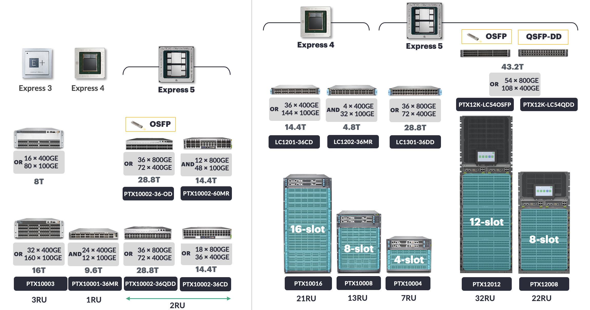

# Juniper PTX Routers in Front-End Network

**Kashif Nawaz - 03/02/2026**

## Introduction

[In the previous article](https://juniper.github.io/techposts/overlay-networking-in-ai-era/article), we reviewed the evolution of overlay networks in the AI era, assessing how DPU-based architectures are reinventing the network infrastructure for AI cluster frontend traffic. We covered the journey from kernel networking to DPU/ SmartNIC-based overlay tunnels between host and gateway node.

This publication looks at the implementation of an **Overlay Tunnel Gateway Solution based on Juniper PTX Series** routers. Although various overlay tunnelling technologies are available e.g. IP over IP, MPLS over GRE, MPLS over UDP, VxLAN (EVPN Type-5) and latest addition is SRv6, but in this blog we will focus on VxLAN (EVPN Type-5) overlay tunnels.

We will cover different design approaches for large-scale front-end fabric for providing connectivity to thousands of DPU nodes, and we will also cover multi-tenancy and integration of management fabric and front fabrics.

[Next article](https://juniper.github.io/techposts/dci-edge-for-ai-front-end-clusters-part3/article) will cover North-South and East-West connectivity, firewall integration, redundancy, and DCI over MPLS/RSVP-TE.

## Why PTX Routers for Tunnel Aggregation

Overlay tunnels from DPUs to network gateway can terminate:

- at super spine layer (5-stage Clos)
- at spine layer in (3-stage Clos architectures),
- or it can be a separate border node (without super spine or spine role).

In this blog, we are using the super-spine / spine layer for tunnel termination, and the same device will be used for Data Center Interconnect (DCI) and for controlled public accessibility. We will discuss the reasoning behind this design choice further down the road.

```
+===============================================================================+
|                    MULTI-TENANT TUNNEL GATEWAY ARCHITECTURE                   |
+===============================================================================+

+-------------------+      +===============================+      +===========================+
|    TENANT-1       |      |                               |      |                           |
|  +===+ +===+ +===+|======|                               |======|   Tunnel Gateway          |
|  | # | | # | | # ||--+   |        IP Fabric              |      |                           |
|  +===+ +===+ +===+|  |   |                               |      |  +---------------------+  |
|  DPU-1 DPU-2 DPU-3|  |   |   Overlay Tunnels travel      |      |  | VRF-1 [T5]          |  |===> DCI
+-------------------+  |   |        through Fabric         |      |  +---------------------+  |
                       |   |                               |----->|                           |
+-------------------+  +-->|                               |      |  +---------------------+  |
|    TENANT-2       |  |   |                               |      |  | VRF-2 [T5]          |  |===> Internet
|  +===+ +===+ +===+|==+===|                               |======|  +---------------------+  |
|  | # | | # | | # ||  |   |                               |      |                           |
|  +===+ +===+ +===+|  |   |                               |      |  +---------------------+  |
|  DPU-4 DPU-5 DPU-6|--+   |                               |      |  | VRF-3 [T5]          |  |===> Public
+-------------------+      |                               |      |  +---------------------+  |     Cloud
                       |   |                               |      |                           |
+-------------------+  |   |                               |      |                           |
|    TENANT-3       |  |   |                               |      |                           |
|  +===+ +===+ +===+|==+===|                               |======|                           |
|  | # | | # | | # ||  |   |                               |      |                           |
|  +===+ +===+ +===+|--+   |                               |      |                           |
|  DPU-7 DPU-8 DPU-9|      +===============================+      +===========================+
+-------------------+              


+==========================================================================+
|  Legend:                                                                 |
|  - == : VXLAN Overlay Tunnels passing THROUGH IP Fabric                  |
|  - --> : Control Plane (eBGP EVPN) connections TO Fabric                 |
|  - IP Fabric: Transport network (Spine + ToR) carrying overlay tunnels   |
|  - Gateway VRFs connect to external: DCI, Internet, Public Cloud         |
+==========================================================================+
```

The Juniper PTX Series routers, based on Juniper Express-4 and Express-5 silicon, support tunnel aggregator functionality.

Available in a variety of fixed and modular chassis, these platforms can deliver exceptionally high packet processing rates ([billions of packets](https://hc34.hotchips.org/assets/program/conference/day2/Network%20and%20Switches/HC2022.Juniper.ChangHong_Wu.v03.pdf) per second) with ultra-low latency and deep buffer to absorb microbursts. The high port density combined with [low power consumption](https://juniper.github.io/techposts/express-5-overview/article) per port makes these routers a perfect choice for power-conscious data centers environments.

With tunnel termination capacity at scale, the PTX Series supports the AI Front-End Network use case where DPU hosted workloads require isolation via overlay networking while maintaining high performance and low latency packet processing demand.

Other features such as line-rate MACsec and native coherent optics support across all interfaces provide secure long-haul connectivity without the need for external transponders. Combined with carrier-grade routing features (bandwidth management and congestion avoidance), make PTX Series Routers an ideal choice for DCI edge roles as well.

Thus, a single PTX Router provides dual functions of tunnel aggregator and DCI edge devices, eliminating the need for separate network devices to perform distinct functions and yielding substantial reductions in capital and operational costs.

HPE Networking has recently announced Juniper PTX12000: 8 and 12 slots modular chassis offering 432x and 648x 800GE ports respectively. Like their predecessors, newly added models also fit well for low latency Front End tunnel aggregation and DCI edge Roles but with much higher port density. [More details about PTX120008 can be found in the blog post](https://juniper.github.io/techposts/introducing-ptx12000-chassis/article).



**

## High-Level Architecture Overview

Before we dive into the implementation details, let's outline the core architecture concepts that this design is based on.

Unpacking these elements will help us avoid getting lost as we explore scaling, BGP, and operational stuff later in the article.

## EVPN Type-5 for IP Prefix Advertisement

The architecture relies on EVPN Type-5 routes (IPv4/IPv6) propagation and uses VXLAN tunnels for forwarding plane. EVPN Type-5 routes carry along VNI and Route Target which are used to ensure isolation between different tenants at tunnel gateways and software routers running at DPUs. If a reader needs to know EVPN Type-5 implementation details in Junos/Evo, then please visit these two links:

- [EVPN Type-5 Routing over VXLAN Tunnels](https://www.juniper.net/documentation/us/en/software/cloud-native-router23.3/cloud-native-router-user/topics/concept/l3-evpn-type5-routing-over-vxlan-tunnels.html)
- [EVPN Route Type-5](https://www.juniper.net/documentation/us/en/software/junos/evpn/topics/concept/evpn-route-type5-understanding.html)

## Next Hop Based Dynamic Tunnel

Various routing / switching platforms from Juniper portfolio supports next-hop-based dynamic tunnels. This feature allows overlay networking over IP transport networks, and various types of overlay encapsulation are supported, e.g. (IP over IP, MPLS over UDP and VxLAN etc).

```
+===============================================================================+
|                     NEXT-HOP BASED DYNAMIC TUNNEL                             |
+===============================================================================+

    +----+    +----+           +-------------+           +----+    +----+
    | CE1|----| PE1|-----------|             |-----------| PE2|----| CE2|
    +----+    +--+-+           |  IP Fabric  |           +--+-+    +----+
                 |             |             |              |
                 |             +-------------+              |
                 |          iBGP/Multihop eBGP              |
                 |                                          |
                 +------------------------------------------+

                    -----Next-hop dynamic tunnel from PE1 to PE2---->

                    <----Next-hop dynamic tunnel from PE2 to PE1-----
```

## Tunnel Composite Next Hop

*The following text only deals with Juniper PTX series routers (based on express-4/5 chipset) running Junos EVO. Other platforms from Juniper portfolio may or may not match this description.*

Once the protocol next-hop (PNH) of a remote prefix is resolved, then Routing Protocols Damon (RPD) creates tunnel composite nexthop (TCNH) with forwarding nexthop from inet.0 (default) routing table. TCNH is chained to Indirect Next-Hop (INH). INH is then further mapped to forwarding next-hop (FNH) using inet.0 routing table. Describing various next-hop types is not in the scope of this document, however [more information can be found in this blog post.](https://juniper.github.io/techposts/mastering-bgp-pic-on-junos/article)

```
+===============================================================================+
|                 TUNNEL COMPOSITE NEXT-HOP CHAIN DIAGRAM                       |
+===============================================================================+

+-------+
| Route |----+
+-------+    |
             |
+-------+    |    +---------------------------------+
| Route |----+--->|  Tunnel Composite Next-hop      |
+-------+    |    |                                 |
             |    |  [tunnel-attr; dest, src,       |
+-------+    |    |   encap string]                 |
| Route |----+    |                                 |
+-------+         +------------+--------------------+
                               |
                               |
                               v
                  +--------------------------------+
                  |   Indirect Next-hop            |
                  |                                |
                  |   (remote tunnel destination)  |
                  |                                |
                  +------------+-------------------+
                               |
                               |
                               v
                  +--------------------------------+
                  |   Forwarding Next-hop          |
                  |                                |
                  |   outgoing interface and       |
                  |   address                      |
                  +--------------------------------+

+===============================================================================+
|  NEXT-HOP CHAIN EXPLANATION:                                                  |
+===============================================================================+
|                                                                               |
|  1. Route Lookup                                                              |
|     - Multiple routes point to the same composite next-hop                    |
|     - Efficient next-hop sharing across routes                                |
|                                                                               |
|  2. Tunnel Composite Next-hop                                                 |
|     - Contains tunnel attributes (encapsulation type)                         |
|     - Specifies destination and source VTEP addresses                         |
|     - Holds encapsulation string (VXLAN header info)                          |
|                                                                               |
|  3. Indirect Next-hop                                                         |
|     - Points to remote tunnel destination (VTEP)                              |
|     - Resolved via underlay routing table (inet.0/inet6.0)                    |
|     - Enables dynamic tunnel endpoint resolution                              |
|                                                                               |
|  4. Forwarding Next-hop                                                       |
|     - Final outgoing interface determination                                  |
|     - Contains actual next-hop MAC/IP address                                 |
|     - Hardware-programmable forwarding state                                  |
|                                                                               |
+===============================================================================+
```

The following config is required on Juniper PTX routers running Junos EVO for dynamic tunnel creation.

```
forwarding-options {
    tunnel-termination;
}
```

In the EVPN Type-5 scenario, once a remote BGP peer (i.e. VTEP) peer sends IPv4 and IPv6 prefixes, then for each address family one TCNH is consumed. We have tested 128K VTEPs with accumulative **2.048 million** IPv4 and IPv6 (**1.024 million each**) EVPN Type-5 Prefixes. It created 256K TCNH (1 for each address family per VTEP) and over all resources consumption was acceptable.

```
DUT> show platform idmd summary TYPE5 
Idmd Server Chunk Allocation Statistics:

Name                           Clients  ChunkSize  Total       Free        Global      Local       GlobalUsage
TYPE5                          1        100        2560        1279        1281        0           128000

DUT> > show platform pfetokend type5-tunnel-db-information | match "10|1|2" | count 
Count: 128000 lines

DUT> > show evpn ip-prefix-database | match Accepted | count 
Count: 2048000 lines
```

## The Three-Layer Design

The architecture has three separate layers, each with its own function within the architecture.

The **underlay layer** uses hop-by-hop eBGP IPv6 to connect all devices in the fabric. Underlay, eBGP uses IPv6 addresses between directly connected neighbors. These sessions are used to advertise loopback addresses. However, the underlay can use either BGP unnumbered with IPv6 link-local addresses or numbered IPv6 /127 subnets. Unnumbered is acceptable as long as all devices support link-local addresses. The purpose of the underlay is to provide loopback addresses with reachability between VTEPs.

**The overlay** BGP (EVPN signaling) sessions are used to exchange EVPN Type-5 (IPv4/IPv6) routes. Overlay BGP sessions can be hop-by-hop eBGP, or those can be iBGP between DPUs and tunnel aggregator. If the iBGP model is selected for overlay, then Route Reflectors are mandatory for this massively scaled fabric.  Overlay BGP sessions need to be configured with a loopback address (IPv4 or IPv6) of each corresponding device.

**The data plane** uses VxLAN tunnels carrying tenant data with multi-tenancy isolation. VTEP endpoints exist only at the Tunnel Aggregator and at DPU devices. Intermediate forwarding devices (ToRs, spines) forward IP packets through the network using underlay routing but perform no VxLAN encapsulation or decapsulation.

## How Traffic Flows Through the Architecture

The understanding of the control and data plane flow reveals why this architecture delivers scalability and low latency.

The DPU sends tenant prefixes that are associated with a VNI and a Route Target via EVPN Type-5 route advertisement in the control plane. The Tunnel Aggregator uses the Route Target and imports those routes into corresponding TENANT_VRF.

On the data plane forwarding, when the Tunnel Aggregator receives a packet that is destined for a tenant prefix:

- It performs a route lookup which indicates which VNI to use and to which DPU VTEP address is the next hop.
- The Tunnel Aggregator encapsulates this packet in VxLAN header with the corresponding VNI and sends this to the DPU VTEP using underlay IPv6 routing for forwarding.
- The ToRs and Spines forward these packets based on the destination VTEP address without inspecting or modifying the encapsulation;
- the DPU decapsulates the packet based on the VNI that was specified, and forwards this to the tenant's workloads.

This architecture performs VxLAN encapsulation and decapsulation only on the edges of the network (i.e., at the Tunnel Gateway and at the DPU), resulting in low latency; there are no additional hops that need to perform these operations within the fabric.

## IPv4 Reachability over IPv6 Next-Hops

The underlay, VTEP addressing, and tenant workloads can use different address families, providing significant operational flexibility.

The underlay runs IPv6, either using link-local addresses via BGP unnumbered or numbered /127 subnets.

VTEP loopbacks can be either IPv4 or IPv6. When using IPv4 VTEP loopbacks over an IPv6 underlay, RFC 5549 / 8950 allows advertising the IPv4 addresses with IPv6 next-hops. In our testbed, we have used IPv4 based loopback addresses because Express-4 based Juniper PTX products only support IPv4 VTEPs, but Express-5 based platforms support both IPv4 and IPv6 VTEPs.

The following config snippet shows how to achieve RFC 5549/ 8950 functionality in Junos / Junos EVO.

```
group underlay {
    neighbor fd7e:92a1:cb3d::3e:10 {
        family inet {
            unicast {
                extended-nexthop;
            }
        }
        peer-as 65101;
    }
    rfc8950-compliant;
}
```

When it comes to tenant workloads or service prefixes, they don't really depend on the underlay or VTEP addressing choices.

This means they can use IPv4, IPv6, or even both. For example, you might have a setup where the underlay uses IPv6, but the VTEP loopbacks use IPv4, and yet the tenant workloads still support both IPv4 and IPv6. This kind of flexibility is really useful because it allows network infrastructure team to update the underlay to IPv6 without disrupting any existing IPv4 based workload / applications, and at the same time, they can offer support for multiple address families to their tenants.

## Underlay Design Considerations

Now that we have a good grasp of the basic ideas behind the architecture, such as having two BGP sessions i.e underlay and overlay, putting VTEPs in the right places, and being flexible with address families, let's dive into the real-world decisions we need to make when setting up the underlay network.

The main goal of the underlay network is straightforward: it's supposed to make sure that devices in each layer can communicate using loopback IPs. But when we are dealing with a large-scale network, then IP address management / assignment to each link and underlay BGP configuration can be a cumbersome effort.

```
+-------------------------------------------------------------------------+
|              BGP CONNECTIVITY ARCHITECTURE FOR AI FRONT END             |
+-------------------------------------------------------------------------+

+-------------------------------------------------------------------------+
|                    Tunnel Aggregator (PTX)                              |
|                                                                         |
|  +--------------+      +--------------+      +--------------+           |
|  | Tenant_1     |      | Tenant_2     |      | Tenant_N     |           |
|  | VN_VRF       |      | VN_VRF       |      | VN_VRF       |           |
|  +------+-------+      +------+-------+      +------+-------+           |
|         |                     |                     |                   |
|    +----+---------------------+---------------------+----+              |
|    |         BGP-EVPN RIB (Global)                       |              |
|    |    Route Target-based Import/Export                 |              |
|    +----+------------------+------------------+----------+              |
+VTEP-1---+----VTEP-2--------+--VTEP-3----------+-VTEP-N------------------+
          |                  |                  |
 eBGP Underlay (IPv6) + Overlay eBGP (Hop by Hop if  iBGP is not used) 
          |                  |                  |
+---------+------------------+------------------+--------------------------+
|                         Spine Layer                                      |
|                                                                          |
|  +----------+      +----------+      +----------+      +----------+      |
|  | Spine 1  |      | Spine 2  |      | Spine 3  |      | Spine 4  |      |
|  +----+-----+      +----+-----+      +----+-----+      +----+-----+      |
+-------+-----------------+-----------------+-----------------+------------+
        |                 |                 |                 |
eBGP Underlay (IPv6) + Overlay eBGP (Hop by Hop if  iBGP is not used) 
        |                 |                 |                 |
+-------+-----------------+-----------------+-----------------+-----------+
|       |   ToR Layer     |                 |                 |           |
|  +----+-----+      +----+-----+      +----+-----+      +----+-----+     |
|  | ToR 1    |      | ToR 2    |      | ToR 3    |      | ToR N    |     |
|  +----+-----+      +----+-----+      +----+-----+      +----+-----+     |
+-------+-----------------+-----------------+-----------------+-----------+
 eBGP Underlay (IPv6) + Overlay eBGP (Hop by Hop)/ or DPU to Tunnel Agg iBGP        
        |                 |                 |                 |
   +----+----+       +----+----+       +----+----+       +----+----+
   | %%%%%%% |       | %%%%%%% |       | %%%%%%% |       | %%%%%%% |
   | %%%%%%% |       | %%%%%%% |       | %%%%%%% |       | %%%%%%% |
   | DPU 1   |       | DPU 2   |       | DPU 3   |       | DPU N   |
   | (VTEP)  |       | (VTEP)  |       | (VTEP)  |       | (VTEP)  |
   +---------+       +---------+       +---------+       +---------+

+-------------------------------------------------------------------------+
|  KEY ARCHITECTURAL PRINCIPLES:                                          |
+-------------------------------------------------------------------------+
|                                                                         |
|  %%%%%%    DPU (Data Processing Unit) - VTEP endpoint                   |
|                                                                         |
|  -----    Underlay eBGP sessions:                                       |
|            - Underlay: IPv6 unicast (loopback reachability)             |
|   -----    Overlay BGP:                                                 |
|            -  Hop by Hop eBGP or DPU to Tunnel Aggregator iBGP sessions |
|            - Overlay: EVPN Type-5 (Routes , Route Target+ VNI)          |
|                                                                         |
|  BGP Unnumbered:                                                        |
|            IPv6 link-local addresses (fe80::/10)                        |
|            Automatic peering via Router Advertisement (RA)              |
|   Or                                                                    |
|   BGP Unnumbered:                                                       |
|                 IPv6 /127 address on each link                          |
|                                                                         |
|  VTEP Placement:                                                        |
|            Only at DPUs and Tunnel Aggregator                           |
|            ToRs and Spines: Pure IP routers (no VXLAN)                  |
|                                                                         |
+-------------------------------------------------------------------------+
```

## The IP Addressing Challenge at Large Scale

The scale of a large AI cluster exposes a critical problem with traditional numbered BGP peering. With thousands of DPUs connecting to hundreds of ToR switches, you need tens of thousands of link IP addresses just for inter-switch connections. This consumes multiple RFC 1918 private address ranges and creates an enormous configuration burden. Every interface must be manually configured with a unique IP address, tracked in IP address management systems, and documented for troubleshooting.

We have two options to either use BGP unnumbered or BGP numbered addresses. Let's dive deep into each option and compare the pros and cons of each approach.

### Option 1: BGP Unnumbered with IPv6 Link-Local Addresses

BGP unnumbered, supported on Junos OS Release 21. 21.1R1 and later ([Junos BGP Unnumbered Configuration Guide](https://www.juniper.net/documentation/us/en/software/nce/nce-225-bgp-unnumbered/topics/example/nce-225_bgp_unnumbered-example.html)), eliminates the need of explicit IP address configuration on physical interfaces while still providing full underlay functionality.

The device auto-generates a link-local IPv6 address (on each interface with family inet6 enabled) on every interface; these addresses use the MAC address to generate IPv6 link local addresses. IPv6 Router Advertisements (RAs) are sent on fabric interfaces, and neighbors perform IPv6 Neighbor Discovery (ND, RFC 4861) resolution of link-local IPv6 addresses.

```
+-----------------------------------------------------------------------------+
|              UNDERLAY eBGP ARCHITECTURE - LOOPBACK EXCHANGE                 |
|              (IPv6 Unnumbered with IPv4 VTEP Loopbacks)                     |
+-----------------------------------------------------------------------------+

+---------------------------------------------------------------------------+
|                      Tunnel Aggregator (PTX)                              |
|                                                                           |
|              IPv4 Loopback: 10.255.0.1/32 (VTEP)                          |
|              Advertises: 10.255.0.1/32                                    |
|                                                                           |
+-VTEP-1--+--VTEP-2-------------+---VTEP-3------------+--VTEP-N-------------+
          |                     |                     |
          | eBGP Underlay       | eBGP Underlay       | eBGP Underlay
          | IPv6 Unnumbered     | IPv6 Unnumbered     | IPv6 Unnumbered
          | fe80::/10           | fe80::/10           | fe80::/10
          | (link-local)        | (link-local)        | (link-local)
          |                     |                     |
+---------+---------------------------------------------------------------+
|                         Spine Layer                                     |
|                   (eBGP Underlay - Loopback Exchange)                   |
|                                                                         |
|  +--------------+      +--------------+      +--------------+           |
|  | Spine 1      |      | Spine 2      |      | Spine 3      |           |
|  |              |      |              |      |              |           |
|  | Lo0:         |      | Lo0:         |      | Lo0:         |           |
|  | 10.255.1.1/32|      | 10.255.1.2/32|      | 10.255.1.3/32|           |
|  +------+-------+      +------+-------+      +--------+-----+           |
+---------+----------------------+----------------------+-----------------+
          |                      |                      |
          | fe80::/10            | fe80::/10            | fe80::/10
          | (link-local)         | (link-local)         | (link-local)
          |                      |                      |
+---------+----------------------+----------------------+-----------------+
|                      ToR Layer                                          |
|              (eBGP Underlay - Loopback Exchange)                        |
|                                                                         |
|  +--------------+      +--------------+      +--------------+           |
|  | ToR 1        |      | ToR 2        |      | ToR 3        |           |
|  |              |      |              |      |              |           |
|  | Lo0:         |      | Lo0:         |      | Lo0:         |           |
|  | 10.255.2.1/32|      | 10.255.2.2/32|      | 10.255.2.3/32|           |
|  +------+-------+      +------+-------+      +------+-------+           |
+---------+----------------------+----------------------+-----------------+
          |                      |                      |
          | fe80::/10            | fe80::/10            | fe80::/10
          | (link-local)         | (link-local)         | (link-local)
          |                      |                      |
     +--------------+       +--------------+       +--------------+
     | %%%%%%%%%%%% |       | %%%%%%%%%%%% |       | %%%%%%%%%%%% |
     | DPU 1        |       | DPU 2        |       | DPU 3        |
     |              |       |              |       |              |
     | Lo0:         |       | Lo0:         |       | Lo0:         |
     | 10.255.3.1/32|       | 10.255.3.2/32|       | 10.255.3.3/32|
     | (VTEP)       |       | (VTEP)       |       | (VTEP)       |
     +--------------+       +--------------+       +--------------+

     Advertises: 10.255.3.1/32      10.255.3.2/32      10.255.3.3/32
```

**BGP peer auto-discovery**. Each device has a list of allowed AS numbers instead of configuring explicit IP addresses and AS numbers for each BGP neighbor. When a device receives an RA advertisement from a directly connected neighbor, it attempts to establish a BGP session using the auto-generated link-local IPv6 address. When the AS number of the peer matches one of the ranges specified in the allow list, the session is accepted.

Configurations are vastly simplified. Instead of managing thousands of /30 or /31 subnets, family inet6 is enabled on all fabric interfaces in your fabric topology. An AS number allow list is populated with the AS numbers of peers that can auto-peer with each other. Router advertisement is enabled on fabric interfaces. A single BGP group is defined with peer-auto-discovery enabled. Export policies are defined for advertising loopback addresses over BGP sessions. In a large-scale deployment, this reduces configuration from tens of thousands of IP addresses and explicit BGP in neighbor statements.

### Option 2: IPv6 Underlay with Explicit /127 Addressing

A second strategy retains explicit addressing control with an IPv6 data plane ([Juniper AI DC EVPN Multi-tenancy Design](https://www.juniper.net/documentation/us/en/software/jvd/jvd-ai-dc-evpn-multitenancy/appendix_c_ipv6_overlay_with_static_addresses_over_ipv6_underlay_fabric_implementation.html)). Explicit /127 IPv6 prefixes are assigned to point-to-point links yielding exactly two usable addresses without wasting a /64 for each link.

Each physical interface is assigned an explicit IPv6 /127 address from a dedicated pool. Each device has a loopback address (IPv4 or IPv6) for VTEP establishment. BGP sessions are explicitly set up using these /127 addresses. The underlay eBGP session transmits IPv6 unicast routes to establish loopback reachability.

```
+---------------------------------------------------------------------------+
|              UNDERLAY eBGP ARCHITECTURE - LOOPBACK EXCHANGE               |
|          (IPv6 Numbered Interfaces with IPv4 VTEP Loopbacks)              |
+---------------------------------------------------------------------------+

+---------------------------------------------------------------------------+
|                      Tunnel Aggregator (PTX)                              |
|                                                                           |
|              IPv4 Loopback: 10.255.0.1/32 (VTEP)                          |
|              Advertises: 10.255.0.1/32                                    |
|                                                                           |
+-VTEP-1--+----VTEP-2-----------+-------VTEP-3--------+--------VTEP-N-------+
          |                     |                     |
          | eBGP Underlay       | eBGP Underlay       | eBGP Underlay
          | IPv6 Numbered       | IPv6 Numbered       | IPv6 Numbered
          | 2001:db8:1::1/127   | 2001:db8:2::1/127   | 2001:db8:3::1/127
          |                     |                     |
+---------+---------------------------------------------------------------+
|                         Spine Layer                                     |
|                   (eBGP Underlay - Loopback Exchange)                   |
|                                                                         |
|  +--------------+      +--------------+      +--------------+           |
|  | Spine 1      |      | Spine 2      |      | Spine 3      |           |
|  |              |      |              |      |              |           |
|  | Lo0:         |      | Lo0:         |      | Lo0:         |           |
|  | 10.255.1.1/32|      | 10.255.1.2/32|      | 10.255.1.3/32|           |
|  +------+-------+      +-------+------+      +--------+-----+           |
+---------+----------------------+----------------------+-----------------+
          |                      |                      |
          | 2001:db8:10::0/127   | 2001:db8:20::0/127   | 2001:db8:30::0/127
          |                      |                      |
+---------+----------------------+----------------------+----------------+
|                      ToR Layer                                         |
|              (eBGP Underlay - Loopback Exchange)                       |
|                                                                        |
|  +--------------+      +--------------+      +--------------+          |
|  | ToR 1        |      | ToR 2        |      | ToR 3        |          |
|  |              |      |              |      |              |          |
|  | Lo0:         |      | Lo0:         |      | Lo0:         |          |
|  | 10.255.2.1/32|      | 10.255.2.2/32|      | 10.255.2.3/32|          |
|  +------+-------+      +------+-------+      +------+-------+          | 
+---------+----------------------+----------------------+----------------+
          |                      |                      |
          | 2001:db8:100::0/127  | 2001:db8:200::0/127  | 2001:db8:300::0/127
          |                      |                      |
     +--------------+       +--------------+       +--------------+
     | %%%%%%%%%%%% |       | %%%%%%%%%%%% |       | %%%%%%%%%%%% |
     | DPU 1        |       | DPU 2        |       | DPU 3        |
     |              |       |              |       |              |
     | Lo0:         |       | Lo0:         |       | Lo0:         |
     | 10.255.3.1/32|       | 10.255.3.2/32|       | 10.255.3.3/32|
     | (VTEP)       |       | (VTEP)       |       | (VTEP)       |
     +--------------+       +--------------+       +--------------+

     Advertises: 10.255.3.1/32      10.255.3.2/32      10.255.3.3/32
```

The method enables complete visibility. Network operators know exactly which IP is assigned to each interface. Troubleshooting is easier with addressable pings and traceroutes with known source IPs. IPAM solutions can track assigned IPs. Some customers require explicit assigning for regulatory reasons. Multi-vendor fabrics benefit from this approach since all vendors might not support BGP unnumbered with the same effectiveness.

The complexity of configuration is still a challenge. At a huge scale, you are looking at tens of thousands of interfaces with IPv6 addresses as well as loopback addresses for each device. This is mitigated in fabric management solutions. In our testbed, we have numbered IPv6 underlay address.

## Apstra: Intent-Based Fabric Management at Scale

The operational challenge of numbered addressing is greatly mitigated through fabric management platforms such as HPE Networking Apstra ([HPE Networking Apstra Data Center Design Guide](https://www.juniper.net/documentation/us/en/software/jvd/jvd-3-stage-datacenterdesign-with-juniper-apstra/jvd-3-stage-datacenterdesign-with-juniper-apstra.pdf)). Intentional networking changes the game for large scale fabrics.

Apstra does IP address planning, device configuration and day zero through day one scale operations, instead of deploying a ZTP solution for tens of thousands of interfaces one by one for a network engineer. A network architect defines the intent, the desired topology, AS number scheme, and IP address scheme. Apstra converts this into device specific configs and implements it with ZTP.  Interface IPs are precomputed and assigned when the device is provisioned.

For customers who want to see numbered IPv6 addressing for compliance or visibility reasons, Apstra bridging the gap offers the operational simplicity of BGP unnumbered (no manual assignment of IPs for deployment) while offering the visibility that numbered addressing (traceability of IPs, integration with IPAM solution, interface level troubleshooting) provides.

## Comparison and Recommendation

BGP unnumbered simplify the provision with minimal dev config and no physical interfaces addressing to deal with. There is no need for readdressing for topological changes. It has a common config for all devices facilitating mass deployments at scale.

Numbered IPv6 has visibility with interface addresses in routing tables and in packet captures. You can ping individual addresses and do traceroutes with known addresses. IPAM tools can pinpoint precise assignments. Some admin policies require explicit addressing.

The bottom line: both approaches enable the same EVPN Type-5 overlay architecture detailed in the High-Level Architecture Overview. The decision is purely operational, not architectural, and life cycle management at scale is easy with Apstra.

## Overlay Design Considerations

To establish VxLAN tunnels between Tunnel Aggregator and DPUs, EVPN Type-5 routes are required to be exchanged.

## Hop-by-Hop eBGP EVPN Signaling

As stated in the High-Level Architecture Overview, EVPN Type-5 routes are distributed through the network topology hop-by-hop using multi-hop eBGP peering. At each layer we need ensure next-hop for EVPN Type-5 route is maintained, this can be achieved by adding overlay eBGP group using "multihop no-nexthop-change"

```
+---------------------------------------------------------------------------+
|              BGP CONNECTIVITY ARCHITECTURE FOR AI FRONT END               |
+---------------------------------------------------------------------------+

+---------------------------------------------------------------------------+
|                    Tunnel Aggregator (PTX)                                |
|                                                                           |
|  +--------------+      +--------------+      +--------------+             |
|  | Tenant_1     |      | Tenant_2     |      | Tenant_N     |             |
|  | VN_VRF       |      | VN_VRF       |      | VN_VRF       |             |
|  +------+-------+      +------+-------+      +------+-------+             |
|         |                     |                     |                     |
|    +----+---------------------+---------------------+----+                |
|    |         BGP-EVPN RIB (Global)                       |                |
|    |    Route Target-based Import/Export                 |                |
|    +----+------------------+------------------+----------+                |
+- VTEP-1-+--------- VTEP-2--+------- VTEP-3----+------------ VTEP-N--------+
          |                  |                  |
    Hop-by-Hop eBGP (Overlay) + eBGP Underlay (IPv6)
          |                  |                  |
+---------+------------------+------------------+--------------------------+
|                         Spine Layer                                      |
|                                                                          |
|  +----------+      +----------+      +----------+      +----------+      |
|  | Spine 1  |      | Spine 2  |      | Spine 3  |      | Spine 4  |      |
|  +----+-----+      +----+-----+      +----+-----+      +----+-----+      |
+-------+-----------------+-----------------+-----------------+------------+
        |                 |                 |                 |
        |  Hop-by-Hop eBGP (Overlay) + eBGP Underlay (IPv6)   |
        |                 |                 |                 |
+-------+-----------------+-----------------+-----------------+------------+
|       |   ToR Layer     |                 |                 |            |
|  +----+-----+      +----+-----+      +----+-----+      +----+-----+      |
|  | ToR 1    |      | ToR 2    |      | ToR 3    |      | ToR N    |      |
|  +----+-----+      +----+-----+      +----+-----+      +----+-----+      |
+-------+-----------------+-----------------+-----------------+------------+
        |                 |                 |                 |
        Hop-by-Hop eBGP (Overlay) + eBGP Underlay (IPv6|      |
   +----+----+       +----+----+       +----+----+       +----+----+
   | %%%%%%% |       | %%%%%%% |       | %%%%%%% |       | %%%%%%% |
   | %%%%%%% |       | %%%%%%% |       | %%%%%%% |       | %%%%%%% |
   | DPU 1   |       | DPU 2   |       | DPU 3   |       | DPU N   |
   | (VTEP)  |       | (VTEP)  |       | (VTEP)  |       | (VTEP)  |
   +---------+       +---------+       +---------+       +---------+
```

## Route Reflector Approach

An alternate approach is to use tunnel aggregators as Route Reflectors (RR) and each DPU would be RR client, while EVPN signaling is configured between RRs and their clients.

```
+-----------------------------------------------------------------------------+
|         iBGP ROUTE REFLECTOR ARCHITECTURE FOR AI FRONT END                  |
|              (Alternative to Hop-by-Hop eBGP)                               |
+-----------------------------------------------------------------------------+

+---------------------------------------------------------------------------+
|              Tunnel Aggregator (PTX) - Route Reflector                    |
|                                                                           |
|  +--------------+      +--------------+      +--------------+             |
|  | Tenant_1     |      | Tenant_2     |      | Tenant_N     |             |
|  | VN_VRF       |      | VN_VRF       |      | VN_VRF       |             |
|  +------+-------+      +------+-------+      +------+-------+             |
|         |                     |                     |                     |
|    +----+---------------------+---------------------+----+                |
|    |         BGP-EVPN RIB (Global)                       |                |
|    |    Route Target-based Import/Export                 |                |
|    |    Route Reflector for all DPU clients              |                |
|    +----+------------------+------------------+----------+                |
+-VTEP-1--+-----VTEP-2-------+-------VTEP-3-----+----------VTEP-N-----------+
          |                  |                  |
          |                  |                  |
          |   iBGP (EVPN) - Direct from all DPUs
          |  (Bypasses Spines/ToRs)
          |                  |                  |
          |                  |                  |
          |                  |                  |
    eBGP  |            eBGP  |            eBGP  |
 Underlay |         Underlay |         Underlay |
   (IPv6) |           (IPv6) |           (IPv6) |
          |                  |                  |
+---------+------------------+------------------+-------------------------+
|                         Spine Layer                                     |
|                   (eBGP Underlay Only)                                  |
|                                                                         |
|  +----------+      +----------+      +----------+      +----------+     |
|  | Spine 1  |      | Spine 2  |      | Spine 3  |      | Spine 4  |     |
|  +----+-----+      +----+-----+      +----+-----+      +----+-----+     |
+-------+-----------------+-----------------+-----------------+-----------+
        |                 |                 |                 |
        |         eBGP Underlay (IPv6 loopback exchange)      |
        |         (NO EVPN routes in underlay)                |
        |                 |                 |                 |
+-------+-----------------+-----------------+-----------------+----------+
|       |   ToR Layer     |                 |                 |          |
|       | (eBGP Underlay) |                 |                 |          |
|  +----+-----+      +----+-----+      +----+-----+      +----+-----+    |
|  | ToR 1    |      | ToR 2    |      | ToR 3    |      | ToR N    |    |
|  +----+-----+      +----+-----+      +----+-----+      +----+-----+    |
+-------+-----------------+-----------------+-----------------+----------+
        |                 |                 |                 |
        | eBGP            | eBGP            | eBGP            | eBGP
        | Underlay        | Underlay        | Underlay        | Underlay
        |                 |                 |                 |
   +----+----+       +----+----+       +----+----+       +----+----+
   | %%%%%%% |       | %%%%%%% |       | %%%%%%% |       | %%%%%%% |
   | %%%%%%% |       | %%%%%%% |       | %%%%%%% |       | %%%%%%% |
   | DPU 1   |       | DPU 2   |       | DPU 3   |       | DPU N   |
   | (VTEP)  |       | (VTEP)  |       | (VTEP)  |       | (VTEP)  |
   |RR Client|       |RR Client|       |RR Client|       |RR Client|
   +----+----+       +----+----+       +----+----+       +----+----+
        |                 |                 |                 |
        |                 |                 |                 |
        |    iBGP (EVPN) - Direct to Tunnel Aggregator
        |   (Bypasses ToRs/Spines - uses underlay for transport)
        |                 |                 |                 |
        |                 |                 |                 |
        +=================+=================+=================+
                                   |
                   (Thousands of iBGP EVPN sessions
                    from all DPUs to Route Reflector)
```

## Comparison and Considerations

We have seen that both architectures are adapted by different customers in host-based overlay routing architecture. Each approach has its pros and cons e.g in Hop-by-Hop eBGP signaling each Spine and ToR switch will get copy of each EVPN type-5 (subject to AS path loop prevention mechanism) and overlay route (EVPN Type-5) scaling will be subject to allowed scaling limit of Spine and ToR hardware models. In the RR approach, careful consideration would be required on how many clients have peered with a RR set.

## Management Fabric Integration with Tunnel Aggregator

A dedicated management network is required for AI Compute Infrastructure out-of-band (OOB) connectivity. The management network connects to the management ports of all data center servers with DPUs that need to be accessed remotely for configuration, monitoring, troubleshooting, and firmware updates.

## Multitenancy on Tunnel Aggregator

On tunnel aggregator, tenant isolation is required, and for that purpose each tenant will have its own management and front end VRF. We will explore per-tenant intra-VRF communication and management fabric connectivity with the tunnel aggregator in the next section.

```
+---------------------------------------------------------------------------+
|              MULTI-TENANCY ARCHITECTURE - DUAL VRF DESIGN                 |
+---------------------------------------------------------------------------+

+---------------------------------------------------------------------------+
|                  Tunnel Aggregator - Multi-Tenant VRFs                    |
|                                                                           |
|  Tenant 1                      Tenant 2                      Tenant N     |
|  +-------------+  +-------------+  +-------------+  +-------------+       |
|  | MGMT_VRF    |  | FE_VRF      |  | MGMT_VRF    |  | MGMT_VRF    | ...   |
|  |             |  |             |  |             |  |             |       |
|  | RT:         |  | RT:         |  | RT:         |  | RT:         |       |
|  | target:1:10 |  | target:2:100|  | target:1:20 |  | target:1:N  |       |
|  |             |  |             |  |             |  |             |       |
|  | VNI: 100    |  | VNI: 200    |  | VNI: 120    |  | VNI: N00    |       |
|  +-------------+  +-------------+  +-------------+  +-------------+       |
|                                                                           |
|  Each tenant has dual VRFs:                                               |
|  - MGMT_VRF: Management fabric connectivity                               |
|  - FE_VRF: Front-End fabric connectivity                                  |
|                                                                           |
|  Isolation achieved via Route Target filtering                            |
+---------------------------------------------------------------------------+

+--------------------------------------------------------------------------+
|  MULTI-TENANT DESIGN PRINCIPLES:                                         |
+--------------------------------------------------------------------------+
|                                                                          |
|  Per-Tenant VRF Pairs:                                                   |
|  - Each tenant gets two VRFs on Tunnel Aggregator                        |
|  - MGMT_VRF connects to management fabric                                |
|  - FE_VRF connects to front-end AI fabric                                |
|                                                                          |
|  Route Target Isolation:                                                 |
|  - Each VRF imports only routes with matching RT                         |
|  - Tenant 1 MGMT_VRF: RT target:1:10                                     |
|  - Tenant 1 FE_VRF: RT target:2:100                                      |
|  - Complete isolation between tenants                                    |
|                                                                          |
|  VNI Assignment:                                                         |
|  - Each VRF has unique VNI for VXLAN encapsulation                       |
|  - VNI used for tenant traffic identification                            |
|  - No VNI overlap between tenants                                        |
|                                                                          |
+--------------------------------------------------------------------------+
```

## Management Fabric Topology

Management fabric is EVPN-VxLAN based Clos network but, unlike the Front End Network, serves a different purpose. Each physical server management NIC connects to a standard ToR switches in the management fabric. The management ToRs connect to management spines which peer with the tunnel aggregator. If multi-tenancy is required for out-of-band management infrastructure, then multi-tenancy must be maintained throughout the management infrastructure. Hence, management of NICs on compute nodes cannot run routing stack, so overlay tunnels cannot be established directly to the management of NICs.

### Option-1: Inter-AS Option A Handover Between Tunnel Aggregator and Management Fabric Border node.

It requires separate eBGP sessions (Inter-AS Option A style) between each tenant's management VRF on the tunnel aggregator and the management fabric border device and additional config is required for each VRF Inter-AS Option-A hand over towards Management Fabric Border node as well for route manipulation on the tunnel aggregator.

```
+---------------------------------------------------------------------------+
|          CROSS-FABRIC CONNECTIVITY WITH ROUTE DISTRIBUTION                |
+---------------------------------------------------------------------------+

+---------------------------------------------------------------------------+
|                          Tunnel Aggregator                                |
|                                                                           |
|               +===============+                                           |
|  +------------+Tenant_1_MGMT  |                   +------------------+    |
|  |            |    _VRF       |                   | Tenant_1_FE_VRF  |    |
|  |            | VNI: 100      |                   |                  |    |
|  |            | Export RT:    |                   | VNI: 200         |    |
|  |            |     1:100     |                   | Export RT: 2:200 |    |
|  |            | Import RT:    |                   | Import RT: 2:100 |    |
|  |            |     1:100     |                   +--------+---------+    |
|  |            |     2:200     |                            |              |
|  |            +===============+                            |              |
|  | Direct eBGP        |                                    |              |
|  |                    v Export                             v Export       |
|  |                    ^ Import                             ^ Import       |
|  |                    |                                    |              |
|  |                    +----------------+------------------+               |
|  |                                     |                                  |
|  |                                +----+---------+                        |
|  |                                | BGP-EVPN RIB |                        |
|  |                                |  (Global)    |                        |
|  |                                +--------------+                        |
+--+----------------------------------------------- VTEP -------------------+
   |                                           |
   |                                     eBGP  |
   | Direct eBGP                         EVPN  |
   |                                           |                         
   |                                           |                         
+--+----------------------+                +-------------------------+
|  | Management Fabric    |                |  AI Front End Network   |
|  | (EVPN-VXLAN)         |                |                         |
|  |                      |                |                         |
| +-----------------+     |                |  +-----------------+    |
| | Tenant_1_MGMT   |     |                |  | FE Spine        |    |
| |     _VRF        |     |                |  |                 |    |
| +--------+--------+     |                |  +--------+--------+    |
|          |              |                |           |             |
|          | eBGP         |                |           | eBGP EVPN   |
|          |              |                |           |             |
|  +-------+---------+    |                |  +--------+--------+    |
|  | Mgmt ToR        |    |                |  | FE ToR          |    |
|  |                 |    |                |  |                 |    |
|  +--------+--------+    |                |  +--------+--------+    |
+-----------+-------------+                +-----------+-------------+
            |                                          |
            |                                       eBGP EVPN 
    +-------+--------+                         +-------+--------+
    | ############   |                         | %%%%%%%%%%%%   |
    | Mgmt NIC       |                         |DPU (VTEP)      |
    |                |                         |VNI : 200       |
    |                |                         |Import RT:1:100 |
    | No VXLAN       |                         |Import RT 2:200 |
    | No Routing     |                         |Export RT:2:200 |
    +-------+--------+                         +-------+--------+
            |                                          |
            |                                          |
    +-------+--------+                           +-----+--------+
    |    Server      |                           |    Server    |
    +----------------+                           +--------------+
```

### Option-2: EVPN Signaling Between Tunnel Aggregator and Management Fabric Border Node.

Instead of per-tenant eBGP sessions, one single eBGP session with EVPN signaling between the management of fabric border devices and the tunnel aggregator.

The management fabric advertises tenant management prefixes as EVPN Type-5 routes, each tagged with its appropriate VNI and Route Target. For instance, Tenant A's management network is 192.168.254.4/32.

The management spine advertises this as an EVPN Type-5 route with VNI 100 and Route Target 1:100.

On the tunnel aggregator, Tenant A's management VRF imports routes with the Route Target of 1:100. This automatically imports the route into the correct VRF based on matching Route Targets.

```
+-----------------------------------------------------------------------------+
|          CROSS-FABRIC CONNECTIVITY WITH ROUTE DISTRIBUTION                  |
+-----------------------------------------------------------------------------+

+---------------------------------------------------------------------------+
|                          Tunnel Aggregator                                |
|                                                                           |
|  +------------------+                        +------------------+         |
|  | Tenant_1_MGMT_VRF|                        | Tenant_1_FE_VRF  |         |
|  | VNI: 100         |                        | VNI: 200         |         |
|  | RT: target:1:100 |                        | RT: target:2:200 |         |
|  |                  |                        |                  |         |
|  +--------+---------+                        +--------+---------+         |
|           |                                           |                   |
|           |                                           |                   |
|      +----+-------------------------------------------+----+              |
|      |            BGP-EVPN RIB (Global)                    |              |
|      |         Route Target Import/Export                  |              |
|      +----+---------------------------------------+--------+              |
+-----------+---------------------------------------+-----------------------+
            |                                       |
            |                                       |
       eBGP |                                  eBGP |
       EVPN |                                  EVPN |
            |                                       |
+-----------+-----------+              +------------+----------------+
|  Management Fabric    |              |   AI Front End Network      |
|  (EVPN-VXLAN)         |              |   (EVPN-VXLAN)              |
|  Tenant-1 VNI: 100    |              |                             |
|  Import RT 1:100      |              |                             |
|  Import RT:2:200      |              |                             |
|  Export Rt:2:200      |              |                             |
|  +-----------------+  |              |  +-----------------+        |
|  | Mgmt Spine      |  |              |  | FE Spine        |        |
|  |                 |  |              |  |                 |        |
|  +--------+--------+  |              |  +--------+--------+        |
|           |           |              |           |                 |
|           | eBGP      |              |           | eBGP EVPN       |
|           |           |              |           |                 |
|  +--------+--------+  |              |  +--------+--------+        |
|  | Mgmt ToR        |  |              |  | FE ToR          |        |
|  |                 |  |              |  |                 |        |
|  +--------+--------+  |              |  +--------+--------+        |
+-----------+-----------+              +-----------+-----------------+
            |                                      |
            |                                      |
    +-------+--------+                     +-------+--------+
    | ############   |                     | %%%%%%%%%%%%   |
    | Mgmt NIC       |                     | DPU (VTEP)     |
    |                |                     |VNI: 200        |     
    | No VXLAN       |                     |Import RT 1:100 |
    | No Routing     |                     |Import RT:2:200 |
    |                |                     |Export RT:2:200 |
    +-------+--------+                     +-------+--------+
            |                                      |
            |                                      |
    +-------+--------+                     +-------+--------+
    |    Server      |                     |    Server      |
    +----------------+                     +----------------+
```

We have tested both approaches in test bed and witnessed both approaches in production environments as well.  Each approach has its own pros and cons  e.g:-

- **Option-1**: Requires more configuration between management fabric border nodes and tunnel aggregators. It also requires route manipulation on tunnel aggregator so that Front End VRF and Management VRF on tunnel aggregator have access to each other's routes.  Beside config overhead once Front End VRF (EVPN type-5) routes are leaked into Management VRF, it will consume additional tunnel composite next hops.
- **Option-2**: It's easier to implement as very few configs are required for each tenant as compared to approach-1, but management fabric will establish direct VTEPs with DPUs connected with Front End Fabric. In large deployments (16K+ DPUs), VTEP scale limits on management border nodes should be considered.

## Testbed Implementation

## Dual VRF Design: Management and Front End

In front end fabric hop-by-hop eBGP (EVPN signaling) is configured to exchange type-5 routes between DPUs and Tunnel Aggregator.

All eBGP sessions with EVPN signaling are configured as multi-hop using lookback interface IP addresses. Every tenant has 2 VRFs at the tunnel aggregator, i.e. management (TENANT_X_MGMT_VRF) and Front End (TENANT_X_ FE_VRF).

For management fabric connectivity with the tunnel aggregators, we have tested both approaches described in section above Management Fabric Topology.  For sake of brevity traffic flows and verifications for "Option-1" is only presented in this blog i.e. management fabric has Inter-AS Option-A connectivity towards tunnel aggregator for each TENANT_X_MGMT_VRF.

The tunnel aggregator establishes VxLAN tunnels directly with DPU and for cross fabric connectivity route manipulation is required on tunnel aggregator.

```
+-----------------------------------------------------------------------------+
|          CROSS-FABRIC CONNECTIVITY WITH ROUTE DISTRIBUTION                  |
+-----------------------------------------------------------------------------+

+---------------------------------------------------------------------------+
|                          Tunnel Aggregator                                |
|                                                                           |
|               +===============+                                           |
|  +------------+Tenant_1_MGMT  |                   +------------------+    |
|  |            |    _VRF       |                   | Tenant_1_FE_VRF  |    |
|  |            | VNI: 100      |                   |                  |    |
|  |            | Export RT:    |                   | VNI: 200         |    |
|  |            |     1:100     |                   | Export RT: 2:200 |    |
|  |            | Import RT:    |                   | Import RT: 2:100 |    |
|  |            |     1:100     |                   +--------+---------+    |
|  |            |     2:200     |                            |              |
|  |            +===============+                            |              |
|  | Direct eBGP        |                                    |              |
|  |                    v Export                             v Export       |
|  |                    ^ Import                             ^ Import       |
|  |                    |                                    |              |
|  |                    +----------------+------------------+               |
|  |                                     |                                  |
|  |                                +----+---------+                        |
|  |                                | BGP-EVPN RIB |                        |
|  |                                |  (Global)    |                        |
|  |                                +--------------+                        |
+--+------------------------------------------------------------------------+
   |                                           |
   |                                     eBGP  |
   | Direct eBGP                         EVPN  |
   |                                           |                         
   |                                           |                         
+--+----------------------+                +-------------------------+
|  | Management Fabric    |                |  AI Front End Network   |
|  | (EVPN-VXLAN)         |                |                         |
|  |                      |                |                         |
| +-----------------+     |                |  +-----------------+    |
| | Tenant_1_MGMT   |     |                |  | FE Spine        |    |
| |     _VRF        |     |                |  |                 |    |
| +--------+--------+     |                |  +--------+--------+    |
|          |              |                |           |             |
|          | VxLAN        |                |           | eBGP EVPN   |
|          |              |                |           |             |
|  +-------+---------+    |                |  +--------+--------+    |
|  | Mgmt ToR        |    |                |  | FE ToR          |    |
|  |                 |    |                |  |                 |    |
|  +--------+--------+    |                |  +--------+--------+    |
+-----------+-------------+                +-----------+-------------+
            |                                          |
          VLAN                                     eBGP EVPN 
    +-------+--------+                         +-------+--------+
    | ############   |                         | %%%%%%%%%%%%   |
    | Mgmt NIC       |                         |DPU (VTEP)      |DPU IP:- 10.38.96.16
    |                |                         |VNI: 200.       |
    | No VXLAN       |                         |Import RT:1:100 |
    |                |                         |Import RT:2:200 |
    | No Routing     |                         |Export RT: 2:200|EVPN IPv4 Prefix: 192.168.254.3/32
    +-------+--------+                         +-------+--------+EVPN IPv6 Prefix: 2001::100/128
            |IPv4: 192.168.254.1/32                    |
            |IPv6: 2001::102/128                       |
    +-------+--------+                           +-----+--------+
    |    Server      |                           |    Server    |
    +----------------+                           +--------------+
```

Flow:

- **1.** EVPN Type-5 prefixes (i.e 192.168.254.3/32 and 2001::100/128 ) are  sent by DPU and arrives at the tunnel aggregator with RT value target:2:200 and VNI 200.
- **2.** RT extended community is examined for each route.
- **3.** Routes are copied into matching VRFs i.e TENANT_1_MGMT_VRF & TENANT_1_FE_VRF
- **4.** Tunnel aggregator's TENANT_1_MGMT_VRF further re-advertise these routes to management fabric TENANT_1_MGMT_VRF via eBGP session.
- **5.** Management fabric TENANT_1_MGMT_VRF routes (192.168.254.1/32 and 2001:102/128) arrive at Tunnel aggregator TENANT_1_MGMT_VRF via eBGP session.
- **6.** Tunnel aggregator TENANT_1_MGMT_VRF converts these IP prefixes into EVPN prefixes and place into BGP-EVPN.RIB.0.
- **7.** EVPN prefixes placed into BGP-EVPN.RIB.0 are further advertised towards Front End fabric via EVPN based control plane , along with  RT and VNI of TENANT_1_MGMT_VRF.
- **8.** Software router running on DPU receive these routes and import into respective VRF i.e TENANT_1_FE_VRF.
- **9.** Now management host connected   on management fabric can communicate with workload hosted in DPU based software router.

DUT is PTX10001-36MR running Junos EVO (25.2R1-S2.3-EVO).  Let's examine the control plane route exchange before verifying forwarding plane.

```
DUT> show bgp summary group tan_overlay  
10.38.96.16 65101 3275 3224 0 0 1d 0:46:11 Establ. ## 10.38.96.16 depicts DPU IP
bgp.evpn.0: 2/2/2/0
mgmt.evpn.0: 2/2/2/0
tan.evpn.0: 2/2/2/0
2  EVPN Type-5 route are 

DUT> show route receive-protocol bgp 10.38.96.16 
bgp.evpn.0: 4 destinations, 4 routes (4 active, 0 holddown, 0 hidden)
Prefix Nexthop MED Lclpref AS path
5:10.38.96.16:200::0::192.168.254.3::32/248      ## EVPN type-5 prefix received from DPU
* 10.38.96.16 65101 65006 I
5:10.38.96.16:200::0::2001::100::128/248         ## EVPN type-5 prefix received from DPU
* 10.38.96.16 65101 65006 I
## Both EVPN routes are copied into mgmt.evpn.0 and tan.evpn.0 because VRF-IMPORT policies match the RT value 
mgmt.evpn.0: 4 destinations, 4 routes (4 active, 0 holddown, 0 hidden)
Prefix Nexthop MED Lclpref AS path
5:10.38.96.16:200::0::192.168.254.3::32/248 
* 10.38.96.16 65101 65006 I
5:10.38.96.16:200::0::2001::100::128/248 
* 10.38.96.16 65101 65006 I
tan.evpn.0: 2 destinations, 2 routes (2 active, 0 holddown, 0 hidden)
Prefix Nexthop MED Lclpref AS path
5:10.38.96.16:200::0::192.168.254.3::32/248 
* 10.38.96.16 65101 65006 I
5:10.38.96.16:200::0::2001::100::128/248 
* 10.38.96.16 65101 65006

DUT> show route receive-protocol bgp 10.38.96.16 match-prefix 5:10.38.96.16:200::0::192.168.254.3::32/248 extensive 
bgp.evpn.0: 4 destinations, 4 routes (4 active, 0 holddown, 0 hidden)
* 5:10.38.96.16:200::0::192.168.254.3::32/248 (1 entry, 0 announced)
Import Accepted
Route Distinguisher: 10.38.96.16:200
Route Label: 200       ## VNI value set by remote VTEP/ DPU
Overlay gateway address: 0.0.0.0
Nexthop: 10.38.96.16   ## Remote VTEP / DPU IP
AS path: 65101 65006 I 
Communities: target:2:200 encapsulation:vxlan(0x8) router-mac:9c:5a:80:30:d6:66
```

RT (target:2:200) set by VRF on remote VTEP/ DPU and outer-mac:9c:5a:80:30:d6:66 is MAC added by remote VTEP

```
DUT> show route 192.168.254.3/32 ## Route installed into mgmt.inet.0 and tan.inet.0

mgmt.inet.0: 4 destinations, 4 routes (4 active, 0 holddown, 0 hidden)
@ = Routing Use Only, # = Forwarding Use Only
+ = Active Route, - = Last Active, * = Both

192.168.254.3/32 *[EVPN/170] 1d 00:49:02
> to fd7e:92a1:cb3d::3f:10 via et-0/0/6.0
to fd7e:92a1:cb3d::3e:10 via et-0/0/2.0

tan.inet.0: 1 destinations, 1 routes (1 active, 0 holddown, 0 hidden)
@ = Routing Use Only, # = Forwarding Use Only
+ = Active Route, - = Last Active, * = Both

192.168.254.3/32 *[EVPN/170] 1d 00:49:02
> to fd7e:92a1:cb3d::3f:10 via et-0/0/6.0
to fd7e:92a1:cb3d::3e:10 via et-0/0/2.0
DUT> show route 2001::100/128 

mgmt.inet6.0: 6 destinations, 6 routes (6 active, 0 holddown, 0 hidden)
@ = Routing Use Only, # = Forwarding Use Only
+ = Active Route, - = Last Active, * = Both

2001::100/128 *[EVPN/170] 1d 00:51:40
> to fd7e:92a1:cb3d::3f:10 via et-0/0/6.0
to fd7e:92a1:cb3d::3e:10 via et-0/0/2.0

tan.inet6.0: 1 destinations, 1 routes (1 active, 0 holddown, 0 hidden)
@ = Routing Use Only, # = Forwarding Use Only
+ = Active Route, - = Last Active, * = Both

2001::100/128 *[EVPN/170] 1d 00:51:40
> to fd7e:92a1:cb3d::3f:10 via et-0/0/6.0
to fd7e:92a1:cb3d::3e:10 via et-0/0/2.0
DUT> show route 2001::100/128  ## Route installed into mgmt.inet6.0 and tan.inet6.0

mgmt.inet6.0: 6 destinations, 6 routes (6 active, 0 holddown, 0 hidden)
@ = Routing Use Only, # = Forwarding Use Only
+ = Active Route, - = Last Active, * = Both

2001::100/128 *[EVPN/170] 1d 00:51:40
> to fd7e:92a1:cb3d::3f:10 via et-0/0/6.0
to fd7e:92a1:cb3d::3e:10 via et-0/0/2.0

tan.inet6.0: 1 destinations, 1 routes (1 active, 0 holddown, 0 hidden)
@ = Routing Use Only, # = Forwarding Use Only
+ = Active Route, - = Last Active, * = Both

2001::100/128 *[EVPN/170] 1d 00:51:40
> to fd7e:92a1:cb3d::3f:10 via et-0/0/6.0
to fd7e:92a1:cb3d::3e:10 via et-0/0/2.0
```

Let's verify route exchange between Management fabric to Tunnel Aggregator (DUT)

```
DUT> show bgp summary group mgmt_ce
Peer AS InPkt OutPkt OutQ Flaps Last Up/Dwn State|#Active/Received/Accepted/Damped...
fd7e:92a1:cb3d::7a:10 65012 6 5 0 0 2 Establ
mgmt.inet.0: 1/1/1/0
mgmt.inet6.0: 1/1/1/0
```

Prefixes received from DPU are re-advertised to management fabric via eBGP session configured inside MGMT_VRF

```
DUT> show route advertising-protocol bgp fd7e:92a1:cb3d::7a:10 
mgmt.inet.0: 4 destinations, 4 routes (4 active, 0 holddown, 0 hidden)
Prefix Nexthop MED Lclpref AS path
* 192.168.254.3/32 Self 65101 65006 I

mgmt.inet6.0: 6 destinations, 6 routes (6 active, 0 holddown, 0 hidden)
Prefix Nexthop MED Lclpref AS path
* 2001::100/128 Self 65101 65006 I
```

## Route received from management fabric via eBGP session configured inside MGMT_VRF

```
DUT> show route receive-protocol bgp fd7e:92a1:cb3d::7a:10 
mgmt.inet.0: 4 destinations, 4 routes (4 active, 0 holddown, 0 hidden)
Prefix Nexthop MED Lclpref AS path
* 192.168.254.1/32 fd7e:92a1:cb3d::7a:10 65012 I

mgmt.inet6.0: 6 destinations, 6 routes (6 active, 0 holddown, 0 hidden)
Prefix Nexthop MED Lclpref AS path
* 2001::102/128 fd7e:92a1:cb3d::7a:10 65012 I
```

Route received from management fabric via eBGP session configured inside MGMT_VRF are converted into EVPN  routes

```
DUT> show route table mgmt.evpn.0 
 
mgmt.evpn.0: 4 destinations, 4 routes (4 active, 0 holddown, 0 hidden)
+ = Active Route, - = Last Active, * = Both
 
5:10.187.0.78:100::0::192.168.254.1::32/248               
                   *[EVPN/170] 00:29:33
                       Fictitious
5:10.187.0.78:100::0::2001::102::128/248               
                   *[EVPN/170] 00:29:33
                       Fictitious
```

Management fabric routes are being re-advertised towards Front End Fabric via  bgp.evpn.0

```
DUT> show route advertising-protocol bgp 10.38.96.16 

bgp.evpn.0: 4 destinations, 4 routes (4 active, 0 holddown, 0 hidden)
Prefix Nexthop MED Lclpref AS path
5:10.187.0.78:100::0::192.168.254.1::32/248 
* Self 65012 I
5:10.187.0.78:100::0::2001::102::128/248 
* Self 65012 I
mgmt.evpn.0: 4 destinations, 4 routes (4 active, 0 holddown, 0 hidden)
Prefix Nexthop MED Lclpref AS path
5:10.187.0.78:100::0::192.168.254.1::32/248 
* Self 65012 I
5:10.187.0.78:100::0::2001::102::128/248 
* Self 65012 I
```

MGMT_VRF VNIs , RT and DUT router-mac communities are added while sending route toward Front End Fabric

```
DUT> show route advertising-protocol bgp 10.38.96.16 match-prefix 5:10.187.0.78:100::0::192.168.254.1::32/248 extensive 

bgp.evpn.0: 4 destinations, 4 routes (4 active, 0 holddown, 0 hidden)
* 5:10.187.0.78:100::0::192.168.254.1::32/248 (1 entry, 1 announced)
BGP group tan_overlay type External
     Route Distinguisher: 10.187.0.78:100
     Route Label: 100
     Overlay gateway address: 0.0.0.0
     Nexthop: Self
     Flags: Nexthop Change
     AS path: [64980] 65012 I 
     Communities: 65000:200 target:1:100 encapsulation:vxlan(0x8) router-mac:9c:5a:80:30:a9:66
```

MGMT_CE VRF on management fabric has received and installed Front End Fabric Routes

```
CE> show route table mgmt_ce 
mgmt_ce.inet.0: 4 destinations, 4 routes (4 active, 0 holddown, 0 hidden)
+ = Active Route, - = Last Active, * = Both
 
192.168.3.2/31     *[Direct/0] 00:00:34
                    >  via et-0/0/38.0
192.168.3.2/32     *[Local/0] 00:00:34
                       Local via et-0/0/38.0
192.168.254.1/32   *[Direct/0] 00:00:34
                    >  via lo0.6
192.168.254.3/32   *[BGP/170] 00:00:20, localpref 100
                      AS path: 64980 65101 65006 I, validation-state: unverified
                    >  to fd7e:92a1:cb3d::7a:11 via et-0/0/38.0
 
mgmt_ce.inet6.0: 7 destinations, 7 routes (7 active, 0 holddown, 0 hidden)
+ = Active Route, - = Last Active, * = Both
 
2001::100/128      *[BGP/170] 00:00:20, localpref 100
                      AS path: 64980 65101 65006 I, validation-state: unverified
                    >  to fd7e:92a1:cb3d::7a:11 via et-0/0/38.0
2001::102/128      *[Direct/0] 00:00:34 

CE>  ping 192.168.254.3 routing-instance mgmt_ce source 192.168.254.1 count 10 rapid interval .1 
PING 192.168.254.3 (192.168.254.3): 56 data bytes
!!!!!!!!!!
--- 192.168.254.3 ping statistics ---
10 packets transmitted, 10 packets received, 0% packet loss
round-trip min/avg/max/stddev = 5.215/6.513/8.990/1.255 ms

CE>  ping 2001::100 source 2001::102 routing-instance mgmt_ce count 10 rapid interval .1 
PING6(56=40+8+8 bytes) 2001::102 --> 2001::100
!!!!!!!!!!
--- 2001::100 ping6 statistics ---
10 packets transmitted, 10 packets received, 0% packet loss
round-trip min/avg/max/std-dev = 0.451/0.523/0.829/0.104 ms
```

Let's verify dynamic tunnel and tunnel composite next-hop on DUT, one dynamic tunnel is created towards VTEP 10.38.96.16

```
DUT> show platform pfetokend type5-tunnel-db-information 
Source Ip                                 Destination Ip                            Source Mac           Destination Mac       Token       RefCount
10.187.0.78                               10.38.96.16                               9c:5a:80:30:a9:66    9c:5a:80:30:d6:66     2           4

DUT> show platform idmd summary TYPE5 
Idmd Server Chunk Allocation Statistics:
 
Name                           Clients  ChunkSize  Total       Free        Global      Local       GlobalUsage
TYPE5                          1        100        640         639         1           0           1    ## One VTEP is created
```

Let's verify tunnel composite next-hops on DUT.

Hence remote VTEP is sending IPv4 and IPv6 EVPN Type-5 prefixes and each address family consumes 1 TCNH.

```
DUT> request pfe execute command "show tunnel database" target fpc0 
SENT: Ukern command: show tunnel database
 
----------------------------------------------------------------------------------------------------------------------------------------------
Tunnel    App       Tunnel       Tunnel      Source IP        Dest IP          Encap     Payload   RefCount  Ingress Token    Egress Token
Type                Index        Flavor                                        Proto     Proto
----------------------------------------------------------------------------------------------------------------------------------------------
Decap     NhVxlan   8676         Unknown     10.38.96.16      10.187.0.78      ipv4      ipv4      1         4289             0
Decap     NhVxlan   8681         Unknown     10.38.96.16      10.187.0.78      ipv4      ipv4      1         4336             0
Decap     NhVxlan   8682         Unknown     10.38.96.16      10.187.0.78      ipv4      ipv4      1         4339             0
Decap     NhVxlan   8683         Unknown     10.38.96.16      10.187.0.78      ipv4      ipv4      1         4342             0
  
DUT> request pfe execute command "show nh detail index 8676" target fpc0
SENT: Ukern command: show nh detail index 8676

Index : 8676
GUID : 777389085613
OLC : 21673573206726054
Nh Type : composite
----removed for brevity -------
Composition Function : Dynamic Tunnel Composite function
----removed for brevity -------
NhTunnelCompExpr Details:
----removed for brevity -------
aftTunnelType : NhVxlanV4
----removed for brevity -------
EncapTunnelId : 2
Type5 Tunnel Database Details:
EncapTunnelId : 2
[Reference count, Token] : [4, 4290]
----removed for brevity -------
DecapTunnel Details :
Type : Decap
Tunnel Type : NhVxlanV4
----removed for brevity -------
Tunnel Id : 8676
Tunnel Source : 10.38.96.16      ## Remote VTEP address
Tunnel Destination : 10.187.0.78 ## local VTEP address 
Attributes :
----removed for brevity --------
Vxlan Encap id : 200
Vxlan Decap id : 100
Vxlan SMAC : 9c:5a:80:30:a9:66  ## Local VTEP Router-MAC 
Vxlan DMAC : 9c:5a:80:30:d6:66  ## Remote VTEP Router-MAC
```

## Conclusion and Looking Ahead to Part 3

Part 2 addressed the foundational architecture for EVPN Type-5 tunnel aggregation at scale.  We explored the BGP topology connectivity design using unnumbered BGP and hop-by-hop EVPN signaling, how management and frond fabrics integrate, and the multi-tenancy VRF architecture which supports strict tenant isolation.  We also covered forwarding plane mechanisms involved in East-West traffic, i.e. Management Fabric and Front Fabric, and vice versa.

[Part 3](https://juniper.github.io/techposts/dci-edge-for-ai-front-end-clusters-part3/article) will cover external connectivity (Internet access, cloud access, DCI for cross-data center connectivity).

```
+---------------------------------------------------------------------------------+
|           TUNNEL AGGREGATOR WITH EXTERNAL CONNECTIVITY                          |
+---------------------------------------------------------------------------------+

    +---------+           +----------+         +--------------+
    |   DCI   |           | Internet |         | Public Cloud |
    +----+----+           +----+-----+         +-------+------+
         |                     |                       |
         |                     |                       |
         +---------------------+-----------------------+
                               |
+------------------------------+-------------------------------------------+
|                          Tunnel Aggregator                               |
|                                                                          |
|  +------------------+      +------------------+      +----------------+  |
|  | Tenant_1_MGMT_   |......|  BGP-EVPN.0      |......| Tenant_1_FE_   |  |
|  | VRF              |      |     RIB          |      | VRF            |  |
|  +--------+---------+      +------------------+      +---------+------+  |
|           |                                                    |         |
|           |                                                    |         |
|           |                                                    |         |
|           |                                                    |         |
+-----------+----------------------------------------------------+---------+
            |                                                    |
            |  BGP                                               | MH-eBGP EVPN-Type-5
            |                                                    | 
            |                                                    |
     +------+--------+                                   +-------+-------+
     |  Mgmt-Spine   |                                   |   FE-Spine    |
     +------+--------+                                   +-------+-------+
            |                                                    |
            | eBGP                                               | MH-eBGP
            |                                                    | (EVPN)
            |                                                    | 
     +------+--------+                                   +-------+-------+
     |   Mgmt-ToR    |                                   |   FE-ToR      |
     +------+--------+                                   +-------+-------+
            |                                                    |
            | VLAN                                               | MH-eBGP EVPN-Type-5
            |                                                    | 
            |                                                    | 
     +------+--------+                                   +-------+-------+
     | ############  |                                   | %%%%%%%%%%%%  |
     | ############  |                                   | %%%%%%%%%%%%  |
     | ############  |                                   | %%%%%%%%%%%%  |
     | Mgmt Servers  |                                   | %%%%%%%%%%%%  |
     +---------------+                                   |     DPU       |
                                                         +---------------+

+-----------------------------------------------------------------------------+
|  LEGEND:                                                                    |
+-----------------------------------------------------------------------------+
|                                                                             |
|  %%%%%%    DPU (Data Processing Unit)                                       |
|                                                                             |
|  ######    Mgmt server (Management NICs)                                    |
|                                                                             |
|  -----     eBGP sessions                                                    |
|                                                                             |
|  =====     MH-eBGP (EVPN) - Multi-hop eBGP with EVPN signaling              |
|                                                                             |
+-----------------------------------------------------------------------------+
```

## Acknowledgement

During the solution writing and validation process, I had many candid discussions and troubleshooting sessions with Bala Murali Krishna Sanka (Test Engineer), Rajesh Pillai and they heled me during various trouble shooting session. Kaliraj Vairavakkalai (Distinguished Engineer) also provided insight on BGP overlay design approaches.

Special thanks to Wen Lin (Distinguished Engineer) for reviewing the document contents. Her feedback on design approaches for management-fabric and front-end fabric integration was very crucial.

Acknowledgment to Sunessh Babu (Principal TME) and Pezhmon Sadjady (Test Engineer) for sharing scale testing results which are included in section above "Tunnel Composite Next Hop"

## Useful Links

- Intro - Overlay Networking in AI Era: [https://juniper.github.io/techposts/overlay-networking-in-ai-era/article](https://juniper.github.io/techposts/overlay-networking-in-ai-era/article)
- Part2 - Juniper PTX Routers in Front-End Network: [https://juniper.github.io/techposts/juniper-ptx-routers-in-front-end-network/article](https://juniper.github.io/techposts/juniper-ptx-routers-in-front-end-network/article)
- Part3 - DCI Edge for AI Front End Clusters with Juniper PTX: [https://juniper.github.io/techposts/dci-edge-for-ai-front-end-clusters-part3/article](https://juniper.github.io/techposts/dci-edge-for-ai-front-end-clusters-part3/article)

## Glossary

- AI: Artificial Intelligence
- BGP: Border Gateway Protocol
- DCI: Data Center Interconnect
- DPU: Data Processing Unit
- EVPN: Ethernet Virtual Private Network
- FNH: Forwarding Next-Hop
- INH: Indirect Next-Hop
- inet IPv4/IPv6: default routing table instance in Junos
- iBGP: Internal Border Gateway Protocol
- IP: Internet Protocol
- IPv4: Internet Protocol version 4
- IPv6: Internet Protocol version 6
- MPLS: Multiprotocol Label Switching
- PNH: Protocol Next-Hop
- RA: Router Advertisement
- RFC: Request for Comments
- ToR: Top of Rack
- TCNH: Tunnel Composite Next-Hop
- VNI: VXLAN Network Identifier
- VTEP: VXLAN Tunnel Endpoint
- VRF: Virtual Routing and Forwarding
- VXLAN: Virtual eXtensible LAN
