# Juniper Routers and Switches Power Observability

**Nicolas Fevrier - 05/29/2026**


Your routers and switches display power usage counters, but what are they representing and can you trust them? Let's try to answer these questions today.

## Introduction

Different initiatives around power are ongoing, from characterization (power calculators) to network-level power optimization, but today we will focus on the observability part: what can we monitor and can we trust these numbers.

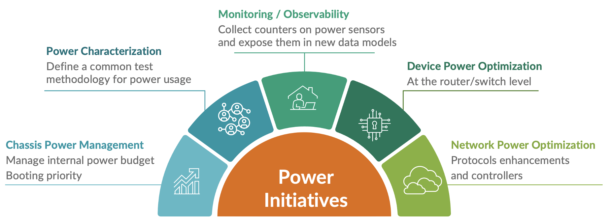

## TL;DR

"*It's an awfully long article, I'm a busy engineer and don't have time for all the details, just gimme the results please...*"

Ok, ok... I admit it's a very long article, so the following chart displays in a synthetic manner:

- Does the product offer a counter for Input Power (check the definition of input/output power in following section) and if it does support it, what is the CLI exposing this counter?
- When the counter is available, what's the level of accuracy you can expect?

| Product | Output Power | Input Power | Accuracy Delta of CLICompared to PDU |
|:--|:--|:--|:--|
| MX204(Junos) | show chassis env pem | Not Available | Not Applicable sinceInput is not available |
| MX240 Chassis(Junos) | show chassis powershow chassis env pem | Not Available | Not Applicable sinceInput is not available |
| MX480 Chassis(Junos) | show chassis powershow chassis env pem | Not Available | Not Applicable sinceInput is not available |
| MX960 Chassis(Junos) | show chassis powershow chassis env pem | Not Available | Not Applicable sinceInput is not available |
| MX301(Junos) | show chassis powershow chassis env pem | Not Available | Not Applicable sinceInput is not available |
| MX304(Junos) | show chassis powershow chassis env pem | show chassis env pem | Measured 2%deviation |
| MX10000 Chassis(Junos) | show chassis powershow chassis env pem | show chassis env pem | Measured from 2 to 5%deviation |
| PTX10001-36MR(Junos EVO) | show chassis power | show chassis power | Identical |
| PTX10002-36QDD(Junos EVO) | show chassis power | show chassis power | Identical |
| PTX10000 Chassis(Junos EVO) | show chassis power | show chassis power | Identical |
| ACX7020(Junos EVO) | Not Available | show chassis power(only total) | Not Applicable sinceInput is not available |
| ACX7024(X)(Junos EVO) | show chassis power | show chassis power | Identical |
| ACX7100(Junos EVO) | show chassis power | show chassis power | Identical |
| ACX7300(Junos EVO) | show chassis power | show chassis power | Not measured |
| ACX7500(Junos EVO) | show chassis power | show chassis power | Not measured |
| QFX5110(Junos) | show chassis env pem | Not Available | Not Applicable sinceInput is not available |
| QFX5120(Junos) | show chassis env pem | Not Available | Not Applicable sinceInput is not available |
| QFX5130(Junos EVO) | show chassis power | show chassis power | Identical |
| QFX5200(Junos) | show chassis env pem | Not Available | Not Applicable sinceInput is not available |
| QFX5210(Junos) | show chassis env pem | Not Available | Not Applicable sinceInput is not available |
| QFX5220(Junos EVO) | show chassis power | show chassis power | Not measured |
| QFX5230(Junos EVO) | show chassis power | show chassis power | Not measured |
| QFX5240/5241(Junos EVO) | show chassis power | show chassis power | Identical |
| QFX5700(E)(Junos EVO) | show chassis power | show chassis power | Not measured |

Long story short, when the counters are available, it's pretty accurate and reliable. We didn't have all the combinations of devices and PDU to measure it exhaustively, but when the metrology was available, we verified we can fully trust it.

## Principles and Vocabulary

The devices are hosted in a rack and receive the power from a Power Distribution Unit present in this rack.

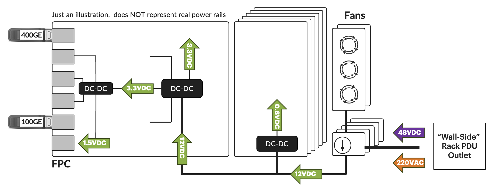

It's common for networking device to expose the "Output power", basically the amount of energy exiting the Power Supply Module and feeding the different power buses of the system. This number doesn't represent the power actually consumed by the device or provided by the PDU, but only how much is left after the voltage conversion performed by the different Power Modules (referred as PSMs or PEMs depending on the platform).

Except for the PTX12000 and legacy MX240/480/960 chassis, most of the routers and switches in the HPE Juniper Networking portfolio are operating with 12V DC out of the power module. This current is converted in different places of the devices (we talk about Point of Load or  PoL) to lower voltage: 5V, 3V, 0.8V, etc depending on the components' requirements.

The Output 12V DC current consumption is different from what is injected into the power modules. That's where the concepts of conversion efficiency and ratings are coming from. You know, the "80 Plus" ratings (Bronze, Silver, Gold, Platinum, Titanium, etc.): it represents the amount of energy lost during the conversion from the Grid to the 12V DC needed by the device.
Some products will expose an "Input Power" counter. It represents the voltage, amperage and power received by the Power Module from the grid.

Now the question we will try to answer today is: "h*ow accurate are these counters and how far can we trust them?*"

The good news is we can precisely monitor the wall-side current in our POC labs. Indeed, the Power Distribution Units (PDUs) can measure the energy they inject into the networking devices, at the outlet level. We will refer to the PDUs' GUI to collect this information and compare it with the counters on the routers.

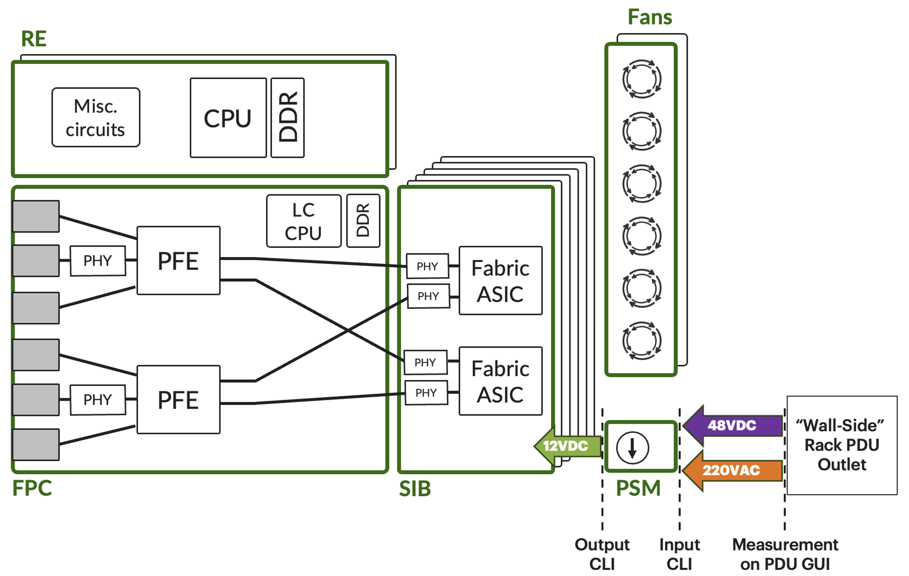

The Figure 3 above represents the counters we will collect and compare.

*Note: the division of your output and input wattage gives you your conversion ratio/efficiency.*

The main objectives of this article are the following:

- Identify the products exposing input power counters
- Clarify the CLI used to expose these counters
- When possible, compare the Input Current in the router CLI to the Outlet output current from the PDU and verify the accuracy

## Disclaimers and Methodology

It's important to understand the following points before proceeding:

- Many factors are influencing the power utilization, starting from temperature, elevation and device utilization. We described these parameters at length in this article PTX10000 Power Optimization [https://juniper.github.io/techposts/ptx10000-power-optimization/article](https://juniper.github.io/techposts/ptx10000-power-optimization/article) and video: What does Influence Power Consumption on Networking Devices? [https://www.youtube.com/watch?v=-aEYNDRB9Ck](https://www.youtube.com/watch?v=-aEYNDRB9Ck)
- The lab is not a controlled environment and doesn't try to answer the question "*how much is consumed by product X, Y or Z?*" but instead, we want to know "*what's available and how accurate are the power usage counters exposed on product X, Y or Z?*".
- By nature, power usage is fluctuating. The collection of power consumption counter is just a snapshot of the situation at a given time. That's why we recommend using:


Telemetry and data visualization (Grafana-like dashboards) to draw an average view

If CLI is your only option, collect a dozen of times and calculate an average value. It's not perfect, but still better than just one snapshot number.
- And when you'll look at the fluctuating measurements, you'll understand that a margin of error of a couple of watts is the norm, sometimes it varies in a range of 10 Watts. So don't waste time collecting values with decimals.

That's the approach we took for this study, we collected 10 to 12 show commands in less than a minute and we calculated the average value. For the sake of brevity, we will only display one show command in the outputs below, but consider we will calculate the deviation based on an averaged data collection.

## Devices with No Counters For "Input Power"

Let's start listing the boxes that don't expose the input power. Of course, no point trying to verify the accuracy of the measurement.

## MX204

```
jnpr@mx204-205> show chassis po
                               ^
syntax error.
jnpr@mx204-205> show chassis ?
Possible completions:
  alarms               Show alarm status
  ambient-temperature  Show chassis ambient temperature
  environment          Show component status and temperature, cooling system speeds
  errors               Show chassis errors
  fan                  Show fan and fan tray information
  firmware             Show firmware and operating system version for components
  fpc                  Show Flexible PIC Concentrator status
  fru                  Show fru replacement status
  hardware             Show installed hardware components
  hss                  Show SerDes information
  location             Show physical location of chassis
  mac-addresses        Show media access control addresses
  memory-usage-chassisd  Dump LMLD data to /var/log/chassisd_memory_usage
  network-services     Show chassis network services
  pic                  Show Physical Interface Card state, type, and uptime
  routing-engine       Show Routing Engine status
  satellite-cluster    Show Satellite Cluster information
  synchronization      Show clock synchronization information
  temperature-thresholds  Show chassis temperature threshold settings
jnpr@mx204-205>

jnpr@mx204-205> show chassis environment pem
PEM 0 status:
  State                      Online
  Airflow                    Front to Back
  Temp Sensor 0                           37 degrees C / 98 degrees F
  Temp Sensor 1                           35 degrees C / 95 degrees F
  Firmware version           00.05
  Fan Sensor                 5970 RPM
  DC Output           Voltage(V) Current(A)  Power(W)  Load(%)
                        11.90       15.00         178      27
  Health check Information:
      Status:                    Unsupported
PEM 1 status:
  State                      Offline
  Health check Information:
      Status:                    Unsupported

jnpr@mx204-205>
```

Only the Output power can be monitored and through the "show chassis env" output.

Input power is not monitored.

## MX240 Chassis

```
jnpr@mx240-207-re0> show chassis power detail 

PEM 0:
  State:     Online
  AC input:  OK (1 feed expected, 1 feed connected)
  Capacity:  2400 W (maximum 2400 W)
  DC output: 114 W (zone 0, 2 A at 57 V, 4% of capacity)

PEM 1:
  State:     Present
  AC input:  Out of range (1 feed expected, 1 feed connected)
  Capacity:  2400 W (maximum 2400 W)
  DC output: 0 W (zone 0, 0 A at 0 V, 0% of capacity)

PEM 2:
  State:     Empty
  Input:     Absent

PEM 3:
  State:     Empty
  Input:     Absent

System:
  Zone 0:
      Capacity:          2400 W (maximum 2400 W)
      Allocated power:   250 W (2150 W remaining)
      Actual usage:      114 W
  Total system capacity: 2400 W (maximum 2400 W)
  Total remaining power: 2150 W

jnpr@mx240-207-re0> show chassis environment pem 
PEM 0 status:
  State                      Online
  Temperature                             OK                                      
  DC Output           Voltage(V) Current(A)  Power(W)  Load(%)
                        57          2             114      4      
PEM 1 status:
  State                      Present

jnpr@mx240-207-re0>
```

Only the Output power can be monitored and is available in both "show chassis power" and "show chassis env" outputs.

## MX480 Chassis

```
jnpr@ASHBVALB-MSE01-AA-IE1> show chassis power detail 

PEM 0:
  State:     Online
  AC input:  OK (1 feed expected, 1 feed connected)
  Capacity:  2050 W (maximum 2050 W)
  DC output: 580 W (zone 0, 10 A at 58 V, 28% of capacity)

PEM 1:
  State:     Online
  AC input:  OK (1 feed expected, 1 feed connected)
  Capacity:  2050 W (maximum 2050 W)
  DC output: 627 W (zone 0, 11 A at 57 V, 30% of capacity)

PEM 2:
  State:     Present
  AC input:  Out of range (1 feed expected, 1 feed connected)
  Capacity:  2050 W (maximum 2050 W)
  DC output: 0 W (zone 0, 0 A at 0 V, 0% of capacity)

PEM 3:
  State:     Present                    
  AC input:  Out of range (1 feed expected, 1 feed connected)
  Capacity:  2050 W (maximum 2050 W)
  DC output: 0 W (zone 0, 0 A at 0 V, 0% of capacity)

System:
  Zone 0:
      Capacity:          4100 W (maximum 4100 W)
      Allocated power:   2236 W (1864 W remaining)
      Actual usage:      1207 W
  Total system capacity: 4100 W (maximum 4100 W)
  Total remaining power: 1864 W

Item                 Used(W)          Max(W)
  CB 0 + RE 0           242             390
  CB 0                  197             280
  CB 1 + RE 1           300             510
  CB 1                  252             400
  FPC 2                 283             376
  FPC 3                 275             465
  FPC 5                 300             465

{master}
jnpr@ASHBVALB-MSE01-AA-IE1> show chassis environment pem 
PEM 0 status:
  State                      Online
  Temperature                             OK                                      
  DC Output           Voltage(V) Current(A)  Power(W)  Load(%)
                        58          10            580      28     
PEM 1 status:
  State                      Online
  Temperature                             OK                                      
  DC Output           Voltage(V) Current(A)  Power(W)  Load(%)
                        57          11            627      30     
PEM 2 status:
  State                      Present
PEM 3 status:
  State                      Present

{master}
jnpr@ASHBVALB-MSE01-AA-IE1>
```

Only the Output power can be monitored and is available in both "show chassis power" and "show chassis env" outputs.

## MX960 Chassis

```
jnpr@NYCMNY-VFTTP-395_RE0> show chassis power detail 

PEM 0:
  State:     Online
  AC input:  OK (2 feed expected, 2 feed connected)
  Capacity:  4100 W (maximum 4100 W)
  DC output: 1026 W (zone 0, 18 A at 57 V, 25% of capacity)

PEM 1:
  State:     Online
  AC input:  OK (2 feed expected, 2 feed connected)
  Capacity:  4100 W (maximum 4100 W)
  DC output: 1824 W (zone 1, 32 A at 57 V, 44% of capacity)

PEM 2:
  State:     Online
  AC input:  OK (2 feed expected, 2 feed connected)
  Capacity:  4100 W (maximum 4100 W)
  DC output: 855 W (zone 0, 15 A at 57 V, 20% of capacity)

PEM 3:
  State:     Empty
  Input:     Absent

System:
  Zone 0:
      Capacity:          4100 W (maximum 4100 W)
      Allocated power:   3090 W (1010 W remaining)
      Actual usage:      1881 W
  Zone 1:
      Capacity:          4100 W (maximum 4100 W)
      Allocated power:   3155 W (945 W remaining)
      Actual usage:      1824 W
  Total system capacity: 8200 W (maximum 8200 W)
  Total remaining power: 1955 W

Item                 Used(W)          Max(W)
  CB 0 + RE 0           351             510
  CB 0                  306             400
  CB 1 + RE 1           346             510
  CB 1                  302             400
  CB 2                  293             400
  FPC 1                 249             465
  FPC 2                 252             465
  FPC 3                 253             465
  FPC 4                 265             465
  FPC 5                 265             465
  FPC 8                 249             465
  FPC 9                 260             465
  FPC 10                260             465
  FPC 11                259             465

{master}
jnpr@NYCMNY-VFTTP-395_RE0> show chassis environment pem 
PEM 0 status:
  State                      Online
  Temperature                             OK                                      
  DC Output           Voltage(V) Current(A)  Power(W)  Load(%)
                        57          19            1083     26     
PEM 1 status:
  State                      Online
  Temperature                             OK                                      
  DC Output           Voltage(V) Current(A)  Power(W)  Load(%)
                        57          32            1824     44     
PEM 2 status:
  State                      Online
  Temperature                             OK                                      
  DC Output           Voltage(V) Current(A)  Power(W)  Load(%)
                        57          15            855      20     

{master}
jnpr@NYCMNY-VFTTP-395_RE0>
```

Only the Output power can be monitored and is available in both "show chassis power" and "show chassis env" outputs.

## MX301

```
jnpr@mx301-202> show chassis power detail 

PEM 0:
  State:     Online
  Capacity:  850 W (maximum 850 W)
  AC input:  OK (INP1 feed expected, INP1 feed connected)
  DC output: 145 W (zone 0, 12.00 A at 12.13 V, 17% of capacity)

PEM 1:
  State:     Offline
  Capacity:  850 W (maximum 850 W)
  AC input:  Not ready
  DC output: 0 W (zone 0, 0.00 A at 0.00 V, 0% of capacity)

System:
  Zone 0:
      Capacity:          850 W (maximum 850 W)
      Allocated power:   820 W (30 W remaining)
      Actual usage:      145 W
  Total system capacity: 850 W (maximum 850 W)
  Total remaining power: 30 W

Item                 Used(W)
  Fan Tray 0              1
  Fan Tray 1              1
  Fan Tray 2              1
  Fan Tray 3              1
  Fan Tray 4              1
  Fan Tray 5              1
  RE0/CB0                51
  FPC 0                  99

jnpr@mx301-202> show chassis environment pem 
PEM 0 status:
  State                      Online
  Airflow                    Front to Back                           
  Primary Hot Spot                        42 degrees C / 107 degrees F            
  Temp Sensor 1                           31 degrees C / 87 degrees F             
  Air Outlet ambient                      40 degrees C / 104 degrees F            
  Secondary Hot Spot                      44 degrees C / 111 degrees F            
  Fan 0                      4875 RPM                                
  Fan 1                      4650 RPM                                
  DC Output           Voltage(V) Current(A)  Power(W)  Load(%)
                        12.13       11.50         139      16     
  Health check Information:
      Status:                    Unsupported
PEM 1 status:
  State                      Offline
  Health check Information:
      Status:                    Unsupported

jnpr@mx301-202>
```

Only the Output power can be monitored and is available in both "show chassis power" and "show chassis env" outputs.

## ACX7020

```
regress@rtme-acx7020-01> show chassis power detail 
Chassis Power        Voltage(V)    Power(W)

Total Input Power                     47
  PSM 0
    State: Online
    Capacity            220 W (maximum 220 W)
  PSM 1
    State: Online
    Capacity            220 W (maximum 220 W)

System:
  Zone 0:
      Capacity:          440 W (maximum 440 W)
      Actual usage:      48 W
  Total system capacity: 440 W (maximum 440 W)

regress@rtme-acx7020-01> show chassis environment psm 
PSM 0 status:
  State                      Online
  DC Output                  OK
  Health check Information:
      Status:                   Health Check Not Supported
      Last Result:              Not Performed
      Last Execution:           Empty
      Next Scheduled Run:       Not Scheduled
PSM 1 status:
  State                      Online
  DC Output                  OK
  Health check Information:
      Status:                   Health Check Not Supported
      Last Result:              Not Performed
      Last Execution:           Empty
      Next Scheduled Run:       Not Scheduled

regress@rtme-acx7020-01>
```

The ACX7020 output is pretty unique compared to other Junos or EVO platforms since it displays only the Total input power in the "show chassis power" CLI. But in reality, this number represents the power coming into the hotswap controller after the power supply unit. This number corresponds to the "Output Power" we express on other platforms.

## QFX5110/QFX5120/QFX5200/QFX5210

```
root@5a7-qfx4> show chassis environment pem 
localre:
--------------------------------------------------------------------------
FPC 0 PEM 0 status:
  State                      Present
FPC 0 PEM 1 status:
  State                      Online
  Airflow                    Back to Front                           
  Temp Sensor 0                           OK   51 degrees C / 123 degrees F       
  Temp Sensor 1                           OK   30 degrees C / 86 degrees F        
  Temp Sensor 2                           OK   24 degrees C / 75 degrees F        
  Fan 0                      4140 RPM                                
  Fan 1                      3960 RPM                                
  DC Output           Voltage(V) Current(A)  Power(W)  Load(%)
                        12          10            120      18     

{master:0}
root@5a7-qfx4> 
```

Only the Output power can be monitored and through the "show chassis env" output. Input power is not monitored.

All these QFX switches running Junos (non-EVO) have the same CLI output.

## Devices with "Input Power" Counters

## MX304

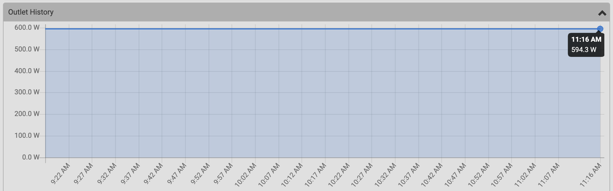

More or less 594W measured on the PDU

```
jnpr@mx304-219-re0> show chassis power detail 

PEM 0:
  State:     Online
  Capacity:  2200 W (maximum 2200 W)
  AC input:  OK (INPIN feed expected, INPINP1 feed connected)
  DC output: 556 W (zone 0, 46.19 A at 12.05 V, 25% of capacity)

PEM 1:
  State:     Offline
  Capacity:  2200 W (maximum 2200 W)
  AC input:  Not ready
  DC output: 0 W (zone 0, 0.00 A at 0.00 V, 0% of capacity)

System:
  Zone 0:
      Capacity:          2200 W (maximum 2200 W)
      Allocated power:   1845 W (355 W remaining)
      Actual usage:      556 W
  Total system capacity: 2200 W (maximum 2200 W)
  Total remaining power: 355 W
                                        
Item                 Used(W)
  Fan Tray 0              4
  Fan Tray 1              4
  Fan Tray 2              3
  SFB 0                  98
  FPC 0                 345
  RE0                    46
  RE1                    52

{master}
jnpr@mx304-219-re0> show chassis environment pem 
PEM 0 status:
  State                      Online
  Airflow                    Front to Back                           
  Inlet Ambient Temp                      34 degrees C / 93 degrees F             
  Secondary SR Hotspot                    43 degrees C / 109 degrees F            
  Temp Sensor 2                           43 degrees C / 109 degrees F            
  Firmware version           1.5, 2.5                                
  Fan 0                      12992 RPM                               
  DC Output           Voltage(V) Current(A)  Power(W)  Load(%)
                        12.05       45.62         549      24     
  Input                      Voltage(V)  Current(A) Power(W)
  INP INP1                   233.5       2.5        570.0   
  Health check Information:
      Status:                    Scheduled
      Last Result:               Not Performed Yet
      Last Execution:            Empty
      Next Scheduled Run:        2026-05-19 10:41:35
PEM 1 status:
  State                      Offline
  Input                      Voltage(V)  Current(A) Power(W)
  INP INP1                   0.0         0.0        0.0     
  Health check Information:
      Status:                    Scheduled
      Last Result:               Not Performed Yet
      Last Execution:            Empty
      Next Scheduled Run:        2026-05-19 10:41:35

jnpr@mx304-219-re0>
```

Input power is available in the "show chassis env pem", grep on "INP INP1" to shorten it.

We collected 581.3W in average on the CLI vs 584W approximately on the PDU. That's 2.2% less on the CLI compared to the rack info.

## MX10008 Chassis

PEM0:

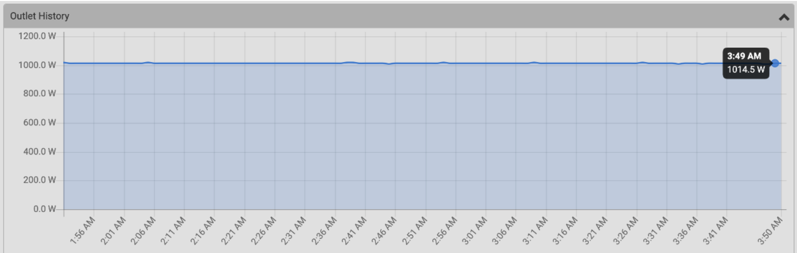

from 1014W to 1018W measured on the PDU, let's take a midpoint at 1016W

PEM2:

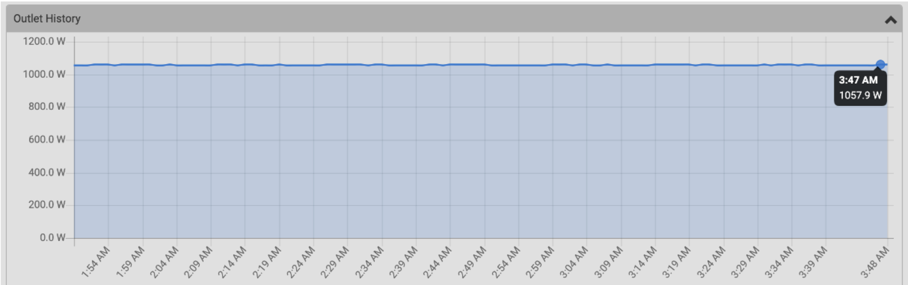

from 1055W to 1061W measured on the PDU, let's take a midpoint at 1058W

On the CLI:

```
jnpr@mx10008-200-re0> show chassis power detail 

PEM 0:
  State:     Online
  Capacity:  5000 W (maximum 5500 W)
  AC input:  OK (INP1 feed expected, INP1 feed connected)
  Feed1:     AC input
  DC output: 927 W (zone 0, 75.66 A at 12.26 V, 16% of capacity) (30A input select)

PEM 1:
  State:     Present
  Capacity:  0 W (maximum 5500 W)
  AC input:  Not ready
  Feed1:     AC input
  DC output: 0 W (zone 0, 0.00 A at 0.00 V, 0% of capacity)

PEM 2:
  State:     Online
  Capacity:  2800 W (maximum 5500 W)
  AC input:  OK (INP1 feed expected, INP1 feed connected)
  Feed1:     AC input
  DC output: 962 W (zone 0, 78.74 A at 12.22 V, 17% of capacity) (20A input select)

PEM 3:
  State:     Present
  Capacity:  0 W (maximum 5500 W)
  AC input:  Not ready
  Feed1:     AC input
  DC output: 0 W (zone 0, 0.00 A at 0.00 V, 0% of capacity)

PEM 4:
  State:     Present
  Capacity:  0 W (maximum 5500 W)
  AC input:  Not ready
  Feed1:     AC input
  DC output: 0 W (zone 0, 0.00 A at 0.00 V, 0% of capacity)

PEM 5:
  State:     Present
  Capacity:  0 W (maximum 5500 W)
  AC input:  Not ready
  Feed1:     AC input
  DC output: 0 W (zone 0, 0.00 A at 0.00 V, 0% of capacity)

System:
  Zone 0:
      Capacity:          7800 W (maximum 7800 W)
      Allocated power:   7334 W (466 W remaining)
      Actual usage:      1889 W
  Total system capacity: 7800 W (maximum 7800 W)
  Total remaining power: 466 W

Item                 Used(W)
  Fan Tray 0            236
  Fan Tray 1            225             
  RE0/CB0                90
  RE1/CB1                92

Item                 Used(W)          Max(W)
  SFB 0                 123             400
  SFB 1                 120             400
  SFB 2                 125             400
  SFB 3                 129             400
  SFB 4                 123             400
  SFB 5                 125             400
  FPC 0                 517            1770

jnpr@mx10008-200-re0> show chassis environment pem 
PEM 0 status:
  State                      Online
  Airflow                    Front to Back                           
  Temp Sensor 0                           32 degrees C / 89 degrees F             
  Firmware version           AA17AA17.AB15AB15.AC27                  
  Fan 0                      3968 RPM                                
  Fan 1                      4640 RPM                                
  DC Output           Voltage(V) Current(A)  Power(W)  Load(%)
                        12.26       75.66         927      16     
  Input                      Voltage(V)  Current(A) Power(W)
  INP 1                      228.0       4.6        1053.4  
  INP 2                      0.0         0.0        0.0     
  Health check Information:
      Status:                    Scheduled
      Last Result:               Not Performed Yet
      Last Execution:            Empty
      Next Scheduled Run:        2026-05-27 08:40:23
PEM 1 status:
  State                      Present
  Input                      Voltage(V)  Current(A) Power(W)
  INP 1                      0.0         0.0        0.0     
  INP 2                      0.0         0.0        0.0     
  Health check Information:
      Status:                    Scheduled
      Last Result:               Not Performed Yet
      Last Execution:            Empty
      Next Scheduled Run:        2026-05-27 08:40:23
PEM 2 status:
  State                      Online
  Airflow                    Front to Back                           
  Temp Sensor 0                           36 degrees C / 96 degrees F             
  Firmware version           AA17AA17.AB15AB15.AC27                  
  Fan 0                      4384 RPM                                
  Fan 1                      5056 RPM                                
  DC Output           Voltage(V) Current(A)  Power(W)  Load(%)
                        12.22       78.74         962      17     
  Input                      Voltage(V)  Current(A) Power(W)
  INP 1                      229.9       4.8        1094.3  
  INP 2                      0.0         0.0        0.0     
  Health check Information:
      Status:                    Scheduled
      Last Result:               Not Performed Yet
      Last Execution:            Empty
      Next Scheduled Run:        2026-05-27 08:40:23
PEM 3 status:
  State                      Present
  Input                      Voltage(V)  Current(A) Power(W)
  INP 1                      0.0         0.0        0.0     
  INP 2                      0.0         0.0        0.0     
  Health check Information:
      Status:                    Scheduled
      Last Result:               Not Performed Yet
      Last Execution:            Empty
      Next Scheduled Run:        2026-05-27 08:40:23
PEM 4 status:
  State                      Present
  Input                      Voltage(V)  Current(A) Power(W)
  INP 1                      0.0         0.0        0.0     
  INP 2                      0.0         0.0        0.0     
  Health check Information:
      Status:                    Scheduled
      Last Result:               Not Performed Yet
      Last Execution:            Empty
      Next Scheduled Run:        2026-05-27 08:40:23
PEM 5 status:
  State                      Present
  Input                      Voltage(V)  Current(A) Power(W)
  INP 1                      0.0         0.0        0.0     
  INP 2                      0.0         0.0        0.0     
  Health check Information:
      Status:                    Scheduled
      Last Result:               Not Performed Yet
      Last Execution:            Empty
      Next Scheduled Run:        2026-05-27 08:40:23

jnpr@mx10008-200-re0>
```

Input power is available in the "show chassis env pem", grep on "INP INP1" to shorten it.

PEM0: We collected 1069W in average on the CLI vs 1016W approximately on the PDU.
That's around 5% more on the CLI compared to the rack info.

PEM2: We collected 1088W in average on the CLI vs 1058W approximately on the PDU.
That's around 3% more on the CLI compared to the rack info.

## PTX10001-36MR

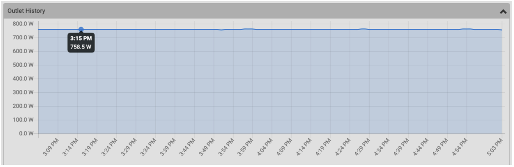

Approximately 758W measured on the PDU

On the CLI:

```
jnpr@ptx10001-216> show chassis power detail 
Chassis Power        Voltage(V)    Power(W)

Total Input Power                    760
  PSM 0
    State: Online
    Input 1             236          760
    Output            11.99        700.15
    Capacity           3000 W (maximum 3000 W)
  PSM 1
    State: Offline
    Input 1               0            0
    Output                0            0
    Capacity              0 W (maximum 0 W)

Item                 Used(W)
  Routing Engine 0       34
  CB 0                    5

System:
  Zone 0:
      Capacity:          3000 W (maximum 3000 W)
      Actual usage:      760 W
  Total system capacity: 3000 W (maximum 3000 W)

jnpr@ptx10001-216> show chassis environment psm  
PSM 0 status:
  State                      Online
  Temperature                33 degrees C / 91 degrees F             
  Fans                       OK
  DC Output                  OK
  Hours Used                 26610
  Firmware Version           0212.0214
  Fan 1                      14976
  Fan 2                      13248
  Health check Information:
      Status:                   Not Performed
      Last Result:              Not Performed
      Last Execution:           Empty
      Next Scheduled Run:       2026-05-25 10:52:30 CEST
PSM 1 status:
  State                      Offline
  Temperature                31 degrees C / 87 degrees F             
  Fans                       OK
  DC Output                  Failed
  Hours Used                 300
  Firmware Version           0212.0214
  Fan 1                      0
  Fan 2                      0
  Health check Information:
      Status:                   Not Performed
      Last Result:              Not Performed
      Last Execution:           Empty
      Next Scheduled Run:       2026-05-25 10:52:40 CEST

jnpr@ptx10001-216>
```

Both input and output details are provided in the "show chassis power" CLI.

- grep on "Output" for output power
- grep on "Input 1" for input power

We collected 759.8W in average on the CLI vs 758W approx. on the PDU. It's a marginal difference.

## PTX10002-36QDD

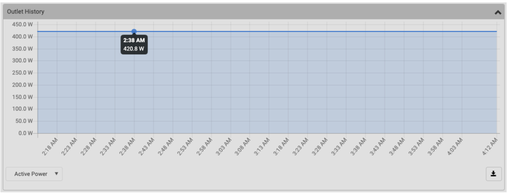

Around 420W measured on the PDU

On the CLI:

```
jnpr@ptx10002-204> show chassis power detail 
Chassis Power        Voltage(V)    Power(W)

Total Input Power                    416
  PSM 0
    State: Online
    Input 1             233          416
    Output            12.01        367.91
    Capacity           3000 W (maximum 3000 W)
  PSM 1
    State: Offline
    Input 1               0            0
    Output                0            0
    Capacity              0 W (maximum 0 W)

Item                 Used(W)
  Routing Engine 0       67
  FPC 0                 278
  Fan Tray 0              1
  Fan Tray 1              4
  Fan Tray 2              1
                                        
System:
  Power mode:            Normal
  Zone 0:
      Capacity:          3000 W (maximum 3000 W)
      Allocated power:   2858 W (142 W remaining)
      Actual usage:      367 W
  Total system capacity: 3000 W (maximum 3000 W)
  Total remaining power: 142 W

jnpr@ptx10002-204> show chassis environment psm 
PSM 0 status:
  State                      Online
  Temperature                29 degrees C / 84 degrees F             
  Fans                       OK
  DC Output                  OK
  Hours Used                 14391
  Firmware Version           0212.0215
  Fan 1                      11968
  Fan 2                      10560
  Health check Information:
      Status:                   Not Performed
      Last Result:              Not Performed
      Last Execution:           Empty
      Next Scheduled Run:       2026-05-22 13:32:49 CEST
PSM 1 status:
  State                      Offline
  Temperature                30 degrees C / 86 degrees F             
  Fans                       OK
  DC Output                  Failed
  Hours Used                 51
  Firmware Version           0212.0215
  Fan 1                      0
  Fan 2                      0
  Health check Information:
      Status:                   Not Performed
      Last Result:              Not Performed
      Last Execution:           Empty
      Next Scheduled Run:       2026-05-22 13:32:59 CEST

jnpr@ptx10002-204>
```

Both input and output details are provided in the "show chassis power" CLI.

- grep on "Output" for output power
- grep on "Input 1" for input power

We collected 417.2W in average on the CLI vs roughly 420W on the PDU. It's a marginal difference.

## PTX10000 Chassis

The router in our lab is using 3x PEMs:

PEM0


On the PDU, it's oscillating between 681 and 702W, let's take a mid-point of 692W for this exercise.

PEM1

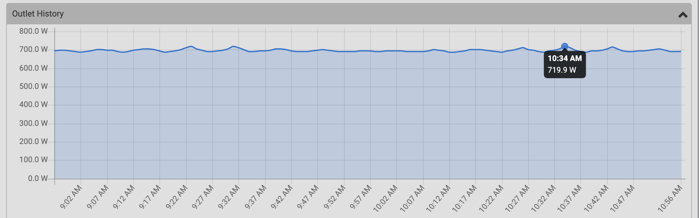

Oscillating between 687 and 719W, let's take a mid-point of 703W for this exercise.

PEM2

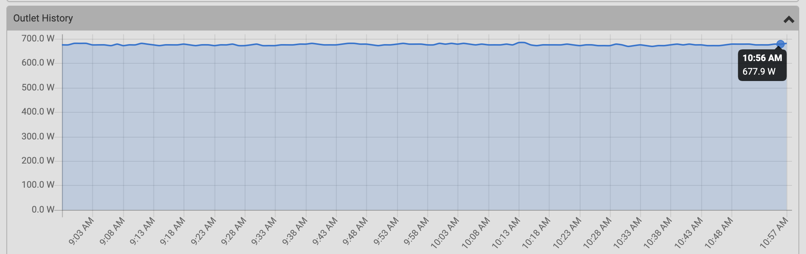

Oscillating between 672 and 684W, let's take a mid-point of 678W for this exercise.

On the CLI:

```
jnpr@ptx10004-204-re0-re0> show chassis power detail 
Chassis Power        Voltage(V)    Power(W)

Total Input Power                   2112
  PSM 0
    State: Online
    INP1                229          696
    INP2                  0            0
    Output            12.23        608.32    (30A input select)
    Capacity           5000 W (maximum 5500 W)
  PSM 1
    State: Online
    INP1                231          720
    INP2                  0            0
    Output            12.21        628.84    (30A input select)
    Capacity           5000 W (maximum 5500 W)
  PSM 2
    State: Online
    INP1                233          696
    INP2                  0            0
    Output            12.21        596.6     (30A input select)
    Capacity           5000 W (maximum 5500 W)

Item                 Used(W)
  CB 0                   75
  FPC 0                 817
  SIB 0                 125
  SIB 1                 126
  SIB 2                 125
  SIB 3                 127
  SIB 4                 125
  SIB 5                 125
  Fan Tray 0             76
  Fan Tray 1             83

System:
  Zone 0:
      Capacity:          15000 W (maximum 16500 W)
      Allocated power:   6210 W (8790 W remaining)
      Actual usage:      1833 W
  Total system capacity: 15000 W (maximum 16500 W)
  Total remaining power: 8790 W

{master}

jnpr@ptx10004-204-re0-re0> show chassis environment psm 
PSM 0 status:
  State                      Online
  Temperature                27 degrees C / 80 degrees F             
  Fans                       OK
  AC Input1                  OK
  AC Input2                  Check
  Check Input1 Alarm         No
  Check Input2 Alarm         Yes
  DC Output                  OK
  Hours Used                 33293
  Firmware Version           aa17.aa17.ab15.ab15.ac27
  Fan 1                      5120
  Fan 2                      6016
  HVDC Mode                  Both Inputs AC
  Health check Information:
      Status:                   Not Performed
      Last Result:              Not Performed
      Last Execution:           Empty
      Next Scheduled Run:       2026-02-18 12:07:00 CET
PSM 1 status:
  State                      Online
  Temperature                33 degrees C / 91 degrees F             
  Fans                       OK
  AC Input1                  OK
  AC Input2                  Check
  Check Input1 Alarm         No
  Check Input2 Alarm         Yes
  DC Output                  OK
  Hours Used                 36987
  Firmware Version           aa17.aa17.ab15.ab15.ac27
  Fan 1                      5152
  Fan 2                      6016
  HVDC Mode                  Both Inputs AC
  Health check Information:
      Status:                   Not Performed
      Last Result:              Not Performed
      Last Execution:           Empty
      Next Scheduled Run:       2026-02-18 12:07:00 CET
PSM 2 status:
  State                      Online
  Temperature                29 degrees C / 84 degrees F             
  Fans                       OK
  AC Input1                  OK
  AC Input2                  Check
  Check Input1 Alarm         No
  Check Input2 Alarm         Yes
  DC Output                  OK
  Hours Used                 46798
  Firmware Version           aa17.aa17.ab15.ab15.ac27
  Fan 1                      5120
  Fan 2                      6016
  HVDC Mode                  Both Inputs AC
  Health check Information:
      Status:                   Not Performed
      Last Result:              Not Performed
      Last Execution:           Empty
      Next Scheduled Run:       2026-02-18 12:07:00 CET

{master}
jnpr@ptx10004-204-re0-re0> 
```

Both input and output information present in the "show chassis power" CLI.

On PEM0, we took a mid-point of 692W for this exercise, compared to 696W, that's 99%

On PEM1, we took a mid-point of 703W for this exercise, compared to 720W, that's 98%

On PEM2, we took a mid-point of 678W for this exercise, compared to 696W, that's 97%.

Considering the constant variation, these calculations don't make much sense, we can just say the results are pretty much aligned.

## ACX7024

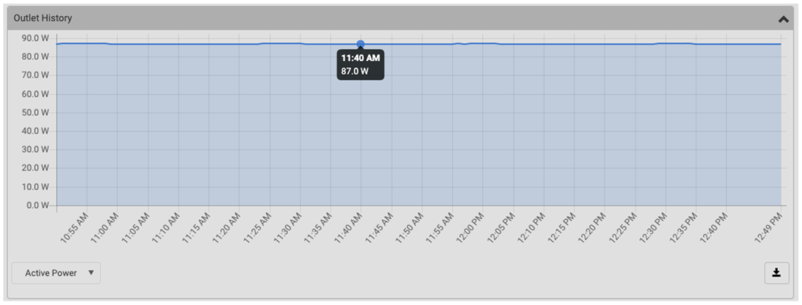

Around 87W measured on the PDU

On the CLI:

```
jnpr@acx7024-208> show chassis power detail 
Chassis Power        Voltage(V)    Power(W)

Total Input Power                     88
  PSM 0
    State: Online
    Input               234           88
    Output            12.15        75.31
    Capacity            400 W (maximum 400 W)
  PSM 1
    State: Offline
    Input                 0            0
    Output                0            0
    Capacity              0 W (maximum 0 W)

System:
  Zone 0:
      Capacity:          400 W (maximum 400 W)
      Actual usage:      88 W
  Total system capacity: 400 W (maximum 400 W)

jnpr@acx7024-208> show chassis environment pem 
PSM 0 status:
  State                      Online
  Temperature                23 degrees C / 73 degrees F             
  Fans                       OK
  DC Output                  OK
  Firmware Version           15.17
  Fan 1                      6000
  Health check Information:
      Status:                   Not Performed
      Last Result:              Not Performed
      Last Execution:           Empty
      Next Scheduled Run:       2026-05-27 17:14:51 CEST
PSM 1 status:
  State                      Offline
  Temperature                23 degrees C / 73 degrees F             
  Fans                       OK
  DC Output                  Failed
  Firmware Version           15.17
  Fan 1                      0
  Health check Information:
      Status:                   Not Performed
      Last Result:              Not Performed
      Last Execution:           Empty
      Next Scheduled Run:       2026-05-27 17:15:01 CEST

jnpr@acx7024-208>
```

Both input and output information present in the "show chassis power" CLI. The difference between the average data collected from CLI (88W) and the current measured on the PDU (87W) is marginal.

## ACX7100

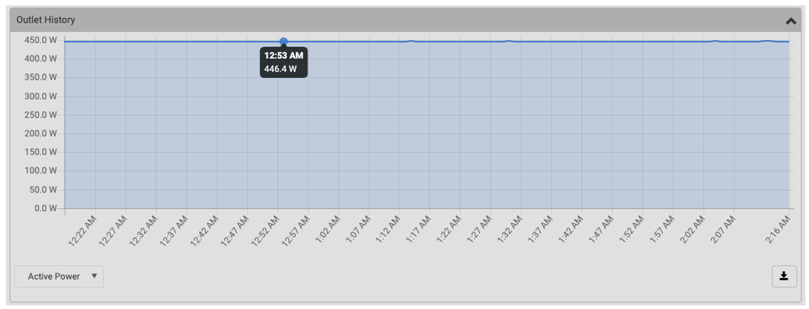

Around 446W measured on the PDU

On the CLI:

```
jnpr@acx7100-202> show chassis power detail 
Chassis Power        Voltage(V)    Power(W)

Total Input Power                    443
  PSM 0
    State: Online
    Input               231          443
    Output            11.98        409.1
    Capacity           1600 W (maximum 1600 W)
  PSM 1
    State: Offline
    Input                 0            0
    Output                0            0
    Capacity              0 W (maximum 0 W)

System:
  Zone 0:
      Capacity:          1600 W (maximum 1600 W)
      Actual usage:      409 W
  Total system capacity: 1600 W (maximum 1600 W)

jnpr@acx7100-202> show chassis environment pem 
PSM 0 status:
  State                      Online
  Temperature                30 degrees C / 86 degrees F             
  Fans                       OK
  DC Output                  OK
  Firmware Version           21.43
  Fan 1                      17984
  Health check Information:
      Status:                   Not Performed
      Last Result:              Not Performed
      Last Execution:           Empty
      Next Scheduled Run:       2026-05-27 00:23:41 CEST
PSM 1 status:
  State                      Offline
  Temperature                35 degrees C / 95 degrees F             
  Fans                       OK
  DC Output                  Failed
  Firmware Version           00.00
  Fan 1                      0
  Health check Information:
      Status:                   Not Performed
      Last Result:              Not Performed
      Last Execution:           Empty
      Next Scheduled Run:       2026-05-27 00:23:51 CEST

jnpr@acx7100-202> 
```

Both input and output information present in the "show chassis power" CLI. The difference between the average data collected from CLI (443.5W) and the current measured on the PDU (446W) is marginal.

## ACX73xx

We didn't have it behind controlled PDU, we were not able to perform comparison tests.

On the CLI:

```
regress@rtme-acx7332-01-re0> show chassis power detail 
Chassis Power        Voltage(V)    Power(W)

Total Input Power                    422
  PSM 0
    State: Online
    Input               200          211
    Output            12.17        167.36
    Capacity           2200 W (maximum 2200 W)
  PSM 1
    State: Online
    Input               202          211
    Output             12.2        154.44
    Capacity           2200 W (maximum 2200 W)

Item                 Used(W)
  Routing Engine 0       44
  CB 0                   18
  FPC 2                  35
  FPC 3                  23
  Fan Tray 0              6
  Fan Tray 1              5
  Fan Tray 2              5
  Fan Tray 3              4
  FEB 0                 197

System:
  Zone 0:
      Capacity:          4400 W (maximum 4400 W)
      Allocated power:   1690 W (2710 W remaining)
      Actual usage:      349 W
  Total system capacity: 4400 W (maximum 4400 W)
  Total remaining power: 2710 W

{master}
regress@rtme-acx7332-01-re0> show chassis environment psm   
PSM 0 status:
  State                      Online
  Temperature                25 degrees C / 77 degrees F             
  Fans                       OK
  DC Output                  OK
  Hours Used                 13803
  Firmware Version           11.13
  Fan 1                      10144
  Health check Information:
      Status:                   Not Performed
      Last Result:              Not Performed
      Last Execution:           Empty
      Next Scheduled Run:       2026-05-28 11:24:33 PDT
PSM 1 status:
  State                      Online
  Temperature                25 degrees C / 77 degrees F             
  Fans                       OK
  DC Output                  OK
  Hours Used                 15419
  Firmware Version           11.13
  Fan 1                      9872
  Health check Information:
      Status:                   Not Performed
      Last Result:              Not Performed
      Last Execution:           Empty
      Next Scheduled Run:       2026-05-28 11:24:43 PDT

{master}
regress@rtme-acx7332-01-re0>
```

Both input and output current are exposed in the "show chassis power" CLI, but we were not able to test the accuracy of these sensors.

## ACX7500

We didn't have this router behind controlled PDU, we were not able to perform comparison tests.

On the CLI:

```
regress@rtme-acx7509-01-re0> show chassis power detail 
Chassis Power        Voltage(V)    Power(W)

Total Input Power                    622
  PSM 0
    State: Online
    Input 1             202          286
    Output            12.01        226.83
    Capacity           3000 W (maximum 3000 W)
  PSM 1
    State: Online
    Input 1             201          336
    Output            12.02        302.13
    Capacity           3000 W (maximum 3000 W)
  PSM 2
    State: Offline
    Input 1               0            0
    Output                0            0
    Capacity              0 W (maximum 0 W)
  PSM 3
    State: Offline
    Input 1               0            0
    Output                0            0
    Capacity              0 W (maximum 0 W)

Item                 Used(W)
  CB 0                   66
  FPC 1                 102
  FPC 2                  55
  FPC 5                  77
  Fan Tray 0             17
  Fan Tray 1             19
  FEB 0                 192
  FEB 1                   0

System:
  Zone 0:
      Capacity:          6000 W (maximum 6000 W)
      Allocated power:   1730 W (4270 W remaining)
      Actual usage:      528 W
  Total system capacity: 6000 W (maximum 6000 W)
  Total remaining power: 4270 W

{master}
regress@rtme-acx7509-01-re0> show chassis environment psm 
PSM 0 status:
  State                      Online
  Temperature                27 degrees C / 80 degrees F             
  Fans                       OK
  DC Output                  OK
  Hours Used                 39214
  Firmware Version           0210.0211
  Fan 1                      10048
  Fan 2                      8896
  Health check Information:
      Status:                   Not Performed
      Last Result:              Not Performed
      Last Execution:           Empty
      Next Scheduled Run:       2026-06-02 04:21:15 PDT
PSM 1 status:
  State                      Online
  Temperature                29 degrees C / 84 degrees F             
  Fans                       OK
  DC Output                  OK
  Hours Used                 35646
  Firmware Version           0210.0211
  Fan 1                      9984
  Fan 2                      8832
  Health check Information:
      Status:                   Not Performed
      Last Result:              Not Performed
      Last Execution:           Empty
      Next Scheduled Run:       2026-06-02 04:21:25 PDT
PSM 2 status:
  State                      Offline
  Temperature                30 degrees C / 86 degrees F             
  Fans                       OK
  DC Output                  Failed
  Hours Used                 541
  Firmware Version           0212.0214
  Fan 1                      0
  Fan 2                      0
  Health check Information:
      Status:                   Not Performed
      Last Result:              Not Performed
      Last Execution:           Empty
      Next Scheduled Run:       2026-06-02 04:21:35 PDT
PSM 3 status:
  State                      Offline
  Temperature                29 degrees C / 84 degrees F             
  Fans                       OK
  DC Output                  Failed
  Hours Used                 545
  Firmware Version           0212.0214
  Fan 1                      0
  Fan 2                      0
  Health check Information:
      Status:                   Not Performed
      Last Result:              Not Performed
      Last Execution:           Empty
      Next Scheduled Run:       2026-06-02 04:21:45 PDT

{master}
regress@rtme-acx7509-01-re0>
```

Both input and output current are exposed in the "show chassis power" CLI, but we were not able to test the accuracy of these sensors.

## QFX5130

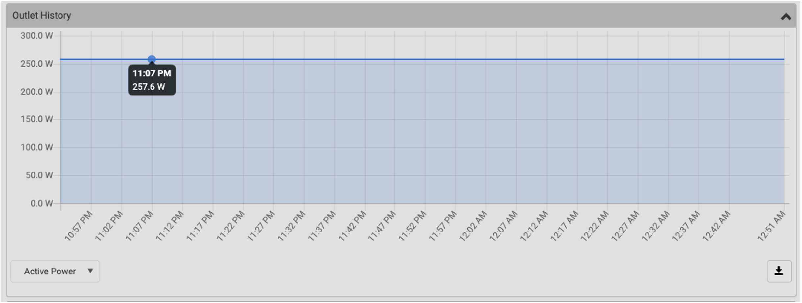

Around 257W measured on the PDU

On the CLI:

```
jnpr@qfx5130-208> show chassis power detail 
Chassis Power        Voltage(V)    Power(W)

Total Input Power                    256
  PSM 0
    State: Online
    Input 1             233          256
    Output            11.95        229.79
    Capacity           1600 W (maximum 1600 W)
  PSM 1
    State: Offline
    Input 1               0            0
    Output                0            0
    Capacity              0 W (maximum 0 W)

System:
  Zone 0:
      Capacity:          1600 W (maximum 1600 W)
      Allocated power:   1241 W (359 W remaining)
      Actual usage:      229 W
  Total system capacity: 1600 W (maximum 1600 W)
  Total remaining power: 359 W

jnpr@qfx5130-208> show chassis environment pem 
PSM 0 status:
  State                      Online
  Temperature                28 degrees C / 82 degrees F             
  Fans                       OK
  DC Output                  OK
  Firmware Version           21.41
  Fan 1                      17952
  Health check Information:
      Status:                   Health Check Not Supported
      Last Result:              Not Performed
      Last Execution:           Empty
      Next Scheduled Run:       Not Scheduled
PSM 1 status:
  State                      Offline
  Temperature                36 degrees C / 96 degrees F             
  Fans                       OK
  DC Output                  Failed
  Firmware Version           00.41
  Fan 1                      0
  Health check Information:
      Status:                   Health Check Not Supported
      Last Result:              Not Performed
      Last Execution:           Empty
      Next Scheduled Run:       Not Scheduled

jnpr@qfx5130-208>
```

Both input and output current information is available from "show chassis power" CLI.

In average, the CLI collection gives us 256.6W, compared to the 257W we see on the PDU, the difference is marginal.

## QFX5220

On the CLI:

```
root@spine1> show chassis power detail 
Chassis Power        Voltage(V)    Power(W)

Total Input Power                    420
  PSM 0
    State: Online
    Input 1             202           96
    Output            12.01         75.4
    Capacity           1600 W (maximum 1600 W)
  PSM 1
    State: Online
    Input 1             202           97
    Output            12.05         79.1
    Capacity           1600 W (maximum 1600 W)
  PSM 2
    State: Online
    Input 1             202          128
    Output            12.04        109.12
    Capacity           1600 W (maximum 1600 W)
  PSM 3
    State: Online
    Input 1             202           99
    Output            11.99        79.58
    Capacity           1600 W (maximum 1600 W)

Item                 Used(W)
  Routing Engine 0       47
  FPC 0                 156

System:
  Zone 0:
      Capacity:          6400 W (maximum 6400 W)
      Allocated power:   1640 W (4760 W remaining)
      Actual usage:      343 W
  Total system capacity: 6400 W (maximum 6400 W)
  Total remaining power: 4760 W

root@spine1> show chassis environment pem 
PSM 0 status:
  State                      Online
  Temperature                28 degrees C / 82 degrees F             
  Fans                       OK
  DC Output                  OK
  Firmware Version           00.00
  Fan 1                      5520
  Health check Information:
      Status:                   Health Check Not Supported
      Last Result:              Not Performed
      Last Execution:           Empty
      Next Scheduled Run:       Not Scheduled
PSM 1 status:
  State                      Online
  Temperature                31 degrees C / 87 degrees F             
  Fans                       OK
  DC Output                  OK
  Firmware Version           00.00
  Fan 1                      5520
  Health check Information:
      Status:                   Health Check Not Supported
      Last Result:              Not Performed
      Last Execution:           Empty
      Next Scheduled Run:       Not Scheduled
PSM 2 status:
  State                      Online
  Temperature                29 degrees C / 84 degrees F             
  Fans                       OK
  DC Output                  OK
  Firmware Version           00.00
  Fan 1                      5456
  Health check Information:
      Status:                   Health Check Not Supported
      Last Result:              Not Performed
      Last Execution:           Empty
      Next Scheduled Run:       Not Scheduled
PSM 3 status:
  State                      Online
  Temperature                34 degrees C / 93 degrees F             
  Fans                       OK
  DC Output                  OK
  Firmware Version           00.00
  Fan 1                      5520
  Health check Information:
      Status:                   Health Check Not Supported
      Last Result:              Not Performed
      Last Execution:           Empty
      Next Scheduled Run:       Not Scheduled

root@spine1> 
```

Both input and output current information is available from "show chassis power" CLI.

We don't have the proper metrology in our lab PDU to verify the accuracy of the Input counter.

## QFX5230

On the CLI:

```
root@dc-tme-qfx5230-64cd-01> show chassis power detail 
Chassis Power        Voltage(V)    Power(W)

Total Input Power                    304
  PSM 0
    State: Online
    Input 1             204          116
    Output            11.97        97.32
    Capacity           3000 W (maximum 3000 W)
  PSM 1
    State: Online
    Input 1             203          188
    Output               12        169.52
    Capacity           3000 W (maximum 3000 W)

Item                 Used(W)
  Routing Engine 0       17
  FPC 0                 104

System:
  Zone 0:
      Capacity:          6000 W (maximum 6000 W)
      Allocated power:   1241 W (4759 W remaining)
      Actual usage:      266 W
  Total system capacity: 6000 W (maximum 6000 W)
  Total remaining power: 4759 W

root@dc-tme-qfx5230-64cd-01> show chassis environment psm 
PSM 0 status:
  State                      Online
  Temperature                24 degrees C / 75 degrees F             
  Fans                       OK
  DC Output                  OK
  Hours Used                 20502
  Firmware Version           0212.0216
  Fan 1                      13568
  Fan 2                      12032
  Health check Information:
      Status:                   Not Performed
      Last Result:              Not Performed
      Last Execution:           Empty
      Next Scheduled Run:       2026-06-02 18:25:30 PDT
PSM 1 status:
  State                      Online
  Temperature                25 degrees C / 77 degrees F             
  Fans                       OK
  DC Output                  OK
  Hours Used                 24800
  Firmware Version           0212.0216
  Fan 1                      13504
  Fan 2                      12032
  Health check Information:
      Status:                   Not Performed
      Last Result:              Not Performed
      Last Execution:           Empty
      Next Scheduled Run:       2026-06-02 18:25:40 PDT

root@dc-tme-qfx5230-64cd-01> 
```

Both input and output current information is available from "show chassis power" CLI.

We don't have the proper metrology in our lab PDU to verify the accuracy of the Input counter.

## QFX5240/5241

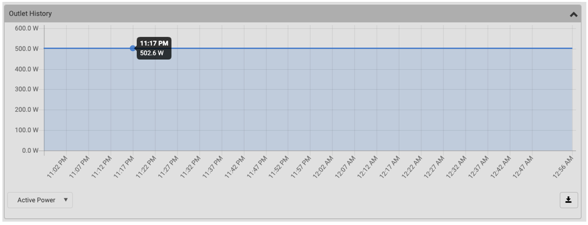

Around 502W measured on the PDU

On the CLI:

```
jnpr@qfx5240-217> show chassis power detail 
Chassis Power        Voltage(V)    Power(W)

Total Input Power                    500
  PSM 0
    State: Online
    Input 1             232          500
    Output            12.21        437.37
    Capacity           3000 W (maximum 3000 W)
  PSM 1
    State: Offline
    Input 1               0            0
    Output                0            0
    Capacity              0 W (maximum 0 W)

System:
  Zone 0:
      Capacity:          3000 W (maximum 3000 W)
      Allocated power:   2582 W (418 W remaining)
      Actual usage:      500 W
  Total system capacity: 3000 W (maximum 3000 W)
  Total remaining power: 418 W

jnpr@qfx5240-217> show chassis environment psm  
PSM 0 status:
  State                      Online
  Temperature                33 degrees C / 91 degrees F             
  Fans                       OK
  DC Output                  OK
  Firmware Version           00.02.02
  Fan 1                      7328
  Health check Information:
      Status:                   Health Check Not Supported
      Last Result:              Not Performed
      Last Execution:           Empty
      Next Scheduled Run:       Not Scheduled
PSM 1 status:
  State                      Offline
  Temperature                35 degrees C / 95 degrees F             
  Fans                       OK
  DC Output                  Failed
  Firmware Version           00.02.02
  Fan 1                      0
  Health check Information:
      Status:                   Health Check Not Supported
      Last Result:              Not Performed
      Last Execution:           Empty
      Next Scheduled Run:       Not Scheduled

jnpr@qfx5240-217>
```

Both input and output current information is available from "show chassis power" CLI.

The average power measured on a dozen of collections from the CLI gives us 500.1W, compared to the 502W we have on the PDU, it's a marginal difference. The counter can be fully trusted.

## QFX5700

On the CLI:

```
root@dc-tme-qfx5700-01-re0> show chassis power detail 
Chassis Power        Voltage(V)    Power(W)

Total Input Power                    478
  PSM 0
    State: Online
    Input 1             204          220
    Output            12.01        181.7
    Capacity           3000 W (maximum 3000 W)
  PSM 1
    State: Online
    Input 1             205          258
    Output            12.02        219.39
    Capacity           3000 W (maximum 3000 W)

Item                 Used(W)
  CB 0                   52
  FPC 0                  39
  FPC 1                  86
  FPC 4                  68
  Fan Tray 0             11
  Fan Tray 1             19
  FEB 0                 128

System:
  Zone 0:
      Capacity:          6000 W (maximum 6000 W)
      Allocated power:   1690 W (4310 W remaining)
      Actual usage:      478 W
  Total system capacity: 6000 W (maximum 6000 W)
  Total remaining power: 4310 W

{master}
root@dc-tme-qfx5700-01-re0> show chassis environment psm 
PSM 0 status:
  State                      Online
  Temperature                27 degrees C / 80 degrees F             
  Fans                       OK
  DC Output                  OK
  Hours Used                 21485
  Firmware Version           0211.0213
  Fan 1                      9984
  Fan 2                      8896
  Health check Information:
      Status:                   Not Performed
      Last Result:              Not Performed
      Last Execution:           Empty
      Next Scheduled Run:       2026-05-30 17:58:56 UTC
PSM 1 status:
  State                      Online
  Temperature                28 degrees C / 82 degrees F             
  Fans                       OK
  DC Output                  OK
  Hours Used                 21576
  Firmware Version           0211.0213
  Fan 1                      9984
  Fan 2                      8960
  Health check Information:
      Status:                   Not Performed
      Last Result:              Not Performed
      Last Execution:           Empty
      Next Scheduled Run:       2026-05-30 17:59:06 UTC

{master}
root@dc-tme-qfx5700-01-re0> 
```

Both input and output current information is available from "show chassis power" CLI.

We don't have the proper metrology in our lab PDU to verify the accuracy of the Input counter.

## Conclusion

In this article, we tried to answer a frequent customer question "can I trust the show commands counters related to power usage?". The answer being "yes, but..."

Yes, but you need to understand the difference between input and output current and understand the platforms supporting "input power". When this counter is available, for the platforms we were able to test in the lab, the number provided are very reliable.

Also, you certainly noticed the output of "show chassis power" could be very different from one router/switch to another. That's why a harmonization initiative is ongoing, cross-platform, to provide a unified output. It will be behind "**show chassis power extensive**". Stay tuned during the next (couple of) releases to see it implemented all over the board.

### Useful links

- [https://juniper.github.io/techposts/optimizing-power-consumption-in-high-end-routers/article](https://juniper.github.io/techposts/optimizing-power-consumption-in-high-end-routers/article)
- [https://juniper.github.io/techposts/saving-energy-on-ptx-with-pfe-power-off/article](https://juniper.github.io/techposts/saving-energy-on-ptx-with-pfe-power-off/article)
- [https://juniper.github.io/techposts/ptx10000-power-optimization/article](https://juniper.github.io/techposts/ptx10000-power-optimization/article)
- [https://juniper.github.io/techposts/saving-power-on-acx7000-series/article](https://juniper.github.io/techposts/saving-power-on-acx7000-series/article)
- [https://juniper.github.io/techposts/monitoring-ptx-power-environments-with-telemetry/article](https://juniper.github.io/techposts/monitoring-ptx-power-environments-with-telemetry/article)
- [https://juniper.github.io/techposts/ptx12008-power-distribution-and-optimization/article](https://juniper.github.io/techposts/ptx12008-power-distribution-and-optimization/article)
- What does Influence Power Consumption on Networking Devices? [https://www.youtube.com/watch?v=-aEYNDRB9Ck](https://www.youtube.com/watch?v=-aEYNDRB9Ck)
- Energy Savings in your Network? [https://www.youtube.com/watch?v=TNDoGGC0jqk](https://www.youtube.com/watch?v=TNDoGGC0jqk)

### Glossary

- AC: Alternating Current
- CB: Control Board
- CLI: Command-Line Interface
- DC: Direct Current
- EVO: Junos Evolved
- FEB: Forwarding Engine Board
- FPC: Flexible PIC Concentrator
- FRU: Field-Replaceable Unit
- GUI: Graphical User Interface
- HPE: Hewlett Packard Enterprise
- HVDC: High-Voltage Direct Current
- INP: Input
- PDU: Power Distribution Unit
- PEM: Power Entry Module
- PFE: Packet Forwarding Engine
- PIC: Physical Interface Card
- PoL: Point of Load
- POC: Proof of Concept
- PSM: Power Supply Module
- PSU:  Power Supply Unit
- RE: Routing Engine
- RPM: Revolutions Per Minute
- SFB: Switch Fabric Board
- SIB: Switch Interface Board
- TL;DR: Too Long; Didn't Read

### Acknowledgments

Many thanks to the POC team who provided access to their devices for this experiment: Georgios Vlachos and Dejan Tutnjevic (thanks for your patience Dejan). Thanks to Ridha Hamidi for the help on the QFXs. Thanks to Ankit Gupta for the explanations on ACX7020 architecture.
