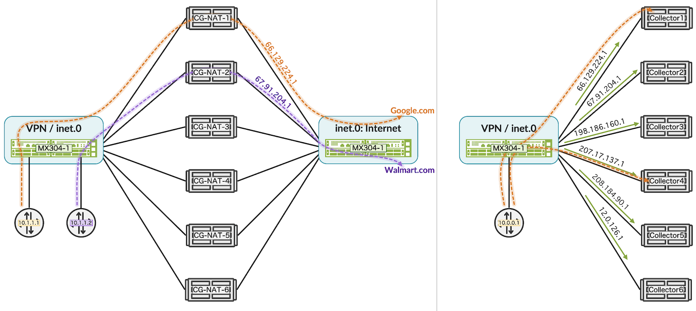
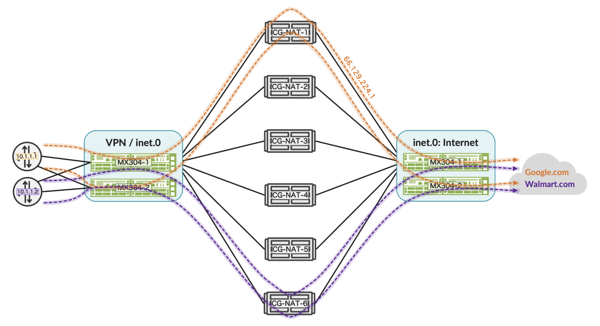

# Junos Symmetrical Load Balancing

**Moshiko Nayman - 06/19/2024**

Efficient stateless load-balancing on Trio-based routers, offering optimal performance and reliability.

## Introduction

Junos OS 24.2 introduces an innovative feature on the Juniper MX platform powered by the Juniper Trio chipset: symmetrical load balancing. This new capability enhances the router with efficient stateless load balancing, ensuring optimal performance and reliability in network traffic management at scale. Service providers can leverage the MX platform to symmetrically distribute traffic to collectors, firewalls, CG-NAT, DDOS protection, or other critical devices, eliminating the need for additional load balancers.

## Overview

Traditional routers have historically relied on protocols like BGP, IGP, and traffic engineering for load balancing but struggled to ensure consistent traffic routing. This often necessitated adding stateful load balancers, increasing operational costs and complexity.

Juniper's solution leverages the Juniper Trio chipset to introduce high-performance, symmetric, and consistent hash load balancing for BGP-learned paths or static. By using consistent hashing, this feature minimizes traffic disruptions and maintains stable flow even with changing ECMP paths. It ensures that traffic stays on active paths unless new paths increase ECMP links.

Symmetric load balancing on a single MX node correlates source and destination IP addresses as hash keys in both directions, ensuring reliable distribution in dynamic environments.

The Symmetric load balancing feature can serve as the solution for various use cases, enhancing network capabilities with a minimal footprint. By leveraging the Juniper Trio chipset, the MX router can symmetrically distribute traffic across multiple paths, ensuring consistent data forwarding for connected elements that require symmetry, such as NAT, DDoS protection, firewalls, and data collectors. Below is an example of how an MX router can function as a load balancer, efficiently managing traffic to multiple next-hop paths.



Junos' consistent and symmetrical load balancing ensures and maintains symmetry across multiple routers. For example, if you have R1 and R2 in your network, both will perform consistent symmetrical hashing, guaranteeing balanced traffic distribution throughout as per Figure 2.



## CLI Configuration Detail

```
set policy-options policy-statement CH-UPSTREAM term SRC-LB from route-filter 100.10.123.1/32 exact
set policy-options policy-statement CH-UPSTREAM term SRC-LB then load-balance source-ip-only
set policy-options policy-statement CH-UPSTREAM term SRC-SCH from route-filter 100.10.123.1/32 exact
set policy-options policy-statement CH-UPSTREAM term SRC-SCH then load-balance symmetric-consistent-hash
set policy-options policy-statement CH-UPSTREAM term SRC-SCH then accept

set routing-options forwarding-table export CH-UPSTREAM
```

If required, for the reverse, create another policy-statement with load-balance to source-ip-only.

**Load-balance source-ip-only / destination-ip-only**:

This action in the policy ensures that traffic is distributed across multiple paths based solely on the source IP address of incoming packets. This method helps maintain symmetrical hash-key distribution in upstream traffic flows on Juniper MX routers.

**Load-balance symmetric-consistent-hash**:

This action ensures symmetrical and consistent distribution of traffic across ECMP paths. It utilizes a sorting mechanism based on the next-hop IP address to maintain uniformity in path selection for both upstream and downstream traffic flows, enhancing reliability and predictability in dynamic network environments.

The policy applied to forwarding-table inet.0 or VRF enables symmetric load balancing for traffic directed towards a Virtual IP (VIP) acting as an anycast destination, such as 100.10.123.1. This feature optimizes traffic distribution across multiple next-hop paths, ensuring efficient utilization of network resources.

Forwarding Based Routing (FBF) can leverage this capability by utilizing a VIP route within firewall filters. This enhances the ability to route traffic between different routing instances (VRFs), thereby improving routing flexibility and traffic management across diverse network environments.

To clarify, in this scenario, a VIP route refers to a virtual IP address strategically employed to control traffic routing without physically existing on the network. For instance, to direct client traffic from source IP 1.1.1.1 destined for IP 66.129.224.1 via multiple next-hop routers, a network engineer can configure a route to a VIP such as 100.10.123.1.

Here's an example to illustrate its hierarchy and functionality:

```
mnayman@MX-1> show route 66.129.224.0/22 table inet.0 extensive expanded-nh 

inet.0: 91 destinations, 219 routes (91 active, 0 holddown, 0 hidden)
66.129.224.0/22 (1 entry, 1 announced)
Installed-nexthop:
Indr (0x8940a94) 100.10.123.1 Session-ID: 326
  Krt_inh (0x84dfb98) Index:1048579 PNH: 100.10.123.1
    List (0x89de214) Index:1048594
      Router (0x8948094) Index:836 10.10.1.11 Session-ID: 337 via ae1.10
      Router (0x8948114) Index:840 10.10.1.22 Session-ID: 335 via ae2.10
      Router (0x8948194) Index:838 10.10.1.33 Session-ID: 339 via ae3.10
```

The forwarding plane installs the real next-hops required to reach the destination:

```
mnayman@MX-1> show route forwarding-table destination 66.129.224.0/22 table default extensive 
Routing table: default.inet [Index 0] 
Internet:
    
Destination:  66.129.224.0/22
  Route type: user                  
  Route reference: 0                   Route interface-index: 0   
  Multicast RPF nh index: 0             
  P2mpidx: 0              
  Flags: sent to PFE, prefix load balance  
  Next-hop type: indirect              Index: 1048579  Reference: 2    
  Next-hop type: unilist               Index: 1048594  Reference: 3    
  Nexthop: 10.10.1.11
  Next-hop type: unicast               Index: 836      Reference: 3    
  Next-hop interface: ae1.10        Weight: 0x0  
  Nexthop: 10.10.1.22
  Next-hop type: unicast               Index: 840      Reference: 3    
  Next-hop interface: ae2.10        Weight: 0x0  
  Nexthop: 10.10.1.33
  Next-hop type: unicast               Index: 838      Reference: 3    
  Next-hop interface: ae3.10        Weight: 0x0
```

## Symmetric Load Balancing in Action

Below example of route with multiple next-hop in the routing and forwarding engine:

```
mnayman@MX-1> show route 100.10.123.1/32    

inet.0: 91 destinations, 219 routes (91 active, 0 holddown, 0 hidden)
+ = Active Route, - = Last Active, * = Both

100.10.123.1/32    *[Static/5] 00:32:25
                       to 10.10.1.11 via ae1.10
                    >  to 10.10.1.22 via ae2.10
                       to 10.10.1.33 via ae3.10

mnayman@MX-1> show route forwarding-table destination 100.10.123.1/32 table default 
Routing table: default.inet
Internet:
Destination        Type RtRef Next hop           Type Index    NhRef Netif
100.10.123.1/32    user     0                    ulst  1048594     3
                              10.10.1.11         ucst      836     3 ae1.10
                              10.10.1.22         ucst      840     3 ae2.10
                              10.10.1.33         ucst      838     3 ae3.10
```

Use the "extensive" command to verify the functionality on each plane. The control plane will flag the load balancing type, showing how routes are handled and how next-hop information is maintained. Meanwhile, the forwarding plane will display details such as the equal weight field, demonstrating how traffic is balanced across multiple paths.

```
mnayman@MX-1> show route 100.10.123.1/32 extensive 

inet.0: 91 destinations, 219 routes (91 active, 0 holddown, 0 hidden)
100.10.123.1/32 (1 entry, 1 announced)
TSI:
KRT in-kernel 100.10.123.1/32 -> {list:10.10.1.11, 10.10.1.22, 10.10.1.33 Flags destination ip load-balance symmetric-consistent-hash}
        *Static Preference: 5
                Next hop type: Router, Next hop index: 0
                Address: 0x89de114
                Next-hop reference count: 5, Next-hop session id: 0
                Kernel Table Id: 0
                Next hop: 10.10.1.11 via irb.10
                Session Id: 0
                Next hop: 10.10.1.22 via irb.10, selected
                Session Id: 0
                Next hop: 10.10.1.33 via irb.10
                Session Id: 0
                State: <Active Int Ext>
                Local AS:  7018 
                Age: 2:56:14 
                Validation State: unverified 
                Task: RT
                Announcement bits (3): 0-KRT 2-Resolve tree 5 4-Resolve_IGP_FRR task 
                AS path: I 
                Session-IDs associated:
                Session-id: 326 Version: 1
                Thread: junos-main

mnayman@MX-1> show route forwarding-table destination 100.10.123.1/32 table default extensive    
Routing table: default.inet [Index 0] 
Internet:
    
Destination:  100.10.123.1/32
  Route type: user                  
  Route reference: 0                   Route interface-index: 0   
  Multicast RPF nh index: 0             
  P2mpidx: 0              
  Flags: sent to PFE, dst-ip-only load balance , rt nh decoupled  
  Next-hop type: unilist               Index: 1048594  Reference: 3    
  Nexthop: 10.10.1.11
  Next-hop type: unicast               Index: 836      Reference: 3    
  Next-hop interface: ae1.20        Weight: 0x0  
  Nexthop: 10.10.1.22
  Next-hop type: unicast               Index: 840      Reference: 3    
  Next-hop interface: ae2.20        Weight: 0x0  
  Nexthop: 10.10.1.33
  Next-hop type: unicast               Index: 838      Reference: 3    
  Next-hop interface: ae3.20        Weight: 0x0  
```

## Other Load-Balancing Mechanisms Supported by Junos

While symmetrical load balancing is a powerful feature of the Juniper MX platform, Junos OS supports a variety of other load-balancing mechanisms to suit different network requirements and scenarios:

- **Per-Prefix Load Balancing**: This method maps each prefix to only one forwarding next-hop, ensuring that each prefix consistently routes through the same path.
- **Per-Packet Load Balancing**: In this approach, all next-hop addresses for a destination in the active route are installed in the forwarding table. This ensures packets are distributed across multiple paths, akin to what other vendors refer to as per-flow load balancing. For more details, see Configuring Per-Packet Load Balancing.
- **Random Packet Load Balancing**: This method involves picking next-hops randomly for each packet. It's available on MX routers with MPC line cards for Aggregated Ethernet interfaces and ECMP paths. For configuration, refer to Example: Configuring Aggregated Ethernet Load Balancing.
- **Per-Packet Random Spray Load Balancing**: As a last resort when adaptive load balancing fails, this method ensures ECMP members are equally loaded without considering bandwidth, although it may cause packet reordering. It's recommended only if applications can handle reordering. Starting in Junos OS Release 20.2R1, it can be configured on specific MX router models with particular line cards.

These diverse load-balancing options provide networks with greater flexibility, saving costs and improving throughput efficiency for various network conditions, ultimately enhancing performance and reliability across different deployment scenarios.

## Understanding Hash Keys in Junos OS for Load Balancing

Junos OS offers a variety of hash-key options, the selection of the forwarding next-hop relies on computing a hash over specific packet header fields and internal parameters, such as interface index. You can configure these fields to customize the hashing algorithm as needed.

- **conditional-match**: Introduced in 20.4R1, conditional-match allows configuring specific byte offsets in packet headers for flexible hashing based on user-defined conditions. This feature supports IPv4 and IPv6 protocols, enabling precise load balancing by specifying conditions on data patterns within packet headers.
- **family**: Specifies different protocol families (e.g., inet, inet6, mpls, multiservice) for which hash key configurations are applied. Each family has its own set of hash key options tailored to the specific protocol.
- **flex-hashing**: Introduced in 20.4R1, flex-hashing supports user-defined configurations for MPLS traffic, leveraging TCP or UDP source and destination port information. This feature allows administrators to define byte offsets within the first 128 bytes of packets, influencing hashing computations to optimize load distribution across network paths.
- **hash-seed**: Defines the initial seed value used in hash calculations. Adjusting the hash seed can alter the distribution of traffic across multiple paths.
- **mpls**: Implements per-packet load balancing for MPLS flows, ensuring uniform distribution across next hops. Junos OS uses a hash algorithm to select next-hop addresses, reselecting them when the set of next hops changes. Configuration options include optimizing load balancing across equal-cost LSPs using MPLS labels.

To ensure entropy for VPLS & VPWS traffic, Junos OS can generate a hash using data from the IP header along with up to three MPLS labels (referred to as the top labels).

As more network features use labels (e.g., MPLS Fast Reroute, RFC 3107, RSVP, VPN), the top three labels can become static and inadequate for maintaining entropy. This can lead to skewed load balancing or increased out-of-order packet delivery. In such cases, using labels from the bottom of the stack is recommended (refer to Table 1 for details). Note that top and bottom labels cannot be used simultaneously.
- **services-loadbalancing**: Distributes traffic across PICs based on the source IP address when a route points to multiple services PICs.
- **source-destination-only-loadbalancing**: Directs IPv4 (inet) and IPv6 (inet6) traffic based on the source address for incoming traffic and the destination address for outgoing traffic. This feature is typically configured in ECMP or aggregated Ethernet (AE) environments across service provider networks. This feature will only work on IP-based traffic.

For L3VPN traffic, PE routers perform MPLS lookup by default under the default label assignment scheme. To enable source-destination-only load-balancing for L3VPN, configure either vrf-table-label or add a vt-interface in the routing instance.
- **vxlan**: Implements load balancing for VXLAN traffic based on the outer IP/UDP header.
- **symmetric**: Supported on MX platforms, symmetric load balancing is enabled across aggregated Ethernet interfaces.

## Glossary

- AE: Aggregated Ethernet
- BGP: Border Gateway Protocol
- CG-NAT: Carrier-grade NAT also known as large-scale NAT
- ECMP: Equal-Cost Multi-Path
- IFL: Interface Logical
- IP: Internet Protocol
- Junos: Operating System used in Juniper Networks routing, switching and security devices.
- NAT: Network Address Translation
- PE: Provider Edge router
- PFE: Packet Forwarding Engine
- RE: Routing Engine
- VIP: Virtual IP
- VXLAN: Virtual eXtensible Local-Area Network

## Useful links

- Mastering BGP PIC on JUNOS:
[https://juniper.github.io/techposts/mastering-bgp-pic-on-junos/article](https://juniper.github.io/techposts/mastering-bgp-pic-on-junos/article)
- BGP Link-Bandwidth with JunOS:
[https://juniper.github.io/techposts/bgp-link-bandwidth-with-junos/article](https://juniper.github.io/techposts/bgp-link-bandwidth-with-junos/article)

## Acknowledgments

Thanks to Sachin Kumar, Swamy SRK for developing the feature in Junos OS
