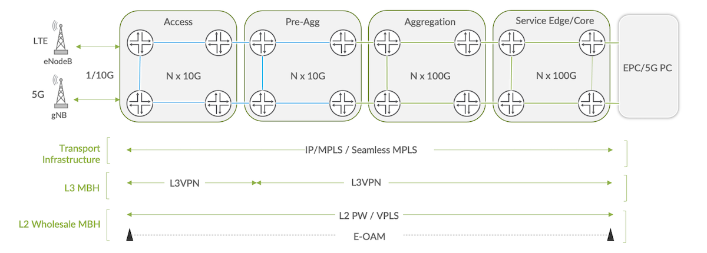
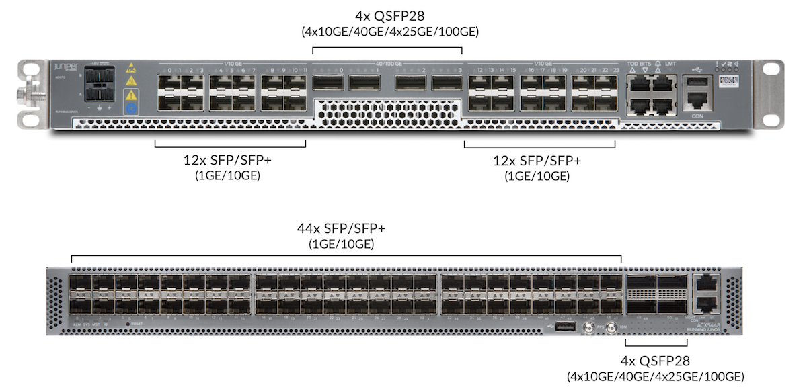
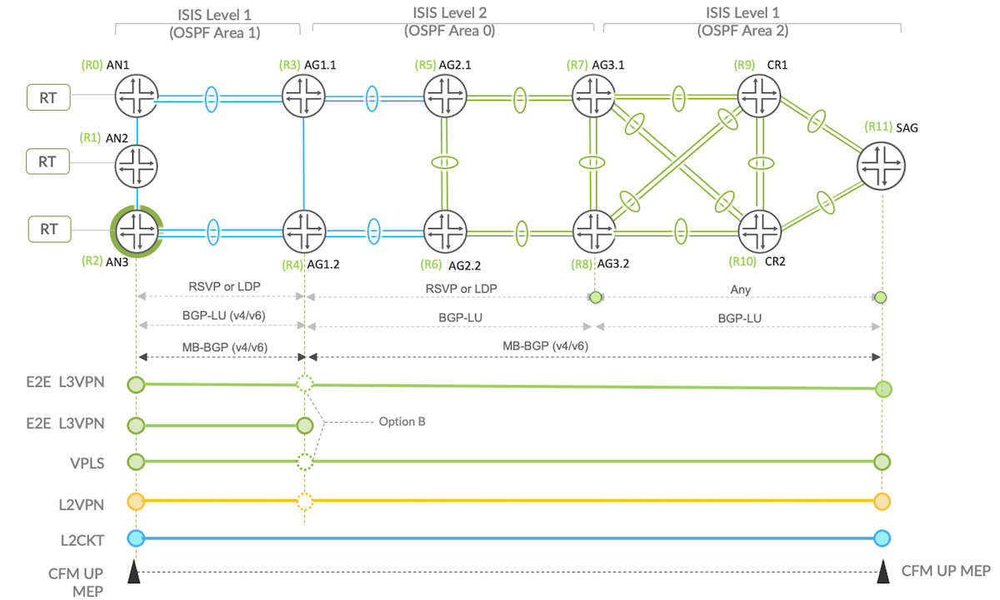
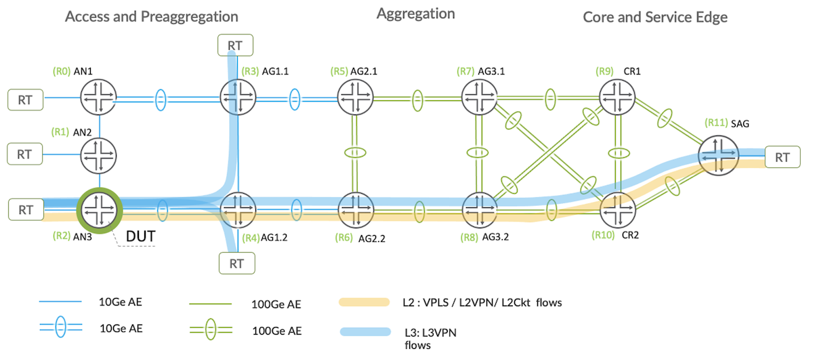

# JVD Mobile Backhaul Overview

**Kevin Brown - 06/28/2022**

Summary of the Juniper Validated Design series dedicated to 5G xHaul reference architecture (Fronthaul, Midhaul, and Backhaul network segments).

Welcome to the Juniper Validated Design (JVD) series.

The motivation behind JVD has been detailed in this previous article: [https://juniper.github.io/techposts/introducing-the-validation-series/article](https://juniper.github.io/techposts/introducing-the-validation-series/article)

For this validation blog, our team selected a profile out of the 5G xHaul reference architecture, which consists of Fronthaul, Midhaul, and Backhaul network segments. Today we'll focus on the backhaul portion to deliver 4G/5G Layer 2 and Layer 3 services over an inter-domain Seamless MPLS infrastructure. The mobile backhaul (MBH) encompasses the technologies required to provide connectivity from cell sites to the mobile packet core segment, spanning the fronthaul and midhaul domains. The MBH use case presents unique complexities due to requirements to support legacy and next-generation technologies simultaneously.

The featured solution builds upon [Juniper Networks 4G MBH Design Guide](https://www.juniper.net/documentation/en_US/release-independent/solutions/information-products/pathway-pages/Juniper_4G_MBH_DG.pdf) by incorporating additional protection and optimization mechanisms which are critical for supporting modern mobile infrastructures.

With all JVD validations, our teams build out the physical topology and create an end-to-end solution design based on practical use cases, which are commonly deployed. The solutions provided are immediately supported by all devices. To meet the MBH architecture requirements, the topology was built leveraging the following Juniper routers running JUNOS 20.2R2.

- **ACX710** (access nodes)
- **ACX5448** (preaggregation nodes)
- **MX204/MX480/MX10003** (aggregation nodes)
- **PTX1000 & MX10003** (Core routers)
- **MX10003** (service aggregation gateway (SAG) routers)

Juniper Universal Metro routers ACX5448 and ACX710 were selected as primary DUTs with other devices listed as helper nodes. During the course of validation, over 160 functional test cases were successfully executed!

The foundation of the mobile infrastructure starts with the transport underlay. Seamless MPLS provides a systematic method of delivering MPLS solutions across all network segments - access, preaggregation, aggregation, and core. Each region within the MBH infrastructure may exist as separate Interior Gateway Protocol (IGP) domains. Seamless MPLS provides a transport framework for stitching disparate regions together to create a scalable and resilient borderless architecture. Network and services architectures are decoupled to enable flexible service delivery models.

End-to-End MBH network infrastructure is emulated in the test topology with four major segments:

- **Access**: ACX710 & ACX5448 Cell Site Routers (CSR) / Access Nodes (AN1, AN2, AN3).
- **Preaggregation**: ACX5448 Aggregation routers AG1.1 and AG1.2.
- **Aggregation**: MX204, MX480 and MX10003 Aggregation routers AG2.1/AG2.2, AG3.1/AG3.2.
- **Core**: PTX1000, MX10003 Core routers CR1/CR2 and service routers (SAG)

Four transport layer profiles are validated for intra/inter-domain MPLS tunneling and protection mechanism. With each profile either ISIS or OSPF IGP underlay leveraged with LDP-signaled MPLS rLFA protection or RSVP-signaled MPLS FRR protection. In all profiles, BGP-LU is utilized at border nodes to stitch domains together.

| MBH-Base-01-0-[profile] | Profile 1 | Profile 2 | Profile 3 | Profile 4 |
|:--|:--|:--|:--|:--|
| IGP | ISIS | OSPF | ISIS | OSPF |
| Intra Domain MPLS Tunnel | LDP | LDP | RSVP | RSVP |
| Protection | R-FLA | R-LFA | FRR | FRR |
| Inter Domain Transport | BGP-LU | BGP-LU | BGP-LU | BGP-LU |

The diagram below represents all four transport profiles, which feature inter-domain Seamless MPLS with BGP Labeled Unicast (BGP-LU) stitching at border nodes between IGP domains. From the access segment, the cell site routers (access nodes) originate L2/L3 VPN services and interconnects with the RAN. Preaggregation AG1.1/AG1.2 routers function as redundant BGP route reflectors with access node clients and further serve as area border routers between access/preaggregation and aggregation domains. AG3.1 and AG3.2 aggregation area border routers serve as redundant route reflectors toward preaggregation AG1.1/AG1.2 clients and provide border node functions between aggregation and core segments. Transport node LSRs include aggregation AG2.1/AG2.2 and Core CR1/CR2 devices, with LDP or RSVP signaled MPLS and ISIS or OSPF IGP, depending on transport profile used. From the core network, the Services Aggregation Gateway (SAG) router, connects into the EPC elements and peers Multiprotocol BGP (MP-BGP) for L3VPN, 6PE, L2VPN/VPLS services and supporting inter-as option B with preaggregation AG1.1/AG1.2 routers.

Service overlay MBH profiles include L3VPN with coverage for both IPv4 and IPv6 with 6PE. Layer 2 MBH wholesale services are enhanced with Ethernet OAM (CFM / IEEE 802.1ag) protocols over E-LAN (VPLS/L2VPN) and E-LINE (L2Circuit) use cases.

| Use Case | Service Profiles | Services Types |
|:--|:--|:--|
| L3 MBH | End-to-End L3VPN between CSR (AN) to SAG (PE) router | IPv4IPv6 with 6PE |
| L2 MBH Wholesale | BGP VPLS Option B between CSR and SAG routers | Port & VLAN basedEOAM |
| L2 MBH Wholesale | L2VPN Option B between CSR (AN3) and SAG routers | Port & VLAN basedEOAM |
| L2 MBH Wholesale | L2Circuit (martini) Option C between AN and SAG routers | Port & VLAN basedEOAM |

The validated profile does not attempt to qualify maximum scale of the platforms under test but rather makes use of practical scale found in common Mobile Backhaul network deployments. For the given validation, each Access Node, Preaggregation and Service Edge Router include the below scale.

| Service Type | AN3 (DUT) | AG1 | SAG |
|:--|:--|:--|:--|
| L3VPN | 100 | 120 | 320 |
| VPLS | 100 | 1000 | 1125 |
| L2VPN | 100 | 1000 | 1130 |
| L2ckt | 100 | 1000 | 1800 |
| VLANs | 400 | 3120 | 4375 |

Traffic flows are generated from CSR to HSR, CSR to SAG and HSR to SAG.

The decoupling of services from transport architecture is a key aspect of Juniper Cloud Metro solutions. In this blog, we reviewed the Juniper Validated Design for supporting Mobile Backhaul architectures. In the continuation, we'll break down the transport underlay profiles, which include:

1. Profile 1: MPLS LDP-Signaled with ISIS
2. Profile 2: MPLS LDP-Signaled with OSPF
3. Profile 3: MPLS RSVP-Signaled with OSPF
4. Profile 4: MPLS RSVP-Signaled with ISIS

From here, we will see how BGP Labeled Unicast provides the stitching mechanisms to deliver Seamless MPLS and dissect each service overlay use case with the configurations required to deliver the solutions.

## Glossary

- ABR: Area Border Router
- AG: Aggregation
- AN: Access Node
- BFD: Bidirectional Forwarding Detection
- BGP: Border Gateway Protocol
- BGP-LU: Border Gateway Protocol Labeled Unicast
- BH: Backhaul
- BN: Border Node
- CR: Core
- E-LINE: Ethernet Virtual Private Line
- E-LAN: Ethernet Virtual Private Local Area Network
- FEC: Forwarding Equivalence Class
- FH: Fronthaul
- FRR: Fast Reroute
- IGP: Interior Gateway Protocol
- IP: Internet Protocol
- IPv4: Internet Protocol version 4
- IPv6: Internet Protocol version 6
- IS-IS: Intermediate System to Intermediate System
- JVD: Juniper Validated Design
- LFA: Loop Free Alternative
- LDP: Label Distribution Protocol
- MBH: Mobile Backhaul
- MH: Midhaul
- MPLS: MultiProtocol Label Switching
- OAM: Operation, Administration, and Maintenance
- OSPF: Open Shortest Path First
- PFE: Packet Forwarding Engine
- PLR: Point of Local Repair
- R-LFA: Remote Loop Free Alternative
- RR: Route Reflector
- RSVP: Resource Reservation Protocol
- SAG: Services Aggregation Gateway
- T-LDP: Targeted Label Distribution Protocol
- VPN: Virtual Private Network

## Useful links

The Juniper Validated Design series are organised as:

- [JVD Overview](https://juniper.github.io/techposts/introducing-the-validation-series/article)
- [Seamless MPLS LDP with OSPF underlay](https://juniper.github.io/techposts/seamless-mpls-ldp-with-ospf/article)
- [Building Border Agnostic Architectures with Seamless MPLS](https://juniper.github.io/techposts/border-agnostic-architectures-with-seamless-mpls/article)
