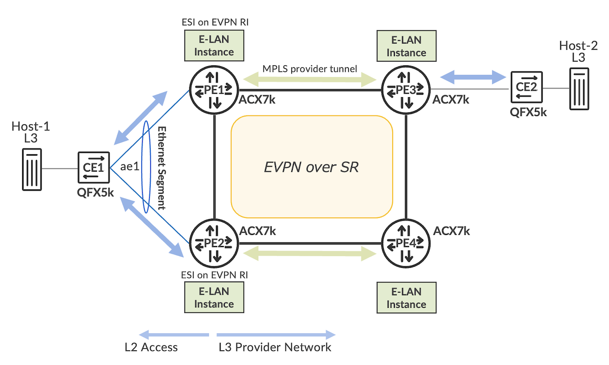
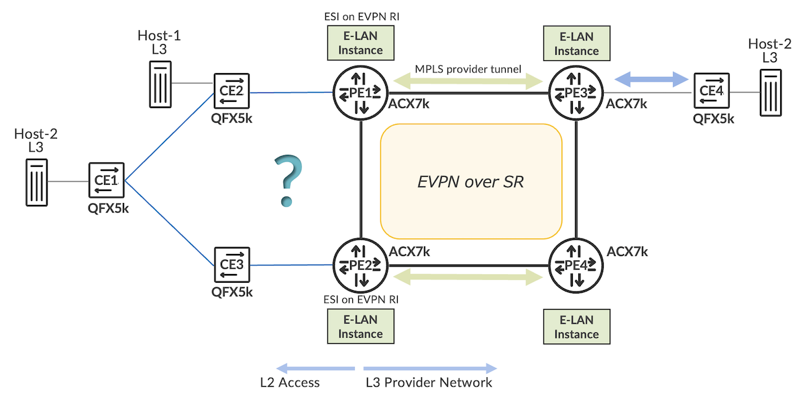
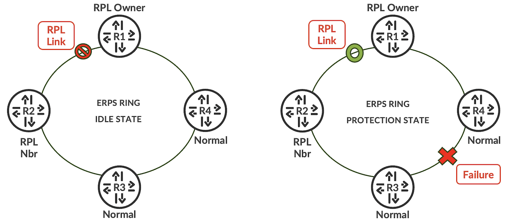
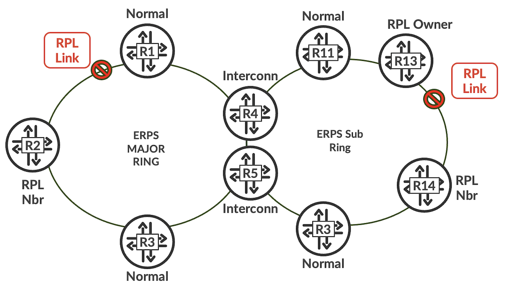
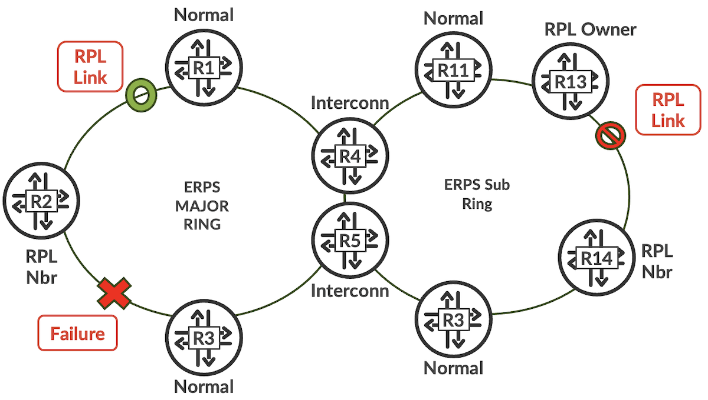
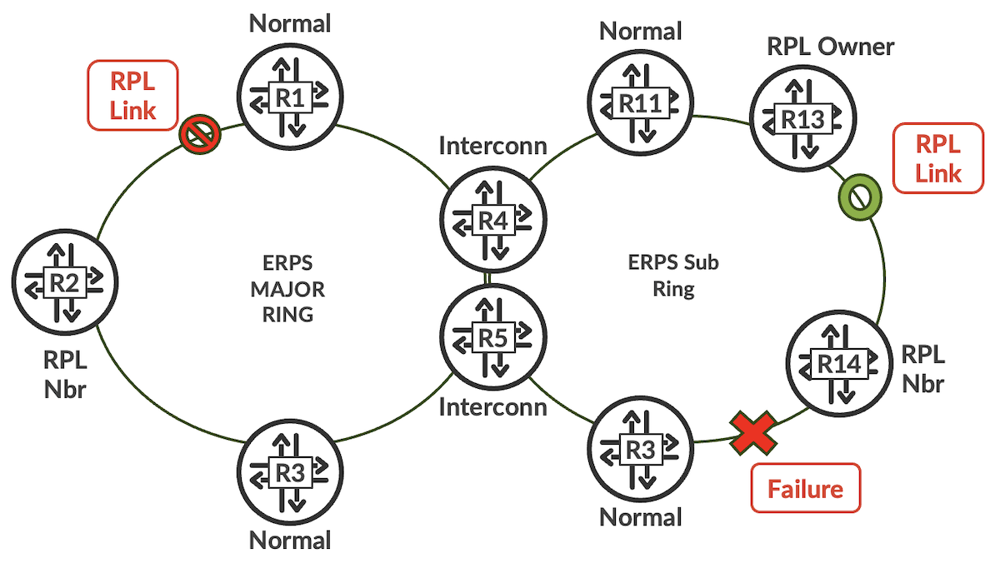
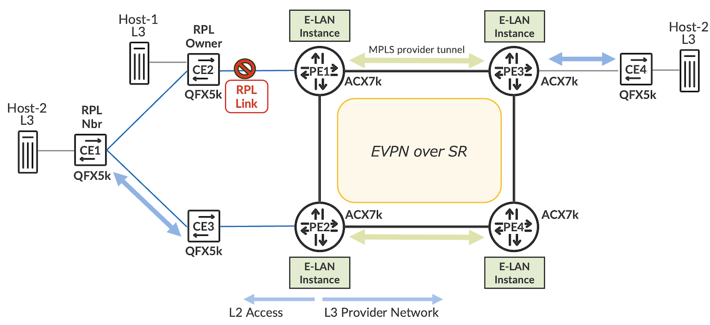

# L2 Metro Ring-Access With EVPN-ELAN

**Aris Georgakas - 10/29/2025**

EVPN technology provides native CE direct L2 multi-homing capabilities, in either Active-Active or Active-Standby scheme. However, there might be a need for certain L2 access domains to form a ring topology around the EVPN PE endpoints. In our ACX7K JUNOS-EVO platforms, we leverage ERPS open-ring architecture (aka "non-vc-mode" G.8032v2 with subrings) to cover this use case and provide fast convergence under various failure conditions.

## EVPN-ELAN ESI Multihoming Access Quick Refresh

EVPN is the protocol of choice for flexible and scalable L2 overlay connectivity for modern transport networks. A unique EVPN characteristic is that MAC address learning between PEs occurs in the BGP control plane. The PE routers exchange MAC and MAC-IP routes reachability information using multiprotocol-BGP and then encapsulate customer CEs' L2 traffic for forwarding between PEs. Two main encapsulation schemes are supported: MPLS (RFC7432) and VXLAN (RFC8365).

One of the significant advantages of EVPN technology is multihoming capability. It enables you to connect a customer site to two or more PE devices, providing redundant connectivity, which means a CE device can be multihomed to different PE devices. EVPN treats these PE-CE connections within the same EVPN Instance (aka EVI) as belonging to the same Ethernet Segment. In other words, it assigns the same Ethernet Segment identifier (ESI) on the inter-connections towards the same L2 CE end-device.

In EVPN, using a standard Ethernet segment identifier (ESI) on CE attach-circuits terminating to both EVPN PEs, allows for establishing a loop-free topology towards the CE device and enables fast convergence. ESI is exchanged as EVPN route type-1, through BGP protocol established between PEs. Due to this common ESI attribute, the remote PE can detect an access failure and reroute the traffic towards its multihoming PE peer.

ESI LAG access can be configured as active-active (A-A) or active-standby (A-S), like MC-LAG predecessor multihoming access scheme.

The EVPN route type-4 is only advertised for CE multi-homing use case, i.e., when ESI has a non-zero value. It determines which EVPN PE terminating the ESI will become the Designated Forwarder (DF). DF is the only forwarder of BUM traffic in a particular Ethernet segment, and non-DF PEs block BUM traffic. The Type-4 route is advertised only between the multi-homing PE peers, terminating the Ethernet segment.

Note that the configured ESI value must be unique across all IFDs (i.e., ESI per major interface) and IFLs (i.e., ESI per sub-interface, if you wish to balance the service VLANs among the multihoming PEs). Features like EVPN "Egress-Link-Protection" and "Dynamic-List-Next-Hop" improve convergence times dramatically; however, it is not within the scope of this article to analyze them further.



Figure 1 illustrates a typical EVPN access ESI LAG scheme, where CE1 is EVPN multihomed (MH) to two PE routers with direct PE-CE connections. CE is unaware that it is connected to two individual PE devices and treats the multihoming connection as a LAG interface with LACP protocol activated optimally (optionally).

With respect to EVPN routing, CE2 has two overlay routing paths to reach CE1. The ESI Multihoming mode (A-A vs A-S) determines which PE router or both PE routers forward(s) traffic to the CE1. The PE router forwarding traffic to the CE1 device is termed Designated Forwarder (DF). If a failure occurs over this path, a new designated forwarder is elected to forward the traffic to CE1. The DF PE is responsible for forwarding BUM traffic towards multi-homed CE. When an ingress PE floods BUM traffic, it adds ESI label and prevents flood traffic from echoing back to the CE multi-homed Ethernet Segment (split-horizon filtering). ESI label is used only for BUM traffic.

Therefore, EVPN ESI multihoming helps to maintain EVPN service and traffic forwarding to and from the multihomed site in the event of the following types of network failures:

- PE to CE link failure
- PE node failure
- MPLS transport failure between a local PE and a remote PE

The typical EVPN-ELAN ESI MH access scenario described is familiar and common for most of us. This was a true evolution of the traditional MCLAG-to-VPLS ELAN decoupled mode, embedding multi-homing capability within the EVPN-ELAN protocol natively. Note also that BGP-VPLS has also native CE multi-homing capability (supported for both FEC 128 and FEC 129 auto-discovery flavors), however only active-standby MH access was feasible.

Nevertheless, in metro environments, we may still encounter L2 ring access topology, where multiple daisy-chained CE devices are East-West (E-W) connected towards the PE EVPN routers. xDWDM with e.g. Passive MUX/DEMUX filters and colored optics or Add-Drop MUXes, could provide a solution in this case and emulate from each respective CE direct MH connections towards PEs, through common fiber Rx-Tx fiber infrastructure.

Still, though, there might be use cases where xDWDM workarounds cannot be implemented, due to additional cost, space/power constraints, etc., and another L2 loop-free fast-convergence solution needs to be deployed. Hence, stay tuned for the following sections!

## L2 Ring-Access with PWE Overlays Challenges

L2 ring access domains to MPLS Core, is not a new topic of concern. With VPLS ELAN predecessor access it was always a metro design consideration. Original approach was to deploy xSTP protocol within the CEs ring topology and PEs participating on it, i.e. PEs being part and hold state of STP state machine. Then using PWEs to remote PEs locations, they could create overlay interconnects from one L2 access domain to another remote one. Unfortunately, this approach was always hiding loop risks for our Core network, since L2 control traffic is not forwarded by default over PWE overlays, meaning xSTP Is not eligible to detect and block an end-to-end loop.

There are still ways to improve and fine-tune, obviously: e.g., allowing BDPU (tagged or untagged) control packets through dedicated PWEs overlays (L2PT activation may be required), or trying to interconnect MH PEs with a dedicated L2 link, etc. Again, these are not always feasible: e.g., my PEs are deployed within cabinets and physical inter-connections are not available; or very costly to implement, and still "hide" loop risks. This is especially true for L2 BUM traffic, which can accidentally be forwarded towards CE ring access domains, from both MH PE sides (due to L2 split-horizon flood rules), and then facing a catastrophic L2 loop condition.

To be fair, other vendors have developed some evolved technologies using PE L2 Access-Gateway technology (termed as AGs, e.g., MST-AG). This is a form of minimal xSTP implementation on the PEs' side, where the PEs themselves do not really hold any xSTP state and do not need to handle any other BPDU - except TCNs.  L2 access ring CEs still run xSTP, and through the AG PEs feature, we get a L2 loop-free e2e operation and optimal convergence. For various reasons, we never invested in JUNOS/EVO for this feature development.

One of them was that the EVPN-ELAN emerging protocol is becoming more and more popular, and it could solve most of these access design concerns natively. So let us focus on this!

## L2 Ring-Access with ERPS-to-EVPN

What about modern EVPN and L2 ring access? Is there a simple way to have an L2 Ring-Access and be able to obtain e2e loop-free, scalable, and fast-convergence topologies over my MPLS transport?  Can I still have the luxury of Anycast/VGA IRB floating Gateways, like in direct CE MH connectivity?

In the diagram below, we have an L2 ring access topology with three CE1, CE2, and CE3 L2 devices being daisy-chained, and the ring endpoints are East-West (E-W), terminating on PE1 and PE2 EVPN routers, respectively. In our physical topology, there is a physical back-to-back (b2b) link between PE1 and PE2. However, even if a b2b link is not feasible in a real-life metro aggregation topology, we could only rely on MPLS underlay connectivity through the upstream P/PE routers. The b2b local link usually facilitates lower latency, faster convergence times, and eliminates traffic "tromboning" upon node/link local failures. Just be aware that this b2b link between PE1 and PE2 is a pure L3 MPLS link, i.e., it is not a L2 direct link for closing the L2 access ring.



**Concern 1**: Can I have EVPN ESI-LAG MH A-A balancing with L2 ring access? The simple answer is "No". Main Reasons:

- For downstream traffic sourced by Host-3 towards the remote L2 access ring, PE3 will perform EVPN aliasing and load balance overlay L2 traffic across both PE1 and PE2. At the same time our L2 ring access may run a L2 protocol, like xSTP or ERPS, to eliminate L2 loops within the access domain and thus have a particular port blocked for this purpose.  This may lead to partial L2 traffic blackholing if traffic destined to a specific CE enters the ring from the wrong PE side.
- L2 BUM downstream traffic towards the ring is only forwarded through the elected DF. But again, due to PE downstream traffic aliasing and any blocked ports within the ring, BUM traffic may never manage to reach certain CE1-CE2-CE3 nodes.
- Due to common ESI label filtering rules, L2 protocol TCN packets may not be able to be propagated through all the CE members of the ring,

**Concern 2**: Can I have EVPN ESI-LAG MH A-S with L2 ring access? This can only be used if the L2 access domain does not need to run any L2 protocol loop protection mechanism, and other methods are used to determine E-W L2 traffic flow from/to each CE under normal operation. Even under this condition - i.e. when there is no mechanism to determine E-W and we only rely on EVPN A-S BGP between PEs to eliminate the loop - this may lead to some suboptimal behavior during failovers and slow convergence. This is because Core PEs are totally "decoupled" and "agnostic" of the subtended access ring topology and forwarding state, not aware at all.

On the other hand, if we decide to run an L2 protocol on the L2 access ring (e.g. because we have a ladder ring access topology), then ESI-LAG MH A-S is not feasible at all. Main reasons in this case:

- For downstream traffic sourced by CE3 towards the remote L2 access ring, PE3 will steer overlay L2 traffic across towards the DF PE node (Modulo based or preference-based algorithms for DF selection); assuming PE1 for our Figure-2 diagram. At the same time, the L2 protocol, like xSTP or ERPS, will have a particular port blocked to ensure L2 loop-free topology. This may lead to certain L2 traffic blackholing for one specific destination CE on the ring, since the blocked port in access will prohibit it from arriving at it. This applies to both unicast and BUM traffic flows.
- Due to common ESI label filtering rules, L2 protocol TCN packets may not be able to be propagated through all the CE members of the ring,

In fact, there is an IETF draft for the EVPN Ring access use-case, but it is not widely adopted at the moment. We do not support it on any JUNOS platform currently: [draft-brissette-bess-evpn-l2gw-proto-06](https://datatracker.ietf.org/doc/html/draft-brissette-bess-evpn-l2gw-proto-06)

So, what is happening? Is this a dead-end for L2 ring access with EVPN in JUNOS? Not exactly, since there is an available solution in JUNOS/EVO indeed, which can be implemented currently. **This is deploying ERPS Open-Ring (aka "non-vc-mode" G8032v2 with subrings) protocol for the L2 access ring terminating on EVPN PEs. The solution is qualified on ACX7000s and qualified with 24.4R1-EVO+**. Let us deep-dive further on this!

## Why ERPS G8032v2 on L2 Access Ring?

In a nutshell, ERPS is an L2 protocol ensuring an L2 loop-free topology. There is a special link, called Ring Protection Lik (RPL), that blocks and protects the ring topology, forming a L2 loop. That means that in regular operation, if there is no failure condition on the L2 ring, the RPL is in blocked state and does not pass any traffic. This RPL port is controlled by a ring node called the RPL owner.

There can be only one RPL owner per L2 ring access topology, and it is responsible for setting the state of the RPL port. This means that under failure conditions, the RPL owner will be responsible for unblocking it and start passing traffic. This is based on Automatic Protection Switching (APS) mechanism, which coordinates link failures and RPL block/unblock. When ring failure condition is recovered, then RPL owner sets RPL link back to block state, termed as revertive protection switching action. ERPS ring can be operated in revertive and non-revertive modes:

- Revertive Mode: traffic channel is restored to working path and RPL will be blocked, after The Wait to Block (WTB) timer expiry - under failure condition (default mode). We will also use this default revertive mode in our configuration setup.
- Non-Revertive mode: traffic channel continues to use RPL, until a clear command is issued. Can be enabled through configuration.

Therefore, EPRS caters within a L2 ring for loop avoidance and the utilization of learning, forwarding, and filtering database (FDB) mechanisms for switching traffic to an alternate path, upon failure/recovery conditions.

The **L2 nodes forming the ring topology have three different ERPS types:**

- **Normal node: **The node has no special role on the ring.
- **RPL owner node:** The node owns the RPL and blocks or unblocks traffic over the RPL.
- **RPL neighbor node:** The node that directly connects the RPL link of the RPL owner.

In addition, the **ERPS ring states** are:

- **init:** Not a participant of a specific ring.
- **idle:** No failure on the ring; the node is performing normally. For a normal node, traffic is unblocked on all ordinary ring ports. For the RPL owner or RPL neighbor, traffic is blocked on the ring port that connects to the RPL and unblocked on the other ring port.
- **protection:** A failure occurred on the ring. For a normal node, traffic is blocked on the ring port that connects to the failing link and unblocked on working ring ports. For the RPL owner, traffic is unblocked on both ring ports if they connect to non-failure links.
- **pending:** The node is recovering from failure or its state after a clear command is used to remove the previous manual command. When a protection group is configured, the node enters the pending state. When a node is in pending state, the WTR or WTB timer will be running. All nodes are in pending state till WTR or WTB timer expiry.
- **force switch:** A force switch is issued. When a force switch is issued on a node in the ring all nodes in the ring will move into the force switch state.
- **manual switch:** A manual switch is issued. When a manual switch is issued on a node in the ring all nodes in the ring will move into the manual switch state. Manual switch has lower priority than the Force switch. Manual switch will be cleared on applying force switch.

And **Ring protection conditions** and **commands** are:

- **Signal fail (SF):** When an SF condition is detected on a ring link and it is determined to be a "stable" failure, Ethernet ring nodes adjacent to the failed ring link initiate the protection switching mechanism.
- **No request (NR):** The condition when no local protection switching requests are active.
- **Forced switch (FS):** This command blocks a ring port on which the command is issued.
- **Manual switch (MS):** In the absence of a failure or FS, this command blocks a ring port on which the command is issued.
- **Clear:** The Clear command, at the Ethernet ring node, is used for the following operations:
    - Clearing an active local administrative command (e.g., Forced switch or Manual switch).
    - Triggering reversion before the WTR or WTB timer expires in case of revertive operation.
    - Triggering reversion in case of non-revertive operation.

### ERPS/G8032v2 operation in a single Ethernet ring (upon protection failure condition):

- Normal operation steady state without any SF in the ring. All nodes in idle state.
- If a Failure occurs (e.g. Link between R3 & R4 failed as shown in Figure-3) Ethernet ring nodes adjacent to failure will detect a local signal failure condition and after respecting the hold-off time, block the failed ring port and perform the FDB flush.
- Ethernet ring nodes that detect Single Failure condition (SF), will start sending R-APS (SF) messages periodically with the (node ID,BPR) pair on both ring ports, while the SF condition persists.
- All Ethernet ring nodes receiving an R-APS (SF) message perform an FDB flush. When the RPL owner node R1 and RPL neighbor node R2 receive an R-APS (SF) message, they each unblock their end of the RPL and perform the FDB flush.
- Stable SF condition, R-APS (SF) messages on the Ethernet ring. Further R-APS (SF) messages trigger no further action.

Recovery:

- If the failed ring is recovered (between R3 & R4), the adjacent nodes will detect clearing of SF condition. They start the guard timer and initiate the periodical transmission of R-APS (NR) messages on both ring ports. Note that guard time prevents the reception of R-APS messages.
- When the ring nodes receive an R-APS (NR) message, the (node-ID, BPR) pair of a receiving ring port is deleted and the RPL owner node starts the WTR timer.
- When the guard timer expires on R3 and R4, they will start accepting the new R-APS messages that they receive.
- Once WTR timer is expired, the RPL owner node blocks its end of the RPL sends an R-APS (NR, RB) message with the (node ID, BPR) pair performs the FDB flush.
- When R3 & R4 receives an R-APS (NR, RB) message, they remove the block ring ports and stop sending R-APS (NR) messages. In addition to this, ring nodes perform the FDB flush when receiving an R-APS (NR, RB) message.



Is that all we need to know for validation? In fact, we need one extra piece of info, and this is EPRS with primary and subtended secondary interconnected rings operation (aka G8032v2 operation). Typically, all ERPS nodes are connected as two closed rings connected (i.e., multi-ring topology), as depicted in the Figure 4 topology diagram shown below.

### ERPS/G8032v2 operation in multi-Ethernet ring (upon protection failure condition):

All nodes are connected as two closed rings connected, termed as a ladder L2 ring network. The nodes common to two rings are called "Inter-connecting nodes". The interconnecting link between these two nodes can be part of one instance. For example, here (depicted in the figure below), it is part of the major/primary ring.

Two rings can be interconnected in two different models:

- **With Virtual Channel**: Interconnected link is used for transmitting ERPS PDUs of sub ring.
- **Without Virtual Channel**: Interconnected link is not used for transmitting ERPS PDUs.

In JUNOS, we support only the Interconnection of rings without R-APS virtual channel. Each ring has its own RPL owner node and RPL that is blocked to avoid loop in the topology.

The G8032v2 operation for failure in major ring and sub ring is same as explained in a single ring scenario, i.e.  failure in a ring blocks the failed ring port and sends the SF messages to all the nodes in the link. When RPL owner node receives these messages, it will flush and unblock the RPL end, and traffic will switch over.

Flush is pertained only to instance and any failure in sub ring will not impact or change direction in major ring. In some cases when the traffic is flowing across the rings, under a signal failure condition in subring, there are cases when traffic must change its direction even in major ring. This means the topology change notification has to be forwarded to major ring, which will trigger a flush in all nodes of major ring.

The following figures are representing **ERPS Normal Operation (Idle Sate) vs ERPS Signal Failure (Protection State) in Multi-Ring Topology.**







But why L2 Ethernet multi-rings are relevant here, we are dealing with EVPN ring access? In fact, EVPN ring access, leverages ERPS multi-ring topology behaviour! The L3 EVPN-MPLS domain is acting as the "Major" Ring, and the L2 CE ring access is acting like the "Sub" ring. More specific, the CE sub-ring is operating in non-virtual channel mode (**aka ethernet-ring <ring> non-vc-mode**), and all its L2 nodes are configured with this option, **aka deploying an ERPS open-ring alike architecture**.

EVPN PEs operate as "Interconnect routers" stitching ERPS L2 sub ring to the EVPN "major" ring domain, simulating an ERPS open-ring setup. Please note that both ACX7K PEs are learning the host end-points MAC addresses: one PE (e.g. PE2) learns it directly through L2 data plane mac learning; and the other PE (e.g. PE1) indirectly through PE2 EVPN bgp advertisement (since L2 path is RPL blocked). Therefore, in normal operation (ERPS idle state) traffic from host, flows through PE2 towards the EVPN MPLS core and vice-versa. When there is a failure condition within the CE L2 sub ring, and ERPS switches traffic to the opposite direction towards PE1 path, traffic convergence and packet loss are minimal. This is because PE1 is already aware of host MAC due to EVPN MAC syncing process and ERPS fast restoration actions (incl. mac-flush), within the ring access domain.

RPL owner unblocks the traffic over the RPL link. i.e. APS protocol blocks traffic on failed link and unblocks traffic on the RPL. When failure condition is cleared, revertive protection switching action blocks again the L2 traffic over the RPL and unblocks it towards the link which experienced the failure condition before.

## ERPS-to-EVPN Normal Operation, Configuration & Validation

Let us verify and validate all the previous info in our simplified L2 ring access to EVPN-ELAN network topology.

We select CE2 (qfx5120-274):



In this topology QFX ring simulates the L2 access domain and we have only configured a single ERPS instance. With no failure on the ring under normal operation, ERPS instance has converged in IDLE state, after WTR expiration interval. RPL link, in between qfx5K-CE2 and acx7K-PE1 shall be in discard state.

Note: Administrators may decide to configure more ERPS instances, in case they desire to load balance their service vlans on E-W directions of the L2 access ring, towards both ACX7K PEs.

***ERPS RPL-Owner CE2 Node (qfx5120-274)***

```
### L2 E-W Interfaces

interfaces {
    et-0/0/48 {
        flexible-vlan-tagging;
        mtu 9000;
        encapsulation flexible-ethernet-services;
        unit 10 {
            encapsulation vlan-bridge;
            vlan-id 10;
        }
        unit 100 {
            encapsulation vlan-bridge;
            vlan-id 100;
        }
    }
    et-0/0/49 {
        flexible-vlan-tagging;
        mtu 9000;
        encapsulation flexible-ethernet-services;
        unit 10 {
            encapsulation vlan-bridge;
            vlan-id 10;
        }
        unit 100 {
            encapsulation vlan-bridge;  
            vlan-id 100;
        }
    }
....
}

### ERPS & VLANs

protocols {
    lldp {
        port-id-subtype interface-name;
        neighbour-port-info-display port-id;
        interface all;
    }
    protection-group {
        ethernet-ring erp1 {
            ring-protection-link-owner; ### QFX-CE2 is the RPL link-owner
            ring-id 1;
            non-vc-mode;  ### Open-Ring architecture defined
            east-interface {
                control-channel {
                    et-0/0/49.10;
                }
            }
            west-interface {
                control-channel {
                    et-0/0/48.10;
                }
                ring-protection-link-end; ### RPL link towards ACX-PE1 direction
            }
            data-channel {
                vlan 100;
            }
        }
    }
}
vlans {
    v10 {
        interface et-0/0/48.10;
        interface et-0/0/49.10;
    }
    v100 {
        interface et-0/0/48.100;
        interface et-0/0/49.100;
        interface et-0/0/50.100;
    }
}
```

***ERPS Non-RPL CE3 Node (qfx5120-275) aka Normal Node***

```
### L2 E-W Interfaces

interfaces {
    et-0/0/48 {
        flexible-vlan-tagging;
        mtu 9000;
        encapsulation flexible-ethernet-services;
        unit 10 {
            encapsulation vlan-bridge;
            vlan-id 10;
        }
        unit 100 {
            encapsulation vlan-bridge;
            vlan-id 100;
        }
    }
    et-0/0/49 {
        flexible-vlan-tagging;
        mtu 9000;
        encapsulation flexible-ethernet-services;
        unit 10 {
            encapsulation vlan-bridge;
            vlan-id 10;
        }
        unit 100 {
            encapsulation vlan-bridge;  
            vlan-id 100;
        }
    }
....
}

### ERPS & VLANs

protocols {
    lldp {
        port-id-subtype interface-name;
        neighbour-port-info-display port-id;
        interface all;
    }
    protection-group {
        ethernet-ring erp1 {
            ring-id 1;
            non-vc-mode; ### Open-Ring architecture defined
            east-interface {
                control-channel {
                    et-0/0/48.10;
                }
            }
            west-interface {
                control-channel {
                    et-0/0/49.10;
                }
            }
            data-channel {
                vlan 100;
            }
        }
    }
}
vlans {
    vl10 {
        interface et-0/0/48.10;
        interface et-0/0/49.10;
    }
    vl100 {
        interface et-0/0/48.100;
        interface et-0/0/49.100;
        interface et-0/0/50.100;
    }
}
```

### Note: CE1 non-RPL node (qfx5120-268) has exactly similar configuration.

***ACX7100-PE1 (acx7100-209)***

```
interfaces {
...
    et-0/0/0 {   ### MPLS Uplink towards Tail-End PE3 
        description to-acx7100-211;
        mtu 9216;
        unit 0 {
            alias acx7100-211_et-0/0/0; 
            description "Connected to link acx7100-211:et-0/0/0.0-acx7100-209:et-0/0/0.0";
            family inet {
                address 10.100.0.61/31;
            }
            family inet6 {
                address 2a0e:cb00:700b:100::61/127;
            }
            family mpls {
                maximum-labels 8;
            }
        }
    }
...
    et-0/0/7 {
        description to-acx7100-210;
        mtu 9216;
        unit 0 {
            description "Connected to link acx7100-210:et-0/0/7.0-acx7100-209:et-0/0/7.0";
            family inet {
                address 10.100.0.39/31;
            }
            family inet6 {
                address 2a0e:cb00:700b:100::39/127;
            }                           
            family mpls {
                maximum-labels 8;
            }
        }
    }
    et-0/0/10 {
        flexible-vlan-tagging;
        mtu 9000;
        encapsulation flexible-ethernet-services;
        unit 10 {
            encapsulation vlan-bridge;
            vlan-id 10;
        }
        unit 100 {
            encapsulation vlan-bridge;
            vlan-id 100;
        }
    }
...
    irb {
        unit 100 {
            virtual-gateway-accept-data;
            proxy-arp;
            family inet {               
                address 100.11.11.2/24 {
                    preferred;
                    virtual-gateway-address 100.11.11.1;
                }
            }
            virtual-gateway-v4-mac 00:00:00:01:01:01;
        }
    }
    lo0 {
        unit 0 {
            family inet {
                address 145.1.1.5/32;
            }
            family inet6 {
                address 2a0e:cb00:aaaa::5/128;
            }
        }
    }
}
routing-instances {
    evpnerps {
        instance-type mac-vrf;
        protocols {
            evpn {
                encapsulation mpls;
                default-gateway no-gateway-community;
            }
        }
        service-type vlan-based;
        interface et-0/0/10.100;
        route-distinguisher 145.1.1.5:11;
        vrf-target target:100:11;
        vlans {
            vl100 {
                vlan-id 100;
                interface et-0/0/10.100;
                l3-interface irb.100;
            }
        }
    }
}
protocols {
    bgp {
        group to_rr {
            local-address 145.1.1.5;
            family inet {
                unicast;
            }
            family inet-vpn {
                unicast;
            }
            family inet6 {
                unicast;
            }
            family inet6-vpn {
                unicast;
            }
            family evpn {
                signaling;
            }
            peer-as 65100;
            multipath;
            bfd-liveness-detection {
                minimum-interval 300;
                multiplier 3;
            }
            neighbor 145.1.1.1; #### RR-1
            neighbor 145.1.1.2; #### RR-2
        }
    }
    mpls {
        explicit-null;
        label-range {
            srgb-label-range 100000 109999;
        }
        ipv6-tunneling;
        interface et-0/0/7.0;
        interface et-0/0/0.0;
    }
    ospf {
        backup-spf-options {
            use-post-convergence-lfa;
            use-source-packet-routing;  
        }
        traffic-engineering {
            l3-unicast-topology;
            advertisement always;
        }
        source-packet-routing {
            explicit-null;
            node-segment ipv4-index 5;
        }
        area 0.0.0.0 {
            interface lo0.0 {
                passive;
                bfd-liveness-detection {
                    minimum-interval 300;
                    multiplier 3;
                    full-neighbors-only;
                }
            }
            interface et-0/0/7.0 {
                interface-type p2p;
                bfd-liveness-detection {
                    minimum-interval 300;
                    multiplier 3;
                    full-neighbors-only;
                }
                post-convergence-lfa;
            }
            interface et-0/0/0.0 {
                interface-type p2p;
                bfd-liveness-detection {
                    minimum-interval 300;
                    multiplier 3;
                    full-neighbors-only;
                }
                post-convergence-lfa;
                delay-measurement;
            }
        }
        labeled-preference 6;
        reference-bandwidth 1000g;
    }
...
    l2-learning {
        global-mac-table-aging-time 60;
    }
    lldp {
        port-id-subtype interface-name;
        neighbour-port-info-display port-id;
        interface all;
    }
    protection-group {
        ethernet-ring erp1 {
            ring-id 1;
            non-vc-mode;  ### Open-Ring architecture defined
            east-interface {
                control-channel {
                    et-0/0/10.10;
                }
            }
            west-interface {
                interface-none;
            }
            data-channel {
                vlan 100;
            }
        }
    }
}
vlans {
    vl10 {
        interface et-0/0/10.10;
    }
}
```

Note: ACX7100 PE2 (acx7100-210) has exactly similar configuration.

***Remote ACX7100-PE3 (acx7100-211)***

```
interfaces {
    ae0 {  ### to ACX7100-PE4
        mtu 9216;
        aggregated-ether-options {
            lacp {
                active;
                periodic fast;
            }
        }
        unit 0 {
            description "Connected to link acx7100-211:ae0.0-acx7100-212:ae0.0";
            family inet {
                address 10.100.0.10/31;
            }
            family inet6 {
                address 2a0e:cb00:700b:100::10/127;
            }
            family mpls {
                maximum-labels 8;
            }
        }
    }
...
    et-0/0/0 {
        description to-acx7100-209;
        mtu 9216;
        unit 0 {
            description "Connected to link acx7100-211:et-0/0/0.0-acx7100-209:et-0/0/0.0";
            family inet {
                address 10.100.0.60/31;
            }
            family inet6 {
                address 2a0e:cb00:700b:100::60/127;
            }
            family mpls {
                maximum-labels 8;
            }
        }
    }
    et-0/0/12 {  ### L2 link to Remote-Host-3 
        description qfx5120-272;
        flexible-vlan-tagging;
        mtu 9000;
        encapsulation flexible-ethernet-services;
        unit 100 {
            encapsulation vlan-bridge;
            vlan-id 100;
        }
    }
...
    irb {
        unit 100 {
            proxy-arp;
            family inet {
                address 100.11.11.100/24;
            }
        }
    }
    lo0 {
        unit 0 {                        
            family inet {
                address 145.1.1.3/32;
            }
            family inet6 {
                address 2a0e:cb00:aaaa::3/128;
            }
        }
    }
}
routing-instances {
    evpnerps {
        instance-type mac-vrf;
        protocols {
            evpn {
                encapsulation mpls;
            }
        }
        service-type vlan-based;
        interface et-0/0/12.100;
        route-distinguisher 145.1.1.3:11;
        vrf-target target:100:11;
        vlans {
            vl100 {
                vlan-id 100;
                interface et-0/0/12.100;
                l3-interface irb.100;   
            }
        }
    }
}
protocols {
    bgp {
        group to_rr {
            local-address 145.1.1.3;
            family inet {
                unicast;
            }
            family inet-vpn {
                unicast;
            }
            family inet6 {
                unicast;
            }
            family inet6-vpn {
                unicast;
            }
            family evpn {
                signaling;
            }
            peer-as 65100;
            multipath;
            bfd-liveness-detection {
                minimum-interval 300;
                multiplier 3;
            }
            neighbor 145.1.1.1;
            neighbor 145.1.1.2;
        }
   }
    mpls {
        label-range {
            srgb-label-range 100000 109999;
        }
        ipv6-tunneling;
        interface ae0.0;
        interface et-0/0/0.0;
    }
    ospf {
        backup-spf-options {
            use-post-convergence-lfa;
            use-source-packet-routing;
        }
        traffic-engineering {
            l3-unicast-topology;
            advertisement always;
        }
        source-packet-routing {
            explicit-null;
            node-segment ipv4-index 3;
        }
        area 0.0.0.0 {
            interface lo0.0 {
                passive;
                bfd-liveness-detection {
                    minimum-interval 300;
                    multiplier 3;
                    full-neighbors-only;
                }
            }
            interface et-0/0/0.0 {
                interface-type p2p;
                bfd-liveness-detection {
                    minimum-interval 300;
                    multiplier 3;
                    full-neighbors-only;
                }
                post-convergence-lfa;
                delay-measurement;
            }
            interface ae0.0 {
                interface-type p2p;
                bfd-liveness-detection {
                    minimum-interval 300;
                    multiplier 3;
                    full-neighbors-only;
                }
                post-convergence-lfa;
                delay-measurement;
            }
        }
        labeled-preference 6;
        reference-bandwidth 1000g;
    }
    l2-learning {
        global-mac-table-aging-time 60;
    }
    lldp {
        port-id-subtype interface-name;
        neighbour-port-info-display port-id;
        interface all;
    }
}
```

Note: ACX7100-PE4 is only acting as transit LSR (P router) for this setup.

There are two CE hosts on the L2 access ring (Host-1,2) and a third remote end host on the other side of the EVPN-MPLS transport network:

- Host-1: IPv4 100.11.11.10; MAC 88:30:37:6e:a1:c3 (attached to CE2)
- Host-2: IPv4 100.11.11.20; MAC 88:30:37:6e:a1:db (attached to CE1)
- Host-3: IPv4 100.11.11.110; MAC e4:23:3c:9d:73:41 (attached to CE4)

Just for interconnectivity connectivity checking purposes, we have also defined on vlan-100 (Data VLAN), IRB interfaces within the ACX7K MAC-VRF EVIs:

- ACX7100-PE1 IRB.100: IPv4 100.11.11.2; MAC 68:22:8e:1d:9b:a6
- ACX7100-PE2 IRB.100: IPv4 100.11.11.3; MAC 68:22:8e:1d:ab:b6
- PE1&PE2 VGA-IRB: VIP 100.11.11.1; VMAC 00:00:00:01:01:01 (static)
- ACX7100-PE3 IRB.100: IPv4 100.11.11.100; MAC ac:78:d1:22:3b:82

### RPL owner CE2 switch

```
aris@qfx5120-274# run show protection-group ethernet-ring node-state detail 
Ethernet-Ring name             : erp1
APS State                      : idle    ### idle state in normal operation
Event                          : NR-RB
Ring Protection Link Owner     : Yes
Wait to Restore Timer          : disabled
Wait to Block Timer            : disabled
Guard Timer                    : disabled
Operation state                : operational

{master:0}[edit]
aris@qfx5120-274# run show protection-group ethernet-ring interface detail     

Ethernet ring port parameters for protection group erp1

Interface name                 : et-0/0/49
Control channel name           : et-0/0/49.10
Interface direction            : east
Ring Protection Link End       : No
Signal Failure                 : Clear
Forward State                  : forwarding   ### forwarding normal operation mode
Interface Admin State          : IFF ready

Interface name                 : et-0/0/48
Control channel name           : et-0/0/48.10
Interface direction            : west
Ring Protection Link End       : Yes
Signal Failure                 : Clear
Forward State                  : discarding   ### RPL port in discard state, to eliminate loop 
Interface Admin State          : IFF ready

{master:0}[edit]
aris@qfx5120-274# run show ethernet-switching table    

MAC flags (S - static MAC, D - dynamic MAC, L - locally learned, P - Persistent static, C - Control MAC
           SE - statistics enabled, NM - non configured MAC, R - remote PE MAC, O - ovsdb MAC
           GBP - group based policy)

Ethernet switching table : 5 entries, 5 learned
Routing instance : default-switch
    Vlan                MAC                 MAC         Age   GBP     Logical                NH        RTR 
    name                address             flags             Tag     interface              Index     ID
    v100                00:00:00:01:01:01   D             -            et-0/0/49.100          0         0       
    v100                68:22:8e:1d:9b:a6   D             -            et-0/0/49.100          0         0       
    v100                68:22:8e:1d:ab:b6   D             -            et-0/0/49.100          0         0       
    v100                88:30:37:6e:a1:c3   D             -            et-0/0/50.100          0         0       
    v100                88:30:37:6e:a1:db   D             -            et-0/0/49.100          0         0
```

***Non-RPL owner CE3 switch***

```
aris@qfx5120-275# run show protection-group ethernet-ring node-state detail    
Ethernet-Ring name             : erp1
APS State                      : idle
Event                          : NR-RB
Ring Protection Link Owner     : No
Wait to Restore Timer          : disabled
Wait to Block Timer            : disabled
Guard Timer                    : disabled
Operation state                : operational

{master:0}[edit]
aris@qfx5120-275# run show protection-group ethernet-ring interface detail 

Ethernet ring port parameters for protection group erp1

Interface name                 : et-0/0/48
Control channel name           : et-0/0/48.10
Interface direction            : east
Ring Protection Link End       : No
Signal Failure                 : Clear
Forward State                  : forwarding ### forwarding normal operation mode
Interface Admin State          : IFF ready
Interface name                 : et-0/0/49
Control channel name           : et-0/0/49.10
Interface direction            : west
Ring Protection Link End       : No
Signal Failure                 : Clear
Forward State                  : forwarding ### forwarding normal operation mode
Interface Admin State          : IFF ready

{master:0}[edit]
aris@qfx5120-275# run show ethernet-switching table    

MAC flags (S - static MAC, D - dynamic MAC, L - locally learned, P - Persistent static, C - Control MAC
           SE - statistics enabled, NM - non configured MAC, R - remote PE MAC, O - ovsdb MAC
           GBP - group based policy)

Ethernet switching table : 7 entries, 7 learned
Routing instance : default-switch
    Vlan                MAC                 MAC         Age   GBP     Logical                NH        RTR 
    name                address             flags             Tag     interface              Index     ID
    vl10                e4:23:3c:9d:91:d0   D             -            et-0/0/49.10           0         0       
    vl100               00:00:00:01:01:01   D             -            et-0/0/48.100          0         0       
    vl100               68:22:8e:1d:9b:a6   D             -            et-0/0/48.100          0         0       
    vl100               68:22:8e:1d:ab:b6   D             -            et-0/0/48.100          0         0       
    vl100               88:30:37:6e:a1:c3   D             -            et-0/0/49.100          0         0       
    vl100               88:30:37:6e:a1:db   D             -            et-0/0/49.100          0         0       
    vl100               e4:23:3c:9d:73:41   D             -            et-0/0/48.100          0         0
```

Monitoring ERPS and MAC-VRF EVIs status of ACX7100 PEs under normal operation, is investigated. **Please note that the CE L2 ring facing interfaces are ESI single-homed, i.e. the L2 access ring is not treated as a common ESI multi-homing segment.** It worth also noting that both PE nodes from EPRS point-of-view are operating in non-virtual channel mode, aka open ring architecture.

All host MAC addresses are learned in ACX-PE1  (acx7100-209), through EVPN MAC/MAC-IP bgp learning process:

```
aris@acx7100-209# show interfaces et-0/0/10 | display inheritance no-comments 
flexible-vlan-tagging;
mtu 9000;
encapsulation flexible-ethernet-services;
unit 10 {
    encapsulation vlan-bridge;
    vlan-id 10;
}
unit 100 {
    encapsulation vlan-bridge;
    vlan-id 100;
}

### PE1 ERPS State 

[edit]
aris@acx7100-209# run show protection-group ethernet-ring node-state detail      
Ethernet-Ring name             : erp1
APS State                      : idle
Event                          : NR-RB
Ring Protection Link Owner     : No
Wait to Restore Timer          : disabled
Wait to Block Timer            : disabled
Guard Timer                    : disabled
Operation state                : operational

[edit]
aris@acx7100-209# run show protection-group ethernet-ring interface detail      

Ethernet ring port parameters for protection group erp1

Interface name                 : et-0/0/10
Control channel name           : et-0/0/10.10
Interface direction            : east
Ring Protection Link End       : No
Signal Failure                 : Clear
Forward State                  : forwarding ### Forwarding normal operation mode (Ring CE side)
Interface Admin State          : IFF ready

Interface name                 : Unused  ### Non-vc-mode open ring operation (MPLS Core)
Control channel name           : Unused
Interface direction            : west
Ring Protection Link End       : NA
Signal Failure                 : NA
Forward State                  : NA
Interface Admin State          : NA

### PE1 EVPN State

[edit]
aris@acx7100-209# run show evpn instance extensive evpnerps                                  
Instance: evpnerps
  Route Distinguisher: 145.1.1.5:11
  VLAN ID: 100
  Per-instance MAC route label: 16
  Control word enabled
  Duplicate MAC detection threshold: 5
  Duplicate MAC detection window: 180
  MAC database status                     Local  Remote
    MAC advertisements:                       1       6
    MAC+IP advertisements:                    2       6
    Default gateway MAC advertisements:       2       1
  Number of local interfaces: 2 (2 up)
    Interface name  ESI                            Mode             Status     AC-Role
    .local..53      00:00:00:00:00:00:00:00:00:00  single-homed     Up         Root 
    et-0/0/10.100   00:00:00:00:00:00:00:00:00:00  single-homed     Up         Root 
  Number of IRB interfaces: 1 (1 up)
    Interface name  VLAN   VNI    Status  L3 context
    irb.100         100            Up     master                           
  Number of protect interfaces: 0
  Number of bridge domains: 1
    VLAN  Domain-ID Intfs/up   IRB-intf  Mode            MAC-sync v4-SG-sync v6-SG-sync
    100                1  1    irb.100   Extended        Enabled  Disabled   Disabled  
  Number of neighbors: 2
    Address               MAC    MAC+IP        AD        IM        ES Leaf-label DCI-Peer Flow-label DT2U-SID           DT2M-SID
    145.1.1.3               2         2         0         1         0                           NO  
    145.1.1.6               4         4         1         1         0                           NO  
  Number of ethernet segments: 1
    ESI: 05:00:00:fe:4c:00:00:00:64:00
      State-Bitfield: 0x43
      ESI Route Label: 18
      ESI Refcount: 1
      ESI Num Macs: 1, ESI Num SGDBs: 0
      Token-Route NH: 0
      Number of Local interfaces: 1
      Local interface: irb.100, Status: Up/Forwarding
      Number of remote PEs connected: 1
        Remote-PE        MAC-label  Aliasing-label  Mode
        145.1.1.6        17         0               all-active   
      DF Election Algorithm: MOD based
      Designated forwarder: DF not elected yet
      Last designated forwarder update: Never
      Advertised split horizon label: 9424
  SMET Forwarding: Disabled
  RIB Table-ID: 184549386, Kernel Table-ID: 53, Kernel Table-Generation: 0
  EVPN instance flags: 0x801810000
  RTT Update Timestamp: Jan 17 12:33:23.160 2025
  L2ALD state change Timestamp: Jan 17 12:33:23.817 2025
  Core-Isolation change TS: Apr  8 15:13:03.792 2025, Core-Isolated: N
  Last Core-Isolation Change Reason: evpn-peer-transition

[edit]
aris@acx7100-209# 

### All Host MAC addresses are learned through EVPN MAC syncing, since CE2 direct ring uplink is blocked by ERPS RPL.
 
[edit]
aris@acx7100-209# run show mac-vrf forwarding mac-table instance evpnerps                    

MAC flags (S - static MAC, D - dynamic MAC, L - locally learned, P - Persistent static, C - Control MAC
           SE - statistics enabled, NM - non configured MAC, R - remote PE MAC, O - ovsdb MAC
           GBP - group based policy, B - Blocked MAC)

Ethernet switching table : 6 entries, 6 learned
Routing instance : evpnerps
    Vlan                MAC                 MAC         Age   GBP     Logical                NH        MAC        RTR
    name                address             flags             Tag     interface              Index     property   ID
    vl100               00:00:00:01:01:01   DCP           -                                  8421                 8421    
    vl100               68:22:8e:1d:ab:b6   DCP           -                                  8342                 8342    
    vl100               88:30:37:6e:a1:c3   DC            -                                  8342                 8342    ### Host-1 MAC
    vl100               88:30:37:6e:a1:db   DC            -                                  8342                 8342    ### Host-2 MAC
    vl100               ac:78:d1:22:3b:82   DC            -                                  8083                 8083    
    vl100               e4:23:3c:9d:73:41   DC            -                                  8083                 8083    ### Host-3 MAC

### MAC-IP routes

[edit]
aris@acx7100-209# run show mac-vrf forwarding mac-ip-table instance evpnerps 

MAC IP flags  (S - Static, D - Dynamic, L - Local , R - Remote, Lp - Local Proxy,
               Rp - Remote Proxy, K - Kernel, RT - Dest Route, (N)AD - (Not) Advt to remote,
               RE - Re-ARP/ND, RO - Router, OV - Override, Ur - Unresolved, B - Blocked,
               RTS - Dest Route Skipped, RGw - Remote Gateway, GBP - Group Based Policy,
               RTF - Dest Route Forced, SC - Static Config, P - Probe, NLC - No Local Config,
               LD - Local Down)
 Routing instance : evpnerps
 Bridging domain : vl100
   IP                           MAC                  Flags              GBP    Logical            Active
   address                      address                                 Tag    Interface          source
   100.11.11.1                  00:00:00:01:01:01    S,K                       irb.100            05:00:00:fe:4c:00:00:00:64:00 
   100.11.11.2                  68:22:8e:1d:9b:a6    S,K                       irb.100         
   100.11.11.3                  68:22:8e:1d:ab:b6    SR,K,RT                                      145.1.1.6                     
   100.11.11.10                 88:30:37:6e:a1:c3    DR,K,RT                                      145.1.1.6                     
   100.11.11.20                 88:30:37:6e:a1:db    DR,K,RT                                      145.1.1.6                     
   100.11.11.100                ac:78:d1:22:3b:82    SR,K,RT,RGw                                  145.1.1.3                     
   100.11.11.110                e4:23:3c:9d:73:41    DR,K,RT                                      145.1.1.3                     

[edit]
aris@acx7100-209# run show route forwarding-table table evpnerps | find 88:30:37:6e:a1:c3  ### LOCAL HOST-1  
88:30:37:6e:a1:c3/48 user     0                  indr     8342     1
                                                 ulst     8920     1
                                                sftw Push 17     8890     1 et-0/0/7.0  
                              10.100.0.38        ucst     1001     1 et-0/0/7.0
                                                sftw Push 17, Push 100006(top)     8914     1 et-0/0/0.0
                              10.100.0.60        ucst     1000     1 et-0/0/0.0
<output ommited...>

[edit]
aris@acx7100-209# run show route table mpls.0 label 100006    ### explicit-null is configured for SR-MPLS

mpls.0: 45 destinations, 46 routes (45 active, 0 holddown, 0 hidden)
+ = Active Route, - = Last Active, * = Both

100006             *[L-OSPF/6/5] 00:04:32, metric 10
                    >  to 10.100.0.38 via et-0/0/7.0, Swap 0
                       to 10.100.0.60 via et-0/0/0.0, Swap 100006 
100006(S=0)        *[L-OSPF/6/5] 00:04:32, metric 10
                    >  to 10.100.0.38 via et-0/0/7.0, Pop      
                       to 10.100.0.60 via et-0/0/0.0, Swap 100006
[edit]
aris@acx7100-209# run show route table mpls.0 label 17        

mpls.0: 45 destinations, 46 routes (45 active, 0 holddown, 0 hidden)
+ = Active Route, - = Last Active, * = Both

17                 *[EVPN/7] 37w2d 06:16:54, routing-instance evpnerps, route-type Ingress-MAC, vlan-id 100
                       to table evpnerps.evpn-mac.0
                    [EVPN/7] 37w2d 06:16:54, routing-instance evpnerps, route-type Ingress-MAC, vlan-id 100
                       to table evpnerps.evpn-mac.0

### Similar outputs for LOCAL HOST2 MAC: 88:30:37:6e:a1:db (omitted for brevity)#####

[edit]
aris@acx7100-209# run show route forwarding-table table evpnerps | find e4:23:3c:9d:73:41 ### REMOTE HOST-3
e4:23:3c:9d:73:41/48 user     0                  indr     8083     1
                                                 ulst     8937     1
                                                sftw Push 17     8888     1 et-0/0/0.0
                              10.100.0.60        ucst     1000     1 et-0/0/0.0
                                                sftw Push 17, Push 100003(top)     8932     1 et-0/0/7.0
                              10.100.0.38        ucst     1001     1 et-0/0/7.0

<output ommited...>
[edit]
aris@acx7100-209# run show route table mpls.0 label 100003  ### explicit-null is configured for SR-MPLS                                       

mpls.0: 45 destinations, 46 routes (45 active, 0 holddown, 0 hidden)
+ = Active Route, - = Last Active, * = Both

100003             *[L-OSPF/6/5] 00:41:53, metric 10
                    >  to 10.100.0.60 via et-0/0/0.0, Swap 0
                       to 10.100.0.38 via et-0/0/7.0, Swap 100003
100003(S=0)        *[L-OSPF/6/5] 00:41:53, metric 10
                    >  to 10.100.0.60 via et-0/0/0.0, Pop      
                       to 10.100.0.38 via et-0/0/7.0, Swap 100003

[edit]
aris@acx7100-209# run show route table mpls.0 label 17                                             

mpls.0: 45 destinations, 46 routes (45 active, 0 holddown, 0 hidden)
+ = Active Route, - = Last Active, * = Both

17                 *[EVPN/7] 37w2d 06:52:08, routing-instance evpnerps, route-type Ingress-MAC, vlan-id 100
                       to table evpnerps.evpn-mac.0
                    [EVPN/7] 37w2d 06:52:08, routing-instance evpnerps, route-type Ingress-MAC, vlan-id 100
                       to table evpnerps.evpn-mac.0

[edit]
aris@acx7100-209# run show route advertising-protocol bgp 145.1.1.1 table evpnerps.evpn.0    

evpnerps.evpn.0: 20 destinations, 35 routes (20 active, 0 holddown, 0 hidden)
  Prefix                  Nexthop              MED     Lclpref    AS path
  2:145.1.1.5:11::0::00:00:00:01:01:01/304 MAC/IP            
*                         Self                         100        I
  2:145.1.1.5:11::0::68:22:8e:1d:9b:a6/304 MAC/IP            
*                         Self                         100        I
  2:145.1.1.5:11::0::00:00:00:01:01:01::100.11.11.1/304 MAC/IP         ### VGA-VMAC   
*                         Self                         100        I
  2:145.1.1.5:11::0::68:22:8e:1d:9b:a6::100.11.11.2/304 MAC/IP         ### IRB ACX-PE1 System MAC   
*                         Self                         100        I
  3:145.1.1.5:11::0::145.1.1.5/248 IM                
*                         Self                         100        I

[edit]
aris@acx7100-209# run show route receive-protocol bgp 145.1.1.1 table evpnerps.evpn.0             

evpnerps.evpn.0: 20 destinations, 35 routes (20 active, 0 holddown, 0 hidden)
  Prefix                  Nexthop              MED     Lclpref    AS path
  1:145.1.1.6:0::050000fe4c0000006400::FFFF:FFFF/192 AD/ESI            
*                         145.1.1.6                    100        I
  2:145.1.1.3:11::0::ac:78:d1:22:3b:82/304 MAC/IP            
*                         145.1.1.3                    100        I
  2:145.1.1.3:11::0::e4:23:3c:9d:73:41/304 MAC/IP            
*                         145.1.1.3                    100        I
  2:145.1.1.6:11::0::00:00:00:01:01:01/304 MAC/IP            
*                         145.1.1.6                    100        I
  2:145.1.1.6:11::0::68:22:8e:1d:ab:b6/304 MAC/IP            
*                         145.1.1.6                    100        I
  2:145.1.1.6:11::0::88:30:37:6e:a1:c3/304 MAC/IP            
*                         145.1.1.6                    100        I
  2:145.1.1.6:11::0::88:30:37:6e:a1:db/304 MAC/IP            
*                         145.1.1.6                    100        I
  2:145.1.1.3:11::0::ac:78:d1:22:3b:82::100.11.11.100/304 MAC/IP            
*                         145.1.1.3                    100        I
  2:145.1.1.3:11::0::e4:23:3c:9d:73:41::100.11.11.110/304 MAC/IP            
*                         145.1.1.3                    100        I
  2:145.1.1.6:11::0::00:00:00:01:01:01::100.11.11.1/304 MAC/IP            
*                         145.1.1.6                    100        I
  2:145.1.1.6:11::0::68:22:8e:1d:ab:b6::100.11.11.3/304 MAC/IP            
*                         145.1.1.6                    100        I
  2:145.1.1.6:11::0::88:30:37:6e:a1:c3::100.11.11.10/304 MAC/IP            
*                         145.1.1.6                    100        I
  2:145.1.1.6:11::0::88:30:37:6e:a1:db::100.11.11.20/304 MAC/IP            
*                         145.1.1.6                    100        I
  3:145.1.1.3:11::0::145.1.1.3/248 IM                
*                         145.1.1.3                    100        I
  3:145.1.1.6:11::0::145.1.1.6/248 IM                
*                         145.1.1.6                    100        I
```

Check same outputs for ACX-PE2. In this case Host-1 and Host-2 MAC addresses are learned through the CE-Ring directly ("classic" data-plane l2 mac learning). Host-3 MAC is only communicated through remote ACX-PE3, via evpn bgp mac/mac-ip learning.

On ACX7100 PE2:

```
[edit]
aris@acx7100-210# show interfaces et-0/0/10 | display inheritance no-comments 
flexible-vlan-tagging;
mtu 9000;
encapsulation flexible-ethernet-services;
unit 10 {
    encapsulation vlan-bridge;
    vlan-id 10;
}
unit 100 {
    encapsulation vlan-bridge;
    vlan-id 100;
}

### PE2 ERPS State 

[edit]
aris@acx7100-210# run show protection-group ethernet-ring node-state detail 
Ethernet-Ring name             : erp1
APS State                      : idle
Event                          : NR-RB
Ring Protection Link Owner     : No
Wait to Restore Timer          : disabled
Wait to Block Timer            : disabled
Guard Timer                    : disabled
Operation state                : operational

[edit]
aris@acx7100-210# run show protection-group ethernet-ring interface detail 

Ethernet ring port parameters for protection group erp1

Interface name                 : et-0/0/10
Control channel name           : et-0/0/10.10
Interface direction            : east
Ring Protection Link End       : No
Signal Failure                 : Clear
Forward State                  : forwarding
Interface Admin State          : IFF ready

Interface name                 : Unused
Control channel name           : Unused
Interface direction            : west
Ring Protection Link End       : NA
Signal Failure                 : NA
Forward State                  : NA
Interface Admin State          : NA

### PE1 EVPN State

[edit]
aris@acx7100-210# run show evpn instance extensive evpnerps 
Instance: evpnerps
  Route Distinguisher: 145.1.1.6:11
  VLAN ID: 100
  Per-instance MAC route label: 16
  Control word enabled
  Duplicate MAC detection threshold: 5
  Duplicate MAC detection window: 180
  MAC database status                     Local  Remote
    MAC advertisements:                       3       4
    MAC+IP advertisements:                    4       4
    Default gateway MAC advertisements:       2       1
  Number of local interfaces: 2 (2 up)
    Interface name  ESI                            Mode             Status     AC-Role
    .local..53      00:00:00:00:00:00:00:00:00:00  single-homed     Up         Root 
    et-0/0/10.100   00:00:00:00:00:00:00:00:00:00  single-homed     Up         Root 
  Number of IRB interfaces: 1 (1 up)
    Interface name  VLAN   VNI    Status  L3 context
    irb.100         100            Up     master                           
  Number of protect interfaces: 0
  Number of bridge domains: 1
    VLAN  Domain-ID Intfs/up   IRB-intf  Mode            MAC-sync v4-SG-sync v6-SG-sync
    100                1  1    irb.100   Extended        Enabled  Disabled   Disabled  
  Number of neighbors: 2
    Address               MAC    MAC+IP        AD        IM        ES Leaf-label DCI-Peer Flow-label DT2U-SID           DT2M-SID
    145.1.1.3               2         2         0         1         0                           NO  
    145.1.1.5               2         2         1         1         0                           NO  
  Number of ethernet segments: 1
    ESI: 05:00:00:fe:4c:00:00:00:64:00
      State-Bitfield: 0x43
      ESI Route Label: 18
      ESI Refcount: 1
      ESI Num Macs: 1, ESI Num SGDBs: 0
      Token-Route NH: 0
      Number of Local interfaces: 1
      Local interface: irb.100, Status: Up/Forwarding
      Number of remote PEs connected: 1
        Remote-PE        MAC-label  Aliasing-label  Mode
        145.1.1.5        17         0               all-active   
      DF Election Algorithm: MOD based
      Designated forwarder: DF not elected yet
      Last designated forwarder update: Never
      Advertised split horizon label: 202
  SMET Forwarding: Disabled
  RIB Table-ID: 184549386, Kernel Table-ID: 53, Kernel Table-Generation: 0
  EVPN instance flags: 0x801810000
  RTT Update Timestamp: Jan 17 12:36:18.882 2025
  L2ALD state change Timestamp: Jan 17 12:36:19.626 2025
  Core-Isolation change TS: Apr 10 14:19:18.845 2025, Core-Isolated: N
  Last Core-Isolation Change Reason: evpn-peer-transition

[edit]
aris@acx7100-210#

### Local Host MAC addersses are learned through L2 direct MAC learning, since CE3 direct ring uplink is non-blocked in non-failure condition.
 
[edit]
aris@acx7100-210# run show mac-vrf forwarding mac-table instance evpnerps    

MAC flags (S - static MAC, D - dynamic MAC, L - locally learned, P - Persistent static, C - Control MAC
           SE - statistics enabled, NM - non configured MAC, R - remote PE MAC, O - ovsdb MAC
           GBP - group based policy, B - Blocked MAC)

Ethernet switching table : 6 entries, 6 learned
Routing instance : evpnerps
    Vlan                MAC                 MAC         Age   GBP     Logical                NH        MAC        RTR
    name                address             flags             Tag     interface              Index     property   ID
    vl100               00:00:00:01:01:01   DCP           -                                  8818                 8818    
    vl100               68:22:8e:1d:9b:a6   DCP           -                                  8819                 8819    
    vl100               88:30:37:6e:a1:c3   D             -           et-0/0/10.100          0                    0    ### Direct dynamic mac learning of host-1 mac   
    vl100               88:30:37:6e:a1:db   D             -           et-0/0/10.100          0                    0    ### Direct dynamic mac learning of host-2 mac   
    vl100               ac:78:d1:22:3b:82   DC            -                                  8821                 8821 ### Control-plane dynamic mac learning of host-3 mac
    vl100               e4:23:3c:9d:73:41   DC            -                                  8821                 8821    

[edit]

### MAC-IP routes

aris@acx7100-210# run show mac-vrf forwarding mac-ip-table instance evpnerps 

MAC IP flags  (S - Static, D - Dynamic, L - Local , R - Remote, Lp - Local Proxy,
               Rp - Remote Proxy, K - Kernel, RT - Dest Route, (N)AD - (Not) Advt to remote,
               RE - Re-ARP/ND, RO - Router, OV - Override, Ur - Unresolved, B - Blocked,
               RTS - Dest Route Skipped, RGw - Remote Gateway, GBP - Group Based Policy,
               RTF - Dest Route Forced, SC - Static Config, P - Probe, NLC - No Local Config,
               LD - Local Down)
 Routing instance : evpnerps
 Bridging domain : vl100
   IP                           MAC                  Flags              GBP    Logical            Active
   address                      address                                 Tag    Interface          source
   100.11.11.1                  00:00:00:01:01:01    S,K                       irb.100            05:00:00:fe:4c:00:00:00:64:00 
   100.11.11.2                  68:22:8e:1d:9b:a6    SR,K,RT                                      145.1.1.5                     
   100.11.11.3                  68:22:8e:1d:ab:b6    S,K                       irb.100         
   100.11.11.10                 88:30:37:6e:a1:c3    DL,K,RT,AD                et-0/0/10.100   
   100.11.11.20                 88:30:37:6e:a1:db    DL,K,RT,AD                et-0/0/10.100   
   100.11.11.100                ac:78:d1:22:3b:82    SR,K,RT,RGw                                  145.1.1.3                     
   100.11.11.110                e4:23:3c:9d:73:41    DR,K,RT                                      145.1.1.3                     

aris@acx7100-210# run show route forwarding-table table evpnerps | find 88:30:37:6e:a1:c3 ### LOCAL HOST-1
88:30:37:6e:a1:c3/48 user     0                  ucst    10016     1 et-0/0/10.100
88:30:37:6e:a1:db/48 user     0                  ucst    10016     1 et-0/0/10.100
<output ommited...>

### Similar outputs for LOCAL HOST2 MAC: 88:30:37:6e:a1:db (omitted for brevity)#####

[edit]
aris@acx7100-210# run show route forwarding-table table evpnerps | find e4:23:3c:9d:73:41 ### REMOTE HOST-3
e4:23:3c:9d:73:41/48 user     0                  indr     8821     1
                                                 ulst     8523     1
                                                sftw Push 17, Push 100003(top)     8510     1 et-0/0/0.0
                              10.100.0.45        ucst     1642     1 et-0/0/0.0
                                                sftw Push 17, Push 100003(top)     8511     1 et-0/0/7.0
                              10.100.0.39        ucst     1001     1 et-0/0/7.0
<output ommited...>

[edit]
aris@acx7100-210# run show route table mpls.0 label 100003  ### explicit-null is configured for SR-MPLS                                       

mpls.0: 48 destinations, 49 routes (48 active, 0 holddown, 0 hidden)
+ = Active Route, - = Last Active, * = Both

100003             *[L-OSPF/6/5] 01:44:10, metric 15
                    >  to 10.100.0.45 via et-0/0/0.0, Swap 100003
                       to 10.100.0.39 via et-0/0/7.0, Swap 100003

[edit]
aris@acx7100-210# run show route table mpls.0 label 17        

mpls.0: 48 destinations, 49 routes (48 active, 0 holddown, 0 hidden)
+ = Active Route, - = Last Active, * = Both

17                 *[EVPN/7] 37w2d 07:35:42, routing-instance evpnerps, route-type Ingress-MAC, vlan-id 100
                       to table evpnerps.evpn-mac.0
                    [EVPN/7] 37w2d 07:35:42, routing-instance evpnerps, route-type Ingress-MAC, vlan-id 100
                       to table evpnerps.evpn-mac.0

[edit]
aris@acx7100-210# run show route advertising-protocol bgp 145.1.1.1 table evpnerps.evpn.0 

evpnerps.evpn.0: 20 destinations, 31 routes (20 active, 0 holddown, 0 hidden)
  Prefix                  Nexthop              MED     Lclpref    AS path
  2:145.1.1.6:11::0::00:00:00:01:01:01/304 MAC/IP            
*                         Self                         100        I
  2:145.1.1.6:11::0::68:22:8e:1d:ab:b6/304 MAC/IP            
*                         Self                         100        I
  2:145.1.1.6:11::0::88:30:37:6e:a1:c3/304 MAC/IP            
*                         Self                         100        I
  2:145.1.1.6:11::0::88:30:37:6e:a1:db/304 MAC/IP            
*                         Self                         100        I
  2:145.1.1.6:11::0::00:00:00:01:01:01::100.11.11.1/304 MAC/IP            
*                         Self                         100        I  ### VGA-MAC
  2:145.1.1.6:11::0::68:22:8e:1d:ab:b6::100.11.11.3/304 MAC/IP            
*                         Self                         100        I  ### IRB ACX-PE2 System MAC
  2:145.1.1.6:11::0::88:30:37:6e:a1:c3::100.11.11.10/304 MAC/IP            
*                         Self                         100        I
  2:145.1.1.6:11::0::88:30:37:6e:a1:db::100.11.11.20/304 MAC/IP            
*                         Self                         100        I
  3:145.1.1.6:11::0::145.1.1.6/248 IM                
*                         Self                         100        I

[edit]
aris@acx7100-210# run show route receive-protocol bgp 145.1.1.1 table evpnerps.evpn.0 

evpnerps.evpn.0: 20 destinations, 31 routes (20 active, 0 holddown, 0 hidden)
  Prefix                  Nexthop              MED     Lclpref    AS path
  1:145.1.1.5:0::050000fe4c0000006400::FFFF:FFFF/192 AD/ESI            
*                         145.1.1.5                    100        I
  2:145.1.1.3:11::0::ac:78:d1:22:3b:82/304 MAC/IP            
*                         145.1.1.3                    100        I
  2:145.1.1.3:11::0::e4:23:3c:9d:73:41/304 MAC/IP            
*                         145.1.1.3                    100        I
  2:145.1.1.5:11::0::00:00:00:01:01:01/304 MAC/IP            
*                         145.1.1.5                    100        I
  2:145.1.1.5:11::0::68:22:8e:1d:9b:a6/304 MAC/IP            
*                         145.1.1.5                    100        I
  2:145.1.1.3:11::0::ac:78:d1:22:3b:82::100.11.11.100/304 MAC/IP            
*                         145.1.1.3                    100        I
  2:145.1.1.3:11::0::e4:23:3c:9d:73:41::100.11.11.110/304 MAC/IP            
*                         145.1.1.3                    100        I
  2:145.1.1.5:11::0::00:00:00:01:01:01::100.11.11.1/304 MAC/IP            
*                         145.1.1.5                    100        I
  2:145.1.1.5:11::0::68:22:8e:1d:9b:a6::100.11.11.2/304 MAC/IP            
*                         145.1.1.5                    100        I
  3:145.1.1.3:11::0::145.1.1.3/248 IM                
*                         145.1.1.3                    100        I
  3:145.1.1.5:11::0::145.1.1.5/248 IM                
*                         145.1.1.5                    100        I
```

Let us also check the EVPN status of the tail-end ACX7100-PE3. Only Host-3 MAC is directly learned and all others through evpn bgp control-plane learning, as expected. It worth noting also that in normal operation MAC-IP routes are following the forwarding path to ACX-PE2, with CE link towards the ERPS ring in forwarding-state! No blackholing indeed!

On Remote ACX7100 PE3:

```
aris@acx7100-211# run show evpn instance extensive evpnerps 
Instance: evpnerps
  Route Distinguisher: 145.1.1.3:11
  VLAN ID: 100
  Per-instance MAC route label: 16
  Control word enabled
  Duplicate MAC detection threshold: 5
  Duplicate MAC detection window: 180
  MAC database status                     Local  Remote
    MAC advertisements:                       2       6
    MAC+IP advertisements:                    2       5
    Default gateway MAC advertisements:       1       0
  Number of local interfaces: 2 (2 up)
    Interface name  ESI                            Mode             Status     AC-Role
    .local..58      00:00:00:00:00:00:00:00:00:00  single-homed     Up         Root 
    et-0/0/12.100   00:00:00:00:00:00:00:00:00:00  single-homed     Up         Root 
  Number of IRB interfaces: 1 (1 up)
    Interface name  VLAN   VNI    Status  L3 context
    irb.100         100            Up     master                           
  Number of protect interfaces: 0
  Number of bridge domains: 1
    VLAN  Domain-ID Intfs/up   IRB-intf  Mode            MAC-sync v4-SG-sync v6-SG-sync
    100                1  1    irb.100   Extended        Enabled  Disabled   Disabled  
  Number of neighbors: 2
    Address               MAC    MAC+IP        AD        IM        ES Leaf-label Remote-DCI-Peer Flow-label
    145.1.1.5               2         2         1         1         0                            NO  
    145.1.1.6               4         4         1         1         0                            NO  
  Number of ethernet segments: 1
    ESI: 05:00:00:fe:4c:00:00:00:64:00
      Local interface: irb.100, Status: Up/Forwarding
      Number of remote PEs connected: 2
        Remote-PE        MAC-label  Aliasing-label  Mode
        145.1.1.5        17         0               all-active   
        145.1.1.6        17         0               all-active   
  SMET Forwarding: Disabled

[edit]
aris@acx7100-211# run show mac-vrf forwarding mac-table instance evpnerps 

MAC flags (S - static MAC, D - dynamic MAC, L - locally learned, P - Persistent static, C - Control MAC
           SE - statistics enabled, NM - non configured MAC, R - remote PE MAC, O - ovsdb MAC
           GBP - group based policy)

Ethernet switching table : 6 entries, 6 learned
Routing instance : evpnerps
    Vlan                MAC                 MAC         Age   GBP     Logical                NH        RTR 
    name                address             flags             Tag     interface              Index     ID
    vl100               00:00:00:01:01:01   DC            -                                   51967     51967   
    vl100               68:22:8e:1d:9b:a6   DCP           -                                   51729     51729   
    vl100               68:22:8e:1d:ab:b6   DCP           -                                   51943     51943   
    vl100               88:30:37:6e:a1:c3   DC            -                                   51943     51943   
    vl100               88:30:37:6e:a1:db   DC            -                                   51943     51943   
    vl100               e4:23:3c:9d:73:41   D             -            et-0/0/12.100          0         0

### MAC-IP routes for Host-1,2 pointing towards ACX7K-PE2 (145.1.1.6 source)

[edit]
aris@acx7100-211# run show mac-vrf forwarding mac-ip-table instance evpnerps 

MAC IP flags  (S - Static, D - Dynamic, L - Local , R - Remote, Lp - Local Proxy,
               Rp - Remote Proxy, K - Kernel, RT - Dest Route, (N)AD - (Not) Advt to remote,
               RE - Re-ARP/ND, RO - Router, OV - Override, Ur - Unresolved,
               RTS - Dest Route Skipped, RGw - Remote Gateway, GBP - Group Based Policy,
               RTF - Dest Route Forced)
 Routing instance : evpnerps
 Bridging domain : vl100
   IP                           MAC                  Flags              GBP    Logical            Active
   address                      address                                 Tag    Interface          source
   100.11.11.1                  00:00:00:01:01:01    SR,K                                         05:00:00:fe:4c:00:00:00:64:00 
   100.11.11.2                  68:22:8e:1d:9b:a6    SR,K,RT                                      145.1.1.5                     
   100.11.11.3                  68:22:8e:1d:ab:b6    SR,K,RT                                      145.1.1.6                     
   100.11.11.10                 88:30:37:6e:a1:c3    DR,K,RT                                      145.1.1.6                     
   100.11.11.20                 88:30:37:6e:a1:db    DR,K,RT                                      145.1.1.6                     
   100.11.11.100                ac:78:d1:22:3b:82    S,K                       irb.100         
   100.11.11.110                e4:23:3c:9d:73:41    DL,K,RT,AD                et-0/0/12.100  

[edit]
aris@acx7100-211# run show route forwarding-table table evpnerps | find 88:30:37:6e:a1:c3 
88:30:37:6e:a1:c3/48 user     0                  indr    51943     1
                                                 ulst    51333     1
                                                sftw Push 17, Push 100006(top)    51306     1 ae0.0
                              10.100.0.11        ucst     1000     1 ae0.0
                                                sftw Push 17, Push 100006(top)    51307     1 et-0/0/0.0
                              10.100.0.61        ucst     1002     1 et-0/0/0.0
<output omitted for brevity>

[edit]
aris@acx7100-211# run show route table mpls.0 label 100006 ### explicit-null is configured for SR-MPLS

mpls.0: 54 destinations, 54 routes (54 active, 0 holddown, 0 hidden)
+ = Active Route, - = Last Active, * = Both

100006             *[L-OSPF/6/5] 03:29:45, metric 15
                    >  to 10.100.0.11 via ae0.0, Swap 100006
                       to 10.100.0.61 via et-0/0/0.0, Swap 100006

[edit]
aris@acx7100-211# run show route table mpls.0 label 17 

mpls.0: 54 destinations, 54 routes (54 active, 0 holddown, 0 hidden)
+ = Active Route, - = Last Active, * = Both

17                 *[EVPN/7] 37w2d 09:21:21, routing-instance evpnerps, route-type Ingress-MAC, vlan-id 100
                       to table evpnerps.evpn-mac.0

[edit]
aris@acx7100-211# run show route advertising-protocol bgp 145.1.1.1 table evpnerps.evpn.0 

evpnerps.evpn.0: 21 destinations, 37 routes (21 active, 0 holddown, 0 hidden)
  Prefix                  Nexthop              MED     Lclpref    AS path
  2:145.1.1.3:11::0::ac:78:d1:22:3b:82/304 MAC/IP            
*                         Self                         100        I
  2:145.1.1.3:11::0::e4:23:3c:9d:73:41/304 MAC/IP            
*                         Self                         100        I   ### sourcing Host-3 MAC towards
  2:145.1.1.3:11::0::ac:78:d1:22:3b:82::100.11.11.100/304 MAC/IP            
*                         Self                         100        I
  2:145.1.1.3:11::0::e4:23:3c:9d:73:41::100.11.11.110/304 MAC/IP            
*                         Self                         100        I
  3:145.1.1.3:11::0::145.1.1.3/248 IM                
*                         Self                         100        I

### Receiving via evpn bgp control plane learning Host1,2 mac/ip routes

[edit]
aris@acx7100-211# run show route receive-protocol bgp 145.1.1.1 table evpnerps.evpn.0 

evpnerps.evpn.0: 21 destinations, 37 routes (21 active, 0 holddown, 0 hidden)
  Prefix                  Nexthop              MED     Lclpref    AS path
  1:145.1.1.5:0::050000fe4c0000006400::FFFF:FFFF/192 AD/ESI            
*                         145.1.1.5                    100        I
  1:145.1.1.6:0::050000fe4c0000006400::FFFF:FFFF/192 AD/ESI            
*                         145.1.1.6                    100        I
  2:145.1.1.5:11::0::00:00:00:01:01:01/304 MAC/IP            
*                         145.1.1.5                    100        I
  2:145.1.1.5:11::0::68:22:8e:1d:9b:a6/304 MAC/IP            
*                         145.1.1.5                    100        I
  2:145.1.1.6:11::0::00:00:00:01:01:01/304 MAC/IP            
*                         145.1.1.6                    100        I
  2:145.1.1.6:11::0::68:22:8e:1d:ab:b6/304 MAC/IP            
*                         145.1.1.6                    100        I
  2:145.1.1.6:11::0::88:30:37:6e:a1:c3/304 MAC/IP            
*                         145.1.1.6                    100        I
  2:145.1.1.6:11::0::88:30:37:6e:a1:db/304 MAC/IP            
*                         145.1.1.6                    100        I
  2:145.1.1.5:11::0::00:00:00:01:01:01::100.11.11.1/304 MAC/IP            
*                         145.1.1.5                    100        I
  2:145.1.1.5:11::0::68:22:8e:1d:9b:a6::100.11.11.2/304 MAC/IP            
*                         145.1.1.5                    100        I
  2:145.1.1.6:11::0::00:00:00:01:01:01::100.11.11.1/304 MAC/IP            
*                         145.1.1.6                    100        I
  2:145.1.1.6:11::0::68:22:8e:1d:ab:b6::100.11.11.3/304 MAC/IP            
*                         145.1.1.6                    100        I
  2:145.1.1.6:11::0::88:30:37:6e:a1:c3::100.11.11.10/304 MAC/IP            
*                         145.1.1.6                    100        I
  2:145.1.1.6:11::0::88:30:37:6e:a1:db::100.11.11.20/304 MAC/IP            
*                         145.1.1.6                    100        I
  3:145.1.1.5:11::0::145.1.1.5/248 IM                
*                         145.1.1.5                    100        I
  3:145.1.1.6:11::0::145.1.1.6/248 IM                
*                         145.1.1.6                    100        I        
```

Any-to-any forwarding connectivity is feasible in normal ERPS-to-EVPN operation. E.g. using rapid pings we can verify from Host-1 connectivity to local Host-2 and remote Host-3 respectively. Traffic is forwarded towards ACX7100-PE2 and then through EVPN-MPLS overlay transport to ACX7100-PE3 tail-end router, to L2 hand-off towards remote Host-3 (100.11.11.110).

Hence performing rapid ping in upstream direction, from Host-1:

```
### LOCAL HOST-1 in L2 RING SIDE #####

{master:0}[edit]
aris@qfx5120-269# show routing-instances 
VR1 {
    instance-type virtual-router;
    routing-options {
        static {
            route 0.0.0.0/0 next-hop 100.11.11.1;
        }
    }
    interface et-0/0/4.1;
}

{master:0}[edit]
aris@qfx5120-269# show interfaces et-0/0/4                                                                          
flexible-vlan-tagging;
mtu 9000;
encapsulation flexible-ethernet-services;
unit 1 {
    vlan-id 100;
    family inet {
        address 100.11.11.10/24;
    }
}

{master:0}[edit]
aris@qfx5120-269# run show arp vpn VR1 
MAC Address       Address         Name                      Interface               Flags
00:00:00:01:01:01 100.11.11.1     100.11.11.1               et-0/0/4.1              none
68:22:8e:1d:9b:a6 100.11.11.2     100.11.11.2               et-0/0/4.1              none
68:22:8e:1d:ab:b6 100.11.11.3     100.11.11.3               et-0/0/4.1              none
88:30:37:6e:a1:db 100.11.11.20    100.11.11.20              et-0/0/4.1              none
ac:78:d1:22:3b:82 100.11.11.100   100.11.11.100             et-0/0/4.1              none
e4:23:3c:9d:73:41 100.11.11.110   100.11.11.110             et-0/0/4.1              none
Total entries: 6

{master:0}[edit]
aris@qfx5120-269# run ping rapid count 5 routing-instance VR1 100.11.11.20 
PING 100.11.11.20 (100.11.11.20): 56 data bytes
!!!!!
--- 100.11.11.20 ping statistics ---
5 packets transmitted, 5 packets received, 0% packet loss
round-trip min/avg/max/stddev = 12.255/15.787/16.790/1.769 ms

{master:0}[edit]
aris@qfx5120-269# run ping rapid count 5 routing-instance VR1 100.11.11.110   
PING 100.11.11.110 (100.11.11.110): 56 data bytes
!!!!!
--- 100.11.11.110 ping statistics ---
5 packets transmitted, 5 packets received, 0% packet loss
round-trip min/avg/max/stddev = 6.302/7.876/8.424/0.791 ms

### Doing some traffic generation through ICMP packets

{master:0}[edit]
aris@qfx5120-269# run ping rapid count 1000000 routing-instance VR1 100.11.11.110 size 4000 do-not-fragment         
PING 100.11.11.110 (100.11.11.110): 4000 data bytes
!!!!!!!!!!!!!!!!!!!!!!!!!!!!!!!!!!!!!!!!!!!!!!!!!!!!!!!!!!!!!!!!!!!!!!!!!!!!!!!!!!!!!!!!!!!!!!!!!!!!!!!!!!!!!!!!!!!!!!!!!!!!!!!!!!!!!!!!!!!!!!!!!!!!!!!!!!!!!!!!!!!!!!!!!!!!!!!!!!!!!!!!!!!!!!!!!!!!!!!!!!!!!!!!!!!
<output omitted>
```

Rapid Ping traffic seems to ingress/egress from ACX-PE2 (aka acx7100-210), as expected

```
  Interface    Link     Input bytes        (bps)      Output bytes        (bps) Description
...
 et-0/0/0      Up      61630741209     (6017992)     370084082890     (6077480) to-acx7100-212
...
 et-0/0/7      Up      15540974225        (4152)      15455894758        (4872) to-acx7100-209
...
 et-0/0/10     Up       1500498543     (6028472)       1177382146     (6028472) to-qfx5120-75
```

And acx7100-209:

```
  Interface    Link     Input bytes        (bps)      Output bytes        (bps) Description
...
 et-0/0/0      Up      60306252528       (10168)     358647747614       (11336) to-acx7100-5
...
 et-0/0/7      Up      15456011774        (4664)      15541094324        (7272) to-acx7100-10
...
 et-0/0/10     Up        637614175           (0)        314929576           (0)
```

Performing similar rapid pings in downstream direction, from Host-3:, REMOTE HOST-3 behind EVPN network side (aka qfx5120-272 VR1 RI in L2 RING SIDE):

```
{master:0}[edit]
aris@qfx5120-272# show routing-instances 
VR1 {
    instance-type virtual-router;
    interface et-0/0/51.100;
}

{master:0}[edit]
aris@qfx5120-272# show interfaces et-0/0/51 
description acx7100-211;
flexible-vlan-tagging;
mtu 9000;
encapsulation flexible-ethernet-services;
unit 100 {
    vlan-id 100;
    family inet {
        address 100.11.11.110/24;
    }
}

{master:0}[edit]
aris@qfx5120-272# run show arp | match 100.11.11 
88:30:37:6e:a1:c3 100.11.11.10    100.11.11.10              et-0/0/51.100           none
88:30:37:6e:a1:db 100.11.11.20    100.11.11.20              et-0/0/51.100           none
ac:78:d1:22:3b:82 100.11.11.100   100.11.11.100             et-0/0/51.100           none

{master:0}[edit]
aris@qfx5120-272# run ping rapid count 5 routing-instance VR1 100.11.11.10 
PING 100.11.11.10 (100.11.11.10): 56 data bytes
!!!!!
--- 100.11.11.10 ping statistics ---
5 packets transmitted, 5 packets received, 0% packet loss
round-trip min/avg/max/stddev = 8.435/8.729/9.807/0.539 ms

{master:0}[edit]
aris@qfx5120-272# run ping rapid count 5 routing-instance VR1 100.11.11.20    
PING 100.11.11.20 (100.11.11.20): 56 data bytes
!!!!!
--- 100.11.11.20 ping statistics ---
5 packets transmitted, 5 packets received, 0% packet loss
round-trip min/avg/max/stddev = 6.144/10.366/15.161/3.057 ms

{master:0}[edit]
aris@qfx5120-272# run ping rapid count 1000000 routing-instance VR1 100.11.11.10 size 4000 do-not-fragment   
PING 100.11.11.10 (100.11.11.10): 4000 data bytes
!!!!!!!!!!!!!!!!!!!!!!!!!!!!!!!!!!!!!!!!!!!!!!!!!!!!!!!!!!!!!!!!!!!!!!!!!!!!!!!!!!!!!!!!!!!!!!!!!!!!!!!!!!!!!!!!!!!!!!! !!!!!!!!!!!!!!!!!!!!!!!!!!!!!!!!!!!!!!!!!!!!!!!!! !!!!!!!!!!!!!!!!!!!!!!!!!!!!!!!!!!!!!!!!!!
<output omitted>
```

Rapid Ping traffic seems to ingress/egress from ACX-PE3 (aka acx7100-211), as expected.

acx7100-211  (remote PE-3):

```
Interface    Link     Input bytes        (bps)      Output bytes        (bps) Description

 ae0           Up    149489244848    (5521200)   240721267579709  (111246144)
...
 et-0/0/0      Up    358651943115      (10144)       60307002259      (10000) to-acx7100-209
 et-0/0/6      Up     67047167073    (5518240)   127839255912257    (4987136) to-acx7100-212
 et-0/0/7      Up     82442077775       (2960)   112882011667452  (106259008) to-acx7100-212
...
 et-0/0/12     Up 294823654849603  (111184184)   158578310238037   (62808168) qfx5120-272
```

## ERPS-to-EVPN In Action @Failure Condition, Fast Convergence

Let us now create some indicative failure conditions and check the effect on our rapid ping bidirectional traffic.

**Failure Condition-1**: Disable RPL owner link (CE2-PE1), or a non-RPL link (e.g. CE3-PE2) and check traffic forwarding fast convergence.

Then enable failed links and check whether the traffic converges back again to normal operation path (after WTR period elapses), with minimal packet loss. Check the new MAC learning stanza on ERPS L2 ring and EVPN PEs.

Setting laser-off on ACX7100-209 to simulate CE2-PE1 RPL owner link failure:

```
aris@acx7100-209:pfe> test picd optics fpc_slot 0 pic_slot 0 port 10 cmd laser-off 

  PICD optics laser-off
  xcvr-0/0/10: Switched OFF laser on all channels

aris@acx7100-209:pfe> exit 

[vrf:none] aris@acx7100-209:~$ exit
exit

aris@acx7100-209> show interfaces et-0/0/10 terse 
Interface               Admin Link Proto    Local                 Remote
et-0/0/10               up    down
et-0/0/10.10            up    down ethernet-switching
et-0/0/10.100           up    down ethernet-switching
et-0/0/10.32767         up    down multiservice

### ERPS State

aris@acx7100-209> show protection-group ethernet-ring node-state detail 
Ethernet-Ring name             : erp1
APS State                      : protected
Event                          : local SF ### SF Condition detected
Ring Protection Link Owner     : No
Wait to Restore Timer          : disabled
Wait to Block Timer            : disabled
Guard Timer                    : disabled
Operation state                : operational

aris@acx7100-209> show protection-group ethernet-ring interface detail 

Ethernet ring port parameters for protection group erp1

Interface name                 : et-0/0/10
Control channel name           : et-0/0/10.10
Interface direction            : east
Ring Protection Link End       : No
Signal Failure                 : Set   ### Set SF condition
Forward State                  : discarding ### Discarding/BLK condition
Interface Admin State          : IFF ready

Interface name                 : Unused
Control channel name           : Unused
Interface direction            : west
Ring Protection Link End       : NA
Signal Failure                 : NA
Forward State                  : NA
Interface Admin State          : NA
```

QFX-CE2 RPL Owner Status after failure condition:

```
aris@qfx5120-274# run show protection-group ethernet-ring node-state detail 
Ethernet-Ring name             : erp1
APS State                      : protected  ### protected state under failure condition
Event                          : local SF   ###
Ring Protection Link Owner     : Yes
Wait to Restore Timer          : disabled
Wait to Block Timer            : disabled
Guard Timer                    : disabled
Operation state                : operational

{master:0}[edit]
aris@qfx5120-274# run show protection-group ethernet-ring interface detail 

Ethernet ring port parameters for protection group erp1

Interface name                 : et-0/0/49
Control channel name           : et-0/0/49.10
Interface direction            : east
Ring Protection Link End       : No
Signal Failure                 : Clear
Forward State                  : forwarding
Interface Admin State          : IFF ready

Interface name                 : et-0/0/48
Control channel name           : et-0/0/48.10
Interface direction            : west
Ring Protection Link End       : Yes
Signal Failure                 : Set  ### Set SF condition
Forward State                  : discarding ### Discarding/BLK condition
Interface Admin State          : IFF ready
```

0% packet loss on rapid pings for both directions.

Recovering the RPL owner link failure, i.e. cmd laser-on

```
aris@acx7100-209> show protection-group ethernet-ring node-state detail    
Ethernet-Ring name             : erp1
APS State                      : pending
Event                          : NR
Ring Protection Link Owner     : No
Wait to Restore Timer          : disabled
Wait to Block Timer            : disabled
Guard Timer                    : disabled
Operation state                : operational

aris@acx7100-209> show protection-group ethernet-ring interface detail

Ethernet ring port parameters for protection group erp1

Interface name                 : et-0/0/10
Control channel name           : et-0/0/10.10
Interface direction            : east
Ring Protection Link End       : No
Signal Failure                 : Clear
Forward State                  : forwarding
Interface Admin State          : IFF ready

Interface name                 : Unused
Control channel name           : Unused
Interface direction            : west
Ring Protection Link End       : NA
Signal Failure                 : NA
Forward State                  : NA
Interface Admin State          : NA

{master:0}[edit]
```

On the QFX:

```
aris@qfx5120-274# run show protection-group ethernet-ring node-state detail    
Ethernet-Ring name             : erp1
APS State                      : pending
Event                          : WTR running
Ring Protection Link Owner     : Yes
Wait to Restore Timer          : running (time to expire: 186 sec) ### WTR timer running
Wait to Block Timer            : disabled
Guard Timer                    : disabled
Operation state                : operational

{master:0}[edit]
aris@qfx5120-274# run show protection-group ethernet-ring interface detail

Ethernet ring port parameters for protection group erp1

Interface name                 : et-0/0/49
Control channel name           : et-0/0/49.10
Interface direction            : east
Ring Protection Link End       : No
Signal Failure                 : Clear
Forward State                  : forwarding
Interface Admin State          : IFF ready

Interface name                 : et-0/0/48
Control channel name           : et-0/0/48.10
Interface direction            : west
Ring Protection Link End       : Yes
Signal Failure                 : Clear  ### Clear SF condition
Forward State                  : discarding  ### Still Discarding/BLK
Interface Admin State          : IFF ready
```

After WTR timer ellapsed, everything back to normal

```
aris@qfx5120-274# run show protection-group ethernet-ring node-state detail    
Ethernet-Ring name             : erp1
APS State                      : idle
Event                          : NR-RB
Ring Protection Link Owner     : Yes
Wait to Restore Timer          : disabled
Wait to Block Timer            : disabled
Guard Timer                    : disabled
Operation state                : operational

{master:0}[edit]
aris@qfx5120-274# run show protection-group ethernet-ring interface detail

Ethernet ring port parameters for protection group erp1

Interface name                 : et-0/0/49
Control channel name           : et-0/0/49.10
Interface direction            : east
Ring Protection Link End       : No
Signal Failure                 : Clear
Forward State                  : forwarding
Interface Admin State          : IFF ready

Interface name                 : et-0/0/48
Control channel name           : et-0/0/48.10
Interface direction            : west
Ring Protection Link End       : Yes
Signal Failure                 : Clear
Forward State                  : discarding  ### RPL link Discarding/BLK
Interface Admin State          : IFF ready
```

0% packet loss on rapid pings for both directions after RPL owner link failure restoration.   Setting laser-off on ACX-PE2 (aka ACX7100-210) to simulate CE3-PE2 non-RPL link failure.  Traffic flowing from ACX7K-PE2 uplink towrads remote ACX7K-PE3 (normal operation)

On acx7100-210:

```
...
et-0/0/0      Up      66972020926     (6195080)     376064410095     (6256312) to-acx7100-212
...
```

On acx7100-209:

```
...
et-0/0/0      Up      60461226443       (10064)     359419018724       (11336) to-acx7100-211
...
```

```
aris@acx7100-210:pfe> test picd optics fpc_slot 0 pic_slot 0 port 10 cmd laser-off

  PICD optics laser-off
  xcvr-0/0/10: Switched OFF laser on all channels

aris@acx7100-210:pfe> exit 

[vrf:none] aris@acx7100-210:~$ exit
Exit

aris@acx7100-210> show interfaces terse et-0/0/10    
Interface               Admin Link Proto    Local                 Remote
et-0/0/10               up    down
et-0/0/10.10            up    down ethernet-switching
et-0/0/10.100           up    down ethernet-switching
et-0/0/10.32767         up    down multiservice

### ERPS State

aris@acx7100-210> show protection-group ethernet-ring node-state detail 
Ethernet-Ring name             : erp1
APS State                      : protected
Event                          : local SF
Ring Protection Link Owner     : No
Wait to Restore Timer          : disabled
Wait to Block Timer            : disabled
Guard Timer                    : disabled
Operation state                : operational

aris@acx7100-210> show protection-group ethernet-ring interface detail 

Ethernet ring port parameters for protection group erp1

Interface name                 : et-0/0/10
Control channel name           : et-0/0/10.10
Interface direction            : east
Ring Protection Link End       : No
Signal Failure                 : Set  ### Set SF condition
Forward State                  : discarding ### Transition from Forwarding to Discarding/BLK!
Interface Admin State          : IFF ready

Interface name                 : Unused
Control channel name           : Unused
Interface direction            : west
Ring Protection Link End       : NA
Signal Failure                 : NA
Forward State                  : NA
Interface Admin State          : NA
```

QFX-CE2 (qfx5120-274) RPL Owner after failure condition

```
aris@qfx5120-274> show protection-group ethernet-ring node-state detail 
Ethernet-Ring name             : erp1
APS State                      : protected
Event                          : remote SF  ### remote SF condition
Ring Protection Link Owner     : Yes
Wait to Restore Timer          : disabled
Wait to Block Timer            : disabled
Guard Timer                    : disabled
Operation state                : operational

{master:0}
aris@qfx5120-274> show protection-group ethernet-ring interface detail     

Ethernet ring port parameters for protection group erp1

Interface name                 : et-0/0/49
Control channel name           : et-0/0/49.10
Interface direction            : east
Ring Protection Link End       : No
Signal Failure                 : Clear
Forward State                  : forwarding
Interface Admin State          : IFF ready

Interface name                 : et-0/0/48
Control channel name           : et-0/0/48.10
Interface direction            : west
Ring Protection Link End       : Yes
Signal Failure                 : Clear
Forward State                  : forwarding  ### Transition from Discarding/BLK to Forwarding!
Interface Admin State          : IFF ready
```

QFX-CE3 (qfx5120-275) Non-RPL Owner after failure condition

```
aris@qfx5120-275> show protection-group ethernet-ring node-state detail 
Ethernet-Ring name             : erp1
APS State                      : protected
Event                          : local SF ### Local SF detected
Ring Protection Link Owner     : No
Wait to Restore Timer          : disabled
Wait to Block Timer            : disabled
Guard Timer                    : disabled
Operation state                : operational

{master:0}
aris@qfx5120-275> show protection-group ethernet-ring interface detail     

Ethernet ring port parameters for protection group erp1

Interface name                 : et-0/0/48
Control channel name           : et-0/0/48.10
Interface direction            : east
Ring Protection Link End       : No
Signal Failure                 : Set
Forward State                  : discarding  ### Revert to Discarding/BLK!
Interface Admin State          : IFF ready

Interface name                 : et-0/0/49
Control channel name           : et-0/0/49.10
Interface direction            : west
Ring Protection Link End       : No
Signal Failure                 : Clear
Forward State                  : forwarding
Interface Admin State          : IFF ready
```

Traffic now flowing "west" through ACX7K-PE1 unplink, under this failure condition

acx7100-209:

```
Interface    Link     Input bytes        (bps)      Output bytes        (bps) Description
...
et-0/0/0      Up      60598226640     (6488768)     359643088967     (6428608) to-acx7100-5
```

Minimal packet loss on rapid pings for both directions (four rapids)

- CE1 --> CE3 1562 packets transmitted, 1558 packets received, at the time of switchover
- CE3 --> CE1 1562 packets transmitted, 1558 packets received, at the time of switchover

Recovering the CE3-PE2 link failure:

```
aris@acx7100-210:pfe> test picd optics fpc_slot 0 pic_slot 0 port 10 cmd laser-on

  PICD optics laser-on
  xcvr-0/0/10: Switched ON laser on all channels

aris@acx7100-210:pfe> exit 

[vrf:none] aris@acx7100-210:~$ exit
exit

aris@acx7100-210> show interfaces terse et-0/0/10                          
Interface               Admin Link Proto    Local                 Remote
et-0/0/10               up    up
et-0/0/10.10            up    up   ethernet-switching
et-0/0/10.100           up    up   ethernet-switching
et-0/0/10.32767         up    up   multiservice

aris@acx7100-210> show protection-group ethernet-ring node-state detail 
Ethernet-Ring name             : erp1
APS State                      : pending
Event                          : NR
Ring Protection Link Owner     : No
Wait to Restore Timer          : disabled
Wait to Block Timer            : disabled
Guard Timer                    : disabled
Operation state                : operational

aris@acx7100-210> show protection-group ethernet-ring interface detail 

Ethernet ring port parameters for protection group erp1

Interface name                 : et-0/0/10
Control channel name           : et-0/0/10.10
Interface direction            : east
Ring Protection Link End       : No
Signal Failure                 : Clear
Forward State                  : forwarding
Interface Admin State          : IFF ready

Interface name                 : Unused
Control channel name           : Unused
Interface direction            : west
Ring Protection Link End       : NA
Signal Failure                 : NA
Forward State                  : NA
Interface Admin State          : NA
```

On QFX-CE2 (aka qfx5120-274) after failure recovery captures

```
aris@qfx5120-274> show protection-group ethernet-ring node detail         
Ethernet-Ring name             : erp1
APS State                      : pending
Event                          : WTR running
Ring Protection Link Owner     : Yes
Wait to Restore Timer          : running (time to expire: 173 sec) ### WTR timer running
Wait to Block Timer            : disabled
Guard Timer                    : disabled
Operation state                : operational

{master:0}
aris@qfx5120-274> show protection-group ethernet-ring interface detail 

Ethernet ring port parameters for protection group erp1

Interface name                 : et-0/0/49
Control channel name           : et-0/0/49.10
Interface direction            : east
Ring Protection Link End       : No
Signal Failure                 : Clear
Forward State                  : forwarding
Interface Admin State          : IFF ready

Interface name                 : et-0/0/48
Control channel name           : et-0/0/48.10
Interface direction            : west
Ring Protection Link End       : Yes
Signal Failure                 : Clear
Forward State                  : forwarding  ### RPL link is still Forwarding, until WTR timer ellapses
Interface Admin State          : IFF ready
```

On QFX-CE3 (aka qfx5120-275) after failure recovery captures

```
aris@qfx5120-275> show protection-group ethernet-ring node detail         
Ethernet-Ring name             : erp1
APS State                      : pending
Event                          : NR  ### No Request condition
Ring Protection Link Owner     : No
Wait to Restore Timer          : disabled
Wait to Block Timer            : disabled
Guard Timer                    : disabled
Operation state                : operational

{master:0}
aris@qfx5120-275> show protection-group ethernet-ring interface detail 

Ethernet ring port parameters for protection group erp1

Interface name                 : et-0/0/48
Control channel name           : et-0/0/48.10
Interface direction            : east
Ring Protection Link End       : No
Signal Failure                 : Clear
Forward State                  : discarding ### Still Discarding/BLK, until WTR timer ellapses.
Interface Admin State          : IFF ready

Interface name                 : et-0/0/49
Control channel name           : et-0/0/49.10
Interface direction            : west
Ring Protection Link End       : No
Signal Failure                 : Clear
Forward State                  : forwarding
Interface Admin State          : IFF ready
```

After WTR timer ellapsed, everything back to normal

QFX-CE2 (aka qfx5120-274) outputs:

```
aris@qfx5120-274> show protection-group ethernet-ring node detail         
Ethernet-Ring name             : erp1
APS State                      : idle
Event                          : NR-RB
Ring Protection Link Owner     : Yes
Wait to Restore Timer          : disabled
Wait to Block Timer            : disabled
Guard Timer                    : disabled
Operation state                : operational

{master:0}
aris@qfx5120-274> show protection-group ethernet-ring interface detail    

Ethernet ring port parameters for protection group erp1

Interface name                 : et-0/0/49
Control channel name           : et-0/0/49.10
Interface direction            : east
Ring Protection Link End       : No
Signal Failure                 : Clear
Forward State                  : forwarding
Interface Admin State          : IFF ready

Interface name                 : et-0/0/48
Control channel name           : et-0/0/48.10
Interface direction            : west
Ring Protection Link End       : Yes
Signal Failure                 : Clear
Forward State                  : discarding ### RPL link Discarding/Blocked again
Interface Admin State          : IFF ready
```

Minimal rapid ping packet-loss upon restoration and traffic now forwarded from ACX7100-PE1 uplink again

- HOST-1 --> HOST-3 1845 packets transmitted, 1844 packets received.
- HOST-3 --> HOST-1 1845 packets transmitted, 1844 packets received.

acx7100-210:

```
Interface    Link     Input bytes        (bps)      Output bytes        (bps) Description
...
et-0/0/0      Up      67247431187     (6791032)     376463557637     (6733520) to-acx7100-212
```

Failure Condition-2: Fail (reboot) RPL node (CE2), or a non-RPL node (e.g. CE1) and check traffic forwarding fast convergence. Then after failed node comes online, check whether the traffic converges back again to normal operation path (after WTR period elapses), with minimal packet loss. Check the new MAC learning stanza on ERPS L2 ring and EVPN PEs.

```
##Rebooting CE2 RPL node. Since Local HOST-1 (.10) is only hanging behind CE2 the rapid ping bidi test would be to/from HOST-2 (.20). Minimal rapid ping packet-loss on both node failure and online.
HOST-2 (.20)- CE1 --> HOST-3 (.110) 2668 packets transmitted, 2667 packets received
HOST-3 (.110) --> CE1-HOST-2 (.20)  2668 packets transmitted, 2667 packets received

### Minimal rapid ping packet-loss upon restoration amd traffic now forwarded from ACX7100-PE1 uplink again  
HOST-1 (.10) - CE2 --> HOST-3 (.110)  3029 packets transmitted, 3025 packets received 
HOST-3 (.110) --> HOST-1 (.10) - CE2  3029 packets transmitted, 3025 packets received
```

Note: You may also issue force-switch or manual-switch group commands, to toggle the state of an erps interface from forwarding to discarding. That results in traffic direction reversion, towards ACX-PE2. E.g. on QFX-CE2 (aka qfx5120-274):

```
aris@qfx5120-274> request protection-group ethernet-ring force-switch interface-name et-0/0/49 group-name erp1       
Local FS command is completed for pg (erp1) intf (et-0/0/49.10)
{master:0}
aris@qfx5120-274> show protection-group ethernet-ring interface

Ethernet ring port parameters for protection group erp1

Interface  Control Channel  Direction  Forward State  RPL End  SF     Admin State
et-0/0/49  et-0/0/49.10     east       discarding     No       Clear  IFF ready  ### forced-switched 
et-0/0/48  et-0/0/48.10     west       forwarding     Yes      Clear  IFF ready
{master:0}
aris@qfx5120-274> show protection-group ethernet-ring node-state                                                  
Ethernet ring   APS State  Event       RPL Owner  WTR Timer  WTB Timer  Guard Timer  Operation state
erp1            FS         local FS    Yes        disabled   disabled   disabled     operational  ### FS node state
```

If we check also on ACX7K-PE1 side

```
aris@acx7100-209> show protection-group ethernet-ring node-state                                                                       
Ethernet ring   APS State  Event       RPL Owner  WTR Timer  WTB Timer  Guard Timer  Operation state
erp1            FS         remote FS   No         disabled   disabled   disabled     operational   ### Remote FS

aris@acx7100-209> 

aris@acx7100-209> show protection-group ethernet-ring interface

Ethernet ring port parameters for protection group erp1

Interface  Control Channel  Direction  Forward State  RPL End  SF     Admin State
et-0/0/10  et-0/0/10.10     east       forwarding     No       Clear  IFF ready ### Reverted to Forwarding
Unused     Unused           west       NA             NA       NA     NA      
```

Using the clear force-switch or manual-switch command, your restore back the normal operation mode. E.g. on QFX-CE2 (aka qfx5120-274):

```
aris@qfx5120-274> request protection-group ethernet-ring clear group-name erp1 
CLEAR request is completed for pg (erp1)

### Everything back to normal operation state

{master:0}
aris@qfx5120-274> show protection-group ethernet-ring interface

Ethernet ring port parameters for protection group erp1

Interface  Control Channel  Direction  Forward State  RPL End  SF     Admin State
et-0/0/49  et-0/0/49.10     east       forwarding     No       Clear  IFF ready
et-0/0/48  et-0/0/48.10     west       discarding     Yes      Clear  IFF ready

{master:0}
aris@qfx5120-274> show protection-group ethernet-ring node-state   
Ethernet ring   APS State  Event       RPL Owner  WTR Timer  WTB Timer  Guard Timer  Operation state
erp1            idle       NR-RB       Yes        disabled   disabled   disabled     operational
```

Same for ACX7K-PE1 side- everything back to normal:

```
aris@acx7100-209> show protection-group ethernet-ring node-state    
Ethernet ring   APS State  Event       RPL Owner  WTR Timer  WTB Timer  Guard Timer  Operation state
erp1            idle       NR-RB       No         disabled   disabled   disabled     operational  

aris@acx7100-209> show protection-group ethernet-ring interface

Ethernet ring port parameters for protection group erp1

Interface  Control Channel  Direction  Forward State  RPL End  SF     Admin State
et-0/0/10  et-0/0/10.10     east       forwarding     No       Clear  IFF ready
Unused     Unused           west       NA             NA       NA     NA
```

## Acknowledgements

Many thanks to Gobi (Gobinath Muniyasamy) for this specific feature and to our extended ACX7K PFE Data-Plane, Control-plane, and PLM/TME teams, assisting us to deliver one of the most comprehensive and mature EVPN stacks to our customers in the field.

## Useful links

- EVPN MAC-VRF Validation on ACX7000: [https://juniper.github.io/techposts/evpn-mac-vrf-validation-on-acx7000/article](https://juniper.github.io/techposts/evpn-mac-vrf-validation-on-acx7000/article)
- EVPN E-LINE/E-LAN Service on ACX7000 Series: [https://www.juniper.net/documentation/us/en/software/nce/nce-501-evpn-e-line-e-lan-acx/nce-501-evpn-e-line-e-lan-acx.pdf](https://www.juniper.net/documentation/us/en/software/nce/nce-501-evpn-e-line-e-lan-acx/nce-501-evpn-e-line-e-lan-acx.pdf)
- Understanding Ethernet Ring Protection Switching: [https://www.juniper.net/documentation/us/en/software/junos/high-availability/topics/topic-map/ethernet-ring-protection-switching-understanding.html](https://www.juniper.net/documentation/us/en/software/junos/high-availability/topics/topic-map/ethernet-ring-protection-switching-understanding.html)
- Configuring Ethernet Ring Protection Switching on Switches (CLI Procedure): [https://www.juniper.net/documentation/en_US/junos/topics/task/configuration/ethernet-ring-protection-cli.html](https://www.juniper.net/documentation/en_US/junos/topics/task/configuration/ethernet-ring-protection-cli.html)
- MPLS Applications User Guide: [https://www.juniper.net/documentation/us/en/software/junos/mpls/mpls.pdf ](https://www.juniper.net/documentation/us/en/software/junos/mpls/mpls.pdf)
- Day One: Configuring Segment Routing with JUNOS:[ ](https://www.juniper.net/documentation/en_US/day-one-books/DO_SegmentRouting.pdf)[https://www.juniper.net/documentation/en_US/day-one-books/DO_SegmentRouting.pdf](https://www.juniper.net/documentation/en_US/day-one-books/DO_SegmentRouting.pdf)

## Glossary

- APS: Automatic Protection Switching
- BGP: Border Gateway Protocol
- BFD: Bidirectional Forwarding Detection
- BUM: Broadcast, Unko
- BUM: Broadcast, Unknown-unicast and Multicast (layer-2) Traffic
- CE: Customer Edge
- ELAN: Ethernet Local Area Network
- EPL: Ethernet Private Line
- ERPS: Ethernet Ring Protection Switching
- EVI: EVPN (MAC-VRF) Instance
- EVPL: Ethernet Virtual Private Line
- EVPN: Ethernet Virtual Private Network
- GRT: Global Routing Table
- IGP: Internal Gateway Protocol
- IPv4: Internet Protocol version 4
- IPv6: Internet Protocol version 6
- JUNOS: Juniper Operating System
- L-OSPF: Label OSPF
- LSP: Label Switch Path
- MAC-VRF, Media Access Control VRF
- MPLS: Multi-Protocol Label Switching
- OSPF: Open Shortest Path First
- P: Provider
- PE: Provider Edge
- RPL: Ring Protection Link
- RR: Route Reflector
- SID: Segment Identifier
- SR: Segment Routing
- SR-MPLS, Segment Routing - MPLS
- SRGB: Segment Routing Global Block
- VLAN, Virtual LAN
- VRF, Virtual Routing and Forwarding
- WTR: Wait-To-Restore timer (ERPS)
