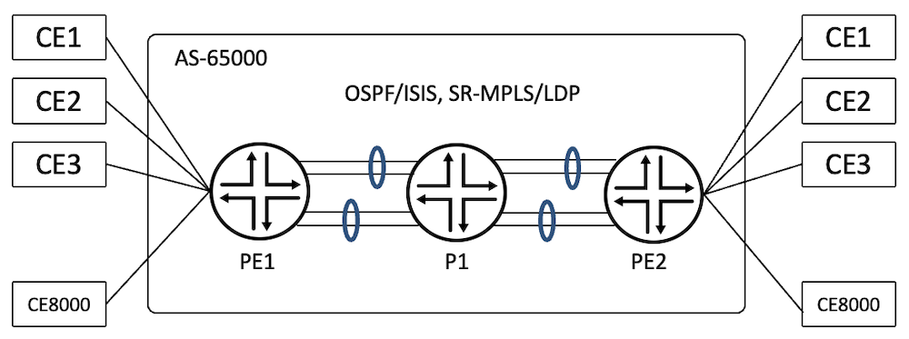
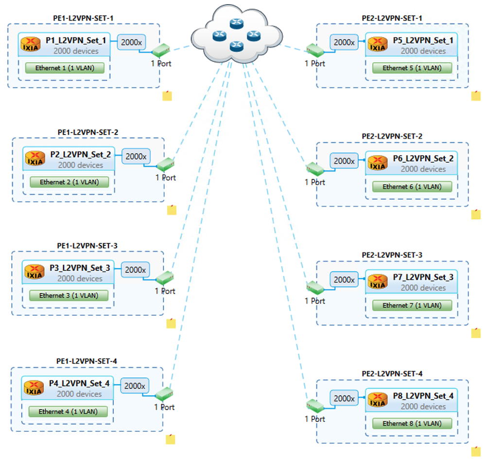
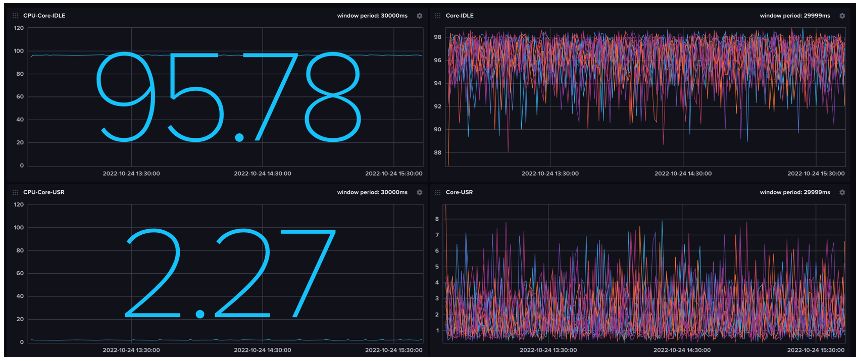
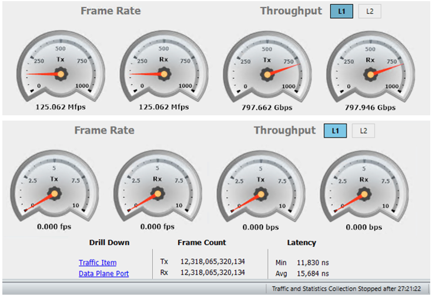

# L2VPN Validation on ACX7000

**Suneesh Babu - 11/16/2022**

ACX7000 platform is tested with 8,000 Layer2 VPN Routing-instances for 99.9% line rate traffic.

## Introduction

This is the third article in the ACX7k Metro Validation Series.

In this article, we validate the [L2VPN](https://www.juniper.net/documentation/us/en/software/junos/vpn-l2/topics/concept/vpn-layer-2-overview.html) feature scale support on the [ACX7100-32C](https://juniper.github.io/techposts/acx7100-deepdive/article) platform with 22.2R1 Junos-EVO image.

L2VPN is a BGP or LDP MPLS Enabled Solution to connect Customer Edge Devices (CEs) across a Provider Edge Network. [RFC-6624](https://www.rfc-editor.org/rfc/rfc6624.html) supports L2VPN using BGP for auto-discovery and Signalling. The PEs provide layer 2 bridged connectivity between CEs. The PEs of the network are connected via [MPLS](https://www.juniper.net/documentation/en_US/junos/topics/concept/mpls-security-overview.html) technology with the help of LDP, [RSVP](https://www.juniper.net/documentation/us/en/software/junos/mpls/topics/topic-map/rsvp-overview.html), [SR-MPLS](https://blogs.juniper.net/en-us/industry-solutions-and-trends/segment-routing-sr-with-multiprotocol-label-switching-mpls) etc.

JUNOS-EVO supports L2VPN functionality with instance type "l2vpn". 8,000 L2VPN Instances were tested on ACX7100-32C. The same scale is tested on ACX7100-48L as well as on [ACX7509](https://juniper.github.io/techposts/acx7024-deepdive/article) Scale is not covered in this article (same features but different scale are expected on this platform).

Please note that despite sharing the same ACX moniker, the ACX7000 products are different products than ACX500/710/1000/1100/2100/2200/4000/5000/5400/6000. They are powered by different Packet Forwarding Engines (PFE), and support different feature sets and scales.

The Key Performance Indicator (KPI) tested are:

| L2VPN KPI | Scale |
|:--|:--|
| Number of L2VPN Instances | 8,000 |
| Number of Interfaces | 8,000 |

## Metro L2VPN Topology

Test topology consists of three routers, PE1, P1 and PE2, where [ACX7100-32C](https://www.juniper.net/documentation/us/en/hardware/acx7100-32C/topics/topic-map/acx7100-32C-system-overview.html) is the PE1 and [ACX7100-48L](https://www.juniper.net/documentation/us/en/hardware/acx7100-48L/topics/topic-map/acx7100-48L-system-overview.html) is the PE2 and P1 is that of [PTX10008](https://www.juniper.net/documentation/us/en/hardware/ptx10008/topics/topic-map/ptx10008-line-card-components.html#line-Card-ptx10k-lc201). PEs are connected to CEs using 4 x 100G links. CE's are simulated using a traffic generator. PEs are connected to the core using 8 x 100G links, which are bundled in 2 x LAGs each having four links.

The ACX7100-32C is the Device Under Test (DUT). The underlay transport used for testing is SR-MPLS with both [OSPF](https://www.juniper.net/documentation/us/en/software/junos/ospf/topics/topic-map/ospf-overview.html) and [ISIS](https://www.juniper.net/documentation/us/en/software/junos/is-is/topics/concept/is-is-routing-overview.html) protocols individually. We also covered LDP as the underlay transport. The CE-bound interface configurations are of SP-Style (see glossary).



Test configures 8,000 L2VPN instances. Bidirectional traffic in iMIX mode at 99.9% offer-load flows for all the L2VPN services. A total of ~798 Gbps traffic flows through the DUT.

### Base Configurations

```
regress@PE1> show configuration protocols |display inheritance no-comments
bgp {
    group IBGP {
        type internal;
        local-address 12.1.1.1;
        family inet {
            unicast;
        }
        family l2vpn {
            signaling;
        }
        neighbor 12.1.1.3 {
            export nhself;
        }
    }
}
mpls {
    interface ae0.0;
    interface ae1.0;
}
ospf {
    source-packet-routing {
        node-segment ipv4-index 101;
        srgb start-label 45000 index-range 2000;
    }
    area 0.0.0.0 {
        interface lo0.0 {
            passive;
        }
        interface ae0.0 {
            interface-type p2p;
        }                               
        interface ae1.0 {
            interface-type p2p;
        }
    }
}

regress@PE1>
```

Routing-Instance configuration required to bring up the L2VPN instances is as shown below.

```
interfaces {
    et-0/0/0 {
        flexible-vlan-tagging;
        encapsulation flexible-ethernet-services;
        unit 1 {
            encapsulation vlan-ccc;
            vlan-id 1;
        }
    }
}

routing-instances {
    METRO_L2VPN_VRF_1 {
        instance-type l2vpn;
        protocols {
            l2vpn {
                site s1 {
                    interface et-0/0/0.1 {
                        remote-site-id 2001;
                    }
                    site-identifier 1001;
                }
                encapsulation-type ethernet-vlan;
                no-control-word;
            }
        }
        interface et-0/0/0.1;
        route-distinguisher 12.1.1.1:1;
        vrf-target target:65000:1;
    }

}
```

### CE Bound Interface Schema

Each of the PE devices is connected to the traffic generator using 4 x 100G interfaces, each interface is logically split into 2000 VLANs to have 8000 interfaces, one interface bound to one L2VPN instance.

| PE1 | PE2 | Port | Service Type | VRF | VLAN Association | Devices | Traffic Load |
|:--|:--|:--|:--|:--|:--|:--|:--|
| et-0/0/0 | et-0/0/48:0 | P1 | L2VPN | 1-2000 | "1-2000" | 4,000 | 99.9% |
| et-0/0/1 | et-0/0/48:1 | P2 | L2VPN | 2001-4000 | "1-2000" | 4,000 | 99.9% |
| et-0/0/2 | et-0/0/48:2 | P3 | L2VPN | 4001-6000 | "1-2000" | 4,000 | 99.9% |
| et-0/0/3 | et-0/0/48:3 | P4 | L2VPN | 6001-8000 | "1-2000" | 4,000 | 99.9% |

### L2VPN Verification

The first step to verify the L2VPN service is to make sure that the PE devices are having BGP established with l2vpn-signalling. As shown below from PE1, BGP is in Established state for Peer PE2(12.1.1.3).

```
regress@PE1> show bgp summary
Threading mode: BGP I/O
Default eBGP mode: advertise - accept, receive - accept
Groups: 1 Peers: 1 Down peers: 0
Table          Tot Paths  Act Paths Suppressed    History Damp State    Pending
inet.0     
                      35          1          0          0          0          0
bgp.l2vpn.0          
                    8000       8000          0          0          0          0
Peer                     AS      InPkt     OutPkt    OutQ   Flaps Last Up/Dwn State|#Active/Received/Accepted/Damped...
12.1.1.3              65000       8024       8023       0       0        7:05 Establ
  inet.0: 1/35/35/0
  bgp.l2vpn.0: 8000/8000/8000/0
  METRO_L2VPN_VRF_1.l2vpn.0: 1/1/1/0
  METRO_L2VPN_VRF_2.l2vpn.0: 1/1/1/0
  METRO_L2VPN_VRF_3.l2vpn.0: 1/1/1/0
  ...
  METRO_L2VPN_VRF_7998.l2vpn.0: 1/1/1/0
  METRO_L2VPN_VRF_7999.l2vpn.0: 1/1/1/0
  METRO_L2VPN_VRF_8000.l2vpn.0: 1/1/1/0

regress@PE1>
```

The BGP l2vpn table of the METRO_L2VPN_VRF_1 instance is as follows:

```
regress@PE1> show route table METRO_L2VPN_VRF_1.l2vpn.0

METRO_L2VPN_VRF_1.l2vpn.0: 2 destinations, 2 routes (2 active, 0 holddown, 0 hidden)
+ = Active Route, - = Last Active, * = Both

12.1.1.1:1:1001:2001/96                
                   *[L2VPN/170/-101] 00:09:40, metric2 1
                       Indirect
12.1.1.3:1:2001:1001/96                
                   *[BGP/170] 00:08:27, localpref 100, from 12.1.1.3
                      AS path: I, validation-state: unverified
                       to 15.1.1.2 via ae0.0, Push 45103
                    >  to 15.1.2.2 via ae1.0, Push 45103

regress@PE1> 
```

The L2VPN connections is UP towards the 12.1.1.3 Peer for the routing-instance METRO_L2VPN_VRF_1

```
regress@PE1> show l2vpn connections instance METRO_L2VPN_VRF_1
Layer-2 VPN connections:

Legend for connection status (St)  
EI -- encapsulation invalid      NC -- interface encapsulation not CCC/TCC/VPLS
EM -- encapsulation mismatch     WE -- interface and instance encaps not same
VC-Dn -- Virtual circuit down    NP -- interface hardware not present
CM -- control-word mismatch      -> -- only outbound connection is up
CN -- circuit not provisioned    <- -- only inbound connection is up
OR -- out of range               Up -- operational
OL -- no outgoing label          Dn -- down
LD -- local site signaled down   CF -- call admission control failure
RD -- remote site signaled down  SC -- local and remote site ID collision
LN -- local site not designated  LM -- local site ID not minimum designated
RN -- remote site not designated RM -- remote site ID not minimum designated
XX -- unknown connection status  IL -- no incoming label
MM -- MTU mismatch               MI -- Mesh-Group ID not available
BK -- Backup connection          ST -- Standby connection
PF -- Profile parse failure      PB -- Profile busy
RS -- remote site standby  SN -- Static Neighbor
LB -- Local site not best-site   RB -- Remote site not best-site
VM -- VLAN ID mismatch           HS -- Hot-standby Connection

Legend for interface status
Up -- operational           
Dn -- down

Instance: METRO_L2VPN_VRF_1
Edge protection: Not-Primary
  Local site: s1 (1001)
    connection-site           Type  St     Time last up          # Up trans
    2001                      rmt   Up     Oct 23 23:43:12 2022           1
      Remote PE: 12.1.1.3, Negotiated control-word: No
      Incoming label: 16, Outgoing label: 16
      Local interface: et-0/0/0.1, Status: Up, Encapsulation: VLAN
      Flow Label Transmit: No, Flow Label Receive: No

regress@PE1>
```

The following output captures the number of instances in the DUT

```
regress@PE1> show l2vpn connections |match "rmt   Up" | count
Count: 8000 lines

regress@PE1> show route table bgp.l2vpn.0 |match BGP | count
Count: 8001 lines

regress@PE1> show route summary |match L2VPN: |count
Count: 16001 lines

regress@PE1> show route table mpls.0 protocol l2vpn |match L2VPN|count
Count: 16000 lines
```

### Traffic Verification at Router at PE1

Traffic got load-balanced across the lag bundles ae0 and ae1 towards the core and across each of the member interfaces.

```
PE1                               Seconds: 8                   Time: 03:23:34

Interface    Link  Input packets        (pps)     Output packets        (pps)

 ae0           Up  3125232690044   (31603996)    3092758811605   (31275639)
 ae1           Up  3060284770339   (30951593)    3092758802956   (31279892)
 esi           Up              0          (0)                0          (0)
 et-0/0/0      Up  1546379263196   (15637224)    1546379158447   (15636310)
 et-0/0/1      Up  1546379214713   (15637071)    1546379163592   (15636440)
 et-0/0/2      Up  1546379149169   (15636320)    1546379164104   (15636866)
 et-0/0/3      Up  1546379157074   (15636913)    1546379157376   (15636834)
 et-0/0/4      Up              0          (0)             3568          (0)
 et-0/0/5    Down              0          (0)                0          (0)
 et-0/0/6      Up   796385380100    (8053366)     770096960274    (7787501)
 et-0/0/7      Up   777055626584    (7857916)     776282456360    (7850117)
 et-0/0/8      Up   770096919918    (7787568)     770096939235    (7787592)
 et-0/0/9      Up   781694763442    (7905146)     776282455736    (7850429)
 et-0/0/10     Up   770096934324    (7788487)     776282470328    (7850981)
 et-0/0/11     Up   763138220225    (7718340)     770096938714    (7788677)
 et-0/0/12     Up   761591833934    (7702754)     776282455310    (7851325)
 et-0/0/13     Up   765457781856    (7742012)     770096938604    (7788909)
```

## Generating Scale Configuration

The Python Script is having three components, a Jinja File capturing the various configuration templates, a Params File capturing the various user variables and the script uses both these input files and generates the required configurations and commit that in the router.

Note: The configs are generated as per the CE-bound interface schema.

### Jinja Configuration Template

The template contains configurations for both interfaces which are part of the routing instances and routing instance configurations.

```
# Routing Instance Configuration
# File Name: l2vpn_jinja.j2
# Version: 1.0
groups {{group_name}} {
    interfaces {
        {{ifd_name}} {
            flexible-vlan-tagging;
            encapsulation flexible-ethernet-services;
            
            unit {{unit_id}} {
                vlan-id {{vlan_id}};
                encapsulation vlan-ccc;
            }
            
        }
    }
    routing-instances {
        
        METRO_L2VPN_VRF_{{vrf_id}} {
            instance-type l2vpn;
            interface {{ifl_name}};
            route-distinguisher {{router_id}}:{{vrf_id}};
            vrf-target target:{{local_as_no}}:{{vrf_id}};
            protocols {
                l2vpn {
                    site s1 {
                        interface {{ifl_name}} {
                            remote-site-id {{remote_site_id}};
                        }
                        site-identifier {{local_site_id}};
                    }
                    encapsulation-type ethernet-vlan;
                    no-control-word;
                }
            }
        }
        
    }
}
```

### Configuration Parameters

```
---
# This file contains the parameters for l2vpn configuration building
# File Name: l2vpn_params.yaml
# Version: 1.0

#Host Name
host: 'PE1.englab.juniper.net'

#UserName
username: 'regress'
password: 'xxxxxx'

#Config Group Name
group_name: 'METRO_L2VPN'

#vrfname creation
vrf_id: 1

#maximum l2vpn instances
vrf_max: 10

#interface name
ifd_name: 'et-0/0/3'

#ifl_start unit
ifl_start_unit: 1

#vlan_id start
vlan_id_start: 1

#My AS no
local_as_no: 65000

#My Router ID
router_id: '12.1.1.1'

#Site Identifiers
local_site_id: 1001 #At PE1
remote_site_id: 2001 #At PE1

# local_site_id: 2001 #At PE2
# remote_site_id: 1001 #At PE2
```

### Configuration Script

```
#! /usr/bin/python
"""
    FileName: create_l2vpn_vrf.py
    Version: 1.0
    Description: This script will create l2vpn vrf instances and configure it on the router
    Author: Suneesh Babu
"""
import yaml
from glob import glob
from jinja2 import Template
import ipaddress
from jnpr.junos.utils.config import Config
from jnpr.junos import Device
from jnpr.junos.factory import loadyaml
from jnpr.junos.op import *

def iflrange(ifd_name, start_unit, max):
    """
    This subroutine yields the specified number of l3 ifls for the ifd
    """
    while(max):
        iflname = ifd_name + '.' + str(start_unit)
        yield iflname
        start_unit += 1
        max -= 1

def router_operation(config_filename, data, mode):
    """
        This sub-routine connectes to the router and do the necessary commit operations
    """
    router = Device(host=data['host'], user=data['username'], password=data['password'], port=22)
    router.open()

    cfg = Config(router)
    if mode == 'jinja':
        cfg.load(template_path=config_filename, template_vars=data, format='text', merge=True)
    elif mode == 'setfile':
        cfg.load(path=config_filename, format='set')
    cfg.pdiff()
    cfg.commit()
    router.close()

def jinja_template_input(data):
    """
        This sub-routine yields the variables required for the jinja template
    """
    ifl_unit_list = range(int(data['ifl_start_unit']), int(data['ifl_start_unit']) + int(data['vrf_max']))
    vlan_list = range(int(data['vlan_id_start']), int(data['vlan_id_start']) + int(data['vrf_max']))

    vrf_id_list = range(int(data['vrf_id']), int(data['vrf_id']) + int(data['vrf_max']))
    ifl_name_list = iflrange(data['ifd_name'], data['ifl_start_unit'], int(data['vrf_max']))

    return zip(ifl_unit_list, vlan_list), zip(vrf_id_list, list(ifl_name_list))
def main():
    """
       To Build the desired number of l2vpn routing-instances
    """
    print("Step-1: Read the Variables from the Params File")
    with open(glob('l2vpn_params.yaml')[0]) as fh:
        data = yaml.safe_load(fh.read())

    print("Step-2: Build the Data Feed for the Jinja Template Input")
    ifl_attributes, l2vpn_attributes = jinja_template_input(data)
    data['ifl_variables'] = ifl_attributes
    data['l2vpn_variables'] = l2vpn_attributes

    print("Step-3: Build the configuration file from Jinja Template")
    with open(glob('l2vpn_jinja.j2')[0]) as t_fh:
        t_format = t_fh.read()
    l2vpn_snippet = Template(t_format)
    print (l2vpn_snippet.render(data))

    print("Step-4: Load the config into router and commit it")
    # router_operation('l2vpn_jinja.j2', data, 'jinja')

if __name__ == '__main__':
    main()
```

## Traffic Generator Configuration

CE Devices Configuration are as follows:



### CPU Usage during traffic flow

The 12 Core ACX7100-32C remains idle at 95% during the traffic flow



### Data Plane Traffic Verification

As shown below traffic flows at 99.9% of 100G links over 4 CE bound interfaces and no packet drops are seen for a duration of 27 hours.



## Conclusion

ACX7000 (ACX7100-32C, ACX7100-48L, ACX7509) can scale to 8000 L2VPN instances and interfaces making it a perfectly suitable platform for Metro aggregation. Next article will be dedicated to VPLS validation, stay tuned :)

## References

- RFC-6624 - [https://datatracker.ietf.org/doc/html/rfc6624](https://www.rfc-editor.org/rfc/rfc6624.html)
- L2VPN - [https://www.juniper.net/documentation/us/en/software/junos/vpn-l2/topics/concept/vpn-layer-2-overview.html](https://www.juniper.net/documentation/us/en/software/junos/vpn-l2/topics/concept/vpn-layer-2-overview.html)
- ACX7100 Deepdive: [https://juniper.github.io/techposts/acx7100-deepdive/article](https://juniper.github.io/techposts/acx7100-deepdive/article)
- ACX7509 Deepdive: [https://juniper.github.io/techposts/acx7509-deepdive/article](https://juniper.github.io/techposts/acx7509-deepdive/article)

## Glossary

- BGP -- Border Gateway Protocol
- CE -- Customer Edge Node
- DUT -- Device Under Test
- KPI -- Key Performance Indicators
- L2VPN -- Layer 2 VPN
- LAN -- Local Area Network
- MPLS -- Multi Protocol Label Switching
- OSPF -- Open Shortest Path First
- P/PE -- Provider/Provider Edge Node
- SP Style -- Service Provider Style
- SR-MPLS -- Segment Routing - MPLS
- VLAN -- Virtual LAN
- VRF -- Virtual Routing and Forwarding

## Acknowledgement

Many thanks to Ramdas Machat, Deepak Kumar Tripathi, Vasily Mukhin and Nicolas Fevrier for reviewing the article and providing the feedback
