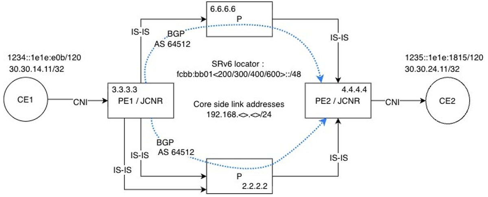

# L3VPN over SRv6 with JCNR

**Lavanya Kumar Ambatipudi - 04/27/2026**

Do you need secure, isolated multi-tenant connectivity across Kubernetes and cloud infrastructures. JCNR supports SRv6 L3VPN with micro-Segment Identifiers (uSIDs) in various SRv6 endpoint behaviors (End.DT4, End.DT6, End.DT46).

## Overview

Juniper Cloud-Native Router (JCNR) is a containerized, cloud-native routing solution that brings enterprise-grade networking capabilities to cloud and containerized environments. Built on Juniper's proven routing technologies, JCNR delivers the same robust features and characteristics as traditional Juniper routers while being optimized for modern cloud-native infrastructures.

Segment Routing over IPv6 (SRv6) is a modern networking paradigm that leverages the IPv6 protocol to provide advanced traffic engineering, service programming, and network simplification. SRv6 combines the benefits of segment routing with the ubiquity of IPv6 enabling sophisticated network services through native IPv6 packet processing.

In this article, we will demonstrate SRv6 and SRv6 L3VPN solution offered by JCNR. The feature is supported starting from Junos 24.2.

## SRv6 and L3VPN

Layer 3 Virtual Private Networks (L3VPNs) represent a fundamental service model in modern networking that enables organizations to establish secure, isolated communication channels across shared infrastructure. This enables admins to host multiple customers on a shared infrastructure for better resource utilization and yet providing services.

SRv6 L3VPN leverages IPv6 segment routing to provide Layer 3 VPN services across cloud-native network infrastructures. Unlike traditional MPLS-based L3VPN implementations, SRv6 utilizes IPv6 addresses as segment identifiers, enabling service programming directly within the IPv6 header with and without Segment Routing Header (SRH) extension.

## L3VPN with JCNR

JCNR supports l3vpn service with SR-MPLS as ingress, transit and egress nodes in the MPLS network. L3VPN service is supported with SRv6 as ingress and egress node. JCNR offers carrier grade routing functionality with support for IS-IS and OSPF as IGP while BGP offering VPN functionality in control plane.

JCNR offers multiple customers hosted on the same instance with flexibility in attaching users on the fly like other JUNOS platforms. Along with this, JCNR support L3VPN solution in CNI mode where a PoDs running on the same Kubernetes cluster can be hosted on a VPN instance providing connectivity to the service to its end points. All of this is also offered with IPSec service when service chained with cSRX, if user desired security along with L3VPN with SRv6.

## SRv6 with JCNR

Segment Routing over IPv6 (SRv6) in Juniper Cloud-Native Router (JCNR) is supported with micro segment identifiers (uSID). Micro-Segment Identifiers (uSIDs) represent a significant optimization technique in SRv6 that addresses the header overhead concerns of traditional SRv6 implementations. While standard SRv6 uses full 128-bit IPv6 addresses as segment identifiers, uSIDs enable the packing of multiple segments within a single IPv6 address, dramatically reducing the Segment Routing Header (SRH) size and improving network efficiency. In some cases, removing the need for SRH header as uSIDs fit in destination address of IPv6 header. JCNR supports max of 6 uSIDs which requires no SRH header addition.

SRv6 combines the benefits of segment routing with the native IPv6 forwarding plane providing enhanced service programming capabilities through segment identifier (SID) functions. JCNR supports SRv6 head-end and egress nodes roles in a SRv6 network. Support for transit node is in the pipeline.

SRv6 has multiple end point behaviors. In JCNR, following end points are supported.

- **End.DT4**: Endpoint with decapsulation and specific IPv4 table lookup function for SRv6 instantiation of Global or IPv4 L3VPN (transport IPv4 services over SRv6 underlay)
- **End.DT6**: Endpoint with decapsulation and specific IPv6 table lookup function for SRv6 instantiation of Global or IPv6 L3VPN (Transport IPv6 services over SRv6 underlay)
- **End.DT46**: Endpoint with decapsulation and specific IP table lookup function for SRv6 instantiation of Global, IPv4 or IPv6 L3VPN (Transport both IPv4 and IPv6 services over SRv6 underlay). It is shared across IPv4 and IPv6 prefixes.

JCNR functions as a comprehensive Container Network Interface (CNI) plugin for Kubernetes, providing advanced networking capabilities directly integrated with the container orchestration platform. JCNR operates also as a Cloud-Native Network Function (CNF), providing traditional network services (routing, switching, security) in containerized form. As a CNF, JCNR delivers carrier-grade network functions with cloud-native operational characteristics. SRv6 is supported in both CNI and CNF modes giving the flexibility for users to deploy SRv6 solution in any cloud native environments. JCNR supports up to 6 uSIDs.

## Solution: L3VPN over SRv6 with JCNR

In this document, we will demonstration the following solution with JCNR.  In this topology, PE1 and PE2 are JCNR acting as SRv6 head-end and egress nodes in the network. There is a BGP session between PE1 and PE2 for providing VPN solution with AS 64512. IS-IS is used as IGP.  There is a redundant path between PE1 and provide node to demonstrate ECMP support with SRv6.

CE1 and CE2 in this solution are PoDs connected to JCNR. JCNR is acting as secondary CNI in this solution demonstrating the ability to provide SRv6 connectivity in CNI mode.

In the context of 5G and Open RAN (O-RAN) network architecture, the midhaul is the transport network link that connects the Distributed Unit (DU) to the Centralized Unit (CU). JCNR with SRv6 can be used as gateway for DU where JCNR is providing connectivity over SRv6 network in midhaul to CU. In the same use case, JCNR can be the gateway for CU providing connectivity to multiple DUs.

### Topology for this Solution



### Kubernetes Cluster from PE1

```
jcnr3@jcnr3-kvm:~/srv6$ kubectl get pods -A
NAMESPACE          NAME                                         READY   STATUS    RESTARTS      AGE
calico-apiserver   calico-apiserver-58b6c8b8ff-5wprj            1/1     Running   1             83d
calico-apiserver   calico-apiserver-58b6c8b8ff-wnjck            1/1     Running   1             83d
calico-system      calico-kube-controllers-78788579b8-88nd9     1/1     Running   1             83d
calico-system      calico-node-gsf84                            1/1     Running   1             83d
calico-system      calico-typha-6b56d9c9db-6rxmm                1/1     Running   2 (21d ago)   83d
contrail-deploy    contrail-k8s-deployer-7b8c565984-p2jmd       1/1     Running   0             21d
contrail-deploy    jcnr-config-controller-m8w9x                 1/1     Running   2 (21d ago)   21d
contrail           contrail-tools-9gtlh                         1/1     Running   0             21d
contrail           jcnr-0-contrail-vrouter-nodes-szklq          2/2     Running   7 (11d ago)   21d
contrail           jcnr-0-contrail-vrouter-nodes-vrdpdk-mkrqx   1/1     Running   5 (11d ago)   21d
jcnr               jcnr-0-crpd-0                                2/2     Running   0             11d
jcnr               syslog-ng-jcnrobj-kr5rm                      1/1     Running   0             21d
kube-system        coredns-5dd5756b68-gbmsx                     1/1     Running   1             83d
kube-system        coredns-5dd5756b68-xzwj9                     1/1     Running   1             83d
kube-system        etcd-jcnr3-kvm                               1/1     Running   29            83d
kube-system        kube-apiserver-jcnr3-kvm                     1/1     Running   1             83d
kube-system        kube-controller-manager-jcnr3-kvm            1/1     Running   1             83d
kube-system        kube-multus-ds-prcbm                         1/1     Running   1             83d
kube-system        kube-proxy-qn4wx                             1/1     Running   1             83d
kube-system        kube-scheduler-jcnr3-kvm                     1/1     Running   1             83d
tigera-operator    tigera-operator-6fbc4f6f8d-228zt             1/1     Running   2 (21d ago)   83d
srv6               CE1                                          1/1     Running   0             153m
```

Protocol and data path state from PE1 and PE2 from this topology given below. In this topology CE1 and CE2 are connected to JCNR as PoDs in CNI mode. Yet, they are going over SRv6 network as VPN traffic. This demonstrates the advantage of JCNR as SRv6 node in cloud native environments.

### IS-IS state on PE1

```
root@jcnr3-kvm# run show isis adjacency
Interface             System         L State         Hold (secs) SNPA
enp10s0               jcnr2          2  Up                   587
enp7s0                jcnr2          2  Up                   587
enp9s0                jcnr6-kvm      2  Up                   591
```

### IS-IS state on PE2

```
root@jcnr4-kvm# run show isis adjacency
Interface             System         L State         Hold (secs) SNPA
enp10s0               jcnr6-kvm      2  Up                   599
enp8s0                jcnr2          2  Up                   591
```

### BGP state on PE1

```
root@jcnr3-kvm# run show bgp summary
Threading mode: BGP I/O
TCP listen port: 178
Default eBGP mode: advertise - accept, receive - accept
Groups: 2 Peers: 2 Down peers: 0
Table          Tot Paths  Act Paths Suppressed    History Damp State    Pending
inet.0
                       0          0          0          0          0          0
inet6.0
                       0          0          0          0          0          0
bgp.l3vpn.0
                       1          1          0          0          0          0
bgp.l3vpn-inet6.0
                       1          1          0          0          0          0
bgp.evpn.0
                       0          0          0          0          0          0
Peer                     AS      InPkt     OutPkt    OutQ   Flaps Last Up/Dwn State|#Active/Received/Accepted/Damped...
4.4.4.4               64512        241        244       0       0     1:40:11 Establ
  inet.0: 0/0/0/0
  inet6.0: 0/0/0/0
  bgp.l3vpn.0: 1/1/1/0
  bgp.l3vpn-inet6.0: 1/1/1/0
  bgp.evpn.0: 0/0/0/0
  srv6.inet.0: 1/1/1/0
  srv6.inet6.0: 1/1/1/0
```

### BGP state on PE2

```
root@jcnr4-kvm# run show bgp summary
Threading mode: BGP I/O
TCP listen port: 178
Default eBGP mode: advertise - accept, receive - accept
Groups: 2 Peers: 2 Down peers: 0
Table          Tot Paths  Act Paths Suppressed    History Damp State    Pending
inet.0
                       0          0          0          0          0          0
inet6.0
                       0          0          0          0          0          0
bgp.l3vpn.0
                       1          1          0          0          0          0
bgp.l3vpn-inet6.0
                       1          1          0          0          0          0
bgp.evpn.0
                       0          0          0          0          0          0
Peer                     AS      InPkt     OutPkt    OutQ   Flaps Last Up/Dwn State|#Active/Received/Accepted/Damped...
3.3.3.3               64512        244        238       0       0     1:39:32 Establ
  inet.0: 0/0/0/0
  inet6.0: 0/0/0/0
  bgp.l3vpn.0: 1/1/1/0
  bgp.l3vpn-inet6.0: 1/1/1/0
  bgp.evpn.0: 0/0/0/0
  srv6.inet.0: 1/1/1/0
  srv6.inet6.0: 1/1/1/0
```

### Local SID information on PE1

```
root@jcnr3-kvm> show srv6 local-sids
SID                                  SID-Owner     SID-Type      Locator          SID-Behavior
fcbb:bb01:300:e000::                 BGP           DYNAMIC       u_loc            End.DT4 with NEXT-CSID
fcbb:bb01:300:e001::                 BGP           DYNAMIC       u_loc            End.DT6 with NEXT-CSID
fcbb:bb01:300:e002::                 BGP           DYNAMIC       u_loc            End.DT46 with NEXT-CSID
fcbb:bb01:300:e003::                 BGP           DYNAMIC       u_loc            End.DT4 with NEXT-CSID
fcbb:bb01:300:e004::                 BGP           DYNAMIC       u_loc            End.DT6 with NEXT-CSID
fcbb:bb01:300:e005::                 BGP           DYNAMIC       u_loc            End.DT46 with NEXT-CSID

root@jcnr3-kvm> show srv6 locator
Locator: u_loc
  Locator prefix: fcbb:bb01:300::, Locator length: 48
  Block length: 32, Node length: 16
  Function length: 16, Argument length: 0
  Micro SID Locator, Flavor [ None ]
  Micro SID Block Name: usid_blk_with_statics

root@jcnr3-kvm> show srv6 block
Block: usid_blk_with_statics
  Block Prefix: fcbb:bb01::, Block length: 32, Micro-sid length: 16
  Global Micro SIDs:
    Static SID range: 0x0-0xDFFF, Dynamic SID range: -
    Allocated static SID count: 1, Allocated dynamic SID count: 0
    Available static SID count: 57343, Available dynamic SID count: 0
  Local Micro SIDs:
    Static SID range: 0xF830-0xFFFF, Dynamic SID range: 0xE000-0xF82F
    Allocated static SID count: 0, Allocated dynamic SID count: 6
    Available static SID count: 2000, Available dynamic SID count: 6186
```

### BGP Peer route on PE1

```
root@jcnr3-kvm> show route 4.4.4.4 detail

inet.0: 19 destinations, 22 routes (19 active, 0 holddown, 0 hidden)
4.4.4.4/32 (1 entry, 1 announced)
        *IS-IS  Preference: 18
                Level: 2
                Next hop type: Router, Next hop index: 0
                Address: 0x58f199acf61c
                Next-hop reference count: 2, Next-hop session id: 0
                Kernel Table Id: 0
                Next hop: 192.168.200.2 via enp10s0, selected
                Session Id: 0
                Next hop: 192.168.133.2 via enp7s0
                Session Id: 0
                Next hop: 192.168.155.6 via enp9s0
                Session Id: 0
                State: <Active Int>
                Age: 23:24      Metric: 20
                Validation State: unverified
                ORR Generation-ID: 0
                Task: IS-IS
                Announcement bits (5): 1-KRT MFS 2-KRT 3-Resolve tree 3 6-KRT-vRouter 8-Resolve tree 1
                AS path: I
                Thread: junos-main
```

### Remote VPN route on PE1

```
root@jcnr3-kvm# run show route 30.30.24.11/32 detail

srv6.inet.0: 3 destinations, 3 routes (3 active, 0 holddown, 0 hidden)
30.30.24.11/32 (1 entry, 1 announced)
        *BGP    Preference: 170/-101
                Route Distinguisher: 10.87.3.248:2
                Next hop type: Indirect, Next hop index: 0
                Address: 0x634bd311143c
                Next-hop reference count: 4
                Kernel Table Id: 0
                Source: 4.4.4.4
                Next hop type: List, Next hop index: 0
        Next hop: ELNH Address 0x634bd311151c, selected
            Next hop type: Chain, Next hop index: 0
            Address: 0x634bd311151c
            Next-hop reference count: 1, Next-hop session id: 0
            Kernel Table Id: 0
            Next hop: via Chain Tunnel Composite, SRv6 (src 3333::1 dest fcbb:bb01:400::)
            Next hop: ELNH Address 0x634bd036e91c
            SRV6-Tunnel: Reduced-SRH Encap-mode Remove-Last-Sid Propagate-CoS
             Src: 3333::1 Dest: fcbb:bb01:400::
             Segment-list[0] fcbb:bb01:400::
            Gateway opaque handle: 0x634bd0201b60
                Next hop type: Router, Next hop index: 0
                Address: 0x634bd036e91c
                Next-hop reference count: 9, Next-hop session id: 0
                Kernel Table Id: 0
                Next hop: fe80::5054:ff:fe4b:1643 via enp10s0
        Next hop: ELNH Address 0x634bd037107c
            Next hop type: Chain, Next hop index: 0
            Address: 0x634bd037107c
            Next-hop reference count: 1, Next-hop session id: 0
            Kernel Table Id: 0
            Next hop: via Chain Tunnel Composite, SRv6 (src 3333::1 dest fcbb:bb01:400::)
            Next hop: ELNH Address 0x634bd03730dc
            SRV6-Tunnel: Reduced-SRH Encap-mode Remove-Last-Sid Propagate-CoS
             Src: 3333::1 Dest: fcbb:bb01:400::
             Segment-list[0] fcbb:bb01:400::
            Gateway opaque handle: 0x634bd0201b60
                Next hop type: Router, Next hop index: 0
                Address: 0x634bd03730dc
                Next-hop reference count: 9, Next-hop session id: 0
                Kernel Table Id: 0
                Next hop: fe80::d8d3:faff:fe05:d38 via enp7s0
        Next hop: ELNH Address 0x634bd0371cbc
            Next hop type: Chain, Next hop index: 0
            Address: 0x634bd0371cbc
            Next-hop reference count: 1, Next-hop session id: 0
            Kernel Table Id: 0
            Next hop: via Chain Tunnel Composite, SRv6 (src 3333::1 dest fcbb:bb01:400::)
            Next hop: ELNH Address 0x634bd037203c
            SRV6-Tunnel: Reduced-SRH Encap-mode Remove-Last-Sid Propagate-CoS
             Src: 3333::1 Dest: fcbb:bb01:400::
             Segment-list[0] fcbb:bb01:400::
            Gateway opaque handle: 0x634bd0201b60
                Next hop type: Router, Next hop index: 0
                Address: 0x634bd037203c
                Next-hop reference count: 14, Next-hop session id: 0
                Kernel Table Id: 0
                Next hop: fe80::5054:ff:fe00:a914 via enp9s0
                Protocol next hop: fcbb:bb01:400::
                Composite next hop: 0x634bd09c2400 - INH Session ID: 0, CNH non-key opaque: (nil), CNH key opaque: 0x634bd09c2340
                Indirect next hop: 0x634bd0564988 - INH Session ID: 0, INH non-key opaque: 0x634bd0207a40, INH key opaque: (nil)
                State: <Secondary Active Int Ext OpaqueData ProtectionCand>
                Peer AS: 64512
                Age: 4:03       Metric2: 20
                Validation State: unverified
                ORR Generation-ID: 0
                Task: BGP_64512_64512.4.4.4.4
                Announcement bits (4): 2-KRT MFS 3-KRT 4-KRT-vRouter 6-PLFM-LAYER
                AS path: I
                Communities: target:64512:4
                Import Accepted MultiNexthop RecvNextHopIgnored
                SRv6 SID: fcbb:bb01:400:: Service tlv type: 5 Behavior: 63 BL: 32 NL: 16 FL: 16 AL: 0 TL: 16 TO: 48
                VPN Label: 917552
                Localpref: 100
                Router ID: 4.4.4.4
                Primary Routing Table: bgp.l3vpn.0
                Thread: junos-main

bgp.l3vpn.0: 1 destinations, 1 routes (1 active, 0 holddown, 0 hidden)

10.87.3.248:2:30.30.24.11/32 (1 entry, 0 announced)
        *BGP    Preference: 170/-101
                Route Distinguisher: 10.87.3.248:2
                Next hop type: Indirect, Next hop index: 0
                Address: 0x634bd311143c
                Next-hop reference count: 4
                Kernel Table Id: 0
                Source: 4.4.4.4
                Next hop type: List, Next hop index: 0
        Next hop: ELNH Address 0x634bd311151c, selected
            Next hop type: Chain, Next hop index: 0
            Address: 0x634bd311151c
            Next-hop reference count: 1, Next-hop session id: 0
            Kernel Table Id: 0
            Next hop: via Chain Tunnel Composite, SRv6 (src 3333::1 dest fcbb:bb01:400::)
            Next hop: ELNH Address 0x634bd036e91c
            SRV6-Tunnel: Reduced-SRH Encap-mode Remove-Last-Sid Propagate-CoS
             Src: 3333::1 Dest: fcbb:bb01:400::
             Segment-list[0] fcbb:bb01:400::
            Gateway opaque handle: 0x634bd0201b60
                Next hop type: Router, Next hop index: 0
                Address: 0x634bd036e91c
                Next-hop reference count: 9, Next-hop session id: 0
                Kernel Table Id: 0
                Next hop: fe80::5054:ff:fe4b:1643 via enp10s0
        Next hop: ELNH Address 0x634bd037107c
            Next hop type: Chain, Next hop index: 0
            Address: 0x634bd037107c
            Next-hop reference count: 1, Next-hop session id: 0
            Kernel Table Id: 0
            Next hop: via Chain Tunnel Composite, SRv6 (src 3333::1 dest fcbb:bb01:400::)
            Next hop: ELNH Address 0x634bd03730dc
            SRV6-Tunnel: Reduced-SRH Encap-mode Remove-Last-Sid Propagate-CoS
             Src: 3333::1 Dest: fcbb:bb01:400::
             Segment-list[0] fcbb:bb01:400::
            Gateway opaque handle: 0x634bd0201b60
                Next hop type: Router, Next hop index: 0
                Address: 0x634bd03730dc
                Next-hop reference count: 9, Next-hop session id: 0
                Kernel Table Id: 0
                Next hop: fe80::d8d3:faff:fe05:d38 via enp7s0
        Next hop: ELNH Address 0x634bd0371cbc
            Next hop type: Chain, Next hop index: 0
            Address: 0x634bd0371cbc
            Next-hop reference count: 1, Next-hop session id: 0
            Kernel Table Id: 0
            Next hop: via Chain Tunnel Composite, SRv6 (src 3333::1 dest fcbb:bb01:400::)
            Next hop: ELNH Address 0x634bd037203c
            SRV6-Tunnel: Reduced-SRH Encap-mode Remove-Last-Sid Propagate-CoS
             Src: 3333::1 Dest: fcbb:bb01:400::
             Segment-list[0] fcbb:bb01:400::
            Gateway opaque handle: 0x634bd0201b60
                Next hop type: Router, Next hop index: 0
                Address: 0x634bd037203c
                Next-hop reference count: 14, Next-hop session id: 0
                Kernel Table Id: 0
                Next hop: fe80::5054:ff:fe00:a914 via enp9s0
                Protocol next hop: fcbb:bb01:400::
                Composite next hop: 0x634bd09c2400 - INH Session ID: 0, CNH non-key opaque: (nil), CNH key opaque: 0x634bd09c2340
                Indirect next hop: 0x634bd0564988 - INH Session ID: 0, INH non-key opaque: 0x634bd0207a40, INH key opaque: (nil)
                State: <Active Int Ext ProtectionPath ProtectionCand>
                Peer AS: 64512
                Age: 4:03       Metric2: 20
                Validation State: unverified
                ORR Generation-ID: 0
                Task: BGP_64512_64512.4.4.4.4
                AS path: I
                Communities: target:64512:4
                Import Accepted MultiNexthop RecvNextHopIgnored
                SRv6 SID: fcbb:bb01:400:: Service tlv type: 5 Behavior: 63 BL: 32 NL: 16 FL: 16 AL: 0 TL: 16 TO: 48
                VPN Label: 917552
                Localpref: 100
                Router ID: 4.4.4.4
                Secondary Tables: srv6.inet.0
                Thread: junos-main
```

### Remote VPN route on PE2 : Control plane

```
root@jcnr4-kvm# run show route 30.30.14.11/32 detail

srv6.inet.0: 3 destinations, 3 routes (3 active, 0 holddown, 0 hidden)
30.30.14.11/32 (1 entry, 1 announced)
        *BGP    Preference: 170/-101
                Route Distinguisher: 10.87.3.233:2
                Next hop type: Indirect, Next hop index: 0
                Address: 0x5f6e06f7265c
                Next-hop reference count: 4
                Kernel Table Id: 0
                Source: 3.3.3.3
                Next hop type: List, Next hop index: 0
        Next hop: ELNH Address 0x5f6e06f71a1c, selected
            Next hop type: Chain, Next hop index: 0
            Address: 0x5f6e06f71a1c
            Next-hop reference count: 1, Next-hop session id: 0
            Kernel Table Id: 0
            Next hop: via Chain Tunnel Composite, SRv6 (src 4444::1 dest fcbb:bb01:300::)
            Next hop: ELNH Address 0x5f6e06f715bc
            SRV6-Tunnel: Reduced-SRH Encap-mode Remove-Last-Sid Propagate-CoS
             Src: 4444::1 Dest: fcbb:bb01:300::
             Segment-list[0] fcbb:bb01:300::
            Gateway opaque handle: 0x5f6e06e04c20
                Next hop type: Router, Next hop index: 0
                Address: 0x5f6e06f715bc
                Next-hop reference count: 14, Next-hop session id: 0
                Kernel Table Id: 0
                Next hop: fe80::5054:ff:feab:aecc via enp10s0
        Next hop: ELNH Address 0x5f6e06f7655c
            Next hop type: Chain, Next hop index: 0
            Address: 0x5f6e06f7655c
            Next-hop reference count: 1, Next-hop session id: 0
            Kernel Table Id: 0
            Next hop: via Chain Tunnel Composite, SRv6 (src 4444::1 dest fcbb:bb01:300::)
            Next hop: ELNH Address 0x5f6e06f72b9c
            SRV6-Tunnel: Reduced-SRH Encap-mode Remove-Last-Sid Propagate-CoS
             Src: 4444::1 Dest: fcbb:bb01:300::
             Segment-list[0] fcbb:bb01:300::
            Gateway opaque handle: 0x5f6e06e04c20
                Next hop type: Router, Next hop index: 0
                Address: 0x5f6e06f72b9c
                Next-hop reference count: 14, Next-hop session id: 0
                Kernel Table Id: 0
                Next hop: fe80::cccc:22ff:feb4:62f1 via enp8s0
                Protocol next hop: fcbb:bb01:300::
                Composite next hop: 0x5f6e09e75800 - INH Session ID: 0, CNH non-key opaque: (nil), CNH key opaque: 0x5f6e075b8380
                Indirect next hop: 0x5f6e07159d08 - INH Session ID: 0, INH non-key opaque: 0x5f6e06e06e40, INH key opaque: (nil)
                State: <Secondary Active Int Ext OpaqueData ProtectionCand>
                Peer AS: 64512
                Age: 5:07       Metric2: 20
                Validation State: unverified
                ORR Generation-ID: 0
                Task: BGP_64512_64512.3.3.3.3
                Announcement bits (4): 2-KRT MFS 3-KRT 4-KRT-vRouter 6-PLFM-LAYER
                AS path: I
                Communities: target:64512:4
                Import Accepted MultiNexthop RecvNextHopIgnored
                SRv6 SID: fcbb:bb01:300:: Service tlv type: 5 Behavior: 63 BL: 32 NL: 16 FL: 16 AL: 0 TL: 16 TO: 48
                VPN Label: 917552
                Localpref: 100
                Router ID: 3.3.3.3
                Primary Routing Table: bgp.l3vpn.0
                Thread: junos-main

bgp.l3vpn.0: 1 destinations, 1 routes (1 active, 0 holddown, 0 hidden)

10.87.3.233:2:30.30.14.11/32 (1 entry, 0 announced)
        *BGP    Preference: 170/-101
                Route Distinguisher: 10.87.3.233:2
                Next hop type: Indirect, Next hop index: 0
                Address: 0x5f6e06f7265c
                Next-hop reference count: 4
                Kernel Table Id: 0
                Source: 3.3.3.3
                Next hop type: List, Next hop index: 0
        Next hop: ELNH Address 0x5f6e06f71a1c, selected
            Next hop type: Chain, Next hop index: 0
            Address: 0x5f6e06f71a1c
            Next-hop reference count: 1, Next-hop session id: 0
            Kernel Table Id: 0
            Next hop: via Chain Tunnel Composite, SRv6 (src 4444::1 dest fcbb:bb01:300::)
            Next hop: ELNH Address 0x5f6e06f715bc
            SRV6-Tunnel: Reduced-SRH Encap-mode Remove-Last-Sid Propagate-CoS
             Src: 4444::1 Dest: fcbb:bb01:300::
             Segment-list[0] fcbb:bb01:300::
            Gateway opaque handle: 0x5f6e06e04c20
                Next hop type: Router, Next hop index: 0
                Address: 0x5f6e06f715bc
                Next-hop reference count: 14, Next-hop session id: 0
                Kernel Table Id: 0
                Next hop: fe80::5054:ff:feab:aecc via enp10s0
        Next hop: ELNH Address 0x5f6e06f7655c
            Next hop type: Chain, Next hop index: 0
            Address: 0x5f6e06f7655c
            Next-hop reference count: 1, Next-hop session id: 0
            Kernel Table Id: 0
            Next hop: via Chain Tunnel Composite, SRv6 (src 4444::1 dest fcbb:bb01:300::)
            Next hop: ELNH Address 0x5f6e06f72b9c
            SRV6-Tunnel: Reduced-SRH Encap-mode Remove-Last-Sid Propagate-CoS
             Src: 4444::1 Dest: fcbb:bb01:300::
             Segment-list[0] fcbb:bb01:300::
            Gateway opaque handle: 0x5f6e06e04c20
                Next hop type: Router, Next hop index: 0
                Address: 0x5f6e06f72b9c
                Next-hop reference count: 14, Next-hop session id: 0
                Kernel Table Id: 0
                Next hop: fe80::cccc:22ff:feb4:62f1 via enp8s0
                Protocol next hop: fcbb:bb01:300::
                Composite next hop: 0x5f6e09e75800 - INH Session ID: 0, CNH non-key opaque: (nil), CNH key opaque: 0x5f6e075b8380
                Indirect next hop: 0x5f6e07159d08 - INH Session ID: 0, INH non-key opaque: 0x5f6e06e06e40, INH key opaque: (nil)
                State: <Active Int Ext ProtectionPath ProtectionCand>
                Peer AS: 64512
                Age: 5:07       Metric2: 20
                Validation State: unverified
                ORR Generation-ID: 0
                Task: BGP_64512_64512.3.3.3.3
                AS path: I
                Communities: target:64512:4
                Import Accepted MultiNexthop RecvNextHopIgnored
                SRv6 SID: fcbb:bb01:300:: Service tlv type: 5 Behavior: 63 BL: 32 NL: 16 FL: 16 AL: 0 TL: 16 TO: 48
                VPN Label: 917552
                Localpref: 100
                Router ID: 3.3.3.3
                Secondary Tables: srv6.inet.0
                Thread: junos-main
```

### Remote VPN route on PE1 : Data Path

```
bash-5.1# rt --get 30.30.24.11/32 --vrf 2
Match 30.30.24.11/32 in vRouter inet4 table 0/2/unicast

Flags: L=Label Valid, P=Proxy ARP, T=Trap ARP, F=Flood ARP, Ml=MAC-IP learnt route
vRouter inet4 routing table 0/2/unicast
Destination           PPL        Flags        Label         Nexthop    Stitched MAC(Index)
30.30.24.11/32          0           PT          -             59        -
bash-5.1# nhchain --get 59
Id:59         Type:Indirect       Fmly: AF_INET  Rid:0  Ref_cnt:2          Vrf:0
              Next NH:57 NH Label:0 NH Hit Count:1396867
              Flags:Valid, Etree Root,

Id:57         Type:Composite      Fmly: AF_INET  Rid:0  Ref_cnt:2          Vrf:0
              Next NH:-1 NH Label:0 NH Hit Count:1396867
              Flags:Valid, Policy, Ecmp, Etree Root,
              Valid Hash Key Parameters: Proto,SrcIP,SrcPort,DstIp,DstPort
              Sub NH(label): 55 55 55

bash-5.1# nhchain --get 57
Id:57         Type:Composite      Fmly: AF_INET  Rid:0  Ref_cnt:2          Vrf:0
              Next NH:-1 NH Label:0 NH Hit Count:1649059
              Flags:Valid, Policy, Ecmp, Etree Root,
              Valid Hash Key Parameters: Proto,SrcIP,SrcPort,DstIp,DstPort
              Sub NH(label): 55 55 55

Id:55         Type:Tunnel         Fmly:AF_INET6  Rid:0  Ref_cnt:4          Vrf:0
              Next NH:53 NH Label:0 NH Hit Count:1649059
              Flags:Valid, Policy, Etree Root, Underlay Ecmp, SRv6,
              Oif:2 EncapValid:0 Len:0 Data:NULL
              Oif:0 EncapValid:0 Len:0 Data:NULL
              Oif:0 EncapValid:0 Len:0 Data:NULL
              Oif:0 EncapValid:0 Len:0 Data:NULL
              Oif:0 EncapValid:0 Len:0 Data:NULL
              Oif:0 EncapValid:0 Len:0 Data:NULL
              Oif:0 EncapValid:0 Len:0 Data:NULL
              Oif:0 EncapValid:0 Len:0 Data:NULL

              Sip: 3333::1
              Block Len:32 Block: fcbb:bb01::
              Number of Containers:1
              Container Dips:[1]: fcbb:bb01:400:e003::

Id:53         Type:Composite      Fmly: AF_INET  Rid:0  Ref_cnt:5          Vrf:0
              Next NH:-1 NH Label:0 NH Hit Count:1649059
              Flags:Valid, Policy, Ecmp, Etree Root,
              Valid Hash Key Parameters: Proto,SrcIP,SrcPort,DstIp,DstPort
              Sub NH(label): 39 43 47

Id:55         Type:Tunnel         Fmly:AF_INET6  Rid:0  Ref_cnt:4          Vrf:0
              Next NH:53 NH Label:0 NH Hit Count:1649059
              Flags:Valid, Policy, Etree Root, Underlay Ecmp, SRv6,
              Oif:2 EncapValid:0 Len:0 Data:NULL
              Oif:0 EncapValid:0 Len:0 Data:NULL
              Oif:0 EncapValid:0 Len:0 Data:NULL
              Oif:0 EncapValid:0 Len:0 Data:NULL
              Oif:0 EncapValid:0 Len:0 Data:NULL
              Oif:0 EncapValid:0 Len:0 Data:NULL
              Oif:0 EncapValid:0 Len:0 Data:NULL
              Oif:0 EncapValid:0 Len:0 Data:NULL

              Sip: 3333::1
              Block Len:32 Block: fcbb:bb01::
              Number of Containers:1
              Container Dips:[1]: fcbb:bb01:400:e003::

Id:53         Type:Composite      Fmly: AF_INET  Rid:0  Ref_cnt:5          Vrf:0
              Next NH:-1 NH Label:0 NH Hit Count:1649059
              Flags:Valid, Policy, Ecmp, Etree Root,
              Valid Hash Key Parameters: Proto,SrcIP,SrcPort,DstIp,DstPort
              Sub NH(label): 39 43 47

Id:55         Type:Tunnel         Fmly:AF_INET6  Rid:0  Ref_cnt:4          Vrf:0
              Next NH:53 NH Label:0 NH Hit Count:1649059
              Flags:Valid, Policy, Etree Root, Underlay Ecmp, SRv6,
              Oif:2 EncapValid:0 Len:0 Data:NULL
              Oif:0 EncapValid:0 Len:0 Data:NULL
              Oif:0 EncapValid:0 Len:0 Data:NULL
              Oif:0 EncapValid:0 Len:0 Data:NULL
              Oif:0 EncapValid:0 Len:0 Data:NULL
              Oif:0 EncapValid:0 Len:0 Data:NULL
              Oif:0 EncapValid:0 Len:0 Data:NULL
              Oif:0 EncapValid:0 Len:0 Data:NULL

              Sip: 3333::1
              Block Len:32 Block: fcbb:bb01::
              Number of Containers:1
              Container Dips:[1]: fcbb:bb01:400:e003::

Id:53         Type:Composite      Fmly: AF_INET  Rid:0  Ref_cnt:5          Vrf:0
              Next NH:-1 NH Label:0 NH Hit Count:1649059
              Flags:Valid, Policy, Ecmp, Etree Root,
              Valid Hash Key Parameters: Proto,SrcIP,SrcPort,DstIp,DstPort
              Sub NH(label): 39 43 47
```

### Remote VPN route on PE2 : Data Path

```
bash-5.1# rt --get 30.30.14.11/32 --vrf 1
Match 30.30.14.11/32 in vRouter inet4 table 0/2/unicast

Flags: L=Label Valid, P=Proxy ARP, T=Trap ARP, F=Flood ARP, Ml=MAC-IP learnt route
vRouter inet4 routing table 0/2/unicast
Destination           PPL        Flags        Label         Nexthop    Stitched MAC(Index)
30.30.14.11/32          0           PT          -             46        -
bash-5.1# nhchain --get 46
Id:46         Type:Indirect       Fmly: AF_INET  Rid:0  Ref_cnt:2          Vrf:0
              Next NH:44 NH Label:0 NH Hit Count:0
              Flags:Valid, Etree Root,

Id:44         Type:Composite      Fmly: AF_INET  Rid:0  Ref_cnt:2          Vrf:0
              Next NH:-1 NH Label:0 NH Hit Count:0
              Flags:Valid, Policy, Ecmp, Etree Root,
              Valid Hash Key Parameters: Proto,SrcIP,SrcPort,DstIp,DstPort
              Sub NH(label): 42 42

bash-5.1# nhchain --get 44
Id:44         Type:Composite      Fmly: AF_INET  Rid:0  Ref_cnt:2          Vrf:0
              Next NH:-1 NH Label:0 NH Hit Count:0
              Flags:Valid, Policy, Ecmp, Etree Root,
              Valid Hash Key Parameters: Proto,SrcIP,SrcPort,DstIp,DstPort
              Sub NH(label): 42 42

Id:42         Type:Tunnel         Fmly:AF_INET6  Rid:0  Ref_cnt:3          Vrf:0
              Next NH:38 NH Label:0 NH Hit Count:0
              Flags:Valid, Policy, Etree Root, Underlay Ecmp, SRv6,
              Oif:1 EncapValid:0 Len:0 Data:NULL
              Oif:0 EncapValid:0 Len:0 Data:NULL
              Oif:0 EncapValid:0 Len:0 Data:NULL
              Oif:0 EncapValid:0 Len:0 Data:NULL
              Oif:0 EncapValid:0 Len:0 Data:NULL
              Oif:0 EncapValid:0 Len:0 Data:NULL
              Oif:0 EncapValid:0 Len:0 Data:NULL
              Oif:0 EncapValid:0 Len:0 Data:NULL

              Sip: 4444::1
              Block Len:32 Block: fcbb:bb01::
              Number of Containers:1
              Container Dips:[1]: fcbb:bb01:300:e003::

Id:38         Type:Composite      Fmly: AF_INET  Rid:0  Ref_cnt:5          Vrf:0
              Next NH:-1 NH Label:0 NH Hit Count:0
              Flags:Valid, Policy, Ecmp, Etree Root,
              Valid Hash Key Parameters: Proto,SrcIP,SrcPort,DstIp,DstPort
              Sub NH(label): 36 35

Id:42         Type:Tunnel         Fmly:AF_INET6  Rid:0  Ref_cnt:3          Vrf:0
              Next NH:38 NH Label:0 NH Hit Count:0
              Flags:Valid, Policy, Etree Root, Underlay Ecmp, SRv6,
              Oif:1 EncapValid:0 Len:0 Data:NULL
              Oif:0 EncapValid:0 Len:0 Data:NULL
              Oif:0 EncapValid:0 Len:0 Data:NULL
              Oif:0 EncapValid:0 Len:0 Data:NULL
              Oif:0 EncapValid:0 Len:0 Data:NULL
              Oif:0 EncapValid:0 Len:0 Data:NULL
              Oif:0 EncapValid:0 Len:0 Data:NULL
              Oif:0 EncapValid:0 Len:0 Data:NULL

              Sip: 4444::1
              Block Len:32 Block: fcbb:bb01::
              Number of Containers:1
              Container Dips:[1]: fcbb:bb01:300:e003::

Id:38         Type:Composite      Fmly: AF_INET  Rid:0  Ref_cnt:5          Vrf:0
              Next NH:-1 NH Label:0 NH Hit Count:0
              Flags:Valid, Policy, Ecmp, Etree Root,
              Valid Hash Key Parameters: Proto,SrcIP,SrcPort,DstIp,DstPort
              Sub NH(label): 36 35
```

### VRF translation next-hop on PE2

Packet received from PE1 at PE2 does a VRF lookup which is represented by this next-hop. PE2 removes SRv6 header and maps the SID to a VRF and a route lookup is done on inner packet.

```
bash-5.1# rt --get fcbb:bb01:400:e003::/128 --vrf 0 --family inet6
Match fcbb:bb01:400:e003::/128 in vRouter inet6 table 0/0/unicast

Flags: L=Label Valid, P=Proxy ARP, T=Trap ARP, F=Flood ARP, Ml=MAC-IP learnt route
vRouter inet6 routing table 0/0/unicast
Destination           PPL        Flags        Label         Nexthop    Stitched MAC(Index)
fcbb:bb01:400:e003::/64   0            T          -             32        -

bash-5.1# nhchain --get 32
Id:32         Type:Vrf_Translate  Fmly:AF_INET6  Rid:0  Ref_cnt:7          Vrf:1
              Next NH:-1 NH Label:0 NH Hit Count:260799041
              Flags:Valid, Etree Root, SRv6,
              Vrf:1
```

### Local route on PE2

```
bash-5.1# rt --get 30.30.24.11/32  --vrf 1
Match 30.30.24.11/32 in vRouter inet4 table 0/1/unicast

Flags: L=Label Valid, P=Proxy ARP, T=Trap ARP, F=Flood ARP, Ml=MAC-IP learnt route
vRouter inet4 routing table 0/1/unicast
Destination           PPL        Flags        Label         Nexthop    Stitched MAC(Index)
30.30.24.11/32          0           PT          -             34        -
bash-5.1# nhchain --get 34
Id:34         Type:Encap          Fmly:AF_INET/6  Rid:0  Ref_cnt:3          Vrf:1
              Next NH:-1 NH Label:0 NH Hit Count:265986309
              Flags:Valid, Policy, Etree Root,
              EncapFmly:0806 Oif:8 Len:14
              Encap Data: aa bb cc dd ee 65 00 00 5e 00 01 00
```

### Packet sent out from PE1 with SRv6 header

```
12:40:35.673370 52:54:00:fe:c1:b8 > da:d3:fa:05:0d:38, ethertype IPv6 (0x86dd), length 100: (hlim 64, next-header IPIP (4) payload length: 46) 3333::1 > fcbb:bb01:400:e003::: (tos 0x0, ttl 3, id 3207, offset 0, flags [none], proto UDP (17), length 46)
    30.30.14.11.1234 > 30.30.24.11.5678: [udp sum ok] UDP, length 18
        0x0000:  dad3 fa05 0d38 5254 00fe c1b8 86dd 6000
        0x0010:  0000 002e 0440 3333 0000 0000 0000 0000
        0x0020:  0000 0000 0001 fcbb bb01 0400 e003 0000
        0x0030:  0000 0000 0000 4500 002e 0c87 0000 0311
        0x0040:  48e7 1e1e 0e0b 1e1e 180b 04d2 162e 001a
        0x0050:  be9b 6b6c 6d6e 6f70 7172 7374 7576 7778
        0x0060:  797a 3031
```

### Configuration on PE1

```
set interfaces lo0 unit 0 family inet address 3.3.3.3/32
set interfaces lo0 unit 0 family inet6 address 3333::1/128
set interfaces lo0 unit 0 family iso address 49.0002.0192.0168.0003.00
set interfaces enp7s0 unit 0 family iso
set interfaces enp9s0 unit 0 family iso
set interfaces enp10s0 unit 0 family iso
set routing-options router-id 3.3.3.3
set routing-options route-distinguisher-id 3.3.3.3
set protocols isis interface lo0.0
set protocols isis interface enp7s0 level 2 hello-interval 15
set protocols isis interface enp7s0 level 2 hold-time 600
set protocols isis interface enp7s0 hello-padding disable
set protocols isis interface enp7s0 point-to-point
set protocols isis interface enp9s0 level 2 hello-interval 15
set protocols isis interface enp9s0 level 2 hold-time 600
set protocols isis interface enp9s0 hello-padding disable
set protocols isis interface enp9s0 point-to-point
set protocols isis interface enp10s0 level 2 hello-interval 15
set protocols isis interface enp10s0 level 2 hold-time 600
set protocols isis interface enp10s0 hello-padding disable
set protocols isis interface enp10s0 point-to-point
set protocols isis level 1 disable
set protocols isis source-packet-routing srv6 locator u_loc micro-node-sid
set routing-options source-packet-routing srv6 block usid_blk_with_statics fcbb:bb01::/32
set routing-options source-packet-routing srv6 block usid_blk_with_statics local-micro-sid maximum-static-sids 2000
set routing-options source-packet-routing srv6 locator u_loc fcbb:bb01:300::/48
set routing-options source-packet-routing srv6 locator u_loc micro-sid block-name usid_blk_with_statics
set routing-options source-packet-routing srv6 locator u_loc micro-sid flavor none
set routing-options resolution preserve-nexthop-hierarchy
set routing-options transport-class auto-create
set routing-options forwarding-table srv6-chain-merge
set routing-options forwarding-table export pplb
set routing-options forwarding-table channel vrouter export pplb
set policy-options policy-statement pplb then load-balance per-packet
set system processes routing bgp tcp-listen-port 178
set protocols bgp tcp-connect-port 178
set protocols bgp group PE_3_4 type internal
set protocols bgp group PE_3_4 multihop
set protocols bgp group PE_3_4 local-address 3.3.3.3
set protocols bgp group PE_3_4 family inet unicast extended-nexthop
set protocols bgp group PE_3_4 family inet unicast advertise-srv6-service
set protocols bgp group PE_3_4 family inet unicast accept-srv6-service
set protocols bgp group PE_3_4 family inet-vpn unicast extended-nexthop
set protocols bgp group PE_3_4 family inet-vpn unicast advertise-srv6-service
set protocols bgp group PE_3_4 family inet-vpn unicast accept-srv6-service
set protocols bgp group PE_3_4 family inet6 unicast advertise-srv6-service
set protocols bgp group PE_3_4 family inet6 unicast accept-srv6-service
set protocols bgp group PE_3_4 family inet6-vpn unicast advertise-srv6-service
set protocols bgp group PE_3_4 family inet6-vpn unicast accept-srv6-service
set protocols bgp group PE_3_4 family evpn signaling
set protocols bgp group PE_3_4 local-as 64512
set protocols bgp group PE_3_4 neighbor 4.4.4.4
set protocols bgp source-packet-routing srv6 locator u_loc micro-dt4-sid
set protocols bgp source-packet-routing srv6 locator u_loc micro-dt6-sid
set protocols bgp source-packet-routing srv6 locator u_loc micro-dt46-sid
set protocols source-packet-routing srv6
set routing-instances srv6 protocols bgp source-packet-routing srv6 locator u_loc micro-dt4-sid
set routing-instances srv6 protocols bgp source-packet-routing srv6 locator u_loc micro-dt6-sid
set routing-instances srv6 protocols bgp source-packet-routing srv6 locator u_loc micro-dt46-sid
set groups cni routing-instances srv6 instance-type vrf
set groups cni routing-instances srv6 routing-options rib srv6.inet6.0 static route 1234::1e1e:e0b/128 qualified-next-hop 1234::1e1e:e0b interface vhostnet5-6b7ae4ee-dedd-4410-b3
set groups cni routing-instances srv6 routing-options static route 30.30.14.11/32 qualified-next-hop 30.30.14.11 interface vhostnet5-6b7ae4ee-dedd-4410-b3
set groups cni routing-instances srv6 interface vhostnet5-6b7ae4ee-dedd-4410-b3
set groups cni routing-instances srv6 vrf-target target:64512:4
```

## Acknowledgement

- Author likes to thank Mahesh Sivakumar for his contribution to the design. Together, we designed scalable and extendable SRv6 design for JCNR.
- Author likes to thank Mahesh Sivakumar, Bharath R, Vinay Agrawal and Ved Patel for their partnership in SRv6 with JCNR initiative.

## Glossary

- BGP: Border Gateway Protocol
- CE: Customer Edge
- IS-IS: Intermediate System to Intermediate System
- P: Provider
- PE: Provider Edge
- L3VPN: Layer 3 Virtual Private Network
- OSPF: Open Shortest Path First
- PFE: Packet Forwarding Engine
- SID: Segment Identifier
- SRH: Segment Routing Header
- SRv6: Segment Routing version 6
- VRF: Virtual Routing and Forwarding instance

Useful links

- RFC 8986: Segment Routing over IPv6 (SRv6) Network Programming: https://datatracker.ietf.org/doc/rfc8986/
- SRv6 in Junos: [https://www.juniper.net/documentation/us/en/software/junos/is-is/topics/topic-map/infocus-isis-srv6-network-](https://www.juniper.net/documentation/us/en/software/junos/is-is/topics/topic-map/infocus-isis-srv6-network-programming.html)[programming.html](https://www.juniper.net/documentation/us/en/software/junos/is-is/topics/topic-map/infocus-isis-srv6-network-programming.html)
- Segment Routing in JCNR : [https://www.juniper.net/documentation/us/en/software/cloud-native-router25.2/cloud-native-router-](https://www.juniper.net/documentation/us/en/software/cloud-native-router25.2/cloud-native-router-user/topics/concept/segment-routing.html)[user/topics/concept/segment-routing.html ](https://www.juniper.net/documentation/us/en/software/cloud-native-router25.2/cloud-native-router-user/topics/concept/segment-routing.html)
- JCNR overview : [https://www.juniper.net/documentation/us/en/software/cloud-native-router25.2/cloud-native-router-user/topics/concept/jcnr-overview.html ](https://www.juniper.net/documentation/us/en/software/cloud-native-router25.2/cloud-native-router-user/topics/concept/jcnr-overview.html)
