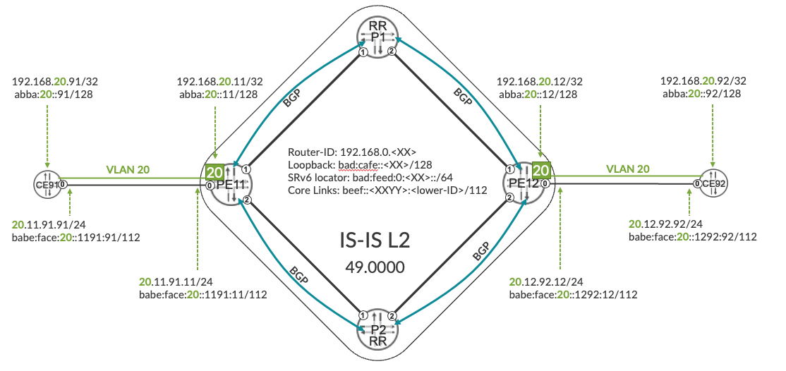
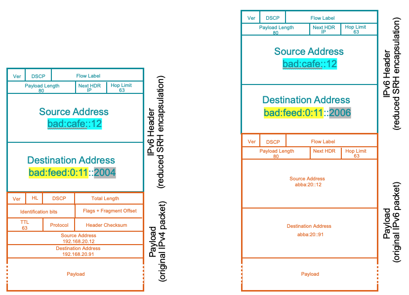
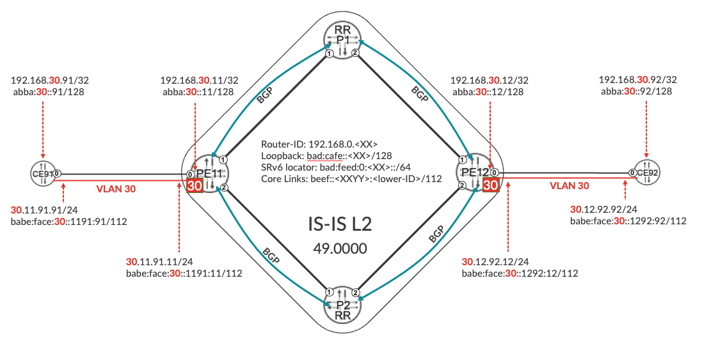

# L3VPN over SRv6

**Krzysztof Szarkowicz - 08/11/2022**

How unicast IPv4/IPv6 within L3VPN VRFs are implemented with Segment Routing v6 (SRv6) as underlaying transport technology.

## Introduction

In the first blog of SRv6 (Segment Routing version 6) series I discussed the very basic SRv6 concepts: SRv6 locator and SRv6 SID (Segment Identifier), particularly most basic SRv6 SID, which is End SID. This is the second blog in the series of SRv6 blogs. In this blog I will explain, how unicast IPv4/IPv6 within L3VPN (Layer 3 Virtual Private Network) are implemented with SRv6 as underlaying transport technology.

This blog post is based on the capabilities of Junos 20.4 running on MX Series and JUNOS 22.3 on ACX7000 routers. Config and show command outputs have been collected on vMX in our labs. JUNOS 22.3 introduces changes to SRv6 infrastructure, which might change the SRv6 configuration shown in this blog post. Please check [SRv6 SID Encoding and Transposition](https://juniper.github.io/techposts/srv6-sid-encoding-and-transposition/article) blog for more details.

- [JCL (Junivators and partners)](https://portal.cloudlabs.juniper.net/RM/Topology?b=7d39fd8c-3965-4ffd-bd4a-3eb67519536c&d=c78ae7c7-e93b-4708-813e-109fd780f301)
- [vLabs (open to all)](https://portal.cloudlabs.juniper.net/RM/Topology?b=1c3af352-c46c-40d9-83d6-8aed0d3a3afe&d=2f99da30-8756-4d15-8822-d648498c7aea)

## End.DT4 and End.DT6

To discuss L3VPN over SRv6, the basic topology used in already previous blog will be enhanced with CE devices, as outlined in Figure 1.



Some simple dual-stack (with IPv4 and IPv6 prefixes) L3VPN is created in this topology, with IPv4 and IPv6 addressing inside the VPN outlined in Figure 1. New SRv6 SID types (note: RFC 8986 has full range of SRv6 SIDs) are used to transport L3VPN traffic using SRv6 underlay:

- End.DT4: Decapsulate and perform lookup in specific IPv4 table
- End.DT6: Decapsulate and perform lookup in specific IPv6 table

Transporting of L3VPN prefixes using SRv6 underlay is, in essence, tunneling of L3VPN packets (IPv4 or IPv6) via IPv6 tunnel, with the End.DT4 or End.DT6 used as the destination IPv6 address. When a router receives IPv6 packet with destination IPv6 address matching locally configured End.DT4 SID, following actions are performed by the router:

- Remove outer IPv6 header (decapsulate)
- Perform lookup in the IPv4 routing table associated with the End.DT4 SID for the destination IPv4 address of the inner IPv4 packet
- Route the inner IPv4 packet according to the lookup results

End.DT6 action is very similar, with the exception that inner IP packet is IPv6, and not IPv4:

- Remove outer IPv6 header (decapsulate)
- Perform lookup in the IPv6 routing table associated with the End.DT6 SID for the destination IPv6 address of the inner IPv6 packet
- Route the inner IPv6 packet according to the lookup results

Configuration wise, apart from legacy L3VPN configuration (not shown, for simplicity), you need to configure End.DT4 (in order to be able to transport IPv4 L3VPN packets over SRv6 underlay) and/or End.DT6 (for IPv6 L3VPN packets). Each VRF is associated with different End.DT4/End.DT6, so when later packets are arriving, based on the End.DT4/End.DT6 value, appropriate VRF can be selected for lookup.

```
1     routing-instances
2         RI-VRF20 {
3             protocols {
4                 bgp {
5                     source-packet-routing {
6                         srv6 {
7                             locator SRV6-LOC-1 {
8                                 end-dt4-sid bad:feed:0:11::2004;
9                                 end-dt6-sid bad:feed:0:11::2006;
10                           }
11                       }
12                   }
13               }
14           }
15       }
16   }
```

*Configuration 1: End.DT4 and End.DT6 SID on PE11*

Configured FUNC:ARG values of End.DT4/End.DT6 SID can be anything, but of course must be unique, i.e. not used for some other SIDs already. 2004 or 2006 are just some examples of manually assigned SRv6 SIDs. If you recall, in the first blog the value for End SID was simply '0'.

Apart from configuring End.DT4/End.DT6 SIDs for each VRF, you need as well to:

- enable SRv6 extensions for L3VPN (inet-vpn unicast and inet6-vpn unicast) BGP address families, so that SRv6 SID BGP attributes can be advertised and accepted
- enable RFC 8950 (Advertising IPv4 network Layer Reachability Information (NLRI) with an IPv6 Next Hop) compliant extended encoding of IPv6 next hops for IPv4 address families

```
1     protocols {
2         bgp {
3             group IBGP-RR {
4                 family inet-vpn {
5                     unicast {
6                         extended-nexthop; # Extended encoding of IPv6 next-hop for IPv4 service
7                         advertise-srv6-service;
8                         accept-srv6-service;
9                     }
10               }
11               family inet6-vpn {
12                   unicast {
13                       advertise-srv6-service;
14                       accept-srv6-service;
15                   }
16               }
17           }
18           rfc8950-compliant;           # RFC 8950 compliant encoding of IPv6 next-hop
19       }
20   }
```

*Configuration 2: SRv6 extensions for BGP*

Junos by default uses pre-standard (based on preliminary IETF draft before RFC 8950 was published) encoding scheme for IPv6 next hops for IPv4 address families. Therefore, if you omit 'rfc8950-compliant' keyword, the setup will work between Juniper routers, but with high probability will fail between Juniper and 3rd party routers.

Enabling these features allows proper encoding, as well as sending and accepting of BGP attributes carrying SRv6 SIDs (here particularly End.DT4 and End.DT6 SRv6 SIDs) over BGP sessions towards BGP peers, as outlined in Figure 1.

Do you think you are done with the configuration to support L3VPN services other SRv6? Not yet. There two more configuration aspects that require some attention:

- Use (that is preserve) extended next-hop structures
- Enable BGP multipath with so called 'list next-hop'

```
1     routing-options {
2         resolution {
3             preserve-nexthop-hierarchy;
4         }
5     }
6     protocols {
7         bgp {
8             multipath {
9                 list-nexthop;
10            }
11       }
12    }
```

*Configuration 3: BGP Next-Hop Structures to support SRv6*

Both features are required from proper next-hop resolution of services that use SRv6 and therefore IPv6 next-hops.

By default, Junos next-hop resolver always compresses (flattens) hierarchy so that all routes point to only one indirect next-hop and only one forwarding next-hop. This optimization (flattening of the next-hop structures) is performed in Junos for following reasons:

- Traditionally, the inner indirect next hop does not carry any useful information for the Packet Forwarding Engine (PFE). Hence, it just increases the number of objects in kernel/PFE and in entire system.
- There might be some (older) PFEs which cannot install indirect NH into hardware. This is primarily because the hardware lacks indirection support. For such PFEs, they have to compress the next-hop chain.
- Finally, if hardware supports indirection, then also this may (especially on older PFEs) be multiple memory lookups for PFE when forwarding each packet, thus decreasing the overall PFE performance

This blog is about SRv6, therefore all the details of next-hop structures are not covered here. However, SRv6 is supported only on modern PFEs, which do not have the limitations mentioned earlier. Further, SRv6 is supported only with extended next-hop hierarchy, using so called chained composite next-hop, therefore extended next-hop hierarchy must be preserved, and default Junos behavior to flatten the next-hop hierarchy must be therefore disabled with explicit configuration. Preserving extended next-hop hierarchy (supported on modern PFEs) provides following advantages

- Support for Prefix Independent Convergence (PIC) with switching to alternate path immediately (while global repair may take considerable time)
- Support for ECMP paths in multiple levels in the next-hop hierarchy
- Support for local repair in multiple levels in the next-hop hierarchy
- Support for services over SRv6

Another aspect is list next-hop for BGP multipath. BGP multipath will create list next-hop (which, again, is some sort or more advanced next-hop structure, which is out of scope for this SRv6 blog) for all multipath, when configured so. This is to simplify the overall internal design architecture, and improve overall scaling of the system. SRv6 requires list next-hop.

Given the fact that at time of writing this blog some features are not compatible with list next-hop, the default behavior has not been changed, but additional knob to enable list next-hop has been introduced. Once all features support list next-hop structures, this might eventually become Junos default without any extra knob.

## Propagation of Service Routes with SRv6 attributes

Now, after all the configuration is performed, let's perform basic checks of the control plane for VPN 20 outlined in Figure 1.

```
1       root@PE11> show route advertising-protocol bgp bad:cafe::1 table RI-VRF20 detail
2       W18: Tue 2022-05-03T05:07:55 PDT (UTC-0700)
3
4       RI-VRF20.inet.0: 8 destinations, 11 routes (8 active, 0 holddown, 0 hidden)
5       * 20.11.91.0/24 (1 entry, 1 announced)
6        BGP group IBGP-RR type Internal
7            Route Distinguisher: 192.169.0.11:20
8            VPN Label: 3
9            Nexthop: bad:feed:0:11::
10           Flags: Nexthop Change
11           Localpref: 100
12           AS path: [65000] I
13           Communities: target:65000:20
14                      SRv6 SID: bad:feed:0:11::2004 Behavior: 19 BL: 0 NL: 0 FL: 0 AL: 0 TL: 0 TO: 0
15
16      * 192.168.20.11/32 (1 entry, 1 announced)
17       BGP group IBGP-RR type Internal
18           Route Distinguisher: 192.169.0.11:20
19           VPN Label: 3
20           Nexthop: bad:feed:0:11::
21           Flags: Nexthop Change
22           Localpref: 100
23           AS path: [65000] I
24           Communities: target:65000:20
25                      SRv6 SID: bad:feed:0:11::2004 Behavior: 19 BL: 0 NL: 0 FL: 0 AL: 0 TL: 0 TO: 0
26
27      * 192.168.20.91/32 (1 entry, 1 announced)
28       BGP group IBGP-RR type Internal
29           Route Distinguisher: 192.169.0.11:20
30           VPN Label: 3
31           Nexthop: bad:feed:0:11::
32           Flags: Nexthop Change
33           MED: 1
34           Localpref: 100
35           AS path: [65000] I
36           Communities: target:65000:20 rte-type:0.0.0.0:1:0
37                      SRv6 SID: bad:feed:0:11::2004 Behavior: 19 BL: 0 NL: 0 FL: 0 AL: 0 TL: 0 TO: 0
38
39      RI-VRF20.inet6.0: 11 destinations, 14 routes (11 active, 0 holddown, 0 hidden)
40
41      * abba:20::11/128 (1 entry, 1 announced)
42       BGP group IBGP-RR type Internal
43           Route Distinguisher: 192.169.0.11:20
44           VPN Label: 3
45           Nexthop: bad:feed:0:11::
46           Flags: Nexthop Change
47           Localpref: 100
48           AS path: [65000] I
49           Communities: target:65000:20
50                      SRv6 SID: bad:feed:0:11::2006 Behavior: 18 BL: 0 NL: 0 FL: 0 AL: 0 TL: 0 TO: 0
51
52      * abba:20::91/128 (1 entry, 1 announced)
53       BGP group IBGP-RR type Internal
54           Route Distinguisher: 192.169.0.11:20
55           VPN Label: 3
56           Nexthop: bad:feed:0:11::
57           Flags: Nexthop Change
58           MED: 65535
59           Localpref: 100
60           AS path: [65000] I
61           Communities: target:65000:20 rte-type:0.0.0.0:1:0
62                      SRv6 SID: bad:feed:0:11::2006 Behavior: 18 BL: 0 NL: 0 FL: 0 AL: 0 TL: 0 TO: 0
63
64      * babe:face:20::1191:0/112 (1 entry, 1 announced)
65       BGP group IBGP-RR type Internal
66           Route Distinguisher: 192.169.0.11:20
67           VPN Label: 3
68           Nexthop: bad:feed:0:11::
69           Flags: Nexthop Change
70           Localpref: 100
71           AS path: [65000] I
72           Communities: target:65000:20
73                      SRv6 SID: bad:feed:0:11::2006 Behavior: 18 BL: 0 NL: 0 FL: 0 AL: 0 TL: 0 TO: 0 
```

*CLI-Output 1: Advertising L3VPN Service Prefix with End.DT4 or End.DT6 SRv6 SID*

You can see three IPv4 and three IPv6 NLRIs advertised towards route reflector P1 (and P2, of course, but it is not shown for brevity). These NLRIs have 'classical' parameters/attributes, that you would normally expect in 'classical' L3VPN over MPLS case (note: rte-type is a BGP extended community carrying OSPF area ID, as OSPFv3 is used as example PE-CE protocol). Basically, there are only two differences:

- VPN MPLS label is for all NLRIs the same, and carries value 3 (implicit null label)
- Additional BGP attribute called SRv6 SID

VPN label is, actually, not an attribute. It is part of NLRI itself. So, despite it is not needed in SRv6 environment (no MPLS here), it cannot be skipped from advertisement. Hence, to kind of invalidate the VPN label, implicit null label is used in all advertisement. In classical (MPLS based) L3VPN you would see some different, real (with value 16 or greater) MPLS label values there.

SRv6 SID is the SID being discussed in this blog. It matches the configured value, so all good. Behind the SRv6 SID there are some numbers, that will be discussed in some later blog.

Checking L3VPN prefixes on route reflector, unfortunately there is some surprise -- the prefix is hidden with the error related to unusable next-hop.

```
1       root@P1> show route 20.11.91.0/24 hidden extensive | match "entry|next hop"
2       W18: Mon 2022-05-02T12:01:50 PDT (UTC-0700)
3       192.169.0.11:20:20.11.91.0/24 (1 entry, 0 announced)
4                       Next hop type: Unusable, Next hop index: 0
5                       Indirect next hops: 1
6                               Protocol next hop: bad:cafe::11
7                               Indirect next hop: 0x0 - INH Session ID: 0 
```

*CLI-Output 2: Receiving L3VPN Service Prefix with SRv6 SID*

The BGP protocol next-hop, as usual, is the loopback of advertising router. This loopback is, however, present in inet6.0 routing table, but not inet6.3 routing table. And, for proper resolution of L3VPN services, the BGP protocol next-hop should be reachable from within inet[6].3 routing table.

```
1       root@P1> show route bad:cafe::11
2       W18: Mon 2022-05-02T12:07:21 PDT (UTC-0700)
3
4       inet6.0: 19 destinations, 19 routes (19 active, 0 holddown, 0 hidden)
5       + = Active Route, - = Last Active, * = Both
6
7       bad:cafe::11/128   *[IS-IS/18] 1w2d 22:19:39, metric 1000, tag 101
8                           >  to fe80::5604:dff:fe00:5839 via ge-0/0/1.0 
```

*CLI-Output 3: Remote IPv6 loopback route*

So, what is the problem here? The problem is, standard BGP machinery uses BGP attribute called protocol next hop as the next-hop (which is pretty obvious), and for L3VPN services this next-hop must be present in so called 'labeled' routing table: inet.3 for IPv4 next-hops, or inet6.3 for IPv6 next-hops. This behavior is inherited from classical, MPLS based, L3VPNs (similar to VPN label mentioned earlier). With SRv6 based L3VPNs, the next-hop that should be used is actually SRv6 locator, encoded in SRv6 SID attribute. And, it is, in fact, present in inet6.3 table (in addition to inet6.0 table).

```
1       root@P1> show route bad:feed:0:11::/64
2       W18: Mon 2022-05-02T12:16:52 PDT (UTC-0700)
3
4       inet6.0: 19 destinations, 19 routes (19 active, 0 holddown, 0 hidden)
5       + = Active Route, - = Last Active, * = Both
6
7       bad:feed:0:11::/64 *[IS-IS/18] 1w2d 22:29:31, metric 1000
8                           >  to fe80::5604:dff:fe00:5839 via ge-0/0/1.0
9
10      inet6.3: 3 destinations, 3 routes (3 active, 0 holddown, 0 hidden)
11      + = Active Route, - = Last Active, * = Both
12
13      bad:feed:0:11::/64 *[SRV6-ISIS/14] 1w2d 22:29:31, metric 1000
14                          >  to fe80::5604:dff:fe00:5839 via ge-0/0/1.0, SRV6-Tunnel, Dest: bad:feed:0:11:: 
```

*CLI-Output 4: Remote IPv6 locator route*

So, you need to do some trick on the advertising router. The advertising router should initialize the BGP protocol next hop attribute not with the local loopback (which is the default behavior), but with the local SRv6 locator.

```
1     policy-options {
2         policy-statement PL-BGP-EXP {
3             term 1 {                        
4                 then {
5                     next-hop bad:feed:0:11::;
6                 }
7             }
8         }
9     }
10   protocols {
11       bgp {
12           vpn-apply-export;            # Apply the export policy to local VRFs as well
13           group IBGP-RR {
14               export PL-BGP-EXP;
15           }
16       }
17   }
```

*Configuration 4: Setting BGP next hop to SRv6 locator*

After this small change, L3VPN prefixes are no longer advertised with next hop self, as in CLI-Output 1, but with next-hop equal to the SRv6 locator.

```
1       root@PE11> show route advertising-protocol bgp bad:cafe::1 table RI-VRF20
2       W18: Tue 2022-05-03T05:14:26 PDT (UTC-0700)
3
4       RI-VRF20.inet.0: 8 destinations, 11 routes (8 active, 0 holddown, 0 hidden)
5         Prefix                  Nexthop              MED     Lclpref    AS path
6       * 20.11.91.0/24           bad:feed:0:11::              100        I
7       * 192.168.20.11/32        bad:feed:0:11::              100        I
8       * 192.168.20.91/32        bad:feed:0:11::      1       100        I
9
10      RI-VRF20.inet6.0: 11 destinations, 14 routes (11 active, 0 holddown, 0 hidden)
11        Prefix                  Nexthop              MED     Lclpref    AS path
12      * abba:20::11/128         bad:feed:0:11::              100        I
13      * abba:20::91/128         bad:feed:0:11::      1000    100        I
14        babe:face:20::1191:0/112
15      *                         bad:feed:0:11::              100        I 
```

*CLI-Output 5: Advertising L3VPN Service Prefix with SRv6 SID*

You can as well verify that routing state on the received PE router

```
1       root@PE12> show route table RI-VRF20 192.168.20.91/32
2       W18: Tue 2022-05-03T05:19:29 PDT (UTC-0700)
3
4       RI-VRF20.inet.0: 8 destinations, 11 routes (8 active, 0 holddown, 0 hidden)
5       @ = Routing Use Only, # = Forwarding Use Only
6       + = Active Route, - = Last Active, * = Both
7
8       192.168.20.91/32   *[BGP/170] 00:12:15, MED 1, localpref 100, from bad:cafe::1
9                             AS path: I, validation-state: unverified
10                          >  to fe80::5604:dff:fe00:6484 via ge-0/0/1.0, SRV6-Tunnel, Dest: bad:feed:0:11::
11                             to fe80::5604:dff:fe00:6890 via ge-0/0/2.0, SRV6-Tunnel, Dest: bad:feed:0:11::
12                          [BGP/170] 00:12:24, MED 1, localpref 100, from bad:cafe::2
13                            AS path: I, validation-state: unverified
14                          >  to fe80::5604:dff:fe00:6484 via ge-0/0/1.0, SRV6-Tunnel, Dest: bad:feed:0:11::
15                             to fe80::5604:dff:fe00:6890 via ge-0/0/2.0, SRV6-Tunnel, Dest: bad:feed:0:11::
16
17      root@PE12> show route table RI-VRF20 abba:20::91/128
18      W18: Tue 2022-05-03T05:19:35 PDT (UTC-0700)
19
20      RI-VRF20.inet6.0: 11 destinations, 14 routes (11 active, 0 holddown, 0 hidden)
21      + = Active Route, - = Last Active, * = Both
22
23      abba:20::91/128    *[BGP/170] 00:07:46, MED 1000, localpref 100, from bad:cafe::1
24                            AS path: I, validation-state: unverified
25                          >  to fe80::5604:dff:fe00:6484 via ge-0/0/1.0, SRV6-Tunnel, Dest: bad:feed:0:11::
26                             to fe80::5604:dff:fe00:6890 via ge-0/0/2.0, SRV6-Tunnel, Dest: bad:feed:0:11::
27                          [BGP/170] 00:07:46, MED 1000, localpref 100, from bad:cafe::2
28                            AS path: I, validation-state: unverified
29                          >  to fe80::5604:dff:fe00:6484 via ge-0/0/1.0, SRV6-Tunnel, Dest: bad:feed:0:11::
30                             to fe80::5604:dff:fe00:6890 via ge-0/0/2.0, SRV6-Tunnel, Dest: bad:feed:0:11:: 
```

*CLI-Output 6: Routes to remote L3VPN prefixes*

All looks good now. The traffic from PE12 to remote CE (CE91) will be load-balanced across two P routers, and tunneled inside SRv6 tunnels. This applies to both IPv4 and IPv6 traffic.

You can as well check more SRv6 related details about the L3VPN prefixes.

```
1       root@PE12> show route table RI-VRF20 abba:20::91/128 extensive
2       (...)
3                    Next hop: via Chain Tunnel Composite, SRv6
4                   Next hop: ELNH Address 0x7a1a318
5                   SRV6-Tunnel: Reduced-SRH Encap-mode
6                    Src: bad:cafe::12 Dest: bad:feed:0:11::
7                    Segment-list[0] bad:feed:0:11::
8       (...)
9                       SRv6 SID: bad:feed:0:11::2006 Behavior: 18 BL: 0 NL: 0 FL: 0 AL: 0 TL: 0 TO: 0
10      (...)
```

*CLI-Output 7: SRv6 information about L3VPN route*

First what you see is that chain tunnel composite next-hop, and extended list next-hop (ELNH) are being used (do you still remember the discussion from the beginning of this blog?).

Next you see that SRv6 tunnel, sourced from the local loopback and destined to the SRv6 locator on remote node, with so called reduced SRH encapsulation mode, will be used to deliver the traffic. When this encapsulation mode is used (which is the default for delivering L3VPN over basic SRv6 underlay), Segment Routing Header (SRH) is used only, if strictly needed, for example for SRv6 Traffic Engineering (SRH will be discussed in detail in some future blog). In our current case, SRH is not used, as the SRv6 segment list contains only single segment (segment 0 in line 7). This segment can be encoded in the destination IPv6 address of the SRv6 tunnel, without the need for SRH. In essence, with reduced SRH encapsulation mode, L3VPN with SRv6 transport is simple IPinIP tunneling, as outlined in Figure 2, with classical IPv6 header added on top of original L3VPN IPv4 or IPv6 packet.



## Data Plane verification

Now, it is time to verify data plane operation. Does this work at all?

```
1       root@PE12> traceroute routing-instance RI-VRF20 192.168.20.91
2       W18: Tue 2022-05-03T09:12:59 PDT (UTC-0700)
3       traceroute to 192.168.20.91 (192.168.20.91), 30 hops max, 52 byte packets
4        1  20.11.91.11 (20.11.91.11)  4.885 ms  4.431 ms  3.092 ms
5        2  192.168.20.91 (192.168.20.91)  5.236 ms  5.824 ms  5.152 ms
6
7       root@PE12> traceroute routing-instance RI-VRF20 abba:20::91
8       W18: Tue 2022-05-03T09:13:08 PDT (UTC-0700)
9       traceroute6 to abba:20::91 (abba:20::91) from abba:20::12, 64 hops max, 12 byte packets
10       1  abba:20::11 (abba:20::11)  4.063 ms  4.034 ms  3.331 ms
11       2  abba:20::91 (abba:20::91)  38.493 ms  5.790 ms  5.612 ms 
```

*CLI-Output 8: Data Plane verification*

Traceroute from PE12 to CE91 works, so we are good here. Just as a side note, as PE-CE protocol between CEs and PEs we are using in this examples OSPFv3, configured to support both IPv4 and IPv6 routing. As a result, CE prefixes (IPv4 and IPv6 loopbacks) are distributed across entire VPN domain.

## L3VPN over SRv6 -- End.DT46

Now, let's discuss another SRv6 SID used for L3 services: End.DT46, with the example of another VPN (VPN 30), as outlined in Figure 3.



End.DT46 endpoint behavior is to decapsulate and perform lookup in specific IP (could be IPv4 or IPv6) table. Basically, End.DT46 is shared across IPv4 and IPv6 prefixes. Configuration-wise, there is only small difference comparing to configuring End.DT4 and End.DT6.

```
1     routing-instances
2         RI-VRF30 {
3             protocols {
4                 bgp {
5                     source-packet-routing {
6                         srv6 {
7                             locator SRV6-LOC-1 {
8                                 end-dt46-sid bad:feed:0:11::3046;
9                             }
10                       }
11                   }
12               }
13           }
14       }
15   }
```

*Configuration 5: End.DT46 SID on PE11*

Simply, there is single SRv6 SID that is used for both IPv4 and IPv6 prefixes.

```
1       root@PE11> show route advertising-protocol bgp bad:cafe::1 table RI-VRF detail | match "VRF|SID"
2       W18: Tue 2022-05-03T11:18:27 PDT (UTC-0700)
3
4       RI-VRF20.inet.0: 8 destinations, 11 routes (8 active, 0 holddown, 0 hidden)
5                       SRv6 SID: bad:feed:0:11::2004 Behavior: 19 BL: 0 NL: 0 FL: 0 AL: 0 TL: 0 TO: 0
6                       SRv6 SID: bad:feed:0:11::2004 Behavior: 19 BL: 0 NL: 0 FL: 0 AL: 0 TL: 0 TO: 0
7                       SRv6 SID: bad:feed:0:11::2004 Behavior: 19 BL: 0 NL: 0 FL: 0 AL: 0 TL: 0 TO: 0
8
9       RI-VRF30.inet.0: 8 destinations, 11 routes (8 active, 0 holddown, 0 hidden)
10                      SRv6 SID: bad:feed:0:11::3046 Behavior: 20 BL: 0 NL: 0 FL: 0 AL: 0 TL: 0 TO: 0
11                      SRv6 SID: bad:feed:0:11::3046 Behavior: 20 BL: 0 NL: 0 FL: 0 AL: 0 TL: 0 TO: 0
12                      SRv6 SID: bad:feed:0:11::3046 Behavior: 20 BL: 0 NL: 0 FL: 0 AL: 0 TL: 0 TO: 0
13
14      RI-VRF20.inet6.0: 11 destinations, 14 routes (11 active, 0 holddown, 0 hidden)
15                      SRv6 SID: bad:feed:0:11::2006 Behavior: 18 BL: 0 NL: 0 FL: 0 AL: 0 TL: 0 TO: 0
16                      SRv6 SID: bad:feed:0:11::2006 Behavior: 18 BL: 0 NL: 0 FL: 0 AL: 0 TL: 0 TO: 0
17                      SRv6 SID: bad:feed:0:11::2006 Behavior: 18 BL: 0 NL: 0 FL: 0 AL: 0 TL: 0 TO: 0
18
19      RI-VRF30.inet6.0: 11 destinations, 14 routes (11 active, 0 holddown, 0 hidden)
20                      SRv6 SID: bad:feed:0:11::3046 Behavior: 20 BL: 0 NL: 0 FL: 0 AL: 0 TL: 0 TO: 0
21                      SRv6 SID: bad:feed:0:11::3046 Behavior: 20 BL: 0 NL: 0 FL: 0 AL: 0 TL: 0 TO: 0
22                      SRv6 SID: bad:feed:0:11::3046 Behavior: 20 BL: 0 NL: 0 FL: 0 AL: 0 TL: 0 TO: 0
 
```

*CLI-Output 9: Advertising L3VPN Service Prefix with End.DT4/End.DT6/End.DT46 SRv6 SID*

All prefixes (regardless, if IPv4 or IPv6) are advertised from VRF30 with the same SID value (3046), as VRF30 uses End.DT46. VRF20, on the other hand, uses different SID value for IPv4 prefixes (End.DT4), and different SID value for IPv6 prefixes (End.DT6). Otherwise, the behavior is between End.DT4/End.DT6 and End.DT46 is very similar, thus no further verification steps are described in this blog.

## Next Steps

In the next blog, we will discuss multi-area SRv6 design, with locator summarization at area boundaries.

## Useful links

- RFC 8986: Segment Routing over IPv6 (SRv6) Network Programming: [https://datatracker.ietf.org/doc/rfc8986/](https://datatracker.ietf.org/doc/rfc8986/)
- SRv6 in Junos: [https://www.juniper.net/documentation/us/en/software/junos/is-is/topics/topic-map/infocus-isis-srv6-network-programming.html](https://www.juniper.net/documentation/us/en/software/junos/is-is/topics/topic-map/infocus-isis-srv6-network-programming.html)
- TechPost 1: SRv6 Basics Locator and End-SIDs - [https://juniper.github.io/techposts/srv6-basics-locator-and-end-sids/article](https://juniper.github.io/techposts/srv6-basics-locator-and-end-sids/article)
- TechPost 2: L3VPN on SRv6 - [https://juniper.github.io/techposts/l3vpn-over-srv6/article](https://juniper.github.io/techposts/l3vpn-over-srv6/article)
- TechPost 3: SRv6 Summarisation - [https://juniper.github.io/techposts/srv6-summarization/article](https://juniper.github.io/techposts/srv6-summarization/article)
- TechPost 4: SRv6 SID Encoding and Transposition - [https://juniper.github.io/techposts/srv6-sid-encoding-and-transposition/article](https://juniper.github.io/techposts/srv6-sid-encoding-and-transposition/article)

## Glossary

- BGP: Border Gateway Protocol
- CE: Customer Edge
- ID: Identifier
- IS-IS: Intermediate System to Intermediate System
- P: Provider
- PE: Provider Edge
- IP: Internet Protocol
- IPv4: Internet Protocol version 4
- IPv6: Internet Protocol version 6
- L2: Level 2
- L3VPN: Layer 3 Virtual Private Network
- MPLS: MultiProtocol Label Switching
- NH: Next-Hop
- NLRI: Network Layer Reachability Information
- OSPF: Open Shortest Path First
- PFE: Packet Forwarding Engine
- SID: Segment Identifier
- SRH: Segment Routing Header
- SRv6: Segment Routing version 6
- RR: Route Reflector
- VRF: Virtual Routing and Forwarding instance

## Acknowledgements

Thanks to Anton Elita for thorough review, and Abhishek Murali for preparing JCL and vLabs topologies.
