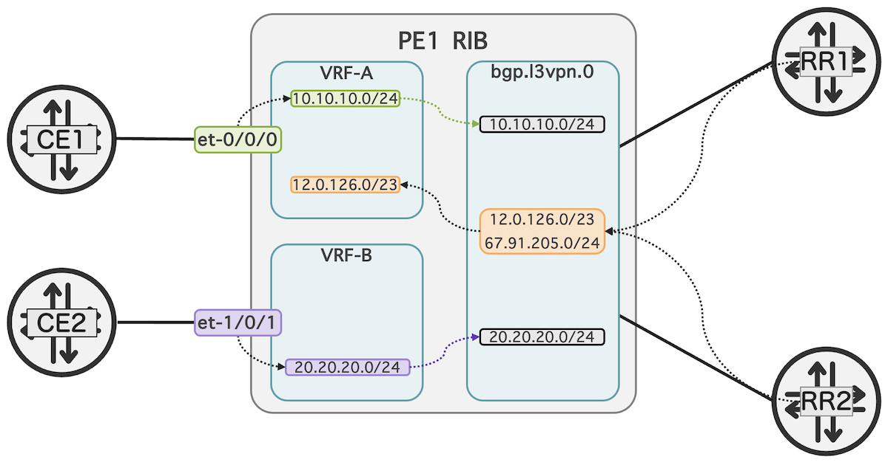
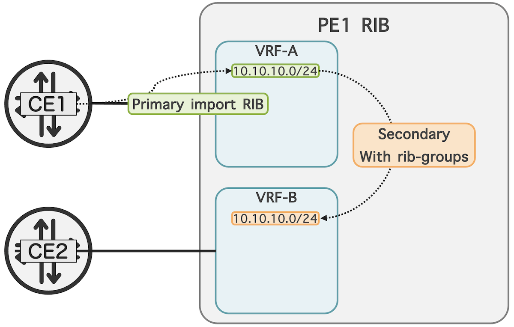

# L3VPN to Global RIB Leaking

**Moshiko Nayman - 11/07/2024**

Leak remote L3VPN routes to the global internet table or other VRFs is now possible with the introduction of the vpn-global-import feature coming in Junos 24.2.

## Introduction

Junos OS 24.2 introduces vpn-global-import, a new capability that allows service providers to leak remote L3VPN routes to the global internet table. This feature enhances existing route control and leaking capabilities, expanding the extensive toolkit available in Junos OS without disrupting current routing behaviors.

## Overview

In BGP/MPLS L3VPNs, there are two key types of routes: CE routes and PE routes.

- **CE routes** are received by a Provider Edge (PE) router from directly connected Customer Edge (CE) routers. These routes have the CE as the Originator ID. These routes are learned via BGP IPv4 unicast NLRI (SAFI 1) within a routing-instance such as VRF type.
- **PE routes** are remote CE routes received by a remote PE router in a VRF and then advertised to the local PE router. From the perspective of the local PE router, these are considered PE routes as the Originator ID is the remote PE router within the provider's network. These routes are advertised using BGP VPNv4 NLRI (SAFI 128).

CE routes are imported directly into the customer VRF as the primary table. As shown in the example below, the prefix **10.10.10.0/24** is directly received by the PE from the CE.

PE routes are L3VPN routes that are first imported into the **bgp.l3vpn.0** table. These routes are then imported by the VRF instance as secondary routes based on matching Route Target communities and they are associated with a VRF.

In the below example, the prefix **12.0.126.0/23** is initially stored in the **bgp.l3vpn.0** table as the primary route and then imported into **VRF-A** as a secondary route based on the matching import Route Target criteria



## Background

Before explaining the **vpn-global-import** feature, it is helpful to provide some background on what is currently supported and a quick recap on some of the default routing tables in Junos.

- **inet.0**: This is the main IPv4 unicast routing table, storing directly connected, static, and dynamically learned routes.
- **inet.3**: Used for IPv4 MPLS; it stores the egress address, LSP name, and outgoing interface for MPLS paths when the local device is the ingress node.
- **inet6.0**: Holds IPv6 unicast routes, including local, static, and dynamically learned routes for IPv6 traffic.
- **inet6.3**: Used for IPv6 MPLS.
- **bgp.l3vpn.0**: Stores BGP routes for Layer 3 VPNs. Routes in this table are copied into a Layer 3 VRF when there is a matching route table.
- **bgp.l2vpn.0**: Stores BGP routes for Layer 2 VPNs. Routes in this table are copied into a Layer 2 routing-instances when there is a matching route-target communities.
- **instance-name.inet.0**: When configuring a routing instance, Junos OS creates the default unicast routing table **instance-name.inet.0**.
- **instance-name.inet6.0**: Similarly, for IPv6, Junos OS creates the default unicast routing table **instance-name.inet6.0** when a routing instance is configured.

The **rib-groups** feature, introduced in Junos OS Release 7.4, is a template-like approach, offering a powerful and flexible way to selectively share routing information across multiple routing tables. By configuring a RIB group, a primary routing table can export specific routes---or even entire tables---to other RIBs, routing instances, or multiple tables. This feature also helps stitch between IP and IP-MPLS tables and populate **inet.0** to **inet.3** and/or the **inet6.3** table with IPv6 addresses compatible with IPv4. Both import and export options are available, with additional policy capabilities to precisely control which routes are shared. This feature is very useful for service providers willing to manipulate traffic paths effectively.

Example of importing Interface Routes Using rib-groups:

```
set routing-options rib-groups VRF-A-TO-VRF-B import-rib VRF-A.inet.0
set routing-options rib-groups VRF-A-TO-VRF-B import-rib VRF-B.inet.0
set routing-instances VRF-A routing-options interface-routes rib-group inet VRF-A-TO-VRF-B
```

To import routes from the primary RIB in VRF-A to VRF-B, configure as follows:

```
set routing-options rib-groups VRF-A-TO-VRF-B import-rib VRF-A.inet.0
set routing-options rib-groups VRF-A-TO-VRF-B import-rib VRF-B.inet.0
set routing-instances VRF-A protocols bgp group CE family inet unicast rib-group VRF-A-TO-VRF-B
```

(Optional) An import-policy can be added to further filter routes when copying between routing tables (RIBs). Only routes matching this policy are imported, giving control over shared routes without full redistribution.



Prefixes received directly from a CE into a VRF are simply inet unicast and primary to that VRF. These can be leaked into the global routing table using the rib-groups or auto-export features to simplify route sharing between different VRF instances on a local PE router by automatically evaluating and matching export policies.

## Leak Remote L3VPN Route to Global RIB

The capability to leak remote prefixes coming on VPNv4 (family inet-vpn) using rib-groups is blocked when we try using rib-groups to maintain a strict separation between VPN and global routing tables.

As mentioned above, routes are learned in the primary routing table **bgp.l3vpn.0** table and are imported to the local VRF if configured using route-targets, these routes will be in secondary tables, for example: **VRF-A.inet.0**.

```
mnayman@PE1> show route 200.0.0.5/32 extensive table VRF-A | match prim 
                Primary Routing Table: bgp.l3vpn.0
```

This separation was crucial to ensure security, prevent route conflicts, and maintain the integrity of the global routing table. By keeping VPN routes isolated, service providers could avoid potential issues such as route leaks that could disrupt global internet routing and compromise the privacy of VPN customers.

The main reason to restrict that specific type of leaking is to avoid situations where a service provider's customer mistakenly advertises an internet address, which could then be exported to the internet table and propagated over BGP to other tier 1 providers, leading to internet IP spoofing.

However, there are cases where prefixes received in a VPN need to be leaked to the internet, such as to provide internet access to the VPN customer or to intentionally create asymmetric routes to protect incoming traffic from the internet. To address this, service providers implement protections against loops and unexpected prefixes from VPN customers. We developed a feature, separate from existing rib-groups, to import VPN routes into the global table.

## Introducing the "vpn-global-import" Feature

Introduced in Junos 24.2, the **vpn-global-import** feature allows network operators to leak a route coming over inet-vpn family (remote PE advertised prefixes) into the internet routing table **inet.0**. The new knob also ensures that operators can control and understand the implications of leaking VPN routes without causing unexpected changes to existing configurations.

Example configuration for importing routes based on a community using **vpn-global-import**:

```
set routing-options rib inet.0 vpn-global-import INETVPN-TO-INET0

set policy-options policy-statement INETVPN-TO-INET0 term SANE_CUSTOMER from community COMM-INETVPN-TO-INET0
set policy-options policy-statement INETVPN-TO-INET0 term SANE_CUSTOMER then accept
set policy-options policy-statement INETVPN-TO-INET0 term REST then reject

set policy-options community COMM-INETVPN-TO-INET0 members target:999:999
```

## Validation

```
mnayman@MX-1> show route community-name COMM-INETVPN-TO-INET0 table inet.0 12.0.126.0/23 extensive 
inet.0: 85 destinations, 135 routes (82 active, 0 holddown, 10 hidden)
12.0.126.0/ (3 entries, 2 announced)
        State: <CalcForwarding>
KRT in-kernel 12.0.126.0/23 -> {list:composite(1048612), composite(1048604)}
        @BGP    Preference: 170/-11
...
...
                Primary Routing Table: bgp.l3vpn.0
```

Note: Only public prefixes in a VPN should be permitted to leak to **inet[6].0**. Ensuring this is the responsibility of the operator.

## Glossary

- BGP: Border Gateway Protocol
- CE: Customer Edge
- IFL: Interface Logical
- IP: Internet Protocol
- Junos: Operating System used in Juniper Networks routing, switching and security devices.
- L3VPN: Layer 3 VPN
- MPLS: Multiprotocol Label Switching
- PE: Provider Edge router
- PFE: Packet Forwarding Engine
- RE: Routing Engine
- RIB: Routing Information Base
- VPN: Virtual Private Network

## Useful links

- Rib-groups feature: [https://www.juniper.net/documentation/us/en/software/junos/cli-reference/topics/ref/statement/rib-groups-edit-routing-options.html](https://www.juniper.net/documentation/us/en/software/junos/cli-reference/topics/ref/statement/rib-groups-edit-routing-options.html)
- What is the use of RIB groups and how are they used? [https://supportportal.juniper.net/s/article/Junos-What-is-the-use-of-RIB-groups-and-how-are-they-used?language=en_US](https://supportportal.juniper.net/s/article/Junos-What-is-the-use-of-RIB-groups-and-how-are-they-used?language=en_US)

## Acknowledgments

Thanks to Kaliraj Vairavakkalai and the team for developing the feature set in Junos OS. And thanks to Kaliraj Vairavakkalai for his consultation during this blog.
