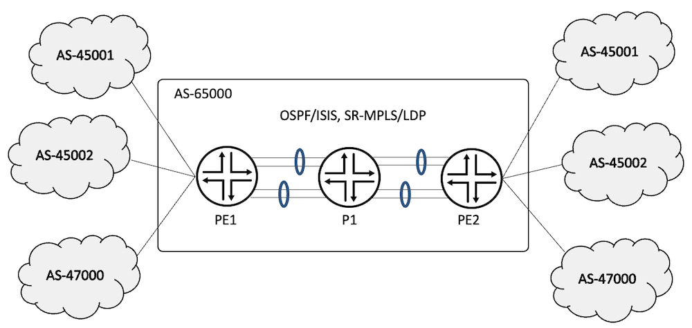
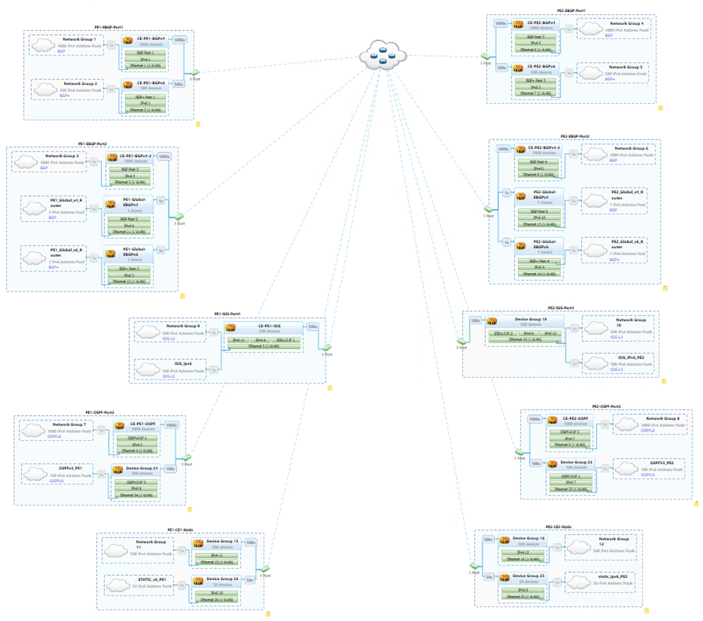
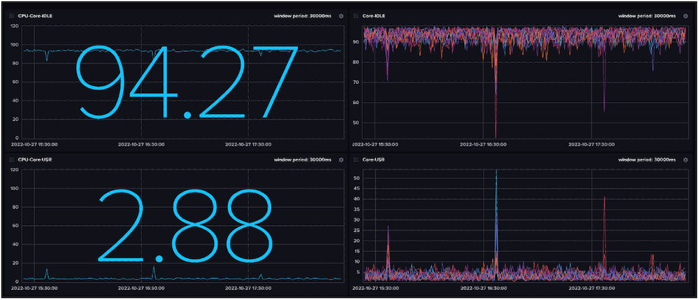
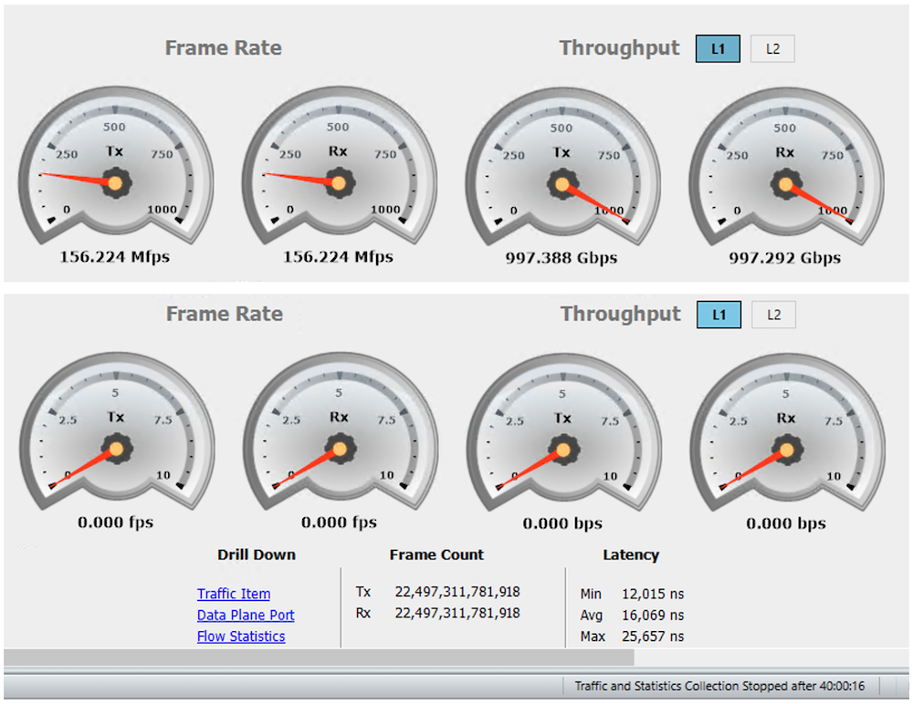

# L3VPN Validation on ACX7000

**Suneesh Babu - 11/09/2022**

ACX7000 platform has been tested successfully with 4,000 Layer3 VPN Routing-instances with BGPv4, BGPv6, OSPF, OSPFv3, ISISv4, ISISv6, Static-v4, Static-v6 as CE-PE protocols and with a total of 1.35M routes.

## Introduction

This is the third article in the ACX7k Metro Validation Series.

In this article we validate the L3VPN, 6VPE, 6PE feature scale support on ACX7100-32C platform with 22.2R1 Junos-EVO build.

[RFC 4364](https://www.rfc-editor.org/rfc/rfc4364.html) describes BGP-enabled [L3VPN](https://www.juniper.net/documentation/us/en/software/junos/vpn-l3/topics/example/mpls-qfx-series-vpn-layer3.html) to connect Customer Edge Devices (CEs) across a Provider Edge (PE) Network. The PEs provide layer 3 connectivity for their customers using various protocols like [BGP](https://www.juniper.net/documentation/us/en/software/junos/bgp/topics/topic-map/bgp-overview.html), [OSPF](https://www.juniper.net/documentation/us/en/software/junos/ospf/topics/topic-map/ospf-overview.html), [ISIS](https://www.juniper.net/documentation/us/en/software/junos/is-is/topics/concept/is-is-routing-overview.html), [RIP](https://www.juniper.net/documentation/us/en/software/junos/rip/topics/topic-map/basic-rip-configuration.html) or [Static](https://www.juniper.net/documentation/us/en/software/junos/static-routing/topics/topic-map/config_static-routes.html). The PEs of the network are connected via MPLS technology [LDP](https://www.juniper.net/documentation/us/en/software/junos/mpls/topics/topic-map/ldp-overview.html), [RSVP](https://www.juniper.net/documentation/us/en/software/junos/mpls/topics/topic-map/rsvp-overview.html), [SR-MPLS](https://blogs.juniper.net/en-us/industry-solutions-and-trends/segment-routing-sr-with-multiprotocol-label-switching-mpls) etc. In L3VPN, the IP address associated with the hosts are learned via the control plane on both CE-PE side and across PE network with the help of BGP.

JUNOS-EVO supports L3VPN and 6VPE functionality with instance-type "vrf". In this document, we qualify the feature scale on the ACX7000 platforms.

[ACX7100-32C](https://www.juniper.net/us/en/products/routers/acx-series/acx7000-family-cloud-metro-routers/acx7100-line/acx7100-cloud-metro-routers-datasheet.html) with 22.2R1 Junos Version supports different flavours of CE-PE. The Key Performance Indicators (KPI) tested are captured in the below table. The same scale is supported and tested on [ACX7100-48L](https://www.juniper.net/documentation/us/en/hardware/acx7100-48L/topics/topic-map/acx7100-48L-system-overview.html) as well as on [ACX7509](https://www.juniper.net/us/en/products/routers/acx-series/acx7000-family-cloud-metro-routers/acx7500-line/acx7509.html). But the [ACX7024](https://www.juniper.net/us/en/products/routers/acx-series/acx7000-family-cloud-metro-routers/acx7000-line/acx7024.html) Scale is not covered in this article (same features but different scale are expected on this platform).

**Please note** that despite sharing the same ACX moniker, the ACX7000 products are different products than ACX500/710/1000/1100/2100/2200/4000/5000/5400/6000. They are powered by different Packet Forwarding Engines (PFE), and support different feature sets and scales.

| KPI | Scale |
|:--|:--|
| L3VPN Instances | 4,000 |
| 6VPE Instances (Dual Stack) | 1,150 |
| BGPv4 Peering (CE-PE) | 2,000 |
| BGPv6 Peering (CE-PE) | 500 |
| OSPF Neighbors (CE-PE) | 1,000 |
| OSPFv3 Neighbors (CE-PE) | 100 |
| ISIS IPv4 Adjacencies (CE-PE) | 500 |
| ISIS IPv6 Adjacencies (CE-PE) | 500 |
| Static-v4 Peering (CE-PE) | 500 |
| Static-v6 Peering (CE-PE) | 50 |
| VPNv4 Routes | 1,151,000 |
| VPNv6 Routes | 115,000 |
| IPv4 Global Routes | 60,000 |
| IPv6 Global Routes (6PE) | 30,000 |
| Total Route in the DUT | 1,350,000 |

## Metro L3VPN Topology

Test topology consists of three routers:

- an ACX7100-32C is the PE1
- an ACX7100-48L is the PE2
- a [PTX10008](https://www.juniper.net/documentation/us/en/hardware/ptx10008/topics/topic-map/ptx10008-line-card-components.html#line-Card-ptx10k-lc201) is the P1.

CEs are simulated using a traffic generator. PEs are connected to CEs using 5x 100G links and to the core using 8x 100G links, which are bundled in 2x LAGs each having four links.

The ACX7100-32C is the Device Under Test (DUT). The underlay transport used for testing is SR-MPLS with both OSPF and ISIS protocols individually. We also covered LDP as the underlay transport. The CE-bound interface configurations are of SP-Style (see glossary).



For this test, we configure 4,000 L3VPN instances:

- 2,000 have EBGPv4 as the CE-PE protocol,
- 1,000 have OSPF as the CE-PE protocol,
- 500 have ISIS as the CE-PE protocol
- the remaining 500 have Static-v4 reachability.
- 1,150 routing instances are
    - dual-stacked,
    - with 500 EBGPv6 Peering,
    - 100 OSPFv3 Peering,
    - 500 IS-IS Peering
    - 50 Static IPv6 reachability.
- The DUT learns 1.35M routes including VPNv4, VPNv6, global IPv4 and IPv6.

Bidirectional traffic in iMIX mode at 99.9% offer-load flows for all the L3VPN, 6VPE services. A total of ~1Tbps traffic transits through the DUT.

### Base Configuration

The IGP and BGP configuration required to bring up L3VPN, 6VPE, 6PE are as follows:

```
regress@PE1> show configuration protocols |display inheritance no-comments
bgp {
    group IBGP {
        type internal;
        local-address 12.1.1.1;
        family inet {
            unicast;
        }
        family inet-vpn {
            unicast;
        }
        family inet6 {
            labeled-unicast;
        }
        family inet6-vpn {
            unicast;
        }
        neighbor 12.1.1.3 {
            export nhself;
        }
    }
    group EBGP {
        type external;
        as-override;
        neighbor 16.100.1.2 {
            family inet {
                unicast;
            }
            peer-as 65001;
        }
        neighbor 2002:16:100:1::2 {
            family inet6 {
                unicast;               
            }
            peer-as 65001;
        }
    }
}
mpls {
    icmp-tunneling;
    ipv6-tunneling;
    interface ae0.0;
    interface ae1.0;
}
ospf {
    source-packet-routing {
        node-segment ipv4-index 101;
        srgb start-label 45000 index-range 2000;
    }
    area 0.0.0.0 {
        interface lo0.0 {
            passive;
        }
        interface ae0.0 {
            interface-type p2p;
        }
        interface ae1.0 {
            interface-type p2p;
        }
    }
}

regress@PE1>
```

The following configurations brings-up BGPv4 and BGPv6 Peering on a routing-instance.

```
interfaces {
    et-0/0/0 {
        description To_VPNv4_VPNv6_CE;
        flexible-vlan-tagging;
        mtu 9022;
        encapsulation flexible-ethernet-services;
        unit 1 {
            vlan-id 1;
            family inet {
                address 16.0.1.1/24;
            }
            family inet6 {
                address 2002:16:0:1::1/64;
            }
        }
    }
}
routing-instances {
    METRO_VRF_1 {
        instance-type vrf;
        protocols {
            bgp {
                group METRO_VRF_EBGPv4_1 {
                    type external;
                    family inet {
                        unicast;
                    }
                    peer-as 45001;
                    as-override;
                    neighbor 16.0.1.2;
                }
                group METRO_VRF_EBGPv6_1 {
                    type external;
                    family inet6 {
                        unicast;
                    }
                    peer-as 45001;
                    as-override;
                    neighbor 2002:16:0:1::2;
                }
            }
        }
        interface et-0/0/0.1;
        route-distinguisher 12.1.1.1:1;
        vrf-target target:65000:1;
        vrf-table-label;
    }
}
```

The following configuration brings up OSPF and OSPFv3 for a routing-instance

```
interfaces {
    et-0/0/2 {
        description To_VPNv4_OSPF_CE;
        flexible-vlan-tagging;
        mtu 9022;
        encapsulation flexible-ethernet-services;
        unit 1 {
            vlan-id 1;
            family inet {
                address 16.10.1.1/24;
            }
            family inet6 {
                address 2002:16:10:1::1/64;
            }
        }
    }
}
routing-instances {
    METRO_VRF_2001 {
        instance-type vrf;
        protocols {
            ospf {
                area 0.0.0.0 {
                    interface et-0/0/2.1 {
                        interface-type p2p;
                    }
                }
            }
            ospf3 {
                area 0.0.0.0 {
                    interface et-0/0/2.1 {
                        interface-type p2p;
                    }
                }
            }
        }
        interface et-0/0/2.1;
        route-distinguisher 12.1.1.1:2001;
        vrf-target target:65000:2001;
        vrf-table-label;
    }
}
```

Configuration to bring up ISISv4 and ISISv6 on a routing-instance:

```
interfaces {
    et-0/0/3 {
        description To_VPNv4_ISIS_CE;
        flexible-vlan-tagging;
        mtu 9022;
        encapsulation flexible-ethernet-services;
        unit 1 {
            vlan-id 1;
            family inet {
                address 16.14.1.1/24;
            }
            family iso;
            family inet6 {
                address 2002:16:14:1::1/64;
            }
        }
    }
    lo0 {
        unit 1 {
            family inet {
                address 12.2.0.1/32;
            }
            family iso {
                address 49.0001.0012.0002.0000.0001.00;
            }
            family inet6 {
                address 2005:12:2::1/128;
            }
        }
    }
}
routing-instances {
    METRO_VRF_3001 {
        instance-type vrf;
        protocols {
            isis {
                interface et-0/0/3.1 {
                    level 1 disable;
                    point-to-point;
                }
                interface lo0.1 {
                    passive;
                }
            }
        }
        interface et-0/0/3.1;
        interface lo0.1;
        route-distinguisher 12.1.1.1:3001;
        vrf-target target:65000:3001;
        vrf-table-label;
    }
}
```

Configuration to bring up Staticv4 and Staticv6 for a routing-instance:

```
interfaces {
    et-0/0/4 {
        description To_VPNv4_Static_CE;
        flexible-vlan-tagging;
        mtu 9022;
        encapsulation flexible-ethernet-services;
        unit 1 {
            vlan-id 1;
            family inet {
                address 16.16.1.1/24;
            }
            family inet6 {
                address 2002:16:16:1::1/64;
            }
        }
    }
}
routing-instances {
    METRO_VRF_3501 {
        instance-type vrf;
        routing-options {
            rib METRO_VRF_3501.inet6.0 {
                static {
                    route 2008:1:0:1::/64 next-hop 2002:16:16:1::2;
                }
            }
            static {
                route 46.0.1.0/24 next-hop 16.16.1.2;
            }
        }
        interface et-0/0/4.1;
        route-distinguisher 12.1.1.1:3501;
        vrf-target target:65000:3501;
        vrf-table-label;
    }
}
```

### VPN CE Bound Interface Schema

The five CE bound 100G interfaces are logically split across the routing instances and detailed in this chart:

| Metro L3VPN, 6VPE, 6PE and Global IPv4 |
|:--|
| Port |
| P-1 |
| EBGPv6 |
| P-2 |
| Global v4 |
| Global v6 |
| P-3 |
| OSPFv3 |
| P-4 |
| ISISv6 |
| P-5 |
| Staticv6 |

## L3VPN Verification

The first step to verify the L3VPN service is to make sure that the IGP is established and routers in the core network are reachable. BGP Peering has to be verified for various services like L3VPN, 6VPE, 6PE and Global V4 routes. The L3VPN routes are present in bgp.l3vpn.0 table, 6VPE routes in bgp.l3vpn-inet6.0 table, 6PE routes in inet6.0 table and Global IPv4 routes in inet.0 table.

### Core IGP Verification

The neighborship in the core router and their reachability are verified as follows:

```
regress@PE1> show ospf neighbor
Address          Interface              State           ID               Pri  Dead
15.1.1.2         ae0.0                  Full            6.6.6.6          128    37
15.1.2.2         ae1.0                  Full            6.6.6.6          128    31
regress@PE1> show route protocol ospf table inet.0

inet.0: 60031 destinations, 60038 routes (60031 active, 0 holddown, 0 hidden)
+ = Active Route, - = Last Active, * = Both

12.1.1.2/32        *[OSPF/10/10] 1d 17:40:52, metric 1
                       to 15.1.1.2 via ae0.0
                    >  to 15.1.2.2 via ae1.0
12.1.1.3/32        *[OSPF/10/10] 1d 17:40:52, metric 2
                       to 15.1.1.2 via ae0.0
                    >  to 15.1.2.2 via ae1.0
15.2.1.0/24        *[OSPF/10/10] 1d 17:40:52, metric 2
                       to 15.1.1.2 via ae0.0
                    >  to 15.1.2.2 via ae1.0
15.2.2.0/24        *[OSPF/10/10] 1d 17:40:52, metric 2
                       to 15.1.1.2 via ae0.0
                    >  to 15.1.2.2 via ae1.0
224.0.0.5/32       *[OSPF/10] 1d 17:41:08, metric 1
                       MultiRecv
224.0.0.6/32       *[OSPF/10] 1d 17:41:08, metric 1
                       MultiRecv

regress@PE1> show route protocol ospf table inet.3

inet.3: 2 destinations, 2 routes (2 active, 0 holddown, 0 hidden)
+ = Active Route, - = Last Active, * = Both

12.1.1.2/32        *[L-OSPF/10/5] 00:13:20, metric 1
                       to 15.1.1.2 via ae0.0
                    >  to 15.1.2.2 via ae1.0
12.1.1.3/32        *[L-OSPF/10/5] 1d 17:40:55, metric 2
                       to 15.1.1.2 via ae0.0, Push 45103
                    >  to 15.1.2.2 via ae1.0, Push 45103

regress@PE1> show mpls interface
Interface        State       Administrative groups (x: extended)
ae0.0            Up         <none>
ae1.0            Up         <none>

regress@PE1>
```

### Core BGP Verification

```
regress@PE1> show bgp summary
Threading mode: BGP I/O
Default eBGP mode: advertise - accept, receive - accept
Groups: 2502 Peers: 2503 Down peers: 0
Table          Tot Paths  Act Paths Suppressed    History Damp State    Pending
inet.0
                   60009      60002          0          0          0          0
inet6.0
                   30002      30002          0          0          0          0
bgp.l3vpn.0
                  580000     580000          0          0          0          0
bgp.l3vpn-inet6.0
                   61700      61700          0          0          0          0
inet6.3              
                       0          0          0          0          0          0
Peer                     AS      InPkt     OutPkt    OutQ   Flaps Last Up/Dwn State|#Active/Received/Accepted/Damped...
12.1.1.3              65000      21313      20562       0       0 1d 17:40:57 Establ
  inet.0: 30002/30009/30009/0
  inet6.0: 15002/15002/15002/0
  bgp.l3vpn.0: 580000/580000/580000/0
  bgp.l3vpn-inet6.0: 61700/61700/61700/0
  METRO_VRF_1.inet.0: 251/251/251/0
  METRO_VRF_1.inet6.0: 101/101/101/0
  METRO_VRF_2.inet.0: 251/251/251/0
  METRO_VRF_2.inet6.0: 101/101/101/0
  METRO_VRF_3.inet.0: 251/251/251/0
  METRO_VRF_3.inet6.0: 101/101/101/0
...
  METRO_VRF_1997.inet.0: 251/251/251/0
  METRO_VRF_1998.inet.0: 251/251/251/0
  METRO_VRF_1999.inet.0: 251/251/251/0
  METRO_VRF_2000.inet.0: 251/251/251/0
  METRO_VRF_2001.inet.0: 51/51/51/0
  METRO_VRF_2002.inet.0: 51/51/51/0
  METRO_VRF_2003.inet.0: 51/51/51/0
...
  METRO_VRF_2998.inet.0: 51/51/51/0
  METRO_VRF_2999.inet.0: 51/51/51/0
  METRO_VRF_3000.inet.0: 51/51/51/0
  METRO_VRF_3001.inet.0: 52/52/52/0
  METRO_VRF_3002.inet.0: 52/52/52/0
  METRO_VRF_3003.inet.0: 52/52/52/0
...
  METRO_VRF_3498.inet.0: 52/52/52/0
  METRO_VRF_3499.inet.0: 52/52/52/0
  METRO_VRF_3500.inet.0: 52/52/52/0
  METRO_VRF_3501.inet.0: 2/2/2/0
  METRO_VRF_3502.inet.0: 2/2/2/0
  METRO_VRF_3503.inet.0: 2/2/2/0
...
  METRO_VRF_3998.inet.0: 2/2/2/0
  METRO_VRF_3999.inet.0: 2/2/2/0
  METRO_VRF_4000.inet.0: 2/2/2/0
  METRO_VRF_2001.inet6.0: 51/51/51/0
  METRO_VRF_2002.inet6.0: 51/51/51/0
  METRO_VRF_2003.inet6.0: 51/51/51/0
...
  METRO_VRF_2098.inet6.0: 51/51/51/0
  METRO_VRF_2099.inet6.0: 51/51/51/0
  METRO_VRF_2100.inet6.0: 51/51/51/0
  METRO_VRF_3001.inet6.0: 12/12/12/0
  METRO_VRF_3002.inet6.0: 12/12/12/0
  METRO_VRF_3003.inet6.0: 12/12/12/0
...
  METRO_VRF_3548.inet6.0: 2/2/2/0
  METRO_VRF_3549.inet6.0: 2/2/2/0
  METRO_VRF_3550.inet6.0: 2/2/2/0
16.0.1.2              45001       5003       5046       0       0 1d 17:39:49 Establ
  METRO_VRF_1.inet.0: 250/250/250/0
16.0.2.2              45002       5003       5046       0       0 1d 17:39:49 Establ
  METRO_VRF_2.inet.0: 250/250/250/0
16.0.3.2              45003       5003       5046       0       0 1d 17:39:54 Establ
  METRO_VRF_3.inet.0: 250/250/250/0
...
2002:16:0:1f3::2       45499       5003       5046       0       0 1d 17:39:32 Establ
  METRO_VRF_499.inet6.0: 100/100/100/0
2002:16:0:1f4::2       45500       5003       5046       0       0 1d 17:39:32 Establ
  METRO_VRF_500.inet6.0: 100/100/100/0
2002:16:100:1::2       65001       5036       5080       0       0 1d 17:39:59 Establ
  inet6.0: 15000/15000/15000/0

regress@PE1>
```

### BGPv4 CE-PE Verification

The BGPv4 neighborship in one of the routing-instances METRO_VRF_1 is as follows:

```
regress@PE1> show bgp neighbor 16.0.1.2
Peer: 16.0.1.2+33773 AS 45001  Local: 16.0.1.1+179 AS 65000
  Group: METRO_VRF_EBGPv4_1    Routing-Instance: METRO_VRF_1
  Forwarding routing-instance: METRO_VRF_1
  Type: External    State: Established    Flags: <Sync>
  Last State: OpenConfirm   Last Event: RecvKeepAlive
  Last Error: None
  Options: <AddressFamily PeerAS Refresh As Override>
  Options: <GracefulShutdownRcv>
  Address families configured: inet-unicast
  Holdtime: 90 Preference: 170
  Graceful Shutdown Receiver local-preference: 0
  Number of flaps: 0
  Receive eBGP Origin Validation community: Reject
  Peer ID: 192.0.0.1       Local ID: 16.0.1.1          Active Holdtime: 90
  Keepalive Interval: 30         Group index: 2    Peer index: 0    SNMP index: 3
  I/O Session Thread: bgpio-0 State: Enabled
  BFD: disabled, down
  Local Interface: et-0/0/0.1
  NLRI for restart configured on peer: inet-unicast
  NLRI advertised by peer: inet-unicast inet-multicast inet-vpn-unicast inet6-unicast inet6-multicast l2vpn inet6-vpn-unicast
  NLRI for this session: inet-unicast
  Peer supports Refresh capability (2)
  Stale routes from peer are kept for: 300
  Peer does not support Restarter functionality
  NLRI of all end-of-rib markers sent: inet-unicast
  Peer does not support Receiver functionality
  Peer does not support LLGR Restarter or Receiver functionality
  Peer does not support 4 byte AS extension
  Peer does not support Addpath
  Table METRO_VRF_1.inet.0 Bit: 60001
    RIB State: BGP restart is complete
    RIB State: VPN restart is complete
    Send state: in sync
    Active prefixes:              250
    Received prefixes:            250
    Accepted prefixes:            250
    Suppressed due to damping:    0
    Advertised prefixes:          251
  Last traffic (seconds): Received 1    Sent 18   Checked 154592
  Input messages:  Total 5157 Updates 1   Refreshes 0 Octets 99082
  Output messages: Total 5201 Updates 2   Refreshes 0 Octets 99895
  Output Queue[5]: 0            (METRO_VRF_1.inet.0, inet-unicast)

regress@PE1>
```

The BGPv4 CE-PE routes in the routing-instance METRO_VRF_1 are as follows:

```
regress@PE1> show route table METRO_VRF_1.inet.0

METRO_VRF_1.inet.0: 503 destinations, 503 routes (503 active, 0 holddown, 0 hidden)
+ = Active Route, - = Last Active, * = Both

16.0.1.0/24        *[Direct/0] 1d 18:03:51
                    >  via et-0/0/0.1
16.0.1.1/32        *[Local/0] 1d 18:03:51
                       Local via et-0/0/0.1
17.0.1.0/24        *[BGP/170] 1d 17:53:50, localpref 100, from 12.1.1.3
                      AS path: I, validation-state: unverified
                    >  to 15.1.1.2 via ae0.0, Push 16, Push 45103(top)
                       to 15.1.2.2 via ae1.0, Push 16, Push 45103(top)
20.0.1.0/24        *[BGP/170] 1d 17:52:42, localpref 100
                      AS path: 45001 I, validation-state: unverified
                    >  to 16.0.1.2 via et-0/0/0.1
20.0.2.0/24        *[BGP/170] 1d 17:52:42, localpref 100
                      AS path: 45001 I, validation-state: unverified
                    >  to 16.0.1.2 via et-0/0/0.1
...
20.0.249.0/24      *[BGP/170] 1d 17:52:42, localpref 100
                      AS path: 45001 I, validation-state: unverified
                    >  to 16.0.1.2 via et-0/0/0.1
20.0.250.0/24      *[BGP/170] 1d 17:52:42, localpref 100
                      AS path: 45001 I, validation-state: unverified
                    >  to 16.0.1.2 via et-0/0/0.1
30.0.1.0/24        *[BGP/170] 1d 17:52:39, localpref 100, from 12.1.1.3
                      AS path: 45001 I, validation-state: unverified
                       to 15.1.1.2 via ae0.0, Push 16, Push 45103(top)
                    >  to 15.1.2.2 via ae1.0, Push 16, Push 45103(top)
30.0.2.0/24        *[BGP/170] 1d 17:52:39, localpref 100, from 12.1.1.3
                      AS path: 45001 I, validation-state: unverified
                       to 15.1.1.2 via ae0.0, Push 16, Push 45103(top)
                    >  to 15.1.2.2 via ae1.0, Push 16, Push 45103(top)
...
30.0.249.0/24      *[BGP/170] 1d 17:52:39, localpref 100, from 12.1.1.3
                      AS path: 45001 I, validation-state: unverified
                    >  to 15.1.1.2 via ae0.0, Push 16, Push 45103(top)
                       to 15.1.2.2 via ae1.0, Push 16, Push 45103(top)
30.0.250.0/24      *[BGP/170] 1d 17:52:39, localpref 100, from 12.1.1.3
                      AS path: 45001 I, validation-state: unverified
                    >  to 15.1.1.2 via ae0.0, Push 16, Push 45103(top)
                       to 15.1.2.2 via ae1.0, Push 16, Push 45103(top)

regress@PE1>
```

### BGPv6 CE-PE Verification

The BGPv6 neighborship in one of the routing-instance METRO_VRF_1:

```
regress@PE1> show bgp neighbor 2002:16:0:1::2
Peer: 2002:16:0:1::2+32777 AS 45001 Local: 2002:16:0:1::1+179 AS 65000
  Group: METRO_VRF_EBGPv6_1    Routing-Instance: METRO_VRF_1
  Forwarding routing-instance: METRO_VRF_1  
  Type: External    State: Established    Flags: <Sync>
  Last State: OpenConfirm   Last Event: RecvKeepAlive
  Last Error: None
  Options: <AddressFamily PeerAS Refresh As Override>
  Options: <GracefulShutdownRcv>
  Address families configured: inet6-unicast
  Holdtime: 90 Preference: 170
  Graceful Shutdown Receiver local-preference: 0
  Number of flaps: 0
  Receive eBGP Origin Validation community: Reject
  Peer ID: 193.0.0.1       Local ID: 16.0.1.1          Active Holdtime: 90
  Keepalive Interval: 30         Group index: 3    Peer index: 0    SNMP index: 4
  I/O Session Thread: bgpio-0 State: Enabled
  BFD: disabled, down
  Local Interface: et-0/0/0.1                       
  NLRI for restart configured on peer: inet6-unicast
  NLRI advertised by peer: inet-unicast inet-multicast inet-vpn-unicast inet6-unicast inet6-multicast l2vpn inet6-vpn-unicast
  NLRI for this session: inet6-unicast
  Peer supports Refresh capability (2)
  Stale routes from peer are kept for: 300
  Peer does not support Restarter functionality
  NLRI of all end-of-rib markers sent: inet6-unicast
  Peer does not support Receiver functionality
  Peer does not support LLGR Restarter or Receiver functionality
  Peer does not support 4 byte AS extension
  Peer does not support Addpath
  NLRI that peer supports extended nexthop encoding for: inet-unicast inet-multicast inet-vpn-unicast
  Table METRO_VRF_1.inet6.0 Bit: 70001
    RIB State: BGP restart is complete
    RIB State: VPN restart is complete
    Send state: in sync
    Active prefixes:              100
    Received prefixes:            100
    Accepted prefixes:            100
    Suppressed due to damping:    0
    Advertised prefixes:          101
  Last traffic (seconds): Received 29   Sent 24   Checked 154980
  Input messages:  Total 5169 Updates 1 Refreshes 0 Octets 99266
  Output messages: Total 5213 Updates 2 Refreshes 0 Octets 100103
  Output Queue[6]: 0            (METRO_VRF_1.inet6.0, inet6-unicast)

regress@PE1>
```

The BGPv6 CE-PE routes in the routing-instance METRO_VRF_1:

```
regress@PE1> show route table METRO_VRF_1.inet6.0

METRO_VRF_1.inet6.0: 205 destinations, 205 routes (205 active, 0 holddown, 0 hidden)
+ = Active Route, - = Last Active, * = Both

2002:16:0:1::/64   *[Direct/0] 1d 18:07:23
                    >  via et-0/0/0.1
2002:16:0:1::1/128 *[Local/0] 1d 18:07:23
                       Local via et-0/0/0.1
2002:17:0:1::/64   *[BGP/170] 1d 17:57:32, localpref 100, from 12.1.1.3
                      AS path: I, validation-state: unverified
                    >  to 15.1.1.2 via ae0.0, Push 16, Push 2, Push 45103(top)
                       to 15.1.2.2 via ae1.0, Push 16, Push 2, Push 45103(top)
2002:20:0:1::/64   *[BGP/170] 1d 17:56:28, localpref 100
                      AS path: 45001 I, validation-state: unverified
                    >  to 2002:16:0:1::2 via et-0/0/0.1
2002:20:0:2::/64   *[BGP/170] 1d 17:56:28, localpref 100
                      AS path: 45001 I, validation-state: unverified
                    >  to 2002:16:0:1::2 via et-0/0/0.1
...
2002:20:0:63::/64  *[BGP/170] 1d 17:56:28, localpref 100
                      AS path: 45001 I, validation-state: unverified
                    >  to 2002:16:0:1::2 via et-0/0/0.1
2002:20:0:64::/64  *[BGP/170] 1d 17:56:28, localpref 100
                      AS path: 45001 I, validation-state: unverified
                    >  to 2002:16:0:1::2 via et-0/0/0.1
2002:30:0:1::/64   *[BGP/170] 1d 17:56:27, localpref 100, from 12.1.1.3
                      AS path: 45001 I, validation-state: unverified
                    >  to 15.1.1.2 via ae0.0, Push 16, Push 2, Push 45103(top)
                       to 15.1.2.2 via ae1.0, Push 16, Push 2, Push 45103(top)
2002:30:0:2::/64   *[BGP/170] 1d 17:56:27, localpref 100, from 12.1.1.3
                      AS path: 45001 I, validation-state: unverified
                    >  to 15.1.1.2 via ae0.0, Push 16, Push 2, Push 45103(top)
                       to 15.1.2.2 via ae1.0, Push 16, Push 2, Push 45103(top)
...
2002:30:0:63::/64  *[BGP/170] 1d 17:56:27, localpref 100, from 12.1.1.3
                      AS path: 45001 I, validation-state: unverified
                    >  to 15.1.1.2 via ae0.0, Push 16, Push 2, Push 45103(top)
                       to 15.1.2.2 via ae1.0, Push 16, Push 2, Push 45103(top)
2002:30:0:64::/64  *[BGP/170] 1d 17:56:27, localpref 100, from 12.1.1.3
                      AS path: 45001 I, validation-state: unverified
                    >  to 15.1.1.2 via ae0.0, Push 16, Push 2, Push 45103(top)
                       to 15.1.2.2 via ae1.0, Push 16, Push 2, Push 45103(top)
fe80::ae78:d100:12d:3504/128
                   *[Local/0] 1d 18:07:23
                       Local via et-0/0/0.1
ff02::2/128        *[INET6/0] 1d 18:10:03
                       MultiRecv

regress@PE1>
```

### CE-PE OSPF Verification

OSPF Neighborship of the routing-instance is as shown below:

```
regress@PE1> show ospf neighbor instance METRO_VRF_2001
Address          Interface              State           ID               Pri  Dead
16.10.1.2        et-0/0/2.1             Full            195.0.0.1          0    30
```

The OSPF routes received from the CE can be listed as:

```
regress@PE1> show route table METRO_VRF_2001.inet.0 protocol ospf

METRO_VRF_2001.inet.0: 105 destinations, 105 routes (105 active, 0 holddown, 0 hidden)
+ = Active Route, - = Last Active, * = Both

40.0.1.0/24        *[OSPF/10] 1d 16:50:57, metric 1
                    >  to 16.10.1.2 via et-0/0/2.1
40.0.2.0/24        *[OSPF/10] 1d 16:50:57, metric 1
                    >  to 16.10.1.2 via et-0/0/2.1
...
40.0.49.0/24       *[OSPF/10] 1d 16:50:57, metric 1
                    >  to 16.10.1.2 via et-0/0/2.1
40.0.50.0/24       *[OSPF/10] 1d 16:50:57, metric 1
                    >  to 16.10.1.2 via et-0/0/2.1
224.0.0.5/32       *[OSPF/10] 1d 18:13:21, metric 1
                       MultiRecv
224.0.0.6/32       *[OSPF/10] 1d 18:13:21, metric 1
                       MultiRecv

regress@PE1>
```

The OSPF received from the PE2 routes as BGP routes over the L3VPN BGP family can be listed as follows.

```
regress@PE1> show route table METRO_VRF_2001.inet.0 protocol bgp

METRO_VRF_2001.inet.0: 105 destinations, 105 routes (105 active, 0 holddown, 0 hidden)
+ = Active Route, - = Last Active, * = Both

17.10.1.0/24       *[BGP/170] 1d 18:02:09, localpref 100, from 12.1.1.3
                      AS path: I, validation-state: unverified
                       to 15.1.1.2 via ae0.0, Push 1131, Push 45103(top)
                    >  to 15.1.2.2 via ae1.0, Push 1131, Push 45103(top)
42.0.1.0/24        *[BGP/170] 1d 17:24:52, MED 1, localpref 100, from 12.1.1.3
                      AS path: I, validation-state: unverified
                       to 15.1.1.2 via ae0.0, Push 1131, Push 45103(top)
                    >  to 15.1.2.2 via ae1.0, Push 1131, Push 45103(top)
42.0.2.0/24        *[BGP/170] 1d 17:24:52, MED 1, localpref 100, from 12.1.1.3
                      AS path: I, validation-state: unverified
                       to 15.1.1.2 via ae0.0, Push 1131, Push 45103(top)
                    >  to 15.1.2.2 via ae1.0, Push 1131, Push 45103(top)
...
42.0.49.0/24       *[BGP/170] 1d 17:24:52, MED 1, localpref 100, from 12.1.1.3
                      AS path: I, validation-state: unverified
                       to 15.1.1.2 via ae0.0, Push 1131, Push 45103(top)
                    >  to 15.1.2.2 via ae1.0, Push 1131, Push 45103(top)
42.0.50.0/24       *[BGP/170] 1d 17:24:52, MED 1, localpref 100, from 12.1.1.3
                      AS path: I, validation-state: unverified
                       to 15.1.1.2 via ae0.0, Push 1131, Push 45103(top)
                    >  to 15.1.2.2 via ae1.0, Push 1131, Push 45103(top)

regress@PE1>
```

### CE-PE OSPFv3 Verification

OSPFv3 Neighborship of the routing-instance is as shown below:

```
regress@PE1> show ospf3 neighbor instance METRO_VRF_2001
ID               Interface              State     Pri   Dead
209.0.0.1        et-0/0/2.1             Full        0     38
  Neighbor-address fe80::228:1ff:fe00:1

regress@PE1>
```

The OSPFv3 routes received from the CE can be listed as

```
regress@PE1> show route table METRO_VRF_2001.inet6.0 protocol ospf3

METRO_VRF_2001.inet6.0: 107 destinations, 107 routes (107 active, 0 holddown, 0 hidden)
+ = Active Route, - = Last Active, * = Both

3000:7:1:1::/64    *[OSPF3/10] 1d 17:28:54, metric 1
                    >  to fe80::228:1ff:fe00:1 via et-0/0/2.1
3000:7:1:2::/64    *[OSPF3/10] 1d 17:28:54, metric 1
                    >  to fe80::228:1ff:fe00:1 via et-0/0/2.1
...
3000:7:1:31::/64   *[OSPF3/10] 1d 17:28:54, metric 1
                    >  to fe80::228:1ff:fe00:1 via et-0/0/2.1
3000:7:1:32::/64   *[OSPF3/10] 1d 17:28:54, metric 1
                    >  to fe80::228:1ff:fe00:1 via et-0/0/2.1
ff02::5/128        *[OSPF3/10] 1d 18:19:22, metric 1
                       MultiRecv
ff02::6/128        *[OSPF3/10] 1d 18:19:22, metric 1
                       MultiRecv

regress@PE1>
```

The OSPFv3 received from the PE2 routes as BGP routes over the 6VPE BGP family can be listed as follows.

```
regress@PE1> show route table METRO_VRF_2001.inet6.0 protocol bgp

METRO_VRF_2001.inet6.0: 107 destinations, 107 routes (107 active, 0 holddown, 0 hidden)
+ = Active Route, - = Last Active, * = Both

2002:17:10:1::/64  *[BGP/170] 1d 18:07:53, localpref 100, from 12.1.1.3
                      AS path: I, validation-state: unverified
                    >  to 15.1.1.2 via ae0.0, Push 1131, Push 2, Push 45103(top)
                       to 15.1.2.2 via ae1.0, Push 1131, Push 2, Push 45103(top)
3000:6:1:1::/64    *[BGP/170] 1d 17:30:42, MED 1, localpref 100, from 12.1.1.3
                      AS path: I, validation-state: unverified
                    >  to 15.1.1.2 via ae0.0, Push 1131, Push 2, Push 45103(top)
                       to 15.1.2.2 via ae1.0, Push 1131, Push 2, Push 45103(top)
...
3000:6:1:31::/64   *[BGP/170] 1d 17:30:42, MED 1, localpref 100, from 12.1.1.3
                      AS path: I, validation-state: unverified
                    >  to 15.1.1.2 via ae0.0, Push 1131, Push 2, Push 45103(top)
                       to 15.1.2.2 via ae1.0, Push 1131, Push 2, Push 45103(top)
3000:6:1:32::/64   *[BGP/170] 1d 17:30:42, MED 1, localpref 100, from 12.1.1.3
                      AS path: I, validation-state: unverified
                    >  to 15.1.1.2 via ae0.0, Push 1131, Push 2, Push 45103(top)
                       to 15.1.2.2 via ae1.0, Push 1131, Push 2, Push 45103(top)

regress@PE1>
```

### CE-PE ISIS Verification

ISIS Adjacency of the routing-instance is as shown below:

```
regress@PE1> show isis adjacency instance METRO_VRF_3001
Interface             System         L State        Hold (secs) SNPA
et-0/0/3.1            6401.0001.0000 2  Up                   29

regress@PE1>
```

The ISIS routes received from the CE:

```
regress@PE1> show route table METRO_VRF_3001.inet.0 protocol isis

METRO_VRF_3001.inet.0: 105 destinations, 105 routes (105 active, 0 holddown, 0 hidden)
+ = Active Route, - = Last Active, * = Both

44.0.1.0/24        *[IS-IS/18] 1d 18:10:17, metric 10
                    >  to 16.14.1.2 via et-0/0/3.1
44.0.2.0/24        *[IS-IS/18] 1d 18:10:17, metric 10
                    >  to 16.14.1.2 via et-0/0/3.1
...
44.0.49.0/24       *[IS-IS/18] 1d 18:10:17, metric 10
                    >  to 16.14.1.2 via et-0/0/3.1
44.0.50.0/24       *[IS-IS/18] 1d 18:10:17, metric 10
                    >  to 16.14.1.2 via et-0/0/3.1

regress@PE1>
```

The ISIS routes received from the PE2 as BGP routes over the L3VPN BGP family can be listed as follows.

```
regress@PE1> show route table METRO_VRF_3001.inet.0 protocol bgp

METRO_VRF_3001.inet.0: 105 destinations, 105 routes (105 active, 0 holddown, 0 hidden)
+ = Active Route, - = Last Active, * = Both

12.4.0.1/32        *[BGP/170] 1d 18:16:45, localpref 100, from 12.1.1.3
                      AS path: I, validation-state: unverified
                       to 15.1.1.2 via ae0.0, Push 2242, Push 45103(top)
                    >  to 15.1.2.2 via ae1.0, Push 2242, Push 45103(top)
17.14.1.0/24       *[BGP/170] 1d 18:16:45, localpref 100, from 12.1.1.3
                      AS path: I, validation-state: unverified
                       to 15.1.1.2 via ae0.0, Push 2242, Push 45103(top)
                    >  to 15.1.2.2 via ae1.0, Push 2242, Push 45103(top)
45.0.1.0/24        *[BGP/170] 1d 18:14:58, MED 10, localpref 100, from 12.1.1.3
                      AS path: I, validation-state: unverified
                       to 15.1.1.2 via ae0.0, Push 2242, Push 45103(top)
                    >  to 15.1.2.2 via ae1.0, Push 2242, Push 45103(top)
45.0.2.0/24        *[BGP/170] 1d 18:14:58, MED 10, localpref 100, from 12.1.1.3
                      AS path: I, validation-state: unverified
                       to 15.1.1.2 via ae0.0, Push 2242, Push 45103(top)
                    >  to 15.1.2.2 via ae1.0, Push 2242, Push 45103(top)
...
45.0.49.0/24       *[BGP/170] 1d 18:14:58, MED 10, localpref 100, from 12.1.1.3
                      AS path: I, validation-state: unverified
                       to 15.1.1.2 via ae0.0, Push 2242, Push 45103(top)
                    >  to 15.1.2.2 via ae1.0, Push 2242, Push 45103(top)
45.0.50.0/24       *[BGP/170] 1d 18:14:58, MED 10, localpref 100, from 12.1.1.3
                      AS path: I, validation-state: unverified
                       to 15.1.1.2 via ae0.0, Push 2242, Push 45103(top)
                    >  to 15.1.2.2 via ae1.0, Push 2242, Push 45103(top)

regress@PE1>
```

### CE-PE ISISv6 Verification

ISISv6 Adjacency of the routing-instance is as shown below:

```
regress@PE1> show isis adjacency instance METRO_VRF_3001
Interface             System         L State        Hold (secs) SNPA
et-0/0/3.1            6401.0001.0000 2  Up                   29

regress@PE1>
```

The ISISv6 routes received from the CE can be listed as

```
regress@PE1> show route table METRO_VRF_3001.inet6.0 protocol isis

METRO_VRF_3001.inet6.0: 28 destinations, 28 routes (28 active, 0 holddown, 0 hidden)
+ = Active Route, - = Last Active, * = Both

3000:4:1:1::/64    *[IS-IS/18] 1d 18:17:26, metric 10
                    >  to fe80::215:1ff:fe00:1 via et-0/0/3.1
3000:4:1:2::/64    *[IS-IS/18] 1d 18:17:26, metric 10
                    >  to fe80::215:1ff:fe00:1 via et-0/0/3.1
...
3000:4:1:9::/64    *[IS-IS/18] 1d 18:17:43, metric 10
                    >  to fe80::215:1ff:fe00:1 via et-0/0/3.1
3000:4:1:a::/64    *[IS-IS/18] 1d 18:17:43, metric 10
                    >  to fe80::215:1ff:fe00:1 via et-0/0/3.1

regress@PE1>
```

The ISISv6 routes received from the PE2 as BGP routes over the 6vpe bgp family can be listed as follows.

```
regress@PE1> show route table METRO_VRF_3001.inet6.0 protocol bgp

METRO_VRF_3001.inet6.0: 28 destinations, 28 routes (28 active, 0 holddown, 0 hidden)
+ = Active Route, - = Last Active, * = Both

2002:17:14:1::/64  *[BGP/170] 1d 18:20:01, localpref 100, from 12.1.1.3
                      AS path: I, validation-state: unverified
                    >  to 15.1.1.2 via ae0.0, Push 2242, Push 2, Push 45103(top)
                       to 15.1.2.2 via ae1.0, Push 2242, Push 2, Push 45103(top)
2005:12:4::1/128   *[BGP/170] 1d 18:20:01, localpref 100, from 12.1.1.3
                      AS path: I, validation-state: unverified
                    >  to 15.1.1.2 via ae0.0, Push 2242, Push 2, Push 45103(top)
                       to 15.1.2.2 via ae1.0, Push 2242, Push 2, Push 45103(top)
3001:1:1:1::/64    *[BGP/170] 1d 18:18:18, MED 10, localpref 100, from 12.1.1.3
                      AS path: I, validation-state: unverified
                    >  to 15.1.1.2 via ae0.0, Push 2242, Push 2, Push 45103(top)
                       to 15.1.2.2 via ae1.0, Push 2242, Push 2, Push 45103(top)
3001:1:1:2::/64    *[BGP/170] 1d 18:18:18, MED 10, localpref 100, from 12.1.1.3
                      AS path: I, validation-state: unverified
                    >  to 15.1.1.2 via ae0.0, Push 2242, Push 2, Push 45103(top)
                       to 15.1.2.2 via ae1.0, Push 2242, Push 2, Push 45103(top)
...
3001:1:1:9::/64    *[BGP/170] 1d 18:18:18, MED 10, localpref 100, from 12.1.1.3
                      AS path: I, validation-state: unverified
                       to 15.1.1.2 via ae0.0, Push 2242, Push 2, Push 45103(top)
                    >  to 15.1.2.2 via ae1.0, Push 2242, Push 2, Push 45103(top)
3001:1:1:a::/64    *[BGP/170] 1d 18:18:18, MED 10, localpref 100, from 12.1.1.3
                      AS path: I, validation-state: unverified
                       to 15.1.1.2 via ae0.0, Push 2242, Push 2, Push 45103(top)
                    >  to 15.1.2.2 via ae1.0, Push 2242, Push 2, Push 45103(top)

regress@PE1>
```

### CE-PE Static Verification

The Static routes configured for the CE can be listed as

```
regress@PE1> show route table METRO_VRF_3501.inet.0 protocol static

METRO_VRF_3501.inet.0: 5 destinations, 5 routes (5 active, 0 holddown, 0 hidden)
+ = Active Route, - = Last Active, * = Both

46.0.1.0/24        *[Static/5] 1d 18:33:39
                    >  to 16.16.1.2 via et-0/0/4.1

regress@PE1>
```

The Static routes received from the PE2 as BGP routes over the L3VPN BGP family can be listed as follows.

```
regress@PE1> show route table METRO_VRF_3501.inet.0 protocol bgp

METRO_VRF_3501.inet.0: 5 destinations, 5 routes (5 active, 0 holddown, 0 hidden)
+ = Active Route, - = Last Active, * = Both

17.16.1.0/24       *[BGP/170] 1d 18:24:25, localpref 100, from 12.1.1.3
                      AS path: I, validation-state: unverified
                    >  to 15.1.1.2 via ae0.0, Push 2797, Push 45103(top)
                       to 15.1.2.2 via ae1.0, Push 2797, Push 45103(top)
46.10.1.0/24       *[BGP/170] 1d 18:24:25, localpref 100, from 12.1.1.3
                      AS path: I, validation-state: unverified
                    >  to 15.1.1.2 via ae0.0, Push 2797, Push 45103(top)
                       to 15.1.2.2 via ae1.0, Push 2797, Push 45103(top)

regress@PE1>
```

### CE-PE Staticv6 Verification

The Static-v6 routes received from the CE can be listed as

```
regress@PE1> show route table METRO_VRF_3501.inet6.0 protocol static

METRO_VRF_3501.inet6.0: 7 destinations, 7 routes (7 active, 0 holddown, 0 hidden)
+ = Active Route, - = Last Active, * = Both

2008:1:0:1::/64    *[Static/5] 1d 18:35:38
                    >  to 2002:16:16:1::2 via et-0/0/4.1

regress@PE1>
```

The Static-v6 routes received from the PE2 as BGP routes over the L3VPN BGP family can be listed as follows.

```
regress@PE1> show route table METRO_VRF_3501.inet.0 protocol bgp

METRO_VRF_3501.inet.0: 5 destinations, 5 routes (5 active, 0 holddown, 0 hidden)
+ = Active Route, - = Last Active, * = Both

17.16.1.0/24       *[BGP/170] 1d 18:26:14, localpref 100, from 12.1.1.3
                      AS path: I, validation-state: unverified
                    >  to 15.1.1.2 via ae0.0, Push 2797, Push 45103(top)
                       to 15.1.2.2 via ae1.0, Push 2797, Push 45103(top)
46.10.1.0/24       *[BGP/170] 1d 18:26:14, localpref 100, from 12.1.1.3
                      AS path: I, validation-state: unverified
                    >  to 15.1.1.2 via ae0.0, Push 2797, Push 45103(top)
                       to 15.1.2.2 via ae1.0, Push 2797, Push 45103(top)

regress@PE1>
```

### 6PE Verification

The neighborship of the BGP Global IPv6 Peer is listed below

```
regress@PE1> show bgp neighbor 2002:16:100:1::2
Peer: 2002:16:100:1::2+32777 AS 65001 Local: 2002:16:100:1::1+179 AS 65000
  Group: EBGP                  Routing-Instance: master
  Forwarding routing-instance: master  
  Type: External    State: Established    Flags: <Sync>
  Last State: OpenConfirm   Last Event: RecvKeepAlive
  Last Error: None
  Options: <AddressFamily PeerAS Refresh As Override>
  Options: <GracefulShutdownRcv>
  Address families configured: inet6-unicast
  Holdtime: 90 Preference: 170
  Graceful Shutdown Receiver local-preference: 0
  Number of flaps: 0
  Receive eBGP Origin Validation community: Reject
  Peer ID: 201.0.0.1       Local ID: 12.1.1.1          Active Holdtime: 90
  Keepalive Interval: 30         Group index: 1    Peer index: 0    SNMP index: 2
  I/O Session Thread: bgpio-0 State: Enabled
  BFD: disabled, down
  Local Interface: et-0/0/1.4000                
  NLRI for restart configured on peer: inet6-unicast
  NLRI advertised by peer: inet-unicast inet-multicast inet-vpn-unicast inet6-unicast inet6-multicast l2vpn inet6-vpn-unicast
  NLRI for this session: inet6-unicast
  Peer supports Refresh capability (2)
  Stale routes from peer are kept for: 300
  Peer does not support Restarter functionality
  NLRI of all end-of-rib markers sent: inet6-unicast
  Peer does not support Receiver functionality
  Peer does not support LLGR Restarter or Receiver functionality
  Peer does not support 4 byte AS extension
  Peer does not support Addpath
  NLRI that peer supports extended nexthop encoding for: inet-unicast inet-multicast inet-vpn-unicast
  Table inet6.0 Bit: 30001              
    RIB State: BGP restart is complete
    Send state: in sync
    Active prefixes:              15000
    Received prefixes:            15000
    Accepted prefixes:            15000
    Suppressed due to damping:    0
    Advertised prefixes:          15002
  Last traffic (seconds): Received 21   Sent 16   Checked 147443
  Input messages:  Total 4951   Updates 34  Refreshes 0 Octets 231303
  Output messages: Total 4994   Updates 36  Refreshes 0 Octets 232009
  Output Queue[2]: 0            (inet6.0, inet6-unicast)

regress@PE1>
```

The 6PE routes received from the Global Peer and Remote Peer PE2 is as shown below:

```
regress@PE1> show route table inet6.0

inet6.0: 30008 destinations, 30008 routes (30008 active, 0 holddown, 0 hidden)
+ = Active Route, - = Last Active, * = Both

2002:12:1:1::1/128 *[Direct/0] 1d 17:10:57
                    >  via lo0.0
2002:12:1:1::3/128 *[BGP/170] 1d 16:59:24, localpref 100, from 12.1.1.3
                      AS path: I, validation-state: unverified
                    >  to 15.1.1.2 via ae0.0, Push 2, Push 45103(top)
                       to 15.1.2.2 via ae1.0, Push 2, Push 45103(top)
2002:16:100:1::/64 *[Direct/0] 1d 17:09:13
                    >  via et-0/0/1.4000
2002:16:100:1::1/128
                   *[Local/0] 1d 17:09:13
                       Local via et-0/0/1.4000
2002:17:100:1::/64 *[BGP/170] 1d 16:59:24, localpref 100, from 12.1.1.3
                      AS path: I, validation-state: unverified
                    >  to 15.1.1.2 via ae0.0, Push 2, Push 45103(top)
                       to 15.1.2.2 via ae1.0, Push 2, Push 45103(top)
2002:50:0:1::/64   *[BGP/170] 1d 16:58:26, localpref 100
                      AS path: 65001 I, validation-state: unverified
                    >  to 2002:16:100:1::2 via et-0/0/1.4000
2002:50:0:2::/64   *[BGP/170] 1d 16:58:26, localpref 100
                      AS path: 65001 I, validation-state: unverified
                    >  to 2002:16:100:1::2 via et-0/0/1.4000
2002:50:0:3::/64   *[BGP/170] 1d 16:58:26, localpref 100
                      AS path: 65001 I, validation-state: unverified
                    >  to 2002:16:100:1::2 via et-0/0/1.4000
...
2002:55:0:3a96::/64*[BGP/170] 1d 16:59:11, localpref 100, from 12.1.1.3
                      AS path: 65001 I, validation-state: unverified
                       to 15.1.1.2 via ae0.0, Push 4018, Push 2, Push 45103(top)
                    >  to 15.1.2.2 via ae1.0, Push 4018, Push 2, Push 45103(top)
2002:55:0:3a97::/64*[BGP/170] 1d 16:59:11, localpref 100, from 12.1.1.3
                      AS path: 65001 I, validation-state: unverified
                       to 15.1.1.2 via ae0.0, Push 4018, Push 2, Push 45103(top)
                    >  to 15.1.2.2 via ae1.0, Push 4018, Push 2, Push 45103(top)
2002:55:0:3a98::/64*[BGP/170] 1d 16:59:11, localpref 100, from 12.1.1.3
                      AS path: 65001 I, validation-state: unverified
                    >  to 15.1.1.2 via ae0.0, Push 4018, Push 2, Push 45103(top)
                       to 15.1.2.2 via ae1.0, Push 4018, Push 2, Push 45103(top)
fe80::ae78:d10f:a02d:350c/128
                   *[Local/0] 1d 17:10:02
                       Local via et-0/0/1.4000
fe80::ae78:d1f0:2d:3503/128
                   *[Direct/0] 1d 17:11:44
                    >  via lo0.0
ff02::2/128        *[INET6/0] 1d 17:12:42
                       MultiRecv

regress@PE1>
```

### Global IPv4 Verification

The neighborship of the BGP Global IPv4 Peer is listed below:

```
regress@PE1> show bgp neighbor 16.100.1.2
Peer: 16.100.1.2+32779 AS 65001 Local: 16.100.1.1+179 AS 65000
  Group: EBGP                  Routing-Instance: master
  Forwarding routing-instance: master
  Type: External    State: Established    Flags: <Sync>
  Last State: OpenConfirm   Last Event: RecvKeepAlive
  Last Error: None
  Options: <AddressFamily PeerAS Refresh As Override>
  Options: <GracefulShutdownRcv>
  Address families configured: inet-unicast
  Holdtime: 90 Preference: 170
  Graceful Shutdown Receiver local-preference: 0
  Number of flaps: 0
  Receive eBGP Origin Validation community: Reject
  Peer ID: 200.0.0.1       Local ID: 12.1.1.1          Active Holdtime: 90
  Keepalive Interval: 30         Group index: 1    Peer index: 1    SNMP index: 1
  I/O Session Thread: bgpio-0 State: Enabled
  BFD: disabled, down
  Local Interface: et-0/0/1.4000
  NLRI for restart configured on peer: inet-unicast
  NLRI advertised by peer: inet-unicast inet-multicast inet-vpn-unicast inet6-unicast inet6-multicast l2vpn inet6-vpn-unicast
  NLRI for this session: inet-unicast
  Peer supports Refresh capability (2)
  Stale routes from peer are kept for: 300
  Peer does not support Restarter functionality
  NLRI of all end-of-rib markers sent: inet-unicast
  Peer does not support Receiver functionality
  Peer does not support LLGR Restarter or Receiver functionality
  Peer does not support 4 byte AS extension
  Peer does not support Addpath
  Table inet.0 Bit: 20001
    RIB State: BGP restart is complete
    Send state: in sync
    Active prefixes:              30000
    Received prefixes:            30000
    Accepted prefixes:            30000
    Suppressed due to damping:    0
    Advertised prefixes:          30002
  Last traffic (seconds): Received 17   Sent 4    Checked 147619
  Input messages:  Total 4953 Updates 30  Refreshes 0 Octets 215047
  Output messages: Total 4998 Updates 34  Refreshes 0 Octets 215788
  Output Queue[1]: 0            (inet.0, inet-unicast)

regress@PE1>
```

The IPv4 routes received from the Global Peer and Remote Peer PE2 is as shown below:

```
regress@PE1> show route table inet.0 protocol bgp

inet.0: 60057 destinations, 60090 routes (60057 active, 0 holddown, 0 hidden)
+ = Active Route, - = Last Active, * = Both

...

50.0.1.0/24        *[BGP/170] 1d 19:15:32, localpref 100
                      AS path: 65001 I, validation-state: unverified
                    >  to 16.100.1.2 via et-0/0/1.4000
50.0.2.0/24        *[BGP/170] 1d 19:15:32, localpref 100
                      AS path: 65001 I, validation-state: unverified
                    >  to 16.100.1.2 via et-0/0/1.4000
...

55.117.47.0/24     *[BGP/170] 1d 19:16:33, localpref 100, from 12.1.1.3
                      AS path: 65001 I, validation-state: unverified
                       to 15.1.1.2 via ae0.0, Push 45103
                    >  to 15.1.2.2 via ae1.0, Push 45103
55.117.48.0/24     *[BGP/170] 1d 19:16:33, localpref 100, from 12.1.1.3
                      AS path: 65001 I, validation-state: unverified
                    >  to 15.1.1.2 via ae0.0, Push 45103
                       to 15.1.2.2 via ae1.0, Push 45103
...

regress@PE1>
```

## Verifying Feature At Scale

The following output captures BGP, OSPF & OSPFv3 peering scale:

```
regress@PE1> show bgp summary |match Estab | count
Count: 2503 lines

regress@PE1> show ospf neighbor instance all |match Full | count
Count: 1002 lines

regress@PE1> show ospf3 neighbor instance all |match Full | count
Count: 100 lines 
```

```
regress@PE1> show route summary
Autonomous system number: 65000
Router ID: 12.1.1.1

Highwater Mark (All time / Time averaged watermark)
    RIB unique destination routes: 2032662 at 2022-10-26 21:14:00 / 2032660
    RIB routes                   : 2032671 at 2022-10-26 21:14:00 / 2032669
    FIB routes                   : 1377491 at 2022-10-25 04:57:29 / 1377491
    VRF type routing instances   : 4000 at 2022-10-25 03:35:04

inet.0: 60031 destinations, 60038 routes (60031 active, 0 holddown, 0 hidden)
              Direct:      5 routes,      5 active
               Local:      4 routes,      4 active
                OSPF:      6 routes,      6 active
                 BGP:  60009 routes,  60002 active
              Static:     14 routes,     14 active

inet.3: 2 destinations, 2 routes (2 active, 0 holddown, 0 hidden)
              L-OSPF:      2 routes,      2 active

METRO_VRF_1.inet.0: 503 destinations, 503 routes (503 active, 0 holddown, 0 hidden)
              Direct:      1 routes,      1 active
               Local:      1 routes,      1 active
                 BGP:    501 routes,    501 active

METRO_VRF_2.inet.0: 503 destinations, 503 routes (503 active, 0 holddown, 0 hidden)
              Direct:      1 routes,      1 active
               Local:      1 routes,      1 active
                 BGP:    501 routes,    501 active
...
METRO_VRF_2001.inet.0: 105 destinations, 105 routes (105 active, 0 holddown, 0 hidden)
              Direct:      1 routes,      1 active
               Local:      1 routes,      1 active
                OSPF:     52 routes,     52 active
                 BGP:     51 routes,     51 active
...
METRO_VRF_3001.inet.0: 105 destinations, 105 routes (105 active, 0 holddown, 0 hidden)
              Direct:      2 routes,      2 active
               Local:      1 routes,      1 active
                 BGP:     52 routes,     52 active
               IS-IS:     50 routes,     50 active
...
METRO_VRF_3501.inet.0: 5 destinations, 5 routes (5 active, 0 holddown, 0 hidden)
              Direct:      1 routes,      1 active
               Local:      1 routes,      1 active
                 BGP:      2 routes,      2 active
              Static:      1 routes,      1 active
...
mpls.0: 4014 destinations, 4014 routes (4014 active, 0 holddown, 0 hidden)
                MPLS:      6 routes,      6 active
                 VPN:   4001 routes,   4001 active
              L-OSPF:      7 routes,      7 active

bgp.l3vpn.0: 580000 destinations, 580000 routes (580000 active, 0 holddown, 0 hidden)
                 BGP: 580000 routes, 580000 active

inet6.0: 30008 destinations, 30008 routes (30008 active, 0 holddown, 0 hidden)
              Direct:      3 routes,      3 active
               Local:      2 routes,      2 active
                 BGP:  30002 routes,  30002 active
               INET6:      1 routes,      1 active

inet6.3: 2 destinations, 2 routes (2 active, 0 holddown, 0 hidden)
              L-OSPF:      2 routes,      2 active

METRO_VRF_1.inet6.0: 205 destinations, 205 routes (205 active, 0 holddown, 0 hidden)
              Direct:      1 routes,      1 active
               Local:      2 routes,      2 active
                 BGP:    201 routes,    201 active
               INET6:      1 routes,      1 active
...
METRO_VRF_2001.inet6.0: 107 destinations, 107 routes (107 active, 0 holddown, 0 hidden)
              Direct:      1 routes,      1 active
               Local:      2 routes,      2 active
               OSPF3:     52 routes,     52 active
                 BGP:     51 routes,     51 active
               INET6:      1 routes,      1 active
...
METRO_VRF_3001.inet6.0: 28 destinations, 28 routes (28 active, 0 holddown, 0 hidden)
              Direct:      3 routes,      3 active
               Local:      2 routes,      2 active
                 BGP:     12 routes,     12 active
               IS-IS:     10 routes,     10 active
               INET6:      1 routes,      1 active
...
METRO_VRF_3501.inet6.0: 7 destinations, 7 routes (7 active, 0 holddown, 0 hidden)
              Direct:      1 routes,      1 active
               Local:      2 routes,      2 active
                 BGP:      2 routes,      2 active
              Static:      1 routes,      1 active
               INET6:      1 routes,      1 active
...
bgp.l3vpn-inet6.0: 61700 destinations, 61700 routes (61700 active, 0 holddown, 0 hidden)
                 BGP:  61700 routes,  61700 active

regress@PE1>
```

### Traffic Verification at Router at PE1

Traffic from the CE flows towars the core over the two LAG bundles ae0 and ae1 and traffic load-balanced across the bundles and the member interfaces of the bundle.

```
PE1                               Seconds: 6                   Time: 20:32:01

Interface    Link  Input packets        (pps)     Output packets        (pps)

 ae0           Up  5586190244536   (38943485)    5575357824202   (38871357)
 ae1           Up  5555772552639   (38763433)    5566579800978   (38841649)
 esi           Up              0          (0)                0          (0)
 et-0/0/0      Up  2228214479834   (15511380)    2228214835244   (15513576)
 et-0/0/1      Up  2229235576443   (15520844)    2229235532415   (15521822)
 et-0/0/2      Up  2228332663250   (15517930)    2227956502538   (15518860)
 et-0/0/3      Up  2228318956042   (15518420)    2228336007745   (15519712)
 et-0/0/4      Up  2228317159060   (15523076)    2228317066058   (15524683)
 et-0/0/5    Down              0          (0)                0          (0)
 et-0/0/6      Up  1410137465761    (9827780)    1390248083194    (9689916)
 et-0/0/7      Up  1405078195401    (9794287)    1397493349083    (9742324)
 et-0/0/8      Up  1369119218901    (9545572)    1392702964826    (9710874)
 et-0/0/9      Up  1401855364473    (9775846)    1394913427099    (9728243)
 et-0/0/10     Up  1392259351671    (9710934)    1391134693656    (9703807)
 et-0/0/11     Up  1389924844295    (9696679)    1390350321922    (9700313)
 et-0/0/12     Up  1381150822629    (9637431)    1395562427879    (9738708)
 et-0/0/13     Up  1392437534044    (9718389)    1389532357521    (9698821)
```

## Generating Scale Configuration

The Python Script is having three components, a Jinja File capturing the various configuration templates, a Params File capturing the various user variables and the script uses both these input files and generates the required configurations and commit that in the router.

Note: The configs are generated as per the CE-bound interface schema.

### Jinja Configuration Template

The template contains configurations for both interfaces which are part of the routing instances and routing instance configurations.

```
# Routing Instnace Configuration
# File Name: l3vpn_jinja.j2
# Version: 1.0


groups {{group_name}} {
    routing-instances {
        
        METRO_VRF_{{vrf_id}} {
            instance-type vrf;
            interface {{ifl_name}};
            route-distinguisher {{router_id}}:{{vrf_id}};
            vrf-target target:{{local_as_no}}:{{vrf_id}};
            vrf-table-label;
            protocols {
                bgp {
                    group METRO_VRF_EBGPv4_{{vrf_id}} {
                        type external;
                        family inet {
                            unicast {
                            }
                        }
                        peer-as {{peeras}};
                        as-override;
                        neighbor {{neighborip4}};
                    }
                }
            }
        }
        
    }
}


groups {{group_name}} {
    routing-instances {
        
        METRO_VRF_{{vrf_id}} {
            instance-type vrf;
            interface {{ifl_name}};
            route-distinguisher {{router_id}}:{{vrf_id}};
            vrf-target target:{{local_as_no}}:{{vrf_id}};
            vrf-table-label;
            protocols {
                bgp {
                    group METRO_VRF_EBGPv6_{{vrf_id}} {
                        type external;
                        family inet6 {
                            unicast {
                            }
                        }
                        peer-as {{peeras}};
                        as-override;
                        neighbor {{neighborip6}};
                    }
                }
            }
        }
        
    }
}


groups {{group_name}} {
    routing-instances {
        
        METRO_VRF_{{vrf_id}} {
            instance-type vrf;
            interface {{ifl_name}};
            route-distinguisher {{router_id}}:{{vrf_id}};
            vrf-target target:{{local_as_no}}:{{vrf_id}};
            vrf-table-label;
            protocols {
                ospf {
                    area 0.0.0.0 {
                        interface {{ifl_name}} {
                            interface-type p2p;
                        }
                    }
                }
            }
        }
        
    }
}


groups {{group_name}} {
    routing-instances {
        
        METRO_VRF_{{vrf_id}} {
            instance-type vrf;
            interface {{ifl_name}};
            route-distinguisher {{router_id}}:{{vrf_id}};
            vrf-target target:{{local_as_no}}:{{vrf_id}};
            vrf-table-label;
            protocols {
                ospf3 {
                    area 0.0.0.0 {
                        interface {{ifl_name}} {
                            interface-type p2p;
                        }
                    }
                }
            }
        }
        
    }
}


groups {{group_name}} {
    interfaces {
        lo0 {
            
            unit {{unit_id}} {
                family inet {
                    address {{ip_addr}};
                }
                family iso {
                    address {{iso_addr}};
                }
            }
            
        }
    }
    routing-instances {
        
        METRO_VRF_{{vrf_id}} {
            instance-type vrf;
            interface {{ifl_name}};
            interface {{lo0_ifl}};
            route-distinguisher {{router_id}}:{{vrf_id}};
            vrf-target target:{{local_as_no}}:{{vrf_id}};
            vrf-table-label;
            protocols {
                isis {
                    interface {{ifl_name}} {
                        level 1 disable;
                        point-to-point;
                    }
                    interface {{lo0_ifl}} {
                        passive;
                    }
                }
            }
        }
        
    }
}


groups {{group_name}} {
    interfaces {
        lo0 {
            
            unit {{unit_id}} {
                family inet6 {
                    address {{ipv6_addr}};
                }
                family iso {
                    address {{iso_addr}};
                }
            }
            
        }
    }
    routing-instances {
        
        METRO_VRF_{{vrf_id}} {
            instance-type vrf;
            interface {{ifl_name}};
            interface {{lo0_ifl}};
            route-distinguisher {{router_id}}:{{vrf_id}};
            vrf-target target:{{local_as_no}}:{{vrf_id}};
            vrf-table-label;
            protocols {
                isis {
                    interface {{ifl_name}} {
                        level 1 disable;
                        point-to-point;
                    }
                    interface {{lo0_ifl}} {
                        passive;
                    }
                }
            }
        }
        
    }
}


groups {{group_name}} {
    routing-instances {
        
        METRO_VRF_{{vrf_id}} {
            instance-type vrf;
            interface {{ifl_name}};
            route-distinguisher {{router_id}}:{{vrf_id}};
            vrf-target target:{{local_as_no}}:{{vrf_id}};
            vrf-table-label;
            routing-options {
                static {
                    route {{static_route}} next-hop {{next_hop_value}};
                }
            }
        }
        
    }
}


groups {{group_name}} {
    routing-instances {
        
        METRO_VRF_{{vrf_id}} {
            instance-type vrf;
            interface {{ifl_name}};
            route-distinguisher {{router_id}}:{{vrf_id}};
            vrf-target target:{{local_as_no}}:{{vrf_id}};
            vrf-table-label;
            routing-options {
                rib METRO_VRF_{{vrf_id}}.inet6.0 {
                    static {
                        route {{static_routev6}} next-hop {{next_hop_valuev6}};
                    }
                }
            }
        }
        
    }
}

```

### Configuration Parameters

```
---
# This file contains the parameters for l3vpn configuration building
# File Name: l3vpn_params.yaml
# Version: 1.0

#Host Name
host: 'PE1.englab.juniper.net'

#UserName
username: 'regress'
password: 'xxxxxx'

#Config Group Name
group_name: 'L3VPN'

#vrfname creation
vrf_id: 1
# vrf_id: 2001 # For CE-PE OSPF
# vrf_id: 3001 # For CE-PE ISIS
# vrf_id: 3501 # For CE-PE Static

#maximum l3vpn instances
vrf_max: 1000
# vrf_max: 1000 # For CE-PE OSPF
# vrf_max: 500 # For CE-PE ISIS
# vrf_max: 500 # For CE-PE Static
# vrf_max: 500 # For CE-PE BGPv6

#interface name
ifd_name: 'et-0/0/0' #PE1 interface
# ifd_name: 'et-0/0/48:3' #PE2 interface
# ifd_name: 'lo0'

#ifl_start unit
ifl_start_unit: 1


#VRF Loopback for ISIS CE-PE peering
lo0_ip_start: '12.2.0.1' # At PE1
# lo0_ip_start: '12.4.0.1' # At PE2
lo0_ip_incr: '0.0.0.1'
lo0_ipv6_start: '2005:12:2:0::1' # At PE1
# lo0_ipv6_start: '2005:12:4:0::1' # At PE2
lo0_ipv6_incr: '0:0:0:0::1'

# lo0_unit_start: 1
lo0_unit_start: 1

#CE-PE IPv4 Protocol
ce_pe_is_bgpv4: True
ce_pe_is_ospf: False
ce_pe_is_isis: False
ce_pe_is_static: False

## CE-PE IPv6 Protocol
vpnv6_enabled: False # to configure the interfaces with ipv6 addresses
ce_pe_is_bgpv6: False
ce_pe_is_ospfv6: False
ce_pe_is_isisv6: False
ce_pe_is_staticv6: False

#No of v6 ce-pe peering
total_v6_ifl_count: 100 # this count and peering count should match
v6_ebgp_count: 500
v6_ospf_count: 100
v6_isis_count: 100
v6_static_count: 10

#Peer AS start
peerasstart: 45001 # Firt Port
# peerasstart: 46001 # Second Port


#My AS no
local_as_no: 65000

#My Router ID
router_id: '12.1.1.1' # For PE1
# router_id: '12.1.1.3' # For PE2

#Interface IP between Router and TGN
ifl_ip: '16.0.1.1'  # For CE-PE EBGP at PE1 with 1000 peering with first interface
# ifl_ip: '16.4.1.1'  # For CE-PE EBGP at PE1 with 1000 peering with second interface
# ifl_ip: '16.10.1.1' # For CE-PE OSPF at PE1
# ifl_ip: '16.14.1.1' # For CE-PE ISIS at PE1
# ifl_ip: '16.16.1.1' # For CE-PE Static at PE1

# ifl_ip: '17.0.1.1'  # For CE-PE EBGP at PE2
# ifl_ip: '17.4.1.1'  # For CE-PE EBGP at PE2
# ifl_ip: '17.10.1.1' # For CE-PE OSPF at PE2
# ifl_ip: '17.14.1.1' # For CE-PE ISIS at PE2
# ifl_ip: '17.16.1.1' # For CE-PE Static at PE2

#Neighbor IPv4 start for BGP Peering
neighboripv4start: '16.0.1.2' # First Port at PE1
# neighboripv4start: '16.4.1.2' # Second Port at PE1
# neighboripv4start: '17.0.1.2' # First Port at PE2
# neighboripv4start: '17.4.1.2' # Second Port at PE2

#neighbor ipv4 incr
neighboripv4incr: '0.0.1.0'

#Configuration Filename
config_file: 'pyez_jinja_yml.conf'


#Interface IPv6
ifl_ipv6: '2002:16:0:1::1' # At PE1 for EBGPv6
# ifl_ipv6: '2002:16:10:1::1' # At PE1 for OSPFv3
# ifl_ipv6: '2002:16:14:1::1' # At PE1 for ISISv6
# ifl_ipv6: '2002:16:16:1::1' # At PE1 for Staticv6

# ifl_ipv6: '2002:17:0:1::1' # At PE2 for EBGPv6
# ifl_ipv6: '2002:17:10:1::1' # At PE2 for OSPFv3
# ifl_ipv6: '2002:17:14:1::1' # At PE2 for ISISv6
# ifl_ipv6: '2002:17:16:1::1' # At PE2 for Staticv6

#Neighbor IPv6 start
neighboripv6start: '2002:16:0:1::2' # At PE1 for EBGPv6
# neighboripv6start: '2002:16:10:1::2' # At PE1 for OSPFv3
# neighboripv6start: '2002:16:14:1::2' # At PE1 for ISISv6
# neighboripv6start: '2002:16:16:1::2' # At PE1 for Staticv6

# neighboripv6start: '2002:17:0:1::2' # At PE2 for EBGPv6
# neighboripv6start: '2002:17:10:1::2' # At PE2 for OSPFv3
# neighboripv6start: '2002:17:14:1::2' # At PE2 for ISISv6
# neighboripv6start: '2002:17:16:1::2' # At PE2 for Staticv6


#neighbor ipv6 incr
neighboripv6incr: '0:0:0:1::0'

#Static RouteStart - v4
static_route_start: '46.0.1.0/24' # At PE1
# static_route_start: '46.10.1.0/24' # At PE2

#Static RouteStart - v6
static_v6_route_start: '2008:1:0:1::0/64' # At PE1
# static_v6_route_start: '2008:2:0:1::0/64' # At PE2
```

### Configuration Script

```
#! /usr/bin/python
"""
    FileName: create_l3vpn_vrf.py
    Version: 1.0
    Description: This script will create vrf instances and configure it on the router
    Author: Suneesh Babu
"""
import yaml
from glob import glob
from jinja2 import Template
import ipaddress
from jnpr.junos.utils.config import Config
from jnpr.junos import Device
from jnpr.junos.factory import loadyaml
from jnpr.junos.op import *

def convert_to_4_digits(value):
    if len(value) == 3:
        return '0' + str(value)
    elif len(value) == 2:
        return '00' + str(value)
    elif len(value) == 1:
        return '000' + str(value)
    else:
        return str(value)

def ipaddr_to_isoaddr(ipaddr_list, afi_value=49, area_id='0001', selector='00'):
    """
    Convert the IP address into ISO Address
    """
    iso_addr_bucket = list()
    for addr in ipaddr_list:
        if '/32' in addr:
            ip_value = addr.split('/')[0]
        else:
            ip_value = addr
        ip_addr_oct = ip_value.split('.')
        system_identier = ''
        for value in ip_addr_oct:
            system_identier += convert_to_4_digits(value)
            system_identier += '.'
        iso_addr = str(afi_value) + '.' + area_id + '.' + system_identier + selector
        iso_addr_bucket.append(iso_addr)
    return iso_addr_bucket

def iflrange(ifd_name, start_unit, max):
    """
    This subroutine yields the specified number of l3 ifls for the ifd
    """
    while(max):
        iflname = ifd_name + '.' + str(start_unit)
        yield iflname
        start_unit += 1
        max -= 1

def peerasrange(peeras_start, max):
    """
    This subroutine yields the specified number of peeras
    """
    while(max):
        yield peeras_start
        peeras_start = peeras_start + 1
        max = max -1

def iprange(start_ip, incr_ip, max):
    """
    This subroutine yields the specified number of IPv4 or IPv6 addresses
    """
    start_ip = ipaddress.ip_address(start_ip)
    incr_ip = ipaddress.ip_address(incr_ip)
    while max:
        yield start_ip
        start_ip = ipaddress.ip_address(int(start_ip) + int(incr_ip))
        max -= 1

def mask_to_subnet(mask_value, ip_version=4):
    """
        Description: Given a mask, it generates the subnet for increment
    """
    if ip_version == 4:
        all_zeros = [0]*32
        all_zeros[mask_value-1] = 1
        all_zeros = [str(x) for x in all_zeros]
        binary_value = ''.join(all_zeros)
        decimal_value = int(binary_value, 2)
        subnet = format(ipaddress.IPv4Address(decimal_value))
        return str(subnet)

    if ip_version == 6:
        all_zeros = [0]*128
        all_zeros[mask_value-1] = 1
        all_zeros = [str(x) for x in all_zeros]
        binary_value = ''.join(all_zeros)
        decimal_value = int(binary_value, 2)
        subnet = format(ipaddress.IPv6Address(decimal_value))
        return str(subnet)


def router_operation(config_filename, data, mode):
    """
        This sub-routine connectes to the router and do the necessary commit operations
    """
    router = Device(host=data['host'], user=data['username'], password=data['password'], port=22)
    router.open()

    cfg = Config(router)
    if mode == 'jinja':
        cfg.load(template_path=config_filename, template_vars=data, format='text', merge=True)
    elif mode == 'setfile':
        cfg.load(path=config_filename, format='set')
    cfg.pdiff()
    cfg.commit()
    router.close()


def jinja_template_input(data):
    """
        This sub-routine yields the variables required for the jinja template
    """
    if data['ce_pe_is_bgpv4']:
        vrf_id_list = range(int(data['vrf_id']), int(data['vrf_id']) + int(data['vrf_max']))
        ifl_name_list = iflrange(data['ifd_name'], data['ifl_start_unit'], int(data['vrf_max']))
        peeras_list = peerasrange(int(data['peerasstart']), int(data['vrf_max']))
        neighborip4_list = iprange(data['neighboripv4start'], data['neighboripv4incr'], int(data['vrf_max']))

        return zip(vrf_id_list, list(ifl_name_list), list(peeras_list), list(neighborip4_list))

    if data['ce_pe_is_bgpv6']:
        vrf_id_list = range(int(data['vrf_id']), int(data['vrf_id']) + int(data['vrf_max']))
        ifl_name_list = iflrange(data['ifd_name'], data['ifl_start_unit'], int(data['vrf_max']))
        peeras_list = peerasrange(int(data['peerasstart']), int(data['v6_ebgp_count']))
        neighborip6_list = iprange(data['neighboripv6start'], data['neighboripv6incr'], int(data['v6_ebgp_count']))

        return zip(vrf_id_list, ifl_name_list, list(peeras_list), list(neighborip6_list))

    if data['ce_pe_is_ospf'] or data['ce_pe_is_ospfv6']:
        vrf_id_list = range(int(data['vrf_id']), int(data['vrf_id']) + int(data['vrf_max']))
        ifl_name_list = iflrange(data['ifd_name'], data['ifl_start_unit'], int(data['vrf_max']))

        return zip(vrf_id_list, list(ifl_name_list))

    if data['ce_pe_is_isis']:
        lo0_unit_id_list = range(int(data['lo0_unit_start']), int(data['lo0_unit_start']) + int(data['vrf_max']))
        lo0_ip_addr_list = iprange(data['lo0_ip_start'], data['lo0_ip_incr'], int(data['vrf_max']))
        lo0_ip_addr_bucket = [str(x)+'/32' for x in list(lo0_ip_addr_list)]
        iso_addr_bucket = ipaddr_to_isoaddr(lo0_ip_addr_bucket)
        ifl_name_list = iflrange(data['ifd_name'], data['ifl_start_unit'], int(data['vrf_max']))

        vrf_id_list = range(int(data['vrf_id']), int(data['vrf_id']) + int(data['vrf_max']))
        lo0_ifl_list = ['lo0.' + str(x) for x in range(int(data['lo0_unit_start']), int(data['lo0_unit_start']) + int(data['vrf_max']))]

        return zip(lo0_unit_id_list, lo0_ip_addr_bucket, iso_addr_bucket), zip(vrf_id_list, ifl_name_list, lo0_ifl_list)

    if data['ce_pe_is_isisv6']:
        lo0v6_unit_id_list = range(int(data['lo0_unit_start']), int(data['lo0_unit_start']) + int(data['v6_isis_count']))

        ## For ISO Address Generation
        lo0_ip_addr_list = iprange(data['lo0_ip_start'], data['lo0_ip_incr'], int(data['v6_isis_count']))
        lo0_ip_addr_bucket = [str(x)+'/32' for x in list(lo0_ip_addr_list)]
        iso_addr_bucket = ipaddr_to_isoaddr(lo0_ip_addr_bucket)

        ## For IPv6 lo0 address Generation
        lo0v6_ip_addr_list = iprange(data['lo0_ipv6_start'], data['lo0_ipv6_incr'], int(data['v6_isis_count']))
        lo0v6_ip_addr_bucket = [str(x)+'/128' for x in list(lo0v6_ip_addr_list)]

        vrf_id_list_1 = range(int(data['vrf_id']), int(data['vrf_id']) + int(data['v6_isis_count']))
        lo0_ifl_list = ['lo0.' + str(x) for x in range(int(data['lo0_unit_start']), int(data['lo0_unit_start']) + int(data['v6_isis_count']))]
        ifl_name_list = iflrange(data['ifd_name'], data['ifl_start_unit'], int(data['v6_isis_count']))

        return zip(lo0v6_unit_id_list, lo0v6_ip_addr_bucket, iso_addr_bucket), zip(vrf_id_list_1, ifl_name_list, lo0_ifl_list)

    if data['ce_pe_is_static']:
        vrf_id_list = range(int(data['vrf_id']), int(data['vrf_id']) + int(data['vrf_max']))
        ifl_name_list = iflrange(data['ifd_name'], data['ifl_start_unit'], int(data['vrf_max']))
        static_route_attributes = data['static_route_start'].split('/')
        static_route_value = static_route_attributes[0]
        static_route_subnet = mask_to_subnet(int(static_route_attributes[1]))
        static_routes_list = iprange(static_route_value, static_route_subnet, int(data['vrf_max']))
        static_routes = [str(x) + '/' + static_route_attributes[1] for x in list(static_routes_list)]

        static_neighbor_start = str(ipaddress.ip_address(int(ipaddress.ip_address(data['ifl_ip'])) + int(ipaddress.ip_address('0.0.0.1'))))
        next_hop_list = iprange(static_neighbor_start, data['neighboripv4incr'], int(data['vrf_max']))

        return zip(vrf_id_list, ifl_name_list, static_routes, list(next_hop_list))

    if data['ce_pe_is_staticv6']:
        ifl_name_list = iflrange(data['ifd_name'], data['ifl_start_unit'], int(data['vrf_max']))
        static_vrf_id_list = range(int(data['vrf_id']), int(data['vrf_id']) + int(data['v6_static_count']))
        static_route_attributes = data['static_v6_route_start'].split('/')
        static_route_value = static_route_attributes[0]
        static_route_subnet = mask_to_subnet(int(static_route_attributes[1]), 6)
        static_routes_list = iprange(static_route_value, static_route_subnet, int(data['v6_static_count']))
        static_v6_routes = [str(x) + '/' + static_route_attributes[1] for x in list(static_routes_list)]

        static_neighbor_start = str(ipaddress.ip_address(int(ipaddress.ip_address(data['ifl_ipv6'])) + int(ipaddress.ip_address('0:0:0:0::1'))))
        next_hop_v6_list = iprange(static_neighbor_start, data['neighboripv6incr'], int(data['v6_static_count']))

        return zip(static_vrf_id_list, ifl_name_list, static_v6_routes, list(next_hop_v6_list))

def create_l3vpn_ifl(router_cfile, data):
    """
       This will create the l3 sub-interfaces on the PE-CE side at PE
    """

    ipip = ipaddress.ip_address
    router_cfile.write("set groups " + data['group_name'] + " routing-options autonomous-system " + str(data['local_as_no']) + "\n")
    router_cfile.write("set groups " + data['group_name'] + " interfaces " + data['ifd_name'] + " flexible-vlan-tagging" + '\n')
    router_cfile.write("set groups " + data['group_name'] + " interfaces " + data['ifd_name'] + " encapsulation flexible-ethernet-services\n")

    ## IPv4 IFL Creation
    ip_increment_value = 0
    for ifl in range(int(data['ifl_start_unit']), int(data['ifl_start_unit'] + data['vrf_max'])):
        ip_value = ipip(int(ipip(u'%s' % data['ifl_ip'])) + int(ipip(u'%s' % data['neighboripv4incr'])) * ip_increment_value)
        router_cfile.write("set groups " + data['group_name'] + " interfaces " + data['ifd_name'] + ' unit ' + str(ifl) + ' vlan-id ' + str(ifl) + '\n')
        router_cfile.write("set groups " + data['group_name'] + " interfaces " + data['ifd_name'] + ' unit ' + str(ifl) + ' family inet address ' + str(ip_value) + '/24' + '\n')
        if data['ce_pe_is_isis'] or data['ce_pe_is_isisv6']:
            router_cfile.write("set groups " + data['group_name'] + " interfaces " + data['ifd_name'] + ' unit ' + str(ifl) + ' family iso' + '\n')
        ip_increment_value += 1

    ## IPv6 IFL Creation
    if data['vpnv6_enabled']:
        ip_increment_value = 0
        for ifl in range(int(data['ifl_start_unit']), int(data['ifl_start_unit'] + data['total_v6_ifl_count'])):
            ip_value = ipip(int(ipip(u'%s' % data['ifl_ipv6'])) + int(ipip(u'%s' % data['neighboripv6incr'])) * ip_increment_value)
            router_cfile.write("set groups " + data['group_name'] + " interfaces " + data['ifd_name'] + ' unit ' + str(ifl) + ' family inet6 address ' + str(ip_value) + '/64' + '\n')
            ip_increment_value += 1


def main():
    """
       To Build the desired number of l3vpn, 6vpe instances
    """
    print("Step-1: Read the Variables from the Params File")
    with open(glob('l3vpn_params.yaml')[0]) as fh:
        data = yaml.safe_load(fh.read())

    print("Step-2: Build the Data Feed for the Jinja Template Input")
    if data['ce_pe_is_bgpv4']:
        l3vpn_attributes = jinja_template_input(data)
        data['l3vpn_variables'] = l3vpn_attributes

    if data['ce_pe_is_bgpv6']:
        vpnv6_attributes = jinja_template_input(data)
        data['vpnv6_variables'] = vpnv6_attributes

    if data['ce_pe_is_ospf'] or data['ce_pe_is_ospfv6']:
        l3vpn_attributes = jinja_template_input(data)
        data['ospf_variables'] = l3vpn_attributes

    if data['ce_pe_is_isis']:
        lo0_attributes, isis_attributes = jinja_template_input(data)
        data['lo0_variables'] = lo0_attributes
        data['isis_variables'] = isis_attributes

    if data['ce_pe_is_isisv6']:
        lo0_attributes, isis_attributes = jinja_template_input(data)
        data['lo0v6_variables'] = lo0_attributes
        data['isisv6_variables'] = isis_attributes

    if data['ce_pe_is_static']:
        static_attributes = jinja_template_input(data)
        data['static_variables'] = static_attributes

    if data['ce_pe_is_staticv6']:
        static_attributes = jinja_template_input(data)
        data['staticv6_variables'] = static_attributes

    print("Step-3: Build the configuration file from Jinja Template")
    with open(glob('l3vpn_jinja.j2')[0]) as t_fh:
        t_format = t_fh.read()
    l3vpn_snippet = Template(t_format)
    # print (l3vpn_snippet.render(data))

    print("Step-4: Load the config into router and commit it")
    router_cfile = open(data['config_file'], 'w')
    create_l3vpn_ifl(router_cfile, data)
    router_cfile.close()

    print("Step-4a: Committing the interface configurations")
    router_operation(data['config_file'], data, 'setfile')
    print("Step-4b: Committing the routing-instance configurations")
    router_operation('l3vpn_jinja.j2', data, 'jinja')


if __name__ == '__main__':
    main()
```

### Verification Script for ISIS Adjacency on Routing Instance

```
"""
   FileName: isis_adj_vrf.py
   Description: To Fetch the ISIS Adjacency in all VRF
   Author: Suneesh Babu
   Version: 1.0
   Sample Output:

        (base) suneesh@suneesh-mbp Verification % python isis_adj_vrf.py
        +----------------+----------------+----------------+-------+-----------------+
        | VRF Name       | Interface Name |  System Name   | Level | Adjacency State |
        +----------------+----------------+----------------+-------+-----------------+
        | METRO_VRF_3001 |   et-0/0/3.1   | 6401.0001.0000 |   2   |        Up       |
        | METRO_VRF_3002 |   et-0/0/3.2   | 6401.0002.0000 |   2   |        Up       |
        | METRO_VRF_3003 |   et-0/0/3.3   | 6401.0003.0000 |   2   |        Up       |
        | METRO_VRF_3004 |   et-0/0/3.4   | 6401.0004.0000 |   2   |        Up       |
        | METRO_VRF_3005 |   et-0/0/3.5   | 6401.0005.0000 |   2   |        Up       |
        | METRO_VRF_3006 |   et-0/0/3.6   | 6401.0006.0000 |   2   |        Up       |
        | METRO_VRF_3007 |   et-0/0/3.7   | 6401.0007.0000 |   2   |        Up       |
        | METRO_VRF_3008 |   et-0/0/3.8   | 6401.0008.0000 |   2   |        Up       |
        | METRO_VRF_3009 |   et-0/0/3.9   | 6401.0009.0000 |   2   |        Up       |
        | METRO_VRF_3010 |  et-0/0/3.10   | 6401.000a.0000 |   2   |        Up       |
        +----------------+----------------+----------------+-------+-----------------+


"""


from jnpr.junos import Device
from prettytable import PrettyTable
from tqdm import tqdm


def fetch_vrf_isis_adj(router_handle, instance_name):
        """
        Collects the ISIS Adjacency information from a VRF Instance
        input: router_handle, instance name
        output: dict contains adj info
                {'interface-name': 'et-0/0/3.1',
                'system-name': '6401.0001.0000',
                'level': '2',
                'adjacency-state': 'Up'}
        """
        isis_adj_info = dict()
        isis_adj_info["VRF Name"] = instance_name
        isis_output = router_handle.rpc.get_isis_adjacency_information(instance=instance_name)
        for data in isis_output:
                for element in data:
                        isis_adj_info[element.tag] = element.text


        del isis_adj_info['holdtime']
        return isis_adj_info


def collect_all_vrf_info(router_handle, isis_vrf_adj, vrf_tag, vrf_id_start, vrf_max):
        for vrf in tqdm(range(int(vrf_id_start), int(vrf_id_start) + int(vrf_max))):
                instance_name = vrf_tag + str(vrf)
                # print(instance_name)
                adj_info = fetch_vrf_isis_adj(router_handle, instance_name)
                isis_vrf_adj.add_row(adj_info.values())


        return isis_vrf_adj


def main():
        host = 'PE1.englab.juniper.net'
        vrf_tag = 'METRO_VRF_'
        vrf_id_start = 3001
        vrf_max = 500
               password = 'xxxxx'

        router = Device(host=host, user='regress', password= password, port=22)
        router.open()
        isis_vrf_adj = PrettyTable(["VRF Name", "Interface Name", "System Name", "Level", "Adjacency State"])
        isis_vrf_adj.align["VRF Name"] = "l"
        isis_vrf_adj.padding_width = 1


        collect_all_vrf_info(router, isis_vrf_adj, vrf_tag, vrf_id_start, vrf_max)
        router.close()
        print(isis_vrf_adj)


if __name__ == '__main__':
        main()
```

### Verification of ISIS Adjacency

```
(base) suneesh@suneesh-mbp Verification % python isis_adj_vrf.py
100%|###########################################################################################################| 500/500 [03:06<00:00,  2.68it/s]
+----------------+----------------+----------------+-------+-----------------+
| VRF Name       | Interface Name |  System Name   | Level | Adjacency State |
+----------------+----------------+----------------+-------+-----------------+
| METRO_VRF_3001 |   et-0/0/3.1   | 6401.0001.0000 |   2   |        Up       |
| METRO_VRF_3002 |   et-0/0/3.2   | 6401.0002.0000 |   2   |        Up       |
| METRO_VRF_3003 |   et-0/0/3.3   | 6401.0003.0000 |   2   |        Up       |
| METRO_VRF_3004 |   et-0/0/3.4   | 6401.0004.0000 |   2   |        Up       |
...
| METRO_VRF_3497 |  et-0/0/3.497  | 6401.01f1.0000 |   2   |        Up       |
| METRO_VRF_3498 |  et-0/0/3.498  | 6401.01f2.0000 |   2   |        Up       |
| METRO_VRF_3499 |  et-0/0/3.499  | 6401.01f3.0000 |   2   |        Up       |
| METRO_VRF_3500 |  et-0/0/3.500  | 6401.01f4.0000 |   2   |        Up       |
+----------------+----------------+----------------+-------+-----------------+
(base) suneesh@suneesh-mbp Verification %
```

### Traffic Generator Configuration

The Device Configuration at the traffic generator is as follows:



### CPU Usage During Traffic Flow

The 12 Core ACX7100-32C remains idle at 94% during the traffic flow



### Data Plane Traffic Verification

As shown below traffic flows at 99.9% of 100G links over 5 CE bound interfaces and no packet drops are seen for a duration of 40 hours.



## Conclusion

ACX7100-32C scale 4k VPN instances supporting various CE-PE protocols with dual-stack capability and ready for Metro Deployments and Lean Edge Use case requirements.

## References

- RFC-4364 - https://www.rfc-editor.org/rfc/rfc4364.html
- RFC-4659 - https://www.rfc-editor.org/rfc/rfc4659.html
- RFC-4798 - https://www.rfc-editor.org/rfc/rfc4798.html

## Glossary

- 6PE -- IPv6 PE
- 6VPE -- IPv6 VPN PE
- BGP -- Border Gateway Protocol
- CE -- Customer Edge Node
- DUT -- Device Under Test
- IS-IS -- Intermediate System Intermediate System
- KPI -- Key Performance Indicators
- L3VPN -- Layer3 VPN
- LAN -- Local Area Network
- MPLS -- Multi Protocol Label Switching
- OSPF -- Open Shortest Path First
- OSPF3 -- OSPF Version 3
- P/PE -- Provider/Provider Edge Node
- SP Style -- Service Provider Style
- SR-MPLS -- Segment Routing - MPLS
- VLAN -- Virtual LAN
- VPN -- Virtual Private LAN Service
- VRF -- Virtual Routing and Forwarding

## Acknowledgement

Many thanks to Ramdas Machat, Deepak Kumar Tripathi, Vasily Mukhin and Nicolas Fevrier for reviewing the article and providing the feedback.
