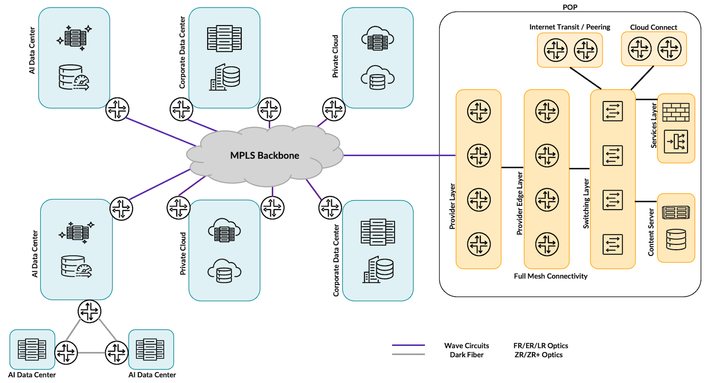
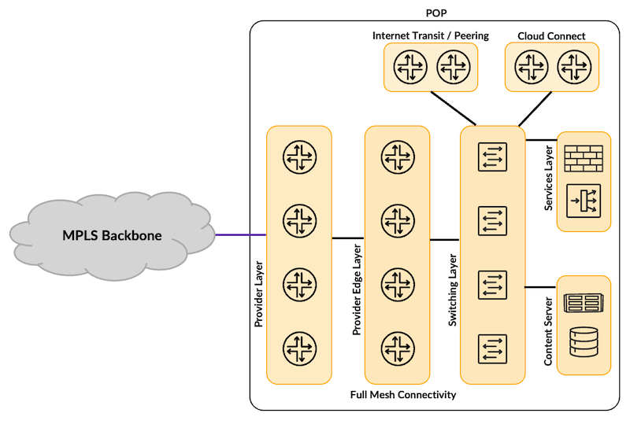
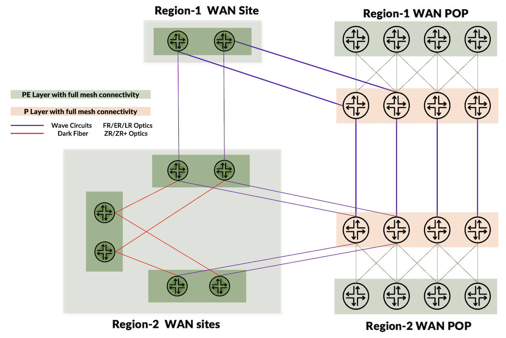
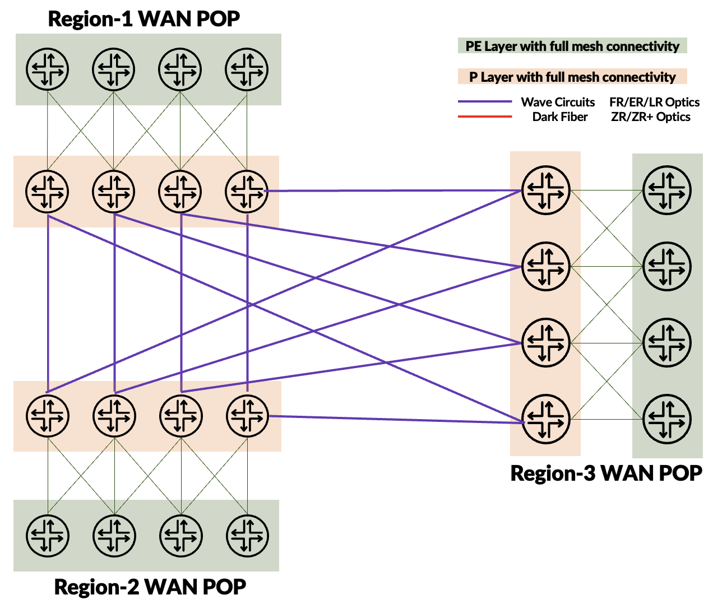
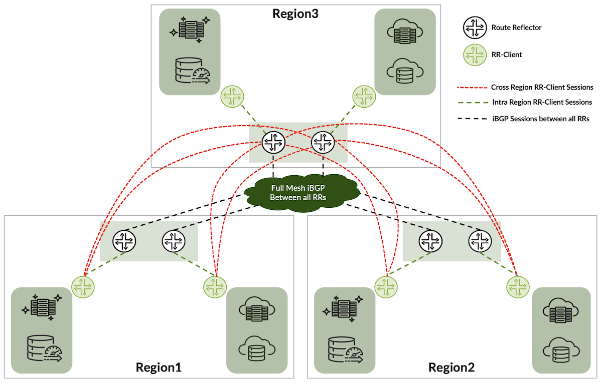
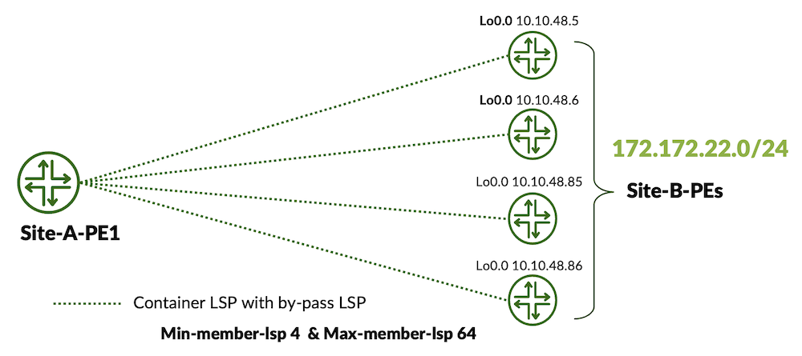
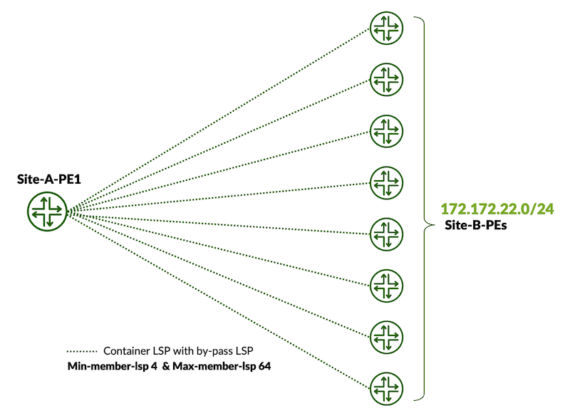

# Large Enterprises WAN Landscape in AI Era

**Kashif Nawaz - 09/13/2025**

Holistic design considerations for Large-Scale Enterprise WAN backbone networks, especially in the context of the evolving landscape shaped by connecting AI Clusters over the WAN Backbone.

## Introduction

Previous blog posts covered several key design aspects of MPLS backbone networks, including [a holistic approach to Class of Service](https://juniper.github.io/techposts/adaptive-resource-control-with-container-lsps/article). While writing those posts, I started thinking about how to conclude the series meaningfully. Later, it became clear that the final blog post should focus on holistic design considerations for Large-Scale Enterprise WAN backbone networks, especially in the context of the evolving landscape shaped by connecting AI Clusters over the WAN Backbone.

In a Large-Scale Enterprise, a Wide Area Network (WAN) backbone serves as the foundational infrastructure interconnecting various types of computational and data storage facilities, such as AI clusters, corporate data centers, and private cloud environments. Private WAN Backbone plays a critical role in enabling broader connectivity across geographically distributed regions.

Traditionally, enterprises built their WAN backbone networks using Wavelength Services from third-party providers to connect distributed sites and support communication between critical data hosting and processing facilities. As the landscape evolved, large enterprises and cloud providers began deploying dark fiber to gain higher bandwidth, greater control, and improved scalability. However, not all enterprises can deploy and maintain dark fiber, so third-party Wavelength providers still hold a major share of WAN backbone links, predominantly delivered over DWDM networks.



Over the past decade, public cloud adoption surged as it enabled enterprises to deploy applications and services quickly, accelerating business operations. However, due to exorbitant costs of public cloud hosting, many organizations are now re-evaluating their reliance on public cloud platforms and shifting toward private cloud infrastructure investments for better cost control and operational efficiency.

Regional WAN POPs (Point of Presence) play a vital role in enterprise connectivity by providing access to public cloud providers, internet peering, and IP transit services. In addition to these functions, POPs also host critical infrastructure such as Content Delivery Networks (CDNs), Global Load Balancers (GLB), DDoS protection, and other network security components.

Connectivity for AI Clusters has emerged as a new and critical component of the WAN environment. These clusters introduce unique networking demands due to high-bandwidth communication requirements. AI cluster operations depend on the WAN backbone for raw data ingestion, inference, model checkpointing, and inter-site file sharing to support distributed training and experimentation. Additionally, cross-site redundancy and backup requirements demand high-bandwidth WAN connectivity.

As a result, today's WAN infrastructure must support not just corporate and private cloud data centers but also AI cluster traffic that pushes high data volumes. The backbone must evolve accordingly, shifting from 100G to 400G and now to 800G links to meet performance and capacity demands.

## Business Use Case

Let's consider a hypothetical large-scale enterprise, ABC Corporation, which is expanding its global manufacturing and supply chain operations. These operations span multiple continents, requiring a global footprint of data hosting and processing facilities to support its business operations.

ABC Corporation's manufacturing and supply chain functions are heavily dependent on consumers data. To process this data in real time and use it to enhance product development and operational workflows, the company must leverage advanced AI capabilities and machine learning, which necessitates the establishment of dedicated AI clusters within their infrastructure.

Initially, ABC Corporation hosted most of its applications in the public cloud. However, the company is now investing in its own private cloud infrastructure. While some applications and data still reside in the public cloud thus hybrid cloud model is required to ensure smooth operations during the transition to a fully private cloud environment.

Given that ABC Corporation's customers are globally distributed and require real-time access to contents from its CDN, the company must maintain regional WAN Points of Presence (POPs). These POPs not only provide connectivity to internet transit and peering but also to public cloud providers via direct connections.

To support internal operations, ABC Corporation also maintains corporate data centers that host critical applications and services. These facilities are essential for managing global business functions and ensuring operational continuity across regions.

Let's endeavor to design a global scale, high throughout WAN backbone which should also be modular to meet future scalability needs.
During this transformation, the IT department of our hypothetical enterprise must evaluate a set of critical design considerations for a global-scale WAN backbone. The backbone should ensure resilience, provide built-in redundancy, and maintain sufficient capacity to support projected growth in the near future. The following key aspects are important to be considered for global scale WAN backbone design.

- Traffic Profile and Capacity Planning
- Throughput Requirements vis-e-vie WAN Links Count
- WAN Links Count and Port Count Strategy
- Platform Selection Strategy
- Connectivity Strategy: Wavelength Servies vs Dark Fiber
- WAN POP Regional Displacement
- WAN POPs - Regional and Cross Regional Connectivity
- Resiliency and Redundancy
- Infrastructure Security
- Routing Control Plane Selection
- Strategic Route Reflector Design
- Adaptive Traffic Forwarding with Dynamically Scalable Mechanism
- Preferred Local Traffic Paths with Cross-Regional Redundancy
- Selective Path Forwarding
- Traffic Classification and Prioritization
- Scaling Considerations for Provider Edge Routers
- SD-WAN and. MPLS: A Complementary Strategy
- Visibility and Performance Measurement

Let's dive into the details of each design consideration.

## Design Considerations

### Traffic Profile and Capacity Planning

**Disclaimer**: *This document focuses on the design of the WAN backbone and does not cover the lossless, low-latency connectivity required between AI clusters for AI/ML training. Such inter-cluster connectivity relies on specialized features such as RDMA over Converged Ethernet (RoCEv2), DCQCN (Data Center Quantized Congestion Notification), and dynamic load balancing, which are beyond the scope of this discussion.*

The WAN backbone must be designed to handle large-scale traffic efficiently, ensuring low latency, high availability, and dynamic scalability to meet evolving business and application needs. The following estimated bandwidth numbers are very conservative and for large enterprises bandwidth requirements would be much higher.

- Each corporate data center requires approximately 2-3Tbps of bandwidth, supported by device-level redundancy to maintain fault tolerance and uninterrupted services. Assuming three such sites, this results in a cumulative load of approximately ~5-6Tbps.
- ABC Corporation operates three geographically distributed AI Data Centers. Each facility routinely replicates several petabytes of data to support file sharing, model checkpoints for training and experimentation, and cross-site redundancy and disaster recovery.


**Example**: If 90 PB of storage replication must be completed within 24 hours across three AI Data Centers, the replication traffic will generate an average load of ~8.33Tbps on the WAN backbone. To sustain this rate, it would require 25 x 400G links, each operating at 85% effective throughput (accounting for encapsulation/decapsulation overhead and leaving headroom to prevent link congestion).

- The company's AI training models rely on consumer-generated data, which is ingested into the ABC Corporation WAN backbone through various WAN POPs hosting AI Edge clusters. At these POPs, data is anonymized, compressed, and labeled before being transferred to the AI Data Centers for training. Each regional WAN POP is designed to handle 8--10 Tbps of aggregated traffic, with a forecasted annual growth rate of 5%.
- Additionally, the private cloud data center contributes a consistent 4-5 Tbps of load, supporting hybrid applications and internal services. Assuming such sites produce cumulative load of ~8-9 Tbps.
- Based on above assumption, cumulative bandwidth needs for each segment are listed below:
    - Corporate DCs : ~5--6 Tbps
    - AI Clusters Storage Replication (90 PB/day example): ~8.33 Tbps
    - WAN POP ingestion: ~8--10 Tbps
    - Private cloud DCs: ~8--9 Tbps
    - Future growth (1 year): ~7-10 Tbps
    - Total = ~36.3--43.3 Tbps (Midpoint ~40Tbps)

***Naturally, this raises the question: What drives these bandwidth requirements?***

These estimates are assumed to design a hypothetical large-scale enterprise WAN backbone and author has used his experience in designing, deploying, and managing large-scale enterprise networks. However, in practice, bandwidth capacity figures are not determined in isolation. To arrive at accurate and actionable bandwidth planning, the organization's CIO or CTO must collaborate closely with key stakeholders, including:

- Application teams to understand traffic patterns and performance needs.
- Infrastructure teams (compute and storage) to identify the throughput needed for backup and disaster recovery.
- Network team to provide feedback on connectivity considerations.
- Chief Data Scientist and analytics teams to forecast data movement and processing requirements for AI Clusters based on business goals.
- Cross-functional deliberation ensures that WAN backbone capacity aligns with both current operational needs and future strategic objectives.

Capacity planning must be proactive, data-driven, and aligned with projected business and traffic growth. A rolling forecast model should be maintained to anticipate future capacity needs and guide timely infrastructure investments. The WAN backbone should be designed using a modular and scalable architecture, enabling incremental upgrades as demand increases.

### Throughput Requirements vis-à-vie WAN Links Count

To meet the above-described scaling needs, the IT department is planning to acquire 400G WAN Links as a transport layer for the backbone. Based on the projected aggregated traffic demand of ~40Tbps across ABC Corporation backbone, approximately 118 WAN links (@400Gbps) are required to meet peak throughput requirements. Furthermore, an additional 5% overhead is included to account for redundancy, failover, and scheduled maintenance.  This increases the total number of required WAN links to approximately 124@400Gbps.

These WAN links must be strategically distributed across diverse physical paths to eliminate single points of failure and to maintain consistent service quality under varying traffic and failure conditions. This approach ensures that the backbone remains scalable, resilient, and prepared to support ABC Corporation's evolving AI and cloud-driven workloads over the next several years.

Special consideration is made that WAN links will not operate at 100% line rate but will be configured to use 85% effective throughput using signaling protocol Resource Reservation Protocol (RSVP) link bandwidth subscription thus leaving headroom to prevent link congestion.  Please read my previous blog post to explore more about RSVP bandwidth subscription.

### WAN Links Count and Port Count Strategy

In the above analysis, we calculated that approximately 118 to 124 WAN 400G links would be required to meet projected bandwidth demands. This directly translates into the need for 400G-capable WAN-facing interfaces. In addition to these backbone-facing ports, each router (at same functional layer) inside a WAN site must be connected in full mesh. These considerations are discussed in detail in an upcoming section "WAN POPs - Regional and Cross Regional Connectivity".

Moreover, WAN backbone edge routers are also required to be connected to data center edge routers or WAN POP switching/routing infrastructure for service handoff.

These requirements significantly contribute to the total port count and interface capacity that must be considered during platform selection and hardware planning. Ensuring sufficient high-speed port density and fabric capacity is essential for sustaining long-term scalability and operational flexibility. When planning the WAN infrastructure, remember that beyond the 400 Gbps backbone links, cross-continental traffic also relies on 100 Gbps and 10 Gbps connections. These lower-capacity links must be included in the total count of required WAN ports, which in turn influences the choice of the WAN-backbone routing platform.

### Platform Selection Strategy

Once platform throughput and port density requirements are defined, the next step is selecting the appropriate forwarding ASIC that meets bandwidth, scalability, and feature set needs. ABC Corporation evaluated two primary ASIC architectures:

### Run-to-Completion Architecture

This design uses hundreds of parallel processing elements (PPEs), each capable of processing an entire packet independently. It offers high programmability, making it easier to introduce new software features. However, it typically incurs higher latency and a greater cost per port but lower cost per service.

### Pipeline Architecture (Enhanced with Elastic Pipelines)

In this model, packets flow through a series of stages, each performing specific actions. Pipeline-based ASICs generally offer lower latency, reduced cost per port, and better power efficiency. However, they may face limitations in programmability if new features are not supported within the existing pipeline stages.

Both architectures have their advantages and trade-offs. After thorough evaluation, ABC Corporation selected pipeline-based ASICs due to lower space and power requirements for the desired port density.

There are additional considerations relevant to ASIC selection, such as buffering architecture and temporal buffer values, number of counters, FIB and ACL scaling capabilities. However, a detailed discussion of these aspects is beyond the scope of this write-up.

### Connectivity Strategy: Wavelength Services vs Dark Fiber

ABC Corporation operates globally, and its computational needs require high throughput and low latency connectivity. After considering factors such as cost and lead time to delivery, the company has adopted the following connectivity strategy.

### Dark Fiber Connectivity

Computational facilities located in close proximity will be interconnected using dark fiber owned by ABC Corporation. This approach reduces long-term rental costs and provides full control over bandwidth, latency, and overall performance. Coherent optics will be used for regional sites connectivity over dark fiber.

### Wavelength Services

ABC Corporation will lease Wave circuits in scenarios where dark fiber connectivity is not feasible due to long distances, cost constraints, or limited technology availability. Wave circuits at 400G, 100G, and 10G will be selected based on throughput needs, cost, and availability. This approach offers a scalable and cost-effective alternative to owning long-haul infrastructure while ensuring reliable regional and intercontinental connectivity.

### WAN POP Regional Displacement

WAN POPs hosts the following important functions/ services: -

- Internet Transit/Peering Connectivity
- Cloud Connectivity
- CDN
- DDOS Solutions
- Network Security solutions to protect edges
- GLB

Figure 2 illustrates the high-level architecture of WAN POP. To meet redundancy and resiliency requirements, full-mesh connectivity will be established between the connected layers.



WAN POPs should be strategically deployed across key geographic locations to minimize latency between the POPs and internal data hosting or processing facilities. Low-latency connectivity is essential to prevent degradation of application performance.

### WAN POPs - Regional and Cross-Regional Connectivity

After evaluating multiple design options, ABC Corporation has chosen to build its WAN POP infrastructure using a scalable CLOS architecture. This design incorporates both Provider (P) and Provider Edge (PE) routers in a layered topology that supports independent scaling of each tier.

All WAN circuits terminating at a given WAN POP will connect to the Provider (P) layer. This approach enables efficient traffic distribution across multiple P routers. Connectivity between PE and P routers within the POP will be established using short-reach short-range QSFP (Quad Small Form-factor Pluggable) transceivers.

In WAN POP design, terminating WAN circuits at the P layer instead of directly on PE routers creates a scalable model where both layers can grow independently as demand increases.

Whenever feasible, regional sites should be directly connected to their WAN POPs. This minimizes latency and optimizes performance for accessing internet transit and public cloud services. However, due to geographic or infrastructure constraints, not all regional sites can be directly connected. In such cases, alternative routing strategies should be employed to meet reachability requirements.

Diagram 3 below shows the connectivity schema between region 1 and 2 WAN POPs and intra-region connectivity (WAN sites to WAN POPs).

Moreover, cross-regional sites can be directly connected using Wavelength Services based on connectivity needs.



To maintain reliability and fault tolerance, regional sites must have redundant links and paths to their designated WAN POPs. This redundancy helps ensure continuous connectivity even in the event of a link failure or regional disruption.

Cross-regional and continental WAN POPs connectivity ensures that if internet or public cloud access in one region becomes unavailable, then nearby WAN POPs can serve as backup, thus maintaining continuity of service. This connectivity scheme will also help in strategic "Route Reflector Design" (to be discussed in an upcoming section). Figure 4 shows cross-regional WAN POP connectivity.



### Resiliency and Redundancy Considerations

At the infrastructure layer, device-level redundancy must be implemented across all data centers and POPs to ensure high availability and minimize service disruptions. Furthermore, path diversity using multiple physically separate fiber routes is crucial for maintaining uptime during outages or scheduled maintenance.

### Infrastructure Security

Infrastructure security is one of the most critical aspects of network design and operation, and it must be ensured at any cost. It is not only essential for the continuity of business operations but also for maintaining the integrity and safety of corporate and consumer data. This is a vast subject and requires entire volumes to be covered in depth.

The infrastructure must be protected from both internal and external threats. Some of the commonly adopted best practices are listed below, though they are not limited to these measures:

- **Peering and Transit Sessions**: ACLs will be applied on internet peering / transit routers to restrict ingress traffic destined towards allowed internal prefixes and TCP/ UDP ports combination, thus providing 1st layer of security.
- **DDoS Protection at WAN POPs**: DDoS mitigation will be deployed on internet peering / transit routers to safeguard internal resources and prevent compromised hosts from participating in attacks.
- **Firewall at the Edges**: Network firewalls will be applied at WAN POPs to inspect and control inbound and outbound internet/ public cloud traffic, ensuring consistent enforcement of security policies.
- **Network Segmentation**: Wherever possible, do physical segments or apply logical segmentation via VRFs, VLAN, etc, to isolate workloads, minimize the attack surface within the network.
- **Network Devices Protection**: Network devices will be hardened by implementing industry best practices such as AAA (Authentication, Authorization, and Accounting), control-plane policing, and rate-limiting. These measures help prevent devices from being exploited or targeted in DDoS attacks, thereby ensuring overall business continuity.

### Routing Control Plane Selection

Exchange of service prefixes across the WAN Backbone sites is required to ensure service traffic reachability across the sites.

MP-iBGP is not only preferred but has become the de facto control plane protocol for routing information exchange in modern networks. It supports multiple address families, including IPv4, IPv6, VPNv4, VPNv6, EVPN, and L2VPN, making it suitable for WAN, data center, and cloud environments.

### Strategic Route Reflector (RR) Design

Since iBGP requires a full mesh of peering among all routers, which is not scalable in large networks, RRs are necessary to simplify the topology and reduce overhead. To ensure redundancy and consistent routing information exchange, it is decided that two provider edge (PE) routers in each Regional WAN POP will act as RRs.

To mitigate the risk of a complete loss of connectivity within a region, such as when a Regional WAN POP  becomes isolated, two additional PE routers from the nearest neighboring Regional WAN POP (Region3) will be configured as RRs for Region1 and Region2 sites.

The architecture guarantees redundant regional-level RR, thereby preserving control-plane resilience when a failure occurs. Figure 5 shows logical connectivity for RR strategic design.



Furthermore, all route reflectors across regions will participate in a full mesh iBGP topology. This will synchronize the Routing Information Base (RIB) across the regional and transcontinental WAN backbone.

### Adaptive Traffic Forwarding with Dynamically Scalable Mechanism

ABC Corporation's WAN backbone is built using Wavelength circuits and Dark Fiber, deployed across diverse physical paths to ensure resiliency and support for high-bandwidth traffic with fluctuating volume, such as AI data flows and inter-data center synchronization. To maintain performance and adaptability, the following traffic engineering features are essential:

- **Auto-bandwidth**: LSPs should adjust bandwidth reservations based on actual usage.
- **Adaptive Resources Utilization**: Real-time bandwidth feedback from MPLS interfaces to ingress LERs for intelligent path selection is required.
- **ECMP Over Diverse Paths**: Parallel LSPs should be spawned across multiple available paths to maximize throughput and fault tolerance.
- **LSP Auto Creation and Pruning**: Elastic scaling of LSPs is required to match dynamic bandwidth demands.

All of the above stated requirements can be best fulfilled by RSV-TE and Container LSP (TE++) so it will be adapted as a transport mechanism.  To learn more about adaptive resource control and Container LSP architecture, refer to my earlier blog on [Adaptive Resource Control](https://juniper.github.io/techposts/adaptive-resource-control-with-container-lsps/article).

### Preferred Local Traffic Paths with Cross-Regional Redundancy

Once the intra-regional, cross-regional, and cross-continental physical topology is finalized, and both the control and forwarding planes are fully established, ABC Corporation may encounter another challenge. Since services are deployed in a distributed manner, including internet transit, public peering, and direct cloud connectivity, a WAN site located in Site-A can access internet or cloud services through a remote Site-B WAN POP.

This situation occurs when Equal Cost Multipath (ECMP) is enabled for prefixes imported into the L3VPN. A given prefix may be reachable through LSPs terminating at both the nearest and more distant WAN POPs if the underlying IGP metrics are equal across those paths.

Without explicit design rules, this can result in inefficient traffic paths and suboptimal use of WAN capacity. To avoid this situation, deliberate configuration of IGP metrics and BGP local preference is required.

### IGP Metric Design

The following guidelines should be applied when setting IGP metrics to enforce a structured hierarchy of path preference:

- **Intra-site, same layer**: PE to PE or P to P routers within the same site, IGP metric will be set to **10**.
- **Cross-layer, within site**: PE to P router connections within a site, IGP metric will be set to **100**.
- **Inter-Site, Same Region**: WAN links connecting sites/POPs in the same region, IGP metric will be set to **2000**.
- **Cross-regional links**: WAN links connecting cross-regional sites/ POPs, IGP metric will be set to **3000**.
- **Cross-continental links**: WAN links connecting cross-continental sites/ POPs, IGP metric will be set to **5000**.

This metric hierarchy will ensure that traffic remains localized within a site whenever possible and uses cross-regional or inter-continental paths strictly as a last resort.

### BGP Local Preference Design

Although IGP metrics determine the signaling of LSPs, BGP local preference provides another critical mechanism for exit path selection for BGP external prefixes once imported into the L3VPN service layer.

- External prefixes learned from the nearest WAN POP (e.g., public cloud routes, internet routes, or the default route) should be assigned the highest local preference.
- External prefixes received from farther WAN POPs within the same region should be assigned a lower local preference.
- External prefixes received from cross-regional or cross-continental WAN POPs should be assigned the lowest local preference.

By tuning local preference in this way, BGP ensures that external traffic such as internet, public cloud, or default-routed flows consistently exists through the nearest available WAN POP. This approach improves performance, reduces latency, and optimizes WAN resource utilization while still maintaining cross-regional redundancy for resilience.

Thus, by combining a clear IGP metric hierarchy with BGP local preference policies, ABC Corporation can enforce deterministic traffic localization across its WAN backbone while preserving cross-regional redundancy as a fallback option.

### Selective Path Forwarding

Despite deploying well-defined traffic classification, prioritization policies, and adaptive resource control, ABC Corporation still has business requirements that demand latency-sensitive traffic to follow the shortest available paths. Meanwhile, traffic that can tolerate latency may be routed through longer or less optimal paths.

After evaluating multiple technologies such as Filter-Based Forwarding, BGP Classful Transport (BGP-CT), and Class-Based Forwarding (CBF), ABC Corporation has chosen to implement CBF to meet its selective traffic forwarding needs. CBF enables traffic to be forwarded based on predefined classes, allowing granular control over path selection according to application requirements.

To learn more about CBF and its implementation, please refer to [my dedicated blog post on the topic](https://juniper.github.io/techposts/class-based-forwarding-over-rsvp-lsps-design/article).

### Traffic Classification and Prioritization

Even though the WAN backbone is provisioned with sufficient capacity and enhanced by dynamic LSP scaling and adaptive traffic engineering resource control, these measures do not guarantee that backbone network links will not be congested. To proactively address potential link choking and ensure consistent performance, Class of Service (CoS) must be configured across the WAN backbone.

Traffic entering the network at the edges should be classified and forwarded via certain queues to meet the SLA (Service Level Agreement).

- Traffic between corporate-to-corporate prefixes will be served by high-priority queues, ensuring low latency and minimal packet loss for critical business workloads.
- Traffic between AI-to-AI data centers and AI-to-corporate prefixes will be served by best-effort queue but with lower packet loss priority.
- Traffic from corporate to internet or cloud destinations will be assigned a higher packet loss priority and will be served by best-effort queue.
- Voice traffic within corporate networks will also be served by high priority queue while any video traffic within corporate network will be served by medium priority queue.

Multifield or behavior aggregated classifiers can be applied on WAN backbone edges to segregate traffic flows based on prefixes/ port or DSCP values.  To learn more about Class of Service in WAN Backbone, [please refer to my previous blog post.](https://juniper.github.io/techposts/wholistic-design-approach-for-mpls-backbone-cos/article)

### Scaling Considerations for PE Routers

There is always an eternal debate in large-scale environments about whether fixed platform routers (scale-out) or modular platforms (scale-up) should be deployed in the Provider Edge (PE) role. Fixed platforms are easier to install due to lower space and power requirements, while modular platforms require more resources but offer greater scalability.

***Beyond power and space considerations, bandwidth scaling demand is directly tied to decision for scale-out vs scale-up of PE routers. ***

Let's consider the topology depicted in Figure 6. RSVP-TE is used as the signaling protocol, and bi-directional LSPs are configured. The PE routers at Site-B advertise the same prefix towards the Site-A routers. At Site-A, this prefix is learned and installed in the corresponding VRF, with the protocol (Indirect) next-hops for this route set to the loopback interfaces of the advertising routers. *All CLI outputs in this section are collected from  PTX10001-36MR running Junos EVO 23.4R2 S3.10.*

```
show route 172.172.22.0/24 table prod.inet.0 extensive | match "Protocol next hop"  
                Output deleted for brevity 
                Protocol next hop: 10.10.48.5
                Protocol next hop: 10.10.48.6
                Protocol next hop: 10.10.48.85
                Protocol next hop: 10.10.48.86
```

Junos handles L3VPN next-hops (NHs) through a hierarchical next-hop structure:

`Route -> Composite NH (CNH) -> Indirect-> Forwarding NH`

CNHs are special types of next-hops, which act as a container for a set of next-hops. With composite next-hop we can combine group of next-hops and perform one action on all of them. CNH can have the following types of next-hops in its forwarding list.

- Unicast
- Unilist
- Indexed
- Indirect
- Composite

Please see glossary section to get exact definition of each NH type used in this writeup, however detailed explanation of different types of NHs available in Junos is not in scope of this document.



To further address scaling challenges and to enable load balancing across diverse paths, multiple LSPs can be established toward the same egress router. However, each additional LSP configured on the ingress router also generates an additional protocol (Indirect) next-hop. In addition, standby LSPs and bypass LSPs contribute additional next-hops.  As illustrated in Figure 7, a Unilist-of-Unilists hierarchy is used for L3VPN routes, where a prefix is received from multiple egress routers and multiple LSPs (including bypass LSPs) are present toward each egress router.

```
Route
+-- Unilist Next Hop  (outer)
      +-- Indirect Next Hop (INDR-NH) [for PE1]
      |           +   Unilist (inner) 
      |           +-- Unicast NH (LSP1)
      |           +-- Unicast NH (LSP2)
      |           +-- ... (up to 128 total, incl. bypass LSPs)
      +-- Indirect Next Hop (INDR-NH) [for PE2]
      |          + Unilist
      |          +-- Unicast NH (LSP1)
      |          +-- Unicast NH (LSP2)
      |          +-- ...
      +-- Indirect Next Hop (INDR-NH) [for PE3]
      |           + Unilist (inner)
      |           +-- Unicast NH (LSP1)
      |           +-- Unicast NH (LSP2)
      |           +-- ... (up to 128 total, incl. bypass LSPs)
      +-- Indirect Next Hop (INDR-NH) [for PE4]
                + Unilist (inner)
                +-- Unicast NH (LSP1)
                +-- Unicast NH (LSP2)
                +-- ... (up to 128 total, incl. bypass LSPs)
```

As depicted in Figure 6 above, a high-throughput WAN site initially has 4 PE fixed form routers (e.g.PTX10001-36MR or PTX10002-36QDD).  Following, output snippet from Site-A-PE1 illustrates the hierarchical next-hop structure for prefix 172.172.22.0/24 (advertised by Site-B PE routers).

```
lab@router> show route 172.172.22.0/24 expanded-nh detail       

Trg.inet.0: 14 destinations, 58 routes (13 active, 0 holddown, 1 hidden)
172.172.22.0/24 (9 entries, 1 announced)
        State: <CalcForwarding>
Installed-nexthop:
List (0x8630d9c) Index:1048590 Push 91

<< Output deleted for brevity >>

lab@router> show nhdb id 1048590 recursive    

1048590(Unilist, IPv4, ifl:0:-, pfe-id:0)
    1048574(Indirect, IPv4, ifl:118:et-0/1/3.0, pfe-id:0, i-ifl:0:-)
        1048578(Unilist, IPv4, ifl:0:-, pfe-id:0)
            678(Unicast, IPv4->MPLS, ifl:118:et-0/1/3.0, pfe-id:0)
            664(Unicast, IPv4->MPLS, ifl:118:et-0/1/3.0, pfe-id:0)
            663(Unicast, IPv4->MPLS, ifl:118:et-0/1/3.0, pfe-id:0)
            681(Unicast, IPv4->MPLS, ifl:118:et-0/1/3.0, pfe-id:0)
            640(Unicast, IPv4->MPLS, ifl:67:ae0.0, pfe-id:0)
            656(Unicast, IPv4->MPLS, ifl:67:ae0.0, pfe-id:0)
            659(Unicast, IPv4->MPLS, ifl:67:ae0.0, pfe-id:0)
            654(Unicast, IPv4->MPLS, ifl:67:ae0.0, pfe-id:0)
    1048584(Indirect, IPv4, ifl:118:et-0/1/3.0, pfe-id:0, i-ifl:0:-)
        1048580(Unilist, IPv4, ifl:0:-, pfe-id:0)
            << Output deleted for brevity (follows same scheme as per above section) >>
    1048587(Indirect, IPv4, ifl:118:et-0/1/3.0, pfe-id:0, i-ifl:0:-)
        1048581(Unilist, IPv4, ifl:0:-, pfe-id:0)
            << Output deleted for brevity (follows same scheme as per above section) >>
    1048579(Indirect, IPv4, ifl:118:et-0/1/3.0, pfe-id:0, i-ifl:0:-)
        1048576(Unilist, IPv4, ifl:0:-, pfe-id:0)
            << Output deleted for brevity (follows same scheme as per above section) >>
```

Let's consider that due to scaling needs, the number of PE routers at Site B increased from 4 to 8 (as depicted in Figure 8), and later on, may be scaled to 16 or 32. Furthermore, due to bandwidth growth needs, ingress LSP from Site-A PE1 router to each egress router in Site-B was scaled to 64, either statically configured or dynamically created Containers' members with bypass paths. With PE routers scale-out design approach, each addition into egress PE router corresponds to addition of one indirect (protocol) next-hop on ingress router.

Furthermore, the addition of each LSP / Containers members LSPs on ingress router adds corresponding forwarding (Unicast) next-hop and another forwarding (Unicast) next-hop for by-pass LSPs is also added.



Figure 9 depicts the hierarchical next-hop structure for scaled-out environment.  Although Junos can handle this hierarchical next-hop structure in a scaled-out fashion, this design approach has its own operational challenges for network operators. With scaled-out design approach network operation/ troubleshooting might become challenging for the network operators.

```
Route
+-- Unilist Next Hop
      +-- Indirect Next Hop (INDR-NH) [for PE1]
      |    +-- Unicast NH (LSP1)
      |    +-- Unicast NH (LSP2)
      |    +-- ... (up to 128 total, incl. bypass LSPs)
      +-- Indirect Next Hop (INDR-NH) [for PE2]
      |    +-- Unicast NH (LSP1)
      |    +-- Unicast NH (LSP2)
      |    +-- .. (up to 128 total, incl. bypass LSPs)
      +-- Indirect Next Hop (INDR-NH) [for PE3]
      |    +-- Unicast NH (LSP1)
      |    +-- Unicast NH (LSP2)
      |    +-- ...
      +-- Indirect Next Hop (INDR-NH) [for PE4]
      |    +-- Unicast NH (LSP1)
      |    +-- Unicast NH (LSP2)
      |    |
      |    +-- ... (up to 128 total, incl. bypass LSPs)
      +-- Indirect Next Hop (INDR-NH) [for PE5]
      |    +-- Unicast NH (LSP1)
      |    +-- Unicast NH (LSP2)
      |    |
      |    +-- ... (up to 128 total, incl. bypass LSPs)
      |
      +-- Indirect Next Hop (INDR-NH) [for PE6]
      |.  .........Unicast NH deleted for brevity 
      +-- Indirect Next Hop (INDR-NH) [for PE7]
      |. ......... Unicast NH deleted for brevity 
      +-- Indirect Next Hop (INDR-NH) [for PE 8]
      |......... Unicast NH deleted for brevity
      +-- One indirect next hop is added per egress router.
```

Scale-up design for PE routers (using modular platforms) is well-suited for WAN sites where a high amount of ingress and egress bandwidth is anticipated. Modular platforms offer greater capacity and flexibility, making them ideal for environments expecting sustained traffic growth and requiring scalable infrastructure. However, scale-up design has   its own trade-offs i.e. higher space, energy, and cooling requirements compared to fixed platforms.

### SD-WAN and MPLS: A Complementary Strategy

For large enterprises, SD-WAN and MPLS are not competing technologies. They solve different problems and work best together.

Let's consider an example where ABC Corporation is setting up a new logistics or service facility in a remote area where private WAN options like wavelength services or dark fiber are not available or too expensive. In such scenarios, SD-WAN enables rapid business operation activation by routing traffic over the public internet from an on-site SD-WAN CPE to the nearest WAN Point of Presence (POP), where an SD-WAN headend integrates with the enterprise core network.

Modern SD-WAN platforms deliver strong encryption, application-aware traffic prioritization, and centralized policy control, ensuring secure and reliable performance even over cost-effective public links while MPLS remains the preferred choice for mission-critical, latency-sensitive workloads that require guaranteed SLAs.

### Visibility and Performance Measurement

To maintain high performance and operational insight across the WAN backbone, ABC Corporation utilizes a modern set of tools and protocols:

- TWAMP (Two-Way Active Measurement Protocol): Enables accurate measurement of path performance metrics such as latency, jitter, and packet loss between network endpoints.
- IPFIX and sFlow: Used for exporting flow-level data, providing visibility into traffic patterns, application usage, and bandwidth consumption across the network.
- Streaming Telemetry: Replaces legacy SNMP and NETCONF-based polling with real-time, subscription-based data collection. This approach offers higher granularity, lower latency, and better scalability for monitoring operational statistics.

## Conclusion

WAN backbone design in scaled environments requires a comprehensive approach that begins with accurate capacity estimates then selecting WAN links that meet bandwidth requirements while ensuring path diversity, as well as choosing platforms that can scale effectively. Regional WAN POPs should be strategically placed to achieve low latency for cloud and internet traffic originating from the corporate WAN.  Well-planned route reflector strategies are essential to maintain control plane scalability. Industry best-practice security controls must be implemented to protect the WAN infrastructure from both internal and external threats. The design should also emphasize resilience by incorporating redundancy at every layer and deploying fail-safe mechanisms to ensure consistent availability in support of evolving business requirements.

## Glossary

- AAA: Authentication, Authorization, and Accounting, a security framework used to control access to network resources, verify user identity, enforce permissions, and track usage for auditing and compliance.
- AI Cluster: A compute fabric of GPUs used for distributed training and inference; it generates high-volume, low-latency traffic across WAN links.
- API: Application programming interface
- BA Classifier: Behavior Aggregate Classifier, classifies packets based on a single field (usually DSCP) for bulk traffic handling.
- CIO: Chief Information Officer, senior executive responsible for overseeing the organization's IT strategy, systems, and infrastructure to support business goals.
- CPE: Customer Premises Equipment, networking hardware (e.g., routers, firewalls, SD-WAN appliances) located at the customer site, used to connect to the service provider's network.
- CDN: Content Delivery Network, a network of edge servers that cache and deliver content closer to users.
- CNH: Composite Next-Hop, special types of next-hops that act as a container for a set of Next-Hops, allowing combined actions on all of them.
- CoS: Class of Service, framework for prioritizing traffic in the network, essential for managing latency-sensitive AI traffic.
- Container LSP: Logical bundle of multiple RSVP-TE LSPs created dynamically to meet growing traffic demands, improving scalability and utilization.
- Data Center (DC): A centralized facility for compute, storage, and networking infrastructure.
- Dark Fiber: Unused optical fiber leased for private use, offering high-speed, dedicated interconnects between data centers or POPs.
- DDoS: Distributed Denial of Service, an attack that floods a target with excessive traffic to disrupt services.
- DCI: Data Center Interconnect, high-throughput links connecting multiple data centers, often leveraging DWDM over dark fiber for low-latency, high-capacity AI cluster communication.
- Egress Router: The router where a packet or LSP exits the network or domain; it removes labels, decapsulates traffic, and forwards packets toward the destination or customer edge.
- FIB: Forwarding Information Base, the router's hardware-level table used to forward packets, populated from the RIB.
- FNH: Forwarding Next-Hop, the next hop binding the Layer 3 IP information and Layer 2 MAC, label, or interface information.
- GPUs: Graphics Processing Units, vital for AI because their parallel architecture can process massive datasets and complex calculations simultaneously; they deliver far greater speed and efficiency for deep learning compared to CPUs.
- GLB: Global Load Balancing, distributes traffic across multiple data centers or POPs for performance and failover.
- GPRS: General Packet Radio Service
- INH: Indirect Next-Hop, an intermediate next-hop that points to another next-hop.
- Ingress Router: The router where a packet or LSP enters the network or domain; it applies label imposition, encapsulation, or policies before forwarding traffic into the provider's backbone.
- MPLS: Multiprotocol Label Switching, a routing technique that enables efficient forwarding based on labels, commonly used in WAN backbones.
- MF: Classifier Multi-Field Classifier, a mechanism to classify packets based on multiple header fields for fine-grained traffic treatment.
- PE: Provider Edge Router, a router at the edge of a provider's network that connects to customer or external networks, handling VRFs, routing policies, and encapsulation/decapsulation for services like MPLS or EVPN.
- PNH: Protocol Next-Hop, next-hop as specified by a BGP update; the BGP route resolver recurses through protocol next-hop of the prefix to find its forwarding next-hop.
- POPs: Point of Presence, regional site providing access to the WAN, cloud providers, or the internet; often used for traffic aggregation, breakout, or peering.
- RIB: Routing Information Base, control-plane table containing learned routes, from which forwarding decisions are derived.
- RSVP: Resource Reservation Protocol, signaling protocol used to establish LSPs in MPLS networks, reserving bandwidth and supporting traffic engineering.
- RSVP-TE: Resource Reservation Protocol, Traffic Engineering, protocol for establishing MPLS paths with bandwidth reservations and explicit routing; critical for deterministic traffic handling.
- SD-WAN: Software-Defined Wide Area Network, a virtual WAN architecture that enables enterprises to securely connect users to the corporate network by leveraging broadband internet while ensuring optimal performance.
- Unicast Next-Hop: The ultimate next-hop that directly forwards the traffic toward its destination.
- Wavelength Services: Layer 1 circuits rented from providers (e.g., Lumen, Zayo, Crown Castle); commonly referred to as Wavelength Services.
- WAN: Wide Area Network, high-capacity transport network interconnecting data centers, AI clusters, POPs, and cloud sites across regions.

## References

- [https://juniper.github.io/techposts/wholistic-design-approach-for-mpls-backbone-cos/article](https://juniper.github.io/techposts/wholistic-design-approach-for-mpls-backbone-cos/article)
- [https://juniper.github.io/techposts/adaptive-resource-control-in-te-networks/article](https://juniper.github.io/techposts/adaptive-resource-control-in-te-networks/article)
- [https://juniper.github.io/techposts/adaptive-resource-control-with-container-lsps/article](https://juniper.github.io/techposts/adaptive-resource-control-with-container-lsps/article)
- [https://juniper.github.io/techposts/class-based-forwarding-over-rsvp-lsps-design/article](https://juniper.github.io/techposts/class-based-forwarding-over-rsvp-lsps-design/article)

## Acknowledgments

This blog would not have taken on its current strategic depth without the insightful review and guidance of Vasily Mukhin (TME Director). I sincerely thank Vasily for his valuable input and perspective.