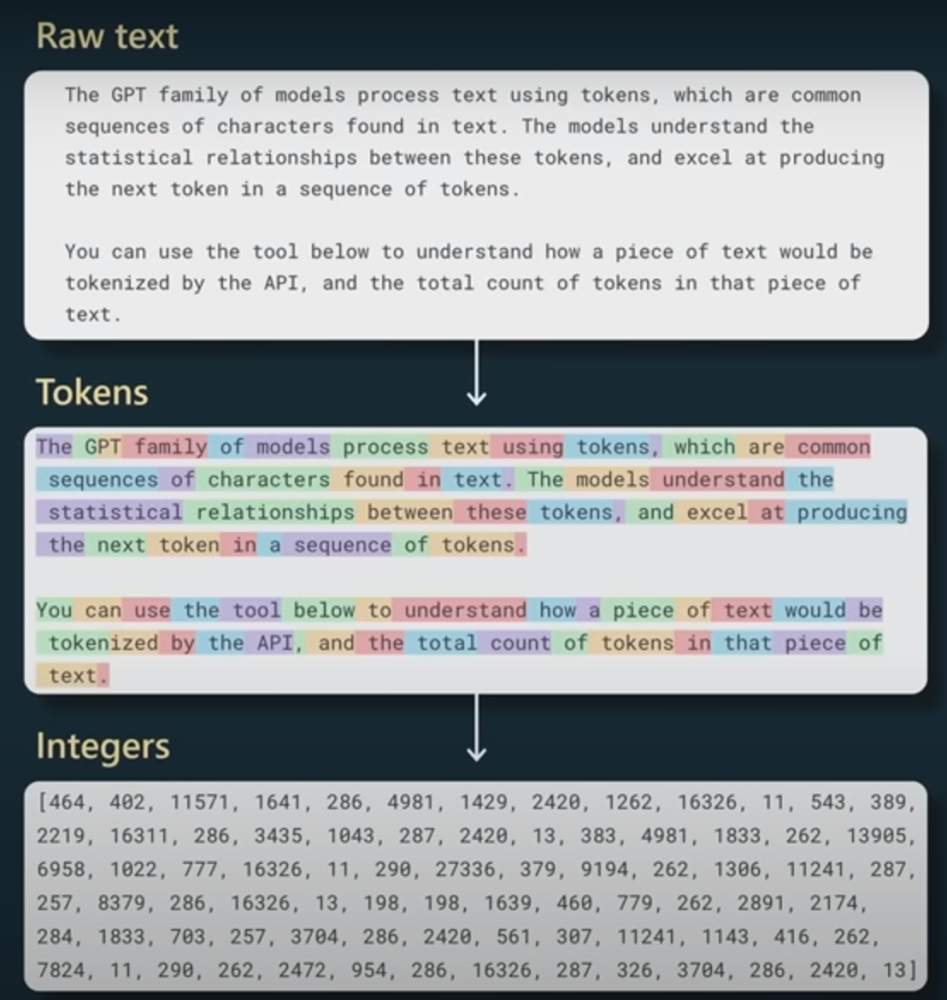
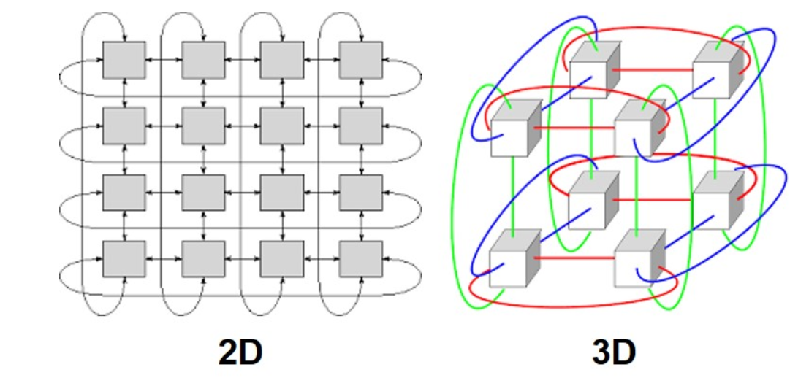
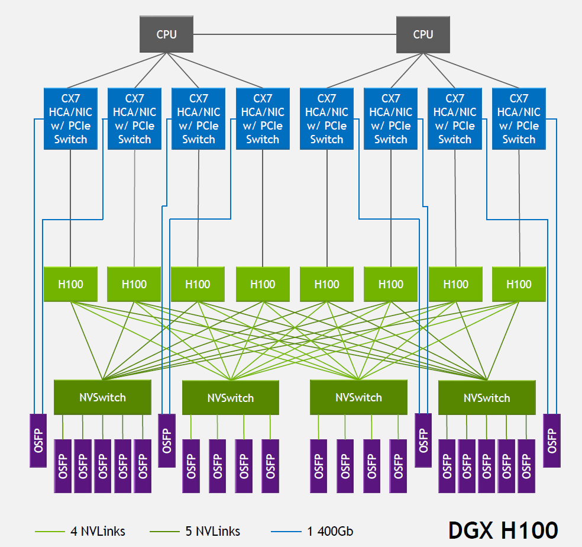
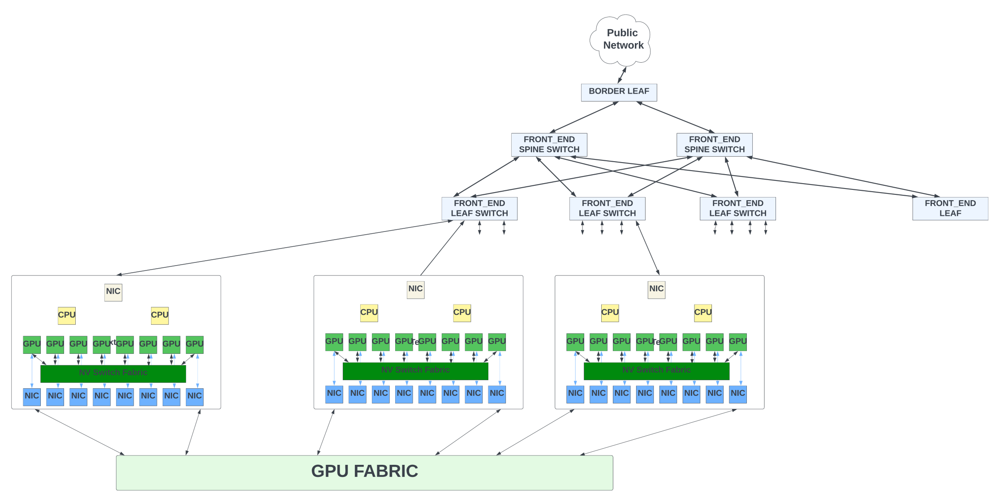
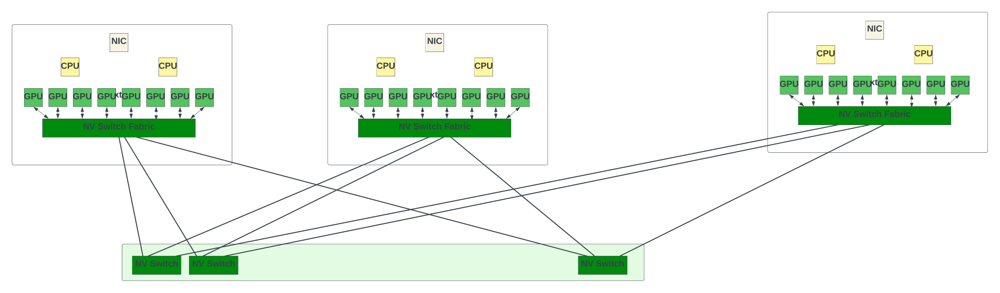
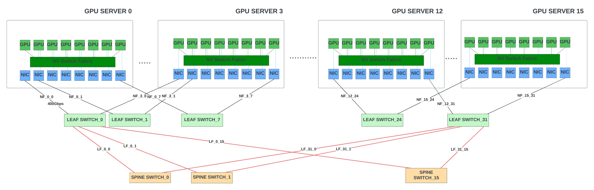
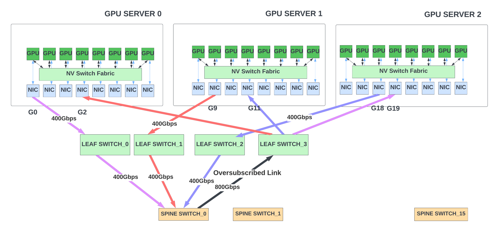
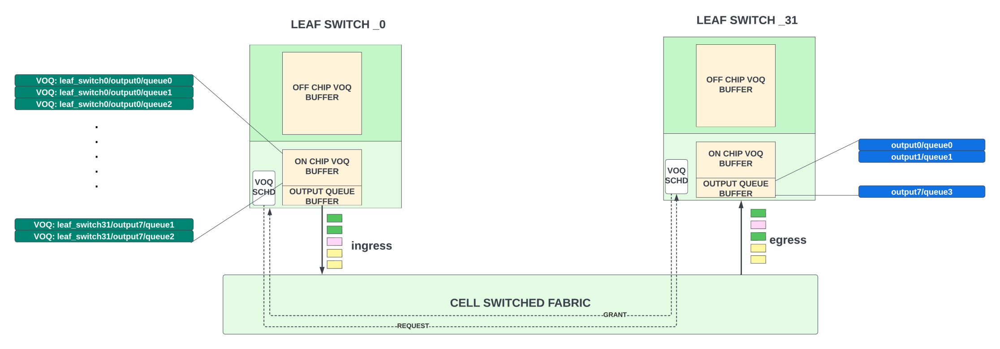
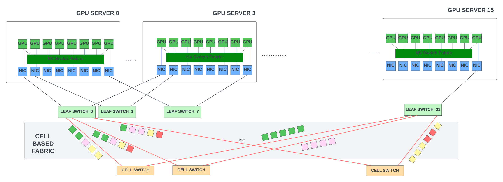

# Large Language Models - The Hardware Connection

**Sharada Yeluri - 10/03/2023**

A brief introduction to the LLMs, the hardware challenges in training these models, and how the GPU and networking industry is evolving to optimize the hardware for the training workloads.

*Article initially published by Sharada on [LinkedIn here](https://www.linkedin.com/pulse/large-language-models-hardware-connection-sharada-yeluri) in July 2023.*

## Introduction to  Generative AI and Large Language Models

Generative AI is a branch of artificial intelligence that focuses on creating or generating new content, such as images, text, or music that are not directly copied or derived from existing examples. It involves training deep learning models to learn the underlying patterns and characteristics of large data sets and then using that knowledge to produce novel outputs. Large Language Models (LLMs) are a type of generative AI that are trained on vast amounts of natural language data using advanced deep learning algorithms. These models learn patterns and structures of human language and can generate human-like responses to a wide range of written inputs or prompts.

LLM models have been in the "works" for over a decade but failed to capture widespread attention until openAI released chatGPT. ChatGPT enabled anyone with internet access to interact with one of the most powerful LLM models, GPT-3.5. As individuals and organizations started 'playing' with chatGPT, they realized the many applications it could transform in ways that were not imaginable even a year ago.

The near-perfect human-like responses from chatGPT and other recent LLMs were made possible by the advances in the model architectures, which are highly efficient deep neural networks (DNNs) with billions of parameters trained on large data sets. Most parameters are matrix weights used in the training and inference. The number of floating point operations (FLOP) for training these models increases almost linearly with the number of parameters and the size of the training set. These operations are performed on specialized processors designed for matrix operations like graphics processing units (GPUs), tensor processing units (TPUs), and other specialized AI chips. Advances in GPU/TPU and AI accelerators and the interconnects for communication between them have made training these gigantic models possible.

### LLM Applications

LLMs have many use cases that almost every industry can benefit from. Organizations can fine-tune the models for their specific needs and domains. Fine-tuning is the process of training a pre-existing language model on a specific dataset to make it more specialized and tailored to a particular task. Fine-tuning allows organizations to leverage the pre-existing capabilities of these trained models while also adapting them to their unique requirements. It enables the model to acquire domain-specific knowledge which improves its ability to generate desired outputs for the organization's use cases. With fine-tuned models, organizations can use LLMs for several use cases.

For example, LLMs that are fine-tuned with a company's documentation can be used for customer support. LLMs can aid software engineers by creating code or supporting them in creating portions of code. When fine-tuned with the organization's proprietary code base, LLMs have the potential to generate software that resembles and complies with the existing code base.

Sentiment analysis to gauge customer feedback, translating the technical documentation to other languages, summarizing meetings and customer calls, and generating engineering and marketing content are some of the many use cases of LLMs.

As the size of these LLMs continues to grow exponentially, the demand for compute and interconnect resources also increases significantly. The widespread adoption of LLMs can only occur when the training and fine-tuning of the models, as well as making inferences, becomes cost-effective.

## LLM Training

To train an LLM using natural language text, large amounts of data are typically gathered using web scrape (crawling the web), Wikipedia, GitHub, stack exchange, Arixiv, etc. Most models usually stick to open data sets for training. The vast amount of text from these data sets is first tokenized, often using methods like byte-pair encoding. Tokenization translates the raw text from the internet into a sequence of integers (tokens). A token (unique integer) can represent as small as a character or as large as a word. The token could be part of a word too. For example, the word "unhappy" might get broken into two tokens - one for the subword "un" and the other for the subword "happy."

*Courtesy: Andrej Karpathy's Key Note at Microsoft Build 2023*

Depending on the dataset, there could be tens of thousands of unique tokens, and the dataset itself could map to hundreds of billions of tokens. Sequence or context length is the number of consecutive tokens the model will look at when predicting the next token during the training. The sequence length is around 2,000 in GPT-3 and *LLaMA* (LLM from Meta). Some models use sequence lengths in the order of 100,000. Table-1 compares GPT-3 and LLaMA model training parameters.

To train the model, the tokens are broken into the array of size batch_size (B) x *sequence length*, and these batches are fed to large neural network models. For this blog, I will not go deeper into the model architecture as it requires more in-depth knowledge of deep learning and transformers (which I do not possess). The training often takes weeks, if not months, and requires large clusters of GPUs.

|  | GTP-3 Large | LLaMA |
|:--|:--|:--|
| Vocabulary Size | 50,257 | 32,000 |
| Sequence Length | 2,048 | 2,048 |
| Parameters in the Largest Model Trained | 175 Billion | 65 Billion |
| Tokens in Training Dataset | 300 Billion | 1 to 1.3 Trillon |
| Numbers of GPUs | 10,000 x V100 GPUs | 2,048 x A100 GPUs |
| Training Time | One Month | 21 Days |

Once the base model is trained, it typically goes through supervised Fine-Tuning (SFT). This is an important step that tricks LLMs into acting as assistants, answering questions to human prompts! In supervised fine-tuning, human contractors create a curated dataset (small quantity but high-quality dataset) in the form of a prompt followed by a response, and the base model is retrained with this dataset. That is it! The trained SFT model now becomes an assistant capable of giving human-like responses to user prompts. This is an oversimplified explanation for LLMs to give some context for the rest of the sections.

### Model Math

A model with 175B parameters usually requires *>1TB* of memory to store the parameters and intermediate states during the computation. It also needs storage to checkpoint the training state (to fall back to if hardware errors are encountered during a training iteration). One trillion tokens typically take *4TB* of storage. A high-end GPU like *H100* from Nvidia has 80GB of integrated HBM memory. One GPU's memory cannot fit the model parameters and training sets.

According to Wikipedia, an LLM typically requires six floating point operations (FLOP) per parameter and token. This translates to *6 x 175B x 300B* or *3.15 x 10^23* floating point operations to train the GPT-3 model. GPT-3 model took three weeks to train. Thus, it needed *5.8 x 10^16* FLOPs (floating point operations per second) of compute power during that three-week duration.

The highest-performing H100 GPU from Nvidia can do approximately *67 TeraFLOPS using FP32*. If these GPUs were 100% utilized, we require ~2,000 GPUs to get 12*.15 x 10^16 FLOPS*. But, in many training workloads, GPU utilization hovers around 30% or less due to memory and network bottlenecks. Thus the training requires thrice the number of GPUs or roughly ~6,000 *H100* GPUs. The original LLM model (Table-1) was trained using an older version of the GPU, so it needed 10,000 of them.

With thousands of GPUs, the model and the training data sets need to be partitioned among the GPUs to run in parallel. Parallelism can happen in several dimensions.

### Data Parallelism

It involves splitting the training data across multiple GPUs and training a copy of the model on each GPU. A typical flow is as follows.

1. Data Distribution: The training data is divided into mini-batches and distributed across several GPUs. Each GPU gets one unique mini-batch training set.
2. Model Copy: A copy of the model is placed on each GPU (worker).
3. Gradient Calculation: Each GPU goes through one iteration of model training using its mini-batch, running a forward pass to make predictions and a backward pass to calculate gradients (which indicate how the model's parameters should be adjusted before the next iteration).
4. Gradient Aggregation: The gradients from all the GPUs are then aggregated together. This is typically done by taking the average of the gradients.
5. Model Update: The aggregated gradients are broadcast to all the GPUs. GPUs update their local model parameters and get synchronized.
6. Repeat: This process is repeated for multiple iterations until the model is fully trained.

Data parallelism can significantly speed up the training when using large datasets. However, it could create considerable inter-GPU traffic as each GPU must communicate its results with every other GPU involved in training. This all-to-all communication could create large amounts of traffic in the network for each training iteration.

There are several ways to reduce this. For small-scale models, a dedicated server (parameter server) aggregates the gradients. This could create a communication bottleneck from the many GPUs to the parameter server. Schemes like Ring All-Reduce have been used to send the gradients in a ring pattern from one GPU to the other, where each GPU aggregates the gradients it received from the previous GPU with its locally computed gradients before sending it out to the next GPU. This process is very slow as gradient aggregation is distributed across the GPUs and the final result needs to be propagated back to all the GPUs in ring topology. If there is congestion in the network, the GPU flows are stalled waiting for the aggregated gradients.

Further, LLMs with billions of parameters do not fit in a single GPU. Hence, data parallelism alone does not work for LLM models.

### Model Parallelism

Model Parallelism aims to solve the case where the model does not fit in a single GPU by splitting the model parameters (and the computation) across multiple GPUs. A typical flow is as follows:

1. Model Partitioning: The model is divided into several partitions. Each partition is assigned to a different GPU. Since deep neural networks usually contain a stack of vertical layers, it makes logical sense to split a large model by layers, where one or a group of layers might be assigned to a different GPU.
2. Forward Pass: During the forward pass, each GPU computes the outputs for its part of the model using the "entire" training set. The outputs from one GPU are passed as inputs to the next GPU in the sequence. The next GPU in the sequence can not start its processing until it receives the updates from the previous one.
3. Backward Pass: During the backward pass, the gradients from one GPU are passed to the previous GPU in the sequence. Upon receiving the inputs, each GPU computes the gradients for its part of the model. Similar to forward pass, this creates a sequential dependency between the GPUs.
4. Parameter Update: Each GPU updates the parameters for its part of the model at the end of its backward pass. Note that these parameters do not need to be broadcast to other GPUs.
5. Repeat: This process is repeated until the model has been trained on all the data.

Model parallelism allows for the training of models that are too large to fit on a single GPU. But it also introduces inter-GPU communication between the GPUs during forward and backward passes. In addition, the naive implementation described above of running the entire training data set through a sequence of GPUs might not be practical with LLMs due to the gigantic dataset sizes. It also creates a sequential dependency between the GPUs, leading to large bubbles of waiting time and severe under-utilization of compute resources. That's where pipeline parallelism comes into the picture.

### Pipeline Parallelism

Pipeline parallelism combines data and model parallelism where each mini-batch of the training data set is split further into several micro-batches. In the model parallelism example above, after one GPU computes the output using the first micro-batch and passes that data to the next GPU in the sequence, instead of idling until it gets the inputs from that GPU in the backward pass, it starts working on the second micro-batch of the training data set and so on. This increases inter-GPU communication as each micro-batch needs forward-pass and backward-pass communication between adjacent GPUs in the sequence.

### Tensor Parallelism

Both model and pipeline parallelism techniques split the model vertically at the layer boundaries. With large LLMs, even fitting a single layer in a GPU could be a challenge! Tensor parallelism helps in such scenarios. It is a form of model parallelism, but instead of partitioning the model at the layer level, it partitions the model at the level of individual operations, or "tensors." This allows for more fine-grained parallelism and can be more efficient for certain models.

There are many other techniques for splitting the datasets and the model parameters across the GPUs. The main focus of research in this field is to minimize inter-GPU communication and to reduce the idle time of GPUs (FLOP utilization) when training large models. Most deep learning frameworks have built-in support for partitioning the models and datasets (if the user does not want to set them manually).

Irrespective of the type of parallelism used, LLMs, just by their sheer size of the parameters and data sets, create significant inter-GPU traffic through the fabric that connects these GPUs. Any congestion in the fabric could lead to large training times with very poor utilization of the GPUs.

Thus the interconnect fabric technology and the topologies used for the GPU/TPU clusters play a critical role in the total cost and performance of the LLMs. Let's explore the popular GPU/TPU cluster designs to understand the interconnects and how they fare for LLM training.

## GPU/TPU Landscape

**TPUs** (Tensor Processing Units) are AI accelerators developed by Google for speeding up matrix multiplication, vector processing, and other computation required in training large-scale neural networks. Google does not sell the TPUs to other cloud providers or individuals. These TPU clusters are used exclusively by Google to provide ML/AI services in Google Cloud and for other internal applications.

*Courtesy [https://www.nextplatform.com/2018/05/10/tearing-apart-googles-tpu-3-0-ai-coprocessor/](https://www.nextplatform.com/2018/05/10/tearing-apart-googles-tpu-3-0-ai-coprocessor/)*

Google builds TPU clusters by using either 2D or 3D toroidal mesh networks. In a 2D toroidal mesh, each TPU connects to four TPUs in north/south/east/west directions. The toroidal aspect comes from the fact that this grid wraps around at the edges (like a doughnut or toroid shape) so that TPUs on the grid's edges are still connected to four other TPUs. The same concept can be scaled for 3D topology. This topology enables fast communication between adjacent GPUs as they exchange the results (tensor/pipeline parallelism).

The TPU v4 pod has over 4096 TPUs in a 3D toroidal network. They use optical circuit switches (OCS) to switch the traffic between the TPUs. This could save the power of the optical modules at the OCS as it removes the need for converting from the optical to the electrical domain before switching. Google trained all its LLM models, *LaMDA*, *MUM*, and *PaLM*, in TPU v4 pod and they claim very high TPU utilizations (over 55%) for training.

When it comes to GPUs, Nvidia is the leading provider of the **GPUs** and the systems used by all the major data centers and HPCs for training large DNNs. Most of the LLMs (barring the models created by Google) are trained using Nvidia's GPUs.

Nvidia GPUs come with high-speed NVLinks that are used for GPU-GPU communication. NVLinks offer significantly higher bandwidth than the traditional PCIe interfaces and enable faster data transfer between the GPUs to improve the training times for machine learning. The fourth generation NVlink provides 200Gbps bandwidth in each direction. The latest *H100* GPU from Nvidia has 18 of these links - which provides 900GBps of aggregate bandwidth. In addition, NVLink allows for GPU memory pooling, where multiple GPUs can be linked together to act as a single, larger memory resource. This can be beneficial for running applications that require more memory than is available on the local GPU and allows flexible partitioning of the model parameters across the GPUs.

*Each NIC can carry 400Gbps data in each direction through the OSFP cages. The OSFP cages connected to each CX7 NIC connect GPUs to the external ethernet/IB switches. GPUs in a node can connect to other GPUs through a hierarchy of NVLink switch systems using the OSFP ports of the four NV switches. Courtesy: Hot Chips 2022 presentation by Nvidia*

A GPU server, alternatively called a system or a node, is an 8-GPU cluster where the GPUs within the cluster talk to each other through the NVLinks using the four custom NVLink switches (NVswitches). Multiple GPU servers could be connected together through GPU fabric to form large-scale systems. A GPU fabric is an array of switches arranged in a leaf/spine or 3-stage Clos topologies. It gives any-to-any connectivity between the GPU servers connected to the fabric. The leaf/spine switches inside the fabric typically follow the fat-tree topology. In a fat-tree topology, as you move up the topology from node to leaf and the spine, the bandwidth of the links increases. This is because each up-link needs to handle bandwidth from more than one downlink.

The number of switches in the GPU fabric depends on

- The scale of the system (or the number of GPU nodes)
- Throughput of the switches inside the fabric. The higher the throughput offered by a single switch, the fewer the number of switches needed to construct the fabric
- Additional bandwidth in the fabric (overprovisioning) to alleviate the congestion scenarios.

For good training performance,

- The GPU fabric should have low end-to-end latency. Since there is a lot of inter-GPU communication, lowering the overall latency for data transmission between the nodes helps reduce the overall training time.
- The fabric should enable loss-less transmission of the data between the nodes. Loss-less transmission is an important criterion for AI training as any loss in gradients or intermediate results requires the entire training to go back to the previous checkpoint stored in the memory and start over again. This adversely affects the training performance.
- The system should have good end-to-end congestion control mechanisms. In any tree topology, transient congestion is unavoidable when multiple nodes transmit data to a single node. Sustained congestion could increase the tail latency of the system. Due to the sequential dependencies between the GPUs, even if a single GPU's gradient updates are delayed through the network, many GPUs could stall. One slow link is all it takes to get the training performance down!
- In addition, the total cost to build the system, power consumption, and the cost of cooling etc should be taken into account as well. With that in mind, let's look at the choices for GPU fabric designs and the pros/cons of each approach.

### Custom NVLink Switch System

NVLink switch that is used to connect between the 8 GPUs in the GPU server could also be used to build the switch fabric to connect between the GPU servers. Nvidia showcased topologies with 32 nodes (or 256 GPUs) with NVswitch fabric at the Hot Chips 2022 conference. Since NVLink has been designed specifically as a high-speed, point-to-point link to interconnect GPUs, it yields higher performance and lower overhead than would be present in traditional networks.

The third-generation NVswitch supports 64 NVLink ports with 12.8Tbps of switching capacity. It also supports multicast and in-network aggregation. With in-network aggregation, aggregation of the gradients from all worker GPUs happens inside the NVswitches, and the updated gradients are sent back to the GPUs to start the next iteration. This could potentially reduce inter-GPU traffic between the training iterations.

Nvidia claims it can train *GPT-3 *model 2x faster with NVswitch fabric than with InfiniBand switch fabric. This performance is impressive, but the switch is 4x less bandwidth than the 51.2Tbps switches offered by the high-end switch vendors! It is economically not feasible to build large-scale systems with >1K GPUs with NVswitches, and the protocol itself might have limitations in supporting larger scales.

Further, Nvidia does not sell these NVswitches standalone. If the data centers want to scale out the existing GPU clusters by a mix and match of GPUs from different vendors, they cannot do so with NVswitches as the GPUs from other vendors do not support these interfaces.

### InfiniBand (IB) Fabric

InfiniBand, introduced in 1999, was envisioned as a high-speed replacement for PCI and PCI-X bus technologies to connect servers, storage, and the network. Despite its initial grand ambitions being scaled back due to economic factors, InfiniBand found its niche in high-performance computing, AI/ML clusters, and data centers due to its superior speed, low latency, loss-less transmission, and Remote Direct Memory Access (RDMA) capabilities.

The InfiniBand (IB) protocol is designed to be efficient and lightweight, avoiding typical overheads associated with ethernet protocols. It supports both channel-based and memory-based communication, allowing it to handle a variety of data transfer scenarios efficiently.

IB achieves lossless transmission through credit-based flow control between the transmitting and receiving devices (per queue or virtual lane level). This hop-by-hop flow control assures no data loss due to buffer overflows. In addition, it supports congestion notification between the endpoints (similar to ECN in the TCP/IP stack). It provides superior Quality of Service that allows prioritizing certain types of traffic for lower latency and to prevent packet loss.

Further, all IB switches support RDMA protocol, which allows data to be transferred directly from the memory of one GPU to the memory of another GPU without involving the CPU's operating system. This direct transfer increases the throughput and decreases the end-to-end latency significantly.

Despite the advantages, InfiniBand switch systems are less popular than their Ethernet counterparts because they are harder to configure, maintain, and scale. Infiniband's control plane is typically centralized through a single subnet manager. It can work with small clusters but can be a challenge to scale for fabrics with 32K or more GPUs. The IB fabric also needs specialized hardware like host channel adapters and InfiniBand cables and is costlier to scale than the Ethernet fabric.

Currently, Nvidia is the only vendor offering high-end IB switches for HPC and AI GPU clusters. OpenAI trained their *GPT-3* model using 10,000 Nvidia *A100* GPUs and with IB switch fabric in Microsoft's Azure cloud. Meta recently built a 16K GPU cluster using Nvidia's *A100* GPU servers and a GPU fabric of Quantum-2 IB switches (25.6Tbps of switching with 400Gbps ports). This cluster was used for training their generative AI models, including *LLaMA*.

Note that when connecting 10,000 plus GPUs, the switching between the GPUs inside each server happens through the NVswitches in the server. The IB/ethernet fabric connects the servers together.

*Conceptual diagram of a GPU fabric that connects 128 GPUs (not all connections shown).
GPU-leaf links: 400Gbps, Leaf-spine links are 800Gbps*

In anticipation of the increased demand for LLM training workloads and larger LLM models, hyper scalers are looking to build GPU clusters with 32K or even 64K GPUs. At these scales, using Ethernet fabric makes more sense economically as Ethernet has a strong ecosystem already with many silicon/system and optics vendors and a drive towards open standards that enables vendor interoperability.

### Ethernet Fabric

Ethernet is deployed everywhere, from the data centers to the backbone networks, with varying use cases from very low speeds of 1Gbps to 800Gbps, with 1.6Tbps on the horizon. Infiniband is trailing behind in interconnect port speeds and the total switching capacity. Ethernet switches are less expensive than their InfiniBand counterparts per Gbps of bandwidth as the healthy competition between the high-end network chip vendors resulted in vendors packing more bandwidth in each ASIC, which results in better cost per gigabit for both standalone and modular switches.

The high-end Ethernet switch ASICs from leading vendors can pack 51.2Tbps of switching capacity with 800Gbps ports, double the performance of Quantum-2. Building a GPU fabric with a certain number of GPUs requires half the number of switches if each switch has double the throughput!

**Loss-less transmission**: Ethernet can also provide loss-less fabric with priority flow control (PFC). PFC allows eight classes of service with support for flow control for each class. Some can be designated as PFC-enabled lossless classes. The lossless traffic is processed and switched through the switch at a higher priority than the lossy traffic. And during periods of congestion, the switch/NIC can flow control their upstream devices instead of dropping the packets.

**RDMA Support**: Ethernet can also support RDMA with RoCEv2 (RDMA over Converged Ethernet), where RDMA frames are encapsulated inside IP/UDP. When the RoCEv2 packets destined for the GPUs are received by the network adapters (NICs) in the GPU server, the NIC directs the RDMA data to GPU's memory, bypassing the CPU. In addition, powerful end-to-end congestion control schemes like DCQCN could be deployed to reduce end-to-end congestion and packet loss for RDMA.

**Load Balancing Enhancements**: Routing protocols like BGP use Equal-Cost Multi-Path routing (ECMP) to distribute the packets across multiple paths when there is more than one path between the source and destination with equal "cost." The cost could be as simple as the number of hops. The goal of ECMP is to distribute network traffic to improve link utilization and prevent congestion.

When a packet arrives at a switch with multiple equal-cost paths to the destination, the switch uses a hash function to decide which path to send the packet. This hash could use the source and destination IP address, source and destination port, and protocol fields to map packets to flows. However, the hashing is not always perfect and could lead to over-subscription of some links.

For example, in the diagram below, assume unicast traffic of pattern G0 -> G19, G9 -> G2, and G18 -> G11. Ideally, the network should not be congested as there is enough bandwidth in leaf/spine switches to support this traffic pattern. However, due to a lack of entropy, all the flows could pick spine_switch_0. When that happens, the output port of this switch gets oversubscribed, with 1200Gbps of traffic trying to go out of the 800Gbps port.

In scenarios like this, end-to-end congestion schemes like ECN/DCQCN are effective in throttling the sender traffic in response to the congestion inside the switch fabric, although there could still be transient congestion scenarios before the senders can throttle the traffic. There are additional ways to reduce congestion further.

- Slightly over-provisioning of the bandwidth between spine/leaf switches
- Adaptive load balancing: When there are multiple paths to reach the destination, and if a path gets congested, the switch can route the packets of a new flow through the other ports until the congestion is resolved. To implement this, the switch hardware monitors the egress queue depths and drain rates and periodically sends the information back to the load balancers in the upstream switches. Many switches already support this feature.
- Packet Level Load Balancing for RoCEv2 can evenly spray these packets across all the available links to keep the links well balanced. By doing so, packets can reach the destination out of order. But, the NICs could transform any out-of-order data at the RoCE transport layer, transparently delivering in-order data to the GPU. This requires additional hardware support in NIC and the Ethernet switches.

In addition to the above features, in-network aggregation, where gradients from GPUs could be aggregated inside the switches, could also help reduce the inter-GPU traffic during training. Nvidia supports this feature in their high-end Ethernet switches with integrated software support.

Thus, high-end Ethernet switches/NICs have robust congestion control/load balancing features and RDMA support. They can scale to much larger designs than IB switches. Several cloud service providers and hyper scalers have already begun building Ethernet-based GPU fabric to connect >32K GPUs.

### Fully Scheduled Fabric (VOQ Fabric)

Recently several switch/router chips vendors have announced chips that support fully scheduled or AI fabric. Fully scheduled fabric is nothing but a VOQ fabric that has been used predominantly for over a decade in many modular chassis designs, including the PTX family of routers from Juniper. This VOQ fabric concept can be extended to support distributed systems and larger scale.

In VOQ architecture, the packet is buffered only once in the ingress leaf switch, in a queue that uniquely corresponds to the final egress leaf switch/WAN port/output queue from which the packet needs to depart. These queues in the ingress switch are called virtual output queues (VOQs). Thus, every ingress leaf switch has buffer space for every output queue in the entire system. This buffer is typically sized to hold packets for 40-70us of congestion for each VOQ. A VOQ stays in the on-chip buffer when it is shallow and moves to the deep buffers in the external memory when the queue starts building up.

- On the ingress leaf switch, once a VOQ has accumulated a few packets, it sends a request to the egress switch for permission to send those packets over the fabric. These requests go through the fabric to reach the egress leaf switch.
- The scheduler in the egress leaf switch grants this request based on a strict scheduling hierarchy and the space in its shallow output buffer. The grants are rate limited to not oversubscribe egress switch links from the fabric.
- Once a grant reaches the ingress leaf switch, it sends the group of packets (for which the grant was received) to the egress by spraying it across all the available uplinks to the fabric.
- The packets destined for a specific VOQ could be sprayed evenly across all available output links to achieve perfect load balancing. This could cause reorder packets. But, the egress switch has logic to put these packets back in order before transmitting them to the GPU nodes.

Since the egress scheduler meters out the grants to not oversubscribe the bandwidth of the links when the data for these grants enter that switch from the fabric, it eliminates 99% of the congestion caused by incast in the ethernet fabric (where many ports are trying to send traffic to a single output port) and eliminates HOL blocking completely. Note that the data (including requests and grants) is still carried using ethernet fabric in this architecture.

Some architectures, including Juniper's Express and Broadcom's Jericho series, support VOQ with their proprietary cellified fabric. In this case, the leaf switch divides the packets into fixed-size cells and sprays them equally across all the available output links. This can give higher link utilization than spraying at the packet level across as it is very hard to keep all links fully utilized with a mix of large and small packets. With cell spraying, we also avoid another store/forward delay (of the outgoing ethernet interface) at the output links. In cell fabric, the spine switches are replaced with custom switches that can switch cells efficiently. These fabric cell switches are superior in power and latency to the ethernet switches as they do not have the overhead of supporting L2 switching. Thus the cell-based fabric could not only improve the link utilization but can also reduce the end-to-end latency in VOQ fabrics.

VOQ architecture does have some limitations.

- Every leaf switch should have reasonable buffering on the ingress side for all the VOQs in the system to buffer packets during periods of congestion. This buffer size is directly proportional to the number of GPUs times the number of priority queues per GPU. Larger GPU scales directly translate to more ingress buffering.
- Output queue buffers on the egress side should have enough space to cover the round-trip delay through the fabric so that these buffers do not run empty during the request-grant handshake. At larger GPU clusters with 3-stage fabrics, this RTT could increase due to delays through the longer optical cables and additional switches. If output queue buffers are not sized correctly for the increased RTT, output links won't be able to reach 100% utilization, reducing the system's performance.
- Even though the VOQ system reduces the tail latency significantly by removing HOL blocking with egress scheduling, the minimum latency for a packet does increase by an additional RTT as the ingress leaf switch has to do a request-grant handshake before transmitting the packets.

Despite these bottlenecks, the fully-scheduled VOQ fabric can perform much better than the typical ethernet traffic in reducing the tail latency. The additional area overhead in increasing the buffers with GPU scales, if it results in >90% link utilization, could be worth the investment.

As a side note, vendor lock-in could be an issue for VOQ fabric as each vendor has their proprietary protocols, and it is hard to mix and match the switches within the same fabric.

## A Note on Inference/Fine-Tuning Workloads

Inference in LLM is the process of using a trained model to generate responses to the user prompts, usually through an API or web service. For example, when we type in a question in a *chatGPT* session, an inference process is run on a copy of the trained *GPT-3.5* model hosted somewhere in the cloud to get us the response back. Inference needs a lot less GPU resources than training. But, given the billions of parameters in the trained LLM model, inference still needs multiple GPUs (to spread parameters and the computation). For example, Meta's *LLaMA* model typically needs 16 *A100* GPUs for inference (as opposed to 2,000 used for training).

Similarly, fine-tuning an already trained model with domain-specific data sets requires fewer resources, often less than 100+ *H100* scale GPUs. With these scales, both inference and fine-tuning do not need large GPU clusters on the same fabric.

While individual inference workloads are not compute intensive, as more people and organizations start embracing chatGPT, inference workloads will see an exponential increase in the near future. These workloads could be distributed across different GPU clusters/servers that host copies of the trained models.

Serious research is underway in academia and the industry to optimize training and inference. *Quantization*, which uses smaller precision floating point numbers or integers during training and/or inference, and parameter pruning, where the weights/layers that do not contribute significantly to the performance are pruned out, are some techniques used to reduce the model size.

Meta's *LLaMA* model shows that a model that is 3x smaller than GPT-3 can give better performance when trained with a dataset that is four times larger. If this trend continues in future versions of the LLM models, we can expect the trained models to get smaller over time, reducing the pressure on inference workloads.

## Summary/Future

Developing and training LLMs needs a highly specialized team of AI/ML researchers/engineers, data scientists, and a huge investment in cloud resources. It's unlikely that enterprises lacking extensive ML expertise would undertake such challenges independently. Instead, more enterprises would seek to fine-tune the commercially available trained models with their proprietary data sets. Cloud service providers might provide these services to enterprises.

Thus, the model training workloads are primarily expected to originate from academic institutions, cloud service providers, and AI research labs.

Contrary to what one might expect, training workloads are not anticipated to diminish or remain stagnant in the coming years. For the models to produce accurate and up-to-date results and not "hallucinate," they would have to be trained more frequently. This would increase the training workload significantly.

Ethernet fabric is an obvious choice for building large GPU clusters for training. All high-end Ethernet switches (modular/standalone) available today are ready for this large cluster challenge. With some additional enhancements like enabling reordering of the RoCEv2 packets with packet level spraying, in-network aggregation, and cut-through support, these switches could get impressive performance superior to what IB fabrics can deliver. But, IB fabric will continue to be used until these large ethernet fabric clusters are deployed and widely available. The VOQ fabric approach for distributed switches looks promising and adds another potential solution to the mix!

GPUs/network switches barely double in performance/scale every two years. If models continue to double or triple in size with every new version, they will soon hit the hardware wall! The AI community must invest heavily in research to make LLMs more optimal, environmentally friendly, and sustainable.

Overall, these are exciting times for research and innovation!

## References

- Open source articles/talks from various vendors including but not limited to Nvidia/BRCM/Cisco/openAI/Microsoft...
- My networking background

## Glossary

- DCQCN: Datacenter Quantized Congestion Notification
- DNN: Deep Neural Networks
- ECMP: Equal-Cost Multi-Path
- ECN: Explicit Congestion Notification
- FLOP: FLoating point OPerations
- GPT: Generative Pre-trained Transformer
- GPU: Graphical Processor Unit
- HBM: High Bandwidth Memory
- HOL: Head Of Line (Blocking)
- HPC: High Performance Computing
- IB: InfiniBand
- LLM: Large Language Model
- NIC: Network Interface Card
- OCS: Optical Circuit Switches
- PCIe: Peripheral Component Interconnect express
- RDMA: Remote Direct Memory Access
- RoCEv2: RDMA over Converged Ethernet
- RTT: Round-Trip Time
- SFT: Supervised Fine-Tuning
- TPU: Tensor Processing Unit
- VOQ: Virtual Output Queue
