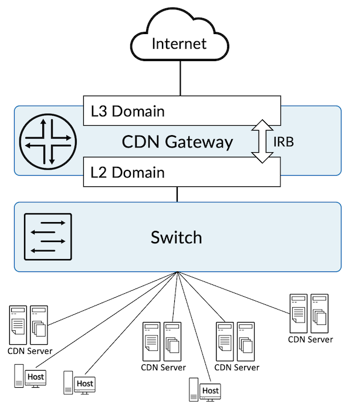
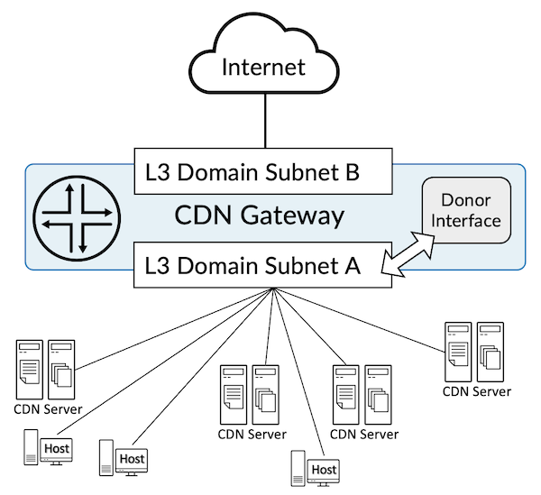
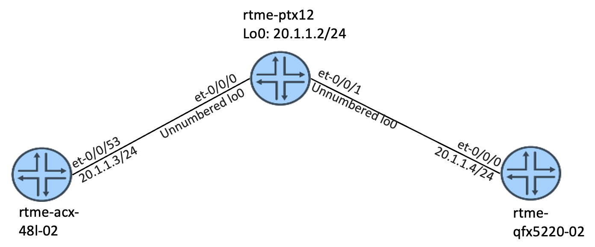
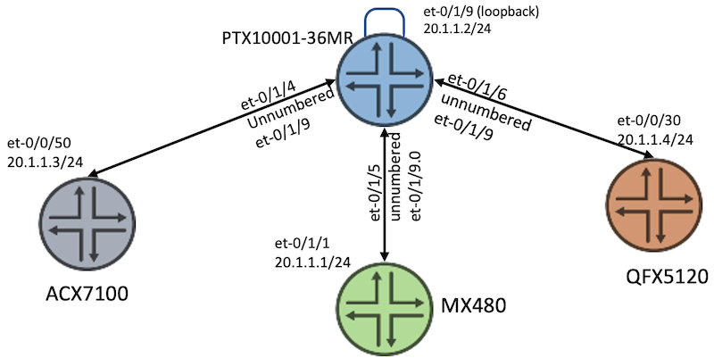
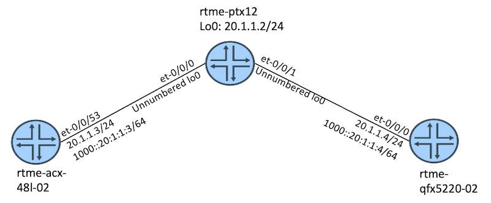
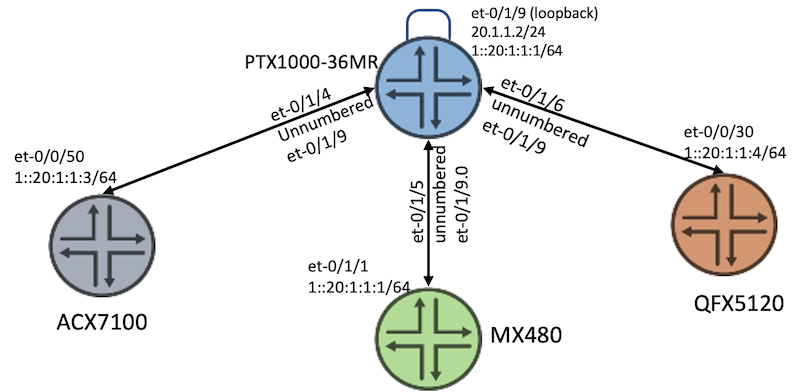

# Layer 3 Solution for CDN Gateway

**Ramdas Machat - 07/04/2022**


The world of CDN gateways is usually built around L2 domains and IRB, where a switch interconnects CDN servers, hosts and the L3 gateway. We propose a solution directly associating hosts and CDN servers at L3.

## Introduction

A Content Delivery Network (CDN) refers to the geographical distribution of a group of servers working together to provide fast delivery of the Internet content. Today, a lot of the internet's traffic is being served using CDNs and this is growing as the internet grows. There are a lot of benefits of using a CDN, including the delivery of website content with better performance and lower bandwidth consumption. Most importantly, global accessibility gives the end-user an enriched experience.

CDN building blocks include Point of Presence (PoP), cache servers with high capacity storage, and compute. Providers often have CDN servers attached to the CDN gateway in their PoP for many applications.

This document describes our L3 solution for the CDN Gateway and the benefits of that solution. CDN building blocks and server or PoP-related details are outside the scope of this document.

## CDN Gateway: L2 or L3 Solution

### L2 approach

In a traditional L2 solution, providers often have a switch connected to the CDN gateway, which acts as an L2 Domain while segregating the servers and hosts into different VLANs. The gateway is configured with IRB (Integrated Routing and Bridging) providing L3 connectivity to the host and users, and routing them to the Internet.

A lot of configuration is required on the switch and the gateway router to make these arrangements, including a bridge, VLAN and IRB. This is much more painful to manage in the long run.



### L3 approach

With the unnumbered interface, purely L3 configuration continues to deliver the required connection for the users and the CDN servers to route traffic to the Internet by eliminating the requirement of having L2 Switch, Bridge, and IRB-related configurations. Details of which are covered in the later section of this document.



## CDN L3 Solution with Unnumbered Interface

There are a lot of benefits of using our L3 solution in these networks

- Direct termination of the CDN gateways and hosts into a router, hence eliminating the L2 switch required in a traditional L2 solution
- No Layer 2 lookup for forwarding, an L3 lookup is enough
- Simpler configuration, making it easy to manage and maintain
- It works across IPv4, IPv6, and MPLS and is suitable for any network design requirement

### Details of the L3 solution

The L3 solution is made possible by using the unnumbered interface feature. It allows you the option to configure a "donor" physical or logical interface with a family IPv4 or IPv6 address. The "borrower" then inherits the IPv4 or IPv6 addresses from the "donor" interface.

### Donor

The donor interface is a physical or logical interface configured with an IPv4 or IPv6 address on the desired router. A single donor interface can donate its addresses to multiple physical interfaces.

See the example below for a sample configuration. The interface name can be a physical interface like "xe-0/0/0" or "et-0/0/0," or a logical interface like "loopback 0." Since a physical interface consumes a revenue port on the router, we recommend you use a logical loopback interface.

```
set interfaces <interface name> unit 0 family inet address 20.1.1.2/24
set interfaces <interface name> unit 0 family inet6 address 1::20:1:1:2/64
```

### Borrower

The borrower interface is a physical interface with an IPv4 or IPv6 address configured. This interface borrows the address associated with the donor interface described above. More than one physical interface can borrow from a single donor interface.

In the sample configuration below 'et-0/1/4', 'et-0/1/5', and 'et-0/1/6' are the borrower interface and 'et-0/1/9.0' is the donor interface (config for IPv4 and IPv6).

```
set interfaces et-0/1/4 unit 0 family inet unnumbered-address et-0/1/9.0
set interfaces et-0/1/4 unit 0 family inet6 unnumbered-address et-0/1/9.0
set interfaces et-0/1/5 unit 0 family inet unnumbered-address et-0/1/9.0
set interfaces et-0/1/5 unit 0 family inet6 unnumbered-address et-0/1/9.0
set interfaces et-0/1/6 unit 0 family inet unnumbered-address et-0/1/9.0
set interfaces et-0/1/6 unit 0 family inet6 unnumbered-address et-0/1/9.0
```

## L3 Solution Scenarios Tested in Our Lab

### IPv4 Testing in Our Lab with Logical Loopback Donor Interface

In this scenario, the solution only includes IPv4. The donor and borrower interfaces are configured on a PTX10001 router and the ACX, MX, and QFX devices are connected to the PTX router, on the same network.

The loopback interface unit 0 is associated with the default instance and is shared across different routing applications and when used with a routing-instance, you need to use a different IFL (Logical Interface) like a "lo0.1".



**Inventory**

- Node 1: ACX7100-48L
- CDN GW: PTX10003-80C
- Node 3: QFX5220

**Configurations**

PTX

```
set interfaces et-0/0/0 description "to rtme-acx-48l-02 et-0/0/53"
set interfaces et-0/0/0 unit 0 family inet unnumbered-address lo0.0
set interfaces et-0/0/1 description "to rtme-qfx5220-02 et-0/0/0"
set interfaces et-0/0/1 unit 0 family inet unnumbered-address lo0.0
set interfaces lo0 unit 0 family inet address 20.1.1.2/24 primary
```

ACX

```
set interfaces et-0/0/53 speed 100g
set interfaces et-0/0/53 unit 0 family inet address 20.1.1.3/24 
```

QFX

```
set interfaces et-0/0/0 unit 0 family inet address 20.1.1.4/24
```

After the configuration is applied to all the routers, we check the operations from each node.

PTX

```
regress@rtme-ptx12# run show route 20.1.1.2
inet.0: 20 destinations, 20 routes (18 active, 0 holddown, 2 hidden)
+ = Active Route, - = Last Active, * = Both

20.1.1.2/32        *[Local/0] 00:12:08
                       Local
regress@rtme-ptx12# run show arp
MAC Address       Address         Name                      Interface               Flags
ac:78:d1:23:ad:54 20.1.1.3        20.1.1.3                  et-0/0/0.0              none
9c:8a:cb:69:96:40 20.1.1.4        20.1.1.4                  et-0/0/1.0              none
Total entries: 2
regress@rtme-ptx12# run show interfaces descriptions
Interface       Admin Link Description
et-0/0/0        up    up   to rtme-acx-48l-02 et-0/0/53
et-0/0/1        up    up   to rtme-qfx5220-02 et-0/0/0
```

ACX

```
regress@rtme-acx-48l-02# run ping 20.1.1.2 
PING 20.1.1.2 (20.1.1.2) 56(84) bytes of data.
64 bytes from 20.1.1.2: icmp_seq=1 ttl=64 time=1.27 ms
64 bytes from 20.1.1.2: icmp_seq=2 ttl=64 time=1.24 ms
64 bytes from 20.1.1.2: icmp_seq=3 ttl=64 time=1.64 ms
^C
--- 20.1.1.2 ping statistics ---
3 packets transmitted, 3 received, 0% packet loss, time 2002ms
rtt min/avg/max/mdev = 1.249/1.389/1.642/0.183 ms
```

QFX

```
regress@rtme-qfx5220-02# run ping 20.1.1.2 
PING 20.1.1.2 (20.1.1.2) 56(84) bytes of data.
64 bytes from 20.1.1.2: icmp_seq=1 ttl=64 time=1.74 ms
64 bytes from 20.1.1.2: icmp_seq=2 ttl=64 time=1.60 ms
64 bytes from 20.1.1.2: icmp_seq=3 ttl=64 time=2.14 ms
^C
--- 20.1.1.2 ping statistics ---
3 packets transmitted, 3 received, 0% packet loss, time 2003ms
rtt min/avg/max/mdev = 1.600/1.831/2.147/0.233 ms
```

### IPv4 Testing in Our Lab with Physical Donor Interface

In this scenario, the solution covers only IPv4, where the donor and borrower interfaces are configured on the PTX10001 router and the ACX, MX, and QFX are connected to the PTX on the same network. Also, here the solution demonstrates how it works when using a virtual router instance and a physical interface.



**Inventory**:

- Node 1: ACX7100-48L
- Node 2: MX480
- CDN GW: PTX10001-36MR
- Node 3: QFX5220

As shown in the topology above (Figure4), the PTX10001 is configured with a donor interface "et-0/1/9", a physical interface connected in loopback mode. If you do not want to use a physical interface then a logical loopback interface can also be used. The interfaces et-0/1/4, et-0/1/5, and et-0/1/6 are the borrower interfaces, using the IPv4 address from the donor interface's IP address 20.1.1.1/24.

All of these interfaces are part of a virtual router instance.

The loopback interface unit 0 is associated with the default instance, you should configure unit 1 and for this loopback interface, "lo0.1" when configuring under a routing-instance.

These interfaces can also be configured as part of the default routing instance. In that case, you do not need to configure the routing-instances as shown in the example below. The default instance loopback is shared across different routing applications.

**Configurations**

PTX

```
set interfaces et-0/1/4 unit 0 family inet unnumbered-address et-0/1/9.0
set interfaces et-0/1/5 unit 0 family inet unnumbered-address et-0/1/9.0
set interfaces et-0/1/6 unit 0 family inet unnumbered-address et-0/1/9.0
set interfaces et-0/1/9 unit 0 family inet address 20.1.1.2/24
set routing-instances Internet instance-type virtual-router
set routing-instances Internet interface et-0/1/4.0
set routing-instances Internet interface et-0/1/5.0
set routing-instances Internet interface et-0/1/6.0
set routing-instances Internet interface et-0/1/9.0
```

MX

```
set interfaces et-0/1/1 unit 0 family inet address 20.1.1.1/24
```

ACX

```
set interfaces et-0/0/50 unit 0 family inet address 20.1.1.3/24
```

QFX

```
set interfaces et-0/0/30 unit 0 family inet address 20.1.1.4/24
```

After applying the configuration, validate the operations from each node.

PTX

```
regress@rtme-ptx10001-36mr-03# run show route table Internet.inet.0
Feb 02 05:16:08
Internet.inet.0: 2 destinations, 2 routes (2 active, 0 holddown, 0 hidden)
+ = Active Route, - = Last Active, * = Both
20.1.1.0/24        *[Direct/0] 00:20:16
                    >  via et-0/1/9.0
20.1.1.2/32        *[Local/0] 00:20:32
                       Local via et-0/1/9.0
regress@rtme-ptx10001-36mr-03# run show arp            
Feb 02 05:16:10
MAC Address       Address         Name                      Interface               Flags
c8:e7:f0:60:dc:7f 10.0.11.2       10.0.11.2                 et-0/0/4.0              none
40:b4:f0:e5:21:cf 10.0.14.1       10.0.14.1                 et-0/0/5.0              none
ac:78:d1:23:ad:44 10.0.12.2       10.0.12.2                 et-0/0/6.0              none
ac:78:d1:24:b4:49 10.0.18.2       10.0.18.2                 et-0/0/7.0              none
ac:78:d1:25:6a:98 20.1.1.3        20.1.1.3                  et-0/1/4.0              none
b0:a8:6e:2c:38:b4 20.1.1.1        20.1.1.1                  et-0/1/5.0              none
9c:8a:cb:69:96:b8 20.1.1.4        20.1.1.4                  et-0/1/6.0              none
```

MX

```
regress@rtme-mx-02# run ping 20.1.1.2 
PING 20.1.1.2 (20.1.1.2): 56 data bytes
64 bytes from 20.1.1.2: icmp_seq=0 ttl=64 time=1.150 ms
64 bytes from 20.1.1.2: icmp_seq=1 ttl=64 time=1.284 ms
64 bytes from 20.1.1.2: icmp_seq=2 ttl=64 time=1.503 ms
^C
--- 20.1.1.2 ping statistics ---
3 packets transmitted, 3 packets received, 0% packet loss
round-trip min/avg/max/stddev = 1.150/1.312/1.503/0.145 ms
```

ACX

```
regress@rtme-acx-48l-03# run ping 20.1.1.2 
PING 20.1.1.2 (20.1.1.2) 56(84) bytes of data.
64 bytes from 20.1.1.2: icmp_seq=1 ttl=64 time=0.731 ms
64 bytes from 20.1.1.2: icmp_seq=2 ttl=64 time=0.936 ms
^C
--- 20.1.1.2 ping statistics ---
2 packets transmitted, 2 received, 0% packet loss, time 1013ms
rtt min/avg/max/mdev = 0.731/0.833/0.936/0.102 ms
```

QFX

```
regress@rtme-qfx5220-02# run ping 20.1.1.2 
PING 20.1.1.2 (20.1.1.2) 56(84) bytes of data.
64 bytes from 20.1.1.2: icmp_seq=1 ttl=64 time=1.72 ms
64 bytes from 20.1.1.2: icmp_seq=2 ttl=64 time=0.849 ms
^C
--- 20.1.1.2 ping statistics ---
2 packets transmitted, 2 received, 0% packet loss, time 1001ms
rtt min/avg/max/mdev = 0.849/1.286/1.723/0.437 ms
```

### IPv6 Testing in Our Lab with Logical Loopback Donor Interface

In this scenario, the solution covers only IPv6, where the donor and borrower interfaces are configured on the PTX10003 router and the ACX and QFX are connected to the PTX on the same network.



**Inventory**:

- Node 1: ACX7100-48L
- CDN GW: PTX10003-80C
- Node 3: QFX5220

**Configurations:**

PTX

```
set interfaces et-0/0/0 description "to rtme-acx-48l-02 et-0/0/53"
set interfaces et-0/0/0 unit 0 family inet unnumbered-address lo0.0
set interfaces et-0/0/0 unit 0 family inet6 unnumbered-address lo0.0
set interfaces et-0/0/1 description "to rtme-qfx5220-02 et-0/0/0"
set interfaces et-0/0/1 unit 0 family inet unnumbered-address lo0.0
set interfaces et-0/0/1 unit 0 family inet6 unnumbered-address lo0.0
set interfaces lo0 unit 0 family inet address 20.1.1.2/24 primary
set interfaces lo0 unit 0 family inet6 address 1000::20:1:1:2/64 primary
```

ACX

```
set interfaces et-0/0/53 unit 0 family inet address 20.1.1.3/24
set interfaces et-0/0/53 unit 0 family inet6 address 1000::20:1:1:3/64
```

QFX

```
set interfaces et-0/0/0 unit 0 family inet address 20.1.1.4/24
set interfaces et-0/0/0 unit 0 family inet6 address 1000::20:1:1:4/64
```

After the configuration is applied to all the routers, validate the operations from each node.

PTX

```
regress@rtme-ptx12# run show ipv6 neighbors
IPv6 Address                            Linklayer Address  State       Exp   Rtr  Secure  Interface
1000::20:1:1:3                           ac:78:d1:23:ad:54  reachable   17    yes  no      et-0/0/0.0
1000::20:1:1:4                           9c:8a:cb:69:96:40  reachable   14    yes  no      et-0/0/1.0
fe80::9e8a:cbff:fe69:9640                9c:8a:cb:69:96:40  stale       951   yes  no      et-0/0/1.0
fe80::ae78:d1ff:fe23:ad54                ac:78:d1:23:ad:54  stale       1111  yes  no      et-0/0/0.0
Total entries: 4
regress@rtme-ptx12# run ping 1000::20:1:1:3
PING 1000::20:1:1:3(1000::20:1:1:3) 56 data bytes
64 bytes from 1000::20:1:1:3: icmp_seq=1 ttl=64 time=2.09 ms
64 bytes from 1000::20:1:1:3: icmp_seq=2 ttl=64 time=1.44 ms
64 bytes from 1000::20:1:1:3: icmp_seq=3 ttl=64 time=1.43 ms
^C
--- 1000::20:1:1:3 ping statistics ---
3 packets transmitted, 3 received, 0% packet loss, time 2002ms
rtt min/avg/max/mdev = 1.436/1.656/2.090/0.308 ms
regress@rtme-ptx12# run ping 1000::20:1:1:4
PING 1000::20:1:1:4(1000::20:1:1:4) 56 data bytes
64 bytes from 1000::20:1:1:4: icmp_seq=1 ttl=64 time=3.28 ms
64 bytes from 1000::20:1:1:4: icmp_seq=2 ttl=64 time=1.15 ms
64 bytes from 1000::20:1:1:4: icmp_seq=3 ttl=64 time=1.34 ms
^C
--- 1000::20:1:1:4 ping statistics ---
3 packets transmitted, 3 received, 0% packet loss, time 2002ms
rtt min/avg/max/mdev = 1.156/1.928/3.284/0.962 ms
```

ACX

```
regress@rtme-acx-48l-02# run ping 1000::20:1:1:2 
PING 1000::20:1:1:2(1000::20:1:1:2) 56 data bytes
64 bytes from 1000::20:1:1:2: icmp_seq=1 ttl=64 time=1.24 ms
64 bytes from 1000::20:1:1:2: icmp_seq=2 ttl=64 time=1.33 ms
64 bytes from 1000::20:1:1:2: icmp_seq=3 ttl=64 time=1.62 ms
^C
--- 1000::20:1:1:2 ping statistics ---
3 packets transmitted, 3 received, 0% packet loss, time 2002ms
rtt min/avg/max/mdev = 1.240/1.400/1.629/0.171 ms

```

QFX

```
regress@rtme-qfx5220-02# run ping 1000::20:1:1:2 
PING 1000::20:1:1:2(1000::20:1:1:2) 56 data bytes
64 bytes from 1000::20:1:1:2: icmp_seq=1 ttl=64 time=1.98 ms
64 bytes from 1000::20:1:1:2: icmp_seq=2 ttl=64 time=3.08 ms
64 bytes from 1000::20:1:1:2: icmp_seq=3 ttl=64 time=1.27 ms
^C
--- 1000::20:1:1:2 ping statistics ---
3 packets transmitted, 3 received, 0% packet loss, time 2002ms
rtt min/avg/max/mdev = 1.272/2.116/3.089/0.748 ms

```

### IPv6 Testing in Our Lab with Physical Donor Interface

In this scenario we tested IPv6, where the donor and borrower interfaces are configured on the PTX10001 router, and the ACX, MX and QFX devices are connected to the PTX router on the same network.



**Inventory**:

- Node 1: ACX7100-48L
- Node 2: MX480
- CDN GW: PTX10001-36MR
- Node 3: QFX5220

As seen in the topology above, the PTX10001 is configured with a donor interface "et-0/1/9", a physical interface connected in a loopback mode. If you do not want to use a physical interface a loopback interface can also be used. The interfaces et-0/1/4, et-0/1/5, and et-0/1/6 are the borrower interfaces, using the IPv6 address from the donor interface's IPv6 address 1::20:1:1:1/64. All of these interfaces are part of a virtual router instance. Because the loopback interface unit 0 is associated with the default instance, users should use unit 1 and "Lo0.1" for this loopback interface when configuring interfaces inside a routing-instance.

You can also configure these interfaces as part of the default routing instance. In that case, there is no need to configure the routing-instances as seen in the example below. The default instance loopback is shared across different routing applications.

**Configurations:**

PTX

```
set interfaces et-0/1/4 unit 0 family inet6 unnumbered-address et-0/1/9.0
set interfaces et-0/1/5 unit 0 family inet6 unnumbered-address et-0/1/9.0
set interfaces et-0/1/6 unit 0 family inet6 unnumbered-address et-0/1/9.0
set interfaces et-0/1/9 unit 0 family inet6 address 1::20:1:1:2/64
set protocols router-advertisement interface et-0/1/9.0 prefix 1::20:1:1:2/64
```

MX

```
set interfaces et-0/1/1 unit 0 family inet address 20.1.1.1/24
set interfaces et-0/1/1 unit 0 family inet6 address 1::20:1:1:1/64
set protocols router-advertisement interface et-0/1/1.0 prefix 1::20:1:1:1/64
```

ACX

```
set interfaces et-0/0/50 unit 0 family inet address 20.1.1.3/24
set interfaces et-0/0/50 unit 0 family inet6 address 1::20:1:1:3/64
set protocols router-advertisement interface et-0/0/50.0 prefix 1:0:0:0:20:1:1:3/64
```

QFX

```
set interfaces et-0/0/30 unit 0 family inet address 20.1.1.4/24
set interfaces et-0/0/30 unit 0 family inet6 address 1::20:1:1:4/64
set protocols router-advertisement interface et-0/0/30.0 prefix 1::20:1:1:4/64
```

After applying the configuration, validate the operations from each node.

PTX

```
regress@rtme-ptx10001-36mr-03# run show route table Internet.inet6. 
Internet.inet6.0: 6 destinations, 6 routes (6 active, 0 holddown, 0 hidden)
+ = Active Route, - = Last Active, * = Both
1::/64             *[Direct/0] 00:59:07
                    >  via et-0/1/9.0
1::20:1:1:2/128    *[Local/0] 00:59:07
                       Local via et-0/1/9.0
fe80::6a22:8eff:fe24:e03f/128
                   *[Local/0] 00:58:39
                       Local via et-0/1/4.0
fe80::6a22:8eff:fe24:e049/128
                   *[Local/0] 00:07:40
                       Local via et-0/1/5.0
fe80::6a22:8eff:fe24:e071/128
                   *[Local/0] 00:59:07
                       Local via et-0/1/9.0
ff02::2/128        *[INET6/0] 17:53:10
                       MultiRecv
regress@rtme-ptx10001-36mr-03# run show ipv6 neighbors    
IPv6 Address                            Linklayer Address  State       Exp   Rtr  Secure  Interface               
1::20:1:1:1                              b0:a8:6e:2c:38:b4  reachable   29    yes  no      et-0/1/5.0              
1::20:1:1:3                              ac:78:d1:25:6a:98  reachable   4     yes  no      et-0/1/4.0              
fe80::ae78:d1ff:fe25:6a98                ac:78:d1:25:6a:98  stale       835   yes  no      et-0/1/4.0              
fe80::b2a8:6eff:fe2c:38b4                b0:a8:6e:2c:38:b4  stale       1036  yes  no      et-0/1/5.0              
Total entries: 4.0
```

ACX

```
regress@rtme-acx-48l-03# run ping 1::20:1:1:2 
PING 1::20:1:1:2(1::20:1:1:2) 56 data bytes
64 bytes from 1::20:1:1:2: icmp_seq=1 ttl=64 time=1.02 ms
64 bytes from 1::20:1:1:2: icmp_seq=2 ttl=64 time=0.779 ms
^C
--- 1::20:1:1:2 ping statistics ---
2 packets transmitted, 2 received, 0% packet loss, time 1001ms
rtt min/avg/max/mdev = 0.779/0.901/1.023/0.122 ms
```

MX

```
regress@rtme-mx-02# run ping 1::20:1:1:2 
PING6(56=40+8+8 bytes) 1::20:1:1:1 --> 1::20:1:1:2
16 bytes from 1::20:1:1:2, icmp_seq=0 hlim=64 time=1.042 ms
16 bytes from 1::20:1:1:2, icmp_seq=1 hlim=64 time=1.169 ms
^C
--- 1::20:1:1:2 ping6 statistics ---
2 packets transmitted, 2 packets received, 0% packet loss
round-trip min/avg/max/std-dev = 1.042/1.106/1.169/0.063 ms
```

### Router software details

PTX10003-80

```
regress@rtme-ptx12> show version 
Hostname: rtme-ptx12
Model: ptx10003-80c
Junos: 21.4R1.15-EVO
Yocto: 2.2.1
Linux Kernel: 4.8.28-WR2.2.1_standard-g2f7a61a3742a
JUNOS-EVO OS 64-bit [junos-evo-install-ptx-fixed-x86-64-21.4R1.15-EVO]
```

PTX10001-36MR

```
regress@rtme-ptx10001-36mr-03> show version 
Hostname: rtme-ptx10001-36mr-03
Model: ptx10001-36mr
Junos: 21.4R1.15-EVO
```

ACX7100-48L

```
regress@rtme-acx-48l-02> show version 
Hostname: rtme-acx-48l-02
Model: ACX7100-48L
Junos: 21.4R2.7-EVO
Yocto: 2.2.1
Linux Kernel: 4.8.28-WR2.2.1_standard-g59262e2
JUNOS-EVO OS 64-bit [junos-evo-install-acx-f-x86-64-21.4R2.7-EVO]
```

QFX5220-01

```
regress@rtme-qfx5220-01> show version 
Model: qfx5220-32cd
Junos: 19.4R1.9-EVO
Junos Package: junos-evo-install-qfx-ms-fixed-x86-64-19.4R1.9-EVO.iso
Yocto: 2.2.1
Linux Kernel: 4.8.28-WR2.2.1_standard-g135e846
```

QFX5220-02

```
regress@rtme-qfx5220-02> show version 
Model: qfx5220-32cd
Junos: 19.4R1.9-EVO
Junos Package: junos-evo-install-qfx-ms-fixed-x86-64-19.4R1.9-EVO.iso
Yocto: 2.2.1
Linux Kernel: 4.8.28-WR2.2.1_standard-g135e846
```

MX-02

```
regress@rtme-mx-02# run show version 
Hostname: rtme-mx-02
Model: mx480
Junos: 22.1R1.10
```

## Conclusion

Unnumbered interfaces are an alternative arrangement in a Provider network with CDN gateways and the users and CDN servers can be directly connected avoiding complex configuration, simply routing the traffic to the internet without the use of any L2 and IRB related features.

In follow up articles, we will cover the feature supported (or not) on unnumbered interfaces.

## Acknowledgements

Thanks to Madison Summers, Frank Reade and Kireeti Kompella for their comments and review.

## Glossary

- CDN: Content Delivery Network
- CE: Customer Edge
- IRB: Integrated Routing and Bridging
- L2/L3: Layer2/3
- MPLS: Multiprotocol Label Switching
- PE: Provider Edge
- POP: Point of Presence
