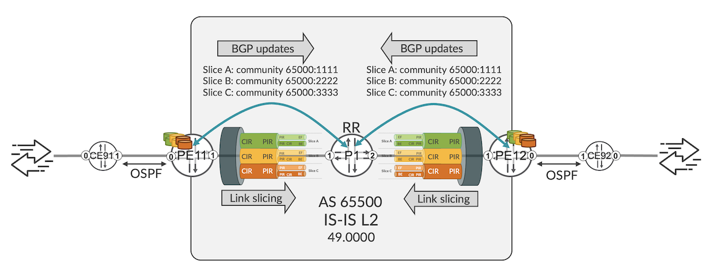

# Link Slicing with MPLS and SRv6 Underlays Part 2

**Krzysztof Szarkowicz - 07/30/2023**

Another use case for link slicing:  instead of data plane identifiers, control plane identifiers are used. Control plane protocols exchange the information that allows to classify packets to link slices.

## Introduction

The [Link Slicing with MPLS and SRv6 Underlays](https://juniper.github.io/techposts/link-slicing-with-mpls-and-srv6-underlays/article) blog post discussed the guaranteed link slicing feature, with MPLS and SRv6 as underlay transport. The blog post used data plane identifiers, like for example MPLS labels, or certain bits in SRv6 SID (used as the destination IPv6 address of the outer IP header) as slice identifier. It used firewall filters to match for these slice identifiers in the packets, and assign packets to slices.

This blog post outlines another use case for link slicing. This time, instead of data plane identifiers, control plane identifiers are used. That is, control plane protocols exchange the information that allows to classify packets to link slices.   This blog post uses L3VPN, where BGP distributes information to identify the slice.

This blog post is based on the capabilities of Junos 23.2R1 running on MX Series routers. Configuration and operational command outputs have been collected on vMX and MX in our labs.

You can test yourself all the concepts described in this article, we created labs in JCL and vLabs:
[JCL (Junivators and partners)](https://portal.cloudlabs.juniper.net/RM/Topology?b=a2061aae-e6a5-4e60-87f6-255bd332dda6&d=c78ae7c7-e93b-4708-813e-109fd780f301)
[vLabs (open to all)](https://portal.cloudlabs.juniper.net/RM/Topology?b=b8834f32-caf6-44d8-8e63-b20146a000ec&d=2f99da30-8756-4d15-8822-d648498c7aea)

In this blog post, following IP addressing is used:

Transport Infrastructure (P/PE)

- Router-ID: 198.51.100.<XX>
- Loopback: 2001:db8:bad:cafe::<XX>/128
- SRv6 locator: fc01:0:<XX>::/48
- Core Links: 2001:db8:beef::<XXYY>:<local-ID>/112

PE-CE links:

- IPv4: <VLAN>.<XX>.<YY>.<local-ID>/24
- IPv6: 2001:db8:babe:face:<VLAN>::<XXYY>:<local-ID>/112

VPN (Virtual Private Network) Loopbacks (CE/PE):

- 192.168.<VLAN>.<XX>/32
- 2001:db8:abba:<VLAN>::<XX>/128

## Architecture and Topology

The network topology used for this blog post is outlined Figure 1.



The topology is very simple, but suitable to discuss the main topic of this blog post: guaranteed link slicing with control plane slice identification. Routers PE11 and PE12 exchange L3VPN prefixes via BGP (through router P1, acting as BGP route reflector). Following five L3VPNs are configured on PE11 and PE12:

Table: L3VPN instances used in the blog post

| Name | Underlay | PE-CE VLANs | Generated Traffic | Slice |
|:--|:--|:--|:--|:--|
| RI-VRF15 | SRv6 | 15 | 2Mbps | A |
| RI-VRF16 | SRv6 | 16 | 2Mbps | B |
| RI-VRF17 | SR-MPLS | 17 | 2Mbps | C |
| RI-VRF25 | SRv6 | 252627 | 2Mbps2Mbps2Mbps | ABC |
| RI-VRF35 | SR-MPLS | 353637 | 2Mbps2Mbps2Mbps | ABC |

Underlay transport is configured to support both SR-MPLS and SRv6 (for example, migration scenario from MPLS to SRv6, where both types of underlay might be required during migration). As visible from Table 1, some VPNs use SR-MPLS as the underlay transport, and some other VPNs use SRv6. Also, the intent is to implement guaranteed link slicing on PE uplinks (PE11 to P1, PE12 to P2).

The link slicing concepts are similar to the concepts discussed in the [Link Slicing with MPLS and SRv6 Underlays](https://juniper.github.io/techposts/link-slicing-with-mpls-and-srv6-underlays/article) blog post. The reader should be familiar with these concepts, so they will not be repeated here.

In this blog post, the slice assignment is achieved with control plane. What does it mean exactly? The slice membership is signaled via some control plane attribute. In this blog, we are using BGP standard community for this purpose, as follows:

- Slice A: community CM-NS-A: 65000:1111
- Slice B: community CM-NS-B: 65000:2222
- Slice C: community CM-NS-C: 65000:3333

When PE11 advertises L3VPN prefixes to PE12, apart from attaching appropriate route target, PE11 attaches as well one of the above standard community, to signal to PE12, what slice should be used on the PE12 to P1 link, when traffic is sent from PE12 to PE11. Later, when at PE12 traffic arrives from CE92 with some destination IP address towards CE91, the traffic will be subject to slice-aware H-QoS treatment on PE12 to P1 link. Slice selection happens based on standard community announced previously by PE11. Similar configuration, just in opposite direction, can be deployed to implement link slicing on PE11 to P1 link.

In order to configure this kind of slicing, following is needed:

- General link slicing infrastructure configuration on PE11 and PE12 (network slices; QoS: classifiers, traffic control profiles, scheduler-maps, schedulers; anchoring of H-QoS traffic control profiles to the sliced interface). This configuration is the same, as already discussed in the [Link Slicing with MPLS and SRv6 Underlays](https://juniper.github.io/techposts/link-slicing-with-mpls-and-srv6-underlays/article) blog post, so it is not repeated here.
- Signaling the slice intent via control plane
- Accepting the slice intent and programming appropriate states in RIB and FIB to assign the traffic to appropriate slice

## Slice Intent Signaling via Control Plane

Let's start with the signaling of the slice intent. As discussed earlier, in this blog the slice intent is signaled via BGP standard community. For the first three L3VPNs, entire L3VPN (all prefixes advertised from given L3VPN) belong to a single slice. Example configuration for RI-VRF15 is presented in Configuration 1:

```
1 policy-options {
2     policy-statement PS-VRF-15 {
3         then {
4             community add CM-NS-A;
5             community add RT-15;
6             accept;
7         }
8     }
9     community CM-NS-A members 65000:1111;
10     community RT-15 members target:65000:15;
11 }
12 routing-instances {
13     RI-VRF15 {
14         (...)
15         vrf-export PS-VRF-15;
16         vrf-target target:65000:15;
17     }
18 }
```

*Configuration 1: Slice intent signaling for RI-VRF15*

It is pretty standard configuration, attaching some route target and some standard community during VRF export. Similar configuration is applied to RI-VRF16 and RI-VRF17 -- obviously using different communities. Quick verification (CLI-Output 1) confirms that correct communities are attached to all prefixes announced from RI-VRF15, RI-VRF16 and RI-VRF17:

```
1 root@PE11> show route advertising-protocol bgp 2001:db8:bad:cafe::1 table RI-VRF1 detail | match "inet.0|announced|Communities" 
2 RI-VRF15.inet.0: 10 destinations, 10 routes (10 active, 0 holddown, 0 hidden)
3 * 15.11.91.0/24 (1 entry, 1 announced)
4      Communities: 65000:1111 target:65000:15
5 * 15.81.91.0/24 (1 entry, 1 announced)
6      Communities: 65000:1111 target:65000:15
7 * 192.168.15.11/32 (1 entry, 1 announced)
8      Communities: 65000:1111 target:65000:15
9 * 192.168.15.91/32 (1 entry, 1 announced)
10      Communities: 65000:1111 target:65000:15
11 RI-VRF16.inet.0: 10 destinations, 10 routes (10 active, 0 holddown, 0 hidden)
12 * 16.11.91.0/24 (1 entry, 1 announced)
13      Communities: 65000:2222 target:65000:16
14 * 16.81.91.0/24 (1 entry, 1 announced)
15      Communities: 65000:2222 target:65000:16
16 * 192.168.16.11/32 (1 entry, 1 announced)
17      Communities: 65000:2222 target:65000:16
18 * 192.168.16.91/32 (1 entry, 1 announced)
19      Communities: 65000:2222 target:65000:16
20 RI-VRF17.inet.0: 10 destinations, 10 routes (10 active, 0 holddown, 0 hidden)
21 * 17.11.91.0/24 (1 entry, 1 announced)
22      Communities: 65000:3333 target:65000:17
23 * 17.81.91.0/24 (1 entry, 1 announced)
24      Communities: 65000:3333 target:65000:17
25 * 192.168.17.11/32 (1 entry, 1 announced)
26      Communities: 65000:3333 target:65000:17
27 * 192.168.17.91/32 (1 entry, 1 announced)
28      Communities: 65000:3333 target:65000:17
```

*CLI-Output 1: RI-VRF1x L3VPN prefix advertisement from PE11*

For RI-VRF25 and RI-VRF35 we would like to implement slicing capability on per-prefix basis, and not on per-VRF basis, as done for RI-VRF15, RI-VRF16 and RI-VRF17. Hence, some prefixes advertised from RI-VRF25 and RI-VRF35 should be announced with community CM-NS-A 65000:1111, some other prefixes with community CM-NS-B 65000:2222, and yet some other prefixes with community CM-NS-C 65000:2222. Which prefixes belong to which slice is deployment specific. In the blog post, just to illustrate the concept, we attach different 'slice' community, based on the incoming PE-CE interface (RT-VRF-25 has three PE-CE interfaces + loopback interface), as shown in Configuration 2. Similar configuration is done for RI-VRF35 (not shown for brevity).

```
1 policy-options {
2     policy-statement PS-VRF-25 {
3         term TR-VPN {
4             then community add RT-25;
5         }
6         term TR-NS-A {
7             from interface [ ge-0/0/0.25 lo0.25 ];
8             then community add CM-NS-A;
9         }
10         term TR-NS-B {
11             from interface ge-0/0/0.26;
12             then community add CM-NS-B;
13         }
14         term TR-NS-C {
15             from interface ge-0/0/0.27;
16             then community add CM-NS-C;
17         }
18         then accept;
19     }
20     community CM-NS-A members 65000:1111;
21     community CM-NS-B members 65000:2222;
22     community CM-NS-C members 65000:3333;
23     community RT-25 members target:65000:25;
24 }
```

*Configuration 2: Slice intent signaling for RI-VRF25*

Quick verification confirms the expected results (CLI-Output 2):

```
1 root@PE11> show route advertising-protocol bgp 2001:db8:bad:cafe::1 table RI-VRF25.inet.0 detail | match "inet.0|announced|Communities" 
2 RI-VRF25.inet.0: 24 destinations, 24 routes (24 active, 0 holddown, 0 hidden)
3 * 25.11.91.0/24 (1 entry, 1 announced)
4      Communities: 65000:1111 target:65000:25
5 * 25.81.91.0/24 (1 entry, 1 announced)
6      Communities: 65000:1111 target:65000:25
7 * 26.11.91.0/24 (1 entry, 1 announced)
8      Communities: 65000:2222 target:65000:25
9 * 26.81.91.0/24 (1 entry, 1 announced)
10      Communities: 65000:2222 target:65000:25
11 * 27.11.91.0/24 (1 entry, 1 announced)
12      Communities: 65000:3333 target:65000:25
13 * 27.81.91.0/24 (1 entry, 1 announced)
14      Communities: 65000:3333 target:65000:25
15 * 192.168.25.11/32 (1 entry, 1 announced)
16      Communities: 65000:1111 target:65000:25
17 * 192.168.25.91/32 (1 entry, 1 announced)
18      Communities: 65000:1111 target:65000:25
19 * 192.168.26.91/32 (1 entry, 1 announced)
20      Communities: 65000:2222 target:65000:25
21 * 192.168.27.91/32 (1 entry, 1 announced)
22      Communities: 65000:3333 target:65000:25
```

*CLI-Output 2: RI-VRF25 L3VPN prefix advertisement from PE11*

All prefixes announced by PE11 from RI-VRF25 have the same route target (target:65000:25). However, standard community, used for slice identification, vary.

Again, this is very simple example, to show the configuration of the per-prefix slice intent. Any matching condition possible in route policy could be used to differentiate prefixes, and to attach different community used to signal slice intent.

Now, on receiving side (PE12), we can check if the prefixes are properly received. For example, let's verify prefixes assigned to Slice A, i.e., prefixes with community CM-NS-A 65000:1111 (CLI-Output 3).

```
1 root@PE12> show route community-name CM-NS-A table RI-VRF 
2 
3 RI-VRF15.inet.0: 10 destinations, 10 routes (10 active, 0 holddown, 0 hidden)
4 @ = Routing Use Only, # = Forwarding Use Only
5 + = Active Route, - = Last Active, * = Both
6 
7 15.11.91.0/24      *[BGP/170] 03:27:10, localpref 100, from 2001:db8:bad:cafe::1
8                       AS path: I, validation-state: unverified
9                     >  to fe80::5604:dff:fe00:7b45 via ge-0/0/1.0, SRv6 SID: fc01:0:11:0:15::, SRV6-Tunnel, Dest: fc01:0:11::
10 15.81.91.0/24      *[BGP/170] 03:27:10, MED 2, localpref 100, from 2001:db8:bad:cafe::1
11                       AS path: I, validation-state: unverified
12                     >  to fe80::5604:dff:fe00:7b45 via ge-0/0/1.0, SRv6 SID: fc01:0:11:0:15::, SRV6-Tunnel, Dest: fc01:0:11::
13 192.168.15.11/32   *[BGP/170] 03:27:10, localpref 100, from 2001:db8:bad:cafe::1
14                       AS path: I, validation-state: unverified
15                     >  to fe80::5604:dff:fe00:7b45 via ge-0/0/1.0, SRv6 SID: fc01:0:11:0:15::, SRV6-Tunnel, Dest: fc01:0:11::
16 192.168.15.91/32   *[BGP/170] 03:27:10, MED 1, localpref 100, from 2001:db8:bad:cafe::1
17                       AS path: I, validation-state: unverified
18                     >  to fe80::5604:dff:fe00:7b45 via ge-0/0/1.0, SRv6 SID: fc01:0:11:0:15::, SRV6-Tunnel, Dest: fc01:0:11::
19 
20 RI-VRF16.inet.0: 10 destinations, 10 routes (10 active, 0 holddown, 0 hidden)
21 
22 RI-VRF17.inet.0: 10 destinations, 10 routes (10 active, 0 holddown, 0 hidden)
23 
24 RI-VRF25.inet.0: 24 destinations, 24 routes (24 active, 0 holddown, 0 hidden)
25 @ = Routing Use Only, # = Forwarding Use Only
26 + = Active Route, - = Last Active, * = Both
27 
28 25.11.91.0/24      *[BGP/170] 03:27:10, localpref 100, from 2001:db8:bad:cafe::1
29                       AS path: I, validation-state: unverified
30                     >  to fe80::5604:dff:fe00:7b45 via ge-0/0/1.0, SRv6 SID: fc01:0:11:0:25::, SRV6-Tunnel, Dest: fc01:0:11::
31 25.81.91.0/24      *[BGP/170] 03:27:10, MED 2, localpref 100, from 2001:db8:bad:cafe::1
32                       AS path: I, validation-state: unverified
33                     >  to fe80::5604:dff:fe00:7b45 via ge-0/0/1.0, SRv6 SID: fc01:0:11:0:25::, SRV6-Tunnel, Dest: fc01:0:11::
34 192.168.25.11/32   *[BGP/170] 03:27:10, localpref 100, from 2001:db8:bad:cafe::1
35                       AS path: I, validation-state: unverified
36                     >  to fe80::5604:dff:fe00:7b45 via ge-0/0/1.0, SRv6 SID: fc01:0:11:0:25::, SRV6-Tunnel, Dest: fc01:0:11::
37 192.168.25.91/32   *[BGP/170] 03:27:10, MED 1, localpref 100, from 2001:db8:bad:cafe::1
38                       AS path: I, validation-state: unverified
39                     >  to fe80::5604:dff:fe00:7b45 via ge-0/0/1.0, SRv6 SID: fc01:0:11:0:25::, SRV6-Tunnel, Dest: fc01:0:11::
40 
41 RI-VRF35.inet.0: 24 destinations, 24 routes (24 active, 0 holddown, 0 hidden)
42 @ = Routing Use Only, # = Forwarding Use Only
43 + = Active Route, - = Last Active, * = Both
44 
45 35.11.91.0/24      *[BGP/170] 03:27:10, localpref 100, from 2001:db8:bad:cafe::1
46                       AS path: I, validation-state: unverified
47                     >  to fe80::5604:dff:fe00:7b45 via ge-0/0/1.0, Push 20, Push 100011(top)
48 35.81.91.0/24      *[BGP/170] 03:27:10, MED 2, localpref 100, from 2001:db8:bad:cafe::1
49                       AS path: I, validation-state: unverified
50                     >  to fe80::5604:dff:fe00:7b45 via ge-0/0/1.0, Push 20, Push 100011(top)
51 192.168.35.11/32   *[BGP/170] 03:27:10, localpref 100, from 2001:db8:bad:cafe::1
52                       AS path: I, validation-state: unverified
53                     >  to fe80::5604:dff:fe00:7b45 via ge-0/0/1.0, Push 20, Push 100011(top)
54 192.168.35.91/32   *[BGP/170] 03:27:10, MED 1, localpref 100, from 2001:db8:bad:cafe::1
55                       AS path: I, validation-state: unverified
56                     >  to fe80::5604:dff:fe00:7b45 via ge-0/0/1.0, Push 20, Push 100011(top)
```

*CLI-Output 3: Slice A prefixes on PE12*

As you can see, all RI-VRF15 prefixes, and no single prefix in RI-VRF16 and RI-VRF17, received from PE11, are displayed (please compare with CLI-Output 1), as well as four prefixes in RI-VRF25 and four prefixes in RI-VRF35 are shown (please compare with CLI-Output 2). Please also note, some packets destined to some prefixes will be SRv6 encapsulated (e.g., RI-VRF15, RI-VRF25), where for some other prefixes MPLS encapsulation (e.g., RI-VRF35) will be used (please compare with Table 1).

## Realizing the Slice Intent Signaled via Control Plane

So far, everything looks good. PE11 signaled via control plane (BGP) it's slice intent, and PE12 received this slice intent. Now, the question is, how PE12 uses this slice intent to actually assign packets received from CE92 to appropriate slices and therefore accomplish guaranteed link slicing?

In the [Link Slicing with MPLS and SRv6 Underlays](https://juniper.github.io/techposts/link-slicing-with-mpls-and-srv6-underlays/article) blog post a firewall filter was used for that purpose. In order to deploy firewall filter, data plane slice identification (i.e., predefined MPLS label ranges, or predefined values in certain bits of destination IPv6 address) must be known, and configured as matching condition in the firewall filter. In this blog, MPLS labels are assigned dynamically, and also in SRv6 SIDs we didn't specified any concrete field to denote slice ID. Moreover, prefixes that should be assigned to different slices, can use the same SRv6 SID (RI-VRF25, RI-VRF35)

This blog post utilizes lookup entry for assigning packets to slices. When packets arrive to the router, and hit some lookup entry in the FIB, the packet is subject to the execution of actions, which are part of lookup entry. Typically, programmed FIB info contains next-hop, where the packet should be sent, or encapsulation to be used, when the PE-CE packet should be encapsulated in MPLS ore SRv6 tunnel, before being sent to the core. There could be some additional information than can be programed, when the lookup entry is created. Namely Slice ID!

So, when packet hits such lookup entry, apart from being routed via appropriate next-hop, with appropriate encapsulation (MPLS or SRv6), if Slice ID is programmed, packet will be assigned to appropriate slice, and undergo slice specific H-QoS treatment, when forwarded over the uplink towards P1.

Programing slice ID in the lookup entry happens via a route policy attached to the forwarding-table (Configuration 3).

```
1 policy-options {
2     policy-statement PS-LOAD-BALANCE {
3         then load-balance per-packet;
4     }
5     policy-statement PS-NS {
6         term TR-NS-A {
7             from community CM-NS-A;
8             then slice NS-A;
9         }
10         term TR-NS-B {
11             from community CM-NS-B;
12             then slice NS-B;
13         }
14         term TR-NS-C {
15             from community CM-NS-C;
16             then slice NS-C;
17         }
18     }
19     community CM-NS-A members 65000:1111;
20     community CM-NS-B members 65000:2222;
21     community CM-NS-C members 65000:3333;
22 }
23 routing-options {
24     forwarding-table {
25         export [ PS-NS PS-LOAD-BALANCE ];
26     }
27 }
```

*Configuration 3: Slice ID programming in the lookup entry*

Again, it is pretty straight forward. In the route policy we are matching for the control plane attributes, that we are using do denote the slice ID. In this blog, BGP community attribute is used for that purpose, so we are matching for appropriate community values. However, the Junos link slicing framework has no restrictions here. Any match condition in route policy can be used to assign matched prefixes the slices. When lookup entries for matched prefixes are programmed in the forwarding table, in addition to regular FIB info (next-hop, encapsulation, ...) slice ID will be programmed as well.

So, let's check these lookup entries, for example in RI-VRF25 (CLI-Output 4).

```
1 root@PE12> show route table RI-VRF25.inet.0 protocol bgp expanded-nh detail | match "^$|announced|slice" 
2 
3 25.11.91.0/24 (1 entry, 1 announced)
4 Chain (0x74e97c4) Index:873 Slice: Gencfg-id 3, Slice-id 1
5 
6 25.81.91.0/24 (1 entry, 1 announced)
7 Chain (0x74e97c4) Index:873 Slice: Gencfg-id 3, Slice-id 1
8 
9 26.11.91.0/24 (1 entry, 1 announced)
10 Chain (0x74e9834) Index:874 Slice: Gencfg-id 2, Slice-id 2
11 
12 26.81.91.0/24 (1 entry, 1 announced)
13 Chain (0x74e9834) Index:874 Slice: Gencfg-id 2, Slice-id 2
14 
15 27.11.91.0/24 (1 entry, 1 announced)
16 Chain (0x74e9984) Index:875 Slice: Gencfg-id 1, Slice-id 3
17 
18 27.81.91.0/24 (1 entry, 1 announced)
19 Chain (0x74e9984) Index:875 Slice: Gencfg-id 1, Slice-id 3
20 
21 192.168.25.11/32 (1 entry, 1 announced)
22 Chain (0x74e97c4) Index:873 Slice: Gencfg-id 3, Slice-id 1
23 
24 192.168.25.91/32 (1 entry, 1 announced)
25 Chain (0x74e97c4) Index:873 Slice: Gencfg-id 3, Slice-id 1
26 
27 192.168.26.91/32 (1 entry, 1 announced)
28 Chain (0x74e9834) Index:874 Slice: Gencfg-id 2, Slice-id 2
29 
30 192.168.27.91/32 (1 entry, 1 announced)
31 Chain (0x74e9984) Index:875 Slice: Gencfg-id 1, Slice-id 3
```

*CLI-Output 4: Slice ID programming for RI-VRF25 prefixes*

Looking good! We see some slide IDs in the routing entries. However, these IDs are numerical, and the network slices are configured with names (see the[ Link Slicing with MPLS and SRv6 Underlays](https://juniper.github.io/techposts/link-slicing-with-mpls-and-srv6-underlays/article) blog post, Configuration 1). We will discuss later in this blog post, how to find correlation between slice ID and slice name.

In CLI-Output 4 only BGP prefixes, i.e., prefixes received by PE12 from PE11 (via P1, as BGP RR) are verified. All these prefixes had some slice community attached (Configuration 1, Configuration 2, CLI-Output 1, CLI-Output 2), and therefore, when lookup entries were programmed in the forwarding table, slice ID was added to the lookup entry.

However, apart from BGP prefixes, there are some other prefixes as well. In this blog post, OSPFv3 is used as PE-CE protocol, so let's check OSPFv3 prefixes as well (CLI-Output 5).

```
1 root@PE12> show route table RI-VRF25.inet.0 protocol ospf3 expanded-nh detail | match "^$|announced|slice"  
2 
3 25.82.92.0/24 (1 entry, 1 announced)
4 
5 26.82.92.0/24 (1 entry, 1 announced)
6 
7 27.82.92.0/24 (1 entry, 1 announced)
8 
9 192.168.25.92/32 (1 entry, 1 announced)
10 
11 192.168.26.92/32 (1 entry, 1 announced)
12 
13 192.168.27.92/32 (1 entry, 1 announced)
```

*CLI-Output 5: Prefixes received over PE-CE protocol on PE12*

It should be no surprise that lookup entries for these prefixes are not associated with any slice. The reason is, these prefixes didn't had any slice community attached, so they were not matched by the forwarding table policy (Configuration 3), and therefore programmed in the forwarding table without slice association -- they stay in the default slice. Additionally, PE-CE link in this blog post is not sliced, so all traffic sent over PE-CE link is subject to classical, flat (8 queues) QoS, regardless of any eventual slice assignment.

## Guaranteed Link Slicing Verification

Once all configuration and basic control plane verification is done, let's push some traffic for data plane verification as well. In this blog post, following basic QoS parameters are used for slices (please refer to the [Link Slicing with MPLS and SRv6 Underlays](https://juniper.github.io/techposts/link-slicing-with-mpls-and-srv6-underlays/article) blog post regarding configuration details of slice QoS):

Table: Slice QoS profiles

| Slice Name | min BW | max BW | Queues |
|:--|:--|:--|:--|
| NS-A | 17Mbps | 17Mbps | FC-EF: strict-high, 80% (rate limited)FC-BE: low, remaining slice BW |
| NS-B | 2Mbps | 3.5Mbps | FC-EF: strict-high, 80% (rate limited)FC-BE: low, remaining slice BW |
| NS-C | 1Mbps | 3.3Mbps | FC-EF: strict-high, 80% (rate limited)FC-BE: low, remaining slice BW |

Traffic generator is connected to CE91 and CE92, generating 2 Mbps per PE-CE VLAN (see Table 1): 1 Mbps in EF traffic class + 1 Mbps in BE traffic class. In total, traffic generators are sending 18 Mbps (6 Mbps in each slice: 3 Mbps EF + 3 Mbps BE in each slice).

Let's check slice statistics (CLI-Output 6).

```
1 root@PE12> show interfaces queue ge-0/0/1 slice NS-A 
2 Slice : NS-A (Index : 1)
3   Anchor interface : ge-0/0/1 (Index : 150)
4 Forwarding classes: 16 supported, 5 in use
5 Egress queues: 8 supported, 5 in use
6 Queue: 0, Forwarding classes: FC-BE
7   Queued:
8     Packets              :              44664184                   293 pps
9     Bytes                :           59193375104               3115792 bps
10   Transmitted:
11     Packets              :              44664184                   293 pps
12     Bytes                :           59193375104               3115792 bps
13     Tail-dropped packets :                     0                     0 pps
14 (...)
15 Queue: 7, Forwarding classes: FC-EF
16   Queued:
17     Packets              :              44666153                   293 pps
18     Bytes                :           59195984696               3113088 bps
19   Transmitted:
20     Packets              :              44666153                   293 pps
21     Bytes                :           59195984696               3113088 bps
22     Tail-dropped packets :                     0                     0 pps
23 (...)
24 
25 root@PE12> show interfaces queue ge-0/0/1 slice NS-B    
26 Slice : NS-B (Index : 2)
27   Anchor interface : ge-0/0/1 (Index : 150)
28 Forwarding classes: 16 supported, 5 in use
29 Egress queues: 8 supported, 5 in use
30 Queue: 0, Forwarding classes: FC-BE
31   Queued:
32     Packets              :              44704513                   293 pps
33     Bytes                :           59246744504               3114496 bps
34   Transmitted:
35     Packets              :               5736063                    37 pps
36     Bytes                :            7661817192                402432 bps
37     Tail-dropped packets :              38968450                   256 pps
38 (...)
39 Queue: 7, Forwarding classes: FC-EF
40   Queued:
41     Packets              :              44706481                   293 pps
42     Bytes                :           59249352664               3116816 bps
43   Transmitted:
44     Packets              :              44648553                   293 pps
45     Bytes                :           59173806392               3116816 bps
46     Tail-dropped packets :                     0                     0 pps
47 (...)
48 
49 root@PE12> show interfaces queue ge-0/0/1 slice NS-C    
50 Slice : NS-C (Index : 3)
51   Anchor interface : ge-0/0/1 (Index : 150)
52 Forwarding classes: 16 supported, 5 in use
53 Egress queues: 8 supported, 5 in use
54 Queue: 0, Forwarding classes: FC-BE
55   Queued:
56     Packets              :              44783037                   293 pps
57     Bytes                :           58873129464               3084032 bps
58   Transmitted:
59     Packets              :               2937637                    19 pps
60     Bytes                :            3831226776                202448 bps
61     Tail-dropped packets :              41845400                   274 pps
62 (...)
63 Queue: 7, Forwarding classes: FC-EF
64   Queued:
65     Packets              :              44784088                   293 pps
66     Bytes                :           58874510592               3084160 bps
67   Transmitted:
68     Packets              :              44784088                   293 pps
69     Bytes                :           58874510592               3084160 bps
70     Tail-dropped packets :                     0                     0 pps
71 (...)
```

*CLI-Output 6: Slice queue statistics on PE12*

First of all, you can see the correlation between slice ID and slice name (lines 2, 26, 50). Knowing this correlation might be useful in some other operational commands (e.g., CLI-Output 4), too.

Second, we can observe, there are no drops in slice NS-A (in neither of classes), where there are some drops in slice NS-B and NS-C (in BE traffic class only, lines 37 and 67). The aggerated (EF + BE traffic classes) transmitted bandwidth (lines 12+21, 36+45, 60+69) per slice reflects the maximum BW parameters for traffic control profiles configured according to Table 2. So we are good!

One thing that might raise our attention is the slight difference of the queued bandwidth rates in slice NS-C (lines 57+66), compared to rates in slice NS-A (lines 9+18) and in slice NS-B (lines 33+42). What could be the reason for it?

If you carefully study Table 1, you might discover that slices NS-A and NS-B carry two flows with SRv6 underlay + one flow with MPLS underlay. Slice NS-C, on the other hand, carries one flow with SRv6 underlay and two flows with MPLS underlay. Why is this significant in the context of observed traffic rates? MPLS underlay uses smaller overhead compared to SRv6 underlay: the size of MPLS header with two labels (SR-MPLS transport label + VPN label) is 8 bytes, while the size of additional IPv6 header (used with SRv6 underlay) is 40 bytes. Traffic generators generate plain IPv4 packets, PE routers add MPLS or SRv6 overhead, and the displayed traffic rates include these overheads, hence the differences.

Packets that are not assigned to any slice, remain in the default slice. On interfaces, which are not sliced, these packets go through classic, 8-queue port-based QoS profile. On interfaces, which are sliced, apart from user defined slices (NS-A, NS-B, NS-C in this blog post), there is always a default slice. So, these packets go through the QoS policy associated with the default slice.

There is some default QoS profile for default slice in place. However, in a typical deployment it is recommended to anchor an explicitly defined QoS profile for the default slice as well, to avoid any unexpected behavior. This can be achieved by attaching QoS profile to so called 'remaining queues' (Configuration 4).

```
1 class-of-service {
2     traffic-control-profiles {
3         TC-NS-DEFAULT {
4             scheduler-map SM-NS-DEFAULT;
5             shaping-rate 1m;
6             guaranteed-rate 1m;
7         }
8     }
9     interfaces {
10         ge-0/0/1 {
11             output-traffic-control-profile-remaining TC-NS-DEFAULT;
12         }
13     }
14 }
```

*Configuration 4: Assigning QoS profile to the default slice*

## Forwarding-table firewall filters

We are almost done. One thing which is missing -- if you need it -- is the packet counter per slice, which was enabled in firewall filter in the Link Slicing with MPLS and SRv6 Underlays blog post (CLI-Output 4). With slice selection based on forwarding table lookup entry, we cannot use firewall filter attached to the interface for this: we don't know the MPLS labels (they are dynamically allocated), and we cannot use the SRv6 SID to distinguish slices (the same SRv6 SID might be used to carry traffic of different slices -- for example, traffic from RI-VRF25, which sends the traffic into three slices, but uses single per-VRF SRv6 SID).

There is a solution, though. As part of slicing framework, family any firewall filters can be used in the forwarding table policy. In these filters we can enable counting or policing. By default, Junos routing daemon binds this filter to the next-hops, where one unique filter instance is created per next-hop in the forwarding-table. With large number of next-hops in scaled environment, this might introduce scaling challenges. Therefore, the recommended way to deploy forwarding-table filters is a single, shared filter instance per slice. All next-hops of the same slice use this shared filter instance.

Forwarding-table policy with necessary filter enhancements, as well as firewall filters is presented in Configuration 5.

```
1 policy-options {
2     policy-statement PS-NS {
3         term TR-NS-A {
4             from community CM-NS-A;
5             then {
6                 slice NS-A;
7                 filter FF-NS-A;
8             }
9         }
10         term TR-NS-B {
11             from community CM-NS-B;
12             then {
13                 slice NS-B;
14                 filter FF-NS-B;
15             }
16         }
17         term TR-NS-C {
18             from community CM-NS-C;
19             then {
20                 slice NS-C;
21                 filter FF-NS-C;
22             }
23         }
24     }
25 }
26 firewall {
27     family any {
28         filter FF-NS-A {
29             instance-shared;
30             term TR-NS-A {
31                 then count CT-NS-A;
32             }
33         }
34         filter FF-NS-B {
35             instance-shared;
36             term TR-NS-B {
37                 then count CT-NS-B;
38             }
39         }
40         filter FF-NS-C {                
41             instance-shared;
42             term TR-NS-C {
43                 then count CT-NS-C;
44             }
45         }
46     }
47 }
```

*Configuration 5: Forwarding-table firewall filters*

If you now check the next-hops (CLI-Output 7), you will now see that the next-hops are programmed not only with the slice ID, but as well with the firewall filter. Please compare to previously captured CLI-Output 4.

```
1 root@PE12> show route table RI-VRF25.inet.0 protocol bgp expanded-nh detail | match "^$|announced|slice" 
2 
3 25.11.91.0/24 (1 entry, 1 announced)
4 Chain (0x74e9054) Index:872 Slice: Gencfg-id 3, Slice-id 1 Filter: FF-NS-A
5 
6 25.81.91.0/24 (1 entry, 1 announced)
7 Chain (0x74e9054) Index:872 Slice: Gencfg-id 3, Slice-id 1 Filter: FF-NS-A
8 
9 26.11.91.0/24 (1 entry, 1 announced)
10 Chain (0x74e8874) Index:873 Slice: Gencfg-id 2, Slice-id 2 Filter: FF-NS-B
11 
12 26.81.91.0/24 (1 entry, 1 announced)
13 Chain (0x74e8874) Index:873 Slice: Gencfg-id 2, Slice-id 2 Filter: FF-NS-B
14 
15 27.11.91.0/24 (1 entry, 1 announced)
16 Chain (0x74e9284) Index:874 Slice: Gencfg-id 1, Slice-id 3 Filter: FF-NS-C
17 
18 27.81.91.0/24 (1 entry, 1 announced)
19 Chain (0x74e9284) Index:874 Slice: Gencfg-id 1, Slice-id 3 Filter: FF-NS-C
20 
21 192.168.25.11/32 (1 entry, 1 announced)
22 Chain (0x74e9054) Index:872 Slice: Gencfg-id 3, Slice-id 1 Filter: FF-NS-A
23 
24 192.168.25.91/32 (1 entry, 1 announced)
25 Chain (0x74e9054) Index:872 Slice: Gencfg-id 3, Slice-id 1 Filter: FF-NS-A
26 
27 192.168.26.91/32 (1 entry, 1 announced)
28 Chain (0x74e8874) Index:873 Slice: Gencfg-id 2, Slice-id 2 Filter: FF-NS-B
29 
30 192.168.27.91/32 (1 entry, 1 announced)
31 Chain (0x74e9284) Index:874 Slice: Gencfg-id 1, Slice-id 3 Filter: FF-NS-C
```

*CLI-Output 7: Forwarding-table programming for RI-VRF25 prefixes*

And now, counters are enabled, so per slice stats can be verified as well (CLI-Output 8).

```
1 root@PE12> show firewall    
2 
3 Filter: __default_bpdu_filter__                                
4 
5 Filter: FF-NS-A                                                
6 Counters:
7 Name                                                                            Bytes              Packets
8 CT-NS-A                                                                    2522130234              2004873
9 
10 Filter: FF-NS-B                                                
11 Counters:
12 Name                                                                            Bytes              Packets
13 CT-NS-B                                                                    2522014498              2004781
14 
15 Filter: FF-NS-C                                                
16 Counters:
17 Name                                                                            Bytes              Packets
18 CT-NS-C                                                                    2523241048              2005756
```

*CLI-Output 8: Slice firewall counters*

## Summary

Based on this and the previous blog, Juniper guaranteed link slicing feature can be summarized as follows:

- Link slicing (channelization, partitioning -- chose the word you like) with per slice guarantees using H-QoS enhancements.
- Deployable on existing hardware (no need for e.g., FlexE support to channelize an Ethernet link) shipping since around 10 years.
- Very flexible usage


Flexible slice sizes from kbps to Gbps

Designs with/without unused slice capacity sharing among multiple slices
- Applicable with both MPLS and SRv6 underlays
- Slice identification via data plane (e.g., label ranges, SRv6 SID fields) or control plane (e.g. BGP community)
- Data plane slice identification is possible everywhere (ingress, transit, egress routers). However, it requires static label ranges, or static SRv6 locator/function assignment.
- Control plane slice identification is possible only on the routers performing lookup for given slice. For example, in the topology used in this blog post, control plane slice identification is not possible on P1 router, as this router does not create lookup entries for L3VPN prefixes advertised with slice community. On the other side, control plane slice identification works well with dynamically allocated (i.e., unknown at time of deployment) MPLS labels or SRv6 SID values.

## Next steps

In the next blog post we will discuss TI-LFA (Topology Independent LFA) and MLA (Micro-loop Avoidance) in SRv6 networks.

## Useful links

- Slice-aware H-QoS: [https://www.juniper.net/documentation/us/en/software/junos/cos-hierarchical/cos/topics/topic-map/HierarchicalCoSqueuingforsliceper-hop-behavior.html](https://www.juniper.net/documentation/us/en/software/junos/cos-hierarchical/cos/topics/topic-map/HierarchicalCoSqueuingforsliceper-hop-behavior.html)
- TechPost 1: SRv6 Basics Locator and End-SIDs - [https://juniper.github.io/techposts/srv6-basics-locator-and-end-sids/article](https://juniper.github.io/techposts/srv6-basics-locator-and-end-sids/article)
- TechPost 2: L3VPN on SRv6 -[https://juniper.github.io/techposts/l3vpn-over-srv6/article](https://juniper.github.io/techposts/l3vpn-over-srv6/article)
- TechPost 3: SRv6 Summarisation - [https://juniper.github.io/techposts/srv6-summarization/article](https://juniper.github.io/techposts/srv6-summarization/article)
- TechPost 4: SRv6 SID Encoding and Transposition - [https://juniper.github.io/techposts/srv6-sid-encoding-and-transposition/article](https://juniper.github.io/techposts/srv6-sid-encoding-and-transposition/article)
- TechPost 5: SRv6 L3VPN Inter-AS Option-C - [https://juniper.github.io/techposts/srv6-l3vpn-inter-as-option-c/article](https://juniper.github.io/techposts/srv6-l3vpn-inter-as-option-c/article)
- TechPost 6: Link Slicing with MPLS and SRv6 Underlays - [https://juniper.github.io/techposts/link-slicing-with-mpls-and-srv6-underlays/article](https://juniper.github.io/techposts/link-slicing-with-mpls-and-srv6-underlays/article)

## Glossary

- AS: Autonomous System
- BE: Best Effort
- BGP: Border Gateway Protocol
- BW: Bandwidth
- CE: Customer Edge
- CIR: Committed Information Rate
- CLI: Command Line Interface
- EF: Expedited Forwarding
- FIB: Forwarding Information Base
- FlexE: Flexible Ethernet
- Gbps: Gigabits per second
- H-QoS: Hierarchical Quality of Services
- ID: Identifier
- IP: Internet Protocol
- IPv4: Internet Protocol version 4
- IPv6: Internet Protocol version 6
- IS-IS: Intermediate System to Intermediate System
- kbps: kilobits per second
- L3VPN: Layer 3 Virtual Private Network
- Mbps: Megabits per second
- MLA: Micro-loop Avoidance
- MPLS: Multiprotocol Label Switching
- OSPF: Open Shortest Path First
- P: Provider
- PE: Provider Edge
- PIR: Peak Information Rate
- QoS: Quality of Services
- RI: Routing Instance
- RIB: Routing Information Base
- RR: Route Reflector
- SID: Segment Identifier
- SR: Segment Routing
- SR-MPLS: Segment Routing with Multiprotocol Label Switching
- SRv6: Segment Routing version 6
- TC: Traffic Class
- TI-LFA: Topology Independent Loop Free Alternates
- VLAN: Virtual Local Area Network
- VPN: Virtual Private Network
- VRF: Virtual Routing and Forwarding

## Acknowledgments

Many thanks to Anton Elita for his thorough review and suggestions, and Aditya T R for preparing JCL and vLabs topologies.
