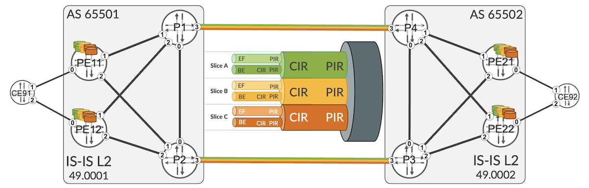
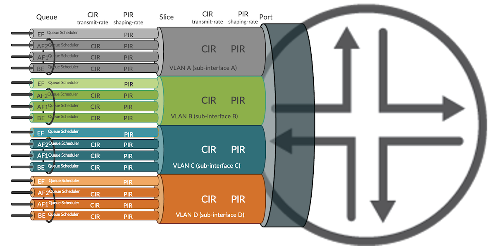
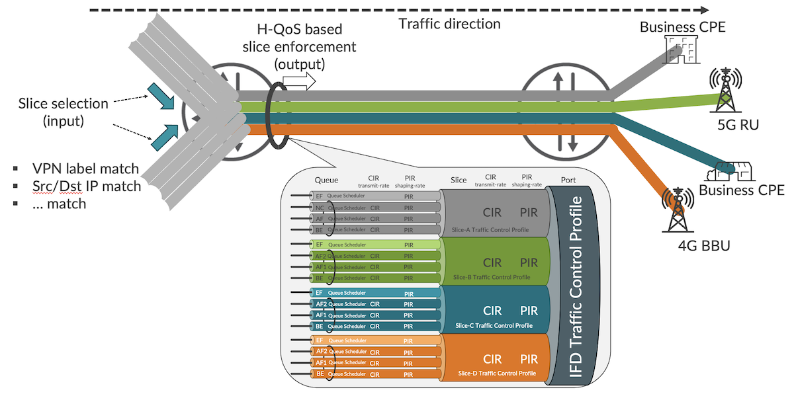
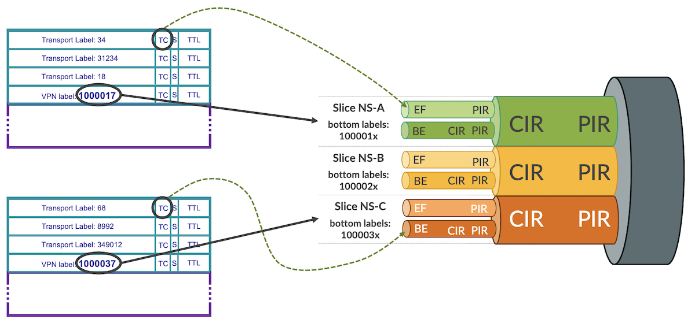
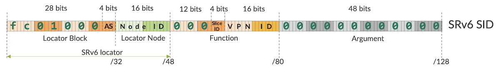
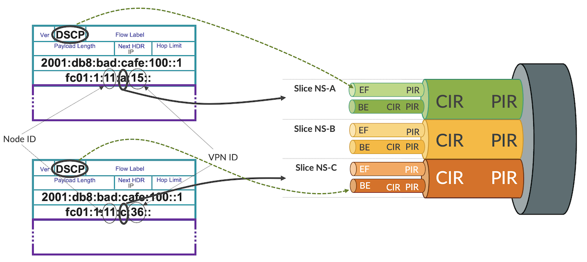
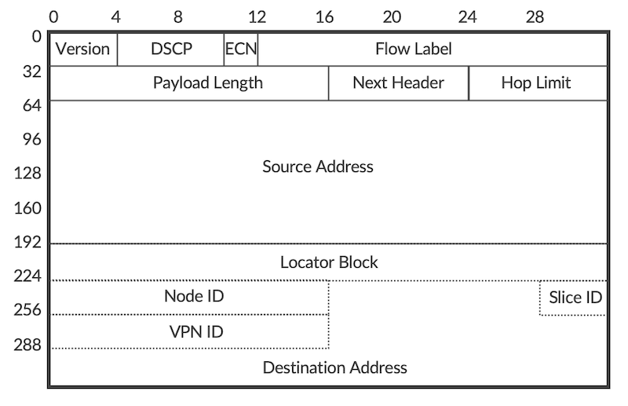

# Link Slicing with MPLS and SRv6 Underlays

**Krzysztof Szarkowicz - 05/12/2023**

The guaranteed link slicing feature, using MPLS and SRv6 as underlay transport.

Link slicing is a way to share physical bandwidth on links between multiple tenants, and *guaranteed* means providing minimum (guaranteed) bandwidth per tenant in case of congestion, as well as a possibility to enforce maximum transmit rates per tenant. Any leftover or unused bandwidth can be shared between tenants. Each slice can have own queue configurations for different classes of service within that slice.

This article is based on the capabilities of Junos 23.1R2 (or newer Junos release) running on MX Series routers. Configuration and operational command outputs have been collected on vMX and MX in our labs.

You can test yourself all the concepts described in this article, we created labs in JCL and vLabs:
[JCL (Junivators and partners)](https://portal.cloudlabs.juniper.net/RM/Topology?b=e7c8498b-5c9c-40e2-8ab7-03be87c403ba&d=c78ae7c7-e93b-4708-813e-109fd780f301)
[vLabs (open to all)](https://portal.cloudlabs.juniper.net/RM/Topology?b=939046fa-40b5-4272-b55e-ad34872f2e28&d=2f99da30-8756-4d15-8822-d648498c7aea)

In this blog post, following IP (Internet Protocol) addressing is used:

Transport Infrastructure (P/PE)

- Router-ID: 198.51.100.<XX>
- Loopback: 2001:db8:bad:cafe:<domain>00::<XX>/128
- SRv6 locator: fc01:<domain>:<XX>::/48
- Core Links: 2001:db8:beef:<domain>00::<XXYY>:<local-ID>/112

PE-CE links:

- IPv4: <VLAN>.<XX>.<YY>.<local-ID>/24
- IPv6: 2001:db8:babe:face:<VLAN>::<XXYY>:<local-ID>/112

VPN (Virtual Private Network) Loopbacks (CE/PE):

- 192.168.<VLAN>.<XX>/32
- 2001:db8:abba:<VLAN>::<XX>/128

## Architecture Introduction

The network topology and initial configuration used for this blog post is based on the network topology and configuration discussed in the [SRv6 L3VPN Inter-AS Option-C blog post](https://juniper.github.io/techposts/srv6-l3vpn-inter-as-option-c/article). That is, we have multi-domain network architecture with VRFs placed on the PE routers, and L3VPN over SRv6 Inter-AS Option-C framework to provide L3VPN connectivity between VRFs on the PEs in different domains. In addition to SRv6 Inter-AS Option-C, SR-MPLS Inter-AS Option-C has been added, so that link slicing for both MPLS and SRv6 underlays can be demonstrated. This is outlined in Figure 1.



PE routers have multiple L3VPNs. Some of these VPNs use SRv6 as underlay (see the [SRv6 SID Encoding and Transposition blog post](https://juniper.github.io/techposts/srv6-sid-encoding-and-transposition/article) for more details about L3VPN over SRv6), and some of these VPNs use SR-MPLS as underlay. Thus, both underlay types (SR-MPLS and SRv6) are used concurrently. This is a realistic scenario and might occur, for example, during migration from MPLS to SRv6 underlay.

Nevertheless, focus of this blog post is not the discussion about nuances of concurrent running of SR-MPLS or SRv6 underlays. Focus of this blog post is link slicing, and both underlays are simply used to illustrate that link slicing can work with both MPLS (any type of MPLS, not only SR-MPLS) and SRv6.

## Link Slicing Introduction

Before going into configuration or operational commands details, let's discuss the use case: what is a "link slicing", where and how we could use link slicing?

Link slicing is a specific use case under overall umbrella called "network slicing". With link slicing, you slice (channelize, partition, divide, ... -- use the word you like) a single link is such a way, that each slice has explicit capacity guarantee, and each slice can have multiple traffic classes and queues. For example, Flexible Ethernet (FlexE) is a technology that allows to channelize an Ethernet link, with fixed bandwidth guarantees for each channel.

Saying that, FlexE might not be the best technology for link slicing/channelization. The major drawbacks of FlexE, when used for link slicing/channelization are:

- no statistical multiplex gain/no bandwidth reuse between channels
- requires large physical links (50 Gbps and above) with large b/w increments (5 Gbps)
- requires an underlying electrical transport switching layer to support channelization

Therefore, to overcome the drawbacks associated with FlexE, this blog post uses different approach for link slicing, utilizing hierarchical QoS (H-QoS) toolset. Traditional, legacy H-QoS architecture is depicted in Figure 2.



In this architecture the link is divided into subinterfaces (units in Junos terms), where each subinterface is associated with a VLAN. The QoS profile (traffic control profile in Junos terms) contains QoS parameters for each subinterface, like:

- CIR (Committed Information Rate) -- guaranteed minimum rate
- PIR (Peak Information Rate) -- maximum (shaping) rate
- Queue parameters inside each profile, with queue priorities, queue sizes, minimum/maximum rate of each queue, etc.

We could reuse this model for link slicing -- theoretically at least. So, why we don't do it? What is the problem with this model?

Well, if you look at Figure 1, the depicted use case for link slicing is to slice inter-AS link (please note, this is just an example; there could be many other use cases calling for link slicing at different locations in the network). With traditional H-QoS approach for link slicing, it would mean considerable administrative overhead:

- VLAN allocation and co-ordination between two domains
- IP addressing for each subinterface allocation and co-ordination between two domains
- In case of intra-domain link slicing, multiple IGP adjacencies would need to be started to make the subinterfaces usable for traffic
- In case of inter-domain link slicing, multiple eBGP peerings, and/or import/export BGP policies with next-hop manipulation to make the subinterfaces usable for traffic

This might become complex task, especially, if the use case demands slicing on multiple links.

## Link Slicing with Slice-Aware H-QoS

To address this complexity, starting from Junos 22.2R1, Juniper successively began to introduce features allowing H-QoS deployments for link slicing in much simpler manner (slice-aware H-QoS). This blog post uses features available from Junos 23.1R2.



In essence, slice-aware H-QoS uses abstract objects called 'slices' to attach QoS profiles on the link. So, no subinterfaces, VLANs, multiple IP addresses, multiple IGP/BGP sessions on the link are longer required, as with traditional H-QoS model. This simplifies operations and does not affect packet forwarding in any way.

When packets enter the router, they are classified as belonging to a specific slice. Packets not classified explicitly, are associated with a default slice. Packet classification, implemented with firewall filter, can happen practically based on any existing field in the packet, like for example top MPLS label, bottom MPLS label, Src/Dst IP address, some specific bits from Src/Dst IP address, etc.

When the packet leaves the router on sliced link, packets are subject to the treatment defined in the slice-specific QoS profile, based on the slice selection performed on input.

## Slice-Aware H-QoS Configuration

In the topology depicted in Figure 1, link slicing is configured on inter-AS links. As an example, configuration of P1 router will be discussed.

First, the slices must be initialized, as outlined in Configuration 1. As an example, we will be using 3 slices, called NS-A, NS-B and NS-C, to illustrate link slicing capability.

```
1 services {
2     network-slicing {
3         slice NS-A;
4         slice NS-B;
5         slice NS-C;
6     }
7 }
```

*Configuration 1: Slice initialization*

Second, hierarchical scheduler capability on the sliced interface must be enabled, as outlined in Configuration 2. Please note, up to Junos 23.1R1 enabling hierarchical scheduler is possible only on interface divided into subinterfaces (VLANs), to support classical H-QoS. Junos 23.1R2 removes that restriction, allowing enabling hierarchical scheduler capability on plain (not divided to subinterfaces) interfaces as well, for slice-aware H-QoS support.

```
1 interfaces {
2     ge-0/0/3 {
3         hierarchical-scheduler;
4     }
5 }
```

*Configuration 2: Enabling H-QoS capability*

Now, QoS configuration must be prepared, with QoS profiles attached to the slices on the interface. This blog post does not intent to cover Junos QoS in details, as this is a huge topic. Therefore, to demonstrate slicing capability, relatively simple QoS configuration is used, as outlined in Configuration 3:

```
1 class-of-service {
2     classifiers {
3         dscp CL-DSCP {
4             forwarding-class FC-BE {
5                 loss-priority low code-points be;
6             }
7             forwarding-class FC-EF {
8                 loss-priority low code-points ef;
9             }
10         }
11         dscp-ipv6 CL-DSCP {
12             forwarding-class FC-BE {
13                 loss-priority low code-points be;
14             }
15             forwarding-class FC-EF {
16                 loss-priority low code-points ef;
17             }
18         }
19         exp CL-MPLS {
20             forwarding-class FC-BE {
21                 loss-priority low code-points 000;
22             }
23             forwarding-class FC-EF {
24                 loss-priority low code-points 101;
25             }
26         }                               
27     }
28     forwarding-classes {
29         class FC-BE queue-num 0 priority low;
30         class FC-EF queue-num 1 priority high;
31     }
32     traffic-control-profiles {
33         TC-1G {
34             shaping-rate 1g;
35         }
36         TC-NS-A {
37             scheduler-map SM-NS-A;
38             shaping-rate 100m;
39             guaranteed-rate 50m;
40         }
41         TC-NS-B {
42             scheduler-map SM-NS-B;
43             shaping-rate 5600000;
44             guaranteed-rate 5m;
45         }
46         TC-NS-C {
47             scheduler-map SM-NS-C;
48             shaping-rate 5100000;
49             guaranteed-rate 4m;
50         }
51     }
52     interfaces {
53         ge-* {
54             unit * {
55                 classifiers {
56                     dscp CL-DSCP;
57                     dscp-ipv6 CL-DSCP;
58                     exp CL-MPLS;
59                 }
60             }
61         }
62         ge-0/0/3 {
63             output-traffic-control-profile TC-1G;
64             slice NS-A {
65                 output-traffic-control-profile TC-NS-A;
66             }
67             slice NS-B {
68                 output-traffic-control-profile TC-NS-B;
69             }
70             slice NS-C {
71                 output-traffic-control-profile TC-NS-C;
72             }
73         }                               
74     }
75     scheduler-maps {
76         SM-NS-A {
77             forwarding-class FC-BE scheduler SC-BE;
78             forwarding-class FC-EF scheduler SC-EF;
79         }
80         SM-NS-B {
81             forwarding-class FC-BE scheduler SC-BE;
82             forwarding-class FC-EF scheduler SC-EF;
83         }
84         SM-NS-C {
85             forwarding-class FC-BE scheduler SC-BE;
86             forwarding-class FC-EF scheduler SC-EF;
87         }
88     }
89     schedulers {
90         SC-BE {
91             transmit-rate {
92                 remainder;
93             }
94             priority low;
95         }
96         SC-EF {
97             transmit-rate {
98                 percent 50;
99                 rate-limit;
100             }
101             priority strict-high;
102         }
103     }
104 }
```

*Configuration 3: Slice-aware H-QoS*

The main aspects of this sample QoS configuration are as follows:

- Two forwarding classes -- FC-BE and FC-EF -- (lines 28-31). Please note, this is only example. Each slice can support up to 8 forwarding classes.
- DSCP and MPLS TC classifiers to classify packets into the forwarding class based on DSCP or MPLS TC values in the packet (lines 2-27). Additionally, classifiers are assigned to the interfaces (lines 53-61).
- Traffic control profiles -- per port and per slice profiles -- (lines 32-51). Per slice profiles have some example minimum (guaranteed) rates and maximum (shaping) rates. Additionally, traffic control profiles is attached to the sliced interface (lines 62-73), resulting in H-QoS hierarchy depicted in Figure 1.
- Traffic control profiles reference scheduler maps (lines 37, 42, 47, 75-88), which define queue parameters for each slice via schedulers (lines 89-103). In this simple example, each slice uses the same queue parameters for simplification. However, in the production deployment, each slice can be parametrized differently, based on the actual requirements.

As the result of the QoS configuration, we have three slices as follows:

Table: Slice QoS profiles

| Slice Name | min BW | max BW | Queues |
|:--|:--|:--|:--|
| NS-A | 50 Mbps | 100 Mbps | FC-EF: strict-high, 50% (rate limited)FC-BE: low, remaining slice BW |
| NS-B | 5 Mbps | 5.6 Mbps | FC-EF: strict-high, 50% (rate limited)FC-BE: low, remaining slice BW |
| NS-C | 4 Mbps | 5.1 Mbps | FC-EF: strict-high, 50% (rate limited)FC-BE: low, remaining slice BW |

Based on the configuration done so far, initial checks can be performed (CLI-Output 1). Please note, based on the MX line card used, the output of the operational command might be slightly different.

```
1 kszarkowicz@P1> show interfaces queue ge-0/0/3 slice NS-A
2 Slice : NS-A (Index : 1)
3   Anchor interface : ge-0/0/3 (Index : 152)
4 Forwarding classes: 16 supported, 4 in use
5 Egress queues: 8 supported, 4 in use
6 Queue: 0, Forwarding classes: FC-BE
7   Queued:
8     Packets              :                     0                     0 pps
9     Bytes                :                     0                     0 bps
10   Transmitted:
11     Packets              :                     0                     0 pps
12     Bytes                :                     0                     0 bps
13     Tail-dropped packets :                     0                     0 pps
14     RL-dropped packets   :                     0                     0 pps
15     RL-dropped bytes     :                     0                     0 bps
16     RED-dropped packets  :                     0                     0 pps
17      Low                 :                     0                     0 pps
18      Medium-low          :                     0                     0 pps
19      Medium-high         :                     0                     0 pps
20      High                :                     0                     0 pps
21     RED-dropped bytes    :                     0                     0 bps
22      Low                 :                     0                     0 bps
23      Medium-low          :                     0                     0 bps
24      Medium-high         :                     0                     0 bps
25      High                :                     0                     0 bps
26   Queue-depth bytes      : 
27     Average              :                     0
28     Current              :                     0
29     Peak                 :                     0
30     Maximum              :               1564672
31 Queue: 1, Forwarding classes: FC-EF
32   Queued:
33     Packets              :                     0                     0 pps
34     Bytes                :                     0                     0 bps
35   Transmitted:
36     Packets              :                     0                     0 pps
37     Bytes                :                     0                     0 bps
38     Tail-dropped packets :                     0                     0 pps
39     RL-dropped packets   :                     0                     0 pps
40     RL-dropped bytes     :                     0                     0 bps
41     RED-dropped packets  :                     0                     0 pps
42      Low                 :                     0                     0 pps
43      Medium-low          :                     0                     0 pps
44      Medium-high         :                     0                     0 pps
45      High                :                     0                     0 pps
46     RED-dropped bytes    :                     0                     0 bps
47      Low                 :                     0                     0 bps
48      Medium-low          :                     0                     0 bps
49      Medium-high         :                     0                     0 bps
50      High                :                     0                     0 bps
51   Queue-depth bytes      : 
52     Average              :                     0
53     Current              :                     0
54     Peak                 :                     0
55     Maximum              :               1564672
56 Queue: 2, Forwarding classes: assured-forwarding
57   Queued:
58     Packets              :                     0                     0 pps
59     Bytes                :                     0                     0 bps
60   Transmitted:
61     Packets              :                     0                     0 pps
62     Bytes                :                     0                     0 bps
63     Tail-dropped packets :                     0                     0 pps
64     RL-dropped packets   :                     0                     0 pps
65     RL-dropped bytes     :                     0                     0 bps
66     RED-dropped packets  :                     0                     0 pps
67      Low                 :                     0                     0 pps
68      Medium-low          :                     0                     0 pps
69      Medium-high         :                     0                     0 pps
70      High                :                     0                     0 pps
71     RED-dropped bytes    :                     0                     0 bps
72      Low                 :                     0                     0 bps
73      Medium-low          :                     0                     0 bps
74      Medium-high         :                     0                     0 bps
75      High                :                     0                     0 bps
76   Queue-depth bytes      : 
77     Average              :                     0
78     Current              :                     0
79     Peak                 :                     0
80     Maximum              :                 32768
81 Queue: 3, Forwarding classes: network-control
82   Queued:
83     Packets              :                     0                     0 pps
84     Bytes                :                     0                     0 bps
85   Transmitted:
86     Packets              :                     0                     0 pps
87     Bytes                :                     0                     0 bps
88     Tail-dropped packets :                     0                     0 pps
89     RL-dropped packets   :                     0                     0 pps
90     RL-dropped bytes     :                     0                     0 bps
91     RED-dropped packets  :                     0                     0 pps
92      Low                 :                     0                     0 pps
93      Medium-low          :                     0                     0 pps
94      Medium-high         :                     0                     0 pps
95      High                :                     0                     0 pps
96     RED-dropped bytes    :                     0                     0 bps
97      Low                 :                     0                     0 bps
98      Medium-low          :                     0                     0 bps
99      Medium-high         :                     0                     0 bps
100      High                :                     0                     0 bps
101   Queue-depth bytes      : 
102     Average              :                     0
103     Current              :                     0
104     Peak                 :                     0
105     Maximum              :                 32768
```

*CLI-Output 1: Initial check for slice NS-A*

We can see counters of queues for slice NS-A (counters of queues for slice NS-B and NS-C are not shown for brevity). At the moment, all counters are '0', despite the traffic already flows through the network (traffic generators generating traffic are attached to CE devices). The reason is, the current configuration defines slices, slice QoS profiles, and assigns slice QoS profiles to the interface. However, the current configuration doesn't assign traffic to slices, so at the moment all traffic is using default slice only.

Depending on the MX hardware used, it might happen -- especially on older MX line cards -- that configuration discussed so far is not sufficient to enable slice-aware H-QoS (CLI-Output 2).

```
1 kszarkowicz@rtme-mx-18> show interfaces queue et-3/0/2 slice NS-A    
2 error: Get slice-id from slice-name:NS-A on et-3/0/2 failed. Error: No such file or directory.
3 
4 
5 kszarkowicz@PE23> show interfaces queue ge-0/0/3 slice NS-A
6 error: slice 'NS-A' not found on ge-0/0/3. Abort
```

*CLI-Output 2: Failed initial check for slice NS-A*

In such situation, additional configuration (enabling egress traffic manager and/or enabling flexible queueing mode) might be required (Configuration 4).

```
1 chassis {
2     fpc 0 {
3         pic 0 {
4             traffic-manager {
5                 mode egress-only;
6             }
7         }
8         flexible-queuing-mode;
9     }
10 }
```

*Configuration 4: Enhanced QoS*

## Assigning Traffic to Slices -- MPLS

Assigning traffic to appropriate slice is a multiple step process.

First of all, there must be common agreement in the network, which fields in the packet will be used for slice identification. For MPLS based underlay the obvious choice is MPLS label. The Junos framework for link slicing is very flexible, allowing MPLS labels (or label ranges) at any position (e.g., top, bottom with/without offset from top/bottom) in the label stack to be used for slice identification purposes.

In this blog post L3VPN labels, which will be present at the bottom of the label stack (SR-TE or TI-LFA could use multiple transport labels above bottom service label) in the packet, will be used for slice identification, as depicted in Figure 4.



Following L3VPN label ranges are used in this blog post (again, this is just simple example -- Junos link slicing framework doesn't put any restrictions here):

Table: Slice MPLS service (bottom) label ranges

| Slice Name | Min Label | Max Label |
|:--|:--|:--|
| NS-A | 1000010 | 1000019 |
| NS-B | 1000020 | 1000029 |
| NS-C | 1000030 | 1000039 |

The selected label ranges are from the default Junos range used for static labels, as outlined in CLI-Output 3, lines 11 and 17.

```
1 kszarkowicz@PE11> show mpls label usage 
2 Label space Total   Available        Applications
3 LSI         949984  949983 (100.00%) BGP/LDP VPLS with no-tunnel-services, BGP L3VPN with vrf-table-label
4 Block       949984  949983 (100.00%) BGP/LDP VPLS with tunnel-services, BGP L2VPN
5 Dynamic     949984  949983 (100.00%) RSVP, LDP, PW, L3VPN, RSVP-P2MP, LDP-P2MP, MVPN, EVPN, BGP
6 Static      48576   48567  (99.98% ) Static LSP, Static PW
7 Effective Ranges
8 Range name  Shared with Start   End      
9 Dynamic     16      99999   
10 Dynamic     150000  999999  
11 Static      1000000 1048575 
12 SRGB        100000  149999   ISIS   
13 Configured Ranges
14 Range name  Shared with Start   End      
15 Dynamic     16      99999   
16 Dynamic     150000  999999  
17 Static      1000000 1048575 
18 SRGB        100000  149999   ISIS
```

*CLI-Output 3: MPLS label ranges*

L3VPN service labels are of local significance, and can be re-used on every ingress PE independently. This is important for scaling. If for a particular deployment different MPLS label ranges should be used for slice identification (e.g., in multi-vendor environment, when 3rd party equipment cannot use range 1000000-1048575 for static label), the static label range could be changed with 'set protocols mpls label-range' command. This blog post uses default static label range.

Now, when the VRFs are orchestrated on PE routers, they must be orchestrated with appropriate VRF labels (Configuration 5).

```
1 routing-instances {
2     RI-VRF17 {
3         vrf-table-label static 1000017;
4     }
5     RI-VRF27 {
6         vrf-table-label static 1000027;
7     }
8     RI-VRF37 {
9         vrf-table-label static 1000037;
10     }
11 }
```

*Configuration 5: Label assignment to VRFs*

With this configuration, traffic of VRF17 will use service (bottom) label 1000017, traffic of VRF27 will use service (bottom) label 1000027, and traffic of VRF37 will use service (bottom) label 1000037. This corresponds to the MPLS label ranges defined in Table 2.

When the packets arrive to P1, which is agnostic to existing VPNs, but should perform slicing on inter-AS links, packets can be classified to slices based on the bottom label ranges (Configuration 6). Multiple label ranges can be specified in a single match term.

```
1 groups {
2     GR-CORE-INTF {
3         interfaces {
4             <*> {
5                 unit 0 {
6                     family mpls {
7                         filter {
8                             input FF-MPLS-SLICE-CLASSIFIER;
9                         }
10                     }
11                 }
12             }
13         }
14     }
15 }
16 interfaces {
17     ge-0/0/0 {
18         apply-groups GR-CORE-INTF;
19     }
20     ge-0/0/1 {
21         apply-groups GR-CORE-INTF;
22     }
23     ge-0/0/2 {
24         apply-groups GR-CORE-INTF;
25     }
26 }
27 firewall {
28     family mpls {
29         filter FF-MPLS-SLICE-CLASSIFIER {
30             term TR-SLICE-A {
31                 from {
32                     label 1000010-1000019 {
33                         bottom;         
34                     }
35                 }
36                 then {
37                     slice NS-A;
38                     count CT-SLICE-A;
39                     accept;
40                 }
41             }
42             term TR-SLICE-B {
43                 from {
44                     label 1000020-1000029 {
45                         bottom;
46                     }
47                 }
48                 then {
49                     slice NS-B;
50                     count CT-SLICE-B;
51                     accept;
52                 }
53             }
54             term TR-SLICE-C {
55                 from {
56                     label 1000030-1000039 {
57                         bottom;
58                     }
59                 }
60                 then {
61                     slice NS-C;
62                     count CT-SLICE-C;
63                     accept;
64                 }
65             }
66             term TR-ALL {
67                 then {
68                     count CT-NON-SLICED;
69                     accept;
70                 }
71             }
72         }
73     }
74 }
```

*Configuration 6: Classification to slices based on bottom MPLS label*

It is a pretty simple configuration. Firewall filter matches for bottom label ranges (lines 31-35, 43-47, 55-59), and assigns packets to appropriate slice (lines 37, 49, 61). MPLS packets not matched (bottom label not within specific range) are kept in the default slice. Subsequently, the firewall filter is used as input filter on the core interfaces (lines 1-26).

Quick verification confirms that packets are now classified by the filter to slices (CLI-Output 4).

```
1 kszarkowicz@P1> show firewall filter FF-MPLS-SLICE-CLASSIFIER 
2 
3 Filter: FF-MPLS-SLICE-CLASSIFIER                               
4 Counters:
5 Name                                                      Bytes              Packets
6 CT-NON-SLICED                                                 0                    0
7 CT-SLICE-A                                             16235184                12824
8 CT-SLICE-B                                             16235184                12824
9 CT-SLICE-C                                             16235184                12824
```

*CLI-Output 4: Slice classification based on MPLS*

When we now check the queue status of each slice, we see now some counters (CLI-Output 5):

```
1 kszarkowicz@P1> show interfaces queue ge-0/0/3 slice NS-A 
2 Slice : NS-A (Index : 1)
3   Anchor interface : ge-0/0/3 (Index : 152)
4 Forwarding classes: 16 supported, 4 in use
5 Egress queues: 8 supported, 4 in use
6 Queue: 0, Forwarding classes: FC-BE
7   Queued:
8     Packets              :                 15686                    97 pps
9     Bytes                :              20454544               1019264 bps
10   Transmitted:
11     Packets              :                 15686                    97 pps
12     Bytes                :              20454544               1019264 bps
13     Tail-dropped packets :                     0                     0 pps
14     RL-dropped packets   :                     0                     0 pps
15     RL-dropped bytes     :                     0                     0 bps
16     RED-dropped packets  :                     0                     0 pps
17      Low                 :                     0                     0 pps
18      Medium-low          :                     0                     0 pps
19      Medium-high         :                     0                     0 pps
20      High                :                     0                     0 pps
21     RED-dropped bytes    :                     0                     0 bps
22      Low                 :                     0                     0 bps
23      Medium-low          :                     0                     0 bps
24      Medium-high         :                     0                     0 bps
25      High                :                     0                     0 bps
26 Queue: 1, Forwarding classes: FC-EF
27   Queued:
28     Packets              :                 15686                    97 pps
29     Bytes                :              20454544               1019520 bps
30   Transmitted:
31     Packets              :                 15686                    97 pps
32     Bytes                :              20454544               1019520 bps
33     Tail-dropped packets :                     0                     0 pps
34     RL-dropped packets   :                     0                     0 pps
35     RL-dropped bytes     :                     0                     0 bps
36     RED-dropped packets  :                     0                     0 pps
37      Low                 :                     0                     0 pps
38      Medium-low          :                     0                     0 pps
39      Medium-high         :                     0                     0 pps
40      High                :                     0                     0 pps
41     RED-dropped bytes    :                     0                     0 bps
42      Low                 :                     0                     0 bps
43      Medium-low          :                     0                     0 bps
44      Medium-high         :                     0                     0 bps
45      High                :                     0                     0 bps
46 
47 (omitted for brevity)
48 
49 
50 
51 kszarkowicz@P1> show interfaces queue ge-0/0/3 slice NS-B    
52 Slice : NS-B (Index : 2)
53   Anchor interface : ge-0/0/3 (Index : 152)
54 Forwarding classes: 16 supported, 4 in use
55 Egress queues: 8 supported, 4 in use
56 Queue: 0, Forwarding classes: FC-BE
57   Queued:
58     Packets              :                 17193                    97 pps
59     Bytes                :              22419672               1020928 bps
60   Transmitted:
61     Packets              :                 17193                    97 pps
62     Bytes                :              22419672               1020928 bps
63     Tail-dropped packets :                     0                     0 pps
64     RL-dropped packets   :                     0                     0 pps
65     RL-dropped bytes     :                     0                     0 bps
66     RED-dropped packets  :                     0                     0 pps
67      Low                 :                     0                     0 pps
68      Medium-low          :                     0                     0 pps
69      Medium-high         :                     0                     0 pps
70      High                :                     0                     0 pps
71     RED-dropped bytes    :                     0                     0 bps
72      Low                 :                     0                     0 bps
73      Medium-low          :                     0                     0 bps
74      Medium-high         :                     0                     0 bps
75      High                :                     0                     0 bps
76 Queue: 1, Forwarding classes: FC-EF
77   Queued:
78     Packets              :                 17193                    97 pps
79     Bytes                :              22419672               1018112 bps
80   Transmitted:
81     Packets              :                 17193                    97 pps
82     Bytes                :              22419672               1018112 bps
83     Tail-dropped packets :                     0                     0 pps
84     RL-dropped packets   :                     0                     0 pps
85     RL-dropped bytes     :                     0                     0 bps
86     RED-dropped packets  :                     0                     0 pps
87      Low                 :                     0                     0 pps
88      Medium-low          :                     0                     0 pps
89      Medium-high         :                     0                     0 pps
90      High                :                     0                     0 pps
91     RED-dropped bytes    :                     0                     0 bps
92      Low                 :                     0                     0 bps
93      Medium-low          :                     0                     0 bps
94      Medium-high         :                     0                     0 bps
95      High                :                     0                     0 bps
96 
97 (omitted for brevity)
98 
99 
100 
101 kszarkowicz@P1> show interfaces queue ge-0/0/3 slice NS-C    
102 Slice : NS-C (Index : 3)
103   Anchor interface : ge-0/0/3 (Index : 152)
104 Forwarding classes: 16 supported, 4 in use
105 Egress queues: 8 supported, 4 in use
106 Queue: 0, Forwarding classes: FC-BE
107   Queued:
108     Packets              :                 17618                    97 pps
109     Bytes                :              22973872               1017472 bps
110   Transmitted:
111     Packets              :                 17618                    97 pps
112     Bytes                :              22973872               1017472 bps
113     Tail-dropped packets :                     0                     0 pps
114     RL-dropped packets   :                     0                     0 pps
115     RL-dropped bytes     :                     0                     0 bps
116     RED-dropped packets  :                     0                     0 pps
117      Low                 :                     0                     0 pps
118      Medium-low          :                     0                     0 pps
119      Medium-high         :                     0                     0 pps
120      High                :                     0                     0 pps
121     RED-dropped bytes    :                     0                     0 bps
122      Low                 :                     0                     0 bps
123      Medium-low          :                     0                     0 bps
124      Medium-high         :                     0                     0 bps
125      High                :                     0                     0 bps
126 Queue: 1, Forwarding classes: FC-EF
127   Queued:
128     Packets              :                 17618                    97 pps
129     Bytes                :              22973872               1020288 bps
130   Transmitted:
131     Packets              :                 17618                    97 pps
132     Bytes                :              22973872               1020288 bps
133     Tail-dropped packets :                     0                     0 pps
134     RL-dropped packets   :                     0                     0 pps
135     RL-dropped bytes     :                     0                     0 bps
136     RED-dropped packets  :                     0                     0 pps
137      Low                 :                     0                     0 pps
138      Medium-low          :                     0                     0 pps
139      Medium-high         :                     0                     0 pps
140      High                :                     0                     0 pps
141     RED-dropped bytes    :                     0                     0 bps
142      Low                 :                     0                     0 bps
143      Medium-low          :                     0                     0 bps
144      Medium-high         :                     0                     0 bps
145      High                :                     0                     0 bps
146 
147 (omitted for brevity)
```

*CLI-Output 5: Verification of slice-aware H-QoS*

We see around 2 Mbps of traffic in each slice, with 1 Mbps in each forwarding class in each slice (remaining two forwarding classes in each slice are not used in this example, therefore not shown for brevity). All traffic is passing through without any drops, as there is no congestion on the link (so, guaranteed rate doesn't matter), and all slices are within their maximum rate limits (thus, no shaping happens).

This looks good.

Now, let's add some more traffic to the picture.

## Assigning Traffic to Slices -- SRv6

This time, let's add SRv6 traffic. And yes, the same link slice can carry different traffic types. We can mix both MPLS and SRv6 flows within the same slice, and apply common QoS guarantees and constraints for such mixed slice. Junos link slicing framework is very flexible.

The process of assigning traffic to slices is similar to MPLS at the high-level. However, this time we don't have MPLS labels, but SRv6 SIDs ([see SRv6 SID Encoding and Transposition blog post](https://juniper.github.io/techposts/srv6-sid-encoding-and-transposition/article) (and earlier SRv6 blog posts), SRv6 SID is a 128-bit long data structure, divided into Locator:Function:Argument fields. The division is flexible, and each field can be further decomposed to carry various information.

One example of the of SRv6 SID allocation scheme, used in this blog post, is presented in Figure 5.



4 bits in the SRv6 locator are used for AS (Domain ID), 16 bits are kept for Node ID. Function as well has designated bits for slice ID (4 bits) and VPN ID (16 bits). Please remember, it is just an example. Depending on the actual use case and requirements, Locator:Function space can be arranged in different ways. For example, slice ID could be part of the SRv6 Locator, not part of Function.

Figure 6 shows the slice selection based on slice ID encoded in SRv6 SID.



Base configuration for SRv6 Locator and End SID on PE11 is outlined in Configuration 7. There is nothing really new here, when compared to previous SRv6 blog posts.

```
1 routing-options {
2     source-packet-routing {
3         srv6 {
4             locator SL-000 {
5                 fc01:1:11::/48;
6                 block-length 32;
7                 function-length 32;
8                 static-function-max-entries 1048575;
9             }
10             no-reduced-srh;
11         }
12     }
13 }
14 protocols {
15     isis {
16         source-packet-routing {
17             srv6 {
18                 locator SL-000 {
19                     end-sid fc01:1:11:0:1234:: {
20                         flavor {
21                             psp;
22                             usp;
23                             usd;
24                         }
25                     }
26                 }
27             }
28         }
29     }
30 }
```

*Configuration 7: Base SRv6 Locator and End SID*

Now, the interesting part is the SRv6 End.DT46 SID allocation (Configuration 8).

```
1 routing-instances {
2     RI-VRF15 {
3         protocols {
4             bgp {
5                 source-packet-routing {
6                     srv6 {
7                         locator SL-000 {
8                             end-dt46-sid fc01:1:11:a:15::;
9                         }
10                     }
11                 }
12             }
13         }
14     }
15     RI-VRF16 {
16         protocols {
17             bgp {
18                 source-packet-routing {
19                     srv6 {
20                         locator SL-000 {
21                             end-dt46-sid fc01:1:11:a:16::;
22                         }
23                     }
24                 }
25             }
26         }
27     }
28     RI-VRF25 {
29         protocols {
30             bgp {
31                 source-packet-routing {
32                     srv6 {
33                         locator SL-000 {
34                             end-dt46-sid fc01:1:11:b:25::;
35                         }
36                     }
37                 }
38             }
39         }
40     }
41     RI-VRF26 {
42         protocols {
43             bgp {
44                 source-packet-routing {
45                     srv6 {
46                         locator SL-000 {
47                             end-dt46-sid fc01:1:11:b:26::;
48                         }
49                     }
50                 }
51             }
52         }
53     }
54     RI-VRF35 {
55         protocols {
56             bgp {
57                 source-packet-routing {
58                     srv6 {
59                         locator SL-000 {
60                             end-dt46-sid fc01:1:11:c:35::;
61                         }
62                     }
63                 }
64             }
65         }
66     }
67     RI-VRF36 {
68         protocols {
69             bgp {
70                 source-packet-routing {
71                     srv6 {
72                         locator SL-000 {
73                             end-dt46-sid fc01:1:11:c:36::;
74                         }
75                     }
76                 }
77             }
78         }
79     }
80 }
```

*Configuration 8: SRv6 SID End.DT46*

There are six VPNs defined, two for each slice -- note 'a', 'b' and 'c' in the SID Function part (lines 8, 21, 34, 47, 60, 73), which is the agreed slice ID. Behind slice ID, you can see VPN ID (note VPN IDs: 15, 16, 25, 26, 35, 36).

Now, when the packets are sent with SRv6 encapsulation (essentially IP in IPv6 encapsulation), the destination address of the outer IPv6 header is equal to the SRv6 End.DT46 SID. Therefore, on P1 router, we need to match for specific bits encoding slice ID in the destination address of the packet, to classify the packet to a particular slice. For this, it is helpful to understand the IPv6 header structure (Figure 7).



Initial fields from IPv6 header occupy 64 bits, source address is 128 bits, which gives 192 bits. When looking at the Figure 5, we can observe that SRv6 Locator occupies additional 48 bits (32 bits locator block +16 bits node ID), and most left byte (8 bits) from function is not used. This gives us in total 192 + 48 + 8 = 248 bits, or 31 bytes. Therefore, in order to match for slice ID, we will need to match 32nd byte in the IPv6 header.

To match the slice ID on P1 router we will use [firewall filter with flexible match condition](https://www.juniper.net/documentation/us/en/software/junos/routing-policy/topics/concept/firewall-filter-flexible-match-conditions-overview.html). This filter provides great flexibility, practically allowing to match any particular bits in the packet header (Configuration 9).

```
1 groups {
2     GR-CORE-INTF {
3         interfaces {
4             <*> {
5                 unit 0 {
6                     family inet6 {
7                         filter {
8                             input FF-SRV6-SLICE-CLASSIFIER;
9                         }
10                     }
11                 }
12             }
13         }
14     }
15 }
16 interfaces {
17     ge-0/0/0 {
18         apply-groups GR-CORE-INTF;
19     }
20     ge-0/0/1 {
21         apply-groups GR-CORE-INTF;
22     }
23     ge-0/0/2 {
24         apply-groups GR-CORE-INTF;
25     }
26 }
27 firewall{
28     family inet6 {
29         filter FF-SRV6-SLICE-CLASSIFIER {
30             term TR-SLICE-A {
31                 from {
32                     flexible-match-mask {
33                         mask-in-hex 0xf;
34                         prefix 0xa;
35                         flexible-mask-name FM-SLICE-ID;
36                     }
37                 }
38                 then {
39                     slice NS-A;
40                     count CT-SLICE-A;
41                     accept;
42                 }
43             }
44             term TR-SLICE-B {
45                 from {
46                     flexible-match-mask {
47                         mask-in-hex 0xf;
48                         prefix 0xb;
49                         flexible-mask-name FM-SLICE-ID;
50                     }
51                 }
52                 then {
53                     slice NS-B;
54                     count CT-SLICE-B;
55                     accept;
56                 }
57             }
58             term TR-SLICE-C {
59                 from {
60                     flexible-match-mask {
61                         mask-in-hex 0xf;
62                         prefix 0xc;
63                         flexible-mask-name FM-SLICE-ID;
64                     }
65                 }
66                 then {
67                     slice NS-C;
68                     count CT-SLICE-C;
69                     accept;
70                 }
71             }
72             term TR-ALL {
73                 then {
74                     count CT-NON-SLICED;
75                     accept;
76                 }
77             }
78         }
79     }
80     flexible-match FM-SLICE-ID {
81         match-start layer-3;
82         byte-offset 31;
83         bit-offset 0;
84         bit-length 8;
85     }
86 }
```

*Configuration 9: Classification to slices based on SRv6 slice ID*

Lines 80-85 define the flexible match mask, which essentially is the location in the packet, where our match should be performed. In this particular case, the match will be performed in the 32nd byte (byte offset 31, i.e., we are skipping first 31 bytes) of layer 3 header. This flexible match mask is then used in the IPv6 firewall filter so, the layer 3 header becomes IPv6 header (lines 45, 49, 63). The filter has further mask to narrow down the match to last 4 bits (lines 33, 47, 61) within the byte selected by flexible match mask. And, we are looking for specific values -- 0xa, 0xb and 0xc -- in these 4 bits (lines 34, 48, 62) to assign packets to specific slices (lines 39, 53, 67). Similar to MPLS filter, this IPv6 filter is applied as input filter on core interfaces (lines 1-26).

Before performing any verification, let's summarize current configuration state:

- Slice-aware H-QoS (link slicing) configured on inter-AS link, with three slices having different min/max bandwidth constraints, each slice with two forwarding classes
- 9 VRFs on PE routers, 3 VRFs per slice. Within each slice, 2 VRFs use SRv6 as underlay and 1 VRF uses MPLS as underlay
- Traffic generators send traffic with traffic rate 2 Mbps per VRF with two forwarding classes (1 Mbps per forwarding class)
- So, we have in total 6 Mbps per slice (3 Mbps per forwarding class in each slice)
- Each slice on inter-AS link has mixed SRv6 and MPLS traffic

Now, let's check the statistics for both MPLS and SRv6 based slice classification (CLI-Output 6).

```
1 kszarkowicz@P1> show firewall                                                         
2 
3 Filter: FF-SRV6-SLICE-CLASSIFIER                               
4 Counters:
5 Name                                                      Bytes              Packets
6 CT-NON-SLICED                                           1760584                22535
7 CT-SLICE-A                                            175950390               135555
8 CT-SLICE-B                                            175949092               135554
9 CT-SLICE-C                                            175949092               135554
10 
11 Filter: FF-MPLS-SLICE-CLASSIFIER                               
12 Counters:
13 Name                                                      Bytes              Packets
14 CT-NON-SLICED                                                 0                    0
15 CT-SLICE-A                                           3189241368              2519148
16 CT-SLICE-B                                           3189240102              2519147
17 CT-SLICE-C                                           3189240102              2519147
```

*CLI-Output 6: Slice classification based on SRv6 slice ID*

We can observe that both MPLS and IPv6 (SRv6) traffic is assigned to the slices. For IPv6 traffic we have small amount not assigned to any particular slice -- this is control traffic (e.g. BGP), which is not matched explicitly in the firewall filter. The default slice has by no guarantees by default, so in the real-life deployment, it is recommended to assign control traffic to a separate 'control plane' slice, with some guarantees (1-5% of link capacity) to avoid suppression of control plane traffic by other slices. Alternatively, some guarantees can be provided to the default slice, by attaching appropriate traffic control profile to remaining queues on the interface ('set class-of-service interfaces <interface-name> output-traffic-control-profile-remaining <traffic-control-profile-name>')

Now, checking the slice queue statistics we can make interesting observations (CLI-Output 7).

```
1 kszarkowicz@P1> show interfaces queue ge-0/0/3 slice NS-A  
2 Slice : NS-A (Index : 1)
3   Anchor interface : ge-0/0/3 (Index : 152)
4 Forwarding classes: 16 supported, 4 in use
5 Egress queues: 8 supported, 4 in use
6 Queue: 0, Forwarding classes: FC-BE
7   Queued:
8     Packets              :               2685763                   293 pps
9     Bytes                :            3533512904               3110656 bps
10   Transmitted:
11     Packets              :               2685763                   293 pps
12     Bytes                :            3533512904               3110656 bps
13     Tail-dropped packets :                     0                     0 pps
14     RL-dropped packets   :                     0                     0 pps
15     RL-dropped bytes     :                     0                     0 bps
16     RED-dropped packets  :                     0                     0 pps
17      Low                 :                     0                     0 pps
18      Medium-low          :                     0                     0 pps
19      Medium-high         :                     0                     0 pps
20      High                :                     0                     0 pps
21     RED-dropped bytes    :                     0                     0 bps
22      Low                 :                     0                     0 bps
23      Medium-low          :                     0                     0 bps
24      Medium-high         :                     0                     0 bps
25      High                :                     0                     0 bps
26 Queue: 1, Forwarding classes: FC-EF
27   Queued:
28     Packets              :               2685761                   292 pps
29     Bytes                :            3533510232               3101056 bps
30   Transmitted:
31     Packets              :               2685761                   292 pps
32     Bytes                :            3533510232               3101056 bps
33     Tail-dropped packets :                     0                     0 pps
34     RL-dropped packets   :                     0                     0 pps
35     RL-dropped bytes     :                     0                     0 bps
36     RED-dropped packets  :                     0                     0 pps
37      Low                 :                     0                     0 pps
38      Medium-low          :                     0                     0 pps
39      Medium-high         :                     0                     0 pps
40      High                :                     0                     0 pps
41     RED-dropped bytes    :                     0                     0 bps
42      Low                 :                     0                     0 bps
43      Medium-low          :                     0                     0 bps
44      Medium-high         :                     0                     0 bps
45      High                :                     0                     0 bps
46 Queue: 2, Forwarding classes: assured-forwarding
47   Queued:
48     Packets              :                     0                     0 pps
49     Bytes                :                     0                     0 bps
50   Transmitted:
51     Packets              :                     0                     0 pps
52     Bytes                :                     0                     0 bps
53     Tail-dropped packets :                     0                     0 pps
54     RL-dropped packets   :                     0                     0 pps
55     RL-dropped bytes     :                     0                     0 bps
56     RED-dropped packets  :                     0                     0 pps
57      Low                 :                     0                     0 pps
58      Medium-low          :                     0                     0 pps
59      Medium-high         :                     0                     0 pps
60      High                :                     0                     0 pps
61     RED-dropped bytes    :                     0                     0 bps
62      Low                 :                     0                     0 bps
63      Medium-low          :                     0                     0 bps
64      Medium-high         :                     0                     0 bps
65      High                :                     0                     0 bps
66 
67 (omitted for brevity)
68 
69 
70 kszarkowicz@P1> show interfaces queue ge-0/0/3 slice NS-B    
71 Slice : NS-B (Index : 2)
72   Anchor interface : ge-0/0/3 (Index : 152)
73 Forwarding classes: 16 supported, 4 in use
74 Egress queues: 8 supported, 4 in use
75 Queue: 0, Forwarding classes: FC-BE
76   Queued:
77     Packets              :               2686710                   292 pps
78     Bytes                :            3534768528               3106816 bps
79   Transmitted:
80     Packets              :               2396074                   235 pps
81     Bytes                :            3155297008               2502272 bps
82     Tail-dropped packets :                290636                    57 pps
83     RL-dropped packets   :                     0                     0 pps
84     RL-dropped bytes     :                     0                     0 bps
85     RED-dropped packets  :                     0                     0 pps
86      Low                 :                     0                     0 pps
87      Medium-low          :                     0                     0 pps
88      Medium-high         :                     0                     0 pps
89      High                :                     0                     0 pps
90     RED-dropped bytes    :                     0                     0 bps
91      Low                 :                     0                     0 bps
92      Medium-low          :                     0                     0 bps
93      Medium-high         :                     0                     0 bps
94      High                :                     0                     0 bps
95 Queue: 1, Forwarding classes: FC-EF
96   Queued:
97     Packets              :               2686710                   292 pps
98     Bytes                :            3534768528               3107712 bps
99   Transmitted:
100     Packets              :               2684008                   292 pps
101     Bytes                :            3531240224               3104640 bps
102     Tail-dropped packets :                     0                     0 pps
103     RL-dropped packets   :                     0                     0 pps
104     RL-dropped bytes     :                     0                     0 bps
105     RED-dropped packets  :                     0                     0 pps
106      Low                 :                     0                     0 pps
107      Medium-low          :                     0                     0 pps
108      Medium-high         :                     0                     0 pps
109      High                :                     0                     0 pps
110     RED-dropped bytes    :                     0                     0 bps
111      Low                 :                     0                     0 bps
112      Medium-low          :                     0                     0 bps
113      Medium-high         :                     0                     0 bps
114      High                :                     0                     0 bps
115 
116 (omitted for brevity)
117 
118 
119 kszarkowicz@P1> show interfaces queue ge-0/0/3 slice NS-C    
120 Slice : NS-C (Index : 3)
121   Anchor interface : ge-0/0/3 (Index : 152)
122 Forwarding classes: 16 supported, 4 in use
123 Egress queues: 8 supported, 4 in use
124 Queue: 0, Forwarding classes: FC-BE
125   Queued:
126     Packets              :               2690769                   292 pps
127     Bytes                :            3540148056               3106176 bps
128   Transmitted:
129     Packets              :               2160508                   187 pps
130     Bytes                :            2846105824               2004608 bps
131     Tail-dropped packets :                530261                   105 pps
132     RL-dropped packets   :                     0                     0 pps
133     RL-dropped bytes     :                     0                     0 bps
134     RED-dropped packets  :                     0                     0 pps
135      Low                 :                     0                     0 pps
136      Medium-low          :                     0                     0 pps
137      Medium-high         :                     0                     0 pps
138      High                :                     0                     0 pps
139     RED-dropped bytes    :                     0                     0 bps
140      Low                 :                     0                     0 bps
141      Medium-low          :                     0                     0 bps
142      Medium-high         :                     0                     0 bps
143      High                :                     0                     0 bps
144 Queue: 1, Forwarding classes: FC-EF
145   Queued:
146     Packets              :               2690768                   293 pps
147     Bytes                :            3540146752               3115648 bps
148   Transmitted:
149     Packets              :               2687784                   293 pps
150     Bytes                :            3536251520               3112576 bps
151     Tail-dropped packets :                     0                     0 pps
152     RL-dropped packets   :                     0                     0 pps
153     RL-dropped bytes     :                     0                     0 bps
154     RED-dropped packets  :                     0                     0 pps
155      Low                 :                     0                     0 pps
156      Medium-low          :                     0                     0 pps
157      Medium-high         :                     0                     0 pps
158      High                :                     0                     0 pps
159     RED-dropped bytes    :                     0                     0 bps
160      Low                 :                     0                     0 bps
161      Medium-low          :                     0                     0 bps
162      Medium-high         :                     0                     0 bps
163      High                :                     0                     0 bps
164 
165 (omitted for brevity)
```

*CLI-Output 7: Verification of slice-aware H-QoS*

There are no drops in slice NS-A. In slice NS-B we observe small drops in forwarding class FC-BE. In slice NS-C we observe even bigger drops, but again in forwarding class FC-BE only. The observations are in line with the expectations (please refer to Table 1 for slice rates). Also, for slices observing drops, only FE-BE class, with low priority, is affected. Strict-priority FC-EF class is not affected.

## Next Steps

In the next blog post we will show another slicing use case with lookup entry assigning packets to slices, instead of firewall filter based assignment.

## Useful links

- Firewall Filter Flexible Match Conditions: [https://www.juniper.net/documentation/us/en/software/junos/routing-policy/topics/concept/firewall-filter-flexible-match-conditions-overview.html](https://www.juniper.net/documentation/us/en/software/junos/routing-policy/topics/concept/firewall-filter-flexible-match-conditions-overview.html)
- Slice (firewall filter action): [https://www.juniper.net/documentation/us/en/software/junos/cos-hierarchical/cos/topics/ref/statement/slice(firewallfilteraction).html](https://www.juniper.net/documentation/us/en/software/junos/cos-hierarchical/cos/topics/ref/statement/slice(firewallfilteraction).html)
- Slice-aware H-QoS: [https://www.juniper.net/documentation/us/en/software/junos/cos-hierarchical/cos/topics/topic-map/HierarchicalCoSqueuingforsliceper-hop-behavior.html](https://www.juniper.net/documentation/us/en/software/junos/cos-hierarchical/cos/topics/topic-map/HierarchicalCoSqueuingforsliceper-hop-behavior.html)
- TechPost 1: SRv6 Basics Locator and End-SIDs - [https://juniper.github.io/techposts/srv6-basics-locator-and-end-sids/article](https://juniper.github.io/techposts/srv6-basics-locator-and-end-sids/article)
- TechPost 2: L3VPN on SRv6 - [https://juniper.github.io/techposts/l3vpn-over-srv6/article](https://juniper.github.io/techposts/l3vpn-over-srv6/article)
- TechPost 3: SRv6 Summarisation - [https://juniper.github.io/techposts/srv6-summarization/article](https://juniper.github.io/techposts/srv6-summarization/article)
- TechPost 4: SRv6 SID Encoding and Transposition - [https://juniper.github.io/techposts/srv6-sid-encoding-and-transposition/article](https://juniper.github.io/techposts/srv6-sid-encoding-and-transposition/article)
- TechPost 5: SRv6 L3VPN Inter-AS Option-C - [https://juniper.github.io/techposts/srv6-l3vpn-inter-as-option-c/article](https://juniper.github.io/techposts/srv6-l3vpn-inter-as-option-c/article)
- TechPost 6: Link Slicing with MPLS and SRv6 Underlays - [https://juniper.github.io/techposts/link-slicing-with-mpls-and-srv6-underlays/article](https://juniper.github.io/techposts/link-slicing-with-mpls-and-srv6-underlays/article)
- TechPost 7: Link Slicing with MPLS and SRv6 Underlays Part 2 - [https://juniper.github.io/techposts/link-slicing-with-mpls-and-srv6-underlays-part-2/article](https://juniper.github.io/techposts/link-slicing-with-mpls-and-srv6-underlays-part-2/article)

## Glossary

- AS: Autonomous System
- ASBR: Autonomous System Boundary Router
- BGP: Border Gateway Protocol
- BW: Bandwidth
- CE: Customer Edge
- CIR: Committed Information Rate
- CLI: Command Line Interface
- DSCP: Differentiated Services Code Point
- Dst: Destination
- eBGP: external Border Gateway Protocol
- ECN: Explicit Congestion Notification
- FlexE: Flexible Ethernet
- Gbps: Gigabits per second
- H-QoS: Hierarchical Quality of Services
- iBGP: internal Border Gateway Protocol
- ID: Identifier
- IGP: Interior Gateway Protocol
- Inter-AS: Inter Autonomous System
- IP: Internet Protocol
- IPv4: Internet Protocol version 4
- IPv6: Internet Protocol version 6
- IS-IS: Intermediate System to Intermediate System
- L2: Level 2
- L3VPN: Layer 3 Virtual Private Network
- Mbps: Megabits per second
- MPLS: Multiprotocol Label Switching
- NHS: Next Hop Self
- OSPF: Open Shortest Path First
- P: Provider
- PE: Provider Edge
- PIR: Peak Information Rate
- PSP: Penultimate Segment Pop
- QoS: Quality of Services
- RFC: Request for Comments
- RIB: Routing Information Base
- RR: Route Reflector
- SID: Segment Identifier
- SR: Segment Routing
- Src: Source
- SR-MPLS: Segment Routing with Multiprotocol Label Switching
- SR-TE: Segment Routing Traffic Engineering
- SRv6: Segment Routing version 6
- TC: Traffic Class
- TI-LFA: Topology Independent Loop Free Alternates
- TLV: Type Length Value
- USD: Ultimate Segment Decapsulation
- USP: Ultimate Segment Pop
- VLAN: Virtual Local Area Network
- VPN: Virtual Private Network
- VRF: Virtual Routing and Forwarding

## Acknowledgements

Many thanks to Anton Elita for his thorough review and suggestions, and Aditya T R for preparing JCL and vLabs topologies.
