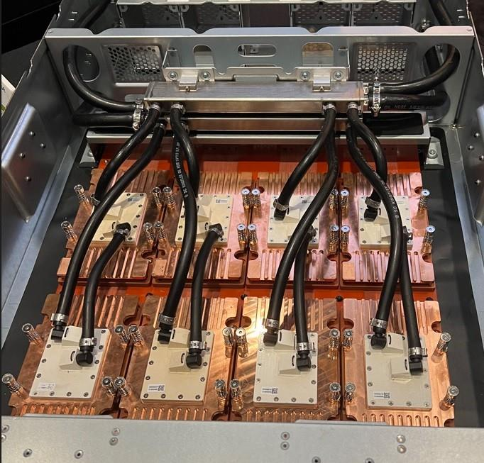
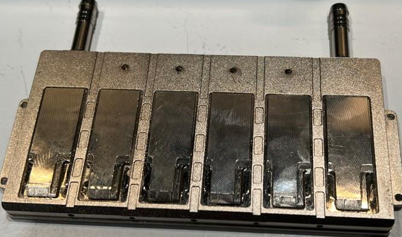
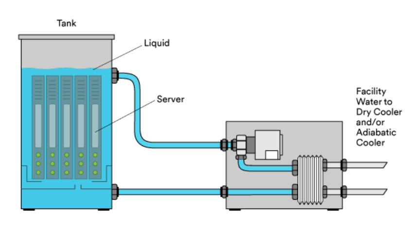
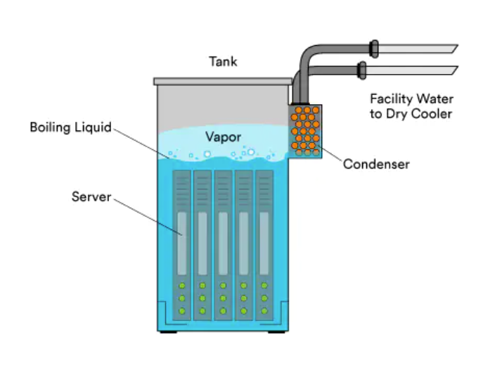
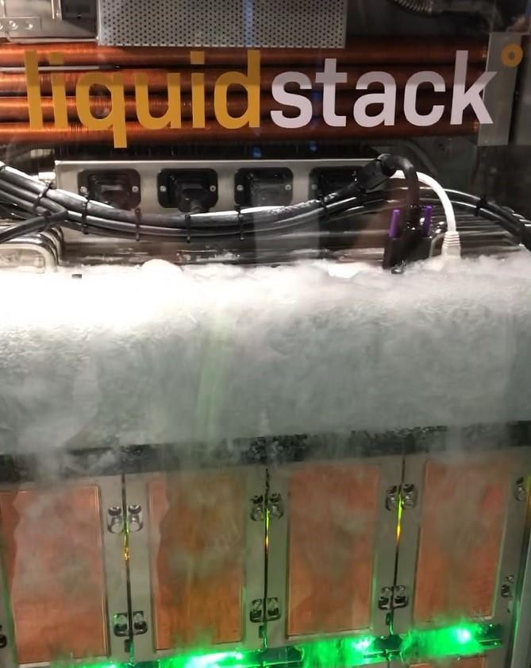

# Liquid Cooling - The Inflection Point

**Sharada Yeluri - 12/09/2023**

The different thermal management solutions for cooling the high-power components in electronic systems (HPCs/Servers and network equipment), trends, and the future.

Article initially published on LinkedIn at: [https://www.linkedin.com/pulse/liquid-cooling-inflection-point-sharada-yeluri-pis6f/](https://www.linkedin.com/pulse/liquid-cooling-inflection-point-sharada-yeluri-pis6f/)

## Introduction

All the components (Optics, CPUs/GPUs, ASICs, retimers, converters) in an electronic system like HPC/server or switch/router system generate heat as they consume the power for their operation. If this heat is not dissipated efficiently, it could overheat the component's internals and cause them to fail or malfunction.

For example, in ASICs, transistor junction temperature (TJ) is the temperature at the contact point where two different semiconductor materials meet within a transistor. The semiconductor manufacturers specify the maximum TJ, above which, if the ASIC continues to operate, then it is no longer reliable. The TJ increases with the power dissipation of the transistor. Violating the manufacturer's specification for maximum TJ frequently causes transistors to get damaged permanently. Thus, any thermal management solution should keep the ASICs' junction temperature well within the spec by efficiently removing the heat dissipated by the ASICs. Similarly, optical modules, fans, power modules, and other components have their own temperature specifications that must be met.

In this article, we dwell on different thermal management solutions for cooling the high-power components in electronic systems (HPCs/Servers and network equipment), trends, and the future.

## Air Cooling

The simplest method of removing the heat dissipated by the system is by air cooling. In air cooling, the thermal management system primarily consists of heat sinks and fan modules. Heat sinks are basically made up of thermally conductive materials like copper or aluminum. They may sit directly above the ASIC in direct contact with the asic package, or the ASIC die itself in a lid-less package and help dissipate the heat away from the chip. These heat sinks are designed to maximize the contact area with the ASIC.

Heat sinks come with small, thin, and rectangular projections on the surface called fins. These fins are arranged in parallel to increase the surface area of the heat sink, which helps in faster and more efficient heat dissipation.

A Thermal Interface Material (TIM) is usually applied between the heat sink and the component. TIM (which can be a paste, pad, or tape) ensures good thermal contact between the component and the heat sink. It fills in microscopic air gaps and imperfections to reduce the thermal resistance between the component and the heat sink.

As the heat sinks dissipate the heat from the component to the surrounding air, the fan modules in the system help expel the heat by directing a steady flow of air over them. The fans usually draw the cool air from the front of the chassis and expel the hot air through the back panel.

As the HPC systems have evolved and power densities have increased, air cooling is reaching its limits, and there has been a growing need for more efficient cooling methods like liquid cooling.

I had an in-depth discussion about liquid cooling with Juniper's Attila Aranyosi, a senior distinguished engineer researching/developing liquid cooling prototypes, and Gautam Ganguly, senior director in the systems technology group. I captured their thoughts on the trends, challenges, pros/cons, and where the industry is headed in the below sections, organized as Q/A.

## Liquid Cooling Discussion

***What is liquid cooling? Why is it better than air cooling?***

Liquid cooling is a heat transfer mechanism in which the coolant (typically a dielectric fluid or water), via direct or indirect contact with a high-power component like the ASIC or the optical module, removes the heat dissipated by the component and, thereby, controls its temperature.

Due to the vastly superior thermophysical properties (thermal conductivity, density, and specific heat) of liquids, they provide orders of magnitude more efficient cooling than air.

Thermal conductivity, k [watts per meter-kelvin], is a critical parameter of heat transfer. It is a measure of a material's ability to conduct heat. It quantifies the amount of heat that can pass through a material of a given thickness in a given amount of time when there's a temperature difference across the material.

Water has ~23 times higher thermal conductivity than air and 5 to 10 times higher than other liquids used in cooling electronics. And it is ~4,000 times better at absorbing heat than air.

***What are the main drivers behind liquid cooling?***

With significant increases in package, system, rack-level power dissipation, and power densities with each new generation system, air cooling is becoming inadequate or uneconomical/impractical due to insufficient space for air-cooled heat sinks in modular systems, high power consumption of air movers/fans (10-20% of total system power), excessive acoustic noise, excessive exhaust air temperature (85C).

Customers want to save space and energy and reduce OpEx, and carbon footprint - all of this is possible with liquid-cooled solutions.

***What are the different types of liquid cooling solutions?***

Liquid cooling options can be categorized by

- Contact with the device: In the indirect method, the coolant does not come in direct contact with the component. In direct methods like immersion cooling, the components or the system are immersed inside the coolant.
- Mode of heat transfer: Buoyancy-driven natural convection or pump-driven forced convection
- Single or two-phase cooling
- Type of liquid: water, dielectric fluids (fluorinerts, refrigerants, engineered fluids).

In indirect forced convection cooling, the most widely used liquid cooling option, the coolant is pumped through the micro-channels in a cold plate which is attached to the top of the electronic component like an ASIC package via a spring-loaded mounting mechanism. The mounting mechanism provides the required pressure, which -- via a thermal interface material - minimizes the contact resistance between the device and the cold plate.

In this method, the fluid never makes direct contact with electronics. While non-dielectric fluids (e.g., water/glycol) are often used in this method, dielectric fluids can also be used to mitigate risks associated with leaks. There are a few vendors who offer direct cooling where coolant in the cold plate comes in direct contact with the Asics. It's hard to implement as the cold plate needs to be perfectly sealed/bonded onto the Asic to be cooled to avoid leaks. The cold-plate cooling is also referred to as direct-to-chip cooling.

Two-phase heat transfer involves the transfer of heat during phase change processes like boiling (liquid to vapor) and condensation (vapor to liquid). Two-phase heat transfer provides the highest heat removal efficiency because phase change during boiling can absorb large amounts of heat with relatively small temperature differences. Two-phase cooling uses a dielectric fluid with an atmospheric boiling point in the 45 -- 60C range.

Since the phase change process absorbs a lot of heat with minimal temperature change, temperature gradients across the cold plate are minimized. Also, if the cold plates in a system are connected via piping in series, depending on the flow rate, the power dissipation of devices, and whether the components are cooled in series or in parallel -- there may be significant temperature differences between components with single-phase cooling. But, in two-phase cooling, the temperature across the components remains the same.

To disburse the heat, the heated coolant from the cold plate is passed through a secondary heat exchanger, where it is cooled by ambient air or liquid, which is typically water. Water absorbs the heat from the heated coolant and then dissipates it through another method, such as through a radiator or cooling tower located near the premises (or rooftop). The pumps, pipes, and heat exchangers involved in circulating the coolant through the HPC/network equipment are collectively referred to as the coolant distribution unit (CDU).

Among the types of liquids in cold-plate cooling, water has the best thermophysical properties, but -- due to its high atmospheric boiling point, i.e. 100C, it is only used in single-phase cooling. While water (water/glycol mixture) is used in HPC, due to concerns related to corrosion/short circuits should leakage occur, it is not widely used in network equipment. Also, with time, biological growth occurs in water, so water-based cooling systems require additives at regular intervals. As opposed to water, dielectric coolants are inert fluids and, thus, do not pose corrosion/short-circuiting issues.

In hybrid cooling, high-power ASICs like GPUs could be cooled using cold-plate liquid cooling while other components of the system continue to use air-cooling with fans/heat sinks.

In the case of **direct (immersion) cooling**, the electronic component or system is fully immersed in the dielectric fluid, and heat removal from the system occurs via single-phase or two-phase convection, where the heat from the components is directly transferred to the liquid they are immersed in. The hot coolant (in the single phase) or the coolant vapor (in the two-phase) is pumped out to an external heat exchanger or radiator to get cooled and change phase (in the two-phase), and it is sent back to the system.

Immersion cooling has long been used in power electronics (inverters, train traction motors) or the automotive industry (battery cooling) but is still awaiting introduction to network equipment.

In closed-loop systems, the components of liquid cooling (pumps, radiator, etc.) are pre-assembled and sealed by the manufacturer. It requires less maintenance. You will find this in high-performance PCs and gaming devices. In open-loop systems, the user builds and maintains the cooling setup.

***Won't liquid damage / short circuit the components on the board when it leaks even slightly?***

Water can not be used in immersion cooling as it will short-circuit all components! In case of a leakage in a water-based system used in cold-plate-based liquid cooling, corrosion, and short circuits can occur. Although the probability of a leakage in a properly designed system is very low due to the higher reliability and redundancy standards of network equipment, there is still hesitance to introduce water-based cold-plate cooling loops inside the equipment.

Dielectric fluids are inert, and thus, if leakage occurs, they do not create corrosion or short circuits.

***Many traditional heat sinks used in air cooling come equipped with vapor chambers. How is that different from liquid cooling?***

A vapor chamber is a sealed container made of a thin metal sheet that is filled with a small amount of working fluid, such as water or alcohol, and is attached to the top of the heat sink. The heat sink transfers the heat to the vapor chamber. Vapor chambers are technically two-phase devices, but they are only used as heat spreaders to spread the concentrated heat across the base of the heat sink. Vapor chambers are not considered to be 'true' liquid-cooling devices as the heat, after an efficient spreading in the vapor chamber base, is still removed through air-cooled fins.

***How can liquid cooling transform the data centers?***

- Liquid-cooling, with its capability to cool high-power (1,500 -2,000W) and high-heat flux ASIC components, which is out of the realm of air cooling, enables higher capacity (scale-up) systems to be built.
- Enables increased rack power density and cooling capacity (100kW+ per rack). Due to better thermal conductivities than gases, liquids allow more efficient heat transfer. This means that the heat exchanger for a liquid cooling system can be smaller than the bulky heat sinks in air-cooled systems designed to dissipate the same amount of heat. While liquid cooling systems may use some fans, these may not need to be as large or numerous as in an air-cooled system. This allows for a lower data center footprint.
- 30-50% less energy use than air-cooled systems as it eliminates most of the high-powered fan modules and reduces the site's air conditioning load. This results in reduced total cost of ownership (TCO) and lower carbon footprint
- Reduced / minimal noise due to the significantly smaller number of fan modules
- Easier to reuse wasted heat
- Immersion cooling offers further advantages compared to cold-plate-based solutions: full rack-level cooling capability of up to 500kW+ (in two-phase immersion), more significant space saving (50-80%), reduced CapEx (no fans, piping, custom cold plates), simpler data center design and scaling, improved reliability (reduced corrosion, EC migration), better operating environment control (dust, particles, humidity).

***What are the challenges in adopting liquid cooling?***

- Higher complexity for sure, and there is initial CapEx on pumps, CDUs, complex piping, cold plates, and reservoirs.
- Any system that introduces water near electronic components poses a potential risk for leaks or condensation that could damage hardware, leading to unplanned outages.
- Maintenance Complexity: We need to monitor for biological growth in water-based systems and frequently check for the integrity of pumps, reservoirs, and tubing in all liquid-cooled systems.
- Fluids, including the facility water used for heat disposal in large data centers, are expensive (for example, Novec 7000, an engineered coolant, could cost $ 75 USD/liter).
- Immersion cooling has several challenges. It needs a different rack infrastructure. Sealing the system to avoid fluid loss is more critical. There is more maintenance, which involves frequent filtering to remove the contaminants. There is potential performance degradation of higher-bandwidth (above 100G) optics when immersed in liquids. Fluid qualification (signal integrity, contamination) is needed. Only a few fluids meet GWP (global warming potential) requirements.

In the case of a self-contained liquid-cooled rack (i.e. when the heat is not dumped into the facility-water system), the coolant distribution unit takes away significant space from the network equipment in the rack. In fact, without the availability of facility water (e.g. in a brownfield facility) to cool a high-power (100kW) full rack, a second rack (side-car heat exchanger or in-row cooler) fully dedicated to coolant distribution units and heat exchangers is required. This could affect the data center's capacity.

In greenfield facilities where facility water connections to the racks are available, there is no need for extra space in the rack or for a second rack dedicated to cooling, i.e. the full volume of the rack is available for the network/server equipment. When using facility water, the heated coolant flows through one side of the heat exchanger and the facility water on the other side. The heat from the coolant is transferred to the facility water in the heat exchanger without the two liquids mixing. The heated facility water is then sent to a cooling tower or chiller, where the heat is dispersed to the atmosphere or another medium.

In the greenfield facilities, many elements of a typical facility-level cooling system (computer room's air conditioners, air handlers, read-door heat exchangers, and chillers) can be eliminated, and the heat removed from the electronics can be dumped directly into the rooftop cooling tower or dry cooler.

***Where is the industry headed?***

No one-size-fits-all! The choice of a liquid-cooling solution depends on many factors like the system's HW architecture, power and power-density levels, the climate at the location of the facility -- ambient temperature and humidity, TCO, and PUE (power usage effectiveness), etc.

The majority of data centers are currently undergoing a transition from 100% air-cooled to a hybrid of air and liquid cooling (rear-door heat exchangers and sidecar heat exchangers dumping the heat into the facility-water system).

Direct-to-chip, cold plate-based liquid cooling systems (with cooling loops, rack/row manifolds, and CDUs) are becoming dominant. Depending on the temperature of the facility water entering the network equipment, cold-plate-based single-phase liquid cooling systems may be able to cool two more generations of high-power systems.

Currently -- through the Open Compute Project (OCP) -- several major companies (Meta, Nvidia, Microsoft, Intel, AMD) are working together to determine and propose a facility water temperature level (likely 30C) that cold-plate-based cooling systems should be designed to.

In the not-too-distant future, chip power- and power density levels will reach a point where two-phase cooling will be necessary. However, currently, there are still several challenges with two-phase-based designs (e.g. lack of accurate two-phase simulation tools and high GWP of many of the candidate fluids).

Immersion cooling started to gain traction (mainly due to OCP), and several companies (Intel, Microsoft, Meta, Alibaba) are evaluating it for their server racks. This may become a mainstream solution within 5-6 years.

Customers will drive the timeline for insertion and, in some cases, the type of liquid cooling technology used.

***Are there any standards that these solutions should adhere to?***

There are two main organizations whose mission is to establish standards, provide guidelines and recommendations, and publish white papers related to liquid cooling in data centers.

Open Compute Project (OCP) is an open collaboration aiming at the standardization and definition of critical interfaces, operational parameters, and environmental conditions that enable interoperability of non-proprietary, multi-vendor supply chains of liquid-cooled solutions. The goal of the Cooling Environments Project is to enable global adoption of liquid cooling for IT equipment. The Advanced Cooling Facilities Sub-Project collaborates on the integration of Advanced Cooling Solutions (ACS: Door heat exchangers, Cold plates, Immersion) into Data Center Facilities via liquid distribution. Participants develop solutions, specs, and reference designs that enable ACS deployment in both new and existing data centers.

One important task is to establish the facility water (secondary coolant) temperature at the chip that provides a good balance between data center efficiency and durability to support projected chip power requirements for multiple generations (for about ten more years). The current proposal is 30C.

The American Society of Heating, Refrigerating, and Air-Conditioning Engineers (ASHRAE) is a professional association that seeks to advance the technology and design of HVAC&R systems. ASHRAE's Technical Committee publishes guidelines and white papers for liquid cooling to ensure the quality, performance, and compatibility of the liquid cooling systems.

***What are the latest technology innovations you saw at this OCP conference? How is OCP helping accelerate the adoption of this technology?***

This OCP has several interesting technologies that were on display.

- Cold plate with jet impingement, i.e. high-velocity single-phase liquid injected from nozzles perpendicular to the heat source and targeting the high heat flux areas of an ASIC or Multi-chip Modules to maximize heat transfer rates
- Cold plates for high-power optical modules mounted on ganged cages with individual spring-loaded pedestals that can provide the required pressure for efficient thermal contact between each optical module and the cold plate.
- Liquid-cooled power supplies in which all the high-power components are placed on one side of the unit. When the PSU is inserted into the system, a latch mechanism pushes the cold plate against the PSU providing proper contact for efficient heat transfer.
- Single-phase immersion module with ducted forced convection heat sink and propellers capable of cooling 1,000W CPU
- A two-phase immersion-cooled system capable of cooling eight 1kW modules in 1RU form factor

OCP provides a structure in which individuals and organizations can share their intellectual property with others and encourage the IT industry to evolve. Also, through its activities, it helps establish a strong ecosystem and standardization.

In addition, there is ongoing research to integrate cold plates inside the ASIC packages to enhance thermal management further!

***What is the current market penetration of liquid cooling technologies? Which industry is mainly using it? And what type of solution do they use?***

Liquid cooling in data centers has been in use for several decades. However, until the early 2000s, only manufacturers of large supercomputers /mainframes applied this technology. Due to the growing needs driven by the constantly increasing package power dissipations, over the past 20 years, several companies emerged and started providing water-cooled cold-plate-based solutions, primarily for the HPC sector. Today the majority of high-performance PCs and gaming machines are also water-cooled.

Hyperscalers and major data center owners are currently transitioning from air into liquid cooling via hybrid technologies using rear door or sidecar heat exchangers.

Other industries that rely on liquid cooling include medical (MRI, CT, surgical laser), transportation (battery cooling, autonomous computing, traction motor), semiconductor (plasma etching), aerospace and defense (gearbox, hydraulics), and manufacturing (laser cutting).

According to market analysts, in 2020, the global liquid cooling market size was valued at $2.75 billion and is projected to reach $12.99 billion by 2030.

***Why is the networking industry hesitant to adapt it so far? When do you see a transition point?***

Main challenges:

- Cost and complexity of installing and maintaining the liquid cooling infrastructure.
- Compatibility and interoperability with the existing equipment, standards, and regulations (that vary depending on the vendor, design, and location of the data center).
- With networking routers and switches, when a router goes down due to a leak/malfunction of the liquid cooling system, its impact (blast radius) is larger than a single server going down. For example, a 64-port TOR switch could bring all these 64 servers down when it malfunctions due to leaks.

In networking, the smaller form-factor fixed systems might be good candidates for immersion cooling as long as test data confirms there is no performance degradation of high-bandwidth optical modules. High-end systems could use the cold-plate-based design (which can reuse most of the hardware architecture and components) or immersion-based cooling. At Juniper, we foresaw this transition point ahead of time and have invested heavily in developing in-house technologies that can be deployed for future-generation systems when the customers are ready for the transition.

The rising energy cost in Europe is driving a lot of service providers in the EU to look into liquid cooling (mainly immersion cooling) to reduce OpEx in the long run.  However, the CapEx requirements and interoperability (for modular chassis) might come in the way.

***How can a customer adapt to this technology?***

Conversion/design modification of air-cooled small form factor fixed systems into a cold-plate-based liquid-cooled one is relatively simple (i.e. small cold plates will replace the large air-cooled heat sinks, some fans need to be removed to create room for piping running in and out of the system). However, any liquid-cooled system will be a new design and will require qualification.

Well-coordinated product development / architectural planning and comprehensive optimizations from chip to system level through close collaboration between engineering disciplines as well as working closely with customers to understand their short- and long-term cooling strategies, is critical. (cooling scalability/ form factor, port density, How many generations of ASICs in a chassis)

## Glossary

- ACS: Advanced Cooling Solutions
- ASHRAE: American Society of Heating, Refrigerating, and Air-Conditioning Engineers
- ASIC: Application Specific Integrated Circuits
- CDU: Coolant Distribution Unit
- EU: European Union
- GPU: Graphical Processor Unit
- GWP: Global Warming Potential
- HPC: High Performance Computing
- OCP: Open Compute Project
- PSU: Power Supply Unit
- PUE: Power Usage Effectiveness
- TCO: Total Cost of Ownership
- TIM: Thermal Interface Material
- TJ: Transistor Junction (temperature)
- TOR: Top of Rack

## Acknowledgments

Thanks, Attila Aranyosi and Gautam Ganguly, for taking the time from your busy work schedules to explain all these concepts and trends with patience!
