# LLM Connector: a Conversational AI Assistant for Your Network

**Julian Lucek - 06/27/2025**

There has been a lot of interest recently in Large Language Models (LLMs). One of the major applications of LLMs is conversational AI that enables natural language interactions between people and chatbots. In this article we'll talk about LLM Connector, which is a chatbot within Routing Director that leverages LLMs.

*This article has been prepared and co-written by Julian, Vijay Gadde, Harsha Lakshmikanth, and Nilesh Simaria.*

## Introduction

Until now, network operators have been able to observe their network via the CLI of individual routers, or via the graphical user interface of Routing Director. LLM Connector provides an additional way of interacting with the network, and is particularly suited to ad-hoc queries and troubleshooting that would otherwise involve logging onto multiple routers, executing show commands, and trawling through the outputs to find the relevant information.

*Note:  LLM Connector is the new name for Ask Paragon and Routing Director is the new name for Paragon Automation*

## How LLM Connector Works

image below shows how LLM Connector works. LLM Connector is an application that resides within Routing Director. Once connected to the LLM, LLM Connector prepares it to answer the user's queries in the appropriate way by issuing a prompt. The prompt tells the LLM that it is a helpful and efficient Routing Director assistant whose primary role is to assist with network monitoring tasks using the Routing Director platform.

The user types their questions about the network into the LLM Connector chat-window. The question is passed verbatim to the LLM and is interpreted by the LLM. The LLM Connector app exposes functions to the LLM that the LLM can invoke in order to gather information pertinent to the user's question. These functions include:

- Retrieve the router inventory
- Issue show-commands via RPCs on one or more routers
- Retrieve KPIs and metrics that Routing Director has ingested, analysed, and stored in its databases
- Retrieve results from Routing Director Active Assurance tests and monitors
- Retrieve alarm and alert information from Routing Director.

Having digested the user's question, the LLM works out which functions it needs to call in order to answer it successfully. Having received the responses to the function-calls from the LLM Connector app, the LLM formulates a response in a human-friendly form. It passes this to the LLM Connector app, which sends it to the user's chat-window.

In general, answering a given question may involve several rounds of interaction behind the scenes between the LLM Connector app and the LLM, to enable the LLM to gather all the information it needs, but the user is unaware that this is happening.

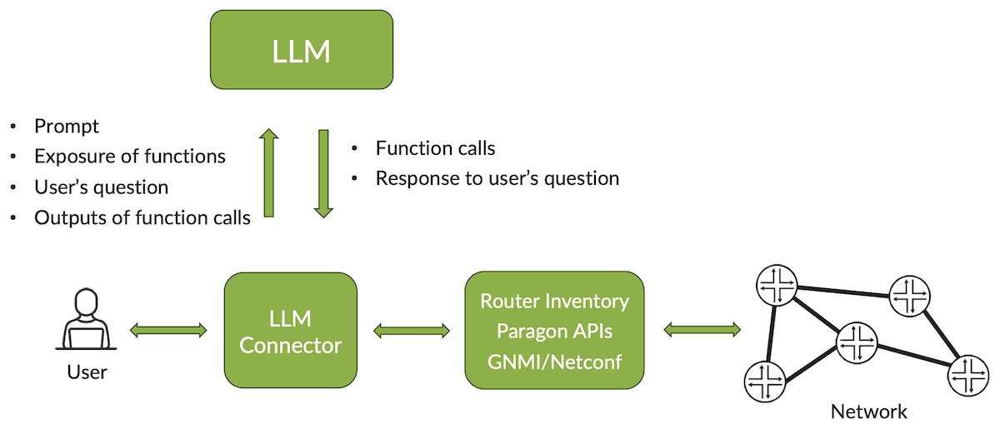

In Version 2.4, LLM Connector supports OpenAI and Llama LLMs. Interestingly, the "stock" version of the LLM is used - it has had no additional training about networking beyond the general content of the internet that it has been exposed to during its training. Sometimes, when using an LLM to support a specialist role, Retrieval-Augmented Generation (RAG) is used to provide access to domain-specific information that the LLM would not have had access to during its training. However, in our case we found that no RAG was needed, due to the large amount of networking-related information on the internet that LLMs are exposed to as a matter of course during their training. As a result, as we'll see shortly, LLM Connector does a remarkably good job of formulating useful replies to queries about the network without requiring RAG.

The LLM instance is provided by your organisation, rather than by Juniper. The chances are that your organisation already has an LLM in place for other purposes. This makes it easier to have the LLM instance conform to your company's policies. For example, it could be one that your organisation hosts on-prem, or could be one that your organisation purchases as a cloud service, for example Azure OpenAI.

As you know, LLMs are not perfect and can sometimes hallucinate or give responses that don't answer the user's request very well. For this reason, while LLM Connector can answer your questions about the network, we have made sure, at least for now, that it can't do anything that is potentially disruptive such as changing router configurations, shutting down ports or rebooting routers!

image shows the configuration of an LLM Connector profile on LLM Connector. You can create multiple profiles, each pointing to a different LLM, and switch between them, for example when experimenting with different LLM models to see which one suits you best, taking into account cost and performance.

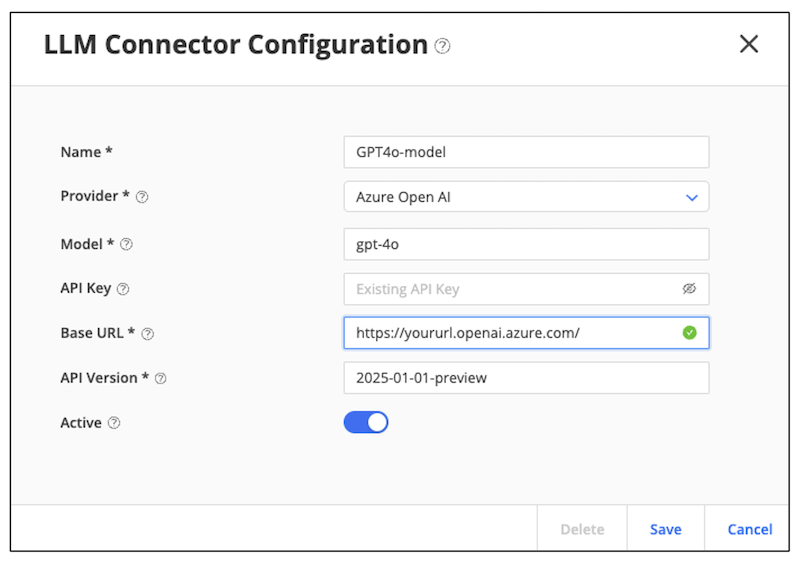

## Example queries

Have done that, LLM Connector is ready to use. You might be wondering what types of query LLM Connector can deal with, so let's ask it directly...

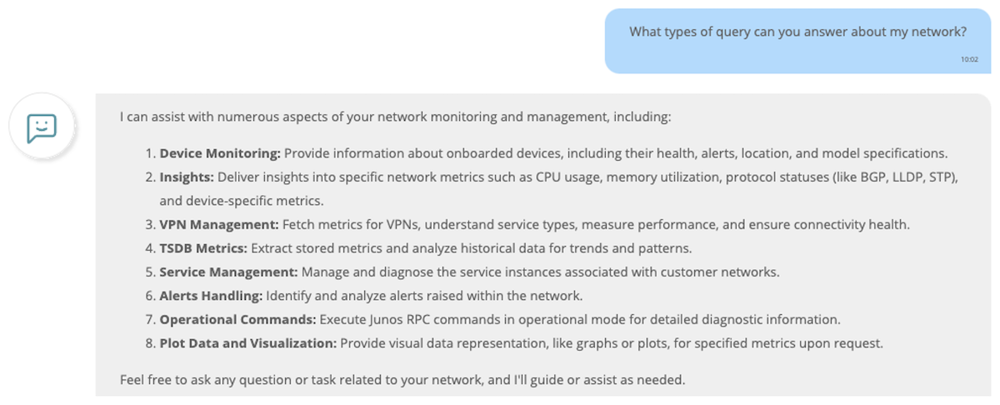

As you can see in its reply, LLM Connector supports a wide variety of queries related to monitoring and managing the live network.

LLM Connector is good at consolidating information from multiple locations in an easily digestible form. In the example below, LLM Connector has retrieved some of the information from Routing Director and other information from the individual routers in much less time than it would have taken the user to gather all of the information manually.

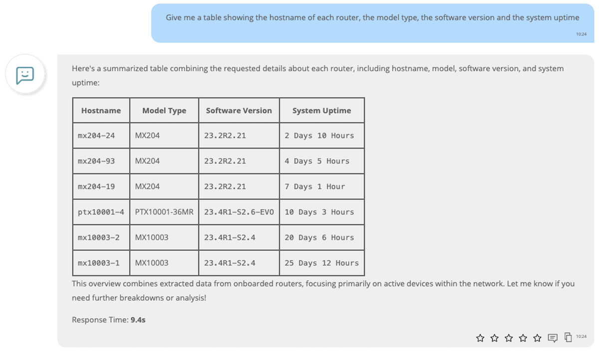

In response to the query below, LLM Connector does a good job of working out which router has the newest software, even though some of the versions deployed are quite similar and the release nomenclature involves a mixture of numerals, letters and punctuation.

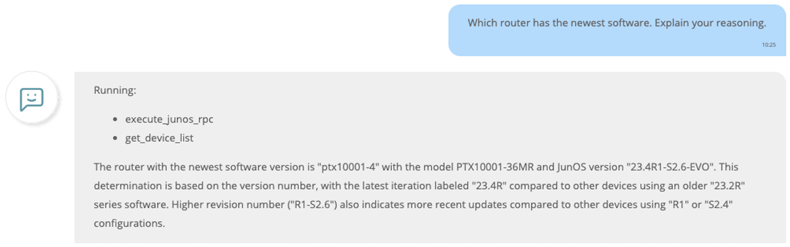

### Troubleshooting example: NTP

Let's see how LLM Connector can help with troubleshooting. First of all, let's ask for a list of critical alerts in the network. LLM Connector replies with a variety of alerts, including an issue with NTP on the router mx204-24.

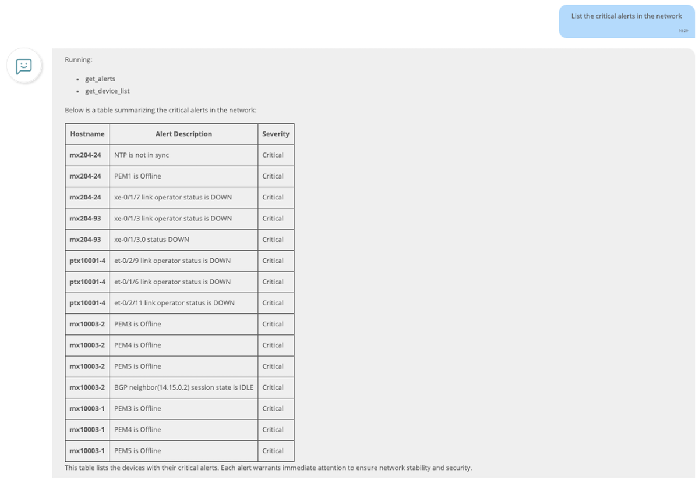

Let's now find out more about the NTP issue on mx204-24. As you can see below, LLM Connector gives some good advice about how to troubleshoot the issue:

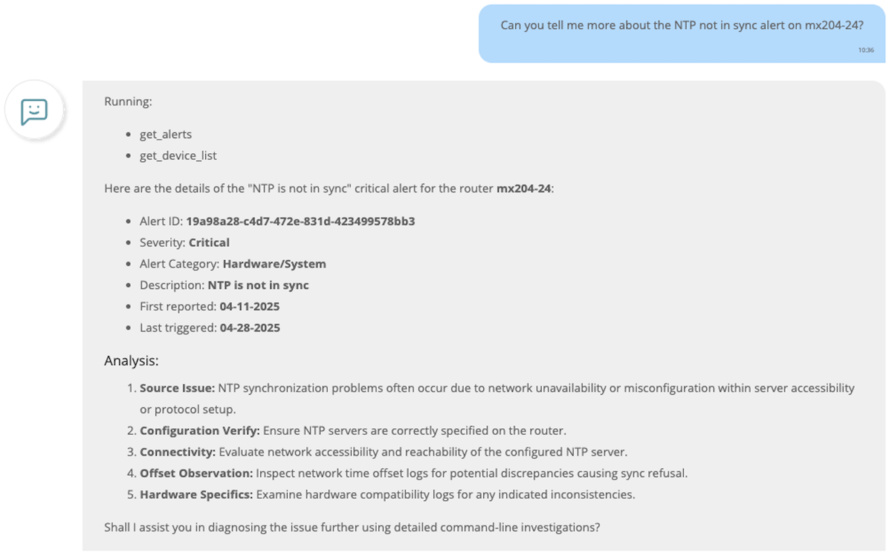

Let's take LLM Connector's advice about ensuring that the NTP server is correctly specified on router mx204-24. We'll start by asking what address is configured for the NTP server. LLM Connector in its reply gives the address of the NTP server that appears in the configuration. Very usefully, it also volunteers the fact that the NTP configuration includes a deprecated "boot-server" statement, even though it wasn't specifically asked to look out for this. LLM Connector also points out that this statement shouldn't affect synchronization (so we know it is not the root cause of the NTP issue on mx204-24), but that it is good practice to remove that statement from the configuration.

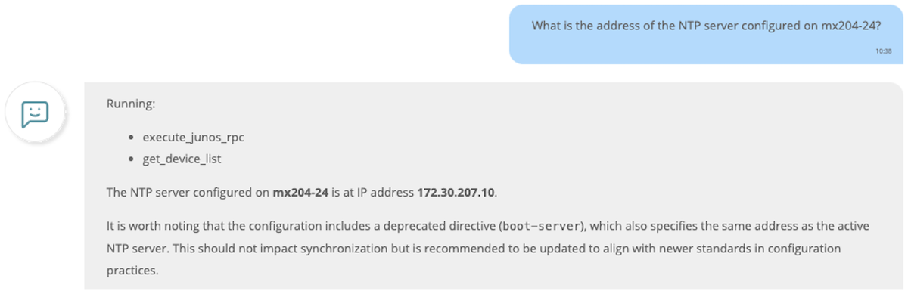

Let's now request LLM Connector to ping the address of the NTP server. As you can see from the output below, the pings timed out. It's interesting to note that in its response, LLM Connector mentions the NTP server, even though we did not mention NTP explicitly in the request. This is because it retains context from previous queries, so "remembers" that the address 172.30.207.10 is related to the NTP server configuration on mx204-24:

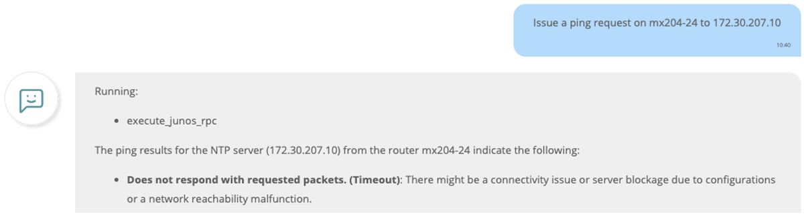

Given that NTP is not working on mx204-24, but is working fine on the other routers, let's get LLM Connector to show the NTP server address configured on each router. As we can see from the response below, the address is different on mx204-24 to the other routers, so the address on mx204-24 must be wrong!

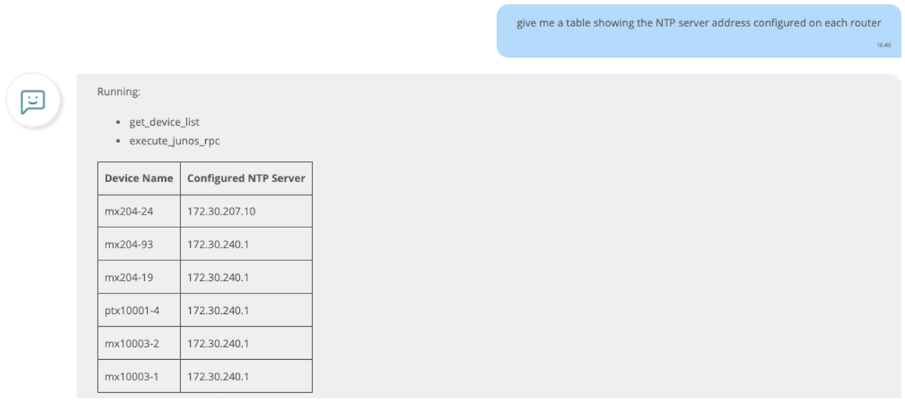

Let's now go onto the CLI on mx204-24 to change the address of the NTP server to the correct one, bearing in mind that LLM Connector is not permitted to change router configurations. We'll also remove the deprecated NTP boot-server configuration, as advised by LLM Connector:

```
jlucek@mx204-24> show ntp associations

     remote               refid           auth  st  t  when  poll reach  delay     offset   jitter rootdelay rootdisp
=====================================================================================================================
 172.30.207.10          .INIT.               -  16  u     -  1024    0    0.000    +0.000    0.000    0.000    0.000

jlucek@mx204-24> show configuration system ntp
boot-server 172.30.207.10; ## Warning: 'boot-server' is deprecated
server 172.30.207.10;

jlucek@mx204-24# delete system ntp
jlucek@mx204-24# set system ntp server 172.30.240.1
jlucek@mx204-24# commit and-quit
```

Now we can have LLM Connector check the NTP status again on mx204-24. As you can see below, NTP is now up and running on that router!

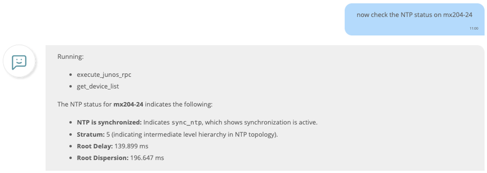

### Troubleshooting example: BGP

Let's now look at another troubleshooting example, this time involving BGP. First of all, we'll ask if there are any issues with BGP.  The LLM knows from its general training on the content of the internet that "Established" is the desired BGP state. As you can see from the output below, most of the BGP sessions are in that state. However, as you can see in the mx10003-2 section, one of the BGP sessions is in the Idle state. This is highlighted again by LLM Connector in the summary section as something that needs attention. LLM Connector correctly notes that mx204-19 and ptx10001-4 don't have BGP configured (they are P-routers).

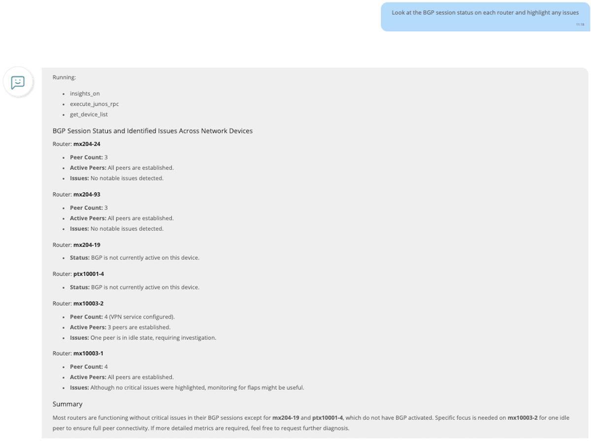

Let's investigate further by asking which BGP session is idle on mx10003-2:

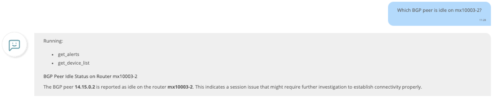

We need to work out what to do next, so we'll seek advice from LLM Connector about why a BGP session might be in the Idle state. In its reply, LLM Connector gives several good reasons why this might be the case.

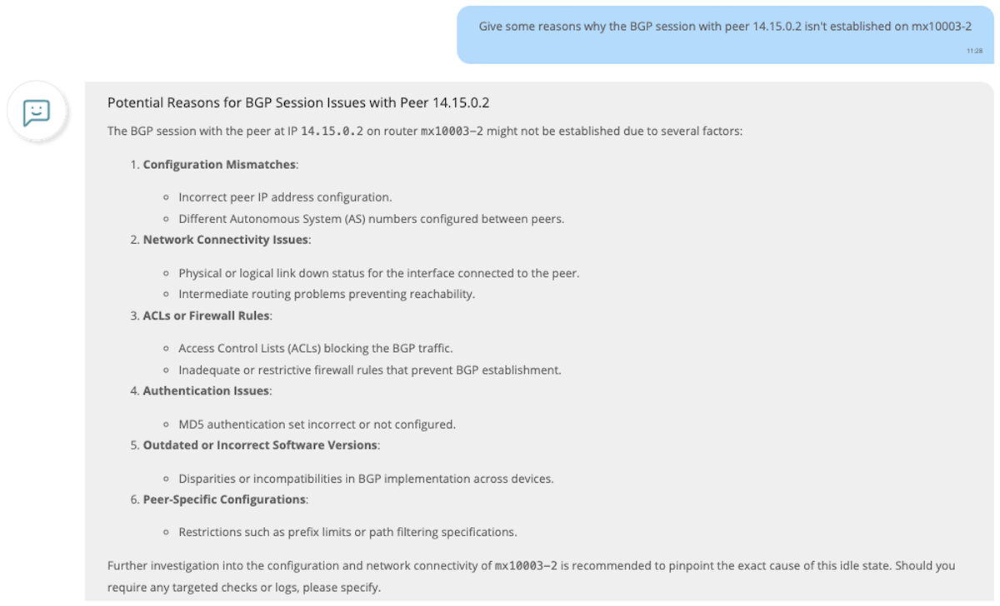

Let's check if potential causes 1 or 2 in the list above might be the issue, by requesting a ping to the configured peer address. LLM Connector replies saying the peer address is unreachable:

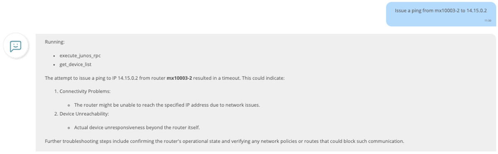

Now we'll tell LLM Connector to find out which interface on mx10003-2 is configured with the corresponding address, and then find out the status of that interface. As we can see from the output, the interface is administratively up but operationally down, so we have found the root cause of the BGP issue:

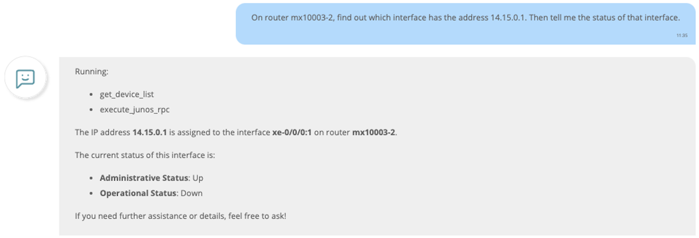

### Requesting Graphs from LLM Connector

The example outputs from LLM Connector shown so far have been text-based. However, LLM Connector can also present information in the form of a graph. Let's see an example, in the context of fan-speed troubleshooting. First of all, let's find out about any critical alerts on one of the routers. As you can see, the fans are spinning above the alert threshold:

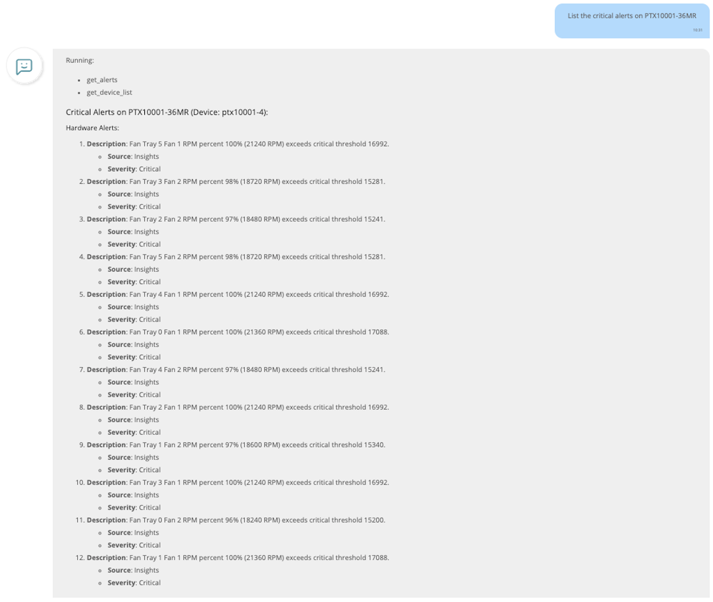

In order to find out for how long this has been happening, let's request a graph of the fan-speed on that router:

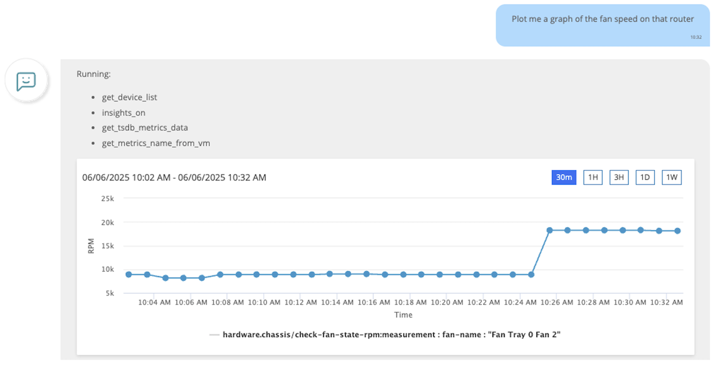

Let's ask why the fan speed might have increased. As you can see LLM Connector gives some useful advice about why this might be the case.

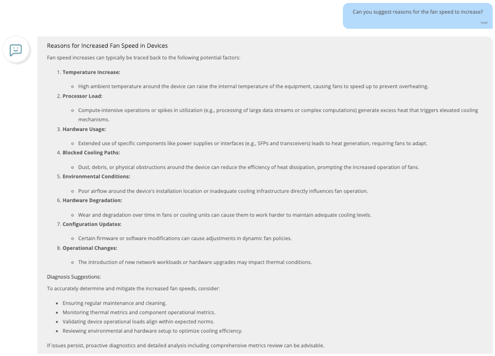

### Queries about VPN Services

LLM Connector can retrieve information from Routing Director about VPNs that it has orchestrated. Let's find out which VPNs are present on the network. LLM Connector responds by providing a table showing the name of each VPN, the associated customer and the VPN type:

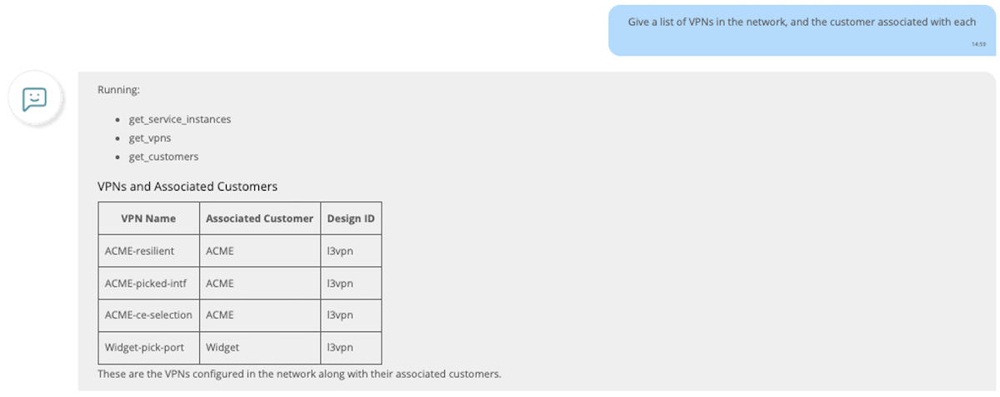

Now, let's ask for details about which PEs are involved in the ACME-resilient VPN. LLM Connector helpfully points out that the interface on mx204-93 is down, and that static routing is used in all the VRFs:

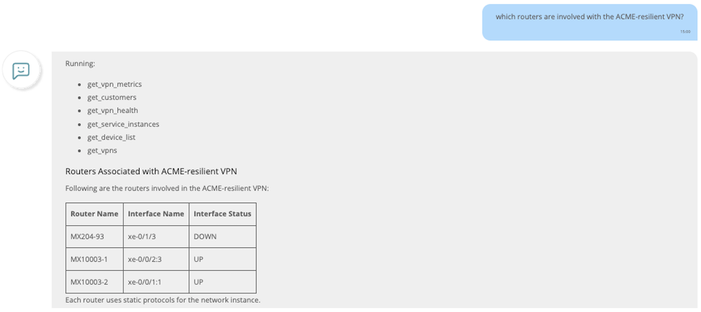

### Queries about Active Assurance

So far in this blog, the examples shown have been from Version 2.4. In version 2.5, LLM Connector can also retrieve Active Assurance performance measurements from Routing Director. Let's first find out what type of performance measurements the system is capable of. The output below shows that a wide variety of measurements are supported.

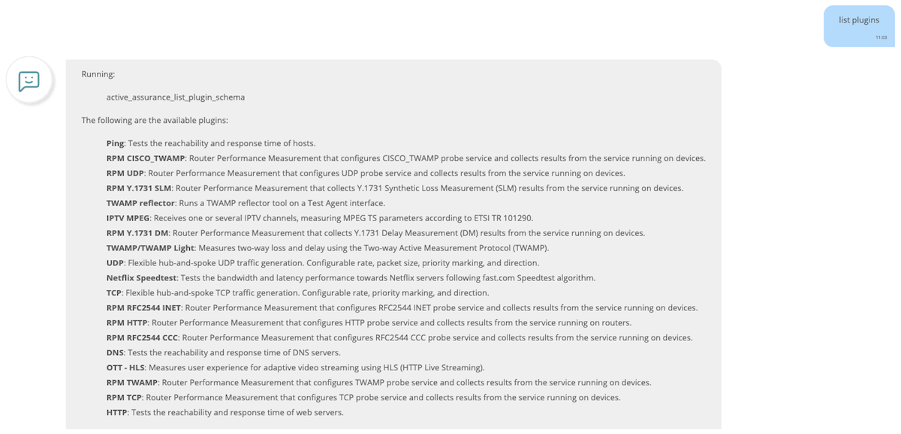

Now let's find out what are the five highest Round-Trip Times (RTTs) measured by the TWAMP monitors that are running in the network.

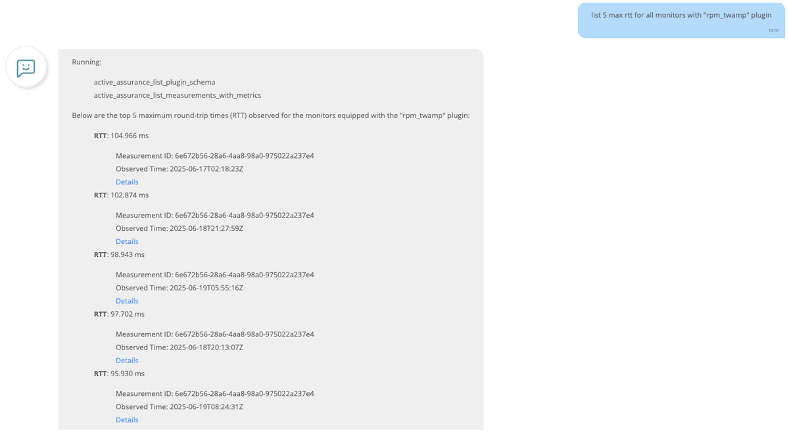

As can be seen from the output above, each of the five data-points has a link to more details about the measurement. Let's click on the first one. This takes us to the chart below, which is automatically centred on the data-point of interest, i.e. the peak delay value of 104.966 ms. We can also see some secondary peaks that occurred within the time-window of the chart.

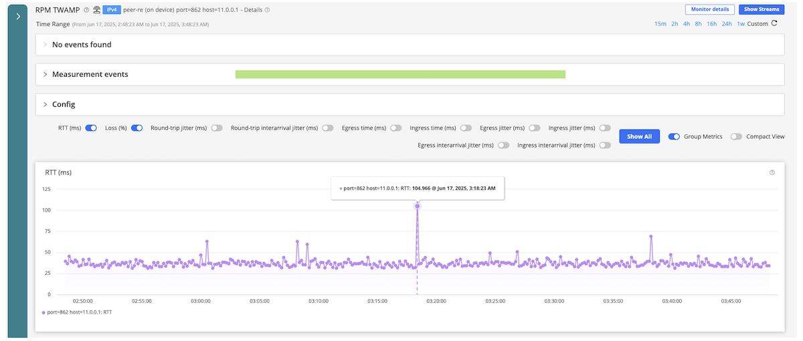

### Multi-lingual capability

As the LLMs that LLM Connector supports are trained on the general content of the internet, they have been exposed to many languages. This means that each user can converse with LLM Connector in their preferred language, independently of which languages other users on the same Routing Director deployment are using. In the example below, we ask in Polish for a list of VPNs in that are present on the network.

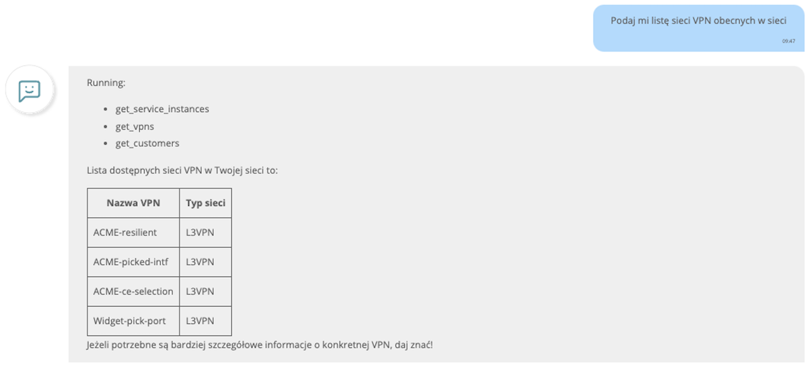

In the example below, we ask for details in Bulgarian about the alerts on mx204-24:

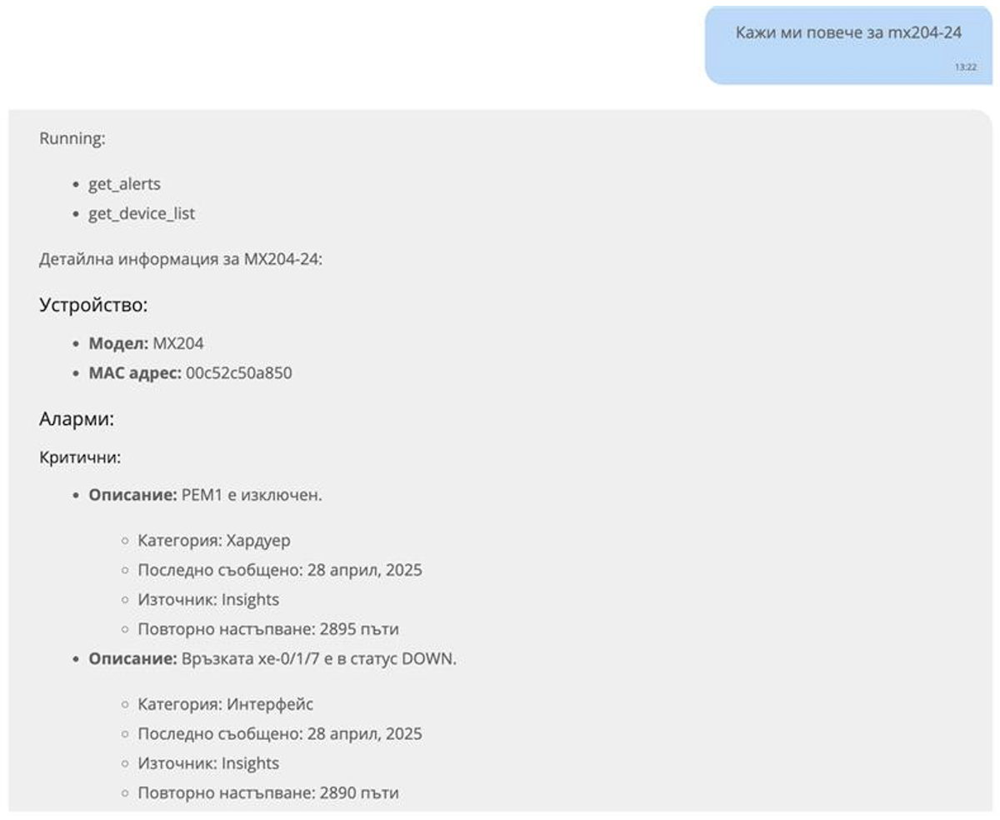

## Conclusion

We have seen that LLM Connector provides a very user-friendly way of finding out what is happening in the network using natural language. This saves the user a large amount of time and effort compared to the traditional approaches to monitoring and troubleshooting. The outputs are provided in a natural language format, accompanied by easy to read charts and tables.

## Useful links

- [https://www.juniper.net/gb/en/products/network-automation/paragon-automation.html](https://www.juniper.net/gb/en/products/network-automation/paragon-automation.html)
- [https://www.juniper.net/documentation/product/us/en/juniper-paragon-automation/](https://www.juniper.net/documentation/product/us/en/juniper-paragon-automation/)

## Glossary

- BGP: Border Gateway Protocol
- CLI: Command-Line Interface
- KPI: Key Performance Indicator
- LLM: Large Language Model
- NTP: Network Time Protocol
- PE: Provider Edge
- RAG: Retrieval Augmented Generation
- RPC: Remote Procedure Call
- VPN: Virtual Private Network

## Acknowledgments

This article has been prepared and co-written by Julian, Vijay Gadde, Harsha Lakshmikanth, and Nilesh Simaria.