# LLM Inference - Hw-Sw Optimizations

**Sharada Yeluri - 02/20/2024**

Details of LLM inference workflow, how it differs from training, the many hardware/software optimizations that go into making inference efficient, and the Inference hardware landscape.

Article initially published on LinkedIn in January 2024 at: [https://www.linkedin.com/pulse/llm-inference-hwsw-optimizations-sharada-yeluri-wfdyc/](https://www.linkedin.com/pulse/llm-inference-hwsw-optimizations-sharada-yeluri-wfdyc/)

It's a sequel to "[Large Language Models - The Hardware Connection](https://juniper.github.io/techposts/gpu-fabrics-for-genai-workloads/article)"

## Introduction

In the context of LLMs, inference refers to the process of getting a response from the trained LLM model for the user's query or prompts. Inference is a critical step in deploying LLMs. But a lot goes before the model is deployed for production.

First, the trained model goes through several optimizations to reduce the memory footprint and computational intensity of the model. The optimized model is compiled for the specific hardware (GPUs or inference accelerators). The compiled models are stored in file servers of the inference serving systems. Inference serving system refers to the entire infrastructure and software ecosystem designed to manage and serve AI/ML models for inference. They vary in complexity and features, but generally, they all contain several key components.

The load balancers (software applications) distribute the user requests among many inference servers, which are, again, SW applications hosted on the CPUs. A cluster of GPUs or inference accelerators is associated with each inference server. Inference servers are responsible for copying the compiled models from the file system to accelerator memories. When they receive the user requests directed to them, they batch multiple requests together to improve the overall throughput and send the requests to the inference accelerator clusters to be executed. These servers also pre-process the input data and post-process the results. Other functions include monitoring the system's throughput, security, etc. The Triton Inference server from Nvidia is an example of an inference server.

The goal of inference-serving systems is to provide fast, reliable, and scalable responses to inference requests in public clouds/data centers while keeping the total cost of ownership (TCO) low. This is a challenge when it comes to LLM models due to gigantic model sizes and the auto-regressive nature of LLM inference, where tokens are generated sequentially for every query.

As LLM inference workloads are increasing in public clouds and with enterprises seeking to have inference systems local in their data centers (to avoid paying premiums to public cloud providers for each query), there is a frenzy of activity in academia, start-ups, and hyper scaler research labs to optimize all facets of inference. This article tries to capture the latest on this topic.

***Disclaimer**: I am a Juniper employee, but the opinions expressed in this blog are my own and do not necessarily reflect those of my employer. *

## LLM Training Refresher

A quick refresher on LLM training (borrowed from my previous article) is given below.

To train an LLM using natural language text, large amounts of data are typically gathered using web scrape, Wikipedia, GitHub, stack exchange, Arixiv, etc. The vast amount of text from these data sets is first tokenized, often using methods like byte-pair encoding. Tokenization translates the raw text from the internet into a sequence of integers called tokens. A token generally represents a word. But it could be a subword, too. For example, the word "unhappy" might get broken into two tokens - one for the subword "un" and the other for the subword "happy."

Depending on the dataset, there could be tens of thousands of unique tokens, and the dataset itself could map to hundreds of billions of tokens. Sequence or context length is the number of consecutive tokens the model will look at when predicting the next token during the training. The sequence length is ~2K in *GPT-3 *and *LLaMA2* (LLM from Meta).

To train the model, the tokens are broken into the array of size *batch_size (B) x sequence length*, and these batches are fed to large neural networks with transformer layers. The model is trained to predict the next word given the input sequence. The training often takes weeks, if not months, and requires large clusters of GPUs. Once the base model is trained, it typically goes through Supervised Fine Tuning (SFT). This important step tricks LLMs into acting as assistants, answering questions to human prompts! In supervised fine-tuning, human contractors create a curated dataset in the form of a prompt followed by a response, and the base model is retrained with this dataset. The trained SFT model now becomes an assistant capable of giving human-like responses to user prompts.

### Attention is all you need!

All LLM models contain several layers of transformer blocks. The "attention" mechanism, as described in the seminal "attention is all you need" paper, is at the core of these transformers. This allows the model to focus on the most relevant parts of the input sequence while predicting the output token. It enables the model to capture long-range dependencies and better understand the context.

"Attention," in human interactions, generally refers to our ability to focus on a few things and ignore other things that seem irrelevant at the time to get the context quickly. For example, the word "bank" could mean food bank, word bank, or financial institution. But, when we hear the sentence "I am going to the bank to deposit my paycheck," the brain immediately understands the word "bank" as a financial institution by taking clues from different parts of the sentence. "going to" implies the bank is a physical location. "deposit my paycheck," tells the place is a financial institution. We do this contextualization naturally, a skill without which we would not have been where we are today!

The transformer blocks in the LLM models teach the model to do the same. They were originally introduced for machine translation - translating a sentence from one language to another by getting the relevant context. Later on, these transformer blocks literally transformed the world (no pun intended) by being able to predict the next word in the sequence with the context they have learned from the input sequences.

Understanding and appreciating the transformer architecture fully requires a deep machine learning/AI background, which is beyond this document's scope. However, a general overview of the computational complexity during training/inference of the models with transformer layers is needed to understand some of the inference optimizations that are discussed later.

## LLM Inferencing

As mentioned earlier, a trained LLM model is essentially a next-token predictor given an input sequence of tokens. In order to generate full responses to users' queries, the model (inference) server takes the output token from one iteration of inference, concatenates it to the user input sequence, and feeds it back into the model as the new input sequence to predict the next token. This process, where the output is fed back to the input to predict the next output, is referred to as "auto-regressive" computation. This process repeats until it reaches a predefined stopping criteria.

### Steps to Predict the Next Token

Let's first look at the steps involved in predicting an output token from an input sequence using a trained model.

- The input sequence from the user is first tokenized in the same way the model's training data was tokenized. Then the tokens are fed to the trained model.
- As the first step of model execution, the input sequence is converted into an embedding vector in the embedding layer of the trained model. This vector essentially translates the token into a high-dimensional space where similar tokens have similar vectors. During the training, the embedding vectors for all tokens in the model's vocabulary are computed and adjusted in a way that tokens with similar meanings or used in similar contexts have embeddings that are closer to the vector space.
- Using the token embeddings, queries, keys, and values for each token are computed through a process known as linear projection. Here, each token's embedding vector is multiplied by separate weight matrices learned during the training to produce the query, key, and value vectors.

**Key Vector (K)**: The key vector for a token determines the influence or 'attention' that token should have on other tokens in the sequence. It encodes information about the position and context of that token in the input sequence. This "key" space" of the input sequence will be compared against the queries.

**Value Vector (V)**: The value vector represents the actual information or content of the token, carrying the information that will be used in the output.

**Query vector (Q)**: The query vector for each token is used to probe all the keys in the input sequence to determine how much focus or attention each part (token) of the input sequence should receive for this specific token.

- The concept of using queries, keys, and values is directly inspired by how databases work. Each database storage has its data values indexed by keys, and users can retrieve the data by making a query and comparing if the key value matches the query. In the LLM case, the queries are generated by the model itself. The key values are not directly compared to the query, but the relevance of each key to the query is computed using a compatibility function to generate a weight vector.
- An attention output is computed for each query as the weighted sum of the "values" using the weight vector computed above.

The attention function can be simultaneously computed in the hardware on a set of queries, packed into a matrix Q. The keys and values are also packed into matrices K and V.

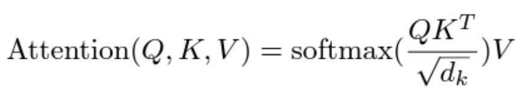

*The famous equation for attention function is from the paper "Attention is all you need."
dk is the dimension of the key vector.*

- This attention output goes through a prediction (or decode) layer, which assigns probabilities to each token in the entire vocabulary of the model, indicating the likelihood of that token being the next one.
- One can sample from the predicted probability distribution to choose the next token probabilistically or select the token with the highest probability as the predicted next token.

This is an *oversimplified* explanation of the LLM inference. The actual LLM models are huge, with multiple transformer blocks that do multi-head attention modules and feed-forward layers.

### Steps to Generate the Full Sequence

Now, let's look at how the inference serving system generates the full response to the user.

1. Prefill/Prompt Phase: The model is given the input sequence from the user. Based on this input, the model predicts the very first output token. This first token prediction is often referred to as the prefill or prompt phase. Since the entire input sequence of tokens is known in the prefill phase, the inference accelerator can compute the key-value pairs and query vectors for all input tokens in parallel and predict the next output token by executing the model with the Q, K, and V vectors.
2. Feedback Loop: The generated output token is then concatenated to the input sequence.
3. Sequential Prediction: This updated input sequence is fed back into the trained model, which then generates the next token. When generating this output token, the model needs to compute the key-value pairs for all the tokens in the updated input sequence, which is essentially the previous input sequence concatenated with the previous output token. By saving the key-value pairs computed in the previous iteration, the LLM inference system could just retrieve those key-value pairs from memory. It then needs to compute the key-value pair only for the previous output token. This caching of key-value pairs is done mainly to save compute cycles of the inference accelerators at the expense of increasing the memory requirements during inference.
4. Continuation: The steps (2) and (3) together are referred to as **the decode phase or token generation phase**. These steps continue where each new token is generated based on the cumulative sequence of all previous tokens. This autoregressive feeding of the output tokens to the input ensures that the model's output at each step is influenced by all the preceding tokens, allowing it to maintain context and coherence.
5. Termination: When the model reaches a stopping criterion, it terminates the process. The stopping criterion could be one of the following: **Maximum Sequence Length**: The model stops once a defined limit on the number of total tokens (input and output tokens) is reached. **End-of-Sequence (EOS) Token**: The model generates a special token that signifies the end of a text generation. This token is part of the model's training, where it learns to recognize natural endpoints in texts. **Contextual Completion**: The model stops when it determines that the generated text has reached a natural and logical conclusion based on the context provided. This stopping criterion ensures that the model's output is controlled and relevant to the input.

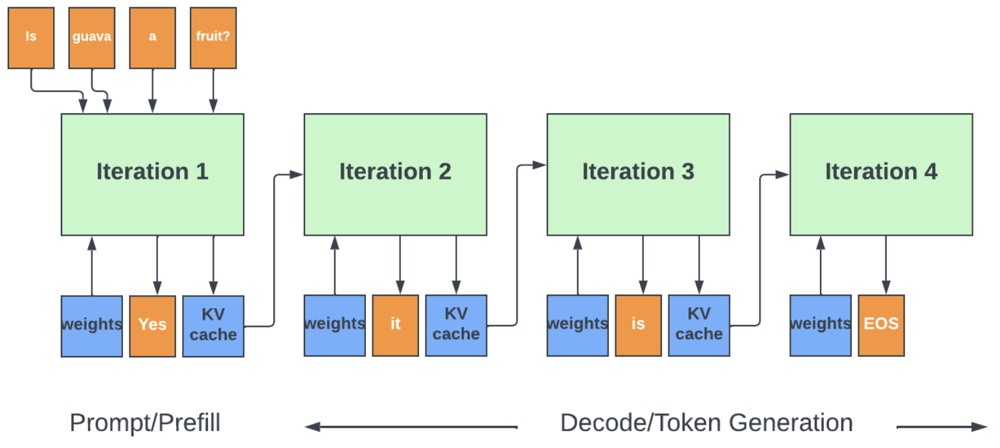

The prompt phase generates the first token ("Yes"). After that, inference happens auto-regressively until all tokens are generated.

When a user prompt exceeds the sequence length on which the model was trained, the inference server automatically truncates the input, typically keeping the most recent part of the prompt. This approach assumes that the most recent context is often the most relevant for generating the response. As LLMs advance, there's a growing need to handle longer prompts. Prompt compression techniques have emerged to address this challenge. One method used in LLMLingua involves compressing the prompt using a smaller language model to identify and remove less important tokens. This enables efficient inference from compressed prompts while maintaining the essence of the original input.

Note that during every iteration of the decode phase, only one output token is generated. The matrix-vector operations to generate a single token at a time underutilize the GPU compute ability compared to the prefill phase. In the decode phase, the speed at which the parameters and the key-value pairs are read from the GPU memory dominates the throughput. Thus, the decode phase is memory bound, compared to the prefill phase, which is compute bound.

### LLM Inferencing System's Metrics

A few key metrics are often used to compare/evaluate different LLM serving systems.

**Time To First Token (TTFT)**: This measures the time taken from receiving an input prompt to generating the first token of the response. It's an important indicator of the model's responsiveness, particularly in real-time user-facing applications. This depends heavily on the scheduling algorithm the model server uses to feed the user inputs to the model, the partitioning of the model across the inference accelerators in the cluster, the accelerator's performance (FLOPs), and the interconnect latency.

**Time Per Output Token (TPOT)**: This is the average time the model takes to generate individual tokens in response to the input prompt. This metric assesses how each user will perceive the model's speed. For example, a TPOT of 100 milliseconds/token would be 600 tokens per minute. Since some tokens could also represent partial words, 600 tokens would typically contain ~450 words. 450 words per minute (WPM) is faster than the rate at which most of us can read (200-300 WPM).

TPOT and TTFT are important metrics to keep users engaged with the LLM applications. The total latency for the response is the sum of TTFT and the *TPOT * number of tokens* *generated*.

**Throughput**: While the prefill phase is compute-intensive, the decode phase is memory-bound, where parameters and key-value pairs are read from the GPU memory to compute the next token. In order to increase the efficiency of GPUs, the inferencing systems often batch together multiple user prompts for inference. By batching, the memory read cost can be amortized across all the user requests, and in addition, GPU computing can be used more efficiently by doing parallel computing across large batches.

The throughput of an inference server is the total number of output tokens per second the server can generate across all user requests.

**Tail Latency**: Refers to the latency at the high percentiles (e.g., the 99th percentile). It represents the worst-case response times that only a small fraction of requests experience. In user-facing real-time applications like chatbots/co-pilots, tail latency is critical. High tail latency can lead to poor user experiences, even if the average latency is low.

**Model FLOPS Utilization(MFU)** is the ratio of the observed throughput to the theoretical maximum throughput of the hardware accelerator used in inference.

In any inference serving system, the lowest TTFT and TPOT per user and the highest throughput are desired. However, trying to increase the throughput using larger batches (more users) is not always feasible. There are inference accelerator memory limitations, as each user's inference process takes up a significant chunk of GPU memory to store the key-value pairs. Also, each user's prompts are of different lengths, creating complexities in scheduling.

### Accelerator Memory Requirements

In order to have the best inference metrics, ideally, all the weights of the trained model should be in the inference accelerator's external memory (typically, HBM memory). GPT-4, the largest LLM model deployed today, is rumored to have ~1.7T parameters. This translates to 3400GB of memory if the parameters are stored in 16-bit floating point representations.

If Nvidia's H100 GPUs, with 80GB memory capacity per GPU, are used as inference accelerators, the inferencing system would require ~40 GPUs (or 8 GPU servers) to store the parameters alone.

In addition to parameters, inferencing systems also store the key-value pairs to save on computing costs. The equation for the maximum memory size for the key-value (KV) pairs:

***Total size of KV cache in bytes = (batch_size) x 2 x (sequence_length) x (num_layers) x (hidden_size) x SizeOf(FP16)***

The sequence_length is the maximum number of tokens (sum of input and output tokens) allowed per user request for the model. Factor 2 is for each key and value in the KV pair. These are usually stored in 16-bit precision format (2Bytes each). num_layer is the number of transformer attention layers. The hidden_size is the dimension of the model-specific attention layer.

Since each user request in the batch has its own KV cache, the memory required is directly proportional to the number of requests in the batch or the batch size.

Since it is impossible to know a priori how many output tokens will be generated, inferencing systems can take a conservative approach of allocating the space for the maximum sequence length number of KV pairs for each user in the batch and for each attention layer.

As shown in Table 2, at large batch sizes, with this conservative approach, the KV cache dominates the total memory required.

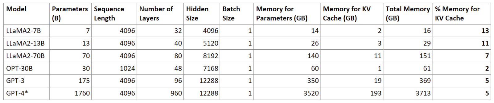

*Table 1. Memory Requirements for Inference grow linearly with batch sizes with static allocation of KV cache.
GPT-4 model numbers are approximations.
At batch_size of 1, the KV cache memory is a small percentage of total memory.*

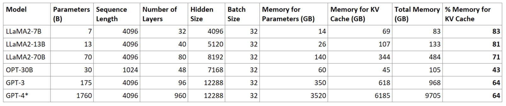

The more requests there are in a batch, the more inference accelerators are needed to distribute the KV-pairs and the parameters.

- Smaller batches improve the latency for each request. But, when the batch size is small, the computations are done faster, and it is hard to hide the memory latency of fetching the next set of parameters behind the computations. Computations could stall while waiting for the memory reads, and engines could be underutilized. For smaller batches, the available memory bandwidth in the inference accelerators is a better predictor of the throughput than their peak compute performance. At smaller batch sizes, the memory cost is dominated by the time to read the model parameters from memory, as the KV cache is a small fraction of the total memory used.
- Larger batches increase compute (FLOPS) utilization. Inference accelerators are expensive, and increasing their utilization is extremely important to keep the inference cost low. But, at the same time, larger batches take up more memory for KV caching, which in turn might require more accelerators in the inference system. At larger batches, the memory cost is dominated by the time to load/update the KV caches for each request in the batch.

The batch size used by inference serving systems depends heavily on the number of inference accelerators each model server can use, the latency, and the TCO metrics the system is trying to meet.

Reducing the memory footprint of the model without compromising the inference metrics is a hot topic. The next section covers all the techniques (used/emerging) to improve inference efficiency and reduce memory footprint.

## Optimizing the Inference Cost

**Model Architecture Optimizations**

- Enhanced attention mechanisms
- Model distillation

**Memory Optimizations**

- Model optimizations like quantization and pruning to reduce the memory footprint and the compute intensity of inference.
- Dynamic allocation of memory for KV cache to reduce memory fragmentation and improve throughput.
- Storing model parameters in server memory and prefetching before execution.

**Throughput Optimizations**

- Optimal model partitioning across the accelerators.
- Improved batching schemes to reduce the dead cycles when some requests in the batch finish earlier than the other requests.
- Speculative/multi-token predictions

**Hardware Optimizations**

- Dedicated hardware for inference vs. general-purpose GPUs.
- New numbering formats like logarithmic or 4-bit representations of floating point/integer formats. Native implementations of linear functions.

The following sections detail each of the above topics.

## Model Architecture Optimizations

### Attention Enhancements

All LLM models do **multi-head attention** in their transformer blocks. It allows the model to simultaneously attend to different aspects of the input sequence, leading to a more comprehensive understanding. A transformer with two attention heads has two sets of learnable parameters (weights) for queries, keys, and values.

Each attention head operates independently and calculates its own attention scores. This allows each head to focus on different types of relationships, like long-range dependencies, syntactic structures, or semantic similarities. The attention function output of each head is then concatenated, creating a single vector that captures the combined information from all the different perspectives. This then goes through the rest of the processing to predict the next token.

Mutli-head attention with N heads increases the computational and memory complexity N times. But, it generates more coherent, consistent, relevant, and meaningful outputs.

To overcome the increase in computing and memory costs, the attention layer dimension could be reduced linearly by the number of heads to keep the computational costs similar to single-attention head models (without significant performance loss). Multi-head attention models use tensor parallelism, where each head of a transformer block could be computed in separate tensor-parallel GPUs to reduce the inference time.

Multi-query attention is a variant of multi-head attention that gets similar results but with only one set of key-value pairs. It creates multiple "queries" (questions) for each token but uses the same set of keys and values. With shared keys/values, the parameters and KV cache values need to be loaded only once from the memory, thus reducing the memory requirements.

Optimizing the attention mechanisms is a hot area of research, and new mechanisms are being developed to address complex relationships in the input data, especially with multi-modal inputs, etc. It is beyond the scope of this document to cover all the details.

### Model Distillation

Model distillation is the process of transferring the "distilled" knowledge from larger trained models (teacher model) to a smaller and more efficient model (student model) so that the student model retains the performance of the teacher model while reducing the compute and memory resources needed for inference.

The student model is usually a truncated version of the teacher model where multiple transformer layers are removed. It can be trained using the output probabilities (soft targets) generated by the teacher model. Soft targets provide more information per training example, such as the relative probabilities of incorrect answers. In some cases, the student model is also trained to replicate intermediate representations (like activations of certain layers) of the teacher model.

The model distillation allows the deployment of language models on devices like smartphones and embedded systems that are resource-constrained compared to the high-end GPU/accelerators found in the data centers. This can also be deployed in edge applications where rapid response times are crucial.

However, distillation is an emerging field. Some smaller models like BERT (100-200M parameters) have shown good results with distillation, with 40% fewer parameters in the student model and almost similar performance as the original BERT model. This is yet to be proven for hundreds of billions of parameter LLM models.

### Speculative Execution

During the inference's decode phase, the output tokens per user request are generated one token at a time. The Nth token depends on all the (N-1) tokens before it. This process is heavily memory-bound. It also adds to the total latency of inference.

What if a model is able to generate multiple output tokens? That is where speculative execution or speculative sampling can help. A smaller and faster "draft" model is used to generate K consecutive output tokens. Then, using the main model, these generated tokens are verified parallelly. For example, if the draft model generates 3 tokens and the first two tokens match what the main model would have predicted, then the next iteration starts after appending these two tokens to the input and repeating the steps again. This adds additional compute overhead, but the assumption here is that when the execution is memory-bound, the inference accelerators have idle cycles, and using them to do more parallel computation should help overall.

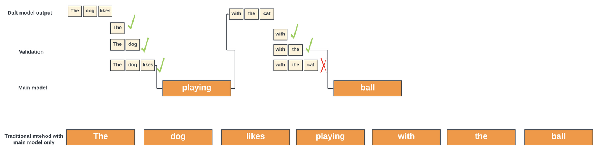

*An illustration of how speculative decoding can speed up inference.
Picture not drawn to time-scale. This is for illustration only.*

## Memory/Compute Optimizations

### Optimizing KV Cache

Batching is critical to improving the throughput of LLM inference systems. However, as seen in the previous sections, the KV cache size increases linearly with the batch size with the conservative allocation of memory for the KV cache. While the scheduler knows the size of the input sequence, it does not know the length of the output sequence generated, and doing this conservative allocation ensures that the memory does not overflow.

While this approach is straightforward, it overprovisions the inference accelerator's memory for caching - as a result, the system could either end up using more engines than needed or use smaller batches and have reduced throughput.

PagedAttention addresses this problem using the operating system's well-known solution for memory fragmentation, i.e., virtual memory with paging. Instead of allocating a contiguous space in the memory for a request's KV cache, the memory is allocated in blocks dynamically. The blocks are not necessarily in contiguous space in the inference cluster's memory. The scheme manages the KV cache in a flexible way. It allows the sharing of memory between multiple requests and reduces the overall memory requirements 2-4x for the same batch size. This increases the total throughput 2- 4x over KV caches with fixed allocations.

This scheme doesn't guarantee perfect utilization of memory, but it significantly reduces the wastage from ahead-of-time allocation schemes used widely by all the inference frameworks before this scheme was published.

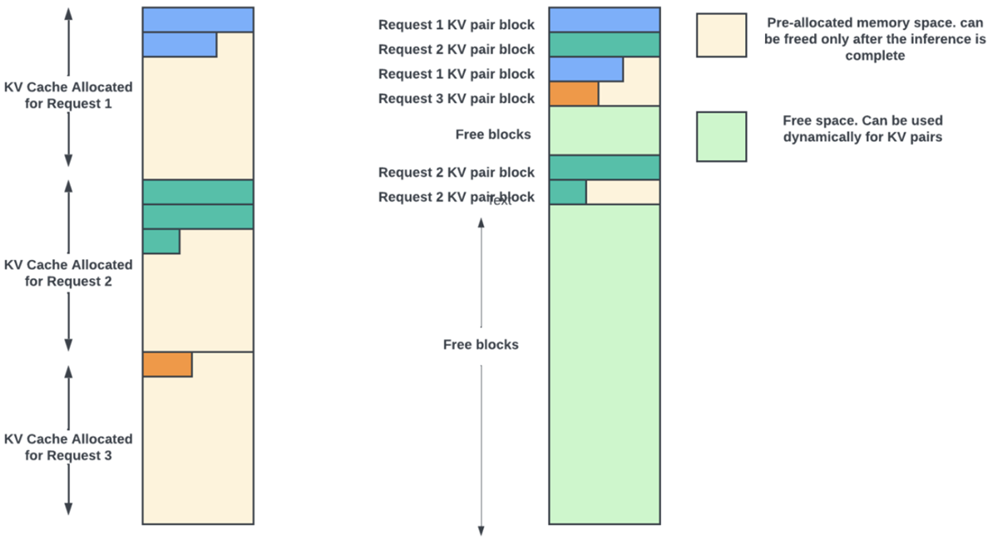

*Simple illustration for dynamic allocation of memory blocks for KV cache. *

Without this, every user request needs allocation for maximum sequence length times of KV pairs. With dynamic allocation, memory blocks can be allocated during run time.

As with a virtual memory scheme, when no physical blocks are left in the accelerator's memory, it selects a few user requests and evicts their KV-pair values to the server's CPU memory. After that, it stops processing those evicted requests and stops accepting new requests. Once any active request completes execution, its memory blocks are freed, and the preempted requests are returned to the GPU memory to continue processing. All major LLM serving systems (including Nvidia's TensorRT-LLM) have adopted this method for throughput gains.

### Quantization

Most of the models these days are trained with either 32-bit or 16-bit precision floating point numbers for weights and intermediate activations. Quantization refers to a technique used to reduce the model's size and computational requirements by decreasing the precision of its parameters and/or activations. There are two forms of quantization: post-training quantization and quantization-aware training.

**Post-training quantization (PTQ)** applies quantization to the model weights (parameters) after it has been fully trained. This is done before the model is deployed for inference. This method converts the weights to lower precision, like 8-bit integers (INT8) or 8-bit floating points (FP8). Quantization is done by first calculating the scale factor from the range of weight values for each layer. The model weights for that layer are scaled using the scaling factor. The scaled values are then rounded to the nearest integer (when converting to INT8). Finally, these rounded values are cast to 8-bit integers.

Activations can also be quantized by passing representative data through the model, recording the activation values, and computing the ranges. Then, these ranges are mapped to a lower precision format similar to the weights.

As the model size continues to grow to hundreds of billions of parameters, outlier features of high magnitude start to emerge in all transformer layers, causing the failure of this simple per-layer quantization technique. Methods like quantization at different precisions for weights vs. activation, using mixed precision where some activations use 16-bit, and others use 8-bit precision, are proposed.

Not all quantization techniques would result in memory/compute savings if the underlying hardware can't take advantage of it. For example, if the inference accelerator does not support INT4 format in matrix multiplications, then casting a weight to INT4 does not help in any way.

**Dynamic Quantization (Post Training Dynamic Quantization)**: In this method, the weights of the model (either all layers or selective layers) are quantized to lower precision numbers before the inference run. This is done by the inference server after it fetches the model from the storage system and before it uploads the model into the accelerator clusters.

In addition, the inference accelerator can also quantize the activations natively on the fly during the model execution. This method can adapt to the varying range of activation values, leading to better accuracy. Several inference accelerators support quantization in the hardware to speed up the dynamic quantization of the activations.

**Quantization-Aware Training (QAT)**: In this method, after the initial training, the model is fine-tuned (re-trained) using lower precision weights. This technique is robust to quantization effects, leading to better accuracy. QAT is compute-intensive as it requires retraining. It also adds a burden on the inference serving systems to save/manage many quantized versions of the same models, as the user requirements can vary.

Almost all inference frameworks support post-training quantization to speed up the computation time and reduce memory footprint. I barely scratched the surface of this topic. Refer to the documentation from various inference frameworks for a deeper understanding of the many flavors of quantizations.

### Logarithmic Numbering format

At the Hot Chips 2023, Dr. Bill Dally from Nvidia talked about a 4-bit log number format to continue scaling past INT8. With log numbers, multiplications and divisions essentially become additions and subtractions. This could reduce the energy needed to do complex matrix multiplications. But addition/subtraction is more involved. Some implementations use lookup tables. However, those are expensive and do not scale well for AI inference workloads. In his presentation, Bill Dally showcased Nvidia's novel technique for multiply-accumulation. Nvidia may be using a logarithmic number system in some of its next-gen inference accelerators. A slew of start-ups, as well as research labs, are exploring various 4-bit number formats!

### Pruning

In the trained LLM models with billions of parameters, some parameters are more critical than others for performance. Pruning a network involves identifying and keeping these significant weights while discarding the less important ones. By pruning the weights, the model becomes compact, takes up less memory space, and also needs fewer computational resources. The challenge is to remove as many weights as possible without impairing the network's ability to make accurate predictions.

Pruning is typically done after the model is trained. In this post-training pruning, the model needs to be fine-tuned after the pruning to regain the performance.

The techniques used are either weight magnitude-based pruning or structured pruning. In weight magnitude-based pruning, the neural network weights are ranked based on their absolute values. Weights with the smallest absolute values (closest to zero) are considered the least important and are pruned or zeroed out. While the network becomes sparser, this sparsity is unstructured, which may or may not lead to actual computational efficiency improvements in the hardware as the hardware is not designed to skip over random zeros in the weights when doing matrix multiplications!

To benefit from the unstructured sparsity in the large weight matrices, the common inference frameworks support sparse matrix multiplications, where they can algorithmically map large sparse matrix multiplications to smaller dense matrix multiplications in the hardware. For example, in one approach, a large weight matrix can be broken into several smaller blocks, and the compiler identifies blocks that are entirely zero, skipping the storage and computations on these blocks.

Even if the framework used does not support sparse matrix multiplications, sparse weight matrices can be compressed and stored in the accelerator memory using standard compression algorithms, and the hardware could natively decompress the weights before use. This reduces the memory requirements at the expense of decompression logic in the hardware.

Structured pruning involves removing structural components of the large models, like entire layers or attention heads. In some types of structured pruning, two out of every four weights in a weight matrix are pruned to zero to enable compressed weights to be stored in the accelerator memory with additional 2-bit indices for each weight, as shown in the diagram below.

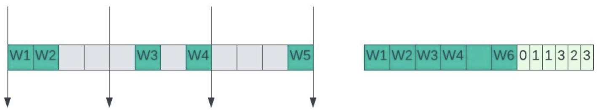

The compressed matrix is half the size with a small overhead to indicate the original position of each weight to help matrix expansion in hardware.

Pruning can also be done before training. In this technique, weights are initialized randomly before training starts. A certain proportion of weights are selected to be pruned randomly. The pruned weights are held at zero during training. This pruning at initialization (PAT) is inspired by the "Lottery Ticket Hypothesis," which suggests that within a large, randomly initialized network, there may exist smaller subnetworks ("winning tickets") that can achieve comparable performance to the full network when trained in isolation from the start. However, this method has not yet been used on LLM models.

### Sparse attention

This is a technique used to reduce the computational complexity of attention functions. It limits the attention of each token to only a subset of previous tokens rather than attending to all tokens in the input sequence. For example, in linear sparse attention, each token attends to a fixed-size window of nearby tokens. By doing this, the quadratic complexity involved in computing the output is reduced to linear complexity. However, there is a delicate balance between model accuracy and compute optimization.

## Throughput Optimizations

### Model Partitioning

I extensively covered model partitioning for training in my previous blog, "GPU Fabrics for GenAI Workloads." Training is a much more computationally intensive task with large data sets and requires many model copies across thousands of GPUs (for data parallelism) that work in sync for each iteration, as the gradients need to be updated across all the model copies before the next iteration can start.

Compared to that, inference is a less resource-intensive task. Each iteration of token generation goes through the forward pass of the model to compute the next token and update the KV cache. There is no gradient aggregation or parameter updates for billions of parameters that span large clusters before the next iteration. A rule of thumb for FLOPs for each iteration of inference is one to two times the number of parameters in the model.

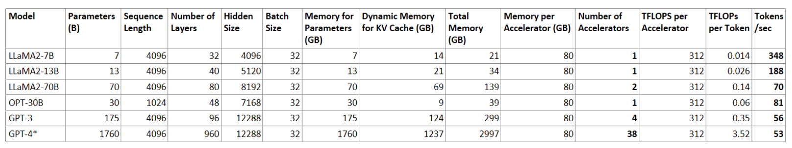

*Table 3. Memory requirements with 50% compression of model and dynamic allocation of KV cache (20% of static allocation).
The rule of thumb for model FLOPs is 2 * parameters.
This assumes 50% utilization for GPU FLOPS.*

Thus, the size of the accelerator cluster is orders of magnitude less than what is required for training. For example, from Table 3, we need about **4 A100 GPUs** (or one GPU server) to host a GPT-3 model.

The internal details of GPT-4, the largest foundational model today, are not publicly available. But assuming linear scaling (GPT-4 is 10x of GPT-3), we may require **~38 A100 GPUs or 5 servers**. To improve the latency and the throughput of the system, more GPUs could be added than minimally required.

Many open-source and commercially available models for enterprises have less than 100B parameters. Using A100/H100 might be an overkill, as shown in Table 3, where the LLaMA2 7B can generate >300 tokens/second per request. For optimal user experience in real-time applications, 20-100 tokens/second is good enough.

LLaMA2 models can use less-power-hungry accelerators like L4 with ~24GB memory per accelerator. As seen in Table 4, Nvidia's L4 accelerator with 24Gb memory is good enough for LLaMA2 7B/13B models. We need a five-accelerator cluster for 70B model inference.

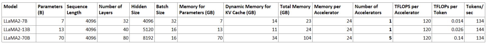

*Accelerator requirements for LLaMA2 open-source models with 50% model compression and dynamic allocation of KV cache. One L4 accelerator is sufficient to fit the model for inference with batch sizes of 32 and 16.*

Pipeline and tensor parallelism is used to partition the model across the accelerators when the model needs more than one accelerator. Tensor parallelism is critical for inference as it decreases the latency by breaking up the computation in each layer across multiple GPUs. Attention blocks and multi-layer perceptron (MLP) layers are major components of transformers that can take advantage of tensor parallelism. In multi-head attention blocks, each head or group of heads can be assigned to a different device to be computed in parallel.

The model partitioning for inference does not need to match the partitioning done during training. Each inference serving system has its cluster topology and hardware. The topology/hardware-aware compilers used in these systems partition the models to meet their performance, power, and latency targets. For example, when using the GPU servers from Nvidia, the compiler (TensorRT-LLM) tries to keep the high bandwidth tensor parallel partitions of a model layer within a GPU server where the GPUs communicate with each other through high-speed links.

### Continuous Batching

Batching improves the utilization of the accelerators. In static batching, the simplest technique, new requests can't be added to the batch until the inference on all the requests in the batch is complete. In other words, the scheduler works at the granularity of user requests. This is illustrated in the below figure. This technique is extremely inefficient for LLM inferencing as each request in the batch is unique and may need a different number of iterations through the model to generate the responses. So, some requests in the batch finish earlier than others. If new requests are not scheduled in those idle slots, then the system becomes inefficient, with GPUs underutilized.

Static batching is not efficient for auto-regressive inferencing. This problem is not present during the training as all requests in the training batch are of the same sequence length, and the training involves a single iteration of predicting the next token in the sequence.

Iteration-level scheduling, as described in the [Orca](https://www.usenix.org/conference/osdi22/presentation/yu) paper, overcomes this. Some frameworks refer to this as continuous or dynamic batching. Here, the size of the batch is constant, but the inference server's scheduler works at the iteration level granularity. At the end of an iteration of the new token generation, if the scheduler detects that one request has completed execution (all tokens for that request are generated), then it immediately returns the tokens of that request to the client, picks a new request and starts processing that request in the same slot as the completed request. Thus, this scheduling uses GPU resources more efficiently, and latency is also improved for user requests.

The above description is an oversimplified explanation for iteration-level scheduling. The actual implementation needs to account for differences in computing requirements of pre-fill versus the decoding phases and several other cases that are too deep for this blog.

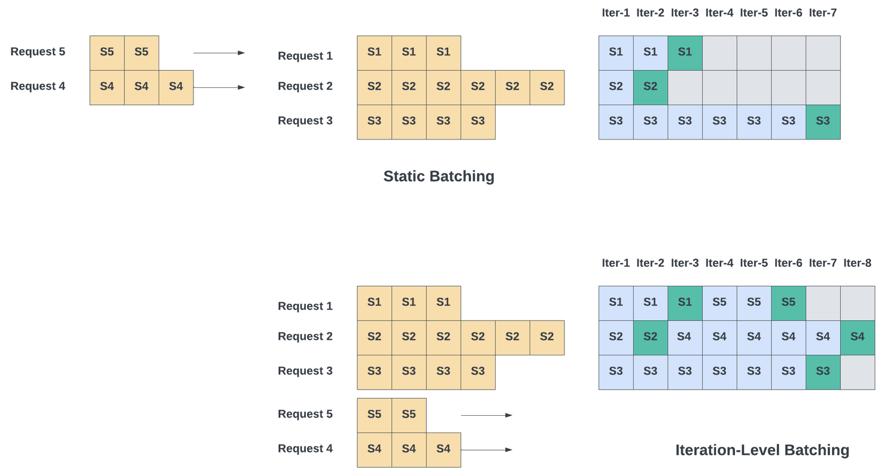

Simplified Illustration of static versus Iteration-level batching:
- The yellow boxes represent the input tokens.
- The blue ones are the tokens generated in each iteration of the inference.
- The green ones are the end-of-sequence (EOS) tokens.

The iteration-level batching can still create head-of-line blocking (HOL) for new requests, as a new user request can not enter the execution phase until one of the current requests in the batch finishes execution. There is a valid reason to do this way. Orca's scheme needs to maintain the KV cache only for the ongoing jobs, which is strictly equal to the batch size. If jobs are interleaved at the iteration level (a new job takes the slot of the previous job for the next iteration even if the previous job is not complete), while it can give better TTFT for the new requests, the GPU memory requirements shoot up as the inference cluster now need to keep the KV cache values for all the active jobs.

## Hardware Optimizations

### Custom Hardware vs GPUs

The choice of hardware for inference depends heavily on where the inference is being performed. Currently, a vast majority of LLM inference happens within data centers and public clouds due to easy access to thousands of powerful GPUs and robust network infrastructure provided by the cloud service providers. However, LLM inferencing on edge (where the endpoint devices are) holds significant promise for the future as processing data closer to users can significantly decrease latency with better privacy and security. The cost/power savings of edge inference could be greater with hardware accelerators optimized specifically for LLM inferencing.

Nvidia GPUs remain dominant in data center/public cloud inference, offering a mature ecosystem, high performance, and broad software support. Nvidia offers a wide range of GPUs with a trade-off between performance and power. While their high-end H100/H200 GPUs can also be used for high throughput inference on trillion parameter models like GPT-4, they do offer lower-end GPUs like A100/L4/L40S/T4 targeted for low-cost/low-power inference on medium-sized models. As they introduce next-generation GPUs for AI training, they continue to offer previous-generation GPU servers for inference.

A GPU server with 8 x H100 or A100 GPUs has a total memory of 80GB x 8 = 640GB. As seen from Table 3, this can hold many medium-sized models with decent batch sizes. If more than 8 GPUs are needed, one option is to use the DGX GPU pods (up to 256 GPU systems) built by Nvidia. But those are super expensive, costing millions of dollars.

An alternate option is to store most of the model parameters in the server (CPU) memory and stream them to GPUs before they are used. This could cause large latencies in a typical server where PCIe links are used for communication between GPU and CPUs. Nvidia's G200 solves this problem by having high-speed NVlinks between the "Grace" CPU and "Hopper" GPU in GH200. This enables the GPUs to access the ~480GB of LPDDR5X memory from the CPU using the 900GBps high-speed links. This CPU memory, on top of the 96-144GB of HBM memory attached to Hopper GPU, gives plenty of memory to do inferencing using a single GH200 server card.

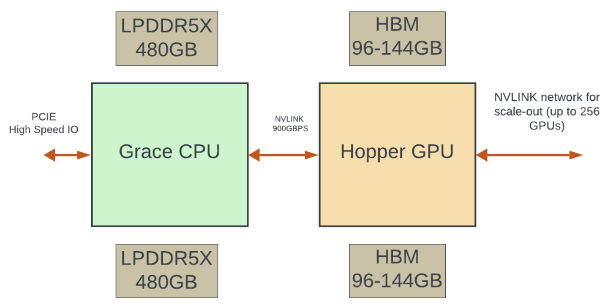

Nvidia GPU's processing engines (SM) contain tensor cores for matrix-multiply-accumulate operations that can do massively parallel matrix operations and provide speedup and efficiency over standard floating-point/integer units. The high-end GPUs come with transformer engines that can analyze each layer of a transformer model and automatically choose the optimal precision format to use for that layer's activations.

Nvidia's TensorRT-LLM is an open-source high-performance inference optimizer that incorporates most of the techniques for inference run-time optimizations (continuous batching, paged attention, quantization, layer fusions, and many more).

AMD is also becoming a significant player in the GPU solutions space for LLM inference, offering a mix of powerful GPUs and tailored software. The company's Instinct series MI300X and MI300A accelerators are strong contenders to Nvidia's GPUs. AMD's SW stack has also improved significantly in recent years.

However, a good portion of the high-end GPU's die area is dedicated to graphics processing units like texture and raster engines, which are idling during inference. This logic not only adds to the die area but also to the die cost and overall power. Even if the logic remains idle during LLM inference, it still consumes leakage power.

Also, GPUs contain powerful standard arithmetic units (not part of the tensor cores) capable of handling double/single precision floating point numbers and INT32. This logic is mostly unused during inference. Increasingly, most LLM models are quantized to 16-bit floating points (TF16) and 8-bit integers for tensor operations during inference. Since the same GPUs are used for training and inference of many different types of models, the tensor cores in GPUs continue to support 64-bit/32-bit matrix operations as well.

Dedicated hardware exclusively for AI inference can optimize the die area/cost by not having unused logic and supporting only the minimum numbering formats needed for the inference applications it is targeting. In addition to highly parallel matrix and vector processing units, the hardware can support weight matrix decompression, structural pruning, dynamic quantization, native support for linear transformation functions found in the LLM models, new 4-bit number formats, etc., to improve the overall efficiency of inference.

Almost all the hyperscalers are building high-performance AI accelerators to replace GPUs. Many start-ups are also targeting standalone/affordable inference system solutions with custom accelerators for data centers. The following sections give a brief preview of the non-GPU-based inference accelerators landscape. It is not exhaustive by any means, as more players are entering/coming out of stealth mode almost every month!

Any custom hardware should still have some flexibility built into it through processing engines that can execute instructions - either a standard ISA like RISC-V or custom instruction sets. Without this flexibility, the hardware can't keep up with continuous innovations in the model landscape.

### Google's TPUs

Google is at the forefront with its TPUs (Tensor Processing Units). TPUs contain thousands of matrix multiply-accumulators that are directly connected to each other to form a large physical matrix. This is called a systolic array architecture. In addition, they also have vector processing units with flexible instruction sets.

Large weight matrices of a trained model are first partitioned and mapped to different TPUs by the compiler. They are then transferred by the inference server (host) to the TPU's high-bandwidth memory using specialized communication protocols. Each host typically connects to 4-8 TPUs.

During the inference, The TPU loads the parameters and the input data from HBM memory into the matrix multiply units to perform the matrix operations. After processing sub-matrices, intermediate results are communicated to other matrix and vector processing units within the TPU or across chips in a pod using dedicated high-speed interconnect networks for further matrix processing. Partial results are accumulated within these units to form the final output matrix and sent back to the Host. TPUs can outperform GPUs when dealing with large input batches and large matrices found in foundational models.

The "lite" version of TPUv5 (TPUv5e) is targeted towards inference by optimizing the die area (halving the number of tensor cores), doubling the interconnect throughput, and running the cores faster. Google claims they get better power and performance per dollar when inferencing with a "lite" version for medium and latency-sensitive inference workloads.

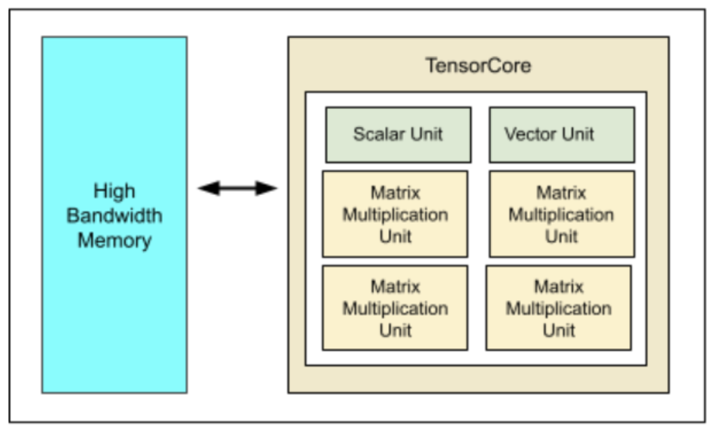

### Amazon's Trainium2/Inferentia2

Amazon builds custom high-performance AI accelerator chips for both training and inference and deploys them in their AWS cloud.

Trainium2 is the second generation of their custom-designed chip built for training LLMs and other deep-learning models. The chip can also be used for high-performance inference. Its core (called NeuronCore) contains tensor, vector, and scalar processing units for matrix/vector and scalar processing. It also has a general-purpose single instruction multiple data (SIMD) engine with custom ISAs for added flexibility in executing the models. Inferentia2 is a scaled-down version of Trainium2 with half the number of cores.

These chips have custom high-speed links (NeuronLink) to connect with each other. Trainium2 chips can be connected together in 2D or 3D torus topology (similar to TPU pods) to make clusters of hundreds of thousands of these accelerator chips for foundational model training.

A node consisting of 12 inferentia2 chips (192GB total memory) connected with Neuron links is capable of inferencing many large language models. Amazon deploys these inference modules in EC2 clusters.

### Meta's MTIA

Meta unveiled details about its AI accelerator, MTIA, mid-last year. The ASIC has up to 128GB of LDDR5 DRAM for off-chip memory and 64 processing engines that support heavily customized RISC-V instruction sets and hardware logic for vector/matrix and non-leaner transformation processing. In the inference server, 12 of these accelerators are connected through a hierarchy of PCIE switches - which is probably not as fast/efficient as the custom links used by Amazon/Nvidia.

Meta claimed to show better performance per watt for low-complexity DLRM models, which are smaller and quite different from LLM models. GPU outperformed MTIA for larger models, which Meta attributes to software inefficiency and memory/interconnect bandwidth limitations. The results from MTIA are not bad, considering this is the first version of their architecture. It usually takes a few generations for the architecture to mature and address the workloads for which the chip is targeted. Although Mark Zuckerberg is loading up on thousands of Nvidia H100 GPUs, I believe Meta will continue to invest in high-performance AI training and inference chips and target LLM inference acceleration in their next-generation chipsets.

### Intel's Gaudi2

Intel provides AI acceleration engines inside Xeon processors (CPUs) for small AI workloads. Its second-generation Gaudi2 AI accelerator chips are for high-performance training and inference. Gaudi2 has custom hardware for matrix multiplications and VLIW SIMD processing engines to accelerate other operations. Gaudi2 integrated RDMA over Converged Ethernet (RoCEv2) engines and has 24 x 100GE ethernet connections for chip-to-chip interconnect. This native integration of RoCE allows customers to use the same interconnect, both inside the server and rack (scale-up), as well as to scale across racks (scale-out) using standard ethernet switches.

Qualcomm also offers data center inference cards using custom AI engines. But not many details of their chip are openly available.

Recently, Microsoft joined the race with their Maia AI Accelerator for generative AI training/inference workloads. Their announcement suggests that Maia supports < 8-bit numbering formats (most probably using the MX data types unveiled at OCP 2023). They plan to deploy these accelerators in their Azure cloud this year.

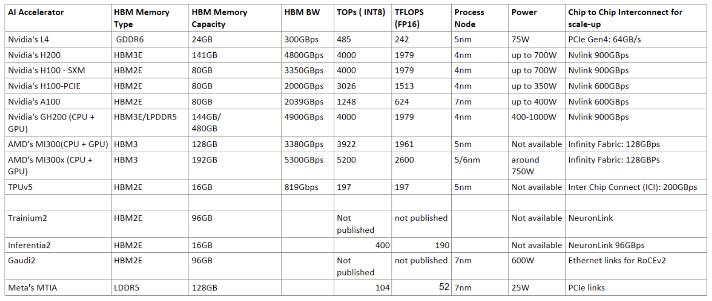

> Note: Nvidia/AMD TFLOPS/TOPS numbers assume a 50% speed-up due to sparsity.

### Startup Ecosystem

Several startups offer inference chips/systems for data centers as well as low-power IOT applications. In this article, my main focus is on data center-grade inference accelerators.

The startup Groq has taken an interesting approach to inference by removing the high-latency external memory accesses altogether and using only on-chip SRAMs to store the model parameters. It uses a data flow architecture akin to a very long fixed pipeline where there is no reordering, arbitration, or scheduling anywhere. And the functional units execute in lockstep with fixed latencies. Their compiler knows which tensors are stored in which SRAM and where the data will be in the pipeline, so it schedules the instructions in such a way as to intercept the data with the instruction that is executed on it. These chips are less expensive as they don't have HBM integration and complex packaging. Multiple chips in a node connect to each other through custom C2C interconnects in Dragonfly topology to make longer pipelines. The lock-step execution is maintained across the chips as well by synchronizing the chip-to-chip links.

A rack contains 9 nodes with 8 chips in each node. It needs 8 racks (~576 chips) to do the inference for the LLaMA2 70B model! While the hardware seems like a lot, the company "claims" it can get 300 tokens per second at 1/10th the power compared to an H100 GPU server. This power estimate could be for a batch size of one. This architecture will have a hard time scaling larger foundational models. However, as an edge inference system running open-source LLaMA models with low power, this could be an attractive solution for enterprises looking to have the systems on their premises for lower TCO and where rack space is not a concern.

Graphcore IPU chip architecture is also loosely based on this philosophy of avoiding external memory in favor of distributed on-chip SRAMs near the processing cores to reduce the memory bottleneck and make computing more efficient.

Sambanova, on the other hand, uses three layers of memory ( DDR/HBM and on-chip SRAMs) to have access to 1.6TB of memory with a single accelerator chip so that inference on trillion parameter models could be done with a handful of these accelerators. However, they didn't publish the inference metrics. It is not known how well their inference execution can hide the long latencies of the DDR memories.

In these systems built by the startups, SW stack/compilers play a critical role in translating and mapping the trained models to the accelerator's HW architecture. The challenge for these compilers is to keep up with the ever-changing landscape of LLM models and versions. Their custom inference servers need to incorporate all the latest model optimizations and batching/dynamic memory allocation techniques.

I've barely covered the inference system startups, focusing only on the startups where the hardware details are openly available. There are several other startups, like Recogni, SimaAI, and Sapeon, to name a few, that build custom hardware and SW stacks for inference.

### In Memory Compute/PIM

Processing in memory (PIM) and in-memory computation have been topics of interest for a while. They got a fresh momentum again in the context of LLMs. In the matrix-vector or matrix-matrix multiplications, which are the majority of computations in LLM inference, the parameters are read from memory, and the intermediate state is saved back in the memory. Samsung, Hynix, and a few startups claim that moving the matrix multiplications and other transformer operations onto the memory die itself would improve inference performance and power consumption as there is less data movement between the external memory and the core of the accelerator. Initial results from a few prototypes were presented at the Hot Chip 2023 conference.

But, by adding logic to DRAM dies, we will give up close to half the memory capacity of the DRAM for the logic area. Memory capacity is a critical factor for large models. Further, adding the logic in the DRAM process node means the logic is not super-optimized for power, performance, or area. The power savings depend heavily on how much the workload can be parallelized across all the banks. It is also unclear how easy it is to integrate this software into the common AI/ML frameworks. Finally, both memory vendors do their own proprietary processing engines and software stacks. Even within the vendor, there is no consistency in the SW stacks for HBM versus GDDR/LPDDR memories. This technology might see more traction in the inference accelerators for mobile and IoT devices which host smaller models and where saving every milliwatt matters.

### Scale-Up/Scale-Out

Unlike LLM training, inference does not need large GPU clusters with thousands of GPUs where the GPUs need to work in lock-step for every iteration!

The size of the cluster depends on the underlying inference accelerator, the models the cluster supports, how well the models were optimized, how efficiently the compiler can map the models to the underlying hardware, dynamic management of memory, and the overall throughput the system must support.

Most GPUs/accelerators offer nodes with up to 8/12 chips connected to each other through their proprietary high-speed interconnects. These nodes can also connect to either standard ethernet or InfiniBand fabric through NICs. When more than one node is needed, the scale-up/scale-out choices using GPUs are:

- Use larger PODs (scale-up systems) like DGX H100/A100. Nvidia provides high-speed Nvlink/NVswitch connectivity between all GPUs in the POD for far superior overall throughput while minimizing latency. However, H100 PODs are mainly for training workloads and are too powerful for most of the LLM inferences. The cost/token does not work out unless the data center has older generation PODs (with A100) that could be repurposed for inference.
- Connect the GPU server nodes through standard ethernet or Infiniband switches. This is a reasonable scale-out option. Since the cluster scale is small (less than 8 GPU servers for inferencing GPT-4, from Table 3), end-to-end congestion control is not a hard problem to solve. Data centers/public clouds that do LLM training could re-purpose the older generation GPU training clusters to host multiple inference systems. GPU servers could also directly connect to the switches in the frontend ethernet fabric. However, ethernet/InfiniBand-based scale-out solutions may encounter larger TTFT and tail latencies due to transient congestions in the network compared to scale-out/scale-up systems with high-speed interconnects.

This is where the cost/power advantage of the non-GPU inference accelerators with proprietary high-speed interconnects comes into play. These interconnects provide higher bandwidth in scale-out/scale-up systems at lower cost, smaller latencies, and better congestion control. For example, TPUv5es in 2D torus topology in a POD. Not having to use standard ethernet or Infiniband switches, which come with their own price tag and power, could help the TCO overall. However, Google's TPUs and Amazon's Trainium/inferentia chips can only be used inside their clouds.

For enterprises building their own inference systems, options beyond GPUs largely come from startups offering potentially better cost and power efficiency systems. However, one can argue that even if the cost is lower, if the software stack is not mature enough to keep the hardware fully utilized across all different models/versions and workloads, it could offset any cost savings. The inference landscape is evolving very fast, with many new optimizations that even larger companies are having a hard time catching up with. The inference ecosystem needs to mature for the many startups to catch up on all the latest techniques to create mature SW stacks comparable to what Nvidia possesses.

Necessity is the mother of invention. If the GPU-based server costs continue to increase with monopoly from the two GPU vendors, the accelerators from some of these startups may find their way into public clouds, data centers, and enterprises in a few years.

## Summary

In this article, I reviewed the LLM inference workflow and the many optimizations that go into reducing the memory footprint and computational complexity. I also reviewed a few inference accelerators and the pros/cons of using custom/non-GPU accelerators for inferencing. Although I tried to make this article comprehensive, I feel I barely touched on all the recent advances. And the edge inference on IoT/mobile devices is not covered.

LLM inference chatbots are fast replacing Google search and are becoming essential tools that we can't live without. And there is no longer any dispute that enterprises, small and large, can benefit immensely from deploying LLMs that have access to internal data.

With LLM workloads growing exponentially, more enterprises may want to own the LLM fine-tuning and inferencing systems on their premises or data centers rather than pay hefty sums to public cloud operators. Even service providers might start offering inference in the network to get some of the market share from the public clouds! The public clouds will continue to invest in custom hardware solutions to reduce their dependencies on GPUs and to scale inference workloads in a cost-effective way. With this exploding demand, there will be more innovations on all fronts, including hardware accelerators and software optimization, to make inference sustainable and economical. Exciting times ahead!

## References

- Online articles/datasheets from Nvidia/Microsoft/Meta/Google/Intel/Amazon, and other startups on their accelerators and workloads
- [Attention is all you need](https://arxiv.org/abs/1706.03762)
- [PagedAttention](https://arxiv.org/abs/2309.06180)
- [Multi-query Attention](https://arxiv.org/abs/1911.02150)
- [Speculative Sampling](https://arxiv.org/abs/2302.01318)
- [Speculative Decoding](https://arxiv.org/abs/2211.17192)
- [Inference optimizations](https://developer.nvidia.com/blog/mastering-llm-techniques-inference-optimization/)
- [Zero Inference](https://www.deepspeed.ai/2022/09/09/zero-inference.html)
- [Iteration level Batching](https://www.usenix.org/system/files/osdi22-yu.pdf)
- [More on batching ](https://www.anyscale.com/blog/continuous-batching-llm-inference)
- [Model distillation](https://arxiv.org/abs/1910.01108)

## Glossary

- AI/ML: Artificial Intelligence / Machine Learning
- BERT: Bidirectional Encoder Representations from Transformer
- C2C: Chip to Chip
- DLRM: Deep Learning Recommendation Model
- EOS: End-of-Sequence
- FLOPS: floating-point operations per second
- GDDR: Graphical Double Data Rate memory
- GPU: Graphical Process Unit
- GTP:  Generative Pre-trained Transformer
- HBM: High-Bandwidth Memory
- HOL(B): head-of-line (blocking)
- ISA: Industry Standard Architecture
- KV: Key/Value
- LLaMA2: LLM from Meta
- LLM: Large Language Model
- LPDDR: Low Power Double Data Rate memory
- MFU Model FLOPS Utilization
- MLP: multi-layer perceptron
- MTIA: Meta Training and Inference Accelerator
- PAT: pruning at initialization
- PIM: Processing in memory
- PTQ: Post-training quantization
- QAT: Quantization-Aware Training
- RISC-V: Reduced instruction set computer five
- RoCEv2: RDMA over Converged Ethernet
- SFT: Supervised Fine Tuning
- SIMD: Single Instruction Multiple Data
- TCO: Total Cost of Ownership
- TF16: 16-bit floating points
- TPOT: Time Per Output Token
- TPU: Tensor Processing Units
- TTFT: Time To First Token
- VLIW: Very Long Instruction Word
