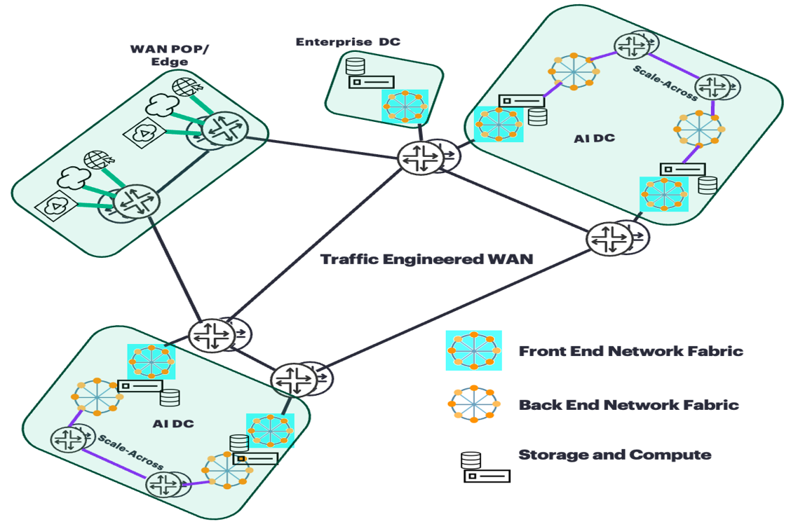
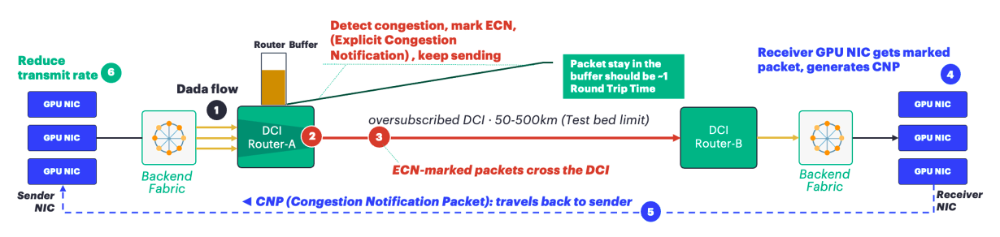
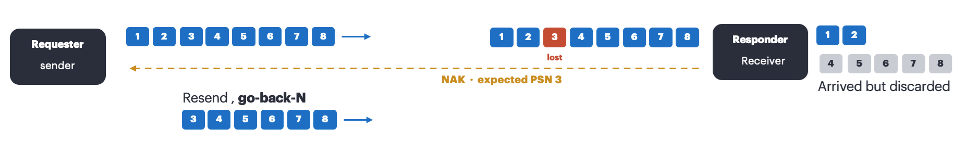
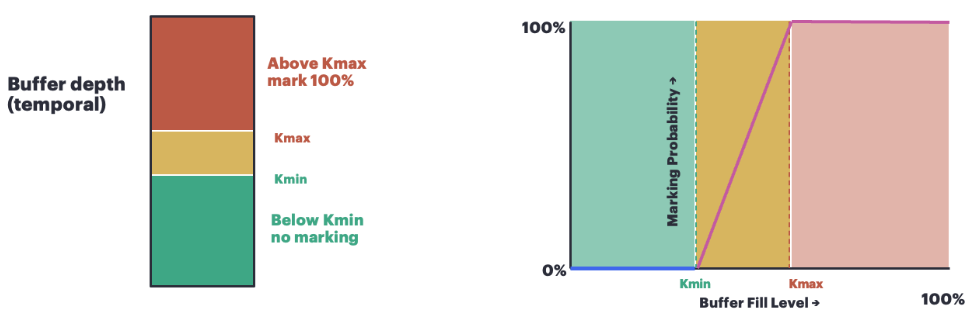
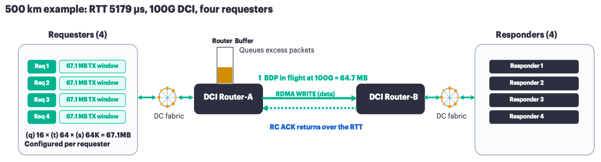
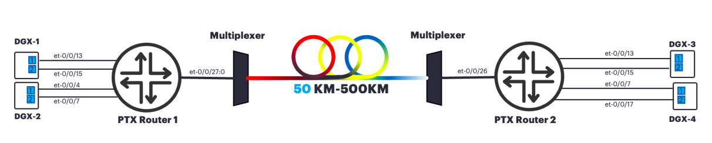
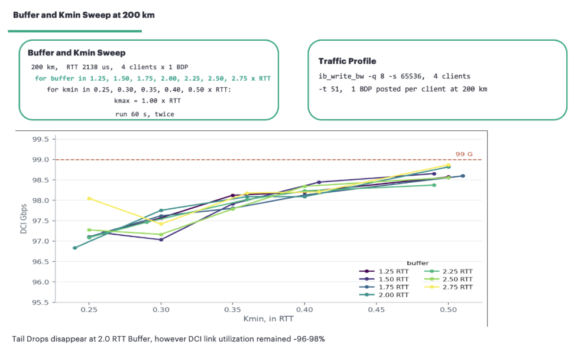
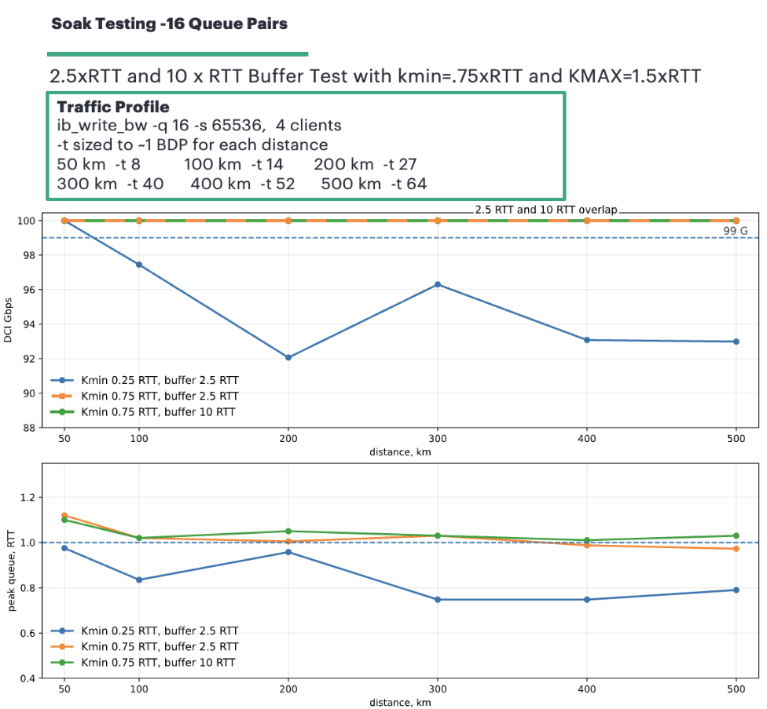

# Long-Distance Lossless Scale-Across

**Kashif Nawaz - 02/09/2026**

## Introduction

Artificial Intelligence (AI) and Machine Learning (ML) training clusters can easily outgrow a single data hall. Power and cooling limits decide how many AI accelerators (XPUs) can be hosted in one building, and once that limit is reached, then the clusters need to be deployed across data halls. The network that provides connectivity among AI accelerator (XPU) backend fabrics is now commonly called Scale-Across [1,10,11].

Scale-Across is not a Wide Area Network (WAN) problem in the traditional sense, because traditional WANs are generally designed to tolerate packet loss, including tail drops, as Transmission Control Protocol (TCP) retransmits lost segments and the applications can absorb the additional delay. In addition, storage replication and raw data ingestion traffic flows are generally characterized as low entropy flows and can easily cause link congestion and uneven path utilization.  Currency for this segment is efficient bandwidth utilization over expensive links.

On an AI backend fabric, Remote Direct Memory Access (RDMA) over Converged Ethernet version 2 (RoCEv2) is commonly deployed transport, where the cost of a lost packet can be high, because the recovery is go-back-N and the collective operation stalls until it completes, which ultimately means every accelerator participating in that collective operation, sits idle. For RDMA traffic, uneven path utilization can be reduced by inducing high entropy from the host side (e.g. adding more queue pairs).  Currency for this segment is accelerator time spent in computation rather than waiting for data.

Newer transport mechanisms such as Ultra Ethernet Transport (UET), Multipath Reliable Connection (MRC) and MetaRoCE use selective retransmission instead of "go-back-N but still rely on ECN for congestion signaling. The buffer-depth and ECN-marking-threshold recommendations in this blog are therefore generally applicable, while the validation was performed using RoCEv2.



This tech post covers lossless RDMA over an oversubscribed long-distance Scale-Across. It describes how the scale-across router buffer and the Explicit Congestion Notification (ECN) marking thresholds were sized for distances from 50 km to 500 km. In total, 4800 tests were performed via an automation framework.

Although scale-across is a commonly used term for backend fabrics connectivity across data centers, in this blog we use scale-across and Data Center Interconnect (DCI) interchangeably.

## Scale-Across Challenges

## Oversubscription

Backend fabric networks are typically built with 1:1 subscription, however maintaining the same 1:1 subscription for a scale-across network is not practical with growing GPU scale. Backend NICs on GPU hosts are connected through backend fabric switches, and those switches are aggregated into the DCI router, so the aggregate fill rate presented to the DCI can be much higher than the DCI egress rate.
Oversubscription is therefore expected in a scale-across design, and when several high-rate RDMA flows converge on the same DCI egress link, the queue starts to build, which ultimately causes congestion on that link. If the queue continues to grow beyond the router's available buffer capacity, it will result in packet loss.

The DCI oversubscription should be sized for the traffic that actually traverses the DCI/scale-across segment. In general, the required interconnect capacity is lower than the aggregate backend fabric capacity inside the data center.

## Feedback Delay

When congestion occurs on the DCI link, packet loss can only be avoided if the DCI router has enough buffer to hold the excess packets, and if a control-loop feedback mechanism is in place to direct the senders to reduce their transmission rate before the buffer is completely overrun.

The congestion-feedback mechanism provides end-to-end close loopback control between the network and transport endpoints. When the scale-across network queue starts to build due to link congestion, instead of dropping the traffic, the router marks packets with Explicit Congestion Notification (ECN) as an early congestion signal. Feedback of congestion information to the sender is used to lower the transmission rate. However, this feedback mechanism takes one full round trip before the sender can react to the Congestion Notification Packets (CNP) and reduce its transmission rate.



The feedback mechanism shown in above figure reflects the RoCEv2/ Data Center Quantized Congestion Notification (DCQCN) implementation used in our validation, where the receiver generates a Congestion Notification Packet (CNP) after receiving an ECN-marked packet. CNP is specific to RoCEv2/DCQCN. Newer transports such as UET, MRC and MetaRoCE use their own congestion-feedback mechanisms, while still relying on ECN for congestion signaling.

## Path RTT and Buffer Depth

The above-described feedback delay makes path RTT a critical consideration for router buffer depth.
While the DCQCN feedback loop is not yet completed, the sender continues transmitting at the same rate, so the excess packets arriving during this period must be held in the router buffer. The buffer should also provide sufficient additional headroom so that this packet buildup does not reach the tail-drop point until sender(s) start reducing their transmit rate.  PTX platforms are deep-buffer routers designed to absorb transient congestion. [5].

In our lab measured path RTT for 50 km was 632 us and for at 500 km was 5,179 us.

## Congestion Signaling

Hence, we cannot allow the queue to fill completely, so ECN congestion marking is used to signal the growing congestion before the router buffer reaches the tail-drop point. The queue fill level where congestion marking starts is determined by Kmin and the queue fill level where 100% of packets are marked is determined by Kmax. Between Kmin and Kmax, the packet-marking probability increases linearly with the queue size.  While the DCQCN feedback loop is converging, additional buffer space above the marking thresholds is required to absorb the arriving traffic before the queue reaches the tail-drop point.

## Loss Recovery

With Reliable Connection (RC) loss recovery, a lost packet can trigger go-back-N, which causes the sender to retransmit the missing packet and every packet sent after it. The collective operation cannot be completed until all that data arrives; hence the delay can affect GPU participating in it.



Newer transports such as UET, MRC and MetaRoCE use selective retransmission instead of go-back-N.

## Design Objectives

The main design objectives are listed below:

- Optimal DCI link utilization (near to full)
- Zero packet loss
- Maximum time for packets in the router buffer during congestion state should be ~1 RTT.

## Design and Implementation

## Sustaining Full Link Utilization

In order to sustain the target link rate over a long-RTT path, enough data must remain in flight. This amount of data is represented by the Bandwidth-Delay Product (BDP), which is calculated as the link rate multiplied by the round-trip time [5].

```
1 BDP = Link Rate x RTT
```

## Buffer Depth

As described earlier, the router buffer needs to hold the excess packets while the DCQCN feedback loop is converging. ECN marking therefore needs to start before the buffer reaches the tail-drop point. The required buffer depth depends on following:

- How much incoming RDMA traffic exceeds the DCI link egress rate (i.e. oversubscription)
- How long it takes for the DCQCN feedback loop to complete (i.e. path RTT)

Buffer depth can be expressed in bytes or in temporal units (microseconds). Junos can configure the scheduler buffer as a temporal value in microseconds, which is converted to a byte limit based on the calculated VOQ target rate [14]. In our configuration, buffer-rate percent 100 sets the target rate to 100% of the calculated shaping rate, which effectively represents the DCI egress line rate in our test setup.

```
class-of-service {
    schedulers {
        sched-rdma-data {
            buffer-rate percent 100;
            buffer-size temporal <microseconds>;
        }
    }
}
```

If buffer-rate percent 100 is not configured, and a non-zero transmit-rate exists then Junos uses the transmit-rate as the target rate (port rate used for the buffer calculation). That target rate is then used to convert the temporal buffer value into bytes.

Our automation testing framework executed 4,800 tests across varying path RTTs by changing path length (i.e 50KM,100-500KM), buffer depths, and ECN marking thresholds. As an outcome of this testing with 4:1 oversubscription, we found that a buffer depth of 2.5 x RTT is sufficient to:

- Absorb the excess traffic while the DCQCN feedback loop responded to congestion without reaching the tail-drop point.
- Continue feeding the congested DCI egress link after the sender(s) started reducing their transmission rate, sustaining 100% link utilization while the queue drained.

These results are also dependent on NIC fine tuning on the host-side and adjustment of various transmission parameters which are described in detail in a later section, i.e. "Host-Side Considerations."

> Note: In addition to the path RTT between DC/scale-across routers, there will be additional RTT between hosts and DCI routers on both sides. In our testbed, the host-to-DCI-router RTT was negligible. If the data center radius is large enough that this RTT cannot be neglected, then adjust the DCI router's buffer by considering the intra-data-center path RTT. For example, if the combined radius of the data centers on both ends is 1 km, then adding 10 us to the measured DCI path RTT would account for the additional RTT.

## ECN Marking Thresholds

ECN marking must start (define by Kmin ) early enough for the DCQCN feedback loop to converge before the router buffer reaches the tail-drop point. If it starts too early, then it can adversely impact the DCI line rate because the sender(s) may reduce their transmission rate unnecessarily, thus preventing the DCI link(s) from reaching 100% utilization. Kmax specifies the queue fill level at which the ECN marking probability reaches 100%.

A narrow gap between Kmin and Kmax produces more aggressive ECN marking, whereas a wider gap will allow higher queue buildup before 100% marking is reached.

```
class-of-service {
    drop-profiles {
        dp-ecn {
            fill-level <Kmin> drop-probability 1;
            fill-level <Kmax> drop-probability 100;
        }
    }
}
```



Our automation testing framework tested 4:1 oversubscription with the buffer set to 2.5 x RTT and ECN marking thresholds set to Kmin = 0.75 x RTT and Kmax = 1.5 x RTT. The recorded results were:

- 100% DCI link utilization
- Zero tail drops
- Maximum queue occupancy ~1 RTT

Hence in Junos, ECN thresholds (Kmin, Kmax) are required to be configured as percentage of the configured buffer. For the tested 2.5 x RTT buffer:

- Kmin = 0.75 x RTT = 30%
- Kmax = 1.5 x RTT = 60%

The following configuration was tested with 500km path length and measured path latency of 5179 microseconds.

```
class-of-service {
    drop-profiles {
        dp-ecn {
            fill-level 30 drop-probability 1;
            fill-level 60 drop-probability 100;
        }
    }
    schedulers {
        sched-rdma-data {
            drop-profile-map loss-priority any protocol any drop-profile dp-ecn;
            explicit-congestion-notification;
            ecn-enhanced {
                head-marking;
            }
        }
    }
}
```

In order to achieve desired results, we had to do extensive NIC fine tuning on the host-side and adjustment of various transmission parameters which are described in detail in a later section, i.e. "Host-Side Considerations."

## Host-Side Considerations

### Outstanding Window

In order to sustain full line rate on the DCI link, enough data must be in flight. On the host side, this is achieved by maintaining sufficient RDMA data outstanding.

In our testing, we used ib_write_bw, where the outstanding transmit window can be controlled directly through the number of Queue Pairs, transmit depth, and message size:

```
-q      number of queue pairs
-t      transmit depth, in messages per queue pair
-s      message size
```

The configured transmit window is the product of the three:

```
Configured TX Window = q x t x s
```

For the profile used in the final testing:

```
-q 16       16 queue pairs
-s 65536    each message is 64 KB
-t 64       queue depth of 64 messages per QP
16 x 64 x 65,536 = 67.1 MB outstanding per client
```



It is important to note that the configured Tx window represents the amount of RDMA data the sender can keep outstanding. This data may still be at the sender, already in flight across the path, or queued in the router for the congested DCI egress. Only the portion arriving faster than the egress link can transmit will be queued in the router buffer.

Both the queue pair count and the transmit depth affect whether the sender delivers the intended BDP, because each QP has its own outstanding Tx window, and the aggregate outstanding window is the sum across all QPs. The measured effect of that distribution is covered in one of the upcoming sections, i.e. "Results".

### NIC Congestion Control

In order to get sustained optimal/ full DCI link utilization with lossless RDMA, we were also required to do fine tuning of the ConnectX-7 NIC parameters. For production deployments, the respective vendor documentation should be consulted.

Slow restart reduces the sender transmission rate when packet loss is detected and then gradually increases the rate while the network recovers [18]. In our testing, this behavior adversely impacted the ability of the DCI link to reach peak utilization, therefore slow restart was disabled.

```
mlxreg -d <dev> --reg_name ROCE_ACCL --set roce_slow_restart_en=0x0
```

Adaptive retransmission uses a retransmission timer on the client's NIC to retransmit a packet if an acknowledgment is not received before the timer expires. The minimum value allowed value is 4 us [9]. In our long-RTT testing, the DCI link was fully utilized; however, the ib_write_bw throughput reported by the clients was much lower than the expected value. After some investigation we concluded that duplicate retransmissions consumed some of the DCI bandwidth, so adaptive retransmission was disabled for the tested profile.

```
mlxreg -d <dev> --reg_name ROCE_ACCL --set roce_adp_retrans_en=0x0
```

Disabling adaptive retransmission does not affect the Reliable Connection (RC) retransmission mechanism. RC uses standard acknowledgement-based loss recovery. The rate reduction after a Congestion Notification Packet (CNP) was also tuned:

```
mlxconfig -d <dev> set RPG_MIN_DEC_FAC=95
```

RPG_MIN_DEC_FAC=95 limits the severity of the transmission-rate reduction on a sender after receipt of CNP, which helped avoid large rate reductions and subsequently improved transmission-rate recovery over the long-RTT path [3,8].

```
mlxconfig -d <dev> set CLAMP_TGT_RATE_P1=1 CLAMP_TGT_RATE_P2=1
```

With CLAMP_TGT_RATE enabled, the target rate is updated to the current reduced rate on a sender after receipt of CNP, which helped by reducing rate oscillation during rate recovery [3,8]. The rate-recovery timer was also tuned for the longer path RTT:

```
mlxconfig -d <dev> set RPG_TIME_RESET_P1=7000 RPG_TIME_RESET_P2=7000
```

RPG_TIME_RESET determines how long a sender should wait before increasing its transmission rate during the congestion recovery phase. If any CNP is not received during this interval only, then the transmission rate can be increased when the timer expires [3,8]. In our testing, we used 5,000 us for distances from 50 km to 400 km, and 7,000 us for 500 km.

## Testbed

We built the testbed with two HPE Networking PTX10008 routers, each equipped with an LC1301 line card and running Junos EVO 26.2R1.7-EVO. We used NVIDIA DGX Spark systems based on the GB10 platform as the GPU hosts. Each host used ConnectX-7 NICs with 2 x 100 G interfaces, running DGX OS 7.5.0 with firmware 28.45.4028.



Our testbed has 4:1 oversubscription where four clients aggregated over a single 100G DCI egress link.  We created link distances from 50 km to 500 km using fiber loops. In addition to the physical fiber length, latency introduced by optics, FEC/framing, OEO regeneration, and EDFA also contributes to the overall path latency. Hence, the buffer size and Kmin/Kmax thresholds should be adjusted based on the measured path RTT rather than a calculated RTT. The path RTT values shown below are specific to our testbed.

| Distance | Measured RTT |
|:--|:--|
| 50 km | 632 us |
| 100 km | 1,131 us |
| 200 km | 2,138 us |
| 300 km | 3,158 us |
| 400 km | 4,145 us |
| 500 km | 5,179 us |

> Note: Per km of fiber adds, 10 us RTT. In addition to the physical fiber length, latency introduced by optics, FEC/framing, OEO regeneration, and EDFA also contributes to the overall path latency.

## Testing and Verification

We executed more than 4,800 tests across four stages:

- NIC and host-side traffic tuning
- Grid Test
- Buffer Sweep
- Soak Test

All test runs consisted of 60 seconds of traffic. Before changing sender configurations, traffic from all senders was stopped, the queue was drained, and interface statistics were cleared. All tests were executed unattended by a custom automation framework. The framework gathered per-second data from the RoCE-enabled NICs, the router's CLI, the Packet Forwarding Engines (PFEs), and per-client throughput.

## Host Side Optimization Tests

Approximately 2,500 test runs were initially executed to fine tune the NIC and host-side outstanding traffic parameters. The aim of these test runs was to achieve optimal/full DCI link utilization and lossless RDMA without focusing on router buffer occupancy, optimal buffer size, or optimal Kmin/Kmax thresholds.

## Buffer and ECN Tests

The remaining 2,370 test runs focused on the router buffer depth and ECN marking thresholds through Grid Test, Buffer Sweep, and Soak Test. For these three test stages, every setting was tested at least twice.

### Grid Test

Grid Test covers 50, 100, 200, 300, 400 and 500 km, with 2- and 4-client offered-load combinations ranging from 0.5 to 2 BDP per client. Kmin was swept from 10% to 70% of buffer, with multiple Kmax offsets. Each setting was tested twice, resulting in 2,264 runs. This Grid Test helped us identify the Kmin/Kmax combinations that could maintain the intended DCI link utilization without tail drops, while using an oversized buffer.

### Buffer Sweep

We varied the buffer size and Kmin at 200 km. Our intent was to determine the minimum buffer size that could prevent tail drops while maintaining the intended DCI link utilization. We conducted 70 Buffer Sweep runs at 200 km, with 4 clients each sending 1 BDP, sweeping the buffer space from 1.25 RTT to 2.75 RTT and Kmin from 0.25 RTT to 0.50 RTT while keeping Kmax at 1.0 RTT for all runs; each setting was tested twice. In the Buffer Sweep test, a buffer size of 2.5 x RTT and 0.5 x RTT Kmin was sufficient to prevent tail drops; however, DCI link utilization remained at ~96--98 Gbps. It helped us to conclude that by increasing Kmin, we could improve DCI link utilization while keeping the 2.5 x RTT buffer.



### Soak Test

We tested 6 different distances (50, 100, 200, 300, 400, and 500 km), and for each distance we tested 3 different buffer and ECN profiles.

- Low-Kmin profile: Buffer = 2.5 x RTT, Kmin = 0.25 x RTT, Kmax = 1.0 x RTT
- Final profile: Buffer = 2.5 x RTT, Kmin = 0.75 x RTT, Kmax = 1.5 x RTT
- Deep-buffer profile: Buffer = 10 x RTT, Kmin = 0.80 x RTT, Kmax = 1.5 x RTT

Each profile was tested twice and in total, 36 runs were executed.

## Results

Using the final profile described in the Soak Test, the recorded results were:

- 100% DCI link utilization
- Zero tail drops
- Maximum queue occupancy ~1 RTT

Based on our observations, collecting only router-side key performance indicators (KPIs), such as DCI link utilization and buffer occupancy, does not provide a complete assessment, and collecting host-side KPIs was also essential for proper evaluation. For example, one underperforming client can delay the whole collective operation, even if the DCI link utilization and peak buffer occupancy show optimal values. Our results showed that all clients received a fair share of the router's transmission resources, and the available DCI throughput was evenly distributed across all clients, indicating fair scheduling by the DCI router.

### 8 QP vs 16 QP

During the soak testing, we compared 8 QPs and 16 QPs while adjusting the transmit depth (-t) to provide approximately 1 BDP of outstanding traffic per client.

**500 km: 8 QP vs 16 QP Comparison:**

| Metric | 8 QPs | 16 QPs |
|:--|:--|:--|
| TX depth (-t) | 208 | 64 |
| Outstanding load Per Client | ~ 1.7BDP | ~ 1.04BDP |
| DCI Link Throughput | ~99.5 Gbps | ~99.99 Gbps |
| Peak queue occupancy | Higher than expected | ~1 RTT |



At 500 km, 8 QPs required a much higher transmit depth and a larger outstanding window before the DCI link could reach full utilization. With 8 QPs, a transmit depth of 208 provided approximately 1.7 BDP of outstanding traffic and reached 99.5 Gbps. We also observed that with 8 QPs the peak queue occupancy was higher than expected, whereas with 16 QPs the peak queue occupancy remained at approximately 1 RTT.

With 16 QPs, a transmit depth of 64 provided approximately 1.04 BDP of outstanding traffic and reached 99.99 Gbps. Hence, 16 QPs were used for the final tested profile because they required significantly less over-posting to achieve the intended DCI link utilization.

## Shallow Buffer Tradeoffs

The above-described scientific test methodology, with more than 4,800 tests, demonstrated that deep buffering can maintain lossless RDMA and full DCI link utilization on an oversubscribed long-distance DCI. Shallow-buffer platforms can also be considered for scale-across, but their use requires consideration of the following design tradeoffs:

- Increase DCI Radix
- Control Workload Placement
- Rely on Loss Recovery

## Increase DCI Radix

One way to address link congestion caused by oversubscription is to design the DCI with 1:1 subscription. This removes  DCI oversubscription as a primary source of congestion that drives the need for deep buffering.

Backend fabric networks are typically built with 1:1 subscription, however maintaining the same 1:1 subscription for a scale-across network is not practical with growing GPU scale. For example, with two-sites deployment, each hosting 4,096 GPUs (400G NIC per GPU). DCI with 1:1 subscription would require 2,048 x 800G DCI links and with 64 x 800G ports per switch, each site would require 32 switches at DCI / scale-across layer.

## Control Workload Placement

Another approach is that workloads can be scheduled to send less traffic towards the other data center, thus avoiding DCI link congestion. However, this arrangement requires special consideration on the application or workload scheduler side, where DCI  path latency and available capacity should be considered while placing/scheduling workloads. It completely shifts the war zone from the network side to the host side. Workload placement will be constrained by DCI capacity instead of using the available capacity in the other data center.

## Rely on Loss Recovery

The remaining option is to allow the shallow buffer to reach tail drop and rely on the transport loss-recovery mechanism described earlier, which can introduce a performance penalty.

## PTX Advantages for Scale-Across

Many shallow-buffer Ethernet switches do not natively support coherent optics, which are typically supported by purpose-built DCI routers. Supporting longer distances via optical transport often requires additional optical transport equipment, adding power, space, cost, and operational complexity [1,17].

The HPE Networking Express 5 based routing platform provides both deep buffering and native coherent-optics support [1,17]. The maximum supported temporal buffer per interface in the tested platform is:

- 100 Gbps interface: 200 ms
- 400 Gbps interface: 50 ms
- 800 Gbps interface: 25 ms

## Conclusion

Making RDMA lossless over longer distances requires adequate buffer size and proper ECN configuration on the network side as well as adequate congestion control on the host side of the NIC.

Sufficient buffer provides the headroom required during congestion, but buffer alone cannot prevent tail drops. Packets need to be marked with congestion signaling well before the queue fills, and through the congestion feedback loop, sender(s) must reduce their transmission rate before the buffer is exhausted.

In final tests executed over 50, 100, 200, 300, 400, and 500 km with 4:1 oversubscription, each client was configured with an outstanding window of approximately 1 BDP. With a 2.5 x RTT buffer, Kmin = 0.75 x RTT and Kmax = 1.5 x RTT, the following objectives were achieved:

- 100% DCI link utilization
- Zero tail drops
- Peak queue occupancy of ~1 RTT

Despite configuring appropriate buffer and ECN marking thresholds, excessive oversubscription can negatively impact lossless behavior. DC-facing and core-facing physical connections should be evenly distributed across line cards and forwarding paths.

## Acknowledgments

I would like to thank Dmitry Ginzburg (Principal Developer for CoS , congestion and queueing) for his extensive support in testing and validation and without his support this would have not be completed in such a meaningful way.  I would also like to thank Jad Dimabuyu (Optical TME) for his extensive support to setup fiber path (50km-500km length) as without his support it was not possible to setup sweep tests across different distances.  I would also like to acknowledge Dmitry Shokarev's (VP Silicon, RIS BU HPE Networking) extensive help as he was consistently reviewing the work and guiding us to drive this testing towards meaningful conclusion.

## References and Further Reading

- 1 Dmitry Shokarev, [Training over 50km 800GE Links with PTX Routers](https://community.arubanetworks.com/blogs/dmitry-shokarev1/2025/10/28/training-over-50km-800ge-links-with-ptx-routers), HPE Juniper Networking TechPost, October 2025.
- 2 Toni Pasanen, [Congestion Avoidance in AI Fabric - Part II: Priority Flow Control (PFC)](https://nwktimes.blogspot.com/2025/04/congestion-avoidance-in-ai-fabric-part.html), The Network Times, April 2025.
- 3 NVIDIA, [How To Configure DCQCN (RoCE CC) values for ConnectX-4 (Linux)](https://enterprise-support.nvidia.com/s/article/howto-configure-dcqcn--roce-cc--values-for-connectx-4--linux-x), NVIDIA Enterprise Support.
- 4 Yibo Zhu et al., [Congestion Control for Large-Scale RDMA Deployments](https://www.microsoft.com/en-us/research/publication/congestion-control-large-scale-rdma-deployments/), ACM SIGCOMM 2015.
- 5 Sharada Yeluri, "[Sizing Router Buffers - Small is the New Big](https://community.arubanetworks.com/blogs/sharada-yeluri/2023/02/22/sizing-router-buffers)"  2023
- 6 Mohammad Alizadeh et al., [Data Center TCP (DCTCP)](https://www.microsoft.com/en-us/research/publication/data-center-tcp-dctcp/), ACM SIGCOMM 2010.
- 7 Yuliang Li et al., [HPCC: High Precision Congestion Control](https://doi.org/10.1145/3341302.3342085), ACM SIGCOMM 2019.
- 8 NVIDIA, [doRoCE.sh](https://github.com/NVIDIA/doroce-linux/blob/main/doRoCE.sh), NVIDIA doroce-linux repository.
- 9 NVIDIA, [Adaptive Retransmission: Parameters Control](https://docs.nvidia.com/networking/display/adaptive-retransmission-parameters-control.pdf), NVIDIA Networking Documentation.
- 10 NVIDIA, [How to Connect Distributed Data Centers Into Large AI Factories with Scale-Across Networking](https://developer.nvidia.com/blog/how-to-connect-distributed-data-centers-into-large-ai-factories-with-scale-across-networking/), NVIDIA Technical Blog, September 2025.
- 11 NVIDIA, [Turbocharge LLM Training Across Long-Haul Data Center Networks with NVIDIA NeMo Framework](https://developer.nvidia.com/blog/turbocharge-llm-training-across-long-haul-data-center-networks-with-nvidia-nemo-framework/), NVIDIA Technical Blog, May 2025.
- 12 B. Braden et al., [RFC 2309: Recommendations on Queue Management and Congestion Avoidance in the Internet](https://www.rfc-editor.org/rfc/rfc2309.html), RFC Editor, April 1998.
- 13 F. Baker and G. Fairhurst, [RFC 7567: IETF Recommendations Regarding Active Queue Management](https://www.rfc-editor.org/rfc/rfc7567.html), RFC Editor, July 2015.
- 14 Juniper Networks, [buffer-size (Schedulers)](https://www.juniper.net/documentation/us/en/software/junos/cli-reference/topics/ref/statement/buffer-size-edit-cos.html), Junos OS Documentation.
- 15 Juniper Networks, [RED Drop Profiles for Congestion Management](https://www.juniper.net/documentation/us/en/software/junos/cos/topics/topic-map/red-drop-profiles.html), Junos OS Documentation.
- 16 IEEE 802.1, [802.1Qbb -- Priority-based Flow Control](https://1.ieee802.org/dcb/802-1qbb/), IEEE 802.1 Data Center Bridging.
- 17 Nicolas Fevrier, [Introducing Express5 in PTX10K Chassis](https://community.arubanetworks.com/blogs/nicolas-fevrier/2025/08/18/introducing-express5-in-ptx10k-chassis), HPE Juniper Networking TechPost, August 2025.
- 18 NVIDIA, [How to Enable/Disable Lossy RoCE Accelerations](https://enterprise-support.nvidia.com/s/article/How-to-Enable-Disable-Lossy-RoCE-Accelerations), NVIDIA Enterprise Support.

## Glossary

- AQM (Active Queue Management): Queue management used to signal congestion before the queue reaches the tail drop point.
- BDP (Bandwidth Delay Product): Link rate multiplied by RTT.
- CNP (Congestion Notification Packet): Congestion notification generated by the receiver NIC after receiving an ECN marked packet and sent back to the sender.
- ConnectX 7: NVIDIA NIC used in the DGX Spark hosts in this testbed.
- DCI (Data Center Interconnect): Network connectivity between AI backend fabrics located in different data centers.
- DCQCN (Data Center Quantized Congestion Notification): RoCEv2 congestion control mechanism that uses ECN marking and CNP feedback between the network, receiver NIC, and sender NIC.
- DGX Spark: NVIDIA GPU system used as the traffic endpoint in the testbed.
- DMA (Direct Memory Access): Mechanism used by the NIC to read from or write directly to registered host memory.
- ECN (Explicit Congestion Notification): Congestion signaling mechanism where packets are marked instead of being dropped.
- EDFA (Erbium Doped Fiber Amplifier): Optical amplifier used along a fiber path and one of the elements that can add path latency.
- Express 5: HPE Networking forwarding ASIC used by the LC1301 line card in this testbed.
- FEC (Forward Error Correction): Error correction used on the optical path which also adds processing latency.
- Go back N: RC loss recovery behavior where packet loss can result in retransmission from the missing packet onward.
- Kmin: Queue fill level where ECN marking starts.
- Kmax: Queue fill level where ECN marking reaches 100%.
- MRC (Multipath Reliable Connection): Multipath RDMA connection mechanism referenced as future work over SRv6.
- MTU (Maximum Transmission Unit): Maximum packet size used for transmission. The RDMA MTU in this testbed was 4,096 bytes.
- NAK (Negative Acknowledgement): RC feedback sent when an expected Packet Sequence Number is not received.
- OEO (Optical Electrical Optical) regeneration: Conversion of an optical signal to electrical and back to optical, which can add latency to a long-distance path.
- Outstanding window: Amount of RDMA data a sender can keep outstanding.
- PFC (Priority Flow Control): Ethernet link level flow control mechanism that pauses traffic for a priority when congestion is detected.
- PSN (Packet Sequence Number): Sequence number used by RC to maintain ordered and reliable packet delivery.
- PTX10008: HPE Networking router used as the DCI platform in this testbed.
- QP (Queue Pair): RDMA communication endpoint consisting of a Send Queue and a Receive Queue.
- RC (Reliable Connection): RDMA connection type that provides ordered and acknowledged packet delivery with loss recovery.
- RED (Random Early Detection): Queue management profile used to increase ECN marking probability as queue occupancy increases.
- RDMA (Remote Direct Memory Access): Mechanism that allows the NIC to move data directly between registered memory and the network with minimal CPU involvement.
- NIC (RDMA capable Network Interface Card): Network adapter that performs RDMA operations and congestion control.
- RoCEv2 (RDMA over Converged Ethernet version 2): RDMA carried over routable UDP, IP, and Ethernet networks.
- RTT (Round Trip Time): Time required for traffic to travel across the path and for the response or feedback to return.
- Scale Across: Connectivity between AI backend fabrics located across different data centers.
- SRv6 (Segment Routing over IPv6): IPv6 based Segment Routing transport referenced for future MRC testing.
- Temporal buffer: Junos buffer configuration expressed in time and converted internally to buffer space based on interface rate.
- TWAMP (Two-Way Active Measurement Protocol): Protocol used in the testbed to measure the actual RTT between the DCI routers.
- WAN (Wide Area Network): Network connecting geographically separated locations.
- WQE (Work Queue Entry): RDMA work request placed into a Queue Pair for processing by the NIC.