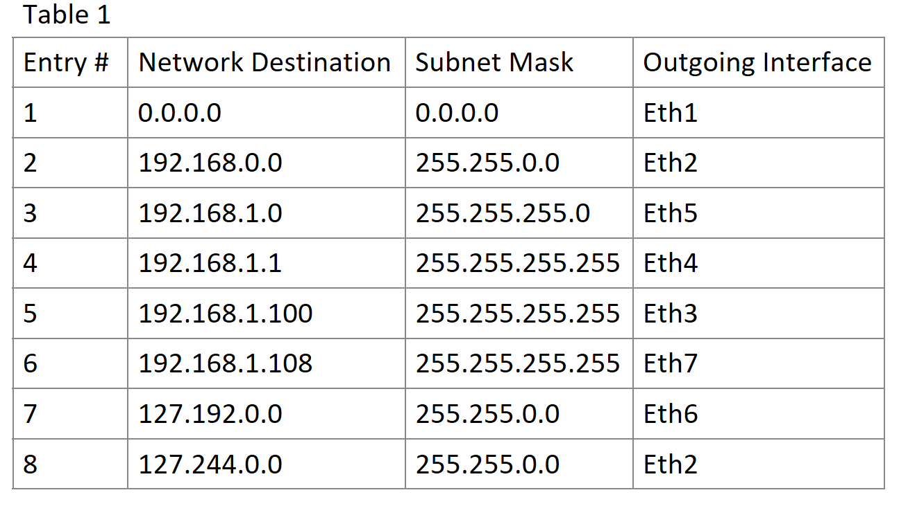
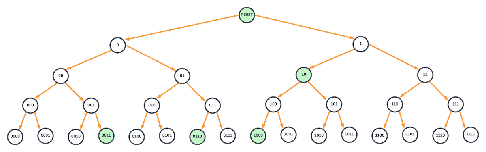
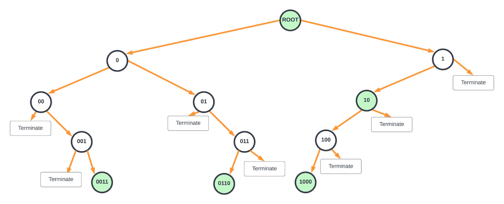
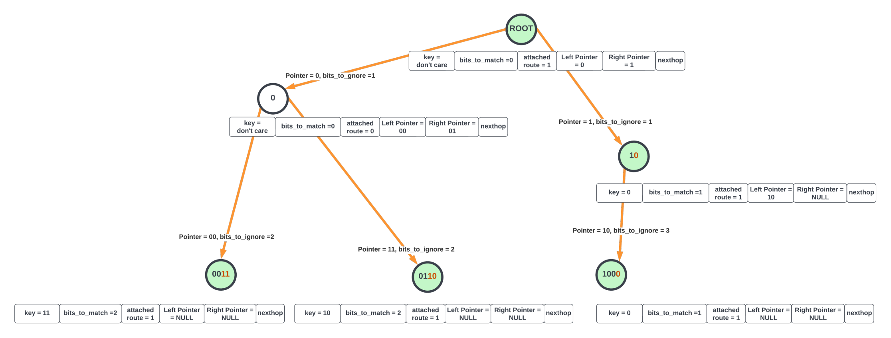
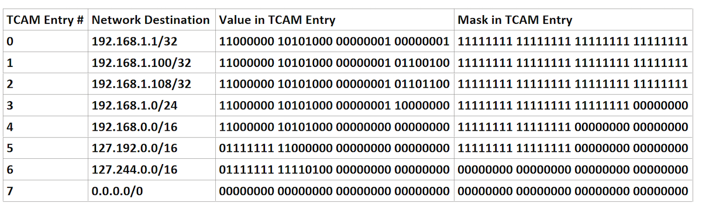
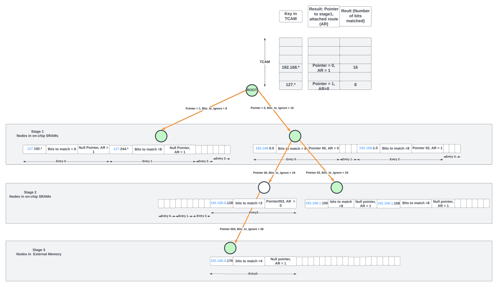
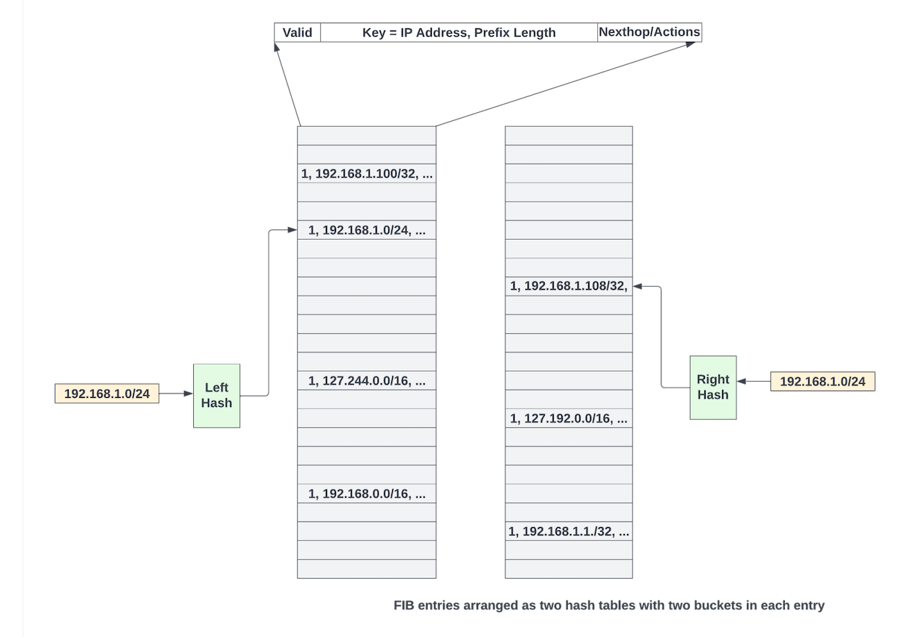
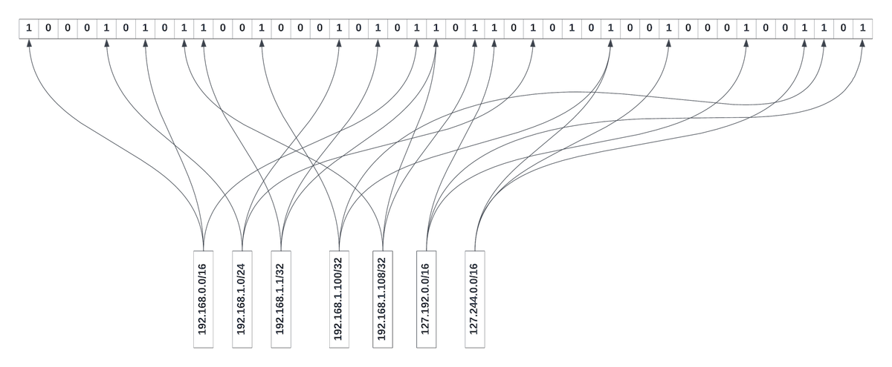
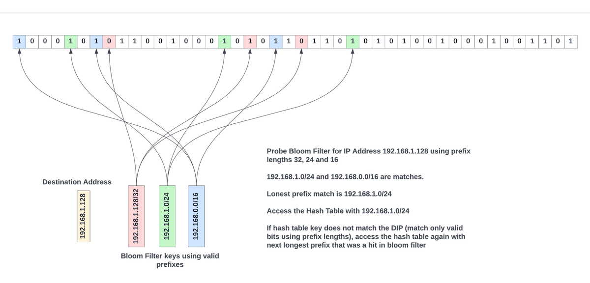

# Longest Prefix Matching in Networking Chips

**Sharada Yeluri - 01/02/2023**

Basic concepts of Forwarding Information Base (FIB), the longest prefix match (LPM) for IP forwarding, and how its implementation has evolved over time. The emphasis is on various hardware implementation choices and how they compare with each other in die area/power and performance. This is intended as a high-level primer.

Article initially published on [LinkedIn](https://www.linkedin.com/pulse/longest-prefix-matching-networking-chips-sharada-yeluri/).

## Basics

In a networking system (a router or a switch), various processes that take place are divided into planes. A plane is an abstract concept. The two most commonly referenced planes are the control plane and the data plane (also called the forwarding plane).

The tasks performed in the control plane determine how the packets should be processed and forwarded. The control plane executes these tasks in the background and populates the tables in the data plane. The data plane receives network traffic in the form of packets from multiple physical links in the networking chip, inspects some or all of the L2/L3/L4 protocol headers inside the packets, and takes action. The term packet processing is used to describe the task of inspecting the packet headers and deciding the next steps. The action can be determining the physical interface through which the packet must leave the router (using the routing tables populated by the control plane), queuing and scheduling to go out from that interface, or dropping the packet if it violates traffic rules/security checks, or sending the packet to the control plane for further inspection and so on.

The tasks performed in the control plane determine how the packets should be processed and forwarded. The control plane executes these tasks in the background and populates the tables in the data plane. The data plane receives network traffic in the form of packets from multiple physical links in the networking chip, inspects some or all of the L2/L3/L4 protocol headers inside the packets, and takes action. The term packet processing is used to describe the task of inspecting the packet headers and deciding the next steps. The action can be determining the physical interface through which the packet must leave the router (using the routing tables populated by the control plane), queuing and scheduling to go out from that interface, or dropping the packet if it violates traffic rules/security checks, or sending the packet to the control plane for further inspection and so on.

The FIB is stored in on-chip or off-chip memories (SRAM, HBM/DRAM, or TCAM). It contains just enough information to forward the packets to their next destination or nexthop. These tables are updated (installing/removing the routes) in the background by the control plane software without disrupting the data plane traffic.

For IP forwarding, the FIB usually contains the IP address, subnet mask (or IP prefix), and the nexthop. Depending on the hardware implementation, the nexthop could directly indicate the physical interface through which the packet should be forwarded along its path to the final destination. Or it can point to an entry in yet another table that contains a set of instructions on how to compute the outgoing interface for the packet.

For this discussion, let's use a simplified format for the FIB entry that contains the IPv4 address, subnet mask, and the outgoing ethernet interface. In reality, the actual FIB structures are complex, can be shared between IPv4 ad IPv6 addresses, contain several additional fields that are used along with the destination address for lookup, and contain a lot more information to specify various actions for the packet.

A conceptual FIB table is shown in the table below for IPv4 addresses. IPv6 entries look similar, except they have much wider addresses (128 bits) compared to IPv4.

If the FIB were to contain every single IP address used on the planet, it would need billions of entries, and it is impossible to store them in hardware. For example, a 32-bit IPv4 address would need ~4 billion entries. So, routers often aggregate the routes (based on the subnet) for destinations that are not directly connected to their outgoing interfaces. The subnet mask indicates to the hardware to only look at the bits of the incoming packet's destination address that have the bits in the mask set to 1.

For example, for the entry with a network destination of 192.168.0.0 and a network mask of 255.255.0.0, the mask, when expanded to binary format, has the upper 16 bits set. This number 16 is called prefix length. The FIB entry is referred to as 192.168.0.0/16 (or 192.168.*). Storing subnet masks as prefix lengths reduces the entry width in the FIB table.

For example, for the entry with a network destination of 192.168.0.0 and a network mask of 255.255.0.0, the mask, when expanded to binary format, has the upper 16 bits set. This number 16 is called prefix length. The FIB entry is referred to as 192.168.0.0/16 (or 192.168.*). Storing subnet masks as prefix lengths reduces the entry width in the FIB table.

### What is Longest Prefix Match?

During IP forwarding, when the networking chip receives an IP packet, it uses the destination IP address to search through the FIB to find all matching entries. When determining if an entry is a match or not, it uses the prefix length stored in the FIB to mask out bits of the destination address that do not matter from the comparison.

For example, if the destination IP address of a packet is 192.168. 1.108, it matches entries 1, 2, 3, and 6. Out of all the matches, the match with the longest prefix is entry 6. It indicates the most precise way to get to the nexthop, and the hardware should select this entry. Thus, the most specific of all the entries that match - the one with the longest prefix length - is called the longest prefix match (LPM).

These overlapping prefixes are very common in forwarding tables to provide an optimal path for a packet as it goes through multiple routers to reach the destination.

### Challenges with Longest Prefix Match Implementation

In the simplified example above, I only showed 8 entries in the routing table. But, the FIB databases in typical high-end routers have millions of entries, and the requirements to hold more entries in the hardware continue to grow with the widespread adoption of IPv6 forwarding and with the exhaustion of IPv4 address space.

Further, networking chip vendors are packing more and more bandwidth in each chip which puts a large burden on packet processing pipelines/engines to perform these LPM lookups at very high rates.

Take an example of a high-end networking chip with 14.4T bandwidth. To meet the line rate for 64B packets (the minimum packet size on an ethernet interface), it would need to process the packets and do LPM lookups at 21 Billion Packets per Second or less than 46 picoseconds per each LPM lookup! Supporting such high packet processing rates would require many packet processing pipelines to distribute the workloads, which in turn would add so much hardware area that it would be impossible to fit all of that in one die even at the reticle limit.

Many networking chips take typical network loads into account and increase the minimum packet size at which their packet processing pipelines meet the line rate. In the example above, if we were to meet the line rate for only 350B packets and above, the processing rate goes down to ~200 picoseconds per packet. Assuming four packet processing pipelines, each pipeline is now required to process packets and do LPMs in 200 x 4 = 800 picoseconds. This translates to one packet per cycle at 1.25GHz clock rates!

What it means for LPM is that, in one cycle of 1.25GHz, it would need to parse millions of entries in the FIB table and find the entry that contains the longest prefix match!! Obviously, reading through each entry and finding the longest prefix match entry does not scale!

Further, the FIB tables, due to the large size, are often shared across all the processing pipelines - which adds an extra burden on the number of accesses these tables must support.

Some applications would require upwards of 10M routes in the FIB, and scaling on-chip SRAMs to hold that many routes would be practically impossible. Eventually, part of the FIB table spills into external memory. External memory bandwidth is not cheap either. For example, one HBM3 part provides about ~5 Tbps of usable bandwidth. This external memory is often shared between packet buffering and packet processing tables. It is not often easy to add more HBM parts to the package due to beachfront limitations (Serdes or die-to-die interfaces in multi-chip modules occupy most of the beachfront area).

Given the limited bandwidth of the external memory, networking architects are designing the lookups in such a way that not every LPM needs to access the external memory table.

## LPM Architectures

Any hardware pipeline implementation of the LPM, along with meeting the high processing rates, should minimize the overall area and the power consumed for this process. In addition, the architecture should enable faster route table insertions and deletions from the control plane software. There are several approaches to tackling this problem. In this article, I will go through the common approaches used in the industry:

- Tree/trie-based structures
- TCAMs
- Hybrid (TCAMs/Tries)
- Bloom filters and Hash Tables

### Tree/trie Structures

An uncompressed binary tree where each node tests one bit of the lookup key (aka. destination IP address or DIP) is one of the simplest ways to visualize and implement the longest prefix match lookup. To illustrate this example succinctly with a diagram, I will assume for now that the IP address is only 4 bits and the FIB has entries 10*, 0011, 0110, and 1000. The diagram below represents an uncompressed tree for a 4-bit IP address where nodes with routes are highlighted in green.

The root node contains the default route. Each node must contain the location of the bit to test in the key and two pointers (for branching to left or right depending on the bit value of 0 or 1), a bit indicating if that node has an attached route, and the nexthop information. The key value (IP address) is not explicitly stored in the node. These nodes reside in either on-chip or off-chip memories. Without compression, this tree would require billions of entries in the memory to store the information for each node. And in the worst case, it would require 128 memory accesses to find the longest prefix match for an IPv6 address.

In all the hardware LPM implementations using a binary tree, unused nodes are pruned out, and the nodes are compressed. By doing so, the number of nodes well as the number of memory accesses needed is drastically reduced.

The above tree can be further compressed where the parent nodes with only one child node are merged together (modified Patricia trie, Juniper Networks patent), as shown in the below diagram. This requires part of the key value to be stored in each node that is merged.

For the compressed tree shown in the above diagram, hardware starts from the root node and sets the current_nexthop for the packet to the default route attached to the root node. Hardware proceeds to the next node (either to the left or right) based on the most significant bit in DIP. It also updates bits_to_ignore to 1 as the most significant bit was already inspected.

Evaluation at any node is as follows.

1. After masking out the most significant *bits_to_ignore*, the next *bits_to_match* number of bits in the destination IP address is compared with the key value at the node. If it is not a match, terminate the lookup. If it is a match, go to (2)
2. If the node is not a leaf node (both left/right node pointers are null), the hardware looks at the bit after *bits_to_ignore* + *bits_to_match* bits to take either left or right branch (if this bit is zero, take the left branch, else take right branch). If the current node has an attached route, the *current_nexthop* is updated with the node's nexthop
3. If the branch to be taken is a null pointer, the lookup is terminated.
4. If the branch to be taken is not a null pointer, the lookup continues to the child node pointed by the pointer. *bits_to_ignore* is updated by the number of bits matched and compared in the current node.

Whenever the processing is terminated, the value stored in the *current_nexthop* state of the hardware indicates the nexthop for the LPM lookup. The above evaluation could be done with dedicated state machines in the hardware where each state machine walks through one packet at a time until the LPM is found for that packet (run_to_completion).

This compressed binary tree also results in multiple accesses to the shared memory and the evaluation time is not deterministic. For example, in a *2-way* Patricia trie with one million routes, lookups, on average, would require 20 accesses to the nodes in the memory. It is hard to pipeline these accesses as it would require storing each stage's nodes in separate memory structures belonging to each pipeline stage, which could result in inefficient usage of these memories as the routes are added/updated.

Further reduction in processing could be achieved by creating *4-way* nodes where two bits are evaluated, and based on the results (00, 01, 10, or 11), one of the four child nodes is selected. In the general case, an *N-way* node would require log2(*N*) bits to be evaluated for branching to one of the child nodes.

Adding/removing entries in these structures is often done by the control plane software by creating a copy of the intermediate node and its child nodes in a separate space in the memory and updating the pointer of the parent node to point to the new child node. Although it requires extra memory, the updates cause minimal disruption to the traffic.

There are many variations of algorithmic LPM processing, where the tries are optimized for reducing the number of stages, storage, or a balance of both. Although trie implementations are simpler, they do not scale well for billion per second of LPM processing due to the large number of memory accesses. Most high-bandwidth networking chips have moved away from purely trie implementations.

### TCAMs

TCAM (ternary content-addressable memory) is a specialized high-speed memory that can search all its contents in a single cycle. Ternary, as opposed to binary, indicates the memory's ability to store and query data using three different inputs (0, 1, or x). Here the state 'x' is a don't care. The don't care state is implemented by adding a mask bit for each memory cell of a TCAM entry. Thus, a 32-bit wide TCAM entry contains 32 (value, mask) pairs.

To explain this concept better, take entry #2 in the FIB table above (192.168.0.0/16). The address in binary format translates to 11000000 10101000 00000000 00000000. Since we are only interested in matching the upper 16bits, the corresponding mask bits for this address are 11111111 11111111 00000000 00000000.

Each memory cell in the TCAM contains circuitry that does the comparison against 0 and 1 after qualifying with the mask. Then, the match output from each memory cell in the data word is combined to form a final match result for each TCAM entry. In addition, TCAMs also have additional circuitry that looks at all the TCAM entries that match and output the index of the first matching entry. Some TCAMs also provide indices of all matching entries as well.

When storing the FIB entries in the TCAM, for each FIB table, the software sorts the entries according to the prefix lengths in descending order and stores the larger prefix length entries at lower indices.

For example, the mini FIB table in our example could be stored in the TCAM as below:

Now, when a packet with destination IP address *192.168. 1.101* is looked up in the TCAM, it outputs "3" as the matching entry. The nexthop/actions for each entry could be stored in a separate on-chip memory, which can be accessed with the TCAM lookup result to determine the nexthop for the packet. Above is a very simplified description of how one can perform LPM with TCAMs.

But, the fundamental problem with the TCAMs is that they require close to ~16 transistors per memory cell (compared to 4-6 transistors for an SRAM cell or one transistor for a DRAM cell). Because of this, it is hard to pack large FIB tables with millions of entries in TCAMs. Embedded TCAMs are also limited in depth (around ~4K entries) to enable comparison in a cycle. FIB tables larger than 4K entries require multiple TCAM banks, which would need to be accessed in parallel. In addition, since each search operation involves activating all entries, they consume large amounts of power per lookup.

TCAMs are still a popular choice for implementing firewalls (Access Control Lists), QoS functions, and for packet classification, as these functions require far less scale than the FIB tables. These days, to balance power/area and performance for large FIBs, several routing chip vendors use hybrid approaches that combine the goodness of TCAMs and the trie structures.

### Hybrid approach (TCAM root node in a trie structure)

In the hybrid approach, a large TCAM at the root node of a trie structure could reduce the number of stages in the structure. For example, for IPv4 routing, the TCAM could contain the MSB 16-bits of address. A lookup in the TCAM could yield a match whose results indicate the number of bits matched along with the pointer to the child node.

Even with a TCAM at the root node, the Patricia trie structure in the previous section with limited 2-way or 4-way nodes could still lead to many memory accesses. One way to limit the stages (and thus the memory accesses) is to make the number N large in the N-way node and modify the scheme slightly to add flexibility to how the child nodes are selected.

For example, the node in stage-1, pointed by TCAM match, could contain a 4-way entry. Each entry contains the key (IP address/prefix length) and the number of bits to match after ignoring the most significant bits_to_ignore between the node's key and the incoming packet's DIP. For example, if the packet's DIP already matched the 16 MSB bits of the IP address in the TCAM, the next node could start comparing from the 17th bit (from the left) of the DIP. A match here could either end the LPM processing (if the child pointer of the entry is null) or could point to the next child node.

The second stage could contain a 4 or 8-way node with similar entries. A match in the second node could either terminate the search or point to the third stage where the node entries reside in external memory.

The above approach works well if the active prefixes are uniformly distributed across all the entries/nodes. If more routes are concentrated through only a few stage-1 nodes, more of them will end up in the external memory, which has limited bandwidth. This bottleneck continues until the control plane software is able to rebalance the entire tree starting from the root node in the TCAM. Software reaction times are large, and by the time nodes are rebalanced, the traffic pattern would have changed again.

But, this approach has several advantages. The trie structure has a fixed number of stages (3-stages in the diagram above) and hence deterministic time for processing. Each LPM lookup requires only two on-chip SRAM accesses for most IP lookups as 512K IPv4 entries could reside on-chip with ~64Mbits of memory.

For the 14.4Tbps chip at 350B packet for line rate example, each of the four packet processing pipelines has to process one packet every cycle. If every LPM lookup of the packet involves 2 on-chip memory accesses, the SRAM structures that hold the FIB tables need to provide at least 8 accesses (4 pipelines x 2 accesses per pipeline) per cycle.

To provide such a high bandwidth, the FIB tables are often divided into many logical banks, and access to the requesters from the banks is provided with heavy stats-muxing, which adds variable delays for the read responses due to transient hot-banking. Further, large on-chip memories that are shared among many processing engines reside at a central location and have 100s of cycles of delay between the requesting clients and the central structures. Thus, even with on-chip structures, accessing them several times per packet adds variable delays to packet processing, consumes extra power during the data movement, and diminishes the benefits of fixed-pipeline packet processing.

Hence, for pipelined packet processing architectures, it is essential to reduce the access to the on-chip FIB tables to one access per packet and only sporadically access off-chip tables. That's where bloom filters and hash tables come to our rescue.

### Bloom Filters / Hash Tables

Wikipedia says, "A bloom filter is a space-efficient probabilistic data structure that is used to test whether an element is a member of a set or not. False positives are possible, but false negatives cannot happen. A query for an element returns either* possibly in the set* or *definitely not in the set*."

A bloom filter is an *M-bit* array with *K* different hash functions. Elements can be added to the set by hashing them with *K* different hash functions and setting the *K* locations pointed to by the hash results to 1 in the bloom filter array. Removing elements is slightly harder but can be done using brute force techniques like reevaluating all the contents of the bloom filter again or other mechanisms that maintain reference counts for each entry of the bloom filter array in software data structures.

How do bloom filters help in reducing the number of accesses to the large FIB structures? Well, Juniper Networks has several patents on this topic!

The high-level concept is as follows (the actual implementation is far more involved!). FIB entries are first populated as hash tables. A typical hash table entry contains the IP address, prefix length, nexthop, and the actions. To resolve hash collisions, the cuckoo hashing scheme could be used, where the key (IP address masked with prefix length bits) for a new route is hashed using two different hash functions to get two locations (one in each hash table) where the entry could be written. The entry is written in one of the empty locations. If both locations are taken up, entries could be reshuffled by the software using cuckoo moves (refer to Wikipedia for more details). All of this is done by control plane software to populate the hash tables. Data plane logic is blissfully unaware of this.

Control plane software updates the bloom filter as follows:

1. Start with an empty M-bit bloom filter array.
2. Then, for every entry in the FIB hash table, a key is constructed by taking the prefix length of bits from the IP address (other bits are zeroed out).
3. Using that key, *K* different hash functions are evaluated to get *K* different indices inside the M-bit array. All these *K* locations are set to 1.
4. Steps 2, 3, and 4 are repeated for every entry in the FIB table and every time a route is updated in the FIB table.

In the diagram below, each entry of the FIB table (Table 1) is hashed three times (*K* = 3), and various bits in the bloom filter are set. In general, to avoid significant false positives, the total number of bits in a bloom filter array should be at least 8 times the number of FIB table entries; else, most of the bits in the bloom filter will be set, and the false positive rate increases.

The bloom filter bits could also be partitioned logically to give different numbers of banks for different prefix length ranges. The number of bloom filter bits allocated for a prefix length range could depend on the number of valid prefixes in that range in the FIB table.

The software also maintains prefix length structures for each type of lookup (IPv4 or IPv6, for example), which contain all valid prefix lengths in the FIB table in descending order for that lookup type. The theoretical limit for the total number of prefix lengths for IPv4 and IPv6 are 32 and 128, respectively.

When doing LPM with a bloom filter, the very first step for the hardware would be to get the sorted list of prefix lengths for the specific lookup type. Then, probe the bloom filter for these prefix lengths by masking out the bits in the packet's destination IP address using the sorted prefix lengths, and for each prefix length, access the bloom filter *K* times using the same hash functions the software has used to populate the bloom filter. If all the *K* locations are "1", then that key is most probably in the FIB table. It is as simple as that.

Each probe to bloom filter involves accessing *K* different bits of the bloom filter array. *K* is typically 3 or 4. And each access quantum is only one bit. By logically partitioning the bloom filter array across prefix ranges and hash functions, it is possible to do up to 16 prefix length probes per cycle from the bloom filter banks.

From the probe results, the largest prefix length that resulted in a match in the bloom filter is most probably present in the FIB table. The FIB hash tables are accessed using that key

The matching entry is the one where the key stored in the hash table entry matches with the key used to access the hash table. If entries in both left and right hash tables do not match, the next longest prefix length that has matched in the bloom filter is used to access a new entry in the FIB table. This process repeats until an entry matches.

If the bloom filter array is sized correctly, it is possible to get a false positive rate as low as 5%. Assuming an IPv4 prefix length table typically contains about 8 prefixes on average, the theoretical maximum number of times the FIB table needs to be read is (1 + 8 x 0.05) = 1.4. It is less than the number of times FIB structures need to be accessed in all the other schemes. For IPv6, due to the larger range of prefixes, prefix lengths could be aggregated into prefix length ranges. A separate bloom filter array could be probed to see which largest prefix length range has a match before proceeding with probing the prefix lengths inside that range.

Using a bloom filter to reduce accessing central FIB structures has several advantages. Data movement is reduced as, on average, each LPM access would require about ~1.4 memory accesses. But, as with any hash table, if the tables are loaded too heavily, it leads to hash collisions, and software needs to rebalance the entries.

As with other mechanisms, on-chip memory is limited. It is possible to keep all the hash tables of a lookup in external memory for larger scales. But, to sustain line rate with external memory accesses for the hash tables, large on-chip caches are often used to keep frequently accessed routes on the chip.

The Bloom filter approach reduces the number of central or external memory FIB table reads at the expense of the bloom filter bit array per processing pipeline. While the overall performance could be better due to the added bloom filter logic, this approach might not be as superior in the area compared to the hybrid approach due to additional bloom filter arrays. Hash tables also would need 20% extra entries to reduce hash collisions. But, similar inefficiency exists in the hybrid approach where nodes in stages 1-2 could be sparsely populated based on the route patterns.

### Caches for storing frequently accessed FIB entries

In all the approaches, a hierarchy of local caches at every level could be used to reduce the number of lookups, on-chip, and external memory accesses. The effectiveness of these caches depends heavily on the traffic patterns, the number of active routes, and the rate at which new routes are added/deleted.

## Summary

Implementing the longest prefix match most efficiently is considered the holy grail of networking chips. With the rapid growth in internet tables and with billions of packets flowing through the networking chips per second, LPM continues to challenge networking chip architects. With the end of Moore's law, with on-chip memories barely scaling in the new process nodes and with oversubscribed external memories, it is all the more important to decrease the memory footprint and the bandwidth requirements for doing LPMs. I have discussed several popular approaches.

For high-end routers that would need billions of LPM lookups per second, the hybrid and bloom filter-based approaches are more popular due to their scale and more deterministic completion times overall. In addition to the hardware innovations for faster LPM, route table compression in the control plane (where prefixes could be aggregated as the routes are updated) could also help reduce the memory footprint for FIB tables and reduce external memory accesses.

## References

In addition to my domain knowledge in high-speed networking, I reviewed several research articles and the patent database ([google patents](https://patents.google.com/)) for writing this primer.

## Glossary

- DIP: Destination IP address
- DRAM: Dynamic Random Access Memory
- FIB: Forwarding Information Base
- HBM: High Bandwidth Memory
- LPM: Longest Prefix Match
- MSB: Most Significant Bit
- RIB: Routing Information Base
- SRAM: Static Random Access Memory
- TCAM: Ternary Content-Addressable Memory
