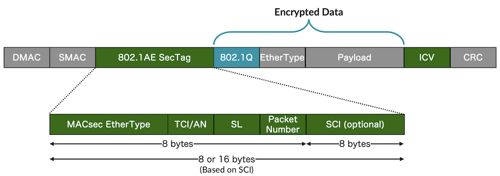
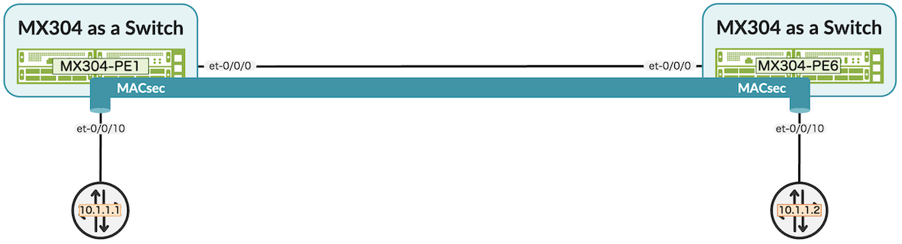
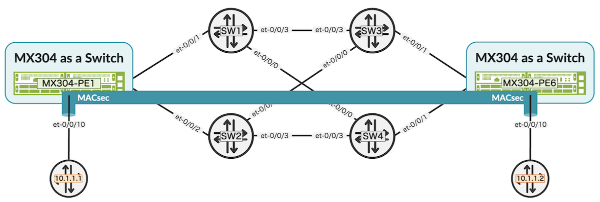
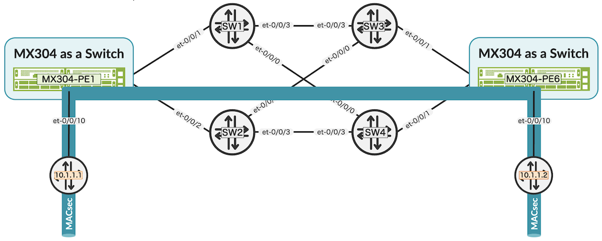
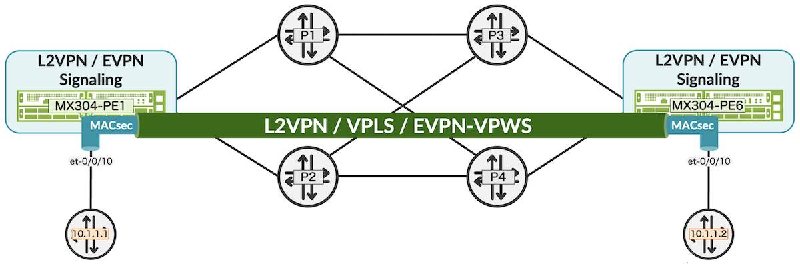
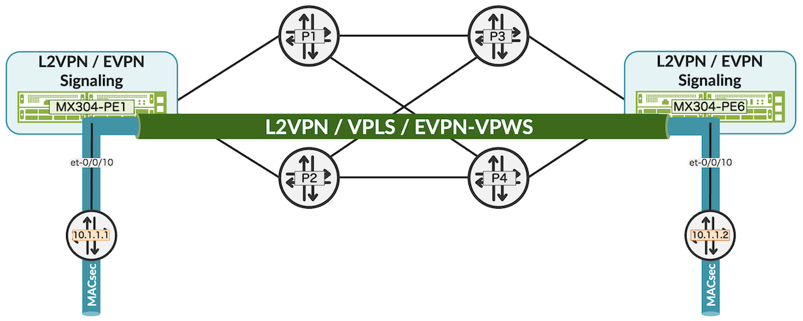

# MACsec and L2PT over Non-Point-to-Point Networks in Junos

**Moshiko Nayman - 03/24/2025**

Junos 25.4R1 enhances Layer 2 Protocol Tunneling in VXLAN tunnels and traditional VLANs by introducing support for more protocols, allowing MACsec to traverse Layer 2 networks.

## Overview

Media Access Control Security (MACsec) is primarily designed to provide point-to-point security on Ethernet links. It ensures data confidentiality and integrity between two directly connected devices. However, with techniques like Layer 2 Protocol Tunneling (L2PT), it's possible to extend MACsec's benefits across broader network segments, including non-point-to-point scenarios, by tunneling the MACsec-protected traffic transparently over Layer 2 networks.

MACsec is a Layer 2 protocol that provides encryption and integrity checks for Ethernet frames, offering an effective solution for protecting sensitive information from eavesdropping and tampering. Data remains confidential and unaltered as it travels across the network. MACsec uses the MACsec Key Agreement (MKA) protocol to exchange encryption keys between devices.

There are mainly two EtherTypes for MACsec:

- **The EtherType 0x888E**, as defined by the IEEE 802.1X standard, is crucial for MACsec as it is used for the MKA protocol, which handles encryption key exchange and security associations:
    - **EAPOL Frames**: Used for Extensible Authentication Protocol over LAN (EAPOL) frames, which are part of the IEEE 802.1X standard.
    - **MACsec Key Agreement (MKA)**: Facilitates the exchange of encryption keys and the establishment of security associations.
    - **Authentication**: Ensures that only authorized devices can join the network by managing authentication processes.
    - **Key Management**: Handles the distribution and management of encryption keys necessary for securing communication.

In addition, MKA uses the destination MAC address called Nearest-non-TPMR-bridge. The Nearest non-TPMR Bridge group address (01-80-C2-00-00-03) is reserved by the IEEE as part of the IEEE 802.1Q, 802.1X, and 802.1AE standards. This address ensures that specific control frames are processed only by directly connected network bridges and not forwarded by Two-Port MAC Relays (TPMR).

- **The EtherType 0x88E5**, as defined by the IEEE 802.1AE standard, is used in MACsec to indicate that the frame is a MACsec frame:
    - **Integrity and Confidentiality**: Ensure frames are not tampered with and can optionally be encrypted.
    - **Replay Protection**: Uses packet numbers to prevent replay attacks.
    - **Security Associations**: Manages secure channels and associations using the Tag Control Information (TCI) and Association Number (AN) fields.

These EtherTypes are essential for identifying and processing MACsec-protected frames, ensuring secure communication over Ethernet networks.



MACsec Header Structure:

- **DMAC and SMAC Ethernet Header**: This is the standard Ethernet frame header, which includes the destination and source MAC addresses, as well as the EtherType field (e.g., 802.1Q VLAN 0x8100).
- **802.1AE Security Tag Security tag (SecTAG)**: This is a MACsec-specific header that includes several fields:
    - **EtherType**: Identifies the frame as a MACsec frame (0x88E5).
    - **SCI (Secure Channel Identifier)**: Uniquely identifies the secure channel between two devices.
    - **TCI (TAG Control Information)**: The TCI field contains several bits that provide information about the security processing of the frame, indicating
        - Encryption status (E)
        - Confidentiality offset (C)
        - End station frame (ES)
        - Secure channel (SC)
        - Single copy broadcast (SCB)
- **AN (Association Number)**: Identifies the specific security association within the secure channel.
    - **Packet Number (PN)**: A counter that ensures each frame is unique and helps prevent replay attacks.
    - **SL (Short Length)**: Indicates the length of the SecTAG and the encrypted data.
- **Encrypted Data**: The payload of the Ethernet frame, which is encrypted to ensure confidentiality.
- **ICV (Integrity Check Value)**: A cryptographic checksum that ensures the integrity and authenticity of the frame.

Layer 2 Protocol Tunneling (L2PT) is a technique used to tunnel Layer 2 Control Protocol (L2CP) packets, such as Spanning Tree Protocol (STP) and Link Layer Discovery Protocol (LLDP), across a switch or router. L2PT changes the destination MAC address of these protocol packets to a predefined multicast address, allowing them to be transmitted transparently across the network without being processed by intermediate devices. This ensures that Layer 2 protocols can operate seamlessly over service provider networks.

The EtherType 0x88E5 is transparently forwarded natively in Junos OS and therefore does not need to be included in the L2PT.

## Configuration

### MACsec High-level Config Syntax

```
set security authentication-key-chains key-chain <key-chain-name> key <key-identifier> key-name <key-name> 
set security macsec 
set security macsec connectivity-association <ca_name> secure-channel <sc_name> offset 0 
set security macsec connectivity-association <ca_name> secure-channel <sc_name> offset 30 
set security macsec connectivity-association <ca_name> secure-channel <sc_name> offset 50 
set security macsec interfaces 
set security macsec interfaces <name> unit <number> debug 
set security macsec interfaces <name> debug 
set security macsec cluster-control-port 
set security macsec cluster-data-port
```

### L2PT Configuration Syntax

Enable L2 protocol tunneling for layer 2 interfaces

```
set protocols layer2-control mac-rewrite interface <name> protocol ieee8021x
```

Enable L2 protocol tunneling in vxlan-tunnel

```
set protocols layer2-control mac-rewrite interface <name> protocol ieee8021x
```

Optional

```
set logical-systems <name> protocols layer2-control mac-rewrite
set protocols layer2-control mac-rewrite
set logical-systems <name> protocols layer2-control l2pt
set protocols layer2-control l2pt
```

### Debug Tools / Show Commands

```
show security mka sessions
show security mka statistics
show security macsec connections
show security macsec statistics
```

## MACsec over Direct Connect

Starting with Junos OS 15.1, Juniper added support for Media Access Control Security (MACsec), providing point-to-point security on Ethernet links by encrypting and authenticating data between directly connected nodes, including MX, PTX, ACX, SRX, QFX, EX, and other products.

It uses the IEEE 802.1AE standard to prevent various security threats such as denial of service, man-in-the-middle attacks, and passive wiretapping.

To configure MACsec on Juniper MX Series routers, you typically enable it on the desired Ethernet interfaces and set up the connectivity association key (CAK) for secure communication. This involves specifying the CAK and connectivity association name (CKN) on both ends of the link. The MACsec Key Agreement (MKA) protocol then manages the encryption keys and ensures secure data transmission.



## Configuring MACsec in Junos

PE1

```
set security macsec connectivity-association CA1 cipher-suite gcm-aes-xpn-128
set security macsec connectivity-association CA1 security-mode static-cak
set security macsec connectivity-association CA1 pre-shared-key ckn 1234567890123456789012345678901234567890123456789012345678901234
set security macsec connectivity-association CA1 pre-shared-key cak "$9$LXCxVw24aUikg436CtOBVwsYZUfTzF69kquOREyrgoaZHqQFnuBIAtNdVb2g5QznApBIErKMREs2aZjiBIRhKMWLxNVwKv"
set security macsec interfaces et-0/0/10 unit 100 connectivity-association CA1
```

PE2

```
set security macsec connectivity-association CA1 cipher-suite gcm-aes-xpn-128
set security macsec connectivity-association CA1 security-mode static-cak
set security macsec connectivity-association CA1 pre-shared-key ckn 1234567890123456789012345678901234567890123456789012345678901234
set security macsec connectivity-association CA1 pre-shared-key cak "$9$LXCxVw24aUikg436CtOBVwsYZUfTzF69kquOREyrgoaZHqQFnuBIAtNdVb2g5QznApBIErKMREs2aZjiBIRhKMWLxNVwKv"
set security macsec interfaces et-0/0/10 unit 100 connectivity-association CA1
```

## MACsec Over Layer 2 Network

Layer 2 Protocol Tunneling (L2PT) ensures that MKA (MACsec Key Agreement) frames are forwarded transparently across the network by changing their destination MAC address to a predefined multicast address. This allows MACsec-protected traffic, including 0x888E frames, to traverse the network securely without being processed by intermediate devices. By establishing a MACsec tunnel over traditional Layer 2 networks, this technology ensures that sensitive data remains secure and confidential as it traverses the network.



### Configuring MACsec and L2PT for Transparent MACsec Tunneling

As a reminder, L2PT under layer2-control stanza is for vxlan-tunnels while mac-rewrite is for layer 2 VLAN-based interfaces.

```
set protocols layer2-control mac-rewrite interface et-0/0/10 protocol ieee8021x
```

Alternatively, we can choose to carry MACsec only where the remote side establishes the MACsec tunnel, as shown below:



### Configuring L2PT for Transparent MACsec Tunneling

Yes, it's really that effortless!

```
set protocols layer2-control mac-rewrite interface et-0/0/10 protocol ieee8021x
```

## MACsec Over Layer 2 MPLS Networks

Another key use case is tunneling MACsec over MPLS VPN tunnels. Juniper, a pioneer in all L2VPN (L2VPN, VPLS, EVPN [EP-LAN Option 2], EVPN-VPWS) tunnels, offers excellent built-in support for traversing MACsec over MPLS. This capability allows the entire MACsec packet, including the 0x888E EtherType header, to be forwarded untouched, treating it as user-plane traffic. This ensures that MACsec's encryption and integrity features are preserved across the service provider's network, providing secure and transparent Layer 2 connectivity.

> Note 1: The Metro Ethernet Forum (MEF) specifies the rules for processing L2CP Ethernet frames when the frames arrive at the L2CP decision point on the user network interface (UNI). The rules provide the mechanism for transparently passing the L2CP frame between a Carrier Ethernet Network and a Subscriber Network.

As Juniper products, such as the MX platform and other types of routers, comply with these rules, no additional configuration is required.

The traffic encrypted by MACsec, along with its header, will be forwarded untouched to the remote side, emulating point-to-point connectivity.





## MACsec Over Layer 2 MPLS Networks with EVPN

When using an EVPN tunnel (not EVPN-VPWS), traffic is not forwarded transparently. However, Junos OS on MX routers is equipped with robust Layer 2 filtering capabilities for various families, including VPLS, MPLS, EVPN, and CCC, enabling fine-grained traffic control.

To allow MACsec to run transparently over an EVPN tunnel, we can leverage these filtering capabilities to ensure MKA multicast packets are exchanged over the tunnel. This can be achieved using either a regular filter, which controls forwarding based on the EVPN destination MAC (DMAC) table, or a flood filter, which applies to the EVPN flood table. By defining the appropriate filter, multicast traffic is permitted, allowing MACsec key negotiation to proceed without interfering with the EVPN forwarding model.

### Configuring Filter or Flood for EVPN Tunnel

```
set firewall family evpn filter EVPN-FLOOD term MCAST from traffic-type multicast
set firewall family evpn filter EVPN-FLOOD term MCAST then count MCAST
set firewall family evpn filter EVPN-FLOOD term MCAST then accept

set routing-instances EVPN-A forwarding-options family evpn filter input EVPN-FLOOD
```

Or

```
set routing-instances EVPN-A forwarding-options family evpn flood input EVPN-FLOOD
```

This method is also useful for blocking specific unwanted traffic types. You can refine the filtering by selecting the exact multicast address to allow or silently discard.

```
set firewall family evpn filter VPLS-FLOOD term MCAST from destination-mac-address 01:80:C2:00:00:03 
set firewall family evpn filter EVPN-FLOOD term MCAST from traffic-type multicast
set firewall family evpn filter EVPN-FLOOD term MCAST then count MCAST
set firewall family evpn filter EVPN-FLOOD term MCAST then accept
```

> Note 2: Both regular filters and flood filters are supported in VPLS.

However, an accept filter is not required for MACsec in VPLS.

## Sample Decoded MACsec Packet

MACsec Key Agreement:

- Frame 1: 222 bytes on wire (1776 bits)
- Ethernet II
- 802.1Q Virtual LAN

```
110. .... .... .... = Priority: Internetwork Control (6)
...0 .... .... .... = DEI: Ineligible
.... 0000 0110 0100 = ID: 100
Type: 802.1X Authentication (0x888e)
802.1X Authentication
Version: 802.1X-2010 (3)
Type: MKA (5)
Length: 200
MACsec Key Agreement
Basic Parameter set
MKA Version Identifier: 2
Key Server Priority: 16
1... .... = Key Server: True
.1.. .... = MACsec Desired: True
..11 .... = MACsec Capability: MACsec Integrity with/without confidentiality, confidentiality offset 0, 30, or 50 (3)
.... 0000 0011 1100 = Parameter set body length: 60
SCI: e45ecc37f9b90017
Actor Member Identifier: 536ef9a02be0b807e762eeb7
Actor Message Number: 000447ca
Algorithm Agility: IEEE Std 802.1X-2010 (0x0080c201)
CAK Name: 1234567890123456789012345678901234567890123456789012345678901234
MACsec SAK Use parameter set
Parameter set type: MACsec SAK Use (3)
00.. .... = Latest Key AN: 0
..0. .... = Latest Key tx: False
...1 .... = Latest Key rx: True
.... 00.. = Old Key AN: 0
.... ..0. = Old Key tx: False
.... ...0 = Old Key rx: False
0... .... = Plain tx: False
.0.. .... = Plain rx: False
...0 .... = Delay protect: False
.... 0000 0010 1000 = Parameter set body length: 40
Latest Key: Key Server Member Identifier: 536ef9a02be0b807e762eeb7
Latest Key: Key Number: 0000000d
Latest Key: Lowest Acceptable PN (32 MSB): 00000000
Old Key: Key Server Member Identifier: 000000000000000000000000
Old Key: Key Number: 00000000
Old Key: Lowest Acceptable PN (32 MSB): 00000000
Distributed SAK parameter set
Parameter set type: Distributed SAK (4)
00.. .... = Distributed AN: 0
..01 .... = Confidentiality Offset: No confidentiality offset (1)
.... 0000 0010 0100 = Parameter set body length: 36
Key Number: 0000000d
MACsec Cipher Suite: GCM-AES-XPN-128 (0x0080c20001000003)
AES Key Wrap of SAK: a686a385387e435ff4a7c44de048ecc8f3a5aa1ba2c3fa2d
Extended Packet Numbering set
Parameter set type: XPN (8)
Suspension time: 0
.... 0000 0000 1000 = Parameter set body length: 8
Latest Key: Lowest Acceptable PN (32 MSB): 00000000
Old Key: Lowest Acceptable PN (32 MSB): 00000000
Live Peer List Parameter set
Parameter set type: Live Peer List (1)
.... 0000 0001 0000 = Parameter set body length: 16
Peer Member Identifier: 1ace900376928381c99356f0
Peer Message Number: 00000002
Integrity Check Value Indicator
Parameter set type: ICV Indicator (255)
.... 0000 0001 0000 = Parameter set body length: 16
Integrity Check Value: ce80dad35ebe1881222a10f5c0e4e33a
```

MACsec frame:
- Frame 1: 1470 bytes on wire (11760 bits)
- Ethernet II
- 802.1Q Virtual LAN

```
000. .... .... .... = Priority: Best Effort (default) (0)
...0 .... .... .... = DEI: Ineligible
.... 0000 0110 0100 = ID: 100
Type: 802.1AE (MACsec) (0x88e5)
- 802.1AE Security tag
0000 11.. = TCI: 0x03, VER: 0x0, E, C
0... .... = VER: 0x0
.0.. .... = ES: Not set
..0. .... = SC: Not set
...0 .... = SCB: Not set
.... 1... = E: Set
.... .1.. = C: Set
.... ..01 = AN: 0x1
Short length: 0
Packet number: 76705
ICV: 9e073d79939140e6289ffd548976c2dc
Frame authentication status: 2
````

MACsec frame over MPLS:

- Frame 1: 208 bytes on wire (1664 bits)

```
Ethernet II
Destination: JuniperNetwo_38:4c:ae (e4:5e:cc:38:4c:ae)
Source: JuniperNetwo_14:50:64 (e4:5e:cc:14:50:64)
Type: MPLS label switched packet (0x8847)
Stream index: 0
```

- MultiProtocol Label Switching Header
- PW Ethernet Control Word

```
Ethernet II
Destination: JuniperNetwo_38:4c:d8 (e4:5e:cc:38:4c:d8)
Source: JuniperNetwo_38:01:18 (e4:5e:cc:38:01:18)
Type: 802.1Q Virtual LAN (0x8100)
Stream index: 1
- 802.1Q Virtual LAN
000. .... .... .... = Priority: Best Effort (default) (0)
...0 .... .... .... = DEI: Ineligible
.... 0000 0110 0100 = ID: 100
Type: 802.1AE (MACsec) (0x88e5)
- 802.1AE Security tag
0000 11.. = TCI: 0x03, VER: 0x0, E, C
0... .... = VER: 0x0
.0.. .... = ES: Not set
..0. .... = SC: Not set
...0 .... = SCB: Not set
.... 1... = E: Set
.... .1.. = C: Set
.... ..01 = AN: 0x1
Short length: 0
Packet number: 76705
ICV: ed6735252f73079063a755afa9385d04
Frame authentication status:
```

## Useful links

- Configuring MACsec: [https://www.juniper.net/documentation/us/en/software/junos/security-services/topics/task/macsec.html](https://www.juniper.net/documentation/us/en/software/junos/security-services/topics/task/macsec.html)

## Glossary

- AN: Association Number
- EAPOL: Extensible Authentication Protocol over LAN
- EVPN: Ethernet VPN
- ICV: Integrity Check Value
- IEEE: Institute of Electrical and Electronics Engineers
- L2CP: Layer 2 Control Protocol
- L2PT: Layer 2 Protocol Tunneling
- L2VPN: Layer 2 Virtual Private Network
- MACsec: Media Access Control Security
- MKA: MACSec Key Agreement
- PE: Provider Edge
- SCI: Secure Channel Identifier
- TCI: Tag Control Information
- VPLS: Virtual Private LAN Service
- UNI: User Network Interface

## Acknowledgments

Special thanks to Binu S for assisting in the capture and analysis of MACsec and L2PT features.
