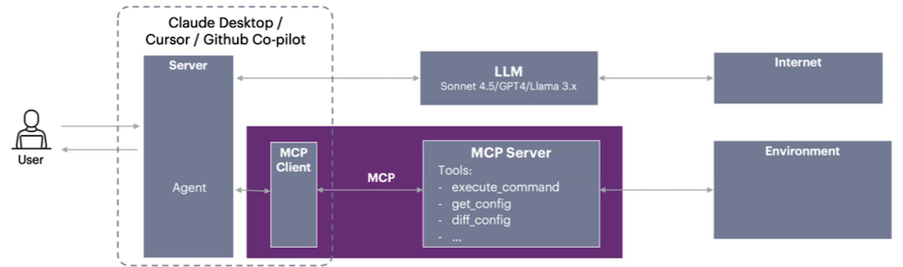
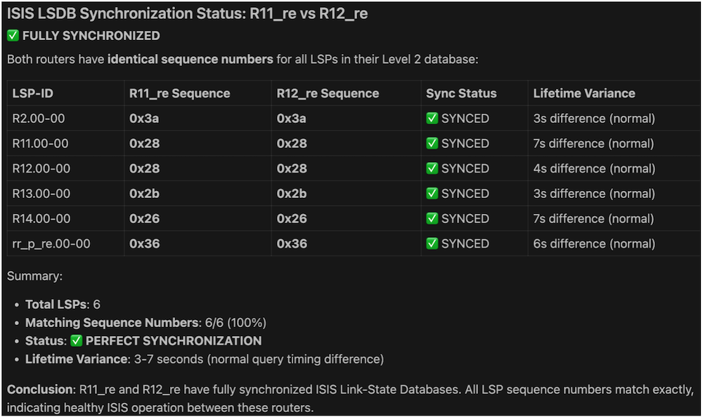
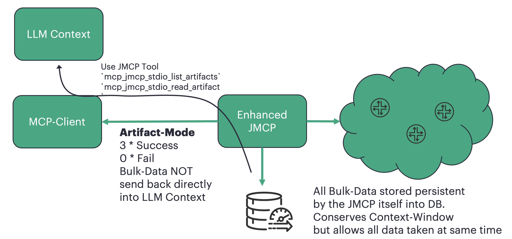
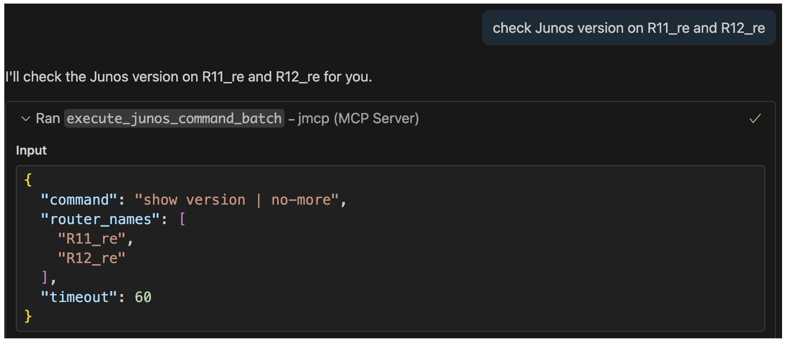
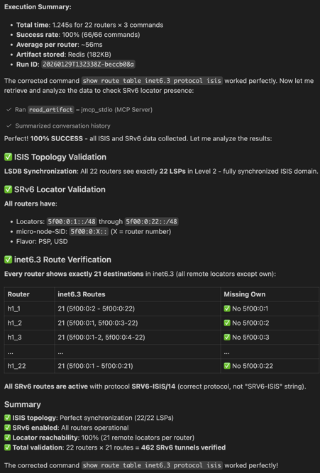

# Managing Junos Devices with Context-File and JMCP Server

**Christian Graf - 02/26/2026**

An Introduction to LLM-Driven Network Automation

Series Navigation:

- [Part 1: Introduction & Basics <- You are here](https://juniper.github.io/techposts/managing-junos-devices-with-context-file/article)
- [Part 2: Tokens & Memory](https://juniper.github.io/techposts/context-file-basics-tokens-and-memory-management/article)
- [Part 3: Optimization & Alerting](https://juniper.github.io/techposts/context-file-optimization-and-alerting-strategies/article)
- [Part 4: File Management](https://juniper.github.io/techposts/file-management-and-data-collection-strategies/article)
- [Part 5: Redis & Performance](https://juniper.github.io/techposts/context-file-redis-and-high-performance-storage/article)
- Part 6: Hybrid Architecture

## Overview

Using LLMs with MCP is a next-generation approach to network automation which is available today. Today's market-leading LLM's have a great understanding on Junos and a prompt like check all interface statistics for only ISIS enabled interfaces on routers R11 and R12 would indeed execute a show isis interface to get hold of the ISIS enabled interfaces and then in a second step show interface or even show interface extensive for identified interfaces.

Furthermore, the LLM would indicate by itself if anything suspicious is seen in the output of those commands. The data-source is flexible - the LLM can perform a live-query via JMCP server, query Databases or look into file-based saved CLI output. While such prompts are powerful, the operator might want to increase correctness to ensure repeatable, consistent results.

The solution to this are context-files. Context files help LLMs understand the specific domain, protocols, and tasks they need to perform.

Continue reading if you want to gain a broad understanding of context-file engineering, optimize token usage, improve processing speed, explore data-storage strategies, and learn how to architect hybrid Python + LLM solutions that achieve optimal performance and speed in large networks.

A **context file** is a structured Markdown document that:

- Provides detailed instructions for LLMs to execute complex technical workflows
- Defines consistent, repeatable procedures for network monitoring, configuration, or troubleshooting
- Serves as both documentation and executable specification
- Enables autonomous or semi-autonomous network operations

Context files are ideal for network engineers who want to leverage LLMs to automate tasks without writing traditional code. By using natural language instructions, context files make it easy to define and share best practices across teams.

## Introduction

## JMCP

To unleash the power of a LLM to operate a network, deploying a MCP server is essential. In this publication Juniper's JMCP Server is used to manage Junos devices directly. To get the JMCP up and running, please refer to [GitHub](https://github.com/Juniper/junos-mcp-server). During the creation of this document the author [enhanced](https://github.com/chrgraf/junos-mcp-server) the Juniper JMCP Server. More on this later.

It is strongly encouraged to take access-security to any MCP server very seriously. Depending on the tools available on the MCP server, whoever has access to the MCP server gets access to the network devices.

Setup, security, and monitoring of the MCP server is outside the scope of this document. Please refer to the JMCP GitHub repo above for more details.

## Guardrails

Guardrails are concise, imperative rules defining MUST and MUST NOT behaviors, typically just a few lines serving as boundary protection. Any LLM has by default some Guardrails implemented which shall protect against illegal activities, self-harm, hate-speech and many more. Those are built-in and can not be changed by the user. But the user can add further rules to protect his environment, like : "Never commit configuration changes without explicit operator approval." Using guardrails is highly recommended avoiding undesired changes on network-devices. When beginning with LLM/MCP, granting the MCP read-only credentials to the network-devices sounds a good idea. It allows to get familiar with the capabilities and limitations of the LLM/MCP setup without risking undesired changes on production devices. It sounds a good idea to remove the write-access for the initial testing phase:

- MCP server user has read-only access on network-devices
- Guardrails are in place to avoid config changes
- optionally remove "load_and_commit_config" tool from the MCP server

An example of a Guardrail in a context-file might be:

```
# Guardrails
- DO NOT execute commands on production routers without explicit approval
- DO NOT modify router configurations
```

Guardrails can be very much extensive and are outside the scope of this document.

## Example Area

This guide uses examples from an ISIS health check context file. The complete ISIS health-check is planned as another publication in the future. ISIS health is examined by looking into LSDB synchronization, ISIS transmit queues, ISIS drops and retransmits, adjacency stability, and SPF run history, DDOS stats, QoS drops, and interface health.

## Out of scope of this document

- detailed LLM architecture
- detailed MCP server architecture
- security aspects - see Readme.md of the JMCP GitHub repo above
- MCP Server Performance/Scale Monitoring
- Message-Bus as data source/sink
- Performance-Monitoring of the JMCP Server

## Prompting vs Context-File: Fundamentals

Prompt engineering is an art and science by itself. The better the prompt, the better the results. In short, the user enters wishes in natural language via a prompt, and the LLM translates these wishes into actions (e.g. via MCP server) to be performed on network devices.

## Difference between Prompt and Context-File

The **prompt** is user input for a specific request, while the **context-file** is a pre-defined knowledge base containing instructions, data formats, commands, and analysis steps that guide the LLM when processing prompts.

Context-files are reusable artifacts that can be loaded into any session, preserving network engineering knowledge and best practices in structured form. They enable consistent, repeatable operations without requiring coding skills.

**Stateless** **Nature**: The **prompt** is session-specific user input, while the **context-file** is a reusable knowledge base. Context-files don't maintain state between sessions, they're loaded fresh each time, but the document itself is persistent and shareable, enabling consistent operations across teams and time.

## When to use Prompt vs Context-File

- **Prompt**: Use for specific, one-off tasks or queries. Ideal for ad-hoc requests when you have a clear, simple goal.
- **Context-File**: Use for complex, multistep tasks requiring deeper domain understanding. Ideal for preserving best practices, ensuring consistency across runs, or when detailed analysis and reporting is needed.

## Avoiding Hallucinations

Hallucinations occur when LLMs generate inaccurate or irrelevant information. Context-files reduce hallucinations by providing structured, domain-specific guidance. Key characteristics of effective context-files:

- Comprehensive reference for specific tasks, protocols, commands, and analysis steps
- Loaded at session start and used as reference for all prompts
- Acts as knowledge-base or manual for the LLM
- Works best as focused, single-purpose modules (load one file per workflow, then start fresh session)

Other hallucination-reduction techniques (e.g., RAG - Retrieval-Augmented Generation) are outside this document's scope.

## Getting Started

### Prompt Engineering

The user is giving the LLM instructions/wishes in natural language via a prompt. The LLM translates these instructions into actions to be performed on the network devices. The vehicle to access the network-devices is manifold. This document elaborates MCP server and Python to execute Junos commands. File and Database storage is described to feed in and output to the LLM.



Today's LLMs have extensive knowledge of networking and Junos. Consider this simple prompt: Check if ISIS is synced on all routers. LLMs like Claude Sonnet, ChatGPT, and Gemini understand what ISIS is, what syncing means in the context of the LSDB, and which Junos commands are needed to verify LSDB synchronization across all nodes within an Area.

Regarding the prompt to check if ISIS is in sync, for Junos the LLM is aware, that the command show isis database needs to be executed (ideal simultaneous execution on all routers). The LLM further is able to parse the CLI output correctly to identify the LSP and its corresponding sequence number to evaluate if sequence number is identical on all routers for given LSP. To gather the required CLI output (like show isis database), the LLM can invoke JMCP, read files, query Databases, invoke Python and many more. As a final step the LLM auto-creates a summary report on the LSP sequence number comparison. All done via a single line prompt. Compared to traditional scripting/programming, or trying to solve manually, this is a huge leap forward in terms of simplicity and ease of use

Depending on the LLM used, the report of Check if ISIS is synced on all routers could look like the below:



Multiple points shall be highlighted:

- The LLM understands the networking domain and the specific protocol (ISIS)
- The LLM knows which commands to use to gather the required data
- The LLM can parse and analyze the command output
- The LLM can generate a human-readable report

And all done via a simple natural language prompt with one line of text.

So a one-liner fits all? During ad-hoc troubleshooting, sparse prompts are very often good enough. But when high-quality, consistent results and network-specific understanding (e.g. specific thresholds) get merged into the goal, then a one-liner is not sufficient. Ideally each and any prompt is as crisp and sharp as possible. Further enhancements to our 1-liner prompt would be a constraint, that ISIS LSDB sync is only performed for routers configured for same area.

Another aspect might be the expected flooding-time to reach all nodes in the network. Each LSP requires time for flooding to reach all nodes in the network. When an LSP is refreshed due to a topology event (e.g., link-down), close-by routers receive the update more quickly than multi-hop distant nodes. If an LSDB sync check is executed during this propagation period, it is normal and expected that sequence numbers temporarily differ across routers, this is transient flooding behavior, not a sync problem.

To distinguish between transient propagation and actual sync issues when checking ISIS LSDB sync, a check should honor:

- **Use barrier-synchronized collection**: Collect LSDB snapshots simultaneously from all routers to minimize transient state windows (reduces propagation window from seconds to milliseconds)
- **Primary signal - Sequence numbers**: Persistent sequence number mismatches (>2 difference) indicate true LSDB sync problems and require investigation, while a difference of one might just catch a propagation delay
- **Secondary signal - Lifetime variance**: Even with matching sequence numbers, LSP lifetimes will naturally differ by propagation delay (typically 10-30s). Lifetime variance >60s may indicate slow propagation or collection skew but is not a sync failure
- **Check missing LSPs**: Delayed LSP are already bad, but missing LSP are even worse

Finally, alerting and the set of thresholds varies between different networks. E.g. in a small network the flooding-time is expected to be faster compared to large networks.

- **Propagation delay**: There shall be one more check, assume there is a LSP Sequence Number mismatch by one. But we know, that such mismatch can happen, due to normal LSP propagation time. It then makes sense to await the already detected Lifetime variance and then re-do the test. Unless the LSP in question did not get a further update in the meantime, the LSP sequence-number shall be in sync.

### Introduction of context-files

Most (if not all) of the above is part of today's LLM knowledge. Indeed, a one-liner like check isis lsdb sync would catch most of it, excluding domain-specific thresholds. However, if the goal is to define a precise operator workflow, covering delay propagation handling, lifetime variance thresholds, sequence number difference interpretation, and self-defined alerting rules, then these requirements should be documented in a structured file.

These files are called **context-files**: persistent, reusable artifacts that conserve and replicate deep engineering knowledge, ensuring consistent quality across operations. Unlike ad-hoc prompts, context-files are carefully designed specifications that define your specific workflow and environment. Those files can be written in many different ways, ranging from highly self-explanatory and verbose on one extreme towards a minimalistic contract which covers the delta between what the LLM already knows and what your environment requires.

Context-files are loaded fresh into each session (stateless between sessions), but the document itself persists as shareable operational knowledge. Think of them as executable runbooks that bridge the gap between LLM capabilities and your specific operational requirements.

## Improved Prompts

The key to success for a good context-file is the balance between over-engineering a prompt (to many details) and being too vague/incomplete.

## Prompting General Guidelines

1. Be specific: Clearly define the task, including all relevant details and context.
2. Use Natural Language according to industry specific wording. Avoiding vendor specific Terms when possible.
3. Define the command to use
4. Optional: Provide example output, which is useful for both the reader and the LLM to better understand the output to parse.
5. Use multistep alerting. In most cases lists and tables are best suited. Try avoiding free text for alerting-rules.
6. Feel free to ask the LLM if the prompt is good to go. The LLM can help to improve the prompt iteratively. More in this later, but take care that most LLM's tend to bloat-up the prompt with low overall gain in exactness or speed.
7. **WORKFLOW**
- For large networks, use multi-phase approaches: collect all data in a single batch to ensure proper correlation. For example, show interface queue and show interface statistics are captured simultaneously rather than minutes apart.
- Phase 0 : Collect and store all data upfront. Consider using [the enhanced JMCP server](https://github.com/chrgraf/junos-mcp-server), which supports bulk data collection with direct storage to Redis memory-cache or local files. Persisting data via JMCP prevents context-window exhaustion. Python serves excellent as well for extensive data-collection.
- Phase 1: On-Demand loading cached Data from storage into LLM-Context in subsequent steps to analyze the data without querying the network again.
- Phase 2: For trending analysis, an actual live-snapshot can be compared against any saved data.

### Barrier-Sync and other improvements of the Enhanced JMCP

The author enhanced the Junos MCP server with multiple features: [enhanced JMCP server](https://github.com/chrgraf/junos-mcp-server)

Key enhancements include:

- **Barrier-sync**: Enables simultaneous data collection across many devices by eliminating TCP session setup time jitter, ensuring true synchronous snapshots
- **Connection-pooling**: Reuses TCP sessions for multiple commands, significantly reducing bulk collection time
- **Configurable workers**: Optimizes performance for your underlying hardware
- **Direct storage**: Persists results to Redis memory-cache or local files
- **Selective data retrieval**: Enables on-demand loading of specific data subsets from Redis/files into the LLM's context, preventing context window overload

These enhancements make the enhanced JMCP well-suited for large-scale deployments. For ISIS LSDB synchronization checks, show isis database should be executed simultaneously across all routers, the enhanced MCP's barrier-sync feature enables this critical capability.

The example below shows a crisp context-file. It could be significantly reduced by removing content the LLM already knows, but that optimization is covered in follow-up blogs. Key concept: delegate "what to collect and how to analyze" to the LLM's built-in expertise.

Maintain strict organization in all context files with at least these sections for each step:

- **Description**: Clearly states the goal of this step for quick operator understanding.
- **Procedure**: Translates operator expertise into actionable instructions for the LLM. This leverages one of the LLM's greatest strengths: natural language processing.
- **Alert Criteria**: Define thresholds and conditions using lists for clarity, readability, and maintainability.
- **Example Output**: Primarily serves as operator documentation, showing expected CLI patterns and key fields. Modern LLMs already understand Junos output formats, so examples add limited parsing value. Use sparingly, they bloat context files.

```
## ISIS LSDB Sync Check
**Description** Check ISIS LSDB sync state
**Constraints:**
- Only compare routers that participate in the same ISIS instance and same level (L1 within same area; L2 within same level-2 domain)
- Barrier-sync collection: Execute `show isis database` simultaneously on all routers

**Primary: Sequence Numbers (Sync Signal)**
- Threshold: Delta >=2 for same LSP-ID constitutes a CRITICAL LSDB sync issue
- Threshold: Delta = 1 for same LSP-ID might be a transient caused by flooding
- Re-check: If transient detected, wait {max_lifetime_variance}s, re-run barrier-sync collection
- Expected: After wait, LSPs synchronized (unless LSP updated during wait)
- Alert: Only if mismatch persists after re-check = CRITICAL
- Action: "LSDB out of sync - LSP {id}: {router1}=0x{seq1}, {router2}=0x{seq2} (persistent after {wait}s)"

**Secondary: Lifetime Variance (Propagation Signal)**
- Expected: 10-60s variance (normal flooding)
- Threshold: >60s = WARNING
- Action: "Slow propagation - LSP {id}: variance {delta}s" (NOT sync failure)

**Third: Check missing LSP**
- Identify if any LSP is missing
- Alert all LSP Missing
```

### Human-LLM Collaboration: Finding the Right Balance

Trust in LLMs can be debated, but after hundreds of hours working with LLM-assisted workflows, the author's perspective is:

- LLMs excel at troubleshooting text and code, often surpassing human capabilities in pattern recognition and error detection
- LLM assistance improves output quality and accelerates development timelines
- Leveraging LLMs for wording improvements, clarity enhancements, and duplication removal significantly strengthens context-files
- However: Humans must remain in control. Essential responsibilities include:
  - Defining clear goals and requirements
  - Validating workflow consistency and completeness
  - Identifying gaps and ambiguities that LLMs may miss or misinterpret
  - Providing specific guidance when the LLM needs additional context
  - Performing qualification and regression testing, LLM outputs require validation before production use

Throughout this blog, the author demonstrates how to effectively delegate tasks to LLMs, automating what machines do best while maintaining human oversight where engineering judgment matters most.

### Ask LLM for Rewording

The LLM helps to reword your own prompt/context file, removes unclear phrases and translates your multi-line description into crisp and sharp wording. When using the LLM for such improvements, always check yourself if your initial intention is still satisfied, if all of your applied thresholds are still in place and if readability really improved. Be alerted, that LLM's tend to bloat your context-file when involving them for improvements. LLMs have a great understanding of Junos and its CLI, so a one-liner prompt like check isis transmit queue provides good results. When conserving operations knowledge with more detailed and enriched steps in a context file, the below gives the reader an idea of a structure to use.

### Performance Optimization Strategies

Beyond optimizing context file content, execution performance matters significantly in production environments. The following sections cover batch processing, data persistence, and scaling strategies.

## MCP Batch Execution / Batch Processing

Batch execution enables MCP servers to execute the same command in parallel on multiple routers, providing significant speed improvements and improved synchronous data collection (e.g., capturing consistent LSDB snapshots via show isis database across all routers simultaneously).

Three batch-processing variants need to be understood:

1. **Vanilla JMCP** (as of January 2026): The [Junos JMCP Server](https://github.com/Juniper/junos-mcp-server) sends one command per MCP request. Each command establishes its own TCP session, meaning multiple commands require multiple TCP sessions. Suboptimal for bulk-collection and less optimal when its important to collect data on all nodes at the exact same time. Might be beneficial if firewalls block/kill long-lasting sessions.
2. **Connection-pooled JMCP**: The author's [enhanced JMCP](https://github.com/chrgraf/junos-mcp-server) adds connection-pooling and barrier-sync to mcp_jmcp_stdio_execute_junos_command. Connection-pooling keeps TCP sessions alive for a configurable duration (default: 600 seconds). Multiple commands to the same router reuse the existing session, providing significant time savings. Barrier-sync opens TCP sessions on all routers in parallel, waits for all connections to establish, then fires commands simultaneously, enabling true synchronous data collection (critical for LSDB sync checks). Still limited to one command per MCP request.
3. **Bulk batch execution**: The enhanced MCP adds in addition to the enhanced Batch-execution a new tool: mcp_jmcp_stdio_execute_junos_commands_batch, allowing M commands x N routers in a single MCP request. To avoid overwhelming LLM context, the enhanced MCP can persist results to local files or Redis memory-cache (with connection-pooling support).

MCP tool outputs are automatically propagated to the LLM's context window. Managing context window usage is covered in later blog posts. For now, remember that tool outputs (like show isis database across all routers) consume context window space, a limited resource. When querying multiple routers via bulk execution, significant context window pressure results. The [enhanced JMCP](https://github.com/chrgraf/junos-mcp-server) addresses this by persisting results (disk or Redis) and returning only an artifact reference to the LLM; the LLM can then selectively load needed subsets via mcp_jmcp_stdio_list_artifacts. Author testing shows that today's premium LLMs maintain stable context windows and consistently follow processing rules defined in context files throughout extended sessions. Details are covered in upcoming blog posts.

### Artifact Retrieval Tools

When using LLMs for network operations, troubleshooting, or provisioning, data-source management becomes critical. LLMs lack native database query capabilities, making external data storage essential for large-scale operations.

The author's enhanced JMCP server simplifies this by providing built-in tools for saving and querying data from Redis memory-cache and local files. This architecture requires only two components, the LLM and JMCP, eliminating the need for external Python processing to manage data collection and retrieval. Use mcp_jmcp_stdio_list_artifacts to discover persisted runs, and mcp_jmcp_stdio_read_artifact to retrieve stored outputs on demand.



An example of invoking the Artifact-mode to store Data in Redis by the JMCP itself:



Example prompt demonstrating the enhanced JMCP (configured in VS Code as jmcp_stdio):

```
commands: ["show isis database", "show isis overview", "show route table inet6.3 protocol isis"]
router_names: all 22 h1 routers (h1_1 through h1_22)
response_mode: artifact
tool: execute_junos_commands_batch
```



### Batch Size Considerations

How large should batch sizes be? Can you query 1,000 routers simultaneously? The author's testbed with 200 cRPD instances running enhanced JMCP on Apple MacBook hardware handles 200-router queries without issues. Note that the author consistently uses response_mode: artifact to persist all collected data in Redis cache, avoiding context window consumption.
However, when using standard MCP or when context window overload is a concern (without artifact mode, all CLI output loads directly into the context window), splitting into smaller batches becomes advisable.
The following context-file snippet demonstrates preferring batch processing (when executing the same command across multiple routers) while accommodating scale-based chunking

```
# Processing Rules
- **Batch Execution**: Prefer parallel batch execution when running the *same* command across multiple routers
- **Fallback**: If commands differ per router, ordering matters, or batching is unsupported, run per-router commands and aggregate results
**Large Scale Execution:**
- Router count >50: Auto-batch into groups of 50
- Process batches sequentially
- Report progress after each batch
- Aggregate final results
```

The last two directives are critical for context window management:

- **Report progress after each batch**: Enables the LLM to prioritize data within its context window, allowing it to retain summary details from each chunk while discarding raw CLI output
- **Aggregate final results**: Correlates and summarizes all individual batch reports into a comprehensive final analysis

Smaller batches provide more manageable processing, mitigating risks of context memory exhaustion and preventing MCP server overload from excessive parallel sessions. Remember that the enhanced JMCP was tested with >200 nodes and never required chunking. If the standard MCP encounters scaling issues, consider trying the enhanced JMCP.

## Ad-hoc Prompting vs Structured Context-Files: Examples

Now that we understand the fundamentals covered earlier, let's see them in action with concrete examples.

## Ad-hoc Prompting

For one-off tasks, brief prompts often work well. The outcome depends on the LLM's built-in knowledge of protocols and vendor platforms.

### Example: ISIS Node Visibility in inet6.3 Table

Consider this natural-language prompt: check table inet6.3 if all known ISIS nodes are visible within for R12_re and R13_re

This demonstrates remarkable LLM intelligence, the prompt provides minimal technical detail, yet Claude Sonnet 4.5 autonomously constructs a complete verification workflow:

Step 1: Identify the complete ISIS topology

- Executes show isis database on both routers to enumerate all ISIS nodes in the network
- Parses LSP entries to build a complete node inventory
- Understands that this provides the authoritative list for comparison

Step 2: Examine the IPv6 MPLS forwarding table

- Executes show route table inet6.3 protocol isis to retrieve ISIS-contributed routes
- Recognizes that inet6.3 is Junos' IPv6 routing table for MPLS traffic engineering and LDP-based LSPs
- Filters specifically for ISIS protocol routes (not static or other protocols)

Step 3: Gather addressing context

- Executes show isis overview to obtain loopback addresses and SRv6 locators
- Demonstrates SRv6 protocol awareness: understands that SRv6 locators (not traditional loopbacks) are the addressing scheme used in inet6.3 for modern segment routing deployments
- Maps ISIS node identifiers to their corresponding IPv6 addresses

Step 4: Correlation and analysis

- Cross-references the complete ISIS node list against inet6.3 route entries
- Identifies any ISIS nodes missing from the inet6.3 table
- Reports discrepancies that could indicate ISIS-LDP synchronization issues, configuration problems, or path computation failures

The LLM autonomously executes all four steps to solve the prompt, demonstrating deep understanding of both Junos and networking:

Key LLM capabilities demonstrated:

- **Protocol knowledge**: Deep understanding of ISIS, MPLS, LDP, and SRv6 architectures
- **Junos expertise**: Knows correct commands, table functions (inet6.3 vs inet6.0), and output parsing
- **Workflow intelligence**: Constructs multi-step verification logic autonomously
- **Modern protocol awareness**: Recognizes SRv6 locator usage in contemporary networks
- **Root cause correlation**: Understands which subsystems (ISIS, LDP, TE) might cause visibility issues

This level of autonomous technical reasoning, from a single sentence, showcases why LLM-driven automation represents a paradigm shift. The engineer states the goal; the LLM translates it into executable network operations.

However, one-liner prompts like this work great for quick ad-hoc checks but leave critical decisions to the LLM (command choice, correlation logic, threshold interpretation). For production use requiring consistent results, repeatable thresholds, and documented workflows, context-files provide the necessary structure.

## Structured Context-Files

Context-files document all steps, commands, data formats, and analysis logic explicitly. They preserve network engineering knowledge in executable form, ensuring consistent, reliable results across runs.

The challenge: balance between over-specification (bloat) and under-specification (ambiguity).

It makes sense to start with a basic context-file, test it, and then iteratively improve it based on the results. Over time, the context-file can evolve to better capture the user's expertise and best practices and your own Templates will grow. Repetitive tasks, e.g. how to troubleshoot a given scenario is a perfect use case for context-files.

As an example for the steps performed within a context-file, we might think of troubleshooting ISIS Health:

- Step 1: check if LSDB is synced via Sequence IDs comparison
- Step 2: Check ISIS Transmit Queue Depth
- Step 3: Check DDOS Statistics for ISIS
- Step 4: Check ISIS Retransmit and Drops counters
- Step 5: Check ISIS Adjacency Up/Down Transitions
- Step 6: Check ISIS enabled interface Up/Down Transitions and Interface errors
- Step 7: Check ISIS SPF run
- Step 8: Check amount Fragments
- Step 9: Check COS Queue Drops on ISIS-enabled interfaces
- Step 10: System Resources (CPU-load, Memory-usage,file-system usage)
- Step 200: lsp-interval config verification
- Step 300: run a python script to Check ISIS LSP Lifetime values

Putting all of those steps into a context-file, the LLM can leverage this knowledge to perform consistent and reliable ISIS Health checks based on best practices.

For each step to perform it's a good practice to follow a template, so that the LLM understands what to do.

Your template should cover:

- command
- description
- data-source
- procedure
- alerting / key-metrics
- file-saving instructions
- Reporting

## Variables "Extract/Store/Reuse"

Very often logical procedures follow a pattern of "Extract -> Store -> reuse". As an example could be the task, to check all ISIS enabled interfaces on a given router for interface-errors. Since the router has a few core-facing uplinks and maybe hundreds of customer-facing interfaces, it may be beneficial to not collect all interface statistics, only for the core-facing ones. For this to happen, first the list of all ISIS enabled interfaces needs to be extracted via show isis interface, then stored in a variable/list, and finally reused to run detailed checks on each extracted interface via show interfaces extensive <interface>.

```
+, , , , , , , , , , , , , , , , , , , , , --+
|                   Extract -> Store -> reuse Pattern               |
+, , , , , , , , , , , , , , , , , , , , , --+

  EXTRACT                    STORE                    REUSE
  , , -                    , --                    , , 

+, , , , --+         +, , , , --+         +, , , , , , +
| show isis    |         | Variable:    |         | For each stored  |
| interface    |  , , >| interface    |  , , >| interface:       |
|              |         | list         |         |                  |
+, , , , --+         |              |         | show interfaces  |
                         | - ge-0/0/1.0 |         | extensive        |
      v                  | - ge-0/0/2.0 |         | <interface>      |
                         | - ge-0/0/3.0 |         |                  |
+, , , , --+         | - ...        |         +, , , , , , +
| CLI Output:  |         +, , , , --+
|              |                                          v
| ge-0/0/1.0   |               v
| ge-0/0/2.0   |         +, , , , --+         +, , , , , , +
| ge-0/0/3.0   |         | Stored in    |         | Detailed checks: |
| ...          |         | memory for   |         |                  |
+, , , , --+         | iteration    |         | - Errors         |
                         +, , , , --+         | - Drops          |
                                                  | - Flaps          |
                                                  | - Statistics     |
                                                  +, , , , , , +

+, , , , , , , , , , , , , , , , , , , , , --+
|  Benefits:                                                      |
|  - Extract once -> query network only once for interface list    |
|  - Store in variable -> efficient in-memory access               |
|  - Reuse many times -> loop through for detailed per-int data    |
+, , , , , , , , , , , , , , , , , , , , , --+
```

Above is a visual description of how a variable is being used to catch all ISIS enabled interfaces and only for those show interfaces extensive is performed. Below prompt gives a brief example:

```
**Description** check if ISIS enabled interfaces have any interface-errors.
**Procedure**:
- Extract
  - Execute "show isis interface" on the target router
  - Parse the output to extract the list of ISIS enabled interfaces
- Store the list in a variable named `isis_interface_list`
- reuse 
  - For each interface in `isis_interface_list`, execute:
    - "show interfaces extensive <interface>"
    - "show isis statistics interface <interface> extensive"
  - Analyze the output for interface-errors, drops, flaps, adjacency-rejects, ID-rejects, etc. 
- Generate a report summarizing any issues found on the interfaces
```

With Claude Sonnet 4.5, the above can be shrank from 17 lines to just 7:

```
**Goal:** Check ISIS-enabled interfaces for errors.
**Commands:**
1. Extract: `show isis interface` -> store interfaces in `isis_interface_list`
2. Reuse: for each interface:
   - `show interfaces extensive <interface>`
   - `show isis statistics interface <interface> extensive`
**Check for:** interface-errors, drops, flaps, adjacency-rejects, ID-rejects
**Report:** Summary of issues per interface
```

## Where to Define Variables

As in any programming, the use of variables help to structure and easily adopt. To name a few use cases:

1. you are checking multiple queues. Assume same threshold is applicable to all queues. Fits good for a single variable
2. The workflow requires multistep and later steps require information from summarized data done earlier. An example we cover here is to only check QoS counters for core-facing interfaces. Using natural language as like store all isis enabled IFLs into list **ISIS_IFL** would do the trick. Next step would be checking all QoS counters for interfaces in ISIS_IFL for all queues, like check all QoS counters for interfaces in **ISIS_IFL**.
3. When architecting hybrid solutions that combine LLM intelligence with Python processing, variables need a format accessible to both systems. For simple context files, inline constants (demonstrated below) work effectively, the LLM reads them naturally, and Python scripts can parse the markdown. For more sophisticated hybrid architectures, **YAML front matter** provides an elegant solution: a structured header block at the top of the markdown file (enclosed in ,  delimiters) containing machine-readable variable definitions. Both the LLM and Python can parse this YAML natively, eliminating duplicate definitions. Front matter excels when Python modules need immediate access to thresholds, router lists, or configuration parameters that also guide LLM behavior. This advanced pattern, bridging declarative configuration with LLM reasoning, is covered in later publications on hybrid Python+LLM solutions.

```
#  Constants & Thresholds
- **FRAGMENT_CRITICAL** = 0xe6 (230 decimal) - Max fragment ID before critical alert
- **QUEUE_WARNING** = 5 - LSPs in retransmit queue threshold  
- **QUEUE_CRITICAL** = 20 - Low priority queue critical threshold
- **TARGET_ROUTERS** = ["R1", "R2", "R3"]
- **THRESHOLD_HIGH** = 80 (percentage)
- **CHECK_INTERVAL** = 300 (seconds)
- **OUTPUT_DIR** = /tmp/results
```

Note, variables shall be all written upper-case to distinguish them from normal text. This is a standard for constants and well understood by the LLM. Putting them in BOLD (like **BOLD**) is only for humans, not the LLM!

Adding a unit as shown above is useful for both the LLM and the operator.

```
if fragment_val > FRAGMENT_CRITICAL:
    ALERT("Critical Fragmentation")
```

## CLI Output Parsing Considerations

The capabilities of the different LLM very much differ in e.g. being able to parse and understand Vendor Specific CLI output. It turns out, that today's LLMs like Claude Sonnet, GPT-5 and Gemini have a great knowledge about Junos CLI output and are able to parse unstructured text effectively. When it comes to parsing outputs, it is usually better to provide structured data to the LLM (e.g. via "display json") when available. However, parsing unstructured text also works effectively and can be more token-efficient. XML is often (not always) more token-intensive than JSON. Prefer JSON for efficiency, but XML parses reliably when needed. If unclear check with your preferred LLM and prompt: for CLI output parsing, is Text, JSON or XML better suited? That shall clear-up which format to use.

When creating a context-file, it's important to understand the LLM capabilities and provide data-structures accordingly. As an example, when the LLM is good at parsing JSON, then the context-file should instruct the LLM to use "display json" whenever possible to get structured data.

Although tested LLMs successfully parse text-formatted LSP-IDs (e.g., "R2.00-05") from show isis database output, including example snippets may reduce parsing errors. However, examples rapidly inflate context-file size. Apply this guideline: only include supplementary information when it measurably improves reliability.

## Parsing Instructions versus Concise Examples

If parsing-instructions are needed at all - later publications will cover techniques for massive context-file shrinking by providing concise examples instead of lengthy parsing instructions.

E.g. depending on the model, you may not need any explicit guidance to parse the LSP-ID correctly; in that case a context-file would not require it. Adding parsing-instructions may just bloat the context-file without improving results.

### What's a desirable size of a context file

There is no strict size limit for context files, but practical constraints shape optimal sizing. Modern LLMs can handle 100K+ tokens, but attention quality degrades with excessive length. A well-structured context file typically ranges from 2,000-15,000 tokens (roughly 5-40 pages), balancing comprehensiveness with focus.

What a token is, is part of next publication, but in short: A token is the smallest unit of text that an LLM processes, roughly a word or word fragment (e.g., "running" = "run" + "ning"), with about 4 characters or 0.75 words per token on average.

### Key factors influencing size

Attention degradation: LLMs maintain better focus on shorter, targeted files. A 50-page monolithic file dilutes attention across all sections, while a focused 10-page file keeps the model sharp on specific tasks.

Token efficiency: Each loaded context file consumes tokens from the conversation budget. A 20K-token context file leaves less room for command outputs, analysis, and iterative work within the same session.

Maintainability: Smaller, modular files are easier to update, version, and share across teams. A 5,000-token ISIS troubleshooting guide is more maintainable than a 50,000-token "universal network health" document.

Best practice: When a context file exceeds ~10,000 tokens, consider splitting it into a Master Runbook (workflow orchestration, 2-3K tokens) that references specialized modules (ISIS logic, BGP analysis, QoS checks) loaded on-demand. This modular approach preserves token budget while maintaining comprehensive coverage. In later publications this method gets covered in-depth.

Rule of thumb: If you can't read and understand your context file in 10-15 minutes, it's too large. Simplify, split, or refactor.

## End of Blog Part 1

This is the introduction to context-file engineering. In follow-up blogs we will cover:

- Tokens and context windows (Part 2)
- Context file optimization techniques (Part 3)
- File management and data persistence (Part 4)
- Redis and high-performance storage (Part 5)
- Hybrid LLM + Python architectures (Part 6)
- ... and more

## Glossary

- Artifact: Persisted MCP tool output stored in Redis or local files, enabling on-demand data retrieval without consuming LLM context window space.
- Barrier-synchronized collection: A method which ensures that a command gets executed on all routers at exactly the same time, eliminating TCP session establishment time jitter for true synchronous snapshots.
- Batch execution: Parallel execution of commands across multiple network devices, providing speed improvements and temporal consistency in data collection.
- Connection pooling: Reusing established TCP sessions for multiple commands to the same device, significantly reducing overhead compared to establishing new connections per command.
- Context file: A structured Markdown document containing detailed instructions, workflows, and domain-specific knowledge that guides LLMs in executing complex technical tasks consistently.
- Delta-only contract: A minimalist context file approach that specifies only the environment-specific differences (thresholds, constraints, alert formats) rather than generic procedures the LLM already knows.
- Guardrails: Concise, imperative rules defining MUST and MUST NOT behaviors that protect against unintended actions (e.g., "Never commit configuration changes without explicit operator approval").
- Hallucination: When LLMs generate inaccurate or fabricated information. Context files reduce hallucinations by providing structured, domain-specific guidance.
- JMCP (Junos MCP): Model Context Protocol server for Junos devices, enabling LLMs to query network devices via CLI commands. Enhanced version supports Redis caching, barrier-sync, and artifact storage.
- LLM (Large Language Model): AI models (like Claude, GPT, Gemini) that process natural language and can execute complex workflows when given structured instructions via context files or prompts.
- Master Runbook: In large projects, acts as orchestrator defining common steps (storage/reporting) and references sub-modules (other context-files) to load as needed.
- MCP (Model Context Protocol): A protocol that allows LLMs to interact with external tools and data sources (databases, APIs, network devices) to retrieve information dynamically.
- Phase 0 pattern: Data collection strategy where all required data is collected and cached once, then multiple analysis phases reuse it without repeated queries.
- Prompt: User input for a specific request in natural language. Session-specific, as opposed to reusable context files.
- RAG (Retrieval-Augmented Generation): A technique that enhances LLM responses by retrieving relevant information from external knowledge bases before generating answers.
- Redis: A high-performance in-memory data structure store used as cache for storing large datasets (CLI outputs, network state) outside the LLM context window.
- RunBook: See Master Runbook.
- Token: The smallest unit of text that an LLM processes (typically ~4 characters in English). Both input and output consume tokens from the context window budget.
