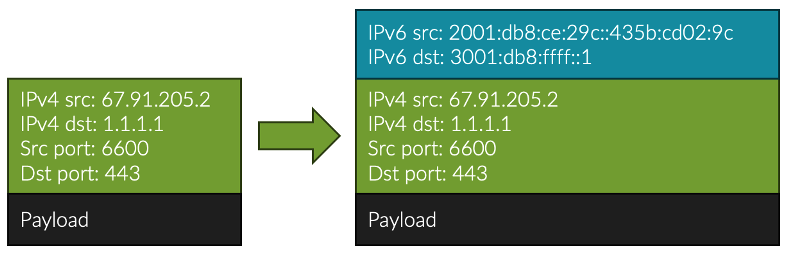
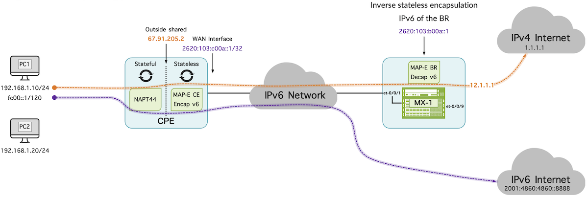
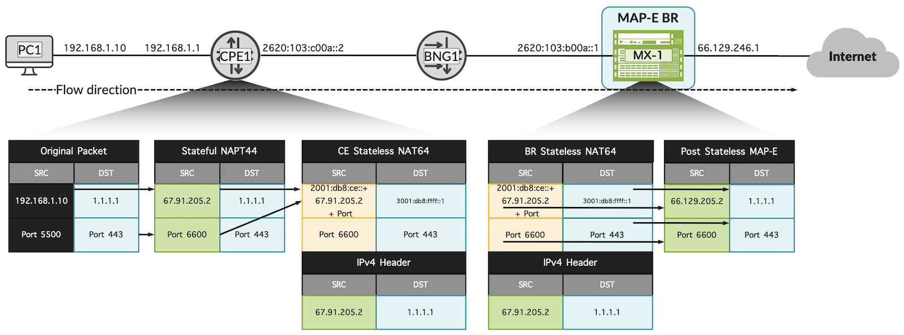
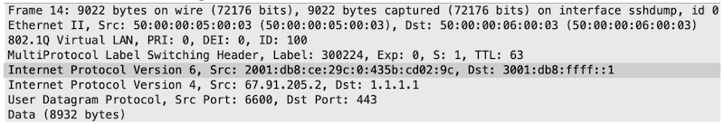
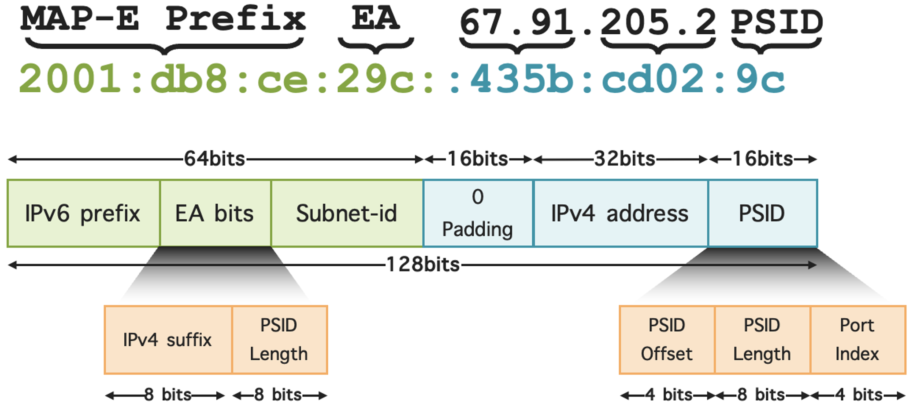

# MAP-E with Junos OS

**Moshiko Nayman - 10/02/2025**

This document provides an overview of MAP-E (Mapping of Address and Port using Encapsulation), a stateless IPv4-over-IPv6 transition technology supported by Junos OS. It explains key terminology, operational components, configuration guidelines, and deployment benefits for service providers.

## Introduction

With the exhaustion of IPv4 addresses, service providers continue to face the challenge of delivering IPv4 connectivity at scale while transitioning to IPv6. Dual-stack deployment has been the traditional approach, but it consumes extra resources and slows down IPv6 adoption. Solutions like Carrier-Grade NAT (CGNAT) provide stopgaps, but they add complexity and cost.

With global IPv6 adoption at ~47% (Google, 2025), coexistence technologies like MAP are still essential.

## Overview

MAP-E (Mapping of Address and Port with Encapsulation) is a stateless IPv4-over-IPv6 transition technology defined in [RFC 7597]. It enables service providers to deliver IPv4 services across an IPv6-only backbone by encapsulating IPv4 packets in IPv6.

Junos OS provides rich support for both MAP-E and MAP-T technologies, combining simplicity of deployment with high performance and massive scale.

MAP-E has been supported since Junos 20.3R1, and MAP-T was added in Junos 23.4R1. Juniper also holds 16 patents in MAP technologies, underscoring its leadership and continued innovation in IPv4-to-IPv6 transition mechanisms.

- **Encapsulation, not translation** -- IPv4 packets are preserved and simply carried over IPv6
- **Stateless operation** -- No per-flow state at the provider (MAP Border Relay), scalability comes from algorithmic mapping
- **Address + Port mapping** -- Each subscriber gets a unique IPv4 prefix or shared address with a defined port set
- **Roles** -- The customer CPE (MAP CE) encapsulates/decapsulates, while the provider Border Relay (MAP BR) anchors traffic to the public IPv4 Internet



## Junos OS supports for MAP-E with the following features and capabilities

- Support full IPv4/IPv6 reassembly and patented partial reassembly of fragmented IPv4
- Support fragmentation of inner IPv4 packet
- It accommodates packets up to a maximum size of 16KB
- Encapsulation adds an extra IPv6 header of 40 bytes
- Support for both TCP, UDP and ICMP
- Support packet fragmentation

## High level topology



## Configure the MAP-E softwire concentrator and associated parameters:

Specify a name for MAP-E concentrator:

```
set services softwire softwire-concentrator map-e MAPE-DOMAIN1
```

MAP-E stateless Encapsulation: Encapsulate the NAPT44 source IPv4 address (e.g., 67.91.205.2) and source port to an IPv6 address based on the MAP-E IPv6 prefix.

```
set services softwire softwire-concentrator map-e MAPE-DOMAIN1 mape-prefix 2001:db8:ce:ab00::/56
```

Encapsulate using the corresponding MAP-E rule ipv4-prefix.

```
set services softwire softwire-concentrator map-e MAPE-DOMAIN1 ipv4-prefix 67.91.205.0/24
```

Destination of the MAP-E BR.

```
set services softwire softwire-concentrator map-e MAPE-DOMAIN1 softwire-address 3001:db8:ffff::1
```

## Packet Flow and Translation



To provide visibility into MAP-E packet structure, I captured traffic within the MPLS-IPv6 core to illustrate how the encapsulated frame appears on the wire. The snapshot highlights the protocol overhead introduced by MAP-E and underscores the need to account for additional headers such as VLAN, QinQ, and MPLS when evaluating MTU and performance. These layers must be considered for accurate network planning and effective troubleshooting.



### Step-by-Step Packet Flow

Step 1.  Original IPv4 Packet (Client to CE)

```
    IPv4 Header:
        Source IP: 192.168.1.10
        Destination IP: 1.1.1.1
            Source Port: 5500
            Destination Port: 443
    Payload: ...
```

Step 2. Stateful translation to public IPv4 (NAPT)

```
    IPv4 Header:
        Source IP: 67.91.205.2
        Destination IP: 1.1.1.1
            Source Port: 6600
            Destination Port: 443
    Payload: ...
```

Step 3. Stateless Mapping of IPv4 to IPv6 Packet (CE to IPv6 Network)

```
    IPv6 Header:
        Source IP: 2001:db8:ce:29c::435b:cd02:9c
        Destination IP: 3001:db8:ffff::1
            Source Port: 6600
            Destination Port: 443
    Encapsulated IPv4 Packet:
        IPv4 Header:
            Source IP: 67.91.205.2
            Destination IP: 1.1.1.1
            Source Port: 6600
            Destination Port: 443
        Payload: ...
```

Step 4. Packet in IPv6 Network

```
    IPv6 Header:
        Source IP: 2001:db8:ce:29c::435b:cd02:9c
        Destination IP: 3001:db8:ffff::1
            Source Port: 6600
            Destination Port: 443
    Encapsulated IPv4 Packet:
        IPv4 Header:
            Source IP: 67.91.205.2
            Destination IP: 1.1.1.1
            Source Port: 6600
            Destination Port: 443
        Payload: ...
```

Step 5. Juniper MX Stateless Mapping IPv4 to IPv6 Packet (BR to IPv4 Internet)

```
    IPv4 Header:
        Source IP: 67.129.235.1
        Destination IP: 1.1.1.1
        Source Port: 6600
        Destination Port: 443
    Payload: ...
```

Step 6. Reverse Flow (IPv4 Internet to Client)

```
    IPv4 Header:
        Source IP: 1.1.1.1
        Destination IP: 67.91.205.2
        Source Port: 443
        Destination Port: 6600
    Payload: ...
```

Step 7. Juniper MX Reverse Stateless Mapping IPv6 to IPv4 Packet (BR to IPv6 Network)

``` 
    IPv6 Header:
        Source IP: 2001:db8:0:2::1
        Destination IP: 2001:db8:c00a::67:91:205:1
    MAP-E Information:
        EA-bits: 1.1.1.1
        IPv4 Prefix: 198.51.100.0/24
    Payload: ...
```

Step 8. Packet in the IPv6 Network

``` 
    IPv6 Header:
        Source IP: 3001:db8:ffff::1
        Destination IP: 2001:db8:c00a::67:91:205:1
    MAP-E Information:
        EA-bits: 1.1.1.1
        IPv4 Prefix: 198.51.100.0/24
    Payload: ...
```

Step 9. Reverse Stateless Mapping of IPv6 to IPv4 Packet (CE to NAPT)

```
    IPv4 Header:
        Source IP: 1.1.1.1
        Destination IP: 67.91.205.2
        Source Port: 443
        Destination Port: 6600
    Payload: ...
```

Step 10. Reverse Stateful translation to public IPv4 (CE to Client

```
    IPv4 Header:
        Source IP: 1.1.1.1
        Destination IP: 192.168.1.10
    Payload: ...
```

## MAP-E Terminology

**Border Relay (BR)**: In the context of MAP-E, the BR is a specialized provider edge (PE) device within a MAP domain. It anchors the IPv4 service by decapsulating IPv4-in-IPv6 packets from customer devices and forwarding them to the IPv4 Internet, and vice versa.

**MAP-E Customer Edge (CE)**: A MAP-E-enabled device deployed at the customer edge. The CE encapsulates IPv4 packets into IPv6 for transport across the provider's IPv6-only network and decapsulates them on the return path.

**MAP Domain**: A MAP domain comprises one or more MAP-E CE devices and BR devices operating under the same configuration rules. It defines the IPv6 prefix, IPv4 prefix, and algorithmic mapping functions that govern how IPv4 addresses and port sets are mapped to IPv6 endpoints.

**Port Set ID (PSID)**: A subset of the transport-layer port space assigned to a customer when multiple subscribers share a single IPv4 address. PSID ensures uniqueness of sessions and enables scalable, stateless distribution of ports across CEs.

**Embedded Address (EA) Bits**: Bits within the IPv6 address used to algorithmically encode the IPv4 prefix, IPv4 address, and PSID associated with a subscriber. EA-bits allow the CE and BR to independently calculate the mapping between IPv6 and IPv4 resources without requiring per-subscriber state.



**Softwire**: Tunnel established between two endpoints to transport packets encapsulated in a protocol different from the network it traverses. In MAP-E, softwires are used to facilitate the transport of IPv4 packets over IPv6 networks and vice versa.

**Softwire Initiator (SI)**: Softwire Initiator is deployed at the customer's end of a softwire tunnel. It encapsulates native packets (IPv4 or IPv6) and forwards them through the softwire to a Softwire Concentrator (SC) at the service provider's network.

**Softwire Concentrator (SC)**: Softwire Concentrator is located at the service provider's network and receives encapsulated packets from Softwire Initiators. It decapsulates these packets and forwards them to their respective destinations in the IPv4 or IPv6 network.

**Basic Mapping Rule (BMR)**: The BMR defines how an IPv4 address and its associated port set are algorithmically bound to an IPv6 prefix within a MAP domain. This rule allows both the CE and BR to independently calculate how IPv4 traffic should be encapsulated into IPv6 for transport across the IPv6-only backbone, without requiring per-subscriber state.

**Default Mapping Rule (DMR)**: The DMR specifies the IPv6 prefix used to reach the MAP Border Relay (BR). It ensures that packets with IPv4 destinations not directly covered by other mapping rules are encapsulated with this prefix, so they can be correctly routed across the IPv6 network and decapsulated at the BR.

## Key Components and Operations of Juniper MAP-E

- **IPv6 Prefix**: Common prefix within the MAP domain used to carry IPv4 traffic.
- **Address and Port Mapping**: Each CE receives a unique port range on a shared IPv4 address. IPv4 address and port information are deterministically embedded in the IPv6 address.
- **Embedded Address (EA) Bits**: Encode the subscriber's IPv4 prefix/address and PSID in IPv6. Both CE and BR use EA bits to derive mappings consistently, without maintaining per-subscriber state.
- **Prefix Binding**: Binds IPv4 prefixes, EA bits, and port sets into the IPv6 domain to enable efficient shared IPv4 address use.
- **Stateless Encapsulation**: IPv4 packets are encapsulated in IPv6 headers without per-flow state, ensuring scalability. Juniper MX Trio silicon supports this at line rate.
- **Mapping Rules**:
- **Basic Mapping Rule (BMR)** -- Defines how an IPv4 address and port set are mapped into an IPv6 prefix. Both CE and BR apply this rule to perform encapsulation and decapsulation independently.
- **Forwarding Mapping Rule (FMR)** -- Extends the BMR by specifying how packets are forwarded within the MAP domain so that encapsulated IPv4 packets traverse the IPv6 network correctly.

### CE and BR Operations

**Upstream (Client -> Internet):**

- CE receives an IPv4 packet from the LAN.
- CE encapsulates the IPv4 packet into IPv6 using MAP domain rules (EA bits, PSID).
- BR verifies the packet (anti-spoofing), decapsulates the IPv4 header, and forwards the native IPv4 packet to the Internet.

**Downstream (Internet -> Client):**

- BR receives an IPv4 packet from the public Internet.
- BR encapsulates it into IPv6 according to MAP rules and forwards it toward the CE.
- CE validates the mapping, decapsulates the IPv6 packet, and delivers native IPv4 traffic into the customer LAN.

## Advantages of MAP-E

Preserves original IPv4 headers: No need to analyze, predict, or reconstruct IPv6 headers to identify customers. Filtering and policy enforcement can be done directly using the original IPv4 addresses.

No need to reconstruct or reinterpret headers at the application layer-just decapsulate and forward.

Since the original IPv4 headers are intact, diagnostic tools like Wireshark or tcpdump can inspect packets without needing to reverse any translation.

- Less processing overhead: No need to translate headers-just wrap and unwrap.
- Improved Scaling: Allowing multiple customer edge (CE) devices to share a single public IPv4 address through unique port ranges, MAP-E optimizes address usage and enhances scalability. Its stateless operation reduces complexity and improves efficiency, making it easier to manage and scale networks without the need for additional IP addresses. This approach not only supports the smooth integration of IPv6 capabilities but also ensures that networks can handle increasing numbers of devices and traffic demands effectively.
- Simplified Redundancy: No need to synchronize sessions between redundant BRs, simplifying redundancy. This reduces the complexity and overhead associated with maintaining high availability in the network.
- Reduced Logging: Only configuration changes in the BR need logging, reducing the volume of logging data. This minimizes the storage and management burden associated with large-scale NAT deployments.
- Simpler Communication: Simplifies user-to-user communication by eliminating the need to recirculate traffic between the Packet Forwarding Engine (PFE) and the CPU. This streamlines the communication process, reducing latency and potential points of failure.
- Higher Throughput: Offers higher throughput with less processing required in the BR compared to stateful solutions. The MX Trio silicon's advanced ASICs enable this functionality without CPU involvement, further enhancing performance and efficiency. This results in faster packet processing and lower power consumption, making the solution more economical and environmentally friendly.

In addition, bi-directional communication with MAP-E is more feasible compared to CG-NAT since MAP-E uses a stateless encapsulation mechanism with predefined address and port mappings, it allows for bidirectional communication.

## Configuration

### MAP-E Prerequisite Configuration

Inline-services enable creating service interfaces on specific FPCs and PICs within line cards. Ensure inline-services are enabled on the relevant FPC and PIC, and optionally specify bandwidth (in Junos OS, 20.3R1 ranging from 1g to 400g) for traffic on these interfaces.

Enable inline services, the example will dynamically allocate 9.6Tbps total throughput.

```
set chassis fpc 0 pic 0 inline-services bandwidth 400g
set chassis fpc 0 pic 1 inline-services bandwidth 400g
set chassis fpc 0 pic 2 inline-services bandwidth 400g
set chassis fpc 0 pic 3 inline-services bandwidth 400g
set chassis fpc 0 pic 4 inline-services bandwidth 400g
set chassis fpc 0 pic 5 inline-services bandwidth 400g
set chassis fpc 1 pic 0 inline-services bandwidth 400g
set chassis fpc 1 pic 1 inline-services bandwidth 400g
set chassis fpc 1 pic 2 inline-services bandwidth 400g
set chassis fpc 1 pic 3 inline-services bandwidth 400g
set chassis fpc 1 pic 4 inline-services bandwidth 400g
set chassis fpc 1 pic 5 inline-services bandwidth 400g
```

Below is all the configuration required with minimum interfaces:

```
set chassis fpc 0 pic 0 inline-services bandwidth 400g
set services service-set SSET1 softwire-rules SW-RULE1
set services service-set SSET1 next-hop-service inside-service-interface si-0/0/0.1
set services service-set SSET1 next-hop-service outside-service-interface si-0/0/0.2
set services softwire softwire-concentrator map-e MAPE-DOMAIN1 ipv4-prefix 67.91.205.0/24
set services softwire softwire-concentrator map-e MAPE-DOMAIN1 mape-prefix 2001:db8:ce:ab00::/56
set services softwire softwire-concentrator map-e MAPE-DOMAIN1 ea-bits-len 16
set services softwire softwire-concentrator map-e MAPE-DOMAIN1 psid-offset 6
set services softwire softwire-concentrator map-e MAPE-DOMAIN1 psid-length 8
set services softwire softwire-concentrator map-e MAPE-DOMAIN1 softwire-address 3001:db8:ffff::1 
set services softwire rule SW-RULE1 match-direction input
set services softwire rule SW-RULE1 term t1 then map-e MAPE-DOMAIN1
set interfaces si-0/0/0 unit 1 family inet
set interfaces si-0/0/0 unit 1 family inet6
set interfaces si-0/0/0 unit 1 service-domain inside
set interfaces si-0/0/0 unit 2 family inet
set interfaces si-0/0/0 unit 2 family inet6
set interfaces si-0/0/0 unit 2 service-domain outside
```

And that's it!

### Additional options (Optional)

Beyond the minimum configuration, Junos OS provides several optional MAP-E tuning knobs that can be enabled depending on deployment requirements:

```
set services softwire softwire-concentrator map-e MAPE-DOMAIN1 mtu-v6 9192
set services softwire softwire-concentrator map-e MAPE-DOMAIN1 version-03
set services softwire softwire-concentrator map-e MAPE-DOMAIN1 v4-reassembly
set services softwire softwire-concentrator map-e MAPE-DOMAIN1 v6-reassembly
set services softwire softwire-concentrator map-e MAPE-DOMAIN1 disable-auto-route
set services softwire softwire-concentrator map-e MAPE-DOMAIN1 v4-partial-reassembly
```

### Dynamic Routing (Optional)

The IPv4 prefix route under the softwire concentrator automatically generates static routes in both the control and forwarding planes to the outside-service interface, allowing it to be advertised via a dynamic routing protocol.

The BR address route is automatically created in the forwarding plane as a "long route", an IPv6 prefix longer than /128 that merges the BR softwire address and embeds the IPv4 address inside IPv6. It does not appear in the control plane.

To advertise it externally, a local static route must be configured and then exported via a dynamic routing protocol.

For simplicity, I configure this with reject and no-install, since the forwarding plane already has the automatically created route and the placeholder exists solely for advertisement.

```
mnayman@MAPT-BR1# set routing-options rib inet6.0 static route 3001:db8:ffff::1/128 reject 
mnayman@MAPT-BR1# set routing-options rib inet6.0 static route 3001:db8:ffff::1/128 no-install 
```

Validate that a placeholder route has been created in the control plane while the forwarding plane remains intact, based on the automatically generated softwire route.

```
mnayman@MAPT-BR1> show route 3001:db8:ffff::1/128 

inet6.0: 33 destinations, 35 routes (33 active, 0 holddown, 0 hidden)
+ = Active Route, - = Last Active, * = Both

3001:db8:ffff::1/128
                   *[Static/5] 00:17:30
                       Reject

mnayman@MAPT-BR1> show route forwarding-table destination 3001:db8:ffff::1/128 
Routing table: default.inet6
Internet6:
Destination        Type RtRef Next hop           Type Index    NhRef Netif
default            perm     0                    rjct       44     1
3001:db8:ffff::1:2001:db8:ce/176
                   user     0                    ucst      567     1 si-0/0/0.1
```

Alternatively, you can disable automatically generated routes in both the control and forwarding planes using the disable-auto-route knob under the softwire-concentrator, then manually configure static routes in both directions---pointing to the inside and outside service interfaces and advertise them to external devices via a dynamic routing protocol.

```
set routing-options rib inet6.0 static route 3001:db8:ffff::1/128 next-hop si-0/0/0.1
set routing-options static route 67.91.205.0/24 next-hop si-0/0/0.2
```

```
mnayman@MAPT-BR1> show route 3001:db8:ffff::/64 

inet6.0: 33 destinations, 35 routes (33 active, 0 holddown, 0 hidden)
+ = Active Route, - = Last Active, * = Both

3001:db8:ffff::1/128
                   *[Static/5] 00:00:55
                    >  via si-0/0/0.1

mnayman@MAPT-BR1> show route 67.91.205.0/24 

inet.0: 50 destinations, 70 routes (50 active, 0 holddown, 0 hidden)
+ = Active Route, - = Last Active, * = Both

67.91.205.0/24     *[Static/5] 01:30:32
                    >  via si-0/0/0.2
```

To simplify the routing advertisement and facilitate dynamic growth of MAP-E domains in the future, we can utilize the apply-path feature in Junos OS.

This approach reduces the need for manual configuration when adding MAP-E domains. Additionally, marking with community attributes or utilizing other BGP attributes such as local-preference can help direct traffic to the MAP-E BR router.

```
set policy-options prefix-list MAPE-IPv4-PREFIXES apply-path "services softwire softwire-concentrator map-e <*> ipv4-prefix <*>"
set policy-options prefix-list MAPE-PREFIXES apply-path "services softwire softwire-concentrator map-e <*> mape-prefix <*>"
set policy-options prefix-list MAPE-SOFTWIRE-ADDRESS apply-path "services softwire softwire-concentrator map-e <*> softwire-address <*>"

set policy-options policy-statement BGPv4-EXPORT term MAPE from prefix-list MAPE-IPv4-PREFIXES
set policy-options policy-statement BGPv4-EXPORT term MAPE then next-hop self
set policy-options policy-statement BGPv4-EXPORT term MAPE then accept

set policy-options policy-statement BGPv6-EXPORT term MAPE from prefix-list MAPE-SOFTWIRE-ADDRESS
set policy-options policy-statement BGPv6-EXPORT term MAPE from prefix-list MAPE-PREFIXES
set policy-options policy-statement BGPv6-EXPORT term MAPE then next-hop self
set policy-options policy-statement BGPv6-EXPORT term MAPE then accept
```

Verification can be conducted using 'show interface' on both the physical and virtual SI interfaces, which can also be utilized for monitoring purposes

```
mnayman@MX-1> show services inline softwire statistics mape | no-more 

 Service PIC Name                                      si-0/0/0             

 Control Plane Statistics
     MAPE ICMPv6 echo requests to softwire concentrator          0                    
     MAPE ICMPv6 echo responses from softwire concentrator       0                    
     MAPE Dropped ICMPv6 packets to softwire concentrator        897806               

 Data Plane Statistics (v6-to-v4)      Packets                  Bytes
     MAPE decaps                        49458097                11255914376          
     MAPE ICMP decap errors             0                       0                    
     MAPE decap spoof errors            0                       0                    
     MAPE v6 reassembled                0                       0                    
     MAPE dropped v6 fragments          0                       0                    
     MAPE v6 unsupp protocol drops      0                       0                    

 Data Plane Statistics (v4-to-v6)      Packets                  Bytes
     MAPE encaps                        49458095                11255914120          
     MAPE ICMP encap errors             0                       0                    
     MAPE v6 mtu errors                 0                       0                    
     MAPE v4 reassembled                0                       0                    
     MAPE dropped v4 fragments          0                       0
```

## Glossary

- BR Border Router
- CE Customer Edge
- BGP Border Gateway Protocol
- CG-NAT Carrier-grade NAT also known as large-scale NAT
- ECMP Equal-Cost Multi-Path
- IFL Interface Logical
- IP Internet Protocol
- Junos Junos Operating System used in Juniper Networks routing, switching and security devices.
- MAP-E Mapping of Address and Port using Encapsulation
- MAP-T Mapping of Address and Port using Translation
- NAT Network Address Translation
- PE Provider Edge router
- PFE Packet Forwarding Engine
- RE Routing Engine
- VIP Virtual IP
