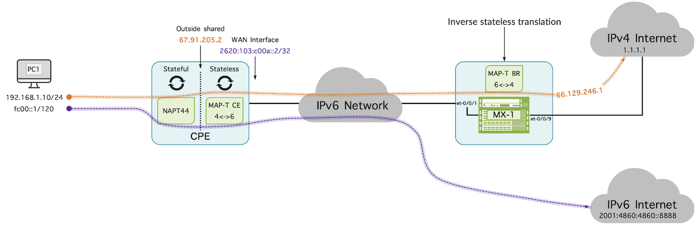
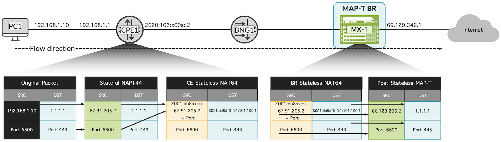
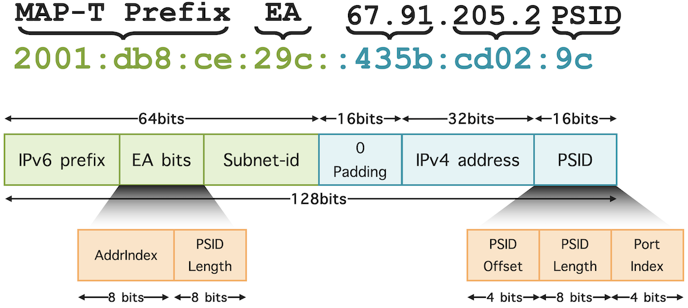

# MAP-T with Junos

**Moshiko Nayman - 07/08/2024**

Junos OS 23.4R1 introduces Mapping of Address and Port using Translation (MAP-T) as an adaptive service on Juniper MX Series routers equipped with Trio Silicon. MAP-T is a stateless NAT64-based solution designed to facilitate seamless IPv4 to IPv6 transition within IPv6 domains. This technology optimizes address utilization by allowing multiple customer edge (CE) devices to share a single public IPv4 address through unique port ranges.

## Introduction

MAP-T, defined in RFC 7599, is a NAT technique that facilitates smooth integration and transition between IPv4 and IPv6 networks. It decentralizes stateful NAT operations, enhancing scalability and reducing network management complexity.

The Customer Edge (CE) device and Border Router (BR) are utilized for MAP-T functionality.

The CE device performs two main functions: first, it conducts stateful NAT44 [RFC2663], translating IPv4 addresses like a traditional home router. Second, it executes stateless NAT64 [RFC6145], converting IPv4 packets into IPv6 packets and mapping IPv4 addresses to IPv6 addresses [RFC6052] for compatibility between IPv4 and IPv6 networks.

Once converted to IPv6, packets are forwarded over the IPv6 network to the BR, which translates them back to IPv4 for public domain transmission.

While the CE device plays a role in MAP-T, it is the BR that must support a large number of CE devices and provide high-capacity bandwidth. Selecting the right BR platform is crucial for network efficiency, ensuring high performance and scalability.

Junos OS on MX routers supports MAP-T with the following features and capabilities:

- It forwards TCP, UDP, ICMPv4, and ICMPv6 traffic.
- MAP-T configuration is based exclusively on the next-hop style.
- It accommodates packets up to a maximum size of 9192 bytes.
- In-line support of MAP-T with IP reassembly is in roadmap (planned for Junos OS 24.4).

### High level topology



**Stateful translation:**

The CPE maps LAN address 192.168.1.10 using NAPT44 to a shared public IPv4 address from **ipv4-prefix**:

```
set services softwire softwire-concentrator map-t MAPT-DOMAIN1 ipv4-prefix 67.91.205.0/24
```

**MAP-T stateless translation:**

Translates the NAPT44 source IPv4 address (e.g., 67.91.205.1) and source port to an IPv6 address based on the **MAP-T IPv6 prefix**.

```
set services softwire softwire-concentrator map-t MAPT-DOMAIN1 mapt-prefix 2001:db8:ce:ab00::/56
```

Translates the destination IPv4 address (e.g., 8.8.8.8) and ports to an IPv6 address using the corresponding MAP-T rule **dmr-prefix** (e.g., 2001:db8::/64).

```
set services softwire softwire-concentrator map-t MAPT-DOMAIN1 dmr-prefix 3001:db8:ffff::/64
```

### Packet flow and Translation



### Step-by-Step Packet Flow

1. Original IPv4 Packet (Client to CE)

```
    IPv4 Header:
        Source IP: 192.168.1.10
        Destination IP: 1.1.1.1
        Source Port: 5500
        Destination Port: 443
    Payload: ...
```

2. Stateful translation to public IPv4 (NAPT)

```
    IPv4 Header:
        Source IP: 67.91.205.2
        Destination IP: 1.1.1.1
        Source Port: 6600
        Destination Port: 443
    Payload: ...
```

3. Stateless Mapping of IPv4 to IPv6 Packet (CE to IPv6 Network)

```
    IPv6 Header:
        Source IP: 2001:db8:ce:29c::435b:cd02:9c
        Destination IP: 3001:db8:ffff:0:1:101:100:1
        Source Port: 6600
        Destination Port: 443
    MAP-T Information:
        EA-bits: 67.91.204.2
        IPv4 Prefix: 67.91.205.0/24
        Source Port: 6600
    Payload: ...
```

4. Packet in IPv6 Network

```
    IPv6 Header:
        Source IP: 2001:db8:ce:29c::435b:cd02:9c
        Destination IP: 3001:db8:ffff:0:1:101:100:1
        Source Port: 6600
        Destination Port: 443
    MAP-T Information:
        EA-bits: 67.91.205.2
        IPv4 Prefix: 67.91.205.0/24
    Payload: ...
```

5. Juniper MX Stateless Mapping IPv4 to IPv6 Packet (BR to IPv4 Internet)

```
    IPv4 Header:
        Source IP: 67.129.235.1
        Destination IP: 1.1.1.1
        Source Port: 6600
        Destination Port: 443
    Payload: ...
```

6. Reverse Flow (IPv4 Internet to Client)

```
    IPv4 Header:
        Source IP: 1.1.1.1
        Destination IP: 67.91.205.2
        Source Port: 443
        Destination Port: 6600

    Payload: ...
```

7. Juniper MX Reverse Stateless Mapping IPv6 to IPv4 Packet (BR to IPv6 Network)

``` 
    IPv6 Header:
        Source IP: 2001:db8:0:2::1:1:1:1
        Destination IP: 2001:db8:c00a::67:91:204:1
    MAP-T Information:
        EA-bits: 1.1.1.1
        IPv4 Prefix: 198.51.100.0/24
    Payload: ...
```

8. Packet in the IPv6 Network

``` 
    IPv6 Header:
        Source IP: 2001:db8:0:2::1:1:1:1
        Destination IP: 2001:db8:c00a::67:91:204:1
    MAP-T Information:
        EA-bits: 1.1.1.1
        IPv4 Prefix: 198.51.100.0/24
    Payload: ...
```

9. Reverse Stateless Mapping of IPv6 to IPv4 Packet (CE to NAPT)

```
    IPv4 Header:
        Source IP: 1.1.1.1
        Destination IP: 67.91.205.2
        Source Port: 443
        Destination Port: 6600
    Payload: ...
```

10. Reverse Stateful translation to public IPv4 (CE to Client)

```
    IPv4 Header:
        Source IP: 1.1.1.1
        Destination IP: 192.168.1.10
    Payload: ...
```

## MAP-T Terminology

**Border Relay (BR)**: in the context of MAP-T is a specialized provider edge (PE) device that operates within a MAP domain, facilitating seamless interaction between IPv6 and IPv4 networks by translating and routing packets between these domains.

**MAP-T Customer Edge (CE)**: MAP-T Customer Edge refers to a MAP-T-enabled device deployed at the customer edge in a MAP-T deployment. It performs functions such as stateful NAT44 translation and encapsulation of IPv4 packets into IPv6 for transmission across the network.

**MAP Domain**: A MAP domain comprises one or more MAP-T CE devices and BR devices interconnected within the same virtual link. It defines the boundary within which MAP-T functions to manage and translate addresses and ports.

**Port Set ID (PSID)**: Port Set ID is a distinct portion of the transport layer port space designated within MAP-T. It helps in mapping port ranges associated with different CE devices sharing a common IPv4 address.

**Embedded Address (EA) Bits**: These bits are used to encode the IPv4 address within the IPv6 address. In the examples above, `67.91.204.1` and `1.1.1.1` are embedded within the IPv6 addresses. EA-Bits in the IPv6 address identify components such as IPv4 prefixes, individual IPv4 addresses, shared IPv4 addresses, and port set identifiers (PSIDs). These bits are crucial for encoding and decoding IPv4 information within IPv6 packets in MAP-T deployments.



**Softwire**: Tunnel established between two endpoints to transport packets encapsulated in a protocol different from the network it traverses. In MAP-T, softwires are used to facilitate the transport of IPv4 packets over IPv6 networks and vice versa.

**Softwire Initiator (SI)**: Softwire Initiator is deployed at the customer's end of a softwire tunnel. It encapsulates native packets (IPv4 or IPv6) and forwards them through the softwire to a Softwire Concentrator (SC) at the service provider's network.

**Softwire Concentrator (SC)**: Softwire Concentrator is located at the service provider's network and receives encapsulated packets from Softwire Initiators. It decapsulates these packets and forwards them to their respective destinations in the IPv4 or IPv6 network.

**Default Mapping Rule (DMR)**: The DMR specifies an IPv6 prefix from which outbound public IPv4 addresses are mapped. Essentially, this prefix is added to the outbound destination address, ensuring that packets are routed by the IPv6.

### Components

- IPv6 Prefix: The common IPv6 prefix used for mapping IPv4 addresses.
- Embedded Address (EA) Bits: Bits used to encode the IPv4 address within the IPv6 address.
- Port Set ID (PSID): Part of the transport layer port space designated for a specific CE device, allowing multiple devices to share the same IPv4 address.

### Fundamental Functions and Processes

- **Address and Port Mapping**: Each CE is assigned a unique port range on a shared public IPv4 address. Juniper's MAP-T solution ensures each CE is identifiable at the BR by encoding IPv4 address and port information into IPv6 packets using the MAP algorithm.
- **Prefix Binding**: MAP-T employs a structured IPv4-IPv6 prefix binding mechanism, essential for maintaining consistency in translation rules. This binding facilitates efficient sharing of IPv4 addresses among multiple CEs.
- **Anti-Spoofing Verification**: The BR performs anti-spoofing, ensuring that packets have legitimate source addresses and ports, aligning with the defined mapping rules, to prevent malicious traffic from spoofed sources.
- **Stateless Translation**: Juniper MAP-T operates in a stateless manner, leveraging advanced ASICs like the MX Trio silicon to handle translation without CPU involvement. This approach ensures high throughput and minimal latency, crucial for demanding network environments.

## Advantages of MAP-T

- ***Improved Scaling***: Allowing multiple customer edge (CE) devices to share a single public IPv4 address through unique port ranges, MAP-T optimizes address usage and enhances scalability. Its stateless operation reduces complexity and improves efficiency, making it easier to manage and scale networks without the need for additional IP addresses. This approach not only supports the smooth integration of IPv6 capabilities but also ensures that networks can handle increasing numbers of devices and traffic demands effectively.
- ***Simplified Redundancy***: No need to synchronize sessions between redundant BRs, simplifying redundancy. This reduces the complexity and overhead associated with maintaining high availability in the network.
- ***Reduced Logging***: Only configuration changes in the BR need logging, reducing the volume of logging data. This minimizes the storage and management burden associated with large-scale NAT deployments.
- ***Simpler Communication***: Simplifies user-to-user communication by eliminating the need to recirculate traffic between the Packet Forwarding Engine (PFE) and the CPU. This streamlines the communication process, reducing latency and potential points of failure.
- ***Higher Throughput***: Offers higher throughput with less processing required in the BR compared to stateful solutions. The MX Trio silicon's advanced ASICs enable this functionality without CPU involvement, further enhancing performance and efficiency. This results in faster packet processing and lower power consumption, making the solution more economical and environmentally friendly.

In addition, bi-directional communication with MAP-T is more feasible compared to CG-NAT since MAP-T uses a stateless translation mechanism with predefined address and port mappings, it allows for bidirectional communication.

## Configuration

### MAP-T Prerequisite Configuration

Inline-services enable the creation of service interfaces on specific FPCs and PICs within line cards. Ensure inline-services are enabled on the relevant FPC and PIC, and optionally specify bandwidth (in Junos OS, 23.4R1 ranging from 1g to 400g) for traffic on these interfaces.

Enable inline services, the example will dynamically allocate 9.6Tbps total throughput.

```
set chassis fpc 0 pic 0 inline-services bandwidth 400g
set chassis fpc 0 pic 1 inline-services bandwidth 400g
set chassis fpc 0 pic 2 inline-services bandwidth 400g
set chassis fpc 0 pic 3 inline-services bandwidth 400g
set chassis fpc 0 pic 4 inline-services bandwidth 400g
set chassis fpc 0 pic 5 inline-services bandwidth 400g
set chassis fpc 1 pic 0 inline-services bandwidth 400g
set chassis fpc 1 pic 1 inline-services bandwidth 400g
set chassis fpc 1 pic 2 inline-services bandwidth 400g
set chassis fpc 1 pic 3 inline-services bandwidth 400g
set chassis fpc 1 pic 4 inline-services bandwidth 400g
set chassis fpc 1 pic 5 inline-services bandwidth 400g
```

Below is all the configuration required with minimum interfaces:

```
set chassis fpc 0 pic 0 inline-services bandwidth 400g
set services service-set SSET1 softwire-rules SW-RULE1
set services service-set SSET1 next-hop-service inside-service-interface si-0/0/0.1
set services service-set SSET1 next-hop-service outside-service-interface si-0/0/0.2
set services softwire softwire-concentrator map-t MAPT-DOMAIN1 dmr-prefix 3001:db8:ffff::/64
set services softwire softwire-concentrator map-t MAPT-DOMAIN1 ipv4-prefix 67.91.205.0/24
set services softwire softwire-concentrator map-t MAPT-DOMAIN1 mapt-prefix 2001:db8:ce::/48
set services softwire softwire-concentrator map-t MAPT-DOMAIN1 ea-bits-len 16
set services softwire softwire-concentrator map-t MAPT-DOMAIN1 psid-offset 4
set services softwire softwire-concentrator map-t MAPT-DOMAIN1 psid-length 8
set services softwire softwire-concentrator map-t MAPT-DOMAIN1 mtu-v6 9192
set services softwire softwire-concentrator map-t MAPT-DOMAIN1 v4-reassembly
set services softwire softwire-concentrator map-t MAPT-DOMAIN1 v6-reassembly
set services softwire rule SW-RULE1 match-direction input
set services softwire rule SW-RULE1 term MTD1 then map-t MAPT-DOMAIN1
set interfaces si-0/0/0 unit 1 family inet
set interfaces si-0/0/0 unit 1 family inet6
set interfaces si-0/0/0 unit 1 service-domain inside
set interfaces si-0/0/0 unit 2 family inet
set interfaces si-0/0/0 unit 2 family inet6
set interfaces si-0/0/0 unit 2 service-domain outside
```

And that's it!

Verification can be conducted using 'show interface' on both the physical and virtual SI interfaces, which can also be utilized for monitoring purposes.

```
tester@MX-1> show services inline softwire statistics mapt
 
Service PIC Name                                    si-1/0/0
 
Control Plane Statistics
     MAPT ICMPv6 translated to ICMPv4                   0
     MAPT ICMPv4 translated to ICMPv6                   0
     MAPT ICMPv4 discards                               0
     MAPT ICMPv6 discards                               0
 
Data Plane Statistics (v6-to-v4)      Packets                 Bytes
     MAPT v6 translated to v4           119309981               93300405142
     MAPT v6 spoof drops                0                       0
     MAPT v6 reassembled                0                       0
     MAPT v6 fragment drops             0                       0
     MAPT v6 unsupported drops          0                       0
 
Data Plane Statistics (v4-to-v6)      Packets                 Bytes
     MAPT v4 translated to v6           37234257                2457460962
     MAPT v6 MTU exceed drops           0                       0
     MAPT v4 reassembled                0                       0
     MAPT v4 fragment drops             0                       0
     MAPT v4 unsupported drops          0                       0
```

## Dynamic Routing (Optional)

The DMR and the IPv4 prefix under the softwire concentrator will generate static routes as follows:

```
mnayman@MAPT-1> show route 3001:db8:ffff::/64 

inet6.0: 20 destinations, 20 routes (20 active, 0 holddown, 0 hidden)
+ = Active Route, - = Last Active, * = Both


3001:db8:ffff::/64 *[Static/524289] 00:13:37
                    >  via si-0/0/0.1

mnayman@MX-1> show route 67.91.205.0/24 

inet.0: 41 destinations, 58 routes (41 active, 0 holddown, 0 hidden)
+ = Active Route, - = Last Active, * = Both

67.91.205.0/24     *[Static/524290] 00:13:39
                    >  via si-0/0/0.2
```

To simplify the routing advertisement and facilitate the dynamic growth of MAP-T domains in the future, we can utilize the apply-path feature in Junos OS.

This approach reduces the need for manual configuration when adding MAP-T domains. Additionally, marking with community attributes or utilizing other BGP attributes such as local-preference can help direct traffic to the MAP-T BR router.

```
set policy-options prefix-list DMR-PREFIXES apply-path "services softwire softwire-concentrator map-t <*> dmr-prefix <*>"

set policy-options prefix-list IPv4-PREFIXES apply-path "services softwire softwire-concentrator map-t <*> ipv4-prefix <*>"

set policy-options policy-statement BGPv4-EXPORT term MAPT from prefix-list IPv4-PREFIXES
set policy-options policy-statement BGPv4-EXPORT term MAPT then accept

set policy-options policy-statement BGPv6-EXPORT term MAPT from prefix-list DMR-PREFIXES
set policy-options policy-statement BGPv6-EXPORT term MAPT then accept
```

## Calculating the Number of MAP-T Subscribers

MAP-T configuration is customizable, allowing you to choose the number of domains, IP prefixes, and port ranges determined by the PSID length, as per the following example:

***If psid-length is 6=2^6= 64 PSIDs***

Thus, each MAP-T CE device assigned a specific PSID will have access to a block of 1,024 ports per subscriber.

For instance, if we configure a /24 IPv4 prefix, providing 256 IPv4 addresses, each address can be shared among 64 MAP-T subscribers.

***Port range per IPv4 address=65536/64=1024 ports per subscriber***

Total Subscribers = Number of IPv4 Addresses x Subscribers per IPv4 Address

***Total Subscribers=256x64=16,384***

By sharing each IPv4 address among 64 customers, we can provide MAP-T service to a total of 16,384 subscribers with a /24 IPv4 address block.

| Parameter | Value |
|:--|:--|
| Number of MAP-T subscribers | 16384 |
| Number of public IPv4 host addresses | 256 |
| Sharing ratio | 64 MAP-T CE per shared public IPv4 address |
| Port range per IPv4 address | 1,024 ports to each customer |

## Glossary

- BR: Border Router
- CE: Customer Edge
- BGP: Border Gateway Protocol
- CG-NAT: Carrier-grade NAT also known as large-scale NAT
- ECMP: Equal-Cost Multi-Path
- IFL: Interface Logical
- IP: Internet Protocol
- Junos: Operating System used in Juniper Networks routing, switching and security devices.
- MAP-T: Mapping of Address and Port using Translation
- NAT: Network Address Translation
- PE: Provider Edge router
- PFE: Packet Forwarding Engine
- RE: Routing Engine
- VIP: Virtual IP
