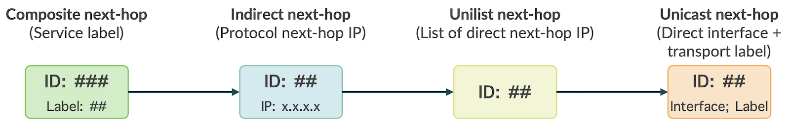
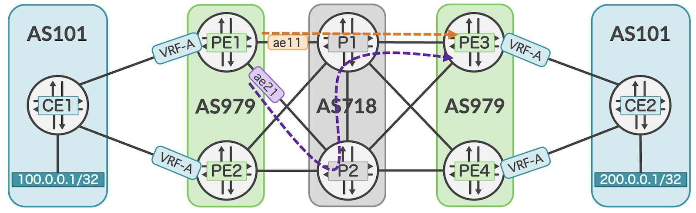
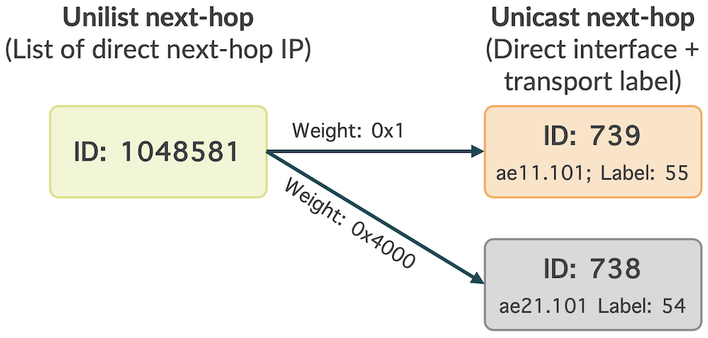
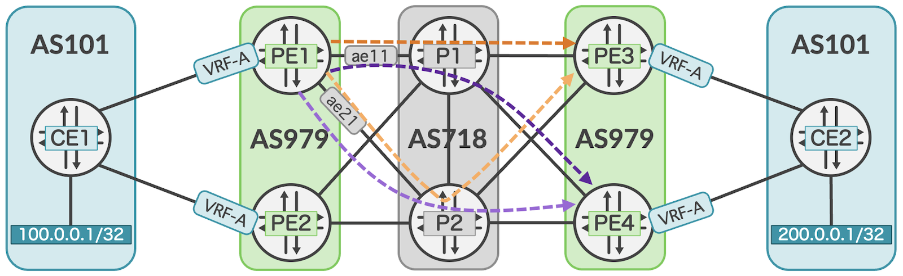
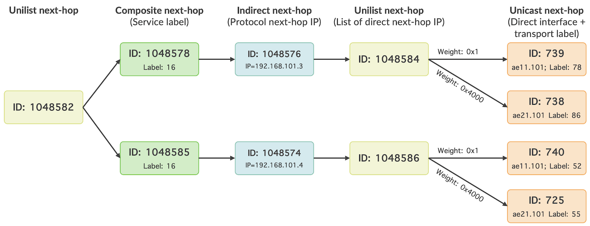
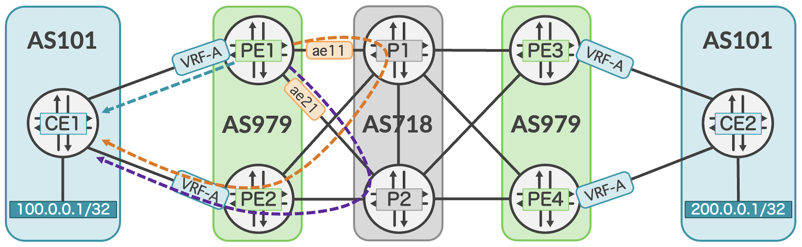
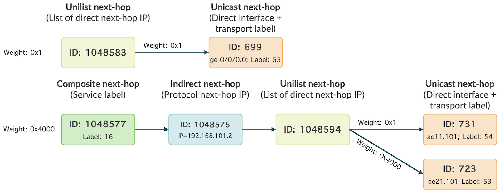
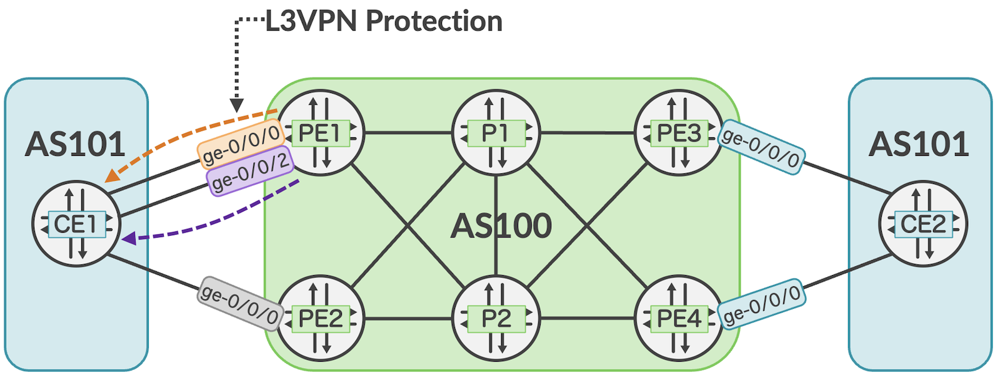
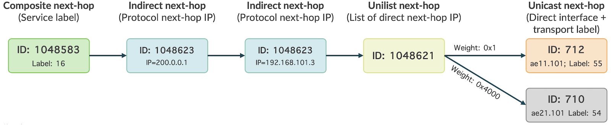

# Mastering BGP PIC on JUNOS

**Moshiko Nayman - 10/24/2023**

Optimizing Failover Convergence for Enhanced Network Resilience with BGP PIC implementation in JUNOS.

## Introduction

This blog will delve into multiple Juniper features to enhance failover convergence, often referred to as BGP-PIC (Prefix-Independent Convergence).

This set of features improves convergence speed in BGP-based networks. It achieves this by precomputing backup paths for BGP prefixes, minimizing disruptions in the event of network failures such as link or router outages. This rapid switching to backup paths improves network availability and service reliability.

This blog will explain how PIC works for different services such as: Internet, L3VPN and different transport: Directly connected, IGP, BGP-LU, BGP-CT.

## Overview

BGP Fast Reroute (FRR) can be intricate and may appear to deviate from BGP's original intent, which was deliberately crafted as a slower protocol for efficiently managing extensive route tables in large-scale IP environments. Its primary aim was to handle millions of routes without disrupting network equipment each time the IP topology undergoes changes.

BGP PIC supports multiprotocol BGP (MP-BGP) IPv4 or IPv6 Unicast and VPN network layer reachability information (NLRI) resolved using any of these protocols:

- OSPF
- IS-IS
- LDP
- RSVP
- SR-TE
- Flex-Algo
- BGP-LU / BGP-CT

To clarify, BGP-PIC does not have SAFI, AFI, or NLRI associated with it. Instead, it's a technique used to enhance the performance of the forwarding convergence.

The key to optimizing the FIB for achieving Fast Reroute (FRR) capabilities lies in the hierarchical structure of next hops implemented within the hardware Packet Forwarding Engine (PFE), where the FIB resides. These structures are commonly referred to as indirect next hops or chained composite next hops. These techniques are used to realize BGP PIC (Prefix scale Independent Convergence) to illustrate this concept.

The next hop is programmed with local 'Weight' values, used to select a backup path when a link failure occurs, with a preference for lower weight values as the preferred route. In situations where routes have the same weight value, load balancing becomes possible.

In Junos, BGP PIC will categorize next hop as follows:

- 0x1 indicates the primary path with active next hops.


Equivalent of "1" in decimal
- 0x4000 indicates the backup path with passive next hops.


Equivalent of "16384" in decimal

Junos features use the following four knobs, to enable BGP PIC for various use cases. Multiple options, each for different design types to address specific BGP FRR requirements:

**Protect Core** for service or transport RIB, Master table or VRF. This option installs a precomputed next hop in the RIB and FIB with higher weight as a backup.

```
set routing-options protect core
set routing-options rib inet.3 protect core
set routing-instances <instance_name> routing-options protect core
```

**Protection** feature is supported on eBGP only and is a local repair.

It provides a backup path to protect the active PE path in a Layer 3 VPN or a BGP transport route.

```
set protocols bgp group <group_name> family inet unicast protection
set protocols bgp group <group_name> family inet6 unicast protection

set protocols bgp group <group_name> family inet labeled-unicast protection
set protocols bgp group <group_name> family inet6 labeled-unicast protection

set protocols bgp group <group_name> family inet transport protection
set protocols bgp group <group_name> family inet6 transport protection
```

For BGP-CT, only this knob is required. Both iBGP and eBGP is supported

**Preserve-Nexthop-Hierarchy** is required when the indirect-next-hop is behind another indirect next-hop.

```
set routing-options resolution preserve-nexthop-hierarchy
```

**Ingress and Transit Composite-Next-Hop**

It's a common best practice to configure the knob below. There are plans to make it enabled by default.

```
set routing-options forwarding-table chained-composite-next-hop ingress <protocol>
set routing-options forwarding-table chained-composite-next-hop transit <protocol> 
```

## Preamble

It is important to note that in Juniper routers, Next-hop install, and protection next-hops utilize a separate memory block than the FIB, therefor no impact on the maximum FIB route scale. In Juniper systems such as MX and PTX routers, Next-hop supports unlimited number of next-hops in a chain.

Juniper silicon devices are uniquely positioned to support these capabilities.  This is due to programmable next-hop processor and at each level in our case, you can enable protection.

> Note: that other 3rd party systems are limited to support the feature for unlabeled transport or for BGP-LU only.

In Junos, different types of next hops are used in the context of routing and forwarding. Each type serves a specific purpose and has distinct characteristics. Here's an explanation of the common types of next hops in Juniper's routing platform:



> Note: Next-Hops occupying memory led to constraints and limitations. However, that's not the case with Juniper devices such as MX Trio and PTX Express silicon.

*Juniper devices stand out in their ability to support these features at high scale, thanks to the programmable next-hop processor. Unlike other silicon devices, which support only three next-hops in a chain, Juniper devices can accommodate an unlimited number of next-hops in a chain. Additionally, you have the option to enable protection at each level.*

**Protocol Next Hop:**

The Protocol Next Hop (PNH) is used to determine the forwarding next-hop. A next-hop as specified by a BGP update for the prefixes it is advertising. BGP Route Resolver recurses through protocol next-hop of the prefix to find its forwarding next-hop.

**Composite Next Hop:**

A Composite Next Hop (CNH) in Junos is a collection of Next Hop IDs controlled by a composition function that determines their actions. CNH simplifies label management by moving service labels to the top hierarchy. It's used for aggregating multiple next hops into one entity, useful for scenarios like Equal-Cost Multi-Path (ECMP) or Weighted ECMP routing. This optimization enhances network efficiency by reducing memory usage compared to unicast next-hops and creating a single next-hop for multiple paths. In L3VPN cases, when multiple routes are advertised with different labels, CNH helps create a single indirect next-hop shared by all routes.

**Indirect Next Hop:**

An indirect next-hop is a pseudo next-hop that references one of the actual forwarding next-hops, such as unicast, unilist, indexed, or others. It serves as a way to indirect or refer to one of these "real" forwarding next-hops, allowing for more flexible and efficient routing and forwarding options.

**Unilist Next Hop:**

List of Unicast and/or Unilist next-hops. When a packet is forwarded to a Unilist next-hop, it is sent to one of the entries within the Unilist. This particular next-hop type is commonly utilized for load balancing purposes, allowing the router to distribute traffic across multiple paths or destinations, thereby optimizing network performance and redundancy. Unilist supports multiple applications: ECMP, WECMP, FRR, AE.

**Unicast Next Hop:**

Direct physical next hop, containing the outgoing interface and full encapsulation such as full MPLS label information specified by the family type.

These different types of next hops enable Juniper routers and switches to handle various routing scenarios, including load balancing, ECMP, and direct forwarding to interfaces. The choice of next hop type depends on the network design and routing requirements for specific routes and destinations.

## "protect core" -- Transport Layer Illustration

Introduced in Junos 13.2, with subsequent improvements for L3VPN in Junos 15.1, RSVP in Junos 16.1, and EVPN-VXLAN in Junos 22.4R1.



By default, even though the route to PE3 is learned via both P1 and P2, only the best route will be installed in the routing and forwarding table (marked with *).
In this example, the path via ae11.101 is chosen.

### Verification

**Routing table**:

```
mnayman@PE1> show route 192.168.101.3


inet.0: 36 destinations, 49 routes (36 active, 0 holddown, 0 hidden)
@ = Routing Use Only, # = Forwarding Use Only
+ = Active Route, - = Last Active, * = Both

192.168.101.3/32   *[BGP/170] 00:07:08, localpref 100
                      AS path: 718 718 I, validation-state: unverified
                    >  to 10.101.1.1 via ae11.101, Push 55
                    [BGP/170] 00:00:01, localpref 100
                      AS path: 718 718 I, validation-state: unverified
                    >  to 10.102.1.1 via ae21.101, Push 54
```

RPD will program the PFE with one of the two routes in the forwarding table:

```
mnayman@PE1> show route forwarding-table destination 192.168.0.3 

Routing table: default.inet
Internet:
Destination        Type RtRef Next hop           Type Index    NhRef Netif
192.168.0.3/32     user     0 10.1.1.1           ucst      702    13 ae11.100
```

In the absence of BGP PIC, the following sequence of events would occur in the event of a failure:

- When the interface goes down, it triggers the BGP session to go down.
- RPD will be tasked with updating the routing table to reflect the changes for a best new path to be installed.
- Subsequently, RPD will instruct the PFE to program the new route into its forwarding table.

These back-and-forth tasks of revoking and installing, followed by a BGP state change, can take more time than is required for some specific network environments.

BGP PIC improves and achieves BGP FRR with Primary and Backup Paths:

- Preinstalled paths in the routing table reduce convergence times to milliseconds.
- Two routes will be installed in the routing table, marked with an asterisk, indicating that the route is both the active and the last active route to a BGP prefix.
- The primary path serves as the chosen route for routing traffic, while the backup path is a backup used in case of a link or router failure.

### Weight

As mentioned in the overview, routes will be installed with different weights for the primary and backup paths.

Routing table with 'protect core' enabled:

PE1 Configuration:

```
set routing-options protect core
```

```
mnayman@PE1> show route 192.168.101.3                               


inet.0: 36 destinations, 49 routes (36 active, 0 holddown, 0 hidden)
@ = Routing Use Only, # = Forwarding Use Only
+ = Active Route, - = Last Active, * = Both


192.168.101.3/32   *[BGP/170] 00:00:06, localpref 100
                      AS path: 718 718 I, validation-state: unverified
                    >  to 10.101.1.1 via ae11.101, Push 55
                       to 10.102.1.1 via ae21.101, Push 54
                    [BGP/170] 00:00:47, localpref 100
                      AS path: 718 718 I, validation-state: unverified
                    >  to 10.102.1.1 via ae21.101, Push 54
```

Let's dive deeper with an extensive set of commands to view the weights:

```
mnayman@PE1> show route 192.168.101.3 extensive 


inet.0: 36 destinations, 49 routes (36 active, 0 holddown, 0 hidden)
192.168.101.3/32 (2 entries, 1 announced)
TSI:
KRT in-kernel 192.168.101.3/32 -> {list:Push 55, Push 54}
        *BGP    Preference: 170/-101
                Next hop type: Router, Next hop index: 0
                Address: 0x779a7f4
                Next-hop reference count: 6, key opaque handle: 0x0, non-key opaque handle: 0x0
                Source: 10.101.1.1
                Next hop: 10.101.1.1 via ae11.101 weight 0x1, selected
                Label operation: Push 55
                Label TTL action: prop-ttl
                Load balance label: Label 55: Entropy label; 
                Label element ptr: 0x7cc8988
                Label parent element ptr: 0x0
                Label element references: 5
                Label element child references: 1
                Label element lsp id: 0
                Session Id: 0
                Next hop: 10.102.1.1 via ae21.101 weight 0x4000
                Label operation: Push 54
... 
```

The same logic is copied into the forwarding table, as shown with an extensive command.

```
mnayman@PE1> show route forwarding-table destination 192.168.101.3 extensive 


Routing table: default.inet [Index 0] 
Internet:
    
Destination:  192.168.101.3/32
  Route type: user                  
  Route reference: 0                   Route interface-index: 0   
  Multicast RPF nh index: 0             
  P2mpidx: 0              
  Flags: sent to PFE, rt nh decoupled  
  Next-hop type: unilist               Index: 1048581  Reference: 3    
  Nexthop: 10.101.1.1
  Next-hop type: Push 55               Index: 712      Reference: 2    
  Load Balance Label: Entropy label     
  Next-hop interface: ae11.101      Weight: 0x1  
  Nexthop: 10.102.1.1
  Next-hop type: Push 54               Index: 710      Reference: 2    
  Load Balance Label: Entropy label     
  Next-hop interface: ae21.101      Weight: 0x4000
```



Taking a closer look at the VRF-A L3VPN route, an additional path is installed as the next hop.

```
mnayman@PE1> show route 200.0.0.1/32 extensive expanded-nh 


VRF-A.inet.0: 34 destinations, 59 routes (31 active, 0 holddown, 3 hidden)
200.0.0.1/32 (2 entries, 1 announced)
Installed-nexthop:
Indr Composite (0x76a77e4) 192.168.101.3 Push 16 Session-ID: 388
  Krt_cnh (0x6f7dec0) Index:1048587 Push 16
    Krt_inh (0x716605c) Index:1048583 PNH: 192.168.101.3
      List (0x7799624) Index:1048581 Push 55
        Router (0x76a7704) Index:712 10.101.1.1 Push 55 Session-ID: 333 via ae11.101
        Router (0x76a74d4) Index:710 10.102.1.1 Push 54 Session-ID: 390 via ae21.101
```

In the forwarding table:

```
mnayman@PE1> show route forwarding-table destination 200.0.0.1/32 table VRF-A extensive 


Routing table: VRF-A.inet [Index 10] 
Internet:
    
Destination:  200.0.0.1/32
  Route type: user                  
  Route reference: 0                   Route interface-index: 0   
  Multicast RPF nh index: 0             
  P2mpidx: 0              
  Flags: sent to PFE 
  Nexthop:  
  Next-hop type: composite             Index: 1048587  Reference: 13   
  Load Balance Label: Push 16, None     
  Next-hop type: indirect              Index: 1048583  Reference: 2    
  Next-hop type: unilist               Index: 1048581  Reference: 3    
  Nexthop: 10.101.1.1
  Next-hop type: Push 55               Index: 712      Reference: 2    
  Load Balance Label: Entropy label     
  Next-hop interface: ae11.101      Weight: 0x1  
  Nexthop: 10.102.1.1
  Next-hop type: Push 54               Index: 710      Reference: 2    
  Load Balance Label: Entropy label     
  Next-hop interface: ae21.101      Weight: 0x4000
```

Junos offers deeper insights, allowing direct examination of the PFE:

```
mnayman@PE1> request pfe execute target fpc0 command "show nhdb id 1048587 recursive"     
SENT: Ukern command: show nhdb id 1048587 recursive


1048587(Label, IPv4->MPLS, ifl:0:-, pfe-id:0)
    1048583(Indirect, IPv4, ifl:335:ae11.101, pfe-id:0, i-ifl:0:-)
        1048581(Unilist, IPv4, ifl:0:-, pfe-id:0)
            712(Unicast, IPv4->MPLS, ifl:335:ae11.101, pfe-id:0)
            710(Unicast, IPv4->MPLS, ifl:338:ae21.101, pfe-id:0)
```

## protect core - Service Layer Illustration

By default, even though PIC is configured at this point, only one remote PE is considered the best reroute for the service level.

From the output below, it's evident that before adding the PIC edge, only one of the two announcing PEs is installed in the routing table.

```
mnayman@PE1> show route 200.0.0.1/32 extensive expanded-nh    


VRF-A.inet.0: 33 destinations, 58 routes (30 active, 0 holddown, 3 hidden)
200.0.0.1/32 (2 entries, 1 announced)
Installed-nexthop:
Indr Composite (0x76a6904) 192.168.101.3 Push 16 Session-ID: 388
  Krt_cnh (0x6f80a64) Index:1048582 Push 16
    Krt_inh (0x716605c) Index:1048579 PNH: 192.168.101.3
      List (0x7799754) Index:1048615 Push 55
        Router (0x76a7704) Index:712 10.101.1.1 Push 55 Session-ID: 333 via ae11.101
        Router (0x76a74d4) Index:710 10.102.1.1 Push 54 Session-ID: 390 via ae21.101
```

In the forwarding table

```
mnayman@PE1>show route forwarding-table destination 200.0.0.1/32 table VRF-A
Routing table: VRF-A.inet
Internet:
Destination        Type RtRef Next hop           Type Index    NhRef Netif
200.0.0.1/32       user     0                    comp  1048582    13
```

Let's enhance PE1's intelligence by enabling 'protect core' at the VRF level.

PE1 Configuration:

```
set routing-instances VRF-A routing-options protect core
set routing-options forwarding-table chained-composite-next-hop ingress l3vpn extended-space
```



Verification:

```
mnayman@PE1> show route 200.0.0.1/32 table VRF-A extensive expanded-nh


VRF-A.inet.0: 33 destinations, 82 routes (30 active, 0 holddown, 3 hidden)
200.0.0.1/32 (3 entries, 2 announced)
        State: <CalcForwarding>
Installed-nexthop:
List (0x779a88c) Index:1048582 Push 16
  Indr Composite (0x76a6514) 192.168.101.3 Push 16 Session-ID: 422
    Krt_cnh (0x6f7d8d8) Index:1048578 Push 16
      Krt_inh (0x716539c) Index:1048576 PNH: 192.168.101.3
        List (0x779aaec) Index:1048584 Push 78
          Router (0x76a7704) Index:739 10.101.1.1 Push 78 Session-ID: 333 via ae11.101
          Router (0x76a6eb4) Index:738 10.102.1.1 Push 86 Session-ID: 423 via ae21.101
  Indr Composite (0x76a7004) 192.168.101.4 Push 16 Session-ID: 420
    Krt_cnh (0x6f7a110) Index:1048585 Push 16
      Krt_inh (0x7165d2c) Index:1048574 PNH: 192.168.101.4
        List (0x779afac) Index:1048586 Push 52
          Router (0x76a6f94) Index:740 10.101.1.1 Push 52 Session-ID: 333 via ae11.101
          Router (0x76a7234) Index:725 10.102.1.1 Push 55 Session-ID: 423 via ae21.101
```

In the forwarding table, a Unilist and an additional composite next-hop have been added.

```
mnayman@PE1> show route forwarding-table destination 200.0.0.1/32 table VRF-A 


Routing table: VRF-A.inet
Internet:
Destination        Type RtRef Next hop           Type Index    NhRef Netif
200.0.0.1/32       user     0                    ulst  1048582    12
                                                 comp  1048578     4
                                                 comp  1048585     3
```

With the extensive command, we can determine the preferred next-hop as well as the preferred unicast next-hop.

```
mnayman@PE1> show route forwarding-table destination 200.0.0.1/32 table VRF-A extensive 


Routing table: VRF-A.inet [Index 10] 
Internet:
    
Destination:  200.0.0.1/32
  Route type: user                  
  Route reference: 0                   Route interface-index: 0   
  Multicast RPF nh index: 0             
  P2mpidx: 0              
  Flags: sent to PFE, rt nh decoupled  
  Next-hop type: unilist               Index: 1048582  Reference: 12   
  Nexthop:  
  Next-hop type: composite             Index: 1048578  Reference: 4    
  Load Balance Label: Push 16, None     
  Next-hop type: indirect              Index: 1048576  Reference: 2    
                                    Weight: 0x1  
  Next-hop type: unilist               Index: 1048584  Reference: 3    
  Nexthop: 10.101.1.1
  Next-hop type: Push 78               Index: 739      Reference: 2    
  Load Balance Label: None              
  Next-hop interface: ae11.101      Weight: 0x1  
  Nexthop: 10.102.1.1
  Next-hop type: Push 86               Index: 738      Reference: 2    
  Load Balance Label: None              
  Next-hop interface: ae21.101      Weight: 0x4000
  Nexthop:  
  Next-hop type: composite             Index: 1048585  Reference: 3    
  Load Balance Label: Push 16, None     
  Next-hop type: indirect              Index: 1048574  Reference: 2    
                                    Weight: 0x4000
  Next-hop type: unilist               Index: 1048586  Reference: 3    
  Nexthop: 10.101.1.1
  Next-hop type: Push 52               Index: 740      Reference: 2    
  Load Balance Label: None              
  Next-hop interface: ae11.101      Weight: 0x1  
  Nexthop: 10.102.1.1
  Next-hop type: Push 55               Index: 725      Reference: 2    
  Load Balance Label: None              
  Next-hop interface: ae21.101      Weight: 0x4000  
```



## protection - Illustration of the Service Layer

Introduced in Junos 13.2, this feature adds a pre-computed protection path into the PFE. In the event that a PE-CE link becomes unusable for forwarding, the PFE will reroute through another path without having to wait for the router or the protocols to provide updated forwarding information.

In addition to the protect core feature, when we examine the best route towards CE1, only one active route is installed in the routing table based on BGP path selection- the shortest path.

```
mnayman@PE1> show route 100.0.0.1/32 


VRF-A.inet.0: 34 destinations, 59 routes (31 active, 0 holddown, 3 hidden)
@ = Routing Use Only, # = Forwarding Use Only
+ = Active Route, - = Last Active, * = Both


100.0.0.1/32       *[BGP/170] 00:07:02, localpref 100
                      AS path: 101 I, validation-state: unverified
                    >  to 172.18.1.1 via ge-0/0/0.0
                    [BGP/170] 00:08:13, localpref 100, from 192.168.0.210
                      AS path: 101 I, validation-state: unverified
                    >  to 10.101.1.1 via ae11.101, Push 16, Push 54(top)
                       to 10.102.1.1 via ae21.101, Push 16, Push 53(top)
```

It becomes even clearer with an extensive command. The source 172.18.1.1 is the eBGP peer CE1, advertising the active route marked with an asterisk, while the inactive route is learned from the route-reflector source 192.168.0.210 with the reason for inactivity:

```
mnayman@PE1> show route 100.0.0.1/32 extensive


VRF-A.inet.0: 34 destinations, 59 routes (31 active, 0 holddown, 3 hidden)
100.0.0.1/32 (2 entries, 1 announced)
...
        *BGP    Preference: 170/-101
                Next hop type: Router, Next hop index: 699
                Address: 0x76a5cc4
                Next-hop reference count: 23, key opaque handle: 0x0, non-key opaque handle: 0x0
                Source: 172.18.1.1
                Next hop: 172.18.1.1 via ge-0/0/0.0, selected
...
         BGP    Preference: 170/-101
                Route Distinguisher: 192.168.0.2:101
                Next hop type: Indirect, Next hop index: 0
                Address: 0x76a72a4
                Next-hop reference count: 26, key opaque handle: 0x0, non-key opaque handle: 0x0
                Source: 192.168.0.210
                Next hop type: Router, Next hop index: 0
                Next hop: 10.101.1.1 via ae11.101 weight 0x1, selected
                Label operation: Push 54
                Label TTL action: prop-ttl
                Load balance label: Label 54: Entropy label; 
                Label element ptr: 0x7cc8e60
                Label parent element ptr: 0x0
                Label element references: 5
                Label element child references: 1
                Label element lsp id: 0
                Session Id: 0
                Next hop: 10.102.1.1 via ae21.101 weight 0x4000
                Label operation: Push 53
                Label TTL action: prop-ttl
                Load balance label: Label 53: Entropy label; 
                Label element ptr: 0x7cc9810
                Label parent element ptr: 0x0
                Label element references: 2
                Label element child references: 0
                Label element lsp id: 0
                Session Id: 0
                Protocol next hop: 192.168.101.2
                Label operation: Push 16
                Label TTL action: prop-ttl
                Load balance label: Label 16: None; 
                Composite next hop: 0x6f7ec34 1048607 INH Session ID: 387
                Indirect next hop: 0x7162ef4 1048604 INH Session ID: 387
                State: <Secondary NotBest Int Ext ProtectionCand>
                Inactive reason: Not Best in its group - Interior > Exterior > Exterior via Interior
```

In Junos, there is a method to protect against directly connected PE1-CE1 interface failure. Both available routes in the RIB can be copied to the FIB by adding the following command:



PE1 Configuration:

```
set routing-instances VRF-A protocols bgp group ebgp family inet unicast protection
```

After adding the command above, Junos marks '@' for routes used in the routing table and also displays what is installed in the forwarding table marked with '#', while maintaining the same logic of weight for the best and backup routes.

```
mnayman@PE1> show route 100.0.0.1/32    


VRF-A.inet.0: 33 destinations, 68 routes (30 active, 0 holddown, 3 hidden)
@ = Routing Use Only, # = Forwarding Use Only
+ = Active Route, - = Last Active, * = Both

100.0.0.1/32       @[BGP/170] 00:04:50, localpref 100
                      AS path: 101 I, validation-state: unverified
                    >  to 172.18.1.1 via ge-0/0/0.0
                    [BGP/170] 00:00:09, localpref 100, from 192.168.0.210
                      AS path: 101 I, validation-state: unverified
                    >  to 10.101.1.1 via ae11.101, Push 16, Push 54(top)
                       to 10.102.1.1 via ae21.101, Push 16, Push 53(top)
                   #[Multipath/255] 00:04:50
                    >  to 172.18.1.1 via ge-0/0/0.0
                       to 10.101.1.1 via ae11.101, Push 16, Push 54(top)
                       to 10.102.1.1 via ae21.101, Push 16, Push 53(top)
```

Show command with extensive and expanded-nh option:

```
mnayman@PE1> show route 100.0.0.1/32 table VRF-A extensive expanded-nh 


VRF-A.inet.0: 34 destinations, 69 routes (31 active, 0 holddown, 3 hidden)
100.0.0.1/32 (3 entries, 2 announced)
        State: <CalcForwarding>
Installed-nexthop:
List (0x7799cac) Index:1048583
  Router (0x76a5cc4) Index:699 172.18.1.1 Session-ID: 323 via ge-0/0/0.0
  Indr Composite (0x76a7314) 192.168.101.2 Push 16 Session-ID: 421
    Krt_cnh (0x6f81394) Index:1048577 Push 16
      Krt_inh (0x7162ef4) Index:1048575 PNH: 192.168.101.2
        List (0x779ab84) Index:1048594 Push 54
          Router (0x76a6f24) Index:731 10.101.1.1 Push 54 Session-ID: 333 via ae11.101
          Router (0x76a6904) Index:723 10.102.1.1 Push 53 Session-ID: 423 via ae21.101
...
        #Multipath Preference: 255      
                Next hop type: List, Next hop index: 1048583
                Address: 0x7799cac
                Next-hop reference count: 20, equal-external-internal intf index: 333, key opaque handle: 0x0, non-key opaque handle: 0x0
                Next hop: ELNH Address 0x76a5cc4 weight 0x1, selected
                equal-external-internal-type external
                    Next hop type: Router, Next hop index: 699
                    Address: 0x76a5cc4
                    Next-hop reference count: 14, key opaque handle: 0x0, non-key opaque handle: 0x0
                    Next hop: 172.18.1.1 via ge-0/0/0.0
                Next hop: ELNH Address 0x76a7314 weight 0x4000
                equal-external-internal-type internal
                    Next hop type: Indirect, Next hop index: 0
                    Address: 0x76a7314
                    Next-hop reference count: 27, key opaque handle: 0x0, non-key opaque handle: 0x0
                    Protocol next hop: 192.168.101.2
```

The selected route is through the directly connected router CE1 with Session-ID: 323 via ge-0/0/0.0.

In the forwarding table, the unilist selected as the best route, followed by the composite with a higher weight:

```
mnayman@PE1> show route forwarding-table destination 100.0.0.1/32 table VRF-A extensive 


Routing table: VRF-A.inet [Index 10] 
Internet:
    
Destination:  100.0.0.1/32
  Route type: user                  
  Route reference: 0                   Route interface-index: 0   
  Multicast RPF nh index: 0             
  P2mpidx: 0              
  Flags: sent to PFE, rt nh decoupled  
  Next-hop type: unilist               Index: 1048583  Reference: 11   
  Next-hop cfi index: 333          
  Nexthop: 172.18.1.1
  Next-hop type: unicast               Index: 699      Reference: 4    
  Next-hop interface: ge-0/0/0.0    Weight: 0x1                  Uflags: 0x2  
  Nexthop:  
  Next-hop type: composite             Index: 1048577  Reference: 4    
  Load Balance Label: Push 16, None     
  Next-hop type: indirect              Index: 1048575  Reference: 2    
                                    Weight: 0x4000
  Next-hop type: unilist               Index: 1048594  Reference: 3    
  Nexthop: 10.101.1.1
  Next-hop type: Push 54               Index: 731      Reference: 2    
  Load Balance Label: None              
  Next-hop interface: ae11.101      Weight: 0x1  
  Nexthop: 10.102.1.1
  Next-hop type: Push 53               Index: 723      Reference: 2    
  Load Balance Label: None              
  Next-hop interface: ae21.101      Weight: 0x4000
```

When examining the Backup route in detail, the next-hop is a composite to 192.168.101.2, which is PE2 announcing the same prefix 100.0.0.1/32 with VPN label 16 associated.

Reachability to PE2 (192.168.101.2) is unilist with two unicast via directly connected interfaces:

- Label 54 via ae11.
- Label 53 via ae21.

> Note: Label 54 will be the best route towards PE2.

```
mnayman@PE1> show route 192.168.101.2 extensive | match "Destination|Index: [1-9]|weight|Push" 


inet.0: 36 destinations, 49 routes (36 active, 0 holddown, 0 hidden)
KRT in-kernel 192.168.101.2/32 -> {list:Push 54, Push 53}
                Next hop: 10.101.1.1 via ae11.101 weight 0x1, selected
                Label operation: Push 54
                Next hop: 10.102.1.1 via ae21.101 weight 0x4000
                Label operation: Push 53
                Next hop type: Router, Next hop index: 723
                Label operation: Push 53
```



Protection is also useful for multiple eBGP links to a CE. In this example, protection will be configured under the VRF with both routes active, one as primary and the other as backup.



There are two eBGP sessions over two links to CE1.

PE1 Configuration:

```
set routing-instances VRF-A protocols bgp group ebgp family inet unicast protection
```

Verification:

Routing table:

```
mnayman@PE1> show route 100.0.0.1/32 


VRF-A.inet.0: 32 destinations, 81 routes (32 active, 0 holddown, 0 hidden)
@ = Routing Use Only, # = Forwarding Use Only
+ = Active Route, - = Last Active, * = Both


100.0.0.1/32       @[BGP/170] 00:04:02, localpref 100
                      AS path: 101 I, validation-state: unverified
                    >  to 172.18.1.1 via ge-0/0/0.0
                    [BGP/170] 00:04:02, localpref 100
                      AS path: 101 I, validation-state: unverified
                    >  to 172.18.1.3 via ge-0/0/2.0
                   #[Multipath/255] 00:04:02
                    >  to 172.18.1.1 via ge-0/0/0.0
                       to 172.18.1.3 via ge-0/0/2.0
```

Forwarding table:

```
mnayman@PE1> show route forwarding-table destination 100.0.0.1/32 table VRF-A 


Routing table: VRF-A.inet
Internet:
Destination        Type RtRef Next hop           Type Index    NhRef Netif
100.0.0.1/32       user     0                    ulst  1048589    13
                              172.18.1.1         ucst      688     4 ge-0/0/0.0
                              172.18.1.3         ucst      686     4 ge-0/0/2.0
```

Routing table with extensive:

```
mnayman@PE1> show route 100.0.0.1/32 extensive 


VRF-A.inet.0: 32 destinations, 81 routes (32 active, 0 holddown, 10 hidden)
100.0.0.1/32 (4 entries, 2 announced)
        State: <CalcForwarding>
TSI:
KRT in-kernel 100.0.0.1/32 -> {list:172.18.1.1, 172.18.1.3}
Page 0 idx 1, (group VPN-RR type Internal) Type 1 val 0xaff66b4 (adv_entry)
   Advertised metrics:
     Flags: Nexthop Change
     Nexthop: Self
     Localpref: 100
     AS path: 1000 101 I
     Communities: target:100:1
     VPN Label: 16
    Advertise: 00000001
Path 100.0.0.1
from 172.18.1.1
Vector len 4.  Val: 1
        @BGP    Preference: 170/-101
                Next hop type: Router, Next hop index: 688
                Address: 0x76a7544
                Next-hop reference count: 15, key opaque handle: 0x0, non-key opaque handle: 0x0
                Source: 172.18.1.1
                Next hop: 172.18.1.1 via ge-0/0/0.0, selected
                Session Id: 323
                State: <Active Ext ProtectionPath ProtectionCand>
                Peer AS:   101
                Age: 4:30 
                Validation State: unverified 
                Task: BGP_101_1000.172.18.1.1
                Announcement bits (1): 2-BGP_RT_Background 
                AS path: 101 I 
                Accepted
                Localpref: 100
                Router ID: 100.0.0.1
                Thread: junos-main 
         BGP    Preference: 170/-101
                Next hop type: Router, Next hop index: 686
                Address: 0x76a7004
                Next-hop reference count: 15, key opaque handle: 0x0, non-key opaque handle: 0x0
                Source: 172.18.1.3
                Next hop: 172.18.1.3 via ge-0/0/2.0, selected
                Session Id: 322
                State: <NotBest Ext ProtectionPath ProtectionCand>
                Inactive reason: Not Best in its group - Update source
                Peer AS:   101
                Age: 4:30 
                Validation State: unverified 
                Task: BGP_101_1000.172.18.1.3
                AS path: 101 I 
                Accepted
                Localpref: 100
                Router ID: 100.0.0.1
                Thread: junos-main 
        #Multipath Preference: 255      
                Next hop type: Router, Next hop index: 0
                Address: 0x77ca7ac
                Next-hop reference count: 10, key opaque handle: 0x0, non-key opaque handle: 0x0
                Next hop: 172.18.1.1 via ge-0/0/0.0 weight 0x1, selected
                Session Id: 0
                Next hop: 172.18.1.3 via ge-0/0/2.0 weight 0x4000
                Session Id: 0
                State: <ForwardingOnly Ext>
                Inactive reason: Forwarding use only
                Age: 4:30 
                Validation State: unverified 
                Task: RT
                Announcement bits (1): 0-KRT 
                AS path: 101 I 
                Thread: junos-main
```

Forwarding table with extensive

```
mnayman@PE1> show route forwarding-table destination 100.0.0.1/32 table VRF-A extensive 


Routing table: VRF-A.inet [Index 10] 
Internet:
    
Destination:  100.0.0.1/32
  Route type: user                  
  Route reference: 0                   Route interface-index: 0   
  Multicast RPF nh index: 0             
  P2mpidx: 0              
  Flags: sent to PFE, rt nh decoupled  
  Next-hop type: unilist               Index: 1048589  Reference: 13   
  Nexthop: 172.18.1.1
  Next-hop type: unicast               Index: 688      Reference: 4    
  Next-hop interface: ge-0/0/0.0    Weight: 0x1  
  Nexthop: 172.18.1.3
  Next-hop type: unicast               Index: 686      Reference: 4    
  Next-hop interface: ge-0/0/2.0    Weight: 0x4000
```

For those who want even more details, Junos offers extra view from the PFE directly with extensive options using unilist index from previous output:

```
mnayman@PE1> request pfe execute target fpc0 command "show nhdb id 1048589 extensive"                  
SENT: Ukern command: show nhdb id 1048589 extensive


   ID      Type      Interface    Next Hop Addr    Protocol       Encap     MTU               Flags  PFE internal Flags
-----  --------  -------------  ---------------  ----------  ------------  ----  ------------------  ------------------
1048589   Unilist  ge-0/0/0.0     -                      IPv4      Ethernet     0  0x0000000000000000  0x0000000000000000


BFD Session Id: 0


Load balance flags:
    per member accounting : OFF
    inline jflow : OFF
    random mode : OFF
    rotate hash : OFF
    adaptive lb : OFF
Unilist: 0


Selector ( ):
 ID:38(1), Ref:1, Type:1 (Compact), subtype:0, Symmetric-LB: Off, Target_id:0
   Key:FRR:Y, Balances:N, Locality:N/unicast, Type:Unicast, Size:2, flags:0x14, dist-mode-default


Weight Info (Selector's view):  Current Weight = 1, Target_id = 0
  Idx  Balance    Weight   Orig-Weight    Ifl     Session   Install
-----  -------   -------   -----------   ------   -------   -------
    0       **         1             1      342       323      Yes
    1       **     16384         16384      344       322      No


Unilist: 1
Unilist Table (2 entries): List flags 0x0000000000000000


Unilist core-facing-index: 0
Underlying ifl-index : 0


HFRR force ifl selector : NO
ECMP : NO


  688   Unicast  ge-0/0/0.0     172.18.1.1             IPv4      Ethernet  1500  0x0000000000000000  0x0000000000000000
  686   Unicast  ge-0/0/2.0     172.18.1.3             IPv4      Ethernet  1500  0x0000000000000000  0x0000000000000000


Weight Info:  Current Weight = 1
   ID  Balance  Orig-Balance Weight  Orig-Weight  State     Install      Flags
-----  -------  --------- ------  -----------  --------  -----------  -----
  688        0        0       1            1    Active    Installed  0x00
  686        0        0   16384        16384   Standby    Installed  0x00


  Routing-table id: 0
```

## preserve-nexthop-hierarchy - BGP Transport Layer Protection

Introduced in Junos 20.2, Preserve-nexthop-hierarchy is helping for accurate resolution in the forwarding plane. It maintains the hierarchical structure and weight of multiple next-hops when copying routes from the control plane to the forwarding plane. This ensures that the forwarding plane accurately reflects the control plane's routing decisions.

When the next-hop is directly connected, the PFE can automatically perform local repair, similar to interface down-based Fast Reroute (FRR), with the RPD acting as a resolver.

In some scenarios, a route to a destination may involve multiple levels of indirect next hops, such as a static route with a next-hop pointing to an indirect next hop. For example, a static route to 7.7.7.7/32 with a next hop of 192.168.224.1, advertised by 192.168.101.3. However, this chain is not installed in the routing or forwarding table.

When a remote indirect next hop becomes unreachable and is removed from the routing table, it takes longer for the VPN prefix to recover and install a new label stack in the routing and forwarding plane.

```
mnayman@PE1> show route 7.7.7.7/32 extensive expanded-nh 


VRF-A.inet.0: 34 destinations, 69 routes (31 active, 0 holddown, 3 hidden)
7.7.7.7/32 (1 entry, 1 announced)
Installed-nexthop:
Indr (0x76a7234) 192.168.224.1 Session-ID: 402
  Krt_inh (0x7166524) Index:1048616 PNH: 192.168.224.1
    List (0x7799f0c) Index:1048613 Push 16, Push 55(top)
      Router (0x76a6f24) Index:708 10.101.1.1 Push 16, Push 55(top) Session-ID: 333 via ae11.101
      Router (0x76a6e44) Index:715 10.102.1.1 Push 16, Push 54(top) Session-ID: 390 via ae21.101
```

With 'preserve-nexthop-hierarchy' enabled, when the BGP route resolves over the static route, the indirect nexthops of the static route are preserved and converted into a different indirect nexthop called 'FRR-Indirect nexthop.'

Inheritance of 'flex-encap' information is supported for Flexible tunnel interfaces.

> Note: Support for SR-MPLS and SRv6 is available in Junos 21.3R1.

PE1 Configuration:

```
set routing-options resolution preserve-nexthop-hierarchy
```

After the change, FRR for the indirect next hop is added with VPN label 16. It will be reachable via label 55 as the primary path through ae11.101 or label 54 as the backup path through ae21.101.

Verification:

```
mnayman@PE1> show route 7.7.7.7/32 extensive expanded-nh                                     


VRF-A.inet.0: 34 destinations, 69 routes (31 active, 0 holddown, 3 hidden)
7.7.7.7/32 (1 entry, 1 announced)
Installed-nexthop:
Indr (0x76a6894) 192.168.224.1 Session-ID: 402
  Krt_inh (0x71666bc) Index:1048623 PNH: 192.168.224.1
    Chain (0x76a72a4) Index:685 Push 16
      Frr_inh (0x76a7314) Index:1048621 PNH: 192.168.101.3 Session-ID: 403
        List (0x7799624) Index:1048581 Push 55
          Router (0x76a7704) Index:712 10.101.1.1 Push 55 Session-ID: 333 via ae11.101
          Router (0x76a74d4) Index:710 10.102.1.1 Push 54 Session-ID: 390 via ae21.101
```

In the forwarding table, the PFE preserves the same hierarchy in the next-hop type, which is composite.

```
mnayman@PE1> show route forwarding-table destination 7.7.7.7/32 table VRF-A extensive 


Routing table: VRF-A.inet [Index 10] 
Internet:
    
Destination:  7.7.7.7/32
  Route type: user                  
  Route reference: 0                   Route interface-index: 0   
  Multicast RPF nh index: 0             
  P2mpidx: 0              
  Flags: sent to PFE 
  Next-hop type: indirect              Index: 1048623  Reference: 2    
  Nexthop:  
  Next-hop type: composite             Index: 685      Reference: 2    
  Load Balance Label: Push 16, None     
  Next-hop type: indirect              Index: 1048621  Reference: 2    
  Next-hop type: unilist               Index: 1048581  Reference: 4    
  Nexthop: 10.101.1.1
  Next-hop type: Push 55               Index: 712      Reference: 2    
  Load Balance Label: Entropy label     
  Next-hop interface: ae11.101      Weight: 0x1  
  Nexthop: 10.102.1.1
  Next-hop type: Push 54               Index: 710      Reference: 2    
  Load Balance Label: Entropy label     
  Next-hop interface: ae21.101      Weight: 0x4000
```



The 'Preserve-nexthop-hierarchy' feature and 'composite-nexthops' are necessary to support higher scales and features like BGP PIC for routes resolved over BGP CT.

## Additional Features

### multipath-resolve - Recursive Indirect Next Hop Resolution with Multipath/PIC.

This feature was introduced in Junos 17.3R1 to further enhance the resolver's capabilities. It enables the RPD recursive resolution feature in Junos to work with multipath/PIC, allowing for the resolution of routes over multiple IBGP routes. This feature leverages all feasible paths in the resolution hierarchy as next hops in the FIB.

This is particularly useful in scenarios where a single PE is announcing a BGP service prefix, and that PE loopback is announced by two BGP-LU peers. In other words, next hop resolution is required from the resolver to resolve BGP service route over BGP-LU routes which also have Indirect Next Hop.

The "multipath-resolve" configuration serves as a resolver import policy applied to all RIBs containing routes that require the capability for recursive resolution with Multipath/PIC.

This feature is used along with "preserve-nexthop-hierarchy", which preserves nexthop hierarchy in the FIB, to provide BGP PIC for service-routes resolving over BGP LU.

When these features are enabled, the next hop of the route being resolved over a multipath route includes all paths of the multipath route, with appropriate "weight" indicating whether a nexthop member is active or backup in FIB. This ensures that the route is properly resolved, and all available paths are considered for forwarding traffic.

To clarify:

- **Resolution** is a mechanism through which protocols determine the immediate next-hop router through which they can reach a neighbor that is multiple hops away.
- **Resolver** is a component in RPD that aids in the resolution of service routes.

Configuration:

```
set policy-options policy-statement LU-RESOLVER then multipath-resolve
set routing-options resolution rib inet.0 import LU-RESOLVER
set routing-options resolution rib inet.3 import LU-RESOLVER
set routing-options resolution rib bgp.l3vpn.0 import LU-RESOLVER
set routing-options resolution rib bgp.l3vpn-inet6.0 import LU-RESOLVER
```

### multipath list-nexthop - Support for Color Transport

Introduced in Junos 21.1R1.

Lastly, in the ever-evolving landscape of Junos, is the 'list-nexthop' feature.

Provide multipath and protection for service routes that resolving over colored transport routes. This functionality was introduced along with BGP-CT and is leveraged for SRv6.

To create a List-NH (List Next Hop), BGP Multipath should be enabled. This configuration preserves the Transport-class of the component Indirect-Nexthops within the Multipath formation. This feature proves useful for maintaining Transport-class information when using Multipath in BGP routing.

'List-nexthop' enhances route resolution for BGP routes that utilize List-NH, optimizes re-resolution within recursive resolution for multipath routes, and implements a decoupled resolver to enhance convergence and boost performance.

This feature also applies to service routes with homogeneous next hops, which can be either eBGP or iBGP.

Configuration:

```
set protocols bgp multipath list-nexthop
```

For SRv6, the 'list-nexthop' and 'preserve-nexthop-hierarchy' features are required for proper next-hop resolution of services using SRv6 and, consequently, IPv6 next hops.

## Conclusion

In conclusion, although BGP is a capable protocol, routers and networks should not rely solely on it as the exclusive option. Network engineers should have the freedom to choose the most suitable routing protocols for constructing their networks.

Alternative solutions are available in the form of IGP protocols like OSPF and IS-IS. The 'BGP-Free Core' concept has been embraced by many service provider networks and continues serve as the foundation for core networks. IGP protocols are intentionally designed for internal networks, incorporating mechanisms like link metrics, bandwidth, delay, and cost to determine the optimal path within a network.

## Useful links

- MPLS in the SDN Era: [https://learning.oreilly.com/library/view/mpls-in-the/9781491905449/](https://learning.oreilly.com/library/view/mpls-in-the/9781491905449/)

## Glossary

- AS: Autonomous System
- BGP: Border Gateway Protocol
- BGP-CT: Border Gateway Protocol-Classful Transport
- BGP-LU: Border Gateway Protocol-Labeled Unicast
- BGP-PIC: Border Gateway Protocol-Prefix Independent Convergence
- CNH: Composite Next-Hop
- ECMP: Equal-Cost Multi-Path
- ELNH: Extended List Next-Hop
- FRR: Fast Reroute
- INH: Indirect Next-Hop
- IP: Internet Protocol
- Junos: Junos Operating System used in Juniper Networks routing, switching and security devices.
- LNH: List Next-Hop
- MPLS: Multiprotocol Label Switching
- PE: Provider Edge router
- PFE: Packet Forwarding Engine
- PNH: Protocol Next-Hop
- RPD: Routing Process Daemon
- VPN: Virtual Private Network

## Acknowledgements

Thanks to Ravi M R, Navaneetha Krishnan V and the team for developing the feature set in Junos OS. And thanks to Kaliraj Vairavakkalai, Ravi M R for review and consultation during this blog.
