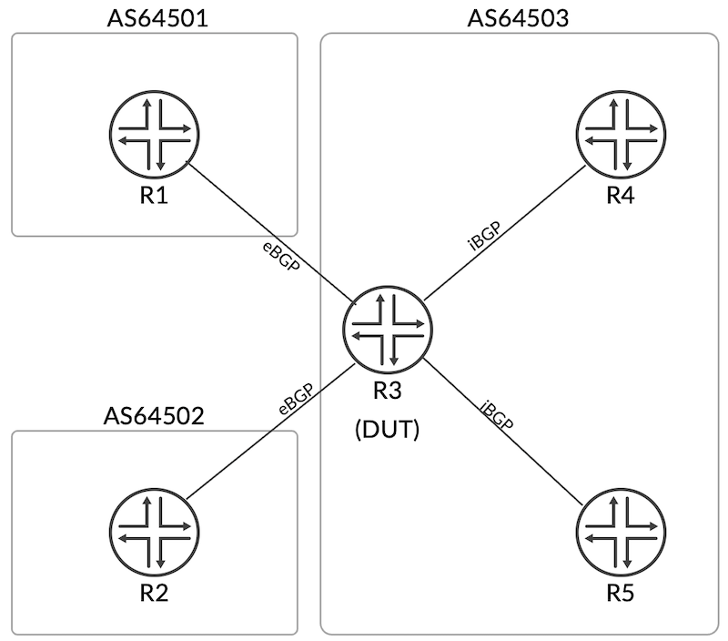

# Mastering Local AS - Default mode

**Juhie Mohan Motiani - 11/03/2025**

A detailed breakdown of the Default option for the local-AS setting in BGP on Juniper devices, showing how this mode influences AS-path prepending in both eBGP and iBGP peering. It covers configuration examples, route propagation scenarios, and illustrates how the local AS and global AS values are prepended differently depending on peer type.

## Introduction

This series of techpost will provide a comprehensive overview of the various BGP local AS configuration options available on Juniper devices. Local AS is a powerful feature used in scenarios such as network migrations, mergers, and acquisitions. It enables BGP sessions to present a local AS number instead of the global AS when establishing peerings. We will detail the behavior of each configuration option, covering both the iBGP and eBGP use cases. A summary table of AS paths of all the routes after each local AS option is included for quick reference and comparison.

Five local AS options are available, each catering to a range of use cases, from seamless network migrations to complex multi-homing scenarios:

- [Default](https://juniper.github.io/techposts/mastering-local-as-default-mode/article) (focus of this article)
- [Alias](https://juniper.github.io/techposts/mastering-local-as-alias-mode/article)
- [Private](https://juniper.github.io/techposts/mastering-local-as-private-mode/article)
- [No-Prepend-Global-AS](https://juniper.github.io/techposts/mastering-local-as-no-prepend-global-as/article)
- [Private No-Prepend-Global-AS](https://juniper.github.io/techposts/mastering-local-as-private-no-prepend-global-as/article)

These options allow network operators to modify AS path information, influencing how routes are perceived and propagated within and beyond their autonomous system. The following sections provide an in-depth exploration of the default option, highlighting its strengths and limitations.

## Default Option

Syntax*: **local-as <AS-number>***

The default local AS option allows a BGP session to peer on the local AS instead of the global AS. This is particularly useful in scenarios like ISP mergers or acquisitions, where the acquired network's routers need to appear as if they still belong to their original AS to maintain existing BGP peerings without requiring customers to change their configurations.

Example configuration:

```
protocols {
   bgp {
      group test {
         local-as 65551;
         neighbor <address> {
            peer-as 64501;
         }
      }
   }
}
```

Key behaviors:

1. Peer Establishment: BGP sessions use the local ASN in their OPEN message.
2. Local AS applied to eBGP peer:
  - Routes advertised from eBGP peers with local-as default configuration to other eBGP peers will have the global ASN and the local ASN prepended to the AS path.
  - Routes advertised from eBGP peers with local-as default configuration to iBGP peers will only have the local ASN number prepended to the AS path.
3. Local AS applied to iBGP peer:
  - Routes advertised from iBGP peers with local-as default configuration to eBGP peers will have the global ASN and local ASN prepended to the AS path.
  - Routes advertised from iBGP peers with local-as default configuration to iBGP peers will only have the local ASN prepended to the AS path.

## Scenario Overview

The primary goal of this document is to validate the behavior of the default local AS option and understand how the AS path is prepended or modified in different scenarios. It takes various route propagation scenarios into account and lists the expected AS path for each route.

## AS Path Verification Points

We examine the AS path in three distinct contexts:

1. Show route advertising-protocol output. Displays the AS path that will be advertised to the neighbor, including the AS numbers being prepended.
2. Actual BGP UPDATE message content (captured via traceoptions). Reflects the AS path as it appears within the real BGP UPDATE message sent to the peer.
3. Local routing table (RIB) representation. Shows the AS path stored in the local routing table prior to any AS path modifications.

Capturing both the show route advertising-protocol output and the actual BGP UPDATE message allows us to identify and analyze any discrepancies between the intended advertisement and the actual message transmitted.

## Topology

The example environment consists of five routers arranged in a star topology, with router R3 serving as the central node and Device Under Test (DUT). Each router's global AS number is indicated within the square boxes. This is the base topology and currently does not show local-as configuration. The local-as configuration will be applied on R3 (DUT) towards either R1 (eBGP) or R4 (iBGP), depending on the specific example scenario. For each example, the topology will indicate where local-as is applied and how the route propagates. This topology is purposefully designed to thoroughly evaluate various route propagation behaviors and to analyze the effects of local AS configurations in each context.



## Assumptions and Considerations

- R3 is the Device Under Test (DUT), and all observations are made through R3's lens.
- The local-as configuration is always applied on R3 (DUT) towards R1 for eBGP scenarios and towards R4 for iBGP scenarios.
- Local-as configuration is only applied towards one router (either R1 or R4) for a given eBGP/iBGP scenario.
- AS number 65551 refers to the Local AS, and AS number 64503 refers to the Global AS.
- The topology used in this document is only for educational purposes and should not be used as a reference for any other purpose.

## Configuration: Local AS Default configured towards eBGP peer (R1)

This example describes the behavior of the default local AS option when configured toward an eBGP peer. It examines the AS path across various route propagation scenarios, such as routes learned from an eBGP peer and advertised to an iBGP peer; routes learned from an eBGP peer and advertised to another eBGP peer, etc.

As seen in the following topology diagram, local AS 65551 is configured on R3 (DUT) towards R1 (eBGP). R3 peers with R1 using the local-as 65551. Therefore, the OPEN message sent to R1 by R3 contains the local AS number 65551.

```
R1                                      R4
[64501]                                 [64503]
(192.0.2.1/32)                          (192.0.2.4/32)
|                                       |
|  eBGP                       iBGP      |
|  (local-as 65551)                     |
+-------------+           +-------------+
              |           |
              |___    ____|
               ___  R3____
               (192.0.2.3/32)
              |  [64503]  |
              |           |
              |           |
+-------------+           +-------------+
|                                        |
|  eBGP                       iBGP       |
|                                        |
(192.0.2.2/32)                          (192.0.2.5/32)
R2                                      R5
[64502]                                 [64503]
```

The following five examples cover all the cases where local AS configuration in an eBGP setup impacts the AS path.

Please note that "*" in below examples marks the neighbor on which R3 (DUT) has the local-as configuration applied.

## Example 1: Route propagation from eBGP* (R1) to eBGP (R2)

This example describes the propagation of routes learned via eBGP from R1 to the eBGP peer R2, where R3 applies local AS default on its eBGP session with R1. R1 advertises its loopback address 192.0.2.1/32 to R3, which then re-advertises the prefix to R2.

*AS path of prefix 192.0.2.1/32 in the routing table inet.0 on R3:*

```
RE3# run show route 192.0.2.1

inet.0: 20 destinations, 20 routes (20 active, 0 holddown, 0 hidden)
+ = Active Route, - = Last Active, * = Both

192.0.2.1/32       *[BGP/170] 00:09:22, localpref 100
                      AS path: 64501 I, validation-state: unverified
                    >  to 198.51.100.1 via ge-0/0/0.0
```

*AS path of prefix 192.0.2.1/32 in the show route advertising-protocol output on R3:*

```
RE3# run show route advertising-protocol bgp 198.51.100.5 192.0.2.1 detail

inet.0: 20 destinations, 20 routes (20 active, 0 holddown, 0 hidden)
* 192.0.2.1/32 (1 entry, 1 announced)
 BGP group r2 type External
     Nexthop: Self
     AS path: 65551 64501 I
```

*AS path of prefix 192.0.2.1/32 in the BGP UPDATE message sent to R2:*

```
BGP SEND 198.51.100.6+179 -> 198.51.100.5+50375
BGP SEND message type 2 (Update) length 56
BGP SEND Update PDU length 56
BGP SEND flags 0x40 code Origin(1): IGP, length(1)
BGP SEND flags 0x40 code ASPath(2) (4-byte-cap) length 14: 64503 65551 64501
BGP SEND flags 0x40 code NextHop(3): 198.51.100.6 length(4)
End-of-Attributes
BGP SEND         192.0.2.1/32
```

Observe the difference between the AS path displayed in the "show advertising-protocol" output and the AS path present in the BGP UPDATE message. The final AS path received in R2's local RIB is 64503 65551 64501 I. This reflects that the route originated in AS 64501, was advertised to R3 (AS 65551), and subsequently propagated to R2 through R3's other interface associated with AS 64503.

## Example 2: Route propagation from eBGP* (R1) to iBGP (R4)

This example describes the propagation of routes learned via eBGP from R1 to the iBGP peer R4, where R3 applies a local AS default on its eBGP session with R1. R1 advertises its loopback address 192.0.2.1/32 to R3, which then re-advertises the prefix to R4.

*AS path of prefix 192.0.2.1/32 in the routing table inet.0 on R3:*

```
RE3# run show route 192.0.2.1

inet.0: 20 destinations, 20 routes (20 active, 0 holddown, 0 hidden)
+ = Active Route, - = Last Active, * = Both

192.0.2.1/32       *[BGP/170] 00:09:42, localpref 100
                      AS path: 64501 I, validation-state: unverified
                    >  to 198.51.100.1 via ge-0/0/0.0
```

*AS path of prefix 192.0.2.1/32 in the show route advertising-protocol output on R3:*

```
RE3# run show route advertising-protocol bgp 203.0.113.1 192.0.2.1 detail

inet.0: 20 destinations, 20 routes (20 active, 0 holddown, 0 hidden)
* 192.0.2.1/32 (1 entry, 1 announced)
 BGP group r4 type Internal
     Nexthop: Self
     Flags: Nexthop Change
     Localpref: 100
     AS path: 65551 64501 I
```

*AS path of prefix 192.0.2.1/32 in the BGP UPDATE message sent to R4:*

```
BGP SEND 203.0.113.2+179 -> 203.0.113.1+54678
BGP SEND message type 2 (Update) length 59
BGP SEND Update PDU length 59
BGP SEND flags 0x40 code Origin(1): IGP, length(1)
BGP SEND flags 0x40 code ASPath(2) (4-byte-cap) length 10: 65551 64501
BGP SEND flags 0x40 code NextHop(3): 203.0.113.2 length(4)
BGP SEND flags 0x40 code LocalPref(5): 100 length(4)
End-of-Attributes
BGP SEND         192.0.2.1/32
```

Note: Notice that unlike Example 1, we do not prepend the global AS to the AS path because we are advertising to an internal peer. For iBGP peerings we do not prepend the AS number because the iBGP routers belong to the same Autonomous System. The AS path is meant to reflect the sequence of Autonomous Systems (ASes) a route has traversed. Prepending the AS number within the same AS would be redundant and could cause routing loops or invalid routes.

## Example 3: Route propagation from DUT (R3) to eBGP* (R1)

This example examines the AS path of a direct/static route advertised to an eBGP peer. R3 advertises its loopback address 192.0.2.3/32 to R1.

*AS path of prefix 192.0.2.3/32 in the routing table inet.0 on R3:*

```
RE3# run show route 192.0.2.3 detail

inet.0: 20 destinations, 20 routes (20 active, 0 holddown, 0 hidden)
192.0.2.3/32 (1 entry, 1 announced)
      *Direct Preference: 0
               Next hop type: Interface, Next hop index: 0
               Address: 0x825dd14
               Next-hop reference count: 1
               Kernel Table Id: 0
               Next hop: via lo0.0, selected
               State: <Active Int>
               Local AS: 64503
               Age: 25:37
               Validation State: unverified
               Task: IF
               Announcement bits (2): 2-BGP_RT_Background 3-Resolve tree 1
               AS path: I
               Thread: junos-main
```

*The AS path of prefix 192.0.2.3/32 as shown in the output of the show route advertising-protocol command on R3:*

```
RE3# run show route advertising-protocol bgp 198.51.100.1 detail

inet.0: 20 destinations, 20 routes (20 active, 0 holddown, 0 hidden)
* 192.0.2.3/32 (1 entry, 1 announced)
 BGP group r1 type External
     Nexthop: Self
     AS path: [65551] I
The above output includes square brackets to indicate the AS number being prepended to the AS path before advertisement
```

*AS path of prefix 192.0.2.1/32 in the BGP UPDATE message sent to R1:*

```
BGP SEND 198.51.100.2+179 -> 198.51.100.1+60139
BGP SEND message type 2 (Update) length 48
BGP SEND Update PDU length 48
BGP SEND flags 0x40 code Origin(1): IGP, length(1)
BGP SEND flags 0x40 code ASPath(2) (4-byte-cap) length 6: 65551
BGP SEND flags 0x40 code NextHop(3): 198.51.100.2 length(4)
End-of-Attributes
BGP SEND         192.0.2.3/32
```

## Example 4: Route propagation from eBGP (R2) to eBGP* (R1)

This example describes the propagation of routes learned via eBGP from R2 to the eBGP peer R1, where R3 applies a local AS default on its eBGP session with R1. R2 advertises its loopback address 192.0.2.2/32 to R3, which then re-advertises the prefix to R1.

*AS path of prefix 192.0.2.2/32 in the routing table inet.0 on R3:*

```
RE3# run show route 192.0.2.2

inet.0: 20 destinations, 20 routes (20 active, 0 holddown, 0 hidden)
+ = Active Route, - = Last Active, * = Both

192.0.2.2/32       *[BGP/170] 00:04:55, localpref 100
                      AS path: 64502 I, validation-state: unverified
                    >  to 198.51.100.5 via ge-0/0/2.0
```

*AS path of prefix 192.0.2.2/32 in the show route advertising-protocol output on R3:*

```
RE3# run show route advertising-protocol bgp 198.51.100.1 192.0.2.2 detail

inet.0: 20 destinations, 20 routes (20 active, 0 holddown, 0 hidden)
* 192.0.2.2/32 (1 entry, 1 announced)
 BGP group r1 type External
     Nexthop: Self
     AS path: 64503 64502 I
```

*AS path of prefix 192.0.2.2/32 in the BGP UPDATE message sent to R1:*

```
BGP SEND 198.51.100.2+61033 -> 198.51.100.1+179
BGP SEND message type 2 (Update) length 56
BGP SEND Update PDU length 56
BGP SEND flags 0x40 code Origin(1): IGP, length(1)
BGP SEND flags 0x40 code ASPath(2) (4-byte-cap) length 14: 65551 64503 64502
BGP SEND flags 0x40 code NextHop(3): 198.51.100.2 length(4)
End-of-Attributes
BGP SEND         192.0.2.2/32
```

Keeping in mind that the AS path reflects the sequences of Autonomous Systems (ASes) a route has traversed, we see that both the local AS and the global AS are prepended to the AS path.

## Example 5: Route propagation from iBGP (R4) to eBGP* (R1)

This example describes the propagation of routes learned via iBGP from R4 to the eBGP peer R1, where R3 applies a local AS default on its eBGP session with R1. R4 advertises its loopback address 192.0.2.4/32 to R3, which then re-advertises the prefix to R1.

*AS path of prefix 192.0.2.4/32 in the routing table inet.0 on R3:*

```
RE3# run show route 192.0.2.4

inet.0: 20 destinations, 20 routes (20 active, 0 holddown, 0 hidden)
+ = Active Route, - = Last Active, * = Both

192.0.2.4/32       *[BGP/170] 00:01:49, localpref 100
                      AS path: I, validation-state: unverified
                    >  to 203.0.113.1 via ge-0/0/4.0
```

*AS path of prefix 192.0.2.4/32 in the show route advertising-protocol output on R3:*

```
RE3# run show route advertising-protocol bgp 198.51.100.1 192.0.2.4 detail

inet.0: 20 destinations, 20 routes (20 active, 0 holddown, 0 hidden)
* 192.0.2.4/32 (1 entry, 1 announced)
 BGP group r1 type External
     Nexthop: Self
     AS path: 64503 I
```

*AS path of prefix 192.0.2.4/32 in the BGP UPDATE message sent to R1:*

```
BGP SEND 198.51.100.2+59702 -> 198.51.100.1+179
BGP SEND message type 2 (Update) length 52
BGP SEND Update PDU length 52
BGP SEND flags 0x40 code Origin(1): IGP, length(1)
BGP SEND flags 0x40 code ASPath(2) (4-byte-cap) length 10: 65551 64503
BGP SEND flags 0x40 code NextHop(3): 198.51.100.2 length(4)
End-of-Attributes
BGP SEND         192.0.2.4/32
```

Similar to Example 4, we see that both the global AS and the local AS are prepended to the AS path before advertisement.

## Default local AS Option Behavior for an eBGP Peer

| Route Direction(S -> DUT -> D) | As PathLocal RIB | AS Path(show adv to "D") | UPDATE MESSAGEto "D" | ASPATH_PREPENDby DUT |
|:--|:--|:--|:--|:--|
| R1 -> R3 -> R2 | 64501 I | 65551 64501 I | 64503 65551 64501 I | Global-as, Local-as |
| R1 -> R3 -> R4 | 64501 I | 65551 64501 I | 65551 64501 I | Local-as |
| R3 -> R1 | I | [65551] I | 65551 I | Local-as |
| R2 -> R3 -> R1 | 64502 I | 64503 64502 I | 65551 64503 64502 I | Local-as, Global-as |
| R4 -> R3 -> R1 | I | 64503 I | 65551 64503 I | Local-as, Global-as |

## Configuration: Local AS Default configured towards iBGP peer (R1)

```
R1                                      R4
[64501]                                 [64503]
(192.0.2.1/32)                          (192.0.2.4/32)
|                                       |
|  eBGP                       iBGP      |
|                              (local-as 65551)
+-------------+           +-------------+
              |           |
              |___    ____|
               ___  R3____
               (192.0.2.3/32)
              |  [64503]  |
              |           |
              |           |
+-------------+           +-------------+
|                                        |
|  eBGP                       iBGP       |
|                                        |
(192.0.2.2/32)                          (192.0.2.5/32)
R2                                      R5
[64502]                                 [64503]
```

The following five example scenarios cover all the cases where local AS configuration in an iBGP setup impacts the AS path.

## Example 1: Route propagation from iBGP* (R4) to eBGP (R1)

This example describes the propagation of routes learned via iBGP from R4 to the eBGP peer R1, where R3 applies a local AS default on its iBGP session with R4. R4 advertises its loopback address 192.0.2.4/32 to R3, which then re-advertises the prefix to R1.

*AS path of prefix 192.0.2.4/32 in the routing table inet.0 on R3:*

```
RE3# run show route 192.0.2.4

inet.0: 20 destinations, 20 routes (20 active, 0 holddown, 0 hidden)
+ = Active Route, - = Last Active, * = Both

192.0.2.4/32       *[BGP/170] 00:14:28, localpref 100
                      AS path: I, validation-state: unverified
                    >  to 203.0.113.1 via ge-0/0/4.0
```

*AS path of prefix 192.0.2.4/32 in the show route advertising-protocol output on R3:*

```
RE3# run show route advertising-protocol bgp 198.51.100.1 192.0.2.4 detail

inet.0: 20 destinations, 20 routes (20 active, 0 holddown, 0 hidden)
* 192.0.2.4/32 (1 entry, 1 announced)
 BGP group r1 type External
     Nexthop: Self
     AS path: 65551 I
```

*AS path of prefix 192.0.2.4/32 as seen in the BGP UPDATE message sent to R1:*

```
BGP SEND 198.51.100.2+50559 -> 198.51.100.1+179
BGP SEND message type 2 (Update) length 52
BGP SEND Update PDU length 52
BGP SEND flags 0x40 code Origin(1): IGP, length(1)
BGP SEND flags 0x40 code ASPath(2) (4-byte-cap) length 10: 64503 65551
BGP SEND flags 0x40 code NextHop(3): 198.51.100.2 length(4)
End-of-Attributes
BGP SEND         192.0.2.4/32
```

Both the global AS and the local AS will be prepended to the AS path before advertisement. Also, note the discrepancy between the outputs for "show route advertising-protocol" and the actual BGP UPDATE message.

## Example 2: Route propagation from iBGP* (R4) to iBGP (R5)

This example describes the propagation of routes learned via iBGP from R4 to the iBGP peer R5, where R3 applies a local AS default on its iBGP session with R4. R4 advertises its loopback address 192.0.2.4/32 to R3, which then re-advertises the prefix to R5.

*AS path of prefix 192.0.2.4/32 in the routing table inet.0 on R3:*

```
RE3# run show route 192.0.2.4

inet.0: 20 destinations, 20 routes (20 active, 0 holddown, 0 hidden)
+ = Active Route, - = Last Active, * = Both

192.0.2.4/32       *[BGP/170] 00:01:28, localpref 100
                      AS path: I, validation-state: unverified
                    >  to 203.0.113.1 via ge-0/0/4.0
```

*AS path of prefix 192.0.2.4/32 in the show route advertising-protocol output on R3:*

```
RE3# run show route advertising-protocol bgp 203.0.113.5 192.0.2.4 detail

inet.0: 20 destinations, 20 routes (20 active, 0 holddown, 0 hidden)
* 192.0.2.4/32 (1 entry, 1 announced)
 BGP group r5 type Internal
     Nexthop: Self
     Flags: Nexthop Change
     Localpref: 100
     AS path: 65551 I
     Cluster ID: 192.0.2.3
     Originator ID: 192.0.2.4
```

*AS path of prefix as seen in the BGP UPDATE message sent to R5:*

```
BGP SEND 203.0.113.6+179 -> 203.0.113.5+51201
BGP SEND message type 2 (Update) length 69
BGP SEND Update PDU length 69
BGP SEND flags 0x40 code Origin(1): IGP, length(1)
BGP SEND flags 0x40 code ASPath(2) (4-byte-cap) length 6: 65551
BGP SEND flags 0x40 code NextHop(3): 203.0.113.6 length(4)
BGP SEND flags 0x40 code LocalPref(5): 100 length(4)
BGP SEND flags 0x80 code Originator_Id(9) 192.0.2.4 length(4)
BGP SEND flags 0x80 code Cluster_List(10): length(4) 192.0.2.3
End-of-Attributes
BGP SEND         192.0.2.4/32
```

## Example 3: Route propagation from DUT (R3) to iBGP* (R4)

This example examines the AS path of a direct/static route advertised to an iBGP peer. R3 advertises its loopback address 192.0.2.3/32 to R4.

*AS path of prefix 192.0.2.3/32 in the routing table inet.0 on R3:*

```
RE3# run show route 192.0.2.3 detail

inet.0: 20 destinations, 20 routes (20 active, 0 holddown, 0 hidden)
192.0.2.3/32 (1 entry, 1 announced)
        *Direct Preference: 0
                Next hop type: Interface, Next hop index: 0
                Address: 0x825dd14
                Next-hop reference count: 1
                Kernel Table Id: 0
                Next hop: via lo0.0, selected
                State: <Active Int>
                Local AS: 64503
                Age: 1:30:25
                Validation State: unverified
                Task: IF
                Announcement bits (1): 3-Resolve tree 1
                AS path: I
                Thread: junos-main
```

*AS path of prefix 192.0.2.3/32 in the show route advertising-protocol output on R3:*

```
RE3# run show route advertising-protocol bgp 203.0.113.1 192.0.2.3 detail

inet.0: 20 destinations, 20 routes (20 active, 0 holddown, 0 hidden)
* 192.0.2.3/32 (1 entry, 1 announced)
 BGP group r4 type Internal
     Nexthop: Self
     Localpref: 100
     AS path: [65551] I
```

*AS path of prefix 192.0.2.3/32 as seen in the BGP UPDATE message sent to R4:*

```
BGP SEND 203.0.113.2+179 -> 203.0.113.1+64378
BGP SEND message type 2 (Update) length 49
BGP SEND Update PDU length 49
BGP SEND flags 0x40 code Origin(1): IGP, length(1)
BGP SEND flags 0x40 code ASPath(2) (4-byte-cap) length 0: <null>
BGP SEND flags 0x40 code NextHop(3): 203.0.113.2 length(4)
BGP SEND flags 0x40 code LocalPref(5): 100 length(4)
End-of-Attributes
BGP SEND         192.0.2.3/32
```

Notice that the AS path shown in the actual BGP UPDATE message is <null> indicating that no AS is prepended when sending routes to an internal BGP peer. Also, note the discrepancy in the show advertise command which indicates that the local AS will be prepended to the AS path.

## Example 4: Route propagation from eBGP (R1) to iBGP* (R4)

This example describes the propagation of routes learned via eBGP from R1 to the iBGP peer R4, where R3 applies a local AS default on its iBGP session with R4. R1 advertises its loopback address 192.0.2.1/32 to R3, which then re-advertises the prefix to R4.

*AS path of prefix 192.0.2.1/32 in the routing table inet.0 on R3:*

```
RE3# run show route 192.0.2.1

inet.0: 20 destinations, 20 routes (20 active, 0 holddown, 0 hidden)
+ = Active Route, - = Last Active, * = Both

192.0.2.1/32       *[BGP/170] 00:01:39, localpref 100
                      AS path: 64501 I, validation-state: unverified
                    >  to 198.51.100.1 via ge-0/0/0.0
```

*AS path of prefix 192.0.2.1/32 in the show route advertising-protocol output on R3:*

```
RE3# run show route advertising-protocol bgp 203.0.113.1 192.0.2.1 detail

inet.0: 20 destinations, 20 routes (20 active, 0 holddown, 0 hidden)
* 192.0.2.1/32 (1 entry, 1 announced)
 BGP group r4 type Internal
     Nexthop: Self
     Flags: Nexthop Change
     Localpref: 100
     AS path: 64503 64501 I
```

*AS path of prefix 192.0.2.1/32 as seen in the BGP UPDATE message sent to R4:*

```
BGP SEND 203.0.113.2+179 -> 203.0.113.1+54557
BGP SEND message type 2 (Update) length 59
BGP SEND Update PDU length 59
BGP SEND flags 0x40 code Origin(1): IGP, length(1)
BGP SEND flags 0x40 code ASPath(2) (4-byte-cap) length 10: 64503 64501
BGP SEND flags 0x40 code NextHop(3): 203.0.113.2 length(4)
BGP SEND flags 0x40 code LocalPref(5): 100 length(4)
End-of-Attributes
BGP SEND         192.0.2.1/32
```

In this particular example, R3 and R4 peer on the local AS and are internal peers. Since they are internal peers, only the global AS is prepended as it is seen as an external segment. The local AS 65551 is not prepended as iBGP peers do not prepend their Autonomous Systems (ASes) to the AS path.

## Example 5: Route propagation from iBGP (R5) to iBGP* (R4)

This example describes the propagation of routes learned via iBGP from R5 to the iBGP peer R4, where R3 applies a local AS default on its iBGP session with R4. R5 advertises its loopback address 192.0.2.5/32 to R3, which then re-advertises the prefix to R4.

*AS path of prefix 192.0.2.5/32 in the routing table inet.0 on R3:*

```
RE3# run show route 192.0.2.5

inet.0: 20 destinations, 20 routes (20 active, 0 holddown, 0 hidden)
+ = Active Route, - = Last Active, * = Both

192.0.2.5/32       *[BGP/170] 00:01:12, localpref 100
                      AS path: I, validation-state: unverified
                    >  to 203.0.113.5 via ge-0/0/6.0
```

*AS path of prefix 192.0.2.5/32 in the show route advertising-protocol output on R3:*

```
RE3# run show route advertising-protocol bgp 203.0.113.1 192.0.2.5 detail

inet.0: 20 destinations, 20 routes (20 active, 0 holddown, 0 hidden)
* 192.0.2.5/32 (1 entry, 1 announced)
 BGP group r4 type Internal
     Nexthop: Self
     Flags: Nexthop Change
     Localpref: 100
     AS path: 64503 I
     Cluster ID: 192.0.2.3
     Originator ID: 192.0.2.5
```

*AS path of prefix 192.0.2.5/32 as seen in the BGP UDPATE message sent to R4:*

```
BGP SEND 203.0.113.2+179 -> 203.0.113.1+53624
BGP SEND message type 2 (Update) length 69
BGP SEND Update PDU length 69
BGP SEND flags 0x40 code Origin(1): IGP, length(1)
BGP SEND flags 0x40 code ASPath(2) (4-byte-cap) length 6: 64503
BGP SEND flags 0x40 code NextHop(3): 203.0.113.2 length(4)
BGP SEND flags 0x40 code LocalPref(5): 100 length(4)
BGP SEND flags 0x80 code Originator_Id(9) 192.0.2.5 length(4)
BGP SEND flags 0x80 code Cluster_List(10): length(4) 192.0.2.3
End-of-Attributes
BGP SEND         192.0.2.5/32
```

## Default local AS Option Behavior for an iBGP Peer

| Route Direction(S -> DUT -> D) | As PathLocal RIB | AS Path(show adv to "D") | UPDATE MESSAGEto "D" | ASPATH_PREPENDby DUT |
|:--|:--|:--|:--|:--|
| R4 -> R3 -> R1 | I | 65551 I | 64503 65551 I | Global-as, Local-as |
| R4 -> R3 -> R5 | I | 65551 I | 65551 I | Local-as |
| R3 -> R4 | I | [65551] I | <null> |  |
| R1 -> R3 -> R4 | 64501 I | 64503 64501 I | 64503 64501 I | Global-as |
| R5 -> R3 -> R4 | I | 64503 I | 64503 I | Global-as |

## Conclusion

This article covered the details of **Default Local AS option**, please check the articles in the section below for the other options.

## Useful links

Local-AS options articles:

- [Default](https://juniper.github.io/techposts/mastering-local-as-alias-mode/article)
- [Alias](https://juniper.github.io/techposts/mastering-local-as-alias-mode/article)
- [Private](https://juniper.github.io/techposts/mastering-local-as-private-mode/article)
- [No-Prepend-Global-AS](https://juniper.github.io/techposts/mastering-local-as-no-prepend-global-as/article)
- [Private No-Prepend-Global-AS](https://juniper.github.io/techposts/mastering-local-as-private-no-prepend-global-as/article)

## Glossary

- AS(N): Autonomous System (Number)
- BGP: Border Gateway Protocol
- DUT: Device Under Test
- ISP: Internet Service Provider
- RIB: Routing Information Base

## Comments

If you want to reach out for comments, feedback or questions, drop us an email at:
