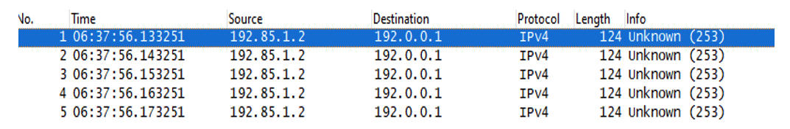
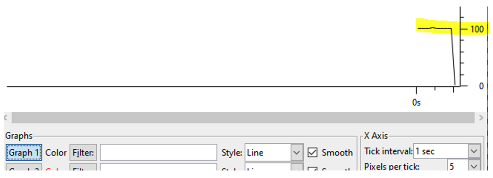
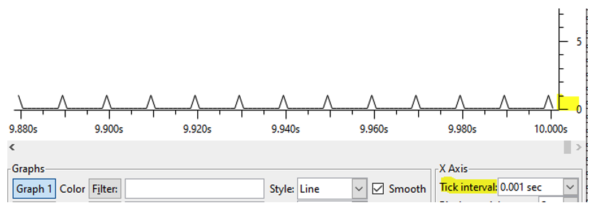
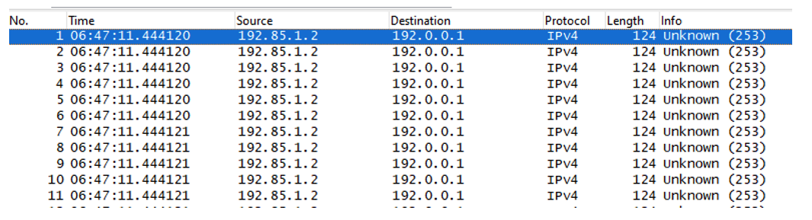
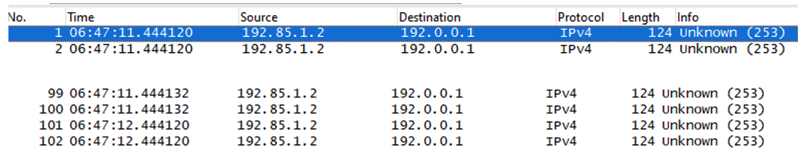
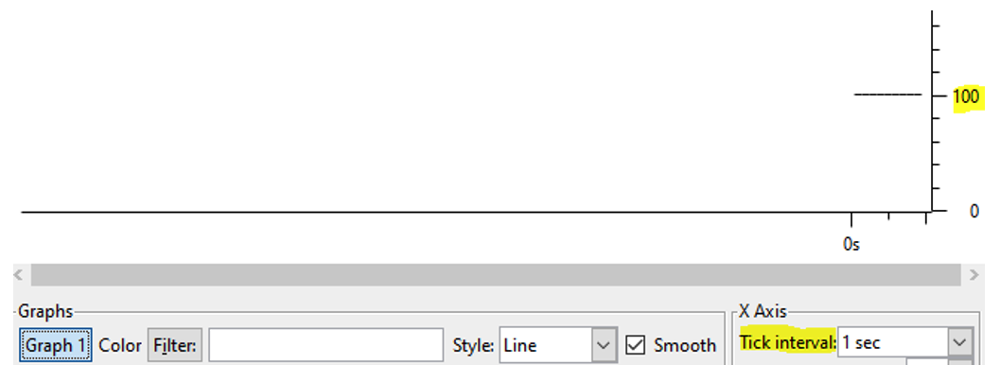
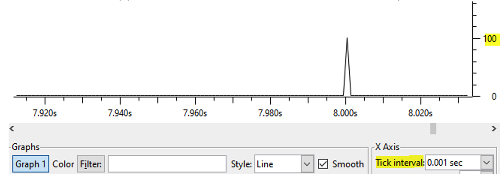
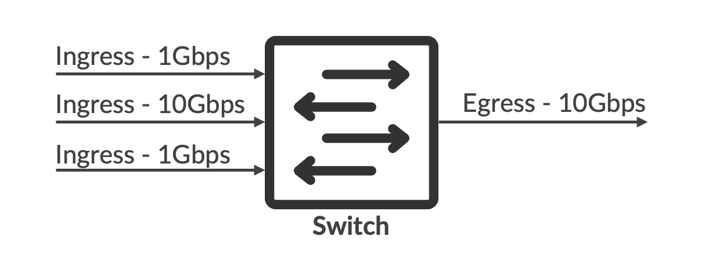
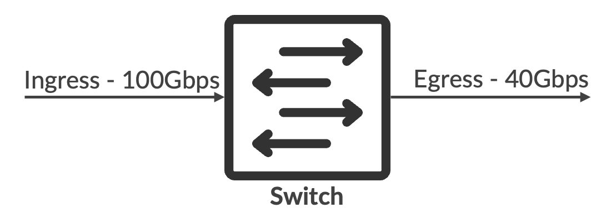

# Microburst Detection and Avoidance on QFX5k

**Parthipan Ts - 08/22/2025**

A comprehensive overview of microbursts and their impact on network performance, with a focus on Juniper's QFX5K EVO platforms (QFX5220, QFX5130, QFX5230, and QFX5240).

## Introduction

In this article, we'll define microbursts and illustrate typical network topologies where they are likely to occur. Then, we'll explore the performance and reliability issues that microbursts can cause. We'll outline methods for identifying microburst events on QFX5K devices, followed by a brief explanation of the platform's buffering architecture and how it contributes to microburst handling. Finally, we will offer practical recommendations to mitigate and resolve microburst-related issues on QFX5K switches.

### What is a Microburst?

Microburst is a traffic pattern in a network where packets arrive in short, intense bursts over a very brief time interval, ranging from a few microseconds to nanoseconds, depending on the port speed. Since these bursts are transient and do not persist for long durations, detecting their presence becomes challenging using standard interface statistics, which typically average traffic over one-second or multi-second intervals.

The section below proposes packet captures to clearly differentiate microbursts of traffic vs linear rate traffic on a port.

Table: Time required to transmit packets for different port speeds 

| PortSpeed(Gbps) | Time to Transmit 1Byte (uSec) | Packet Size (Bytes) | Inter Frame Gap (Bytes) | Preamble(Bytes) | Packet Size(L1 in Bytes) | Time to Transmit Packet (uSec) | Number of Packets | Time to Transmit all Packets |
|:--|:--|:--|:--|:--|:--|:--|:--|:--|
| 1 | 0.008 | 128 | 12 | 8 | 148 | 1.184 | 100 | 118.4 |
| 10 | 0.0008 | 128 | 12 | 8 | 148 | 0,1184 | 100 | 11.84 |
| 40 | 0.0002 | 128 | 12 | 8 | 148 | 0.0296 | 100 | 2.96 |
| 100 | 0.00008 | 128 | 12 | 8 | 148 | 0,01184 | 100 | 1.184 |

The chart above presents the calculation of the packet transmission time required for sending 100 packets, each 128 bytes in size, across various port speeds. It demonstrates that such bursts can be transmitted within just a few microseconds. The transmission time reduces as the port speed increases. This extremely short time window makes it difficult to observe or monitor traffic rates using conventional tools, which typically operate on longer sampling intervals.

The packet captures below illustrate the time gap between individual packets in two scenarios:

- **Burst transmission**, where packets are sent in quick succession
- **Linear-rate transmission**, where packets are spaced evenly

Condition:

- **Port Speed**: 10 Gbps
- **Burst Sample**: 100 packets
- **Packet Size**: 128 Bytes



In the capture shown above, the time gap between each packet is observed to be 10 milliseconds. This is because a total of 100 packets are transmitted over a span of 1 second, resulting in an average inter-packet interval of:

`1000 ms / 100 packets = 10 ms per packet`

Although all 100 packets are technically received within a one-second window, the traffic appears as a burst when viewed from a higher time resolution perspective. Each packet is spaced by approximately 10 ms, but when visualized at microsecond granularity, it becomes clear that the packets arrive in a short, concentrated burst.

To illustrate this further, two different views of the same packet stream are provided below:

- **1-second interval view**: Gives an averaged, coarse-grained representation
- **1-millisecond interval view**: Reveals more finer-grained distribution and better highlights the burst nature of the traffic





In the 1-sec view (figure 2), we see 100 packets per second, at a linear rate.  When we zoom in on the 1msec view (figure 3), it is evident that we have one packet sent each 10mSec interval (seen as a spike).

**Burst traffic**:



In the above bursty scenario capture, there are tens of packets in the same microsecond time frame, unlike linear traffic where packets are exactly 10 milliseconds apart.



Total time taken to transmit all 100 packets is (444132 -- 444120 = ~12msec), matching the 11.84msec that was calculated for 10Gbps speed (Table 1 above). We observe that the 101st packet is transmitted almost one second after the 100th packet. That means: after 100 packets at line rate, there is a gap of one second before transmitting another burst.

In real network deployments, the gap between each burst could also be very low, a few milliseconds, causing bursts in very short spans.



No difference seen in the 1sec view for linear rate vs burst traffic, both showing 100 packets/Sec: it is difficult to identify the presence of burst at 1sec interval as indicated initially.



But in the 1msec view, it appears clearly as one spike of 100 packets and no packets before or after. It indicates that packets are received as one burst at that specific millisecond and no packets were present the rest of the time (unlike the previous linear rate scenario with one packet every 10 milliseconds).

## Issues Due to Microburst Presence

Since microbursts occur over an extremely short time span, they become particularly problematic in oversubscription scenarios:

- When multiple ingress ports send traffic to a single egress port,
- When the total ingress rate exceeds the egress port's capacity.

In such cases, the switch transmits packets at the rate the egress port can handle, while the excess packets are temporarily buffered in the switch's packet buffer and transmitted later.

This buffering scenario can lead to several issues:

### Latency and Jitter

When packets are buffered and transmitted with delay, a temporal gap is introduced between packet reception and transmission. This causes latency, and the inconsistent delay between packets leads to jitter, severely impacting time-sensitive applications such as voice and video.

### Congestion and Packet Drops

QFX-5K switches have a shallow buffer architecture, meaning they can store only a limited number of packets. When the buffer capacity is exhausted, the switch begins to drop packets.

In some cases, applications may perceive this as out-of-order delivery, especially when early packets in a flow are dropped and later ones are transmitted.

With switch interface statistics collection typically averaging over 1-second intervals, the traffic rate may appear well below the egress port's capacity and give a false sense of normalcy. However, despite the low average rate, packet drops are still observed.

This discrepancy arises because the microburst traffic, when viewed in higher time resolution, actually arrives at full line rate for very short durations. The switch's buffer and egress port cannot handle this instantaneous rate, leading to transient congestion and packet loss.

## Sample Oversubscribed Topologies

This section describes a couple of oversubscribed topologies, susceptible to experiencing the issues described in the previous section.



In Figure 8, three ingress ports with a combined bandwidth of 12 Gbps send traffic to a single 10 Gbps egress port. Although this setup is only slightly oversubscribed, issues can appear when the 10 Gbps port sends traffic in bursts while one of the 1 Gbps ingress ports is also active, leading to buffering.

In real-world scenarios, control packets are sometimes observed as periodic bursts, every few milliseconds, on the 10 Gbps port. This can cause packet drops, even though interface statistics may show the average ingress rate as much lower than the port's capacity. Customers may misinterpret this by focusing only on the 1-second average rate, assuming the switch is struggling to handle low traffic volumes.

However, the actual problem lies in traffic bursts, which aren't easily visible in standard traffic statistics.



This is another example of the same topology, but with a 1:1 mapping between the ingress and egress ports. However, since the ingress port has a higher bandwidth than the egress port, packet buffering occurs.

As shown in Table 1, a 100 Gbps port takes approximately 1.184 milliseconds to transmit 100 packets, while a 40 Gbps port takes around 2.96 milliseconds for the same number of packets. When the 100 Gbps port sends burst traffic, the 40 Gbps egress port is unable to keep up, resulting in packet buffering.

## Buffering Model in QFX-5K Platforms

The QFX-5K are Broadcom-based platforms with shallow buffer. All chipsets follow a similar packet admission control mechanism, which is briefed in this section.

For any packet to be admitted into the system, there are 2 levels of admission control:

### Ingress Admission Control

It makes sure each receiving port has enough allowed buffers to store/transmit packets. One particular ingress port doesn't occupy the full buffer, and the available limited buffer space is fairly distributed among all the ports.

When a packet fails ingress admission control checks, it gets dropped and is accounted as a drop on the ingress ports. Such packet drops can be seen on the Juniper platform as resource errors in ingress statistics. Below CLI can be used to display such errors:

```
root@qfx5k> show interfaces <interface> extensive

Input errors:
    Errors: 0, Drops: 0, Framing errors: 0, Runts: 0, Policed discards: 0, L3 incompletes: 0,
    L2 channel errors: 0, L2 mismatch timeouts: 0, FIFO errors: 0, Resource errors: 0
  Output errors:
    Carrier transitions: 18, Errors: 0, Drops: 61790002516, Collisions: 0, Aged packets: 0, FIFO errors: 0,
    HS link CRC errors: 0, MTU errors: 0, Resource errors: 0
```

### Egress Admission Control

Similar to ingress admission control, egress admission control runs checks to make sure the egress port is not overutilizing available buffer space and has enough buffers to transmit packets.

Egress admission control is done on a per-port per-queue basis: on a specific port, a particular queue can pass admission control while others can fail (if one reaches its threshold while the other doesn't).

Packets dropped due to egress admission control failure are accounted under the egress port's queue, where the packet is expected to be transmitted. Such errors can be seen under queue drops statistics, as illustrated with the CLI below:

```
root@qfx5k> show interfaces queue <interface>

Queue: 0, Forwarding classes: best-effort
  Queued:
    Packets              :          153317658467                     0 pps
    Bytes                :        19258549659972                     0 bps
  Transmitted:
    Packets              :           91527655951                     0 pps
    Bytes                :        11349429337924                     0 bps
    Tail-dropped packets : Not Available
    RL-dropped packets   :                     0                     0 pps
    RL-dropped bytes     :                     0                     0 bps
    Total-dropped packets:           61790002516                     0 pps
    Total-dropped bytes  :         7909120322048                     0 bps
```

Refer to the blog post for QFX5K buffer architecture in detail for different platforms: [https://juniper.github.io/techposts/qfx5k-series-switches-packet-buffer-architecture/article](https://juniper.github.io/techposts/qfx5k-series-switches-packet-buffer-architecture/article)

## Identifying Microburst Scenario

### Buffer monitoring

One of the key indicators of microbursts is the peak buffer utilization observed on ports experiencing them. Continuously monitoring peak buffer usage can help identify microbursts effectively. On switches operating in store-and-forward mode, even under consistent line-rate traffic, only minimal buffer usage is expected.

Typically, the nominal peak buffer utilization is around 3KB per queue. Any value significantly above this may indicate either a microburst (if the average traffic rate is below the line rate) or congestion (if the average rate exceeds the line rate).

Switches provide built-in buffer monitoring features to collect peak buffer utilization data. These can be used to detect the presence of microbursts before resorting to external tools for deeper flow analysis. While these features do not pinpoint the exact flow responsible for the burst, they can confirm whether a specific port or queue experienced buffer utilization, indicating traffic exceeding the egress port's capacity at that moment.

QFX5K switches support two types of buffer monitoring mechanisms. The first is through the JVision Qmon-SW sensor, and the second uses CLI-based show buffer-occupancy commands. Both methods provide the same underlying data, differing only in how the information is gathered and presented. The following sections will provide more details about these two monitoring methods.

### Jvison Qmon-SW Sensor

With Jvision Qmon-sw sensor enabled, the switch periodically pushes the peak buffer utilization data to external collectors. Minimum interval is 2 seconds. In this case, every 2 seconds, the peak buffer utilization of all the queues within that 2-second interval, along with total transmitted and dropped packets, are exported to external servers. Jvision can export data only for specific ports of interest.

Data collected by the server can be utilized to monitor buffer utilization and to identify burstiness. Each streamed sample of data indicates the maximum buffer utilization from the last sample to the current sample, i.e., what was the maximum buffer utilized in these two seconds.

In Jvision, all the data is exported in key-value pairs. Qmon-sw sensor exports the following key values.

| Field | Brief Description |
|:--|:--|
| Interface name | Junos interface name |
| queue_number | Software queue number for each queue within an interface |
| peak_buffer_occupancy_bytes | Maximum buffers used by each queue within the export interval (min 2 secs) |
| Peak buffer occupancy percent | Peak buffer utilization value in terms of percent of maximum allowed buffer for each queue. |
| packets | Number of total transmitted packets for each queue from the interface creation time. |
| octets | Number of total transmitted bytes for each queue from the interface creation time. |
| tail_drop_packets | Number of total dropped packets for each queue from the interface creation time. |
| tail_drop_octets | Number of total dropped bytes for each queue from the interface creation time. |

Qmon-sw sensor data can be exported either via GRPC streaming or UDP streaming.

### GRPC Streaming

With gRPC streaming, sensors are configured from external servers.

Configuration required on the switch:

```
set system services extension-service request-response grpc clear-text port 50051
set system services extension-service request-response grpc skip-authentication
set system services extension-service notification allow-clients address 0.0.0.0/0
set system services extension-service request-response grpc max-connections 8
```

### UDP Streaming

With UDP streaming, sensors should be configured directly from the CLI.

Config needed on the switch:

```
set services analytics streaming-server jvision-server remote-address 50.1.1.2
set services analytics streaming-server jvision-server remote-port 2001
set services analytics export-profile export-common local-address 50.1.1.1
set services analytics export-profile export-common local-port 1000
set services analytics export-profile export-common reporting-rate 2
set services analytics export-profile export-common format gpb
set services analytics export-profile export-common transport udp
set services analytics sensor queue-stats server-name jvision-server
set services analytics sensor queue-stats export-name export-common
set services analytics sensor queue-stats resource /junos/system/linecard/qmon-sw/
```

### Buffer-monitoring CLI

Another feature is available in the switch to enable buffer monitoring and monitor the buffer peak utilization via CLI. This data shows the peak buffer utilization on a port from the last moment this CLI was executed to the current time.

At "t1", the CLI is executed to monitor buffer utilization, and when the same command is executed at "t2", it gives the peak buffer utilization between "t1" and "t2".

The following configuration is to be applied to enable buffer monitoring on the device.

```
set chassis fpc 0 traffic-manager buffer-monitor-enable
```

Below is the command to display buffer utilization on a port:

```
show interfaces queue buffer-occupancy <interface>
```

Without an interface name, the buffer occupancy will be displayed for all interfaces.

Sample output:

```
root@qfx5k> show interfaces queue buffer-occupancy xe-0/0/2:3
Physical interface: xe-0/0/2:3, Enabled, Physical link is Up
  Interface index: 653, SNMP ifIndex: 543
Forwarding classes: 12 supported, 5 in use
Egress queues: 10 supported, 5 in use
            Queue: 0, Forwarding classes: best-effort
                Queue-depth bytes  :
                Peak               : 467168
            Queue: 3, Forwarding classes: fcoe
                Queue-depth bytes  :
                Peak               : 0
            Queue: 4, Forwarding classes: no-loss
                Queue-depth bytes  :
                Peak               : 0
            Queue: 7, Forwarding classes: network-control
                Queue-depth bytes  :
                Peak               : 0
            Queue: 8, Forwarding classes: mcast
                Queue-depth bytes  :
                Peak               : 0
```

In the above output for port xe-0/0/2:3 indicates that the best-effort queue has used buffers while other queues did not use any buffers.

```
root@qfx5k> show interfaces queue xe-0/0/2:3
Physical interface: xe-0/0/2:3, Enabled, Physical link is Up
  Interface index: 653, SNMP ifIndex: 543
Forwarding classes: 12 supported, 5 in use
Egress queues: 10 supported, 5 in use
Queue: 0, Forwarding classes: best-effort
  Queued:
    Packets              :          155071773070              16895448 pps
    Bytes                :        19480982096868           17139622464 bps
  Transmitted:
    Packets              :           92051220159               5041385 pps
    Bytes                :        11414351304676            5001055344 bps
    Tail-dropped packets : Not Available
    RL-dropped packets   :                     0                     0 pps
    RL-dropped bytes     :                     0                     0 bps
    Total-dropped packets:           63020552911              11854063 pps
    Total-dropped bytes  :         8066630792192           12138567120 bps
```

Queue statistics indicate that packets are getting dropped on the best-effort queue and buffer utilization.

Once a microburst is identified on the egress ports using the above commands, the following commands can be used additionally to find out the ingress port that is receiving the microburst and passing it to the egress port.

```
show interfaces priority-group buffer-occupancy <ingress port>
```

If the ingress port is not mentioned , data will be displayed for all the ports.

```
root@qfx5k> show interfaces priority-group buffer-occupancy xe-0/0/4
Physical interface: xe-0/0/4, Enabled, Physical link is Up
  Interface index: 651, SNMP ifIndex: 516
            PG: 0
                PG-Utilization bytes  :
                Peak               : 0
            PG: 1
                PG-Utilization bytes  :
                Peak               : 0
            PG: 2
                PG-Utilization bytes  :
                Peak               : 0
            PG: 3
                PG-Utilization bytes  :
                Peak               : 0
            PG: 4
                PG-Utilization bytes  :
                Peak               : 0
            PG: 5
                PG-Utilization bytes  :
                Peak               : 0
            PG: 6
                PG-Utilization bytes  :
                Peak               : 0
            PG: 7
                PG-Utilization bytes  :
                Peak               : 661024      <<< Indicates ingress port peak buffer utilization
```

### Packet Capture and External Tools Like Wireshark

One of the most effective ways to identify microburst scenarios is through packet captures and I/O graphs, as demonstrated in the initial section of this document. These graphs provide visibility into traffic patterns at microsecond-level granularity, enabling the detection of bursty behaviour. Additionally, analysis tools can parse the captured packets to pinpoint the specific flow responsible for the burst among all captured traffic.

In typical network deployments, not all flows exhibit bursty behaviour---bursts are often caused by specific applications. Identifying such flows using I/O graphs or external analysis tools (which are not available directly on the switch) can help diagnose and resolve these issues.

However, this approach has some limitations. In real-world deployments, it may not be feasible to capture the entire packet stream due to tool availability or resource constraints. This becomes particularly challenging in high-throughput environments, where it is difficult to trace which specific flow caused the microburst.

## Recommendations to Avoid Microburst Impact

### Classification and Scheduling of Bursty Traffic to Priority Queue

Once the bursty flow is identified, traffic classification can be applied to steer this flow to a specific output queue. By assigning the bursty traffic to a dedicated queue, you can configure that queue with higher bandwidth and additional buffer resources, ensuring that these packets have sufficient space during bursts and are transmitted with minimal delay.

Traffic classification enables targeted handling by mapping specific flows to appropriate priority queues. Once classified, scheduler parameters can be applied to allocate more buffers and control the queue's transmission behavior. Refer example config below.

Example Configuration :

```
set class-of-service classifiers ieee-802.1 cs1 forwarding-class burst-fc loss-priority low code-points 000
set class-of-service classifiers ieee-802.1 cs1 forwarding-class linear-fc loss-priority low code-points 001
set class-of-service forwarding-classes class burst-fc queue-num 0
set class-of-service forwarding-classes class linear-fc queue-num 1
set class-of-service interfaces et-0/0/16 unit 0 classifiers ieee-802.1 cs1
set class-of-service interfaces et-0/0/17 scheduler-map smap
set class-of-service scheduler-maps smap forwarding-class burst-fc scheduler burst-sch
set class-of-service scheduler-maps smap forwarding-class linear-fc scheduler linear-sch
set class-of-service schedulers burst-sch transmit-rate percent 80
set class-of-service schedulers burst-sch buffer-size percent 80
set class-of-service schedulers burst-sch buffer-dynamic-threshold 9
set class-of-service schedulers linear-sch transmit-rate percent 20
set class-of-service schedulers linear-sch buffer-size percent 20
set class-of-service schedulers linear-sch buffer-dynamic-threshold 6
```

### Adjusting Buffer Settings

It is possible to modify the shared buffer configuration on the switch in such a way that buffers are reduced from un-used pools and allocated to the pool where traffic drop is observed.

Due to excess buffer allocation for the service pool where congestion is seen mostly, the switch can buffer more packets and avoid drops.

Another setting that can be used for better buffer utilization is setting alpha factor. When alpha factor is increasing, a port's/Queue becomes eligible to use more available buffers without failing admission control, so that it can buffer more packets and avoid drops.

Below is a configuration example to modify alpha settings in the system.

```
set class-of-service shared-buffer ingress buffer-partition lossy percent 90
set class-of-service shared-buffer ingress buffer-partition lossless percent 5
set class-of-service shared-buffer ingress buffer-partition lossless-headroom percent 5
set class-of-service shared-buffer egress buffer-partition lossless percent 5
set class-of-service shared-buffer egress buffer-partition lossy percent 90
set class-of-service shared-buffer egress buffer-partition lossy dynamic-threshold 9
```

## Sample Output of Useful Show Commands

```
root@ > show class-of-service shared-buffer     
Ingress:
  Total Buffer     :  169207 KB    
  Dedicated Buffer :  23135 KB    
  Shared Buffer    :  113162 KB   
    Lossless                   :  22632 KB    
    Lossless Headroom          :  11314 KB    
    Lossy                      :  79213 KB    
    Lossless dynamic threshold :  7           
    Lossy dynamic threshold    :  10          

  Lossless Headroom Utilization:
  Node Device         Total          Used                  Free
  0                   11314 KB       0 KB                  11314 KB    

  ITM0 Headroom Utilization:
  Total           Used            Free
  5657 KB         0 KB            5657 KB     

  ITM1 Headroom Utilization:
  Total           Used            Free
  5657 KB         0 KB            5657 KB     

Egress:
  Total Buffer     :  169207 KB    
  Dedicated Buffer :  25964 KB    
  Shared Buffer    :  113162 KB   
    Lossless                 :  22632 KB    
    Lossy                    :  79213 KB    
    Lossy dynamic threshold  :  7
```

The configuration and show command snippets presented in this article are relevant for platforms running Junos EVO.

For non-EVO Junos QFX5100s, we need to specify multicast partition separately. Configuration example:

```
set class-of-service shared-buffer egress buffer-partition multicast percent 5
```

## Useful links

- Traffic Management User Guide (QFX Series Switches and EX4600 Switches) - Understanding CoS Buffer Configuration: [https://www.juniper.net/documentation/us/en/software/junos/traffic-mgmt-qfx/topics/concept/cos-qfx-series-buffer-configuration-understanding.html](https://www.juniper.net/documentation/us/en/software/junos/traffic-mgmt-qfx/topics/concept/cos-qfx-series-buffer-configuration-understanding.html)
- [https://juniper.github.io/techposts/qfx5k-series-switches-packet-buffer-architecture/article](https://juniper.github.io/techposts/qfx5k-series-switches-packet-buffer-architecture/article)
- Junos CLI Reference - shared-buffer: [https://www.juniper.net/documentation/us/en/software/junos/cli-reference/topics/ref/statement/shared-buffer-edit-class-of-service-qfx-series.html](https://www.juniper.net/documentation/us/en/software/junos/cli-reference/topics/ref/statement/shared-buffer-edit-class-of-service-qfx-series.html)

## Glossary

- CLIM Command Line Interface
- CoS: Class of Service (often referred to as Quality of Service)
- gRPC: google Remote Procedure Call
- Jvision: Juniper Vision (Telemetry)
- MMU:  Memory Management Unit
- UDP: User Datagram Protocol

## Acknowledgements

Thanks to Harisankar Ramalingam. Thanks for Tim Marin for his comments on LinkedIn.
