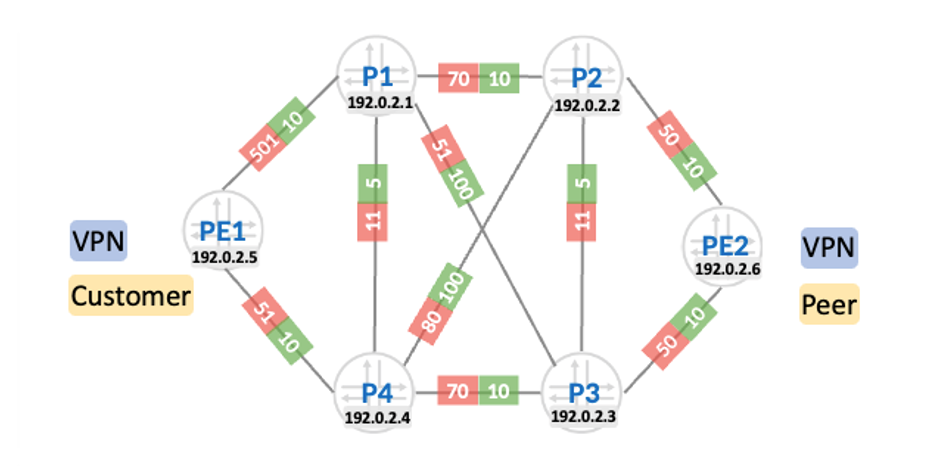

# Migrating Colored Resolution from inetcolor to Classful Transport

**Anton Elita - 08/21/2026**

Junos is moving colored transport resolution away from service-family-specific inetcolor/inet6color mechanisms and toward classful transports (CT), where transport intent is modeled as transport classes, per-class transport RIBs, and configurable resolution schemes for service-to-transport mapping. Future feature work in Junos is focused on CT rather than inetcolor. In this article we will dive into details of the history, differences between the resolution models, ways to migrate and validate the control and forwarding planes.

## Why colored transport resolution exists

The basic problem is deceptively simple: two services may have the same remote PE next hop but require different underlay behavior. A default recursive lookup normally chooses the best path toward a PE loopback, usually based on IGP metric, presence of RSVP or uncolored SR-TE, or ECMP rules.



PE1 may have one or more best forwarding paths to PE2, but some customer-facing services (e.g., L3VPN, EVPN, IP transit, or others) may need a low-delay path (green metrics) while other services need to follow the best IGP metric path (red metrics) or a different TE path. Adding multiple PE loopbacks can solve this mechanically, but this does not scale; the scalable abstraction is to mark transport paths with **colors** and let service routes express color intent – usually by using color extended communities in BGP-based services. RFC 9012 references it as an optional transitive attribute with IANA-allocated type 0x0b.

In other words, the service route says “I want class/color X”; the local resolver in Junos decides which underlay next hop satisfies that intent.

## The legacy Junos model: inetcolor

Junos originally implemented colored resolution through** inetcolor.0 based tables**. The earliest knob was extended-nexthop-color, used for steering traffic over colored SR-TE paths; it works only for inet or inet6 unicast address families (for example, global IP or IPv6 transit) and instructs Junos to look up next hops in inetcolor.0 or inet6color.0. That model is simple for unicast: a BGP route carries a color, and the protocol next hop is resolved as a colored next hop. It is configurable globally in BGP, per group of BGP neighbors, or per BGP neighbor. If an extended color community is present, the “colored” next-hop is used; otherwise, the route is treated as uncolored.

**resolution-map** was introduced for BGP-based VPN services as a more flexible policy action. It allows color-only or IP+color modes, but in practice only the IP+color mode is widely used; the policy action “then resolution-map” can be applied in import policy, and the resulting lookup still picks up next-hops from inetcolor.0 or inet6color.0 tables.

This design worked, and it was useful. It gave engineers a policy tool to steer L3VPN, L2VPN, and EVPN service routes toward SR-TE paths without redesigning the service overlay. But it also embedded transport resolution into service-family-specific plumbing. The drawbacks: supporting additional service families required new service-specific Junos code, inter-AS support was limited, fallback was constrained, and multipath required explicit per-family resolution policy.

## Operational limitations of inetcolor

The first operational limitation is service-family dependency. extended-nexthop-color applies only to inet and inet6 unicast families, while resolution-map applies to selected VPN families; that alone creates two configuration styles for one operational goal. Some service types are unsupported with this model, for example Layer 2 circuits and VPLS.

The second limitation is fallback behavior. With resolution-maps, if the route mandates a colored next hop and no matching next-hop exists in inetcolor.0, the traffic is dropped. This may or may not be a desired behavior. A workaround for backup transports exists: importing LDP, uncolored SR-TE, or L-ISIS prefixes as “color 0” into inetcolor.0 or inet6color.0, so that it can behave as a best-effort fallback.

The third limitation is multipath handling. iBGP ECMP multipath does not automatically perform recursive lookups for ECMP/wECMP load-balancing in the inetcolor model; only a single path is selected by default, so engineers must configure multipath-resolve and apply it to each relevant service resolution RIB, including bgp.l3vpn.0, bgp.l3vpn-inet6.0, bgp.l2vpn.0, bgp.evpn.0, and mpls.0.

## Classful Transport (CT) architecture

CT architecture broadly consists of two parts: CT-infra (in short, referred to as “CT” in this document) and the BGP-CT (SAFI 76) family.  CT-infra is a device-local implementation of resolver enhancements, has no interoperability considerations, and works with various transport protocols.

Whereas BGP-CT is a new family (SAFI 76) that provides Inter-AS option-C transport in CT architecture, similar to BGP-LU (SAFI 4).

Instead of forcing every colored next hop into inetcolor.0, CT creates a **transport class** and a corresponding transport RIB. Colored next hops are organized into tables like <color>.inet.3, effectively creating a transport RIB for each transport class (identified by a color); RSVP-TE, SR-TE, SRv6, Flex-Algo, and BGP-CT can all contribute routes into those transport RIBs. The <color>.inet.3 table, a homogeneous variant of the existing inet.3 transport RIB makes seamless fallback options possible between colorful RIBs and best-effort RIB.

A transport class represents a set of transport paths with similar TE characteristics: for example, low latency, high bandwidth, disjoint path, protected path, or best effort. CT groups underlay routes with similar TE characteristics into identifiable** Transport Classes**, and overlay routes use **Resolution Schemes** to resolve reachability toward service endpoints. In Junos output, a transport class has a color, a mapping community such as color:0:130, a transport route target such as transport-target:0:130, and a RIB such as junos-rti-tc-130.inet.3.

CT  auto-creates service and transport resolution schemes, such as junos-resol-schem-tc-130-v4-service, junos-resol-schem-tc-130-v4-transport, and their IPv6 equivalents. A service route carrying color:0:130 maps to the service resolution scheme, whose contributing RIBs may be junos-rti-tc-130.inet.3 inet.3, meaning “try the class-specific transport RIB first, then fall back to best-effort inet.3”. Customization of the default resolution scheme is also possible – for example, by creating an ordered list of RIBs for the lookup of the next available fallbacks, or disabling fallbacks altogether.

## CT, SR Policy, SRv6, Flex-Algo, RSVP-TE, and BGP-CT

CT is not a replacement for SR-TE, RSVP-TE, SRv6, or Flex-Algo. It is the resolver architecture that lets those transport mechanisms contribute to a common class-based model. This public TechPost also shows how Junos can map different types of services to transport paths established by RSVP, SR-TE, BGP-CT, or Flex-Algo.

BGP-CT is used when the transport class must cross domain boundaries. RFC 9832 defines BGP Classful Transport as SAFI 76 and describes it as a BGP transport family that carries transport prefixes with Transport Class information across domains, using Transport Class Route Targets such as transport-target:0:100. Important note: **CT is the local architecture used independently on an ingress node; BGP-CT is the inter-domain signaling tool when you need to extend that architecture beyond one IGP/AS domain**.

Table: inetcolor vs CT: side-by-side

| Dimension | inetcolor / inet6color | Classful Transport |
|:--|:--|:--|
| Resolver table model | Single colored table, with colored next-hop entries such as <prefix>-<color> | Per-class transport RIBs such as junos-rti-tc-130.inet.3 |
| Services supported | extended-nexthop-color for inet/inet6; resolution-map for L3VPN (v4,v6) families | Service route carries mapping community; lookup follows resolution schemes without resolution-map import policy. Supported services include many others as well, e.g. VPLS, l2circuit, L2VPN, SRv6 services, class-based forwarding etc. |
| Fallback | Manual color-0 import into inetcolor | Default fallback to inet.3, configurable fallback none, or ordered fallback across transport RIBs |
| Multipath over recursive resolution | Requires explicit multipath-resolve policy | Multipath is handled automatically in the contributing transport RIBs and resolution scheme |
| Transport contributors | Primarily colored SR-TE or BGP colored SR-TE, or Flex-Algo | RSVP-TE, SR-TE, SRv6, Flex-Algo, and BGP-CT can contribute to transport RIBs |
| Inter-domain extensibility | Limited inter-AS support | via BGP-CT SAFI 76 |
| Development direction | Future deprecation target; no firm timeline yet | Main target for ongoing development |

## Step 1 — inventory the existing steering model

Start by finding every place that imposes legacy colored resolution: BGP *extended-nexthop-color*, policy “*then resolution-map*”, “routing-options resolution rib ... *inetcolor-import, inet6color-import*”, and rib-groups that import uncolored transport into* inetcolor.0* or *inet6color.0. *

## Step 2 — enable CT primitives

A minimal CT migration usually introduces a route distinguisher ID (probably already part of the config), preserved next-hop hierarchy, sufficient chained-label depth, and one or more transport classes.

Example skeleton:

```
set routing-options route-distinguisher-id <router-id>
set routing-options resolution preserve-nexthop-hierarchy
set routing-options forwarding-table chain-composite-max-label-count 8

set routing-options transport-class auto-create            # auto-creation
set routing-options transport-class name low-delay-class color 130    # manual creation
```

A newer alternative to auto-derive route distinguisher from router-id is:

```
set routing-options route-distinguisher-id-use-router-id
```

At this step, nothing yet is changed – but Junos is prepared to receive colored transport routes.

## Step 3 — make transport protocols contribute to CT RIBs

Enable CT on transport protocols that actually build the underlay.

Flex-Algo:

```
set routing-options flex-algorithm N use-transport-class
```

SR-TE:

```
set protocols source-packet-routing use-transport-class
```

Colored RSVP-TE is enabled per LSP:

```
set protocols mpls label-switched-path N transport-class ?
Possible completions:
  <transport-class>    Transport class this LSP belongs to
```

BGP-CT will place the prefixes automatically into transport RIBs, as it’s only compatible with the CT infra (and not with inetcolor).

At this step, both inetcolor (inet6color) and transport RIBs are populated simultaneously, so the lookup can happen from the legacy or new resolution schema and the transition is as smooth as possible. One exception is “dynamic-tunnels” for on-demand next-hops, where the next-hop lookup is steered per dynamic tunnel group:

```
set routing-options dynamic-tunnels SR-DT spring-te use-transport-class
```

> *Note: For dynamic-tunnels, this change is disruptive and must be well planned. If colored resolution is already used via inetcolor tables for dynamic-tunnels, combine this step with Step 5 (removing legacy service steering knobs like resolution-maps).*

## Step 4 — choose fallback

CT gives you a flexible choice of fallbacks:

- The auto-created default service scheme can fall back to inet.3.
- “fallback none” can force strict behavior and drop traffic if no colored next hop exists
- A custom scheme can define an ordered list like in this example:

```
root@pe1# show routing-options resolution
preserve-nexthop-hierarchy;
scheme low-delay-paths {
    resolution-ribs [ junos-rti-tc-130.inet.3 junos-rti-tc-131.inet.3 inet.3 ];
    mapping-community color:0:130;
}
```

In this example, transport paths with color 130 are primary, those with color 131 are backup, and last resort are best-effort paths from inet.3.
Important note: fallback paths are not pre-programmed – the consumption of the ASIC resources is not affected. Junos needs a trigger to re-program service routes to use a different transport path. Such a trigger can be a change in the state of an RSVP or SR-TE LSP, an IGP event influencing Flex-Algo reachability, and similar other events. The restoration is **preemptive** and happens in a **make-before-break** fashion.

## Step 5 — remove legacy service steering knobs in a maintenance window

Once the transport RIBs are populated, remove or deactivate the legacy steering hooks like then resolution-map or extended-nexthop-color. In practice, do this per BGP group, neighbor, VRF, or service family, not globally across the network, so you can compare before/after behavior.

## Step 6 — validate resolution

Validation should prove three things: the transport class exists, the class RIB has usable tunnel routes, and service routes resolve through the intended originating RIB. Useful commands:

- Checking CT operational state:

```
root@pe1# run show routing transport-class all
Transport Class: junos-tc-130  Configured name: low-delay-class
  Color: 130, References: 1
  Transport Endpoints: IPv4 0  IPv6 0
  Mapping community: color:0:130
  Route Target: transport-target:0:130
  Routing instance: junos-rti-tc-130
Transport Class: junos-tc-best-effort
  Color: 0, References: 2
  Transport Endpoints: IPv4 7  IPv6 0
  Mapping community: color:0:0
  Routing instance: master
  ExportDisabled
```

- Checking resolution schemes including configured fallbacks, and mapping communities:

```
root@pe1# run show route resolution scheme name ?
Possible completions:
  <name>               Resolution scheme Name
  junos-resol-schem-tc-130-v4-service        # IPv4 service resolution scheme
  junos-resol-schem-tc-130-v4-transport    # IPv4 next-hop transport resolution scheme
  junos-resol-schem-tc-130-v6-service        # IPv6 service resolution scheme
  junos-resol-schem-tc-130-v6-transport    # IPv6 next-hop transport resolution scheme
  junos-resol-schem-tc-best-effort-v4-service
  junos-resol-schem-tc-best-effort-v6-service

root@pe1# run show route resolution scheme name junos-resol-schem-tc-130-v4-service
Resolution scheme: junos-resol-schem-tc-130-v4-service
  AutoCreated
  References: 1
  Mapping community: color:0:130
  Resolution Tree: 0x9789000, index: 11, Nodes: 7
  Policy: [__resol-schem-common-import-policy__]
  Contributing routing tables: junos-rti-tc-130.inet.3 inet.3
### default fallback to inet.3 for service routes


```

- Analyzing the colored RIB tables:

```
root@pe1# run show route table junos-rti-tc-130.inet.3
junos-rti-tc-130.inet.3: 1 destinations, 1 routes (1 active, 0 holddown, 0 hidden)
+ = Active Route, - = Last Active, * = Both
1.0.0.6/32         *[L-ISIS/14] 00:03:02, metric 30
                    >  to 10.0.15.1 via ge-0/0/0.0, Push 103006
```

- For a specific prefix, show the result of the recursive resolution and provide the RIB name that contributed with the currently selected transport path:

```
root@pe1# run show route table vrf-129.inet expanded-nh extensive
[..]                
Communities: target:100:129 color:0:130
[..]
      Next hop type: Router
      Next hop: 10.0.15.1 via ge-0/0/0.0
      Session Id: 0
      1.0.0.6/32 Originating RIB: junos-rti-tc-130.inet.3
        Metric: 30 Node path count: 1
          Forwarding nexthops: 1
             Next hop type: Router
               Next hop: 10.0.15.1 via ge-0/0/0.0
[..]
```

- There is also a (currently hidden) “resolver-state” option to the above command that gives even more insight – showing the resolution scheme name:

```
aelita@pe1# run show route protocol bgp 192.168.0.0/30 extensive table vrf1.inet.0 resolver-state
[..]
                Indirect next hops: 1
                        Protocol next hop: 11.0.0.6 Metric: 30 Flags: ResolScheme ResolvState: Resolved TSP index: 16
                        Path aux: 0x17408340, Type: 8, Flags: 0x40
                        Scheme: color-10, Resolution RIB: junos-rti-tc-10.inet.3
                        Inode flags: 0x284 path flags: 0x1
                        Path fnh link: 0x174080a0 path inh link: 0x94e0430
                        Label operation: Push 16
                        Label TTL action: prop-ttl
                        Load balance label: Label 16: None;
                        Indirect next hop: 0x90e16b0 1048574 INH Session ID: 363, INH non-key opaque: 0x0, INH key opaque: 0x0
                        Indirect path forwarding next hops (Merged): 1
[..]
```

## Deprecation direction and practical design guidance

The deprecation direction for inetcolor/inetcolor6 resolution is clear even if the exact timeline is not yet defined. For new deployments, build directly on CT. Define a color namespace, map colors to transport classes, make the chosen underlay protocols CT-aware, and use BGP Color Extended Communities or local mapping communities to express service intent. Use BGP-CT when the transport class needs to cross domain boundaries; otherwise, local CT resolution is enough

For brownfield migrations, avoid a “flag day.” Populate CT RIBs first, validate transport routes and fallback schemes, migrate one service family or VRF at a time by removing resolution-map or extended-nexthop-color, and compare service route expanded-nh extensive outputs before and after.

The conceptual shift is from colored next-hop lookup as a service-family feature to colored transport as a reusable infrastructure layer. That is why CT is the better long-term architecture: it decouples service intent from transport signaling protocol, supports ordered fallback, improves extensibility across service families, and provides an inter-domain path through BGP-CT when required.

## References

- Service Mapping to Colored MPLS Paths: [https://juniper.github.io/techpost/articles/service-mapping-to-colored-mpls-paths/article](https://juniper.github.io/techpost/articles/service-mapping-to-colored-mpls-paths/article)

## Acknowledgments

Thanks to the engineering teams for continuous innovation and feature development. Expressing big gratitude to Kaliraj for his enthusiasm, ideas and for a review of this techpost.
