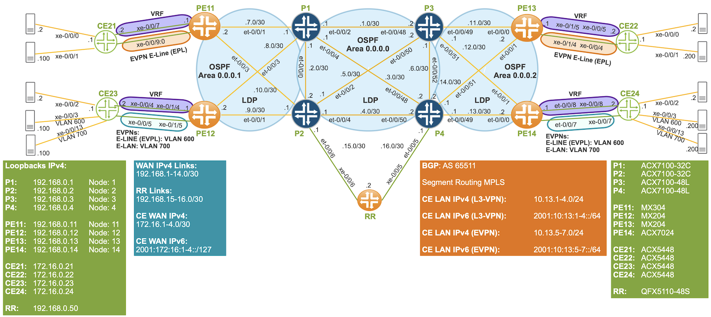
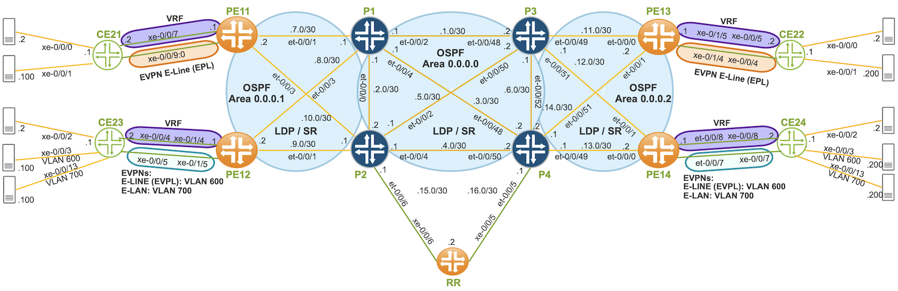
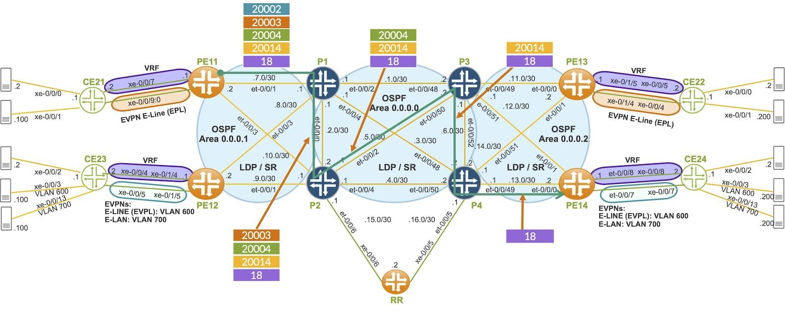
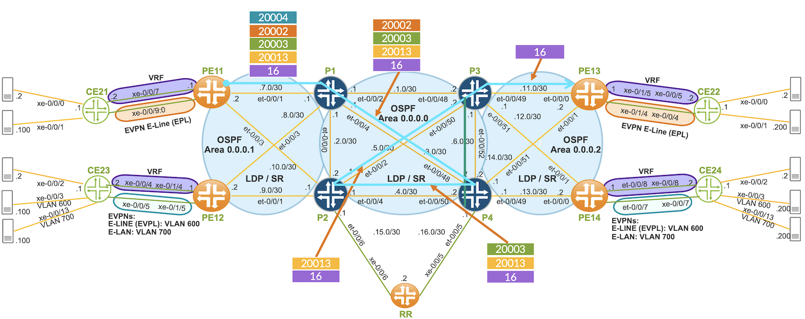

# Migrating from OSPF/LDP to OSPF/SR-MPLS

**Ricardo Dominguez - 04/05/2025**

Migrating from a multi-area OSPF with LDP to SR-MPLS is a transition that can be achieved with ease, provided you have a clear understanding of the process and the options available. There are various ways to execute this migration, each with its own set of benefits and considerations. The approach you choose will largely depend on customer requirements, network size, and the specific services you plan to deliver.

In this two-part technical blog series, we'll dive deep into some of the most commonly used migration strategies for moving from OSPF with LDP to SR-MPLS, explaining the steps involved, potential challenges, and the advantages of each method.

Stay tuned for our upcoming post, where we will break down the details of the SR-TE LSPs migration option and guide you through making the best choice for your network transformation journey.

## Introduction

In this Techpost series, we will explore the various migration options in JUNOS. Specifically, we will review the following:

- Static LSPs with a Static Path
- Static LSPs with Dynamic Traffic Engineering (TE) Path (Constrained Shortest Path First CSPF)

From a JUNOS perspective, Static LSPs are primarily configured through CLI or via Netconf. On the other hand, Dynamic LSPs are typically configured using the PCEP through a WAN Controller, such as Juniper Paragon.

In this series, we will detail this first approach, offering valuable insights on how to migrate effectively.

Static LSPs with a static path are easier but less powerful than static LSPs with a dynamic path, as TED is not taken into account when setting up LSPs with static paths. We will review below two kinds of static LSPs with static paths.

- IP LSP (Uncolor LSP)
- IP LSP with Transport Class & BGP Color Community

In a subsequent post, we will cover Static LSPs that utilize dynamic TE paths. This will include four different types of LSPs that take various constraints into account when traversing OSPF Areas

- IGP Metric
- TE Metric
- Delay Metric
- Admin Groups

Setting up LSPs with dynamic paths through OSPF involves having TED from different areas (remember TED is per area), this is a critical factor to keep in mind when establishing LSPs: TED from different areas needs to be incorporated.

To bring up an SR-TE LSP through OSPF areas, two main methods exist:

- Using a WAN Controller (e.g., Juniper Paragon)
- Leveraging BGP-LS through ABRs, Ingress PEs, and Route Reflectors

In our upcoming post, we will explore the second approach, where BGP-LS TED distribution is used as a controller-less inter-area solution for SR-TE LSPs.

## Test Topology

Our test topology is based on the OSPF routing protocol and is structured into three OSPF Areas. Below is a detailed description of the connectivity:

- Area 0 (Backbone Area):


Routers P1, P2, P3, and P4 are interconnected within OSPF Area 0. This serves as the backbone of the network.
- Area 1:


Routers PE11 and PE12 are connected to P1 and P2, respectively, within OSPF Area 1.
- Area 2:


Routers PE13 and PE14 are connected to P3 and P4, respectively, within OSPF Area 2.



This network topology is based on IPv4 with OSPF for routing and LDP as the MPLS signaling protocol. BGP is used among PE routers RR to handle various routing families, including inet, inet-vpn, inet6, inet6-vpn, and evpn. Notably, the core network is a BGP-free core.

In this design, the network does not use IPv6 natively within the core. However, it does leverage L3VPN across all PE routers to facilitate communication for both IPv4 and IPv6 traffic from CE devices. 6VPE and 6PE are implemented to allow IPv6 communication between CE devices over an IPv4/MPLS network.

EVPN E-Line (EPL) is established between PE11 and PE13 to carry both IPv4 and IPv6 traffic. EVPN E-Line (EVPL) for VLAN 600 is deployed between PE12 and PE14, again supporting both IPv4 and IPv6 traffic. EVPN E-LAN is used for VLAN 700 between PE12 and PE14 for transporting both IPv4 and IPv6 traffic across the network.

## Hardware Used

We are leveraging the following Juniper hardware in our test bed topology:

- P1:  ACX7100-32C
- P2:  ACX7100-32C
- P3: ACX7100-48L
- P4: ACX7100-48L
- PE11: MX304
- PE12: MX204
- PE13: MX204
- PE14: ACX7024
- CE21: ACX5448
- CE22: ACX5448
- CE23: ACX5448
- CE24: ACX5448
- RR: QFX5110-48S

Before we implement static LSPs, we will first integrate SR into our network. Once SR is deployed, we will validate the continued functionality of our services, ensuring that traffic is still being routed via LDP routes.

## Enabling Segment Routing

Segment Routing configuration is a straightforward procedure. We will need to configure a Segment Routing Global Block (SRGB) and node index for each routing participating in SR.

SRGB means the MPLS label range that can be used for SIDs. It's recommended that SRGB be the same in all routers in the network, so SR is more deterministic and easier to derive the node based on the label used. It's also important that SRGB has the right size, not just for all routers in the network, but to support future growth for new routers, possible flex-algo, and prefix SIDs.

In our network topology, we will configure an SRGB with a starting label of 20,000 and an ending label of 24,000. To configure the SRGB, we have the option to use either of the following configurations:

- set protocols mpls label-range srgb-label-range 20000 24000
- set protocols ospf source-packet-routing srgb start-label 20000 index-range 4001

For our implementation, we will proceed with the first option. If needed, other protocols such as IS-IS can also utilize this label range.

In our network, the core infrastructure is currently based solely on IPv4. Therefore, for each router, we will configure a Node Index ID specifically for IPv4. However, for dual-stack networks (supporting both IPv4 and IPv6), it will be necessary to configure an additional Node Index ID for IPv6.

The Node Index ID is assigned to our routers in a manner that corresponds to their respective identifiers, specifically matching the digits of PE or P routers. The assignment follows a straightforward pattern, where each router's index is numerically aligned with its identifier.

- P1: 1
- P2: 2
- P3: 3
- P4:4
- PE11: 11
- PE12: 12
- PE13: 13
- PE14: 14

In dual-stack scenarios, both the IPv4 Node Index and IPv6 Node Index should be configured as needed.

Depending on the router, the below configuration is needed.

- set protocols ospf source-packet-routing node-segment ipv4-index <1, 2, 3, 4, 11, 12, 13, 14>

For successful SR migration, it is highly recommended to first migrate the Core devices, followed by the PE devices. Migrating the PEs before the Core devices poses a significant risk of blackholing traffic in the core, as PE routers may prefer SR paths while the Core routes are still not migrated.

Below is the configuration for PE11; other PE and P devices have similar configurations, with the only variation being the IPv4 index.

```
jnpr@MX304-PE11# show protocols ospf    
source-packet-routing {
    node-segment ipv4-index 11;
}

jnpr@MX304-PE11# show protocols mpls                                                    
label-range {
    srgb-label-range 20000 24000;
}
```

After committing this configuration to all routers, we will have LDP and SR as the MPLS signaling protocols in use.



Enabling SR on a network device does not necessarily mean that traffic will immediately start using SR. In JUNOS, LDP has a protocol preference of 9, while SR with OSPF has a protocol preference of 10. As a result, our services will continue using LDP routes as the transport mechanism, even if SR is enabled.

To verify that SR is enabled in the network, we can run the following verification commands on PE11. For simplicity, the output of some of these commands has been cropped.

Upon verifying, we can confirm that SR is successfully enabled on PE11, the SRGB has been correctly allocated, the label range is actively in use, and the IPv4 index has been properly configured.

```
jnpr@MX304-PE11# run show ospf overview                  
Instance: master
  Router ID: 192.168.0.11
  Route table index: 0
  NSSA router
  LSA refresh time: 50 minutes
  SPRING: Enabled
    SRGB Config Range (Global) :
      SRGB Start-Label : 20000, SRGB Index-Range : 4001
    SRGB Block Allocation: Success
      SRGB Start Index : 20000, SRGB Size : 4001, Label-Range: [ 20000, 24000 ]
    Node Segments: Enabled
    Ipv4 Index : 11
  Post Convergence Backup: Disabled
```

The SR label range, from 20,000 to 24,000, has been reserved for SR use.

```
jnpr@MX304-PE11# run show mpls label usage 
Label space Total   Available        Applications
LSI         995983  995971 (100.00%) BGP/LDP VPLS with no-tunnel-services, BGP L3VPN with vrf-table-label
Block       995983  995971 (100.00%) BGP/LDP VPLS with tunnel-services, BGP L2VPN
Dynamic     995983  995971 (100.00%) RSVP, LDP, PW, L3VPN, RSVP-P2MP, LDP-P2MP, MVPN, EVPN, BGP, SPRING-TE
Static      48576   48576  (100.00%) Static LSP, Static PW
Effective Ranges
Range name  Shared with Start   End      
Dynamic     16      19999   
Dynamic     24001   999999  
Static      1000000 1048575 
SRGB        20000   24000    GLOBAL 
```

The OSPF LSDB contains Opaque LSAs, which are utilized for SR. Through these LSAs, information such as the SRGB, IPv4 index, and adjacency labels are exchanged.

```
jnpr@MX304-PE11# run show ospf database                 
    OSPF database, Area 0.0.0.1
 Type       ID               Adv Rtr           Seq      Age  Opt  Cksum  Len 
OpaqArea 4.0.0.0          192.168.0.1      0x80000003  2405  0x20 0xd3a2  44
OpaqArea 4.0.0.0          192.168.0.2      0x80000002  1847  0x20 0xcfa6  44
OpaqArea*4.0.0.0          192.168.0.11     0x80000003  1249  0x20 0x97d4  44
OpaqArea 4.0.0.0          192.168.0.12     0x80000002  1145  0x20 0x93d8  44
OpaqArea 7.0.0.1          192.168.0.1      0x80000009  2240  0x20 0xdf70 164
OpaqArea 7.0.0.1          192.168.0.2      0x80000005  2240  0x20 0xe76b 164
OpaqArea*7.0.0.1          192.168.0.11     0x80000002  1711  0x20 0x5159  44
OpaqArea 7.0.0.1          192.168.0.12     0x80000002   566  0x20 0x7334  44
OpaqArea 8.0.0.1          192.168.0.1      0x80000003  2230  0x20 0x48cf  48
OpaqArea*8.0.0.1          192.168.0.11     0x80000003    23  0x20 0xbb62  48
OpaqArea 8.0.0.1          192.168.0.12     0x80000004  1846  0x20 0xb07b  48
OpaqArea 8.0.0.2          192.168.0.1      0x80000001  1835  0x20 0x1001  48
OpaqArea 8.0.0.2          192.168.0.2      0x80000002  2106  0x20 0xa76a  48
OpaqArea*8.0.0.2          192.168.0.11     0x80000002  2305  0x20 0x1207  48
OpaqArea 8.0.0.2          192.168.0.12     0x80000003  1834  0x20 0x2bf4  48
OpaqArea 8.0.0.3          192.168.0.2      0x80000001  1847  0x20 0x11fc  48
```

Opaque LSA 4 is a Router Information LSA. This one shows the router's SRGB.

```
jnpr@MX304-PE11# run show ospf database advertising-router 192.168.0.1 opaque-area lsa-id 4.0.0.0 detail 
    OSPF database, Area 0.0.0.1
 Type       ID               Adv Rtr           Seq      Age  Opt  Cksum  Len 
OpaqArea 4.0.0.0          192.168.0.1      0x80000004   598  0x20 0xd1a3  44
Opaque LSA
  SR-Algorithm (8), length 1:
    Algo (1), length 1:
        0
  SID/Label Range (9), length 12:
    Range Size (1), length 3:
        4001
    SID/Label (1), length 3:
      Label (1), length 3:
        20000
```

Opaque LSA 7 shows routers' Node and Prefix SID.

```
jnpr@MX304-PE11# run show ospf database advertising-router 192.168.0.1 opaque-area lsa-id 7.0.0.1 detail    
    OSPF database, Area 0.0.0.1
 Type       ID               Adv Rtr           Seq      Age  Opt  Cksum  Len 
OpaqArea 7.0.0.1          192.168.0.1      0x8000000a   613  0x20 0xdd71 164
Opaque LSA
  Extended Prefix (1), length 20:
      Route Type (1), length 1:
        3
      Prefix Length (2), length 1:
        32
      Prefix (5), length 32:
        192.168.0.1
       SID (4), length 4:
        1
  Extended Prefix (1), length 20:
      Route Type (1), length 1:
        3
      Prefix Length (2), length 1:
        32
      Prefix (5), length 32:
        192.168.0.2
       SID (4), length 4:
        2 
  Extended Prefix (1), length 20:
      Route Type (1), length 1:
        3
      Prefix Length (2), length 1:
        32
      Prefix (5), length 32:            
        192.168.0.3
       SID (4), length 4:
        3
  Extended Prefix (1), length 20:
      Route Type (1), length 1:
        3
      Prefix Length (2), length 1:
        32
      Prefix (5), length 32:
        192.168.0.4
       SID (4), length 4:
        4
  Extended Prefix (1), length 20:
      Route Type (1), length 1:
        3
      Prefix Length (2), length 1:
        32
      Prefix (5), length 32:
        192.168.0.13
       SID (4), length 4:
        13
  Extended Prefix (1), length 20:
      Route Type (1), length 1:
        3
      Prefix Length (2), length 1:
        32
      Prefix (5), length 32:
        192.168.0.14
       SID (4), length 4:
        14
```

Opaque LSA 8 and "show ospf neighbor detail" commands show adjacency labels.

In the network topology, the PEs and Ps loopback are advertised through both LDP and SR. Despite SR routes being present, the LDP routes continue to be preferred for forwarding decisions due to a lower protocol preference. This results in the LDP routes being selected for traffic forwarding, as illustrated in the table below, where LDP routes are highlighted in orange and SR routes are shown in green.

```
jnpr@MX304-PE11# run show route table inet.3 | match "192.168.0.11|192.168.0.12|192.168.0.13|192.168.0.14|Push"         
192.168.0.12/32    *[LDP/9] 00:39:40, metric 1
                    >  to 192.168.7.1 via et-0/0/1.0, Push 26
                       to 192.168.10.1 via et-0/0/3.0, Push 26
                    >  to 192.168.7.1 via et-0/0/1.0, Push 20012
                       to 192.168.10.1 via et-0/0/3.0, Push 20012
192.168.0.13/32    *[LDP/9] 00:39:40, metric 1
                    >  to 192.168.7.1 via et-0/0/1.0, Push 27
                       to 192.168.10.1 via et-0/0/3.0, Push 27
                    >  to 192.168.7.1 via et-0/0/1.0, Push 20013
                       to 192.168.10.1 via et-0/0/3.0, Push 20013
192.168.0.14/32    *[LDP/9] 00:39:40, metric 1
                    >  to 192.168.7.1 via et-0/0/1.0, Push 23
                       to 192.168.10.1 via et-0/0/3.0, Push 23
                    >  to 192.168.7.1 via et-0/0/1.0, Push 20014
                       to 192.168.10.1 via et-0/0/3.0, Push 20014
```

The PNH for IPv4 VRF routes is resolved through inet.3 table and LDP is chosen due to better protocol preference.

```
jnpr@MX304-PE11# run show route table VRF_PURPLE.inet.0 10.13/16             
VRF_PURPLE.inet.0: 13 destinations, 13 routes (13 active, 0 holddown, 0 hidden)
+ = Active Route, - = Last Active, * = Both
10.13.1.0/24       *[BGP/170] 03:59:22, localpref 100
                      AS path: 65500 I, validation-state: unverified
                    >  to 172.16.1.2 via xe-0/0/7:0.0
10.13.2.0/24       *[BGP/170] 03:58:02, localpref 100, from 192.168.0.50
                      AS path: 65500 I, validation-state: unverified
                    >  to 192.168.7.1 via et-0/0/1.0, Push 17, Push 26(top)
                       to 192.168.10.1 via et-0/0/3.0, Push 17, Push 26(top)
10.13.3.0/24       *[BGP/170] 03:32:54, localpref 100, from 192.168.0.50
                      AS path: 65500 I, validation-state: unverified
                    >  to 192.168.7.1 via et-0/0/1.0, Push 16, Push 27(top)
                       to 192.168.10.1 via et-0/0/3.0, Push 16, Push 27(top)
10.13.4.0/24       *[BGP/170] 03:32:44, localpref 100, from 192.168.0.50
                      AS path: 65500 I, validation-state: unverified
                    >  to 192.168.7.1 via et-0/0/1.0, Push 18, Push 23(top)
                       to 192.168.10.1 via et-0/0/3.0, Push 18, Push 23(top)
```

In our network, we have opted for an IPv6 core-free architecture, which means we do not deploy IPv6 natively across the core. Instead of using a dual-stack IPv6 network, we leverage 6VPE for IPv6 edge connectivity, relying on the existing IPv4/MPLS infrastructure for transport.

The remote PE's IPv6 loopback address is advertised through LDP routes, allowing for IPv6 resolution in the edge network. Depending on the customer traffic type, either the IPv4 or IPv6 loopback of the remote PE is used for resolving PNH.

```
jnpr@MX304-PE11# run show route table inet6.3
::ffff:192.168.0.12/128
                    >  to 192.168.7.1 via et-0/0/1.0, Push 26
                       to 192.168.10.1 via et-0/0/3.0, Push 26
                    >  to 192.168.7.1 via et-0/0/1.0, Push 2, Push 20012(top)
                       to 192.168.10.1 via et-0/0/3.0, Push 2, Push 20012(top)
::ffff:192.168.0.13/128
                    >  to 192.168.7.1 via et-0/0/1.0, Push 27
                       to 192.168.10.1 via et-0/0/3.0, Push 27
                    >  to 192.168.7.1 via et-0/0/1.0, Push 2, Push 20013(top)
                       to 192.168.10.1 via et-0/0/3.0, Push 2, Push 20013(top)
::ffff:192.168.0.14/128
                    >  to 192.168.7.1 via et-0/0/1.0, Push 23
                       to 192.168.10.1 via et-0/0/3.0, Push 23
                    >  to 192.168.7.1 via et-0/0/1.0, Push 2, Push 20014(top)
                       to 192.168.10.1 via et-0/0/3.0, Push 2, Push 20014(top)
```

The PNH for IPv6 VRF routes is resolved through the inet6.3 routing table, with LDP being selected due to its higher protocol preference.

```
jnpr@MX304-PE11# run show route table VRF_PURPLE.inet6.0  2001:10:13::/48                                          
VRF_PURPLE.inet6.0: 15 destinations, 15 routes (15 active, 0 holddown, 0 hidden)
+ = Active Route, - = Last Active, * = Both
2001:10:13:1::/64  *[BGP/170] 04:05:38, localpref 100
                      AS path: 65500 I, validation-state: unverified
                    >  to 2001:172:16:1::b via xe-0/0/7:0.0
2001:10:13:2::/64  *[BGP/170] 04:04:16, localpref 100, from 192.168.0.50
                      AS path: 65500 I, validation-state: unverified
                    >  to 192.168.7.1 via et-0/0/1.0, Push 17, Push 26(top)
                       to 192.168.10.1 via et-0/0/3.0, Push 17, Push 26(top)
2001:10:13:3::/64  *[BGP/170] 03:38:59, localpref 100, from 192.168.0.50
                      AS path: 65500 I, validation-state: unverified
                    >  to 192.168.7.1 via et-0/0/1.0, Push 16, Push 27(top)
                       to 192.168.10.1 via et-0/0/3.0, Push 16, Push 27(top)
2001:10:13:4::/64  *[BGP/170] 03:37:24, localpref 100, from 192.168.0.50
                      AS path: 65500 I, validation-state: unverified
                    >  to 192.168.7.1 via et-0/0/1.0, Push 18, Push 23(top)
                       to 192.168.10.1 via et-0/0/3.0, Push 18, Push 23(top)
```

Both EVPN E-line EPL & EVPL, and E-LANE services use LDP routes for transport.

```
jnpr@MX304-PE11# run show route table mpls.0 ccc xe-0/0/9:0           
mpls.0: 32 destinations, 32 routes (32 active, 0 holddown, 0 hidden)
+ = Active Route, - = Last Active, * = Both
xe-0/0/9:0.0       *[EVPN/7] 04:07:50, route-type Egress
                    >  to 192.168.7.1 via et-0/0/1.0, Push 17, Push 27(top)
                       to 192.168.10.1 via et-0/0/3.0, Push 17, Push 27(top)

```

```
jnpr@MX204-PE12# run show route table mpls.0 ccc xe-0/1/5.600 
mpls.0: 34 destinations, 34 routes (34 active, 0 holddown, 0 hidden)
+ = Active Route, - = Last Active, * = Both
xe-0/1/5.600       *[EVPN/7] 04:15:58, route-type Egress
                    >  to 192.168.9.1 via et-0/0/1.0, Push 19, Push 23(top)
                       to 192.168.8.1 via et-0/0/3.0, Push 19, Push 23(top)

jnpr@MX204-PE12# run show evpn database 
Instance: EVPN_ELAN_PE12_PE14
VLAN  DomainId  MAC address        Active source                  Timestamp        IP address
                28:d2:44:bf:c1:18  192.168.0.14                   Oct 07 16:35:31  10.13.7.200
                                                                                   2001:10:13:4::2
700             00:e0:4c:68:03:1d  xe-0/1/5.700                   Oct 07 16:34:52  10.13.7.100
```

## Static SR LSPs with Static Paths

As we discussed in the previous section, once SR is enabled, traffic will continue to use LDP within our network topology. In this section, we will validate static SR LSPs with predefined static paths, with the aim of migrating traffic to Segment Routing.

We will verify two types of static LSPs: one is a plain IP LSP (uncolored LSP), and the other is an IP LSP with a transport class and BGP color community.

Let's keep in mind that LSPs with statically configured paths do not validate whether the remote node SID is reachable or if a transit router has failed. As a result, keeping the SR LSP up without proper validation could potentially lead to traffic blackholes. To mitigate this risk, it is highly recommended to use S-BFD (Static Bidirectional Forwarding Detection) for static LSPs. S-BFD sends small packets through the LSP to continuously verify that the LSP remains operational and reachable.

### Static SR LSP Path (Uncolor LSP)

For this LSP, we will configure a path from PE11 to PE14, traversing through the intermediate nodes P1, P2, P3, and P4. This is done by using the "ip-address" knob to explicitly configure each hop in the LSP.

```
protocols {
    ospf {
        traffic-engineering l3-unicast-topology;
    }
    source-packet-routing {
        segment-list PATH_PE11_to_PE14_IP {
            inherit-label-nexthops;
            auto-translate;
            P1 {
                label 20001;
                ip-address 192.168.0.1;
                label-type {
                    node;
                }
            }
            P2 {
                ip-address 192.168.0.2;
                label-type {
                    node;
                }
            }
            P3 {
                ip-address 192.168.0.3;
                label-type {            
                    node;               
                }                       
            }                           
            P4 {                        
                ip-address 192.168.0.4; 
                label-type {            
                    node;               
                }                       
            }                           
            PE14 {                      
                ip-address 192.168.0.14;
                label-type {            
                    node;               
                }                       
            }                           
        }                               
        source-routing-path PE11_to_PE14_IP {
            to 192.168.0.14;            
            primary {                   
                PATH_PE11_to_PE14_IP;   
            }                           
        }                               
    }
}
```



The protocol used for the Static or Dynamic LSP is SPRING-TE with a protocol preference value of 8. When configuring such LSPs, all traffic to remote PE uses SR as transport due to a lower protocol preference.

The LSP is in an up state, auto-translate has been successful, meaning the Node IP address (Remote loopback) has been translated to the corresponding Node SR label. The Node or Adjacency Identifier is set to Node as we use the loopback address in each hop.

```
jnpr@MX304-PE11# run show spring-traffic-engineering lsp    
To                        State        LSPname
192.168.0.14              Up           PE11_to_PE14_IP

jnpr@MX304-PE11# run show spring-traffic-engineering lsp detail 
E = Entropy-label Capability
Name: PE11_to_PE14_IP
  Tunnel Forward Type: SRMPLS
  To: 192.168.0.14
  Te-group-id: 0
  State: Up
    Path: PATH_PE11_to_PE14_IP
    Auto-translate status: Enabled Auto-translate result: Success 
    ERO Valid: true
      SR-ERO hop count: 5
        Hop 1 (Loose): 
          NAI: IPv4 Node ID, Node address: 192.168.0.1
          SID type: 20-bit label, Value: 20001
        Hop 2 (Loose): 
          NAI: IPv4 Node ID, Node address: 192.168.0.2
          SID type: 20-bit label, Value: 20002
        Hop 3 (Loose): 
          NAI: IPv4 Node ID, Node address: 192.168.0.3
          SID type: 20-bit label, Value: 20003
        Hop 4 (Loose): 
          NAI: IPv4 Node ID, Node address: 192.168.0.4
          SID type: 20-bit label, Value: 20004
        Hop 5 (Loose): 
          NAI: IPv4 Node ID, Node address: 192.168.0.14
          SID type: 20-bit label, Value: 20014
Total displayed LSPs: 1 (Up: 1, Down: 0, Initializing: 0)
```

The static LSP is programmed within the inet.3 table as SPRING-TE, with a protocol preference set to 8. The label stack for this LSP illustrates the sequence of labels pushed into packets. The first label in the stack, labeled P1, is used to determine the outgoing interface. However, this label P1 is not actually pushed into the packet traffic, it is only used for routing decisions.

```
jnpr@MX304-PE11# run show route 192.168.0.14 table inet.3                         
inet.3: 7 destinations, 16 routes (7 active, 0 holddown, 0 hidden)
+ = Active Route, - = Last Active, * = Both
192.168.0.14/32    *[SPRING-TE/8] 00:08:56, metric 1, metric2 30
                    >  to 192.168.7.1 via et-0/0/1.0, Push 20014, Push 20004, Push 20003, Push 20002(top)
                    [LDP/9] 04:23:28, metric 1
                    >  to 192.168.7.1 via et-0/0/1.0, Push 23
                       to 192.168.10.1 via et-0/0/3.0, Push 24
                    [L-OSPF/10/5] 04:23:32, metric 30
                    >  to 192.168.7.1 via et-0/0/1.0, Push 20014
                       to 192.168.10.1 via et-0/0/3.0, Push 20014
```

PE14 advertises CE24 routes with PE14 lo0 as PNH, and PE11 uses this SPRING-TE LSP to resolve CE24 BGP routes. We can see that VRF routes advertised by PE14 have the same label stack as LSP from PE11 to PE14.

```
jnpr@MX304-PE11# run show route table VRF_PURPLE.inet.0 10.13/16     
VRF_PURPLE.inet.0: 13 destinations, 13 routes (13 active, 0 holddown, 0 hidden)
+ = Active Route, - = Last Active, * = Both
10.13.1.0/24       *[BGP/170] 04:25:23, localpref 100
                      AS path: 65500 I, validation-state: unverified
                    >  to 172.16.1.2 via xe-0/0/7:0.0
10.13.2.0/24       *[BGP/170] 04:24:06, localpref 100, from 192.168.0.50
                      AS path: 65500 I, validation-state: unverified
                    >  to 192.168.7.1 via et-0/0/1.0, Push 17, Push 26(top)
                       to 192.168.10.1 via et-0/0/3.0, Push 17, Push 27(top)
10.13.3.0/24       *[BGP/170] 04:23:56, localpref 100, from 192.168.0.50
                      AS path: 65500 I, validation-state: unverified
                    >  to 192.168.7.1 via et-0/0/1.0, Push 16, Push 27
                       to 192.168.10.1 via et-0/0/3.0, Push 16, Push 27
10.13.4.0/24       *[BGP/170] 00:12:29, localpref 100, from 192.168.0.50
                      AS path: 65500 I, validation-state: unverified
                    >  to 192.168.7.1 via et-0/0/1.0, Push 18, Push 20014, Push 20004, Push 20003, Push 20002(top)
```

We can validate that IPv4 traffic destined for the CE24 LAN is traversing the nodes defined in the LSP path from PE11 to PE14. During this traversal, the label stack is progressively reduced at each LSP node.

```
jnpr@MX304-PE11# run traceroute routing-instance VRF_PURPLE 10.13.4.1 
traceroute to 10.13.4.1 (10.13.4.1), 30 hops max, 52 byte packets
 1  192.168.2.1 (192.168.2.1)  1.220 ms  0.739 ms  0.521 ms
     MPLS Label=20002 CoS=0 TTL=1 S=0
     MPLS Label=20003 CoS=0 TTL=1 S=0
     MPLS Label=20004 CoS=0 TTL=1 S=0
     MPLS Label=20014 CoS=0 TTL=1 S=0
     MPLS Label=18 CoS=0 TTL=1 S=1
 2  192.168.5.1 (192.168.5.1)  0.749 ms  0.662 ms  0.689 ms
     MPLS Label=20003 CoS=0 TTL=1 S=0
     MPLS Label=20004 CoS=0 TTL=2 S=0
     MPLS Label=20014 CoS=0 TTL=2 S=0
     MPLS Label=18 CoS=0 TTL=2 S=1
 3  192.168.6.1 (192.168.6.1)  1.021 ms  0.594 ms  0.628 ms
     MPLS Label=20004 CoS=0 TTL=1 S=0
     MPLS Label=20014 CoS=0 TTL=3 S=0
     MPLS Label=18 CoS=0 TTL=3 S=1
 4  192.168.13.1 (192.168.13.1)  0.805 ms  0.840 ms  0.779 ms
     MPLS Label=20014 CoS=0 TTL=1 S=0
     MPLS Label=18 CoS=0 TTL=4 S=1
 5  10.13.4.1 (10.13.4.1)  81.351 ms  4.546 ms  4.953 ms
 6  10.13.4.1 (10.13.4.1)  7.488 ms  7.401 ms  5.013 ms
```

In terms of IPv6, the LSP from PE11 to PE14 is used for PE14's IPv6 loopback reachability. The label stack is the same and shows the labels pushed to packets for this LSP.

```
jnpr@MX304-PE11# run show route ::ffff:192.168.0.14 
inet6.3: 7 destinations, 16 routes (7 active, 0 holddown, 0 hidden)
+ = Active Route, - = Last Active, * = Both
::ffff:192.168.0.14/128
                   *[SPRING-TE/8] 00:13:27, metric 1, metric2 30
                    >  to 192.168.7.1 via et-0/0/1.0, Push 20014, Push 20004, Push 20003, Push 20002(top)
                    [LDP/9] 04:27:59, metric 1
                    >  to 192.168.7.1 via et-0/0/1.0, Push 23
                       to 192.168.10.1 via et-0/0/3.0, Push 24
                    [L-OSPF/10/5] 04:28:03, metric 30
                    >  to 192.168.7.1 via et-0/0/1.0, Push 2, Push 20014(top)
                       to 192.168.10.1 via et-0/0/3.0, Push 2, Push 20014(top)
```

PE11 uses this SPRING-TE LSP to resolve CE24 IPv6 BGP routes. We observe that the IPv6 VRF routes advertised by PE14 carry the same label stack as the LSP from PE11 to PE14.

```
jnpr@MX304-PE11# run show route table VRF_PURPLE.inet6.0 2001:10:13::/48 
VRF_PURPLE.inet6.0: 15 destinations, 15 routes (15 active, 0 holddown, 0 hidden)
+ = Active Route, - = Last Active, * = Both
2001:10:13:1::/64  *[BGP/170] 04:28:49, localpref 100
                      AS path: 65500 I, validation-state: unverified
                    >  to 2001:172:16:1::b via xe-0/0/7:0.0
2001:10:13:2::/64  *[BGP/170] 04:27:34, localpref 100, from 192.168.0.50
                      AS path: 65500 I, validation-state: unverified
                    >  to 192.168.7.1 via et-0/0/1.0, Push 17, Push 26(top)
                       to 192.168.10.1 via et-0/0/3.0, Push 17, Push 27(top)
2001:10:13:3::/64  *[BGP/170] 04:27:22, localpref 100, from 192.168.0.50
                      AS path: 65500 I, validation-state: unverified
                    >  to 192.168.7.1 via et-0/0/1.0, Push 16, Push 27
                       to 192.168.10.1 via et-0/0/3.0, Push 16, Push 27
2001:10:13:4::/64  *[BGP/170] 00:15:57, localpref 100, from 192.168.0.50
                      AS path: 65500 I, validation-state: unverified
                    >  to 192.168.7.1 via et-0/0/1.0, Push 18, Push 20014, Push 20004, Push 20003, Push 20002(top)
```

Traffic to CE24 IPv6 LAN is crossing the nodes defined in PE11 to PE14 LSP.

```
jnpr@MX304-PE11# run traceroute routing-instance VRF_PURPLE 2001:10:13:4::1      
traceroute6 to 2001:10:13:4::1 (2001:10:13:4::1) from 2001:172:16:1::a, 64 hops max, 12 byte packets
 1  fe80::3c1d:d1ff:fee8:6d63 (fe80::3c1d:d1ff:fee8:6d63)  0.982 ms  0.595 ms  0.580 ms
     MPLS Label=20002 CoS=0 TTL=1 S=0
     MPLS Label=20003 CoS=0 TTL=1 S=0
     MPLS Label=20004 CoS=0 TTL=1 S=0
     MPLS Label=20014 CoS=0 TTL=1 S=0
     MPLS Label=18 CoS=0 TTL=1 S=1
 2  fe80::1ca0:3fff:fe00:124b (fe80::1ca0:3fff:fe00:124b)  0.678 ms  0.501 ms  0.520 ms
     MPLS Label=20003 CoS=0 TTL=1 S=0
     MPLS Label=20004 CoS=0 TTL=2 S=0
     MPLS Label=20014 CoS=0 TTL=2 S=0
     MPLS Label=18 CoS=0 TTL=2 S=1
 3  fe80::2c57:adff:fee5:4715 (fe80::2c57:adff:fee5:4715)  0.872 ms  0.748 ms  0.605 ms
     MPLS Label=20004 CoS=0 TTL=1 S=0
     MPLS Label=20014 CoS=0 TTL=3 S=0
     MPLS Label=18 CoS=0 TTL=3 S=1
 4  fe80::c08c:b1ff:fe4b:d334 (fe80::c08c:b1ff:fe4b:d334)  0.871 ms  0.471 ms  0.508 ms
     MPLS Label=20014 CoS=0 TTL=1 S=0
     MPLS Label=18 CoS=0 TTL=4 S=1
 5  2001:172:16:4::a (2001:172:16:4::a)  1.212 ms  0.788 ms  0.802 ms
```

### Static SR LSP Path w/ Transport Class and BGP Color Community

In this section, we will configure an LSP with a color and steer traffic toward it. The configuration process consists of three primary parts:

- Transport Class
- Color LSP
- Traffic Steering via BGP color community

### Transport Class

The Transport class is a new JUNOS method for route color resolution. Each color has its own dedicated inet.3 routing table. The transport class has its own routing table and resolution scheme. Transport Class can be used by other MPLS signaling protocols like RSVP-TE and Flex Algo.

Transport Class has a default fall back to inet.3 table or even to a different color table. The Transport Class allows mapping of BGP IPv4/IPv6 GRT, BGP signaled VPNs such as L3VPN, EVPN, L2VPN and VPLS. It also works for non-BGP signaled VPNs like L2Circuits and LDP VPLS.

As shown below, to configure a transport class, we will need to create a transport class with a color. This configuration creates a dedicated inet.3 table for this color. An automatic route distinguisher is also needed. This one is used internally by JUNOS and creates routing instances for each transport class. The other pending configuration relates to the ability of a transport class to have a chain of indirect next-hops. This creates an index of next-hops. If the topology changes, the PFE updates the entry for the next-hop itself and prefixes with an index to such a next-hop entry.

```
routing-options {
    route-distinguisher-id 192.168.0.11;
    resolution {
        preserve-nexthop-hierarchy;
    }
    transport-class {
        name TC_MEDIUM_300 {
            color 300;
        }
    }
}
```

Our transport class is configured with color 300 for both IPv4 and IPv6 endpoints. SR-TE, Flex-Algo, or RSVP-TE LSPs can be associated with this transport class as long as they share color 300. One of the key advantages of JUNOS is its use of separate routing tables, which simplifies management and enhances route finding. As a result, LSP routes with color 300 will be added to the junos-rti-tc-300 table.

```
jnpr@MX304-PE11# run show route transport-class all 
Transport Class: junos-tc-300  Configured name: TC_MEDIUM_300
  Color: 300, References: 3
  Transport Endpoints: IPv4 1  IPv6 1
  Mapping community: color:0:300 
  Route Target: transport-target:0:300 
  Routing instance: junos-rti-tc-300

Transport Class: junos-tc-best-effort
  Color: 0, References: 2
  Transport Endpoints: IPv4 7  IPv6 7
  Mapping community: color:0:0 
  Routing instance: master
```

### Color LSP

A Color LSP is an LSP that is based on a specific color associated with the LSP. The custom color specifies the color value assigned to the LSP, which is configured as shown below. In this example, we are configuring a Color 300 LSP from PE11 to PE13 passing through P4, P2, P3, and PE13. This particular LSP is set up to avoid the least cost path, providing a route that is illustrative for displaying a longest path from PE11 to PE13.

Color LSPs leverage the use of a transport class. The use of "use-transport-class" under "protocols source-packet routing" makes SR policies add routes to the corresponding transport class routing table, and this table can be used to resolve BGP PNH for routes with the same community color.

```
protocols {
    source-packet-routing {
        segment-list PATH_PE11_to_PE13_COLOR_300 {
            inherit-label-nexthops;
            auto-translate;
            P1 {
                label 20001;
                ip-address 192.168.0.1;
                label-type {
                    node;
                }
            }
            P4 {
                label 20004;
                ip-address 192.168.0.4;
                label-type {
                    node;
                }
            }
            P2 label 20002;
            P3 label 20003;
            PE13 {
                ip-address 192.168.0.13;
                label-type {
                    node;
                }
            }
        }
        source-routing-path PE11_to_PE13_COLOR_300 {
            to 192.168.0.13;
            color 300;
            primary {
                PATH_PE11_to_PE13_COLOR_300;
            }
        }
        use-transport-class;
    }
}
```



The LSP is in an up state. The Node or Adjacency Identifier is set to Node for hops 1 and 4, and the SID is set for hops 2 and 3. Notice that the LSP has a number next to the destination address. This number represents the LSP color. In this example, the number is 300, which is the color configured under the LSP.

A hop with an IP address is considered a "loose hop", meaning there could be multiple physical hops away. On the other hand, a hop with a label is considered a "strict hop" and connected directly.

```
jnpr@MX304-PE11# run show spring-traffic-engineering lsp 
To                        State        LSPname
192.168.0.13-300<c>       Up           PE11_to_PE13_COLOR_300

jnpr@MX304-PE11# run show spring-traffic-engineering lsp detail 
E = Entropy-label Capability
Name: PE11_to_PE13_COLOR_300
  Tunnel-source: Static configuration
  Tunnel Forward Type: SRMPLS
  To: 192.168.0.13-300<c>
  State: Up
    Path: PATH_PE11_to_PE13_COLOR_300
    Auto-translate status: Enabled Auto-translate result: Success 
    ERO Valid: true
      SR-ERO hop count: 4
        Hop 1 (Loose): 
          NAI: IPv4 Node ID, Node address: 192.168.0.1
          SID type: 20-bit label, Value: 20001
        Hop 2 (Loose): 
          NAI: IPv4 Node ID, Node address: 192.168.0.4
          SID type: 20-bit label, Value: 20004
        Hop 3 (Strict): 
          NAI: None
          SID type: 20-bit label, Value: 20002
        Hop 4 (Strict): 
          NAI: None
          SID type: 20-bit label, Value: 20003
        Hop 5 (Loose): 
          NAI: IPv4 Node ID, Node address: 192.168.0.13
          SID type: 20-bit label, Value: 20013
Total displayed LSPs: 1 (Up: 1, Down: 0, Initializing: 0)
```

Our LSP is programmed into junos-rti-tc-300.inet.3 and junos-rti-tc-300.inet6.3 for IPv4 and IPv6 destinations respectively. The LSP is set up using SPRING-TE with a protocol preference of 8. The label stack, as observed, demonstrates the labels being pushed into the packets associated with this LSP

```
jnpr@MX304-PE11# run show route table junos-rti-tc-300.inet.3 
junos-rti-tc-300.inet.3: 1 destinations, 1 routes (1 active, 0 holddown, 0 hidden)
+ = Active Route, - = Last Active, * = Both
192.168.0.13/32    *[SPRING-TE/8] 00:46:23, metric 1, metric2 30
                    >  to 192.168.7.1 via et-0/0/1.0, Push 20013, Push 20003, Push 20002, Push 20004(top)

jnpr@MX304-PE11# run show route table junos-rti-tc-300.inet6.3   
junos-rti-tc-300.inet6.3: 1 destinations, 1 routes (1 active, 0 holddown, 0 hidden)
+ = Active Route, - = Last Active, * = Both
::ffff:192.168.0.13/128
                   *[SPRING-TE/8] 00:46:26, metric 1, metric2 30
                    >  to 192.168.7.1 via et-0/0/1.0, Push 20013, Push 20003, Push 20002, Push 20004(top)
```

We can validate ping for our LSP. It uses the label stack based on the static path configured.

```
jnpr@MX304-PE11# run ping mpls segment-routing spring-te source-routing-path PE11_to_PE13_COLOR_300 detail count 1 
Request for seq 1, to interface 339, labels <20013, 20003, 20002, 20004>, packet size 80 
Reply for seq 1, return code: Egress-ok, time: -44469.365 ms
        Local transmit time: 2024-10-14 11:34:00 UTC 329.756 ms
        Remote receive time: 2024-10-14 11:33:15 UTC 860.391 ms
```

### Traffic Steering via BGP Color Community

The last piece of configuration is to enable a BGP color community in local & remote PE, and the setting of this color community to the desired routes.

A color community is composed of 16 bits which define the type of community, 16 bits for flags and 32 bits for the color value.

The BGP color community enables traffic to be mapped to a specific LSP based on a match between the BGP PNH and the color community in the destination routes, as well as the color in the LSP of the ingress PE router. This provides flexibility in determining which traffic is mapped to which LSP, eliminating the need for a routing policy on the ingress router.

In our topology, we will map IPv4 and IPv6 Purple VRF traffic from PE11 to PE13 into the "PE11_to_PE13_COLOR_300" LSP. The EVPN E-Line between PE11 and PE13 will continue to utilize LDP transport routes.

As illustrated below, we define the color community with an associated color value. On the egress PE (in this case, PE13), all "Purple" VRF traffic (both IPv4 and IPv6) will be tagged with this color community through a policy statement attached as an export to this VRF.

```
policy-options {
    policy-statement VRF_PURPLE_COLOR_300 {
        term 1 {
            then {
                community add MEDIUM_LSP_PRIORITY;
                community add target:65511:100;
                accept;
            }
        }
    }
    community MEDIUM_LSP_PRIORITY members color:0:300;
    community target:65511:100 members target:65511:100;
}

routing-instances {
    VRF_PURPLE {
        vrf-export VRF_PURPLE_COLOR_300;
    }
}
```

IPv4 and IPv6 BGP routes tagged with color community will resolve PNH in transport class instance 300. If there is no route to resolve PNH in this route, then they will fall back to inet(6).3 table.

```
jnpr@MX304-PE11# run show route resolution scheme name junos-resol-schem-tc-300-v4-service 
Resolution scheme: junos-resol-schem-tc-300-v4-service
  AutoCreated 
  References: 1
  Mapping community: color:0:300 
  Resolution Tree: 0x2af314304000, index: 5, Nodes: 7
  Policy: [__resol-schem-common-import-policy__]
  Contributing routing tables: junos-rti-tc-300.inet.3 inet.3

jnpr@MX304-PE11# run show route resolution scheme name junos-resol-schem-tc-300-v6-service      
Resolution scheme: junos-resol-schem-tc-300-v6-service
  AutoCreated 
  References: 1
  Mapping community: color:0:300 
  Resolution Tree: 0x2af314306000, index: 6, Nodes: 7
  Policy: [__resol-schem-common-import-policy__]
  Contributing routing tables: junos-rti-tc-300.inet6.3 inet6.3
```

PE13 "Purple" VRF routes are received within a color community 300.

```
jnpr@MX304-PE11# run show route community-name MEDIUM_LSP_PRIORITY 
VRF_PURPLE.inet.0: 13 destinations, 13 routes (13 active, 0 holddown, 0 hidden)
+ = Active Route, - = Last Active, * = Both
10.13.3.0/24       *[BGP/170] 01:51:10, localpref 100, from 192.168.0.50
                      AS path: 65500 I, validation-state: unverified
                    >  to 192.168.7.1 via et-0/0/1.0, Push 16, Push 20013, Push 20003, Push 20002, Push 20004(top)

VRF_PURPLE.inet6.0: 15 destinations, 15 routes (15 active, 0 holddown, 0 hidden)
+ = Active Route, - = Last Active, * = Both
2001:10:13:3::/64  *[BGP/170] 01:51:10, localpref 100, from 192.168.0.50
                      AS path: 65500 I, validation-state: unverified
                    >  to 192.168.7.1 via et-0/0/1.0, Push 16, Push 20013, Push 20003, Push 20002, Push 20004(top)
```

PNH for PE13 IPv4 and IPv6 "Purple" VRF routes is resolved through transport class junos-rti-tc-300.inet(6).3 tables via PE11 to PE13 LSP. See below label stack for IPv4 and IPv6 routes.

```
jnpr@MX304-PE11# run show route table VRF_PURPLE.inet.0 10.13/16 extensive expanded-nh | match inet.3 
                                192.168.0.12/32 Originating RIB: inet.3
                                192.168.0.13/32 Originating RIB: junos-rti-tc-300.inet.3
                                192.168.0.14/32 Originating RIB: inet.3

jnpr@MX304-PE11# run show route table VRF_PURPLE.inet6.0 2001:10:13::/48 extensive expanded-nh | match inet6.3 
                                ::ffff:192.168.0.12/128 Originating RIB: inet6.3
                                ::ffff:192.168.0.13/128 Originating RIB: junos-rti-tc-300.inet6.3
                                ::ffff:192.168.0.14/128 Originating RIB: inet6.3
```

The IPv4 traffic destined for the CE22 LAN traverses the LSP path defined between the nodes PE11 and PE13. As the traffic traverses through these LSP nodes, the label stack associated with the traffic is progressively reduced. This reduction process happens at each LSP node, where the outermost label is popped off at each hop until the traffic reaches its final destination.

```
jnpr@MX304-PE11# run traceroute routing-instance VRF_PURPLE 10.13.3.1 
traceroute to 10.13.3.1 (10.13.3.1), 30 hops max, 52 byte packets
 1  192.168.3.1 (192.168.3.1)  1.321 ms  0.811 ms  0.590 ms
     MPLS Label=20004 CoS=0 TTL=1 S=0
     MPLS Label=20002 CoS=0 TTL=1 S=0
     MPLS Label=20003 CoS=0 TTL=1 S=0
     MPLS Label=20013 CoS=0 TTL=1 S=0
     MPLS Label=16 CoS=0 TTL=1 S=1
 2  192.168.4.2 (192.168.4.2)  0.768 ms  0.737 ms  0.958 ms
     MPLS Label=20002 CoS=0 TTL=1 S=0
     MPLS Label=20003 CoS=0 TTL=2 S=0
     MPLS Label=20013 CoS=0 TTL=2 S=0
     MPLS Label=16 CoS=0 TTL=2 S=1
 3  192.168.5.2 (192.168.5.2)  0.770 ms  0.722 ms  0.994 ms
     MPLS Label=20003 CoS=0 TTL=1 S=0
     MPLS Label=20013 CoS=0 TTL=3 S=0
     MPLS Label=16 CoS=0 TTL=3 S=1
 4  192.168.11.1 (192.168.11.1)  0.614 ms  0.901 ms  0.917 ms
     MPLS Label=20013 CoS=0 TTL=1 S=0
     MPLS Label=16 CoS=0 TTL=5 S=1
 5  172.16.3.1 (172.16.3.1)  0.908 ms  0.680 ms  0.503 ms
 6  10.13.3.1 (10.13.3.1)  69.859 ms  5.313 ms  6.594 ms
```

The IPv6 traffic toward CE22 LAN is currently being forwarded across the nodes in PE11 to PE13 LSP.

```
jnpr@MX304-PE11# run traceroute routing-instance VRF_PURPLE 2001:10:13:3::1 
traceroute6 to 2001:10:13:3::1 (2001:10:13:3::1) from 2001:172:16:1::a, 64 hops max, 12 byte packets
 1  fe80::103f:46ff:febb:b5cb (fe80::103f:46ff:febb:b5cb)  1.417 ms  0.812 ms  0.780 ms
     MPLS Label=20004 CoS=0 TTL=1 S=0
     MPLS Label=20002 CoS=0 TTL=1 S=0
     MPLS Label=20003 CoS=0 TTL=1 S=0
     MPLS Label=20013 CoS=0 TTL=1 S=0
     MPLS Label=16 CoS=0 TTL=1 S=1
 2  fe80::4c47:f6ff:fedb:3961 (fe80::4c47:f6ff:fedb:3961)  0.995 ms  0.956 ms  0.713 ms
     MPLS Label=20002 CoS=0 TTL=1 S=0
     MPLS Label=20003 CoS=0 TTL=2 S=0
     MPLS Label=20013 CoS=0 TTL=2 S=0
     MPLS Label=16 CoS=0 TTL=2 S=1
 3  fe80::3879:f4ff:fe7c:9f46 (fe80::3879:f4ff:fe7c:9f46)  0.753 ms  0.632 ms  0.676 ms
     MPLS Label=20003 CoS=0 TTL=1 S=0
     MPLS Label=20013 CoS=0 TTL=3 S=0
     MPLS Label=16 CoS=0 TTL=3 S=1 
 4  fe80::4c47:f6ff:fedb:3961 (fe80::4c47:f6ff:fedb:3961)  0.882 ms)  0.793 ms  0.601 ms
     MPLS Label=20013 CoS=0 TTL=1 S=0
     MPLS Label=16 CoS=0 TTL=5 S=1
 5  2001:172:16:3::a (2001:172:16:3::a)  0.706 ms  0.726 ms  0.732 ms
 6  2001:10:13:3::1 (2001:10:13:3::1)  2.154 ms  5.172 ms  5.003 ms
```

EVPN E-Line traffic between PE11 and PE13 is still using LDP. Due to this, EVPN BGP routes were not marked with a color community as in the case of VRF routes.

```
jnpr@MX304-PE11# run show route table mpls.0 ccc xe-0/0/9:0 
mpls.0: 32 destinations, 32 routes (32 active, 0 holddown, 0 hidden)
+ = Active Route, - = Last Active, * = Both
xe-0/0/9:0.0       *[EVPN/7] 02:13:44, route-type Egress
                    >  to 192.168.7.1 via et-0/0/1.0, Push 17, Push 24(top) 
                       to 192.168.10.1 via et-0/0/3.0, Push 17, Push 23(top)
```

## Conclusion

SR-TE LSPs are a powerful and alternative option to migrate traffic from LDP to Segment Routing. Using color communities and color LSPs allows us to select which traffic to migrate to Segment Routing, allowing a gradual traffic migration to Segment Routing.

## Useful links

- MPLS Applications User Guide:
[https://www.juniper.net/documentation/us/en/software/junos/mpls/mpls.pdf](https://www.juniper.net/documentation/us/en/software/junos/mpls/mpls.pdf)
- Day One: Configuring Segment Routing with JUNOS:
[https://www.juniper.net/documentation/en_US/day-one-books/DO_SegmentRouting.pdf](https://www.juniper.net/documentation/en_US/day-one-books/DO_SegmentRouting.pdf)
- Day One: Migrating to Segment Routing:
[https://www.juniper.net/documentation/en_US/day-one-books/DO_MigrateSR.pdf](https://www.juniper.net/documentation/en_US/day-one-books/DO_MigrateSR.pdf)
- Service Mapping to Colored MPLS Paths:
[https://juniper.github.io/techposts/service-mapping-to-colored-mpls-paths/article](https://juniper.github.io/techposts/service-mapping-to-colored-mpls-paths/article)

## Glossary

- 6VPE: IPv6 VPN Provider Edge
- 6PE: IPv6 Provider Edge
- ABR: Area Border Router
- BGP: Border Gateway Protocol
- BGP-LS: Border Gateway Protocol Link State
- CE: Customer Edge
- CSPF: Constraint Shortest Path First
- ELAN: Ethernet Local Area Network
- E-Line: Ethernet Line
- EPL: Ethernet Private Line
- EVPL: Ethernet Virtual Private Line
- EVPN: Ethernet Virtual Private Network
- GRT: Global Routing Table
- IGP: Internal Gateway Protocol
- IS-IS: Intermediate System to Intermediate System
- IPv4: Internet Protocol version 4
- IPv6: Internet Protocol version 6
- LDP: Label Distribution Protocol
- JUNOS: Juniper Operating System
- L3VPN: Layer 3 Virtual Private Network
- L-OSPF: Label OSPF
- LSP: Label Switch Path
- MPLS: Multi Protocol Label Switching
- NAI: Node or Adjacency Identifier
- OSPF: Open Shortest Path First
- P: Provider
- Paragon: Juniper Paragon Automation Solution
- PE: Provider Edge
- PNH: Protocol Nexthop
- RR: Route Reflector
- SID: Segment Identifier
- SR: Segment Routing
- SPRING: Source Packet Routing in the Network Group
- SRGB: Segment Routing Global Block
- S-BFD (that is, Seamless Bidirectional Forwarding Detection)
- TE: Traffic Engineering
- TED: Traffic Engineering Database

## Acknowledgments

I would like to express my gratitude to Nicolas Fevrier for the opportunity and valuable guidance throughout the process of writing this tech post. A big thank you to Dirk van den Borne for encouraging me to create it, and to Anton Elita for the insightful review and constructive comments. I also want to thank Jose Rosa, Octavio Leonel, Ricardo Lopez, and Alberto Cruz for their continuous support and assistance in setting up the lab.
