# Mist, Cradle Point and Site-to-Site IPSec Tunnels -- an SRX Perspective

**James Rathbun - 06/21/2025**

Configuring site-to-site IPSec tunnels for devices that fall outside of the seamless integration capabilities Mist provides may seem daunting at first.  This article highlights the methods of configuring IPSec tunnels and failover scenarios in Mist with applicable configurations pushed to the SRX.

## Introduction

Documentation for API integration with Cradle Point's (CP) NetCloud and Mist [can be found here](https://www.juniper.net/documentation/us/en/software/mist/mist-wan/topics/topic-map/mist-cradlepoint-integration.html). The IBR-900 currently is not on the supported hardware list to import and manage via Mist as a cellular edge so traditional IPSec configurations (Secure Edge Connections) are leveraged. Methods to connect a Cradle Point (CP) IBR-900 with a Mist managed High Availability (HA) SRX cluster (Figure 1) are covered. Levels of application visibility and alerting are also highlighted. While a CP was used, the methodology can be applied to any VPN device.

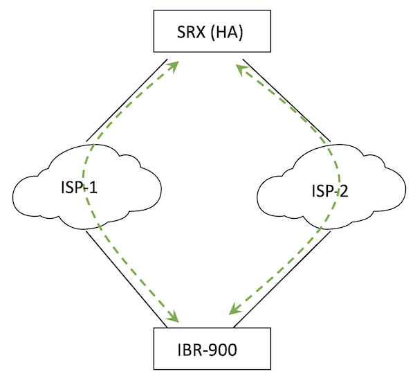

During the testing process, use cases for IPSec connectivity included both Internet Key Exchange (IKE) Main Mode and Aggressive Mode.  Main mode used when both sides of the tunnels were configured with static IP addresses, while Aggressive Mode is when one side of the tunnel is assigned IPs dynamically.  Typically, a CP will be deployed with one or more active cellular radios for connectivity with dynamically assigned addresses to a head-end with one or more Internet (ISP) uplinks.  Evaluation of both modes were tested, simulating cellular connections with Ethernet WAN, as follows:

- Dual Site-to-Site Tunnels (Main Mode); both active
- Dual Site-to-Site Tunnels (Main Mode); 1 active, 1 failover
- Dual Site-to-Site Tunnels (Agressive Mode)
- Split Tunnel and non-Split Tunnel configurations

### Failover

Goals for failover scenarios include loss of an ISP at either the head-end or remote site while providing for automatic tunnel/traffic connectivity.  Traffic connectivity maintained via routing to active (established) secondary tunnel.  Alternatively, tunnel connectivity achieved with a back-up tunnel; when the primary tunnel fails the secondary (backup) tunnel will build.

Failover testing was not exhaustive (Table 1); networking environments vary, inclusive of detection methods and timers, redundancy, utilization, latency, etc. Basic failure testing included gracefully disabling tunnels on the IBR, shutting down interfaces, rebooting and manual failovers to trigger failover events on the SRX.   The results do not include any interval associated with tunnel failure detection (e.g. Dead Peer Detection (DPD), BGP, or BFD).  It is assumed this time will be added to the total window of detection and failover.

Most use cases for Aggressive Mode connectivity are centric on establishing a tunnel with traffic flows originating from the dynamically assigned site, or remote site, with traffic ingressing into a center site or head-end.   Egress, or traffic originating from the head-end to the remote site after tunnels are established was also considered.

| Dual Active | TCP Flows | UDP Flows | New Sessions |
|:--|:--|:--|:--|
| Tunnel Down | Broken | 60" impact | 0 |
| Tunnel Up | Broken | 60" impact | 0 |
| RG-1 Data Plane Fail-overs | 0 | 0 | 0 |
| RG-0 Control Plane Failovers | 0 | 0 | 0 |

| Tunnel Failover (Backup) | TCP Flows | UDP Flows | New Sessions |
|:--|:--|:--|:--|
| Tunnel Down | Broken | 60" impact | 30'' |
| Tunnel Up | Broken | 60" impact | 0 |
| RG-1 Data Plane Fail-overs | 0 | 0 | 0 |
| RG-0 Control Plane Failovers | 0 | 0 | 0 |

TCP Flows and UDP Flows referenced in Tables above represent long lived flows (e.g. file transfer, monitoring sessions, etc.).  Shifting traffic between IPSec tunnels breaks existing sessions is expected behavior.  SYN Checking on the SRX drops any new session without the SYN flag set for both VPN tunnel traffic (syn-check-in-tunnel) and for any other session (syn-check).  Stateless, UDP, long lived flows (same source and destination ports) exhibit a 60 second impact related to the UDP session timeout.  Once the original session, session on the failed tunnel, ages out of the session table -- a new session will reconnect on the new tunnel without intervention (assuming the application is tolerant).

The 30 seconds associated with the backup (IBR failover) for new sessions is related to new tunnel establishment -- the time it takes to bring up the backup (new) tunnel.

### Alerting and App Visibility

Alerts, for the entire organization, are configurable (Figure 2).  [Reference](https://www.mist.com/documentation/alerts/) for additional details on configuring alerts and actions.  Holistic visibility for all configured tunnels can be viewed via WAN Edge, including volumetric data, current uptime and last seen (Figure 3).  WAN Edge Insights provides additional information about tunnel up/down events (WAN Edge Events) application-level visibility (Application Insights).

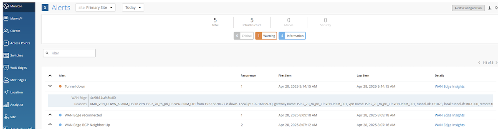

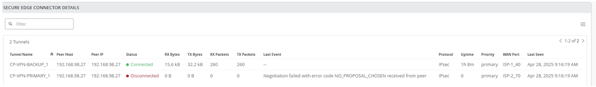

From WAN Edge Insights, events can be filtered to identify specific tunnel events (up/down).  Detailed information per event will identify the specific tunnel ID that was involved with the event (Figure 4).

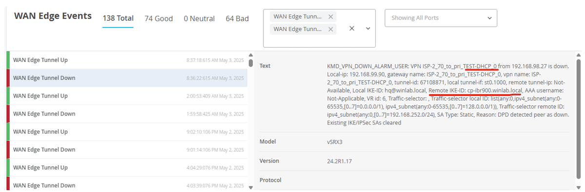

Per policy application traffic is visible within the Application Path Insights (Figure 5) section of WAN Edge Insights.  Policies can be built per tunnel for more granular visibility or aggregated into a single policy.

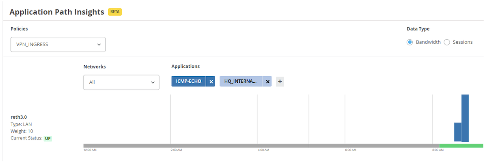

Specific client application data is also visible:

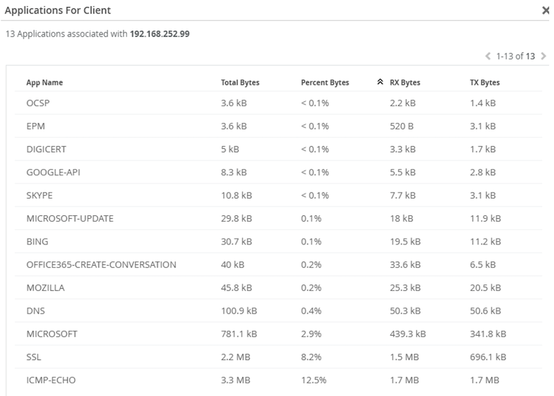

## Designs

Figure 7 shows the topology used.  Two SRXs (node 0 and node 1) are configured in an HA cluster (HUB-CLUSTER).  2 Redundant Ethernet (RETH) interfaces connect to two different BGP peered Autonomous Systems (AS) representing two different ISPs.  RETH 0 connects to ISP 1 and RETH 1 connects to ISP 2.  Their respective WAN interfaces are ISP_1-40 and ISP_2-70.  RETH 3 simulates an internal network and is mapped to the LAN interface.  For brevity, all testing was performed with tunnels between IBR-900 WAN-1.  Similar results would be achieved by including redundant configurations on the IBR to include WAN-2 as a failover interface (four total tunnel configurations on each end versus two).

Note: The IBR can only have 1 active WAN interface at a time.

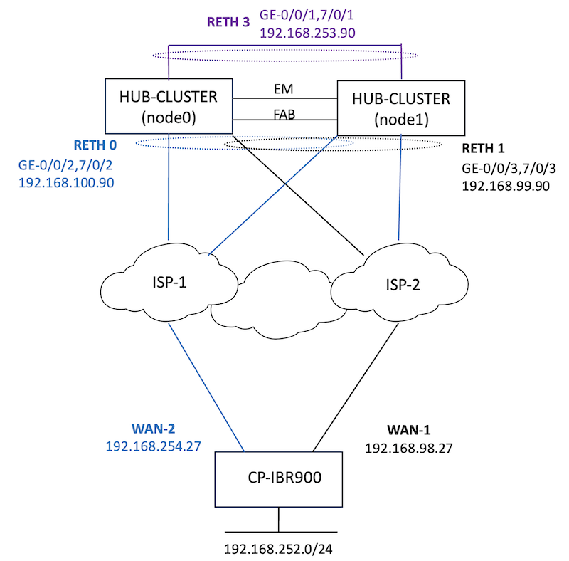

### Routing and Split Tunneling

Split Tunneling allows for specific traffic to be directed to the established VPN while other traffic follows the default route behaviour (Figure 8). Often split tunneling is used to send traffic directly to the Internet and not across the tunnel.  Configuring the routes processed on the tunnel itself will either allow split tunneling or not.  If all traffic is routed across the tunnel, effectively, there is no split tunnel (Figure 9).

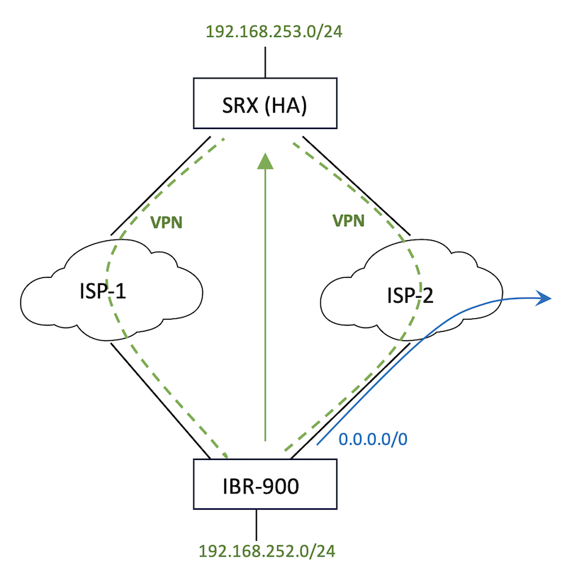

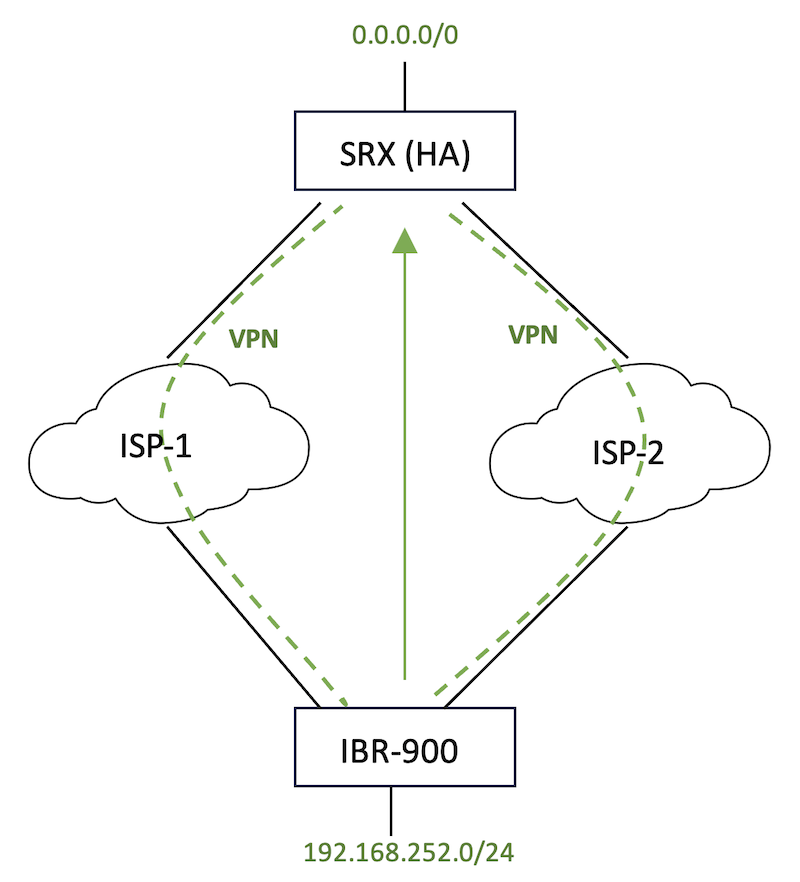

With two active tunnels from the remote site to SRXs' respective ISP facing interfaces, be aware of routing and return route possibilities.  There are several methods to engineer traffic such that there is a primary and a secondary (backup) tunnel (e.g. dynamic routing protocol over the tunnels with bi-directional forwarding detection (BFD) in lieu of DPD).  This implementation leverages routes applied to the tunnels (traffic selectors).

For example, in a split tunnel configuration with the desired result being the primary tunnel is from the remote site at 192.168.98.27 (IBR WAN-1) to 192.168.99.90 (SRX RETH 1) while the secondary tunnel is configured between 192.168.98.27 (IBR WAN-1) to 192.168.100.90 (SRX RETH 0) for traffic between 192.168.252.0/24 (IBR) to 192.168.253.0/24 (SRX) split the subnet (more specific) on the primary.  Dividing the /24 into two /25s provides more specific route selection over a /24 configured on the secondary.  Similarly, dividing 0.0.0.0/0 into two as 0.0.0.0/1 and 128.0.0.0/1 for no split tunneling.

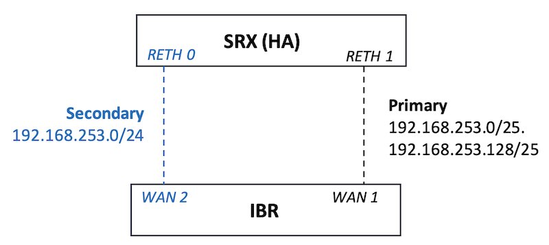

Traffic steering policy (qualified-next-hop) ensures return traffic is consistently associated with the primary or backup tunnel.  For additional details see the Mist Mechanics section.

### IPSEC Tunnel/Secure Edge Connector

Information required prior to configuring IPSEC tunnels (Secure Edge Connector) with Mist include:

- Tunnel Interfaces (source and destination IP adresses)
- Tunnel specifics, e.g. IKE IDs, crypto suites, etc.
- Traffic to be sent over the tunnel(s)
- Security Policies to be enforced

Reference the [IPSec VPN User Guide](https://www.juniper.net/documentation/us/en/software/junos/vpn-ipsec/topics/topic-map/security-ipsec-vpn-configuration-overview.html) for additional details.

Network, application objects and WAN interfaces should be configured before configuring the Secure Edge Connector(s).  Figure 11 shows the User Interface (UI) steps to build a custom Secure Edge Connector.

Navigate to: Organization | WAN Edge Templates | Secure Edge Connectors

- (1) Add Providers
- (2) Define Tunnel
- (3) Configure Local Parameters
- (4) Configure Remote Parameters
- (5) Configure IKE Proposals
- (6) Configure IPSec Proposals
- (7) Save IPSec Tunnel Configuration
- (8) Apply/Activate Configuration

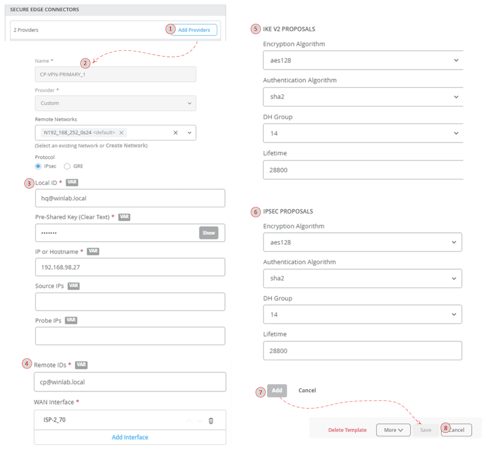

The local and remote IKE-IDs, pre-shared key, and IKE/IPSEC proposals need to match with the remote site configuration (Figure 12) to successfully build an IPSec tunnel between both sites.

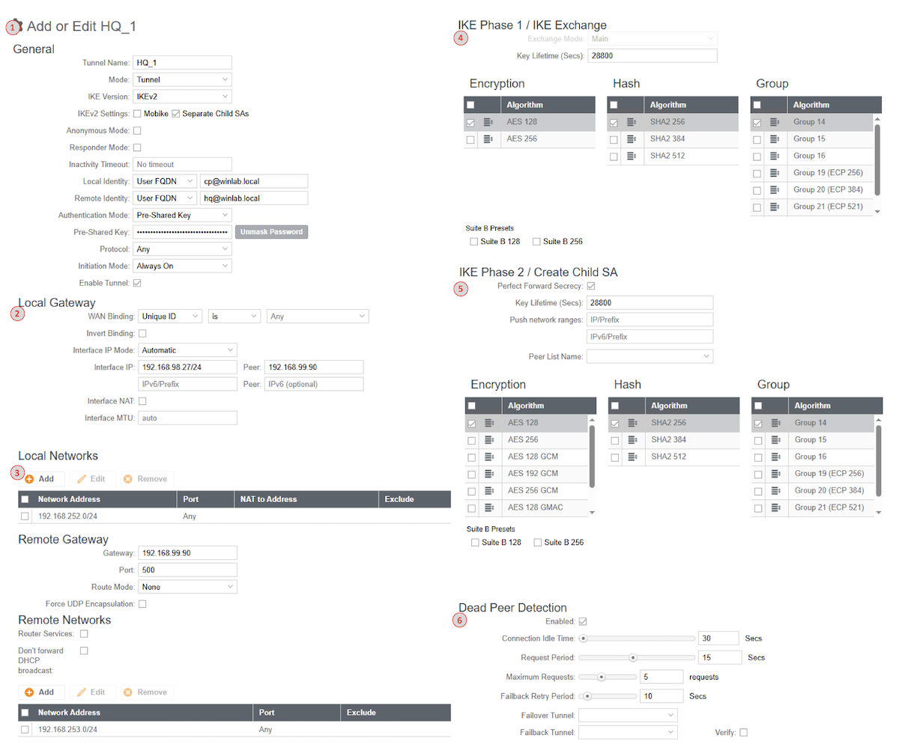

### Dual Active Main Mode

You cannot build two site-to-site tunnels to the same IKE gateway with the same tunnel end-point IP addresses.  In this scenario, to have two, always on tunnels from the IBR WAN-1 interface to the SRX, tunnels are built to two separate IKE gateways (associated with two different interfaces).  Loopback interfaces can be used, however, currently there isn't a method to create these types of interfaces within the Mist UI.

```
HUB_CLUSTER_node0> show configuration security ike | display set | grep gateway | grep external 

set security ike gateway ISP-2_70_to_pri_TEST-DHCP_0 external-interface reth1.0
set security ike gateway ISP-1_40_to_pri_TEST-DHCP-2_0 external-interface reth0.0

HUB_CLUSTER_node1> show security ipsec security-associations detail 
node0:
--------------------------------------------------------------------------
ID: 67108866 Virtual-system: root, VPN Name: ISP-1_40_to_pri_TEST-DHCP-2_0
  Local Gateway: 192.168.100.90, Remote Gateway: 192.168.98.27
  Local Identity: ipv4_subnet(any:0,[0..7]=0.0.0.0/0)
  Remote Identity: ipv4_subnet(any:0,[0..7]=192.168.252.0/24)
  Version: IKEv2
....
ID: 67108865 Virtual-system: root, VPN Name: ISP-2_70_to_pri_TEST-DHCP_0
  Local Gateway: 192.168.99.90, Remote Gateway: 192.168.98.27
  Local Identity: list(any:0,ipv4_subnet(any:0-65535,[0..7]=0.0.0.0/1), ipv4_subnet(any:0-65535,[0..7]=128.0.0.0/1))
  Remote Identity: ipv4_subnet(any:0,[0..7]=192.168.252.0/24)
  Version: IKEv2...
```

(IKE Gateways and IPSec Security Associations for Dual Active Tunnels).

### Failover (IBR)

Cradle Point IBR allows for a failover and failback configuration of the IPSec tunnels along with gateway tracking.  In this configuration, the primary tunnel will need to be torn down and the secondary (backup) tunnel will initiate.  Likewise, when the primary tunnel becomes available again, traffic will shift back.  For additional information refer to [Cradle Point's documentation](https://docs.cradlepoint.com/r/IPsec-configuration-guide/Configuring-Failover-and-Failback-for-Tunnel-Mode-IPSec-VPNs).

### Dual Active Aggressive Mode

When either side of a tunnel uses dynamic IP assignments aggressive mode is required.  The configurations are nearly identical with main mode except knowledge of the peer's IP is unknown.  Since Mist assumes a point-to-point tunnel with main mode configuration changes will need to be made via the CLI form to explicitly set the mode to aggressive and set the dynamic identity.  The following example shows the CLI modifications for the IKE-ID hostname.  The IKE-IDs need to match on both sides for successful tunnel establishments (Figure 13).

```
set security ike policy TEST-DHCP mode aggressive
set security ike gateway ISP-2_70_to_pri_TEST-DHCP_0 dynamic hostname cp-ibr900.winlab.local
delete security ike gateway ISP-1_40_to_pri_TEST-DHCP-2_0 remote-identity
set security ike policy TEST-DHCP-2 mode aggressive
set security ike gateway ISP-1_40_to_pri_TEST-DHCP-2_0 dynamic hostname cp-ibr900.winlab.local
```

(Aggressive Mode Configuration)

Matching the IBR's local and remote IDs with the SRX.

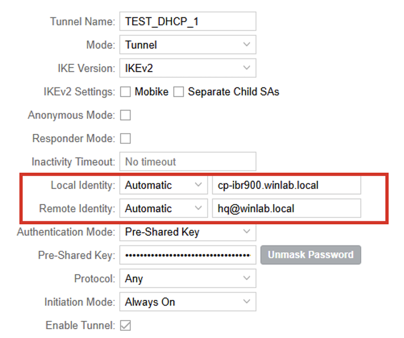

### Tunnel Failovers

Testing of traffic during failover and failback (Figure 14) events does not account for a "stale" tunnel -- inoperable but waiting for detection and tear down.  All flows are broken and will need to be re-established on either failover or failback events.  Long lived UDP flows, stateless -- 60 seconds age out.  New connections are not impacted once routing decision updates point to the surviving tunnel.

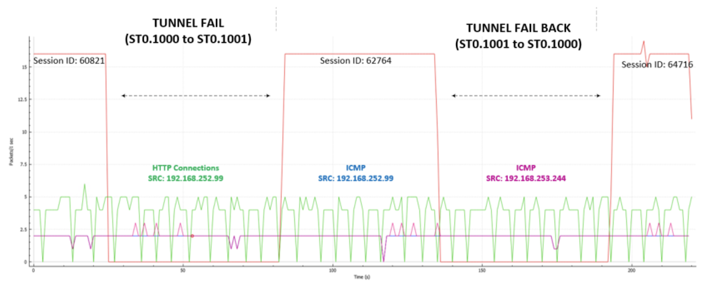

Failover events showing a 60 second impact to a long-lived (same source and destination ports) UDP flow.  The following outputs can be misleading.  The same security policy name is used for two different policies -- 01_VPN_2_HQ.   Refer to the security policy section for more details.

```
HUB_CLUSTER_node0> show security flow session source-prefix 192.168.252.99 destination-prefix 192.168.253.244 protocol udp    

node0:
--------------------------------------------------------------------------

Session ID: 60821, Policy name: 01_VPN_2_HQ/4, HA State: Active, Timeout: 56, Session State: Valid
  In: 192.168.252.99/64177 --> 192.168.253.244/5201;udp, Conn Tag: 0x0, If: st0.1000, Pkts: 3003, Bytes: 24684660, 
  Out: 192.168.253.244/5201 --> 192.168.252.99/64177;udp, Conn Tag: 0x0, If: reth3.0, Pkts: 0, Bytes: 0, 
Total sessions: 1
...
```

(UDP flow at initial Failover)

```
HUB_CLUSTER_node0> show security flow session source-prefix 192.168.252.99 destination-prefix 192.168.253.244 protocol udp    
node0:
--------------------------------------------------------------------------

Session ID: 62764, Policy name: 01_VPN_2_HQ/5, HA State: Active, Timeout: 60, Session State: Valid
  In: 192.168.252.99/64177 --> 192.168.253.244/5201;udp, Conn Tag: 0x0, If: st0.1001, Pkts: 7, Bytes: 57540, 
  Out: 192.168.253.244/5201 --> 192.168.252.99/64177;udp, Conn Tag: 0x0, If: reth3.0, Pkts: 0, Bytes: 0, 
Total sessions: 1
...
```

(UDP flow -- Fail over from ST0.1000 to ST0.1001)

```
HUB_CLUSTER_node0> show security flow session source-prefix 192.168.252.99 destination-prefix 192.168.253.244 protocol udp    
node0:
--------------------------------------------------------------------------

Session ID: 64146, Policy name: 01_VPN_2_HQ/4, HA State: Active, Timeout: 60, Session State: Valid
  In: 192.168.252.99/64177 --> 192.168.253.244/5201;udp, Conn Tag: 0x0, If: st0.1000, Pkts: 237, Bytes: 1948140, 
  Out: 192.168.253.244/5201 --> 192.168.252.99/64177;udp, Conn Tag: 0x0, If: reth3.0, Pkts: 0, Bytes: 0, 
Total sessions: 1
...
```

(UDP flow -- Failback from ST0.1001 to ST0.1000)

### Source NAT

Use the CLI to configure source NAT for the VPN traffic if required.  For instance, traffic ingressing from a tunnel egressing to the Internet, source NAT may be necessary.  Source NAT example from two tunnels (zones), tun_TEST-DHCP and tun_TEST-DHCP-2 to either WAN:

```
set security nat source rule-set VPN_INET from zone tun_TEST-DHCP
set security nat source rule-set VPN_INET from zone tun_TEST-DHCP-2
set security nat source rule-set VPN_INET to zone ISP-1_40
set security nat source rule-set VPN_INET to zone ISP-2_70
set security nat source rule-set VPN_INET rule VPN_SNAT_INET match source-address 0.0.0.0/0
set security nat source rule-set VPN_INET rule VPN_SNAT_INET then source-nat interface
```
(CLI source NAT Configuration)

## Mist Mechanics

Mist leverages the APP-Id suite and Advanced Policy Based Routing (APBR) for traffic engineering and security policies.  This section covers the detailed configurations pushed from Mist to SRX.

### Mist Defaults

There are several default configuration elements that are configured by Mist simplifying complex deployments including DPD, IPSec, interface numbering, route-instances, static routes, IP Monitoring, etc. for common deployments.  Any configuration that requires modification can be done by implementing configuration commands (in set format) in the CLI window from WAN Edge Templates (Figure 15).  These commands will be appended to the Mist generated configuration when saved/committed.

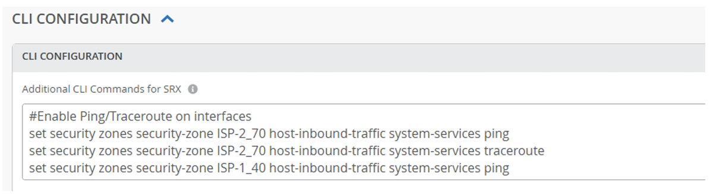

DPD (30 second detection):

```
set security ike gateway [GW] dead-peer-detection optimized
set security ike gateway [GW] dead-peer-detection interval 10
set security ike gateway [GW] dead-peer-detection threshold 3
```

(DPD Configuration)

IPSec Main Mode:

```
set security ike policy [POLICY] mode main
...
security ike gateway [GW] remote-identity user-at-hostname "[NAME]"
...
```

(IPSEC Main Mode Configuration)

Secure Edge Connect tunnels begin at 1000:

```
set interfaces st0 unit 1000 family inet
set interfaces st0 unit 1001 family inet
...
set interfaces st0 unit 1XXX family inet
```

(Secure Tunnel Interface Configurations)

Loopback interfaces are configured from 100.100.0.x space and used as router-id, log stream and app_usage sources (which is then source nat'd).

```
set groups top interfaces lo0 unit 0 family inet address 100.100.0.3/32
...
set groups top routing-options router-id 100.100.0.3
set groups Mist-wa security log source-address 100.100.0.3
set groups Mist-wa security log stream app_usage source-address 100.100.0.3
```

(Loopback Interface Configuration)

Default BGP configurations include hold time (90), log-updown, multipath multiple-as and if BFD is selected -- 1000ms.

```
set routing-instances [INSTANCE] protocols bgp group [GROUP] hold-time 90
set routing-instances [INSTANCE] protocols bgp group [GROUP] log-updown
set routing-instances [INSTANCE] protocols bgp group [GROUP] local-as 65021
set routing-instances [INSTANCE] protocols bgp group [GROUP] multipath multiple-as
set routing-instances [INSTANCE] protocols bgp group [GROUP] bfd-liveness-detection minimum-interval 1000
```

(BGP Configurations)

IP Monitoring/RPM Probes check ICMP to Google (8.8.8.8) for WAN interfaces.

```
set groups top services rpm probe [WAN] test wan_ping probe-type icmp-ping
set groups top services rpm probe [WAN] test wan_ping target address 8.8.8.8
set groups top services rpm probe [WAN] test wan_ping probe-count 3
set groups top services rpm probe [WAN] test wan_ping probe-interval 5
set groups top services rpm probe [WAN] test wan_ping test-interval 30
set groups top services rpm probe [WAN] test wan_ping routing-instance [WAN]
set groups top services rpm probe [WAN] test wan_ping thresholds successive-loss 2
set groups top services rpm probe [WAN] test wan_ping thresholds total-loss 2
set groups top services rpm probe [WAN] test wan_ping hardware-timestamp
...
set groups top services ip-monitoring policy [WAN_down] match rpm-probe [WAN]
set groups top services ip-monitoring policy [WAN_down] then preferred-route routing-instances [WAN] route 100.99.255.x/32 discard
...
set groups top policy-options condition [WAN_down] if-route-exists address-family inet 100.99.255.x/32
set groups top policy-options condition [WAN_down] if-route-exists address-family inet table [WAN.inet.0]
```

(IP Monitoring Configuration)

Bogon host routes (100.99.255.x) created for APBR forwarding instances for route table next-hop decision making between forwarding instances.

### High Availability

Documentation is available covering Mist and SRX HA configurations.  Refer to the [Juniper Mist WAN Assurance Configuration Guide](https://www.juniper.net/documentation/us/en/software/mist/mist-wan/topics/topic-map/srx-high-availability-configuration.html) and [High Availability SRX](https://www.mist.com/documentation/high-availability-srx-example/) Example sites.

Ensure proper cabling and interface assignments.  Mist will create an HA cluster with interface monitoring in a single redundancy group with preemption.  If more advanced monitoring or redundancy group configurations are required -- use the CLI.

```
HUB_CLUSTER_node0> show configuration chassis cluster | display set

set chassis cluster control-link-recovery
set chassis cluster reth-count 4
set chassis cluster initial-hold 60
set chassis cluster redundancy-group 0 node 0 priority 100
set chassis cluster redundancy-group 0 node 1 priority 1
set chassis cluster redundancy-group 1 node 0 priority 100
set chassis cluster redundancy-group 1 node 1 priority 1
set chassis cluster redundancy-group 1 preempt
set chassis cluster redundancy-group 1 hold-down-interval 10
set chassis cluster redundancy-group 1 interface-monitor ge-0/0/1 weight 255
set chassis cluster redundancy-group 1 interface-monitor ge-7/0/1 weight 255
set chassis cluster redundancy-group 1 interface-monitor ge-0/0/2 weight 255
set chassis cluster redundancy-group 1 interface-monitor ge-7/0/2 weight 255
set chassis cluster redundancy-group 1 interface-monitor ge-0/0/3 weight 255
set chassis cluster redundancy-group 1 interface-monitor ge-7/0/3 weight 255
```

(HA Chassis Cluster Configuration)

### Interfaces

Include both physical interfaces of a RETH interface when defining the WAN and LAN interfaces (Figure 16):

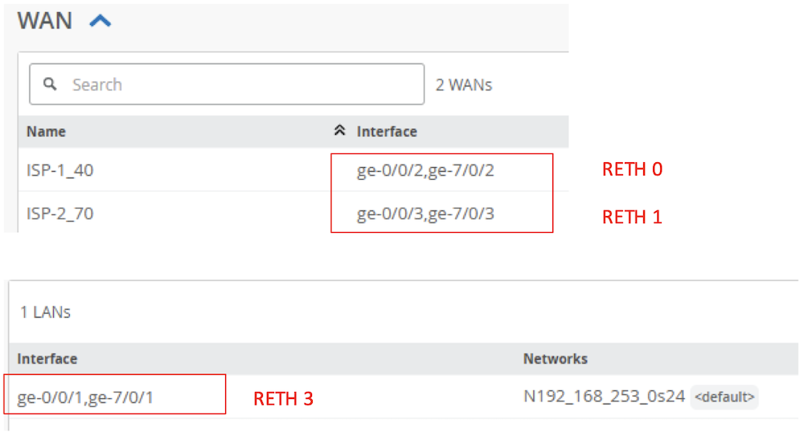

Complete SRX interface configurations:

```
set interfaces interface-range ha_data member ge-0/0/0
set interfaces interface-range ha_data member ge-7/0/0
set interfaces ge-0/0/1 description INTERNAL
set interfaces ge-0/0/1 ether-options redundant-parent reth3
set interfaces ge-0/0/2 ether-options redundant-parent reth0
set interfaces ge-0/0/3 ether-options redundant-parent reth1
set interfaces ge-7/0/1 description INTERNAL
set interfaces ge-7/0/1 ether-options redundant-parent reth3
set interfaces ge-7/0/2 ether-options redundant-parent reth0
set interfaces ge-7/0/3 ether-options redundant-parent reth1
set interfaces fab0 fabric-options member-interfaces ge-0/0/0
set interfaces fab1 fabric-options member-interfaces ge-7/0/0
set interfaces reth0 redundant-ether-options redundancy-group 1
set interfaces reth0 unit 0 family inet address 192.168.100.90/24
set interfaces reth1 redundant-ether-options redundancy-group 1
set interfaces reth1 unit 0 family inet address 192.168.99.90/24
set interfaces reth3 description INTERNAL
set interfaces reth3 redundant-ether-options redundancy-group 1
set interfaces reth3 unit 0 description N192_168_253_0s24
set interfaces reth3 unit 0 family inet address 192.168.253.1/24
set interfaces st0 unit 1000 family inet
set interfaces st0 unit 1001 family inet
```

(Interface Configurations)

### Zones

Each Secure Edge Connect, LAN and WAN interface will create a separate zone and virtual router instance.  Traffic steering policies are used to forward traffic to a destination zone

```
HUB_CLUSTER_node0> show security zones terse 
node0:
--------------------------------------------------------------------------
Zone                        Type
ISP-1_40                    Security
ISP-2_70                    Security
N192_168_253_0s24           Security
tun_TEST-DHCP               Security
tun_TEST-DHCP-2             Security
junos-host                  Security
```

(Security Zones)

Mist will configure only the required "host-inbound-traffic" protocols and services needed to build the configuration from the UI.  Use the CLI to add any additional services (e.g.  external interface monitoring - ping, traceroute for troubleshooting, etc.)

Secure Edge Connectors are prefaced with "tun_" and the configured name.

```
set security zones security-zone tun_TEST-DHCP tcp-rst
set security zones security-zone tun_TEST-DHCP host-inbound-traffic system-services all
set security zones security-zone tun_TEST-DHCP host-inbound-traffic protocols all
set security zones security-zone tun_TEST-DHCP interfaces st0.1000
set security zones security-zone tun_TEST-DHCP application-tracking
```

(Tunnel Configuration)

Zones will be created from the names provided for each of the interfaces assigned.

```
set security zones security-zone ISP-2_70 tcp-rst
set security zones security-zone ISP-2_70 screen untrust-screen
set security zones security-zone ISP-2_70 host-inbound-traffic system-services ike
set security zones security-zone ISP-2_70 host-inbound-traffic protocols bfd
set security zones security-zone ISP-2_70 host-inbound-traffic protocols bgp
set security zones security-zone ISP-2_70 interfaces reth1.0
set security zones security-zone ISP-2_70 application-tracking
```

(Security Zone Configuration)

### Routing

Mist applies Advanced (Application) Policy Based Routing (APBR) constructs to route traffic on the SRX.  APBR is implemented with Traffic Steering Profiles.  Every Traffic Steering profile (Figure 17) is associated with a unique virtual router.  The Traffic Steering profiles used in the Application Policies are used to forward traffic to destination security zones.

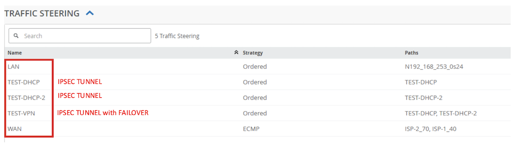

Traffic steering policies (APBR) are then applied to security policies (Figure 18) to drive traffic to specific zones (destination) for enforcement.  Configurations only pushed to the SRX for policies that are applied to an application policy.

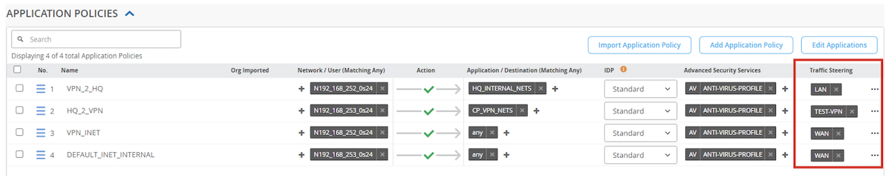

### LAN

The LAN instance is straightforward - importing directly connected routes from inet.0 (master) table are imported into the apbr_LAN instance (Figure 19).  In this case, 100.100.0.3/32 (Loopback 0.0) and 192.168.253.0/24 (RETH 3).

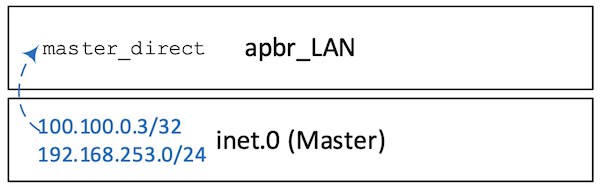

```
set policy-options policy-statement master_direct term 01_direct from instance master
set policy-options policy-statement master_direct term 01_direct from protocol direct
set policy-options policy-statement master_direct term 01_direct then accept
set policy-options policy-statement master_direct term 02_not_direct from instance master
set policy-options policy-statement master_direct term 02_not_direct then reject
...
set routing-instances apbr_LAN instance-type forwarding
set routing-instances apbr_LAN routing-options instance-import master_direct
```

(APBR_LAN Policy and Route Instance)

```
HUB_CLUSTER_node0> show route table apbr_LAN.inet.0 

apbr_LAN.inet.0: 2 destinations, 2 routes (2 active, 0 holddown, 0 hidden)
+ = Active Route, - = Last Active, * = Both

100.100.0.3/32     *[Direct/0] 01:03:03
                    >  via lo0.0
192.168.253.0/24   *[Direct/0] 01:02:02
                    >  via reth3.0
```

(APBR_LAN Route Table)

### WAN

In this scenario, an ECMP method (Figure 20) is used with the WAN profile to load-balance egress traffic out both ISP paths ISP-1_40 (RETH 0) and ISP-2_70 (RETH 1).   Five route tables are created to support the APBR forwarding for the WAN Traffic Steering profile.  Two base route tables: ISP1_40 and ISP-2_70.  Two route tables for ECMP, ISP-1_40_ecmp and ISP-2_70_ecmp.  One table to support the APBR functionality -- apbr_WAN.

Traffic forwarding decisions are initially performed at the APBR instance.   Under normal conditions, default routes will be in the ECMP tables pointing to respective base tables (ISP-1_40 and ISP-2_70) and map to either ISP-1_40 or ISP-2_70 security zones.

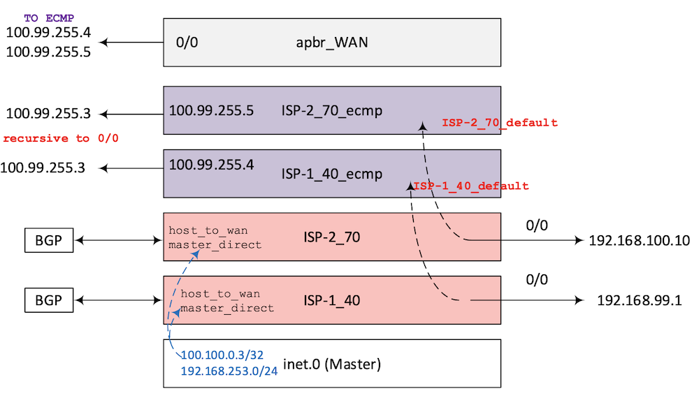

Base WAN Instances

A default static route is added to the configured gateways per base WAN routing instance.

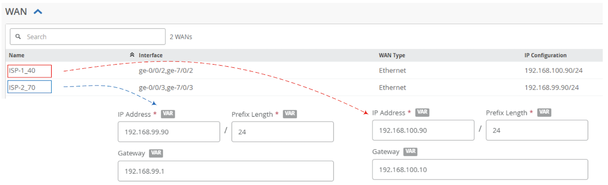

```
set routing-instances ISP-1_40 routing-options static route 0.0.0.0/0 next-hop 192.168.100.10
set routing-instances ISP-2_70 routing-options static route 0.0.0.0/0 next-hop 192.168.99.1
```

(WAN static routes)

Like the LAN instance, direct routes, and host_to_wan prefixes are imported.  Dynamically learned routes, BGP in this case, are in the base tables as well.

```
set policy-options policy-statement host_to_wan term 01_lo0 from instance master
set policy-options policy-statement host_to_wan term 01_lo0 from route-filter 100.100.0.3/32 exact
set policy-options policy-statement host_to_wan term 01_lo0 then accept
```

(Policy Options)

```
set routing-instances ISP-1_40 instance-type virtual-router
set routing-instances ISP-2_70 instance-type virtual-router
...
set routing-instances ISP-1_40 routing-options instance-import host_to_wan
set routing-instances ISP-1_40 routing-options instance-import master_direct
set routing-instances ISP-2_70 routing-options instance-import host_to_wan
set routing-instances ISP-2_70 routing-options instance-import master_direct
...
set routing-instances ISP-1_40 interface reth0.0
set routing-instances ISP-2_70 interface reth1.0
```

(WAN Routing Instances)

Below exhibits ISP-1_40's route table.  ISP-1_40 and ISP-2_70 route tales are nearly identical.

```
ISP-1_40.inet.0: 7 destinations, 8 routes (7 active, 0 holddown, 0 hidden)
+ = Active Route, - = Last Active, * = Both

0.0.0.0/0          *[Static/5] 01:02:45
                    >  to 192.168.100.10 via reth0.0
                    [BGP/170] 01:02:17, localpref 100
                      AS path: 65003 I, validation-state: unverified
                    >  to 192.168.100.10 via reth0.0
100.100.0.3/32     *[Direct/0] 01:03:46
                    >  via lo0.0
192.168.98.0/24    *[BGP/170] 01:02:17, localpref 100, from 192.168.100.10
                      AS path: 65003 65002 I, validation-state: unverified
                    >  to 192.168.100.1 via reth0.0
192.168.100.0/24   *[Direct/0] 01:02:45
                    >  via reth0.0
192.168.100.90/32  *[Local/0] 01:02:45
                       Local via reth0.0
192.168.253.0/24   *[Direct/0] 01:02:45
                    >  via reth3.0
192.168.254.0/24   *[BGP/170] 01:02:17, localpref 100
                      AS path: 65003 I, validation-state: unverified
                    >  to 192.168.100.10 via reth0.0
```

(Example WAN Route Table -- ISP-1_40)

### ECMP Instances

The ISP-1_40_ecmp and ISP-2_70_ecmp instances' imported terms are identical with exception of the bogon static route (ISP-1_40 points to 100.99.255.4 while ISP-2_70 points to 100.99.255.5).  These statics are recursively reachable via the default route (if present) in the respective tables.  Successful results from IP monitoring allows the import of the default route from ISP-1_40 and ISP-2_70 tables to the ECMP tables.

```
set routing-instances ISP-1_40_ecmp instance-type forwarding
set routing-instances ISP-1_40_ecmp routing-options static route 100.99.255.4/32 next-hop 100.99.255.3
set routing-instances ISP-1_40_ecmp routing-options static route 100.99.255.4/32 resolve
set routing-instances ISP-1_40_ecmp routing-options instance-import ISP-1_40_default
```

(ECMP Options)

```
set policy-options policy-statement ISP-1_40_default term 01_ISP-1_40_down from instance ISP-1_40
set policy-options policy-statement ISP-1_40_default term 01_ISP-1_40_down from route-filter 0.0.0.0/0 exact
set policy-options policy-statement ISP-1_40_default term 01_ISP-1_40_down from condition ISP-1_40_down
set policy-options policy-statement ISP-1_40_default term 01_ISP-1_40_down then reject
set policy-options policy-statement ISP-1_40_default term 02_ISP-1_40_default from instance ISP-1_40
set policy-options policy-statement ISP-1_40_default term 02_ISP-1_40_default from route-filter 0.0.0.0/0 exact
set policy-options policy-statement ISP-1_40_default term 02_ISP-1_40_default then accept
set policy-options policy-statement ISP-1_40_default term 03_ISP-1_40_cleanup then reject
```

(Policy Options)

```
HUB_CLUSTER_node0> show route table ISP-1_40_ecmp.inet.0 

ISP-1_40_ecmp.inet.0: 2 destinations, 2 routes (2 active, 0 holddown, 0 hidden)
+ = Active Route, - = Last Active, * = Both

0.0.0.0/0          *[Static/5] 01:02:50
                    >  to 192.168.100.10 via reth0.0
100.99.255.4/32    *[Static/5] 01:02:50, metric2 0
                    >  to 192.168.100.10 via reth0.0

HUB_CLUSTER_node0> show route table ISP-2_70_ecmp.inet.0 

ISP-2_70_ecmp.inet.0: 2 destinations, 2 routes (2 active, 0 holddown, 0 hidden)
+ = Active Route, - = Last Active, * = Both

0.0.0.0/0          *[Static/5] 01:39:56
                    >  to 192.168.99.1 via reth1.0
100.99.255.5/32    *[Static/5] 01:39:56, metric2 0
                    >  to 192.168.99.1 via reth1.0
```

(ECMP Route Tables)

### APBR Instance

APBR instance has two static routes (bogon) for reachability to the ECMP tables.

```
set routing-instances apbr_WAN instance-type forwarding
set routing-instances apbr_WAN routing-options static route 0.0.0.0/0 next-hop 100.99.255.5
set routing-instances apbr_WAN routing-options static route 0.0.0.0/0 qualified-next-hop 100.99.255.4
set routing-instances apbr_WAN routing-options static route 0.0.0.0/0 resolve
set routing-instances apbr_WAN routing-options instance-import apbr_WAN_wan
```

(APBR Static Routes)

```
set policy-options policy-statement apbr_WAN_wan term 01_ISP-2_70_indirect from instance ISP-2_70_ecmp
set policy-options policy-statement apbr_WAN_wan term 01_ISP-2_70_indirect from route-filter 100.99.255.5/32 exact
set policy-options policy-statement apbr_WAN_wan term 01_ISP-2_70_indirect then accept
set policy-options policy-statement apbr_WAN_wan term 02_ISP-2_70_cleanup from instance ISP-2_70_ecmp
set policy-options policy-statement apbr_WAN_wan term 02_ISP-2_70_cleanup then reject
set policy-options policy-statement apbr_WAN_wan term 03_ISP-1_40_indirect from instance ISP-1_40_ecmp
set policy-options policy-statement apbr_WAN_wan term 03_ISP-1_40_indirect from route-filter 100.99.255.4/32 exact
set policy-options policy-statement apbr_WAN_wan term 03_ISP-1_40_indirect then accept
set policy-options policy-statement apbr_WAN_wan term 04_ISP-1_40_cleanup from instance ISP-1_40_ecmp
set policy-options policy-statement apbr_WAN_wan term 04_ISP-1_40_cleanup then reject
```

(APBR Policy Options)

```
set routing-instances apbr_WAN instance-type forwarding
set routing-instances apbr_WAN routing-options static route 0.0.0.0/0 next-hop 100.99.255.5
set routing-instances apbr_WAN routing-options static route 0.0.0.0/0 qualified-next-hop 100.99.255.4
set routing-instances apbr_WAN routing-options static route 0.0.0.0/0 resolve
set routing-instances apbr_WAN routing-options instance-import apbr_WAN_wan
```

(APBR Routing Instance)

Default routes are reachable from both RETH 0 and RETH 1 interfaces to the different ISPs.

```
HUB_CLUSTER_node0> show route table apbr_WAN.inet.0 

apbr_WAN.inet.0: 3 destinations, 3 routes (3 active, 0 holddown, 0 hidden)
+ = Active Route, - = Last Active, * = Both

0.0.0.0/0          *[Static/5] 02:42:44, metric2 0
                    >  to 192.168.100.10 via reth0.0
                       to 192.168.99.1 via reth1.0
100.99.255.4/32    *[Static/5] 02:42:44, metric2 0
                    >  to 192.168.100.10 via reth0.0
100.99.255.5/32    *[Static/5] 02:42:44, metric2 0
                    >  to 192.168.99.1 via reth1.0
```

(APBR WAN Route Table)

### Tunnels

Two site-to-site IPSec tunnels (Test-DHCP and TEST-DHCP-2) are configured from the IBR to the SRX and are associated with two routing instances.  Identical options are configured for both tunnels.

```
set groups top policy-options policy-statement tun_TEST-DHCP_direct term 01_direct from instance tun_TEST-DHCP
set groups top policy-options policy-statement tun_TEST-DHCP_direct term 01_direct from protocol direct
set groups top policy-options policy-statement tun_TEST-DHCP_direct term 01_direct then accept
set groups top policy-options policy-statement tun_TEST-DHCP_direct term 02_not_direct from instance tun_TEST-DHCP
set groups top policy-options policy-statement tun_TEST-DHCP_direct term 02_not_direct then reject
```

(Tunnel Policy Options)

```
set routing-instances tun_TEST-DHCP instance-type virtual-router
set routing-instances tun_TEST-DHCP routing-options static route 192.168.252.0/24 next-hop st0.1000
set routing-instances tun_TEST-DHCP interface st0.1000
...
set routing-instances tun_TEST-DHCP-2 instance-type virtual-router
set routing-instances tun_TEST-DHCP-2 routing-options static route 192.168.252.0/24 next-hop st0.1001
set routing-instances tun_TEST-DHCP-2 interface st0.1001
```

(Tunnel Route Instances)

A third routing instance is created to support traffic initiated from the head-end to the remote site.  This APBR tunnel is configured with two default routes.  The second default route has qualified next-hop with a preference of 200.  The primary path (ST0.1000) is preferred over the secondary path (ST0.1001) if both tunnels are up.  This preference matches the route configurations on the remote site preferring the 192.168.99.90 gateway (Figure 22).

```
set groups top routing-instances apbr_TEST-VPN routing-options static route 0.0.0.0/0 next-hop st0.1000
set groups top routing-instances apbr_TEST-VPN routing-options static route 0.0.0.0/0 qualified-next-hop st0.1001 preference 210
set groups top routing-instances apbr_TEST-VPN routing-options static route 0.0.0.0/0 preference 200
set groups top routing-instances apbr_TEST-VPN routing-options instance-import tun_TEST-DHCP-2_direct
set groups top routing-instances apbr_TEST-VPN routing-options instance-import tun_TEST-DHCP_direct
```

(Tunnel APBR instance)

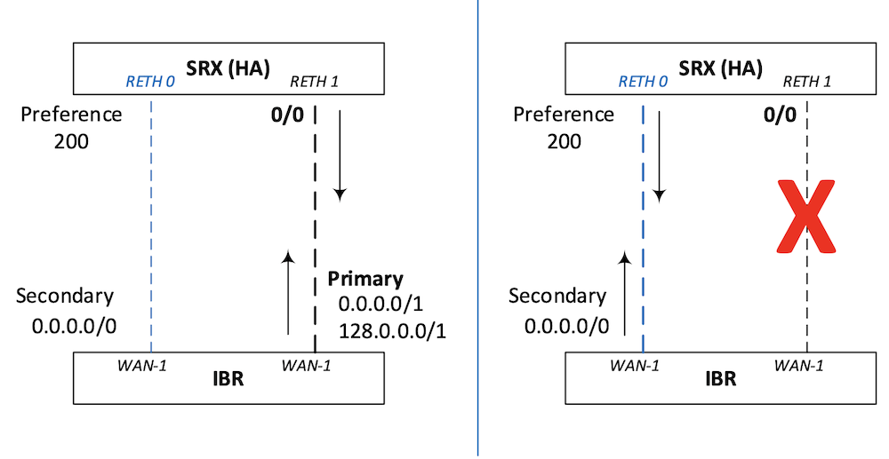

### Security Policies

Rudimentary application policies were configured to communicate security policy enforcement and configurations on the SRX from Mist.  Application policies are constructed from a source network (zone) to a target application (or network -- configured as an application) to a destination zone by means of a traffic steering profile (Figure 23).

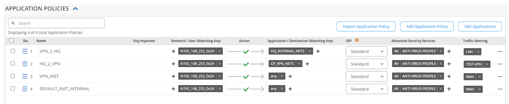

The intent of the policies is:

1. Allow traffic from the remote site, sourcing from 192.168.252.0/24 to the destination network of 192.168.253.0/24 on the LAN (inside).
2. Allow traffic from the head-end, sourcing from 192.168.253.0/24 to the remote site of 192.168.252.0/24 via the primary (preferred) or secondary IPSec tunnel.
3. Allow traffic from the remote site, sourcing from 192.168.252.0/24 to the Internet for any application
4. Allow traffic from the head-end, sourcing from 192.168.253.0/24 to the Internet for any application.

The four Mist application policies will convert to ten SRX security policies.  Mist will prepend the security policies with a number.  If there are multiple applications in a single application policy, sequential numbers will be added, and discrete policies will be built; each match criteria will be a separate security policy.  However, in this example, there is a 1:1 match criteria (source to destination) so all the prepends are "01_"

1. Primary tunnel, Remote to HQ security policy:

```
set security policies from-zone tun_TEST-DHCP to-zone N192_168_253_0s24 policy 01_VPN_2_HQ match source-address 192-168-252-0_24
set security policies from-zone tun_TEST-DHCP to-zone N192_168_253_0s24 policy 01_VPN_2_HQ match destination-address 192-168-253-0_24
set security policies from-zone tun_TEST-DHCP to-zone N192_168_253_0s24 policy 01_VPN_2_HQ match application any
set security policies from-zone tun_TEST-DHCP to-zone N192_168_253_0s24 policy 01_VPN_2_HQ match dynamic-application any
set security policies from-zone tun_TEST-DHCP to-zone N192_168_253_0s24 policy 01_VPN_2_HQ then permit
```

1. Secondary tunnel, Remote to HQ security policy:

```
set security policies from-zone tun_TEST-DHCP-2 to-zone N192_168_253_0s24 policy 01_VPN_2_HQ match source-address 192-168-252-0_24
set security policies from-zone tun_TEST-DHCP-2 to-zone N192_168_253_0s24 policy 01_VPN_2_HQ match destination-address 192-168-253-0_24
set security policies from-zone tun_TEST-DHCP-2 to-zone N192_168_253_0s24 policy 01_VPN_2_HQ match application any
set security policies from-zone tun_TEST-DHCP-2 to-zone N192_168_253_0s24 policy 01_VPN_2_HQ match dynamic-application any
set security policies from-zone tun_TEST-DHCP-2 to-zone N192_168_253_0s24 policy 01_VPN_2_HQ then permit
```

2. Primary tunnel, HQ to Remote, security policy:

```
set security policies from-zone N192_168_253_0s24 to-zone tun_TEST-DHCP policy 01_HQ_2_VPN match source-address 192-168-253-0_24
set security policies from-zone N192_168_253_0s24 to-zone tun_TEST-DHCP policy 01_HQ_2_VPN match destination-address 192-168-252-0_24
set security policies from-zone N192_168_253_0s24 to-zone tun_TEST-DHCP policy 01_HQ_2_VPN match application any
set security policies from-zone N192_168_253_0s24 to-zone tun_TEST-DHCP policy 01_HQ_2_VPN match dynamic-application any
set security policies from-zone N192_168_253_0s24 to-zone tun_TEST-DHCP policy 01_HQ_2_VPN then permit application-services idp-policy standard
set security policies from-zone N192_168_253_0s24 to-zone tun_TEST-DHCP policy 01_HQ_2_VPN then permit application-services utm-policy HQ_2_VPN
```

2.  Primary tunnel, HQ to Remote, security policy:

```
set security policies from-zone N192_168_253_0s24 to-zone tun_TEST-DHCP-2 policy 
01_HQ_2_VPN match source-address 192-168-253-0_24
set security policies from-zone N192_168_253_0s24 to-zone tun_TEST-DHCP-2 policy 01_HQ_2_VPN match destination-address 192-168-252-0_24
set security policies from-zone N192_168_253_0s24 to-zone tun_TEST-DHCP-2 policy 01_HQ_2_VPN match application any
set security policies from-zone N192_168_253_0s24 to-zone tun_TEST-DHCP-2 policy 01_HQ_2_VPN match dynamic-application any
set security policies from-zone N192_168_253_0s24 to-zone tun_TEST-DHCP-2 policy 01_HQ_2_VPN then permit application-services idp-policy standard
set security policies from-zone N192_168_253_0s24 to-zone tun_TEST-DHCP-2 policy 01_HQ_2_VPN then permit application-services utm-policy HQ_2_VPN
```

3. Primary tunnel, Remote to Internet (ISP-1), security policy:

```
set security policies from-zone tun_TEST-DHCP to-zone ISP-1_40 policy 01_VPN_INET match source-address 192-168-252-0_24
set security policies from-zone tun_TEST-DHCP to-zone ISP-1_40 policy 01_VPN_INET match destination-address any
set security policies from-zone tun_TEST-DHCP to-zone ISP-1_40 policy 01_VPN_INET match application any
set security policies from-zone tun_TEST-DHCP to-zone ISP-1_40 policy 01_VPN_INET match dynamic-application any
set security policies from-zone tun_TEST-DHCP to-zone ISP-1_40 policy 01_VPN_INET then permit application-services idp-policy standard
set security policies from-zone tun_TEST-DHCP to-zone ISP-1_40 policy 01_VPN_INET then permit application-services utm-policy VPN_INET
```

3.  Primary tunnel, Remote to Internet (ISP-2), security policy:

```
set security policies from-zone tun_TEST-DHCP to-zone ISP-2_70 policy 01_VPN_INET match source-address 192-168-252-0_24
set security policies from-zone tun_TEST-DHCP to-zone ISP-2_70 policy 01_VPN_INET match destination-address any
set security policies from-zone tun_TEST-DHCP to-zone ISP-2_70 policy 01_VPN_INET match application any
set security policies from-zone tun_TEST-DHCP to-zone ISP-2_70 policy 01_VPN_INET match dynamic-application any
set security policies from-zone tun_TEST-DHCP to-zone ISP-2_70 policy 01_VPN_INET then permit application-services idp-policy standard
set security policies from-zone tun_TEST-DHCP to-zone ISP-2_70 policy 01_VPN_INET then permit application-services utm-policy VPN_INET
```

3.  Secondary tunnel, Remote to Internet (ISP-1), security policy:

```
set security policies from-zone tun_TEST-DHCP-2 to-zone ISP-1_40 policy 01_VPN_INET match source-address 192-168-252-0_24
set security policies from-zone tun_TEST-DHCP-2 to-zone ISP-1_40 policy 01_VPN_INET match destination-address any
set security policies from-zone tun_TEST-DHCP-2 to-zone ISP-1_40 policy 01_VPN_INET match application any
set security policies from-zone tun_TEST-DHCP-2 to-zone ISP-1_40 policy 01_VPN_INET match dynamic-application any
set security policies from-zone tun_TEST-DHCP-2 to-zone ISP-1_40 policy 01_VPN_INET then permit application-services idp-policy standard
set security policies from-zone tun_TEST-DHCP-2 to-zone ISP-1_40 policy 01_VPN_INET then permit application-services utm-policy VPN_INET
```

3.  Secondary tunnel, Remote to Internet (ISP-2), security policy:

```
set security policies from-zone tun_TEST-DHCP-2 to-zone ISP-2_70 policy 01_VPN_INET match source-address 192-168-252-0_24
set security policies from-zone tun_TEST-DHCP-2 to-zone ISP-2_70 policy 01_VPN_INET match destination-address any
set security policies from-zone tun_TEST-DHCP-2 to-zone ISP-2_70 policy 01_VPN_INET match application any
set security policies from-zone tun_TEST-DHCP-2 to-zone ISP-2_70 policy 01_VPN_INET match dynamic-application any
set security policies from-zone tun_TEST-DHCP-2 to-zone ISP-2_70 policy 01_VPN_INET then permit application-services idp-policy standard
set security policies from-zone tun_TEST-DHCP-2 to-zone ISP-2_70 policy 01_VPN_INET then permit application-services utm-policy VPN_INET
```

4.  HQ to Internet (ISP-1), security policy:

```
set security policies from-zone N192_168_253_0s24 to-zone ISP-1_40 policy 01_DEFAULT_INET_INTERNAL match source-address 192-168-253-0_24
set security policies from-zone N192_168_253_0s24 to-zone ISP-1_40 policy 01_DEFAULT_INET_INTERNAL match destination-address any
set security policies from-zone N192_168_253_0s24 to-zone ISP-1_40 policy 01_DEFAULT_INET_INTERNAL match application any
set security policies from-zone N192_168_253_0s24 to-zone ISP-1_40 policy 01_DEFAULT_INET_INTERNAL match dynamic-application any
set security policies from-zone N192_168_253_0s24 to-zone ISP-1_40 policy 01_DEFAULT_INET_INTERNAL then permit application-services idp-policy standard
set security policies from-zone N192_168_253_0s24 to-zone ISP-1_40 policy 01_DEFAULT_INET_INTERNAL then permit application-services utm-policy DEFAULT_INET_INTERNAL
```

4.  HQ to Internet (ISP-2), security policy:

```
set security policies from-zone N192_168_253_0s24 to-zone ISP-2_70 policy 01_DEFAULT_INET_INTERNAL match source-address 192-168-253-0_24
set security policies from-zone N192_168_253_0s24 to-zone ISP-2_70 policy 01_DEFAULT_INET_INTERNAL match destination-address any
set security policies from-zone N192_168_253_0s24 to-zone ISP-2_70 policy 01_DEFAULT_INET_INTERNAL match application any
set security policies from-zone N192_168_253_0s24 to-zone ISP-2_70 policy 01_DEFAULT_INET_INTERNAL match dynamic-application any
set security policies from-zone N192_168_253_0s24 to-zone ISP-2_70 policy 01_DEFAULT_INET_INTERNAL then permit application-services idp-policy standard
set security policies from-zone N192_168_253_0s24 to-zone ISP-2_70 policy 01_DEFAULT_INET_INTERNAL then permit application-services utm-policy DEFAULT_INET_INTERNAL
```

## Conclusion

Mist does heavy lifting when creating site-to-site tunnels, traffic steering policies, routing and application policies while providing actionable alerting and traffic insights.  All security policies pushed to the SRX from Mist are unified policies, leveraging application identification.  Application tracking provides additional visibility to the types of traffic and bandwidth utilization for flows processed by the SRX.  The CLI configuration capability provides greater customization for SRX configurations to suit any deployment.

Traffic flows failing over between different IPSec tunnels (dual active or active/back up) are easily achievable.  However, there will be an impact to existing sessions as traffic moves from tunnel to tunnel (from policy to policy).  Detection times can be lowered by tuning Dead-Peer-Detection parameters or leveraging a dynamic routing protocol across the tunnels or with a Bi-Directional Forward Detection implementation.

Be cognizant of the policy enumeration and virtual router routing instances that will be configured behind the scenes.

Refer to Cradle Point's documentation for specific features and configurations.

## Useful links

- Juniper Mist WAN Assurance Configuration Guide | Cradlepoint Integration [https://www.juniper.net/documentation/us/en/software/mist/mist-wan/topics/topic-map/mist-cradlepoint-integration.html](https://www.juniper.net/documentation/us/en/software/mist/mist-wan/topics/topic-map/mist-cradlepoint-integration.html)
- Mist Alert Framework [https://www.mist.com/documentation/alerts/](https://www.mist.com/documentation/alerts/)
- IPsec VPN User Guide [https://www.juniper.net/documentation/us/en/software/junos/vpn-ipsec/topics/topic-map/security-ipsec-vpn-configuration-overview.html](https://www.juniper.net/documentation/us/en/software/junos/vpn-ipsec/topics/topic-map/security-ipsec-vpn-configuration-overview.html)
- Juniper Mist WAN Assurance Configuration Guide | High Availability Design for SRX Series Firewalls [https://www.juniper.net/documentation/us/en/software/mist/mist-wan/topics/topic-map/srx-high-availability-configuration.html](https://www.juniper.net/documentation/us/en/software/mist/mist-wan/topics/topic-map/srx-high-availability-configuration.html)
- High Availability SRX Example [https://www.mist.com/documentation/high-availability-srx-example/](https://www.mist.com/documentation/high-availability-srx-example/)

## Glossary

- APBR - Advanced Policy Based Routing
- BFD - Bi-directional Forwarding Detection
- BGP - Border Gateway Protocol
- CP - Cradle Point
- DPD - Dead Peer Detection
- HA - High Availability
- IKE - Internet Key Exchange
- UI - User Interface

## Acknowledgements

Riadh Trabelsi reviewing and sanity checking.  Uriah McHaffie providing support and opportunity to build the environment.
