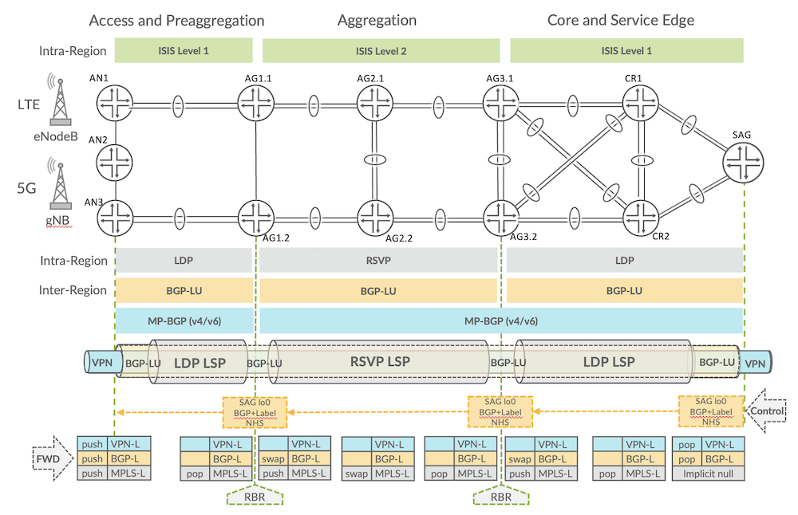
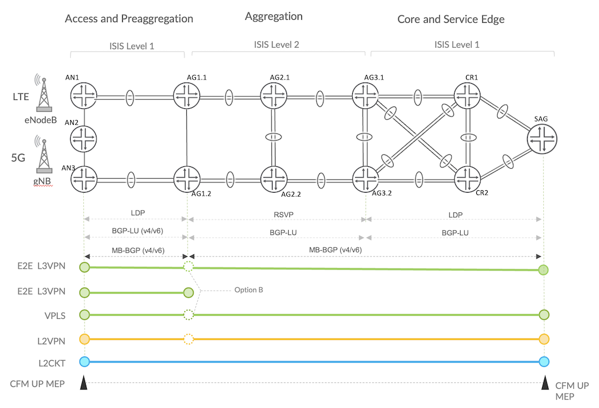
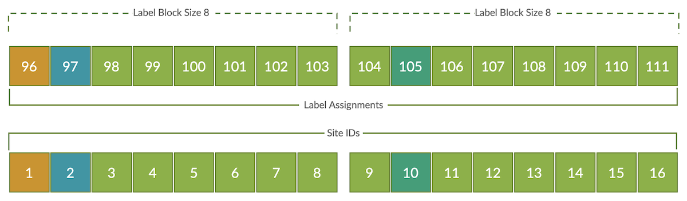

# Mobile Backhaul Services Overlay

**Kevin Brown - 04/12/2023**

Olé, Olé, Overlays!

Welcome back to the validation design series and today is all about that overlay!

## Introduction

The previous blog [*Building Border Agnostic Architectures with Seamless MPLS*](https://juniper.github.io/techposts/border-agnostic-architectures-with-seamless-mpls/article) explored the advantages of Seamless MPLS in the referenced use case for Mobile Backhaul, enabling interdomain connectivity across disparate networks referred to as *regions*. There are in fact several permutations of Seamless MPLS leveraging intra and inter-AS topologies. The major advantages, in addition to overall flexibility, include massive scalability, improved convergence, simplified troubleshooting, and optimized service provisioning.

Even though Seamless MPLS has been around for several years now, it is still very relevant today both as a standalone systematic approach to building modern networks across multiple domains---and as a foundational building block for more advanced solutions. For instance, Seamless Segment Routing with Classful Transport or Network Slicing with Service Orchestration mandates the same common principles that services must be capable of traversing multiple domains with sophisticated performance machinery and relative simplicity.

In this spirit, we come to perhaps the most important benefit of Seamless MPLS---decoupling the services overlay from transport underlay and thereby eliminating unnecessary points of instantiation. Even if we were to argue that adding another protocol (BGP-LU) amplifies control plane complexity, it becomes totally nullified by the simplicity of service provisioning compared to traditional models. Let's look at how Layer 2 / Layer 3 VPNs for delivering Mobile Backhaul services are layered on top of the established architecture.

The featured validation includes ACX710, ACX5448 and MX10003 as the primary DUTs, but newer ACX7000 family platforms inherit and build upon Seamless MPLS principles. In example, supporting up to 14-label stack eliminates potential seamless design limitations. Though even with the 5-label stack supported by the ACX5448/ACX710 platforms, it enables support of 1:1 path protection capability desired for the referenced solution. The EVO-based ACX7024, ACX7509 and ACX7100 platforms are the subjects of additional validations to be published soon!

This is the fourth article in the MBH series, be sure to check out earlier blogs which provide the building blocks of the featured solution:

- [JVD Overview](https://juniper.github.io/techposts/introducing-the-validation-series/article)
- [Mobile Backhaul Overview](https://juniper.github.io/techposts/jvd-mobile-backhaul-overview/article)
- [Seamless MPLS LDP with OSPF underlay](https://juniper.github.io/techposts/seamless-mpls-ldp-with-ospf/article)
- [Building Border Agnostic Architectures with Seamless MPLS](https://juniper.github.io/techposts/border-agnostic-architectures-with-seamless-mpls/article)
- Mobile Backhaul Services Overlay: present document

## Building Blocks for Overlay VPN Services

Quick recap on the building blocks so far, which have enabled this step. The IGP underlay with MPLS transport was established in the second blog (*[Seamless MPLS LDP-Signaled with OSPF](https://juniper.github.io/techposts/seamless-mpls-ldp-with-ospf/article)*). It might be OSPF or ISIS, along with LDP or RSVP signaled MPLS leveraging protection mechanisms like rLFA or FRR, respectively. In the third blog (illustrated by figure 1), the MPLS domain was extended across disparate regions by stitching border nodes with BGP Labeled Unicast (BGP-LU). Each region may implement IGP and MPLS characteristics unique to that given domain.

We loosely covered VPN overlay from a multiprotocol BGP perspective but let's expand on this topic to describe how each service is provisioned over the Seamless MPLS mobile backhaul architecture. In the diagram (figure 1), we can see how VPN label imposition occurs and subsequently tunneled through paths facilitated by labeled BGP and MPLS.



As shown below, the validated use case independently included IGPs of ISIS or OSPF in the represented structures with LDP or RSVP signaled MPLS. The architecture certainly allows for mixing these technologies to support the same end-to-end service instantiation covered in this blog.



The below table represents reasonable multidimensional scale featured in the MBH validated design, with all services running simultaneously on the same physical port per DUT. In parallel, the maximum scale supported by each DUT is provided. The essential configurations for each VPN type are included below with designated points of configuration.

| Service Type | AN3 (DUT)ACX710 | AN3 (DUT)Maximum Value | AG1ACX5448 | AG1Maximum Value | SAGMX10003 |
|:--|:--|:--|:--|:--|:--|
| L3VPN | 100 | 2,000 | 120 | 5,000 | 320 |
| VPLS | 100 | 2,000 | 1,000 | 8,000 | 1,125 |
| L2VPN | 100 | 2,000 | 1,000 | 16,000 | 1,130 |
| L2Circuit | 100 | 2,000 | 1,000 | 16,000 | 1,800 |
| VLANs | 400 | 4k/port | 3,120 | 4k/port | 4,375 |

## Mobile Backhaul Services

The validation included three types of traditional Layer 2 VPNs for mobile backhaul and L2 wholesale use case, including L2Circuit (Martini), BGP-VPLS and L2VPN (Kompella). Layer 3 VPN (L3VPN) delivers end-to-end L3 MBH for IPv4 and IPv6 6PE requirements. The next sections provide the implemented configuration and use case for each service.

### L2Circuit

Traditional Layer 2 Circuits (L2Circuit, aka Martini [RFC4906](https://datatracker.ietf.org/doc/rfc4906/)) have withstood the test of time and continue prevalence today supporting simplistic point-to-point connectivity using targeted LDP (T-LDP) discovery mechanisms to signal and establish L2 virtual circuits over MPLS. Configuration of lo0.0 interface under LDP hierarchy is mandatory to initiate discovery.

The JVD implements Port and VLAN-based L2Circuits between AN and SAG. Note, the essential configuration is only a few commands [lines 2-4, 6 and 12-14, 16]. The virtual circuit identifier (VC ID) [lines 4, 14] must match on both sides. Normally encapsulation type [lines 6, 16] should also match, which in this scenario the L2CKT is vlan aware. Control Word (CW) can be implicitly enabled [line 5] but JUNOS by default includes a 4-byte NULL control-word. Nevertheless, the CW configuration should match on both sides. Lines 7-8 and 17-18 are optional to circumvent mismatched MTU or encapsulations which would normally cause the PW signaling to fail. Those knobs are hyperlinked in the configuration for more information. Finally, lines 9 and 19 includes [pseudowire-status-tlv](https://www.juniper.net/documentation/us/en/software/junos/vpn-l2/topics/concept/vpns-configuring-interfaces-for-layer-2-circuits.html#id-12291402__pseudowire-status-tlv-config) which allows the PW to communicate status and sets the stage for [pseudowire redundancy](https://www.juniper.net/documentation/us/en/software/junos/vpn-l2/topics/example/pw-redundancy-mobile-backhaul.html).

For more information on L2Circuits and command structures, please reference [Layer 2 Circuit Overview technical library](https://www.juniper.net/documentation/us/en/software/junos/vpn-l2/topics/concept/vpn-layer-2-circuit-overview.html).

AN3 (ACX710) - L2Circuit AN3 to SAG:

```
 1        l2circuit { 
 2            neighbor 1.1.0.11 {
 3                interface xe-0/0/1.2000 {
 4                    virtual-circuit-id 4000;
 5                    control-word;
 6                    encapsulation-type ethernet-vlan;
 7                    ignore-encapsulation-mismatch;
 8                    ignore-mtu-mismatch;
 9                    pseudowire-status-tlv;
10                }
```

SAG (MX1003) - L2Circuit SAG to AN3:

```
11        l2circuit {
12            neighbor 1.1.0.2 {
13                interface et-0/1/3.2000 {
14                    virtual-circuit-id 4000;
15                    control-word;
16                    encapsulation-type ethernet-vlan;
17                    ignore-encapsulation-mismatch;
18                    ignore-mtu-mismatch;
19                    pseudowire-status-tlv;
20                }
```

Additional connectivity points are introduced from the Hub Site Router (HSR) AG1.1/AG1.2 toward Services Aggregation Gateway (SAG) router and here Ethernet OAM with Performance Monitoring over the L2Circuit is included. In common case, L2Circuit with E-OAM would be extended to support redundant PWs and facilitate rapid failure detection. For more information, see [L2Circuit Protection Switching](https://www.juniper.net/documentation/us/en/software/junos/vpn-l2/topics/example/layer-2-circuit-switching-protection.html).

AG1.1 (ACX5448) - L2Circuit AG1.1 to SAG:

```
 1 protocols {
 2        l2circuit {
 3            neighbor 1.1.0.11 {
 4                interface et-0/1/0.101 {
 5                    virtual-circuit-id 2101;
 6                    control-word;
 7                    encapsulation-type ethernet-vlan;
 8                    ignore-encapsulation-mismatch;
 9                    ignore-mtu-mismatch;
10                    pseudowire-status-tlv;
11                }
```

ACX5448 (AG1.1) - AG1.1 Ethernet OAM over L2Circuit:

```
12 protocols {
13     oam {
14         ethernet {
15             connectivity-fault-management {
16                 performance-monitoring {
17                     sla-iterator-profiles {
18                         2WD-P3 {
19                             measurement-type two-way-delay;
20                             cycle-time 1000;
21                             iteration-period 2000;
22                             calculation-weight {
23                                 delay 300;
24                                 delay-variation 300;
25                             }
26                         }
27                     }
28                 }
29                 maintenance-domain MD_63535 {
30                     level 5;
31                     name-format none;
32      
33                     maintenance-association 101 {
34                         short-name-format 2octet;
35                         continuity-check {
36                             interval 1s;
37                             loss-threshold 10;
38                             hold-interval 1;
39                         }
40                         mep 3008 {
41                             interface et-0/1/0.101;
42                             direction up;
43                             remote-mep 3016 {
44                                 sla-iterator-profile 2WD-P3 {
45                                     priority 1;
46                                 }
47                             }
48                         }
49                     }
```

SAG (MX10003) - L2Circuit SAG to AG1.1:

```
50 protocols {
51        l2circuit {
52            neighbor 1.1.0.3 {
53                interface et-0/1/2.101 {
54                    virtual-circuit-id 2101;
55                    control-word;
56                    encapsulation-type ethernet-vlan;
57                    ignore-encapsulation-mismatch;
58                    ignore-mtu-mismatch;
59                    pseudowire-status-tlv;
60                }
```

SAG (MX10003) - SAG Ethernet OAM over L2Circuit:

```
61 protocols {
62     oam {
63         ethernet {
64             connectivity-fault-management {
65                 performance-monitoring {
66                     sla-iterator-profiles {
67                         2WD-P3 {
68                             measurement-type two-way-delay;
69                             cycle-time 1000;
70                             iteration-period 2000;
71                             calculation-weight {
72                                 delay 300;
73                                 delay-variation 300;
74                             }
75                         }
76                     }
77                 }
78                 maintenance-domain MD_63535 {
79                     level 5;
80                     name-format none;
81 
82                     maintenance-association 101 {
83                         short-name-format 2octet;
84                         continuity-check {
85                             interval 1s;
86                             loss-threshold 10;
87                             hold-interval 1;
88                         }
89                         mep 3016 {
90                             interface et-0/1/2.101;
91                             direction up;
92                             remote-mep 3008 {
93                                 sla-iterator-profile 2WD-P3 {
94                                     priority 1;
95                                 }
96                             }
97                         }
98                     } 
```

### Virtual Private LAN Service (BGP-VPLS)

VPLS emulates wholesale Mobile Backhaul for multipoint VPN services between AN and SAG. VPLS at this stage is well understood, but I'll highlight a few elements from the configuration that may be less intuitive. BGP-VPLS is defined by [RFC4761](https://www.rfc-editor.org/rfc/rfc4761.html) and includes the VPLS BGP NLRI address family indicator (AFI) 25 and subsequent address family identifier (SAFI) 65 to exchange VPLS membership and demultiplexor sequences. RFC4761 was very much inspired by RFC4364 (aka L3VPN), as a result we see many of the same configuration components, such as route-target and route-distinguisher. In JUNOS, this VPLS NLRI is enabled by configuring multiprotocol BGP family *l2vpn signaling*.

VPLS requires traffic to be normalized at each endpoint, which simply means to have matching tagged/untagged parameters corresponding to the vlan-id configuration statement assigned to the interface or instance. There are two methods for normalizing VPLS traffic. First method is performed at the interface-level using [input/output-vlan-map](https://www.juniper.net/documentation/us/en/software/junos/multicast-l2/topics/topic-map/vlans-and-vpls.html#id-configuring-vlan-identifiers-for-vlans-and-vpls-routing-instances) (read about [vlan normalization](https://www.juniper.net/documentation/us/en/software/junos/multicast-l2/topics/topic-map/vlans-and-vpls.html#id-configuring-vlan-identifiers-for-vlans-and-vpls-routing-instances)) and manually configuring appropriate pop/push/swap vlan operations so that traffic traversing the VPLS pseudowire from each endpoint has the same vlan-id. The second method allows any vlan configuration at the interface level with normalization performed at the VPLS instance itself using [vlan-id or vlan-tags](https://www.juniper.net/documentation/us/en/software/junos/multicast-l2/topics/topic-map/vlans-and-vpls.html#id-configuring-vlan-identifiers-for-vlans-and-vpls-routing-instances) mechanism. This method is functionally the same, but the vlan operations are performed "under-the-hood", automatically translating the incoming interface vlan-id to a common vlan configuration defined in the VPLS instance. The reverse vlan translation then occurs for traffic egressing the interface.

Generally, the VPLS pseudowire will still establish even if endpoints have mismatching vlan-ids but traffic traversing the service will fail.

In the below example, you may notice in fact neither vlan-map (at the interface level) nor vlan-id (in the vpls instance level) are specified! That's because our traffic is already matching (normalized) as vlan-id 1500 at each endpoint so no further changes are required.

Let's go over a few of the VPLS configuration constructs important to the implementation.

- Bum-Hashing [lines 13, 42] enables traffic balancing across member links within Link Aggregated Groups (LAG) for VPLS BUM (broadcast, unknown unicast, multicast). It does not enable ECMP load balancing for VPLS BUM traffic. The bum-hashing knob is optional.
- Mac-Table-Size [lines 14, 43] in this example limits the VPLS domain to 5,120 MACs, which is also the default. The mac-table-size knob is optional, but may be a best practice to contain misbehaving flooding.
- No-Tunnel-Services [lines 22, 51] is required to spin up the label-switched interface (LSI), which facilitates mapping between the VPLS inner MPLS label and the VPLS instance itself. Since no-tunnel-services provides a crucial VPLS function, this knob is mandatory. There was another variant called Virtual Tunnel (VT) interface, but this was only used for Juniper platforms which support a Services PIC. LSI performs VPLS operations as *inline* and is the preferred approach.

To read more about this feature, check the link in the configuration.

AN3 (ACX710) - AN3 VPLS Configuration:

```
 1 interfaces {
 2     xe-0/0/1 {
 3         flexible-vlan-tagging;
 4         encapsulation flexible-ethernet-services;
 5         unit 1500 {
 6             encapsulation vlan-vpls;
 7             vlan-id 1500;
 8         }
 9 routing-instances {
10     vpls_group_104_1500 {
11         protocols {
12             vpls {
13                 bum-hashing;
14                 mac-table-size {
15                     5120;
16                 }
17                 site r4 {
18                     site-identifier 1;
19                 }
20                 site-range 65534;
21                 label-block-size 8;
22                 no-tunnel-services;
23             }
24         }
25         instance-type vpls;
26         interface xe-0/0/1.1500;
27         route-distinguisher 63535:1041500;
28         vrf-target target:63535:1041500;
29     }
```

SAG (MX10003) - SAG VPLS Configuration:

```
30  interfaces {
31     et-0/1/3 {
32         flexible-vlan-tagging;
33         encapsulation flexible-ethernet-services; 
34          unit 1500 {
35             encapsulation vlan-vpls;
36             vlan-id 1500;
37         }
38  routing-instances {
39      vpls_group_104_1500 {
40         protocols {
41             vpls {
42                 bum-hashing;
43                 mac-table-size {
44                     5120;
45                 }
46                 site r16 {
47                     site-identifier 2;
48                 }
49                 site-range 65534;
50                 label-block-size 8;
51                 no-tunnel-services;
52             }
53         }
54         instance-type vpls;
55         interface et-0/1/3.1500;
56         route-distinguisher 63535:1041500;
57         vrf-target target:63535:1041500;
58     }
```

The label block, as explained in [RFC4761 Section 3.2.1](https://www.rfc-editor.org/rfc/rfc4761.html#section-3.2.1), is an integral component in VPLS. In JUNOS, the VPLS label-block-size [lines 21, 50] specifies the label range to be used by the VPLS domain. By default, 8 labels will be allocated for each domain, which can be sized based on the anticipated number of VPLS sites for improved scaling. In the below configuration, the default block size is explicitly specified, but since this is only a 2-site point-to-point VPLS domain, it could use a label-block-size of 2 or 4 to optimize scaling.

The site-id is the key integer for determining the label assigned for the local and remote VPLS site. This is where a lot of folks tend to overthink the numbering scheme. Due to the identifier-to-label mapping algorithm, as a best practice, keep site-id assignments simple (e.g., 1,2,3,4...) or it may consume more labels than expected.

Here's what I mean. Consider the below label assignment diagram. Let's suppose a default label block 8 is used with the label allocation being 96-103. Here we have site-id 1 mapping to label 96 and site-id 2 mapping to 97. Let's presume the next site-id breaks sequence and is assigned site-id 10, requiring label 105. At this point, the calculation exceeds the initial 8 labels allocated to the VPLS domain (96-103)---the system assumes you're anticipating sites 3-8 at some point. To meet this requirement, a second label block of 8 must be allocated so that label 105 can be assigned. As you can imagine, if every site in the VPLS domain exceeded the assigned label block size, it quickly consumes many more labels than is required for the service. The reason label allocation is performed this way is to prevent fragmentation, which unavoidably leads to wasted label space whereas in this way it can be avoided.



Keep it simple! VPLS site-ids must be unique within the customer domain but are not globally unique. it means the same IDs can be reused for every VPLS domain. In the referenced configuration, site-id 1 and 2 [lines 18, 47] are used for all 100 VPLS instances since there are only two sites.

A final note about the BGP-VPLS implementation, recall that Access Nodes have no direct MP-BGP connectivity with the Services Aggregation Gateway (SAG) router. AG1.1/AG1.2 Route Reflectors facilitate interdomain Option B to support multisegment pseudowires, which improves scale and simplifies administration and operations, eliminating full mesh requirements. For more details on VPLS, reference [Introduction to VPLS](https://www.juniper.net/documentation/us/en/software/junos/vpn-l2/topics/concept/vpn-vpls-introduction.html).

### Layer 2 VPN (L2VPN)

L2VPN (aka Kompella) ratified by [RFC6624](https://datatracker.ietf.org/doc/html/rfc6624), defines methodologies for delivering Virtual Private Wire Service (VPWS) for point-to-point or hub-and-spoke layer 2 VPNs using BGP auto-discovery and MPLS demultiplexor mechanisms. Sounds familiar? That's because L2VPN was also inspired by BGP-VPLS (RFC4761) and L3VPN (RFC4364). As a result, once again we find the common configuration elements of route-target to uniquely identify the VPN, determining which routes shall be imported/exported by the vpn container, and route-distinguisher to uniquely identify routes which may overlap. Like BGP-VPLS, L2VPN makes use of Address Family Indicator (AFI) 25 and Subsequent Address Family Identifier (SAFI) 65. The L2VPN Network Layer Reachability Information (NLRI) is enabled with multiprotocol BGP family *l2vpn signaling*. The BGP signaling components provide the same benefits to support scaling and interdomain characteristics. Below configuration snip represents L2VPN established between AN and SAG to deliver L2 MBH wholesale services.

As shown, we define our local site-identifier [lines 9, 28] and remote-site-id [lines 7,26], which must match the peer's configured local site-id.

AN3 (ACX710) - L2VPN Configuration:

```
 1 routing-instances {
 2     l2vpn_group_104_1000 {
 3         protocols {
 4             l2vpn {
 5                 site r4 {
 6                     interface xe-0/0/1.1000 {
 7                         remote-site-id 1116;
 8                     }
 9                     site-identifier 1104;
10                 }
11                 encapsulation-type ethernet-vlan;
12                 no-control-word;
13             }
14         }
15         instance-type l2vpn;
16         interface xe-0/0/1.1000;
17         route-distinguisher 63535:1041000;
18         vrf-target target:63535:1041000;
19     }
```

SAG (MX10003) - L2VPN Configuration:

```
20 routing-instances {
21     l2vpn_group_104_1000 {
22         protocols {
23             l2vpn {
24                 site r16 {
25                     interface et-0/1/3.1000 {
26                         remote-site-id 1104;
27                     }
28                     site-identifier 1116;
29                 }
30                 encapsulation-type ethernet-vlan;
31                 no-control-word;
32             }
33         }
34         instance-type l2vpn;
35         interface et-0/1/3.1000;
36         route-distinguisher 63535:1041000;
37         vrf-target target:63535:1041000;
38     }
```

### Layer 3 VPN (L3VPN)

Layer 3 VPN, first ratified with [RFC2547](https://datatracker.ietf.org/doc/html/rfc2547) and updated by [RFC4364](https://datatracker.ietf.org/doc/html/rfc4364), provides key service delivery mechanisms in the Mobile Backhaul network, supporting end-to-end IP VPN connectivity for IPv4 and IPv6 services from CSR to SAG. Upcoming Juniper Validated Designs continue expanding into the connectivity models supporting 4G LTE and 5G xHaul architectures in which L2 VPN services are extended across Fronthaul infrastructure from access CSR to pre-aggregation HSR domains where IRB machinery becomes the essential component to seamlessly stitch L2 and L3 VPN services.

L3VPN (AFI-1 / SAFI-128) leverages multiprotocol BGP established between Access Node (AN) to Hub Site Routers (AG1.1/AG1.2) and extended between HSR (AG1.1/AG1.2) and Services Aggregation Gateway (SAG). Similar to BGP-VPLS, the L3VPN service makes use of Option-B but here supports service termination points required to establish flows between BBU/DU-CU and EPC infrastructure.

Below configuration provides the standard L3VPN Access Node (AN3) implementation used in the validation, with either BGP or OSPF variations for CE-facing connectivity. BGP includes peering for both IPv4 and IPv6 neighbors. BGP instances also implement as-override as a common practice for hiding customer-facing ASNs.

Like L2VPN and BGP-VPLS, the below L3VPN configuration for AN3, AG1 and SAG includes unique route-targets (RT) per L3VPN and unique route-distinguishers (RD) per VRF in the same PE. In common practice, unique RDs within the same VPN may be used to identify source PE and allow route reflectors to advertise the same prefixes for load sharing and faster convergence.

AN3 (ACX710) - L3VPN Configuration:

```
 1
 2 routing-instances {
 3     METRO_BGP_L3VPN_500 {
 4         routing-options {
 5             router-id 1.1.0.2;
 6         }
 7         protocols {
 8             bgp {
 9                 group v4Ixia {
10                     family inet {
11                         any;
12                     }
13                     neighbor 15.1.7.206 {
14                         local-address 15.1.7.205;
15                         peer-as 64514;
16                         as-override;
17                     }
18                 }
19                 group v6Ixia {
20                     family inet6 {
21                         any;
22                     }
23                     neighbor 2001::15:1:0:7cf {
24                         local-address 2001::15:1:0:7cd;
25                         peer-as 64514;
26                         as-override;
27                     }
28                 }
29             }
30         }
31         instance-type vrf;
32         interface xe-0/0/1.500;
33         route-distinguisher 63535:500;
34         vrf-target target:63535:500;
35         vrf-table-label;
36     }
37 
38 
39     METRO_OSPF_L3VPN_1 {
40         routing-options {
41             router-id 1.1.0.2;
42         }
43         protocols {
44             ospf {
45                 area 0.0.0.0 {
46                     interface xe-0/0/1.1 {
47                         interface-type p2p;
48                     }
49                 }
50             }
51         }
52         instance-type vrf;
53         interface xe-0/0/1.1;
54         route-distinguisher 63535:1;
55         vrf-target target:63535:1;
56         vrf-table-label;
57     }
```

The multipoint L3VPN service extends to AG1.1/AG1.2.

AG1.1 (ACX5448) - L3VPN Configuration:

```
 1 routing-instances {
 2     METRO_BGP_L3VPN_500 {
 3         routing-options {
 4             router-id 1.1.0.3;
 5         }
 6         protocols {
 7             bgp {
 8                 group v4Ixia {
 9                     family inet {
10                         any;
11                     }
12                     neighbor 16.1.7.206 {
13                         local-address 16.1.7.205;
14                         peer-as 64518;
15                         as-override;
16                     }
17                 }
18                 group v6Ixia {
19                     family inet6 {
20                         any;
21                     }
22                     neighbor 2001::16:1:0:7cf {
23                         local-address 2001::16:1:0:7cd;
24                         peer-as 64518;
25                         as-override;
26                     }
27                 }
28             }
29         }
30         instance-type vrf;
31         interface et-0/1/0.500;
32         route-distinguisher 63535:500;
33         vrf-target target:63535:500;
34         vrf-table-label;
35     }
36 
37 
38     METRO_OSPF_L3VPN_1 {
39         routing-options {
40             router-id 1.1.0.3;
41         }
42         protocols {
43             ospf {
44                 area 0.0.0.0 {
45                     interface et-0/1/0.1 {
46                         interface-type p2p;
47                     }
48                 }
49             }
50         }
51         instance-type vrf;
52         interface et-0/1/0.1;
53         route-distinguisher 63535:1;
54         vrf-target target:63535:1;
55         vrf-table-label;
56     }
```

The final L3VPN configuration snip is shown from SAG perspective.

SAG (MX10003) - L3VPN Configuration:

```
 1 routing-instances {
 2     METRO_BGP_L3VPN_500 {
 3         routing-options {
 4             router-id 1.1.0.11;
 5         }
 6         protocols {
 7             bgp {
 8                 group v4Ixia {
 9                     family inet {
10                         any;
11                     }
12                     neighbor 18.1.7.206 {
13                         local-address 18.1.7.205;
14                         peer-as 64516;
15                         as-override;
16                     }
17                 }
18                 group v6Ixia {
19                     family inet6 {
20                         any;
21                     }
22                     neighbor 2001::18:1:0:7cf {
23                         local-address 2001::18:1:0:7cd;
24                         peer-as 64516;
25                         as-override;
26                     }
27                 }
28             }
29         }
30         instance-type vrf;
31         interface et-0/1/2.500;
32         route-distinguisher 63535:500;
33         vrf-target target:63535:500;
34         vrf-table-label;
35     }
36     
37     METRO_OSPF_L3VPN_1 {
38         routing-options {
39             router-id 1.1.0.11;
40         }
41         protocols {
42             ospf {
43                 area 0.0.0.0 {
44                     interface et-0/1/2.1 {
45                         interface-type p2p;
46                     }
47                 }
48             }
49         }
50         instance-type vrf;
51         interface et-0/1/2.1;
52         route-distinguisher 63535:1;
53         vrf-target target:63535:1;
54         vrf-table-label;
55     }
```

The L3VPN BGP NLRI for IPv4 is enabled with ***family inet-vpn*** and IPv6 with ***family inet6-vpn*** statements. The Access Node (AN3) configuration is shown.

AN3 (ACX710) - BGP configuration:

```
 1     bgp {
 2         group ibgp_pag {
 3             type internal;
 4             local-address 1.1.0.2;
 5             family inet {
 6                 labeled-unicast {
 7                     rib-group inet3-to-inet0;
 8                     rib {
 9                         inet.3;
10                     }
11                 }
12             }
13             family inet-vpn { # BGP family for l3vpn
14                 unicast;            
15             }
16             family inet6 {
17                 labeled-unicast {
18                     rib {
19                         inet6.3;
20                     }
21                 }
22             }
23             family inet6-vpn { # BGP family for IPv6 over L3VPN
24                 unicast;
25             }
26             family l2vpn { # BGP family for L2VPN & BGP-VPLS
27                 signaling;
28             }
29             family route-target;
30             export next-hop-self;
31             neighbor 1.1.0.4;
32             neighbor 1.1.0.3;
33         }
34         log-updown;
35         multipath;
36     }
37     
```

## Conclusion

In this blog, we examined the evolution of traditional VPN services decoupled from transport architecture by leveraging Seamless MPLS with BGP Labeled Unicast in a Mobile Backhaul reference architecture. The solution allows for multi-segment VPN services with significant scaling advantages. By eliminating complex service instantiation points, the provisioning and support of VPN overlay services become vastly simplified. The architecture also becomes a foundational building block for even more advanced solutions, such as Seamless Segment Routing with BGP Classful Transport---a solution we'll cover in another validated design!

So far, the MBH JVD blogs have described the transport underlay along with important protection mechanisms and how overlay services can be seamless stitched across multiple network boundaries, including intra or inter-AS. That's all for now, until next time!

## Useful links

- [L2VPN and VPLS User Guide](https://www.juniper.net/documentation/us/en/software/junos/vpn-l2/vpn-l2.pdf)
- [Building Multi-Generation Scalable Networks with End-to-End MPLS](https://www.juniper.net/content/dam/www/assets/white-papers/us/en/building-multi-generation-scalable-networks-with-end-to-end.pdf)
- [Multiprotocol BGP](https://www.juniper.net/documentation/us/en/software/junos/bgp/topics/topic-map/multiprotocol-bgp.html)
- [Juniper 4G MBH Design Guide](https://www.juniper.net/documentation/en_US/release-independent/solutions/information-products/pathway-pages/Juniper_4G_MBH_DG.pdf)
- [Layer 2 Virtual Private Networks Using BGP for Auto-Discovery and Signaling](https://datatracker.ietf.org/doc/html/rfc6624)
- [BGP/MPLS IP Virtual Private Networks (VPNs)](https://datatracker.ietf.org/doc/html/rfc4364)
- [Virtual Private LAN Service (VPLS) Using BGP for Auto-Discovery and Signaling](https://www.rfc-editor.org/rfc/rfc4761.html)

## Glossary

- ABR: Area Border Router
- AG: Aggregation
- AN: Access Node
- BBU: Baseband Unit
- BFD: Bidirectional Forwarding Detection
- BGP: Border Gateway Protocol
- BGP-LU: Border Gateway Protocol Labeled Unicast
- BGP-PIC: Border Gateway Protocol Prefix-Independent Convergence
- BH: Backhaul
- BN: Border Node
- BUM: Broadcast, Unknown Unicast, Multicast
- CR: Core
- CSR: Cell Site Router
- CU: Central Unit
- DU: Distributed Unit
- E-LINE: Ethernet Virtual Private Line
- E-LAN: Ethernet Virtual Private Local Area Network
- EBGP: External Border Gateway Protocol
- EPC: Evolved Packet Core
- FEC: Forwarding Equivalence Class
- FH: Fronthaul
- FRR: Fast Reroute
- HSR: Hub Site Router
- IBGP: Internal Border Gateway Protocol
- IGP: Interior Gateway Protocol
- IP: Internet Protocol
- IPv4: Internet Protocol version 4
- IPv6: Internet Protocol version 6
- IS-IS: Intermediate System to Intermediate System
- JVD: Juniper Validated Design
- L2Circuit: Layer 2 Circuit
- L2VPN: Layer 2 VPN
- L3VPN: Layer 3 VPN
- LFA: Loop Free Alternative
- LDP: Label Distribution Protocol
- LSI: Label-Switched Interface
- MBH: Mobile Backhaul
- MH: Midhaul
- MPLS: MultiProtocol Label Switching
- OAM: Operation, Administration, and Maintenance
- OSPF: Open Shortest Path First
- PFE: Packet Forwarding Engine
- PLR: Point of Local Repair
- R-LFA: Remote Loop Free Alternative
- RBR: Regional Border Router
- RR: Route Reflector
- RSVP: Resource Reservation Protocol
- SAG: Services Aggregation Gateway
- SN: Service Node
- T-LDP: Targeted Label Distribution Protocol
- VPLS: Virtual Private LAN Service
- VPN: Virtual Private Network
- VPWS: Virtual Private Wire Service
