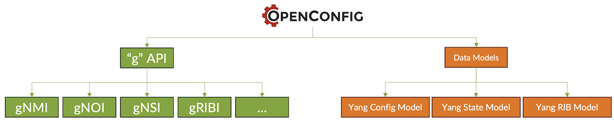
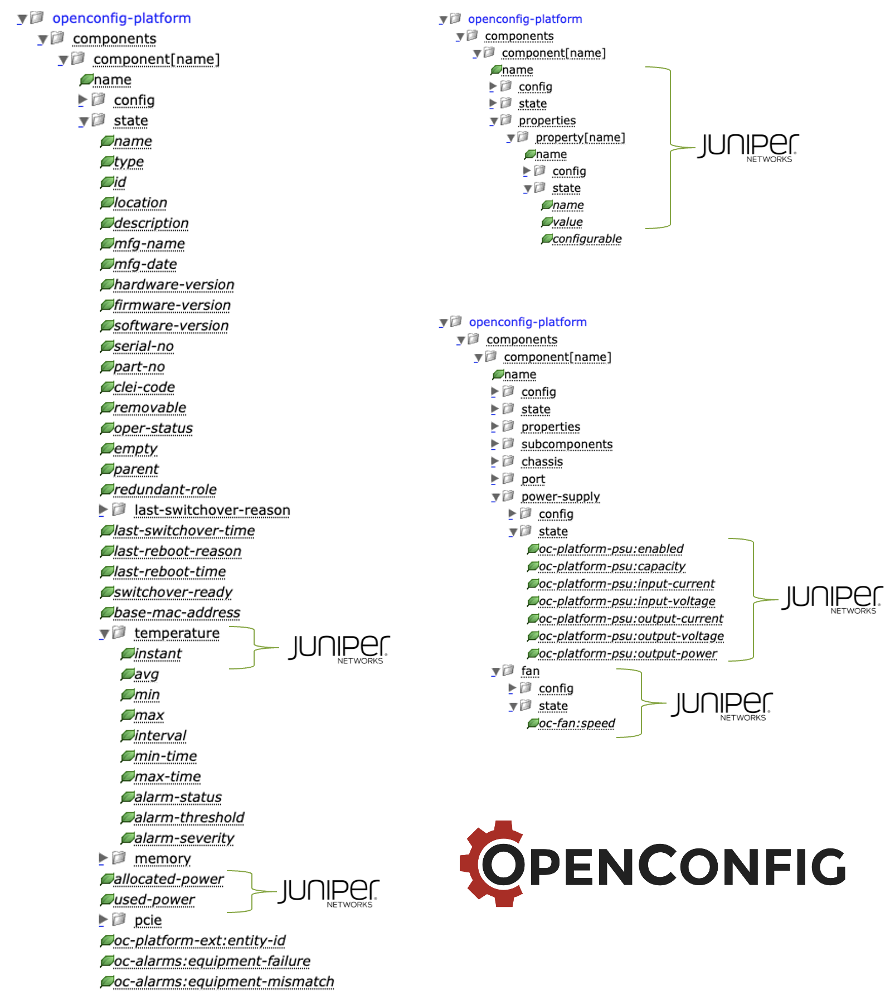
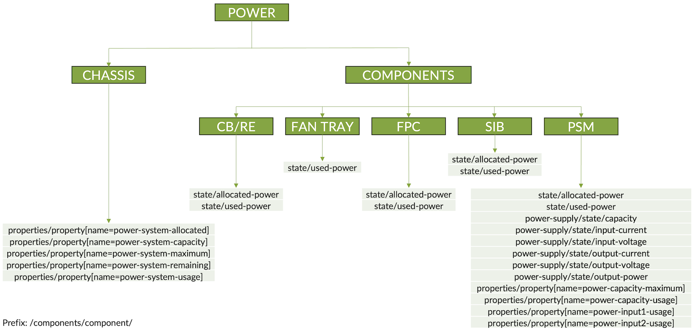
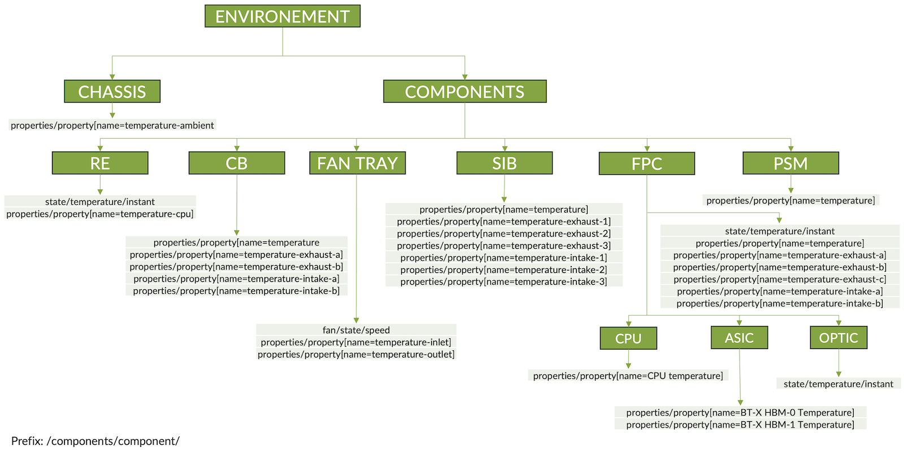
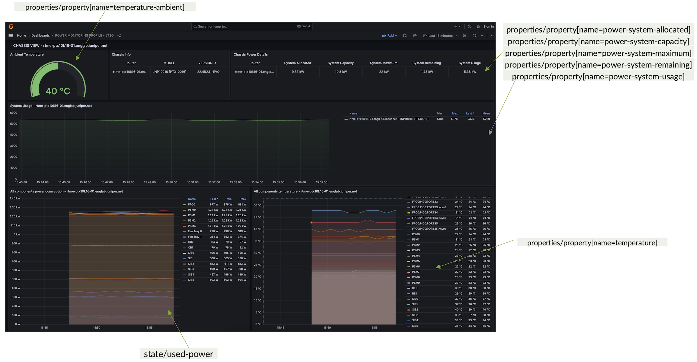
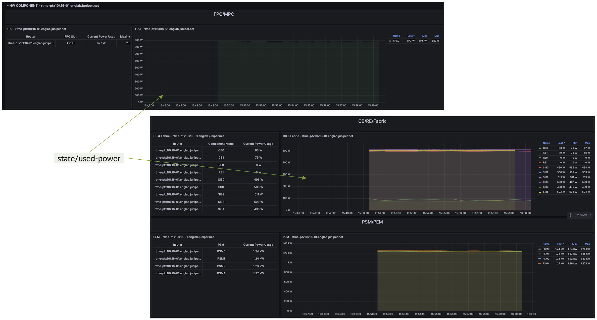
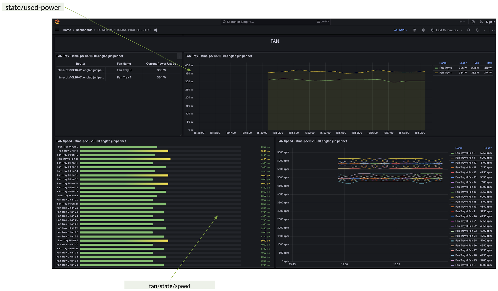

# Monitoring PTX Power and Environment's KPI through Telemetry

**David Roy - 11/14/2023**

How Junos EVO implements the OpenConfig "platform" data model to expose many indicators/counters related to environmental data.

## Introduction

Recently, we covered [the PTX power optimization features [1]](https://juniper.github.io/techposts/ptx10000-power-optimization/article). If you didn't read this techpost, we highly recommend having a look at it before reading any further. In this previous article, we presented several built-in functionalities that help reduce power usage. There are also some actions that can be applied manually to save even more power for reducing carbon footprint.

But, how to follow in real time the power consumption of your chassis or even of each hardware component to see the effect of all those unique features powered by Junos EVO on the PTX platform?

Today, we will explain how Junos EVO implements the OpenConfig "platform" data model to expose many indicators/counters related to environmental data: power, temperature, fan speed... It will also provide some advice to build "Power Dashboards" to monitor, and optimize your PTX carbon footprint.

## Openconfig Platform Data Model

[OpenConfig [2]](https://openconfig.net/projects/models/schemadocs/) is a collaborative effort by network operators to develop programmatic API, tools and to deliver vendor-neutral data models for managing network devices (managing configuration and state data).

We can illustrate OpenConfig's (aka. OC) work as follow:



We divided the "works" of the OpenConfig community into two main projects:

- The definition of programmatic APIs -- usually called the "g" APIs. The most well-known API is gNMI which is heavily used by streaming telemetry solutions.
- A set of vendor-independent data models for configuring the devices, collecting state data, or even programming the RIB. Let's have a look at the OC repository [2] for a detailed view of all current OC Data Models.

On paper, OpenConfig seems able to solve all your problems -- especially in multi-vendor environment but it's important to highlight that Openconfig is not the "Holy Grail". Indeed:

- OC claims to be vendor-neutral but there is no direct 1-to-1 mapping between all OC config/state items and Native Vendor config/state.
- OC doesn't fully support the entire Native Vendor config/state -- Customers still need to deal with Native and OC models.
- Most of the time Vendors slightly deviate/augment OC Yang models to fit with their internal implementations.

Once aware of these above points, we can nevertheless leverage some cool features of OpenConfig. In this article, we'll use [gNMI streaming Telemetry [3]](https://github.com/openconfig/reference/blob/master/rpc/gnmi/gnmi-specification.md) and the [OC Platform Data Model [4]](https://openconfig.net/projects/models/schemadocs/jstree/openconfig-platform.html) to build a powerful monitoring solution.

First, let's have a look at the [OpenConfig "platform" data model [4]](https://openconfig.net/projects/models/schemadocs/jstree/openconfig-platform.html). We will focus on the state data (modelized by this model -- config elements are out of the scope of this article).

The platform model exposes the path called: **/components**. Under this "root node" you will find many sub-nodes to gather all hardware-related information: power, environment, inventory, optic, and many others. This data model is quite huge and still evolves a lot - in 2023 there were still about thirteen commits of this specific model. So, it means that for a given Junos or EVO release there is an implementation of a given OC platform data model version. Please refer to the Juniper documentation for more information.

The /components path provides two ways for conveying environmental/power state data:

- Via Distinct (well-named) nodes/leaves: these are vendor-neutral "containers"
- Via Opaque nodes/leaves: these let each vendor add more "proprietary" items without the need for Yang augmentation.

Let's see in detail where Junos EVO fills its data in the /components path. Figure 2 sums up the different nodes/leaves used to convey Power, Temperature, and Fan information.



First interesting thing, we can see from Figure 2 the "component" node is instanced per "name" (the attribute key). It means that for each **/components/component/name** you will have access to some specific data. A **component/name** for Junos EVO are for instance: the "chassis", the "routing-engine", the "SIB". It means any hardware components part of the chassis.

For each **component/name** we can fill state data, either in what we called previously  "Distinct nodes/leaves", for instance:

- /components/component/state/temperature/instant
- /components/component/state/allocated-power
- /components/component/state/used-power
- /components/component/power-supply/state
- ...

Or, in contrast, into "Opaque nodes/leaves". Those "Opaque" data are conveyed through the sub-path: **/components/component/properties/property**. Indeed, via this "agnostic container" you will be able to provide any Key / Value pair of proprietary data, whey the KEY is the "**property/name**" and the value the "**property/state/value**". Hereafter, one example of Junos EVO proprietary data conveyed via Opaque leaves:

- /components/component[name=FPC0]/properties/property[name=BT-0 HBM0 Temperature]/state/value = 45deg

As you can see, here we expose through the "properties" Opaque node, a very specific counter related to the Temperature of the HBM memory of on Express 4 ASIC (code name BT) of the `component/name = FPC0`.

The next table below gives a wrap-up of all current OC Distinct and Opaque leaves the Junos EVO PTX 10K platform supports (an X means the `component/name` (CB, CHASSIS, FPC...) exposes the counters (via OC Distinct leaf or OC Opaque Properties K/V). The extract of the supported fields has been done on this following PTX 10k platform:

```
bob@ptx10k> show version 
Hostname: ptxk10-re0
Model: ptx10016
Junos: 22.4R2.11-EVO
Yocto: 3.0.2
Linux Kernel: 5.2.60-yocto-standard-g5039935
JUNOS-EVO OS 64-bit [junos-evo-install-ptx-x86-64-22.4R2.11-EVO]
```

Table: Supported OC counters for Environment Data

| Type | Field/Component | Chassis | FPC | Optic | RE | CB | SIB | Fans | PSM |
|:--|:--|:--|:--|:--|:--|:--|:--|:--|:--|
| OC_LEAF | /components/component/state/allocated-power |  | [x] | [x] |  | [x] | [x] |  | [x] |
| OC_LEAF | /components/component/state/temperature/instant |  | [x] | [x] | [x] |  |  |  |  |
| OC_LEAF | /components/component/state/used-power | [x] | [x] |  |  | [x] | [x] | [x] | [x] |
| OC_LEAF | /components/component/power-supply/state/capacity |  |  |  |  |  |  |  | [x] |
| OC_LEAF | /components/component/power-supply/state/input-current |  |  |  |  |  |  |  | [x] |
| OC_LEAF | /components/component/power-supply/state/input-voltage |  |  |  |  |  |  |  | [x] |
| OC_LEAF | /components/component/power-supply/state/output-current |  |  |  |  |  |  |  | [x] |
| OC_LEAF | /components/component/power-supply/state/output-power |  |  |  |  |  |  |  | [x] |
| OC_LEAF | /components/component/power-supply/state/output-voltage |  |  |  |  |  |  |  | [x] |
| OC_LEAF | /components/component/fan/state/speed |  |  |  |  |  |  | [x] |  |
| PROPERTIES_KV | /components/component/properties/property[name=BT-X HBM-0 Temperature]/state/value |  | [x] |  |  |  |  |  |  |
| PROPERTIES_KV | /components/component/properties/property[name=BT-X HBM-1 Temperature]/state/value |  | [x] |  |  |  |  |  |  |
| PROPERTIES_KV | /components/component/properties/property[name=CPU Temperature]/state/value |  | [x] |  |  |  |  |  |  |
| PROPERTIES_KV | /components/component/properties/property[name=temperature]/state/value |  | [x] |  | [x] | [x] | [x] |  | [x] |
| PROPERTIES_KV | /components/component/properties/property[name=temperature-exhaust-a]/state/value |  | [x] |  |  | [x] |  |  |  |
| PROPERTIES_KV | /components/component/properties/property[name=temperature-exhaust-b]/state/value |  | [x] |  |  | [x] |  |  |  |
| PROPERTIES_KV | /components/component/properties/property[name=temperature-exhaust-c]/state/value |  | [x] |  |  |  |  |  |  |
| PROPERTIES_KV | /components/component/properties/property[name=temperature-intake-a]/state/value |  | [x] |  |  | [x] |  |  |  |
| PROPERTIES_KV | /components/component/properties/property[name=temperature-intake-b]/state/value |  | [x] |  |  | [x] |  |  |  |
| PROPERTIES_KV | /components/component/properties/property[name=power-system-allocated]/state/value | [x] |  |  |  |  |  |  |  |
| PROPERTIES_KV | /components/component/properties/property[name=power-system-capacity]/state/value | [x] |  |  |  |  |  |  |  |
| PROPERTIES_KV | /components/component/properties/property[name=power-system-maximum]/state/value | [x] |  |  |  |  |  |  |  |
| PROPERTIES_KV | /components/component/properties/property[name=power-system-remaining]/state/value | [x] |  |  |  |  |  |  |  |
| PROPERTIES_KV | /components/component/properties/property[name=power-system-usage]/state/value | [x] |  |  |  |  |  |  |  |
| PROPERTIES_KV | /components/component/properties/property[name=temperature-cpu]/state/value |  |  |  | [x] |  |  |  |  |
| PROPERTIES_KV | /components/component/properties/property[name=temperature-ambient]/state/value | [x] |  |  |  |  |  |  |  |
| PROPERTIES_KV | /components/component/properties/property[name=power-maximum]/state/value |  | [x] |  |  |  | [x] |  |  |
| PROPERTIES_KV | /components/component/properties/property[name=power-usage]/state/value |  | [x] |  |  |  | [x] |  |  |
| PROPERTIES_KV | /components/component/properties/property[name=temperature-inlet]/state/value |  |  |  |  |  |  | [x] |  |
| PROPERTIES_KV | /components/component/properties/property[name=temperature-outlet]/state/value |  |  |  |  |  |  | [x] |  |
| PROPERTIES_KV | /components/component/properties/property[name=power-capacity-maximum]/state/value |  |  |  |  |  |  |  | [x] |
| PROPERTIES_KV | /components/component/properties/property[name=power-capacity-usage]/state/value |  |  |  |  |  |  |  | [x] |
| PROPERTIES_KV | /components/component/properties/property[name=power-input1-usage]/state/value |  |  |  |  |  |  |  | [x] |
| PROPERTIES_KV | /components/component/properties/property[name=power-input2-usage]/state/value |  |  |  |  |  |  |  | [x] |
| PROPERTIES_KV | /components/component/properties/property[name=temperature-exhaust-1]/state/value |  |  |  |  |  | [x] |  |  |
| PROPERTIES_KV | /components/component/properties/property[name=temperature-exhaust-2]/state/value |  |  |  |  |  | [x] |  |  |
| PROPERTIES_KV | /components/component/properties/property[name=temperature-exhaust-3]/state/value |  |  |  |  |  | [x] |  |  |
| PROPERTIES_KV | /components/component/properties/property[name=temperature-intake-1]/state/value |  |  |  |  |  | [x] |  |  |
| PROPERTIES_KV | /components/component/properties/property[name=temperature-intake-2]/state/value |  |  |  |  |  | [x] |  |  |
| PROPERTIES_KV | /components/component/properties/property[name=temperature-intake-3]/state/value |  |  |  |  |  | [x] |  |  |

## Build an Efficient Power Monitoring Tool

Based on the Juniper streaming telemetry solution and the above explanation of the OpenConfig /components sensor path we can easily make a straightforward and efficient tool that will provide accurate data to follow the power usage and other environmental KPI of the PTX 10K platform.

Presenting Juniper Telemetry Interface and gNMI is out of the scope of this article. Remember, there are only a few things to do to enable gRPC/gNMI streaming telemetry. Hereafter, you'll find the simplest way to configure grpc server - without encryption (Junos EVO also supports TLS encryption refer to [5] for more information):

```
bob@ptx10k> show configuration system services 
extension-service {
    request-response {
        grpc {
            clear-text {
                port 33333;
            }
        }
    }
}   
```

Once gRPC/gNMI server is enabled on your devices, let's simply subscribe to the /components/component sensor path at the most convenient interval rate for your use cases. In our case, we set the streaming rate to 60s.

Hereafter a sample Telegraf configuration:

```
cat telegraf.conf
###############################################################################
#                            SERVICE INPUT PLUGINS                            #
###############################################################################
[[inputs.gnmi]]
 
  addresses = [
 "mydevice:9339",
        ]
  username = "lab"
  password = "xxxxxxx"
  encoding = "proto"
  redial = "10s"
  vendor_specific = ["juniper_header"]

  [[inputs.gnmi.subscription]]
    name = "MEASUREMENT"
    path = "/components/component"
    subscription_mode = "sample"
    sample_interval = "60s"
```



We do the same for the other environmental KPI: temperatures and FAN state.



The following screenshots illustrate how we can build nice Dashboards based on OpenConfig "platform" data model and the Juniper Streaming Telemetry solution.







## Conclusion

We learnt in this article we can collect many counters from the PTX10K platform to monitor all power/environment components. All those accurate data are the entry points to optimize your carbon footprint and directly observe the effect of the power optimization features currently implemented and the new ones that will come soon.

In next articles, we will discuss how to collect same data on MX10k and ACX7K platforms. Stay tuned...

## Useful links

- [1] [https://juniper.github.io/techposts/ptx10000-power-optimization/article](https://juniper.github.io/techposts/ptx10000-power-optimization/article)
- [2] [https://openconfig.net/projects/models/schemadocs/](https://openconfig.net/projects/models/schemadocs/)
- [3] [https://github.com/openconfig/reference/blob/master/rpc/gnmi/gnmi-specification.md](https://github.com/openconfig/reference/blob/master/rpc/gnmi/gnmi-specification.md)
- [4] [https://openconfig.net/projects/models/schemadocs/jstree/openconfig-platform.html](https://openconfig.net/projects/models/schemadocs/jstree/openconfig-platform.html)
- [5] [https://www.juniper.net/documentation/us/en/software/junos/interfaces-telemetry/interfaces-telemetry.pdf](https://www.juniper.net/documentation/us/en/software/junos/interfaces-telemetry/interfaces-telemetry.pdf)

## Glossary

- CB: Control Board
- FPC: Flexible PIC Concentrator (Line Card)
- gNMI: gRPC Network Management Interface
- gRPC: google Remote Procedure Calls
- HBM: High Bandwidth Memory
- KPI: Key Performance Indicator
- KV: Key/Value
- OC: Open Config
- TLS: Transport Layer Security
