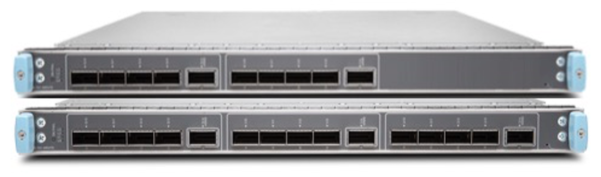
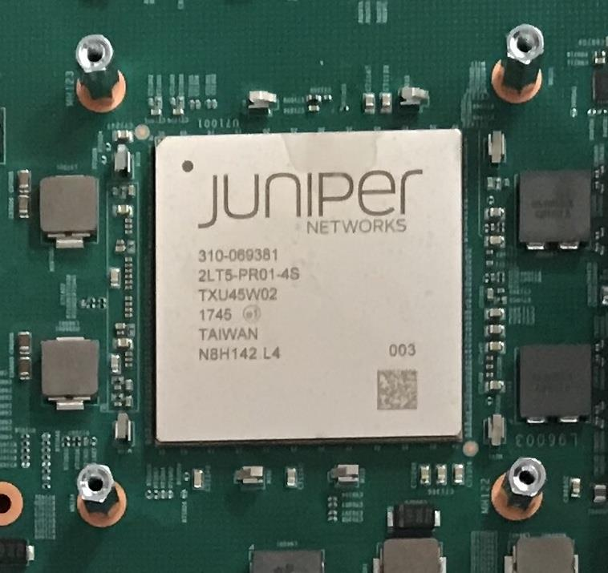
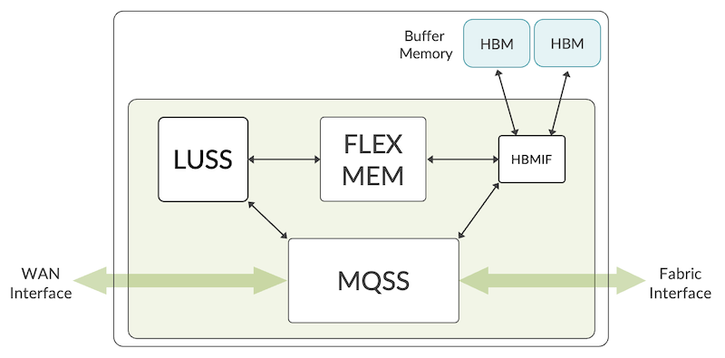
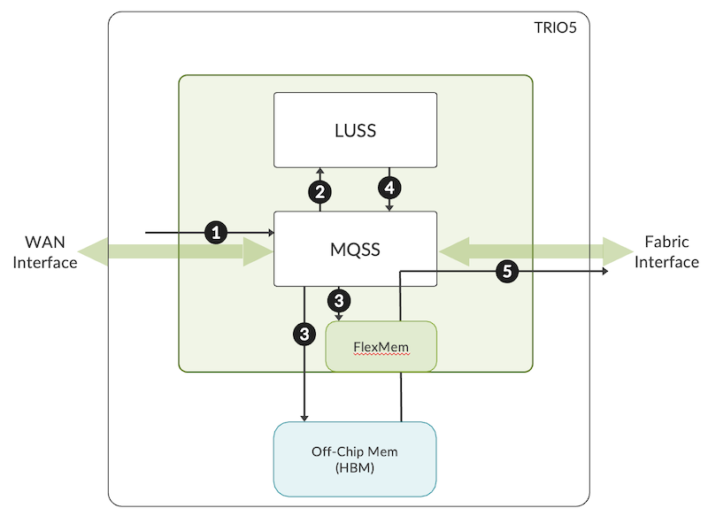
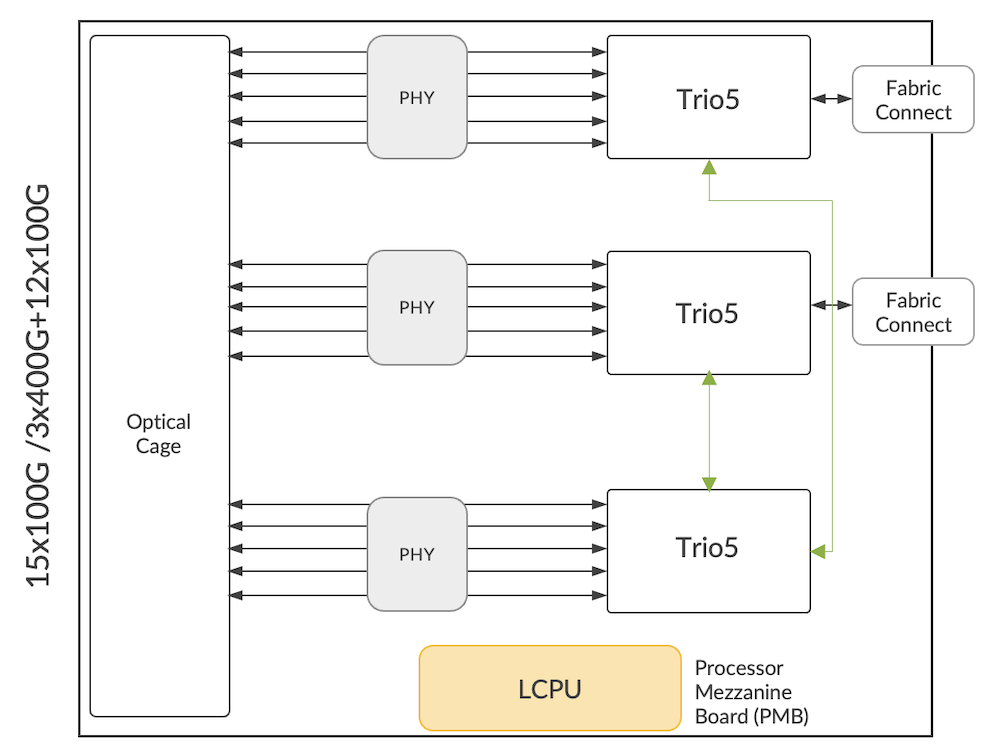
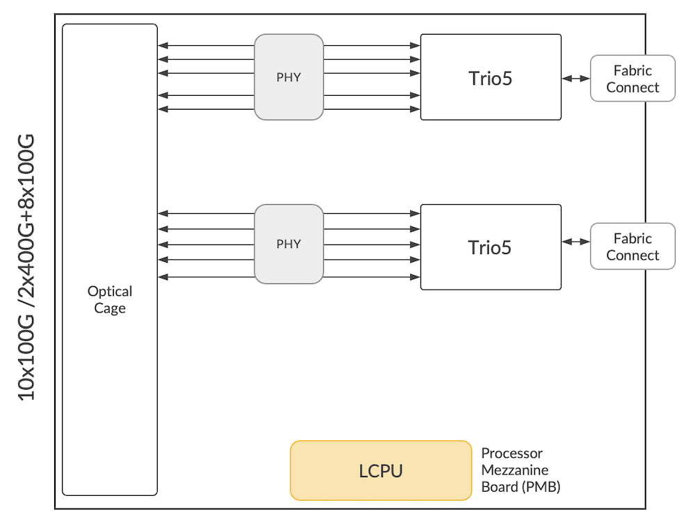
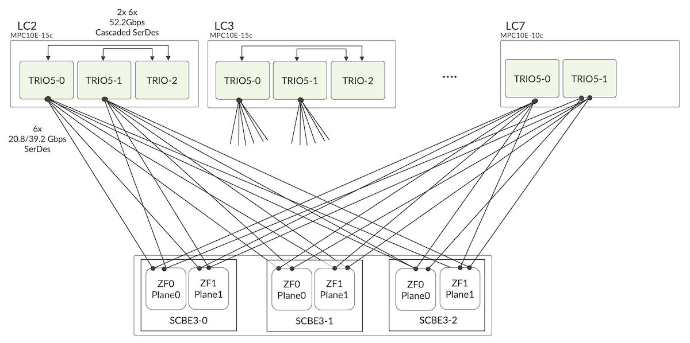

# MPC10E  Deepdive

**Deepak Tripathi - 03/13/2023**

A detailed view of the MPC10E line cards used in MX240, MX480 and MX480.

MX240/480/960 product family has been Juniper's flagship product for many years. It continues to delight our customers by protecting their investments through continuous capacity upgrades without having to rip and replace the entire system. MPC10E is the latest entry in the long list of Line Cards/Modular Physical Interface Cards (MPC) supported in this family.

## Introduction



MPC10E comes in two variants, MPC10E-10c and MPC10E-15c, which can deliver 1Tbps and 1.5Tbps of throughput capacity, respectively. Each MPC10E supports different port speeds, including 400G, making it a true multi-rate or MRATE line card. Here is the summary of the speeds supported:

| Speed | MPC10E-10c | MPC10E-15c |
|:--|:--|:--|
| 10GE | 40 (with 4x10GE Breakout) | 60 (with 4x10GE Breakout) |
| 25GE | 40 (with 4x10GE Breakout) | 60 (with 4x10GE Breakout) |
| 40GE | 10 | 15 |
| 100GE | 10 | 15 |
| 400GE | 2 | 3 |

Please find the complete list of supported optics from the [Hardware Compatibility Tool](https://apps.juniper.net/hct/home/):

MPC10E family of line cards runs on the fifth generation of Trio. Each line card will have two or three of these ASICs, depending on the MPC type.

## Trio5 Architecture



Trio5 is a 500Gbps chipset in 16nm design. Just like previous generations, Trio5 is optimized for edge deployments. The built-in crypto engine is introduced for the first time in the Trio family. This enables inline MACSec at all port speeds starting from 10GE to 100GE. 400GE MACSec is possible through Trio6. Please refer to my blog on LC9600 to get more details.

Trio5 continues to support a large scale of advanced edge features supported in the previous revisions of Trio. The same has been discussed in detail in the [LC480 TechPost](https://juniper.github.io/techposts/mx10000-lc480-deepdive/article). It supports a high number of queues and virtually unlimited firewall filters along with prefix lists and tunnels. It supports HQoS, Inline services such as NAT, 6RD, MAP-E, and Jflow/NetFlow along with telemetry, flex-filters and up to 16 label depth to enable advanced use cases of traffic engineering with segment routing (SR/SRv6).

Trio5 is the packet forwarding engine or PFE in the MPC10E family of line cards. To optimize power and space many design considerations have been taken into account. First and foremost is the memory. Trio5 replaces the Hybrid Memory Cube (HMC) and in-house high-performance memory with High Bandwidth Memory (HBM), which is used for packet processing and WAN queuing systems. Another important difference from the previous version is the inclusion of HBM memory and Trio ASIC via a silicon interposer in 2.5D packaging design. This design reduces the bus length enabling better power performance and minimizes board area on the line cards. It helps in packing more Trio5 ASICS on a single-line card, thus improving the per-slot throughput by more than three times compared to line cards based on previous versions.

The Crypto engine has been introduced for the first time in the Trio family. It enables building power-efficient systems/line cards that won't require an external component such as PHY to secure the ethernet connections between routers and switches.

The size of on-chip memory (OCMEM) in Trio5 has been increased, which is used for on-chip delay bandwidth buffers and the WAN queuing functions.



High Bandwidth Memory (HBM) is used as off-chip memory for delay bandwidth buffer and high scale flow table (Jflow) storage.

Each Trio5 has the following main components:

1. Lookup SubSystem (LUSS) provides all packet processing functions such as route/label lookup, firewall, and multi-field packet classification. This subsystem holds an array of Packet Processing Engines (PPE) to perform these functions. Trio5 and Trio4 each have 96 PPE,  but they run at a higher clock frequency to handle the increase in throughput in Trio5.
2. Memory and Queuing SubSystem (MQSS) provides data paths and rich queuing functionality. It acts as an interface between WAN and Fabric. It has a pre-classifier where packets are classified as low/high priority. Unlike initial generations of Trio where an eXtended Queuing SubSystem (XQSS) was used to provide rich queuing functionality, Trio5 integrates this function within the MQSS block. This helps in the reduction of foot print and improves the power performance without any compromise on functionality.
3. HBMIF is the interface to HBM mem and on-chip FlexMem
4. FlexMem is the on-chip memory that is used for WAN queuing data structures and on-chip delay bandwidth storage.

### Life of Packet inside Trio5

The life of the packet inside Trio5 is similar to the one described in [Trio6 TechPost](https://juniper.github.io/techposts/mx10000-lc9600-deepdive/article)



1. A packet is received on the MQSS block either from the WAN interface or from the Fabric interface. Pre-classification decides priority. The main purpose of pre-classification is to make sure that high-priority control traffic is protected even if the PFE is oversubscribed.
2. If the incoming packet size is less of equal to 224 bytes, the complete packet will be sent to the LUSS. If the incoming packet is larger than 224 bytes, the packet is split into HEAD (192 bytes) and TAIL. A reorder context and a reorder ID is created. Then, HEAD is sent to LUSS for processing, such as the route/label lookup function.
3. The TAIL of the packet is either sent to on-chip SRAM (FlexMem) or off-chip HBM.
4. The incoming packet gets processed in the PPEs in LUSS. Once LUSS has finished processing the modified packet or HEAD is sent back to MQSS. Here reorder entry of the packet is validated and once it becomes eligible it is sent to the fabric scheduler based on the priority queues.
5. Once the packet becomes eligible to be sent out of PFE, the content will be read from FlexMem or HBM and the packet will be sent out via the WAN/Fabric interface.

## MPC10E Architecture

The number of Packet Forwarding Engines (PFE) in MPC10E depends on the flavour. If it is a 1Tbps MPC10E-10c line card, then it will have two Trio5s, and if it is MPC10e-15c, then it will have three Trio5s. The 15c variant will have a slightly different approach in connecting to the fabric. More on this will be discussed in the next section. Leaving this aside, both the line cards have similar architecture.

Here is MPC10E-15c installed in the MX480 chassis.

```
regress@mx480-MPC10E> show chassis fpc 1 detail      
Slot 1 information:
  State                               Online    
  Temperature                      43 degrees C / 109 degrees F
  Total CPU DRAM                 32768 MB
  Total HBM                      24576 MB
  FIPS Capable                        True  
  FIPS Mode                           False 
  Start time                          2022-11-15 20:37:55 PST
  Uptime                              19 days, 4 hours, 19 minutes, 24 seconds
  Max power consumption            785 Watts

PFE Information:  

PFE  Power ON/OFF  Bandwidth         SLC
  0    ON            500G                
  1    ON            500G                
  2    ON            500G                

```

The faceplate of the line card will have 15/10G optical slots. Each of these slots can, by default, support 100G speed. Only the fifth, tenth and fifteenth ports can support 400G speed.

```
regress@mx480-MPC10E> show chassis pic pic-slot 0 fpc-slot 0      
FPC slot 0, PIC slot 0 information:
  Type                             MRATE-5xQSFPP
  State                            Online    
  PIC version                      0.0
  Uptime    2 days, 15 hours, 27 minutes, 58 seconds
PIC port information:
                         Fiber                    Xcvr vendor       Wave-       Xcvr          JNPR     MSA
  Port Cable type        type  Xcvr vendor        part number       length      Firmware      Rev      Version
  0    40GBASE SR4       MM    AVAGO              AFBR-79EQDZ-JU1   850 nm      0.0           REV 01   SFF-8436 ver n/a
  4    400GBASE-FR4      SM    JUNIPER-1W2        740-085349        1301 nm     1.0           REV 01   CMIS 3.0

Port speed information:
  Port  PFE      Capable Port Speeds
  0      0       4x10GE, 4x25GE, 40GE, 100GE
  1      0       4x10GE, 4x25GE, 40GE, 100GE
  2      0       4x10GE, 4x25GE, 40GE, 100GE
  3      0       4x10GE, 4x25GE, 40GE, 100GE
  4      0       4x10GE, 4x25GE, 40GE, 100GE, 4x100GE, 400GE

```





Line Card CPU (LCPU) is installed on a Processor Mezzanine Board (PMB) and serves for the standard Line card and PFE management functions. Eight core LCPU supports the bandwidth requirements of both the control and data plane. The LCPU runs the control packets and maintains other functions, such as:

- Update local route tables
- LOG, SYSLOG
- SFLOW
- JFLOW
- MACSec key exchanges
- Other bandwidth-intensive applications such as protocol session traffic, exception traffic handling, ARP, IPv4/IPv6 options etc.

There are 28 usable SerDes lanes between the ASIC and the WAN. But only 20 will be active at any given time, providing an aggregate bandwidth of 500Gbps. These SerDes lanes run at different speeds to support WAN interfaces from 10G to 400G.

MPC10E uses port profiles to manage the PIC ports.  Since oversubscription is not supported on MPC10E a port profile selects a set of ports active in a PIC and the port speed. Here are the config options.

```
regress@mx480-MPC10E# set chassis fpc 1 pic 0 pic-mode ?
Possible completions:
  100G                 100GE mode
  10G                  10GE mode
  1G   1GE mode
  25G                  25GE mode
  400G                 400GE mode
  40G                  40GE mode
[edit]
set chassis fpc 1 pic 0 pic-mode 100G number-of-ports 5
regress@mx480-MPC10E# show chassis 
fpc 1 {
    pic 0 {
        pic-mode 100G;
        number-of-ports 5;
    }
}
network-services enhanced-ip;
```

MPC10E also provides an option to control the speed at the port level. Any change in the port speed will not require a PIC bounce.

```
regress@mx480-MPC10E# set chassis fpc 1 pic 0 port 0 speed ?
Possible completions:
  100g                 Sets the interface mode to 100Gbps
  10g                  Sets the interface mode to 10Gbps
  1G                   1GE-Gigabit Ethernet
  25g                  Sets the interface mode to 25Gbps
  400g                 Sets the interface mode to 400Gbps
  40g                  Sets the interface mode to 40Gbps
  oc12-stm4            OC12 or STM4
  oc3-stm1             OC3 or STM1
  oc48-stm16           OC48 or STM16
regress@mx480-01# show chassis 
fpc 1 {
    pic 0 {
        port 0 {
            speed 100g;
        }
        port 4 {
            speed 400g;
        }
    }
}
network-services enhanced-ip;
```

The MPC10E-10c/15c will work with fabric card SCBE3 on MX240/480 and MX960 systems. Customers can continue to use most of the legacy line cards with this fabric, including 16x10GE line cards based on 1st gen Trio. Here is the list of hardware that will interoperate with MPC10E and SCBE3.

| FRU | Interoperability |
|:--|:--|
| MPC1E/MPC2E/ICHIP DPC/MS-DPC | No |
| SCB/SCBE/SCBE2 | No |
| RE-1300/RE-1200 | No |
| 16x10GE MPC | Yes, with new enhanced midplane |
| MPC3E/MPC4E/MPC5E | Yes |
| NG-MPC2E/NG-MPC3E | Yes |
| MPC7E-MRATE/MPC7E-10G | Yes |
| MS-MPC/MS-MIC | Yes |
| SCBE3 | Yes |
| RE-S-1800 | Yes |
| RE-S-X6 | Yes |
| MX-SPC3 | Yes |

### MPC10E-10c/15c and MX960 Fabric Interconnect

MX960 can have a maximum of three fabric cards. Each of these fabric cards will have one fabric chip. For the fabric interface of the MPC10E, only two Trio5 ASICs will connect to the backplane fabric, while the third "cascaded" Trio5 on the MPC10E-15c card will have its fabric interface connected to the other two Trio5 ASICs via their fabric cascade ports. This is design choice has been made for the MPC10E to interoperate with systems having older midplanes.

The two main ASICS have 32x PAM4 SerDes links, each connecting to the backplane fabric interface connector (24 active SerDes links per card in MX960). Each of those Trio5s will directly connect to a third Trio5 ASIC's fabric port via six lines of 52 Gbps PAM4 serdes from the cascaded port interface. This cascade port interface in the ASIC will accomplish a 2:1 weighted spray merge of traffic from the third ASIC, with half of the third Trio5 ASIC's WAN traffic going to each of the other two fabric-connected ASICs.



MPC10E-10c has only two Trio5s, so the fabric cascade SerDes lanes will spray the traffic onto the fabric. This helps in achieving line-rate performance with two fabric cards in the case of MPC10E-10c.

As shown in the MPC10E and SCBE3 interconnect picture. There are a total of 6 planes available in the three fabric cards. All the planes are needed to be active to achieve line rate performance in a system with enhanced midplane for MPC10E-15c. For systems with legacy midplanes, the throughput performance will reduce.  Here is table summarizing all these details.

| MX960 Redundancy | Throughput -- MPC10E-15c | Throughput -- MPC10E-15c |
|:--|:--|:--|
| 3+0 | 1.5T | 1T |
| 2+1 | 1T | 1T |

There is one important consideration that has to be taken care of while installing an MPC10E line card. Due to cooling and power requirements, MX960 cannot have MPC10E in slots 0, 1 and 11. In a DC environment or at 25C, all the remaining slots of MX960 can have both variants of MPC10E. There are no such restrictions on MX480 and MX240.

Here is a table with the number of MPC10E supported under different environmental conditions.

| Hardware SKU | Temperature | MX960 | MX480 | MX240 |
|:--|:--|:--|:--|:--|
| MPC10E-10C | 25C | 8 slotsSlots 0, 1, 11: N/A | 6 slots | 2 slots |
| 40C | 8 slotsSlots 0, 1, 11: N/A | 6 slots | 2 slots |  |
| 55C | 8 slotsSlots 0, 1, 11: N/A | 6 slots | 2 slots |  |
| MPC10E-15C | 25C | 8 slotsSlots 0, 1, 11: N/A | 5 slots | 2 slots |
| 40C | 7 slotsSlots 0, 1, 11: N/A | 4 slots | 2 slots |  |
| 55C | Not Supported | Not Supported | Not Supported |  |

```
regress@mx960-MPC10E> show chassis hardware 
Hardware inventory:
Item             Version  Part number  Serial number     Description
Chassis                                JN124F4A4AFA      MX960
Midplane         REV 06   750-047849   ACRD6288          Enhanced MX960 Backplane
FPM Board        REV 03   710-014974   ABDA6909          Front Panel Display
PDM              Rev 03   740-013110   QCS18305095       Power Distribution Module
PEM 0            Rev 11   740-027760   QCS1828N068       PS 4.1kW; 200-240V AC in
PEM 1            Rev 11   740-027760   QCS1847N034       PS 4.1kW; 200-240V AC in
PEM 2            Rev 11   740-027760   QCS1828N00C       PS 4.1kW; 200-240V AC in
PEM 3            Rev 11   740-027760   QCS1828N01K       PS 4.1kW; 200-240V AC in
Routing Engine 0 REV 05   750-072925   CAPR8470          RE-S-2X00x6
Routing Engine 1 REV 05   750-072925   CARC2899          RE-S-2X00x6
CB 0             REV 32   750-070866   CAPT1368          Enhanced MX SCB 3
CB 1             REV 32   750-070866   CAPT2407          Enhanced MX SCB 3
FPC 3            REV 43   750-056519   CAJR8851          MPC7E 3D MRATE-12xQSFPP-XGE-XLGE-CGE
  CPU            REV 20   750-057177   CAJP3829          SMPC PMB
  PIC 0                   BUILTIN      BUILTIN           MRATE-6xQSFPP-XGE-XLGE-CGE
    Xcvr 2       REV 01   740-061409   1G3TQAA6060HR     QSFP-100GBASE-LR4-T2
    Xcvr 5       REV 01   740-061409   1GTQA533098       QSFP-100GBASE-LR4-T2
  PIC 1                   BUILTIN      BUILTIN           MRATE-6xQSFPP-XGE-XLGE-CGE
FPC 4            REV 30   750-028467   ZN1207            MPC 3D 16x 10GE
  CPU            REV 10   711-029089   ZM7387            AMPC PMB
  PIC 0                   BUILTIN      BUILTIN           4x 10GE(LAN) SFP+
    Xcvr 0       REV 01   740-021308   AA1025A4UWU       SFP+-10G-SR
  PIC 1                   BUILTIN      BUILTIN           4x 10GE(LAN) SFP+
    Xcvr 0       REV 01   740-031981   45T012402990      SFP+-10G-LR
  PIC 2                   BUILTIN      BUILTIN           4x 10GE(LAN) SFP+
    Xcvr 0       REV 01   740-011613   PAJ4J29           SFP-SX
  PIC 3                   BUILTIN      BUILTIN           4x 10GE(LAN) SFP+
FPC 5            REV 53   750-070395   CAPD0787          MPC10E 3D MRATE-15xQSFPP
  CPU            REV 20   750-072571   CANF8715          FMPC PMB
  PIC 0                   BUILTIN      BUILTIN           MRATE-5xQSFPP
    Xcvr 2       REV 01   740-061409   1G3TQAA61508X     QSFP-100GBASE-LR4-T2
    Xcvr 3       M        NON-JNPR     FNS21161BBG       QSFP-100GBASE-LR4
  PIC 1                   BUILTIN      BUILTIN           MRATE-5xQSFPP
    Xcvr 2       REV 01   740-073093   1AMPA522037       QSFP+-40G-LR4
  PIC 2                   BUILTIN      BUILTIN           MRATE-5xQSFPP
    Xcvr 0       REV 01   740-061409   1GTQA5330AT       QSFP-100GBASE-LR4-T2
    Xcvr 1       REV 01   740-061409   1GTQA5330ED       QSFP-100GBASE-LR4-T2
FPC 6            REV 36   750-053323   CAFT8776          MPC7E 3D 40XGE
  CPU            REV 16   750-057177   CAFP4670          SMPC PMB
  PIC 0                   BUILTIN      BUILTIN           20x10GE SFPP
    Xcvr 0       REV 01   740-021308   943151A00527      SFP+-10G-SR
    Xcvr 1       REV 01   740-030658   AA1206AHWUG       SFP+-10G-USR
    Xcvr 2       REV 01   740-021308   AA1043A8951       SFP+-10G-SR
    Xcvr 3       REV 01   740-021308   983152A00096      SFP+-10G-SR
  PIC 1                   BUILTIN      BUILTIN           20x10GE SFPP
FPC 8            REV 18   750-045372   CADW7020          MPCE Type 3 3D
  CPU            REV 10   711-035209   CADV8102          HMPC PMB 2G 
  MIC 0          REV 26   750-028392   CAAS5045          3D 20x 1GE(LAN) SFP
    PIC 0                 BUILTIN      BUILTIN           10x 1GE(LAN) SFP
      Xcvr 0     REV 01   740-011613   AGS0736G3GF       SFP-SX
      Xcvr 9     REV 01   740-031469   17T446600290      SFP-LX10
    PIC 1                 BUILTIN      BUILTIN           10x 1GE(LAN) SFP
      Xcvr 3     REV 01   740-038291   PQ351CY           SFP-T
      Xcvr 5     REV 01   740-031851   AM1226SXYXB       SFP-SX
      Xcvr 6     REV 01   740-031851   AM1228SY6NR       SFP-SX
Fan Tray 0       REV 08   740-031521   ACDB9008          Enhanced Fan Tray
Fan Tray 1       REV 08   740-031521   ACDB9042          Enhanced Fan Tray

{master}
regress@mx960-MPC10E> show chassis fpc pic-status 
Slot 3   Online       MPC7E 3D MRATE-12xQSFPP-XGE-XLGE-CGE          
  PIC 0  Online       MRATE-6xQSFPP-XGE-XLGE-CGE
  PIC 1  Online       MRATE-6xQSFPP-XGE-XLGE-CGE
Slot 4   Online       MPC 3D 16x 10GE                               
  PIC 0  Online       4x 10GE(LAN) SFP+
  PIC 1  Online       4x 10GE(LAN) SFP+
  PIC 2  Online       4x 10GE(LAN) SFP+
  PIC 3  Online       4x 10GE(LAN) SFP+
Slot 5   Online       MPC10E 3D MRATE-15xQSFPP                      
  PIC 0  Online       MRATE-5xQSFPP
  PIC 1  Online       MRATE-5xQSFPP
  PIC 2  Online       MRATE-5xQSFPP
Slot 6   Online       MPC7E 3D 40XGE                                
  PIC 0  Online       20x10GE SFPP
  PIC 1  Online       20x10GE SFPP
Slot 8   Online       MPCE Type 3 3D                                
  PIC 0  Online       10x 1GE(LAN) SFP
  PIC 1  Online       10x 1GE(LAN) SFP

{master}
regress@mX960-MPC10E>


```

The above output shows different generations of MPCs successfully operating in an MX960 chassis along with the required common components.

## References

- MX960/480/240 Hardware Guide

[https://www.juniper.net/documentation/us/en/hardware/mx960/mx960.pdf](https://www.juniper.net/documentation/us/en/hardware/mx960/mx960.pdf)
[https://www.juniper.net/documentation/us/en/hardware/mx480/mx480.pdf](https://www.juniper.net/documentation/us/en/hardware/mx480/mx480.pdf)
[https://www.juniper.net/documentation/us/en/hardware/mx240/mx240.pdf](https://www.juniper.net/documentation/us/en/hardware/mx240/mx240.pdf)

## Glossary

- FIB: Forwarding Information Base
- HBM: High Bandwidth Memory
- LCPU: Line Card CPU
- LUSS: Lookup Sub-System
- MCIF: Memory Control Interface
- MPC: Modular Port Concentrator
- MQSS: Memory and Queuing Sub-System:
- NRZ: Non-Return to Zero
- OCPMem: On-Chip Memory
- PCB: Printed Circuit Board
- PFE: Packet Forwarding Engine
- PIC: Physical Interface Cards
- PMB: Processor Mezzanine Board
- PPE: Packet Processing Engines
- QSFP-DD: Quad Small Form Factor Pluggable Double Density
- SerDes: Serializer/Deserializer
- SRAM: Static Random Access Memory
- SCBE3: Switch Control Board Card (gen3)
- XQSS: Extended Queuing Sub-System
- ZF: Chipset used in SFB Switch Fabric Cards

## Acknowledgement

I want to express my gratitude to my mentor Nicolas Fevrier, Sr. Director, PLM, for the detailed reviews of the blog. I would also like to thank Eswaran Srinivasan, Distinguished Engineer and Vasily Mukhin for providing their valuable input.
