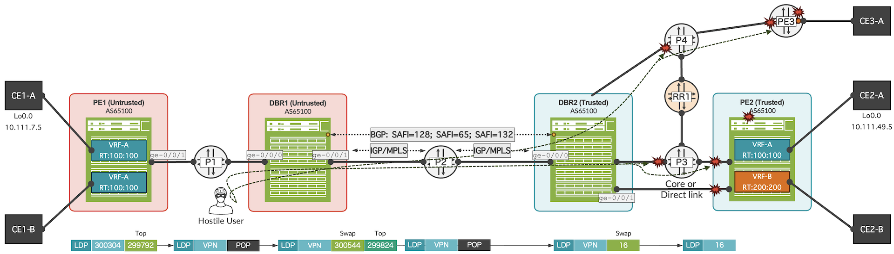
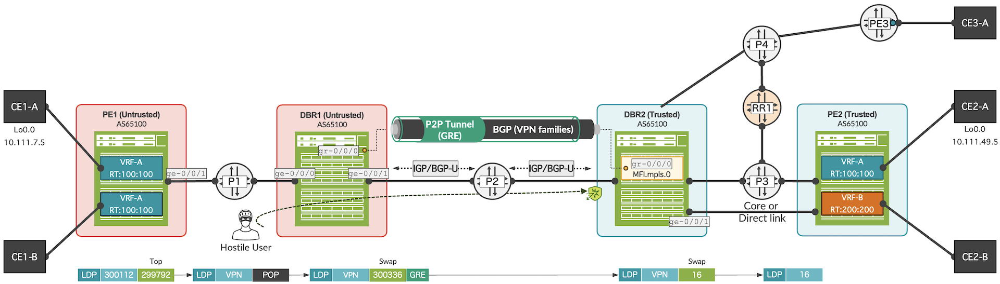
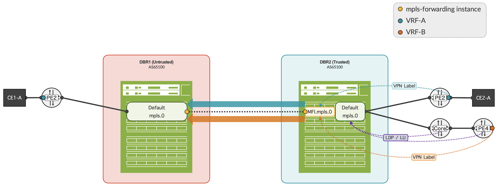
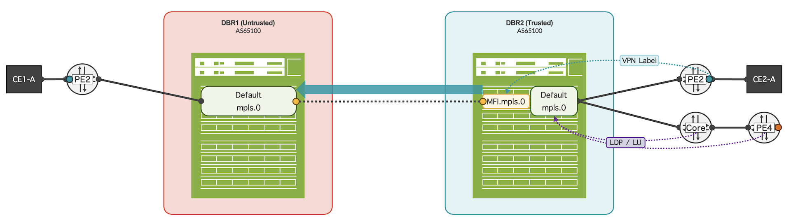
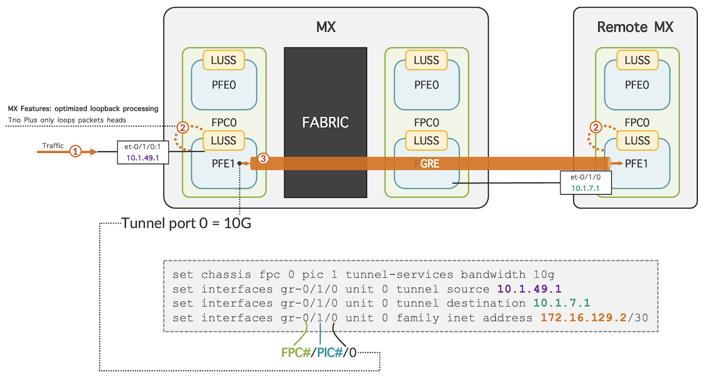

# MPLS Label Anti-Spoofing

**Moshiko Nayman - 07/13/2023**

Solution to secure BGP Option B against MPLS label spoofing on MX Series routers.

## Introduction

Solution to secure BGP Option B against MPLS label spoofing, supported from Junos OS 16.1, MX platform with Trio(TM) chipset.

This capability would be beneficial for service providers or cloud providers who need to compartmentalize a network at scale.

RFC 4364 section 10b is describing a method also called Inter-AS Option B where two sites of a VPN are connected to different AS (Autonomous Systems) because they are connected to different SP (service providers) or when SPs need to compartmentalize network while keeping the same AS number.

*Note that BGP Option B can be in a form of Intra-AS as described in: draft-smn-idr-inter-domain-ibgp-01*
*[https://datatracker.ietf.org/doc/draft-smn-idr-inter-domain-ibgp/](https://datatracker.ietf.org/doc/draft-smn-idr-inter-domain-ibgp/)*

*In this case, the term DBR (Domain Boundary Router) is used instead of ASBR.*

Inter-AS BGP Option B is accomplished by using family inet-vpn (SAFI=128) session between ASBRs (Autonomous System Boundary Router) exchanging labels with eBGP. Option B is a more scalable alternative to Option A. In Option B, Inter-AS VPN routes are stored only in the BGP RIBs, as opposed to Option A which results in ASBRs creating multiple VRF-to-VRF tables, each of which includes all IP routes.

Although BGP Option B is highly scalable and may be considered as a simple solution to compartmentalize a network, it is vulnerable to unauthorized labeled forwarding and/or label spoofing.

Some may claim RD and RT filtering is "good enough" and indeed it provides some level of security, however, it does not protect against MPLS label spoofing.

This feature is briefly described in BGP Signaled MPLS Namespaces section 6.1.4:
[https://www.ietf.org/archive/id/draft-kaliraj-bess-bgp-sig-private-mpls-labels-06.html#section-6.1.4](https://www.ietf.org/archive/id/draft-kaliraj-bess-bgp-sig-private-mpls-labels-06.html#section-6.1.4)

## Problem Statement

BGP Option B is unable to ensure that the provider network is protected in the event of incorrect RD (route distinguisher) advertisements or spoofed MPLS labels.

In the diagram below, DBR2 will accept any erroneously sent MPLS-packets for L3VPNs and from DBR2 as-well, though no VPN routes were advertised to the DBR1 in the untrusted region.  Thus, DBR1 can inject MPLS packets towards PE1 or PE2 VRFs. A security concern, hostile user can attack MPLS nodes in the internal network of the service provider such as remote P and PE by spoof MPLS label.

Policy-based RD filtering ensures that only RDs generated within the service provider domain are accepted. At the same time, the filtering can be used to filter loopback VPN-IPv4 addresses generated by PIM Rosen implementations from Cisco PEs, which can cause routing issues and traffic loss if imported into customer VRF tables.



## Solution

Junos OS anti-spoofing support for Option B implementations works by creating distinct MPLS forwarding table contexts. A separate mpls.0 table is created for each set of VPN ASBR peers. As such, each MPLS forwarding table contains only the relevant labels advertised to the group of Inter/Intra AS-Option B peers.

Option B will be reachable through local interfaces that have been configured as part of the MPLS Forwarding Instance (MFI) which is the new routing-instance created for the Inter-AS / Intra-AS BGP neighbors that requires MPLS spoof-protection. MPLS packets arriving from the Option B peers are resolved in the (MFI) instance-specific MPLS forwarding table.

Spoof checking occurs between any peers with different mpls-forwarding MFIs. For peers with the same forwarding-context, spoof-checking is not necessary because peers share the same MFI.mpls.0 table.

Optional: Family route-target (Route Target Constrain or RTC) can be enabled on the BGP session between the Trusted and Untrusted zone to further reduce the number of labels installed in MFI.mpls.0 table from unwanted VPN labels to only VPN labels required by the Untrusted zone.

An optional tunnel can be used to emulate point-to-point connectivity and so there will be a dedicated interface associated to the newly created table. This is useful to further filter against intra-VRF attacks targeting remote PE interface in a VRF.

DBR2 (Domain Boundary Router) will only forward traffic through PE2 if the VPN service label installed is in the newly created instance: MFI.mpls.0 instance. Transport labels of PE2 or other P/PE nodes will not be copied from global mpls.0 to the MFI.mpls.0 table.

In the example below, a GRE tunnel is used to emulate point-to-point between the DBRs; MPLS can be disabled in the underlay interfaces where IGP or BGP Unicast is configured to exchange interface routes between the nodes.



Analyzing of label advertisement with MPLS anti-spoofing enabled for BGP option 10b:





## Configuration

Secure BGP option 10b: MPLS label anti-spoofing with GRE and RTC: to enable anti-spoofing support for MPLS labels, configure separate instances of the new routing instance type, mpls-forwarding, on all MPLS-enabled Inter-AS or Intra-AS links. In the example below, GRE tunnel has been used to emulate point-to-point connectivity allowing MPLS family to be disabled at the physical interfaces under this GRE.

Then configure each Option B peer to use this routing instance as its forwarding-context under BGP. This forms the transport session with the peers and performs forwarding functions for traffic from peers.

Creation of MFI MPLS table, and changing existing BGP neighbor towards MFI instance for data-forwarding and transport-session.

**DBR2**:

```
set routing-instances MFI instance-type mpls-forwarding
set routing-instances MFI interface gr-0/0/10.0
set protocols bgp group DBR-TRUSTED-UNTRUSTED forwarding-context MFI
```

Copy IP interface routes from MFI IP table to IP MPLS (inet.3) table.

**DBR2**:

```
set routing-options rib-groups MFI-TO-INET3 import-rib MFI.inet.0
set routing-options rib-groups MFI-TO-INET3 import-rib inet.3
set routing-instances MFI routing-options interface-routes rib-group inet MFI-TO-INET3
```

Optional GRE configuration.

**DBR2**:

```
set routing-instances MFI interface gr-0/0/10.0 
set interfaces gr-0/0/10 unit 0 tunnel source 10.1.49.1
set interfaces gr-0/0/10 unit 0 tunnel destination 10.1.7.1
set interfaces gr-0/0/10 unit 0 family inet address 172.16.129.2/24
set interfaces gr-0/0/10 unit 0 family mpls
set chassis fpc 0 pic 0 tunnel-services bandwidth 10g
```

Optional RTC configuration.

**DBR1**:

```
set protocols bgp group HUB-EMEA-RUSSIA family route-target
```

**DBR2**:

```
set protocols bgp group HUB-EMEA-RUSSIA family route-target advertise-default
```

Notes:

- When GRE tunnel interface is used between DBR1 to DBR2, user can decide to remove family MPLS from the physical interface.
- This technique of anti-spoofing support for MPLS labels is also supported on mixed networks.

## Verification

Quick view on DBR2, only service label of shared VPN from Trusted to Untrusted region is installed in MFI.mpls.0 table.

```
mnayman@DBR2> show route table MFI.mpls.0

MFI.mpls.0: 1 destinations, 1 routes (1 active, 0 holddown, 0 hidden)
+ = Active Route, - = Last Active, * = Both

300336             *[VPN/170] 00:10:33, metric2 1, from 10.1.49.100
                    >  to 172.16.49.10 via ge-0/0/1.0, Swap 16

mnayman@DBR2> show route table MFI.mpls.0                                   
...
Routing table: MFI.mpls
MPLS:
Destination        Type RtRef Next hop           Type Index    NhRef Netif
default            perm     0                    dscd      667     1
300336             user     0                    indr  1048574     2
                              172.16.49.10      Swap 16      586     2 ge-0/0/1.0
```

Interface primary route is in MFI.inet.0 table copied into inet.3 table:

```
mnayman@DBR2> show route 172.16.129.2/32 extensive

inet.3: 12 destinations, 13 routes (12 active, 0 holddown, 0 hidden)
172.16.129.2/32 (1 entry, 1 announced)
        *Local  Preference: 0
                Next hop type: Local, Next hop index: 0
                Address: 0xc748334
                Next-hop reference count: 11
                Next hop: 
                Interface: gr-0/0/10.0
                State: <Secondary Active NoReadvrt Int>
                Age: 1d 13:56:25 
                Validation State: unverified 
                Task: IF
                Announcement bits (2): 2-Resolve tree 1 3-Resolve tree 2 
                AS path: I 
                Primary Routing Table: MFI.inet.0

MFI.inet.0: 2 destinations, 2 routes (2 active, 0 holddown, 0 hidden)

172.16.129.2/32 (1 entry, 0 announced)
        *Local  Preference: 0
                Next hop type: Local, Next hop index: 0
                Address: 0xc748334
                Next-hop reference count: 11
                Next hop: 
                Interface: gr-0/0/10.0
                State: <Active NoReadvrt Int>
                Age: 1d 13:56:25 
                Validation State: unverified 
                Task: IF
                AS path: I 
                Secondary Tables: inet.3
```

Perform these tasks to verify that BGP secure option 10b works properly:****

**PE1**: Show VPN route towards CE2-A

```
mnayman@PE1> show route 10.111.49.5/32                            

VRF-A.inet.0: 15 destinations, 17 routes (15 active, 0 holddown, 0 hidden)
+ = Active Route, - = Last Active, * = Both

10.111.49.5/32     *[BGP/170] 06:06:10, localpref 100, from 10.1.7.1
                      AS path: 149 I, validation-state: unverified
                    >  to 172.16.7.1 via ge-0/0/1.0, Push 300112, Push 299792(top)
```

**P1**: Show MPLS label route

```
mnayman@P1 > show route label 299792 

mpls.0: 7 destinations, 7 routes (7 active, 0 holddown, 0 hidden)
+ = Active Route, - = Last Active, * = Both

299792             *[LDP/9] 06:06:38, metric 1
                    >  to 172.16.0.7 via ge-0/0/0.0, Pop      
299792(S=0)        *[LDP/9] 06:06:38, metric 1
                    >  to 172.16.0.7 via ge-0/0/0.0, Pop
```

****

**DBR1**: Show MPLS label route

```
mnayman@DBR1> show route label 300112 extensive 

mpls.0: 9 destinations, 9 routes (9 active, 0 holddown, 0 hidden)
300112 (1 entry, 1 announced)
TSI:
KRT in-kernel 300112 /52 -> {indirect(1048575)}
        *VPN    Preference: 170
                Next hop type: Indirect, Next hop index: 0
                Address: 0xc749464
                Next-hop reference count: 2
                Source: 172.16.129.2
                Next hop type: Router, Next hop index: 624
                Next hop: 172.16.129.2 via gr-0/0/10.0, selected
                Label operation: Swap 300336
                Load balance label: Label 300336: None; 
                Label element ptr: 0xcbd9e60
                Label parent element ptr: 0x0
                Label element references: 1
                Label element child references: 0
                Label element lsp id: 0
                Session Id: 0x143
                Protocol next hop: 172.16.129.2
                Label operation: Swap 300336
                Load balance label: Label 300336: None; 
                Indirect next hop: 0xc811904 1048575 INH Session ID: 0x144
                State: <Active Int Ext>
                Local AS: 21302 
                Age: 6:09:17    Metric2: 0 
                Validation State: unverified 
                Task: BGP_RT_Background
                Announcement bits (1): 1-KRT 
                AS path: I  (Originator)
                Cluster list:  10.1.49.1 10.1.49.100
                Originator ID: 10.1.49.10
                Ref Cnt: 8
                Communities: target:107:149
                Indirect next hops: 1
                        Protocol next hop: 172.16.129.2
                        Label operation: Swap 300336
                        Load balance label: Label 300336: None; 
                        Indirect next hop: 0xc811904 1048575 INH Session ID: 0x144
                        Indirect path forwarding next hops: 1
                                Next hop type: Router
                                Next hop: 172.16.129.2 via gr-0/0/10.0
                                Session Id: 0x143
                                172.16.129.0/24 Originating RIB: inet.3
                                  Node path count: 1
                                  Forwarding nexthops: 1
                                        Next hop type: Interface
                                        Next hop: via gr-0/0/10.0 
```

**DBR1**: Show L3VPN route

```
mnayman@DBR1> show route 10.111.49.5/32 extensive 

bgp.l3vpn.0: 15 destinations, 15 routes (15 active, 0 holddown, 0 hidden)
49:49:10.111.49.5/32 (1 entry, 1 announced)
TSI:
RTF { 107:149/64 }
Page 0 idx 1, (group PE-DBR-UNTRUSTED type Internal) Type 1 val 0xd3c80d4 (adv_entry)
   Advertised metrics:
     Flags: Nexthop Change
     Nexthop: Self
     Localpref: 100
     AS path: [21302] 149 I (Originator)
     Cluster list:  10.1.49.1 10.1.49.100
     Originator ID: 10.1.49.10
     Communities: target:107:149
     Cluster ID: 10.1.7.1
     VPN Label: 300112
    Advertise: 00000001
Path 49:49:10.111.49.5
from 172.16.129.2
Vector len 4.  Val: 1
        *BGP    Preference: 170/-101
                Route Distinguisher: 49:49
                Next hop type: Indirect, Next hop index: 0
                Address: 0xc749270
                Next-hop reference count: 9
                Source: 172.16.129.2
                Protocol next hop: 172.16.129.2
                Label operation: Push 300336
                Label TTL action: prop-ttl
                Load balance label: Label 300336: None; 
                Indirect next hop: 0x2 no-forward INH Session ID: 0x0
                State: <Active Int Ext ProtectionPath ProtectionCand>
                Local AS: 21302 Peer AS: 21302
                Age: 6:09:55    Metric2: 0 
                Validation State: unverified 
                Task: BGP_21302.172.16.129.2
                Announcement bits (2): 0-BGP Route Target 1-BGP_RT_Background 
                AS path: 149 I  (Originator)
                Cluster list:  10.1.49.1 10.1.49.100
                Originator ID: 10.1.49.10
                Communities: target:107:149
                Accepted
                VPN Label: 300336
                Localpref: 100
                Router ID: 172.16.129.2
                Indirect next hops: 1
                        Protocol next hop: 172.16.129.2
                        Label operation: Push 300336
                        Label TTL action: prop-ttl
                        Load balance label: Label 300336: None; 
                        Indirect next hop: 0x2 no-forward INH Session ID: 0x0
                        Indirect path forwarding next hops: 1
                                Next hop type: Router
                                Next hop: 172.16.129.2 via gr-0/0/10.0
                                Session Id: 0x0
                                172.16.129.0/24 Originating RIB: inet.3
                                  Node path count: 1
                                  Forwarding nexthops: 1
                                        Next hop type: Interface
                                        Next hop: via gr-0/0/10.0
```

**DBR2**: Show MPLS label route

```
mnayman@DBR2> show route label 300336 extensive 

MFI.mpls.0: 1 destinations, 1 routes (1 active, 0 holddown, 0 hidden)
300336 (1 entry, 1 announced)
TSI:
KRT in-kernel 300336 /52 -> {indirect(1048574)}
        *VPN    Preference: 170
                Next hop type: Indirect, Next hop index: 0
                Address: 0xc7496bc
                Next-hop reference count: 2
                Source: 10.1.49.100
                Next hop type: Router, Next hop index: 586
                Next hop: 172.16.49.10 via ge-0/0/1.0, selected
                Label operation: Swap 16
                Load balance label: Label 16: None; 
                Label element ptr: 0xcbdbbc0
                Label parent element ptr: 0xcbdb558
                Label element references: 1
                Label element child references: 0
                Label element lsp id: 0
                Session Id: 0x140
                Protocol next hop: 10.1.49.10
                Label operation: Swap 16
                Load balance label: Label 16: None; 
                Indirect next hop: 0xc811784 1048574 INH Session ID: 0x143
                State: <Active Int Ext>
                Local AS: 21302 
                Age: 6:12:20    Metric2: 1 
                Validation State: unverified 
                Task: BGP_RT_Background
                Announcement bits (1): 0-KRT 
                AS path: I  (Originator)
                Cluster list:  10.1.49.100
                Originator ID: 10.1.49.10
                Ref Cnt: 8
                Communities: target:107:149
                Indirect next hops: 1
                        Protocol next hop: 10.1.49.10 Metric: 1
                        Label operation: Swap 16
                        Load balance label: Label 16: None; 
                        Indirect next hop: 0xc811784 1048574 INH Session ID: 0x143
                        Indirect path forwarding next hops: 1
                                Next hop type: Router
                                Next hop: 172.16.49.10 via ge-0/0/1.0
                                Session Id: 0x140
                                10.1.49.10/32 Originating RIB: inet.3
                                  Metric: 1 Node path count: 1
                                  Forwarding nexthops: 1
                                        Next hop type: Router
                                        Next hop: 172.16.49.10 via ge-0/0/1.0
                                        Session Id: 0x0
```

**DBR2**: Show L3VPN route

```
mnayman@DBR2> show route 10.111.49.5/32 extensive

bgp.l3vpn.0: 15 destinations, 15 routes (15 active, 0 holddown, 0 hidden)
49:49:10.111.49.5/32 (1 entry, 1 announced)
TSI:
RTF { 107:149/64 }
Page 0 idx 1, (group DBR-TRUSTED-UNTRUSTED type Internal) Type 1 val 0xd3c7d70 (adv_entry)
   Advertised metrics:
     Flags: Nexthop Change
     Nexthop: Self
     Localpref: 100
     AS path: [21302] 149 I (Originator)
     Cluster list:  10.1.49.100
     Originator ID: 10.1.49.10
     Communities: target:107:149
     Cluster ID: 10.1.49.1
     VPN Label: 300336
    Advertise: 00000001
Path 49:49:10.111.49.5
from 10.1.49.100
Vector len 4.  Val: 1
        *BGP    Preference: 170/-101
                Route Distinguisher: 49:49
                Next hop type: Indirect, Next hop index: 0
                Address: 0xc748fb4
                Next-hop reference count: 9
                Source: 10.1.49.100
                Protocol next hop: 10.1.49.10
                Label operation: Push 16
                Label TTL action: prop-ttl
                Load balance label: Label 16: None; 
                Indirect next hop: 0x2 no-forward INH Session ID: 0x0
                State: <Active Int Ext ProtectionPath ProtectionCand>
                Local AS: 21302 Peer AS: 21302
                Age: 6:15:34    Metric2: 1 
                Validation State: unverified 
                Task: BGP_21302.10.1.49.100
                Announcement bits (2): 0-BGP Route Target 1-BGP_RT_Background 
                AS path: 149 I  (Originator)
                Cluster list:  10.1.49.100
                Originator ID: 10.1.49.10
                Communities: target:107:149
                Accepted
                VPN Label: 16
                Localpref: 100
                Router ID: 10.1.49.100
                Indirect next hops: 1
                        Protocol next hop: 10.1.49.10 Metric: 1
                        Label operation: Push 16
                        Label TTL action: prop-ttl
                        Load balance label: Label 16: None; 
                        Indirect next hop: 0x2 no-forward INH Session ID: 0x0
                        Indirect path forwarding next hops: 1
                                Next hop type: Router
                                Next hop: 172.16.49.10 via ge-0/0/1.0
                                Session Id: 0x0
                                10.1.49.10/32 Originating RIB: inet.3
                                  Metric: 1 Node path count: 1
                                  Forwarding nexthops: 1
                                        Next hop type: Router
                                        Next hop: 172.16.49.10 via ge-0/0/1.0
                                        Session Id: 0x0
```

**DBR2**: Show forwarding table label route
Traffic coming to the Trusted region is processed through MFI.mpls.0 instance where only service VPN labels are installed. This prevents the Untrusted region from reaching MPLS transport labels of nodes in the Trusted zone.

```
mnayman@DBR2> show route forwarding-table label 300336 extensive 
Routing table: default.mpls [Index 0] 
MPLS:
    
Destination:  default
  Route type: permanent             
  Route reference: 0                   Route interface-index: 0   
  Multicast RPF nh index: 0             
  P2mpidx: 0              
  Flags: sent to PFE 
  Next-hop type: discard               Index: 50       Reference: 1    

Routing table: __mpls-oam__.mpls [Index 8] 
MPLS:
    
Destination:  default
  Route type: permanent             
  Route reference: 0                   Route interface-index: 0   
  Multicast RPF nh index: 0             
  P2mpidx: 0              
  Flags: sent to PFE 
  Next-hop type: discard               Index: 565      Reference: 1    

Routing table: MFI.mpls [Index 10] 
MPLS:
    
Destination:  300336
  Route type: user                  
  Route reference: 0                   Route interface-index: 0   
  Multicast RPF nh index: 0             
  P2mpidx: 0              
  Flags: sent to PFE, prefix load balance  
  Next-hop type: indirect              Index: 1048575  Reference: 2    
  Nexthop: 172.16.49.10
  Next-hop type: Swap 16               Index: 618      Reference: 2    
  Load Balance Label: None              
  Next-hop interface: ge-0/0/1.0
```

**DBR2**: Reverse path, show forwarding table label route towards CE1-A

```
mnayman@DBR2> show route forwarding-table label 301744 extensive    
Routing table: default.mpls [Index 0] 
MPLS:
    
Destination:  301744
  Route type: user                  
  Route reference: 0                   Route interface-index: 0   
  Multicast RPF nh index: 0             
  P2mpidx: 0              
  Flags: sent to PFE, prefix load balance  
  Next-hop type: indirect              Index: 1048574  Reference: 2    
  Nexthop: 172.16.129.1
  Next-hop type: Swap 300576           Index: 588      Reference: 2    
  Load Balance Label: None              
  Next-hop interface: gr-0/0/10.0  

Routing table: __mpls-oam__.mpls [Index 8] 
MPLS:
    
Destination:  default
  Route type: permanent             
  Route reference: 0                   Route interface-index: 0   
  Multicast RPF nh index: 0             
  P2mpidx: 0              
  Flags: sent to PFE 
  Next-hop type: discard               Index: 565      Reference: 1    

Routing table: MFI.mpls [Index 10] 
MPLS:
    
Destination:  default
  Route type: permanent             
  Route reference: 0                   Route interface-index: 0   
  Multicast RPF nh index: 0             
  P2mpidx: 0              
  Flags: sent to PFE 
  Next-hop type: discard               Index: 604      Reference: 1
```

**PE2**: Reverse path, show MPLS label route towards CE1-A

```
mnayman@PE2> show route label 16 

mpls.0: 8 destinations, 8 routes (8 active, 0 holddown, 0 hidden)
+ = Active Route, - = Last Active, * = Both


16                 *[VPN/0] 06:45:09
                    >  via lsi.0 (VRF-A), Pop 
```

PE2: Reverse path, show L3VPN route towards CE1-A

```
mnayman@PE2> show route 10.111.49.5/32                            

VRF-A.inet.0: 15 destinations, 17 routes (15 active, 0 holddown, 0 hidden)
+ = Active Route, - = Last Active, * = Both

10.111.49.5/32     *[BGP/170] 03:55:21, localpref 100
                      AS path: 149 I, validation-state: unverified
                    >  to 172.16.222.1 via ge-0/0/0.0
```

## Appendix

### Generic Routing Encapsulation (GRE) in Trio chipset

On Trio silicon-based line cards, tunnel services are built into each PFE; there is no need to disable a port to allow the tunnel services.

Since the tunnel service processing happens directly on the PFE, the performance is near line-rate and keeps the latency to a minimum.

The following are some of the tunnel interface characteristics when tunnel-services are enabled.

- The interface name for GRE in Junos is "gr-".
- The bandwidth that is specified determines the port number of the tunnel interfaces that will be created.

When a bandwidth of 1g is specified, the port number is always 10. When any other bandwidth is specified, the port number is always 0.

You can configure GRE on different FPC and PIC from the physical port, in this case traffic will go over the fabric cards.



******

### Configuring BGP Route Target Filtering for VPNs

BGP route target filtering allows you to advertise VPN routes to only the routers that require them. By filtering advertisement of VPN routes, BGP route target filtering is helping to minimize the risk of attacking CEs in trusted region that do not share a common VPN between the two regions.

BGP route target filtering is enabled through the exchange of the route-target address family, stored in the bgp.rtarget.0 routing table. Based on the route-target address family, the route target NLRI (SAFI=132) is negotiated with its peers.

## Knobs used in this article:

- Instance-type mpls-forwarding Allow filtering and translation of route distinguisher (RD) values in IPv4 and IPv6 VPN address families on both routes received and routes sent for selected BGP sessions. For BGP Option-B, this feature can prevent the malicious injection of VPN labels from one peer AS boundary router to another.
- BGP family route-target for filtering VPN routes before they are sent. Provider edge (PE) routers inform the route reflector (RR) which routes to send, using family route-target to provide the route-target-interest information. The RR then sends to the PE router only the advertisements containing the specified route target.
- BGP session with forwarding-context setting is required in conjunction with mpls-forwarding to protect against label spoofing across AS boundary routers in the context of Inter-AS VPN Option B for AS boundary routers.

## Useful links

- Anti-spoofing support for MPLS labels in BGP/MPLS IP VPNs (Inter-AS Option B)
[https://www.juniper.net/documentation/us/en/software/junos/multicast/topics/concept/anti-spoofing-support-for-mpls-labels.html](https://www.juniper.net/documentation/us/en/software/junos/multicast/topics/concept/anti-spoofing-support-for-mpls-labels.html)
- Interconnecting domains with Multiprotocol IBGP draft:  draft-smn-idr-inter-domain-ibgp-01
[https://datatracker.ietf.org/doc/draft-smn-idr-inter-domain-ibgp/](https://datatracker.ietf.org/doc/draft-smn-idr-inter-domain-ibgp/)
- Configuring GRE tunnel interface:
[https://www.juniper.net/documentation/us/en/software/junos/interfaces-encryption/topics/topic-map/configuring-gre-tunnel-interfaces.html](https://www.juniper.net/documentation/us/en/software/junos/interfaces-encryption/topics/topic-map/configuring-gre-tunnel-interfaces.html)
- Configuring BGP Route Target Filtering for VPNs
[https://www.juniper.net/documentation/us/en/software/junos/vpn-l3/topics/topic-map/l3-vpns-route-target-filtering.html#id-configuring-bgp-route-target-filtering-for-vpns](https://www.juniper.net/documentation/us/en/software/junos/vpn-l3/topics/topic-map/l3-vpns-route-target-filtering.html#id-configuring-bgp-route-target-filtering-for-vpns)
- Configuring Inter provider VPN:
[https://www.juniper.net/documentation/us/en/software/junos/vpn-l3/topics/topic-map/l3-vpns-interprovider.html#id-example-configuring-interprovider-layer-3-vpn-option-b](https://www.juniper.net/documentation/us/en/software/junos/vpn-l3/topics/topic-map/l3-vpns-interprovider.html#id-example-configuring-interprovider-layer-3-vpn-option-b)
- IETF Draft: [https://www.ietf.org/archive/id/draft-kaliraj-bess-bgp-sig-private-mpls-labels-06.html#section-6.1.4](https://www.ietf.org/archive/id/draft-kaliraj-bess-bgp-sig-private-mpls-labels-06.html#section-6.1.4)

## Glossary

- AS: Autonomous System
- ASBR: Autonomous System Boundary Router
- BGP: Border Gateway Protocol
- CE: Customer Edge
- Cluster-id: Cluster-Identifier to be used by the route reflector cluster in an internal BGP group
- DBR: Domain Boundary Router
- EBGP: External Border Gateway Protocol
- FPC: Flexible PIC Concentrators
- GRE: Generic Routing Encapsulation
- IBGP: Internal Border Gateway Protocol
- IGP: Interior Gateway Protocol
- inet.0: IPv4 table. Stores interface local and direct routes, static routes, and dynamically learned routes.
- inet6.0: IPv6 table. Stores interface local and direct routes, static routes, and dynamically learned routes.
- inet.3: IP MPLS table. Stores the egress address of an MPLS label-swiched, the LSP name, and the outgoing interface name. This routing table is used only when the local device is the ingress node to an LSP.
- inet-vpn: NLRI parameters for IPv4 for Layer 3 VPNs
- IP: Internet Protocol
- Junos: Junos Operating System used in Juniper Networks routing, switching and security devices.
- LSP: Label-Swiched Path
- LSR: Label Switch Router
- MFI: MPLS Forwarding Instance
- MPLS: Multiprotocol Label Switching
- MX: Multi-Service router with programmable silicon
- NLRI: Network Layer Reachability Information
- P: Provider router is a label switch router that functions as a transit router of the core network.
- PE: Provider Edge router
- PFE: Packet Forwarding Engine
- PIC: Physical Interface Cards
- RD: Route Distinguisher
- RIB: Routing Information Base
- RT: Route Target
- RTC: Route Target Constrain or RT-Constrain is based on RFC 4684
- SAFI: Subsequent Address Family Identifiers
- Trio: Juniper silicon. multi-threaded programmable packet processing engine and a hierarchy of high-capacity memory systems
- VPN: virtual private network

