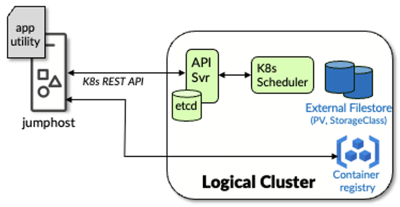
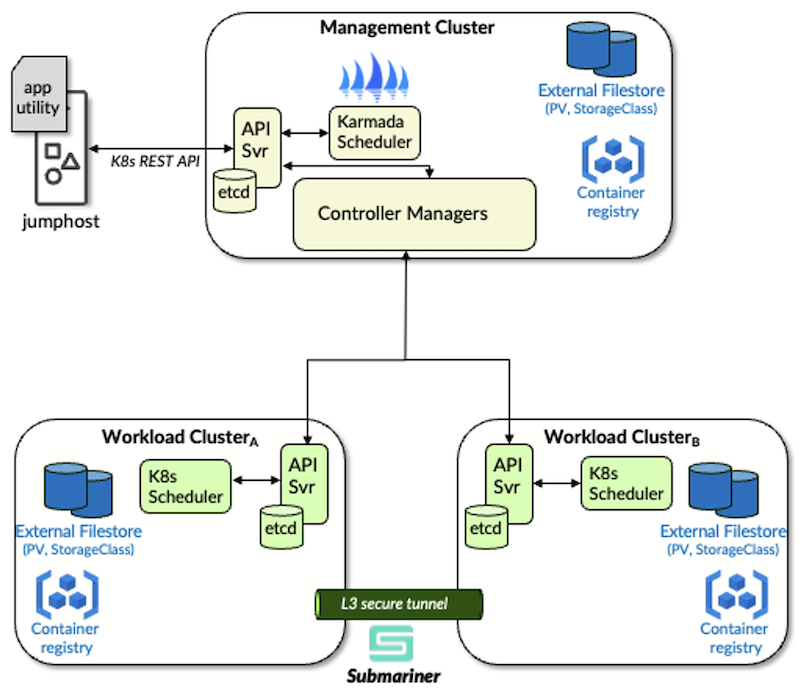

# Multi-Geo Overlay Procedure

**Steve Onishi - 09/14/2025**

The procedure for building a multi-geography multi-cluster from three Red Hat OpenShift Container Platform (RHOCP) clusters. The constructed multi-cluster will be capable of supporting Broadband Edge (BBE) cloud-native applications such as BNG CUPS Controller and Address Pool Manager (APM) in a geo-redundant capacity.

## Introduction

A typical Kubernetes cluster is comprised of at least 3 control-plane sites/nodes and 3 worker sites/nodes. For cost and simplicity, worker and control-plane functions may be combined into a hybrid node at the expense of redundancy. The cluster is accessed from a remote host through the Kubernetes API and the container registry (for pushing images). The remote host is often referred to as a jump or bastion host (see Figure 1).



Multi-geography redundancy for Juniper Cloud-native Network Functions (CNFs) such as APM and BNG CUPS Controller, requires a topology of three Kubernetes clusters. Each cluster has at least three control-plane sites and three worker sites (or simply 3 combined control-plane/worker or hybrid nodes) to support basic redundancy and availability requirements. Each cluster is in its own geography or availability zone.

One cluster is designated as the Management Cluster and has reachability to the other two clusters which are designated as Workload Clusters. All three clusters are joined into a multi-cluster with the addition and setup of Karmada and Submariner Open Source Software (OSS) packages. A separate jumphost or bastion host with access to all three clusters will be used as the installation platform (see Figure 2).



The procedure outlined in this document describes the steps needed to install and deploy the OSS such that a multi-geo multi-cluster is realized. Instructions for performing air-gapped and non-air-gapped installation are provided. Procedures for air-gapped are denoted in **light-blue text**.

## Pre-Requisites

### Jumphost

A bastion host or jump host serves as a secure location for installing, configuring, and operating the OSS on the K8s clusters that will form the multi-cluster. The jumphost has administrative access to the K8s REST APIs of all three clusters.

**Hardware dimensions**

- CPU: 2 cores
- Memory: 8 GiB
- Storage: 128 GiB

**Software dimensions**

- OS: Ubuntu 22.04 LTS
- User account with sudo privileges

**Network access**

For non-air-gapped installation, Internet access will be needed to download OSS components. Specifically, to the following sites:

- [https://github.com/karmada-io/karmada/releases/download/](https://github.com/karmada-io/karmada/releases/download/)
- [https://raw.githubusercontent.com/karmada-io/karmada/master ](https://raw.githubusercontent.com/karmada-io/karmada/master)
- [https://github.com/submariner-io/releases/releases/download](https://github.com/submariner-io/releases/releases/download)

The jumphost must be able to access the Container registry and the K8s REST API of the Management Cluster and each of the Workload Clusters.

### Management Cluster

The Management Cluster hosts the Karmada OSS in a separate Kubernetes context. The regular context can host CNF application components. The Management Cluster is a redundant cluster (minimum of three hybrid nodes). The Dimensions of each node are as follows.

**Hardware Dimensions**

- CPU: 8 cores
- Memory: 24 GiB
- Storage: 256 GiB

**Software Dimensions**

- OS: RHOCP 4.16 or later with
   - CNI: OVN
   - Registry: Openshift Image Registry
   - NLB: MetalLB
- Pod & Service CIDRs: default

**Network Access**

Internet access will be needed to download OSS components. Specifically, to the following sites:

- docker.io
- registry.k8s.io
- quay.io

The Management Cluster must be able to access the K8s REST API of each Workload Cluster.

### Workload Clusters

The Workload Clusters host the bulk of the Multi-geo enabled CNF Application micro-services. Each Workload Cluster is a redundant cluster (minimum of three hybrid nodes). The Dimensions of each node are as follows:

**Hardware Dimensions**

- CPU: 16 cores (if only APM application deployment, this can be scaled down to 8 cores)
- Memory: 64GiB
- Storage: 512 GiB

**Software Dimensions**

- OS: RHOCP 4.16 or later with
  - CNI: OVN
  - Registry: Openshift Image Registry
  - NLB: MetalLB
  - CSI: Longhorn
- Pod & Service CIDRs: Each Workload cluster must have different (non-overlapping) POD and Service CIDRs (since Submariner will join the two Workload Cluster internal networks, each internal network address space must not overlap with the other)

**Network Access**

Internet access will be needed to download OSS components. Specifically, to the following sites:

- quay.io

Each Workload Cluster must be able to reach its peer Workload Cluster. Latency between Workload Clusters must be below 200ms.

## Preparing the Jumphost

### Kubeconfigs

Set up the kubeconfig on the jumphost such that it contains an admin context for each of the three clusters. As these context names may also be incorporated into pod names to distinguish them in the multi-cluster, it is critical to ensure that context names are simple and restricted to lowercase characters and hyphens ('-'). OpenShift generates contexts upon 'oc login' that incorporates the login name, namespace, port numbers, and host name delimited by '/' and ':' characters; do NOT use these contexts when constructing the multi-cluster. In this procedure, we will create contexts named mgmt, workload-a, and workload-b to represent the three clusters. The following best-practice procedure is recommended:

1. Generate a new admin kubeconfig for each of the clusters using the oc config new-admin-kubeconfig command. Store each generated kubeconfig in $HOME/.kube as mgmt.yaml, workload-a.yaml, and workload-b.yaml, with 0o600 permissions respectively.
2. In each of the kubeconfigs, rename the cluster and context to match the corresponding filenames (sans extension/type) and the user to the same name with a suffix of "-admin" (e.g. mgmt.-admin). Dumping each context using the associated kubconfig should appear as:

```
root@jumphost:~# oc --kubeconfig .kube/mgmt.yaml config get-contexts
CURRENT   NAME   CLUSTER   AUTHINFO     NAMESPACE
*         mgmt   mgmt      mgmt-admin

root@jumphost:~# oc --kubeconfig .kube/workload-a.yaml config get-contexts
CURRENT   NAME         CLUSTER      AUTHINFO           NAMESPACE
*         workload-a   workload-a   workload-a-admin

root@jumphost:~# oc --kubeconfig .kube/workload-b.yaml config get-contexts
CURRENT   NAME         CLUSTER      AUTHINFO           NAMESPACE
*         workload-b   workload-b   workload-b-admin
```

3. Merge the three kubeconfigs into the default kubeconfig.

```
root@jumphost:~# export KUBECONFIG=".kube/mgmt.yaml:.kube/workload-a.yaml:.kube/workload-b.yaml" 
root@jumphost:~# oc config view --raw --flatten >.kube/config
root@jumphost:~# chmod 0o600 .kube/config
root@jumphost:~# unset KUBECONFIG     ## to use the merged config by default
root@jumphost:~# oc config get-contexts
CURRENT   NAME         CLUSTER      AUTHINFO           NAMESPACE
*         mgmt         mgmt         mgmt-admin
          workload-a   workload-a   workload-a-admin
          workload-b   workload-b   workload-b-admin
```

**Utilities**

Install the following utilities on the jumphost:

- Helm v3
- Kubernetes CLI (kubectl): 1.25 or later
- Openshift CLI: 4.16 or later

**Karmada kubectl plug-in**

Install the Karmada kube plug-in with the following commands:

```
$ # Download the tarball
$ curl -fsSL "https://github.com/karmada-io/karmada/releases/download/v1.13.1/kubectl-karmada-linux-amd64.tgz" -o kubectl-karmada-linux-amd64.tgz
$ # Extract the contents
$ tar xfz kubectl-karmada-linux-amd64.tgz
$ # Install the binary
$ sudo install kubectl-karmada /usr/local/bin
```

Verify the plug-in version as 1.13.1:

```
$ kubectl karmada version 
kubectl karmada version: version.Info{GitVersion:"v1.13.1", GitCommit:"7c4af1bc914f4998893ce3e5b69baf7dc619803b", GitTreeState:"clean", BuildDate:"2025-03-29T03:27:17Z", GoVersion:"go1.22.12", Compiler:"gc", Platform:"linux/amd64"}
```

**Submariner**

Download v0.20.0 of the submariner utility, subctl and install it to /usr/local/bin:

```
$ # Download the tarball
$ curl -fsSL "https://github.com/submariner-io/releases/releases/download/v0.20.0/subctl-v0.20.0-linux-amd64.tar.xz" -o subctl-v0.20.0-linux-amd64.tar.xz
$ # Extract the contents
$ tar xfJ subctl-v0.20.0-linux-amd64.tar.xz
$ # Install the binary
sudo install subctl-v0.20.0/subctl /usr/local/bin
```

## Preparing the Registries (Air-gapped)

This step is only needed for air-gapped installations.

Pull or transfer the following public images to the jumphost:

```
quay.io/submariner/lighthouse-agent:0.20.0
quay.io/submariner/lighthouse-coredns:0.20.0
quay.io/submariner/nettest:0.20.0
quay.io/submariner/submariner-gateway:0.20.0
quay.io/submariner/submariner-operator:0.20.0
quay.io/submariner/submariner-route-agent:0.20.0
registry.k8s.io/kube-apiserver:v1.31.3
registry.k8s.io/kube-controller-manager:v1.31.3
registry.k8s.io/etcd:3.5.16-0
docker.io/nginxinc/nginx-unprivileged:1.27.5
docker.io/karmada/karmada-aggregated-apiserver:v1.13.1
docker.io/karmada/karmada-controller-manager:v1.13.1
docker.io/karmada/karmada-scheduler:v1.13.1
docker.io/karmada/karmada-webhook:v1.13.1
docker.io/karmada/karmada-operator:v1.13.1
docker.io/karmada/karmada-descheduler:v1.13.1
docker.io/karmada/karmada-scheduler-estimator:v1.13.1
```

Create the namespaces that Karmada and Submariner will be deployed to on each cluster:

```
oc --context mgmt create ns karmada-system
oc --context mgmt create ns submariner-operator
oc --context workload-a create ns submariner-operator
oc --context workload-b create ns submariner-operator
```

Re-tag the following images for the Management Cluster, taking note that the repository for each image must be adjusted to match the associated namespace name:

```
<mgmt.cluster.registry.address>/submariner-operator/submariner-operator:0.20.0
<mgmt.cluster.registry.address>/karmada-system/kube-apiserver:v1.31.3
<mgmt.cluster.registry.address>/karmada-system/kube-controller-manager:v1.31.3
<mgmt.cluster.registry.address>/karmada-system/etcd:3.5.16-0
<mgmt.cluster.registry.address>/karmada-system/nginx-unprivileged:1.27.5
<mgmt.cluster.registry.address>/karmada-system/karmada-webhook:v1.13.1
<mgmt.cluster.registry.address>/karmada-system/karmada-aggregated-apiserver:v1.13.1
<mgmt.cluster.registry.address>/karmada-system/karmada-controller-manager:v1.13.1
<mgmt.cluster.registry.address>/karmada-system/karmada-scheduler:v1.13.1
<mgmt.cluster.registry.address>/karmada-system/karmada-operator:v1.13.1
<mgmt.cluster.registry.address>/karmada-system/karmada-descheduler:v1.13.1
<mgmt.cluster.registry.address>/karmada-system/karmada-scheduler-estimator:v1.13.1
```

Re-tag the following images for each of the workload clusters, taking note that the repository for each image must be adjusted to match the associated namespace name:

```
<workload-a.cluster.registry.address>/submariner-operator/submariner-operator:0.20.0
<workload-a.cluster.registry.address>/submariner-operator/lighthouse-agent:0.20.0
<workload-a.cluster.registry.address>/submariner-operator/lighthouse-coredns:0.20.0
<workload-a.cluster.registry.address>/submariner-operator/nettest:0.20.0
<workload-a.cluster.registry.address>/submariner-operator/submariner-gateway:0.20.0
<workload-a.cluster.registry.address>/submariner-operator/submariner-operator:0.20.0
<workload-a.cluster.registry.address>/submariner-operator/submariner-route-agent:0.20.0
<workload-b.cluster.registry.address>/submariner-operator/submariner-operator:0.20.0
<workload-b.cluster.registry.address>/submariner-operator/lighthouse-agent:0.20.0
<workload-b.cluster.registry.address>/submariner-operator/lighthouse-coredns:0.20.0
<workload-b.cluster.registry.address>/submariner-operator/nettest:0.20.0
<workload-b.cluster.registry.address>/submariner-operator/submariner-gateway:0.20.0
<workload-b.cluster.registry.address>/submariner-operator/submariner-operator:0.20.0
<workload-b.cluster.registry.address>/submariner-operator/submariner-route-agent:0.20.0
```

Push all the re-tagged images to the cluster registries.

## Installing Submariner 0.20.0

Submariner is a CNCF Sandbox Project. Submariner enables the interconnection of the internal networks of two K8s clusters through an L3 tunnel. The interconnection enables cluster-internal communication between the application workloads on each cluster.

The Submariner Broker will be installed on the Management Cluster while a Submariner instance will be installed on each of the Workload Clusters. For the Submariner instances to reach the Broker's API, they must be able to resolve the Kubernetes API (e.g. api.<clusterName>.<domain>) on the Management Cluster. This DNS name needs to be resolved through a proper DNS lookup. Add the following A-records to the DNS server whose IP address was specified during ISO creation:

```
api.<mgmtClusterName>.<domain>       A    <ClusterMgmtIP>
*.apps.<mgmtClusterName>.<domain>    A    <ClusterMgmtIP>   
```

From the shell of one of the Workload Cluster nodes (for RHOCP Workload clusters access the shell via 'oc debug') perform an nslookup against the DNS name to ensure it resolves.

```
sh-5.1# nslookup api.<mgmtClusterName>.<domain>      
.
.
Name:    api.<mgmtClusterName>.<domain>
Address: <ClusterMgmtIP>
```

Next, deploy the broker to the **Management Cluster** context using the management cluster's kubeconfig:

Air-gapped:

```
subctl deploy-broker --context mgmt --repository image-registry.openshift-image-registry.svc:5000/submariner-operator
```

Non-air-gapped:

```
$ subctl deploy-broker ---context mgmt
```

If successful, the broker deployment will create a file called broker-info.subm. Run subctl --context mgmt show brokers to verify the installation.

```
[x] Detecting broker(s)
NAMESPACE               NAME                COMPONENTS                        GLOBALNET   GLOBALNET CIDR   DEFAULT GLOBALNET SIZE   DEFAULT DOMAINS   
submariner-k8s-broker   submariner-broker   service-discovery, connectivity   no          242.0.0.0/8      65536
```

Now, join each of the WL Clusters together via the Broker:

Air-gapped (add the --repository flag to use the cluster's private registry):

```
$ subctl join --context workload-a --air-gapped --repository image-registry.openshift-image-registry.svc:5000/submariner-operator --natt=false broker-info.subm
$ subctl join --context workload-b --air-gapped --repository image-registry.openshift-image-registry.svc:5000/submariner-operator --natt=false broker-info.subm
```

Non-air-gapped:

```
$ subctl join --context workload-a --air-gapped --natt=false .local/jnpr-multicluster-submariner/broker-info.subm
$ subctl join --context workload-b --air-gapped --natt=false .local/jnpr-multicluster-submariner/broker-info.subm
```

If both WL Clusters are joined successfully, we can verify the Submariner deployment by running a set of unit tests via subctl. These tests take about 5 minutes to run. Disable disruptive verifications when prompted. The following command tests the connectivity from the workload-a Cluster's K8s context to workload-b Cluster's context (see kubectl config get-contexts'):

Air-gapped:

```
$ # Warnings displayed about "system:authenticated" not being found are expected and can be ignored
$ oc --context workload-a -n submariner-operator policy add-role-to-group system:image-puller system:authenticated
$ oc --context workload-b -n submariner-operator policy add-role-to-group system:image-puller system:authenticated
```

Verify the installation:

```
$ subctl verify --context <workload1Context> --tocontext <workload2Context> 
? You have specified disruptive verifications (gateway-failover). Are you sure you want to run them? (y/N) N
```

Currently, there is a known issue with Submariner tests with RHOCP 4.18 (see [Connectivity test fails with OCP 4.18](https://github.com/submariner-io/submariner/issues/3307)). We expect the following test failures:

```
Summarizing 2 Failures:

    [FAIL] Basic TCP connectivity tests across clusters without discovery when a pod connects via TCP to a remote pod when the pod is on a gateway and the remote pod is on a gateway [It] should have sent the expected data from the pod to the other pod [dataplane, basic]
    github.com/submariner-io/shipyard@v0.20.0/test/e2e/tcp/connectivity.go:72
    [FAIL] Basic TCP connectivity tests across clusters without discovery when a pod connects via TCP to a remote service when the pod is on a gateway and the remote service is on a gateway [It] should have sent the expected data from the pod to the other pod [dataplane, basic]
    github.com/submariner-io/shipyard@v0.20.0/test/e2e/tcp/connectivity.go:72

Ran 17 of 48 Specs in 318.692 seconds
FAIL! -- 15 Passed | 2 Failed | 0 Pending | 31 Skipped
```

These failures are benign and are to be ignored.

## Installing Karmada 1.13.1

Karmada is a CNCF (Cloud Native Computing Foundation) Incubating Project. Karmada enables workload scheduling across multiple K8s clusters and/or clouds.

The Karmada operator will be used to install Karmada on the Management Cluster. Note that in the yaml definitions below there are certain lines marked as being needed for air-gapped installs, which can be omitted otherwise.

1. Create the 'karmada-system' namespace/project on the Management Cluster

```
$ oc new-project karmada-system --context mgmt
```

2. Bind the privileged Security Context Constraint (SCC) to the karmada-operator and default ServiceAccounts (does NOT require the karmada-operator ServiceAccount to exist) in the karmada-system namespace on the management context:

```
$ oc --context mgmt -n karmada-system adm policy add-scc-to-user privileged -z karmada-operator
$ oc --context mgmt -n karmada-system adm policy add-scc-to-user privileged -z default
```

3. Download the [Karmada v1.13.1 Operator Chart](https://github.com/karmada-io/karmada/releases/download/v1.13.1/karmada-operator-chart-v1.13.1.tgz) and the CRDs tarballs:

```
$ curl -fsSL "https://github.com/karmada-io/karmada/releases/download/v1.13.1/karmada-operator-chart-v1.13.1.tgz" -o karmada-operator-chart-v1.13.1.tgz
$ curl -fsSL "https://github.com/karmada-io/karmada/releases/download/v1.13.1/crds.tar.gz" -o 1.13.1-crds.tar.gz 
```

4. Create a values file (values.yaml) for deploying the operator:

```
global: # For air-gapped

  imageRegistry: "image-registry.openshift-image-registry.svc:5000" 
installCRDs: false
operator:
  image:
    repository: karmada-system/karmada-operator # For air-gapped
    tag: v1.13.1     # Version of container image to pull
  podAnnotations:
    openshift.io/required-scc: privileged # Operator needs to store CRs to container FS
```

5. Helm-install the operator with the above values file.

```
$ helm --kube-context mgmt install -n karmada-system karmada-operator --values values.yaml ./karmada-operator-chart-v1.13.1.tgz --wait 
```

6. Verify the operator reaches a running state

```
$ kubectl get pods -n karmada-system --context mgmt
NAME                                                  READY   STATUS    RESTARTS   AGE
karmada-operator-6cb799fdfc-792qh                     1/1     Running   0          2m 
```

7. Once installed, the operator introduces several Custom Resource Definitions (CRDs) that can be used to configure the various Karmada components.

```
$ oc explain karmada.spec.components
GROUP:      operator.karmada.io
KIND:       Karmada
VERSION:    v1alpha1

FIELD: components <Object>

DESCRIPTION:
    Components define all of karmada components.
    not all of these components need to be installed.
.
.
```

Air-gapped:

- For air-gapped installs, the CRDs tarball must be hosted in an offline webserver accessible by the operator.

```
$ # Create a ConfigMap containing the CRD tarball:
$ oc --context mgmt -n karmada-system create cm karmada-crds --from-file=./1.13.1-crds.tar.gz
```

- Create a manifest (crd-webserver.yaml) for an Nginx instance serving the CRD tarball via a ClusterIP service inside Karmada's namespace:

```
# crd-webserver.yaml
---
apiVersion: apps/v1
kind: Deployment
metadata:
  name: karmada-crds
  namespace: karmada-system
  labels:
    app: karmada-crds
spec:
  selector:
    matchLabels:
      app: karmada-crds
  replicas: 1
  template:
    metadata:
      annotations:
        kubectl.kubernetes.io/default-container: karmada-crds
      labels:
        app: karmada-crds
    spec:
      containers:
        - name: karmada-crds
          image: image-registry.openshift-image-registry.svc:5000/karmada-system/nginx-unprivileged:1.27.5
          imagePullPolicy: IfNotPresent
          livenessProbe:
            tcpSocket:
              port: 8080
            initialDelaySeconds: 5
            timeoutSeconds: 5
            successThreshold: 1
            failureThreshold: 3
            periodSeconds: 10
          ports:
            - containerPort: 80
              name: karmada-crds
          volumeMounts:
            - name: crds
              mountPath: /usr/share/nginx/html
      volumes:
        - configMap:
            defaultMode: 420
            name: karmada-crds
          name: crds
      restartPolicy: Always
---
apiVersion: v1
kind: Service
metadata:
  name: karmada-crds
  namespace: karmada-system
spec:
  selector:
    app: karmada-crds
  type: ClusterIP
  ports:
    - name: karmada-crds
      protocol: TCP
      port: 80
      targetPort: 8080
```

- Apply the manifest

```
$ oc --context mgmt -n karmada-system apply -f crd-webserver.yaml
```

- Verify that the NGINX instance is in a running state

```
$ oc --context mgmt -n karmada-system get pods
NAME                            READY   STATUS    RESTARTS       AGE
karmada-crds-667fc8979f-s6jcd   1/1     Running   0              10d
```

8. Create a custom resource YAML, karmada-instance.yaml, file (replacing the certSAN elements for the karmadaAPIServer and the default storage class) as follows:

```
apiVersion: operator.karmada.io/v1alpha1
kind: Karmada
metadata:
  name: karmada
  namespace: karmada-system
spec:
  crdTarball: # Air-gapped
    httpSource: # Air-gapped
      url: http://karmada-crds/1.13.1-crds.tar.gz # Air-gapped
  components:
    karmadaDescheduler:
      imageRepository: image-registry.openshift-image-registry.svc:5000/karmada-system/karmada-descheduler
      imageTag: v1.13.1
    karmadaAggregatedAPIServer:
      imageRepository: image-registry.openshift-image-registry.svc:5000/karmada-system/karmada-aggregated-apiserver # Air-gapped
      imageTag: v1.13.1
      annotations:
        openshift.io/required-scc: privileged
      featureGates:
        Failover: true
    karmadaControllerManager:
      imageRepository: image-registry.openshift-image-registry.svc:5000/karmada-system/karmada-controller-manager # Air-gapped
      imageTag: v1.13.1
      featureGates:
        Failover: true
    karmadaScheduler:
      imageRepository: image-registry.openshift-image-registry.svc:5000/karmada-system/karmada-scheduler # Air-gapped
      imageTag: v1.13.1
      featureGates:
        Failover: true
    karmadaWebhook:
      imageRepository: image-registry.openshift-image-registry.svc:5000/karmada-system/karmada-webhook # Air-gapped
      imageTag: v1.13.1
    karmadaMetricsAdapter:
      imageRepository: image-registry.openshift-image-registry.svc:5000/karmada-system/karmada-metrics-adapter # Air-gapped
      imageTag: v1.13.1
      annotations:
        openshift.io/required-scc: privileged
    kubeControllerManager:
      imageRepository: image-registry.openshift-image-registry.svc:5000/karmada-system/kube-controller-manager # Air-gapped
      imageTag: v1.31.3
    karmadaAPIServer:
      imageRepository: image-registry.openshift-image-registry.svc:5000/karmada-system/kube-apiserver # Air-gapped
      imageTag: v1.31.3
      serviceType: NodePort # Expose the API server to the WL clusters with external IP
      certSANs: # Add SANs so that the WL Clusters can accept the Mgmt Cluster's certificate
        - <MgmtClusterVIP>  # Mgmt Cluster Mgmt VIP/apiserver
      annotations:
        openshift.io/required-scc: privileged
    #
    # Default storage for etcd will be to use hostPath which 
    # OpenShift will not tolerate so we add a 5Gi PVC
    # against the default storageClass (longhorn)
    #
    etcd:
      local:
        imageRepository: image-registry.openshift-image-registry.svc:5000/karmada-system/etcd # Air-gapped
        imageTag: 3.5.16-0
        replicas: 3
        volumeData:
          volumeClaim:
            spec:
              accessModes:
                - ReadWriteOnce
              resources:
                requests:
                  storage: 5Gi
              storageClassName: <defaultStorageClass>
```

**Note**: that for most of the Karmada components, we add an annotation that allows them to run in *privileged* mode. Without these annotations, Openshift will apply the most restrictive SCC (most interactions with the OS or the container filesystem will be curtailed).

9. Apply the CR

```
$ oc --context mgmt apply -n karmada-system -f karmada-instance.yaml 
```

10. Monitor the Karmada deployment

```
$ oc get pods -n karmada-system -w --context mgmt

NAME                                                  READY   STATUS    RESTARTS   AGE
karmada-aggregated-apiserver-7ff75d6979-wgk6z      1/1     Running   0          63m
karmada-apiserver-6df7fd8bdc-2dcct                 1/1     Running   0          63m
karmada-controller-manager-648c44f5c8-pglr9        1/1     Running   0          63m
karmada-etcd-0                                     1/1     Running   0          63m
karmada-kube-controller-manager-544f955cbd-79nkd   1/1     Running   0          63m
karmada-metrics-adapter-5bb86d4b9-pj6lr            1/1     Running   0          63m
karmada-metrics-adapter-5bb86d4b9-qjzgx            1/1     Running   0          63m
karmada-scheduler-7bd65745b9-sgkmn                 1/1     Running   0          63m
karmada-webhook-998985fb-trnt8                     1/1     Running   0          63m
karmada-operator-6cb799fdfc-792qh                  1/1     Running   0          145m
```

11. Once all pods have reached a running state, verify that the health of the Karmada deployment is good

```
$ oc get karmada -n karmada-system --context mgmt
NAME         READY   AGE
karmada   True    86m 
```

### Preparing the Karmada Context

1. The WL Clusters, as part of the join process, will need to access the Karmada API server. Verify that the API Server has a NodePort address and is reachable:

```
$ oc get services -n karmada-system --kubeconfig <mgmtKubeconfig>
NAME                              TYPE        CLUSTER-IP       EXTERNAL-IP   PORT(S)             AGE
karmada -aggregated-apiserver   ClusterIP   172.30.29.244    <none>        443/TCP             91m
karmada-apiserver              NodePort    172.30.11.192    <none>        5443:31463/TCP      91m
karmada-etcd                   ClusterIP   None             <none>        2379/TCP,2380/TCP   92m
karmada-etcd-client            ClusterIP   172.30.62.228    <none>        2379/TCP            92m
karmada-metrics-adapter        ClusterIP   172.30.37.238    <none>        443/TCP             91m
karmada-webhook                ClusterIP   172.30.196.143   <none>        443/TCP             91m

$ nc -zvw2 <mgmtClusterNodeIP> 31463
Connection to <mgmtClusterNodeIP> (10.9.177.57) 31463 port [tcp/*] succeeded!
```

2. Fetch the kube config for the newly created Karmada context

```
$ oc -n karmada-system get secrets karmada-admin-config  -o jsonpath='{.data.karmada\.config}' ---context mgmt | base64 -d > .kube/karmada.yaml 
```

3. Edit the cluster and context names in the karmada kubeconfig to 'karmada-apiserver' and change the cluster address to match the Management Cluster's HA (VIP) address.
4. Add the new kubeconfig to the default kubeconfig (see step 3 in Kubeconfigs for an example of how to flatten the kubeconfigs)

```
root@jumphost:~# oc config get-contexts
CURRENT   NAME                CLUSTER             AUTHINFO           NAMESPACE
*         karmada-apiserver   karmada-apiserver   karmada-admin
          mgmt                mgmt                mgmt-admin
          workload-a          workload-a          workload-a-admin
          workload-b          workload-b          workload-b-admin 
```

5. The Management Cluster will need to be able to reach each of the WL Clusters through a DNS lookup. Ensure that the DNS Server serving the Management Cluster has entries for the WL Cluster API servers. E.g.

```
<WLaClusterMgmtIP> api.<WLaClusterDNSName> 
<WLbClusterMgmtIP> api.<WLbClusterDNSName>
```

### Joining the Workload Clusters

1. Ensure that the Karmada-context is the working context

```
$ oc config use-context karmada-apiserver 
```

2. Create a certificate-based kubeconfigs for each Workload Cluster:

```
$ oc --context workload-a config new-admin-kubeconfig >.kube/wla-admin.yaml
$ oc --context workload-b config new-admin-kubeconfig >.kube/wlb-admin.yaml 
```

3. JOIN Workload Cluster A - Join the WL Cluster

```
$ oc karmada join workload-a --cluster-context workload-a 
```

4. Enable the Karmada Scheduler Estimator for Workload Cluster A

```
$ oc karmada addons enable karmada-scheduler-estimator --karmada-kubeconfig .kube/config --context mgmt -C workload-a --member-kubeconfig .kube/wla-admin.yaml --member-context admin --karmada-scheduler-estimator-image='image-registry.openshift-image-registry.svc:5000/karmada-system/karmada-scheduler-estimator:v1.13.1' 
```

5. JOIN Workload Cluster B - Join the WL Cluster

```
$ oc karmada join workload-b --cluster-context workload-b
    cluster workload-b is joined successfully
```

6. Enable the Karmada Scheduler Estimator for Workload Cluster B

```
$ oc karmada addons enable karmada-scheduler-estimator --karmada-kubeconfig .kube/config --context mgmt -C workload-b --member-kubeconfig .kube/wlb-admin.yaml --member-context admin --karmada-scheduler-estimator-image='image-registry.openshift-image-registry.svc:5000/karmada-system/karmada-scheduler-estimator:v1.13.1'
```

7. Verify both constituent clusters of the multi-cluster are READY

```
$ kubectl get clusters --context karmada-apiserver  
NAME               VERSION   MODE   READY   AGE
workload-a         v1.31.6   Push   True    123m
workload-b         v1.31.6   Push   True    123m
```

and that the scheduler-estimators are in a running state in the Management Cluster's context, e.g.:

```
$ kubectl --context mgmt -n karmada-system get pods
NAME                                                      READY   STATUS    RESTARTS       AGE
karmada-aggregated-apiserver-6ddb95dfb5-vr7kx             1/1     Running   12 (24d ago)   24d
karmada-apiserver-6d5498c75c-r6822                        1/1     Running   7 (24d ago)    24d
karmada-controller-manager-6767545f84-5nnkt               1/1     Running   0              9d
karmada-descheduler-56f49d77f5-9dp6w                      1/1     Running   1 (24d ago)    24d
karmada-etcd-0                                            1/1     Running   0              24d
karmada-etcd-1                                            1/1     Running   0              24d
karmada-etcd-2                                            1/1     Running   0              24d
karmada-kube-controller-manager-797dd75f96-xw6zg          1/1     Running   10 (24d ago)   24d
karmada-metrics-adapter-75d478fb7-7964b                   1/1     Running   11 (24d ago)   24d
karmada-metrics-adapter-75d478fb7-pdqjz                   1/1     Running   11 (24d ago)   24d
karmada-operator-7c8b9b8f69-wdlhx                         1/1     Running   1 (24d ago)    24d
karmada-scheduler-55cdf456d9-mxcdz                        1/1     Running   0              10d
karmada-scheduler-estimator-workload-1-7d595559f4-p5sw9   1/1     Running   0              10d
karmada-scheduler-estimator-workload-2-667fc8979f-s6jcd   1/1     Running   0              10d
karmada-webhook-6c775f68c8-blprz                          1/1     Running   1 (24d ago)    24d
```

## Operational Tips

### Application Support

BBE Applications which include support for a multi-geo multi-cluster include:

- BNG CUPS Controller -- release 24.4R2 and later
- Address Pool Manager (APM) -- release 3.4.0 and later

### Karmada kubeconfig

Keep track of the kube config file for the Management Cluster that you generated in step 2 of Preparing the Karmada Context. You will need to use this to generate a secret for the application's Observer micro-service to monitor Karmada scheduling events. See application installation guide for details on creating the kube config secret.

### Template File for Multi-geo

Application setup (APM of BNG CUPS Controller) has a lot more values to collect from the operator. At a minimum, registry push/pull addresses and the Karmada kubeconfig secrets can be put in a template file to be passed to the utility script's setup step (--template).

In the example below, the Management Cluster's Push FQDN is default-route-openshift-image-registry.apps.wf-mg-rh-kd-mdr.englab.juniper.net, Workload-a's Push FQDN is default-route-openshift-image-registry.apps.wf-mg-rh-wla-mdr.englab.juniper.net and Workload-b's FQDN is default-route-openshift-image-registry.apps.wf-mg-rh-wlb-mdr.englab.juniper.net:

```
   global:
     jnpr:
       karmada:
         registries:
           wf-mg-rh-wlb-mdr: image-registry.openshift-image-registry.svc:5000   # backupClusterName: imagePullTransportAddress
         backup_clusters:
         - wf-mg-rh-wlb-mdr                                                     # - backupClusterName
         primary_cluster: wf-mg-rh-wla-mdr                                      # primaryClusterName
       registry:
         push:
         - default-route-openshift-image-registry.apps.wf-mg-rh-kd-mdr.englab.juniper.net    #MgmtClusterRegistryPushFQDN
         - default-route-openshift-image-registry.apps.wf-mg-rh-wla-mdr.englab.juniper.net   #PrimaryWlClusterRegistryPushFQDN
         - default-route-openshift-image-registry.apps.wf-mg-rh-wlb-mdr.englab.juniper.net   #BackupWlClusterRegistryPushFQDN
     registry:
       pull: image-registry.openshift-image-registry.svc:5000               # primaryClusterRegistryPullTransportAddress
   observer:
     registry:
       pull: image-registry.openshift-image-registry.svc:5000               # managementClusterRegistryPullTransportAddress
     secrets:
       kubeconfig: karmada-kconf                                            # name of the Karmada kubeconfig secret object
```

### Switchover vs Failover

The applications include a 'multi-cluster switchover' command with their utility script. The application's micro-service charts carry an application-specific cluster toleration (1 second). The utility script's switchover command applies a "NoExecute" taint to the cluster against the application-specific toleration in-order to trigger a switchover event. Micro-services that only exist on one Workload Cluster will be recreated on the other Workload Cluster and de-scheduled on their original Workload Cluster.

Karmada initiates failover procedures when it detects that a workload cluster is no longer viable for running workloads.  Micro-service multi-cluster policies are re-evaluated; micro-services that only exist on one Workload Cluster will be re-scheduled on the other Workload Cluster. When the original Workload Cluster becomes reachable, those micro-services will be de-scheduled.

### Monitoring and Troubleshooting

Generally running 'kubectl get clusters' against the Karmada context will give you an overview of the ready state of the two Workload Clusters it is monitoring. The Ready state of both Workload Clusters should be True.

```
$ kubectl get clusters ---context <karmadaContextName>
NAME              VERSION   MODE   READY   AGE
<wlaClusterName>  v1.31.6   Push   True    64d
<wlbClusterName>  v1.31.6   Push   True    64d
```

Karmada also supports a Prometheus endpoint for access to various alerts and key metrics. The following references are useful for setting up Prometheus monitoring:

- [https://karmada.io/docs/administrator/monitoring/working-with-prometheus-in-control-plane](https://karmada.io/docs/administrator/monitoring/working-with-prometheus-in-control-plane)
- [https://karmada.io/docs/administrator/monitoring/working-with-prometheus](https://karmada.io/docs/administrator/monitoring/working-with-prometheus)

Application workloads are tracked by ResourceBinding objects in the application namespace of the Karmada context. The ResourceBinding objects provide information on where the workload is scheduled and other useful meta-data about the workload. For example,

```
$ kubectl get ResourceBinding -n jnpr-apm ---context <KarmadaContext>
NAME                                                                        SCHEDULED   FULLYAPPLIED   AGE
apm-apmi-<wlaClusterName>-service                                            True        True           30h
apm-apmi-<wlbClusterName>-service                                            True        True           30h
```

lists the resource Bindings for APM. Any ResourceBinding with a FULLYAPPLIED status of False may be suspect and worth delving into by describing the object. For example, describing a ResourceBinding for the provman deployment tells us which Workload Cluster Karmada expects this deployment to be scheduled on.

```
$ kubectl describe ResourceBinding -n jnpr-apm jnpr-apm-provman-deployment --context <KarmadaContext>
Name:         jnpr-apm-provman-deployment
Namespace:    jnpr-apm
Labels:       propagationpolicy.karmada.io/permanent-id=5c93ec57-e25f-4466-aa54-13f2a6f1289d
              resourcebinding.karmada.io/permanent-id=fca6e395-b54a-4aff-b5ba-bed8dcbfd6da
Annotations:  policy.karmada.io/applied-placement:
                {"clusterAffinities":[{"affinityName":"primary-clusters","clusterNames":["<workload-a>"]},{"affinityName":"backup-clusters","clusterNam...
              propagationpolicy.karmada.io/name: provman-prop
              propagationpolicy.karmada.io/namespace: jnpr-apm
              resourcebinding.karmada.io/dependencies: null
API Version:  work.karmada.io/v1alpha2
Kind:         ResourceBinding

Status:
  Aggregated Status:
    Applied:       true
    Cluster Name:  <workloadClusterName>
    Health:        Healthy
    Status:
      Available Replicas:            1
      Generation:                    1
      Observed Generation:           1
      Ready Replicas:                1
      Replicas:                      1
      Resource Template Generation:  2
      Updated Replicas:              1
  Conditions:
    Last Transition Time:             2025-06-05T14:38:39Z
    Message:                          All works have been successfully applied
    Reason:                           FullyAppliedSuccess
    Status:                           True
    Type:                             FullyApplied
    Last Transition Time:             2025-06-05T14:38:39Z
    Message:                          Binding has been scheduled successfully.
    Reason:                           Success
    Status:                           True
    Type:                             Scheduled
  Last Scheduled Time:                2025-06-05T14:38:39Z
  Scheduler Observed Generation:      3
  Scheduler Observing Affinity Name:  primary-clusters
```

## Conclusion

The construction of a multi-geography multi-cluster from three separate single-geography Kubernetes clusters enables control-plane redundancy for Broadband Edge applications such as BNG CUPS Controller and Address Pool Manager. In the multi-geography multi-cluster, the clusters take on one of two roles: Karmada or Management Cluster, and Workload Cluster. The two Workload Clusters run the bulk of the application workloads. The cluster-internal networks of the two Workload Clusters are interconnected by a layer-3 secure tunnel established by Submariner to enable pod-to-pod communications. The Management Cluster monitors the state of the Workload clusters and the workloads (applications) that are running on them. Should one workload cluster become unviable for supporting workloads consistent with the propagation policies defined in their Helm charts, Karmada will try to honor the propagation policy on the other workload cluster (failover).

## Useful links

- Karmada - [https://karmada.io/ ](https://karmada.io/)
- Submariner - [https://submariner.io/](https://submariner.io/)
- CNCF Projects - [https://www.cncf.io/projects/ ](https://www.cncf.io/projects/)
- BNG CUPS Controller Installation Guide -- [https://www.juniper.net/documentation/us/en/software/bng-cups/cups-controller-](https://www.juniper.net/documentation/us/en/software/bng-cups/cups-controller-installation-guide/index.html)[installation-guide/index.html ](https://www.juniper.net/documentation/us/en/software/bng-cups/cups-controller-installation-guide/index.html)
- APM Installation Guide - [https://www.juniper.net/documentation/us/en/software/apm/apm-install-upgrade/topics/topic-map/apm-install-upgrade.html ](https://www.juniper.net/documentation/us/en/software/apm/apm-install-upgrade/topics/topic-map/apm-install-upgrade.html)

## Glossary

- APM -- Address Pool Manager
- BBE -- Broadband Edge
- BNG -- Broadband Network Gateway
- CIDR -- Classless Inter-domain routing
- CNF -- Cloud-native Network Function
- CNCF -- Cloud Native Computing Foundation
- CNI -- Container Network Interface
- CR -- Custom Resource
- CRD -- Custom Resource Definition
- CSI -- Container Storage Interface
- CUPS -- Control/User Plane Separation
- FQDN -- Fully Qualified Domain Name
- K8s -- Kubernetes
- NLB -- Network Load Balancer
- OCP -- Openshift Container Platform (see RHOCP)
- OSS -- Open-Source Software
- REST -- Representational State Transfer
- RHOCP -- Red Hat Openshift Container Platform
- SCC -- Security Context Constraint
- WL -- Workload
- YAML - data serialization language (YAML Ain't Markup Language)
- VIP -- Virtual IP

## Acknowledgements

Many thanks to Allen Horine for his expertise in constructing and operating multi-clusters using Karmada and Submariner, Mike Zeimbekakis for his expertise in how application propagation policies work to define workload failover, and the BBE development team for defining and building applications to take advantage of the redundancy offered by a multi-geo multi-cluster.
