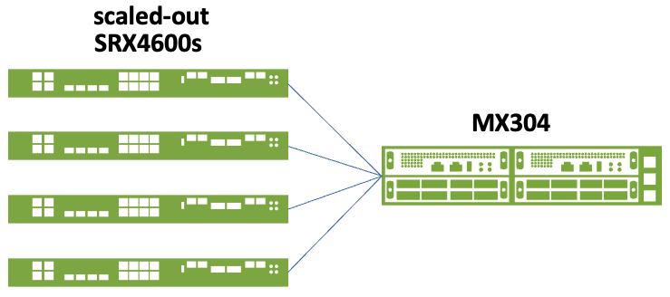

# Operating MX/SRX Scale-Out System - Bulk Junos Config Changes

**Karel Hendrych - 02/22/2024**

A minimalistic tool for bulk config changes in the scale-out system beyond options available in Auto-FBF CLI

## Introduction

This TechPost is continuation of "[Scale-Out Security Services with Auto-FBF](https://juniper.github.io/techposts/operating-1tbps-firewall-scale-out-system/article) looking at the things more practically. Now the focus will be on a minimalistic tool for bulk config changes in the scale-out system beyond options available in Auto-FBF CLI. To a certain extent the tool could be used as a very simplistic alternative to templating features of Security Director and other external tooling. In this specific example the tool is used for controlling configuration of scaled-out SRX firewalls from MX/PTX device. Reading previous TechPosts is recommended for understanding the Auto-FBF principles. However, approaches are applicable elsewhere too due to generic nature for any Junos devices.

## The challenge

Let's imagine a simple topology from previous TechPost consisting of Juniper Networks [MX304 router ](https://www.juniper.net/us/en/products/routers/mx-series/mx304-universal-routing-platform.html)as the scale-out distribution device and four [SRX4600 firewalls](https://www.juniper.net/us/en/products/security/srx-series/srx4600-cloud-service-provider-firewall.html).



Configuration changes done manually to all four devices (possibly many more) are impractical and prone to errors. Therefore, flexible Python based tool for on-box operation with following features:

- Conduct Junos config changes from Auto-FBF distribution device(s) like the MX/PTX (or any other Junos / PyEZ equipped machine)
- Use Jinja2 templates
- Have optional workflow using prototype device for validation and verification prior bulk change
- Preview Junos set commands for prototype device
- Do diff of running/candidate config on prototype device
- Load configuration to prototype device
- Able to operate on multiple devices using sequence modifier. For example, the devices having sequentially lined up interface IPs, next /30 prefix, BGP ASNs, etc.
- Have a profile driven bulk configuration push
- Profiles able to mix different device types with different templates, e.g., vSRX/SRX4600
- Control what device types are eligible for configuration push and/or only for viewing rendered set commands from template (safety and operator review prior Junos load set)
- Easy to expand by new template variables inside of the code for given device type, simple expansion for template data from external data sources
- Thorough logging, including template rendering debug
- Ability to archive committed templates and set commands for audit and roll-back purposes
- General purpose where the tool could be de-coupled from Auto-FBF; or placed elsewhere than MX/PTX to manage configuration (any PyEZ library equipped machine).

The idea of prototype prior changing everything comes from real-life when changes can cause unforeseen consequences. One or more devices in the scale-out system can be designated for testing changes including longevity test prior roll out to whole system. Besides that, Auto-FBF has concept of groups where one or more devices can be designated for various purposes, one of them can be prototype device(s) group serving limited number of subscribers (e.g., mobile SP testing APN). Generally, this is one of the greatest operational advantages of scale-out systems that changes can be thoroughly tested including real-life traffic patterns on smaller set of devices.

## The tool

First step is to list preconfigured templates stored in predefined folder on the MX304, MD5 is handy for tracing in logs what template got pushed where and whether the template has been changed:

```
root@mx304-20-re0> op device-gen-auto-fbf list-template all 
---------------------------------------------------------------------------------------
|   # |     /var/db/scripts/op/template/*.j2     |                md5                 |
---------------------------------------------------------------------------------------
|   1 |                      01-mx304-20-srx4600 |   5192e37ebbc55f5fbfd3fe921da5f9c2 |
---------------------------------------------------------------------------------------
|   2 |                           01-srx4600-all |   3b2b986b1ad8b4d5bab3740f412953b9 |
---------------------------------------------------------------------------------------
|   3 |                        01-srx4600-common |   153f5f6f81574567633a75e691c95f7c |
---------------------------------------------------------------------------------------
|   4 |                         01-srx4600-local |   9d6514d63c11753927e6b9801cdccd4e |
---------------------------------------------------------------------------------------
```

To show contents of a template defining SRX4600 specific settings - CLI show command is available as well:

```
root@mx304-20-re0> op device-gen-auto-fbf show-template 01-srx4600-local 
#
####################################### BEGIN 01-srx4600-local #######################################
#
delete groups auto-fbf-local
delete groups auto-fbf

set groups auto-fbf-local security log stream server-35 source-address 100.65.0.{{ seq_p1 }}
set groups auto-fbf-local interfaces ae0 unit 1000 family inet address 100.64.0.{{ seq_p1 }}/24
set groups auto-fbf-local interfaces ae0 unit 1000 family inet6 address dead:64::{{ seq_p1 }}/64
set groups auto-fbf-local interfaces ae0 unit 1001 family inet address 100.65.0.{{ seq_p1 }}/24
set groups auto-fbf-local interfaces ae0 unit 1001 family inet6 address dead:65::{{ seq_p1 }}/64
set groups auto-fbf-local routing-instances vr-gi routing-options autonomous-system {{ aut_sys }}

set groups auto-fbf security nat source pool pool-1 address 3.0.{{ seq }}.0/24
set groups auto-fbf routing-instances vr-gi routing-options static route 3.0.{{ seq }}.0/24 discard

set groups auto-fbf-local chassis aggregated-devices ethernet device-count 1
set groups auto-fbf-local security zones security-zone inet interfaces ae0.1000
set groups auto-fbf-local security zones security-zone gi interfaces ae0.1001
set groups auto-fbf-local interfaces ae0 vlan-tagging
set groups auto-fbf-local interfaces ae0 aggregated-ether-options lacp active
set groups auto-fbf-local interfaces ae0 aggregated-ether-options lacp periodic fast
set groups auto-fbf-local interfaces ae0 unit 1000 description inet
set groups auto-fbf-local interfaces ae0 unit 1000 vlan-id 1000
set groups auto-fbf-local interfaces ae0 unit 1001 description gi
set groups auto-fbf-local interfaces ae0 unit 1001 vlan-id 1001
set groups auto-fbf-local interfaces et-1/0/0 ether-options 802.3ad ae0
set groups auto-fbf-local interfaces et-1/0/1 ether-options 802.3ad ae0
set groups auto-fbf-local interfaces et-1/0/2 ether-options 802.3ad ae0
set groups auto-fbf-local interfaces et-1/0/3 ether-options 802.3ad ae0
set groups auto-fbf-local routing-instances vr-gi interface ae0.1000
set groups auto-fbf-local routing-instances vr-gi interface ae0.1001
set groups auto-fbf-local routing-instances vr-gi protocols bgp bfd-liveness-detection minimum-interval 300
set groups auto-fbf-local routing-instances vr-gi protocols bgp bfd-liveness-detection multiplier 3

set apply-groups auto-fbf-local
set apply-groups auto-fbf
#
####################################### END  01-srx4600-local ########################################
#
```

The above template has variable for sequentially increased parameter (seq) and by +1 (seq_p1) for bulk operations.  Junos groups are used to ensure starting over during every template operation by deleting the groups at the beginning.

To preview Junos set commands rendered from the given template for defined device type (setting variables for template) and for specific sequence:

```
root@mx304-20-re0> op device-gen-auto-fbf device-type srx4600 template 01-srx4600-local seq 7                         
delete groups auto-fbf-local
delete groups auto-fbf
set groups auto-fbf-local interfaces ae0 unit 1000 family inet address 100.64.0.8/24
set groups auto-fbf-local interfaces ae0 unit 1000 family inet6 address dead:64::8/64
set groups auto-fbf-local interfaces ae0 unit 1001 family inet address 100.65.0.8/24
set groups auto-fbf-local interfaces ae0 unit 1001 family inet6 address dead:65::8/64
set groups auto-fbf-local routing-instances vr-gi routing-options autonomous-system 65207

set groups auto-fbf security nat source pool pool-1 address 3.0.7.0/25
set groups auto-fbf routing-instances vr-gi routing-options static route 3.0.7.0/25 discard

set groups auto-fbf-local chassis aggregated-devices ethernet device-count 1
set groups auto-fbf-local security zones security-zone inet interfaces ae0.1000
set groups auto-fbf-local security zones security-zone gi interfaces ae0.1001
set groups auto-fbf-local interfaces ae0 vlan-tagging
set groups auto-fbf-local interfaces ae0 aggregated-ether-options lacp active
set groups auto-fbf-local interfaces ae0 aggregated-ether-options lacp periodic fast
set groups auto-fbf-local interfaces ae0 unit 1000 description inet
set groups auto-fbf-local interfaces ae0 unit 1000 vlan-id 1000
set groups auto-fbf-local interfaces ae0 unit 1001 description gi
set groups auto-fbf-local interfaces ae0 unit 1001 vlan-id 1001
set groups auto-fbf-local interfaces et-1/0/0 ether-options 802.3ad ae0
set groups auto-fbf-local interfaces et-1/0/1 ether-options 802.3ad ae0
set groups auto-fbf-local interfaces et-1/0/2 ether-options 802.3ad ae0
set groups auto-fbf-local interfaces et-1/0/3 ether-options 802.3ad ae0
set groups auto-fbf-local routing-instances vr-gi interface ae0.1000
set groups auto-fbf-local routing-instances vr-gi interface ae0.1001
set groups auto-fbf-local routing-instances vr-gi protocols bgp bfd-liveness-detection minimum-interval 300
set groups auto-fbf-local routing-instances vr-gi protocols bgp bfd-liveness-detection multiplier 3

set apply-groups auto-fbf-local
set apply-groups auto-fbf
```

To view diff between running and candidate configuration from given template on a prototype device (selected was srx-07 -- also matching sequence 7), for example when SRX template above would increase NAT pool size from /26 to /25:

```
root@mx304-20-re0> op device-gen-auto-fbf device-type srx4600 template 01-srx4600-local diff-target srx-07 seq 7    
[edit groups auto-fbf security nat source pool pool-1 address]
+       3.0.7.0/25;
-       3.0.7.0/26;
[edit groups auto-fbf routing-instances vr-gi routing-options static]
+       route 3.0.7.0/25 discard;
-       route 3.0.7.0/26 discard;
```

The diff is working on rollback 0 - the recommended approach are junos groups avoiding risk of changing other group(s) than in template and core configuration for remote out of band management outside of groups.

Also, diff is handy to see difference between template modified by sequence applied to non-matching device - effectively showing difference between devices. For example, sequence 7 applied to srx-08 (would have been normally srx-07 as in previous example):

```
root@mx304-20-re0> op device-gen-auto-fbf device-type srx4600 template 01-srx4600-local diff-target srx-08 seq 7    
[edit groups auto-fbf-local security log stream server-35]
-     source-address 100.65.0.9;
+     source-address 100.65.0.8;
[edit groups auto-fbf-local interfaces ae0 unit 1000 family inet]
+        address 100.64.0.8/24;
-        address 100.64.0.9/24;
[edit groups auto-fbf-local interfaces ae0 unit 1000 family inet6]
+        address dead:64::8/64;
-        address dead:64::9/64;
[edit groups auto-fbf-local interfaces ae0 unit 1001 family inet]
+        address 100.65.0.8/24;
-        address 100.65.0.9/24;
[edit groups auto-fbf-local interfaces ae0 unit 1001 family inet6]
+        address dead:65::8/64;
-        address dead:65::9/64;
[edit groups auto-fbf-local routing-instances vr-gi routing-options]
-      autonomous-system 65208;
+      autonomous-system 65207;
[edit groups auto-fbf security nat source pool pool-1 address]
+       3.0.7.0/26;
-       3.0.8.0/25;
[edit groups auto-fbf routing-instances vr-gi routing-options static]
+       route 3.0.7.0/26 discard;
-       route 3.0.8.0/25 discard;
```

Next step is configuration push to the prototype device:

```
root@mx304-20-re0> op device-gen-auto-fbf device-type srx4600 template 01-srx4600-local push-target srx-07 seq 7    
----------------------------------------------------------------------------------------------
|    device    |                      template operation status message                      | 
----------------------------------------------------------------------------------------------
|    srx-07    |                                   01-srx4600-local template commit complete | 
----------------------------------------------------------------------------------------------
```

Change made to prototype device srx-07 seen using Auto-FBF nat-info tool:

```
root@mx304-20-re0> op auto-fbf srx-nat-info all          
---------------------------------------------------------------------------------------------------------------------------------------------------
|  instance   |   pool name   |               range               |  IPs  |   usage    | peak usage |     peak usage time      | % failed session |
---------------------------------------------------------------------------------------------------------------------------------------------------
|   srx-07    |        pool-1 |               3.0.7.0 - 3.0.7.127 |   128 |         0% |         0% |  1970-01-01 01:00:00 CET |            0.000 |
---------------------------------------------------------------------------------------------------------------------------------------------------
|   srx-08    |        pool-1 |                3.0.8.0 - 3.0.8.63 |    64 |         0% |        77% |  2023-12-29 02:00:30 CET |            0.000 |
---------------------------------------------------------------------------------------------------------------------------------------------------
|   srx-09    |        pool-1 |                3.0.9.0 - 3.0.9.63 |    64 |         0% |        75% |  2023-12-29 02:00:30 CET |            0.000 |
---------------------------------------------------------------------------------------------------------------------------------------------------
|   srx-10    |        pool-1 |              3.0.10.0 - 3.0.10.63 |    64 |         0% |        76% |  2023-12-29 02:00:30 CET |            0.000 |
---------------------------------------------------------------------------------------------------------------------------------------------------
```

And corresponding log records about push and commit of specific template to srx-07:

```
[root]/var/db/scripts/op/auto-fbf-gen-dev.py[99906] srx-07 template push /var/db/scripts/op/template/01-srx4600-local.j2 (md5: d31be14dadd2ce3437b2c1a3d84fd39d)
[root]/var/db/scripts/op/auto-fbf-gen-dev.py[99906] srx-07 commit complete /var/db/scripts/op/template/01-srx4600-local.j2 (md5: d31be14dadd2ce3437b2c1a3d84fd39d)
```

Then bulk configuration push is driven by profiles pre-defined in configuration file, to list profiles:

```
root@mx304-20-re0> op device-gen-auto-fbf list-profile all 
-------------------------------
|   # |  push target profile  | 
-------------------------------
|   1 |         srx4600_local | 
-------------------------------
|   2 |        srx4600_common | 
-------------------------------
|   3 |           srx4600_all | 
-------------------------------
```

Example of push profile below defines name of bulk config push profile, devices where to template applies (maps to Netconf authentication profile not described here), device type (different Jinja2 template inputs), sequence (if applicable) and referral to Jinja2 template itself:

```
root@mx304-20-re0> op device-gen-auto-fbf show-profile srx4600_local 
----------------------------------------------------------------------------------------------
|   push target profile |    device     | device-type | sequence |         template          | 
----------------------------------------------------------------------------------------------
|         srx4600_local |        srx-07 |     srx4600 |        7 |          01-srx4600-local | 
|                       |        srx-08 |     srx4600 |        8 |          01-srx4600-local | 
|                       |        srx-09 |     srx4600 |        9 |          01-srx4600-local | 
|                       |        srx-10 |     srx4600 |       10 |          01-srx4600-local | 
----------------------------------------------------------------------------------------------
```

Note: it is perfectly possible to mix in the above profile different device types and templates, e.g., bulk push to mixed SRX4600/vSRX scale-out swarm.

Finally, result of bulk configuration push to multiple devices in a multi-threaded operation which takes in the specific setup less than 10 seconds:

```
root@mx304-20-re0> op device-gen-auto-fbf push-target-profile srx4600_local                      
----------------------------------------------------------------------------------------------
|    device    |                      template operation status message                      | 
----------------------------------------------------------------------------------------------
|    srx-07    |                                   01-srx4600-local template commit complete | 
----------------------------------------------------------------------------------------------
|    srx-08    |                                   01-srx4600-local template commit complete | 
----------------------------------------------------------------------------------------------
|    srx-09    |                                   01-srx4600-local template commit complete | 
----------------------------------------------------------------------------------------------
|    srx-10    |                                   01-srx4600-local template commit complete | 
----------------------------------------------------------------------------------------------
```

Bulk changes to NAT pool size result -- increase from /26 to /25 on remaining devices seen using Auto-FBF nat-info tool:

```
root@mx304-20-re0> op auto-fbf srx-nat-info all                                    
---------------------------------------------------------------------------------------------------------------------------------------------------
|  instance   |   pool name   |               range               |  IPs  |   usage    | peak usage |     peak usage time      | % failed session |
---------------------------------------------------------------------------------------------------------------------------------------------------
|   srx-07    |        pool-1 |               3.0.7.0 - 3.0.7.127 |   128 |        36% |        42% |  2023-12-29 02:09:53 CET |            0.000 |
---------------------------------------------------------------------------------------------------------------------------------------------------
|   srx-08    |        pool-1 |               3.0.8.0 - 3.0.8.127 |   128 |        37% |        41% |  2023-12-29 02:21:30 CET |            0.000 |
---------------------------------------------------------------------------------------------------------------------------------------------------
|   srx-09    |        pool-1 |               3.0.9.0 - 3.0.9.127 |   128 |        37% |        42% |  2023-12-29 02:21:30 CET |            0.000 |
---------------------------------------------------------------------------------------------------------------------------------------------------
|   srx-10    |        pool-1 |             3.0.10.0 - 3.0.10.127 |   128 |        36% |        41% |  2023-12-29 02:21:30 CET |            0.000 |
---------------------------------------------------------------------------------------------------------------------------------------------------
```

The tool also features optional archival of Jinja2 template and/or the pushed set commands upon commit, for both prototype device and bulk operations. Filename format is timestamp, template name, target device and appropriate suffix in specified folders which could be either the same or different for template and resulting set commands:

```
root@mx304-20-re0:/var/db/scripts/op/gen-dev-archive # ls -ltr
-rw-r--r--  1 root  wheel  13615 Jan 28 10:18 20240128-101827__tc-02-srx4600-all__srx-09.j2
-rw-r--r--  1 root  wheel  13540 Jan 28 10:18 20240128-101827__tc-02-srx4600-all__srx-09.set
-rw-r--r--  1 root  wheel  13615 Jan 28 10:18 20240128-101827__tc-02-srx4600-all__srx-10.j2
-rw-r--r--  1 root  wheel  13542 Jan 28 10:18 20240128-101827__tc-02-srx4600-all__srx-10.set
-rw-r--r--  1 root  wheel  13615 Jan 28 10:18 20240128-101827__tc-02-srx4600-all__srx-07.j2
-rw-r--r--  1 root  wheel  13535 Jan 28 10:18 20240128-101827__tc-02-srx4600-all__srx-07.set
-rw-r--r--  1 root  wheel  13615 Jan 28 10:18 20240128-101827__tc-02-srx4600-all__srx-08.j2
-rw-r--r--  1 root  wheel  13535 Jan 28 10:18 20240128-101827__tc-02-srx4600-all__srx-08.set
```

If both Jinja2 template and resulting set commands are archived, output of push-target-profile informs about the operation accordingly:

```
root@mx304-20-re0> op device-gen-auto-fbf push-target-profile srx4600_local    
----------------------------------------------------------------------------------------------
|    device    |                      template operation status message                      | 
----------------------------------------------------------------------------------------------
|    srx-07    |              01-srx4600-local template commit complete, j2+set-cmd archived | 
----------------------------------------------------------------------------------------------
|    srx-08    |              01-srx4600-local template commit complete, j2+set-cmd archived | 
----------------------------------------------------------------------------------------------
|    srx-09    |              01-srx4600-local template commit complete, j2+set-cmd archived | 
----------------------------------------------------------------------------------------------
|    srx-10    |              01-srx4600-local template commit complete, j2+set-cmd archived | 
----------------------------------------------------------------------------------------------
```

Then the applied templates and configuration can be tracked in time by MD5 checksum which is part of logging and available in template listing.

## Troubleshooting

In case of issues like with template rendering, by default only high-level error message occurs:

```
root@mx304-20-re0> op device-gen-auto-fbf device-type srx4600 template 01-srx4600-local seq 7         
----------------------------------------------------------------------------------------------
|    device    |                      template operation status message                      | 
----------------------------------------------------------------------------------------------
|     N/A      |             Error rendering template 01-srx4600-local, use debug on/see log | 
----------------------------------------------------------------------------------------------
```

With debug flag on, output reveals in a verbose output misplaced "!" character on the 5th template line:

````
root@mx304-20-re0> op device-gen-auto-fbf device-type srx4600 template 01-srx4600-local seq 7 debug on 
Traceback (most recent call last):
  File "/var/db/scripts/op/auto-fbf-gen-dev.py", line 454, in template_thread
    template = templateEnv.get_template(template_file)
  File "../../../../../../../../src/dist/python-add-ons/jinja2/jinja2/environment.py", line 830, in get_template
  File "../../../../../../../../src/dist/python-add-ons/jinja2/jinja2/environment.py", line 804, in _load_template
  File "../../../../../../../../src/dist/python-add-ons/jinja2/jinja2/loaders.py", line 125, in load
  File "../../../../../../../../src/dist/python-add-ons/jinja2/jinja2/environment.py", line 591, in compile
  File "../../../../../../../../src/dist/python-add-ons/jinja2/jinja2/environment.py", line 780, in handle_exception
  File "../../../../../../../../src/dist/python-add-ons/jinja2/jinja2/_compat.py", line 37, in reraise
  File "/var/db/scripts/op/template/01-srx4600-local.j2", line 12, in template
    set groups auto-fbf security nat source pool pool-1 address 3.0.{{ seq }!}.0/25
  File "../../../../../../../../src/dist/python-add-ons/jinja2/jinja2/environment.py", line 497, in _parse
  File "../../../../../../../../src/dist/python-add-ons/jinja2/jinja2/parser.py", line 901, in parse
  File "../../../../../../../../src/dist/python-add-ons/jinja2/jinja2/parser.py", line 875, in subparse
  File "../../../../../../../../src/dist/python-add-ons/jinja2/jinja2/parser.py", line 620, in parse_tuple
  File "../../../../../../../../src/dist/python-add-ons/jinja2/jinja2/parser.py", line 432, in parse_expression
  File "../../../../../../../../src/dist/python-add-ons/jinja2/jinja2/parser.py", line 437, in parse_condexpr
  File "../../../../../../../../src/dist/python-add-ons/jinja2/jinja2/parser.py", line 450, in parse_or
  File "../../../../../../../../src/dist/python-add-ons/jinja2/jinja2/parser.py", line 459, in parse_and
  File "../../../../../../../../src/dist/python-add-ons/jinja2/jinja2/parser.py", line 470, in parse_not
  File "../../../../../../../../src/dist/python-add-ons/jinja2/jinja2/parser.py", line 474, in parse_compare
  File "../../../../../../../../src/dist/python-add-ons/jinja2/jinja2/parser.py", line 496, in parse_math1
  File "../../../../../../../../src/dist/python-add-ons/jinja2/jinja2/parser.py", line 507, in parse_concat
  File "../../../../../../../../src/dist/python-add-ons/jinja2/jinja2/parser.py", line 517, in parse_math2
  File "../../../../../../../../src/dist/python-add-ons/jinja2/jinja2/parser.py", line 528, in parse_pow
  File "../../../../../../../../src/dist/python-add-ons/jinja2/jinja2/parser.py", line 546, in parse_unary
  File "../../../../../../../../src/dist/python-add-ons/jinja2/jinja2/parser.py", line 562, in parse_primary
  File "../../../../../../../../src/dist/python-add-ons/jinja2/jinja2/lexer.py", line 359, in __next__
  File "../../../../../../../../src/dist/python-add-ons/jinja2/jinja2/lexer.py", line 562, in wrap
  File "../../../../../../../../src/dist/python-add-ons/jinja2/jinja2/lexer.py", line 683, in tokeniter
jinja2.exceptions.TemplateSyntaxError: unexpected '}'
````

## Tool Help

As a last item, here is entire tool help screen when executed with no arguments (or incorrect arguments) with self-explanatory descriptions and recommended workflow described in this TechPost:

````
root@mx304-20-re0> op device-gen-auto-fbf 
    
  device-gen-auto-fbf is a simple yet powerfull tool for rendering and uploading Jinja2 templates,
  designed for auto-fbf, but with general use-case in mind.
   
  arguments:  
  
    device-type            device type [vsrx|srx4600|mx|ptx] 
    seq                    device sequence number 1-n for template seeding 
    template               name of j2 template
    push-target            SRX device name for template push
    diff-target            SRX device name to retrieve diff between candidate and running config
    push-target-profile    push to multiple SRX devices using profile
    list-profile           list push target profiles from auto_fbf_gen_dev_conf.py (any argument)
    show-profile           show details of push target profile [all|profile-name|# from list]
    list-template          list available Jinja2 template files (any argument)
    show-template          show contents of specific template [template-name|# from list ]
    debug                  [on] enable verbose output related to template rendering   

  device-type, seq and template must be used together, push/diff-target is optional
  push-target-profile is used as the only argument for bulk operation
  
  The idea is to preview the template first in a form of set commands:
  
  > op device-gen-auto-fbf device-type srx4600 template srx4600-local-01 seq 10
  
  Then optionally diff the configuration against running config:
  
  > op device-gen-auto-fbf device-type srx4600 template srx4600-local-01 seq 10 diff-target srx-10
    
  Finaly push to single device and validate:
  
  > op device-gen-auto-fbf device-type srx4600 template srx4600-local-01 seq 10 push-target srx-10
  
  where srx-10 is defined along with push-target-profile(s) below in auto_fbf_gen_dev_conf.py
  
  Finally to upload proven template to multiple devices:
  
  > op device-gen-auto-fbf push-target-profile p1 
    
  Templates are located in /var/db/scripts/op/template folder. 
  
  Both profiles and templates can be listed and viewed using corresponding list and show commands.
````


## Conclusion

### Availability

At the time of TechPost release (2024/02), the tool is not available publicly, feedback is still being collected within controlled group. Please reach out to the author in case of interest in test-driving (LinkedIn, feedback email).

## Useful links

- Previous Auto-FBF TechPosts
[https://juniper.github.io/techposts/scale-out-security-services-with-Auto-FBF/article](https://juniper.github.io/techposts/scale-out-security-services-with-Auto-FBF/article)
[https://juniper.github.io/techposts/operating-1tbps-firewall-scale-out-system/article](https://juniper.github.io/techposts/operating-1tbps-firewall-scale-out-system/article)
- PyEZ developer guide
https://www.juniper.net/documentation/us/en/software/junos-pyez/junos-pyez-developer/index.html
- Junos event options
https://www.juniper.net/documentation/us/en/software/junos/automation-scripting/topics/ref/statement/event-options-edit.html
- Ephemeral Configuration Database
https://www.juniper.net/documentation/us/en/software/junos/junos-xml-protocol/topics/concept/ephemeral-configuration-database-overview.html

## Glossary

- ASN: Autonomous System Number
- APN: Access Point Name
- BGP: Border Gateway Protocol
- CLI: Command Line Interface
- FBF: Firewall-Based Forwarding
- NAT: Network Address Translation

## Acknowledgments

Juniper account teams pushing the envelope and supporting related activities. Then all the people I have the pleasure to work with - my manager Dirk Van den Borne, colleagues Steven Jacques, Mark Barrett, Pawel Rabiej, Javier Grizzuti, Dezso Csonka, Theodore Jenks, Akram Hentati, Matthijs Nagel and the entire Amsterdam POC crew providing equipment and support.
