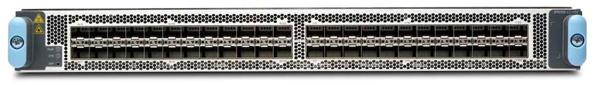
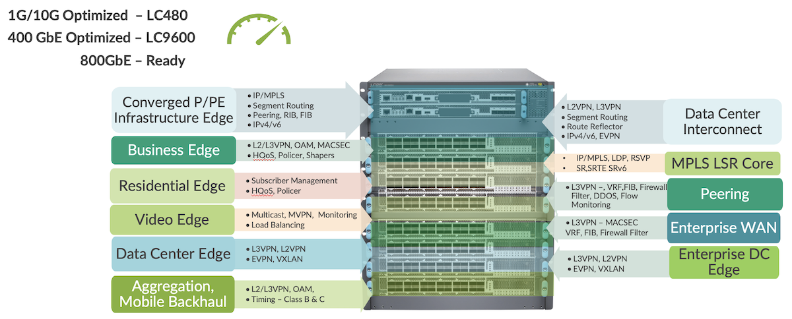
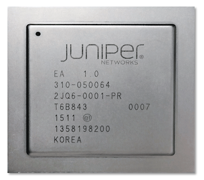
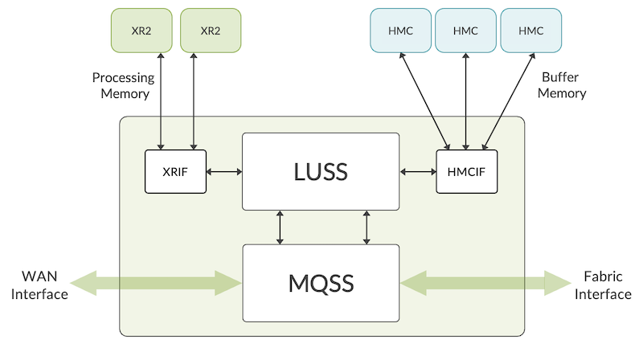
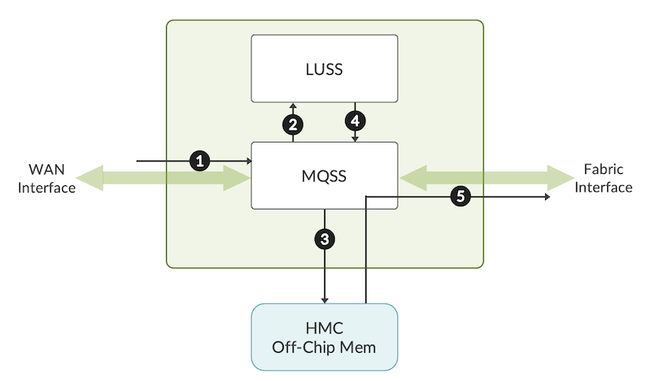
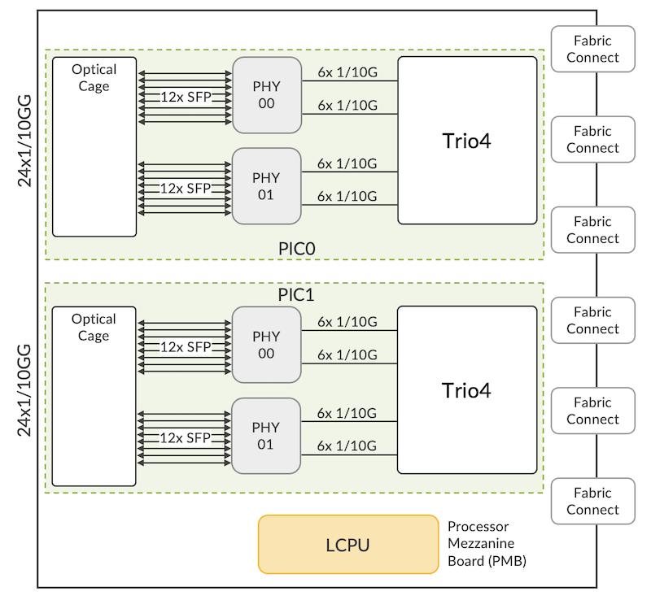
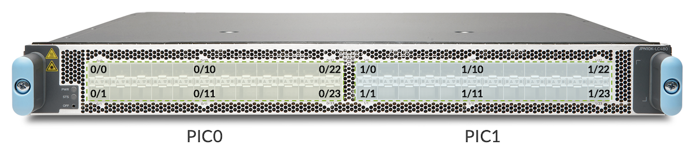
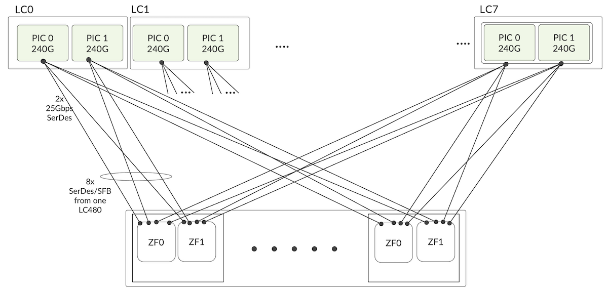

# MX10000 LC480 Deepdive

**Deepak Tripathi - 08/02/2022**

LC480 is a 48 port 1G/10G line card supporting Business Services(L2/L3) with rich OAM features, Broadband subscriber at scale, H-QoS, high filter scale and deep buffers. It's a perfect complement to the MX10K portfolio known for supporting highly dense 100G and 400G (LC9600) line cards.

## Introduction

LC480 is a 1GE/10GE optimized line card enabling the multi-service edge use cases requiring low-speed fan-outs towards the access and aggregation side. It complements the MX10K portfolio along with LC9600.



LC480 is a fixed form-factor line card delivering 480Gbps of throughput. The 48 ports accept many different SFP and SFP+ types including copper. With this new line card, we extend the MACsec support on all interfaces of an MX10008 chassis, from 1GE to 400GE, mixing LC480 and LC9600. Coupled with the next-generation Routing Engine (RE), the LC480 is Class C timing capable, meeting the stringent requirements of 5G networks.

LC480 is powered by two Trio 4 Packet Forwarding Engines (PFE). The same ASIC is used in many products in the MX portfolio such as [MPC7E](https://www.juniper.net/documentation/us/en/software/junos/continuity/topics/concept/mpc7e-multi-rate.html), [MPC8E](https://www.juniper.net/documentation/us/en/software/junos/continuity/topics/concept/mpc8e.html)/[9E](https://www.juniper.net/documentation/us/en/software/junos/continuity/topics/concept/mpc9e.html), [LC2103](https://apps.juniper.net/hct/model/?component=MX10003-LC2103), [LC2101](https://apps.juniper.net/hct/model/?component=MX10K-LC2101) and [MX204](https://www.juniper.net/documentation/us/en/hardware/mx204/topics/concept/mx204-description.html). This mature ASIC/silicon supports all the use cases including, but not limited to: Business Edge, Enterprise WAN, DC Edge, Peering, Broadband Network Gateway (BNG), Mobile Backhaul and many more. It's a perfect enabler for customers looking to deploy next-gen MX10004/8/16 with low-speed access facing ports on LC480 and high-bandwidth 100G/400G uplinks using LC9600. We invite you to read the article dedicated to the LC9600 deepdive: [https://juniper.github.io/techposts/mx10000-lc9600-deepdive/article](https://juniper.github.io/techposts/mx10000-lc9600-deepdive/article)



## Trio 4 Architecture

Trio 4 builds on the lineage of Trio silicon, it's a highly programmable ASIC delivering a very high feature scale:

- Millions of prefixes in its FIB table
- Millions of flow records
- 256K queues
- Broadband subscriber services along with 5-level hierarchical QoS (HQoS)
- High filter scale.
- MPLS Segment Routing with 16 label depth
- Advanced features such as SRv6, and BIER

Trio 4 is a twenty-eight nanometer (28nm) packet forwarding ASIC with a total throughput capacity of 400Gbps. Built on top of all the ASIC features incorporated in previous generations, it uses an XR2 chip for high bandwidth and low latency lookup memory and leverages Hyper Memory Cube (HMC) for delay bandwidth buffer and flow table storage. Trio 4 has different operation modes with fewer XR2 and HMC interfaces to reduce power consumption for lower data rates.

In the LC480, the ASIC is tuned to deliver 240G performance (24x1G/10G line rate) with an optimized power budget. The reduced performance is achieved by tweaking the NPU clock rate to a lower frequency.



Trio 4 contains Packet Processing Engines (PPEs) following a run-to-completion model and offers similar functions as detailed in [LC9600 article](https://juniper.github.io/techposts/mx10000-lc9600-deepdive/article). Contrary to previous generations, it natively supports large-scale hierarchical queuing without requiring an external chip.

On MX10004/8, Trio 4 based LC480 and LC2101 are fully interoperable with Trio 6 based line-card LC9600.



Internally each ASIC is built on the following main components:

- LUSS (LookUp Sub-System) acts as the brain of Trio 4 ASIC and provides all packet processing functions with the help of an array of packet processing engines (PPEs). The major functions performed by LUSS include route table lookup, packet classification and filtering.
- MQSS (Memory and Queuing Sub-System) provides data paths and queuing functionality. It acts as an interface between WAN and Fabric. It has a pre-classifier where packets get classified as low/high priority. Unlike initial generations of Trio where an extended queuing subsystem (XQSS) was used to provide queuing functionality, MQSS on Trio 4 integrates this function. It reduces the footprint utilization in the PCB (Printed Circuit Board) and improves the power performance without any compromise on functionality. MQSS also has interfaces with both WAN and Fabric sides. It can support up to 256,000 queues and 5-level hierarchical schedulers.
- XR2 is an off-chip control memory designed for very high-speed access rates.
- HMC (Hyper Memory Cube) is an off-chip memory used for delay bandwidth buffer, schedulers, flow-table storage, etc.
- XRIF (XR Interface) is a high bandwidth and low latency interface to look up XR2 memory
- HMCIF (HMC Interface) is the interface to HMC memory.

## Life of Packet inside Trio 4



Here is a high-level view of the life of a packet inside Trio 4

- 1 - A packet is received on the MQSS block either from the WAN interface or from the Fabric interface. Pre-classification decides priority. The main purpose of pre-classification is to make sure that high priority control traffic is protected even when the PFE is oversubscribed.
- 2 - If the incoming packet size is <=224 bytes, the complete packet will be sent to the LUSS. If the incoming packet is > 224 bytes, the packet is split into HEAD (192 bytes) and TAIL. A reorder context and a reorder ID is created. Then, HEAD is sent to LUSS for processing.
- 3 - The TAIL of the packet is sent to off-chip memory.
- 4 - The incoming packet gets processed in the PPEs in LUSS. Once LUSS has finished processing, the modified packet or HEAD is sent back to MQSS. Here reorder entry of the packet is validated and, once it becomes eligible, it is sent to the fabric scheduler.
- 5 - The scheduler function schedules the packet based on different parameters (queue priority, shaping rate, etc). Once the packet becomes eligible to be sent out of PFE, the content will be read from off-chip memory and the packet will be sent out via the WAN/Fabric interface.

## LC480 Architecture

LC480 has two ASIC complexes providing a line-rate throughput capacity of 480Gbps. The ports on the LC are divided into 2 PICs with each mapped to one PFE.

```
regress@mx-lc480> show chassis fpc pic-status | find "Slot 3"
Slot 3   Online       JNP10K-LC480                                  
  PIC 0  Online       24xSFPP 1/10GE PIC
  PIC 1  Online       24xSFPP 1/10GE PIC
regress@mx-lc480> show chassis pic fpc-slot 3 pic-slot 0      
FPC slot 3, PIC slot 0 information:
  Type                             24xSFPP 1/10GE PIC
  State                            Online    
  PIC version                  0.0
  Uptime           3 minutes, 5 seconds
PIC port information:
Port speed information:
  Port  PFE      Capable Port Speeds
  0      0       1GE, 10GE
  1      0       1GE, 10GE
  2      0       1GE, 10GE
  3      0       1GE, 10GE
  .
  .
  <Output curtailed for the sake of brevity>
  21     0       1GE, 10GE
  22     0       1GE, 10GE
  23     0       1GE, 10GE

```

LC480 contains a Processor Mezzanine Board (PMB) hosting a four-core line card CPU (LCPU) and serving for the standard line card and PFE management functions. LCPU support the bandwidth requirements of both the control and data plane. The LCPU runs the control packets and maintains other functions such as:

- LOG, SYSLOG
- SFLOW
- JFLOW
- MACsec key exchanges
- Other bandwidth-intensive applications such as protocol session traffic, exception traffic handling, ARP, IPv4/IPv6 options etc.

The WAN section of the LC will implement 48 pluggable SFP+ optics cages. All these slots are capable of supporting 1G copper SFPs but it is recommended to have them plugged into not more than 16 optical slots per line card. MACsec and PTP Class C timing is enabled with the help of external PHY which sits in between WAN ports and ASIC. Each PHY will cater to 12x1G/10G WAN interfaces so LC480 will have two PHYs per PIC. The same is described in the below diagram.



The twenty-four SerDes lanes between the ASIC and WAN run at a maximum speed of 25Gbps. Similarly, there are twenty-four SerDes lanes with a maximum speed of 25Gbps between ASIC and Fabric.

The LC480 on modular MX10008 chassis is fully interoperable with the older generation of Fabric and it will also work with the next-gen switch fabric card along with LC9600.



## LC480 and Fabric Interconnect

The line card and fabric boards have orthogonal interconnect. This chassis design has many advantages, such as better cooling and increased power efficiency (watts/gig) compared to traditional system architecture with mid-planes. This has been discussed in detail in [LC9600 Blog](https://juniper.github.io/techposts/mx10000-lc9600-deepdive/article).

LC480 will be supported with both generations of switch fabric cards. MX10008 and MX10016 will support LC480 with JNP10008-SF and JNP10016-SF respectively. Switch fabric Board2 or SFB2 is the next-gen switch-fabric board in the MX10008 platform. The "show chassis hardware " on MX10008 will show the fabric board as follows:

```
regress@mx-lc480> show chassis hardware extensive | find "SFB 0"            
SFB 0            REV 14   750-116523   BCCN4345     Switch Fabric Board 2
 Jedec Code:   0x7fb0            EEPROM Version:    0x02
 P/N:          750-116523        S/N:               XXXXXX
 Assembly ID:  0x0d7c            Assembly Version:  01.14
 Date:         11-26-2021        Assembly Flags:    0x00
 Version:      REV 14            CLEI Code:         XXXXXX
 ID: Switch Fabric Board 2       FRU Model Number:  XXXXXX

```

The 24 Fabric SerDes links from each ASIC are equally divided among 6x SFB2 connectors. So to one fabric card, there would be 4 SerDes links from each ASIC. This implies there will be eight SerDes links from each LC480 to a fabric card. The connector carries 36 links but only 8 are used for this MPC.

For the 4 links coming from each ASIC to SFB2, there are 2 links per ASIC on a ZF. So, a total of 32 links terminate on each ZF (2 links per ASIC, 2 ASIC per LC480 and 8 LCs). Each of these links will be an X1P link and will run at approximately 25Gbps



LC480 will support 5+1 fabric redundancy. There will be a linear drop in performance after that. Fabric upgrade will be required from Gen 1 SFB to SFB2 in case there is a requirement to run LC480 along with LC9600. The below procedure should be followed for the upgrade:

1. Ensure Junos image version is 21.4R1 or beyond.
2. Power off chassis.
3. Remove GEN1 Fan trays[JNP10008-FAN]
4. Remove GEN1 PSM[JNP10K-PWR-AC or DC]
5. Remove GEN1 SFB[JNP10008-SFF]
6. Insert SFB2[JNP10008-SF2]
7. Insert GEN2 Fan trays[JNP10008-FAN2]
8. Insert GEN2 Power Supplies[JNP10K-PWR-AC2 or DC2]
9. Power on chassis

Please note that a mix of Gen1 SFB and SFB2 is not supported. If a mix of SFB types is attempted to be brought up in the chassis, the first SFB that comes up online will determine the fabric personality of the chassis. The SFBs of any other type will not be brought up online.

The table below shows the available bandwidth per LC480 based on the number of SFB2 fabric cards in the system:

| Number of SFB2 Fabric Cards | Throughput in BW | Throughput in Percent |
|:--|:--|:--|
| 6 | 480 | 100 |
| 5 | 480 | 100 |
| 4 | 437.12 | 91 |
| 3 | 328 | 68.33 |
| 2 | 218.56 | 45.53 |
| 1 | 109.28 | 22.76 |

LC480 is fully interoperable with LC2101 and LC9600 with already shipping fabric boards, power supply modules and fan tray modules on MX10008. The same has been explained in the below table.

| MX10008 | JNP10K-RE1 | MX10008-SF | MX10008-SFB2 | JNP10K-PWR-AC/DC | JNP10K-PWR-AC2/DC2 |
|:--|:--|:--|:--|:--|:--|
| LC2101+LC480 | Y | Y | Y | Y | Y |
| LC2101+LC480+LC9600 | Y | N | Y | N | Y |

| MX10004 | JNP10K-RE | MX10004-SFB2 | JNP10K-PWR-AC2/DC2 |
|:--|:--|:--|:--|
| LC2101+LC480+LC9600 | Y | Y | Y |

Below is the display output from a chassis with all three line cards installed in MX10008.

```
PIC 5                   BUILTIN      BUILTIN           MRATE-4xQDD
    Xcvr 0       REV 01   740-085351   1W2CZ7A609XXX     QSFP56-DD-400GBASE-DR4
    Xcvr 1       REV 01   740-085351   1W2CZ7A609XXX     QSFP56-DD-400GBASE-DR4
    Xcvr 2       REV 01   740-085351   1W1CZ7A517XXX     QSFP56-DD-400GBASE-DR4
    Xcvr 3       REV 01   740-085351   1W2CZ7A609XXX     QSFP56-DD-400GBASE-DR4
  Mezz           REV 08   711-114174   BCCH5XXX          JNP10K-LC9600-Mezz
FPC 3            REV 13   750-106763   BCBZ2XXX          JNP10K-LC480
  CPU            REV 06   750-114922   BCBZ2XXX          LC PMB
  PIC 0                   BUILTIN      BUILTIN           24xSFPP 1/10GE PIC
    Xcvr 0       REV 01   740-021308   ALD0XXX           SFP+-10G-SR
    Xcvr 1       REV 01   740-031981   45T012404XXX      SFP+-10G-LR
    Xcvr 2       REV 01   740-031981   UHP0XXX           SFP+-10G-LR
    Xcvr 3       REV 01   740-031981   45T012402XXX      SFP+-10G-LR
    Xcvr 4       REV 01   740-031981   45T012405XXX      SFP+-10G-LR
    Xcvr 5       REV 01   740-031981   45T012402XXX      SFP+-10G-LR
    Xcvr 6       REV 01   740-031981   45T012404XXX      SFP+-10G-LR
    Xcvr 7       REV 01   740-021309   T09G92XXX         SFP+-10G-LR
    Xcvr 8       REV 01   740-031980   A44BXXX           SFP+-10G-SR
    Xcvr 16               NON-JNPR     ONT1638012D       SFP+-10G-LR
  PIC 1                   BUILTIN      BUILTIN           24xSFPP 1/10GE PIC
    Xcvr 0                NON-JNPR     MWD1DPW           DUAL-SFP+-SR/SFP-SX
    Xcvr 1                NON-JNPR     MWG14TF           DUAL-SFP+-SR/SFP-SX
    Xcvr 3       REV 01   740-021308   AA1025A4VDP       SFP+-10G-SR
    Xcvr 4                NON-JNPR     ARS3DA7           DUAL-SFP+-SR/SFP-SX
FPD Board        REV 02   711-086964   BCBV5872          Front Panel Display
PEM 0            Rev 03   740-069994   1F21A420XXX       JNP10K 5500W AC/HVDC Power Supply
PEM 1            Rev 03   740-069994   1F21A420XXX       JNP10K 5500W AC/HVDC Power Supply
PEM 2            Rev 03   740-069994   1F21A420XXX       JNP10K 5500W AC/HVDC Power Supply
PEM 3            Rev 03   740-069994   1F21A420XXX       JNP10K 5500W AC/HVDC Power Supply
PEM 4            Rev 03   740-069994   1F21A420XXX       JNP10K 5500W AC/HVDC Power Supply
PEM 5            Rev 03   740-069994   1F21A420XXX       JNP10K 5500W AC/HVDC Power Supply
FTC 0            REV 18   750-083435   BCBV4XXX          Fan Controller 8 Enhanced
FTC 1            REV 18   750-083435   BCBV3XXX          Fan Controller 8 Enhanced
Fan Tray 0       REV 09   750-103312   BCBT6XXX          Fan Tray 8 Enhanced
Fan Tray 1       REV 09   750-103312   BCBT6XXX          Fan Tray 8 Enhanced
SFB 0            REV 11   750-116523   BCCH7XXX          Switch Fabric Board 2
SFB 1            REV 11   750-116523   BCCH7XXX          Switch Fabric Board 2
SFB 2            REV 11   750-116523   BCCH7XXX          Switch Fabric Board 2
SFB 3            REV 11   750-116523   BCCH7XXX          Switch Fabric Board 2
SFB 4            REV 11   750-116523   BCCH7XXX          Switch Fabric Board 2
SFB 5            REV 11   750-116523   BCCH7XXX          Switch Fabric Board 2

```

## Acknowledgement

I would like to express my gratitude to my mentor and reviewer Nicolas Fevrier, Sr. Director for the detailed reviews of the blog. I would also like to thank Eswaran Srinivasan, Distinguished Engineer for providing his input.

## References

- MX10008 Hardware Guide: [https://www.juniper.net/documentation/us/en/hardware/mx10008/index.html](https://www.juniper.net/documentation/us/en/hardware/mx10008/index.html)
- MX10016 Hardware Guide: [https://www.juniper.net/documentation/us/en/hardware/mx10016/index.html](https://www.juniper.net/documentation/us/en/hardware/mx10016/index.html)
- LC9600 Deepdive: [https://juniper.github.io/techposts/mx10000-lc9600-deepdive/article](https://juniper.github.io/techposts/mx10000-lc9600-deepdive/article)

## Glossary

- HMC: Hyper Memory Cube
- LCPU: Line Card CPU
- OCPMEM: On-chip Memory
- PFE: Packet Forwarding Engine
- PMB: Processor Mezzanine Board
- PPE: Packet Processing Engine
- SERDES: Serialiser Deserialiser
- SFB: Switch Fabric Board
- SRAM: Static Random Access Memory
