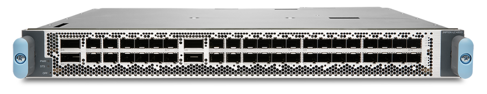
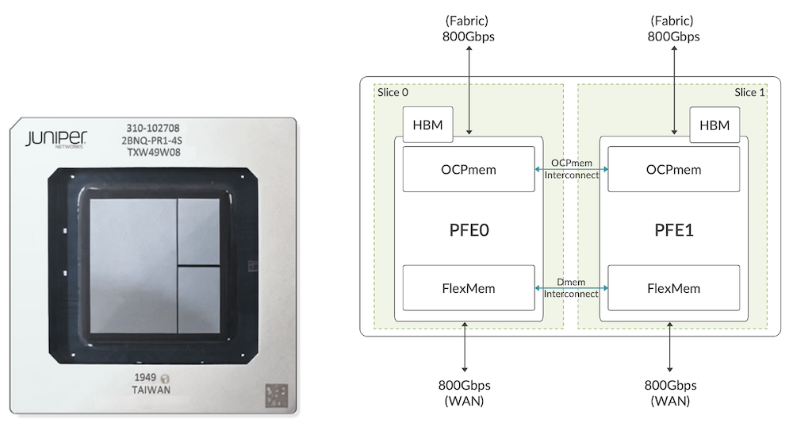
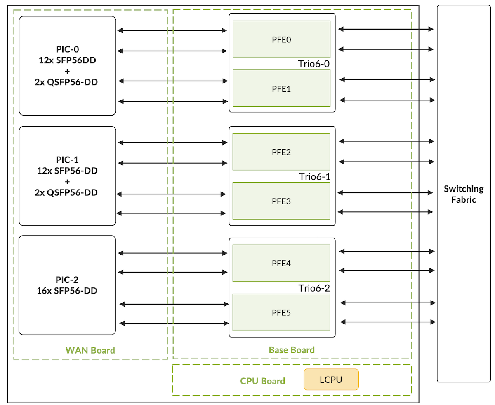
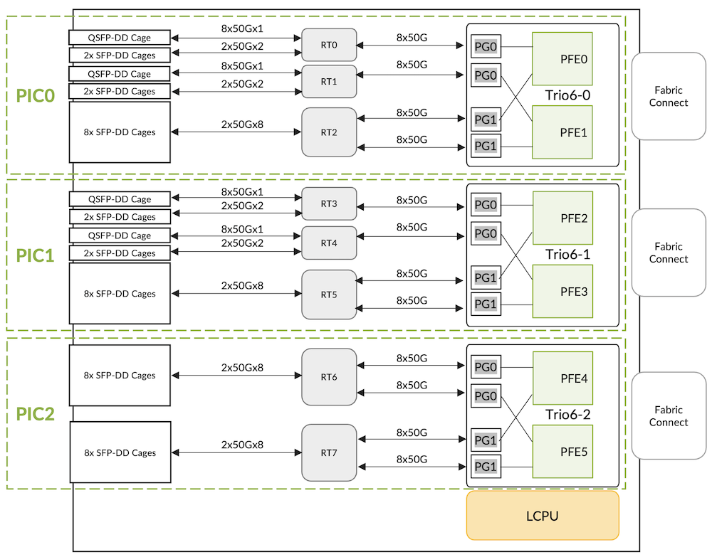
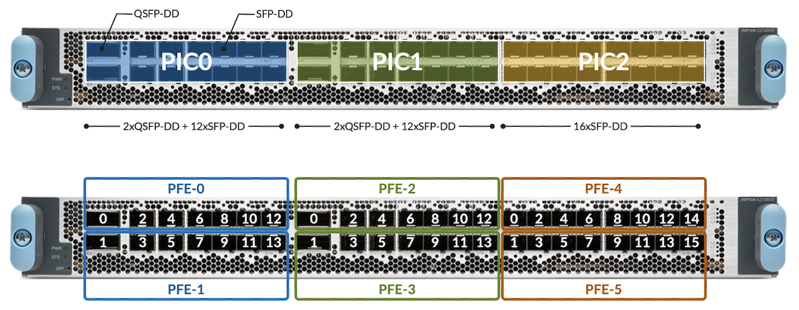
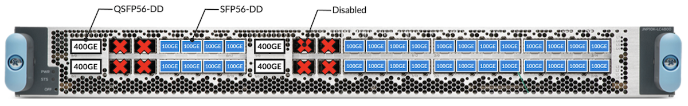
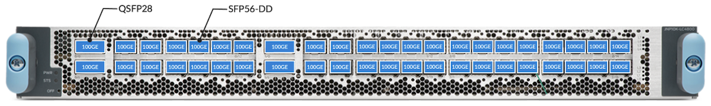
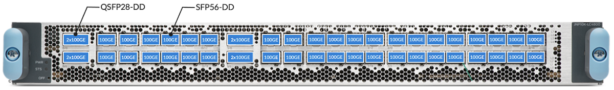

# MX10000 LC4800 Deepdive

**Eswaran Srinivasan - 12/03/2024**

## Introduction

We are very pleased to announce the addition of a new line card for Juniper's leading multi-service edge routing chassis, the MX10000.

It will complete and interoperate with the existing LC480 (48x ports SFP 1GbE/10GbE) and LC9600 (24x ports QSFP up to 400GbE), we covered them in detail in these articles:

- LC480:  [https://juniper.github.io/techposts/mx10000-lc480-deepdive/article](https://juniper.github.io/techposts/mx10000-lc480-deepdive/article)
- LC9600:  [https://juniper.github.io/techposts/mx10000-lc9600-deepdive/article](https://juniper.github.io/techposts/mx10000-lc9600-deepdive/article)

With LC4800, you leverage the power and scale of a true Run-To-Completion ASIC, the Trio 6 Packet Forwarding Engine (PFE). It will offer class C timing with the appropriate Routing Engine and will support MACsec on all ports at line rate.

The new LC4800 is supported in MX10004 and MX10008 chassis with SFB2 switching fabric cards. The minimum release is Junos 24.2R1.



With a total of 4.8Tbps of forwarding capability, the line card proposes a fixed layout:

- 4x ports QSFP56-DD supporting optics: 4x10GbE, 4x25GbE, 40GbE, 100GbE, 2x100GbE, 4x100GbE, 400GbE
- 40x ports SFP56-DD supporting optics: 1GbE, 10GbE, 25GbE, 50GbE, 100GbE

Using breakout/channelization, it supports 48x 100GbE ports per slot

## Trio 6 Packet Forwarding Engine

At the heart of LC4800, you'll find 3x Trio 6 chipset, a seven-nanometre (7nm) ASIC with a core clock frequency of 1.2GHz, delivering a throughput performance of 1.6Tbps.



Trio 6 package is made of two datapaths (seen as PFE0 and PFE1 from the Junos operating system's perspective), 800Gbps full-duplex capable. We have 36 SerDes (serializer/deserializer) lanes at 56Gbps towards fabric and 32 SerDes lanes towards WAN interfaces. Each WAN SerDes can run at different speeds up to 56Gbps.

For more technical details on the ASIC, we invite you to read first the Trio 6 architecture section in the LC9600 article: [https://juniper.github.io/techposts/mx10000-lc9600-deepdive/article](https://juniper.github.io/techposts/mx10000-lc9600-deepdive/article)

and the "packet walkthrough" in a lot of detail in this other article, [https://juniper.github.io/techposts/trio-6-packet-walkthrough/article](https://juniper.github.io/techposts/trio-6-packet-walkthrough/article)

It covers the internal components, memories, and databases.

## LC4800 Architecture

Each LC4800 includes 3x Trio 6 ASIC providing a line rate throughput capacity of 4.8Tbps (hence the name of the line card "4800").



The card is composed of multiple boards:

- The Base board, connecting to the fabric cards and hosting the three Trio 6 chipsets (among many other components)
- The Processor Mezzanine board, connecting to the Base board and hosting the AMD CPU with 2x 16GB DDR RDIMM RAM, and the boot logic components. The 8 cores are clocked at 2.5GHz and handle functions like:
    - LOG, SYSLOG
    - SFLOW
    - JFLOW
    - MACsec key exchanges
    - Bandwidth-intensive applications such as protocol session traffic, exception traffic handling, ARP, IPv4/IPv6 options, etc.
- The WAN Mezzanine board, connecting to the Base board, hosting the WAN PHYs and all the QSFP-DD and SFP-DD cages, installed on top and bottom of the board (belly-to-belly or "sandwich" design)



The SerDes lanes between the ASIC and WAN run at a maximum speed of 56Gbps. Note that based on the length of the SerDes lanes between WAN and ASIC re-timers are added to compensate for the loss of signal.

Since each Trio 6 package has two datapaths or "PFE complexes", there will be 6x PFEs per LC4800. This can be seen in the output of the "show chassis fpc" command:

```
regress@rtme-mx10k4-01> show chassis fpc 2 detail 
Slot 1 information:
  State                               Online    
  Total CPU DRAM                 32768 MB
  Total HBM                      49152 MB
  FIPS Capable                        True  
  Start time                          2024-11-29 04:47:23 PST
  Uptime                              9 minutes, 57 seconds
  Max power consumption           1005 Watts
  Operating Bandwidth             4800 G

PFE Information:

  PFE  Power ON/OFF  Bandwidth         SLC
  0    ON            800G                
  1    ON            800G                
  2    ON            800G                
  3    ON            800G                
  4    ON            800G                
  5    ON            800G                

regress@rtme-mx10k4-01>
```

Each Trio 6, and its two "PFEs" or "PFE complexes", handles one logical PIC (Physical Interface Cards). So LC4800 has a total of three PICs numbered from 0 to 2.

The first two are mapped to 2x QSFP-DD and 12x SFP-DD ports, the last one is mapped to 16x SFP-DD ports.

Here is the show output that shows the logical PIC status.

```
regress@rtme-mx10k4-01> show chassis fpc pic-status 1    
Slot 1   Online       JNP10K-LC4800                                 
  PIC 0  Online       MRATE-2xQDD-12xSFPDD
  PIC 1  Online       MRATE-2xQDD-12xSFPDD
  PIC 2  Online       MRATE-16xSFPDD

regress@rtme-mx10k4-01>
```

LC4800, like LC480 and LC9600, will use port profiles to manage the ports on a PIC. We will detail this in the next section.
Interface Configuration and Options

PICs and Ports are mapped as shown in the figure 05 below:



Depending on the optics inserted in the QSFP-DD cages, certain ports may be disabled automatically by the system.
Let's take a look at a couple of examples to illustrate the ports distribution options.



In the configuration displayed in Figure 06, we support 4x 400GbE and 32x 100GbE ports. QSFP56-DD 400GbE optics are inserted in ports 0/0, 0/1, 1/0, and 1/1 and SFP56-DD 100GbE optics are positioned in the SFP ports. For example, when a 400GbE optic is inserted in port 0/0, the other ports 0/2 and 0/4 are disabled because they belong to the same 400Gbps Port Group and Slice.



In the configuration displayed in Figure 07, we support a total of 44x 100GbE ports. Four of them are QSFP28 optics, and the 40 others are SFP56-DD optics. No ports are disabled with this configuration.



In this last example displayed in Figure 08, we use QSFP28-DD optics 2x100G (like [https://apps.juniper.net/hct/model/?component=QDD-2X100G-LR4](https://apps.juniper.net/hct/model/?component=QDD-2X100G-LR4)) in the QSFP slots. In this case again, no need to disable ports, we have a total of 48x ports 100GbE available, 8 via four 2x100G optics, and the rest via SFP56-DD optics.

### QSFP28 LR4 vs SFP56-DD LR1

We have multiple options to offer 100GbE connectivity.

- The "traditional" QSFP28 with 4x 25Gbps electrical interfaces (SerDes) to the host side and available in different flavors:
    - 4-lambda optics for 100GbE or 4x25GbE breakout [https://apps.juniper.net/hct/model/?component=JNP-QSFP-100G-LR4](https://apps.juniper.net/hct/model/?component=JNP-QSFP-100G-LR4)
    - 1-lambda optics for 100GbE, commonly used to connected to 4x100GbE breakout of 400Gbps interfaces: [https://apps.juniper.net/hct/model/?component=QSFP-100G-LR](https://apps.juniper.net/hct/model/?component=QSFP-100G-LR)
- More recently, we see the emergence of other options like SFP56-DD with 2x 50Gbps SerDes to the host-side and today only proposing 1-lambda options for 100GbE. [https://apps.juniper.net/hct/model/?component=SDD-100G-LR1](https://apps.juniper.net/hct/model/?component=SDD-100G-LR1)


The choice of SFP-DD optics cages in the LC4800 is motivated by multiple parameters:

- The port density: with a 113.9mm2 form factor, it's potentially possible to position 48x SFP56-DD ports in 1RU, which is a 33% density improvement compared to the QSFP equivalent (156mm2)
- The port flexibility:  an SFP slot supports optic options from 1GbE SFP to 100GbE SFP56-DD "natively" (read: without using QSFP-to-SFP mechanical Adaptors)
- Cost savings: In the long run, we expect improved manufacturability that will translate into significantly lower costs compared to the QSFP28 equivalent for 100GbE
- Power savings: up to 25% less power than QSFP28 single-lambda optics

Consequently, it comes with certain obvious restrictions: you can NOT connect your existing 4-lambda optics (like LR4) on one side of the fiber to optics inserted in these SFP-DD cages (SFP56-DD LR1) on the other side.

If you need LR4 connectivity specifically, you can only rely on the QSFP ports. This statement is true at the moment of this article's publication, new optics could be introduced in the future. That gives us:

- Total 4 ports with QDD-100G-LR4 optics
- Total 8 ports with mini-CS connectors of QDD-2x100G-LR4 optics

### Ports Naming Logic

The table below summarizes the interface's naming rules, including channelized ports. All the ports follow the same rules, regardless of their position in PICs.

| Interface Type | Interface Name | Notes |
|:--|:--|:--|
| 1GbE | ge-x/y/z | xrepresents the FPC slot numberyrefers to the PIC slot numberThe valid range is [0..2]zshows the physical port numberThe valid range is [0..13] or [0..15] |
| 10GbE | xe-x/y/z |  |
| 4x10GbE | xe-x/y/z:0xe-x/y/z:1xe-x/y/z:2xe-x/y/z:3 |  |
| 25GbE | et-x/y/z |  |
| 4x25GbE | et-x/y/z:0et-x/y/z:1et-x/y/z:2et-x/y/z:3 |  |
| 40GbE | et-x/y/z |  |
| 50GbE | et-x/y/z |  |
| 100GbE | et-x/y/z |  |
| 2x100GbE | et-x/y/z:0et-x/y/z:1 |  |
| 4x100GbE | et-x/y/z:0et-x/y/z:1et-x/y/z:2et-x/y/z:3 |  |
| 400GbE | et-x/y/z |  |

### Ports Capability

The table below summarizes the PIC port speed capability for the LC4800.

| PIC | Port Number | Port Type | Port Speed | Optics Type | Trio6 SerDes Lanes |
|:--|:--|:--|:--|:--|:--|
| PIC-012xSFP56-DD+2xQSFP56-DD | 0, 1 | QSFP56-DD | 4x10GbE | QSFPP-4x10G | 4x10Gbps |
| 4x25GbE | QSFPP-4x25G | 4x25Gbps |  |  |  |
| 40GbE | QSFPP-40G | 4x10Gbps |  |  |  |
| 100GbE | QSFP28-100G | 4x25Gbps |  |  |  |
| 2x100GbE | QSFP28-DD-2x100G | 2x2x50Gbps |  |  |  |
| 4x100GbE | QSFP56-DD-4x100G | 4x2x50Gbps |  |  |  |
| 400GbE | QSFP56-DD-400G | 8x50Gbps |  |  |  |
| 2, 4,6, 8, 10, 12,3, 5,7, 9, 11, 13 | SFP56-DD | 1GbE | SFP-1G | 10Gbps |  |
| 10GbE | SFPP-10G | 10Gbps |  |  |  |
| 25GbE | SFP28-25G | 25Gbps |  |  |  |
| 50GbE | SFP56-50G | 50Gbps |  |  |  |
| 100GbE | SFP56-DD-100G | 2x50Gbps |  |  |  |
| PIC-112xSFP56-DD+2xQSFP56-DD | 0, 1 | QSFP56-DD | 4x10GbE | QSFPP-4x10G | 4x10Gbps |
| 4x25GbE | QSFPP-4x25G | 4x25Gbps |  |  |  |
| 40GbE | QSFPP-40G | 4x10Gbps |  |  |  |
| 100GbE | QSFP28-100G | 4x25Gbps |  |  |  |
| 2x100GbE | QSFP28-DD-2x100G | 2x2x50Gbps |  |  |  |
| 4x100GbE | QSFP56-DD-4x100G | 4x2x50Gbps |  |  |  |
| 400GbE | QSFP56-DD-400G | 8x50Gbps |  |  |  |
| 2, 4,6, 8, 10, 12,3, 5,7, 9, 11, 13 | SFP56-DD | 1GbE | SFP-1G | 10Gbps |  |
| 10GbE | SFPP-10G | 10Gbps |  |  |  |
| 25GbE | SFP28-25G | 25Gbps |  |  |  |
| 50GbE | SFP56-50G | 50Gbps |  |  |  |
| 100GbE | SFP56-DD-100G | 2x50Gbps |  |  |  |
| PIC-216xSFP56-DD | 0, 1, 2, 3, 4, 5, 6, 7, 8, 9, 10, 11, 12, 13, 14, 15 | SFP56-DD | 1GbE | SFP-1G | 10Gbps |
| 10GbE | SFPP-10G | 10Gbps |  |  |  |
| 25GbE | SFP28-25G | 25Gbps |  |  |  |
| 50GbE | SFP56-50G | 50Gbps |  |  |  |
| 100GbE | SFP56-DD-100G | 2x50Gbps |  |  |  |

The CLI can provide this information too:

```
regress@rtme-mx10k4-01> show chassis pic fpc-slot 1 pic-slot 0 
FPC slot 1, PIC slot 0 information:
  Type                             MRATE-2xQDD-12xSFPDD
  State                            Online    
  PIC version                      0.0
  Uptime    6 hours, 36 minutes, 25 seconds

PIC port information:

<SNIP>

Port speed information:

  Port  PFE      Capable Port Speeds
  0      0       4x10GE, 4x25GE, 40GE, 100GE, 2x100GE, 4x100GE, 400GE
  1      1       4x10GE, 4x25GE, 40GE, 100GE, 2x100GE, 4x100GE, 400GE
  2      0       1GE, 10GE, 25GE, 50GE, 100GE
  3      1       1GE, 10GE, 25GE, 50GE, 100GE
  4      0       1GE, 10GE, 25GE, 50GE, 100GE
  5      1       1GE, 10GE, 25GE, 50GE, 100GE
  6      0       1GE, 10GE, 25GE, 50GE, 100GE
  7      1       1GE, 10GE, 25GE, 50GE, 100GE
  8      0       1GE, 10GE, 25GE, 50GE, 100GE
  9      1       1GE, 10GE, 25GE, 50GE, 100GE
  10     0       1GE, 10GE, 25GE, 50GE, 100GE
  11     1       1GE, 10GE, 25GE, 50GE, 100GE
  12     0       1GE, 10GE, 25GE, 50GE, 100GE
  13     1       1GE, 10GE, 25GE, 50GE, 100GE

regress@rtme-mx10k4-01> show chassis pic fpc-slot 1 pic-slot 1    
FPC slot 1, PIC slot 1 information:
  Type                             MRATE-2xQDD-12xSFPDD
  State                            Online    
  PIC version                      0.0
  Uptime    6 hours, 37 minutes, 43 seconds

Port speed information:

  Port  PFE      Capable Port Speeds
  0      2       4x10GE, 4x25GE, 40GE, 100GE, 2x100GE, 4x100GE, 400GE
  1      3       4x10GE, 4x25GE, 40GE, 100GE, 2x100GE, 4x100GE, 400GE
  2      2       1GE, 10GE, 25GE, 50GE, 100GE
  3      3       1GE, 10GE, 25GE, 50GE, 100GE
  4      2       1GE, 10GE, 25GE, 50GE, 100GE
  5      3       1GE, 10GE, 25GE, 50GE, 100GE
  6      2       1GE, 10GE, 25GE, 50GE, 100GE
  7      3       1GE, 10GE, 25GE, 50GE, 100GE
  8      2       1GE, 10GE, 25GE, 50GE, 100GE
  9      3       1GE, 10GE, 25GE, 50GE, 100GE
  10     2       1GE, 10GE, 25GE, 50GE, 100GE
  11     3       1GE, 10GE, 25GE, 50GE, 100GE
  12     2       1GE, 10GE, 25GE, 50GE, 100GE
  13     3       1GE, 10GE, 25GE, 50GE, 100GE

regress@rtme-mx10k4-01> show chassis pic fpc-slot 1 pic-slot 2    
FPC slot 1, PIC slot 2 information:
  Type                             MRATE-16xSFPDD
  State                            Online    
  PIC version                      0.0
  Uptime    6 hours, 37 minutes, 9 seconds

Port speed information:

  Port  PFE      Capable Port Speeds
  0      4       1GE, 10GE, 25GE, 50GE, 100GE
  1      5       1GE, 10GE, 25GE, 50GE, 100GE
  2      4       1GE, 10GE, 25GE, 50GE, 100GE
  3      5       1GE, 10GE, 25GE, 50GE, 100GE
  4      4       1GE, 10GE, 25GE, 50GE, 100GE
  5      5       1GE, 10GE, 25GE, 50GE, 100GE
  6      4       1GE, 10GE, 25GE, 50GE, 100GE
  7      5       1GE, 10GE, 25GE, 50GE, 100GE
  8      4       1GE, 10GE, 25GE, 50GE, 100GE
  9      5       1GE, 10GE, 25GE, 50GE, 100GE
  10     4       1GE, 10GE, 25GE, 50GE, 100GE
  11     5       1GE, 10GE, 25GE, 50GE, 100GE
  12     4       1GE, 10GE, 25GE, 50GE, 100GE
  13     5       1GE, 10GE, 25GE, 50GE, 100GE
  14     4       1GE, 10GE, 25GE, 50GE, 100GE
  15     5       1GE, 10GE, 25GE, 50GE, 100GE

regress@rtme-mx10k4-01> 
```

The default speed for each port (QSFP-DD or SFP-DD) is 100GbE.

### Default FEC Configuration

The table below summarizes the default FEC (Forwarding Error Correction) configuration for the various port speeds of an LC4800:

| Port Speed | SERDES Lanes | Default FEC Configuration | Comments |
|:--|:--|:--|:--|
| 1GbE | 10Gbps | None | FEC is typically not required for 10Gbps SERDES lanes. |
| 10GbE | 10Gbps | None | FEC is typically not required for 10Gbps SERDES lanes. |
| 25GbE | 25Gbps | RS-FEC91 KR | IEEE 802.3bj Clause 91, RS(528, 514) |
| 40GbE | 4x10Gbps | None | FEC is typically not required for 10Gbps SERDES lanes. |
| 50GbE | 50Gbps | RS-FEC91 KP | IEEE 802.3bj Clause 91, RS(544, 514) |
| 100GbE | 4x25Gbps | RS-FEC91 KR | IEEE 802.3bj Clause 91, RS(528, 514)FEC is enabled by default based on the optics type. |
| 2x50Gbps | RS-FEC91 KP | IEEE 802.3bj Clause 91, RS(544, 514) |  |
| 400GbE | 8x50Gbps | RS-FEC119 KP | IEEE 802.3bs Clause 119, RS(544, 514)FEC is required to be enabled always. |

The following configuration can be used to override the default FEC configuration for an interface.

```
interfaces {
    <IFD Name>
        gigether-options {
            fec <none | fec74 | fec91>;
        }
    }
}
```

### MTU and MRU

The following table gathered the different MTU (Maximum Transmission Unit) and MRU (Maximum Receive Unit) for the different port types.

| Interface Type | MRU | MTU |
|:--|:--|:--|
| Default (Bytes) | Minimum (Bytes) | Maximum (Bytes) |
| 1GbE | 1522 | 256 |
| 10/25/40/50/100/400GbE | 1522 | 256 |

## PIC Port Management

The PIC ports of an LC4800 support various speeds. Junos offers port profile configuration where users can select a set of active ports and their port speeds. It provides a way to customize the active ports in a PIC and to handle the PFE oversubscription scenarios.
A port profile selects a set of ports that need to be active in a PIC and the port speed. PIC ports can be configured using the port profiles:

- All the supported ports in 1GbE mode
- All the supported ports in 10GbE mode
- All the supported ports in 25GbE mode
- All the supported ports in 40GbE mode
- All the supported ports in 50GbE mode
- All the supported ports in 100GbE mode
- All the supported ports in 400GbE mode
- Flexible per-port level configuration for 1/10/25/40/50/100/400GE mode

The port profiles can be configured at a PIC level as well as at a per-port level. The sub-sections below describe the details of this.

### Port Profile Configuration at PIC Level

This port profile configuration model permits the configuration of the port speed at the PIC level. All ports supporting that port speed will be active by default.

However, this may lead to PFE oversubscription under certain conditions. The number-of-ports CLI configuration command can be used to address these scenarios.

```
chassis {
    fpc <FPC Slot> {
        pic <PIC Slot> {
            pic-mode <1G|10G|25G|40G|50G|100G|400G>;
            number-of-ports <Number Of Active Ports>;
        }
    }
}
```

- The interfaces (i.e. IFDs) will be created only for the active ports.
- Switching between the PIC modes will trigger an automatic PIC bounce.
- Changing the number-of-ports CLI configuration knob will trigger a PIC bounce. Once the PIC becomes online, the interfaces will be created only for the active ports.
- With LC4800, if pic-mode is set to 100G for PIC-0 or PIC-1 and the number-of-sub-ports is set to 3 for port 0, then port 4 will be disabled automatically. Similarly, if number-of-sub-ports is set to 3 for port 1, then port 5 will be disabled automatically.

### Port Profile Configuration at Port Level

The port profile configuration at the PIC level provides a mechanism to operate all the ports at the same speed. If the operator prefers a flexible per-port level speed configuration, the port profile configuration at the port level can be used.
This port profile configuration model allows the selection of the ports that need to be active in a PIC and the port speed for each one of them. Since the user controls the number of active ports, the PFE oversubscription scenarios can be handled.
The CLI configuration below summarizes the port profile configuration at the port level.

```
chassis {
    fpc <FPC Slot> {
        pic <PIC Slot> {
            port 0 {
                speed <1G|10g|25g|40g|50g|100g|400g>;
            }
            port 1 {
                speed <1G|10g|25g|40g|50g|100g|400g>;
            }
            port 2 {
                speed <1G|10g|25g|40g|50g|100g|400g>;
            }
            ...
            port 15 {
                speed <1G|10g|25g|40g|50g|100g|400g>;
            }
        }
    }
}
```

- Only the ports specified in the CLI configuration will be treated as active ports.
- The interfaces (i.e. IFDs) will be created only for the active ports.
- When a port profile configuration is changed, the interfaces corresponding to the affected ports will be deleted and re-created. There is no need to bounce the PIC or reset the MPC for the port profile configuration changes.

The users can choose to configure a port profile either at PIC level or port level for a given PIC. However, the CLI will prevent the commit with an appropriate error message when a port profile is configured at PIC and port levels simultaneously.

### Number of Sub-Ports Configuration

LC4800 supports the following port speeds:

- 1GbE
- 10GbE
- 4x10GbE
- 25GbE
- 4x25GbE
- 40GbE
- 50GbE
- 100GbE
- 2x100GbE
- 4x100GbE
- 400GbE

The port profile configuration at PIC level and port level support 1/10/25/40/50/100/400GbE speeds using pic-mode and speed. Also, the number of IFDs per physical port can be different when a physical port is channelized.

Hence, the following CLI configuration command can be used to specify the number of IFDs per physical port.

```
chassis {
    fpc <FPC Slot> {
        pic <PIC Slot> {
            port <Port Number> {
                number-of-sub-ports <Number of IFDs>;
            }
        }
    }
}
```

Please note:

- This CLI configuration command can be used with the port profile configuration at the PIC level and port level.
- This CLI configuration command will be effective only when the port speed is 10G, 25G, or 100G.

### Number of Active Ports Configuration

The number-of-ports CLI configuration can be used to specify the number of active ports in a PIC. The following are a few interesting things to note about this CLI knob.

- It can be configured without the port profile configuration at PIC and port levels.
- It can be configured along with the port profile configuration at a PIC level. This is primarily to handle the PFE oversubscription scenarios.
- It cannot be configured along with the port profile configuration at a port level. The CLI will prevent the commit with an appropriate error message for this scenario.

## LC4800 and Fabric Interconnect

SFB2 are the required switch-fabric boards in MX10004 and MX10008 to support LC4800.  The connectivity principles have been covered in the LC9600 deepdive article, we invite you to refer to it:

[https://juniper.github.io/techposts/mx10000-lc9600-deepdive/article](https://juniper.github.io/techposts/mx10000-lc9600-deepdive/article)

All six fabric boards are needed to provide 4.8Tbps of throughput. There will be a linear drop in performance in the event of fabric card failure.

The table below shows the available bandwidth per LC4800 based on the number of fabric cards in the system

| Number of fabric cards | Throughput (Gbps) | Throughput(%) |
|:--|:--|:--|
| 6 | 4,800 | 100 |
| 5 | 4,140 | 89 |
| 4 | 3,320 | 71 |
| 3 | 2,490 | 53 |
| 2 | 1,660 | 35 |
| 1 | 829 | 17 |

To see details about the SFB2 and common components required to power up LC9600:

```
regress@rtme-mx10k4-01> show chassis hardware | find SFB    
SFB 0            REV 10   750-133199   BCDK6942          Switch Fabric Board 2
SFB 1            REV 10   750-133199   BCDK6956          Switch Fabric Board 2
SFB 2            REV 10   750-133199   BCDK6860          Switch Fabric Board 2
SFB 3            REV 10   750-133199   BCDJ6430          Switch Fabric Board 2
SFB 4            REV 10   750-133199   BCDK6856          Switch Fabric Board 2
SFB 5            REV 10   750-133199   BCDJ6436          Switch Fabric Board 2

regress@rtme-mx10k4-01>
```

If you try to insert an LC4800 in an MX10008 chassis with first-generation fabric cards, you will see "Offlined due to unsupported fabric":

```
user@router> show chassis fpc 3   
                     Temp  CPU Utilization (%)   Memory    Utilization (%)
Slot State            I  Total  Interrupt      DRAM (MB) Heap     Buffer
  3  Offline         ---Offlined due to unsupported fabric---

user@router>
```

## Turning Off / On the PFE in LC4800

```
chassis {
    fpc <Slot> {
        pfe <PFE Number> {
            power <on | off>;
        }
    }
}
```

This CLI configuration command will be supported only at the Trio6 ASIC level: the pair of PFE complexes will need to have the same implicit (i.e. default) or explicit (i.e. using CLI) PFE power ON/OFF configuration. By default, all the PFEs will be powered ON.

As an example, Trio6-0 hosts PFEs 0 and 1 so PFEs 0 and 1 will need to have the same PFE power ON/OFF configuration.
There won't be any CLI commit failure when the CLI configuration is invalid. Instead, an appropriate syslog error message will be displayed and the CLI configuration command will be ignored.

Changing this CLI configuration will automatically trigger an FPC restart.

## Internal Health-Check

JUNOS supports a data path health check mechanism by default for LC4800 (i.e. without any explicit CLI configuration).
The main purpose is to ensure that all the hardware and software components of a PFE are intact for the following data flow types.

- Host in-bound and out-bound traffic
- Transit traffic over the fabric

Please note that this mechanism doesn't rely on any traffic flow through an LC4800 PFE. Hence, the data path issues will be detected and reported proactively. Also, this mechanism is supported on a PFE basis so that the fault isolation will be on a PFE basis.

The data path health check is divided into the following two parts.

- WAN data path health check
- Fabric data path health check

The WAN data path health check covers the host-bound traffic while the fabric health check covers the transit traffic. We can also configure actions to be taken if/when an FPC error is detected: [https://www.juniper.net/documentation/us/en/software/junos/chassis/topics/topic-map/chassis-guide-tm-fpc-error-config.html ](https://www.juniper.net/documentation/us/en/software/junos/chassis/topics/topic-map/chassis-guide-tm-fpc-error-config.html)


### WAN Data Path Health Check

The PacketIO daemon running on the line card CPU (LCPU) sends the WAN health check packets (with sequence numbers) at 1-second intervals to each of the PFEs. These packets are sent to a MQSS's native 1GE/10GE interface and are subsequently forwarded to LUSS.

LUSS processes these packets and forwards them back to MQSS. In turn, these packets will be enqueued into the XQSS and processed by the XQSS WAN scheduler. At the end, these packets will be forwarded to the PacketIO daemon via MQSS's native 1GE/10GE interface.

The PacketIO daemon keeps track of the packets sent and received using the sequence numbers. If 3 contiguous packets are lost, a PFE wedge will be declared.

### Fabric Data Path Health Check

The LUSS sends the fabric data path health check packets at 50 msec intervals toward the fabric for each of the PFEs. These health check packets are destined to itself and so they are expected to return to the same PFE from the switching fabric.

Similar to the data packets, health check packets are also split into multiple 64B fabric cells and are sprayed across all the active fabric planes. This is to ensure that all the active fabric planes are in error-free condition for the data flow. The packets returned by the switching fabric are processed by LUSS and statistics are maintained for these packets.

The fabric manager software running on the LCPU fetches the statistics for these packets from LUSS periodically. The packet loss for these packets will trigger an appropriate fabric hardening action.

## Conclusion

The LC4800 is the latest addition to the MX10000 portfolio. This new line card supported on both 4-slot and 8-slot chassis with SFB2 switching fabric is powered by three highly scalable, run-to-completion, ASIC the Trio 6.

With a total of 4.8Tbs of forwarding capability, it offers 40x SFP-DD ports from 1Gbe to 100GbE and 4 ports QSFP-DD supporting up to 400GbE, completing perfectly the existing LC480 and LC9600 line cards.

## Acknowledgments

This article has been written by Eswaran Srinivasan, and then formatted and completed by Nicolas Fevrier. Thanks to David Roy for the review.

## Glossary/Acronyms

- ASIC: Application-Specific Integrated Circuits
- CLI: Command Line Interface
- FEC: Forwarding Error Correction
- FIB: Forwarding Information Base
- FPC: Flexible PIC Concentrator
- GbE: Gigabit Ethernet
- IFD: Physical Interface
- MQSS: Memory and Queueing Sub-System
- LCPU: Line Card CPU
- LR: Long Reach
- LUSS: Look Up Sub-System
- MPC: Modular Port Concentrator
- MRU: Maximum Receive Unit
- MTU: Maximum Transmittion Unit
- NRZ: Non-Return to Zero
- PCB: Printed Circuit Board
- PFE: Packet Forwarding Engine
- PHY: Ethernet transceiver, internal component usually programmed as a Retimer or Reverse GearBox
- PIC: Physical Interface Cards
- PMB: Processor Mezzanine Board
- PPE: Packet Processing Engines
- (Q)SFP-DD: (Quad) Small Form Factor Pluggable Double Density
- RT: Retimer
- SerDes: Serializer/Deserializer
- SFB2: Switch Fabric Card (gen2)
- WAN: Wide Area Network
- ZF: Chipset used in SFB Switch Fabric Cards

## References

- MX10008 Hardware Guide: [https://www.juniper.net/documentation/us/en/hardware/mx10008/index.html](https://www.juniper.net/documentation/us/en/hardware/mx10008/index.html)
- LC9600 Deepdive: [https://juniper.github.io/techposts/mx10000-lc9600-deepdive/article](https://juniper.github.io/techposts/mx10000-lc9600-deepdive/article)
- Deepdive and Packet walkthrough in Trio6: [https://juniper.github.io/techposts/trio-6-packet-walkthrough/article](https://juniper.github.io/techposts/trio-6-packet-walkthrough/article)
- LC4800 on Juniper.net pathfinder: [https://apps.juniper.net/hct/model/?component=MX10K-LC4800](https://apps.juniper.net/hct/model/?component=MX10K-LC4800)
- FPC Error Management: [https://www.juniper.net/documentation/us/en/software/junos/chassis/topics/topic-map/chassis-guide-tm-fpc-error-config.html](https://www.juniper.net/documentation/us/en/software/junos/chassis/topics/topic-map/chassis-guide-tm-fpc-error-config.html)
