# MX10000 LC4802 Deepdive

**Eswaran Srinivasan - 07/25/2025**

## Introduction

The MX10000 is Juniper's leading multi-service edge routing chassis, and today we are very happy to complete the portfolio with the addition of a fourth line card: the LC4802.

On many aspects, the  LC4802 is comparable to the LC4800, but instead of offering a mix of QSFP-DD and SFP-DD ports, it aims at maximizing the number of QSFP-based optics with 4x QSFP56-DD and 32x QSFP28 ports.

It will complete and interoperate with the existing line cards:

- LC480, 48x ports SFP 1GbE/10GbE:  [https://juniper.github.io/techposts/mx10000-lc480-deepdive/article](https://juniper.github.io/techposts/mx10000-lc480-deepdive/article)
- LC4800, 4x ports QSFP56-DD from 4x10GbE to 400GbE and 40x ports SFP56-DD from 1GbE to 100GbE:[https://juniper.github.io/techposts/mx10000-lc4800-deepdive/article](https://juniper.github.io/techposts/mx10000-lc4800-deepdive/article)
- LC9600, 24x ports QSFP up to 400GbE:  [https://juniper.github.io/techposts/mx10000-lc9600-deepdive/article](https://juniper.github.io/techposts/mx10000-lc9600-deepdive/article)

LC4800, LC4802, and LC9600 leverage the power and scale of a true Run-To-Completion ASIC, the Trio 6 Packet Forwarding Engine (PFE). It offers class C timing with the appropriate Routing Engine and will support MACsec on all ports at line rate (and will support inline IPsec too).

> *Note that LC480 is powered by two Trio 4.*

Trio 6 and the famous life of a packet are covered in a lot of detail in David Roy's article: [https://juniper.github.io/techposts/trio-6-packet-walkthrough/article](https://juniper.github.io/techposts/mx10000-lc9600-deepdive/article)

The new LC4802 is supported in MX10004 and MX10008 chassis with SFB2 switching fabric cards. The minimum release is Junos 25.2R1. This new line card can interoperate in the same chassis with LC480, LC4800, and LC9600. It can also interoperate with LC2101, but this last one is now EoL.

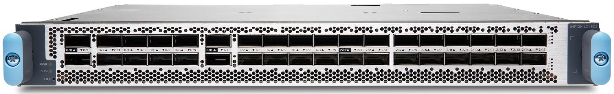

With a total of 4.8Tbps of forwarding capability, the line card proposes a fixed layout:

- 4x ports QSFP56-DD supporting optics: 4x10GbE, 4x25GbE, 40GbE, 100GbE, 2x100GbE, 4x100GbE, 400GbE
- 32x ports QSFP28 supporting optics: 1GbE, 10GbE,  4x10GbE, 40GbE, 4x25GbE, 100GbE

LC4802 in MX10008 chassis:

```
regress@MX10008> show chassis hardware detail 
Hardware inventory:
Item             Version  Part number  Serial number     Description
Chassis                                BLxxx             JNP10008 [MX10008]
Midplane         REV 12   750-071974   CALAxxxx          Midplane 8
Routing Engine 0          BUILTIN      BUILTIN           RE X10 128
  vtbd0 13412 MB                                         Virtio Block Disk
  vtbd1 57344 MB                                         Virtio Block Disk
  vtbd2 12288 MB                                         Virtio Block Disk
  ada0    128 MB  QEMU                 QM00002           Virtio Block Disk
  usb0 (addr 0.1) XHCI root HUB 0      Intel             uhub0
CB 0             REV 30   750-065898   BCBSxxxx          Control Board
FPC 0            REV 01   750-177875   BCFFxxxx          JNP10K-LC4802
  CPU            REV 04   750-160851   BCFFxxxx          JNP10K-LC4800 PMB
  PIC 0                   BUILTIN      BUILTIN           MRATE-2xQDD-8xQSFP
    Xcvr 0       REV 01   740-110090   1008xx            QSFP56-DD-LPBK
    Xcvr 1       REV 01   740-110090   609xx             QSFP56-DD-LPBK
    Xcvr 2       REV 01   740-181112   37xxxx            QSFP28-LPBK
    Xcvr 3       REV 01   740-181112   37xxxx            QSFP28-LPBK
    Xcvr 4       REV 01   740-181112   37xxxx            QSFP28-LPBK
    Xcvr 5       REV 01   740-181112   37xxxx            QSFP28-LPBK
    Xcvr 6       REV 01   740-181112   38xxxx            QSFP28-LPBK
    Xcvr 7       REV 01   740-181112   38xxxx            QSFP28-LPBK
    Xcvr 8       REV 01   740-181112   38xxxx            QSFP28-LPBK
    Xcvr 9       REV 01   740-181112   38xxxx            QSFP28-LPBK
  PIC 1                   BUILTIN      BUILTIN           MRATE-2xQDD-8xQSFP
    Xcvr 0       REV 01   740-110090   60xxx             QSFP56-DD-LPBK
    Xcvr 1       REV 01   740-110090   61xxx             QSFP56-DD-LPBK
    Xcvr 2       REV 01   740-181112   38xxxx            QSFP28-LPBK
    Xcvr 3       REV 01   740-181112   38xxxx            QSFP28-LPBK
    Xcvr 4       REV 01   740-181112   38xxxx            QSFP28-LPBK
    Xcvr 5       REV 01   740-181112   38xxxx            QSFP28-LPBK
    Xcvr 6       REV 01   740-181112   37xxxx            QSFP28-LPBK
    Xcvr 7       REV 01   740-181112   38xxxx            QSFP28-LPBK
    Xcvr 8       REV 01   740-181112   38xxxx            QSFP28-LPBK
    Xcvr 9       REV 01   740-181112   38xxxx            QSFP28-LPBK
  PIC 2                   BUILTIN      BUILTIN           MRATE-16xQSFP
    Xcvr 0       REV 01   740-181112   38xxxx            QSFP28-LPBK
    Xcvr 1       REV 01   740-181112   38xxxx            QSFP28-LPBK
    Xcvr 2       REV 01   740-181112   38xxxx            QSFP28-LPBK
    Xcvr 3       REV 01   740-181112   38xxxx            QSFP28-LPBK
    Xcvr 4       REV 01   740-181112   38xxxx            QSFP28-LPBK
    Xcvr 5       REV 01   740-181112   38xxxx            QSFP28-LPBK
    Xcvr 6       REV 01   740-181112   38xxxx            QSFP28-LPBK
    Xcvr 7       REV 01   740-181112   38xxxx            QSFP28-LPBK
    Xcvr 8       REV 01   740-181112   38xxxx            QSFP28-LPBK
    Xcvr 9       REV 01   740-181112   38xxxx            QSFP28-LPBK
    Xcvr 10      REV 01   740-181112   38xxxx            QSFP28-LPBK
    Xcvr 11      REV 01   740-181112   38xxxx            QSFP28-LPBK
    Xcvr 12      REV 01   740-181112   38xxxx            QSFP28-LPBK
    Xcvr 13      REV 01   740-181112   38xxxx            QSFP28-LPBK
    Xcvr 14      REV 01   740-181112   38xxxx            QSFP28-LPBK
    Xcvr 15      REV 01   740-181112   38xxxx            QSFP28-LPBK
  Mezz           REV 05   711-177874   BCGCxxxx          JNP10K-LC4802-Mezz

 FPD Board        REV 07   711-054687   CALVxxxx          Front Panel Display
PEM 0            REV 04   740-168322   1F38E03xxxx       JNP10K 7800W AC Power Supply
PEM 1            REV 04   740-168322   1F38E03xxxx       JNP10K 7800W AC Power Supply
PEM 2            REV 04   740-168322   1F38E03xxxx       JNP10K 7800W AC Power Supply
PEM 3            REV 04   740-168322   1F38E03xxxx       JNP10K 7800W AC Power Supply
PEM 4            Rev 02   740-085278   1F42D36xxxx      JNP10K Active Blank Power Module
PEM 5            Rev 02   740-085278   1F42D36xxxx       JNP10K Active Blank Power Module
FTC 0            REV 01   750-176678   BCBV3xxx          JNP10008 Fan Controller Gen3
FTC 1            REV 01   750-176678   BCBV3xxx          JNP10008 Fan Controller Gen3
Fan Tray 0       REV 09   750-150708   BCEX6xxx          JNP10008 Fan-Tray Gen3
Fan Tray 1       REV 09   750-150708   BCEX6xxx          JNP10008 Fan-Tray Gen3
SFB 0            REV 11   750-116523   BCCE2xxx          Switch Fabric Board 2
SFB 1            REV 11   750-116523   BCCE2xxx          Switch Fabric Board 2
SFB 2            REV 11   750-116523   BCCE1xxx          Switch Fabric Board 2
SFB 3            REV 11   750-116523   BCCH7xxx          Switch Fabric Board 2
SFB 4            REV 11   750-116523   BCCE2xxx          Switch Fabric Board 2
SFB 5            REV 11   750-116523   BCCE1xxx          Switch Fabric Board 2

regress@MX10008>  
```

## LC4800 or LC4802

If they may look similar at first glance, they are in reality addressing different needs. LC4800 has been designed for 100GbE port density and power optimization, privileging SFP to QSFP form-factor.

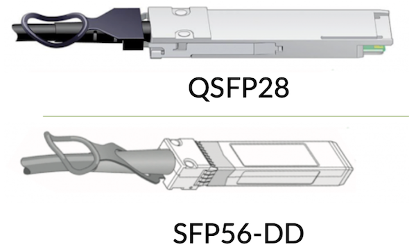

The choice of SFP-DD optics cages in the LC4800 was motivated by multiple parameters:

- Port density: with a 113.9mm2 form factor, it offers a 33% density improvement compared to the QSFP equivalent (156mm2)
- Port flexibility:  from 1GbE SFP to 100GbE SFP56-DD "natively" (read: without using QSFP-to-SFP mechanical Adaptors - QSA)
- Cost savings: In the long run, we expect improved manufacturability that will translate into significantly lower costs compared to the QSFP28 equivalent for 100GbE
- Power savings: up to 25% less power than equivalent QSFP28 single-lambda optics

But with 2x 50Gbps SerDes to the host-side, SFP56-DD proposes today only 1-lambda option for 100GbE,  [https://apps.juniper.net/hct/model/?component=SDD-100G-LR1](https://apps.juniper.net/hct/model/?component=SDD-100G-LR1), therefore you can NOT connect it to your existing 4-lambda optics (like LR4).

If you need 4-lane connectivity specifically, you can only rely on the QSFP ports today, and that's where the LC4802 comes into the picture: same 4x ports QSFP56-DD but 32x ports QSFP28 instead of 40x ports SFP56-DD.

## LC4802 Architecture

Each LC4802 includes 3x Trio 6 ASICs providing a line rate throughput capacity of 4.8Tbps (hence the name of the line cards "48xx").

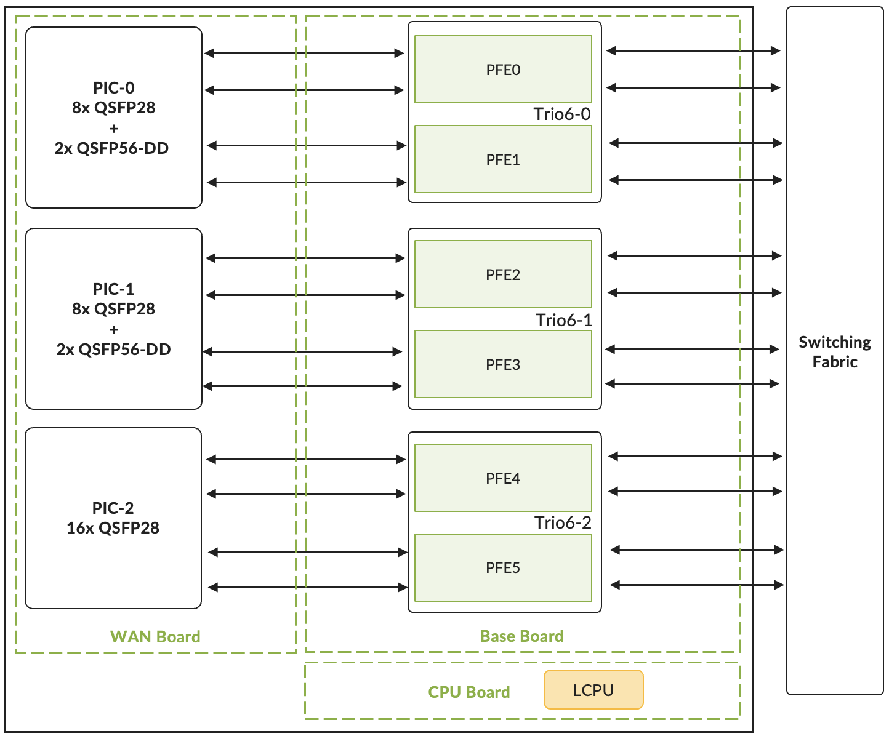

The card is composed of multiple boards:

- The Base board connects to the fabric cards and hosts the three Trio 6 chipsets (among many other components)
- The Processor Mezzanine board connects to the Base board and hosts the AMD CPU with 2x 16GB DDR RDIMM RAM, and the boot logic components. The 8 cores are clocked at 2.5GHz and handle functions like:
  - LOG, SYSLOG
  - SFLOW
  - JFLOW
  - MACsec key exchanges
  - Bandwidth-intensive applications such as protocol session traffic, exception traffic handling BFD, OAM, ARP, IPv4/IPv6 options, etc.
- The WAN Mezzanine board, connecting to the Base board, hosting the WAN PHYs and all the QSFP cages, installed on top and bottom of the board (belly-to-belly or "sandwich" design)

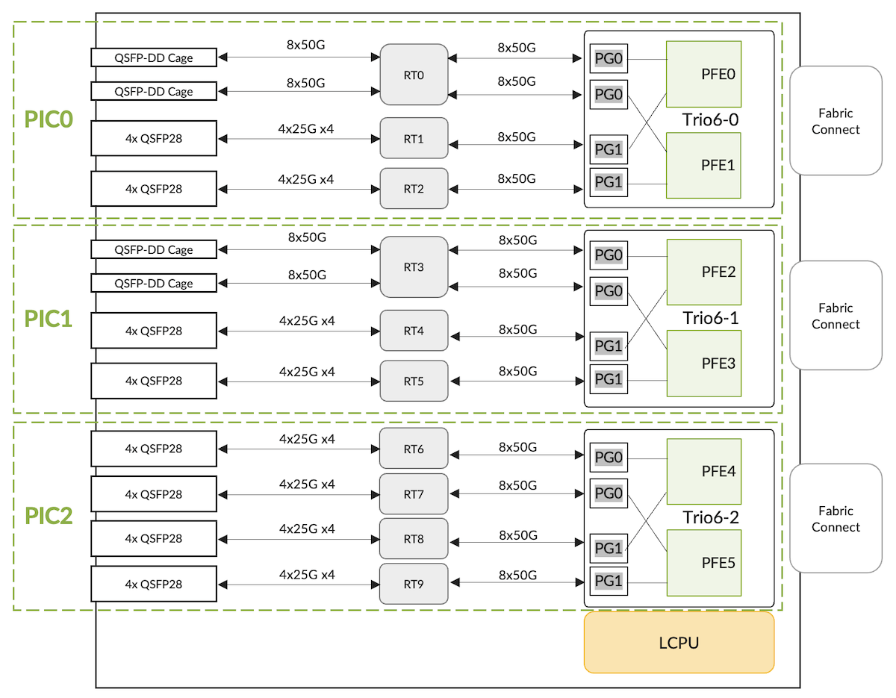

The SerDes lanes between the ASIC and WAN run at a maximum speed of 56Gbps. Note that based on the length of the SerDes lanes between WAN and ASIC, re-timers are added to compensate for the loss of signal.

Since each Trio 6 package has two datapaths or "PFE complexes", there will be 6x PFEs per LC4802. This can be seen in the output of the "show chassis fpc" command:

```
regress@MX10008> show chassis fpc 0 detail  
Slot 0 information:
  State                               Online    
  Total CPU DRAM                 32768 MB
  Total HBM                      49152 MB
  FIPS Capable                        True  
  Start time                          2025-07-27 21:24:24 PDT
  Uptime                              2 hours, 53 minutes, 53 seconds
  Max power consumption           1005 Watts
  Operating Bandwidth             4800 G

PFE Information:

  PFE  Power ON/OFF  Bandwidth         SLC
  0    ON            800G                
  1    ON            800G                
  2    ON            800G                
  3    ON            800G                
  4    ON            800G                
  5    ON            800G                

regress@MX10008>
```

Each Trio 6, and its two "PFEs" or "PFE complexes", handles one logical PIC (Physical Interface Cards). So, LC4802 has a total of three PICs numbered from 0 to 2.

The first two are mapped to 2x QSFP-DD and 8x QSFP28 ports, the last one is mapped to 16x QSFP28 ports.

Here is the show output that shows the logical PIC status.

```
regress@MX10008> show chassis fpc pic-status 0 
Slot 0   Online       JNP10K-LC4802                                 
  PIC 0  Online       MRATE-2xQDD-8xQSFP
  PIC 1  Online       MRATE-2xQDD-8xQSFP
  PIC 2  Online       MRATE-16xQSFP

regress@MX10008>
```

LC4802, like LC4802, but also LC480 and LC9600, will use port profiles to manage the ports on a PIC. We will detail this in the next sections.

### Port Naming Logic

The table below summarizes the interface's naming rules, including channelized ports. All the ports follow the same rules, regardless of their position in PICs.

> *Note that Junos EVO platforms like PTX10k, ACX7k and some QFX are following a different logic (named CIC for Common Interface Configuration)*

| Interface Type | Interface Name | Notes |
|:--|:--|:--|
| 1GbE | ge-x/y/z | xrepresents the FPC slot numberyrefers to the PIC slot numberThe valid range is [0..2]zshows the physical port numberThe valid range is [0..9] or [0..15] |
| 10GbE | xe-x/y/z |  |
| 4x10GbE | xe-x/y/z:0xe-x/y/z:1xe-x/y/z:2xe-x/y/z:3 |  |
| 4x25GbE | et-x/y/z:0et-x/y/z:1et-x/y/z:2et-x/y/z:3 |  |
| 40GbE | et-x/y/z |  |
| 100GbE | et-x/y/z |  |
| 2x100GbE | et-x/y/z:0et-x/y/z:1 |  |
| 4x100GbE | et-x/y/z:0et-x/y/z:1et-x/y/z:2et-x/y/z:3 |  |
| 400GbE | et-x/y/z |  |

### Interface Configuration and Options

PICs and Ports are mapped as shown in Figure 04 below:

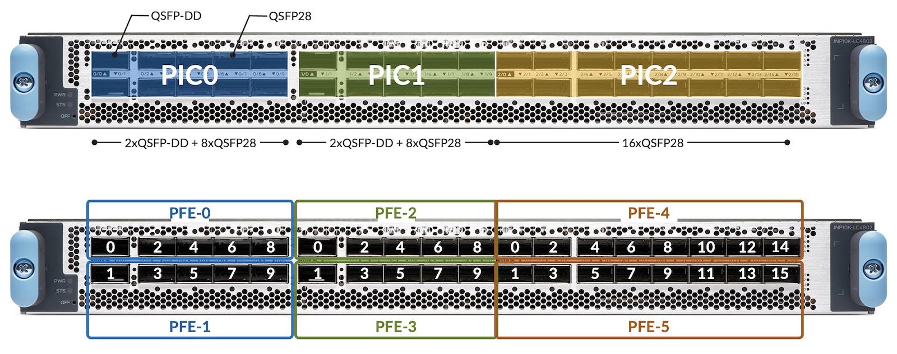

### Ports Capability

The table below summarizes the PIC port speed capability for the LC4802.

| PIC | Port Number | Port Type | Port Speed | Optics Type | Trio6 SerDes Lanes |
|:--|:--|:--|:--|:--|:--|
| PIC-08xQSFP28+2xQSFP56-DD | 0, 1 | QSFP56-DD | 4x10GbE | QSFPP-4x10G | 4x10Gbps |
| 4x25GbE | QSFPP-4x25G | 4x25Gbps |  |  |  |
| 40GbE | QSFPP-40G | 4x10Gbps |  |  |  |
| 100GbE | QSFP28-100G | 4x25Gbps |  |  |  |
| 2x100GbE | QSFP28-DD-2x100G | 2x2x50Gbps |  |  |  |
| 4x100GbE | QSFP56-DD-4x100G | 4x2x50Gbps |  |  |  |
| 400GbE | QSFP56-DD-400G | 8x50Gbps |  |  |  |
| 2, 4,6, 8,3, 5,7, 9 | QSFP28 | 1GbE | QSA w/ SFP-1G | 10Gbps |  |
| 10GbE* | QSA w/ SFPP-10G | 10Gbps |  |  |  |
| 4x10GbE | QSFPP-4x10G | 4x10Gbps |  |  |  |
| 4x25GbE | QSFPP-4x25G | 4x25Gbps |  |  |  |
| 40GbE | QSFPP-40G | 4x10Gbps |  |  |  |
| 100GbE | QSFP28-100G | 2x50Gbps |  |  |  |
| PIC-18xQSFP28+2xQSFP56-DD | 0, 1 | QSFP56-DD | 4x10GbE | QSFPP-4x10G | 4x10Gbps |
| 4x25GbE | QSFPP-4x25G | 4x25Gbps |  |  |  |
| 40GbE | QSFPP-40G | 4x10Gbps |  |  |  |
| 100GbE | QSFP28-100G | 4x25Gbps |  |  |  |
| 2x100GbE | QSFP28-DD-2x100G | 2x2x50Gbps |  |  |  |
| 4x100GbE | QSFP56-DD-4x100G | 4x2x50Gbps |  |  |  |
| 400GbE | QSFP56-DD-400G | 8x50Gbps |  |  |  |
| 2, 4,6, 8,3, 5,7, 9 | QSFP28 | 1GbE | QSA w/ SFP-1G | 10Gbps |  |
| 10GbE* | QSA w/ SFPP-10G | 10Gbps |  |  |  |
| 4x10GbE | QSFPP-4x10G | 4x10Gbps |  |  |  |
| 4x25GbE | QSFPP-4x25G | 4x25Gbps |  |  |  |
| 40GbE | QSFPP-40G | 4x10Gbps |  |  |  |
| 100GbE | QSFP28-100G | 2x50Gbps |  |  |  |
| PIC-216xQSFP28 | 0, 1, 2, 3, 4, 5, 6, 7, 8, 9, 10, 11, 12, 13, 14, 15 | QSFP28 | 1GbE | QSA w/ SFP-1G | 10Gbps |
| 10GbE* | QSA w/ SFPP-10G | 10Gbps |  |  |  |
| 4x10GbE | QSFPP-4x10G | 4x10Gbps |  |  |  |
| 4x25GbE | QSFPP-4x25G | 4x25Gbps |  |  |  |
| 40GbE | QSFPP-40G | 4x10Gbps |  |  |  |
| 100GbE | QSFP28-100G | 2x50Gbps |  |  |  |

* Under validation at the time of the article publication

The CLI can provide this information too:

```
regress@MX10008> show chassis pic fpc-slot 0 pic-slot 0 
FPC slot 0, PIC slot 0 information:
  Type                             MRATE-2xQDD-8xQSFP
  State                            Online    
  PIC version                      0.0
  Uptime                           2 hours, 52 minutes, 48 seconds

PIC port information:
<SNIP>

Port speed information:

  Port  PFE      Capable Port Speeds
  0      0       4x10GE, 4x25GE, 40GE, 100GE, 2x100GE, 4x100GE, 400GE
  1      1       4x10GE, 4x25GE, 40GE, 100GE, 2x100GE, 4x100GE, 400GE
  2      0       1GE, 4x10GE, 4x25GE, 40GE, 100GE
  3      1       1GE, 4x10GE, 4x25GE, 40GE, 100GE
  4      0       1GE, 4x10GE, 4x25GE, 40GE, 100GE
  5      1       1GE, 4x10GE, 4x25GE, 40GE, 100GE
  6      0       1GE, 4x10GE, 4x25GE, 40GE, 100GE
  7      1       1GE, 4x10GE, 4x25GE, 40GE, 100GE
  8      0       1GE, 4x10GE, 4x25GE, 40GE, 100GE
  9      1       1GE, 4x10GE, 4x25GE, 40GE, 100GE

regress@MX10008> show chassis pic fpc-slot 0 pic-slot 1    
FPC slot 0, PIC slot 1 information:
  Type                             MRATE-2xQDD-8xQSFP
  State                            Online    
  PIC version                      0.0
  Uptime                           2 hours, 53 minutes

PIC port information:
<SNIP>

Port speed information:

  Port  PFE      Capable Port Speeds
  0      2       4x10GE, 4x25GE, 40GE, 100GE, 2x100GE, 4x100GE, 400GE
  1      3       4x10GE, 4x25GE, 40GE, 100GE, 2x100GE, 4x100GE, 400GE
  2      2       1GE, 4x10GE, 4x25GE, 40GE, 100GE
  3      3       1GE, 4x10GE, 4x25GE, 40GE, 100GE
  4      2       1GE, 4x10GE, 4x25GE, 40GE, 100GE
  5      3       1GE, 4x10GE, 4x25GE, 40GE, 100GE
  6      2       1GE, 4x10GE, 4x25GE, 40GE, 100GE
  7      3       1GE, 4x10GE, 4x25GE, 40GE, 100GE
  8      2       1GE, 4x10GE, 4x25GE, 40GE, 100GE
  9      3       1GE, 4x10GE, 4x25GE, 40GE, 100GE

regress@MX100008> show chassis pic fpc-slot 0 pic-slot 2    
FPC slot 0, PIC slot 2 information:
  Type                             MRATE-16xQSFP
  State                            Online    
  PIC version                      0.0
  Uptime                           2 hours, 53 minutes, 3 seconds

PIC port information:
<SNIP>

Port speed information:

  Port  PFE      Capable Port Speeds
  0      4       1GE, 4x10GE, 4x25GE, 40GE, 100GE
  1      5       1GE, 4x10GE, 4x25GE, 40GE, 100GE
  2      4       1GE, 4x10GE, 4x25GE, 40GE, 100GE
  3      5       1GE, 4x10GE, 4x25GE, 40GE, 100GE
  4      4       1GE, 4x10GE, 4x25GE, 40GE, 100GE
  5      5       1GE, 4x10GE, 4x25GE, 40GE, 100GE
  6      4       1GE, 4x10GE, 4x25GE, 40GE, 100GE
  7      5       1GE, 4x10GE, 4x25GE, 40GE, 100GE
  8      4       1GE, 4x10GE, 4x25GE, 40GE, 100GE
  9      5       1GE, 4x10GE, 4x25GE, 40GE, 100GE
  10     4       1GE, 4x10GE, 4x25GE, 40GE, 100GE
  11     5       1GE, 4x10GE, 4x25GE, 40GE, 100GE
  12     4       1GE, 4x10GE, 4x25GE, 40GE, 100GE
  13     5       1GE, 4x10GE, 4x25GE, 40GE, 100GE
  14     4       1GE, 4x10GE, 4x25GE, 40GE, 100GE
  15     5       1GE, 4x10GE, 4x25GE, 40GE, 100GE

regress@MX10008>
```

### 400GbE Ports

Maximum 4x QSFP56-DD supported on LC4802:

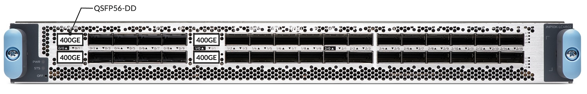

### 100GbE Ports

Different options with native ports only, or with channelized/breakout cables. You can use QSFP28-DD (2x100GbE) or QSFP56-DD (4x100GbE) on ports 0 and 1 of PICs 0 and 1.

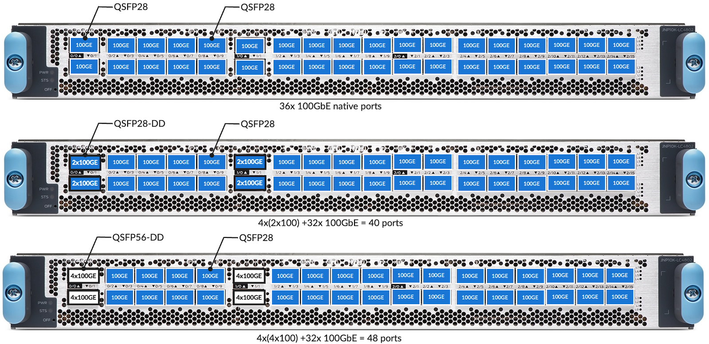

**

### 40GbE, 4x10GbE and 4x25GbE Ports

The QSFP28 ports (basically all ports of an LC4802 except 0/0, 0/1, 1/0, and 1/1) are mapped with 4 lanes/Serdes each to the RT/PHY as presented in Figure 08 below. And we have 8 WAN SerDes between each RT and the forwarding chipset, each RT connects to 4 QSFP ports.

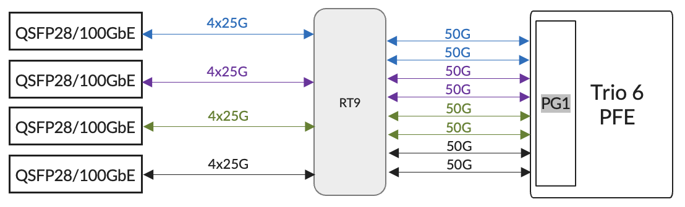

In Example1 illustrated in Figure 08, the 100GbE optics in QSFP-28 ports are connected to the RT/PHY via 4 lanes / SerDes at 25Gbps, and the PHY connects the PFE (Port Group) via two 50Gbps. The PHY acts as a Reverse Gear Box (RGB) for these ports.

For 40GbE / 4x10GbE / 4x25GbE, things are slightly different.

Indeed, for 40GbE and 4x10GbE, the 10Gbps links can not be multiplexed between RT and PFE and require using distinct 10Gbps lanes. Same for the 4x25Gbps, it will require individual 25Gbps links on both sides of the RT.

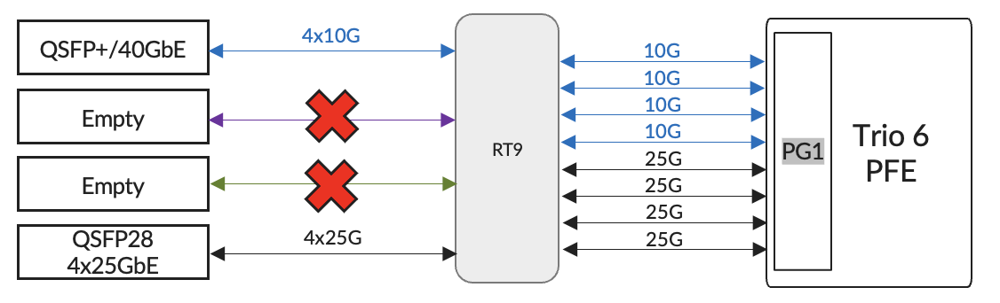

- PIC0 and PIC1: 2/4, 3/5, 6/8, 7/9
- PIC2: 0/2, 1/3, 4/6, 5/7, 8/10, 9/11, 12/14, 13/15

If we insert a port of this type in a pair group, the other port must be disabled (example: In PIC0, if port 6 is used, port 8 is disabled).

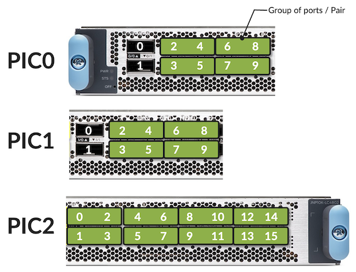

Here are a couple of examples of port distribution in Figure 11.

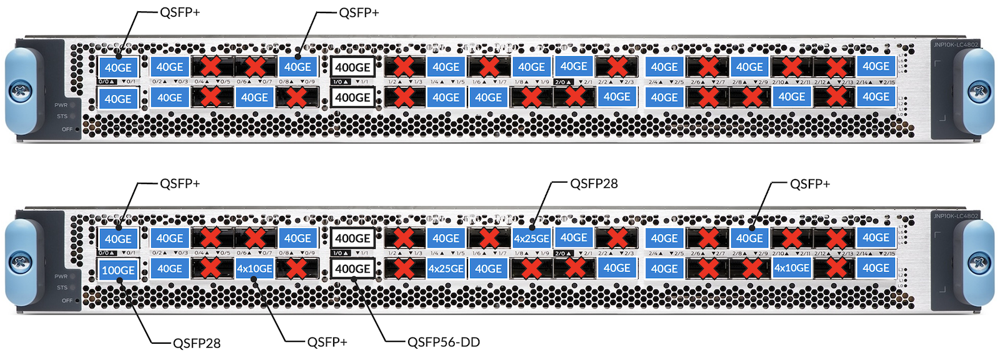

### 10GbE Ports

For 10GbE ports, we have two options: breakout cables 4x10GbE or QSFP-to-SFP Adaptors (QSA) with SFP+ optics.

For the first option, the rules described above are applicable, and for the second, we can leverage all QSFP28 ports but not the 400G/QSFP55-DD ones.

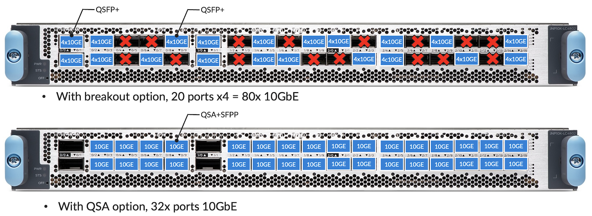

### 1GbE Ports

The only supported option on LC4802 will be the QSA port with SFP optics:

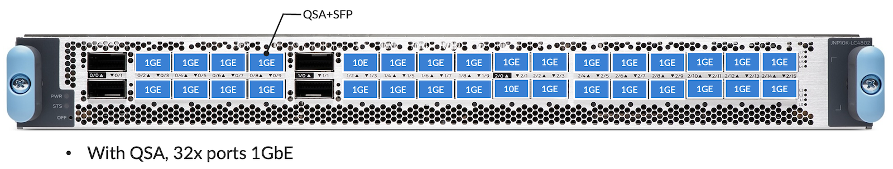

### Default FEC Configuration

The table below summarizes the default FEC (Forwarding Error Correction) configuration for the various port speeds of an LC4802:

| Port Speed | SERDES Lanes | Default FEC Configuration | Comments |
|:--|:--|:--|:--|
| 1GbE | 10Gbps | None | FEC is typically not required for 10Gbps SERDES lanes. |
| 10GbE | 10Gbps | None | FEC is typically not required for 10Gbps SERDES lanes. |
| 40GbE | 4x10Gbps | None | FEC is typically not required for 10Gbps SERDES lanes. |
| 100GbE | 4x25Gbps | RS-FEC91 KR | IEEE 802.3bj Clause 91, RS(528, 514)FEC is enabled by default based on the optics type. |
| 2x50Gbps | RS-FEC91 KP | IEEE 802.3bj Clause 91, RS(544, 514) |  |
| 400GbE | 8x50Gbps | RS-FEC119 KP | IEEE 802.3bs Clause 119, RS(544, 514)FEC is required to be enabled always. |

The following configuration can be used to override the default FEC configuration for an interface.

```
interfaces {
    <IFD Name>
        gigether-options {
            fec <none | fec74 | fec91>;
        }
    }
}
```

### MTU and MRU

The following table gathers the different MTU (Maximum Transmission Unit) and MRU (Maximum Receive Unit) for the different port types.

| Interface Type | MRU | MTU |
|:--|:--|:--|
| Default (Bytes) | Minimum (Bytes) | Maximum (Bytes) |
| 1GbE | 1522 | 256 |
| 10/40/100/400GbE | 1522 | 256 |

## PIC Port Management

The PIC ports of an LC4802 support various speeds. Junos offers port profile configuration where users can select a set of active ports and their port speeds. It provides a way to customize the active ports in a PIC and to handle the PFE oversubscription scenarios.
A port profile selects a set of ports that need to be active in a PIC and the port speed. PIC ports can be configured using the port profiles:

- All the supported ports in 1GbE mode
- All the supported ports in 10GbE mode
- All the supported ports in 40GbE mode
- All the supported ports in 100GbE mode
- All the supported ports in 400GbE mode
- Flexible per-port level configuration for 1/10/25/40/100/400GE mode

The port profiles can be configured at a PIC level as well as at a per-port level. The sub-sections below describe the details of this.

### Port Profile Configuration at PIC Level

This port profile configuration model permits the configuration of the port speed at the PIC level. All ports supporting that port speed will be active by default.

However, this may lead to PFE oversubscription under certain conditions. The number-of-ports CLI configuration command can be used to address these scenarios.

```
chassis {
    fpc <FPC Slot> {
        pic <PIC Slot> {
            pic-mode <1G|10G|25G|40G|100G|400G>;
            number-of-ports <Number Of Active Ports>;
        }
    }
}
```

- The interfaces (i.e. IFDs) will be created only for the active ports.
- Switching between the PIC modes will trigger an automatic PIC bounce.
- Changing the number-of-ports CLI configuration knob will trigger a PIC bounce. Once the PIC becomes online, the interfaces will be created only for the active ports.

### Port Profile Configuration at Port Level

The port profile configuration at the PIC level provides a mechanism to operate all the ports at the same speed. If the operator prefers a flexible per-port level speed configuration, the port profile configuration at the port level can be used.

This port profile configuration model allows the selection of the ports that need to be active in a PIC and the port speed for each one of them. Since the user controls the number of active ports, the PFE oversubscription scenarios can be handled.

The CLI configuration below summarizes the port profile configuration at the port level.

```
chassis {
    fpc <FPC Slot> {
        pic <PIC Slot> {
            port 0 {
                speed <1G|10g|25g|40g|100g|400g>;
            }
            port 1 {
                speed <1G|10g|25g|40g|100g|400g>;
            }
            port 2 {
                speed <1G|10g|25g|40g|100g|400g>;
            }
            ...
            port 15 {
                speed <1G|10g|25g|40g|100g|400g>;
            }
        }
    }
}
```

- Only the ports specified in the CLI configuration will be treated as active ports.
- The interfaces (i.e. IFDs) will be created only for the active ports.
- When a port profile configuration is changed, the interfaces corresponding to the affected ports will be deleted and re-created. There is no need to bounce the PIC or reset the MPC for the port profile configuration changes.

The users can choose to configure a port profile either at the PIC level or the port level for a given PIC. However, the CLI will prevent the commit with an appropriate error message when a port profile is configured at the PIC and port levels simultaneously.

### Number of Sub-Ports Configuration

LC4802 supports the following port speeds:

- 1GbE
- 10GbE
- 4x10GbE
- 4x25GbE
- 40GbE
- 100GbE
- 2x100GbE
- 4x100GbE
- 400GbE

The port profile configuration at PIC level and port level support 1/10/40/100/400GbE speeds using pic-mode and speed. Also, the number of IFDs per physical port can be different when a physical port is channelized.

Hence, the following CLI configuration command can be used to specify the number of IFDs per physical port.

```
chassis {
    fpc <FPC Slot> {
        pic <PIC Slot> {
            port <Port Number> {
                number-of-sub-ports <Number of IFDs>;
            }
        }
    }
}
```

Please note:

- This CLI configuration command can be used with the port profile configuration at the PIC level and port level.
- This CLI configuration command will be effective only when the port speed is 10G, 25G, or 100G.

### Number of Active Ports Configuration

The number-of-ports CLI configuration can be used to specify the number of active ports in a PIC. The following are a few interesting things to note about this CLI knob.

- It can be configured without the port profile configuration at PIC and port levels.
- It can be configured along with the port profile configuration at a PIC level. This is primarily to handle the PFE oversubscription scenarios.
- It cannot be configured along with the port profile configuration at a port level. The CLI will prevent the commit with an appropriate error message for this scenario.

## LC4802 and Fabric Interconnect

To support LC4802, MX10004 and MX10008 require SFB2 switch-fabric boards.  The connectivity principles have been covered in the LC9600 deepdive article, we invite you to refer to it:

[https://juniper.github.io/techposts/mx10000-lc9600-deepdive/article](https://juniper.github.io/techposts/mx10000-lc9600-deepdive/article)

All six fabric boards are needed to provide 4.8Tbps of throughput. There will be a linear drop in performance in the event of fabric card failure.

The table below shows the available bandwidth per LC4802 based on the number of fabric cards in the system (remember: a Trio 6 chipset is made of two PFEs, capable of 800Gbps each)

| Number of active SFB2 | Throughput perLC4802 (Gbps) | Throughput perPFE (Gbps) | Throughput(%) |
|:--|:--|:--|:--|
| 6 | 4,800 | 800 | 100 |
| 5 | 4,140 | 690 | 89 |
| 4 | 3,320 | 552 | 71 |
| 3 | 2,490 | 414 | 53 |
| 2 | 1,660 | 276 | 35 |
| 1 | 829 | 138 | 17 |

To see details about the SFB2 and common components required to power up the LC4802:

```
regress@rtme-mx10k4-01> show chassis hardware | find SFB    
SFB 0            REV 10   750-133199   BCDKxxxx          Switch Fabric Board 2
SFB 1            REV 10   750-133199   BCDKxxxx          Switch Fabric Board 2
SFB 2            REV 10   750-133199   BCDKxxxx          Switch Fabric Board 2
SFB 3            REV 10   750-133199   BCDJxxxx          Switch Fabric Board 2
SFB 4            REV 10   750-133199   BCDKxxxx          Switch Fabric Board 2
SFB 5            REV 10   750-133199   BCDJxxxx          Switch Fabric Board 2

regress@rtme-mx10k4-01>
```

If you try to insert an LC4802 in an MX10008 chassis with first-generation fabric cards, you will see "Offlined due to unsupported fabric":

```
user@router> show chassis fpc 3   
                     Temp  CPU Utilization (%)   Memory    Utilization (%)
Slot State            I  Total  Interrupt      DRAM (MB) Heap     Buffer
  3  Offline         ---Offlined due to unsupported fabric---

user@router>
```

## Turning Off / On the PFE in LC4802

```
chassis {
    fpc <Slot> {
        pfe <PFE Number> {
            power <on | off>;
        }
    }
}
```

This CLI configuration command will be supported only at the Trio 6 ASIC level: the pair of PFE complexes will need to have the same implicit (default) or explicit (using CLI) PFE power ON/OFF configuration. By default, all the PFEs will be powered ON.

As an example, Trio6-0 hosts PFEs 0 and 1, so PFEs 0 and 1 will need to have the same PFE power ON/OFF configuration.

There won't be any CLI commit failure when the CLI configuration is invalid. Instead, an appropriate syslog error message will be displayed, and the CLI configuration command will be ignored.

Changing this CLI configuration will automatically trigger an FPC restart.

## Internal Health-Check

JUNOS supports a data path health check mechanism by default for LC4802 (without any explicit CLI configuration).

The main purpose is to ensure that all the hardware and software components of a PFE are intact for the following data flow types.

- Host inbound and outbound traffic
- Transit traffic over the fabric

Please note that this mechanism doesn't rely on any traffic flow through an LC4802 PFE. Hence, the data path issues will be detected and reported proactively. Also, this mechanism is supported on a PFE basis so that the fault isolation will be on a PFE basis.

The data path health check is divided into the following two parts.

- WAN data path health check
- Fabric data path health check

The WAN data path health check covers the host-bound traffic while the fabric health check covers the transit traffic. We can also configure actions to be taken if/when an FPC error is detected: [https://www.juniper.net/documentation/us/en/software/junos/chassis/topics/topic-map/chassis-guide-tm-fpc-error-config.html ](https://www.juniper.net/documentation/us/en/software/junos/chassis/topics/topic-map/chassis-guide-tm-fpc-error-config.html)

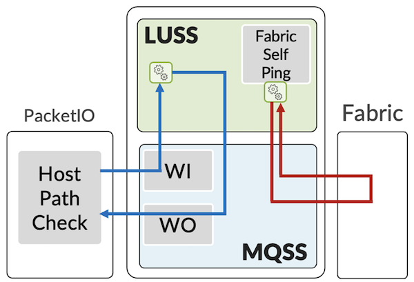

### WAN Data Path Health Check

The PacketIO daemon running on the line card CPU (LCPU) sends the WAN health check packets (with sequence numbers) at 1-second intervals to each of the PFEs. These packets are sent to a MQSS's native 1GE/10GE interface and are subsequently forwarded to LUSS.

LUSS processes these packets and forwards them back to MQSS. In turn, these packets will be enqueued into the XQSS and processed by the XQSS WAN scheduler. At the end, these packets will be forwarded to the PacketIO daemon via MQSS's native 1GE/10GE interface.

The PacketIO daemon keeps track of the packets sent and received using the sequence numbers. If 3 contiguous packets are lost, a PFE wedge will be declared.

### Fabric Data Path Health Check

The LUSS sends the fabric data path health check packets at 50 msec intervals toward the fabric for each of the PFEs. These health check packets are destined to itself and so they are expected to return to the same PFE from the switching fabric.

Similar to the data packets, health check packets are also split into multiple 64B fabric cells and are sprayed across all the active fabric planes. This is to ensure that all the active fabric planes are in error-free condition for the data flow. The packets returned by the switching fabric are processed by LUSS and statistics are maintained for these packets.

The fabric manager software running on the LCPU fetches the statistics for these packets from LUSS periodically. The packet loss for these packets will trigger an appropriate fabric hardening action.

## Conclusion

The LC4802 is the latest addition to the MX10000 portfolio. This new line card is supported on both 4-slot and 8-slot chassis with SFB2 switching fabric is powered by three highly scalable, run-to-completion, ASICs: the Trio 6.

With a total of 4.8 Tbps of forwarding capability, it offers 32x QSFP28 ports from 1GbE to 100GbE and 4 ports QSFP-DD supporting up to 400GbE, completing perfectly the existing LC4800 and LC9600 line cards.

## Acknowledgments

This article is based on Eswaran Srinivasan's work, completed and formatted by Nicolas Fevrier. Thanks to David Roy for the review and comments.

## Glossary/Acronyms

- ASIC: Application-Specific Integrated Circuits
- CLI: Command Line Interface
- FEC: Forwarding Error Correction
- FIB: Forwarding Information Base
- FPC: Flexible PIC Concentrator
- GbE: Gigabit Ethernet
- IFD: Physical Interface
- MQSS: Memory and Queueing Sub-System
- LCPU: Line Card CPU
- LR: Long Reach
- LUSS: Look Up Sub-System
- MPC: Modular Port Concentrator
- MRU: Maximum Receive Unit
- MTU: Maximum Transmission Unit
- NRZ: Non-Return to Zero
- PCB: Printed Circuit Board
- PFE: Packet Forwarding Engine
- PHY: Ethernet transceiver, internal component usually programmed as a Retimer or Reverse GearBox
- PIC: Physical Interface Cards
- PMB: Processor Mezzanine Board
- PPE: Packet Processing Engines
- (Q)SFP-DD: (Quad) Small Form Factor Pluggable Double Density
- RT: Retimer
- SerDes: Serializer/Deserializer
- SFB2: Switch Fabric Card (gen2)
- WAN: Wide Area Network
- ZF: Chipset used in SFB Switch Fabric Cards

## References

- MX10008 Hardware Guide: [https://www.juniper.net/documentation/us/en/hardware/mx10008/index.html](https://www.juniper.net/documentation/us/en/hardware/mx10008/index.html)
- LC4800 Deepdive: [https://juniper.github.io/techposts/mx10000-lc4800-deepdive/article](https://juniper.github.io/techposts/mx10000-lc4800-deepdive/article)
- LC9600 Deepdive: [https://juniper.github.io/techposts/mx10000-lc9600-deepdive/article](https://juniper.github.io/techposts/mx10000-lc9600-deepdive/article)
- Deepdive and Packet walkthrough in Trio6: [https://juniper.github.io/techposts/trio-6-packet-walkthrough/article](https://juniper.github.io/techposts/trio-6-packet-walkthrough/article)
- LC4800 on Juniper.net pathfinder: [https://apps.juniper.net/hct/model/?component=MX10K-LC4800](https://apps.juniper.net/hct/model/?component=MX10K-LC4800)
- FPC Error Management: [https://www.juniper.net/documentation/us/en/software/junos/chassis/topics/topic-map/chassis-guide-tm-fpc-error-config.html](https://www.juniper.net/documentation/us/en/software/junos/chassis/topics/topic-map/chassis-guide-tm-fpc-error-config.html)
