# MX10000 LC9600 Deepdive

**Deepak Tripathi - 06/29/2022**

All you always wanted to know of the newest MX10k line card powered by Trio 6 PFE and optimised for 100GE and 400GE requirements.

## Introduction

Juniper has established itself as a 400G leader with a variety of options for its PTX, ACX, and QFX series products. MX routers with MPC10E and MPC11E already support 400G speed in multi-service edge role on MX240/480/960 and MX2K product family. LC9600 is the latest entry in the MX portfolio, a highly dense 400 Gigabit Ethernet line card with all the flexibility that enables true multi-service edge capability on MX10008 and upcoming MX10004.

## Overview

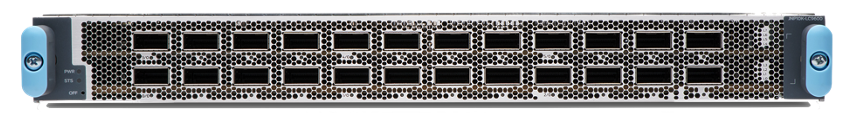

The LC9600 is a fixed layout line card with 24 QSFP-DD ports each capable of delivering a maximum throughput of 400G, without any restriction for ZR and ZR+ optics in any of the optical cages. Each of the 24 ports on LC9600 is capable of supporting 4x100GE breakout. So, LC9600 can have 96x100GE ports with breakout and with the help of CS connectors, it can support 48x100GE ports. The below table summarizes the port speed capability of LC9600

| Port | Port Speed | Optics Type |
|:--|:--|:--|
| 0 to 23 | 4x 10GE | QSFPP-4x10GE |
|  | 4x 25GE | QSFPP-4x25GE |
|  | 40GE | QSFPP-40G |
|  | 100GE | QSFP28 |
|  | 2x 100GE | QSFP28-28 |
|  | 4x 100GE | QSFP56-DD |
|  | 400GE | QSFP56-DD |

At the heart of LC9600 is new Trio 6 chipset, a seven-nanometre (7nm) ASIC with a core clock frequency of 1.2GHz, delivering throughput performance of 1.6Tbps. This is the same Trio powering MX devices for more than a decade, fulfilling the stringiest of requirements from most demanding customers. Trio offers the high scale of loopback filters required for effective DDOS protection or AI/ML-based solutions based on telemetry data exported from sensors enabled at packet forwarding engine level.

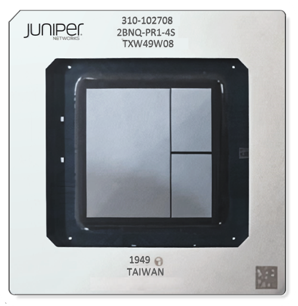

Trio 6 is a true Multi-Service Edge (MSE) silicon suitable for any kind of deployment including, but not limited to, Business Edge, Peering and Broadband Network Gateway services. The service capabilities include inline tunnels, inline monitoring, Jflow, unparalleled in the industry. It has rich queuing and hierarchical quality of service (HQoS) support with 128K queues per Trio 6. An integrated crypto function enables inline MACsec encryption/decryption as per AES-GCM/GMAC cypher for all port speeds with 128/256-bit key length.

Advanced features such as SRv6 or BIER have been supported since Trio 4 when most of them were in infancy. Trio 6 also enables inline wire-speed timestamping to support advanced timing features. With all these features and flexibility, Trio 6 is one of the most power-efficient silicon available in its segment.

## Trio 6 Architecture

Trio 6 is made of two slices, each having its own Packet Forwarding Engine (PFE), delivering up to 800Gbps throughput. A PFE contains an array of Packet Processing Engines (PPEs).

The PPE is an important construct of the Trio ASIC, responsible for all packet processing functions such as parsing, lookup, filtering, classification, and encapsulation. It implements all the next-hops, KTree and firewall instructions. The microcode running on these PPEs controls the order in which the packet will get processed.

It follows a run-to-completion model. Thus, packets stay with one of the PPEs until each task is complete or control is yielded explicitly. PPEs are independent of each other, so they have full control of the packet. Run-to-completion model provides flexibility in the order different actions can be performed on the packet. A PPE is not limited to a particular sequence of actions. This architecture enables all the functions making Trio true edge silicon.

The two slices on Trio 6 have a combination of on-chip and off-chip memories. It uses internal SRAM as on-chip memory (OCPMEM) to implement caches for high bandwidth and low latency accesses to lookup data structures. It helps in reducing the power budget required for frequent read-write operations needed for packet processing.

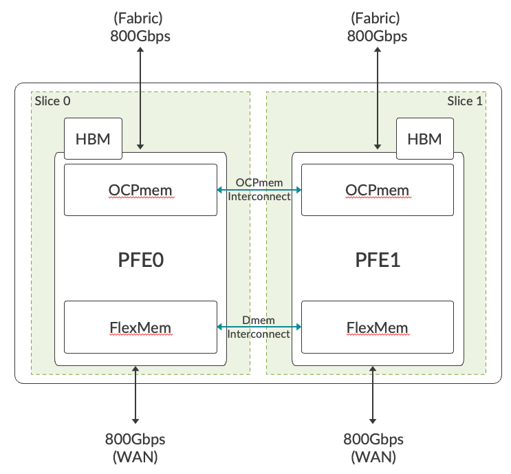

High Bandwidth Memory (HBM) is used as off-chip memory for delay bandwidth buffer, and high scale flow table (Jflow) storage. On-chip (FlexMem) and off-chip (HBM) memories are shared between the two slices. Sharing of processing memory allows a single copy of the Forwarding Information Base (FIB). This architecture offers better resource utilization when both the slices are not using memory equally.

Trio 6 has 36 SerDes (serializer/deserializer) lanes at 56Gbps towards fabric and 32 SerDes lanes towards WAN. Each WAN SerDes can run up to 56Gbps, offering port speeds from 10Gbps to 400Gbps. The ASIC supports inline MACsec encryption/decryption as per AES-GCM/GMAC cypher for all port speeds with 128/256-bit key length.

Internally each slice is built on the following main components:

1. LUSS (Lookup Sub-system) provides all packet processing functions such as route/label lookup, firewall, and multi-field packet classification. This sub-system holds an array of PPEs to perform these functions.
2. MQSS (Memory and Queuing Sub-system) provides data paths and rich queuing functionality. It acts as an interface between WAN and Fabric. It has a pre-classifier where packets are categorized as low/high priority. Unlike initial generations of Trio where an Extended Queuing Sub-System (XQSS) was used to provide queuing functionality, MQSS on Trio 6 integrates this function. It reduces the footprint utilization in the PCB (Printed Circuit Board) and improves the power performance without any compromise on functionality.
3. MCIF (Memory Control Interface) is the interface to HBM and on-chip FlexMem.
4. L_FlexMem (LUSS FlexMem) is a large cache for processing memory.
5. M_FlexMem (MQSS FlexMem) is an on-chip packet buffer.

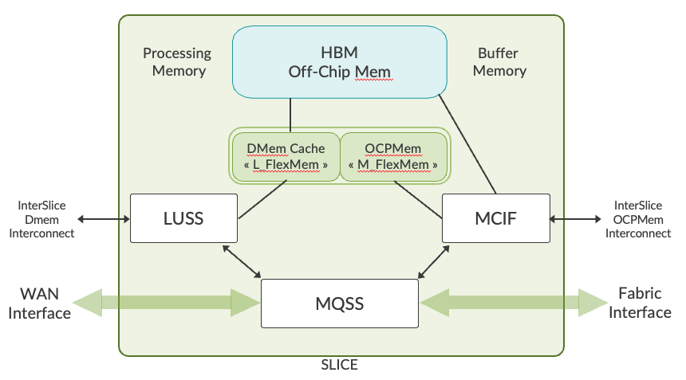

Trio 6 Slice 0 / 1

## Life of Packet inside Trio 6

Here is a high-level view of the life of a packet inside Trio 6

1. A packet is received on the MQSS block either from the WAN or Fabric interface.
2. Pre-classification decides the priority of the packet to make sure that high priority control traffic is protected even if the PFE is oversubscribed.
3. If the incoming packet size is <=224 bytes, the complete packet will be sent to the LUSS. If the incoming packet is > 224 bytes, the packet is split into HEAD (192 bytes) and TAIL. A reorder context and a reorder ID is created. Then, HEAD is sent to LUSS for processing.
4. The tail of the packet is either sent to on-chip SRAM (M_FlexMem) or off-chip HBM.
5. The incoming packet gets processed in the PPEs in LUSS. Once LUSS has finished processing, the modified packet or HEAD is sent back to MQSS. Here reorder entry of the packet is validated and, once it becomes eligible, it is sent to the scheduler.
6. Once the packet becomes eligible to be sent out of PFE, the content will be read from M_FlexMem or HBM and the packet will be sent out via the WAN/Fabric interface.

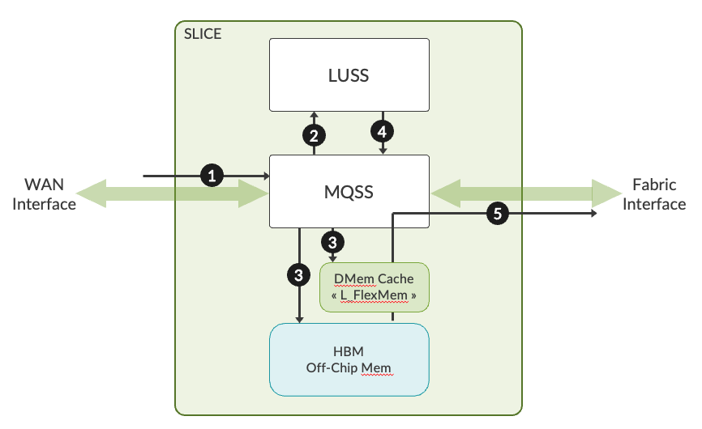

## LC9600 Architecture

Each LC9600 includes 6x Trio 6 ASIC providing a line rate throughput capacity of 9.6Tbps.

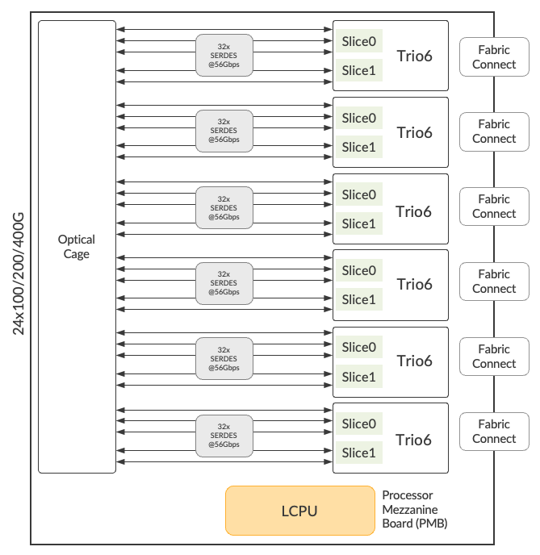

Since each Trio 6 has two PFEs, there will be 12 PFEs per LC9600. This can be seen in the output of the show chassis fpc command:

```
regress@mx-lc9600> show chassis fpc 2 detail 
Slot 2 information:
  State Online 
  Total CPU DRAM 32768 MB
  Total HBM 49152 MB
  FIPS Capable False 
  Temperature 37 degrees C / 98 degrees F
  Start time 2022-03-11 04:19:29 PST
  Uptime 2 days, 18 hours, 40 minutes, 26 seconds
  Max power consumption 1770 Watts
  Operating Bandwidth 9600 G
PFE Information:
  PFE Power ON/OFF Bandwidth SLC
  0 ON 800G 
  1 ON 800G 
  2 ON 800G 
  3 ON 800G 
  4 ON 800G 
  5 ON 800G 
  6 ON 800G 
  7 ON 800G 
  8 ON 800G 
  9 ON 800G 
  10 ON 800G 
  11 ON 800G 
```

The Line Card CPU (LCPU) is installed on a Processor Mezzanine Board (PMB) and provides the standard line card and PFE management functions. Eight core LCPU support the bandwidth requirements of both the control and the data planes. The LCPU runs the control packets and maintains other functions such as:

- LOG, SYSLOG
- SFLOW
- JFLOW
- MACsec key exchanges
- Bandwidth-intensive applications such as protocol session traffic, exception traffic handling, ARP, IPv4/IPv6 options etc.

The WAN section of the LC will implement a 24 port QSFP56-DD line interface with 24 pluggable QSFP56-DD optics. All QSFP56-DD ports will support 400GE optics as the standard configuration. Additionally, 100GE optics via 4x25G NRZ SerDes interface are supported. These ports will also support lower rate standard optic's 40/25/10 GE speeds.

The SerDes lanes between the ASIC and WAN runs at a maximum speed of 56Gbps. Note that based on the length of the SerDes lanes between WAN and ASIC re-timers are added to compensate for the loss of signal.

Each Trio 6 along with 4x QSFP represents one logical PIC (Physical Interface Cards). So LC9600 has a total of six PICs numbering from 0 to 5. Here is the show output that shows the logical PIC status.

```
regress@mx-lc9600> show chassis fpc pic-status 2 
Slot 2 Online JNP10K-LC9600 
  PIC 0 Online MRATE-4xQDD
  PIC 1 Online MRATE-4xQDD
  PIC 2 Online MRATE-4xQDD
  PIC 3 Online MRATE-4xQDD
  PIC 4 Online MRATE-4xQDD
  PIC 5 Online MRATE-4xQDD
```

LC9600 will use port profiles to manage the ports on a PIC.

## PIC Port Management

A port profile selects a set of ports that will be active in a PIC and the port speed. It can be configured at the PIC level and port level. By default, all the ports on LC9600 come up as 400G ports.

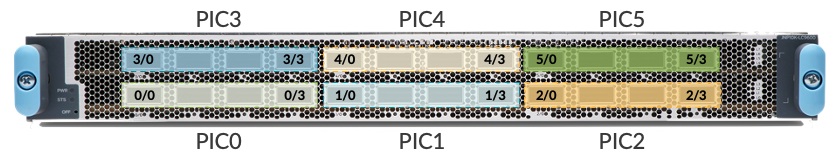

PIC mode configuration model along with number-of-ports allows all the ports in a PIC to run at the same speed. Below config and show output snippet shows pic-mode uses where 400G speed is configured for all the four interfaces of the PIC:

```
regress@mx-lc9600# set chassis fpc 2 pic 5 pic-mode ? 
Possible completions:
  100G                 100GE mode
  10G                  10GE mod
  25G                  25GE mode
  400G                 400GE mode
  40G                  40GE mode
  50G                  50GE mode
regress@mx-lc9600# set chassis fpc 2 pic 5 pic-mode 400G number-of-ports 4 
regress@rtme-mx-61# show chassis fpc 2 pic 5
pic 5 {
    pic-mode 400G;
    number-of-ports 4;
}
power on;
regress@mx-lc9600#run show interfaces et-2/5* | match speed 
  Link-level type: Ethernet, MTU: 9018, MRU: 9026, Speed: 400Gbps, BPDU 
  Link-level type: Ethernet, MTU: 9018, MRU: 9026, Speed: 400Gbps, BPDU
  Link-level type: Ethernet, MTU: 9018, MRU: 9026, Speed: 400Gbps, BPDU 
  Link-level type: Ethernet, MTU: 9018, MRU: 9026, Speed: 400Gbps, BPDU
<Output truncated for the sake of brevity> 
```

If a user prefers to have a flexible per-port level speed configuration, the port profile configuration at the port level can be used. Port profile configuration model allows a user to select the ports that need to be active in a PIC and the port speed. The below example shows the same.

```
regress@mx-lc9600#set chassis fpc 2 pic 4 port 0 speed ? 
Possible completions:
  100g                 Sets the interface mode to 100Gbps
  10g                  Sets the interface mode to 10Gbps
  25g                  Sets the interface mode to 25Gbps
  400g                 Sets the interface mode to 400Gbps
  40g                  Sets the interface mode to 40Gbps
  50g                  Sets the interface mode to 50Gbps
regress@rtme-mx-61# set chassis fpc 2 pic 4 port 0 speed 100g 
regress@rtme-mx-61# show chassis fpc 2 
pic 4 {
    port 0 {
       speed 100g;
    }
power on;
regress@rtme-mx-61# run show interfaces et-2/4/0 | match speed 
Link-level type: Ethernet, MTU: 9018, MRU: 9026, Speed: 100Gbps, BPDU Error: None, Loop Detect PDU Error: None, Loopback: Disabled,
```

The LC9600 on modular MX10008 chassis connects with the newly introduced Switch Fabric Card (SFB2).

## LC9600 and Fabric Interconnect

SFB2 is a new switch-fabric board in the MX10008 platform.

Note: This fabric board will only go into the 8-slot MX10008 chassis.

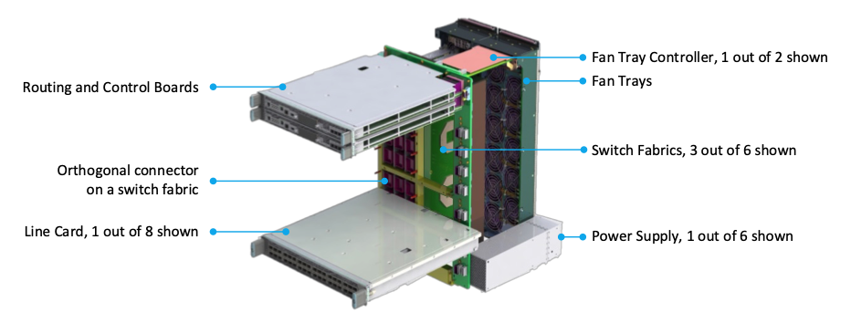

The SFB to line-card connectivity is achieved via orthogonal direct interconnect with horizontal line cards in the front and vertical SFBs in the back. This design eliminates the need for a separate midplane for fabric and line card interconnect. It improves the overall carbon footprint/bit and enables unlimited capacity for the chassis with just fabric and line card upgrades. The chassis design allows for uniform airflow from front to back with the fans pulling the air through perforated faceplates across the system components. More on this has been covered in the hardware guide.

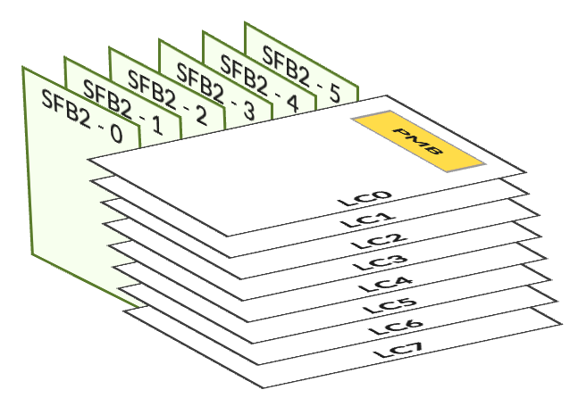

The orthogonal arrangement of the line cards and the SFBs enable fabric signals to go directly from the line cards to SFBs through orthogonal connectors with no backplane. This orthogonal design of the chassis removes any dependency on the backplane.

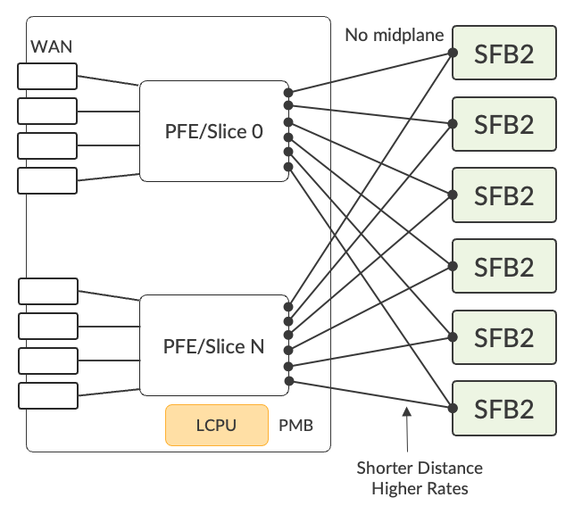

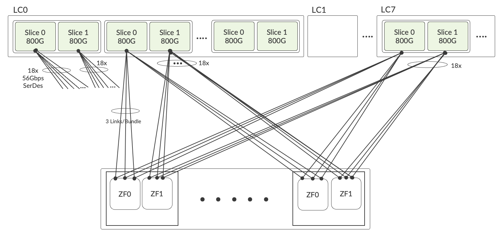

As shown in line card architecture LC9600 has 6x Trio 6 ASICS, which means there are 12 PFEs. Each PFE uses 18 SerDes lanes for fabric connection at 56Gbps. So a total of 36 SerDes from each ASIC.

There are two ZF Chip per fabric board enabling a capacity of 9.6Tbps per line card slot. Each ZF chip in the << LC9600 and SFB2 Interconnect >> diagram above represents one fabric plane, so there will be a total of 12 fabric planes. This is different from the previous generation of fabric where 24 fabric planes were used.

One thing to note: the SFB2 will not have any LEDs as the SFBs sit behind the fan tray, they are not of much use. Instead, the SFB LEDs will be on the fan tray, similar to previous generation SFBs.

All six fabric boards are needed to provide 9.6Tbps of throughput. There will be a linear drop in performance in the event of a fabric card failure.

The table below shows the available bandwidth per LC9600 based on the number of fabric cards in the system

| Number of Fabric Cards | Throughput (Gbps) | Throughput (Percent) |
|:--|:--|:--|
| 6 | 9950 | 100 |
| 5 | 8290 | 89 |
| 4 | 6630 | 71 |
| 3 | 4970 | 53 |
| 2 | 3320 | 35 |
| 1 | 1660 | 17 |

To see details about the SFB2 and common components required to power up LC9600 :

```
regress@mx-lc9600> show chassis hardware | find FPD 

FPD Board        REV 02   711-086964   BCBV5872         Front Panel Display
PEM 0            Rev 03   740-069994   1F21A420xxx  JNP10K 5500W AC/HVDC Power Supply
PEM 1            Rev 03   740-069994   1F21A420xxx  JNP10K 5500W AC/HVDC Power Supply
PEM 2            Rev 03   740-069994   1F21A420xxx  JNP10K 5500W AC/HVDC Power Supply
PEM 3            Rev 03   740-069994   1F21A420xxx  JNP10K 5500W AC/HVDC Power Supply
PEM 4            Rev 03   740-069994   1F21A420xxx  JNP10K 5500W AC/HVDC Power Supply
PEM 5            Rev 03   740-069994   1F21A420xxx  JNP10K 5500W AC/HVDC Power Supply
FTC 0            REV 18   750-083435   BCBV49xx          Fan Controller 8 Enhanced
FTC 1            REV 18   750-083435   BCBV30xx          Fan Controller 8 Enhanced
Fan Tray 0       REV 09   750-103312   BCBT63xx          Fan Tray 8 Enhanced
Fan Tray 1       REV 09   750-103312   BCBT62xx          Fan Tray 8 Enhanced
SFB 0            REV 11   750-116523   BCCH77xx          Switch Fabric Board 2
SFB 1            REV 11   750-116523   BCCH76xx          Switch Fabric Board 2
SFB 2            REV 11   750-116523   BCCH77xx          Switch Fabric Board 2
SFB 3            REV 11   750-116523   BCCH77xx          Switch Fabric Board 2
SFB 4            REV 11   750-116523   BCCH77xx          Switch Fabric Board 2
SFB 5            REV 11   750-116523   BCCH77xx          Switch Fabric Board 2
regress@mx-lc9600> show chassis fabric summary
Plane   State    Uptime
 0      Online   18 hours, 2 minutes, 17 seconds
 1      Online   18 hours, 1 minute, 40 seconds
 2      Online   18 hours, 1 minute, 4 seconds
 3      Online   18 hours, 27 seconds
 4      Online   17 hours, 59 minutes, 49 seconds
 5      Online   17 hours, 59 minutes, 9 second
```

Since investment protection is one of the big concerns for a customer when introducing new products, the PPE software model of Trio 6 is backwards compatible with previous Trio implementations. This ensures that Trio 6 based line cards will interoperate with the shipping Trio-based line cards, like LC480 and LC2101 on MX10008 and MX10004.

Similarly, SFB2 will support the previous generation line cards LC2101 and LC480, along with the new Trio 6-based LC9600 line cards. All the investments made on MX10008 will remain protected.

Note: A mix of Gen1 SFB and ZF based SFB2 is not supported.

If a mix of SFB types is attempted to be brought up in the chassis, the first SFB that comes up online will determine the fabric personality of the chassis. The SFBs of any other type will not be brought up online. An example of an SCB rejected by the chassis can be seen below:

```
regress@mx-lc9600> show chassis fpc 3   
Temp  CPU Utilization (%)   Memory    Utilization (%)
Slot State            I  Total  Interrupt      DRAM (MB) Heap     Buffer
3  Offline         ---Offlined due to unsupported fabric---
regress@mx-lc9600>
```

Thus by upgrading the fabric card (SFB2) along with already shipping power supply JNP10K-PWR-AC2/DC2 and Fan tray (JNP10K-FTC2), customers will have all three line cards, offering 1GE up to 400GE in a single chassis. The same has been explained in the below tables.

| MX10008 | JNP10K-RE1 | MX10008-SFB | MX10008-SFB2 | JNP10K-PWR-AC/DC | JNP10K-PWR-AC2/DC2 |
|:--|:--|:--|:--|:--|:--|
| LC2101+LC480 | Y | Y | Y | Y | Y |
| LC2101+LC480+LC9600 | Y | N | Y | N | Y |

| MX10004 | JNP10K-RE | MX10004-SFB2 | JNP10K-PWD-AC2/DC2 |
|:--|:--|:--|:--|
| LC2101+LC480+LC9600 | Y | Y | Y |

Please note that SFB2 and LC9600 line cards will be powered "ON" only in the presence of JNP10K-PWR-AC2/DC2 and JNP10K-FTC2. If compatible Fan trays and power supplies are not present, the SFB2 and LC9600 LC will be kept in an offline state.

Below is an example of a chassis with all three line cards installed in an MX10008.

```
regress@mx-lc9600> show chassis hardware
Hardware inventory:
Item             Version  Part number  Serial number     Description
Chassis                                ET578             JNP10008 [MX10008]
Midplane         REV 16   750-086802   BCBVxxxx          Midplane 8
Routing Engine 0          BUILTIN      BUILTIN           RE X10
Routing Engine 1          BUILTIN      BUILTIN           RE X10
CB 0             REV 19   750-079562   BCBVxxxx          Control Board
CB 1             REV 19   750-079562   BCBVxxxx          Control Board
FPC 0            REV 20   750-084779   BCBVxxxx          JNP10K-LC2101
  CPU            REV 09   750-073391   BCBTxxxx          LC 2101 PMB
  PIC 0                   BUILTIN      BUILTIN           4xQSFP28 SYNCE
    Xcvr 1       REV 01   740-061409   1GTQA50303E       QSFP-100GBASE-LR4-T2
    Xcvr 3       REV 01   740-061409   1G3TQAA61507Y     QSFP-100GBASE-LR4-T2
  PIC 1                   BUILTIN      BUILTIN           4xQSFP28 SYNCE
    Xcvr 2       REV 01   740-061409   1GTQA50105A       QSFP-100GBASE-LR4-T2
  PIC 2                   BUILTIN      BUILTIN           4xQSFP28 SYNCE
  PIC 3                   BUILTIN      BUILTIN           4xQSFP28 SYNCE
  PIC 4                   BUILTIN      BUILTIN           4xQSFP28 SYNCE
  PIC 5                   BUILTIN      BUILTIN           4xQSFP28 SYNCE
FPC 1            REV 20   750-084779   BCBVxxxx          JNP10K-LC2101
  CPU            REV 09   750-073391   BCBTxxxx          LC 2101 PMB
  PIC 0                   BUILTIN      BUILTIN           4xQSFP28 SYNCE
    Xcvr 0       REV 01   740-061405   1ECQ11xxxxx       QSFP-100G-SR4-T2
    Xcvr 1       REV 01   740-061409   1GTQA5xxxxx       QSFP-100GBASE-LR4-T2
    Xcvr 2       REV 01   740-058734   1F1CQ1A61xxxx     QSFP-100GBASE-SR4
    Xcvr 3       REV 01   740-058734   1A3CQ1A54xxxx     QSFP-100GBASE-SR4
  PIC 1                   BUILTIN      BUILTIN           4xQSFP28 SYNCE
    Xcvr 0       REV 01   740-058734   1F1CQ1A6xxxx     QSFP-100GBASE-SR4
    Xcvr 1       REV 01   740-058734   1ACQ110xxxx       QSFP-100GBASE-SR4
    Xcvr 2       REV 01   740-061405   1ECQ132xxxx       QSFP-100G-SR4-T2
  PIC 2                   BUILTIN      BUILTIN           4xQSFP28 SYNCE
  PIC 3                   BUILTIN      BUILTIN           4xQSFP28 SYNCE
  PIC 4                   BUILTIN      BUILTIN           4xQSFP28 SYNCE
  PIC 5                   BUILTIN      BUILTIN           4xQSFP28 SYNCE
FPC 2            REV 27   750-114437   BCCHxxxx          JNP10K-LC9600
  CPU            REV 04   750-116519   BCCHxxxx          JNP10K-LC9600 PMB
  PIC 0                   BUILTIN      BUILTIN           MRATE-4xQDD

    Xcvr 0       REV 01   740-085351   1W1CZ7A51xxxx     QSFP56-DD-400GBASE-DR4
    Xcvr 1       REV 01   740-085351   1W1CZ7A51xxxx     QSFP56-DD-400GBASE-DR4
    Xcvr 2       REV 01   740-085351   1W1CZ7A51xxxx     QSFP56-DD-400GBASE-DR4
    Xcvr 3       REV 01   740-085351   1W2CZ7A60xxxx     QSFP56-DD-400GBASE-DR4
  PIC 1                   BUILTIN      BUILTIN           MRATE-4xQDD
    Xcvr 0       REV 01   740-085351   1W2CZ7A60xxxx     QSFP56-DD-400GBASE-DR4
    Xcvr 1       REV 01   740-085351   1W1CZ7A51xxxx     QSFP56-DD-400GBASE-DR4
    Xcvr 2       REV 01   740-085351   1W2CZ7A60xxxx     QSFP56-DD-400GBASE-DR4
    Xcvr 3       REV 01   740-085351   1W1CZ7A51xxxx     QSFP56-DD-400GBASE-DR4
  PIC 2                   BUILTIN      BUILTIN           MRATE-4xQDD
    Xcvr 0       REV 01   740-085351   1W2CZ7A60xxxx     QSFP56-DD-400GBASE-DR4
    Xcvr 1       REV 01   740-085351   1W2CZ7A60xxxx     QSFP56-DD-400GBASE-DR4
    Xcvr 2       REV 01   740-085351   1W2CZ7A60xxxx     QSFP56-DD-400GBASE-DR4
    Xcvr 3       REV 01   740-085351   1W2CZ7A61xxxx     QSFP56-DD-400GBASE-DR4
  PIC 3                   BUILTIN      BUILTIN           MRATE-4xQDD
    Xcvr 0       REV 01   740-085351   1W2CZ7A61xxxx     QSFP56-DD-400GBASE-DR4
    Xcvr 1       REV 01   740-085351   1W2CZ7A61xxxx     QSFP56-DD-400GBASE-DR4
    Xcvr 2       REV 01   740-085351   1W1CZ7A51xxxx     QSFP56-DD-400GBASE-DR4
    Xcvr 3       REV 01   740-085351   1W1CZ7A51xxxx     QSFP56-DD-400GBASE-DR4
  PIC 4                   BUILTIN      BUILTIN           MRATE-4xQDD
    Xcvr 0       REV 01   740-085351   1W2CZ7A60xxxx     QSFP56-DD-400GBASE-DR4
    Xcvr 1       REV 01   740-085351   1W2CZ7A60xxxx     QSFP56-DD-400GBASE-DR4
    Xcvr 2       REV 01   740-085351   1W1CZ7A51xxxx     QSFP56-DD-400GBASE-DR4
    Xcvr 3       REV 01   740-085351   1W1CZ7A51xxxx     QSFP56-DD-400GBASE-DR4
  PIC 5                   BUILTIN      BUILTIN           MRATE-4xQDD
    Xcvr 0       REV 01   740-085351   1W2CZ7A60xxxx     QSFP56-DD-400GBASE-DR4
    Xcvr 1       REV 01   740-085351   1W2CZ7A60xxxx     QSFP56-DD-400GBASE-DR4
    Xcvr 2       REV 01   740-085351   1W1CZ7A51xxxx     QSFP56-DD-400GBASE-DR4
    Xcvr 3       REV 01   740-085351   1W2CZ7A60xxxx     QSFP56-DD-400GBASE-DR4
  Mezz           REV 08   711-114174   BCCHxxxx          JNP10K-LC9600-Mezz
FPC 3            REV 13   750-106763   BCBZxxxx          JNP10K-LC480
  CPU            REV 06   750-114922   BCBZxxxx          LC PMB
  PIC 0                   BUILTIN      BUILTIN           24xSFPP 1/10GE PIC
    Xcvr 0       REV 01   740-021308   ALDxxxx           SFP+-10G-SR
    Xcvr 1       REV 01   740-031981   45T01240xxxx      SFP+-10G-LR
    Xcvr 2       REV 01   740-031981   UHPxxxx           SFP+-10G-LR
    Xcvr 3       REV 01   740-031981   45T01240xxxx      SFP+-10G-LR
    Xcvr 4       REV 01   740-031981   45T01240xxxx      SFP+-10G-LR
    Xcvr 5       REV 01   740-031981   45T01240xxxx      SFP+-10G-LR
    Xcvr 6       REV 01   740-031981   45T01240xxxx      SFP+-10G-LR
    Xcvr 7       REV 01   740-021309   T09G9xxxx         SFP+-10G-LR
    Xcvr 8       REV 01   740-031980   A44xxxx           SFP+-10G-SR
    Xcvr 16               NON-JNPR     ONT1638xxxx       SFP+-10G-LR
  PIC 1                   BUILTIN      BUILTIN           24xSFPP 1/10GE PIC
    Xcvr 0                NON-JNPR     MWDxxxx           DUAL-SFP+-SR/SFP-SX
    Xcvr 1                NON-JNPR     MWGxxxx           DUAL-SFP+-SR/SFP-SX
    Xcvr 3       REV 01   740-021308   AA1025Axxxx       SFP+-10G-SR
    Xcvr 4                NON-JNPR     ARSxxxx           DUAL-SFP+-SR/SFP-SX
FPD Board        REV 02   711-086964   BCBVxxxx          Front Panel Display
PEM 0            Rev 03   740-069994   1F21A42xxxx       JNP10K 5500W AC/HVDC Power Supply
PEM 1            Rev 03   740-069994   1F21A42xxxx       JNP10K 5500W AC/HVDC Power Supply
PEM 2            Rev 03   740-069994   1F21A42xxxx       JNP10K 5500W AC/HVDC Power Supply
PEM 3            Rev 03   740-069994   1F21A42xxxx       JNP10K 5500W AC/HVDC Power Supply
PEM 4            Rev 03   740-069994   1F21A42xxxx       JNP10K 5500W AC/HVDC Power Supply
PEM 5            Rev 03   740-069994   1F21A42xxxx       JNP10K 5500W AC/HVDC Power Supply
FTC 0            REV 18   750-083435   BCBVxxxx          Fan Controller 8 Enhanced
FTC 1            REV 18   750-083435   BCBVxxxx          Fan Controller 8 Enhanced
Fan Tray 0       REV 09   750-103312   BCBTxxxx          Fan Tray 8 Enhanced
Fan Tray 1       REV 09   750-103312   BCBTxxxx          Fan Tray 8 Enhanced
SFB 0            REV 11   750-116523   BCCHxxxx          Switch Fabric Board 2
SFB 1            REV 11   750-116523   BCCHxxxx          Switch Fabric Board 2
SFB 2            REV 11   750-116523   BCCHxxxx          Switch Fabric Board 2
SFB 3            REV 11   750-116523   BCCHxxxx          Switch Fabric Board 2
SFB 4            REV 11   750-116523   BCCHxxxx          Switch Fabric Board 2
SFB 5            REV 11   750-116523   BCCHxxxx          Switch Fabric Board 20
```

## Acknowledgement

I would like to express my gratitude to my mentor Nicolas Fevrier, Sr. Director, PLM, for the detailed reviews of the blog. I would also like to thank Eswaran Srinivasan, Distinguished Engineer and Yasmin Lara, TME Manager for providing their valuable inputs.

## Glossary/Acronyms

- FIB: Forwarding Information Base
- HBM: High Bandwidth Memory
- LCPU: Line Card CPU
- LUSS: Lookup Sub-System
- MCIF: Memory Control Interface
- MPC: Modular Port Concentrator
- MQSS: Memory and Queuing Sub-System:
- NRZ: Non-Return to Zero
- PCB: Printed Circuit Board
- PFE: Packet Forwarding Engine
- PIC: Physical Interface Cards
- PMB: Processor Mezzanine Board
- PPE: Packet Processing Engines
- QSFP-DD: Quad Small Form Factor Pluggable Double Density
- SerDes: Serializer/Deserializer
- SRAM: Static Random Access Memory
- OCPMem: On-Chip Memory
- SFB2: Switch Fabric Card (gen2)
- XQSS: Extended Queuing Sub-System
- ZF: Chipset used in SFB Switch Fabric Cards

## References

- MX10008 Hardware Guide: [https://www.juniper.net/documentation/us/en/hardware/mx10008/index.html](https://www.juniper.net/documentation/us/en/hardware/mx10008/index.html)
- [https://blogs.juniper.net/en-us/service-provider-transformation/juniper-introduces-new-trio-6-based-mx-portfolio](https://blogs.juniper.net/en-us/service-provider-transformation/juniper-introduces-new-trio-6-based-mx-portfolio)
- [https://www.techtarget.com/searchnetworking/news/252512454/Juniper-announces-routers-line-card-using-new-Trio-6-ASIC](https://www.techtarget.com/searchnetworking/news/252512454/Juniper-announces-routers-line-card-using-new-Trio-6-ASIC)
- [https://blogs.juniper.net/en-us/service-provider-transformation/juniper-introduces-new-trio-6-based-mx-portfolio](https://blogs.juniper.net/en-us/service-provider-transformation/juniper-introduces-new-trio-6-based-mx-portfolio)
