# MX304 Deepdive

**Reema Ray - 03/28/2023**


A detailed review of the latest router of the MX Series. Powered by Trio6 PFE, it offers unique form-factor and modularity, with interface spanning from 1GE to 400GE and control-plane redundancy.

## Introduction

The Juniper MX304 is the latest addition to the MX Portfolio: a unique combination of compact form-factor, bandwidth modularity, control-plane redundancy, and interface diversity.

Powered by Trio6 Packet Forwarding Engines (PFEs), it guarantees the highest multi-dimensional scales and advanced programmability to address the most demanding roles in your network: Multi-Service Edge, Provider Edge, Enterprise Edge, VPC Gateway and Peering Router to name a few. Also, it can play a key role in disaggregated and distributed broadband networks where a transition from large modular systems to compact form-factor is required.

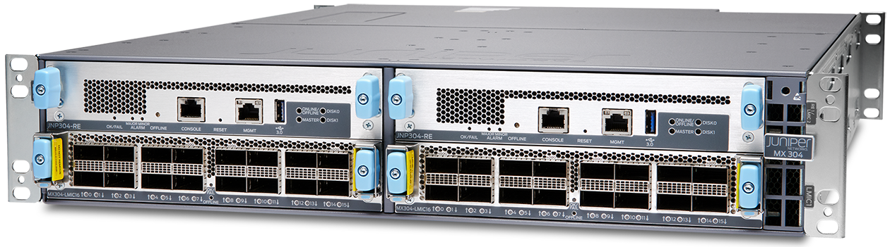

The MX304 key characteristics are:

- Its compact form-factor: 2RU and 610mm depth
- Its power efficiency: ~0.29W/Gbps
- Its large range of interface speed: from 1GE, 10GE, 25GE, 40GE, 50GE, 100GE, 400GE
- Its modularity to match the required forwarding bandwidth, from 1.6Tbps to 4.8Tbps
- The control-plane redundancy with the capability of using two Routing Engines
- The support of Class-C timing and MACsec encryption on all ports (except 1GE at the moment of the publication of this article)
- The diversity of power source: AC, DC, HVAC/HVDC

Let's take a closer look the hardware.

## High-Level Description

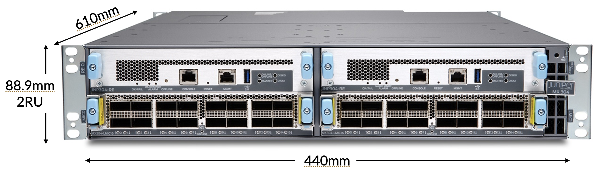

The chassis dimensions and weight:

| Height | Width | Depth | Net Weight |
|:--|:--|:--|:--|
| 88.9mm3.5in | 440mm17.3in | 610mm24in | 3 Fan Trays + 2 PSUs + 2 RE + 2 PICs ~ 30 kg3 Fan Trays + 2 PSUs + 1 RE + 3 PICs) ~ 31.25 kg |

### Front View

On the front, the MX304 offers 4 slots for Routing Engines (REs) and/or Line Cards (LMICs).

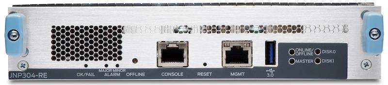

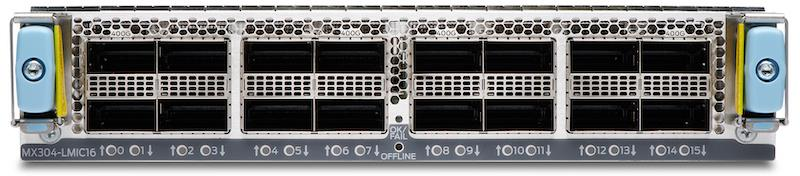

An LMIC is a 16 ports line cards with 1.6Tbps forwarding capability.

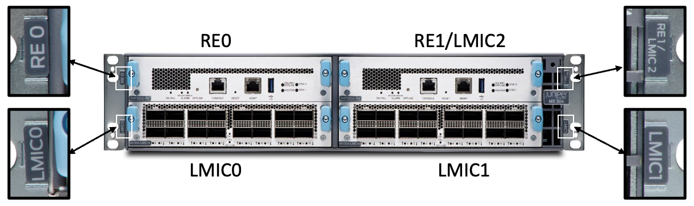

- Top Left is always occupied by an RE: RE0
- Top Right can be empty or occupied by:


An LMIC: LMIC2
Or a RE: RE1
- Bottom Left can be empty or occupied by an LMIC: LMIC0
- Bottom Right can be empty or occupied by an LMIC: LMIC1

To put it differently, the MX304 supports the combination of one or two REs, and one, two or three LMICs with the following conditions: up to 4 cards and max 2 REs.

That's why the forwarding capability will be:

- 1.6Tbps with one LMIC and one or two REs
- 3.2Tbps with two LMICs and one or two REs
- 4.8Tbps with three LMICs and a single RE

Two examples to illustrate it:

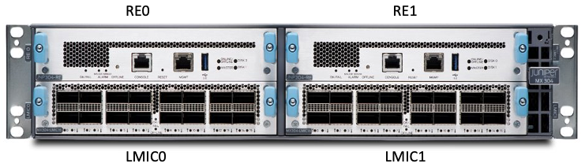

In this first example, we see an MX304 front view with 2x REs and 2xLMICs (3.2Tbps forwarding capacity).

```
root@mx304> show chassis hardware 
Hardware inventory:
Item             Version  Part number  Serial number     Description
Chassis                                FQxxx             JNP304 [MX304]
Routing Engine 0 REV 11   750-123749   BCDAxxxx          RE 2700 8C 128G
Routing Engine 1 REV 11   750-123749   BCDAxxxx          RE 2700 8C 128G
CB 0             REV 30   750-123404   BCDAxxxx          Control Board
FPC 0                     BUILTIN      BUILTIN           FPC-BUILTIN
  CPU            REV 10   750-122877   BCCXxxxx          JNP304 PMB
  PIC 0          REV 21   750-122718   BCDBxxxx          MRATE LMIC 16x100G/4x400G
    Xcvr 0       REV 01   740-124447   101xxx            QSFP56-DD-LPBK
  PIC 1          REV 21   750-122718   BCDBxxxx          MRATE LMIC 16x100G/4x400G
    Xcvr 0       REV 01   740-124447   101xxx            QSFP56-DD-LPBK
   PEM 0            Rev 02   740-110419   1F27C05xxxx       AC AFO 2200W Power Supply
PEM 1            Rev 02   740-110419   1F27C05xxxx       AC AFO 2200W Power Supply
Fan Tray 0       REV 04   760-126744   BCDDxxxx          JNP304 Fan Tray, Front to Back Airflow
Fan Tray 1       REV 04   760-126744   BCDDxxxx          JNP304 Fan Tray, Front to Back Airflow
Fan Tray 2       REV 04   760-126744   BCDDxxxx          JNP304 Fan Tray, Front to Back Airflow
SFB 0            REV 08   750-122847   BCCWxxxx          Switch Fabric Board
TIB              REV 06   750-126514   BCCWxxxx          Timing Interface Board
```

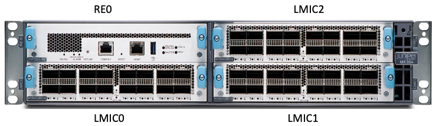

In this second example, we have an MX304 with a single RE (no control plane redundancy) and 3x LMICs for a total of 4.8Tbps.

```
root@mx304> show chassis hardware 
Hardware inventory:
Item             Version  Part number  Serial number     Description
Chassis                                FQxxx             JNP304 [MX304]
Routing Engine 0 REV 11   750-123749   BCDAxxxx          RE 2700 8C 128G
CB 0             REV 30   750-123404   BCDAxxxx          Control Board
FPC 0                     BUILTIN      BUILTIN           FPC-BUILTIN
  CPU            REV 10   750-122877   BCCXxxxx          JNP304 PMB
  PIC 0          REV 21   750-122718   BCDBxxxx          MRATE LMIC 16x100G/4x400G
    Xcvr 0       REV 01   740-124447   101xxx            QSFP56-DD-LPBK
  PIC 1          REV 21   750-122718   BCDBxxxx          MRATE LMIC 16x100G/4x400G
    Xcvr 0       REV 01   740-124447   101xxx            QSFP56-DD-LPBK
  PIC 2          REV 21   750-122718   BCDBxxxx          MRATE LMIC 16x100G/4x400G
    Xcvr 0       REV 01   740-124447   198xxx            QSFP56-DD-LPBK
   PEM 0            Rev 02   740-110419   1F27C05xxxx       AC AFO 2200W Power Supply
PEM 1            Rev 02   740-110419   1F27C05xxxx       AC AFO 2200W Power Supply
Fan Tray 0       REV 04   760-126744   BCDDxxxx          JNP304 Fan Tray, Front to Back Airflow
Fan Tray 1       REV 04   760-126744   BCDDxxxx          JNP304 Fan Tray, Front to Back Airflow
Fan Tray 2       REV 04   760-126744   BCDDxxxx          JNP304 Fan Tray, Front to Back Airflow
SFB 0            REV 08   750-122847   BCCWxxxx          Switch Fabric Board
TIB              REV 06   750-126514   BCCWxxxx          Timing Interface Board
```

### Back View

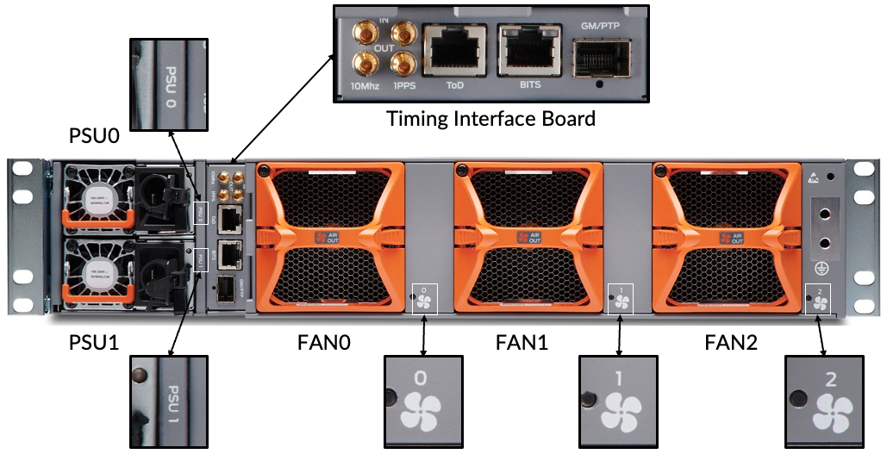

## Hardware Deepdive

Let's start with the Field Replaceable parts (FRUs): Routing Engine, LMIC, Fans and Power units.

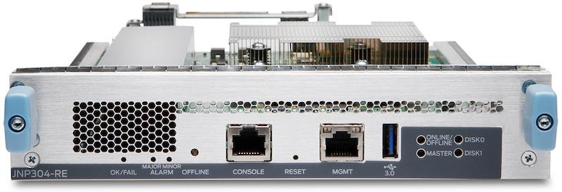

The Routing Engine JNP304-RE is a hot-pluggable and redundant card that can be inserted in the top row slots, left and/or right.

On the front panel, from left to right, you have access to:

- Alarm LEDs (MAJOR/MINOR)
- An OFFLINE push button
- A console port
- A RESET push button
- An RJ45 Management Ethernet port
- A gen3 USB port
- Other LEDs

The RE card hosts a powerful Intel Ice Lake CPU (8 cores at 2.7GHz) and 128GB of RAM.

It also contains two 200GB SATA SSD modules, and a TPM2.0 module for DevID installation.

```
regress@rtme-mx304-01> show chassis routing-engine 0
Routing Engine status:
  Slot 0:
    Current state                  Master
    Election priority              Master (default)
    Temperature                 53 degrees C / 127 degrees F
    CPU temperature             51 degrees C / 123 degrees F
    DRAM                      98248 MB (98304 MB installed)
    Memory utilization           4 percent
    5 sec CPU utilization:
      User                      14 percent
      Background                 0 percent
      Kernel                     8 percent
      Interrupt                  1 percent
      Idle                      77 percent
    1 min CPU utilization:
      User                      14 percent
      Background                 0 percent
      Kernel                     8 percent
      Interrupt                  1 percent
      Idle                      76 percent
    5 min CPU utilization:
      User                      15 percent
      Background                 0 percent
      Kernel                     8 percent
      Interrupt                  1 percent
      Idle                      76 percent
    15 min CPU utilization:
      User                      15 percent
      Background                 0 percent
      Kernel                     8 percent
      Interrupt                  1 percent
      Idle                      76 percent
    Model                          RE 2700 8C 128G
    Serial ID                      BCDCxxxx
    Start time                     2023-03-20 09:12:20 PDT
    Uptime                         3 days, 17 hours, 27 seconds
    Last reboot reason             0x4000:VJUNOS reboot
    Load averages:                 1 minute   5 minute  15 minute
                                       2.89       3.04       3.08


regress@rtme-mx304-01> show chassis routing-engine 1
Routing Engine status:
  Slot 1:
    Current state                  Backup
    Election priority              Backup (default)
    Temperature                 53 degrees C / 127 degrees F
    CPU temperature             52 degrees C / 125 degrees F
    DRAM                      98250 MB (98304 MB installed)
    Memory utilization           3 percent
    5 sec CPU utilization:
      User                       0 percent
      Background                 0 percent
      Kernel                     0 percent
      Interrupt                  0 percent
      Idle                     100 percent
    Model                          RE 2400 8C 128G
    Serial ID                      BCDAxxxx
    Start time                     2023-02-14 11:57:26 PST
    Uptime                         37 days, 13 hours, 16 minutes, 34 seconds
    Last reboot reason             0x1:power cycle/failure
    Load averages:                 1 minute   5 minute  15 minute
                                       0.06       0.11       0.09

regress@rtme-mx304-01>


```

RE0 is by default "Primary RE", however this behavior can be changed via election priority configuration.

### Line Card: LMIC

To date, the MX304-LMIC16 is the only line card supported in the MX304 router.

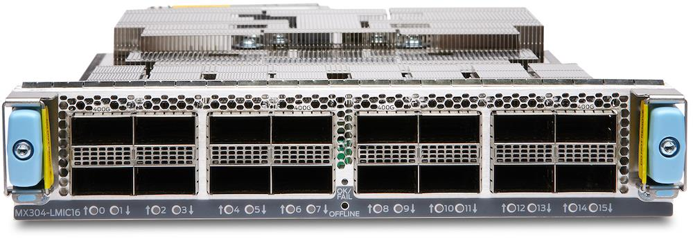

We can position them in slots LMIC0, LMIC1 and LMIC2, offering flexibility on the port density depending on your needs.

LMIC proposes 16 QSFP ports up to 400GE, for a total bandwidth of 1.6Tbps. They are connected to the rest of the line cards and RE via a fabric board, internal to the chassis.

On the LMIC board, you'll find ethernet port cages (QSFP), multiple PHYs / GearBoxes and a single Trio 6 chipset.

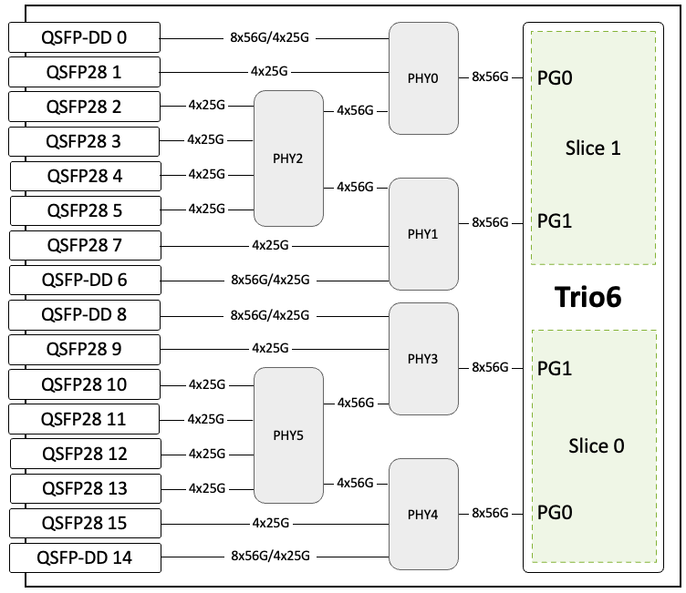

The 6x PHYs are used for SERDES adaptation (from 56Gbps PAM4 to 25Gbps NRZ).

We invite you to read Deepak's article on Trio 6 architecture and packet processing in the MX10000 LC9600 Deepdive: [https://juniper.github.io/techposts/mx10000-lc9600-deepdive/article](https://juniper.github.io/techposts/mx10000-lc9600-deepdive/article)

The ports on the front of an LMIC are numbered from 0 to 15 and each port has a LED for interface up/down indication (note: Channel LED is not supported).

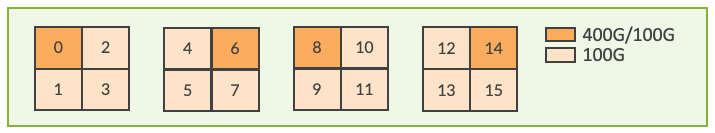

Each quad of 4 ports is associated to a WAN Port Group (PG). A PG has 8 SerDes (Serializer/Deserializer) lines, which can operate at various speed up to 56Gbps. Hence the maximum throughput of 400Gbps (8x56) per Port Group.

The Trio 6 is divided in two slices capable of 800Gbps each. Two PGs are associated to a slice and two slices are present in a Trio 6 PFE. That gives us 4 Port Groups per Trio 6 and therefore, per LMIC with the following mapping:

|  | PFE Id | Ports |
|:--|:--|:--|
| Slice 1 Port Group 0 | 1 | 0, 1, 2, 3 |
| Slice 1 Port Group 1 | 0 | 4, 5, 6, 7 |
| Slice 0 Port Group 1 | 3 | 8, 9, 10, 11 |
| Slice 0 Port Group 0 | 2 | 12, 13, 14, 15 |

On the block diagram presented above, you'll notice 6x GearBoxes or "PHY" (for PHYsical Layer device). Interesting to note a difference for ports:

- 0, 1, 6, 7, 8, 9, 14 and 15: have one single PHY towards the PFE
- 2, 3, 4, 5, 10, 11, 12 and 13: have two PHYs towards the PFE

This arrangement is done solely to provide the wide range of interface speed config options at the same time to save the power.

### Fan Modules

We have 3 Fan Tray modules per MX304 chassis, each Fan Tray is made of a dual rotor and 80mm x 80mm fans. If one rotor fails, the cooling is guaranteed.

The module specifications are the following:

- Air Flow 164 CFM Max
- 13500 RPM Max at Inlet Rotor
- 11500 RPM Max at Outlet Rotor
- Chassis airflow direction: front to back
- Default fan speed is 30% of Max Fan Speed
- NEBS Compliant

```
root@mx304> show chassis fan 
      Item                      Status   % RPM     Measurement
      Fan Tray 0 Fan 0          OK       31%       3150 RPM                 
      Fan Tray 0 Fan 1          OK       34%       3900 RPM                 
      Fan Tray 1 Fan 0          OK       31%       3000 RPM                 
      Fan Tray 1 Fan 1          OK       34%       4050 RPM                 
      Fan Tray 2 Fan 0          OK       31%       3000 RPM                 
      Fan Tray 2 Fan 1          OK       34%       3900 RPM

root@mx304> show chassis environment fan 
Hot Swap  status:
         HS 0                       12048 mV     491 mA    3828 mW
         HS 1                       11982 mV    1141 mA    6621 mW
         HS 2                       11942 mV     372 mA    1955 mW
```

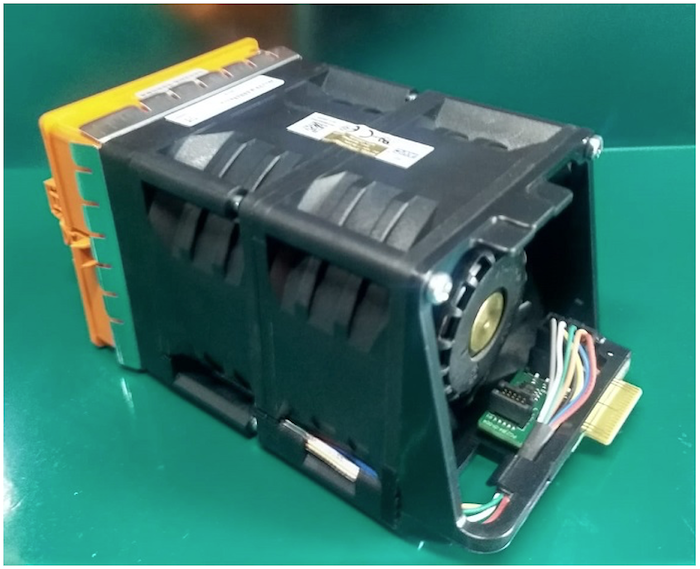

### Fan Tray Replacement

It is recommended to have all 3 fans installed. For replacement, one fan at a time can be replaced, when the chassis is online.

The replacement should be done in under 3minutes. Operating the chassis with a fan module removed out of chassis is not recommended, this can disturb the airflow and cooling.

|  | Ambiant Temperature | 1x LMIC / 1.6Tbps | 2x LMIC / 3.2Tbps | 3x LMIC / 4.8Tbps |
|:--|:--|:--|:--|:--|
| Fan TrayRemoval Duration | 25C | 230s | 230s | 215s |
| 40C, sea level | 130s | 120s | 60s |  |

If a single Fan Tray is absent for more than 240s, system will shut down automatically.

### Power Supply Units

MX304 has two slots on the back for single-feed Power Supply Module (PSM). Three types of Power Modules are available, all providing 2200W:

| Type | JPN | Description: Assy, Pwr Supply |
|:--|:--|:--|
| AC Low Line/High Line | 740-110419 | AC, 2200W, 90 - 264V AC, 12V OUT |
| DC | 740-110420 | DC, 2200W, 40-72V, 12V Output |
| HV AC/DC | 740-110865 | Universal HVAC/HVDC, 2200W,180Vac ~ 305Vac 190-410Vdc 12V OUT |

These Power Supply Modules are hot pluggable and both should be present for the chassis to work in redundant mode. It is not recommended to mix PSM of different types in the same chassis.

Interesting to note: with low line AC input, PEM output is 1100W and requires 2 PSM for the chassis to function.

| Input Types | Input Voltage | Max Power Output |
|:--|:--|:--|
| AC High Line | 220VAC | 2200W |
| AC Low Line | 110VAC | 1100W |
| DC | 40-72V DC | 2200W |
| HVAC | 180-305VAC | 2200W |
| HVDC | 190-410VDC | 2200W |

### Timing Interface Board

The Timing Interface Board (TIB) is a non-replaceable part present in the back of the MX304 chassis between the PSUs and FAN0. It provides support Class C Timing PTP G8275.1, Timing G.8275.1 and SYNCE. On the panel, it offers the following ports (horizontally):

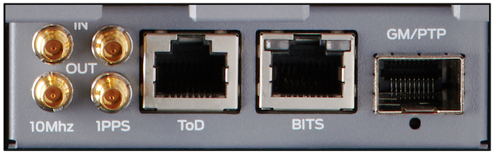

- 1PPS IN/OUT Connector
- 10Mhz IN/OUT Connector
- TOD RJ45 Port
- BITS RJ45 Port with LEDs
- GM (Grand Master) PHY SFP/SFP+ optics port with LEDs

### Control and Fabric Boards

Other boards are present inside the chassis. Logically, they are non-replaceable.

The Control Board (CB) hosts the timing circuit logic, among other elements.

The Fabric Board (FB) hosts the chipset responsible for the dataplane traffic switching between the different LMICs.

Each Trio 6 on LMIC is connected to the Fabric Chip via 36TX and 36RX links at 56Gbps. More precisely, the Fabric Board connects directly 2x LMICs and the third one is attached to the fabric via the Control Board using high-speed datalinks.

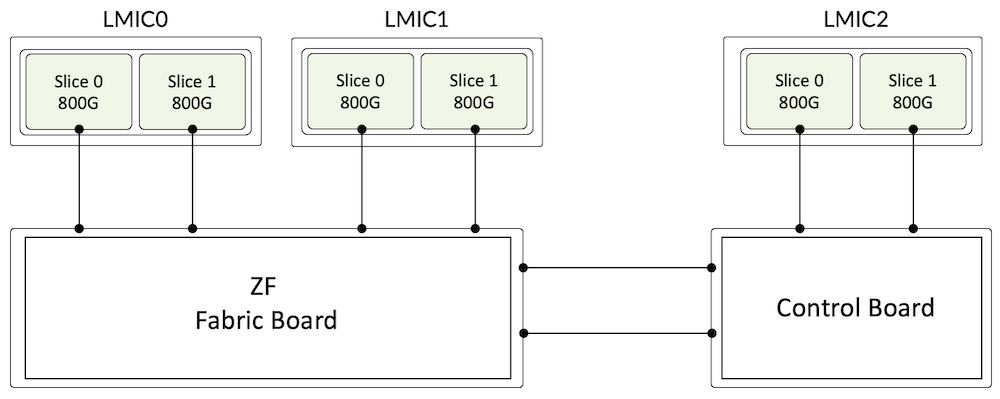

## Software

MX304 is powered by the "Junos Operating System", a FreeBSD based Unix software. Junos' kernel is in charge of several daemons, separated into an exclusive, secure environment. Each daemon runs in its own secure memory space to improve uptime and availability: a potential functional failure will not be as impactful as it could be in case of monolithic OS. The modular nature of Junos OS makes it easy to add any feature or to fix any bug.

The minimum software requirement for MX304 is Junos 22.2R1.

## Ports and PICs

### Port Numbering

In the MX304, the port are identified with the following naming convention:

***type - FPC / PIC / Port : channelized-port-number***

Type could be:

- "ge" (1GE)
- "xe" (10GE)
- "et" (25GE/40GE/50GE/100GE/200GE/400GE)

FPC is always zero.

PIC is LMIC position in chassis: 0, 1 or 2

Port position: from 0 to 15

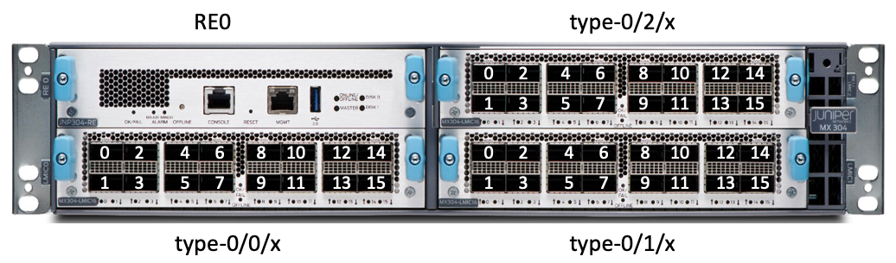

### PIC Mode / Port Mode

The MX304 supports both the interface configuration via PIC mode or via Port mode.

Check the documentation page here for more details: [https://www.juniper.net/documentation/us/en/software/junos/interfaces-ethernet/topics/topic-map/port-speed-configuration.html#concept_shw_4jn_dvb](https://www.juniper.net/documentation/us/en/software/junos/interfaces-ethernet/topics/topic-map/port-speed-configuration.html#concept_shw_4jn_dvb)

Without going into all the details of the former page, it could be useful to remind that in PIC Mode, all ports of an LMIC are set to the same speed.

Examples (X varies from 1 to 16 depending on the port speed):

```
set chassis fpc 0 pic0 pic-mode 100g number-of-ports X 
set chassis fpc 0 pic0 pic-mode 400g number-of-ports X 
set chassis fpc 0 pic0 pic-mode 10g number-of-ports X 
set chassis fpc 0 pic0 pic-mode 25g number-of-ports X 
set chassis fpc 0 pic0 pic-mode 50g number-of-ports X
```

In PIC mode:

- The interfaces (ie. IFDs) will be created only for the active ports
- Switching between the PIC modes will trigger an automatic PIC bounce
- Changing the number-of-ports CLI configuration knob will trigger a PIC bounce.
- For 10G/25G , PIC Mode with number-of-interface config will create 4x10/4x25G on the mentioned ports and for 50G it will create 50x8.

With Port mode, the user specifies speed for each port of the LMIC.

Examples:

```
set chassis fpc 0 pic X port Y speed 400g 
set chassis fpc 0 pic X port Y speed 100g 
set chassis fpc 0 pic X port Y speed 40g 
set chassis fpc 0 pic X port Y speed 100g number-of-sub-ports 4 
set chassis fpc 0 pic X port Y speed 10g number-of-sub-ports 4 
set chassis fpc 0 pic X port Y speed 25g number-of-sub-ports 4 
set chassis fpc 0 pic X port Y speed 10g number-of-sub-ports 1 
set chassis fpc 0 pic X port Y speed 25g number-of-sub-ports 1 
set chassis fpc 0 pic X port Y speed 100g number-of-sub-ports 2 
set chassis fpc 0 pic X port Y speed 50g number-of-sub-ports 8
```

In Port mode:

- Only the ports specified in the CLI configuration will be treated as active ports.
- The interfaces (i.e. IFDs) will be created only for the active ports.
- When a port profile configuration is changed, the interfaces corresponding to the affected ports will be deleted and re-created.  There is no need to bounce the PIC or reset the MPC for the port profile configuration changes.
- Any Wrong config there will be alarm as below :

```
root > show chassis alarms 
Alarm time               Class  Description
2022-09-08 03:44:02 PDT  Minor  FPC 0 PIC 0 Invalid port profile configuration
```

Note: the CLI will prevent "commit" with an error message when a port profile is configured at PIC and port levels simultaneously.

### Auto-Negotiation

By Default, Auto Negotiation is only enabled for 400G DAC on MX304 and not for any other optics or speed. To disable Auto Negotiation, we need to configure:

```
set interfaces et-X/Y/Z gigether-options no-auto-negotiation
```

Remove above config to enable back Auto Negotiation.

### Port Channelization

As alluded in previous sub-section, the configuration for the creation of breakout physical cables (channelized ports) is based on "number-of-sub-ports":

```
chassis {
    fpc <FPC Slot> {
        pic <PIC Slot> {
            port <Port Number> {
                number-of-sub-ports <Number of IFDs>;
            }
        }
    }
}
```

This CLI is valid for port profile configuration at PIC level and port level and is effective only when the port speed is 10G, 25G, 50G, 100G or 200G.

Default port channelization for various port speeds supported on LMIC (all ports of the PIC will have the same default port channelization):

| Port Speed | Default Port Channelization |
|:--|:--|
| 1GE | 1x1GE |
| 10GE | 4x10GE |
| 25GE | 4x25GE |
| 40GE | 1x40GE |
| 50GE | 8x50GE |
| 100GE | 1x100GE |
| 200GE | 2x200GE |
| 400GE | 1x400GE |

### Port Speed Capabilities

The ports of an LMIC are capable of the following speeds:

```
root@MX304> show chassis pic fpc-slot 0 pic-slot 0
 ...
Port speed information:
 
  Port  PFE      Capable Port Speeds
  0      1       1x10GE, 1x25GE, 8x50GE, 100GE, 2x100GE, 4x100GE, 400GE
  1      1       4x10GE, 4x25GE, 1x10GE, 1x25GE, 40GE, 100GE
  2      1       1x10GE, 1x25GE, 100GE
  3      1       4x10GE, 4x25GE, 1x10GE, 1x25GE, 40GE, 100GE
  4      1       1x10GE, 1x25GE, 100GE
  5      1       4x10GE, 4x25GE, 1x10GE, 1x25GE, 40GE, 100GE
  6      1       1x10GE, 1x25GE, 8x50GE, 100GE, 2x100GE, 4x100GE, 400GE
  7      1       4x10GE, 4x25GE, 1x10GE, 1x25GE, 40GE, 100GE
  8      0       1x10GE, 1x25GE, 8x50GE, 100GE, 2x100GE, 4x100GE, 400GE
  9      0       4x10GE, 4x25GE, 1x10GE, 1x25GE, 40GE, 100GE
  10     0       1x10GE, 1x25GE, 100GE
  11     0       4x10GE, 4x25GE, 1x10GE, 1x25GE, 40GE, 100GE
  12     0       1x10GE, 1x25GE, 100GE
  13     0       4x10GE, 4x25GE, 1x10GE, 1x25GE, 40GE, 100GE
  14     0       1x10GE, 1x25GE, 8x50GE, 100GE, 2x100GE, 4x100GE, 400GE
  15     0       4x10GE, 4x25GE, 1x10GE, 1x25GE, 40GE, 100GE
```

### Port Speed Configuration Rules

We will use the Port Checker tool ([https://apps.juniper.net/home/port-checker/index.html](https://apps.juniper.net/home/port-checker/index.html)) to illustrate the different options, starting from the highest bandwidth (400GE) to the slowest (1G and 4x1G).

**400GE**

400GE can only be configured on port positions 0, 6, 8 and 14. When a port of a Quad / Port Group is configured as 400GE, the 3 other ports are Off and can't be configured.

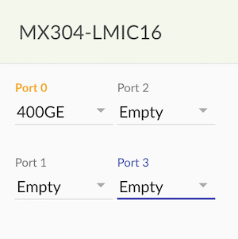

The 400GE port created will be named: ***et-0/LMIC-position/port-position ***

**100GE**

All 4 ports of a Port Group can be used with QSFP28 100GE native ports without any restriction.

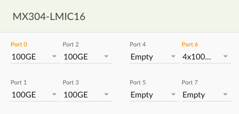

The 100GE port created will be named: ***et-0/LMIC-position/port-position***

Alternatively, it's possible to 4x100GE breakout on the 400Gbps port, keeping empty the 3 remaining ports of the PG.

The 100GE ports created will be named: ***et-0/LMIC-position/port-position:[0-3]***

**50GE**

50GE is only possible via 8x50GE breakout on the ports 0, 6, 8 and 14. All other ports of the PG must remain unused.

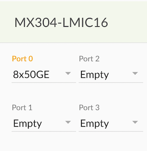

The 50GE ports created will be named: ***et-0/LMIC-position/port-position:[0-7]***

**40GE**

40GE ports can be configured on odd-numbered ports only and with their alternate port empty.

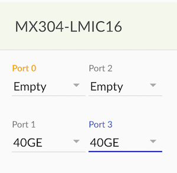

Note: The concept of "alternate port" is simply described in the following chart:

| Port | 0 | 1 | 2 | 3 | 4 | 5 | 6 | 7 |
|:--|:--|:--|:--|:--|:--|:--|:--|:--|
| Alternate Port | 1 | 0 | 3 | 2 | 5 | 4 | 7 | 6 |

| Port | 8 | 9 | 10 | 11 | 12 | 13 | 14 | 15 |
|:--|:--|:--|:--|:--|:--|:--|:--|:--|
| Alternate Port | 9 | 8 | 11 | 10 | 13 | 12 | 15 | 14 |

Here is the error message you'll get from the port checker tool is you try to configure an Alternate Port non-empty:

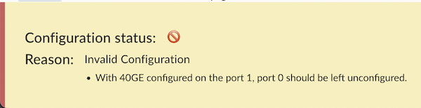

The 40GE port created will be named: et-0/LMIC-position/port-position

**25GE**

25GE is supported via 25GE with QSFP-to-SFP-Adapter (QSA) in all ports and 4x25GE breakout on the odd-numbered ports:

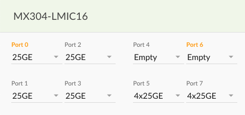

The 25GE port created will be named: ***et-0/LMIC-position/port-position*** in the first case and ***et-0/LMIC-position/port-position:[0-3]***

Same logic applies to 10GE and 4x10GE.

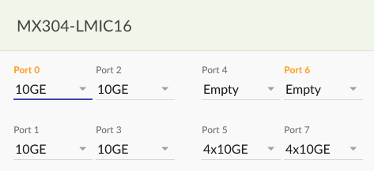

The 10GE port created will be named: xe-0/LMIC-position/port-position in the first case and xe-0/LMIC-position/port-position:[0-3]

**1GE**

Same logic applies for 1GE and 4x1GE too.

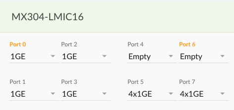

Note that 1GE and 4x1GE support is introduced in Junos 23.1R1.

When configuring the following:

```
 set chassis fpc 0 pic Y port Z speed 1G 
```

or

```
set chassis fpc 0 pic Y pic-mode 1G
```

You will create an interface ge-0/Y/Z (Z is the port position in the LMIC and Y is the PIC number: the slot where is inserted the LMIC).

The 4x1GE is actually a 4x10GE optic configured in 4x1GE mode with:

```
set chassis fpc 0 pic X port Y speed 1g number-of-subports 4
```

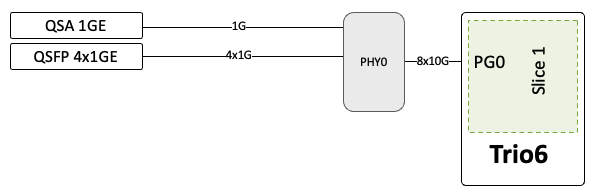

The Trio 6 doesn't support 1Gbps natively, that's why it will use 10Gbps towards the PHY host side and this PHY will provide the adaptation to 1Gbps on the line side. We don't support or have plans to support Fast Ethernet 100Mbps or 10Mbps speeds.

At the moment of this publication: timing, MACsec, filters and QoS features are not supported on the 1GE ports and will be tracked in the software roadmap (contact your Juniper representative for details). Also, please note that the largest MRU/MTU you can configure on an 1GE are 2008 and 2000 bytes respectively.

### System Behaviour during Port Profile Configuration Changes

Port profile configuration does not require physical presence of a LMIC. Following are the system behaviours while handling the various port profile configuration scenarios:

- If no port profile configuration is found while booting a FPC, the default port profile for the LMIC will be chosen.
- If a valid port profile configuration is found while booting a FPC, it will be chosen.
- If an invalid port profile configuration is detected while booting a FPC, an alarm will be generated.  Also, the default port profile will be selected for the particular LMIC.
- If a port profile configuration is changed on a FPC which is up and running and the new profile is valid, the new configuration will take effect.
- If a port profile configuration is changed on a FPC which is up and running and the new profile is invalid, an alarm will be generated.  The current profile will continue to be used for the particular LMIC.

### MACsec

The MX304 leverages the encryption capability of the Trio 6 ASIC to deliver encryption at line rate on all ports and all port speeds (except 1GE today). The Trio 6 block provides encryption, decryption, hash generation and validation as well as anti-replay service respecting both FIPS197 and AES-GCM standards.

Note: Class C PTP and MACsec can NOT be delivered on the same port.

## Operation

LMIC cards in MX304 chassis are NOT hot-swappable.

The following procedure must be respected to extract and insert an LMIC.

### LMIC Insertion and Removal and Replacement

The physical insertion or removal of an LMIC will not cause any impact to other LMIC(s) already in service in the chassis starting from Junos 24.4R1. 

> Note: A knob-lock is present on the LMIC to ensure a card is not extracted accidentally.

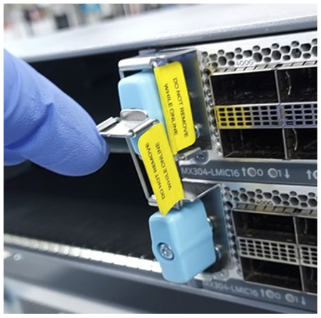

Once the know lock is open, it's possible to rotate the lever to extract the LMIC.

## References

- LC9600 and Trio 6 TechPost article: [https://juniper.github.io/techposts/mx10000-lc9600-deepdive/article](https://juniper.github.io/techposts/mx10000-lc9600-deepdive/article)
- Port configuration: [https://www.juniper.net/documentation/us/en/software/junos/interfaces-ethernet/topics/topic-map/port-speed-configuration.html#concept_shw_4jn_dvb](https://www.juniper.net/documentation/us/en/software/junos/interfaces-ethernet/topics/topic-map/port-speed-configuration.html#concept_shw_4jn_dvb)
- Port Checker tool: [https://apps.juniper.net/home/port-checker/index.html ](https://apps.juniper.net/home/port-checker/index.html)

## Glossary

- ASIC: Application-Specific Integrated Circuit
- BITS: Building Integrated Timing Supply equipment
- CB: Controller Board
- DAC: Direct Access Cable
- FB: Fabric Board
- FIPS: Federal Information Processing Standard
- FPC: Flexible PIC Concentrator
- GM: Grand Master
- HVAC/HVDC: High Voltage AC/DC
- IFD: Physical Interface
- LMIC: MX304 Line Card
- NEBS: Network Equipment-Building System
- OS: Operating System
- PFE : Packet Forwarding Engine
- PHY: PHYsical device (usually a Gearbox/Reverse Gearbox)
- PIC: Physical Interface Card
- PG: Port Group
- PTP: Precision Time Protocol
- PSU: Power Supply Unit
- QoS: Quality of Service (=CoS)
- QSFP: Quad Small Form Factor pluggable
- RE: Routing Enginer
- RPM: Round Per Minute
- RU: Rack Unit
- SerDes: Serializer / De-serializer
- SFP: Small Form Factor pluggable
- SSD: Solid State Drive
- TIB: Timing Interface Board
- TOD: Time Of Day
- TPM: Trusted Platform Module
