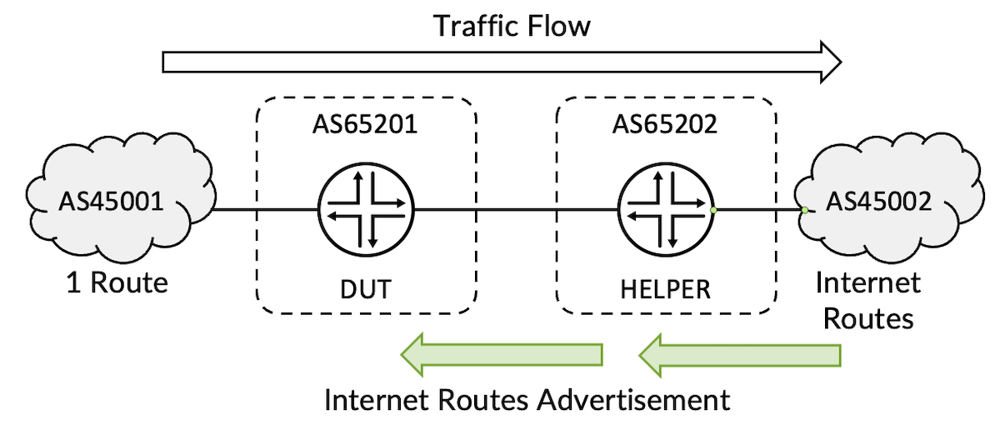
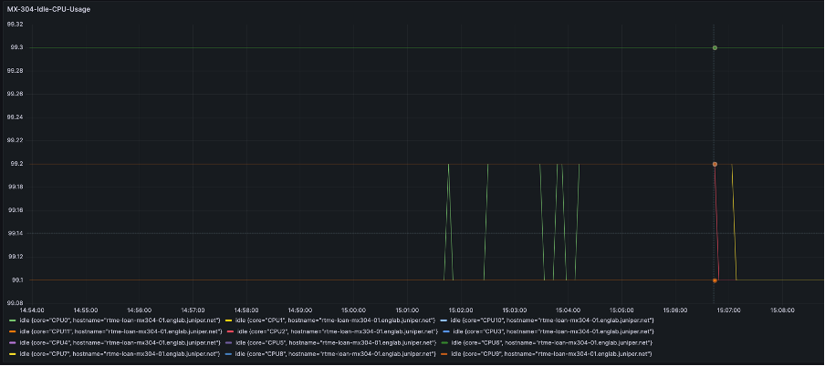
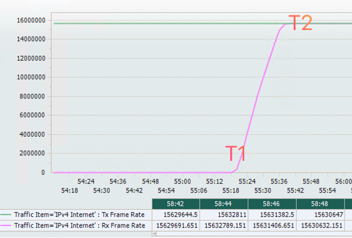
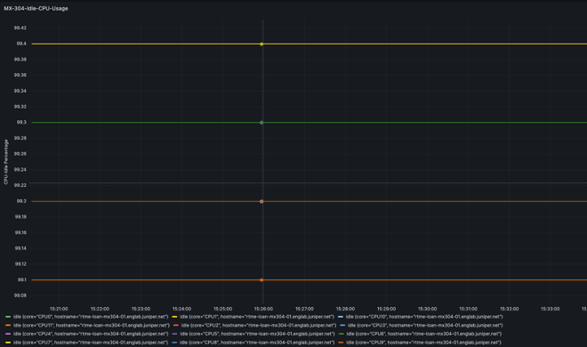
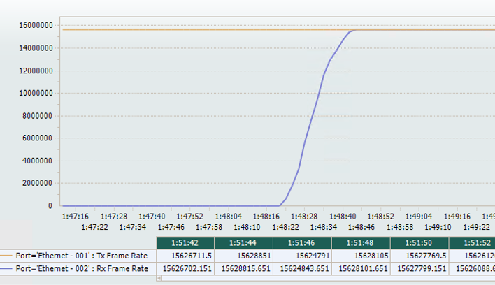

# MX304 FIB Install Rate

**Suneesh Babu - 11/20/2023**

MX304 installs the full Internet tables at 47,000 routes per second, and we will show you how we are testing it.

## Introduction

If you test the MX304 in the lab in front of route/traffic generator, you will see an impressive result of 50,000 prefixes / seconds programmed in hardware. But on the Internet, your MX will receive real routes from actual routers and we can wonder if the FIB install rate is the same.

In this article, we will describe a test methodology to provide realistic results.

TLDR: the MX304 supports an internet route install rate of 46,990 routes per second for IPv4 Internet profile and 46,955 routes per second for IPv4 +IPv6 stack with 23.2R1 Junos Image.

## Test Methodology

The Topology consists of two routers connected back to back and each linked to the route/traffic generator. The testing device connected to DUT advertises a single route and the one connected to the helper DUT advertises the internet prefixes.



EBGP peering is enabled across the routers as well as across the router and traffic generator. The DUT learns a single route from the traffic generator and 939k IPv4 Internet prefixes from the helper DUT. Traffic is sent from the single route as the source and internet routes as the destination with 99.9% of interface load with an iMIX packet size distribution..

The test starts with disabling the EBGP peering between the DUT and helper DUT:

- the traffic is dropped on the DUT (can't resolve the destination addresses)
- on the DUT, Tx is MAX rate and Rx is ZERO.


Once the interface between the two routers is enabled:

- the BGP session will establish
- the Helper router will advertise the internet prefixes to the DUT
- Rx Rate will increase as DUT installs the routes in the Packet Forwarding Engine


The total routes divided by T2-T1 gives the number of routes installed per second.

### MX304 Test Configurations for IPv4 Internet Profile

```
regress@DUT> show configuration groups FIB_TEST

groups {
    FIB_TEST {
        interfaces {
            lo0 {
                unit 0 {
                    family inet {
                        address 12.1.1.1/32;
                    }
                }
            }
            et-0/2/1 {
                mtu 9018;
                unit 0 {
                    family inet {
                        address 15.1.1.1/24;
                    }
                }
            }
            et-0/0/11 {
                mtu 9018;
                unit 0 {
                    family inet {
                        address 15.2.1.1/24;
                    }
                }
            }
        }
        routing-options {
            router-id 12.1.1.1;
            autonomous-system 65201;
        }
        protocols {
            bgp {
                group FIB_Test {
                    type external;
                    family inet {
                        unicast;
                    }
                    neighbor 15.1.1.2 {
                        peer-as 45001;
                    }
                    neighbor 15.2.1.2 {
                        peer-as 65202;
                    }
                }
            }
        }
    }
}
```

The BGP Peering is in IDLE State after disabling the interface.

```
regress@DUT> configure 
Entering configuration mode

[edit]
regress@DUT# set interfaces et-0/0/11 disable

[edit]
regress@DUT# commit and-quit 
commit complete
Exiting configuration mode

regress@DUT> show bgp summary 
Threading mode: BGP I/O
Default eBGP mode: advertise - accept, receive - accept
Groups: 1 Peers: 2 Down peers: 1
Table          Tot Paths  Act Paths Suppressed    History Damp State    Pending
inet.0               
                       1          1          0          0          0          0
inet6.0              
                       0          0          0          0          0          0
Peer                     AS      InPkt     OutPkt    OutQ   Flaps Last Up/Dwn State|#Active/Received/Accepted/Damped...
15.1.1.2              45001         98     435151  188387       2       47:26 Establ
  inet.0: 1/1/1/0
15.2.1.2              65202     130159         32       0       6           3 Idle  

regress@DUT>
```

Once the interface is enabled, the BGP peering comes up and DUT starts learning the routes

```
regress@DUT> configure 
Entering configuration mode

[edit]
regress@DUT# delete interfaces et-0/0/11 disable

[edit]
regress@DUT# commit and-quit 
commit complete
Exiting configuration mode

regress@DUT> show bgp summary    
Threading mode: BGP I/O
Default eBGP mode: advertise - accept, receive - accept
Groups: 1 Peers: 2 Down peers: 0
Table          Tot Paths  Act Paths Suppressed    History Damp State    Pending
inet.0               
                  939805     939805          0          0          0          0
inet6.0              
                       0          0          0          0          0          0
Peer                     AS      InPkt     OutPkt    OutQ   Flaps Last Up/Dwn State|#Active/Received/Accepted/Damped...
15.1.1.2              45001         72     435080       0       2       34:13 Establ
  inet.0: 1/1/1/0
15.2.1.2              65202     130130          4       0       5          32 Establ
  inet.0: 939804/939804/939804/0

regress@DUT>
```

The 12 Core CPU of MX304 stays stable with most of the cores 100% Idle during IPv4 Internet Route learning as shown below:



As the routes are getting learnt in the DUT, the traffic starts flowing and once entire routes are installed Rx and Tx Rate matches as follows:



We write down T1 and T2, and the test is repeated three times.

For 939,804 IPv4 Routes, we measured:

| Iteration | T1 | T2 | T2-T1(seconds) | Nb of routes/(T2-T1) in RPS |
|:--|:--|:--|:--|:--|
| Iter-1 | 3:39:58 | 3:40:18 | 20 | 46,990 |
| Iter-2 | 4:11:48 | 4:12:08 | 20 | 46,990 |
| Iter-3 | 4:21:22 | 4:21:42 | 20 | 46,990 |
| Total Routes | 939,804 |  | Average | 46,990 |

## IPv4 + IPv6 Internet Dual Stack Profile

### MX304 Test Configurations for IPv4 and IPv6 Internet Profile

```
regress@DUT> show configuration groups FIB_TEST

groups {
    FIB_TEST {
        interfaces {
            lo0 {
                unit 0 {
                    family inet {
                        address 12.1.1.1/32;
                    }
                }
            }
            et-0/2/1 {
                mtu 9018;
                unit 0 {
                    family inet {
                        address 15.1.1.1/24;
                    }
                    family inet6 {
                        address 2002:15:1:1::1/64;
                    }
                }
            }
            et-0/0/11 {
                mtu 9018;
                unit 0 {
                    family inet {
                        address 15.2.1.1/24;
                    }
                    family inet6 {
                        address 2002:15:2:1::1/64;
                    }
                }
            }
        }

        routing-options {
            router-id 12.1.1.1;
            autonomous-system 65201;
        }

        protocols {
            bgp {
                group FIB_Test {
                    type external;
                    family inet {
                        unicast;
                    }
                    neighbor 15.1.1.2 {
                        peer-as 45001;
                    }
                    neighbor 15.2.1.2 {
                        peer-as 65202;
                    }
                }

                group FIBv6_Test {
                    type external;
                    family inet6 {
                        unicast;
                    }
                    neighbor 2002:15:1:1::2 {
                        peer-as 45001;
                    }
                    neighbor 2002:15:2:1::2 {
                        peer-as 65202;
                    }
                }
            }
        }
    }
}
```

The BGP summary info with both IPv4 and IPv6 families are as follows:

```
regress@DUT> show bgp summary 
Threading mode: BGP I/O
Default eBGP mode: advertise - accept, receive - accept
Groups: 2 Peers: 4 Down peers: 0
Table          Tot Paths  Act Paths Suppressed    History Damp State    Pending
inet.0               
                  939805     939805          0          0          0          0
inet6.0              
                  202353     202353          0          0          0          0
Peer                     AS      InPkt     OutPkt    OutQ   Flaps Last Up/Dwn State|#Active/Received/Accepted/Damped...
15.1.1.2              45001        120     165340       0       1       58:10 Establ
  inet.0: 1/1/1/0
15.2.1.2              65202     180506        124       0       0       55:21 Establ
  inet.0: 939804/939804/939804/0
2002:15:1:1::2        45001        120      46920       0       1       58:08 Establ
  inet6.0: 1/1/1/0
2002:15:2:1::2        65202      48469        124       0       0       55:22 Establ
  inet6.0: 202352/202352/202352/0
```

The 12 Core CPU of MX304 was stable, most of the cores being at100% idle state during route-learning:



The FIB Install Rate with traffic flow is measured as follows:



Total number of routes: 939,804 (ipv4) + 202,352 (ipv6) = 1,142,156

| Iteration | T1 | T2 | T2-T1(seconds) | Nb of routes/(T2-T1) in RPS |
|:--|:--|:--|:--|:--|
| Iter-1 | 1:15:00 | 1:15:24 | 24 | 47,589 |
| Iter-2 | 1:24:40 | 1:25:05 | 25 | 45,686 |
| Iter-3 | 1:48:20 | 1:48:44 | 24 | 47,589 |
| Total Routes | 1,142,156 |  | Average | 46,955 |

## Conclusion

MX304 running on 23.2R1 JUNOS image shows a route-learning rate of ~46,990 routes per second for IPv4 Internet profile and 46,955 routes per second for dual-stack profile. This test methodology provides more realistic results with the routes learnt from a real router BGP stack and using real internet tables.

## Glossary

- BGP: Border Gateway Protocol
- DUT: Device Under Test
- FIB: Forwarding Information Base
- IPv4: Internet Protocol Version 4
- IPv6: Internet Protocol Version 6
- PFE: Packet Forwarding Engine

## Acknowledgement

Many thanks to Kedar Kawadkar, Suresh Kumar Boyapati and Nicolas Fevrier for reviewing the article and providing the feedback.
