# Navigating the PTX12008 LCD Module

**Nagaraj Suresh - 05/14/2026**

Let's explore the LCD module of the PTX12000 chassis. In this article, we will explain how it provides front-panel, touch-based, read-only monitoring of system health, FRU status, alarms, ports, and FPC information for simplified operational visibility and troubleshooting.

## Introduction

The PTX12000 product line is engineered to meet the escalating demands of next generation core, DCI, and AI data center networks.

Built on Juniper's fifth generation Express silicon, the platform delivers massive scale, exceptional power efficiency, and long term architectural longevity, supporting high density 800GbE now and 1.6TbE class infrastructure in the future.

- [Introducing the PTX12000 Series](https://juniper.github.io/techposts/introducing-ptx12000-chassis/article)
- [Rethinking Fabric Redundancy](https://juniper.github.io/techposts/rethinking-fabric-redundancy/article)
- [Deepdive in the Fabric Topology](https://juniper.github.io/techposts/ptx12008-fabric-topology/article)
- [Fabric Self Healing and Recovery](https://juniper.github.io/techposts/self-healing-and-recovery-mechanisms-for-ptx12008/article)
- [Navigating the Front Panel Display](https://juniper.github.io/techposts/navigating-the-ptx12008-lcd-module/article)
- PTX12k Power Saving and Metrics (coming soon)

## Quick reminder on the PTX12008

A PTX12008 is made of the following:

- 8-slot chassis
- 43.2T BXF-based 54x 800G OSFP line card(s)
- 43.2T BXF-based 54x 800G QSFP line card(s)
- 9-slot BF-based SIB-8
- 2-slot RCB
- 3-slot Fan Tray
- 20 PSM Power Supply Shelf
- Universal AC PSM (HVAC/HVDC/Standard AC) and DC PSM
- FPD with LCD touch screen module

## The LCD Module

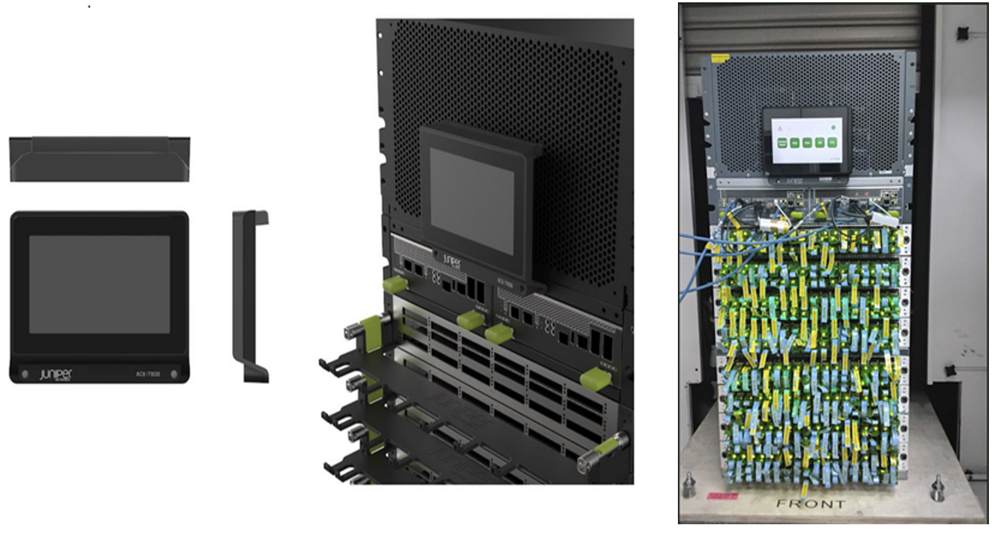

The LCD craft interface shows basic system information, along with line cards and port status and troubleshooting information briefly. The LCD craft interface is located on the front of the chassis above the RCB. LCD module are connected to and managed by the RCBs.

Touch inputs will allow navigation between different pages and selecting FPC/Ports for getting more details.

## Need for an LCD Module

The main goal of the LCD module is to provide a visual health summary of the chassis / system without having to log into the system.

Fabric cards, fan trays and power supply modules are present at the backside of the system, if you want to know the status of these FRU's, you need to go to rear side of the system or login to the chassis and get the information. The LCD module addresses this by displaying information at the FRU level and chassis system level.

How many fabric cards, power supplies, and Fan tray, are present and operational? How many FPC are online / offline / fault / empty? Which ports are channelized ?

All these details can be found in the LCD module placed on the front side of the power shelf.

The LCD content is consolidated in 2 groups.

## Group 1

## System Level Information and LED Details

- Host Information: hostname/IP address/bootup time
- System Alarm indication: Major & Minor Alarm Presence.
- Summary FRU status for:
    - PSMs
    - FANs
    - SIBs
    - Line Cards
    - RCBs

## Home Screen [Touch Selectable]

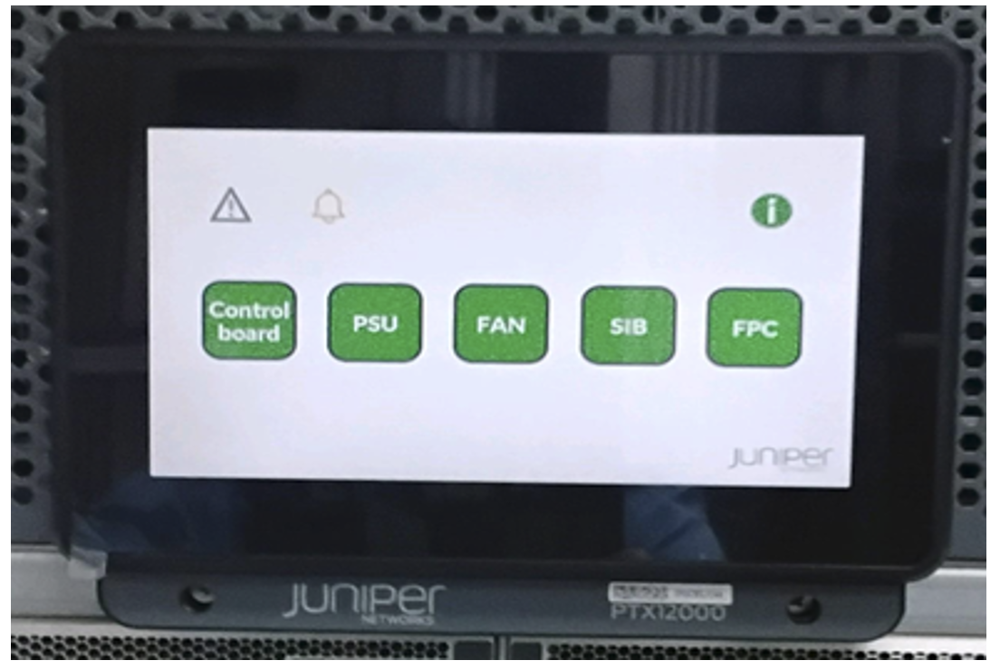

The home screen consists of multiple indicators and "clickable" tiles:

- Consolidated RCB/CB tile, upon selecting this, it will navigate to Control board / RCB screen
- Consolidated PSU tile, upon selecting this, i t will navigate to Power Supply home screen
- Consolidated Fan tile, upon selecting this, it will navigate to Fan Tray screen
- Consolidated SIB tile, upon selecting this, it will navigate to SIB screen
- Consolidated FPC screen, upon selecting this, it will navigate to FPC home screen
- Major alarm Indicator (not clickable)
- Minor alarm indicator (not clickable)
- System information button, upon selecting this it will navigate to system information screen (next section)

With the exception of Major and Minor alarm indicators, selecting any tile will navigate to respective FRU's screen. Then, selecting the home icon on any screen will move you back to home screen.

## System Information Screen [Read only]

After pressing the "i" icon, we reach the System Info screen:

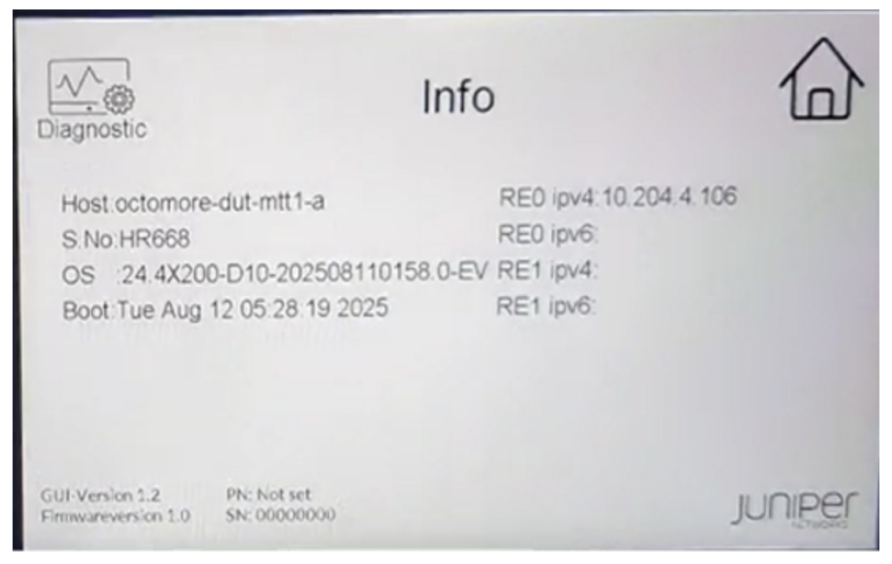

It exposes the following information:

- Host name
- Serial no of the Chassis
- OS version running on the system
- System booted at
- Core and Custom firmware of the FPM
- RE0 and RE1's IPv4 and IPv6 management address (if configured)

Table: This table summarizes the content of the system information screen.

| FRU | LED/Field name | Colour/State | Definition |
|:--|:--|:--|:--|
| System | Hostname | NA |  |
| IPV4 mgmt. address | NA | Management interface IPV4 address |  |
| IPV6 mgmt. address | NA | Management interface IPV6 address |  |
| OS Version | NA | Master RE image version |  |
| Boot time | NA | System boot time |  |
| Critical Alarm | RED Triangle | Critical Alarms Present |  |
| OFF | No Critical Alarm |  |  |
| Warning Alarm | AMBER Bell | Warning Alarms present |  |
| OFF | No Warning Alarm |  |  |

## Special Notes

On the system information screen we have a Diagnostic icon, upon selecting this, it will navigate to Diagnostic window where it will display diagnostic related information such as different colours scheme which appears on LCD, brightness, Touch and memory. These selections are only for diagnostic purpose and will not have any impact on the system/lcd , selection of home icon in this screen will take us back to default home screen.

Users are not supposed to select this diagnostic icon from the system information screen as it is only meant for debug and diagnostic purposes only.

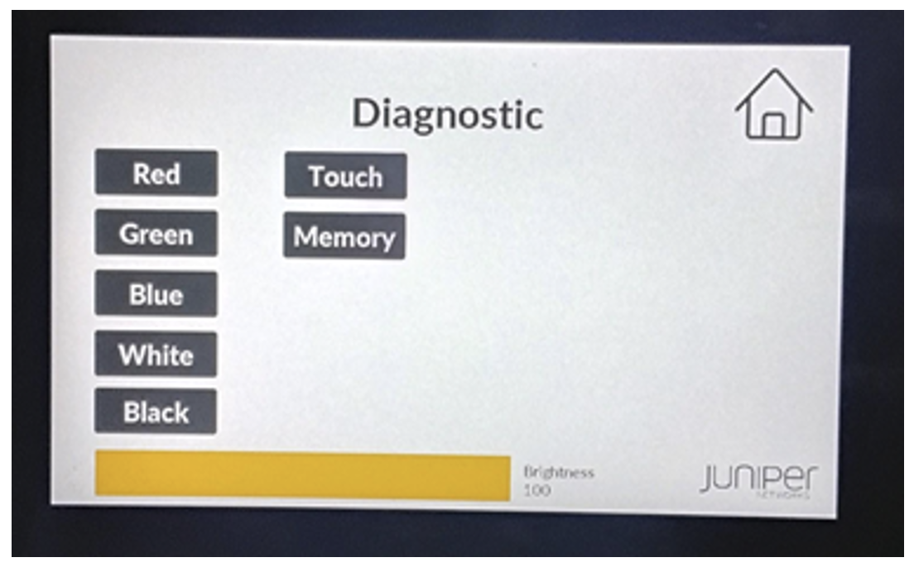

## Consolidated RCB Screen [Read Only]

The consolidated RCB screen will indicate how the RCBs are installed into the chassis and their status.

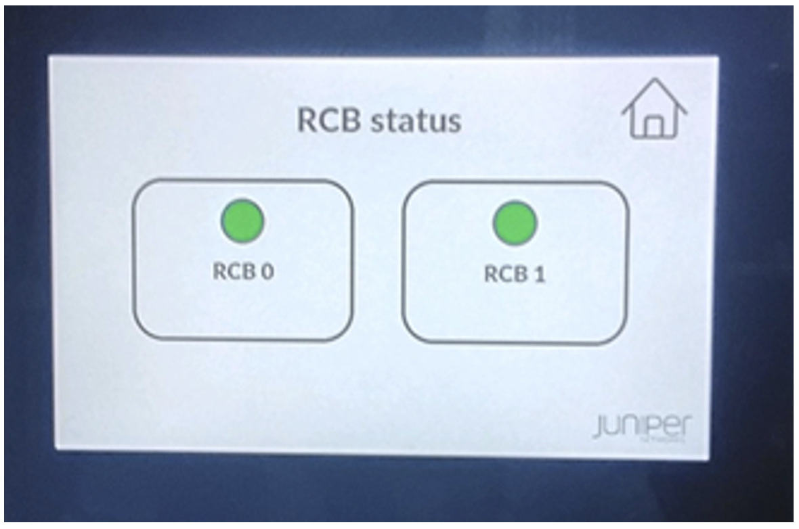

This screen captures the number of Routing engines installed in the system:

- the online RCB's are represented in Green,
- the absent/empty slots are represented in Black,
- Faulty/offline RCB will be represented in Gray,
- and when the RCBs are booting, the colour will be blinking Green

Note: this screen will not indicate which Routing Engine is Active and which one is Backup.

Below table summarizes the RCB/CB home screen:

Table : Summary of the Control Board on the LCD module

| FRU | LED/Field name | Colour/State | Definition |
|:--|:--|:--|:--|
| RCB | STATUS LED | Solid Green | RCB is Online |
| Solid Red | RCB has fault |  |  |
| OFF | RCB is Offline/Empty |  |  |

## Consolidated Power Supply Screen [Read only]

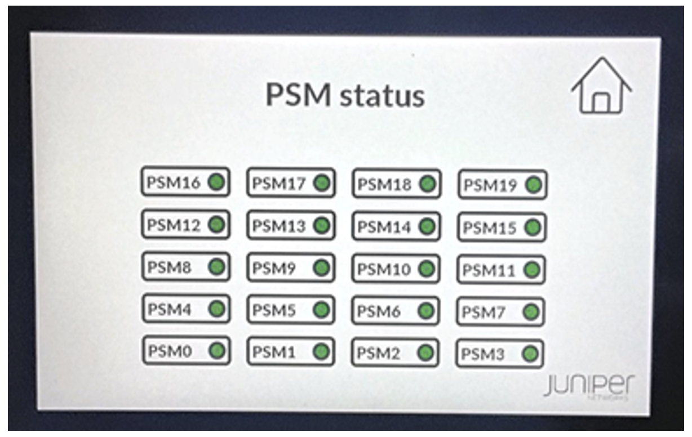

This screen will have the information of all the power supplies installed in the system: online/offline/empty.

The Online PSM's are represent in Green, Offline is grey, Fault is red and Empty is Black, When the PSM is booting it will be blinking green

Note: the position of PSM represented on LCD is the actual position of the PSM on the power shelf.

Below table summarizes the home screen of the PSM:

Table: Summary of Power supply home screen on the LCD module

| FRU | LED/Field name | Colour/State | Definition |
|:--|:--|:--|:--|
| RCB | PSM STATUS LED | Solid Green | All INP voltages are present and within range |
| Solid AMBER | At least one voltage is out of limits |  |  |
| RED | Indicates the PS failure |  |  |
| OFF | PSM is absent/Offline/Empty |  |  |

## Consolidated SIB Status [Read only]

This screen will have the information of all the SIBs installed in the system, it will capture the information all the SIBS which are  online/ offline / empty.

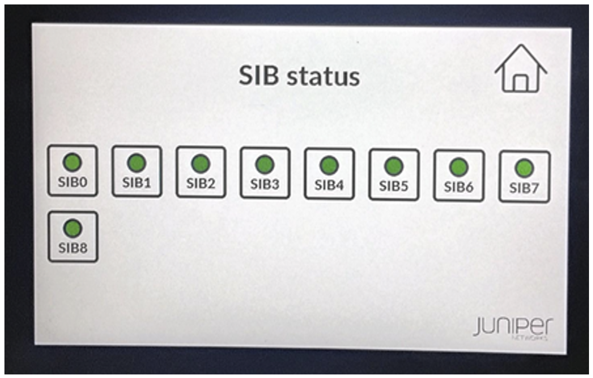

This screen will capture all SIBs status:

- Online SIBS are represented in Green,
- Offline is grey,
- Faulty SIBs are represented in Red
- and Absent / empty SIBs are represented in Black,
- when the SIB is transitioning, the SIB LED will be blinking green

Below table summarizes the SIB home screen

Table: Summary of SIB home screen

| FRU | LED/Field name | Colour/State | Definition |
|:--|:--|:--|:--|
| SIB | STATUS LED | Solid Green | SIB is online |
| Blinking Green | SIB is powering up |  |  |
| Blinking Amber | SIB has fault |  |  |
| OFF | SIB power off/Empty |  |  |

## Consolidated Fan Screen [Read Only]

This screen will capture the status of all the Fan trays in the chassis:

- Fan trays which are online are represented in Green,
- offline is grey,
- Faulty is Red
- and Absent/Empty is Black

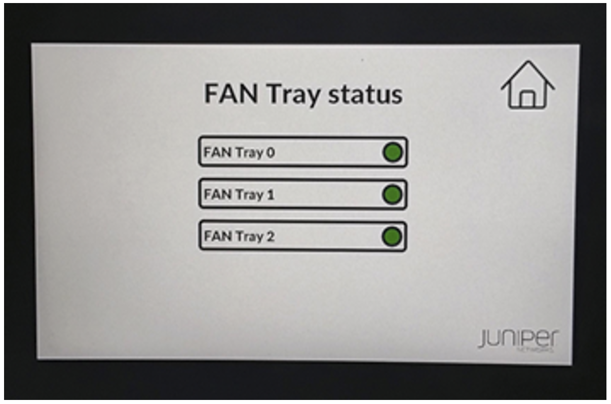

Below table summarizes the fan tray home screen

Table: Summary of Fan tray home screen

| FRU | LED/Field name | Colour/State | Definition |
|:--|:--|:--|:--|
| FAN | STATUS LED | Solid Green | All fans are up and running without issue |
| Blinking Green | Fan starting up / not ready |  |  |
| Blinking Amber | One or more fans in this fan tray have issues/errors |  |  |
| OFF | FTC power is OFF/Empty |  |  |

## Consolidated FPC Screen [with selectable FPC slots]

This screen will capture the status of all the FPCs which are installed in the chassis,

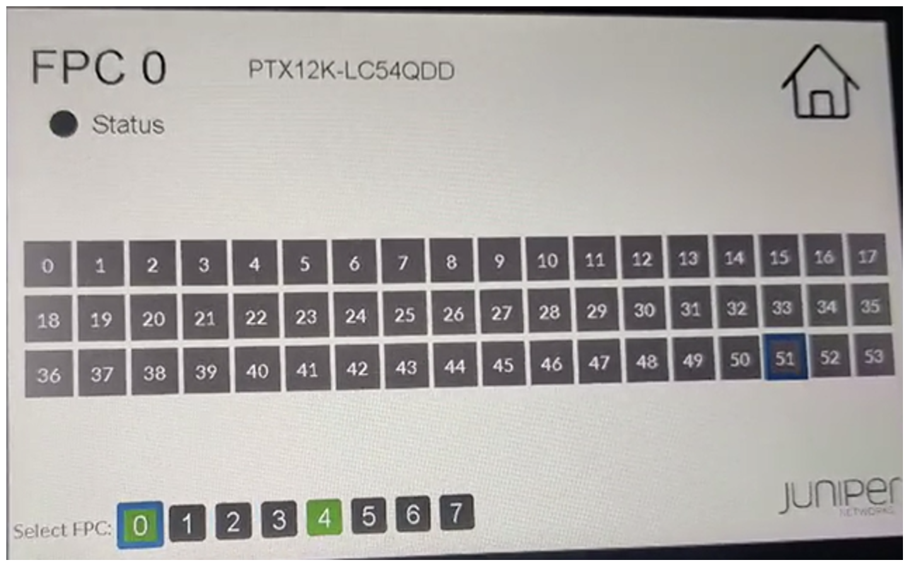

This screen will capture details on the FPCs installed in the chassis. After selecting the FPC tile from the home screen, it will navigates to respective FPC home screen. By default, it will land into FPC0 screen, and if FPC0 is not present it will land into lowest available numbered FPC. By selecting the home icon, we will be landing into LCD default home screen.

- Online FPCs are represented in green,
- Offline in grey,
- Faulty in red,
- and Absent/Empty in Black,
- when the FPC is in transitioning state, the corresponding FPC tile will be blinking green.

Below table will summarize the FPC home screen:

Table: Summary of the Default FPC home screen

| FRU | LED/Field name | Colour/State | Definition |
|:--|:--|:--|:--|
| FPC | STATUS LED | Solid Green | FPC is online |
| Blinking Green | FPC is initializing |  |  |
| RED | FPC in Fault |  |  |
| OFF | FPC is /Offline |  |  |
| FPC Type | Text | Same text as in show chassis h/w |  |

## Group 2

Provides per slot FPC Level information for selected slot:

- FPC Status LED
- Port status for all ports
- Lane LEDs (for selected port when channelized)
- FPC Description

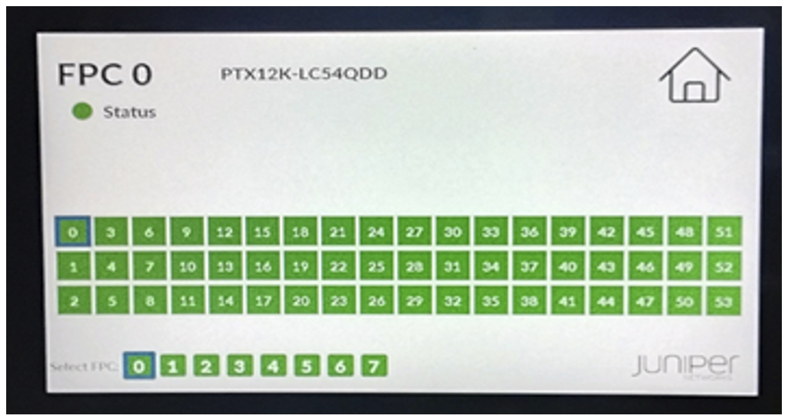

This screen will capture all the FPCs details installed in the chassis, upon selecting FPC tile from the home screen, it will navigate to FPC home screen. By default, it will land into FPC0's home screen, if FPC0 is not present, it will land into lowest available numbered FPC.

The Layout of FPC home screen will have:

- FPC slot number at the Top,
- FPC description
- FPC status indicator
- Status of all the 54 ports along with channelization information
- Selection of FPC buttons
- Home button which will navigate us to the home screen

All 7 FPCs will be listed in default FPC home screen: 7 small rectangle boxes arranged in a row at the bottom of the screen, from 0 to 7.

These small rectangle boxes are navigable: touching any tile takes us to respective FPCs home screen.

- FPC's which are online are represented in Green,
- Offline is grey,
- Faulty is Red,
- empty/absent is Black,
- when the FPC is transitioning, that FPC will be blinking green

## Port selection

The FPC screen displays status of all the 54 ports.

- The WAN Interfaces in down state are represented in Amber
- Empty ports (without any optics) are represented in black,
- Online ports are represented in Green

It exposes also the channelization details:

- when we select a port, the outer layout will be highlighted
- if it has channelisation, it will show the lane LEDs on top of the port layout (up to 8 lane LED will be displayed)
- if the port is not channelized, then none of the lane LED will be populated,
- if any of the 8 Lane is down then corresponding Lane LED will be amber

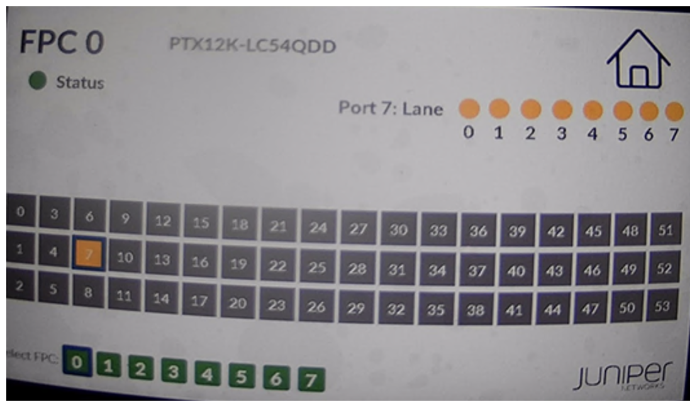

## Screen Saver

If the LCD module is kept idle for 10 minutes (without any touch), the LCD will enter the screen saver mode, home screen and juniper log will be flip flopped.

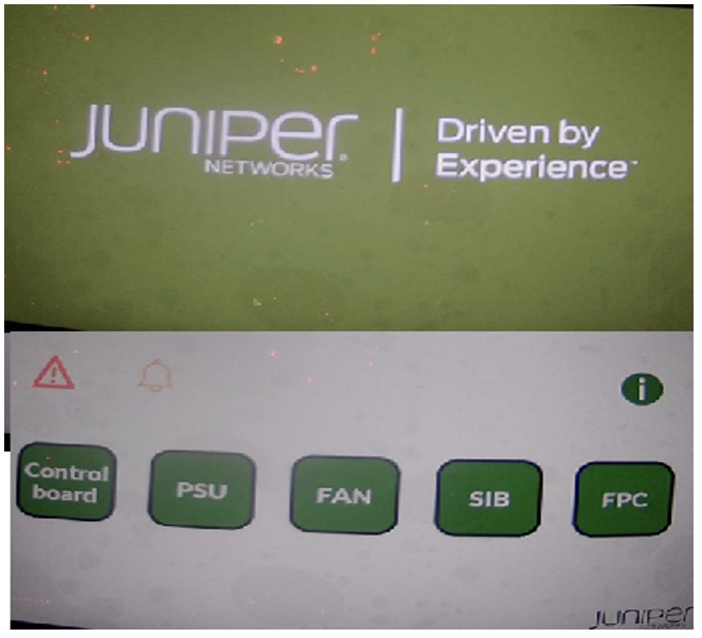

## FRU Management

The LCD module is considered part of the FPD FRU and is not treated as a separate FRU. If the system fails to detect or initialize the LCD module, the entire FPD FRU will be marked as faulty, because the lcdmodd component will report a hardware status of FAULT. Like the existing FPD implementation, offline of FPD FRU will not be supported.

If the LCD module is not detected during initialization on the I2C bus, it will be reset and access to it will be restricted. If the system still fails to detect and initialize the LCD module after multiple retries, a system alarm will be raised for the FPD.

If the LCD module is faulty, it can be replaced while the FPD is in operation. Before removing the module, the lcdmodd application must be stopped. After installing the new LCD module, the lcdmodd application should be restarted.

## Caveats

During RE switchover, the display content for ports and fru status will not be updated. The data will be refreshed after switchover completion. Any user selections on the display for specific FPC/port etc will be reset to defaults.

## Important Notes

- Any system FRU's / config changes can't be performed via FPD touch screen since it is read-only, all touch inputs are only for navigating between pages/selecting objects for display.
- Hardware controlled LEDs such as power status will not be supported except for FPC.
- Although there are frequent questions about thermal impact due to the LCD placement, we need to clarify that we have thoroughly validated the design and confirm there are no thermal challenge.
- It is been thoroughly validated that placement and replacement of the LCD will not cause any thermal challenge.
- There is no configuration option available to disable the access of the LCD.

LCD access is free,
It is assured it does not present any security issues / threats; LCD can't be used for any config changes of the system or control any actions of the FRUs

## Useful links

- [Introducing the PTX12000 Series](https://juniper.github.io/techposts/introducing-ptx12000-chassis/article)
- [Rethinking Fabric Redundancy](https://juniper.github.io/techposts/rethinking-fabric-redundancy/article)
- [Deepdive in the Fabric Topology](https://juniper.github.io/techposts/ptx12008-fabric-topology/article)
- [Fabric Self Healing and Recovery](https://juniper.github.io/techposts/self-healing-and-recovery-mechanisms-for-ptx12008/article)
- [Navigating the Front Panel Display](https://juniper.github.io/techposts/navigating-the-ptx12008-lcd-module/article)
- PTX12k Power Saving and Metrics (coming soon)

## Glossary

- BF: Express 5 Fabric ASIC
- BXF: Express 5 Line Card ASIC
- CB: Control Board
- DCI: Data Center Interconnect
- DC: Direct Current
- FPC: Flexible PIC Concentrator
- FPD: Front Panel Display
- FRU: Field Replaceable Unit
- GbE: Gigabit Ethernet
- HVAC: High-Voltage Alternative Current
- HVDC: High-Voltage Direct Current
- I2C: Inter-Integrated Circuit
- IP: Internet Protocol
- LCD: Liquid Crystal Display
- OS: Operating System
- OSFP: Octal Small Form-factor Pluggable
- PSM: Power Supply Module
- QSFP: Quad Small Form-factor Pluggable
- RCB: Routing Control Board
- RE: Routing Engine
- SIB: Switch Interface Board
- TbE: Terabit Ethernet
