# Network Automation with AI and Junos MCP Server

**Victor Ganjian - 11/01/2025**

How AI agents, connected via the open-source Model Context Protocol (MCP) server, can simplify and standardize network automation tasks on Junos OS devices (e.g., retrieving configurations, checking device health, provisioning) with natural-language prompts.

It further presents a lab-proof-of-concept showing the set-up of the Junos MCP Server (e.g., Docker deployment) and demonstrates actual use-cases such as BGP status checks, log analysis, and configuration commits.

## Overview of MCP

### Agents without MCP

As the LLM processes an input prompt, it breaks down the request into separate tasks and may identify one or more functions to invoke to achieve the goal. The LLM then requests the agent application to execute each function along with the required schema parameters.

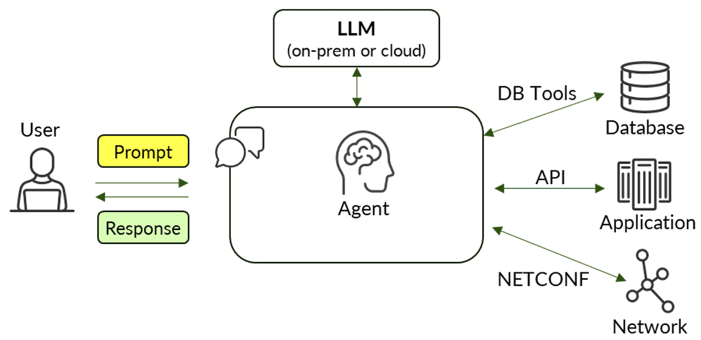

The AI agent executes the function, communicating with the external systems, and provides the response to the LLM. The LLM can evaluate the information and determine whether further information gathering or additional action is necessary based on the context of the conversation. In essence, these functions provided by the agent augment the capabilities of the LLM and lead to more accurate responses and outcomes.

### Agents with MCP

**Inserting MCP**

The [Model Context Protocol (MCP)](https://modelcontextprotocol.io/docs/getting-started/intro) is an open-source, standardized protocol that greatly simplifies the communication between the LLM and the external systems. It uses a client-server model.

The MCP client is a component of the AI agent application, also called the MCP Host. It acts as an intermediary between the LLM and the MCP server which sits in front of the external systems. Via the protocol, the MCP client dynamically learns about the various services advertised by the MCP server. These include functions, or 'tools', which can perform an action as well as 'resources', which are basically any type of file (ex. database, spreadsheet, PDF, etc..) containing data that the LLM may find relevant in addressing the prompt. The MCP client then shares this information, along with the required schemas, with the LLM.

Similar to the original scenario, as part of the LLM's processing it can request that the agent use the appropriate 'tool' or 'resource' when needed and use the returned data to better inform its response. In this case, the agent's MCP client relays these requests to the MCP server which executes the task against the external system using the appropriate communication method. The responses from the MCP server are then relayed by the MCP client back to the LLM.

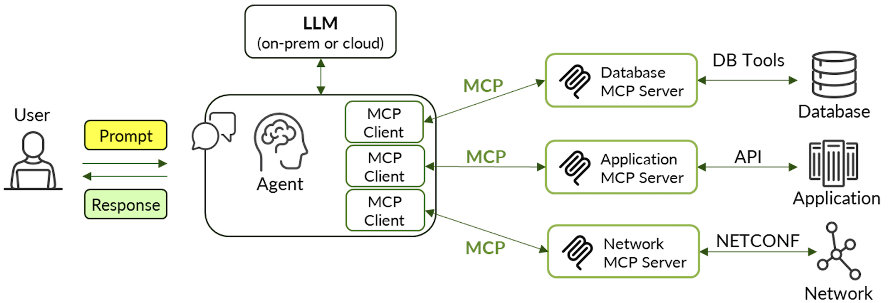

There is a 1:1 mapping between the MCP client and MCP server. In other words, the agent creates a unique MCP client instance corresponding to each server.

There are a few transport options for communication between the MCP client and server. Standard Input/Output (stdio) is used when the client and server are running on the same device. For cases where the client and server are running on different devices, 'streamable HTTP' is the preferred transport over the older Server-Sent Events (sse) method.

**Benefit of MCP**

With MCP, the agent no longer needs to handle direct communication with unique external systems, eliminating the need for custom code for APIs, NETCONF, etc. Instead, the agent, using its MCP client, can easily integrate tools that interact with the various external systems. This approach is simple, consistent, standard, modular, and flexible as the function execution responsibility is now handled by the MCP server.

**AI Agents and Network Automation**

An LLM that is made aware of a set of network devices can be a helpful assistant to network operators and administrators. The natural language interface makes it easy for the end-user to carry out various automation tasks. However, keep in mind that the inputs to the agent don't always necessarily have to be received from an end-user; rather, the inputs may come from other agents or applications as part of a larger automated workflow.

Use cases include gathering information from the network for report generation, archiving configurations/logs, or auditing to assess the state of the network against best practices and organizational policies. The health of devices (ex. memory and CPU utilization) and interfaces (ex. link state and utilization) can be queried to monitor performance. Historical and real-time telemetry data can be analyzed for network planning and network optimization purposes.

Agents can assist with troubleshooting the network. This could involve analyzing traffic contained in a PCAP file, analyzing log files and alarms, and suggesting additional actions towards resolution. Agents can generate and optionally apply device configuration, although currently this process should involve validation by the network operator.

Some examples of using an AI agent as a network operator's assistant are provided in the sections below.

## Junos MCP Server

As an example, consider the MCP Server for Junos devices ([available on GitHub](https://github.com/Juniper/junos-mcp-server)). It is configured to access a set of Junos devices and

provides access to various tools, including:

- executing a Junos command
- retrieving the Junos configuration
- retrieving configuration differences
- gathering device facts
- retrieving a list of known routers
- loading and committing a configuration

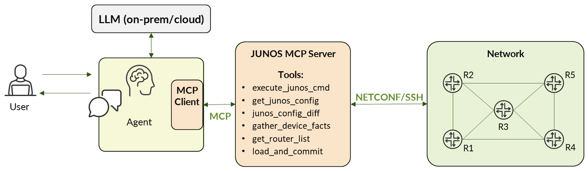

Prompts to the agent can now include references to the Junos devices and operations to perform on them. The LLM will specify which tool(s) to invoke, collect the output provided by the tool(s), and formulate the response.

For example, an end-user can prompt the LLM for the status of all BGP neighbors on a specific router. The response is provided as the result of the following communication flow between the various components:

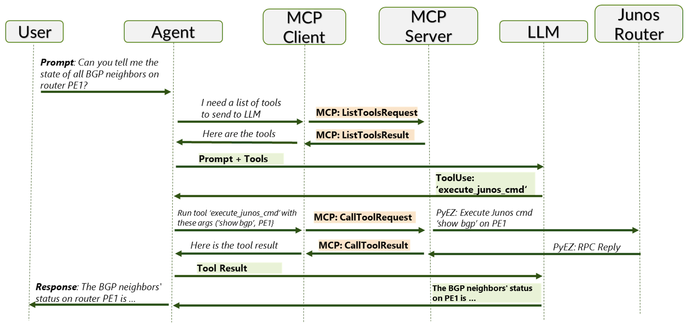

## Lab Example: Using Junos MCP Server

In the POC lab, the Junos MCP server is installed as a Docker container on a headless Ubuntu server. The VS Code application, installed on a Windows laptop, is used as the agent and communicates with the OpenAI GPT-4.1 LLM. The VS Code application includes an MCP Client, which is configured to point to the Junos MCP server using streamable HTTP transport. The Junos MCP server interfaces with the network devices in the POC lab.

### Network Topology

The following topology in the POC lab was used for testing the MCP server. As an initial test, a '.jpg' file containing the following topology diagram was uploaded to the agent's prompt window.

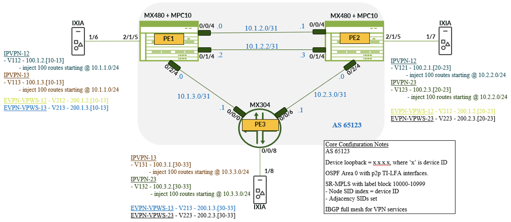

Then the following prompt was requested:

> *Analyze the attached network topology diagram and provide a summary of the devices, topology, configuration, and VPN services.*
> *The LLM's output was very thorough and describes the test network topology very close to 100% accuracy (errors are in strikethrough red).*

**Here is a summary of the attached network topology diagram:**

**Devices:**

- **PE1, PE2: Juniper MX480 routers with MPC10 line cards.**
- **PE3: Juniper MX304 router.**
- **IXIA: Traffic generator/test device connected to each PE.**
- **All routers are part of AS 65123.**

**Topology:**

- **PE1 and PE2 are directly connected via two /31 links (10.1.2.0/31 and 10.1.2.2/31).**
- **PE1 and PE3 are connected via 10.1.3.0/31.**
- **PE2 and PE3 are connected via 10.2.3.0/31.**
- **Each PE has a /24 interface to IXIA for traffic injection.**
- **The topology forms a triangle (full mesh) between PE1, PE2, and PE3.**

**Configuration Notes:**

- **Device loopback: x.x.x.x, where 'x' is the device ID.**
- **OSPF Area 0 with point-to-point TI-LFA interfaces.**
- **SR-MPLS label block: 10000-10999.**

**Node SID index = device ID.**
**Adjacency SIDs are set.**
- **IBGP full mesh for VPN services.**

**VPN Services:**

- **IPVPN-12, IPVPN-13, IPVPN-23: L3VPNs with route injection from IXIA to PE routers.**
- **EVPN-VPWS-12, EVPN-VPWS-13, EVPN-VPWS-23: L2VPN/VPWS services with VPLS IDs and route injection.**
- **Each VPN service injects 100 routes into the respective PEs, with specific address ranges and VPLS IDs.**

**Summary:**

**This is a lab/test topology for Juniper MX routers, demonstrating OSPF, SR-MPLS, and VPN services (L3VPN and EVPN-VPWS) with traffic injection from IXIA. The configuration supports high availability, fast reroute (TI-LFA), and full mesh IBGP for VPN connectivity. Each PE is uniquely identified by loopback and node SID, and the topology is designed for service and protocol testing.**

**Note that the topology diagram does not show the out of band management network that each router is connected to. The communication between the MCP server and the routers is via this management network.**

### MCP Server - Junos MCP Server

**Create the Container**

In this example, the Junos MCP server runs in a docker container on a Linux server. Note that the Junos MCP Server project is available on GitHub: [https://github.com/Juniper/junos-mcp-server/](https://github.com/Juniper/junos-mcp-server/)

First, install docker if necessary - [https://docs.docker.com/engine/install/ubuntu/](https://docs.docker.com/engine/install/ubuntu/)

Then retrieve the Junos MCP Server code from GitHub:

```
git clone https://github.com/Juniper/junos-mcp-server.git
```

Next, create the container:

```
cd junos-mcp-server/

sudo docker build -t junos-mcp-server:latest .
```

**Initial Configuration**

Create a 'devices.json' file which contains a list of the devices and their credentials that the MCP Server will communicate with. Note that both password and SSH key-based authentication methods are supported.

Build the initial device configuration file:

```
# cat > devices.json << 'EOF'
{
    "PE1": {
        "ip": "10.161.32.9",
        "port": 22,
        "username": "jnpr",
        "auth": {
            "type": "password",
            "password": "abcxyz"
        }
    },
    "PE2": {
        "ip": "10.161.33.127",
        "port": 22,
        "username": "jnpr",
        "auth": {
            "type": "password",
            "password": "abcxyz"
        }
    },
    "PE3": {
        "ip": "10.161.39.9",
        "port": 22,
        "username": "jnpr",
        "auth": {
            "type": "password",
            "password": "abcxyz"
        }
    }
}
EOF
```

**Launch Container**

On the Linux server, launch the container to start the server using streamable HTTP transport, listening on port '30030', and referencing the 'devices.json' file.

```
sudo docker run --rm -it -v /home/jnpr/junos-mcp-server/devices.json:/app/config/devices.json -p 30030:30030 --network host --name junos_mcp_server junos-mcp-server:latest python jmcp.py -f /app/config/devices.json -t streamable-http -H 0.0.0.0
```

When the server starts, some initial log messages are displayed, including a confirmation that the MCP Server was able to read in the 3 devices in the 'devices.json' file.

```
(base) jnpr@s551:~/junos-mcp-server$ sudo docker run --rm -it -v /home/jnpr/junos-mcp-server/devices.json:/app/config/devices.json -p 30030:30030 --network host --name junos_mcp_server junos-mcp-server:latest python jmcp.py -f /app/config/devices.json -t streamable-http -H 0.0.0.0
[sudo] password for jnpr:
WARNING: Published ports are discarded when using host network mode
2025-09-26 20:39:04,531 - jmcp-server - WARNING - No .tokens file found - server is open to all clients
2025-09-26 20:39:04,531 - jmcp-server - INFO - Create tokens using: python jmcp_token_manager.py generate --id <token-id>
2025-09-26 20:39:04,531 - jmcp-server.config - INFO - All 3 device(s) validated successfully
2025-09-26 20:39:04,531 - jmcp-server - INFO - Successfully loaded and validated 3 device(s)
INFO:     Started server process [1]
INFO:     Waiting for application startup.
2025-09-26 20:39:04,545 - mcp.server.streamable_http_manager - INFO - StreamableHTTP session manager started
2025-09-26 20:39:04,546 - jmcp-server - INFO - Streamable HTTP server started on http://0.0.0.0:30030
INFO:     Application startup complete.
INFO:     Uvicorn running on http://0.0.0.0:30030 (Press CTRL+C to quit)
```

### MCP Client - VS Code

**Port Forwarding**

Once the MCP Server is running, set up SSH port forwarding on the Windows device so that the MCP Client can connect to the MCP Server. This was required to bypass intermediate firewalls, which were blocking port 30030.

```
ssh -N -L 30030:127.0.0.1:30030 jnpr@10.161.55.1
```

**VS Code Setup**

Download and install the Visual Studio code application from [https://code.visualstudio.com/download](https://code.visualstudio.com/download).

> *NOTE: most current AI agents support the MCP client feature. Feel free to experiment with other popular agents including Claude Desktop and Cherry Studio. Keep in mind that different agents communicate with a subset of LLMs, and many of the cloud based LLMs have hourly, daily, or monthly limitations for their free service tier.*

Once the application is installed, press 'Ctrl-Shift-P' (or 'F1') and select "MCP: Add Server..." then select "HTTP".

Enter the URL to connect to the Juniper MCP Server:  http://localhost:30030/mcp. Then set the name of the server, ex. 'Juniper-mcp-server'.

The JSON configuration for the MCP server is automatically generated and displayed. Note that the file containing the configuration is at
`C:\Users\[username]\AppData\Roaming\Code\User\mcp.json`

```
{
 "servers": {
 "Juniper-mcp-server": {
 "url": "http://localhost:30030/mcp",
 "type": "http"
 }
 },
 "inputs": []
}
```

Above the server name in the configuration file are controls for starting/stopping the server. Ensure that the server is 'Running', if not click "Start".


To view some log messages, ensure that the Terminal is displayed and select the "OUTPUT" tab. Messages indicating that the MCP Client has 'Discovered' tools available on the Junos MCP Server are displayed.

```
2025-10-03 14:34:07.815 [info] Starting server Juniper-mcp-server
2025-10-03 14:34:07.817 [info] Connection state: Starting
2025-10-03 14:34:07.817 [info] Starting server from LocalProcess extension host
2025-10-03 14:34:07.819 [info] Connection state: Running
2025-10-03 14:34:09.162 [info] Discovered 7 tools
```

### Verify Connectivity to MCP Server

Click the Copilot icon at the top of the VS Code window and select "Open Chat". The prompt input area is displayed at the bottom. Ensure the mode is set to "Agent" and for now use the default "GPT4.1" LLM.

In the prompt input area, click the "Configure Tools ..." icon and then type "MCP". Confirm that the configured MCP server and its tools are listed. Note that one can enable/disable the specific tools. For example, if it is not desirable for the LLM to make any configuration changes to the network devices, uncheck the "load_and_commit_config" tool.

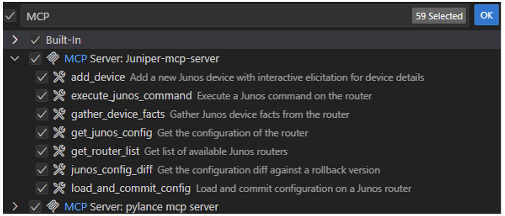

## Use Cases

Enter some prompts to verify that the LLM uses the automation tools provided by the Junos MCP Server.

You must be signed into GitHub from VS Code to submit prompts to the LLM. If necessary, VS Code will automatically prompt you to 'Authorize Visual Studio Code'. In addition, the 'Github.copilot-chat' extension must be installed and enabled.

The first time a tool is used you will be prompted to "Allow" its use. Select the option to either always allow or to allow for the current session.

### Information Gathering - Device Overview

Start with a simple prompt. Note that the LLM can be instructed to save any of its responses to a .CSV or .HTML file.

> *Provide a list of the Juniper routers in the topology and the software version they are running. Help me understand the version and highlight any differences. Display the results in tabular format.*

As the agent is displaying the results, the various tools that are invoked are displayed. For example, in this case the LLM first needs to retrieve the list of routers as shown below using the 'get_router_list' tool. It then uses the 'execute_junos_command' tool to retrieve the output of the "show version | display xml" command on each of the routers.

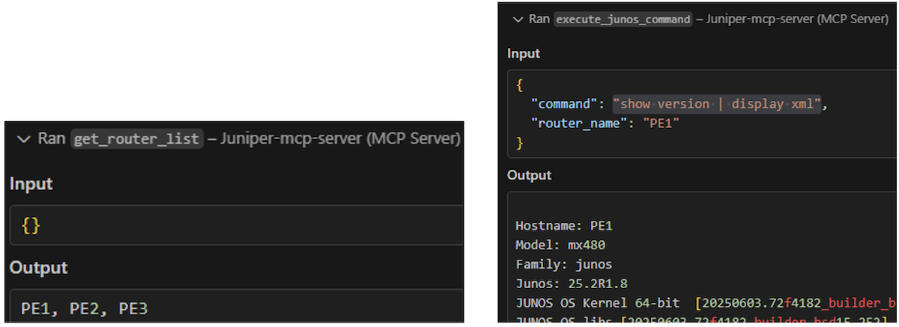

The final output is displayed:

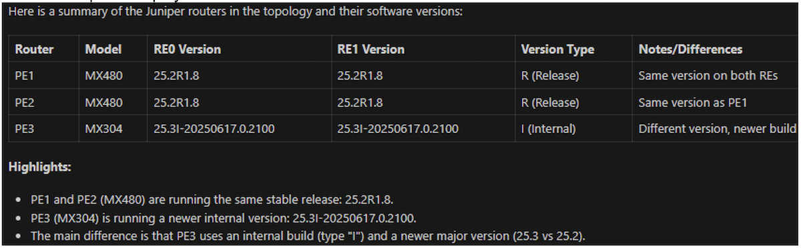

### Information Gathering - Protocol Status

Check the status of the IBGP sessions on PE1 with the following prompt.

> *Provide a summary of all internal BGP sessions on router PE1.*

The LLM requests to use the 'execute_junos_command' tool again to obtain the output of the "show bgp summary" command. The final reply is

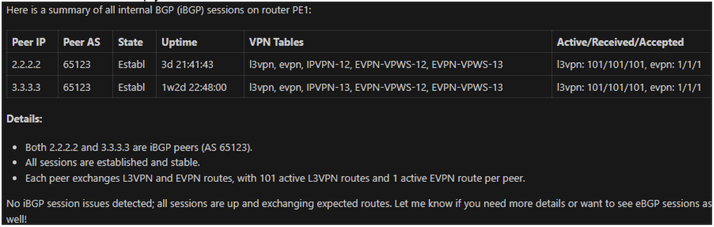

### Information Gathering - Services

View the VPN services available in the network with the following prompt.

> *Provide a summary of the VPN services configured in the network. Display the results in tabular format.*

The LLM requests to use the 'execute_junos_command' tool again on each of the routers to gather the routing instance configuration. The final reply is

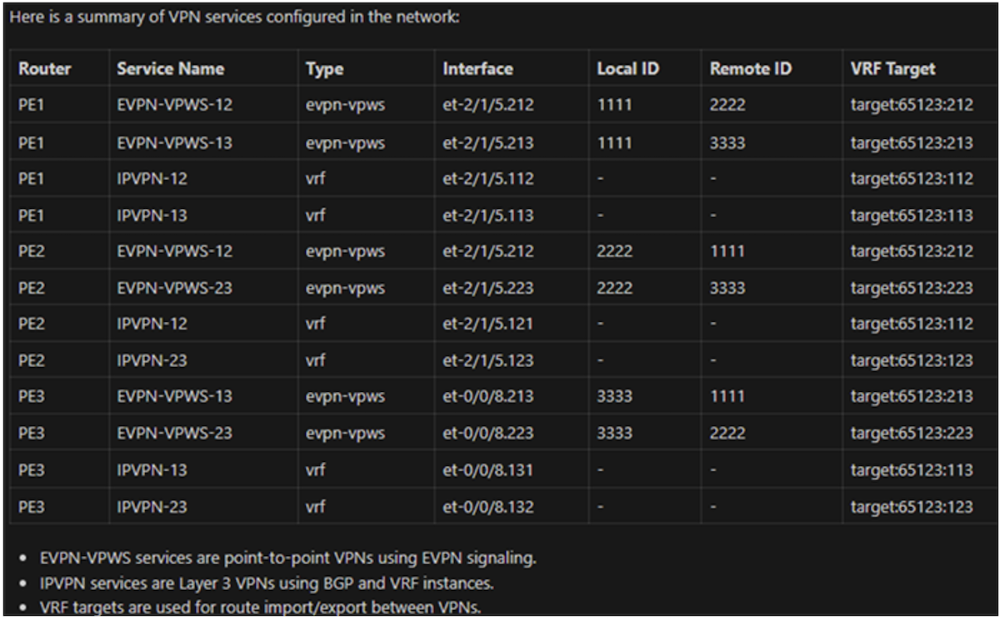

### Archiving Configuration Files

For this test, another MCP server that communicates with Linux servers was started and similarly configured in VS Code (not shown for brevity). This MCP server provides 'tools' to the LLM for uploading/downloading files and executing CLI commands on the Linux server. The MCP server was configured to communicate with a specific Linux server in the POC lab used for backups. The details for connecting to the 'lab' server were provided to the MCP server.

Archive the configuration files using the following prompt:

> *Get the complete configuration of each router and save them to the desktop. Then create a directory called 'configs' on the lab server in the path /home/cse/vg/. Then upload the configuration files to that new directory on the lab server. Then create a compressed tar archive on the lab server and encode today's date in the file name.*

The LLM first requests the "get_junos_config" tool to obtain the configuration. The configuration file for each router appears on the Windows desktop. The LLM then invokes tools to interact with the Linux server to upload the configuration files and perform the creation of the tar archive.

```
cse@Common-SVCS-FileShare:~/vg$ ls -l config*
-rw-rw-r-- 1 cse cse  336 Oct  2 09:22 configs-2025-10-02.tar.gz

configs:
total 12
-rw-rw-rw- 1 cse cse 128 Oct  2 09:21 PE1.conf
-rw-rw-rw- 1 cse cse 128 Oct  2 09:21 PE2.conf
-rw-rw-rw- 1 cse cse 141 Oct  2 09:21 PE3.conf
```

### Check Device Health

Perform a basic health check on one of the routers using the prompt:

> *Check the memory and cpu utilization on PE1*

The LLM requests to use the 'execute_junos_command' tool on the PE1 router to obtain the output of "show chassis routing-engine". The final reply is:

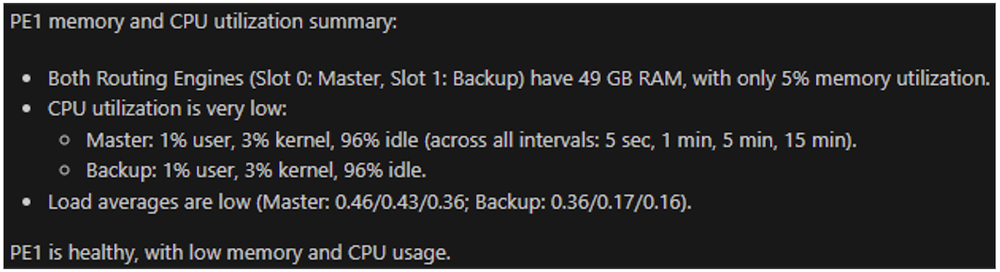

### Check Interface Health

Check the bandwidth utilization of the core facing interfaces in the network with the following prompt:

> *What is the bandwidth utilization on all core facing interfaces on all routers? Display the results in a table including the rates in bits per second and utilization percentage based on the link speed.*

The LLM invokes the "execute_junos_command" tool to obtain the output of the "show interfaces <interface> extensive" command for each of the core interfaces. For example:

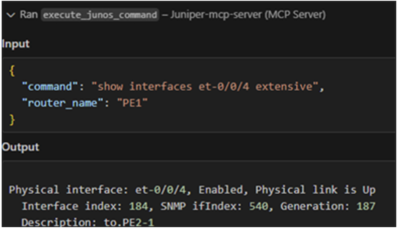

The LLM provides the results in a table:

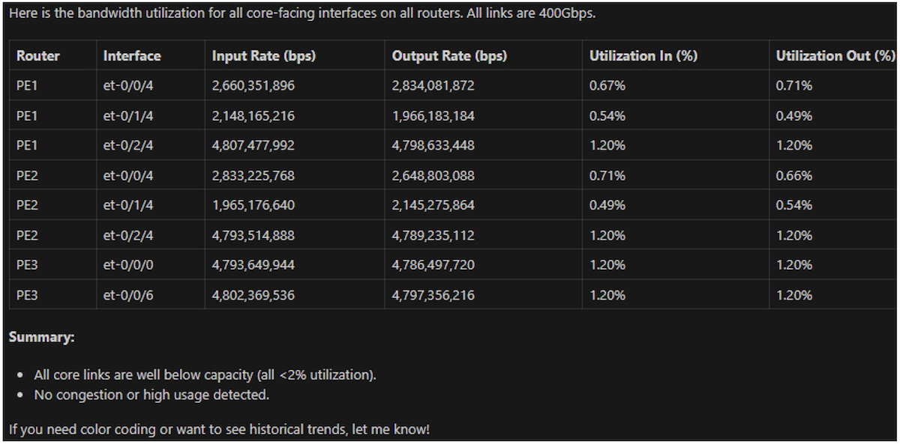

### Troubleshooting - Link Down Scenario

Simulate a link failure by disabling the access interface on PE2 via the shell:

```
jnpr@PE2> start shell user root
Password:
root@PE2:/var/home/jnpr # ifconfig et-2/1/5 down
```

Then work with the agent to troubleshoot. First, check status of BGP in the IPVPN only with the following prompt:

> *Check the state of BGP in the VPN routing instances of type 'vrf' on all devices.*

The LLM erroneously shows the BGP status for all sessions instead of only the BGP sessions running in the VRFs. In any case, 2 of the sessions are "Idle"

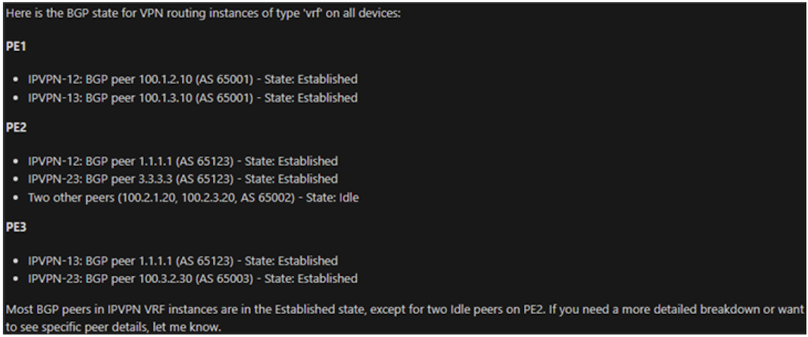

Follow up with the LLM regarding the 'Idle' sessions with the prompt:

> *Why are there two idle peers on PE2? Can you investigate and reply with some probable causes?*

The LLM returns:

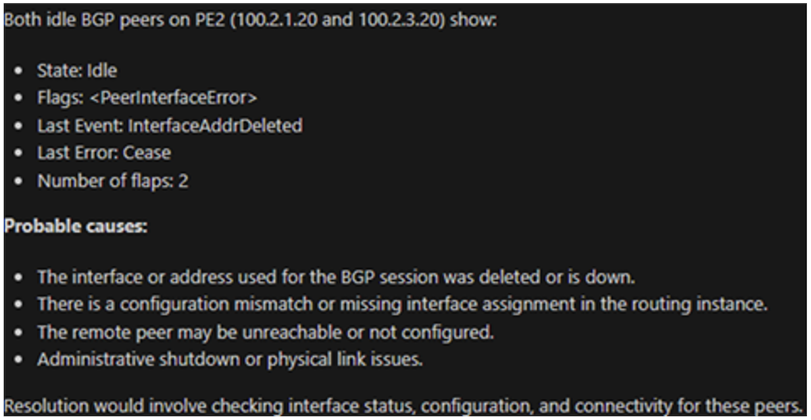

Check the interface status with the following prompt:

> *Can you check the interface status used for the BGP session that is down on PE2?*

The LLM returns

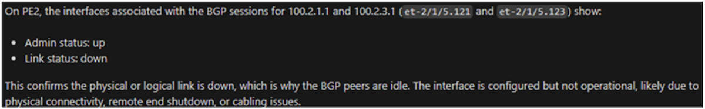

Check the log file with the following prompt:

> *Can you check the log file on PE2 to determine why the link associated with the Idle BGP sessions is down?*

The LLM returns:

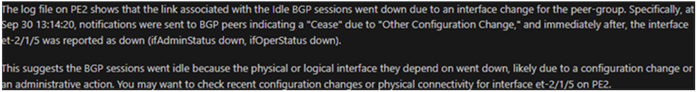

When finished, restore the link on PE2:

```
ifconfig et-2/1/5 up
```

### Troubleshooting - Analyze Log

Ask the agent to analyze the 'messages' file and provide a summary report with the following prompt:

> *Check the messages log on router PE1 and provide a summary of any snmp traps, link issues, or protocol issues that were generated over the last week. Include the timestamps. Generate an HTML report with your findings and save it to the desktop.*

The HTML report is generated

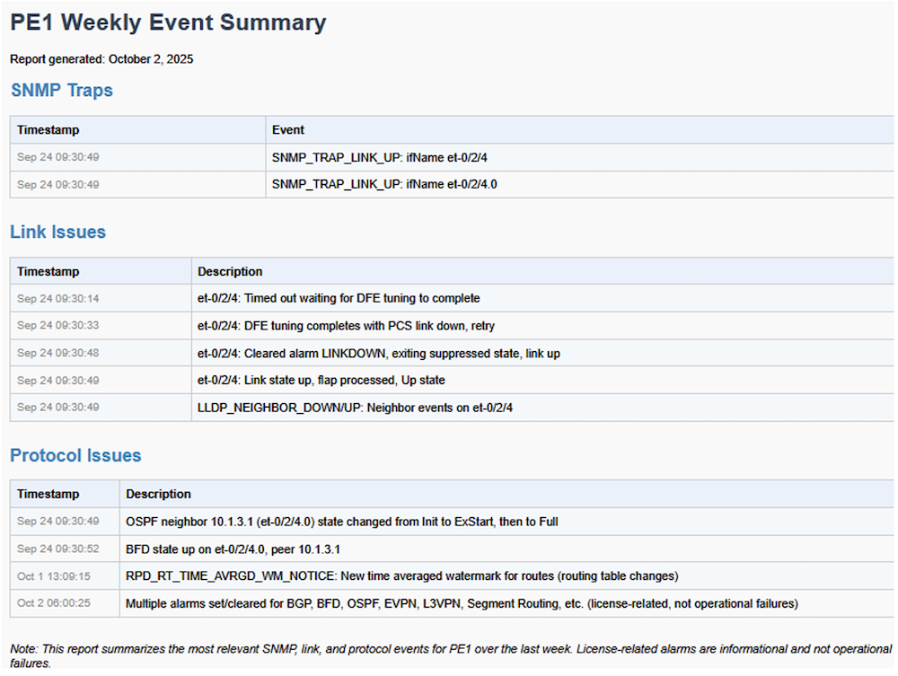

### Reasoning - What-If Scenario

Propose a hypothetical scenario to the agent. In this example, ask the agent about reachability if a specific link goes down using the following prompt:

> *Analyze the routing table on PE1. Suppose the direct link to PE3 an interface et-0/2/4 is down. How can PE1 still reach PE3?*

The LLM reasons that a backup route exists due to the use of dynamic routing protocols but does not provide any specifics:

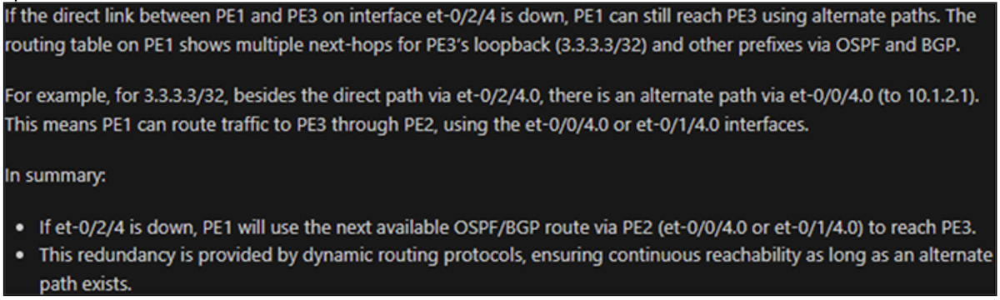

Ask for more details with the following prompt:

> *Please show me the specific route entry.*

The LLM returns the route entry to reach the destination router and the backup next-hop:

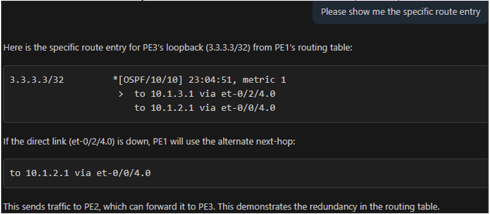

### Provisioning

Ask the agent to add some simple configuration to one of the routers with the following prompt:

> *Can you add loopback 100 with IP address 192.168.1.1 on router PE1 and place it in the IPVPN-12 routing instance?*

The LLM generates the requested configuration and invokes the "load_and_commit_config" tool:

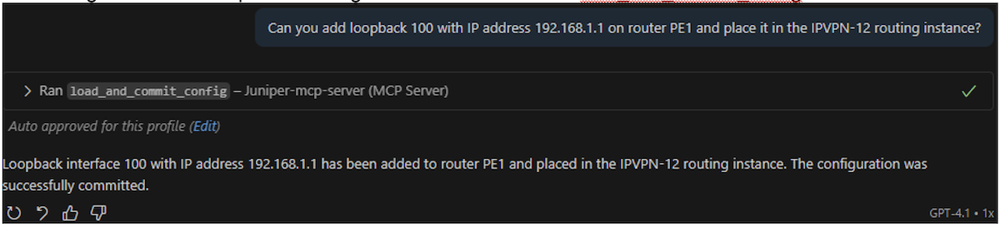

From the router CLI, it is confirmed that the configuration was modified:

```
jnpr@PE1> show configuration | compare rollback 1
[edit interfaces lo0]
+    unit 100 {
+        family inet {
+            address 192.168.1.1/32;
+        }
+    }
[edit routing-instances IPVPN-12]
+    interface lo0.100;
```

Next, roll back the configuration with the following prompt:

> *Can you rollback that last configuration change?*

Again, the "load_and_commit_config" tool is invoked to rollback the previous configuration as verified on the router:

```
jnpr@PE1> show configuration | compare rollback 1
[edit interfaces lo0]
-    unit 100 {
-        family inet {
-            address 192.168.1.1/32;
-        }
-    }
[edit routing-instances IPVPN-12]
-    interface lo0.100;

jnpr@PE1>
```

## Conclusion

An overview of AI agent was presented as well as the role of MCP to reduce the code complexity of the agent and enable a standard and flexible way for the LLM to interact with various types of external devices.

The Junos MCP Server was started in the POC lab to demonstrate some simple network automation use cases to gather information, archive configuration files, check device and interface health, aid in troubleshooting, and provisioning. In each instance, the network operator interacted with the agent using natural language. The agent used its MCP client to relay function, or 'tool', calls from the LLM to the MCP Server which executed the automation task against the Juniper network devices. Note that no code was written to perform any of the automation tasks.

Not shown were prompts in which the LLM outputs were not satisfactory. For example, asking it to draw a diagram based on the LLDP neighbor information did not yield accurate results. In general, further experimentation and testing using other LLMs and advanced prompt engineering against larger, more complex, topologies involving additional protocols are warranted. It is recommended to use larger, foundational LLMs if possible for best results.

NOTE: this paper was written by a human, not AI
;-)

## Useful links

- [1] MCP documentation - [https://modelcontextprotocol.io/docs/getting-started/intro](https://modelcontextprotocol.io/docs/getting-started/intro)
- [2] Junos MCP Server - [https://github.com/Juniper/junos-mcp-server/](https://github.com/Juniper/junos-mcp-server/)
- [3]  Visual Studio code application: [https://code.visualstudio.com/download](https://code.visualstudio.com/download)
- [4] MCP for Datacenter Networks - Apstra MCP Server - by Nitin Vig
[https://medium.com/%40vignitin/mcp-for-datacenter-networks-aa003de81256](https://medium.com/%40vignitin/mcp-for-datacenter-networks-aa003de81256)
- [5] "Agentic AI and MCP for Routing Director" -  by Mohan Raj Davala
[https://junipernetworks.sharepoint.com/sites/apacseblog/SitePages/Agentic-AI-and-MCP-for-Routing-Director.aspx](https://junipernetworks.sharepoint.com/sites/apacseblog/SitePages/Agentic-AI-and-MCP-for-Routing-Director.aspx)
- [6] Reimagining Network Operations with AI - Juniper Techpost
[https://juniper.github.io/techposts/reimagining-network-operations-with-ai/article](https://juniper.github.io/techposts/reimagining-network-operations-with-ai/article)
- [7] MCP Client and Server Marketplace - [https://mcp.so/](https://mcp.so/)
- [8] LinkedIn Learning - MCP Hands On example
[https://www.linkedin.com/learning/model-context-protocol-mcp-hands-on-with-agentic-ai/using-mcp-servers-in-cursor](https://www.linkedin.com/learning/model-context-protocol-mcp-hands-on-with-agentic-ai/using-mcp-servers-in-cursor)

### Acronyms

- AS: Autonomous System
- BGP: Border Gateway Protocol
- CLI: Command-Line Interface
- EVPN-VPWS: Ethernet Virtual Private Network -- Virtual Private Wire Service
- IBGP: Internal Border Gateway Protocol
- JSON: JavaScript Object Notation
- L2VPN: Layer 2 Virtual Private Network
- L3VPN: Layer 3 Virtual Private Network
- LLM: Large Language Model
- MCP: Model Context Protocol
- NETCONF: Network Configuration Protocol
- OSPF: Open Shortest Path First
- POC: Proof of Concept
- SR-MPLS: Segment Routing -- Multiprotocol Label Switching
- TI-LFA: Topology-Independent Loop-Free Alternate
