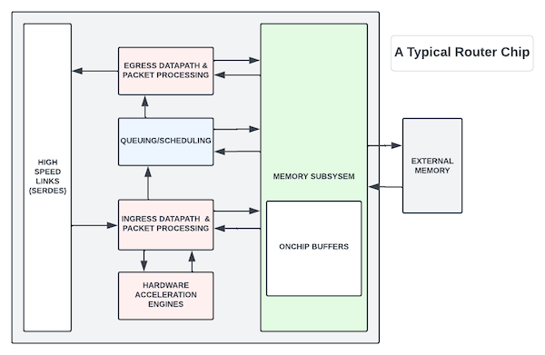

# Networking Chips vs GPUs/CPUs

**Sharada Yeluri - 07/01/2022**

## Introduction

In this era of CPUs, GPUs, and AI inference chips (often stripped-down versions of GPUs with a focus on matrix operations), where every other semiconductor start-up is trying to build either a CPU core or an AI chip, networking chips are not getting the fanfare they used to enjoy decades earlier. There is also some misconception that innovation has slowed down in networking silicon.

I am also surprised to see how little new college graduate engineers know about networking silicon - partly due to the focus on computer architecture in their digital design courses and projects. In this article, I try to shed light on networking ASICs and why they are as complex and exciting to build as GPUs and CPUs. It is a good primer for those of you exploring careers in the networking silicon field.

## Networking Chips

Networking chips (also called network processors) started getting momentum in the mid-90s, with Juniper at the forefront of the revolution, when we figured out how to do the longest prefix match lookups in hardware!

What is a networking chip?

In a broad sense, it is a chip that can receive network traffic (in the form of packets) from multiple links, can inspect some or all of the L2/L3/L4 protocol headers inside the packets, and take action. The term packet processing is used to describe the task of inspecting the packet headers and deciding the next steps. The action can be forwarding the packet to the Host, queuing and scheduling to go out from one of its output links, or dropping the packet if it violates some traffic rules or security checks.

There are many variations of the networking chips depending on where they are used. Some only do L2 (Ethernet) switching, and some can look at L3 (usually IP) and MPLS labels as well for routing the traffic in access/edge/aggregation and service provider networks. Some chips look deeper into the packet for analyzing security threats. Some networking functions have made their way into smart NICs to offload the CPUs. In the following sections, I focus more on the high-end routing chips Juniper Networks and other vendors build and compare them to GPU/CPUs.

What happens in a networking chip? As I explained before, the primary responsibility of these chips is to receive packets, inspect the headers and figure out the destiny of the packets. While that summary might sound simple at a very high level, a lot goes on in that process, and these chips consist of complex subsystems that do these tasks at hundreds of gigabits per second.

A networking chip's performance is measured by how many Gbps (Gigabits per second) of traffic it can process at line rate without dropping the packets and the minimum packet size for meeting this rate.

## Evolution

As with GPUs/CPUs, to keep up with Moore's law and to get the best Power Performance and Area ([https://en.wikichip.org/wiki/power-performance-area](https://en.wikichip.org/wiki/power-performance-area)) per gigabit of traffic, networking chip vendors started packing more and more into a single die by using the latest process nodes, increasing the port density and doing all the functions (packet processing, queuing/scheduling) in a single chip. For example, in the late nineties, we typically needed a set of 4-5 chips (with functions divided across them) to achieve 20Gbps routing capability using a 250nm process. The current generation of high-end networking chips can achieve tens of terabits per second in a single die in 5-7nm process nodes.

## Hundreds of Cores

CPUs have processing cores that execute instructions of an ISA architecture they support. The instructions can do arithmetic and logic operations at high rates, among many other functions. GPUs are specialized graphic processing units that can do fast vector and matrix processing for graphic and machine learning applications. These chips often have hundreds of processing cores instantiated in the die to get higher throughput (where each core could be working on a different application/thread).

You will find similar concepts in networking chips used in high-end routers. We have packet processing engines that can inspect the packets and make decisions on the packet's next hop. The network traffic from a source goes through many routers before it gets to the destination, next-hop refers to the next router/networking device the packet needs to go to reach the final destination. To get the massive bandwidth, like CPU/GPUs, many networking chips also rely on instantiating these processing engines hundreds of times (with each processing core working on a different packet).

## Hardware Acceleration

CPU/GPU cores often have hardware acceleration engines outside the processing cores (like the tensor processing unit in Nvidia's high-end GPUs) to speed up dedicated functions. The most complex of the tasks in a routing chip (that forwards the packets based on layer-3 IP addresses) is the route lookup that involves the longest prefix match on the destination IP address of the packet. Many companies have developed and continue to refine their proprietary algorithms (using hardware acceleration) to store millions of entries of the routing table and do longest prefix matches at terabits per second rates. Similarly, other special tasks like firewalls, deep packet inspection for security, etc., are often done using dedicated acceleration engines.

## Memory Technologies

Like GPU/CPUs, networking chips leveraged the advances in external memory technologies and use either DDR5/GDDR6 or the HBM2/3 memories (in a 2.5D package) to store routing tables (that contain information on the next-hop for the packets), accumulate analytics/statistics, and buffer the packet contents while the headers are being parsed. Once you have data in external memory that has hundreds of cycles of latency, you need caches to keep the frequently used data on the chip. Like CPUs, networking chips rely heavily on the hierarchy of caches to store frequently used/updated tables closer to where they are consumed. With caches comes the complexity of implementing the cache controllers and keeping them coherent.

Since going to external memory is expensive, CPUs/GPUs and networking chips continue to invest more die area for on-chip memories, which are used to share L1/L2 caches and shared memory across the processing cores in CPUs. The on-chip buffers in networking chips are used to keep more frequently used lookup tables and other stateful data. These buffers also hold on to packets when there is less congestion.

With terabits per second of traffic being written/read out of these on-chip buffers from many network ports, providing read and write bandwidth for the accesses gets challenging. Placement and routing are also concerns with buffers shared by all the clients. CPU/GPU and networking chips rely on clever algorithms to statically partition the memory and wiring bandwidths across the clients.

## Queuing/Scheduling

In addition to processing the network traffic, a routing/switching chip needs to deal with congestion (where traffic coming from multiple input links tries to go out from a few output links), and it needs to make sure high priority traffic (like video or control traffic) can go out properly without drops during congestion scenarios. The chips also have to meter the traffic and ensure that Quality of Service (QOS) is met for different priorities or customers. For this, networking chips have complex scheduling and queuing subsystems. At a very high level, as the packets arrive, these subsystems store the packets in either on-chip or off-chip memories and create a linked list of these packets based on their final destination queues. And after packet processing is completed, the scheduler meters out the traffic from these queues. Building line rate schedulers with different priority levels at thousands of gigabits per second of traffic rate involves highly complex pipeline implementations with bypasses.

## High-Speed Interfaces and Chip-to-Chip Links

Networking chips, as well as CPU/GPUs, receive traffic/data through high-speed SerDes. SerDes is a functional block that **Ser**ializes and **Des**erializes data. SerDes can support multiple data rates and standards like PCIe and Ethernet. Networking chips often push SerDes technologies to run faster year over year. Many high-performance networking chips have transitioned to 50-100 Gbps to carry high rates of ethernet traffic to their cores. For example, the Triton chip from Juniper, which is already shipping in the PTX platform, supports 50 Gbps SerDes with 64 of these SerDes together supporting 3.2Tbps (Terabits per second) Ethernet traffic.

CPU/GPU chips use SerDes to talk to each other or to the other components on the board using PCIe protocol. For example, in a typical high-end graphics processor, the server chip on the motherboard can talk to the GPU in a graphics card through a 16-lane PCIe in Gen4 - with each lane running at 16 Gbps.

CPUs and networking vendors also invested heavily in custom technologies to connect multiple chips on the board or in a system. Like Nvidia's NVLinks that connect multiple GPU cores, Juniper has a proprietary fabric interface that can connect many networking chips in the line cards through the switch fabric. CPUs can talk to each through the PCIe physical layer running CXL protocol for coherent access at high speed.

## Power Challenges

With the high bandwidth packed in these chips, it is all the more important to keep the power consumption as minimal as possible to reduce the cooling costs and to keep the system cost down. Processing and networking chips are aggressively using clock gating (coarse clock-gating to shutdown processor cores and fine-grained clock gating to turn off the clock to the flops during idle periods), voltage islands, and advances in EDA tools that can automatically optimize the RTL and physical design for power to keep the power consumption to a minimum.

## Future

With Moore's law coming to an end, many CPU/GPU and networking chip vendors are looking into multi-die packages with high-speed die-to-die links to pack more bandwidth inside the packages.

In addition, CPU/GPU vendors continue to build different variants of their chips (with the flexibility to select between processing power and memory/IO capacity) to cater to different applications. AI inference chips are a category of GPUs with a focus on matrix and/or vector processing (with features related to graphics processing optimized away).

On the networking side, companies like Juniper Networks continue to offer multi-silicon solutions. For example, the chips built for core routers focus on packing more bandwidth at the expense of flexibility in processing. In these chips, the majority of the packet processing is done by hardware acceleration engines (fixed-pipeline packet processing) to get an area andperformance advantage.

Whereas the chips targeted for business-edge applications offer more flexibility in packet processing and logical scale (by relying on packet processing engines for most of the features) with slightly lower throughputs. Going forward, custom silicon solutions for targeted applications are a must as one can only pack so much in a die.

## Summary

As you can see, the advances in networking silicon have been happening at the same exponential rates as CPU/GPUs in the last two decades. We have used the advances in the process nodes, memory technologies, and high-speed interfaces, coupled with custom acceleration engines to pack more functionality and bandwidth in each die - similar to our counterparts in the CPU/GPU world.

Juniper's first system in the late nineties could handle 20Gbps of network traffic with multiple Asics to handle processing and queueing functionalities. Juniper has recently introduced a chip (Express 5 Silicon in 7nm process) capable of handling 28800Gbps of traffic from a single chip. This is a 1440x improvement!

In the same period, the single thread CPU performance as measured in the SpecINT benchmark also went up by 1000-1200x. GPUs also saw an explosion in FLOPs or floating-point operations per cycle (although at a slightly lower rate, ~400x).

There is constant innovation and tons of learning opportunities in both processing and networking silicon fields. The skills one develops building one kind of chip are often applicable to all chips in general!

## Glossary

- ASIC: Application Specific Integrated Circuit
- CPU: Central Processing Unit
- CXL: Compute Express Link
- DDR: Double Data Rate
- EDA: Electronic Design Automation
- FLOPS: FLoating-point Operation Per Second
- GPU: Graphical Processing Unit
- HBM: High Bandwidth Memory
- ISA: Industry Standard Architecture
- NIC: Network Interface Card
- PCIe: Peripheral Component Interconnect Express
- QoS: Quality of Service
- RTL: Register-Transfer Level
