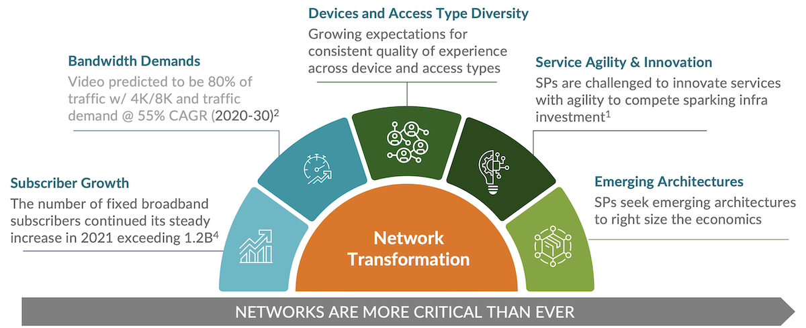
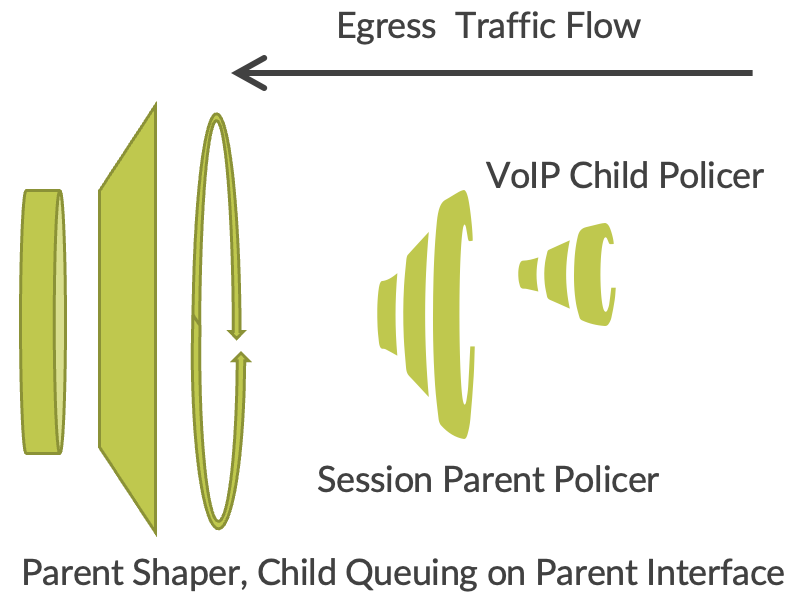
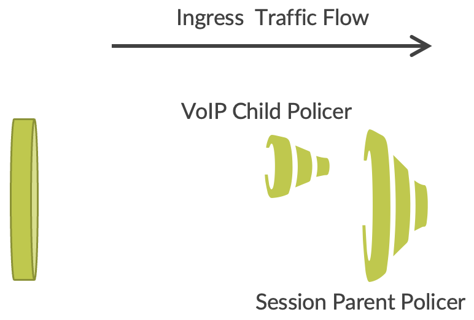

# New Subscriber QOS for Next Generation Broadband

**Horia Miclea - 04/04/2023**

Broadband services are evolving with cloud streaming and advanced video, a new BNG QOS model for subscribers is required to optimise latency, throughput and scale. This techpost introduces a new subscriber QOS model based on Hierarchical Policers.

## Broadband Market Trends

Fixed broadband is the engine driving digital connectivity for billions of consumers and most of the world's enterprises. In 2021, there were more than 1.2 billion broadband subscribers globally, and the market continues to grow. CSPs struggle to address changing traffic patterns driven by cloud services like cloud gaming and video streaming that are already delivered at 4k resolutions.

Explosive growth in cloud and Software-as-a-Service (SaaS) traffic, as well as bandwidth-intensive applications like 4K video and gaming, naturally demand more capacity, lower latency, and better economics. There are emerging architectures as the Broadband Network Gateway (BNG) service edge distribution, control and user plane disaggregation that help in this respect but also more efficient subscriber Quality of Service (QOS) models that adapt better to the cloud streaming paradigm. Most of cloud streaming services rely on an HTTPS transport model for MPEG adaptive rate codecs, hence, MPEG-DASH (Dynamic Adaptive Streaming Streaming) used by many and Apple's HTTP Live Streaming (HLS), combined with a client application/appliance that buffers and is capable to signal to the cloud service the network congestion in order for the streamer to reduce the codec resolution. With such a model, policers are enough, enabling lower latency and better economics under scale than using Hierarchical QOS models combining shaping and queuing,



- [Global Market Data Forecast by ITU](https://www.researchgate.net/figure/Global-mobile-data-traffic-forecast-by-ITU-Overall-mobile-data-traffic-is-estimated-to_fig1_331159423)
- [Small Biz Trends](https://smallbiztrends.com/2021/11/remote-work-statistics.html)
- [Cisco Annual Internet Report](https://www.cisco.com/c/en/us/solutions/collateral/executive-perspectives/annual-internet-report/white-paper-c11-741490.html)
- [Flexera - State of the Cloud Report 2020](https://www.flexera.com/about-us/press-center/flexera-releases-2020-state-of-the-cloud-report)

## A New Subscriber QOS Model

The next generation broadband services may cover a simplified service set, with SP delivered VoIP and Internet, with cloud streaming video and gaming services at high speeds up to 100Mbps at peak. A new QOS model is possible in this context replacing the per subscriber Hierarchical QOS (parent shaper, child diffserv queuing) with a hierarchical policer, that can be applied ingress and egress per session, improving the latency, throughput and scale and removing the need for per subscriber SLA enforcement upstream in the Access Nodes.

- The child policer enforces the VoIP SLA, marks, and prioritizes the VoIP service to pass through.
- The parent policer applied on the session, rate limits the Internet as per session SLA (upstream or downstream) while guarantying the VoIP traffic

The parent hierarchy levels, Ethernet interfaces, PWHT (pseudo wire headend) maintain aggregated diffserv queuing and shaping as required.

The egress QOS model shows the Hierarchical Policer on the subscriber session and the Hierarchical QOS (parent shaper, child diffserv queuing) on the parent interface level for the downstream direction (from Internet to subscriber).



The ingress QOS model shows the Hierarchical Policer model applied on the subscriber session for the upstream direction (from subscriber to Core/Internet). Generally, no other parent QOS policies are applied on the BNG in the upstream direction.



This QOS model based on Hierarchical Policers improves the latency for cloud streaming, guarantees VoIP as priority traffic, improves the throughput per subscriber if deployed using the latest technology like Trio 6 hardware, and simplifies operations while the same QOS model is applied dynamically through RADIUS upstream and downstream on the BNG, also removing the need of per subscriber SLA enforcement in the Access Nodes (MSANs, OLTs, FTTx Access Switches).

## Platforms and Scale

This subscriber QOS model is available first on [MX304](https://juniper.github.io/techposts/mx304-deepdive/article), enabling  48,000 subscriber sessions per LMIC, up to 96,000 session per chassis, assuming Routing Engine redundancy.  Assuming full capacity on an LMIC, the model enables up to 30 Mbps per subscriber.

Here is a set of show commands presenting a MX-304 BNG system running with 96,000 IPoE sessions with ingress and egress Hierarchical Policer,  across 3 LMICs:

```
egress@r2mx304wf# run show subscribers summary
 
Subscribers by State
   Active: 192000
   Total: 192000
 
Subscribers by Client Type
   DHCP: 96000
   VLAN: 96000
   Total: 192000
 
[edit]
regress@r2mx304wf# run show subscribers summary port
 
Interface           Count
ae0: xe-0/0/1:0     16000             
ae1: xe-0/0/11:0    16000             
ae2: xe-0/1/1:0     16000             
ae3: xe-0/1/11:0    16000             
ae4: xe-0/2/1:0     16000             
ae5: xe-0/2/11:0    16000             
 
Total Subscribers: 96000
 
[edit]
regress@r2mx304wf# run show system resource-monitor summary
Resource Usage Summary
 
Throttle                       : Enabled     
Load Throttle                  : Enabled     
Heap Mem Threshold             : 92  %
IFL Counter Threshold          : 92  %
Round Trip Delay Threshold(ms) : 1000
Filter Counter Threshold       : 100 %
Expansion Threshold            : 95  %
CoS Queue Threshold            : 100 %
MFS threshold                  : 92  %        Used : 0  
 
Slot # 0  
     Client allowed                   : Yes 
     Service allowed                  : Yes 
     Heap memory used                 : 2833313792      In % : 45 
     Average Round-trip Delay(ms)     : 2    (30  )     Round-trip Delay(ms) : 0  
 
     MAX session rate allowed(%)      : 100
     Client denied                    : 0              
     Service Denied                   : 0    
     Performance Denial Client        : 0    
     Performance Denial Service       : 0  
     IFL Denied                       : 0  
 
                Filter counter memory      IFL counter memory   Expansion memory
      PFE #           used  |   %             used  |   %          used  |   %
          0       60752592     60         26156384     77      85420864     26
          1       60752592     60         26156384     77      85420864     26
          2       60752208     60         26156000     77      85420800     26
          3       60752208     60         26156000     77      85420800     26
          4       60752016     60         26155808     77      85387904     26
          5       60752016     60         26155808     77      85387904     26
 
     CoS Queue Utilization
     PFE #   Scheduler Block #        Used      %
         0                   0         176      0
         1                   0         176      0
         2                   0         176      0
         3                   0         176      0
         4                   0         176      0
         5                   0         176      0
```

## Hierarchical Policer Configuration

A policer is a standalone construct and an action of a firewall filter

- A firewall filter may be statically configured and referenced by a dynamic client profile
    - Policer is also statically provisioned and referenced by the static filter as an action
    - Multiple, static firewall filters may be configured such that RADIUS attributes specify those assigned to the subscriber for ingress and/or egress
- A parameterized filter may also be configured by a dynamic service profile, supporting optional arguments
    - May configure ingress and/or egress filters, customized by parameter values
    - A parameterized policer may also be defined

A hierarchical policer supports means to reserve bandwidth for priority traffic over aggregate bandwidth:

- A good match for VoIP + Internet service use case:
    - Voice is priority traffic receiving reserved bandwidth from the aggregate bandwidth
    - Internet service uses the aggregate bandwidth, including premium bandwidth, if unused
    - Premium bandwidth/rate assumed to be much smaller than aggregate bandwidth/rate
- Takes the resources of two conventional policers
    - Service plan variations and thus the number of distinct h-policers will dictate scaling impact, if any
- For this use case, h-policer is configured for downstream and upstream directions
    - If symmetric, one h-policer template is used for both directions, but separate policers are still used by the ASIC

Filters and thus policers are family based:

- Dual-stack requires an h-policer to be configured as a logical-interface-policer
    - Policer thus spans both subscriber address families to "share" the policer bandwidth
- H-policer defines the following:
    - Aggregate bandwidth
        - Represents subscriber's total bandwidth, aligning with service plan, access-line capabilities, etc.
        - Defined by bandwidth limit in *bps* and optional burst-size-limit
        - Actions on exceeding the limit is packet discard or alternatively forwarding-class and loss-priority
    - Premium bandwidth
        - Represents reserved bandwidth from the aggregate for priority traffic-- e.g., VoIP service
        - Defined by bandwidth limit in *bps* and optional burst-size-limit
- Action on exceeding the limit is discard only

Firewall filter with h-policer action will generally follow the following structure:

- One or more terms with match conditions to identify priority traffic to be policed at the VoIP service SLA
    - Match on forwarding-class (FC) or L4 and/or L3 (UDP/TCP ports, IP address, etc.) to identify VoIP traffic or other priority traffic. Action:
        - Force-premium may be used to explicitly mark traffic as premium
        - Next term may be used to reference the h-policer
- One term to reference the h-policer and serve as default for non-premium traffic
    - May consist of only accept and policer <name> actions
        - Traffic marked as premium (either by force-premium or corresponding FC) is subject to premium bandwidth limit
        - Remaining (and all) traffic subject to aggregate bandwidth limit

> Note that using forwarding-class as match term implies BA classifier and/or MF classifier is applied beforehand

Here is an example for a firewall static filter configuration for the IPv4 address family, filtering both upstream and downstream directions, marking VoIP as premium (EF diffserv), and applying a hierarchical policer for all the subscriber traffic:

```
firewall {            
    family inet { 
        filter RateLimit-Up {   
            interface-specific;
            term Voice {
                from {
                    forwarding-class Voice;
                }
                then {
                    force-premium;
                    next term;
                }
            }
            term AllTraffic {
                then {
                    hierarchical-policer Rate-Limit-50m;
                    accept;
                } 
            }
        }
        filter RateLimit-Down {   
            interface-specific;
            term Voice {
                from {
                    forwarding-class Voice;
                }
                then {
                    force-premium;
                    next term;
                }
            }
            term AllTraffic {
                then {
                    hierarchical-policer Rate-Limit-100m;
                    accept;
                } 
            }
        }
    } 
}
```

Here is an example for a firewall static filter configuration for the IPv6 address family, filtering both upstream and downstream directions, marking VoIP as premium (EF diffserv), and applying a hierarchical policer for all the subscriber traffic:

```
firewall {            
    family inet6 {
         filter RateLimitv6-Up {   
            interface-specific;
            term Voice {
                from {
                    forwarding-class Voice;
                }
                then {
                    force-premium;
                    next term;
                }
            }
            term AllTraffic {
                then {
                    hierarchical-policer Rate-Limit-50m;
                    accept;
                } 
            }
        } 
        filter RateLimitv6-Down {   
            interface-specific;
            term Voice {
                from {
                    forwarding-class Voice;
                }
                then {
                    force-premium;
                    next term;
                }
            }
            term AllTraffic {
                then {
                    hierarchical-policer Rate-Limit-100m;
                    accept;
                } 
            }
        }
    } 
}
```

Here is an example for the firewall hierarchical policer named "Rate-Limit-50m" configuration, that based on the filter configuration is applied upstream, and limits VoIP at 10Mbps, with a burst of 16kb and the whole subscriber traffic to 50Mbps, with a burst of 16k:

```
firewall {            
    hierarchical-policer Rate-Limit-50m {                
        logical-interface-policer;                
        filter-specific;                
        aggregate {                    
            if-exceeding {                        
                bandwidth-limit 50m;                        
                burst-size-limit 16k;
            }                    
            then {                        
                discard;
            }                
        }                
        premium {                    
            if-exceeding {                        
                bandwidth-limit 10m;                        
                burst-size-limit 16k;
            }                    
            then {                        
                discard;                    
            }                
        }            
    }
}
```

Here is an example for the firewall hierarchical policer named "Rate-Limit-100m" configuration, that based on the filter configuration is applied dowstream, and limits VoIP at 10Mbps, with a burst of 16kb and the whole subscriber traffic to 100Mbps, with a burst of 16k

```
firewall {            
    hierarchical-policer Rate-Limit-100m {                
        logical-interface-policer;                
        filter-specific;                
        aggregate {                    
            if-exceeding {                        
                bandwidth-limit 100m;                        
                burst-size-limit 16k;
            }                    
            then {                        
                discard;
            }                
        }                
        premium {                    
            if-exceeding {                        
                bandwidth-limit 10m;                        
                burst-size-limit 16k;
            }                    
            then {                        
                discard;                    
            }                
        }            
    }
}
```

## RADIUS API and Subscriber Session Configuration

### Dynamic Client Profile Configuration and RADIUS

In preceding firewall examples, multiple static filters may be configured to enable the different service plan rates supported for subscribers.

A specific firewall filter and thus policer can be assigned to the subscriber by RADIUS. Note the predefined-variable-defaults may be used to represent a base upstream and downstream policer in absence of RADIUS override

Juniper RADIUS VSAs are used to satisfy the $junos variables, specifically:

- Ingress-Policy-Name (26-4874-10) - **$junos-input-filter**
- Egress-Policy-Name (26-4874-11) - **$junos-output-filter**
- IPv6-Ingress-Policy-Name (26-4874-106) - **$junos-input-ipv6-filter**
- IPv6-Egress-Policy-Name (26-4874-107) - **$junos-output-ipv6-filter**

Here is a configuration profile to apply the filters programmed by RADIUS on the subscriber sessions:

```
dynamic-profiles {    
    DHCP-RELAY {        
        interfaces {            
            "$junos-interface-ifd-name" {                
                unit "$junos-underlying-interface-unit" {
                    family inet {
                        filter {
                            input "$junos-input-filter";   
                            output "$junos-output-filter";
                        }
                    }                  
                    family inet6 {
                        filter {                            
                            input "$junos-input-ipv6-filter";
                            output "$junos-output-ipv6-filter";
                        }
                    }            
                }
            }          
        }        
    }
}
```

### Dynamic Service Profile Parameterized Filter/H-Policer

The dynamic service profile is the means to parameterize dynamic filters for both filter terms and hierarchical policer terms. ***Note:  This is just an example to illustrate the difference with statically provisioning firewall filters and policers to meet various service levels/tiers.  ***

This dynamic profile may be received in the Access-Accept and instantiated during subscriber login or instantiated via CoA (CoA is typically used to change a subscriber's service plan).  The variables represent arguments that are presented in the service-activation, example for the "RateLimiter" profile defined next:

- RateLimiter(40m,16k,10m,16k,100m,16k,10m,16k,,,,RateLimit-40m-Up, RateLimit100mDown)

Juniper RADIUS VSAs used to add or remove the service are the following:

- Activate-Service (26-4874-65) -- service activation containing dynamic service profile and optional arguments
- Deactivate-Service (26-4874-66) -- service deactivation containing dynamic service profile and optional arguments

Here is the configuration example for the dynamic service profile and the relevant variables:

```
dynamic-profiles {    
 RateLimiter {
     variables {
         BANDWIDTH-LIMIT-AGGREGATE-UP default-value 50m;
         BURST-SIZE-AGGREGATE-UP default-value 16K;
          BANDWIDTH-LIMIT-PREMIUM-UP default-value 10m;
         BURST-SIZE-PREMIUM-UP default-value 16k;
         BANDWIDTH-LIMIT-AGGREGATE-DOWN default-value 50m;
         BURST-SIZE-AGGREGATE-DOWN default-value 16K;
         BANDWIDTH-LIMIT-PREMIUM-DOWN default-value 10m;
         BURST-SIZE-PREMIUM-DOWN default-value 16k;
         RATE-LIMIT-V4-UP uid;
         RATE-LIMIT-V4-DOWN uid;
         RATE-LIMIT-V6-UP uid;
         RATE-LIMIT-V6-DOWN uid;
         H-POLICE-UP uid;
         H-POLICE-DOWN uid;
     }
 }
```

Here is the configuration for applying a parametrized filter on the subscriber session:

```
    interfaces {
        demux0 {
            unit "$junos-interface-unit" {
                family inet {
                    filter {
                        input "$RATE-LIMIT-V4-UP";
                        output "$RATE-LIMIT-V4-DOWN";
                    }
                }
                family inet6 {
                    filter {
                        input "$RATE-LIMIT-V6-UP";
                        output "$RATE-LIMIT-V6-DOWN";
                    }
                }
            }
        }
    }
```

Here is the configuration for the parameterized filter for IPv4 address family:

```
 firewall {            
        family inet {
            filter "$RATE-LIMIT-V4-DOWN" {
                interface-specific;
                term Voice {
                    from {
                        forwarding-class Voice;
                    }
                    then {
                        force-premium;
                        next term;
                    }
                }
                term AllTraffic {
                    then {
                        hierarchical-policer "$H-POLICE-DOWN";
                        accept;
                    }
                }
            }
            filter "$RATE-LIMIT-V4-UP" {
                interface-specific;
                term Voice {
                    from {
                        forwarding-class Voice;
                    }
                    then {
                        force-premium;
                        next term;
                    }
                }
                term AllTraffic {
                    then {
                        hierarchical-policer "$H-POLICE-UP";
                        accept;
                    }
                }
            }
        }
}
```

Here is the configuration for the parametrized filter for IPv6 address family:

```
 firewall {            
       family inet6 {
            filter "$RATE-LIMIT-V6-DOWN" {
                interface-specific;
                term Voice {
                    from {
                        forwarding-class Voice;
                    }
                    then {
                        force-premium;
                        next term;
                    }
                }
                term AllTraffic {
                    then {
                        hierarchical-policer "$H-POLICE-DOWN";
                        accept;
                    }
                }
            }
            filter "$RATE-LIMIT-V6-UP" {
                interface-specific;
                term Voice {
                    from {
                        forwarding-class Voice;
                    }
                    then {
                        force-premium;
                        next term;
                    }
                }
                term AllTraffic {
                    then {
                        hierarchical-policer "$H-POLICE-UP";
                        accept;
                    }
                }
            }
        }
}
```

Here is the configuration for the parametrized hierarchical policer for upstream and downstream, that apply to both address families:

```
 firewall {            
 hierarchical-policer "$H-POLICE-DOWN" {
            logical-interface-policer;
            aggregate {
                if-exceeding {
                    bandwidth-limit "$BANDWIDTH-LIMIT-AGGREGATE-DOWN";
                    burst-size-limit "$BURST-SIZE-AGGREGATE-DOWN";
                }
                then {
                    discard;
                }
            }
            premium {
                if-exceeding {
                    bandwidth-limit "$BANDWIDTH-LIMIT-PREMIUM-DOWN";
                    burst-size-limit "$BURST-SIZE-PREMIUM-DOWN";
                }
                then {
                    discard;
                }
            }
         }
         hierarchical-policer "$H-POLICE-UP" {
            logical-interface-policer;
            aggregate {
                if-exceeding {
                    bandwidth-limit "$BANDWIDTH-LIMIT-AGGREGATE-UP";
                    burst-size-limit "$BURST-SIZE-AGGREGATE-UP";
                }
                then {
                    discard;
                }
            }
            premium {
                if-exceeding {
                    bandwidth-limit "$BANDWIDTH-LIMIT-PREMIUM-UP";
                    burst-size-limit "$BURST-SIZE-PREMIUM-UP";
                }
                then {
                    discard;
                }
            }
         }
}
```

## References

- [https://www.juniper.net/documentation/us/en/software/junos/routing-policy/topics/concept/firewall-filter-stateless-guidelines-for-configuring.html](https://www.juniper.net/documentation/us/en/software/junos/routing-policy/topics/concept/firewall-filter-stateless-guidelines-for-configuring.html)
- [https://www.juniper.net/documentation/us/en/software/junos/subscriber-mgmt-services/topics/topic-map/dynamic-service-activation.htm](https://www.juniper.net/documentation/us/en/software/junos/subscriber-mgmt-services/topics/topic-map/dynamic-service-activation.htm)l
- [https://www.juniper.net/documentation/us/en/software/junos/subscriber-mgmt-sessions/topics/topic-map/radius-std-attributes-vsas-support.html](https://www.juniper.net/documentation/us/en/software/junos/subscriber-mgmt-sessions/topics/topic-map/radius-std-attributes-vsas-support.html)
- [https://en.wikipedia.org/wiki/Dynamic_Adaptive_Streaming_over_HTTP](https://en.wikipedia.org/wiki/Dynamic_Adaptive_Streaming_over_HTTP)
- [https://developer.apple.com/streaming/ ](https://developer.apple.com/streaming/)

## Glossary

- Apple HLS: HTTP Live Streaming, much alike to MPEG-DASH
- BNG: Broadband Network Gateway
- CoA: Change of Authorization
- H-Policer: Hierarchical Policer, assuming multiple levels with correlation between child and parent levels
- H-QOS: Hierarchical QOS, assuming multiple levels of scheduling and shaping, usually 4-5 in the broadband deployments, and up to the subscriber level
- MPEG-DASH: Dynamic Adaptive Streaming over HTTP
- MSAN: Multi Service Access Node, usually with variants of DSL and PON
- OLT: Optical Loop Terminal, an access node that provides services over PON multi point fiber
- PWHT: PseudoWire Headend Termination
- QOS: Quality of Service
- RADIUS: Remote Authentication Dial-In User Service, a network protocol that provides Authentication, Authorization and Accounting in Broadband Networks
- VSA: Value Service Attribute, an information element in RADIUS messages

## Acknowledgements

Many thanks to John Gibbons, Bill Miller, Michael Corbin and the system test team for their contribution on configuration and status examples and review.
