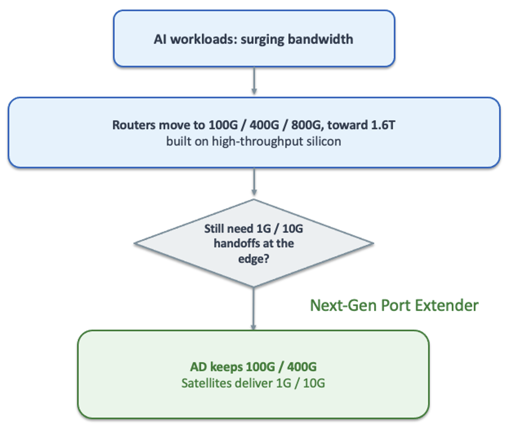
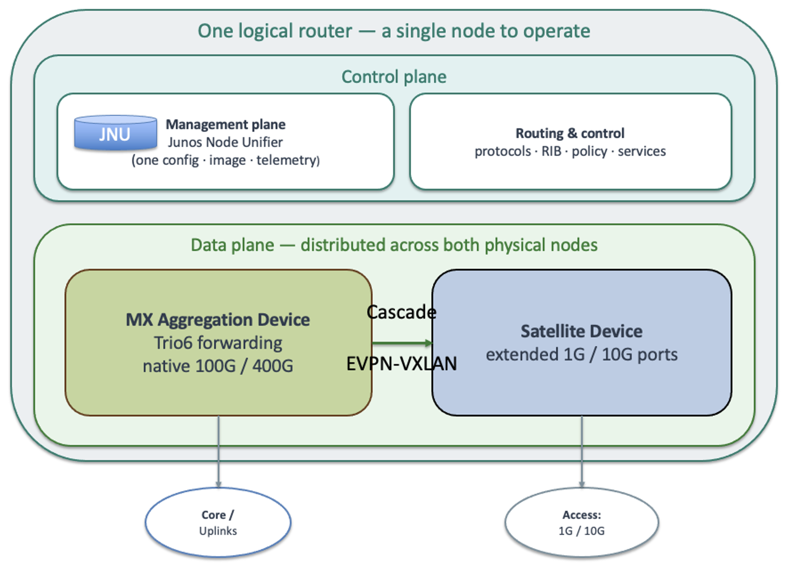
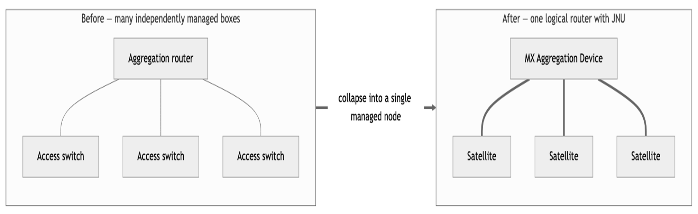
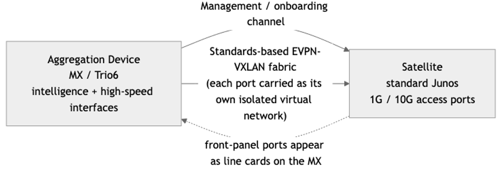
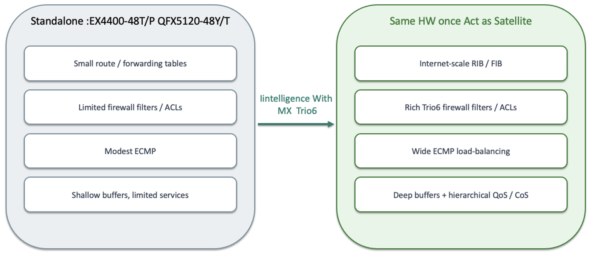
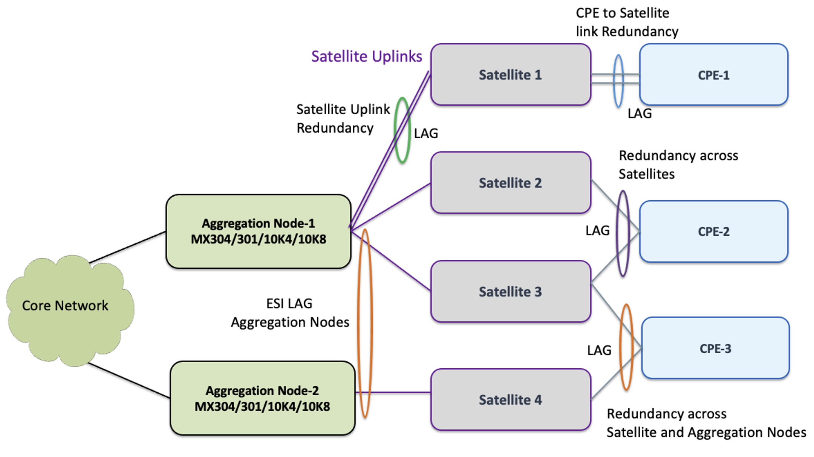

# Next Generation Port Extender (NGPE): The Right Interface Speed on the Right Box, for the AI Era

**Pankaj Kumar - 07/27/2026**

## Why we need this NGPE Solution

1. You waste valuable space. Faceplate and slot real estate on a high-capacity platform is precious. Filling it with 1G/10G ports consumes room that should be carrying high-speed interfaces.
2. You can't enjoy the full capacity of the ASIC. A forwarding engine built to move terabits ends up tied down serving a handful of 1G/10G handoffs. The expensive, high-throughput silicon is underutilized: you paid for capacity you can't use.

## Next Generation Port Extender

- The aggregation device keeps the high-speed interfaces: native 100G/400G facing the core and uplinks: and its high-throughput Trio6 silicon stays fully utilized doing what it's built for.
- The satellites provide the low-speed ports: native 1G/10G handoffs: at a fraction of the cost and without consuming slots on the high-capacity router.

The satellites' front-panel ports appear on the aggregation device as if they were native line-card ports. Add a satellite, and you've added 1G/10G ports: not another router to manage. And because the forwarding intelligence stays on the MX and its Trio6 silicon, every inexpensive satellite port inherits carrier-class capability it could never deliver on its own. Cheap ports, MX-grade scale.

**The satellite gives you the ports. The MX gives them superpowers.**

## Simplify the Network: Many Boxes, One Logical Router

## How it works

- The MX aggregation device owns the intelligence. All routing, forwarding, policy, and services live on the MX and its Trio6 forwarding silicon.
- Satellites project ports back to the MX. Each satellite connects over a cascade link and becomes, in effect, a remote line card; its 1G/10G front-panel ports show up on the MX and are managed there.
- A standards-based EVPN-VXLAN fabric carries the traffic. The cascade carries a management/onboarding channel plus a standards-based EVPN-VXLAN fabric, with each extended port carried as its own isolated virtual network: proven, scalable technology operators already run in their data-center and metro fabrics.
- Satellites run standard Junos. JNU satellites are ordinary Junos switches, not a special version-locked image: so you get broad, modern hardware choices and can mix satellite models behind one aggregation device.
- One point of management. The system is defined on the aggregation device, and satellite provisioning is rendered and pushed automatically.

## NGPE Satellite with Trio6

- Grow ports, not managed nodes. Extend the MX with cost-effective satellite shelves instead of deploying more full routers: and pay as you grow.
- Keep the high-capacity router efficient. No more stranding terabit-class silicon or premium slots on 1G/10G handoffs.
- Standard based Fabric. Fabric is built with standard EVPN-VXLAN no more Specific TAG or proprietary mechanism to forward packets.

## The operational game-changer: zero fabric engineering

## From first-generation port extenders to the next generation

- Proprietary transport and silicon that lock you to one vendor's satellites
- A special satellite software image, lifecycle-locked to the aggregation device
- A limited, aging set of qualified satellite hardware
- A rigid or hand-built fabric that's complex to stand up and operate
- Per-port scale bounded by the low-cost satellite
- A legacy lifecycle and an uncertain roadmap

JNU is the next generation. For operators running Junos Fusion today, moving to it is an evolution, not a reinvention: the MX stays the aggregation device, the satellites become modern standard-Junos switches, and the whole system lands on an open, automated, standards-based fabric: one you never have to build.

But across every vendor, first-generation port extenders share the same pain points:

| Dimension | First-Generation Port Extenders | Next-Generation Port Extender with JNU |
|:--|:--|:--|
| Model | AD + satellites as one logical node | Same: one logical router |
| Transport / data plane | Proprietary satellite extension or (802.1BR) | Standards-based EVPN-VXLAN |
| Satellite software | Special image, lifecycle-locked to the AD | Standard Junos Software |
| Satellite hardware | Limited, aging qualified SKUs | HW can be anything EX,QFX,ACX or could be 3rd Party |
| Fabric setup | Rigid / hand-built, complex to operate | Fully automated: OSPF + EVPN-VXLAN built by JNU + commit scripts; no fabric to build |
| Openness | Proprietary, one vendor's satellites only | Open by design: extensible to third-party nodes |
| Lifecycle / roadmap | Legacy, steady-state | Actively developed go-forward |

## Why it matters

- Built for the AI-era edge. Keep the aggregation router's high-speed interfaces and high-throughput silicon fully utilized, while satellites handle the 1G/10G handoffs: no wasted slots, no stranded ASIC capacity.
- Best-of-both economics. Low-cost satellites deliver the ports; the MX with Trio6 delivers the scale and features. Stop over-buying routers just to get capable low-speed ports.
- Zero fabric engineering. JNU and its commit scripts build and maintain the entire OSPF + EVPN-VXLAN fabric for you: fabric-grade capability with none of the fabric work.
- The next-generation upgrade path. As the successor to first-generation port extenders like Junos Fusion, JNU is where Juniper's active investment and the MX roadmap are heading.

## Use cases: Next Gen port Extender delivers

Because Next Gen Port Extender is really “carrier-class ports, delivered cheaply and managed as one logical node,” it maps onto a set of well-defined service-provider and data-center deployments. These are the primary Next-Generation Port Extender use cases.

### Provider Edge (SP / Telco)

The MX is a regular P/PE router in the service-provider or telco network, delivering full L2/L3 VPN and EVPN services. Satellites (EX/QFX) connect to the MX directly or across an intervening L1/L2 network and fan out 1G/10G/25G customer-facing ports

### Low-speed peering

The MX becomes a peering aggregation point. Many peering partners land on 1G/10G/25G interfaces (or sub-interfaces) through the satellites and run EBGP to the MX — no MPLS required. All routing intelligence and the full peering table stay concentrated on the MX; the satellites simply add port density.

### DC collapsed spine (small / medium DC)

In a small or medium data center, the MX acts as the collapsed spine: WAN ports terminate directly on the MX, and access interfaces fan out across the satellites — spine plus access in one logical box. It is ideal wherever you need large numbers of low-speed interfaces. NGPE: collapse spine and access into a single logical router — WAN on the MX, dense low-speed access on satellites.

### DC border leaf

The AD/SD pair acts as a border leaf in a spine-leaf fabric, handling low-speed interfaces plus MPLS to EVPN/VXLAN stitching. The MX brings higher firewall-filter scale, larger MAC scale, and peering with a full Internet routing table, while the satellites supply the port fan-out. JNU value: a border-leaf gateway with MPLS/EVPN-VXLAN stitching, full-table peering, and high filter/MAC scale — plus satellite port density.

Across all four, the pattern is the same: the MX keeps the high-speed interfaces and the intelligence; the satellites deliver the low-speed ports; you manage one logical router.

### Redundancy Deployment Models

1. Cascade / uplink link redundancy: The satellite's uplink to the aggregation device is a LACP LAG (SD <-> AD cascade Protects the AD<->SD link.
2. Single-homed CPE with LAG to one satellite: The CPE attaches to a single SD over a standard LAG across two access ports on that satellite. Refer CPE-2
3. CPE multihomed across two satellites: The CPE is dual homed to two different SDs so losing an entire satellite fails traffic to the second Protects against loss of a whole satellite (SD). Refer CPE-3
4. Full AD + SD node redundancy via ESI-LAG: The highest tier: the CPE runs a standard LAG on its side, while on the aggregation side two ADs present a shared EVPN ESI-LAG toward the satellites. This survives a cascade-link failure, a full satellite failure, and a complete aggregation-device failure: no single point of failure end to end. Protects satellite + aggregation node together. Refer CPE-3

## Key takeaways

- Right speed, right box. High-speed 100G/400/800G stays on the MX; 1G/10G lives on low-cost satellites.
- One logical router. Two (or many) physical boxes, one control and management plane, one node to operate.
- Cheap ports, carrier-class scale. Satellite ports inherit full MX/Trio6 routing, filtering, ECMP, and QoS.
- Zero fabric engineering. JNU + commit scripts build and maintain the OSPF + EVPN-VXLAN fabric automatically.
- Open Standards-based EVPN-VXLAN, flexible across HPE's routing portfolio, extensible to third-party nodes.
- The next-gen upgrade. An evolution from first-generation port extenders like Junos Fusion: keep the model, modernize the foundation.

## Supported platforms

| Role | Supported Platforms |
|:--|:--|
| Aggregation Device (AD) | MX304, MX10K(LC4800,LC9600), MX301*(RoadMap) |
| Satellite Device (SD) | EX-440048T/P , QFX5120-48T/Y, ACX*(RoadMap) |

## Conclusion: Ready to build the AI-era edge?

As bandwidth demands climb, the smart move isn’t to consolidate every port speed onto one expensive platform — it’s to put each interface where it belongs. NGPE lets your aggregation router do what it’s built for at 100G/400G and beyond, while low-cost satellites land the 1G/10G ports with full MX/Trio6 scale behind them — and JNU automates the entire fabric so you never have to build it.
Right interface speed on the right box, carrier-class scale where it counts — that’s Next Generation Port Extender.

## Useful links

- https://www.juniper.net/documentation/us/en/software/junos/ngpe/topics/concept/ngpe-overview.html

## Glossary

- JNU: Junos Node Unifier
- AD: Aggregation Device
- SD: Satellite Device
- NGPE: Next Generation Port Extender

## Acknowledgments

Krzysztof Szarkowicz, Anand Beedi and Pankaj Gupta
