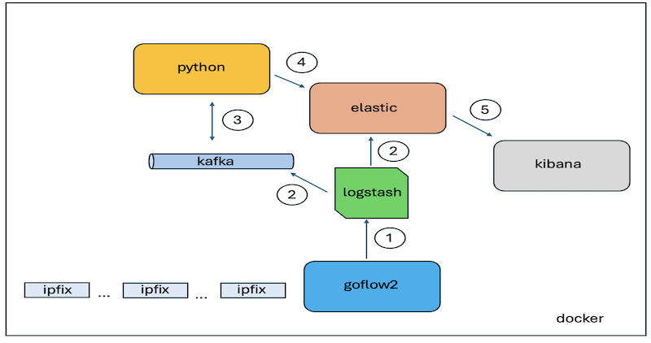
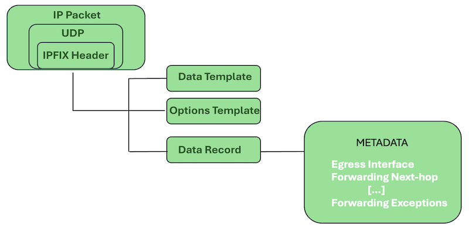
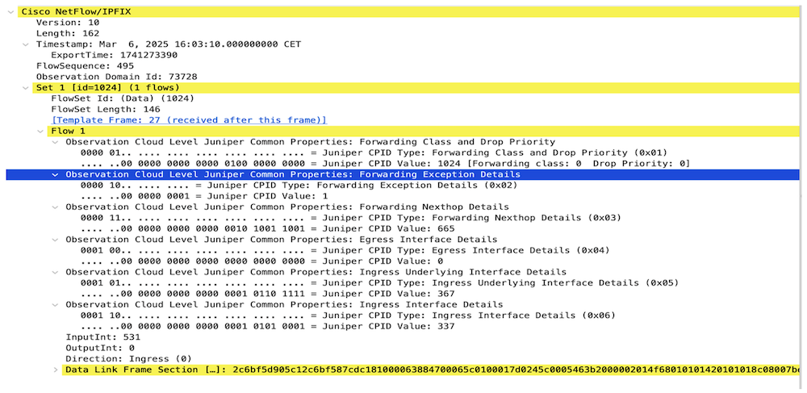
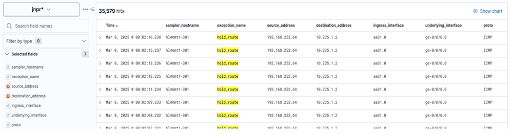
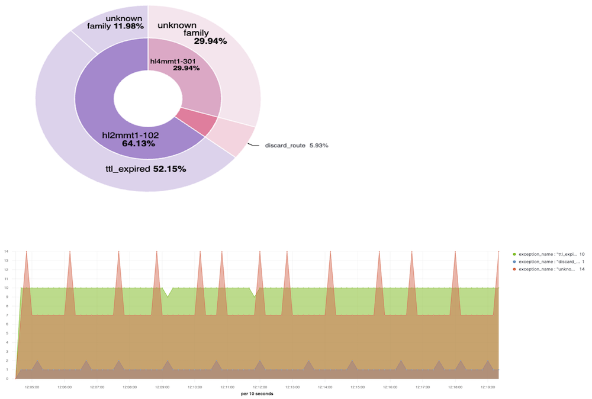

# Open-Source Monitoring of Network Forwarding Exceptions: A Practical Approach

**Pablo Sagrera Garcia - 04/30/2025**

In Julian Lucek's blog post, [Detection of Blackholes in Networks Using JRI](https://juniper.github.io/techposts/detection-of-blackholes-in-networks-using-jri/article), he explores how Juniper's JRI (Juniper Resiliency Interface) can be leveraged to detect blackholes in networks. Expanding on that idea, c

## The Importance of Exception Monitoring

Detecting blackholes is only one aspect of ensuring network health. Understanding why certain packets are dropped is equally crucial. Exception codes in Juniper routers provide valuable insight into such events, allowing network operators to take corrective actions quickly.

## Introducing an Open-Source Solution

To facilitate real-time monitoring of exceptions, we propose using a combination of:

- **Goflow2** as a baseline to collect IPFIX packets coming from Junos devices with inline monitoring feature activated.
- **Kafka** for message queuing and efficient data processing.
- **Elasticsearch** and **Kibana** for indexing and visualization.
- **Logstash Processing**: Applies filtering, caching, and transformation logic.
- Custom **Python script to convert interface index into an** interface name.

## High-Level Architecture



The solution is deployed within a Docker containerized environment to ensure scalability and ease of management. Network forwarding exceptions are transmitted to a dedicated collector from the devices using the IPFIX protocol.

The process begins with **goflow2**, which acts as the flow collector and decoder. It efficiently processes incoming IPFIX data and forwards the decoded information to **Logstash**. Logstash is configured to filter and enrich the data, subsequently routing it to both **Kafka** and **Elasticsearch**. Kafka serves as a robust messaging bus, facilitating reliable data streaming, while Elasticsearch enables immediate indexing for search and analytics.

To enhance data clarity, a custom **Python script** consumes messages from **Kafka**, transforming specific fields into human-readable names. The enriched data is then re-inserted into **Elasticsearch** under a separate index to distinguish it from the raw data.

Finally, the processed data is visualized in **Kibana**, providing intuitive dashboards and insights for network exception monitoring.

## Low-Level Architecture

The foundation of the monitoring solution lies in how IPFIX packets are structured and processed. Below is an overview of the IPFIX packet format as received from network devices:



[RFC7011](https://www.rfc-editor.org/rfc/rfc7011) defines three packet types used by IPFIX: *data template record, options template record *and* data record. *

*Source: [Juniper Community - Packets Lost in Transit](https://juniper.github.io/techposts/packets-lost-in-transit/article)*



## Data Processing with Goflow2

**Goflow2** is a NetFlow/IPFIX/sFlow collector in Go. It gathers network information (IP, interfaces, routers) from different flow protocols, serializes it in a common format.

"*In the case of exotic template fields or extra payload not supported by GoFlow2 of out the box, it is possible to pass a mapping file using
**-mapping mapping.yaml**.*"

*Source: [https://github.com/netsampler/goflow2](https://github.com/netsampler/goflow2) *

In our case, we need to use a mapping file to decode METADATA information.

```
formatter:
  fields:
    - juniper_properties
  key:
    - sampler_address
  protobuf:
    - name: juniper_properties
      index: 1001
      type: varint
      array: true
ipfix:
  mapping:
    - field: 137 # Juniper Properties
      destination: juniper_properties
      penprovided: true # has an enterprise number
      pen: 2636 # Juniper enterprise  protobuf
```

This configuration  will produce something like this:

**juniper_properties**:[67108864,2082,201326592,268435456,402653526], where each element of the array corresponds to an element ID of 137 (Common Properties ID), associated with Juniper's Private Enterprise Number 2636 [allocated by IANA](https://www.iana.org/assignments/enterprise-numbers/enterprise-numbers).

## Data Processing with Logstash

Logstash plays a critical role in processing and transforming the raw data received from the IPFIX collector. Its configuration is structured into three main components: input, filter, and output.

### 1. Input

The input section defines the source of the data to be processed. In this case, it is configured to read from the **goflow2** log file containing the decoded IPFIX data. This ensures that Logstash ingests all relevant flow records for further processing.

```
input {
    gelf {
        port => 12201
    }
    file {
        path => "/var/log/goflow/goflow2.log"
        type => "log"
    }
}
```

### 2. Filter

The filter section is responsible for transforming and enriching the data. Here, Logstash parses the incoming JSON structures, extracting key information and converting array values into more understandable, human-readable formats. Specifically, it maps **forwarding exception codes** to their corresponding exception names, enhancing data clarity and making it easier to interpret in subsequent analysis.

[output truncated for brevity]

```
filter {
        json {
            source => "message"
            target => "flow"
            remove_field => ["message"]
        }

        if [flow][juniper_properties] {
            mutate {
                add_field => {
                    "cpid-forwarding-exception-code" => "%{[flow][juniper_properties][1]}"
                    "cpid-forwarding-nexthop-id" => "%{[flow][juniper_properties][2]}"
                    "cpid-egress-interface-index" => "%{[flow][juniper_properties][3]}"
                    "cpid-forwarding-class" => "%{[flow][juniper_properties][0]}"
                    "cpid-underlying-ingress-interface-index" => "%{[flow][juniper_properties][4]}"
                    "cpid-ingress-interface-index" => "%{[flow][juniper_properties][5]}"
                }
                convert => {
                    "cpid-forwarding-exception-code" => "integer"
                    "cpid-forwarding-nexthop-id" => "integer"
                    "cpid-egress-interface-index" => "integer"
                    "cpid-forwarding-class" => "integer"
                    "cpid-underlying-ingress-interface-index" => "integer"
                    "cpid-ingress-interface-index" => "integer"
                }
            }
        }
```

### 3. Output

Finally, the output section specifies the destination for the processed data. In this architecture, Logstash routes the transformed data to two critical endpoints:

- **Kafka**: For asynchronous processing and integration with other systems.
- **Elasticsearch**: For immediate indexing and visualization in **Kibana**.

```
output {
    stdout {
        codec => rubydebug 
    }
    elasticsearch {
        hosts => ["elasticsearch:9200"]
        index => "jri-%{+YYYY-MM-dd}"
    }
    kafka {
        bootstrap_servers => "kafka:9092"
        topic_id => "jri"
        codec => json
    }
}
```

## Data Transformation with Python

To enhance data clarity and usability, a Python script is employed to consume messages from the Kafka bus and perform essential transformations. The primary objective is to convert certain indexed fields into human-readable names, ensuring that the data presented in Elasticsearch is both meaningful and actionable.

Key transformations include:

- **cpid-egress-interface-index, cpid-ingress-interface-index, and cpid-underlying-ingress-interface-index**: These fields, initially received as numerical indices, are mapped to their corresponding interface names. This conversion simplifies the interpretation of network data and aids in troubleshooting and analysis.

To optimize performance and reduce unnecessary load on network devices, the script implements a simple **caching mechanism**. This cache stores recent query results, allowing the script to quickly retrieve interface names for known indices without repeatedly querying the devices. This approach significantly reduces the number of SSH connections, enhancing efficiency and minimizing potential network impact.

Once the transformation is complete, the enriched data is re-inserted into Elasticsearch under a distinct index, ensuring clear data segregation and facilitating more refined visualization in Kibana

```
2025-03-07 17:34:13 INFO: [MainThread] Received message: {"cpid-forwarding-class":"1024","cpid-forwarding-exception-name":"discard_route",
"cpid-forwarding-exception-code":"66","host":{"name":"30fbcef85f19"},"@timestamp":"2025-03-07T17:34:12.988467412Z",
"@version":"1","type":"log","cpid-forwarding-nexthop-id":"0","cpid-ingress-interface-index":"346",
"event":{"original":"{\"type\":\"IPFIX\",\"juniper_properties\":[67109888,2242,201326592,268435456,335544712,402653530]
2025-03-07 17:34:13 INFO: Key "Device(192.168.252.66)" found in cache! (TTL: 0:03:42.400630)
2025-03-07 17:34:13 INFO: Key "hl4mmt1-301" found in cache! (TTL: 0:04:33.949794)
2025-03-07 17:34:13 INFO: Key "ae31.0" found in cache! (TTL: 0:04:38.594929)
```

## Data Visualization with Kibana

With the data successfully ingested into **Elasticsearch** under two distinct indices, one from **Logstash** and another from the **Python transformation script**, the final step involves visualizing this information using **Kibana**.

To enable this, two separate **index patterns** are created in Kibana, each corresponding to its respective Elasticsearch index. These patterns allow Kibana to recognize and organize the data for effective querying and visualization.

Once configured, users can leverage Kibana's powerful dashboard capabilities to:

- **Select and display specific fields**, such as interface names, exception codes, or timestamps.



- **Create custom visualizations** from tables and graphs to complex charts, tailored to monitoring and reporting needs.



## Summary

This practical approach to open-source monitoring of network forwarding exceptions demonstrates how a containerized ecosystem can efficiently process and visualize complex network data.

Key components of the architecture include:

- **Goflow2** for decoding and forwarding IPFIX data.
- **Logstash** for filtering and routing data to both Kafka and Elasticsearch.
- A **Python** transformation script that enriches the data by converting raw indices into meaningful interface names, leveraging caching to optimize device interactions.
- **Kibana** for intuitive data visualization and analysis, enabling quick identification of forwarding exceptions and deeper insights into network behavior.

This framework not only highlights the power of open-source solutions but also sets the foundation for future enhancements---whether it's integrating more advanced analytics, refining visualizations, or expanding to broader monitoring use cases.

## Useful links

- goflow2: [https://github.com/netsampler/goflow2](https://github.com/netsampler/goflow2)
- elastic: [https://www.elastic.co/](https://www.elastic.co/)
- logstash: [https://www.elastic.co/logstash](https://www.elastic.co/logstash)
- Monitoring, Sampling, and Collection Services Interfaces User Guide: [https://www.juniper.net/documentation/us/en/software/junos/flow-monitoring/topics/topic-map/resiliency-exception-reporting.html](https://www.juniper.net/documentation/us/en/software/junos/flow-monitoring/topics/topic-map/resiliency-exception-reporting.html)
- [TechPost] Detection of Blackholes Using Juniper Resiliency Interface: [https://juniper.github.io/techposts/detection-of-blackholes-in-networks-using-jri/article](https://juniper.github.io/techposts/detection-of-blackholes-in-networks-using-jri/article)
- [TechPost] [https://juniper.github.io/techposts/packets-lost-in-transit/article](https://juniper.github.io/techposts/packets-lost-in-transit/article)
- [RFC] Specification of the IP Flow Information Export (IPFIX) Protocol for the Exchange of Flow Information: [https://www.rfc-editor.org/rfc/rfc7011](https://www.rfc-editor.org/rfc/rfc7011)
- [IANA] PRIVATE ENTERPRISE NUMBERS: [https://www.iana.org/assignments/enterprise-numbers/enterprise-numbers](https://www.iana.org/assignments/enterprise-numbers/enterprise-numbers)
- MPLS path trace: [https://dev.azure.com/psagrera/mpls-core-path-tracing](https://dev.azure.com/psagrera/mpls-core-path-tracing)
- PFE exceptions monitoring: [https://dev.azure.com/psagrera/mini-open-nti](https://dev.azure.com/psagrera/mini-open-nti)

## Glossary

- IANA: Internet Assigned Numbers Authority
- IPFIX: Intenet Protocol Flow Information Export
- JRI: Juniper Resilience Interface
